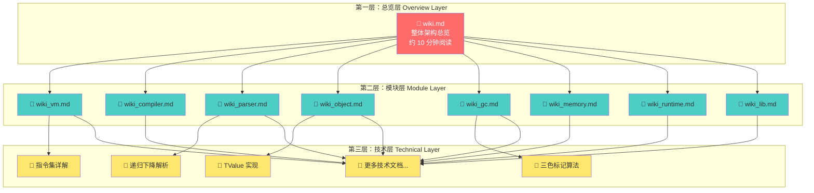
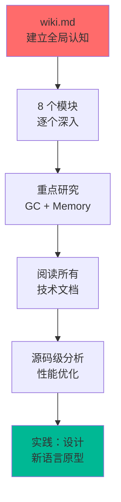

# 📚 Lua 5.1.5 源码文档体系说明

<div align="center">

**分层架构 · 渐进式学习 · 源码级解析**

[📖 开始阅读](wiki.md) · [🏗️ 文档结构](#-文档架构设计) · [🎓 学习指南](#-学习路线图) · [🤝 贡献指南](#-贡献指南)

</div>

---

## 🎯 项目概述

本文档项目致力于为 Lua 5.1.5 源码学习者提供**系统化、分层次、易理解**的技术文档。通过精心设计的三层文档架构，帮助不同层次的开发者快速掌握 Lua 的核心实现。

### 核心特色

| 特色 | 说明 |
|------|------|
| 🏗️ **三层架构** | 总览 → 模块 → 技术细节，层次清晰 |
| 📊 **可视化** | Mermaid 图表、UML 类图、流程图 |
| 💡 **实践导向** | 代码示例、调试技巧、性能分析 |
| 🔄 **交叉引用** | 完善的文档间链接网络 |
| 📈 **渐进式** | 支持多种学习路径和节奏 |

---

## 🏗️ 文档架构设计

本文档体系采用**金字塔式三层架构**，从宏观到微观逐层深入：



### 第一层：总览层（Overview Layer）

**文件**：[`wiki.md`](wiki.md)

**作用**：文档体系的**唯一入口**，提供 Lua 源码的鸟瞰视图。

<details>
<summary><b>📋 包含内容（点击展开）</b></summary>

- ✅ Lua 核心概念与应用场景
- ✅ 整体架构图（分层架构、模块依赖、数据结构关系）
- ✅ 8 大核心模块概览（vm、compiler、parser、object、gc、memory、runtime、lib）
- ✅ 数据流转完整过程（词法→语法→编译→执行）
- ✅ 性能优化技术总结
- ✅ 学习路径指南（3 种角色定制路径）
- ✅ 调试工具与常见问题 FAQ
- ✅ 扩展资源（论文、书籍、社区）

</details>

**阅读时间**：10-15 分钟  
**适用对象**：所有学习者（必读）

---

### 第二层：模块层（Module Layer）

**文件命名**：`模块目录/wiki_模块名.md`

**作用**：提供每个模块的**中观视图**，连接总览和技术细节。

#### 模块列表

| 模块 | 文档 | 核心职责 | 关键技术 |
|------|------|---------|---------|
| 🖥️ **虚拟机** | [vm/wiki_vm.md](vm/wiki_vm.md) | 字节码解释执行 | 寄存器式指令集、执行循环 |
| ⚙️ **编译器** | [compiler/wiki_compiler.md](compiler/wiki_compiler.md) | 源码→字节码 | 代码生成、寄存器分配 |
| 📖 **解析器** | [parser/wiki_parser.md](parser/wiki_parser.md) | 语法分析 | 递归下降、表达式优先级 |
| 🧩 **对象系统** | [object/wiki_object.md](object/wiki_object.md) | 数据类型实现 | TValue、Table 混合结构 |
| 🗑️ **垃圾回收** | [gc/wiki_gc.md](gc/wiki_gc.md) | 自动内存回收 | 三色标记、增量 GC |
| 💾 **内存管理** | [memory/wiki_memory.md](memory/wiki_memory.md) | 内存分配 | 统一分配接口、内存统计 |
| 🔄 **运行时** | [runtime/wiki_runtime.md](runtime/wiki_runtime.md) | 调用栈管理 | CallInfo、错误处理、协程 |
| 📚 **标准库** | [lib/wiki_lib.md](lib/wiki_lib.md) | 内置函数 | C API、字符串模式匹配 |

<details>
<summary><b>📋 每个模块文档包含（点击展开）</b></summary>

- ✅ 模块核心职责与实现文件
- ✅ 关键技术点概述（不涉及过多细节）
- ✅ 核心数据结构简介
- ✅ 性能特点与设计权衡
- ✅ 示例代码片段
- ✅ 指向技术层文档的链接

</details>

**阅读时间**：每个模块 5-10 分钟  
**适用对象**：对某个模块感兴趣的学习者

---

### 第三层：技术层（Technical Layer）

**文件命名**：`模块目录/技术主题.md`

**作用**：提供某个技术点的**微观深度解析**。

#### 已完成的技术文档

| 文档 | 模块 | 技术主题 | 深度 |
|------|------|---------|------|
| [instruction_set.md](vm/instruction_set.md) | VM | Lua 指令集完整参考 | ⭐⭐⭐⭐⭐ |
| [tri_color_marking.md](gc/tri_color_marking.md) | GC | 三色标记算法详解 | ⭐⭐⭐⭐⭐ |
| [tvalue_implementation.md](object/tvalue_implementation.md) | Object | TValue 统一值表示 | ⭐⭐⭐⭐⭐ |
| [recursive_descent.md](parser/recursive_descent.md) | Parser | 递归下降解析原理 | ⭐⭐⭐⭐⭐ |

#### 待创建的技术文档（扩展计划）

<details>
<summary><b>🚀 VM 模块（点击展开）</b></summary>

- `execution_loop.md` - 执行循环实现细节
- `register_management.md` - 虚拟寄存器管理
- `opcode_encoding.md` - 指令编码格式
- `metamethod_dispatch.md` - 元方法分发机制

</details>

<details>
<summary><b>🚀 Compiler 模块（点击展开）</b></summary>

- `lexer_implementation.md` - 词法分析器实现
- `codegen_algorithm.md` - 代码生成算法
- `register_allocation.md` - 寄存器分配策略
- `constant_folding.md` - 常量折叠优化

</details>

<details>
<summary><b>🚀 Object 模块（点击展开）</b></summary>

- `table_structure.md` - Table 混合结构详解
- `string_interning.md` - 字符串池化机制
- `closure_implementation.md` - 闭包实现
- `metatable_mechanism.md` - 元表机制

</details>

<details>
<summary><b>🚀 GC 模块（点击展开）</b></summary>

- `incremental_gc.md` - 增量回收算法
- `write_barrier.md` - 写屏障技术
- `finalizer.md` - 终结器实现
- `weak_table.md` - 弱引用表

</details>

<details>
<summary><b>🚀 其他模块（点击展开）</b></summary>

- `memory/allocator_design.md` - 内存分配器设计
- `runtime/callstack_management.md` - 调用栈管理
- `runtime/coroutine_implementation.md` - 协程实现
- `lib/string_pattern_matching.md` - 字符串模式匹配

</details>

<details>
<summary><b>📋 每个技术文档包含（点击展开）</b></summary>

- ✅ 技术原理深度讲解
- ✅ 实现细节与源码分析
- ✅ 完整代码示例
- ✅ 图表（流程图、状态机、数据结构）
- ✅ 实践建议与调试技巧
- ✅ 性能考量与优化方向

</details>

**阅读时间**：每个技术文档 15-30 分钟  
**适用对象**：需要深入理解某个技术的学习者

---

## 🎓 学习路线图

根据您的背景和目标，我们提供了**4 种定制化学习路径**：

### 路径 1️⃣：嵌入式开发者（1-2 周）

**目标**：掌握 Lua C API，将 Lua 嵌入到 C/C++ 程序。


**学习检查点**：
- [ ] 能解释 `lua_State` 和栈操作
- [ ] 会使用 `lua_pushXXX` 和 `lua_toXXX` 系列函数
- [ ] 能注册 C 函数到 Lua
- [ ] 理解 `lua_pcall` 的错误处理机制

---

### 路径 2️⃣：虚拟机爱好者（2-4 周）

**目标**：理解字节码虚拟机的设计与实现。


**学习检查点**：
- [ ] 能读懂 `luac -l` 输出的字节码
- [ ] 理解寄存器式 VM 与栈式 VM 的区别
- [ ] 掌握 `luaV_execute` 的核心循环
- [ ] 能为 Lua 添加自定义指令

---

### 路径 3️⃣：编译器开发者（3-5 周）

**目标**：深入理解编译器前端（词法、语法、代码生成）。


**学习检查点**：
- [ ] 理解 LL(1) 语法和递归下降算法
- [ ] 掌握 Pratt 解析器处理表达式
- [ ] 了解寄存器分配和代码生成
- [ ] 能修改 Lua 语法并生成正确字节码

---

### 路径 4️⃣：系统架构师（4-8 周）

**目标**：全面理解 Lua 的系统设计，能设计自己的脚本语言。



**学习检查点**：
- [ ] 理解所有 8 个核心模块的设计决策
- [ ] 掌握三色标记增量 GC 的完整实现
- [ ] 能分析和优化 Lua 程序性能
- [ ] 能独立设计一个玩具语言

---

### 路径 5️⃣：快速查阅模式

**适用场景**：已有一定基础，需要快速查阅特定技术。


**使用建议**：
1. 使用 `Ctrl+F` 在 `wiki.md` 中搜索关键词
2. 跳转到相关模块总览文档
3. 找到对应的技术文档深入阅读
4. 结合源码 `lua_c_analysis/src/` 验证理解

---

## 📁 文档目录结构

```plaintext
docs/
│
├── 📄 README.md                     ← 你在这里（文档体系说明）
├── 📄 wiki.md                       ← 从这里开始（总入口）
│
├── 📂 vm/                           虚拟机模块
│   ├── 📘 wiki_vm.md               ✅ 模块总览
│   ├── 📝 instruction_set.md       ✅ Lua 38 条指令详解
│   ├── 📝 execution_loop.md        🚧 执行循环实现
│   ├── 📝 register_management.md   🚧 虚拟寄存器管理
│   └── 📝 metamethod_dispatch.md   🚧 元方法分发
│
├── 📂 compiler/                     编译器模块
│   ├── 📘 wiki_compiler.md         ✅ 模块总览
│   ├── 📝 lexer_implementation.md  🚧 词法分析器
│   ├── 📝 codegen_algorithm.md     🚧 代码生成算法
│   ├── 📝 register_allocation.md   🚧 寄存器分配
│   └── 📝 constant_folding.md      🚧 常量折叠优化
│
├── 📂 parser/                       解析器模块
│   ├── 📘 wiki_parser.md           ✅ 模块总览
│   ├── 📝 recursive_descent.md     ✅ 递归下降算法
│   ├── 📝 expression_parsing.md    🚧 表达式解析（Pratt）
│   └── 📝 scope_management.md      🚧 作用域管理
│
├── 📂 object/                       对象系统模块
│   ├── 📘 wiki_object.md           ✅ 模块总览
│   ├── 📝 tvalue_implementation.md ✅ TValue 统一值表示
│   ├── 📝 table_structure.md       🚧 Table 混合结构
│   ├── 📝 string_interning.md      🚧 字符串池化
│   ├── 📝 closure_implementation.md🚧 闭包实现
│   └── 📝 metatable_mechanism.md   🚧 元表机制
│
├── 📂 gc/                           垃圾回收模块
│   ├── 📘 wiki_gc.md               ✅ 模块总览
│   ├── 📝 tri_color_marking.md     ✅ 三色标记算法
│   ├── 📝 incremental_gc.md        🚧 增量回收
│   ├── 📝 write_barrier.md         🚧 写屏障技术
│   ├── 📝 finalizer.md             🚧 终结器
│   └── 📝 weak_table.md            🚧 弱引用表
│
├── 📂 memory/                       内存管理模块
│   ├── 📘 wiki_memory.md           ✅ 模块总览
│   ├── 📝 allocator_design.md      🚧 分配器设计
│   └── 📝 memory_profiling.md      🚧 内存分析
│
├── 📂 runtime/                      运行时模块
│   ├── 📘 wiki_runtime.md          ✅ 模块总览
│   ├── 📝 callstack_management.md  🚧 调用栈管理
│   ├── 📝 coroutine_implementation.md 🚧 协程实现
│   └── 📝 error_handling.md        🚧 错误处理机制
│
└── 📂 lib/                          标准库模块
    ├── 📘 wiki_lib.md              ✅ 模块总览
    ├── 📝 string_pattern_matching.md 🚧 模式匹配
    ├── 📝 table_operations.md      🚧 表操作
    └── 📝 io_implementation.md     🚧 I/O 实现

图例：
✅ 已完成    🚧 规划中（欢迎贡献）
📄 指南文档  📘 模块总览  📝 技术文档  📂 模块目录
```

### 文档完成度统计

| 层级 | 已完成 | 规划中 | 完成率 |
|------|--------|--------|--------|
| **第一层（总览）** | 2/2 | 0 | 100% ✅ |
| **第二层（模块）** | 8/8 | 0 | 100% ✅ |
| **第三层（技术）** | 4/30+ | 26+ | 13% 🚧 |

> **贡献提示**：标记为 🚧 的文档欢迎社区贡献！参见 [贡献指南](#-贡献指南)。

---

## 🛠️ 使用技巧

### 快速导航

在 VS Code 中打开文档后，使用以下快捷方式：

| 快捷键 | 功能 | 说明 |
|--------|------|------|
| `Ctrl+Shift+O` | 大纲视图 | 快速跳转到文档章节 |
| `Ctrl+F` | 搜索 | 在当前文档中搜索关键词 |
| `Ctrl+P` | 文件跳转 | 输入文件名快速打开 |
| `Ctrl+Click` | 链接跳转 | 点击 Markdown 链接跳转 |

### 推荐插件

| 插件 | 作用 | 安装命令 |
|------|------|---------|
| **Markdown All in One** | 增强 Markdown 编辑 | `ext install yzhang.markdown-all-in-one` |
| **Markdown Preview Mermaid** | 渲染 Mermaid 图表 | `ext install bierner.markdown-mermaid` |
| **Better Comments** | 高亮注释 | `ext install aaron-bond.better-comments` |

### 配合源码阅读

```bash
# 1. 克隆源码到本地
cd lua_c_analysis/src

# 2. 使用 ctags 生成索引（可选）
ctags -R .

# 3. 在 VS Code 中打开项目
code .

# 4. 阅读文档时，使用 Ctrl+Click 跳转到源码定义
```

---

## 🤝 贡献指南

我们欢迎社区贡献，帮助完善这个文档项目！

### 贡献方式

<table>
<tr>
<th width="30%">贡献类型</th>
<th width="70%">具体方式</th>
</tr>

<tr>
<td>🐛 <b>修复错误</b></td>
<td>
• 发现技术错误或拼写错误<br/>
• 提交 Issue 或直接 Pull Request
</td>
</tr>

<tr>
<td>📝 <b>完善现有文档</b></td>
<td>
• 添加更多代码示例<br/>
• 补充图表和流程图<br/>
• 改进文档结构和表达
</td>
</tr>

<tr>
<td>✨ <b>创建新文档</b></td>
<td>
• 选择一个标记为 🚧 的技术文档<br/>
• 按照 <a href="#文档编写规范">编写规范</a> 撰写<br/>
• 提交 Pull Request
</td>
</tr>

<tr>
<td>💡 <b>提供反馈</b></td>
<td>
• 分享学习心得和建议<br/>
• 提出新的技术文档主题<br/>
• 在 Issue 区讨论
</td>
</tr>
</table>

### 文档编写规范

#### 第一层（总览层）规范

- **长度控制**：5000-8000 字
- **结构要求**：
  - 概述（是什么、为什么）
  - 架构图（Mermaid 图表）
  - 模块概览（简要介绍）
  - 学习路径（多种角色）
- **语言风格**：简明扼要，重点突出整体架构

#### 第二层（模块层）规范

- **长度控制**：2000-4000 字
- **必须包含**：
  - 模块职责（1-2 句话）
  - 实现文件列表
  - 关键技术表格
  - 核心数据结构简介
  - 代码示例（1-2 个）
  - 指向技术文档的链接
- **语言风格**：介绍核心技术，但不深入细节

#### 第三层（技术层）规范

- **长度控制**：3000-6000 字
- **必须包含**：
  - 技术原理详解
  - 源码分析（带行号引用）
  - 完整代码示例
  - Mermaid 图表（流程图/状态机/类图）
  - 实践建议
  - 性能分析
- **语言风格**：深入讲解，让读者充分理解技术原理

#### Markdown 格式规范

```markdown
# 一级标题（文档标题，只有一个）

## 二级标题（章节）

### 三级标题（小节）

#### 四级标题（细节）

- 使用 Mermaid 绘制图表
- 使用表格整理对比信息
- 使用代码块标注语言类型
- 使用引用块突出重点
- 添加目录导航（长文档）
```

### Pull Request 流程

1. **Fork** 本仓库
2. **创建分支**：`git checkout -b docs/your-topic`
3. **编写文档**，遵循上述规范
4. **本地预览**：确保 Mermaid 图表正常渲染
5. **提交 PR**，描述你的更改
6. **等待审核**，根据反馈修改

### 贡献者名单

感谢以下贡献者对本文档项目的支持：

<!-- 贡献者列表，由 GitHub Action 自动更新 -->
- **YanqingXu** - 项目维护者
- _（欢迎你的加入！）_

---

## 📊 项目统计

| 指标 | 数值 |
|------|------|
| 📄 **总文档数** | 12 个（已完成） |
| 📝 **总字数** | 约 50,000 字 |
| 🖼️ **Mermaid 图表** | 25+ 个 |
| 📋 **代码示例** | 40+ 个 |
| 🔗 **交叉引用** | 100+ 处 |
| ⏱️ **总阅读时间** | 约 4-6 小时 |

---

## 🔗 相关资源

### 官方资源

- [Lua 5.1 参考手册](https://www.lua.org/manual/5.1/) - 官方语言规范
- [Lua 源码下载](https://www.lua.org/ftp/) - 官方源码仓库
- [Lua 邮件列表](https://www.lua.org/lua-l.html) - 社区讨论

### 推荐阅读

- 📖 **Programming in Lua** (4th Edition) - Roberto Ierusalimschy
- 📄 **"The Implementation of Lua 5.0"** - 官方论文
- 📖 **Crafting Interpreters** - Robert Nystrom
- 🌐 [Lua Users Wiki](http://lua-users.org/wiki/) - 社区知识库

### 相关项目

- [LuaJIT](https://luajit.org/) - 高性能 JIT 编译器
- [Lua 5.3/5.4 源码](https://github.com/lua/lua) - 新版本源码
- [luac 反汇编工具](https://github.com/viruscamp/luadec) - 字节码工具

---

## 💬 反馈与支持

### 遇到问题？

- 🐛 **发现错误**：[提交 Issue](https://github.com/YanqingXu/lua_c_analysis/issues)
- 💡 **建议改进**：[开启 Discussion](https://github.com/YanqingXu/lua_c_analysis/discussions)
- 📧 **私信联系**：xyq949587362xyq007@gmail.com

### 支持项目

如果这个文档项目对你有帮助：

- ⭐ **Star** 本仓库
- 🔄 **分享**给更多 Lua 学习者
- 📝 **贡献**你的技术文档
- 💬 **反馈**你的学习体验

---

<div align="center">

## 🚀 开始你的 Lua 源码之旅

**[📖 阅读 wiki.md](wiki.md)** · **[🏗️ 浏览模块总览](#第二层模块层-module-layer)** · **[💡 查看学习路径](#-学习路线图)**

---

**📅 最后更新**：2025-10-24  
**📌 文档版本**：v2.0 (DeepWiki 优化版)  
**🔖 基于 Lua 版本**：5.1.5  
**📄 许可证**：[CC BY-SA 4.0](https://creativecommons.org/licenses/by-sa/4.0/)

*用心整理 · 持续更新 · 欢迎贡献*

</div>
