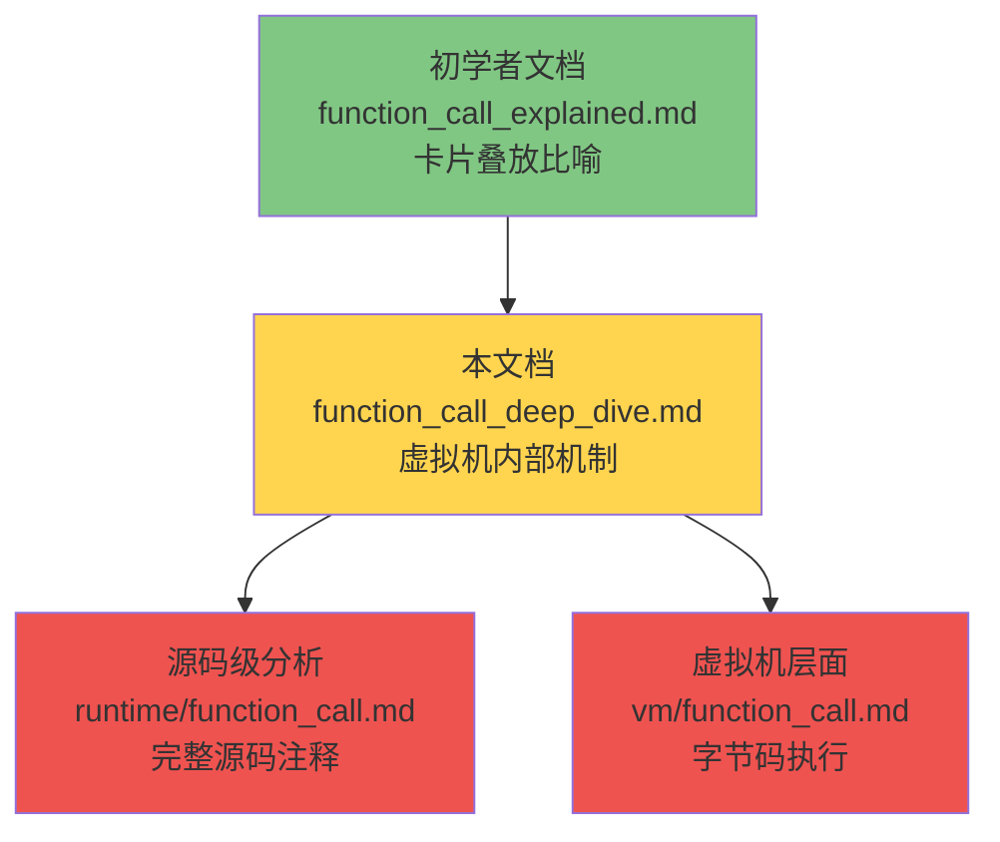
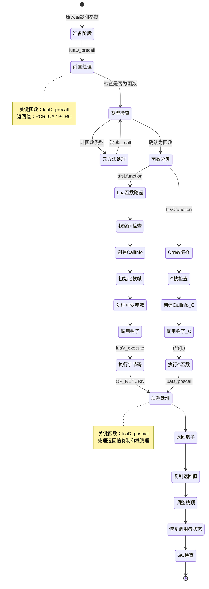
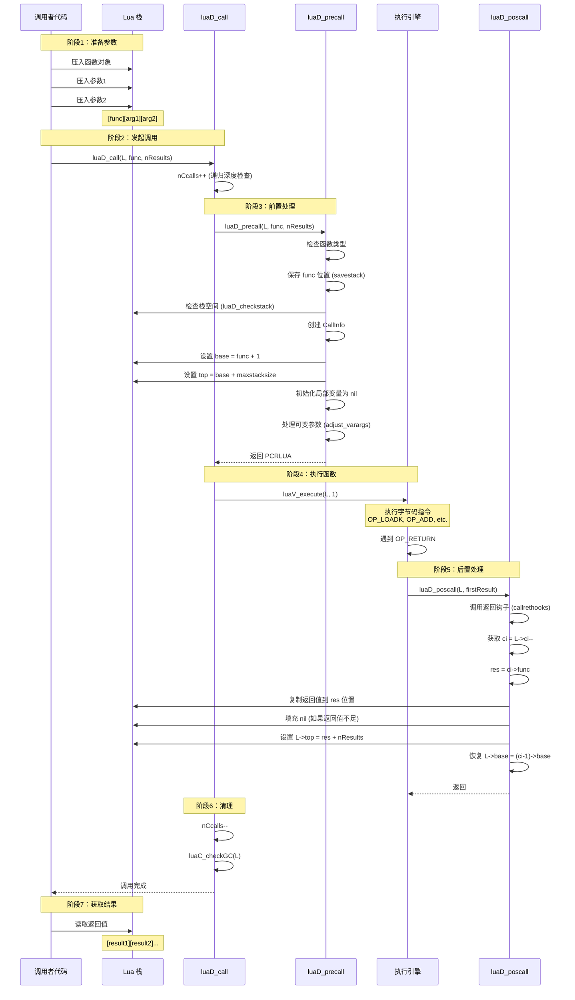
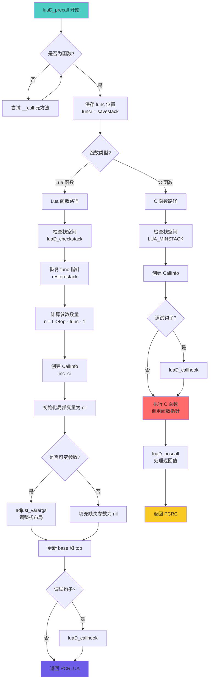
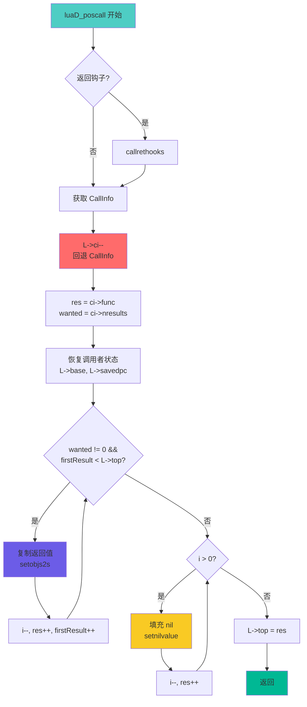
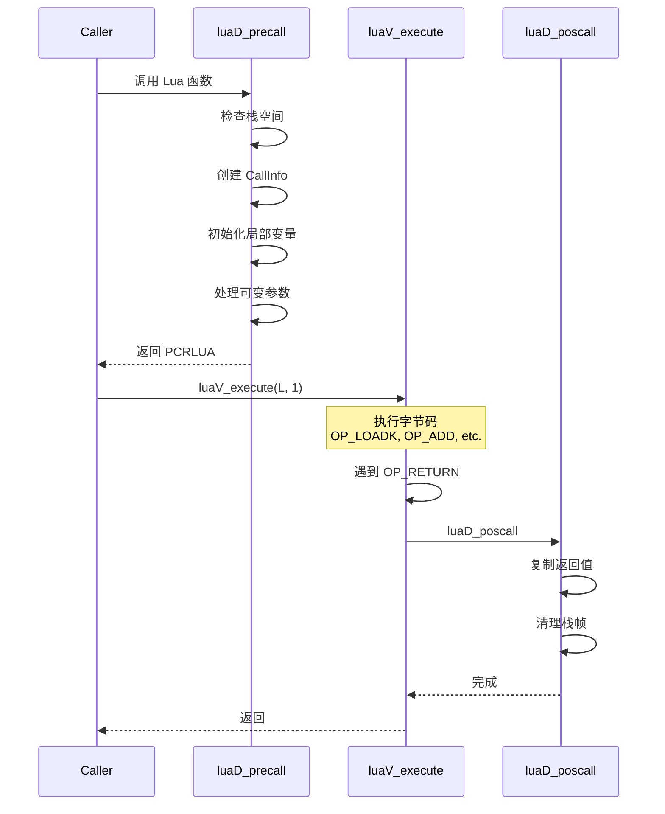
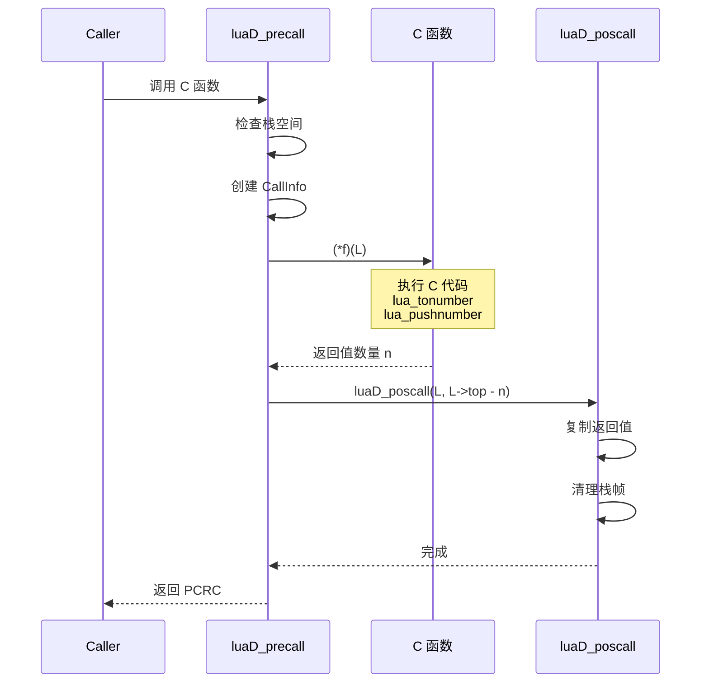

# 🚀 Lua 函数调用机制深度剖析

> **面向高级开发者**：从虚拟机内部视角深入理解 Lua 函数调用的完整生命周期
>
> **技术深度**：⭐⭐⭐⭐ (介于初学者文档与源码级分析之间)  
> **预计阅读时间**：45-60 分钟

<div align="center">

**栈帧管理 · 调用约定 · 性能优化 · 实战调试**

[📖 核心机制](#-核心机制深度解析) · [🔬 源码剖析](#-源码级实现剖析) · [⚡ 性能优化](#-性能优化与最佳实践) · [🛠️ 实战调试](#-实战调试技巧)

</div>

---

## 📋 文档定位

### 目标读者

本文档专为以下开发者设计：

- ✅ 已掌握 Lua 基础语法和常用特性
- ✅ 理解栈、堆、函数调用等基本概念
- ✅ 希望深入理解 Lua 虚拟机内部机制
- ✅ 需要编写高性能 Lua 代码或 C 扩展
- ✅ 对虚拟机实现原理感兴趣

### 与其他文档的关系



### 前置知识

建议先阅读：
- 📖 [function_call_explained.md](../beginner/function_call_explained.md) - 理解"卡片叠放"比喻
- 📖 [stack_management.md](../runtime/stack_management.md) - 栈管理基础

### 学习目标

完成本文档后，你将能够：

1. **深入理解**函数调用的完整生命周期
2. **掌握** `luaD_precall`、`luaD_poscall` 的执行流程
3. **分析** CallInfo 结构的创建、管理和销毁
4. **理解**栈帧布局和指针管理（func、base、top）
5. **对比** Lua 函数与 C 函数调用的差异
6. **优化**递归算法和函数调用性能
7. **调试**复杂的调用链问题

---

## 📚 目录

1. [核心机制深度解析](#-核心机制深度解析)
   - [函数调用生命周期](#1-函数调用生命周期)
   - [CallInfo 结构详解](#2-callinfo-结构详解)
   - [栈帧精确布局](#3-栈帧精确布局)
2. [源码级实现剖析](#-源码级实现剖析)
   - [luaD_precall 详解](#1-luad_precall-调用前准备)
   - [luaD_poscall 详解](#2-luad_poscall-调用后处理)
   - [参数传递机制](#3-参数传递机制)
   - [返回值处理](#4-返回值处理机制)
3. [调用场景对比分析](#-调用场景对比分析)
   - [Lua 函数 vs C 函数](#1-lua-函数-vs-c-函数)
   - [普通调用 vs 尾调用](#2-普通调用-vs-尾调用优化)
   - [固定参数 vs 可变参数](#3-固定参数-vs-可变参数)
   - [单返回值 vs 多返回值](#4-单返回值-vs-多返回值)
4. [性能优化与最佳实践](#-性能优化与最佳实践)
5. [实战调试技巧](#-实战调试技巧)
6. [常见问题与陷阱](#-常见问题与陷阱)
7. [进阶阅读](#-进阶阅读)

---

## 🔍 核心机制深度解析

### 1. 函数调用生命周期

#### 1.1 完整流程概览

函数调用从准备到返回经历以下阶段：



#### 1.2 关键阶段详解

| 阶段 | 主要操作 | 关键函数 | 栈状态变化 |
|------|---------|---------|-----------|
| **准备** | 压入函数对象和参数 | `lua_pushcfunction`<br/>`lua_pushnumber` | `[func][arg1][arg2]...` |
| **前置** | 创建 CallInfo，初始化栈帧 | `luaD_precall` | 创建新栈帧，设置 base/top |
| **执行** | 运行函数体 | `luaV_execute` (Lua)<br/>`(*f)(L)` (C) | 在栈帧内操作 |
| **后置** | 复制返回值，清理栈帧 | `luaD_poscall` | 返回值覆盖 func 位置 |
| **清理** | GC 检查，递减调用计数 | `luaC_checkGC` | 恢复调用者栈顶 |

#### 1.3 时序图：完整调用链



---

### 2. CallInfo 结构详解

#### 2.1 数据结构定义

CallInfo 是 Lua 函数调用的核心数据结构，每次函数调用都会创建一个 CallInfo 节点：

```c
// lobject.h: CallInfo 结构定义
typedef struct CallInfo {
    StkId base;              // 栈帧基址：指向第一个局部变量/参数 (R(0))
    StkId func;              // 函数对象位置：在 base 之前
    StkId top;               // 栈帧顶部：base + Proto->maxstacksize
    const Instruction *savedpc;  // 保存的程序计数器：用于返回和错误处理
    int nresults;            // 期望返回值数量：-1 表示 LUA_MULTRET
    int tailcalls;           // 尾调用计数器：用于调试信息
} CallInfo;
```

#### 2.2 字段详解与设计意图

| 字段 | 类型 | 作用 | 设计意图 |
|------|------|------|---------|
| **base** | `StkId` | 栈帧基址，指向 R(0) | 快速访问局部变量：`R(i) = base + i` |
| **func** | `StkId` | 函数对象位置 | 返回值覆盖位置，保存函数引用 |
| **top** | `StkId` | 栈帧可用空间上限 | 防止栈溢出，隔离不同调用 |
| **savedpc** | `const Instruction*` | 调用点的 PC | 函数返回后继续执行 |
| **nresults** | `int` | 期望返回值数量 | 调整返回值数量（截断或填充 nil） |
| **tailcalls** | `int` | 连续尾调用次数 | 调试信息，避免栈跟踪丢失 |

#### 2.3 CallInfo 链管理

Lua 使用**数组**而非链表管理 CallInfo：

```c
// lstate.h: lua_State 中的 CallInfo 管理
struct lua_State {
    // ...
    CallInfo *base_ci;       // CallInfo 数组的起始地址
    CallInfo *ci;            // 当前活动的 CallInfo
    CallInfo *end_ci;        // CallInfo 数组的末尾
    // ...
};
```

**CallInfo 链的可视化**：

```
CallInfo 数组布局：
┌─────────────────────────────────────────────────────────┐
│  base_ci                ci                    end_ci    │
│     ↓                   ↓                        ↓      │
│  ┌────┬────┬────┬────┬────┬────┬────┬────┬────┬────┐   │
│  │ CI0│ CI1│ CI2│ CI3│ CI4│    │    │    │    │    │   │
│  └────┴────┴────┴────┴────┴────┴────┴────┴────┴────┘   │
│   main  f1   f2   f3   f4  (未使用)                     │
│                      ↑                                  │
│                   当前调用                               │
└─────────────────────────────────────────────────────────┘

调用关系：
main() → f1() → f2() → f3() → f4()
  ↑      ↑      ↑      ↑      ↑
 CI0    CI1    CI2    CI3    CI4 (L->ci)
```

#### 2.4 CallInfo 的创建与销毁

**创建 CallInfo**（在 `luaD_precall` 中）：

```c
// ldo.c: inc_ci 函数
static CallInfo *inc_ci(lua_State *L) {
    // 检查是否需要扩展 CallInfo 数组
    if (L->ci == L->end_ci) {
        // 扩展策略：通常翻倍
        luaD_reallocCI(L, 2 * (L->ci - L->base_ci));
    }

    // 移动到下一个 CallInfo
    return ++L->ci;
}
```

**销毁 CallInfo**（在 `luaD_poscall` 中）：

```c
// ldo.c: luaD_poscall 中的回收
int luaD_poscall(lua_State *L, StkId firstResult) {
    // ...
    CallInfo *ci = L->ci--;  // ← 关键：回退指针即完成"销毁"
    // ...
}
```

> **设计亮点**：CallInfo 使用数组而非链表，回退指针即可"销毁"，无需真正释放内存，性能极高。

---

### 3. 栈帧精确布局

#### 3.1 栈帧的内存布局

每个函数调用都有独立的栈帧，栈帧布局如下：

```
完整栈帧布局（以 function add(a, b) 为例）：
┌─────────────────────────────────────────────────────────┐
│                     调用者栈帧                           │
│  ... 调用者的局部变量 ...                                │
├═════════════════════════════════════════════════════════┤ ← ci->func
│  [函数对象]  (Closure)                                   │  (func 位置)
├─────────────────────────────────────────────────────────┤ ← ci->base (R(0))
│  [参数 a]    (第一个参数)                                │  R(0)
├─────────────────────────────────────────────────────────┤
│  [参数 b]    (第二个参数)                                │  R(1)
├─────────────────────────────────────────────────────────┤
│  [局部变量1] (local sum)                                 │  R(2)
├─────────────────────────────────────────────────────────┤
│  [局部变量2] (local temp)                                │  R(3)
├─────────────────────────────────────────────────────────┤
│  [临时值1]   (表达式计算)                                │  R(4)
├─────────────────────────────────────────────────────────┤
│  [临时值2]   (函数调用准备)                              │  R(5)
├═════════════════════════════════════════════════════════┤ ← ci->top
│  [保护区]    (EXTRA_STACK)                               │
├─────────────────────────────────────────────────────────┤
│  [未使用空间]                                            │
└─────────────────────────────────────────────────────────┘

关键指针关系：
- func = base - 1
- base = func + 1
- top = base + Proto->maxstacksize
- 寄存器访问：R(i) = base + i
```

#### 3.2 指针管理的关键要点

**为什么 func 在 base 之前？**

```
设计原因：
1. 返回值覆盖：函数返回时，返回值直接覆盖 func 位置
2. 闭包访问：需要保持对函数对象的引用（upvalue）
3. 调试信息：错误堆栈需要知道是哪个函数
4. GC 保护：防止函数对象在执行期间被回收

示例：
调用前：[func][arg1][arg2]
       ↑     ↑
      func  base

返回后：[ret1][ret2]
       ↑
      func (返回值覆盖了原函数位置)
```

**top 的作用**：

```c
// top 的三重作用：
// 1. 栈溢出保护
if (L->top >= ci->top) {
    luaD_growstack(L, 1);  // 扩展栈空间
}

// 2. 隔离不同调用
// 每个函数只能访问 [base, top) 范围内的栈空间

// 3. 参数数量标记
// 调用前：L->top = func + 1 + nargs
// 被调用函数可以通过 L->top - L->base 计算参数数量
```

#### 3.3 栈帧布局实例分析

**示例代码**：

```lua
function calculate(a, b)
    local sum = a + b
    local product = multiply(sum, 2)
    return product
end

function multiply(x, y)
    return x * y
end

local result = calculate(5, 3)
```

**栈帧演化过程**：

```
═══════════════════════════════════════════════════════════
步骤1：调用 calculate(5, 3)
═══════════════════════════════════════════════════════════
┌─────────────────────────────────────────────────────────┐
│  [main 函数栈帧]                                         │
├═════════════════════════════════════════════════════════┤ ← ci[0]->func
│  [calculate 函数对象]                                    │
├─────────────────────────────────────────────────────────┤ ← ci[1]->base (R(0))
│  [5]         (参数 a = R(0))                             │
├─────────────────────────────────────────────────────────┤
│  [3]         (参数 b = R(1))                             │
├─────────────────────────────────────────────────────────┤
│  [8]         (局部变量 sum = R(2))                       │
├─────────────────────────────────────────────────────────┤
│  [nil]       (局部变量 product = R(3))                   │
├═════════════════════════════════════════════════════════┤ ← ci[1]->top
│  [可用空间]                                              │
└─────────────────────────────────────────────────────────┘

CallInfo[1]:
  func = &stack[X]
  base = &stack[X+1]
  top  = &stack[X+1+4]  (假设 maxstacksize=4)
  savedpc = calculate 的字节码起始位置
  nresults = 1
  tailcalls = 0

═══════════════════════════════════════════════════════════
步骤2：准备调用 multiply(8, 2)
═══════════════════════════════════════════════════════════
┌─────────────────────────────────────────────────────────┐
│  [main 函数栈帧]                                         │
├═════════════════════════════════════════════════════════┤
│  [calculate 函数对象]                                    │
├─────────────────────────────────────────────────────────┤ ← ci[1]->base
│  [5]         (a)                                         │
│  [3]         (b)                                         │
│  [8]         (sum)                                       │
│  [nil]       (product)                                   │
├─────────────────────────────────────────────────────────┤
│  [multiply 函数对象]  ← 准备调用                         │
├─────────────────────────────────────────────────────────┤
│  [8]         (参数1)                                     │
├─────────────────────────────────────────────────────────┤
│  [2]         (参数2)                                     │
├═════════════════════════════════════════════════════════┤ ← L->top
└─────────────────────────────────────────────────────────┘

═══════════════════════════════════════════════════════════
步骤3：执行 multiply(8, 2) - 创建新栈帧
═══════════════════════════════════════════════════════════
┌─────────────────────────────────────────────────────────┐
│  [main 函数栈帧]                                         │
├═════════════════════════════════════════════════════════┤
│  [calculate 函数对象]                                    │
├─────────────────────────────────────────────────────────┤ ← ci[1]->base
│  [5] [3] [8] [nil]                                       │
├═════════════════════════════════════════════════════════┤ ← ci[1]->top
│  [multiply 函数对象]                                     │ ← ci[2]->func
├─────────────────────────────────────────────────────────┤ ← ci[2]->base (R(0))
│  [8]         (参数 x = R(0))                             │
├─────────────────────────────────────────────────────────┤
│  [2]         (参数 y = R(1))                             │
├─────────────────────────────────────────────────────────┤
│  [16]        (临时值 x * y)                              │
├═════════════════════════════════════════════════════════┤ ← ci[2]->top
│  [可用空间]                                              │
└─────────────────────────────────────────────────────────┘

CallInfo[2]:
  func = &stack[Y]
  base = &stack[Y+1]
  top  = &stack[Y+1+3]
  savedpc = multiply 的字节码起始位置
  nresults = 1
  tailcalls = 0

═══════════════════════════════════════════════════════════
步骤4：multiply 返回 - luaD_poscall 处理
═══════════════════════════════════════════════════════════
┌─────────────────────────────────────────────────────────┐
│  [main 函数栈帧]                                         │
├═════════════════════════════════════════════════════════┤
│  [calculate 函数对象]                                    │
├─────────────────────────────────────────────────────────┤ ← ci[1]->base
│  [5] [3] [8] [nil]                                       │
├─────────────────────────────────────────────────────────┤
│  [16]        ← 返回值覆盖了 multiply 函数对象位置        │
├═════════════════════════════════════════════════════════┤ ← L->top (ci[1]->top)
│  [可用空间]  (multiply 的栈帧已清理)                     │
└─────────────────────────────────────────────────────────┘

关键操作：
1. ci = L->ci--  (回退到 ci[1])
2. res = ci->func  (获取返回值目标位置)
3. 复制返回值：setobjs2s(L, res, firstResult)
4. L->top = res + nresults
5. L->base = (ci-1)->base

═══════════════════════════════════════════════════════════
步骤5：calculate 继续执行
═══════════════════════════════════════════════════════════
┌─────────────────────────────────────────────────────────┐
│  [main 函数栈帧]                                         │
├═════════════════════════════════════════════════════════┤
│  [calculate 函数对象]                                    │
├─────────────────────────────────────────────────────────┤ ← ci[1]->base
│  [5]         (a)                                         │
│  [3]         (b)                                         │
│  [8]         (sum)                                       │
│  [16]        (product = R(3)) ← 赋值                     │
├═════════════════════════════════════════════════════════┤ ← ci[1]->top
│  [可用空间]                                              │
└─────────────────────────────────────────────────────────┘

═══════════════════════════════════════════════════════════
步骤6：calculate 返回
═══════════════════════════════════════════════════════════
┌─────────────────────────────────────────────────────────┐
│  [main 函数栈帧]                                         │
├─────────────────────────────────────────────────────────┤
│  [16]        ← 返回值覆盖 calculate 函数对象位置         │
├═════════════════════════════════════════════════════════┤ ← L->top
│  [可用空间]                                              │
└─────────────────────────────────────────────────────────┘

最终：result = 16
```

> **关键洞察**：返回值总是覆盖函数对象位置（func），这是 Lua 调用约定的核心设计。

---

## 🔬 源码级实现剖析

### 1. luaD_precall 调用前准备

#### 1.1 函数签名与返回值

```c
// ldo.c
int luaD_precall(lua_State *L, StkId func, int nresults);
```

**参数**：
- `L`: Lua 状态机
- `func`: 函数对象在栈中的位置
- `nresults`: 期望返回值数量（`LUA_MULTRET` = -1 表示全部）

**返回值**：
- `PCRLUA` (0): Lua 函数，需要执行字节码
- `PCRC` (1): C 函数，已执行完毕
- `PCRYIELD` (2): 协程让出

#### 1.2 完整源码分析（带详细注释）

```c
int luaD_precall(lua_State *L, StkId func, int nresults) {
    LClosure *cl;
    ptrdiff_t funcr;

    // ═══════════════════════════════════════════════════════════
    // 第1步：类型检查与元方法处理
    // ═══════════════════════════════════════════════════════════
    if (!ttisfunction(func)) {
        // 不是函数类型，尝试 __call 元方法
        func = tryfuncTM(L, func);
        // tryfuncTM 会：
        // 1. 查找 __call 元方法
        // 2. 如果找到，将原对象作为第一个参数
        // 3. 调整栈：[metamethod][obj][arg1][arg2]...
    }

    // ═══════════════════════════════════════════════════════════
    // 第2步：保存 func 位置（防止栈重分配导致指针失效）
    // ═══════════════════════════════════════════════════════════
    funcr = savestack(L, func);
    // savestack 定义：#define savestack(L,p) ((char*)(p) - (char*)L->stack)
    // 保存的是相对偏移量，而非绝对地址

    cl = &clvalue(func)->l;  // 获取闭包对象
    L->ci->savedpc = L->savedpc;  // 保存调用者的 PC

    // ═══════════════════════════════════════════════════════════
    // 第3步：函数类型分支
    // ═══════════════════════════════════════════════════════════
    if (!cl->isC) {
        // ───────────────────────────────────────────────────────
        // 分支A：Lua 函数
        // ───────────────────────────────────────────────────────
        CallInfo *ci;
        StkId st, base;
        Proto *p = cl->p;  // 函数原型

        // 步骤A1：检查栈空间
        luaD_checkstack(L, p->maxstacksize);
        // 确保有足够空间容纳：
        // - 局部变量
        // - 临时值
        // - 嵌套调用的参数

        // 步骤A2：恢复 func 指针（栈可能已重分配）
        func = restorestack(L, funcr);

        // 步骤A3：计算参数数量
        int n = cast_int(L->top - func) - 1;
        // L->top - func = 函数对象 + 所有参数
        // -1 是减去函数对象本身

        // 步骤A4：创建 CallInfo
        ci = inc_ci(L);
        ci->func = func;
        L->base = ci->base = func + 1;  // base 指向第一个参数
        ci->top = L->base + p->maxstacksize;
        L->savedpc = p->code;  // 设置 PC 为函数字节码起始位置
        ci->tailcalls = 0;
        ci->nresults = nresults;

        // 步骤A5：初始化局部变量为 nil
        for (st = L->top; st < ci->top; st++)
            setnilvalue(st);
        // 将 [L->top, ci->top) 范围内的槽位初始化为 nil

        L->top = ci->top;

        // 步骤A6：处理可变参数
        if (p->is_vararg) {
            // 调整栈布局，为 {...} 做准备
            base = adjust_varargs(L, p, n);
            // adjust_varargs 会：
            // 1. 将固定参数移到正确位置
            // 2. 保留可变参数在栈上
            // 3. 调整 base 指针
        } else {
            // 固定参数：调整参数数量
            for (; n < p->numparams; n++)
                setnilvalue(L->top++);  // 填充缺失的参数为 nil
            base = func + 1;
        }

        // 步骤A7：更新 base 和 top
        L->base = ci->base = base;
        ci->top = L->base + p->maxstacksize;

        // 步骤A8：调用钩子（调试支持）
        if (L->hookmask & LUA_MASKCALL) {
            L->savedpc++;  // 跳过第一条指令（用于钩子）
            luaD_callhook(L, LUA_HOOKCALL, -1);
            L->savedpc--;
        }

        return PCRLUA;  // 返回，需要执行字节码

    } else {
        // ───────────────────────────────────────────────────────
        // 分支B：C 函数
        // ───────────────────────────────────────────────────────
        CallInfo *ci;
        int n;

        // 步骤B1：检查 C 栈空间
        luaD_checkstack(L, LUA_MINSTACK);

        // 步骤B2：创建 CallInfo
        ci = inc_ci(L);
        func = restorestack(L, funcr);
        ci->func = func;
        L->base = ci->base = func + 1;
        ci->top = L->top + LUA_MINSTACK;
        ci->nresults = nresults;

        // 步骤B3：调用钩子
        if (L->hookmask & LUA_MASKCALL)
            luaD_callhook(L, LUA_HOOKCALL, -1);

        lua_unlock(L);

        // 步骤B4：执行 C 函数
        n = (*curr_func(L)->c.f)(L);
        // C 函数约定：
        // - 从栈读取参数：lua_tonumber(L, 1), lua_tonumber(L, 2), ...
        // - 压入返回值：lua_pushnumber(L, result)
        // - 返回值数量：return n

        lua_lock(L);

        // 步骤B5：处理返回值
        luaD_poscall(L, L->top - n);
        // L->top - n 是第一个返回值的位置

        return PCRC;  // C 函数已执行完毕
    }
}
```

#### 1.3 关键流程图



---

### 2. luaD_poscall 调用后处理

#### 2.1 函数签名

```c
// ldo.c
int luaD_poscall(lua_State *L, StkId firstResult);
```

**参数**：
- `L`: Lua 状态机
- `firstResult`: 第一个返回值在栈中的位置

**返回值**：
- `wanted - LUA_MULTRET`（用于内部调整）

#### 2.2 完整源码分析（带详细注释）

```c
int luaD_poscall(lua_State *L, StkId firstResult) {
    StkId res;
    int wanted, i;
    CallInfo *ci;

    // ═══════════════════════════════════════════════════════════
    // 第1步：调用返回钩子（调试支持）
    // ═══════════════════════════════════════════════════════════
    if (L->hookmask & LUA_MASKRET) {
        // 如果设置了返回钩子，调用 callrethooks
        firstResult = callrethooks(L, firstResult);
        // callrethooks 可能会修改返回值位置（例如，调试器修改返回值）
    }

    // ═══════════════════════════════════════════════════════════
    // 第2步：获取当前 CallInfo 并回退
    // ═══════════════════════════════════════════════════════════
    ci = L->ci--;
    // 关键操作：L->ci-- 回退到调用者的 CallInfo
    // 这是"销毁"当前 CallInfo 的方式（无需真正释放内存）

    res = ci->func;  // 返回值的目标位置（函数对象位置）
    wanted = ci->nresults;  // 期望的返回值数量

    // ═══════════════════════════════════════════════════════════
    // 第3步：恢复调用者的状态
    // ═══════════════════════════════════════════════════════════
    L->base = (ci - 1)->base;  // 恢复调用者的 base
    L->savedpc = (ci - 1)->savedpc;  // 恢复调用者的 PC

    // ═══════════════════════════════════════════════════════════
    // 第4步：复制返回值到正确位置
    // ═══════════════════════════════════════════════════════════
    // 从 firstResult 复制到 res（函数对象位置）
    for (i = wanted; i != 0 && firstResult < L->top; i--) {
        setobjs2s(L, res++, firstResult++);
        // setobjs2s：栈到栈的对象复制（处理 GC 写屏障）
    }

    // ═══════════════════════════════════════════════════════════
    // 第5步：处理返回值数量不匹配
    // ═══════════════════════════════════════════════════════════
    while (i-- > 0) {
        setnilvalue(res++);  // 填充 nil（返回值不足时）
    }

    // ═══════════════════════════════════════════════════════════
    // 第6步：设置栈顶
    // ═══════════════════════════════════════════════════════════
    L->top = res;
    // 栈顶现在指向最后一个返回值之后

    return (wanted - LUA_MULTRET);
    // 返回值用于内部判断是否需要调整
}
```

#### 2.3 返回值复制详解

**场景1：返回值数量匹配**

```lua
function f()
    return 10, 20, 30
end

local a, b, c = f()  -- wanted = 3, 实际返回 3
```

```
调用前栈状态：
┌─────────────────────────────────────┐
│  [f 函数对象]                        │ ← ci->func (res)
├─────────────────────────────────────┤ ← ci->base
│  (f 的栈帧)                          │
│  ...                                 │
│  [10] [20] [30]                      │ ← firstResult
├─────────────────────────────────────┤ ← L->top
└─────────────────────────────────────┘

复制过程：
i = 3, wanted = 3
循环1: res[0] = 10, i = 2
循环2: res[1] = 20, i = 1
循环3: res[2] = 30, i = 0
退出循环

返回后栈状态：
┌─────────────────────────────────────┐
│  [10] [20] [30]                      │ ← 覆盖了 f 函数对象位置
├─────────────────────────────────────┤ ← L->top
│  (f 的栈帧已清理)                    │
└─────────────────────────────────────┘
```

**场景2：返回值不足**

```lua
function f()
    return 10
end

local a, b, c = f()  -- wanted = 3, 实际返回 1
```

```
复制过程：
i = 3, wanted = 3
循环1: res[0] = 10, i = 2, firstResult 到达 L->top
退出第一个循环

填充 nil：
循环1: res[1] = nil, i = 1
循环2: res[2] = nil, i = 0
退出循环

结果：a = 10, b = nil, c = nil
```

**场景3：返回值过多**

```lua
function f()
    return 10, 20, 30, 40, 50
end

local a, b = f()  -- wanted = 2, 实际返回 5
```

```
复制过程：
i = 2, wanted = 2
循环1: res[0] = 10, i = 1
循环2: res[1] = 20, i = 0
退出循环（忽略 30, 40, 50）

结果：a = 10, b = 20
```

**场景4：LUA_MULTRET（全部返回值）**

```lua
function f()
    return 10, 20, 30
end

print(f())  -- wanted = LUA_MULTRET (-1)
```

```
复制过程：
i = -1 (LUA_MULTRET), wanted = -1
循环条件：i != 0 && firstResult < L->top
由于 i = -1，条件始终为真，直到 firstResult >= L->top

循环1: res[0] = 10, i = -2
循环2: res[1] = 20, i = -3
循环3: res[2] = 30, i = -4
firstResult 到达 L->top，退出循环

不填充 nil（i < 0）

结果：保留所有返回值
```

#### 2.4 关键流程图



---

### 3. 参数传递机制

#### 3.1 固定参数传递

**Lua 代码**：

```lua
function add(a, b)
    return a + b
end

add(10, 20)
```

**栈布局演化**：

```
步骤1：准备调用（调用者负责）
┌─────────────────────────────────────┐
│  [add 函数对象]                      │ ← func
├─────────────────────────────────────┤
│  [10]                                │ ← func + 1
├─────────────────────────────────────┤
│  [20]                                │ ← func + 2
├─────────────────────────────────────┤ ← L->top
└─────────────────────────────────────┘

步骤2：luaD_precall 处理
- 计算参数数量：n = L->top - func - 1 = 2
- 创建 CallInfo
- 设置 base = func + 1
- 检查参数数量：p->numparams = 2, n = 2 ✓

步骤3：函数内部访问
┌─────────────────────────────────────┐
│  [add 函数对象]                      │ ← ci->func
├─────────────────────────────────────┤ ← ci->base (R(0))
│  [10]                                │ ← R(0) = a
├─────────────────────────────────────┤
│  [20]                                │ ← R(1) = b
├─────────────────────────────────────┤
│  [30]                                │ ← R(2) = 临时值 (a + b)
├─────────────────────────────────────┤ ← ci->top
└─────────────────────────────────────┘

字节码访问：
GETLOCAL 0  → 读取 base[0] = 10
GETLOCAL 1  → 读取 base[1] = 20
ADD 2 0 1   → base[2] = base[0] + base[1] = 30
```

#### 3.2 可变参数传递

**Lua 代码**：

```lua
function sum(...)
    local args = {...}
    local total = 0
    for i, v in ipairs(args) do
        total = total + v
    end
    return total
end

sum(10, 20, 30)
```

**栈布局演化（关键：adjust_varargs）**：

```
步骤1：调用前
┌─────────────────────────────────────┐
│  [sum 函数对象]                      │ ← func
├─────────────────────────────────────┤
│  [10]                                │ ← func + 1
├─────────────────────────────────────┤
│  [20]                                │ ← func + 2
├─────────────────────────────────────┤
│  [30]                                │ ← func + 3
├─────────────────────────────────────┤ ← L->top
└─────────────────────────────────────┘

步骤2：luaD_precall 检测到 p->is_vararg = 1
调用 adjust_varargs(L, p, 3)

步骤3：adjust_varargs 处理
// 伪代码
int nfixargs = p->numparams;  // 固定参数数量 = 0
int nactual = 3;              // 实际参数数量 = 3

// 将可变参数复制到栈底
for (i = 0; i < nactual; i++) {
    setobjs2s(L, L->base + nfixargs + i, func + 1 + i);
}

// 调整 base
base = L->base + nactual;

步骤4：调整后的栈布局
┌─────────────────────────────────────┐
│  [sum 函数对象]                      │ ← ci->func
├─────────────────────────────────────┤
│  [10] [20] [30]                      │ ← 可变参数区域
├─────────────────────────────────────┤ ← ci->base (新的 base)
│  [nil]                               │ ← R(0) = args (局部变量)
├─────────────────────────────────────┤
│  [nil]                               │ ← R(1) = total
├─────────────────────────────────────┤ ← ci->top
└─────────────────────────────────────┘

步骤5：访问可变参数
OP_VARARG 指令：
- 从 base 之前的区域读取可变参数
- 打包成表：{10, 20, 30}
```

> **关键洞察**：可变参数存储在 `base` 之前，通过 `OP_VARARG` 指令访问。

---

### 4. 返回值处理机制

#### 4.1 单返回值

**Lua 代码**：

```lua
function square(x)
    return x * x
end

local result = square(5)
```

**字节码与栈操作**：

```
字节码（square 函数）：
0: GETLOCAL 0      ; R(1) = x
1: GETLOCAL 0      ; R(2) = x
2: MUL 1 1 2       ; R(1) = R(1) * R(2)
3: RETURN 1 2      ; 返回 R(1)，数量 = 1

OP_RETURN 处理：
A = 1, B = 2
firstResult = base + A = base + 1
nresults = B - 1 = 1

调用 luaD_poscall(L, firstResult)
```

**栈状态变化**：

```
执行 RETURN 前：
┌─────────────────────────────────────┐
│  [square 函数对象]                   │ ← ci->func
├─────────────────────────────────────┤ ← ci->base
│  [5]                                 │ ← R(0) = x
├─────────────────────────────────────┤
│  [25]                                │ ← R(1) = x * x (firstResult)
├─────────────────────────────────────┤ ← L->top
└─────────────────────────────────────┘

luaD_poscall 处理：
res = ci->func
wanted = 1
复制：res[0] = firstResult[0] = 25

执行 RETURN 后：
┌─────────────────────────────────────┐
│  [25]                                │ ← 返回值覆盖函数对象位置
├─────────────────────────────────────┤ ← L->top
│  (square 的栈帧已清理)               │
└─────────────────────────────────────┘
```

#### 4.2 多返回值

**Lua 代码**：

```lua
function divmod(a, b)
    return math.floor(a / b), a % b
end

local quot, rem = divmod(17, 5)
```

**字节码与栈操作**：

```
字节码（divmod 函数）：
...
10: RETURN 2 3     ; 返回 R(2), R(3)，数量 = 2

OP_RETURN 处理：
A = 2, B = 3
firstResult = base + A = base + 2
nresults = B - 1 = 2
```

**栈状态变化**：

```
执行 RETURN 前：
┌─────────────────────────────────────┐
│  [divmod 函数对象]                   │ ← ci->func
├─────────────────────────────────────┤ ← ci->base
│  [17]                                │ ← R(0) = a
├─────────────────────────────────────┤
│  [5]                                 │ ← R(1) = b
├─────────────────────────────────────┤
│  [3]                                 │ ← R(2) = 商 (firstResult)
├─────────────────────────────────────┤
│  [2]                                 │ ← R(3) = 余数
├─────────────────────────────────────┤ ← L->top
└─────────────────────────────────────┘

luaD_poscall 处理：
res = ci->func
wanted = 2
复制：
  res[0] = firstResult[0] = 3
  res[1] = firstResult[1] = 2

执行 RETURN 后：
┌─────────────────────────────────────┐
│  [3]                                 │ ← 第一个返回值
├─────────────────────────────────────┤
│  [2]                                 │ ← 第二个返回值
├─────────────────────────────────────┤ ← L->top
│  (divmod 的栈帧已清理)               │
└─────────────────────────────────────┘

结果：quot = 3, rem = 2
```

#### 4.3 返回值调整策略

| 场景 | wanted | 实际返回 | 处理策略 | 示例 |
|------|--------|---------|---------|------|
| **精确匹配** | 2 | 2 | 直接复制 | `local a, b = f()` |
| **返回值不足** | 3 | 1 | 复制 + 填充 nil | `local a, b, c = f()` → `a=val, b=nil, c=nil` |
| **返回值过多** | 1 | 5 | 截断 | `local a = f()` → 只取第一个 |
| **全部接收** | -1 (MULTRET) | N | 保留所有 | `print(f())` |
| **忽略返回值** | 0 | N | 不复制 | `f()` (语句调用) |

---

## ⚖️ 调用场景对比分析

### 1. Lua 函数 vs C 函数

#### 1.1 对比表

| 特性 | Lua 函数 | C 函数 |
|------|---------|--------|
| **执行方式** | 字节码解释执行 | 直接执行机器码 |
| **调用位置** | `luaD_precall` 返回后 | `luaD_precall` 内部 |
| **栈帧创建** | 完整的 CallInfo + 栈帧 | 简化的 CallInfo |
| **参数访问** | 通过寄存器 `R(i)` | 通过 C API `lua_to*` |
| **返回值** | `OP_RETURN` 指令 | 返回值数量 `return n` |
| **尾调用优化** | ✅ 支持 | ❌ 不支持 |
| **性能** | 较慢（解释执行） | 较快（原生代码） |
| **灵活性** | 高（动态类型） | 低（需要类型检查） |

#### 1.2 Lua 函数调用流程



#### 1.3 C 函数调用流程



#### 1.4 C 函数示例

**C 代码**：

```c
// 示例：实现一个 add 函数
static int l_add(lua_State *L) {
    // 步骤1：获取参数（从栈读取）
    double a = luaL_checknumber(L, 1);  // 第一个参数
    double b = luaL_checknumber(L, 2);  // 第二个参数

    // 步骤2：执行计算
    double result = a + b;

    // 步骤3：压入返回值
    lua_pushnumber(L, result);

    // 步骤4：返回值数量
    return 1;  // 返回 1 个值
}

// 注册函数
lua_register(L, "add", l_add);
```

**调用过程**：

```lua
local result = add(10, 20)
```

**栈状态变化**：

```
调用前：
┌─────────────────────────────────────┐
│  [add C 函数对象]                    │ ← func
├─────────────────────────────────────┤
│  [10]                                │ ← 参数1（索引1）
├─────────────────────────────────────┤
│  [20]                                │ ← 参数2（索引2）
├─────────────────────────────────────┤ ← L->top
└─────────────────────────────────────┘

luaD_precall 中执行 C 函数：
1. lua_tonumber(L, 1) → 读取 base[0] = 10
2. lua_tonumber(L, 2) → 读取 base[1] = 20
3. 计算：result = 30
4. lua_pushnumber(L, 30) → L->top++ = 30
5. return 1

C 函数执行后：
┌─────────────────────────────────────┐
│  [add C 函数对象]                    │ ← ci->func
├─────────────────────────────────────┤ ← ci->base
│  [10]                                │
├─────────────────────────────────────┤
│  [20]                                │
├─────────────────────────────────────┤
│  [30]                                │ ← L->top - 1 (firstResult)
├─────────────────────────────────────┤ ← L->top
└─────────────────────────────────────┘

luaD_poscall 处理后：
┌─────────────────────────────────────┐
│  [30]                                │ ← 返回值
├─────────────────────────────────────┤ ← L->top
└─────────────────────────────────────┘
```

---

### 2. 普通调用 vs 尾调用优化

#### 2.1 什么是尾调用？

**定义**：函数的最后一个操作是调用另一个函数，且该调用的返回值直接作为当前函数的返回值。

**形式**：

```lua
-- ✅ 尾调用
function f(x)
    return g(x)  -- 最后一个操作，直接返回
end

-- ❌ 非尾调用
function f(x)
    return g(x) + 1  -- 调用后还有加法操作
end

function f(x)
    g(x)  -- 调用后还有隐式的 return nil
    return nil
end
```

#### 2.2 尾调用优化原理

**普通调用**：每次调用创建新的 CallInfo

```
普通递归：
┌─────────────────────────────────────┐
│  factorial(3)                        │ ← ci[3]
├─────────────────────────────────────┤
│  factorial(2)                        │ ← ci[2]
├─────────────────────────────────────┤
│  factorial(1)                        │ ← ci[1]
├─────────────────────────────────────┤
│  main                                │ ← ci[0]
└─────────────────────────────────────┘
栈深度：O(n)
```

**尾调用优化**：复用当前 CallInfo

```
尾调用优化：
┌─────────────────────────────────────┐
│  factorial_tail(?, ?)                │ ← ci[1] (复用)
├─────────────────────────────────────┤
│  main                                │ ← ci[0]
└─────────────────────────────────────┘
栈深度：O(1)

参数变化：
(3, 1) → (2, 3) → (1, 6) → (0, 6)
```

#### 2.3 字节码对比

**普通调用**：

```lua
function factorial(n)
    if n <= 1 then return 1 end
    return n * factorial(n - 1)  -- 非尾调用
end
```

```
字节码：
...
10: CALL 2 2 2      ; 调用 factorial(n-1)
11: MUL 1 0 2       ; n * result (需要保留 n)
12: RETURN 1 2      ; 返回结果
```

**尾调用**：

```lua
function factorial_tail(n, acc)
    if n <= 1 then return acc end
    return factorial_tail(n - 1, n * acc)  -- 尾调用
end
```

```
字节码：
...
10: TAILCALL 2 3 0  ; 尾调用 factorial_tail(n-1, n*acc)
11: RETURN 2 0      ; 返回尾调用的结果
```

#### 2.4 OP_TAILCALL 实现

```c
// lvm.c: OP_TAILCALL 指令
case OP_TAILCALL: {
    int b = GETARG_B(i);
    if (b != 0) L->top = ra + b;

    // 关键：复用当前 CallInfo
    lua_assert(GETARG_C(i) - 1 == LUA_MULTRET);

    switch (luaD_precall(L, ra, LUA_MULTRET)) {
        case PCRLUA: {
            // Lua 函数：调整栈帧
            CallInfo *ci = L->ci - 1;  // 调用者的 CallInfo
            int aux;
            StkId func = ci->func;
            StkId pfunc = (ci + 1)->func;  // 被调用函数

            // 关键：移动参数到调用者的位置
            while (pfunc < L->top)
                setobjs2s(L, func++, pfunc++);

            L->top = func;

            // 复用 CallInfo（不创建新的）
            ci->savedpc = L->savedpc;
            ci->tailcalls++;  // 增加尾调用计数
            L->ci--;  // 回退到调用者

            goto reentry;  // 重新进入执行循环
        }
        case PCRC: {
            // C 函数：无法优化，已执行完毕
            base = L->base;
            continue;
        }
        default: {
            return;
        }
    }
}
```

> **关键洞察**：尾调用优化通过移动参数和复用 CallInfo，避免了栈帧的增长。

---

### 3. 固定参数 vs 可变参数

#### 3.1 固定参数

**特点**：
- 参数数量在编译时确定
- 直接映射到寄存器 `R(0)`, `R(1)`, ...
- 缺失参数自动填充 `nil`

**示例**：

```lua
function add(a, b)
    return a + b
end

add(10)  -- b = nil
```

**处理**：

```c
// luaD_precall 中
int n = cast_int(L->top - func) - 1;  // 实际参数 = 1
int numparams = p->numparams;         // 期望参数 = 2

// 填充缺失参数
for (; n < numparams; n++)
    setnilvalue(L->top++);  // b = nil
```

#### 3.2 可变参数

**特点**：
- 参数数量在运行时确定
- 通过 `...` 访问
- 需要 `adjust_varargs` 调整栈布局

**示例**：

```lua
function sum(...)
    local total = 0
    for i = 1, select('#', ...) do
        total = total + select(i, ...)
    end
    return total
end

sum(10, 20, 30)
```

**adjust_varargs 实现**：

```c
// ldo.c
static StkId adjust_varargs(lua_State *L, Proto *p, int actual) {
    int i;
    int nfixargs = p->numparams;  // 固定参数数量
    Table *htab = NULL;

    // 如果需要，创建 arg 表（Lua 5.0 兼容）
    if (p->is_vararg & VARARG_NEEDSARG) {
        htab = luaH_new(L, actual - nfixargs, 1);
        // 填充 arg 表...
    }

    // 移动固定参数到正确位置
    for (i = 0; i < nfixargs; i++) {
        setobjs2s(L, L->base - nfixargs + i, L->base + i);
        setnilvalue(L->base + i);
    }

    // 返回新的 base
    return L->base - nfixargs;
}
```

**栈布局对比**：

```
调整前：
┌─────────────────────────────────────┐
│  [sum 函数对象]                      │
├─────────────────────────────────────┤ ← base
│  [10] [20] [30]                      │ ← 可变参数
├─────────────────────────────────────┤ ← top
└─────────────────────────────────────┘

调整后：
┌─────────────────────────────────────┐
│  [sum 函数对象]                      │
├─────────────────────────────────────┤
│  [10] [20] [30]                      │ ← 可变参数区域
├─────────────────────────────────────┤ ← 新的 base
│  [nil]                               │ ← R(0) = total
├─────────────────────────────────────┤ ← top
└─────────────────────────────────────┘
```

---

### 4. 单返回值 vs 多返回值

#### 4.1 单返回值

**简单直接**：

```lua
function square(x)
    return x * x
end

local result = square(5)  -- result = 25
```

**字节码**：

```
RETURN 1 2  ; 返回 R(1)，数量 = 1
```

#### 4.2 多返回值

**Lua 的独特特性**：

```lua
function divmod(a, b)
    return math.floor(a / b), a % b
end

local quot, rem = divmod(17, 5)  -- quot = 3, rem = 2
```

**字节码**：

```
RETURN 2 3  ; 返回 R(2), R(3)，数量 = 2
```

#### 4.3 多返回值的特殊场景

**场景1：作为最后一个参数**

```lua
function f()
    return 10, 20, 30
end

print(1, 2, f())  -- 输出：1  2  10  20  30
```

**字节码**：

```
CALL 1 0 1  ; 调用 f()，wanted = LUA_MULTRET
CALL 0 0 1  ; 调用 print，wanted = LUA_MULTRET
```

**场景2：表构造器**

```lua
function f()
    return 10, 20, 30
end

local t = {1, 2, f()}  -- t = {1, 2, 10, 20, 30}
```

**场景3：return 语句**

```lua
function g()
    return f()  -- 传递所有返回值
end
```

---

## ⚡ 性能优化与最佳实践

### 1. 减少函数调用开销

#### 1.1 局部化全局函数

**❌ 慢**：

```lua
for i = 1, 1000000 do
    math.sin(i)  -- 每次都查找全局表
end
```

**✅ 快**：

```lua
local sin = math.sin
for i = 1, 1000000 do
    sin(i)  -- 直接访问局部变量
end
```

**性能提升**：约 20-30%

**原因**：
- 全局访问：`GETGLOBAL` → 表查找 → 函数调用
- 局部访问：`GETLOCAL` → 函数调用

#### 1.2 内联简单函数

**❌ 慢**：

```lua
function add(a, b)
    return a + b
end

for i = 1, 1000000 do
    local result = add(i, 1)
end
```

**✅ 快**：

```lua
for i = 1, 1000000 do
    local result = i + 1  -- 内联
end
```

**性能提升**：约 50-70%

---

### 2. 利用尾调用优化

#### 2.1 递归转尾递归

**❌ 栈溢出风险**：

```lua
function factorial(n)
    if n <= 1 then return 1 end
    return n * factorial(n - 1)
end

factorial(100000)  -- 错误：C stack overflow
```

**✅ 尾递归优化**：

```lua
function factorial_tail(n, acc)
    acc = acc or 1
    if n <= 1 then return acc end
    return factorial_tail(n - 1, n * acc)  -- 尾调用
end

factorial_tail(100000)  -- ✓ 正常执行
```

**转换技巧**：
1. 添加累加器参数
2. 将中间结果传递给下一次调用
3. 确保 `return` 后无其他操作

---

### 3. C 函数优化

#### 3.1 批量操作

**❌ 慢**：

```lua
for i = 1, 1000 do
    table.insert(t, i)  -- 1000 次 C 调用
end
```

**✅ 快**：

```lua
for i = 1, 1000 do
    t[i] = i  -- 直接赋值
end
```

#### 3.2 减少栈操作

**❌ 慢**：

```c
static int l_process(lua_State *L) {
    for (int i = 0; i < 100; i++) {
        lua_pushnumber(L, i);
        lua_pushnumber(L, i * 2);
        lua_settable(L, 1);  // 100 次栈操作
    }
    return 0;
}
```

**✅ 快**：

```c
static int l_process(lua_State *L) {
    lua_checkstack(L, 2);  // 一次性检查
    for (int i = 0; i < 100; i++) {
        lua_rawseti(L, 1, i, i * 2);  // 直接设置
    }
    return 0;
}
```

---

## 🛠️ 实战调试技巧

### 1. 查看调用栈

**使用 debug.traceback**：

```lua
function a()
    b()
end

function b()
    c()
end

function c()
    print(debug.traceback())
end

a()
```

**输出**：

```
stack traceback:
    test.lua:10: in function 'c'
    test.lua:6: in function 'b'
    test.lua:2: in function 'a'
    test.lua:13: in main chunk
```

---

### 2. 检查参数数量

**使用 select**：

```lua
function check_args(...)
    local n = select('#', ...)
    print("参数数量:", n)
    for i = 1, n do
        print(string.format("  参数 %d: %s", i, tostring(select(i, ...))))
    end
end

check_args(10, "hello", true)
```

**输出**：

```
参数数量: 3
  参数 1: 10
  参数 2: hello
  参数 3: true
```

---

### 3. 调试钩子

**监控函数调用**：

```lua
local call_count = {}

debug.sethook(function(event)
    local info = debug.getinfo(2, "n")
    if event == "call" then
        local name = info.name or "?"
        call_count[name] = (call_count[name] or 0) + 1
    end
end, "c")

-- 运行代码...

-- 输出统计
for name, count in pairs(call_count) do
    print(name, count)
end
```

---

## ❓ 常见问题与陷阱

### Q1: 为什么返回值会覆盖函数对象位置？

**A**: 这是 Lua 调用约定的核心设计，优点：
1. **节省栈空间**：无需额外空间存储返回值
2. **简化实现**：调用者知道返回值的确切位置
3. **支持多返回值**：连续存储，易于访问

---

### Q2: 尾调用优化有什么限制？

**A**: 主要限制：
1. **只能优化 Lua 函数**：C 函数无法优化
2. **必须是最后一个操作**：`return f()` ✓，`return f() + 1` ✗
3. **调试信息丢失**：`tailcalls` 计数器记录次数，但栈跟踪不完整

---

### Q3: 可变参数的性能如何？

**A**:
- **开销**：`adjust_varargs` 需要移动栈数据
- **建议**：固定参数性能更好，可变参数用于灵活性
- **优化**：避免在热路径中使用 `{...}` 打包

---

## 📚 进阶阅读

### 相关文档

1. **初学者文档**
   - [function_call_explained.md](../beginner/function_call_explained.md) - 卡片叠放比喻

2. **源码级分析**
   - [runtime/function_call.md](../runtime/function_call.md) - 完整源码注释
   - [vm/function_call.md](../vm/function_call.md) - 字节码执行

3. **相关主题**
   - [runtime/stack_management.md](../runtime/stack_management.md) - 栈管理
   - [runtime/tail_call_optimization.md](../runtime/tail_call_optimization.md) - 尾调用优化
   - [runtime/callinfo_management.md](../runtime/callinfo_management.md) - CallInfo 管理
   - [object/closure_implementation.md](../object/closure_implementation.md) - 闭包实现

### 源码文件

| 文件 | 关键函数 |
|------|---------|
| `ldo.c` | `luaD_call`, `luaD_precall`, `luaD_poscall`, `adjust_varargs` |
| `lvm.c` | `OP_CALL`, `OP_TAILCALL`, `OP_RETURN`, `luaV_execute` |
| `lapi.c` | `lua_call`, `lua_pcall` |
| `lobject.h` | `CallInfo`, `Closure`, `Proto` 结构定义 |

---

## ✅ 学习检查清单

### 核心概念

- [ ] 理解函数调用的完整生命周期
- [ ] 掌握 CallInfo 结构的作用和管理
- [ ] 理解栈帧布局（func、base、top）
- [ ] 掌握返回值覆盖机制

### 源码理解

- [ ] 能解释 `luaD_precall` 的执行流程
- [ ] 能解释 `luaD_poscall` 的返回值处理
- [ ] 理解 `adjust_varargs` 的栈调整
- [ ] 理解 `OP_TAILCALL` 的优化原理

### 实践能力

- [ ] 能编写高性能的 Lua 函数
- [ ] 能编写符合规范的 C 函数
- [ ] 能使用尾调用优化递归算法
- [ ] 能调试复杂的调用链问题

---

<div align="center">

**🎓 总结**

函数调用是 Lua 运行时的核心机制，理解其内部实现对于：
- 编写高性能代码
- 开发 C 扩展
- 调试复杂问题
- 优化递归算法

至关重要。

---

**📝 文档信息**

- **作者**: 基于 DeepWiki 方法论创建
- **版本**: v1.0
- **日期**: 2026-02-13
- **Lua 版本**: 5.1.5

---

**📖 继续学习**

[← 返回初学者文档](../beginner/function_call_explained.md) · [查看源码分析 →](../runtime/function_call.md)

**相关深入主题**

[栈管理](../runtime/stack_management.md) · [尾调用优化](../runtime/tail_call_optimization.md) · [闭包实现](../object/closure_implementation.md)

---

*从"卡片叠放"到"虚拟机内部"，深入理解 Lua 函数调用的奥秘*

</div>


