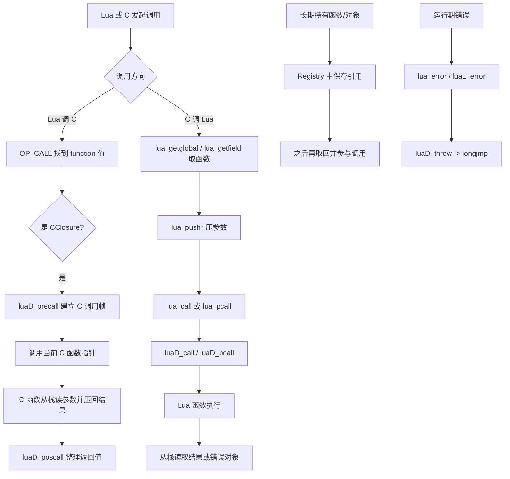
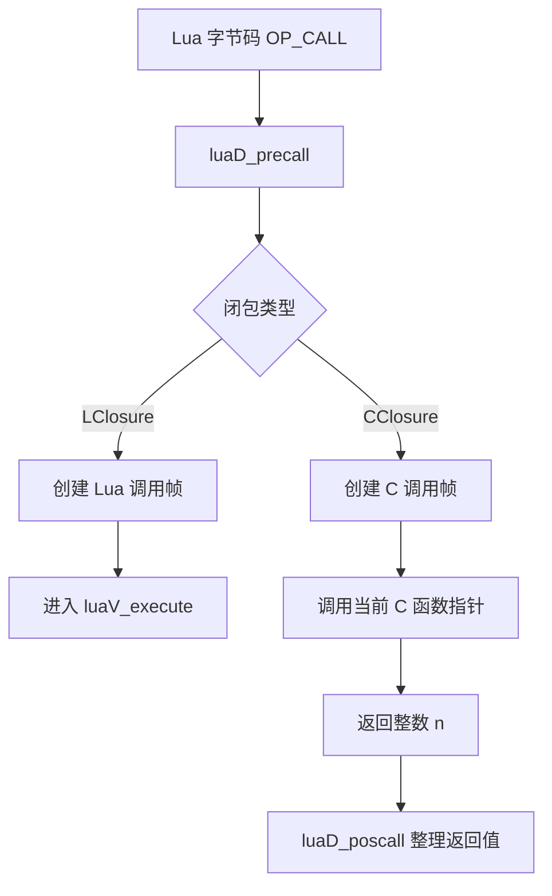
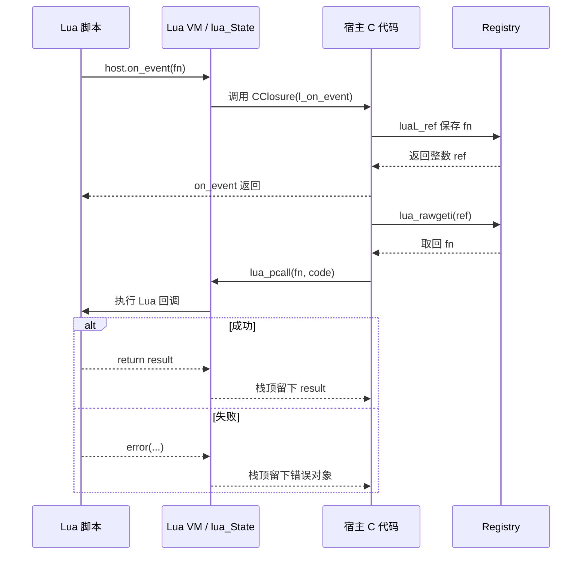

# 🔄 Lua 与 C/C++ 双向通信机制深度剖析

> **副标题**：从 API 表象到调用内核，从“会用”到“能解释为什么”
>
> **技术层级**：⭐⭐⭐☆
> **预计阅读时间**：90-120 分钟
> **核心源码文件**：`src/lapi.c`、`src/ldo.c`、`src/lfunc.c`、`src/lauxlib.c`、`src/lobject.h`、`src/lstate.h`、`src/lua.h`

---

## 🧭 如何使用本文档

这不是一篇适合从头到尾机械扫读的文档。它信息密度高、涉及多个源码文件，最有效的方式是按目标阅读。

### 你可以这样使用本文档

| 你的目标 | 推荐路径 | 预计时间 |
|----------|----------|----------|
| 先建立全局地图 | [1. 概览](#-1-概览先建立总模型) → [2. 整体架构](#️-2-整体架构把地图先装进脑中) | 10-15 分钟 |
| 搞清楚 C 函数如何暴露给 Lua | [3. 第一章](#-3-第一章c-函数如何变成-lua-函数) → [8.1 模块注册示例](#81-一个完整的-c-模块注册示例) | 20 分钟 |
| 搞清楚 C 如何保存 Lua 回调 | [4. 第二章](#-4-第二章c-端如何拿到-lua-函数) → [8.2 回调示例](#82-c-端保存并回调-lua-函数) | 20 分钟 |
| 理解 Lua 调 C 的真实调用链 | [5. 第三章](#-5-第三章lua-调用-c-函数时内部到底发生了什么) → [7.1 栈索引规则](#71-栈索引规则正索引负索引伪索引) | 25 分钟 |
| 理解 C 调 Lua 与错误边界 | [6. 第四章](#-6-第四章c-调用-lua-函数的完整流程) → [8.4 错误处理模板](#84-错误处理最佳实践模板) | 25 分钟 |
| 系统化掌握整套模型 | 按正文顺序完整通读 | 90-120 分钟 |

### 阅读标记说明

- 💡 **关键点**：必须记住的稳定模型。
- ⚠️ **陷阱**：最容易写错、理解错或调试卡住的地方。
- ✅ **最佳实践**：可以直接迁移到工程代码里的稳定写法。
- 🧠 **简化版**：先建立最小认知模型，再进入源码细节。
- 🔬 **完整版**：保留底层实现与调用链细节。
- 🧪 **自测 / 练习**：用来做主动回忆，避免“看懂了但过两天全忘”。

### 推荐学习节奏

> **第一次阅读**：先看每章的“先行组织者”和“简化版”，把主干记住。
>
> **第二次阅读**：再进入“完整版”，核对自己能否把 API 行为映射到 `Closure`、`CallInfo`、Registry、值栈和错误边界。
>
> **第三次阅读**：直接做每章末尾的自测题和微练习，检验是否真的内化。

### 本文档的认知设计原则

1. **先行组织者**：每章开头先给地图，再给细节。
2. **认知负荷管理**：每个小节尽量只解决一个核心问题。
3. **双重编码**：抽象概念同时配文字说明和图示。
4. **间隔重复**：核心概念会在不同章节以不同形式重现。
5. **主动学习**：每章末尾都给自测问题或动手任务。

---

## 📚 目录导航

- [🧭 如何使用本文档](#-如何使用本文档)
- [📌 1. 概览：先建立总模型](#-1-概览先建立总模型)
- [🏗️ 2. 整体架构：把地图先装进脑中](#️-2-整体架构把地图先装进脑中)
- [🔧 3. 第一章：C 函数如何变成 Lua 函数](#-3-第一章c-函数如何变成-lua-函数)
- [📥 4. 第二章：C 端如何拿到 Lua 函数](#-4-第二章c-端如何拿到-lua-函数)
- [📞 5. 第三章：Lua 调用 C 函数时，内部到底发生了什么](#-5-第三章lua-调用-c-函数时内部到底发生了什么)
- [📤 6. 第四章：C 调用 Lua 函数的完整流程](#-6-第四章c-调用-lua-函数的完整流程)
- [🧱 7. 第五章：参数传递、栈索引与生命周期管理](#-7-第五章参数传递栈索引与生命周期管理)
- [🛠️ 8. 第六章：完整实战示例](#️-8-第六章完整实战示例)
- [🔬 9. 第七章：完整调用链追踪](#-9-第七章完整调用链追踪从注册到回调再到错误边界)
- [📚 10. 关键数据结构与文件速查](#-10-关键数据结构与文件速查)
- [✅ 11. 学习检查清单](#-11-学习检查清单)
- [📚 12. 延伸阅读](#-12-延伸阅读)

---

## 📌 1. 概览：先建立总模型

> ⚠️ **版本说明**：本文主体严格基于 **Lua 5.1.5**。现代资料里常见的 `luaL_newlib` 属于 **Lua 5.2+** 的辅助接口，Lua 5.1.5 源码里并不存在它；因此本文会说明它和 `luaL_register` 的语义对应关系，但所有底层分析都以 5.1.5 实现为准。

### 本节学习目标

1. 先把 Lua/C 双向通信压缩成一套可记忆的最小模型。
2. 知道本文真正解释的不是“零散 API”，而是一整套统一协议。
3. 明确后续章节都会围绕哪几个核心对象展开。

### 这篇文档在解释什么

这篇文档不是简单罗列 Lua C API，而是要回答一个更底层的问题：

> **Lua 和 C/C++ 为什么能够“互相调用、互相传值、互相保存函数引用”，而且还能被同一个 GC 和同一套错误机制统一管理？**

如果只背 API，很容易把这些行为理解成一堆离散技巧：

- `lua_pushcfunction` 是注册函数的。
- `luaL_ref` 是保存回调的。
- `lua_pcall` 是安全调用的。
- `lua_upvalueindex` 是取闭包状态的。

但从源码实现看，它们背后其实是同一套统一机制的不同入口：

```text
同一个 lua_State
    ↓
同一段值栈（参数 / 返回值 / 临时值）
    ↓
同一套 Closure / CallInfo / Registry / GC 规则
    ↓
形成 Lua ↔ C 的双向通信协议
```


### 推荐前置知识

- 已理解 `Closure`、`LClosure`、`CClosure`、`UpVal` 的基本区别。
- 已知道 Lua 函数调用会经过 `luaD_precall` / `luaD_poscall`。
- 已知道 Lua 栈既是 API 交换区，也是 VM 执行时的值存储区。

### 读完本文后，你应该能做到

1. **解释** 为什么 C 函数在 Lua 里表现为普通 `function`，但内部其实是 `CClosure`。
2. **区分** `lua_pushcfunction`、`lua_pushcclosure`、`luaL_register` 各自做了什么，以及哪些只是宏包装。
3. **追踪** Lua 调 C 的调用链：`OP_CALL` → `luaD_precall` → `curr_func(L)->c.f`。
4. **追踪** C 调 Lua 的调用链：压栈 → `lua_call` / `lua_pcall` → `luaD_call` / `luaD_pcall`。
5. **解释** 为什么注册表引用能保活 Lua 函数，以及为什么裸栈索引不能当长期句柄。
6. **建立** 一套稳定的栈心智模型，能判断参数区、返回值区、伪索引和错误边界的含义。

### 本节核心要点总结

> 💡 **一句话压缩**：Lua 与 C/C++ 的双向通信，本质上不是“跨语言魔法”，而是“同一个 `lua_State` 上，对同一段值栈、同一套闭包对象和同一套调用边界规则的协作式操作”。

---

## 🏗️ 2. 整体架构：把地图先装进脑中

### 本章学习目标

1. 先记住最小可用 mental model。
2. 知道后续所有细节都围绕哪四个对象展开。
3. 提前避开三个最常见的认知误区。

### 先行组织者：本章会回答什么

```text
Q1. Lua ↔ C 通信到底在操作什么？
Q2. 有哪些关键对象始终在场？
Q3. 最容易把哪些问题想错？
```

### 2.0 压缩模型：先读这个最重要

> 🧠 **简化版**：先不要记 API 名字，先记动作类型。

> **Lua 与 C/C++ 的双向通信，本质 = 对同一个 `lua_State` 做四类操作：找到函数值、准备参数区、跨越调用边界、回收结果/管理生命周期。**

```text
方向一：Lua 调 C
  Lua 字节码 / Lua 代码
      ↓
  找到 CClosure
      ↓
  建立 C 调用帧（CallInfo）
      ↓
  C 函数从栈读取参数、向栈写回返回值

方向二：C 调 Lua
  C 代码取到 Lua function 值
      ↓
  手动压入函数和参数
      ↓
  lua_call / lua_pcall 建立调用边界
      ↓
  从栈读取返回值或错误对象

辅助机制：
  Registry 负责长期引用
  CClosure / LClosure 负责函数对象表示
  CallInfo 负责调用帧边界
  longjmp 负责错误传播
```

> 💡 **关键点**：跨语言调用并不是“跨出 Lua VM”，而是“在 Lua VM 内部，用 C API 参与同一套值栈与闭包协议”。

### 2.1 四个最重要的对象

| 对象 | 作用 | 你会在哪些场景反复看到它 |
|------|------|--------------------------|
| `TValue` | Lua 里一切值的统一表示 | 参数、返回值、upvalue、table 字段 |
| `Closure` | 函数对象本体 | `CClosure` 注册、`LClosure` 回调、`lua_tocfunction` |
| `CallInfo` | 调用帧边界 | Lua 调 C、C 调 Lua、结果整理 |
| `Registry` | 宿主可见的全局保活表 | `luaL_ref` / `luaL_unref`、元表注册、回调保存 |

### 2.2 总体流程图



### 2.3 常见误解 vs 正确理解

| 常见误解 | 正确理解 |
|----------|----------|
| “C 函数就是一个裸函数指针” | 错。Lua 持有的是 `CClosure` GC 对象，函数指针只是其中一个字段。 |
| “栈索引就是对象句柄” | 错。索引只是当前栈布局下的位置描述，长期句柄应该用注册表引用。 |
| “Lua 调 C 和 C 调 Lua 是两套体系” | 错。两者都围绕同一个 `lua_State`、同一套值栈和调用帧规则展开，只是入口方向不同。 |

### 2.4 本章核心要点总结

1. 先记住“同一个 `lua_State` + 同一段值栈 + 同一套调用边界”。
2. 后面所有 API 都可以映射回 `Closure`、`CallInfo`、Registry 和错误跳转。
3. 如果你把“函数值”“栈位置”“调用帧”混为一谈，后面会持续混乱。

### 2.5 微练习

> 🧪 用自己的话复述下面这句话，不看原文也能说清：
>
> **“Lua 与 C 的双向通信，本质是对同一个 `lua_State` 中的值栈、闭包对象、注册表引用和错误边界进行协作式操作。”**

---

## 🔧 3. 第一章：C 函数如何变成 Lua 函数

### 本章学习目标

1. 解释为什么 Lua 里的 C 函数值本体不是裸函数指针，而是 `CClosure`。
2. 区分 `lua_pushcfunction` 与 `lua_pushcclosure` 的关系。
3. 理解 `luaL_register` 在 Lua 5.1.5 中的真实工作方式。

### 先行组织者：本章结构图

```text
注册一个 C 函数
    ↓
不是“把指针塞给 Lua”
    ↓
而是“创建 CClosure 并把它写进 table”
    ↓
于是它成为普通 Lua function 值
```

### 3.0 本章的两层阅读方式

> 🧠 **简化版**：C 函数进入 Lua 的过程，核心不是“导出符号”，而是“把 C 指针包装成 `CClosure`，然后作为普通 `function` 值参与 Lua 的 table / stack / GC 体系”。

> 🔬 **完整版**：继续往下看 `lua_pushcclosure`、`luaL_register`、元表方法注册和 upvalue 复制细节。

### 3.1 你看到的是函数名，Lua 看到的是 `CClosure`

**这段代码在做什么**：演示最基础的“把一个 C 函数注册为 Lua 全局函数”。

```c
static int l_add(lua_State *L) {
    double a = luaL_checknumber(L, 1);
    double b = luaL_checknumber(L, 2);
    lua_pushnumber(L, a + b);
    return 1;
}

lua_pushcfunction(L, l_add);
lua_setglobal(L, "add");
```

**这段 Lua 代码在做什么**：从 Lua 侧调用刚才注册到全局表中的函数值。

```lua
print(add(3, 4))  --> 7
```

表面上你会觉得“把一个 C 函数注册成了 Lua 函数”。但 Lua VM 真正做的事情是：

1. 在堆上分配一个 `CClosure` 对象。
2. 把 C 函数指针 `l_add` 填进 `CClosure.f`。
3. 把这个 `CClosure` 作为一个 `LUA_TFUNCTION` 类型的值压到 Lua 栈上。
4. 再通过 `lua_setglobal` 把这个函数值写进全局表 `_G.add`。

```text
你写的 l_add 函数指针
      ↓
被包装进 CClosure（堆对象）
      ↓
再作为一个普通 Lua function 值参与 table / stack / GC 体系
```

> 💡 **关键点**：Lua 侧看不出一个函数是“原生 C 函数”还是“Lua 字节码函数”，因为它们在类型系统里都只是 `function`。

### 3.2 `lua_pushcfunction` vs `lua_pushcclosure`

**这段代码在做什么**：说明 `lua_pushcfunction` 只是一个宏包装，真正干活的是 `lua_pushcclosure`。

```c
#define lua_pushcfunction(L,f)  lua_pushcclosure(L, (f), 0)
```

二者关系如下：

| 接口 | 本质 | 是否携带 upvalue | 适用场景 |
|------|------|------------------|----------|
| `lua_pushcfunction` | `lua_pushcclosure(..., 0)` 的宏包装 | ❌ 否 | 无状态 C 函数 |
| `lua_pushcclosure` | 真正的底层实现 | ✅ 是 | 需要闭包状态、共享配置、回调上下文 |

**这段源码在做什么**：展示 `lapi.c` 中 `lua_pushcclosure` 的核心流程，它会创建闭包对象、复制 upvalue、再把闭包值压栈。

```c
cl = luaF_newCclosure(L, n, getcurrenv(L));
cl->c.f = fn;
L->top -= n;
while (n--)
    setobj2n(L, &cl->c.upvalue[n], L->top+n);
setclvalue(L, L->top, cl);
api_incr_top(L);
```

从这段实现里可以提炼出三个稳定结论：

1. `lua_pushcclosure` 会创建 `CClosure` 对象，底层调用的是 `luaF_newCclosure`。
2. 栈顶的 `n` 个值会被**消费掉**，拷贝到 `cl->c.upvalue[]` 中。
3. 最终压栈的是一个闭包对象，不是函数指针本身。

### 3.3 `CClosure` 的底层结构

**这段定义在做什么**：展示 C 闭包对象在 `lobject.h` 中的内存布局。

```c
typedef struct CClosure {
    ClosureHeader;
    lua_CFunction f;
    TValue upvalue[1];
} CClosure;
```

| 字段 | 含义 |
|------|------|
| `ClosureHeader` | GC 头、`isC` 标记、上值数量、环境表 |
| `f` | C 函数指针 |
| `upvalue[]` | C 闭包私有的 `TValue` 数组 |

### 3.4 为什么 C 闭包的 upvalue 是“直接存值”

Lua 闭包 `LClosure` 的上值是 `UpVal *` 指针数组，因为 Lua 闭包需要共享词法变量。

C 闭包不同。它的语义是：

> “注册时我给你几个固定状态值，之后用 `lua_upvalueindex(i)` 读出来。”

所以它不需要 `UpVal` 的开放/关闭机制，只需把值直接放进闭包对象里：

```text
CClosure
┌─────────────────────────────┐
│ ClosureHeader               │
│ f = &l_add                  │
│ upvalue[0] = 42             │
│ upvalue[1] = "config"      │
└─────────────────────────────┘
```

### 3.5 一个最小 upvalue 示例

**这段代码在做什么**：把整数状态塞进 C 闭包 upvalue 中，让 C 函数每次调用都能读取并更新它。

```c
static int l_counter(lua_State *L) {
    int value = (int)lua_tointeger(L, lua_upvalueindex(1));
    value++;
    lua_pushinteger(L, value);
    lua_pushinteger(L, value);
    lua_replace(L, lua_upvalueindex(1));
    return 1;
}

lua_pushinteger(L, 0);
lua_pushcclosure(L, l_counter, 1);
lua_setglobal(L, "counter");
```

**这段 Lua 代码在做什么**：验证状态确实被保存在闭包内部，而不是每次调用都重新初始化。

```lua
print(counter()) --> 1
print(counter()) --> 2
```

> 💡 **关键点**：`lua_upvalueindex(1)` 不是普通栈索引，而是一个**伪索引**。它访问的是“当前 C 闭包对象内部保存的上值槽位”。

### 3.6 `luaL_register` / `luaL_newlib` 的工作原理

#### 先说结论

- **Lua 5.1.5 真正使用的是 `luaL_register` / `luaL_openlib` / `luaI_openlib`**。
- **`luaL_newlib` 是 Lua 5.2+ 的 API**，可以把它理解为“创建 table 再批量塞函数”的现代包装。

#### `luaL_Reg` 是什么

**这段定义在做什么**：描述“Lua 名称字符串 → C 函数指针”的注册表项结构。

```c
typedef struct luaL_Reg {
    const char *name;
    lua_CFunction func;
} luaL_Reg;
```

**这段代码在做什么**：定义一个最典型的 C 模块函数表。

```c
static const luaL_Reg mylib[] = {
    {"add", l_add},
    {"sub", l_sub},
    {NULL, NULL}
};
```

#### `luaL_register` 做了什么

**这段源码在做什么**：说明 `luaL_register` 本身很薄，真正核心在 `luaI_openlib`。

```c
LUALIB_API void (luaL_register)(lua_State *L, const char *libname,
                                const luaL_Reg *l) {
    luaI_openlib(L, libname, l, 0);
}
```

`luaI_openlib` 的核心动作是：

1. 如果 `libname != NULL`，它会在 `_LOADED[libname]` 和全局表里查找或创建模块表。
2. 遍历 `luaL_Reg` 数组。
3. 对每一项执行 `lua_pushcclosure(L, l->func, nup)`。
4. 再执行 `lua_setfield` 把闭包放到模块表对应字段里。

```text
luaL_register(L, "mylib", mylib)
    = 确保有一个模块 table
    + 为每个 C 函数创建 CClosure
    + table[函数名] = 这个闭包
```

#### `luaL_newlib` 在概念上对应什么

**这段伪代码在做什么**：说明现代 `luaL_newlib` 的语义可以近似看成“先建 table，再注册”。

```c
lua_newtable(L);
luaL_register(L, NULL, lib);
```

但在 **Lua 5.1.5 源码里并没有这个 API**。因此研究 5.1.5 时，不要把现代封装接口误认为底层机制本身。

### 3.7 全局函数、模块函数、元表方法的注册路径

> 🧠 **简化版**：这三种写法表面不同，底层其实都是“把一个闭包写进某个 table”。

#### 1. 全局函数注册

**这段代码在做什么**：把 C 闭包写入全局表 `_G`。

```c
lua_pushcfunction(L, l_add);
lua_setglobal(L, "add");
```

**这段宏定义在做什么**：揭示 `lua_setglobal` 本质只是对全局表做 `setfield`。

```c
#define lua_setglobal(L,s) lua_setfield(L, LUA_GLOBALSINDEX, (s))
```

本质就是：

```text
_G["add"] = CClosure(l_add)
```

#### 2. 模块注册

**这段代码在做什么**：把一组 C 闭包写入模块表。

```c
luaL_register(L, "mylib", mylib);
```

本质是：

```text
module_table["add"] = CClosure(l_add)
module_table["sub"] = CClosure(l_sub)
...
```

#### 3. 元表方法注册

**这段代码在做什么**：把一组 C 闭包注册到元表里，并让 `__index` 指向元表自身。

```c
luaL_newmetatable(L, "MyType");
lua_pushvalue(L, -1);
lua_setfield(L, -2, "__index");
luaL_register(L, NULL, methods);
```

这里 `luaL_register(L, NULL, methods)` 的意思是：**向当前栈顶那个表注册方法，而不是创建命名模块。**

最终结构：

```text
metatable
├── __index = metatable
├── foo = CClosure(l_foo)
├── bar = CClosure(l_bar)
└── __gc = CClosure(l_gc)
```

**这段 Lua 代码在做什么**：从 Lua 语法层调用元表方法。

```lua
obj:foo()
```

底层等价于：

```lua
obj.foo(obj)
```

### 3.8 常见误解 vs 正确理解

| 常见误解 | 正确理解 |
|----------|----------|
| “`lua_pushcfunction` 是把函数指针直接压栈” | 错。它创建的是 `CClosure`，压栈的是 Lua function 值。 |
| “`luaL_newlib` 是 5.1.5 的底层入口” | 错。5.1.5 分析必须回到 `luaL_register` / `luaI_openlib`。 |
| “upvalue 只是临时占了几个栈槽位” | 错。`lua_pushcclosure` 会消费栈顶值并复制进闭包内部。 |

### 3.9 陷阱与最佳实践

⚠️ **陷阱一：把 `lua_pushcfunction` 当成“推函数指针”**

错误心智模型：

```text
push 一个裸 C 指针
```

正确心智模型：

```text
分配 CClosure GC 对象
→ 把指针放进闭包
→ 推入一个 Lua function 值
```

⚠️ **陷阱二：误以为 `luaL_newlib` 是 5.1.5 的底层接口**

如果你研究的是 Lua 5.1.5 源码，就必须回到 `luaL_register` / `luaI_openlib`。否则你会错过模块注册真正涉及的 `_LOADED` 表、全局表写入和 upvalue 复制过程。

⚠️ **陷阱三：忘记 `lua_pushcclosure` 会消耗栈顶 n 个值**

**这段代码在做什么**：演示闭包创建前压入的两个值会被消费并移动到闭包内部。

```c
lua_pushinteger(L, 10);
lua_pushstring(L, "cfg");
lua_pushcclosure(L, l_func, 2);
```

这之后，`10` 和 `"cfg"` 已经不在普通栈位置上了；它们被复制进闭包内部了。

✅ **最佳实践**

- 无状态函数用 `lua_pushcfunction`，有状态函数直接用 `lua_pushcclosure`。
- 模块方法统一用 `luaL_Reg` 数组管理，减少手写重复注册代码。
- 元表方法注册时，把 `__index` 设为元表自身，这是 5.1 里最常见也最稳定的写法。
- 需要共享配置、计数器、上下文指针时，优先考虑 upvalue，而不是 C 全局变量。

### 3.10 本章核心要点总结

1. C 函数在 Lua 里并不是裸指针，而是 `CClosure`。
2. `lua_pushcfunction` 只是 `lua_pushcclosure(..., 0)` 的语法糖。
3. 注册全局函数、模块函数、元表方法，底层都是“创建闭包并写入某个 table”。

### 3.11 自测问题

| # | 问题 | 提示 |
|---|------|------|
| 1 | `lua_pushcfunction` 和 `lua_pushcclosure` 的本质关系是什么？ | 宏展开；n=0 |
| 2 | 为什么 Lua 侧看不到“这是 C 函数还是 Lua 函数”的类型区别？ | 都是 `LUA_TFUNCTION` |
| 3 | `luaL_register` 在 5.1.5 中最终是如何把函数放进模块表的？ | `luaI_openlib`、`lua_setfield` |
| 4 | CClosure 的 upvalue 为什么不需要 `UpVal` 结构？ | 直接存值；不需要词法共享 |
| 5 | `lua_setglobal(L, "f")` 的底层本质是什么？ | `lua_setfield(L, LUA_GLOBALSINDEX, "f")` |

### 3.12 动手练习

> 🧪 尝试自己写一个 `lua_pushcclosure` 版本的 `l_logger`，把日志前缀字符串作为 upvalue 保存，并在函数里通过 `lua_upvalueindex(1)` 读取它。

---

## 📥 4. 第二章：C 端如何拿到 Lua 函数

### 本章学习目标

1. 理解 `lua_getglobal` / `lua_getfield` 只是“按 Lua 规则取值”。
2. 理解为什么长期保存 Lua 函数必须依赖注册表引用。
3. 能区分“拿到 CClosure 的函数指针”和“拿到 Lua 闭包本体”之间的差别。

### 先行组织者：本章结构图

```text
C 端要拿到 Lua 函数
    ↓
临时使用：直接 getglobal / getfield
    ↓
长期保存：必须进 Registry
    ↓
因为栈索引不是句柄，Lua 闭包也不是 C 函数指针
```

### 4.0 本章的两层阅读方式

> 🧠 **简化版**：短期使用函数值，直接压栈取出来；长期持有函数值，必须把它变成一个 registry reference。

> 🔬 **完整版**：继续看 `luaV_gettable`、`luaL_ref` 的 freelist 机制，以及 `lua_iscfunction` / `lua_tocfunction` 的边界。

### 4.1 `lua_getglobal` 与 `lua_getfield`

**这段 Lua 代码在做什么**：定义一个全局函数和一个 table 中的回调函数。

```lua
function greet(name)
    return "hello, " .. name
end

callbacks = {
    on_ok = function(x) return x * 2 end
}
```

**这段 C 代码在做什么**：从全局表和 table 字段中取回函数值。

```c
lua_getglobal(L, "greet");
lua_getglobal(L, "callbacks");
lua_getfield(L, -1, "on_ok");
```

**这段宏定义在做什么**：说明 `lua_getglobal` 只是 `lua_getfield` 针对全局表的包装。

```c
#define lua_getglobal(L,s) lua_getfield(L, LUA_GLOBALSINDEX, (s))
```

**这段源码在做什么**：展示 `lapi.c` 中 `lua_getfield` 的核心逻辑，它不是裸哈希查询，而是通过 `luaV_gettable` 按 Lua 语言语义取字段。

```c
setsvalue(L, &key, luaS_new(L, k));
luaV_gettable(L, t, &key, L->top);
api_incr_top(L);
```

这说明：

1. 字段名 `k` 先被做成一个 Lua 字符串对象。
2. 再通过 `luaV_gettable` 做真正的表访问。
3. 这个访问**可能触发 `__index` 元方法**。

> 💡 **关键点**：`lua_getfield` 的语义不是“仅仅查 table 哈希桶”，而是“按 Lua 语言规则读字段”。

### 4.2 `luaL_ref` / `luaL_unref`：让 Lua 函数在 C 端长期存活

**这段代码在做什么**：把全局函数 `greet` 保存到注册表里，并拿到一个整数引用编号。

```c
lua_getglobal(L, "greet");
int ref = luaL_ref(L, LUA_REGISTRYINDEX);
```

**这段代码在做什么**：稍后再根据引用编号把函数值取回栈顶。

```c
lua_rawgeti(L, LUA_REGISTRYINDEX, ref);
```

为什么这能防止函数被 GC 回收？

因为你把这个 Lua 函数值放进了**注册表**。注册表是一个始终可达的特殊 table；只要函数值还被注册表引用，它就是 GC 可达对象。

#### `luaL_ref` 的内部机制

`lauxlib.c` 中的 `luaL_ref` 做了几件事：

1. 把索引 `t` 变成绝对索引，避免负索引在栈变动后失效。
2. 如果栈顶是 `nil`，直接返回 `LUA_REFNIL`。
3. 读取 `t[0]`，这里存的是**空闲引用链表头**。
4. 如果有可复用的引用编号，就拿来复用；否则 `ref = lua_objlen(t) + 1` 新分配一个整数索引。
5. 把栈顶值写入 `t[ref]`。

```text
registry_table[整数ID] = 你的 Lua 值
registry_table[0] = 空闲ID链表头
```

#### 引用表示意图

```text
LUA_REGISTRYINDEX
┌──────────────────────────────┐
│ [0] = 7                      │  ← freelist 头
│ [1] = function greet(...)    │
│ [2] = table callbacks        │
│ [3] = userdata conn          │
│ [7] = 下一个空闲编号         │
└──────────────────────────────┘
```

### 4.3 为什么不能只在 C 变量里存 `lua_CFunction` 或栈索引

1. **Lua 函数不是 C 函数指针**。Lua 函数本体是 `LClosure`，不能转换成 `lua_CFunction`。
2. **栈索引是暂时位置，不是稳定句柄**。一旦你 `lua_call`、`lua_pop`、`lua_settop`，索引就可能变了。
3. **只有把对象放进一个 GC 可见的位置**，比如注册表、全局表、可达 table，Lua GC 才知道它还活着。

### 4.4 从 Lua 视角看函数对象类型

**这段 Lua 代码在做什么**：说明从 Lua 层看，C 函数和 Lua 闭包都只是 `function`。

```lua
print(type(print))         --> function
print(type(function() end))--> function
```

**这段 C 代码在做什么**：只对 `CClosure` 尝试还原 `lua_CFunction` 指针。

```c
if (lua_iscfunction(L, idx)) {
    lua_CFunction f = lua_tocfunction(L, idx);
}
```

**这段源码在做什么**：说明 `lua_tocfunction` 只对 `CClosure` 返回有效指针。

```c
return (!iscfunction(o)) ? NULL : clvalue(o)->c.f;
```

| 情况 | `lua_iscfunction` | `lua_tocfunction` |
|------|-------------------|-------------------|
| CClosure | ✅ true | 返回 `lua_CFunction` 指针 |
| Lua 闭包 (`LClosure`) | ❌ false | 返回 `NULL` |

> 💡 **关键点**：Lua 函数值统一表现为 `function`，但只有 `CClosure` 才能被还原成 `lua_CFunction` 指针；Lua 字节码函数永远不能被“转换成 C 函数指针”。

### 4.5 常见误解 vs 正确理解

| 常见误解 | 正确理解 |
|----------|----------|
| “取字段就是查 table 哈希桶” | 错。`lua_getfield` 可能触发 `__index` 元方法。 |
| “负索引可以当长期句柄” | 错。负索引永远是相对当前栈顶解释的。 |
| “保存 Lua 回调就是缓存一个函数指针” | 错。长期保活必须依赖 Registry 或其他 GC 可达根。 |

### 4.6 陷阱与最佳实践

⚠️ **陷阱一：把负索引当成长期稳定句柄**

**这段代码在做什么**：展示一个典型误用，`-1` 在后续栈操作后很可能已经不再指向原来的函数。

```c
lua_getglobal(L, "cb");
int idx = -1;
/* 这里再做若干 push/pop */
lua_call(L, 0, 0);  /* 很可能已经不是原来的函数了 */
```

⚠️ **陷阱二：只在 C 全局变量里缓存“函数指针”**

Lua 闭包不是 `lua_CFunction`，你根本拿不到指针。即使是 CClosure，也不能靠缓存指针就代替 Lua 引用管理，因为 GC 生命周期还是由 Lua 对象图决定。

⚠️ **陷阱三：保存引用后忘记 `luaL_unref`**

这会导致注册表持续持有对象，形成逻辑上的“GC 泄漏”。函数本身也许不大，但它闭包捕获的 table、userdata、环境链条可能很大。

✅ **最佳实践**

- 临时调用用 `lua_getglobal` / `lua_getfield` 即取即调。
- 需要异步回调、事件监听、长期保存时，用 `luaL_ref` 存注册表引用。
- 不再需要时，用 `luaL_unref` 释放引用。
- 对外暴露“设置回调”的 C API 时，要把 ref 管理收口到一个明确的生命周期里。

### 4.7 本章核心要点总结

1. `lua_getglobal` / `lua_getfield` 拿到的是 Lua 值，不是宿主层面的特殊句柄。
2. 长期持有 Lua 函数时，必须给它一个 GC 可见的锚点，最常见就是 Registry。
3. 只有 `CClosure` 可以转回 `lua_CFunction`，Lua 闭包不行。

### 4.8 自测问题

| # | 问题 | 提示 |
|---|------|------|
| 1 | `lua_getglobal` 为什么说只是 `lua_getfield` 的包装？ | `LUA_GLOBALSINDEX` |
| 2 | `lua_getfield` 为什么可能触发元方法？ | `luaV_gettable` |
| 3 | 为什么 `luaL_ref` 能阻止 Lua 函数被 GC 回收？ | 注册表可达性 |
| 4 | 为什么不能把 Lua 闭包保存成 `lua_CFunction`？ | `LClosure` 不是 C 指针 |
| 5 | `luaL_unref` 不调用会出现什么问题？ | 注册表残留引用 |

### 4.9 动手练习

> 🧪 试着实现一个 `save_handler(L, idx)` 辅助函数：
>
> 1. 先把 `idx` 转成绝对索引。
> 2. 复制该值到栈顶。
> 3. 调用 `luaL_ref` 返回引用编号。

---

## 📞 5. 第三章：Lua 调用 C 函数时，内部到底发生了什么

### 本章学习目标

1. 理解 `OP_CALL` 如何分派到 C 闭包调用路径。
2. 理解 `lua_CFunction` 的调用约定。
3. 理解参数、返回值和错误为什么都围绕同一段值栈工作。

### 先行组织者：本章结构图

```text
Lua 发起调用
    ↓
OP_CALL
    ↓
luaD_precall
    ↓
识别为 CClosure
    ↓
curr_func(L)->c.f(L)
    ↓
返回 n 个结果
    ↓
luaD_poscall 整理现场
```

### 5.0 简化版：先记 5 步

```text
Lua 代码发起调用
    ↓
OP_CALL 进入 luaD_precall
    ↓
识别出被调值是 CClosure
    ↓
直接调用 curr_func(L)->c.f(L)
    ↓
C 函数返回 n 个结果，luaD_poscall 整理调用现场
```

> 💡 **关键点**：Lua 调 C 并不是“跳出虚拟机去执行外部逻辑”，而是“在同一个 `lua_State` 上，临时建立一个 C 风格调用帧，让 C 函数也按 Lua 的参数/返回值协议工作”。

### 5.1 从 `OP_CALL` 到 `luaD_precall`

**这段 Lua 代码在做什么**：触发一次最普通的函数调用，如果 `add` 是 C 函数，就会走 C 调用分支。

```lua
local r = add(10, 20)
```

**这段 VM 代码在做什么**：在 `OP_CALL` 处先进入统一的预调用分派逻辑。

```c
switch (luaD_precall(L, ra, nresults)) {
    case PCRLUA: { ... }
    case PCRC:  { ... }
    default:    { return; }
}
```

一次函数调用先不急着“直接跑”，而是先做一个**预调用分派**：

1. 当前指令 `OP_CALL` 找到被调用值所在寄存器 `ra`。
2. 进入 `luaD_precall`。
3. `luaD_precall` 判断这是 Lua 闭包还是 CClosure。
4. 如果是 Lua 闭包，搭建 Lua 调用帧并转到字节码执行。
5. 如果是 CClosure，直接调用 `curr_func(L)->c.f(L)`。

#### 调用流程图



### 5.2 `luaD_precall` 的 C 函数分支

**这段源码在做什么**：展示 `ldo.c` 中进入 C 函数调用前后的关键现场搭建与收尾逻辑。

```c
luaD_checkstack(L, LUA_MINSTACK);
ci = inc_ci(L);
ci->func = restorestack(L, funcr);
L->base = ci->base = ci->func + 1;
...
lua_unlock(L);
n = (*curr_func(L)->c.f)(L);
lua_lock(L);
if (n < 0) return PCRYIELD;
else {
    luaD_poscall(L, L->top - n);
    return PCRC;
}
```

这段代码值得慢慢消化：

1. **C 函数也有自己的 `CallInfo` 调用帧**。
2. 参数区的基址被设为 `func + 1`，也就是函数对象后面的第一个槽位。
3. 真正的 C 函数调用就是一个普通的 C 函数指针调用。
4. C 函数返回的 `int n`，并不是状态码，而是“返回值个数”。
5. 返回后由 `luaD_poscall` 统一整理结果，把返回值搬回调用者期望的位置。

### 5.3 `lua_CFunction` 的调用约定

**这段定义在做什么**：定义所有 Lua C 函数必须遵守的统一调用签名。

```c
typedef int (*lua_CFunction) (lua_State *L);
```

这个签名看起来极其简单，但背后约定非常强：

| 约定 | 含义 |
|------|------|
| 参数入口 | 所有参数都已经放在 `L` 的当前调用帧栈区里 |
| 参数读取 | 通过 `lua_tonumber(L, 1)`、`luaL_checkstring(L, 2)` 等读取 |
| 返回方式 | 把返回值压到栈顶 |
| 返回整数 `n` | 告诉 VM “我压了多少个返回值” |
| 错误处理 | 通过 `lua_error` / `luaL_error` 抛出，不通过 C 返回码 |

**这段代码在做什么**：展示一个标准的“读参数 → 压结果 → 返回结果个数”的 C API 函数。

```c
static int l_add(lua_State *L) {
    double a = luaL_checknumber(L, 1);
    double b = luaL_checknumber(L, 2);
    lua_pushnumber(L, a + b);
    return 1;
}
```

语义上等价于：

```text
读取参数1和参数2
→ 计算结果
→ 把结果推到当前调用帧结果区
→ 告诉 VM：有 1 个返回值
```

### 5.4 参数与返回值在栈上如何流动

```text
调用前（调用者视角）
┌───────────────┐
│ ...           │
│ add           │  ← func
│ 10            │  ← arg1 / index 1
│ 20            │  ← arg2 / index 2
└───────────────┘

进入 C 函数后（被调者视角）
base = func + 1
index 1 -> 10
index 2 -> 20

C 函数压入返回值后
┌───────────────┐
│ ...           │
│ add           │
│ 10            │
│ 20            │
│ 30            │  ← 返回值
└───────────────┘

返回整理后
┌───────────────┐
│ ...           │
│ 30            │
└───────────────┘
```

> 💡 **关键点**：C 函数执行时，并没有一块“独立于 Lua 的参数结构”。参数和返回值都只是同一个值栈中的不同区域，由 `CallInfo` 和 `base/top` 指针定义语义。

### 5.5 `lua_error` / `luaL_error` 的错误传播路径

> 🧠 **简化版**：Lua/C 绑定里的错误不是靠返回码层层上传，而是靠 `longjmp` 直接跳出当前执行路径。

**这段源码在做什么**：`luaL_error` 先拼错误信息，再把错误对象交给 `lua_error` 抛出。

```c
luaL_where(L, 1);
lua_pushvfstring(L, fmt, argp);
lua_concat(L, 2);
return lua_error(L);
```

**这段源码在做什么**：`lua_error` 最终把控制权交给通用错误处理链。

```c
luaG_errormsg(L);
```

**这段源码在做什么**：`luaD_throw` 通过 `longjmp` 跳转到最近的保护边界。

```c
if (L->errorJmp) {
    L->errorJmp->status = errcode;
    LUAI_THROW(L, L->errorJmp);
}
```

完整路径：

```text
luaL_error
  → 生成错误对象
  → lua_error
  → luaG_errormsg
  → luaD_throw
  → longjmp 到最近的保护边界（如 lua_pcall）
```

这为什么重要：

- `luaL_error` **不会正常返回**。
- 你不能指望 `return luaL_error(...)` 之后还有清理代码执行。
- 任何需要释放的 C 资源，要么提前清理，要么用受保护调用把风险边界包起来。

### 5.6 常见误解 vs 正确理解

| 常见误解 | 正确理解 |
|----------|----------|
| “C 函数拿到的是一套独立参数结构” | 错。参数就在当前调用帧值栈里。 |
| “`lua_CFunction` 返回值是状态码” | 错。返回值表示返回结果个数。 |
| “`luaL_error` 只是返回一个错误值” | 错。它会触发 longjmp，不会正常返回。 |

### 5.7 陷阱与最佳实践

⚠️ **陷阱一：忘记 C 函数返回值个数和实际压栈数必须一致**

**这段代码在做什么**：演示一个“压了 2 个值却只返回 1”的错误示例。

```c
static int bad(lua_State *L) {
    lua_pushnumber(L, 1);
    lua_pushnumber(L, 2);
    return 1;  /* 错误：实际压了2个，只报告1个 */
}
```

⚠️ **陷阱二：把 `luaL_error` 当普通返回路径**

**这段代码在做什么**：演示错误路径上的清理代码为什么不会执行。

```c
static int bad(lua_State *L) {
    FILE *f = fopen("x.txt", "r");
    if (!f) {
        luaL_error(L, "open failed");
        fclose(f);  /* 永远不会执行 */
    }
    return 0;
}
```

⚠️ **陷阱三：在 C 函数里直接假定参数类型正确**

如果你写绑定库，优先用 `luaL_check*` 而不是裸 `lua_to*`。后者失败时通常只是返回 0 / NULL，容易把调用错误变成悄悄的数据污染。

✅ **最佳实践**

- 用 `luaL_check*` 做参数验证。
- 保证“压几个返回值，就 `return` 几”。
- 会分配资源的路径，先考虑错误路径如何清理。
- 只要边界外可能是用户脚本，就优先用 `lua_pcall` 承接错误，而不是裸 `lua_call`。

### 5.8 本章核心要点总结

1. Lua 调 C 的入口是 `OP_CALL` → `luaD_precall`。
2. C 函数和 Lua 函数一样，都运行在同一个 `lua_State` 和同一段值栈上。
3. 错误传播依赖 `luaD_throw` / `longjmp`，不是普通返回码风格。

### 5.9 自测问题

| # | 问题 | 提示 |
|---|------|------|
| 1 | `OP_CALL` 调到 C 函数时，为什么会先进 `luaD_precall`？ | 统一分派 |
| 2 | `lua_CFunction` 返回的 `int` 表示什么？ | 返回值个数 |
| 3 | C 函数参数在内部是如何传递的？ | 当前调用帧值栈 |
| 4 | `luaL_error` 为什么说“不会返回”？ | longjmp |
| 5 | `luaD_poscall` 在 C 函数返回后负责什么？ | 整理结果区 |

### 5.10 动手练习

> 🧪 把一个现有 C API 函数改写成更稳妥的版本：
>
> 1. 用 `luaL_check*` 替代裸 `lua_to*`。
> 2. 检查返回值个数是否与压栈数一致。
> 3. 标出任何可能被 `luaL_error` 跳过的资源清理点。

---

## 📤 6. 第四章：C 调用 Lua 函数的完整流程

### 本章学习目标

1. 理解为什么函数必须先压栈、参数必须后压栈。
2. 理解 `lua_call` 和 `lua_pcall` 的本质差异。
3. 理解多返回值和错误处理函数 `errfunc` 的真实语义。

### 先行组织者：本章结构图

```text
C 侧要调用 Lua
    ↓
先把 function 值压栈
    ↓
再把参数按顺序压栈
    ↓
调用 lua_call 或 lua_pcall
    ↓
读取返回值或错误对象
```

### 6.0 简化版：先记 5 步

```text
先把 function 值压栈
    ↓
再把参数按顺序压栈
    ↓
调用 lua_call 或 lua_pcall
    ↓
Lua VM 建立调用边界并执行函数
    ↓
结果或错误对象留在栈顶，C 侧自行读取
```

> 💡 **关键点**：C 并不是“把参数传进 Lua 函数”，而是在 `lua_State` 的值栈上手工摆出一个 Lua 调用现场。

### 6.1 `lua_call` vs `lua_pcall`

**这段代码在做什么**：以不保护方式调用全局 Lua 函数 `greet`，如果内部出错，错误会继续向外 longjmp。

```c
lua_getglobal(L, "greet");
lua_pushstring(L, "Lua");
lua_call(L, 1, 1);
```

**这段代码在做什么**：以保护方式调用同一个函数，并在失败时从栈顶读取错误对象。

```c
lua_getglobal(L, "greet");
lua_pushstring(L, "Lua");
if (lua_pcall(L, 1, 1, 0) != 0) {
    const char *err = lua_tostring(L, -1);
    lua_pop(L, 1);
}
```

**这段源码在做什么**：说明 `lua_call` 直接走 `luaD_call`。

```c
func = L->top - (nargs+1);
luaD_call(L, func, nresults);
```

**这段源码在做什么**：说明 `lua_pcall` 通过 `luaD_pcall` 建立保护边界。

```c
status = luaD_pcall(L, f_call, &c, savestack(L, c.func), func);
```

| 接口 | 底层行为 | 出错时 |
|------|----------|--------|
| `lua_call` | 直接调用 `luaD_call` | 错误继续 longjmp 向外抛 |
| `lua_pcall` | 通过 `luaD_pcall` 建立保护边界 | 捕获错误并返回状态码 |

准确的心理模型：

```text
lua_call  = “我确信这里出错就该直接炸出去”
lua_pcall = “我在这里设置 try/catch 边界”
```

### 6.2 参数压栈顺序、多返回值与 `LUA_MULTRET`

#### 参数压栈顺序

```text
先把函数压栈
再按从左到右的顺序压参数
最后调用 lua_call / lua_pcall
```

**这段代码在做什么**：按标准调用约定手工摆出一个 `f(1, 2, "x")` 的 Lua 调用现场。

```c
lua_getglobal(L, "f");
lua_pushnumber(L, 1);
lua_pushnumber(L, 2);
lua_pushstring(L, "x");
lua_pcall(L, 3, 2, 0);
```

栈形态：

```text
... | f | 1 | 2 | "x"
```

#### 多返回值

**这段 Lua 代码在做什么**：定义一个返回两个结果的函数。

```lua
function pair()
    return 10, 20
end
```

**这段 C 代码在做什么**：显式接收两个返回值，并从栈顶读取它们。

```c
lua_getglobal(L, "pair");
lua_call(L, 0, 2);
int a = (int)lua_tointeger(L, -2);
int b = (int)lua_tointeger(L, -1);
lua_pop(L, 2);
```

#### `LUA_MULTRET`

**这段定义在做什么**：告诉 VM 当前调用方希望接收全部实际返回值。

```c
#define LUA_MULTRET (-1)
```

这不是“无限多返回值”的魔法开关，而是告诉 VM：

> “不要在调用边界截断结果，调用者要接收**所有实际返回值**。”

**这段代码在做什么**：先记住调用前栈顶基线，再计算本次调用新增了多少返回值。

```c
int base = lua_gettop(L);
lua_getglobal(L, "pair");
lua_call(L, 0, LUA_MULTRET);
int nret = lua_gettop(L) - base;
```

### 6.3 错误处理与栈回溯

`lua_pcall(L, nargs, nresults, errfunc)` 里的 `errfunc` 不是布尔开关，而是一个**错误处理函数索引**。

**这段代码在做什么**：把 `debug.traceback` 压栈作为错误处理函数，从而在失败时拿到带回溯的错误信息。

```c
lua_getglobal(L, "debug");
lua_getfield(L, -1, "traceback");
lua_remove(L, -2);
int errfunc = lua_gettop(L);

lua_getglobal(L, "risky");
if (lua_pcall(L, 0, 0, errfunc) != 0) {
    const char *trace = lua_tostring(L, -1);
    /* 记录 trace */
    lua_pop(L, 1);
}

lua_remove(L, errfunc);
```

为什么推荐这么做：

- 原始错误对象未必带完整栈回溯。
- 错误处理函数是在错误还没有被最终抛出前执行的，可以把 traceback 拼进去。

### 6.4 常见误解 vs 正确理解

| 常见误解 | 正确理解 |
|----------|----------|
| “C 调 Lua 就是把参数传给一个黑盒” | 错。C 侧是在值栈上手工摆调用现场。 |
| “`lua_call` 和 `lua_pcall` 只是一个安全一个不安全” | 更准确地说，是“有没有在这里建立保护边界”。 |
| “`LUA_MULTRET` 会生成无限多结果” | 错。它只是表示‘接收全部实际返回值’。 |

### 6.5 陷阱与最佳实践

⚠️ **陷阱一：函数压栈顺序错误**

**这段代码在做什么**：演示一个错误调用布局，Lua 不会按你想的那样解释它。

```c
lua_pushnumber(L, 1);
lua_getglobal(L, "f");
lua_call(L, 1, 0);  /* 错误：Lua 会把 1 当成函数槽位前的垃圾布局 */
```

⚠️ **陷阱二：`lua_pcall` 失败后忘记取走错误对象**

失败时栈顶通常留着错误信息。如果不 `lua_pop` 掉，后面的栈平衡会越来越乱。

⚠️ **陷阱三：用了 `LUA_MULTRET` 却没记录基线栈顶**

调用前后不记 `base = lua_gettop(L)`，你就不知道到底新增了几个返回值，也就无法安全清栈。

✅ **最佳实践**

- 嵌入式宿主调用用户脚本时，默认用 `lua_pcall`。
- 需要日志和诊断时，把 `debug.traceback` 作为 `errfunc`。
- 对 `LUA_MULTRET` 调用，先记基线栈顶，再计算新增返回值数量。
- 一次调用结束后，主动恢复到你预期的栈高度。

### 6.6 本章核心要点总结

1. C 调 Lua 的本质是“先摆栈，再调用”。
2. `lua_pcall` 的关键价值是建立错误边界。
3. 多返回值场景里，基线栈顶是最重要的自保信息。

### 6.7 自测问题

| # | 问题 | 提示 |
|---|------|------|
| 1 | `lua_call` 和 `lua_pcall` 在底层最大的区别是什么？ | 是否建立保护边界 |
| 2 | 为什么函数必须先于参数入栈？ | 调用约定 |
| 3 | `LUA_MULTRET` 的真实语义是什么？ | 接收全部实际返回值 |
| 4 | `errfunc` 参数能做什么？ | 包装 traceback |
| 5 | `lua_pcall` 失败后，栈顶通常是什么？ | 错误对象 |

### 6.8 动手练习

> 🧪 写一个 `call_lua_sum(L, a, b)`，要求：
>
> 1. 先压函数再压参数。
> 2. 用 `lua_pcall` 调用。
> 3. 失败时把错误对象弹掉并恢复到调用前栈高。

---

## 🧱 7. 第五章：参数传递、栈索引与生命周期管理

### 本章学习目标

1. 搞清楚正索引、负索引、伪索引的不同语义。
2. 理解参数读取、参数压入和复杂类型操作都如何落回到值栈。
3. 理解栈管理、注册表和 GC 是如何协作的。

### 先行组织者：本章结构图

```text
索引规则
    ↓
读取参数 / 压入参数
    ↓
table / userdata / function 作为普通 Lua 值参与流动
    ↓
Registry 负责长期保活
    ↓
GC 负责对象生命周期
```

### 7.1 栈索引规则：正索引、负索引、伪索引

**这段常量定义在做什么**：展示 Lua 5.1.5 中三类关键伪索引入口。

```c
#define LUA_REGISTRYINDEX   (-10000)
#define LUA_ENVIRONINDEX    (-10001)
#define LUA_GLOBALSINDEX    (-10002)
#define lua_upvalueindex(i) (LUA_GLOBALSINDEX-(i))
```

`lapi.c` 的 `index2adr` 明确处理三类索引：

1. **正索引**：从当前调用帧 `base` 开始数，`1` 是第一个参数。
2. **负索引**：从当前栈顶往下数，`-1` 是当前栈顶。
3. **伪索引**：不对应真实栈槽位，而是访问特殊位置，如注册表、全局表、当前 C 闭包 upvalue。

```text
当前 C 函数调用帧

正索引:   1      2      3
          ↓      ↓      ↓
        [arg1] [arg2] [arg3] ... [tmp] [tmp]
                                   ↑
                                  -1

伪索引:
LUA_REGISTRYINDEX  -> 注册表
LUA_GLOBALSINDEX   -> 全局表
lua_upvalueindex(1)-> 当前 CClosure 的第一个 upvalue
```

> 💡 **关键点**：只有正索引和负索引对应真实栈槽位；伪索引是 VM 暴露给 C API 的“特殊入口”。

### 7.2 Lua → C：读取参数

#### 裸读取 vs 检查式读取

| 接口族 | 行为 | 失败时 |
|--------|------|--------|
| `lua_to*` | 尝试转换 | 常返回 0 / NULL，不抛错 |
| `luaL_check*` | 先验证，再转换 | 失败时 `luaL_error` |

**这段代码在做什么**：演示一个“带默认参数 + 显式参数校验”的标准绑定层写法。

```c
static int l_scale(lua_State *L) {
    double x = luaL_checknumber(L, 1);
    double factor = luaL_optnumber(L, 2, 1.0);
    lua_pushnumber(L, x * factor);
    return 1;
}
```

这段代码的意义不只是“少写 if”，而是把参数错误直接纳入 Lua 的异常系统，而不是在 C 层产生静默容错。

### 7.3 C → Lua：压入参数

从 C 侧传值给 Lua，本质是往当前 `lua_State` 栈顶压入 `TValue`。

**这组代码在做什么**：展示最常见的几个“构造一个 Lua 值并压栈”的接口。

```c
lua_pushnumber(L, 3.14);
lua_pushstring(L, "hello");
lua_pushboolean(L, 1);
lua_pushnil(L);
lua_pushlightuserdata(L, ptr);
lua_pushvalue(L, idx);
```

这些 API 最终都做两件事：

1. 在 `L->top` 指向的位置构造一个 `TValue`。
2. 把 `L->top` 向上移动一个槽位。

这就是为什么“栈平衡”是 C API 编程的第一纪律。

### 7.4 复杂类型：table、userdata、function

#### table

- `lua_newtable` / `lua_createtable` 创建新表。
- `lua_getfield` / `lua_setfield` 按 Lua 语言语义读写字段，可能触发元方法。
- `lua_rawget` / `lua_rawset` 绕过元方法，直接操作表内容。

#### userdata

- `lua_newuserdata` 分配由 Lua GC 管理的原始内存块。
- 这块内存通常承载一个 C 结构体。
- 生命周期由 Lua 可达性决定，清理由 `__gc` 完成。

#### function

- C 端可以把函数当作普通 Lua 值传递、保存、返回。
- Lua 函数和 C 函数都可存入 table、作为参数、作为返回值。
- 需要长期保存时，应使用注册表引用，而不是裸栈索引。

### 7.5 栈管理、注册表与 GC 协作

#### 栈的自动管理 vs 手动管理

Lua VM 会在函数调用边界上自动调整结果区，但**不会帮你理解自己的意图**。也就是说，API 层面仍然要求你自己维护栈平衡。

**这组代码在做什么**：展示几个最常用的栈高度控制与值搬运操作。

```c
lua_settop(L, 0);      /* 清空栈 */
lua_pop(L, 2);         /* 宏：lua_settop(L, -(2)-1) */
lua_pushvalue(L, 1);   /* 复制值 */
lua_replace(L, 1);     /* 用栈顶覆盖位置1，并弹栈 */
```

#### 注册表（Registry）的作用

注册表不是“神秘的内部黑盒”，它就是一个**宿主专用的全局 table**。

典型用途：

- 保存长期引用：函数、table、userdata。
- 保存类型元表：如 `"MyType" -> metatable`。
- 保存宿主状态：配置表、单例对象、回调集合。

#### C 分配的内存如何与 Lua GC 协作

最核心的原则是区分所有权：

| 资源 | 谁分配 | 谁释放 |
|------|--------|--------|
| `lua_newuserdata` 的内存块 | Lua | Lua GC |
| `malloc/new` 出来的外部资源 | C/C++ | 你自己，通常借 `__gc` 间接释放 |
| 注册表引用 | Lua table 中一条引用关系 | `luaL_unref` 删除引用 |

#### Userdata 的所有权模型

```text
Lua 管理 userdata 这块壳内存
userdata 内部持有外部资源句柄
__gc / close 负责释放外部资源
```

### 7.6 常见误解 vs 正确理解

| 常见误解 | 正确理解 |
|----------|----------|
| “负索引就是一个固定位置编号” | 错。它始终相对当前栈顶解释。 |
| “userdata 被 GC 管了，所以外部资源也会自动被释放” | 错。Lua 只管理 userdata 壳内存。 |
| “注册表只是内部黑盒，不用管生命周期” | 错。进入注册表的引用必须有明确释放路径。 |

### 7.7 陷阱与最佳实践

⚠️ **陷阱一：对负索引做多步操作却不先转绝对索引**

这正是 `lauxlib.c` 中 `abs_index` 宏存在的原因。一旦你一边访问 `-1`，一边又不断 push/pop，那个“同一个位置”很可能已经变了。

⚠️ **陷阱二：把注册表当“不会出问题的全局垃圾桶”**

注册表可以保活对象，也同样可以让对象永远不死。任何进注册表的东西，都要有明确的释放路径。

⚠️ **陷阱三：混淆“Lua 管理 userdata 壳内存”和“Lua 自动管理外部资源”**

Lua 只知道 `Udata` 这块对象可达不可达，不知道你的 socket、文件句柄、数据库连接该怎么关。这些都需要你在 `__gc` 或显式 `close` 中做。

✅ **最佳实践**

- 复杂 API 调用前先记 `int top = lua_gettop(L);`，结束后恢复。
- 需要跨多步栈操作保留索引时，优先转绝对索引。
- 长期引用统一进注册表，并保证有 `unref`。
- 外部资源统一封装进 full userdata，并把清理做成幂等。

### 7.8 本章核心要点总结

1. 索引不是抽象概念，而是值栈布局的不同解释方式。
2. 栈管理、注册表和 GC 是同一套生命周期问题的三个面向。
3. 一旦涉及多步栈操作或长期持有对象，先想清楚所有权和可达性。

### 7.9 自测问题

| # | 问题 | 提示 |
|---|------|------|
| 1 | `lua_upvalueindex(1)` 为什么不是普通栈索引？ | 伪索引 |
| 2 | 为什么 `luaL_checknumber` 比 `lua_tonumber` 更适合绑定层？ | 参数错误显式化 |
| 3 | 什么时候必须把负索引转成绝对索引？ | 栈会继续变化时 |
| 4 | 注册表的核心作用是什么？ | GC 可见的宿主存储 |
| 5 | 为什么 userdata 的 `__gc` 不能省略外部资源清理？ | Lua 只管理壳内存 |

### 7.10 动手练习

> 🧪 找一个会跨 3 步以上操作同一栈值的 C API 片段，把其中所有负索引先转成绝对索引，再比较可读性和稳定性。

---

## 🛠️ 8. 第六章：完整实战示例

### 本章学习目标

1. 把前面分散的规则放进完整代码里。
2. 通过模块注册、回调保活、共享状态和错误处理四种示例建立迁移能力。
3. 形成可以直接带回工程里的模板化写法。

### 先行组织者：本章结构图

```text
模块注册
回调保活
共享状态
错误处理
    ↓
四个例子把前五章的抽象规则落地
```

### 8.1 一个完整的 C 模块注册示例

**这段代码在做什么**：实现一个符合 Lua 5.1.5 风格的完整 C 模块 `calc`，演示模块函数表、`luaopen_*` 和 `luaL_register` 的标准配合方式。

```c
#include "lua.h"
#include "lauxlib.h"

static int l_add(lua_State *L) {
    double a = luaL_checknumber(L, 1);
    double b = luaL_checknumber(L, 2);
    lua_pushnumber(L, a + b);
    return 1;
}

static int l_sub(lua_State *L) {
    double a = luaL_checknumber(L, 1);
    double b = luaL_checknumber(L, 2);
    lua_pushnumber(L, a - b);
    return 1;
}

static int l_version(lua_State *L) {
    lua_pushliteral(L, "calc 1.0");
    return 1;
}

static const luaL_Reg calc_lib[] = {
    {"add", l_add},
    {"sub", l_sub},
    {"version", l_version},
    {NULL, NULL}
};

int luaopen_calc(lua_State *L) {
    luaL_register(L, "calc", calc_lib);
    return 1;  /* 返回模块表 */
}
```

**这段 Lua 代码在做什么**：验证模块被 `require` 后返回的是模块表，函数字段都可正常调用。

```lua
local calc = require("calc")
print(calc.add(3, 4))
print(calc.version())
```

这个例子背后的真实步骤是：

1. `luaopen_calc` 被 `require` 调用。
2. `luaL_register` 确保存在模块表 `calc`。
3. 遍历 `calc_lib`。
4. 每个函数都经 `lua_pushcclosure(..., 0)` 变成 `CClosure`。
5. 对应字段写入模块表。
6. 模块表留在栈顶，返回给 `require`。

### 8.2 C 端保存并回调 Lua 函数

**这段代码在做什么**：把 Lua 传入的回调保存到 Registry，并在宿主事件发生时安全回调它。

```c
typedef struct {
    int callback_ref;
} App;

static int l_set_callback(lua_State *L) {
    App *app = (App *)lua_touserdata(L, lua_upvalueindex(1));
    luaL_checktype(L, 1, LUA_TFUNCTION);

    if (app->callback_ref != LUA_NOREF) {
        luaL_unref(L, LUA_REGISTRYINDEX, app->callback_ref);
    }

    lua_pushvalue(L, 1);
    app->callback_ref = luaL_ref(L, LUA_REGISTRYINDEX);
    return 0;
}

static void app_emit(App *app, lua_State *L, int code) {
    if (app->callback_ref == LUA_NOREF) {
        return;
    }

    int base = lua_gettop(L);

    lua_rawgeti(L, LUA_REGISTRYINDEX, app->callback_ref);
    lua_pushinteger(L, code);

    if (lua_pcall(L, 1, 0, 0) != 0) {
        const char *err = lua_tostring(L, -1);
        /* 这里可以记录 err */
        lua_pop(L, 1);
    }

    lua_settop(L, base);
}
```

**这段 Lua 代码在做什么**：把一个 Lua 闭包交给宿主保管，供后续异步事件触发。

```lua
app.set_callback(function(code)
    print("event:", code)
end)
```

这个模式几乎体现了双向通信的全部关键点：

- Lua 把函数传给 C。
- C 用注册表引用长期保存它。
- C 事件发生时再把这个函数取回栈顶。
- 用 `lua_pcall` 安全调用。
- 用 `lua_settop` 恢复调用前栈高度。

### 8.3 使用 upvalue 在多个 C 闭包间共享状态

**这段代码在做什么**：让两个 C 闭包通过共享一张 Lua table 的方式访问同一份状态。

```c
static int l_get(lua_State *L) {
    lua_pushliteral(L, "value");
    lua_rawget(L, lua_upvalueindex(1));
    return 1;
}

static int l_set(lua_State *L) {
    luaL_checkany(L, 1);
    lua_pushliteral(L, "value");
    lua_pushvalue(L, 1);
    lua_rawset(L, lua_upvalueindex(1));
    return 0;
}

static void push_shared_pair(lua_State *L) {
    lua_newtable(L);            /* module table */
    lua_newtable(L);            /* shared state table */
    lua_pushliteral(L, "value");
    lua_pushinteger(L, 0);
    lua_rawset(L, -3);

    lua_pushvalue(L, -1);
    lua_pushcclosure(L, l_get, 1);
    lua_setfield(L, -3, "get");

    lua_pushvalue(L, -1);
    lua_pushcclosure(L, l_set, 1);
    lua_setfield(L, -3, "set");

    lua_pop(L, 1);              /* pop original shared state table */
}
```

**这段 Lua 代码在做什么**：验证两个 C 闭包的状态共享是可见的。

```lua
state.set(42)
print(state.get())  --> 42
```

这里最容易误解的点：

> 这两个 CClosure 不是共享“同一个 `UpVal` 对象”，因为 CClosure 没有 `UpVal`。它们共享的是：**同一张 Lua table 被分别复制进两个闭包的 upvalue 槽位**，而这两个 `TValue` 都指向同一个 table 对象，所以对 `state["value"]` 的修改彼此可见。

如果你需要的是“可原地更新的共享容器”，通常最简单的做法是共享一个 table：

**这段代码在做什么**：用最短写法构造“一张共享表 + 两个共享它的 C 闭包”。

```c
lua_newtable(L);               /* shared state table */
lua_pushvalue(L, -1);
lua_pushcclosure(L, l_get, 1);
lua_pushvalue(L, -1);
lua_pushcclosure(L, l_set, 1);
```

### 8.4 错误处理最佳实践模板

**这段代码在做什么**：提供一个相对稳妥的宿主调用模板，包含基线栈顶、`debug.traceback`、成功/失败统一清理等关键步骤。

```c
static int call_lua_with_traceback(lua_State *L, const char *func_name, int arg) {
    int base = lua_gettop(L);

    lua_getglobal(L, "debug");
    lua_getfield(L, -1, "traceback");
    lua_remove(L, -2);
    int errfunc = lua_gettop(L);

    lua_getglobal(L, func_name);
    if (!lua_isfunction(L, -1)) {
        lua_settop(L, base);
        return -1;
    }

    lua_pushinteger(L, arg);

    if (lua_pcall(L, 1, 1, errfunc) != 0) {
        const char *trace = lua_tostring(L, -1);
        /* 记录 trace */
        lua_settop(L, base);
        return -2;
    }

    /* 使用返回值 */
    int result = (int)lua_tointeger(L, -1);
    lua_settop(L, base);
    return result;
}
```

这个模板体现了四条高价值经验：

1. **总是先记录基线栈顶**。
2. **用 `debug.traceback` 作为 errfunc**。
3. **失败和成功路径都恢复栈高度**。
4. **不要让 Lua 错误跨过你不希望跨过的宿主边界**。

### 8.5 本章核心要点总结

1. 示例代码最重要的价值，不是“能跑”，而是把抽象模型落成可迁移模板。
2. Registry、upvalue 和 `lua_pcall` 是宿主侧最常见的三块稳定积木。
3. 所有稳妥写法最终都回到两个原则：栈平衡和生命周期清晰。

### 8.6 微练习

> 🧪 在自己的绑定代码里找一个“设置回调”的入口，对照 `l_set_callback` / `app_emit` 模式检查三件事：
>
> 1. 是否旧引用会被 `luaL_unref`。
> 2. 回调时是否用了 `lua_pcall`。
> 3. 调用前后是否恢复了栈高度。

---

## 🔬 9. 第七章：完整调用链追踪：从“注册”到“回调”再到“错误边界”

### 本章学习目标

1. 把前面分散的知识压缩成一条连续时间线。
2. 能从“注册 → 保活 → 取回 → 调用 → 报错 → 捕获”完整讲清一个场景。
3. 让 `CClosure`、`LClosure`、Registry、`CallInfo` 四个对象在脑中串起来。

### 先行组织者：7 步总览

```text
1. C 注册 host.on_event / host.emit 两个 CClosure 到模块表
2. Lua 调用 host.on_event(fn)
3. Lua -> C：on_event 的 CClosure 被 OP_CALL 调用
4. C 把 Lua 闭包 fn 存进 Registry（luaL_ref）
5. 之后 C 侧调用 host.emit(code)
6. emit 再从 Registry 取回 Lua 闭包，用 lua_pcall 调用
7. 成功则读返回值；失败则得到错误对象，而不是把错误炸穿宿主边界
```

### 9.1 场景定义

假设宿主程序做了三件事：

1. 注册一个 C 模块 `host`，其中包含 `host.on_event(fn)` 和 `host.emit(code)`。
2. Lua 脚本把一个 Lua 闭包注册成回调。
3. 宿主稍后从 C 端触发这个回调；如果回调出错，由 `lua_pcall` 截获。

**这段 Lua 代码在做什么**：注册一个回调，并分别触发成功路径和失败路径。

```lua
host.on_event(function(code)
     if code == 500 then
          error("bad event")
     end
     print("event:", code)
     return code * 2
end)

host.emit(42)
host.emit(500)
```

### 9.2 阶段一：模块注册时发生了什么

**这段代码在做什么**：把两个宿主函数导出为 `host` 模块的字段。

```c
static const luaL_Reg hostlib[] = {
     {"on_event", l_on_event},
     {"emit", l_emit},
     {NULL, NULL}
};

int luaopen_host(lua_State *L) {
     luaL_register(L, "host", hostlib);
     return 1;
}
```

这个阶段的底层动作可以压缩成：

```text
luaL_register
    ↓
luaI_openlib
    ↓
对每个函数执行 lua_pushcclosure(..., 0)
    ↓
得到两个 CClosure
    ↓
写入模块表字段 host["on_event"] / host["emit"]
```

此时内存关系近似是：

```text
_G.host  ───────────────┐
                        ↓
                module table
                ├── on_event -> CClosure(l_on_event)
                └── emit     -> CClosure(l_emit)
```

### 9.3 阶段二：Lua 把回调函数交给 C

当 Lua 执行：

```lua
host.on_event(function(code) ... end)
```

内部实际经历的是：

```text
Lua 侧找到 host["on_event"]
    ↓
OP_CALL 调用该 CClosure
    ↓
luaD_precall 识别为 CClosure
    ↓
调用 l_on_event(lua_State *L)
```

而 `l_on_event` 的关键逻辑往往是：

**这段代码在做什么**：检查第一个参数确实是函数，然后把它复制并保存进 Registry。

```c
luaL_checktype(L, 1, LUA_TFUNCTION);
lua_pushvalue(L, 1);
callback_ref = luaL_ref(L, LUA_REGISTRYINDEX);
```

这里真正重要的不是 API 名字，而是对象关系变化：

```text
原先：Lua 闭包只被 Lua 栈临时持有
之后：Registry[ref] = 该 Lua 闭包
结果：即使 Lua 当前调用结束，这个闭包依然可达，不会被 GC 回收
```

### 9.4 阶段三：宿主稍后触发回调

假设之后 C 代码中执行：

**这段代码在做什么**：从 Registry 取回回调函数，压入参数，再通过 `lua_pcall` 安全调用。

```c
lua_rawgeti(L, LUA_REGISTRYINDEX, callback_ref);
lua_pushinteger(L, 42);
lua_pcall(L, 1, 1, 0);
```

这个过程可以看成 C 端在手工搭建一个 Lua 调用现场：

```text
调用前栈：
┌───────────────┐
│ ...           │
└───────────────┘

rawgeti 之后：
┌───────────────┐
│ ...           │
│ callback_fn   │
└───────────────┘

push 参数之后：
┌───────────────┐
│ ...           │
│ callback_fn   │
│ 42            │
└───────────────┘

pcall 之后（成功）：
┌───────────────┐
│ ...           │
│ 84            │
└───────────────┘
```

> 💡 **关键点**：C 调 Lua 并没有任何“隐藏参数传递通道”，它只是把函数值和参数值按 Lua 调用约定摆到值栈上。

### 9.5 阶段四：如果回调出错会怎样

Lua 回调体里如果执行：

```lua
error("bad event")
```

路径会变成：

```text
Lua 闭包执行
    ↓
error()
    ↓
lua_error / luaD_throw
    ↓
longjmp 到最近的保护边界
    ↓
这里的保护边界是 lua_pcall
    ↓
lua_pcall 返回非 0 状态码，错误对象留在栈顶
```

于是栈状态不是“返回值在顶上”，而是：

```text
┌────────────────────┐
│ ...                │
│ "bad event"       │  ← 错误对象
└────────────────────┘
```

于是宿主代码应该写成：

**这段代码在做什么**：在失败时读取错误信息并把错误对象从栈顶清走。

```c
if (lua_pcall(L, 1, 1, 0) != 0) {
     const char *err = lua_tostring(L, -1);
     lua_pop(L, 1);
}
```

### 9.6 这一整条链里，四个核心对象分别在做什么

| 对象 | 在这个案例里扮演的角色 |
|------|------------------------|
| `CClosure` | 承载 `host.on_event` 和 `host.emit` 这两个宿主导出的函数 |
| `LClosure` | 承载 Lua 提供给宿主的回调函数 |
| `Registry` | 把 Lua 回调从“短期栈值”提升为“长期可达对象” |
| `CallInfo` | 在 Lua 调 C、C 调 Lua 两个方向上界定当前调用帧和参数区 |

### 9.7 一张总时序图



### 9.8 这一章真正要你记住什么

如果前面所有细节你最后只能带走三条，那应该是这三条：

1. **注册**的本质是“创建 CClosure 并把它放进 table”。
2. **回调保活**的本质是“让 Registry 成为 GC 可见的额外根”。
3. **调用**的本质永远是“在同一个 `lua_State` 的值栈上布置现场，然后跨越一个由 `CallInfo` 管理的调用边界”。

### 9.9 本章核心要点总结

1. 前六章不是零散知识点，而是一条连续调用链的不同切面。
2. 只要把 `CClosure`、`LClosure`、Registry、`CallInfo` 四个对象串起来，绝大多数 API 都会变得可预测。
3. 真正的稳定能力不是“记 API”，而是“能还原调用现场和对象关系变化”。

### 9.10 微练习

> 🧪 不看正文，自己口述完整调用链：
>
> `Lua 注册回调 → C 保存引用 → C 回调 Lua → Lua 报错 → 错误被 lua_pcall 捕获`

---

## 📚 10. 关键数据结构与文件速查

### 10.1 关键对象速查表

| 名称 | 所在文件 | 在双向通信中的职责 |
|------|----------|-------------------|
| `TValue` | `src/lobject.h` | 统一表示 number/string/table/function/userdata 等一切 Lua 值 |
| `CClosure` | `src/lobject.h` | 封装 C 函数指针与 C 闭包 upvalue |
| `LClosure` | `src/lobject.h` | 封装 Lua 函数原型与 Lua 闭包 upvalue |
| `CallInfo` | `src/lstate.h` | 描述当前调用帧的 `func/base/top/nresults` |
| `lua_State` | `src/lstate.h` | 承载值栈、调用链、错误跳转点、全局状态入口 |
| `Registry` | `LUA_REGISTRYINDEX` | 宿主保活对象、元表注册、内部表存储的关键入口 |

### 10.2 关键源码入口速查表

| 场景 | 关键函数 / 宏 | 说明 |
|------|---------------|------|
| 注册 C 函数 | `lua_pushcclosure` | 创建 `CClosure` 并复制 upvalue |
| 全局注册 | `lua_setglobal` | 宏，本质是 `lua_setfield(L, LUA_GLOBALSINDEX, ...)` |
| 模块注册 | `luaL_register` / `luaI_openlib` | 批量创建 CClosure 并写入模块表 |
| 取全局函数 | `lua_getglobal` | 宏，本质是 `lua_getfield(L, LUA_GLOBALSINDEX, ...)` |
| 保持长期引用 | `luaL_ref` / `luaL_unref` | 在注册表中建立 / 解除可达引用 |
| Lua 调 C | `OP_CALL` → `luaD_precall` | 判断闭包类型并进入 C 分支 |
| C 调 Lua | `lua_call` / `lua_pcall` | 分别对应不保护 / 保护调用 |
| 错误抛出 | `lua_error` / `luaL_error` | 最终走到 `luaD_throw` 和 longjmp |

### 10.3 三个最该背下来的宏 / 常量

**这段常量定义在做什么**：给出 C API 中最重要的三个特殊入口。

```c
#define LUA_REGISTRYINDEX   (-10000)
#define LUA_GLOBALSINDEX    (-10002)
#define lua_upvalueindex(i) (LUA_GLOBALSINDEX-(i))
```

它们重要的不是数字本身，而是它们代表了三类完全不同的访问语义：

- `LUA_REGISTRYINDEX`：访问宿主专用全局保活表。
- `LUA_GLOBALSINDEX`：访问当前环境中的全局表。
- `lua_upvalueindex(i)`：访问当前 CClosure 内部保存的第 `i` 个 upvalue。

---

## ✅ 11. 学习检查清单

完成本文档后，可以按下面的清单自测。如果有一半答不上来，说明你大概率还停留在“记 API”阶段；如果大部分都能解释清楚，才算真的建立了 Lua/C 双向通信的内部模型。

### 基础理解

- [ ] 能解释为什么 Lua 里的 C 函数值本体不是裸函数指针，而是 `CClosure`。
- [ ] 能说出 `lua_pushcfunction` 和 `lua_pushcclosure` 的真实关系。
- [ ] 能说明 `luaL_register` 在 5.1.5 中最终如何把函数放进模块表。
- [ ] 能说明为什么 `luaL_newlib` 不能直接当作 5.1.5 的底层机制来分析。

### 栈与调用约定

- [ ] 能解释为什么 C 函数参数读取使用 `1`、`2`、`3` 这样的正索引。
- [ ] 能解释为什么 C 调 Lua 时必须“先压函数，再压参数”。
- [ ] 能解释 `lua_CFunction` 返回的整数为什么是“返回值个数”而不是状态码。
- [ ] 能说明 `LUA_MULTRET` 的真实语义，以及什么时候应该记录基线栈顶。

### 生命周期与引用

- [ ] 能说明为什么负索引不能当长期句柄。
- [ ] 能解释为什么 `luaL_ref` 可以防止 Lua 闭包被 GC 回收。
- [ ] 能说明什么时候该用注册表引用，什么时候只需要临时压栈调用。
- [ ] 能区分“Lua 管理 userdata 壳内存”和“宿主管理外部资源句柄”这两层所有权。

### 错误与边界

- [ ] 能说明 `luaL_error` 为什么不会正常返回。
- [ ] 能解释 `lua_call` 和 `lua_pcall` 的本质差异不是“一个快一个慢”，而是“一个有没有保护边界”。
- [ ] 能描述一次 Lua 回调报错时，错误如何通过 `luaD_throw` 回到 `lua_pcall`。

### 体系化理解

- [ ] 能用自己的话复述：Lua 调 C 和 C 调 Lua 为什么说本质上仍然是在操作同一个 `lua_State`。
- [ ] 能解释 `TValue`、`Closure`、`CallInfo`、`Registry` 这四个对象在跨语言调用中的分工。
- [ ] 能从“注册 → 保活 → 取回 → 调用 → 错误捕获”完整讲清一个回调场景。

---

## 📚 12. 延伸阅读

| 想深入了解 | 推荐文档 |
|-----------|---------|
| Lua 对象模型、闭包、userdata、thread | [../object/internals_for_lua_developers.md](../object/internals_for_lua_developers.md) |
| 闭包与 UpVal 的内部实现 | [../object/closure_implementation.md](../object/closure_implementation.md) |
| GC 与终结器机制 | [../gc/finalizer.md](../gc/finalizer.md) |
| Lua C API 相关问答 | [../../questions/q_07_c_api.md](../../questions/q_07_c_api.md) |
| 函数调用与多返回值 | [../function/function_call_explained.md](../function/function_call_explained.md) |
| 多返回值语义 | [../function/multi_return_explained.md](../function/multi_return_explained.md) |
| 协程与调用控制 | [../runtime/coroutine.md](../runtime/coroutine.md) |

---

## 🕸️ 知识图谱：Lua 与 C 双向通信的全景图

```text
Lua 代码 / C 代码
        │
        ├─ Lua 调 C
        │    ├── Lua 字节码 OP_CALL
        │    ├── luaD_precall
        │    ├── 识别 CClosure
        │    ├── 调用 curr_func(L)->c.f(L)
        │    └── luaD_poscall 整理返回值
        │
        ├─ C 调 Lua
        │    ├── lua_getglobal / lua_getfield 取函数
        │    ├── lua_push* 压参数
        │    ├── lua_call / lua_pcall
        │    └── 从栈读取返回值
        │
        ├─ C 函数注册
        │    ├── lua_pushcclosure 创建 CClosure
        │    ├── lua_setglobal / lua_setfield 写入 table
        │    └── luaL_register 批量注册函数数组
        │
        ├─ Lua 函数持久化
        │    ├── luaL_ref 存入 Registry
        │    ├── registry[ref] = function/table/userdata
        │    └── luaL_unref 解除引用
        │
        └─ 生命周期与错误
             ├── 栈索引由 CallInfo/base/top 定义语义
             ├── GC 只看对象可达性
             ├── Registry 是宿主保活对象的重要根
             └── luaL_error → lua_error → luaD_throw → longjmp
```

> 💡 **最终压缩句**：Lua 与 C/C++ 的双向通信，本质上是对同一个 `lua_State` 中的值栈、闭包对象、注册表引用和错误跳转机制进行协作式操作。

---

<div align="center">

**📅 最后更新**：2026-04-05  
**📌 文档版本**：v2.0  
**🔖 基于 Lua 版本**：5.1.5  
**🎯 目标读者**：熟悉 Lua 与基础 C/C++，希望真正理解 Lua C API 内部机制的开发者

</div>
