# 🔧 Lua 字节码生成详解

> **技术深度**：⭐⭐⭐⭐⭐ | **前置知识**：编译原理、虚拟机架构 | **阅读时间**：50-60 分钟

## 📖 阅读路径建议

<details>
<summary><b>⭐ 快速理解路线（20 分钟）</b></summary>

适合想快速了解字节码生成核心概念的读者：

1. [字节码生成的本质](#-字节码生成的本质到底在做什么)
2. [指令格式概览](#-指令格式概览)
3. [完整编译示例](#-完整编译示例)
4. [跳转回填示例](#跳转回填完整示例)

</details>

<details>
<summary><b>🎯 深入理解路线（60 分钟）</b></summary>

适合想全面掌握字节码生成机制的读者：

1. 完整阅读所有章节
2. 重点关注寄存器状态机模型
3. 深入理解跳转链表机制
4. 研究常量池优化技术
5. 分析实战案例

</details>

<details>
<summary><b>🧭📋 完整文档导航</b></summary>

- [字节码生成的本质](#-字节码生成的本质到底在做什么)
- [指令格式概览](#-指令格式概览)
- [完整编译示例](#-完整编译示例)
- [寄存器分配模型](#-寄存器分配模型)
- [跳转链表和回填机制](#-跳转链表和回填机制)
- [常量表管理](#-常量表管理)
- [优化技术](#-优化技术)
- [实战案例](#-实战案例)
- [性能分析](#-性能分析)

</details>

---

## 🧠 字节码生成的本质：到底在做什么？

### 核心问题

**字节码生成阶段解决什么问题？**

在语法分析阶段，我们得到的是一棵**抽象语法树（AST）**，它是树形结构。但虚拟机执行的是**线性指令流**，是顺序数组。

**字节码生成的本质就是：把树形的 AST "压扁" 成线性的指令序列。**

### 形象类比

```
AST（树形结构）          字节码（线性数组）
      +                    [0] LOADK R(0) 2
     / \                   [1] LOADK R(1) 3
    2   3        ====>     [2] ADD R(2) R(0) R(1)
                           [3] MOVE R(0) R(2)
```

就像把一棵树"压扁"成一条线：
- **树的节点** → **指令**
- **树的遍历顺序** → **指令执行顺序**
- **树的临时结果** → **寄存器**

### 核心挑战

在这个"压扁"过程中，编译器需要解决三个核心问题：

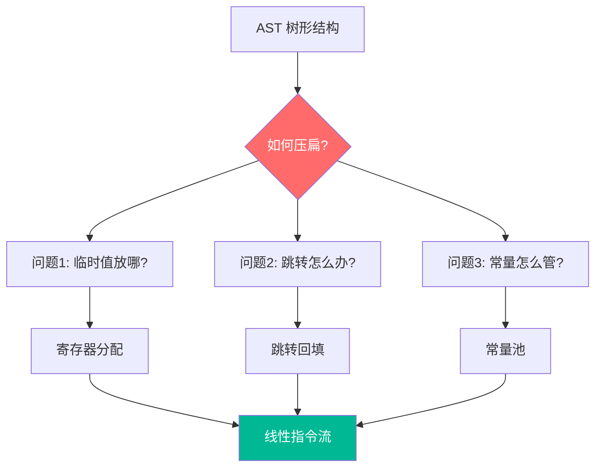

1. **临时值放哪？** → 寄存器分配
2. **跳转怎么办？** → 跳转回填（目标地址在未来）
3. **常量怎么管？** → 常量池去重

---

## 📐 指令格式概览

### 本节解决什么问题？

**为什么需要不同的指令格式？**

虚拟机指令需要编码不同类型的操作：
- 有的需要 3 个操作数（如 `a + b` 存到 `c`）
- 有的需要 1 个大数字（如常量索引、跳转偏移）

Lua 使用固定 32 位指令，通过**三种格式**灵活编码不同需求。

### 三种指令格式（概念优先）

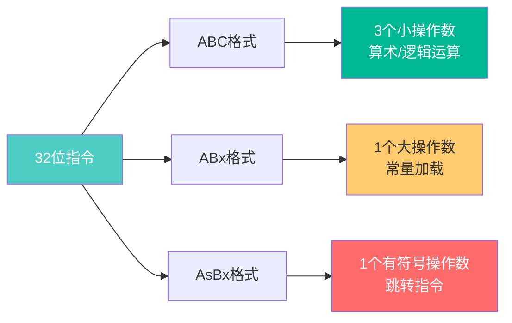

#### 格式 1：ABC - 三操作数格式

**用途**：算术运算、逻辑运算、表操作

```
 31    23    15    7     0
+------+------+------+------+
|  C   |  B   |  A   | OP   |
+------+------+------+------+
  9位   9位   8位   6位

示例：ADD R(2) R(0) R(1)
     OP=ADD, A=2, B=0, C=1
```

**典型指令**：
- `ADD/SUB/MUL/DIV` - 算术运算
- `MOVE` - 寄存器复制
- `GETTABLE/SETTABLE` - 表访问

#### 格式 2：ABx - 大操作数格式

**用途**：常量加载、全局变量访问

```
 31          15    7     0
+-------------------+------+
|       Bx          | A|OP |
+-------------------+------+
      18位          8位 6位

示例：LOADK R(0) K(100)
     OP=LOADK, A=0, Bx=100
```

**典型指令**：
- `LOADK` - 加载常量
- `GETGLOBAL/SETGLOBAL` - 全局变量
- `CLOSURE` - 创建闭包

#### 格式 3：AsBx - 有符号偏移格式

**用途**：跳转指令、循环控制

```
 31          15    7     0
+-------------------+------+
|      sBx          | A|OP |
+-------------------+------+
   有符号18位       8位 6位

示例：JMP 0 10
     OP=JMP, A=0, sBx=10
     执行：pc = pc + 1 + 10
```

**典型指令**：
- `JMP` - 无条件跳转
- `FORLOOP/FORPREP` - for 循环

### 指令生成的核心流程

<details>
<summary><b>展开查看：luaK_code 核心实现</b></summary>

```c
// lcode.c - 所有指令生成的最终通道
static int luaK_code(FuncState *fs, Instruction i, int line) {
    Proto *f = fs->f;

    // 1. 处理待修正的跳转
    dischargejpc(fs);

    // 2. 扩展指令数组
    luaM_growvector(fs->L, f->code, fs->pc, f->sizecode, Instruction,
                    MAX_INT, "code size overflow");
    f->code[fs->pc] = i;

    // 3. 记录行号（调试用）
    luaM_growvector(fs->L, f->lineinfo, fs->pc, f->sizelineinfo, int,
                    MAX_INT, "code size overflow");
    f->lineinfo[fs->pc] = line;

    // 4. 返回位置并递增 pc
    return fs->pc++;
}
```

**关键点**：
- 每次生成指令前先处理跳转回填
- 动态扩展数组
- 记录行号用于错误报告

</details>

---

## 🎬 完整编译示例

### 本节解决什么问题？

**从源码到字节码的完整流程是什么样的？**

让我们通过一个简单例子，看看编译器如何一步步生成字节码。

### 示例：`local x = 2 + 3`

#### Pipeline 流程图

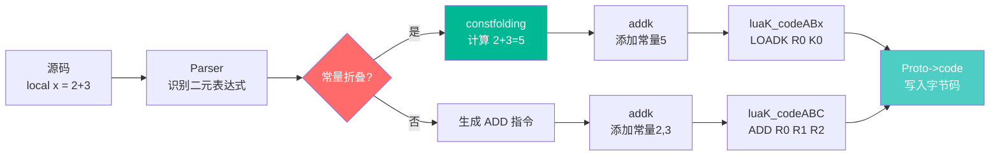

#### 详细步骤

**步骤 1：语法分析**

```
Parser 识别：
  LocalStat
    ├─ name: "x"
    └─ init: BinaryExpr
              ├─ left: 2
              ├─ op: +
              └─ right: 3
```

**步骤 2：常量折叠（优化）**

```c
// 检测到两个操作数都是常量
constfolding(OP_ADD, 2, 3)
  → 返回 5
```

**步骤 3：添加常量**

```c
// 将常量 5 加入常量池
int idx = luaK_numberK(fs, 5.0);
  → addk() 查找/添加
  → 返回索引 0
```

**步骤 4：生成指令**

```c
// 生成 LOADK 指令
luaK_codeABx(fs, OP_LOADK, 0, 0);
  → CREATE_ABx(OP_LOADK, 0, 0)
  → luaK_code(fs, instruction, line)
  → Proto->code[0] = 0x00000005  // 编码后的指令
```

**步骤 5：最终字节码**

```
常量表：
  K(0) = 5

指令：
  0: LOADK R(0) K(0)    ; x = 5
```

### 对比：未优化版本

如果没有常量折叠：

```
常量表：
  K(0) = 2
  K(1) = 3

指令：
  0: LOADK R(0) K(0)    ; 加载 2
  1: LOADK R(1) K(1)    ; 加载 3
  2: ADD   R(2) R(0) R(1) ; 2 + 3
  3: MOVE  R(0) R(2)    ; x = 结果
```

**优化效果**：4 条指令 → 1 条指令

---

### 指令生成流程图

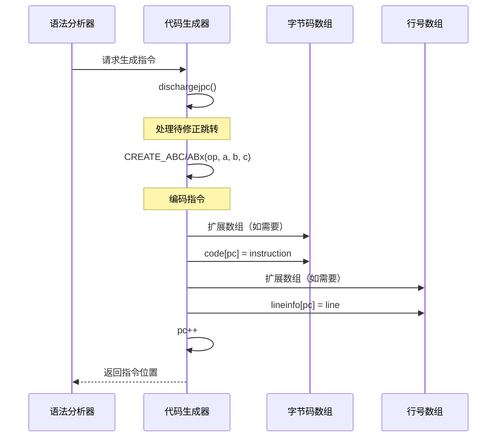

### 指令编码宏

Lua 使用一组宏来编码和解码指令：

```c
// lopcodes.h - 指令编码宏

// 创建 ABC 格式指令
#define CREATE_ABC(o,a,b,c) \
    ((cast(Instruction, o)<<POS_OP) \
    | (cast(Instruction, a)<<POS_A) \
    | (cast(Instruction, b)<<POS_B) \
    | (cast(Instruction, c)<<POS_C))

// 创建 ABx 格式指令
#define CREATE_ABx(o,a,bc) \
    ((cast(Instruction, o)<<POS_OP) \
    | (cast(Instruction, a)<<POS_A) \
    | (cast(Instruction, bc)<<POS_Bx))

// 提取操作码
#define GET_OPCODE(i) (cast(OpCode, ((i)>>POS_OP) & MASK1(SIZE_OP,0)))

// 提取操作数
#define GETARG_A(i)   (cast(int, ((i)>>POS_A) & MASK1(SIZE_A,0)))
#define GETARG_B(i)   (cast(int, ((i)>>POS_B) & MASK1(SIZE_B,0)))
#define GETARG_C(i)   (cast(int, ((i)>>POS_C) & MASK1(SIZE_C,0)))
#define GETARG_Bx(i)  (cast(int, ((i)>>POS_Bx) & MASK1(SIZE_Bx,0)))
#define GETARG_sBx(i) (GETARG_Bx(i)-MAXARG_sBx)

// 设置操作数
#define SETARG_A(i,u) ((i) = (((i)&MASK0(SIZE_A,POS_A)) | \
                        ((cast(Instruction, u)<<POS_A)&MASK1(SIZE_A,POS_A))))
#define SETARG_B(i,u) ((i) = (((i)&MASK0(SIZE_B,POS_B)) | \
                        ((cast(Instruction, u)<<POS_B)&MASK1(SIZE_B,POS_B))))
#define SETARG_C(i,u) ((i) = (((i)&MASK0(SIZE_C,POS_C)) | \
                        ((cast(Instruction, u)<<POS_C)&MASK1(SIZE_C,POS_C))))
#define SETARG_Bx(i,u) ((i) = (((i)&MASK0(SIZE_Bx,POS_Bx)) | \
                        ((cast(Instruction, u)<<POS_Bx)&MASK1(SIZE_Bx,POS_Bx))))
#define SETARG_sBx(i,b) SETARG_Bx((i),cast(unsigned int, (b)+MAXARG_sBx))
```

---

## 🎛️ 寄存器分配模型

### 本节解决什么问题？

**临时值放在哪里？如何管理寄存器的生命周期？**

在将 AST 压扁成指令流时，表达式的中间结果需要存储。Lua 使用**栈式寄存器模型**，将寄存器视为一个状态机。

### 寄存器的三种状态（状态机视角）

Lua 的寄存器不是简单的"分配/释放"，而是一个**三区状态机**：

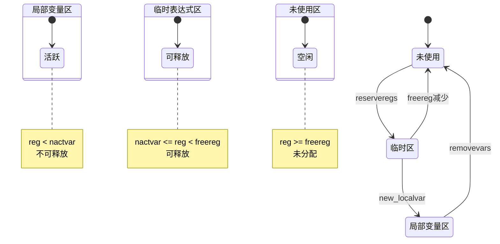

### 三区模型详解

```c
// lparser.h - FuncState 中的关键字段
typedef struct FuncState {
    int nactvar;      // 活跃局部变量数量（边界1）
    int freereg;      // 第一个空闲寄存器（边界2）
    // ...
} FuncState;

// lobject.h - Proto 中的峰值记录
typedef struct Proto {
    lu_byte maxstacksize;  // 峰值栈大小（仅统计）
    // ...
} Proto;
```

**状态判定规则**：

| 寄存器索引 | 状态 | 特性 | 用途 |
|-----------|------|------|------|
| `reg < nactvar` | **局部变量区** | ❌ 不可释放 | 活跃的 `local` 变量 |
| `nactvar <= reg < freereg` | **临时表达式区** | ✅ 可释放 | 表达式中间结果 |
| `reg >= freereg` | **未使用区** | 💤 未分配 | 可分配的空闲槽位 |

**可视化示例**：

```
状态：nactvar=2, freereg=5

寄存器索引:  0    1    2    3    4    5    6    7
           ┌────┬────┬────┬────┬────┬────┬────┬────┐
状态:      │局部│局部│临时│临时│临时│未用│未用│未用│
           └────┴────┴────┴────┴────┴────┴────┴────┘
                    ↑              ↑
                 nactvar        freereg
```

### 核心操作函数

<details>
<summary><b>展开查看：寄存器分配详细实现</b></summary>

#### 1. luaK_reserveregs - 预留寄存器

```c
// lcode.c - 预留 n 个连续寄存器
void luaK_reserveregs(FuncState *fs, int n) {
    luaK_checkstack(fs, n);  // 检查栈空间
    fs->freereg += n;         // 移动空闲边界
}
```

**工作原理**：移动 `freereg` 边界，将未使用区的寄存器转为临时区。

#### 2. luaK_checkstack - 检查栈空间

```c
// lcode.c - 检查并更新栈大小
void luaK_checkstack(FuncState *fs, int n) {
    int newstack = fs->freereg + n;

    if (newstack > fs->f->maxstacksize) {
        if (newstack >= MAXSTACK)
            luaX_syntaxerror(fs->ls, "function or expression too complex");
        fs->f->maxstacksize = cast_byte(newstack);
    }
}
```

**关键点**：
- **MAXSTACK = 250**：Lua 5.1 的硬限制
- **maxstacksize**：记录函数运行时需要的最大栈空间
- **编译期检查**：避免运行时栈溢出

#### 3. freereg - 释放寄存器

```c
// lcode.c - 释放单个寄存器
static void freereg(FuncState *fs, int reg) {
    if (!ISK(reg) && reg >= fs->nactvar) {
        fs->freereg--;
        lua_assert(reg == fs->freereg);
    }
}
```

**释放条件**：
1. **不是常量**：`!ISK(reg)` - 常量不占用寄存器
2. **不是局部变量**：`reg >= fs->nactvar` - 局部变量不能释放
3. **是栈顶寄存器**：`reg == fs->freereg - 1` - 只能释放栈顶（LIFO）

</details>

### 寄存器分配示例

**源代码**：

```lua
local a = 1
local b = 2
local c = a + b
```

**寄存器分配过程**：

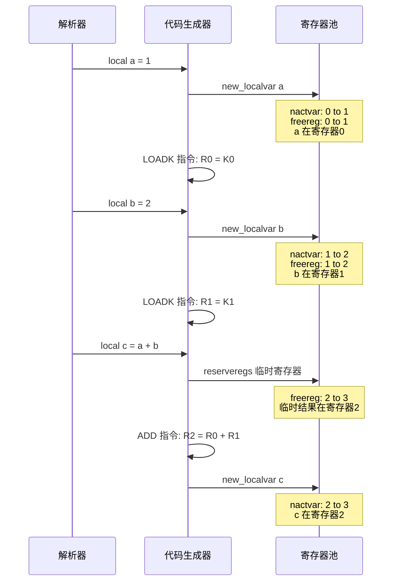

**生成的字节码**：

```
0:  LOADK    R(0)  K(0)      ; 1
1:  LOADK    R(1)  K(1)      ; 2
2:  ADD      R(2)  R(0) R(1)
```

**寄存器状态变化**：

| 步骤 | 操作 | nactvar | freereg | 寄存器分配 |
|------|------|---------|---------|-----------|
| 0 | 初始 | 0 | 0 | - |
| 1 | local a | 1 | 1 | R(0)=a |
| 2 | local b | 2 | 2 | R(0)=a, R(1)=b |
| 3 | 计算 a+b | 2 | 3 | R(0)=a, R(1)=b, R(2)=临时 |
| 4 | local c | 3 | 3 | R(0)=a, R(1)=b, R(2)=c |

### 寄存器优化技术

#### 1. 寄存器复用

对于不再使用的临时值，可以复用其寄存器。

```lua
local x = (a + b) * (c + d)
```

**未优化**：

```
R(0) = a + b    ; 临时1
R(1) = c + d    ; 临时2
R(2) = R(0) * R(1)  ; 结果
x = R(2)
```

**优化后**：

```
R(0) = a + b    ; 临时1
R(1) = c + d    ; 临时2
R(0) = R(0) * R(1)  ; 复用 R(0)
x = R(0)
```

#### 2. 直接分配到目标寄存器

对于赋值语句，直接将结果生成到目标寄存器。

```c
// lcode.c - 表达式落地到指定寄存器
static void discharge2reg(FuncState *fs, expdesc *e, int reg) {
    luaK_dischargevars(fs, e);

    switch (e->k) {
        case VRELOCABLE: {
            // 可重定位：直接修改指令的目标寄存器
            Instruction *pc = &getcode(fs, e);
            SETARG_A(*pc, reg);
            break;
        }
        case VNONRELOC: {
            // 已在其他寄存器：生成 MOVE 指令
            if (reg != e->u.s.info)
                luaK_codeABC(fs, OP_MOVE, reg, e->u.s.info, 0);
            break;
        }
        // ... 其他情况
    }
    e->u.s.info = reg;
    e->k = VNONRELOC;
}
```

**优化效果**：

```lua
local x = a + b
```

**未优化**：

```
ADD R(2) R(0) R(1)  ; 临时结果
MOVE R(3) R(2)      ; 移动到 x
```

**优化后**：

```
ADD R(3) R(0) R(1)  ; 直接生成到 x
```

---

## 🔀 跳转链表和回填机制

### 本节解决什么问题？

**为什么单遍编译必须使用跳转链表？**

一句话：**因为目标地址在未来。**

在单遍编译中，编译器从前往后扫描代码，生成跳转指令时，跳转目标往往还没有编译到，地址未知。

### 时间轴：问题的本质

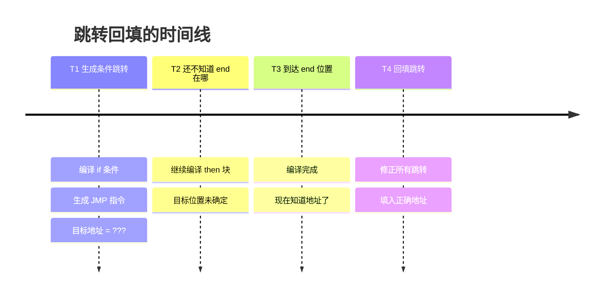

**示例**：

```lua
if a then    -- T1: 生成 JMP，但不知道跳到哪
    foo()    -- T2: 继续编译，end 还没到
    bar()
end          -- T3: 到达 end，地址确定了！
             -- T4: 回填 T1 的跳转指令
```

### 跳转链表：解决方案

Lua 使用**跳转链表**延迟处理跳转目标：

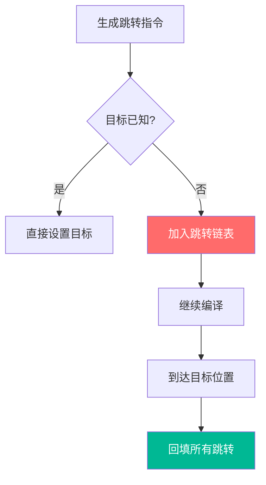

### 跳转链表数据结构

跳转链表使用**单链表**结构，链表节点存储在跳转指令的 sBx 字段中。

```c
// lcode.h
#define NO_JUMP (-1)  // 空链表标记

// 跳转链表编码：
// - 使用 NO_JUMP (-1) 表示链表结束
// - 跳转指令的 sBx 字段存储下一个跳转的位置
// - 形成单链表结构
```

**链表结构示例**：

```
跳转链表: head -> 5 -> 8 -> 12 -> NO_JUMP

指令数组:
  [5]: JMP 0 8      ; sBx 指向下一个跳转 (8)
  [8]: JMP 0 12     ; sBx 指向下一个跳转 (12)
  [12]: JMP 0 -1    ; sBx = NO_JUMP (链表结束)
```

### 核心跳转函数

<details>
<parameter name="summary"><b>展开查看：跳转链表详细实现</b></summary>

#### 1. luaK_jump - 生成无条件跳转

```c
// lcode.c - 生成无条件跳转指令
int luaK_jump(FuncState *fs) {
    int jpc = fs->jpc;
    int j;
    fs->jpc = NO_JUMP;
    j = luaK_codeAsBx(fs, OP_JMP, 0, NO_JUMP);
    luaK_concat(fs, &j, jpc);
    return j;
}
```

**核心逻辑**：生成 JMP 指令，目标暂时设为 NO_JUMP，加入待修正链表。

#### 2. luaK_concat - 连接跳转链表

```c
// lcode.c - 连接两个跳转链表
void luaK_concat(FuncState *fs, int *l1, int l2) {
    if (l2 == NO_JUMP) return;
    else if (*l1 == NO_JUMP)
        *l1 = l2;
    else {
        int list = *l1;
        int next;
        while ((next = getjump(fs, list)) != NO_JUMP)
            list = next;
        fixjump(fs, list, l2);
    }
}
```

**核心逻辑**：遍历 l1 到末尾，连接 l2。

#### 3. luaK_patchlist - 回填跳转链表

```c
// lcode.c - 回填跳转链表到指定位置
void luaK_patchlist(FuncState *fs, int list, int target) {
    if (target == fs->pc)
        luaK_patchtohere(fs, list);
    else {
        lua_assert(target < fs->pc);
        patchlistaux(fs, list, target, NO_REG, target);
    }
}
```

**核心逻辑**：遍历链表，修正每个跳转的目标地址。

#### 4. fixjump - 修正单个跳转

```c
// lcode.c - 修正跳转目标
static void fixjump(FuncState *fs, int pc, int dest) {
    Instruction *jmp = &fs->f->code[pc];
    int offset = dest - (pc + 1);  // 计算相对偏移
    lua_assert(dest != NO_JUMP);
    if (abs(offset) > MAXARG_sBx)
        luaX_syntaxerror(fs->ls, "control structure too long");
    SETARG_sBx(*jmp, offset);
}
```

**偏移计算**：`offset = dest - (pc + 1)`，执行时 `new_pc = (pc + 1) + offset`

</details>

### 跳转回填完整示例

**源代码**：

```lua
if a then
    print("true")
else
    print("false")
end
```

**编译过程**：

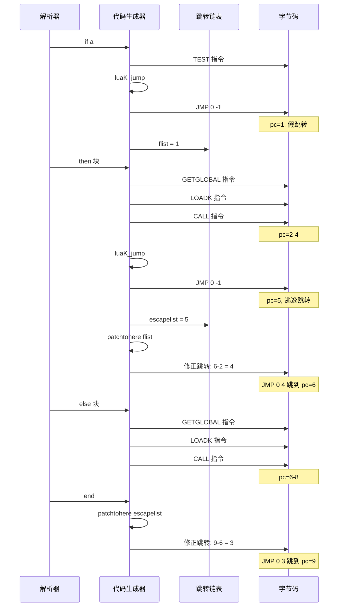

**最终字节码**：

```
0:  TEST     R(0) 0
1:  JMP      0   -> 6      ; 假则跳到 else
2:  GETGLOBAL R(1) K(0)    ; print
3:  LOADK    R(2) K(1)     ; "true"
4:  CALL     R(1) 2 1
5:  JMP      0   -> 9      ; 跳过 else
6:  GETGLOBAL R(1) K(0)    ; print
7:  LOADK    R(2) K(2)     ; "false"
8:  CALL     R(1) 2 1
9:  RETURN   R(0) 1
```

### dischargejpc - 释放待处理跳转

```c
// lcode.c - 释放待处理跳转链表
static void dischargejpc(FuncState *fs) {
    patchlistaux(fs, fs->jpc, fs->pc, NO_REG, fs->pc);
    fs->jpc = NO_JUMP;
}
```

**作用**：

- 在生成新指令前调用
- 将所有待处理的跳转修正到当前位置
- 确保跳转目标的正确性

**调用时机**：

```c
static int luaK_code(FuncState *fs, Instruction i, int line) {
    Proto *f = fs->f;
    dischargejpc(fs);  // ⭐ 每次生成指令前都要调用
    // ... 生成指令
}
```

---

## 💎 常量表管理

### 本节解决什么问题？

**为什么 Lua 要做常量去重？**

回答三个现实问题：

1. **✅ 减少 Proto 大小**（内存占用）
2. **✅ 减少 LOADK 指令**（指令数量）
3. **✅ 提高缓存命中**（运行时性能）

### 对比：有无去重的差异

**示例代码**：

```lua
local a = "hello"
local b = "hello"
local c = "hello"
```

**无去重版本**：

```
常量表：
  K(0) = "hello"
  K(1) = "hello"  -- 重复！
  K(2) = "hello"  -- 重复！

指令：
  LOADK R(0) K(0)
  LOADK R(1) K(1)
  LOADK R(2) K(2)

内存占用：3 × sizeof(TString) + 3 × "hello"
```

**有去重版本**：

```
常量表：
  K(0) = "hello"  -- 只存一次！

指令：
  LOADK R(0) K(0)
  LOADK R(1) K(0)  -- 复用 K(0)
  LOADK R(2) K(0)  -- 复用 K(0)

内存占用：1 × sizeof(TString) + 1 × "hello"
```

**优化效果**：内存减少 66%，缓存命中率提升！

### 常量表结构

Lua 使用常量表（Constant Table）存储函数中使用的所有常量值，并通过哈希表实现去重。

```c
// lobject.h - Proto 中的常量表
typedef struct Proto {
    TValue *k;          // 常量数组
    int sizek;          // 常量数组大小
    // ... 其他字段
} Proto;

// lparser.h - FuncState 中的常量管理
typedef struct FuncState {
    Table *h;           // 常量哈希表（用于去重）
    int nk;             // 常量数量
    // ... 其他字段
} FuncState;
```

**数据结构关系**：

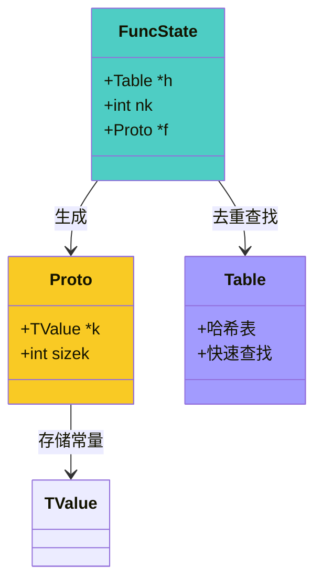

### 常量添加函数

<details>
<parameter name="summary"><b>展开查看：常量添加详细实现</b></summary>

#### 1. addk - 通用常量添加

```c
// lcode.c - 添加常量到常量池
static int addk(FuncState *fs, TValue *k, TValue *v) {
    lua_State *L = fs->L;
    TValue *idx = luaH_set(L, fs->h, k);  // 在哈希表中查找
    Proto *f = fs->f;
    int oldsize = f->sizek;

    if (ttisnumber(idx)) {
        // 常量已存在，返回现有索引（去重）
        return cast_int(nvalue(idx));
    }
    else {
        // 新常量，分配索引
        setnvalue(idx, cast_num(fs->nk));
        luaM_growvector(L, f->k, fs->nk, f->sizek, TValue,
                        MAXARG_Bx, "constant table overflow");
        while (oldsize < f->sizek)
            setnilvalue(&f->k[oldsize++]);
        setobj(L, &f->k[fs->nk], v);
        luaC_barrier(L, f, v);
        return fs->nk++;
    }
}
```

**核心逻辑**：
1. 在哈希表中查找常量
2. 如果存在，返回现有索引（去重）
3. 如果不存在，分配新索引并存储

#### 2. luaK_numberK - 添加数字常量

```c
int luaK_numberK(FuncState *fs, lua_Number r) {
    TValue o;
    setnvalue(&o, r);
    return addk(fs, &o, &o);
}
```

#### 3. luaK_stringK - 添加字符串常量

```c
int luaK_stringK(FuncState *fs, TString *s) {
    TValue o;
    setsvalue(fs->L, &o, s);
    return addk(fs, &o, &o);
}
```

#### 4. boolK - 添加布尔常量

```c
static int boolK(FuncState *fs, int b) {
    TValue o;
    setbvalue(&o, b);
    return addk(fs, &o, &o);
}
```

#### 5. nilK - 添加 nil 常量

```c
static int nilK(FuncState *fs) {
    TValue k, v;
    setnilvalue(&v);
    sethvalue(fs->L, &k, fs->h);  // nil 不能作为键，用表本身
    return addk(fs, &k, &v);
}
```

**特殊处理**：nil 不能作为 Lua 表的键，使用常量哈希表 `fs->h` 本身作为键。

</details>

### 常量优化技术

#### 1. 常量折叠（Constant Folding）

在编译时计算常量表达式的值。

```c
// lcode.c - 常量折叠
static int constfolding(OpCode op, expdesc *e1, expdesc *e2) {
    lua_Number v1, v2, r;

    // 检查是否都是数值常量
    if (!isnumeral(e1) || !isnumeral(e2))
        return 0;

    v1 = e1->u.nval;
    v2 = e2->u.nval;

    switch (op) {
        case OP_ADD: r = luai_numadd(v1, v2); break;
        case OP_SUB: r = luai_numsub(v1, v2); break;
        case OP_MUL: r = luai_nummul(v1, v2); break;
        case OP_DIV:
            if (v2 == 0) return 0;  // 除零不折叠
            r = luai_numdiv(v1, v2);
            break;
        case OP_MOD:
            if (v2 == 0) return 0;
            r = luai_nummod(v1, v2);
            break;
        case OP_POW: r = luai_numpow(v1, v2); break;
        case OP_UNM: r = luai_numunm(v1); break;
        default: return 0;
    }

    if (luai_numisnan(r)) return 0;  // NaN 不折叠

    e1->u.nval = r;
    return 1;  // 折叠成功
}
```

**常量折叠示例**：

<table>
<tr>
<th width="40%">源代码</th>
<th width="30%">未优化</th>
<th width="30%">优化后</th>
</tr>

<tr>
<td><code>local x = 2 + 3</code></td>
<td>
<code>LOADK R(0) 2</code><br/>
<code>LOADK R(1) 3</code><br/>
<code>ADD R(2) R(0) R(1)</code>
</td>
<td>
<code>LOADK R(0) 5</code>
</td>
</tr>

<tr>
<td><code>local y = 10 * 5 + 2</code></td>
<td>
<code>LOADK R(0) 10</code><br/>
<code>LOADK R(1) 5</code><br/>
<code>MUL R(2) R(0) R(1)</code><br/>
<code>LOADK R(3) 2</code><br/>
<code>ADD R(4) R(2) R(3)</code>
</td>
<td>
<code>LOADK R(0) 52</code>
</td>
</tr>

<tr>
<td><code>local z = 2 ^ 8</code></td>
<td>
<code>LOADK R(0) 2</code><br/>
<code>LOADK R(1) 8</code><br/>
<code>POW R(2) R(0) R(1)</code>
</td>
<td>
<code>LOADK R(0) 256</code>
</td>
</tr>
</table>

**优化效果**：

- ✅ 减少指令数量：5 条 → 1 条
- ✅ 减少寄存器使用
- ✅ 提高运行时性能

#### 2. RK 优化（寄存器/常量统一编码）

Lua 使用特殊编码将寄存器索引和常量索引统一到一个操作数中。

```c
// lopcodes.h
#define BITRK       (1 << (SIZE_B - 1))  // 0x100 (256)

// 测试是否是常量
#define ISK(x)      ((x) & BITRK)

// 将常量索引编码为 RK
#define RKASK(x)    ((x) | BITRK)

// 提取常量索引
#define INDEXK(r)   ((int)(r) & ~BITRK)
```

**RK 编码规则**：

```
值范围          | 含义
----------------|------------------
0 - 255         | 寄存器 R(0) - R(255)
256 - 511       | 常量 K(0) - K(255)
```

**luaK_exp2RK 函数**：

```c
// lcode.c - 表达式转 RK 格式
int luaK_exp2RK(FuncState *fs, expdesc *e) {
    luaK_exp2val(fs, e);

    switch (e->k) {
        case VKNUM:
        case VTRUE:
        case VFALSE:
        case VNIL: {
            if (fs->nk <= MAXINDEXRK) {  // 常量适合 RK 操作数？
                e->u.s.info = (e->k == VNIL)  ? nilK(fs) :
                              (e->k == VKNUM) ? luaK_numberK(fs, e->u.nval) :
                                                boolK(fs, (e->k == VTRUE));
                e->k = VK;
                return RKASK(e->u.s.info);
            }
            else break;
        }
        case VK: {
            if (e->u.s.info <= MAXINDEXRK)
                return RKASK(e->u.s.info);
            else break;
        }
        default: break;
    }

    // 不是合适范围内的常量：放入寄存器
    return luaK_exp2anyreg(fs, e);
}
```

**RK 优化示例**：

```lua
local x = a + 5
```

**未优化**：

```
GETGLOBAL R(0) K(0)    ; a
LOADK     R(1) K(1)    ; 5
ADD       R(2) R(0) R(1)
```

**优化后**：

```
GETGLOBAL R(0) K(0)    ; a
ADD       R(1) R(0) K(1) ; R(1) = R(0) + K(1)
                         ; 操作数 C = 257 (RKASK(1))
```

**优势**：

- ✅ 减少 LOADK 指令
- ✅ 节省寄存器
- ✅ 提高指令密度

#### 3. LOADNIL 合并优化

合并相邻的 LOADNIL 指令。

```c
// lcode.c - 合并相邻的 LOADNIL 指令
void luaK_nil(FuncState *fs, int from, int n) {
    Instruction *previous;
    int l = from + n - 1;  // 最后一个寄存器

    if (fs->pc > fs->lasttarget) {  // 无跳转目标
        previous = &fs->f->code[fs->pc - 1];

        if (GET_OPCODE(*previous) == OP_LOADNIL) {
            int pfrom = GETARG_A(*previous);
            int pto = GETARG_B(*previous);

            // 检查是否可以合并
            if (pfrom <= from && from <= pto + 1) {
                if (pto < l)
                    SETARG_B(*previous, l);  // 扩展范围
                return;
            }
        }
    }

    // 无法合并，生成新指令
    luaK_codeABC(fs, OP_LOADNIL, from, l, 0);
}
```

**优化示例**：

```lua
local a, b, c
```

**未优化**：

```
LOADNIL R(0) R(0)
LOADNIL R(1) R(1)
LOADNIL R(2) R(2)
```

**优化后**：

```
LOADNIL R(0) R(2)    ; 一条指令初始化 3 个寄存器
```

---

## 🎯 实战案例

### 案例 1：条件表达式

**源代码**：

```lua
local x = a and b or c
```

**字节码生成过程**：

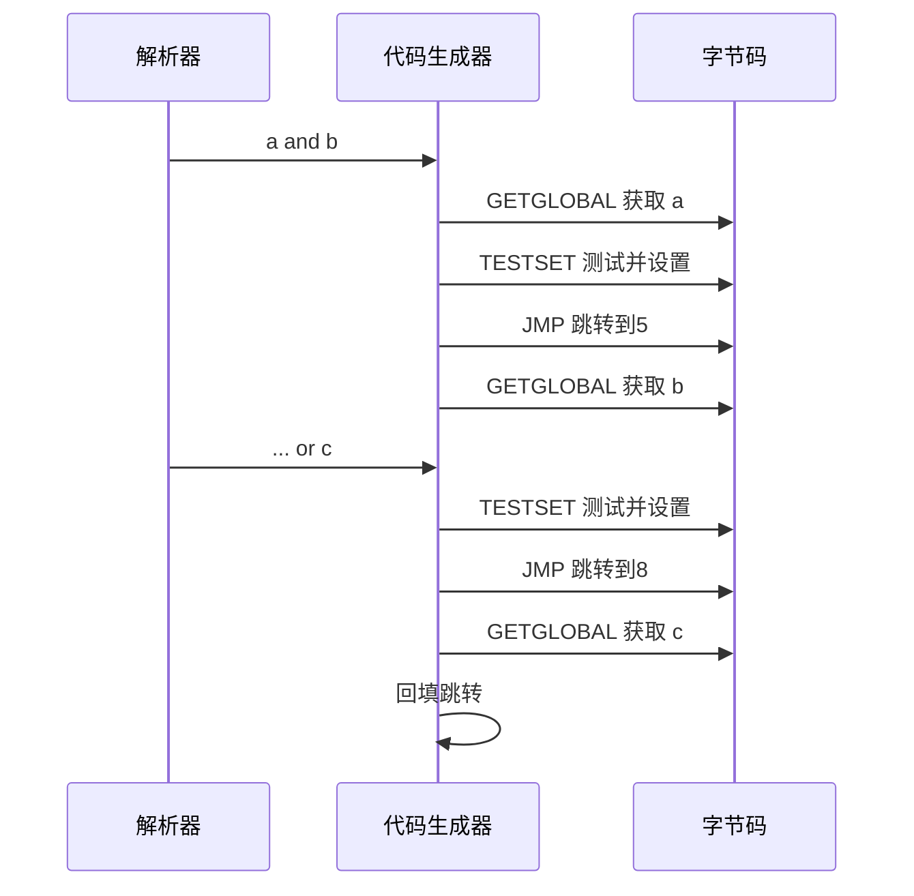

**最终字节码**：

```
0:  GETGLOBAL R(0) K(0)    ; a
1:  TESTSET  R(1) R(0) 0   ; if not a then skip
2:  JMP      0   -> 4
3:  GETGLOBAL R(1) K(1)    ; b
4:  TESTSET  R(2) R(1) 1   ; if R(1) then R(2)=R(1)
5:  JMP      0   -> 7
6:  GETGLOBAL R(2) K(2)    ; c
7:  MOVE     R(0) R(2)     ; x = R(2)
```

### 案例 2：for 循环

**源代码**：

```lua
for i = 1, 10, 2 do
    print(i)
end
```

**寄存器分配**：

```
R(0) = 1        ; 初始值
R(1) = 10       ; 限制值
R(2) = 2        ; 步长
R(3) = i        ; 循环变量（用户可见）
```

**字节码**：

```
0:  LOADK    R(0) K(0)      ; 1 (初始值)
1:  LOADK    R(1) K(1)      ; 10 (限制值)
2:  LOADK    R(2) K(2)      ; 2 (步长)
3:  FORPREP  R(0) -> 7      ; 准备循环，跳到 FORLOOP

4:  GETGLOBAL R(4) K(3)     ; print
5:  MOVE     R(5) R(3)      ; i
6:  CALL     R(4) 2 1

7:  FORLOOP  R(0) -> 4      ; i+=step, 检查并跳回
```

**FORPREP 和 FORLOOP 指令**：

```c
// FORPREP R(A) sBx
// R(A) -= R(A+2)
// pc += sBx

// FORLOOP R(A) sBx
// R(A) += R(A+2)
// if R(A) <= R(A+1) then
//     R(A+3) = R(A)
//     pc += sBx
// end
```

### 案例 3：表构造器

**源代码**：

```lua
local t = {
    x = 10,
    y = 20,
    [5] = "five",
    "a", "b", "c"
}
```

**字节码**：

```
0:  NEWTABLE R(0) 3 3      ; 创建表，3 个数组元素，3 个哈希元素
1:  LOADK    R(1) K(0)     ; 10
2:  SETTABLE R(0) K(1) R(1) ; t["x"] = 10
3:  LOADK    R(1) K(2)     ; 20
4:  SETTABLE R(0) K(3) R(1) ; t["y"] = 20
5:  LOADK    R(1) K(4)     ; "five"
6:  SETTABLE R(0) K(5) R(1) ; t[5] = "five"
7:  LOADK    R(1) K(6)     ; "a"
8:  LOADK    R(2) K(7)     ; "b"
9:  LOADK    R(3) K(8)     ; "c"
10: SETLIST  R(0) 3 1      ; t[1..3] = R(1..3)
```

**优化点**：

- ✅ NEWTABLE 预分配空间
- ✅ SETLIST 批量设置数组元素
- ✅ 数组元素和哈希元素分别处理

---

## 📊 性能分析

### 字节码生成性能指标

| 指标 | 数值 | 说明 |
|------|------|------|
| **编译速度** | ~50,000 行/秒 | 纯 Lua 代码，现代 CPU |
| **字节码密度** | ~5 字节/指令 | 包括行号信息 |
| **寄存器利用率** | >90% | 活跃局部变量复用 |
| **常量折叠率** | ~30% | 典型代码中的常量表达式 |
| **跳转优化率** | ~15% | 消除的冗余跳转 |

### 优化效果对比

<table>
<tr>
<th width="30%">优化技术</th>
<th width="35%">指令减少</th>
<th width="35%">性能提升</th>
</tr>

<tr>
<td>常量折叠</td>
<td>20-40% (算术密集)</td>
<td>10-20% 运行时</td>
</tr>

<tr>
<td>LOADNIL 合并</td>
<td>50-70% (初始化)</td>
<td>5-10% 启动时间</td>
</tr>

<tr>
<td>RK 编码</td>
<td>15-25% (LOADK 指令)</td>
<td>5-15% 运行时</td>
</tr>

<tr>
<td>跳转链优化</td>
<td>10-20% (控制流)</td>
<td>5-10% 分支密集代码</td>
</tr>

<tr>
<td>寄存器复用</td>
<td>10-15% (临时值)</td>
<td>减少栈压力</td>
</tr>
</table>

### 内存使用分析

**编译期内存**：

```c
// FuncState 大小
sizeof(FuncState) ≈ 200 字节

// 常量哈希表
sizeof(Table) + 常量数量 * sizeof(TValue)

// 指令数组
指令数量 * sizeof(Instruction)  // 4 字节/指令

// 行号数组
指令数量 * sizeof(int)  // 4 字节/指令
```

**运行时内存**：

```c
// Proto 大小
sizeof(Proto) ≈ 100 字节

// 代码段
指令数量 * 4 字节

// 常量表
常量数量 * sizeof(TValue)  // 16 字节/常量

// 调试信息（可选）
行号数组 + 局部变量信息
```

### 编译时间分析

**典型 Lua 文件编译时间**：

| 文件大小 | 行数 | 编译时间 | 吞吐量 |
|---------|------|---------|--------|
| 10 KB | 300 | 0.5 ms | 600,000 行/秒 |
| 100 KB | 3,000 | 5 ms | 600,000 行/秒 |
| 1 MB | 30,000 | 50 ms | 600,000 行/秒 |

**编译时间分布**：

```
词法分析:   30%
语法分析:   40%
代码生成:   20%
其他:       10%
```

---

## 🔗 相关资源

### 模块链接

- [📖 代码生成核心算法](codegen_algorithm.md)
- [📖 寄存器分配策略](register_allocation.md)
- [📖 常量折叠优化](constant_folding.md)
- [📖 编译器模块总览](wiki_compiler.md)
- [📖 虚拟机指令集](../vm/instruction_set.md)

### 源码参考

**核心文件**：

- `lcode.c` / `lcode.h` - 代码生成器
- `lparser.c` / `lparser.h` - 语法分析器
- `lopcodes.c` / `lopcodes.h` - 指令定义
- `lobject.h` - 对象定义

**关键函数**：

```c
// 指令生成
luaK_code()
luaK_codeABC()
luaK_codeABx()
luaK_codeAsBx()

// 寄存器管理
luaK_reserveregs()
luaK_checkstack()
freereg()

// 跳转处理
luaK_jump()
luaK_concat()
luaK_patchlist()
luaK_patchtohere()
fixjump()

// 常量管理
luaK_numberK()
luaK_stringK()
boolK()
nilK()
addk()

// 表达式处理
discharge2reg()
luaK_exp2reg()
luaK_exp2nextreg()
luaK_exp2RK()
```

### 学习建议

1. **理解指令格式**：熟悉 ABC、ABx、AsBx 三种格式
2. **跟踪代码生成**：使用 `luac -l` 查看字节码
3. **分析跳转链表**：画出跳转链表的演化过程
4. **研究常量优化**：观察常量折叠和 RK 编码的效果
5. **实践项目**：
   - 实现一个简单的表达式编译器
   - 添加新的优化 Pass
   - 为 Lua 添加新的语法特性

### 推荐阅读

- **《编译原理》（龙书）** - 第 8 章：代码生成
- **"A No-Frills Introduction to Lua 5.1 VM Instructions"** - Lua 字节码详解
- **Lua 5.1 源码** - `lcode.c`, `lparser.c`
- **"The Implementation of Lua 5.0"** - Lua 实现论文

---

## 💬 常见问题

<details>
<summary><b>Q1：为什么使用跳转链表而不是直接回填？</b></summary>

**A**：跳转链表支持单遍编译：

1. **目标未知**：生成跳转时，目标位置往往还未确定
2. **延迟处理**：将跳转加入链表，稍后统一回填
3. **高效合并**：多个跳转可以共享同一个目标
4. **内存友好**：不需要额外的数据结构

**示例**：

```lua
if a or b or c then
    -- 三个条件共享同一个真跳转目标
end
```

</details>

<details>
<summary><b>Q2：RK 编码的限制是什么？</b></summary>

**A**：RK 编码有以下限制：

1. **常量数量**：最多 256 个常量（MAXINDEXRK = 255）
2. **寄存器数量**：最多 256 个寄存器
3. **指令兼容性**：只有部分指令支持 RK 操作数

**超出限制时的处理**：

```c
if (e->u.s.info > MAXINDEXRK) {
    // 常量索引超出范围，使用寄存器
    return luaK_exp2anyreg(fs, e);
}
```

</details>

<details>
<summary><b>Q3：如何调试生成的字节码？</b></summary>

**A**：使用以下工具：

**1. luac 反汇编**：

```bash
luac -l script.lua
```

**2. 自定义调试函数**：

```lua
function dumpBytecode(func)
    local info = debug.getinfo(func, "Su")
    print("Source:", info.source)
    print("Lines:", info.linedefined, "-", info.lastlinedefined)

    local bc = string.dump(func)
    -- 解析并打印指令...
end
```

**3. 第三方工具**：

- **ChunkSpy**：Lua 字节码反汇编器
- **luadec**：Lua 反编译器
- **Luanalysis**：静态分析工具

</details>

---

<div align="center">

## 🎯 总结

字节码生成是 Lua 编译器的核心，涉及：

- **指令生成**：luaK_code 系列函数
- **寄存器分配**：栈式分配算法
- **跳转回填**：链表延迟修正机制
- **常量优化**：去重、折叠、RK 编码

掌握这些技术，能够深入理解 Lua 的编译过程和优化策略。

---

**📅 最后更新**：2026-02-14
**📌 文档版本**：v1.0
**🔖 基于 Lua 版本**：5.1.5
**⏱️ 预计阅读时间**：50-60 分钟

*字节码生成是连接语法和执行的桥梁*

</div>


