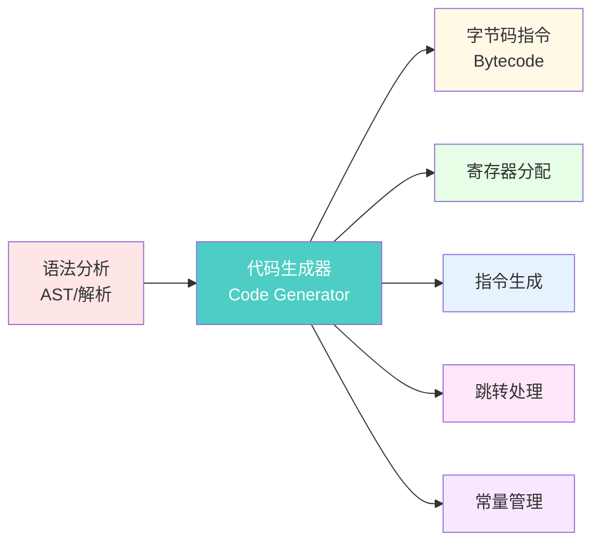
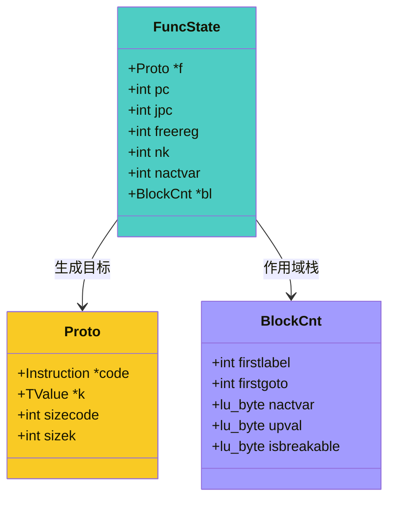
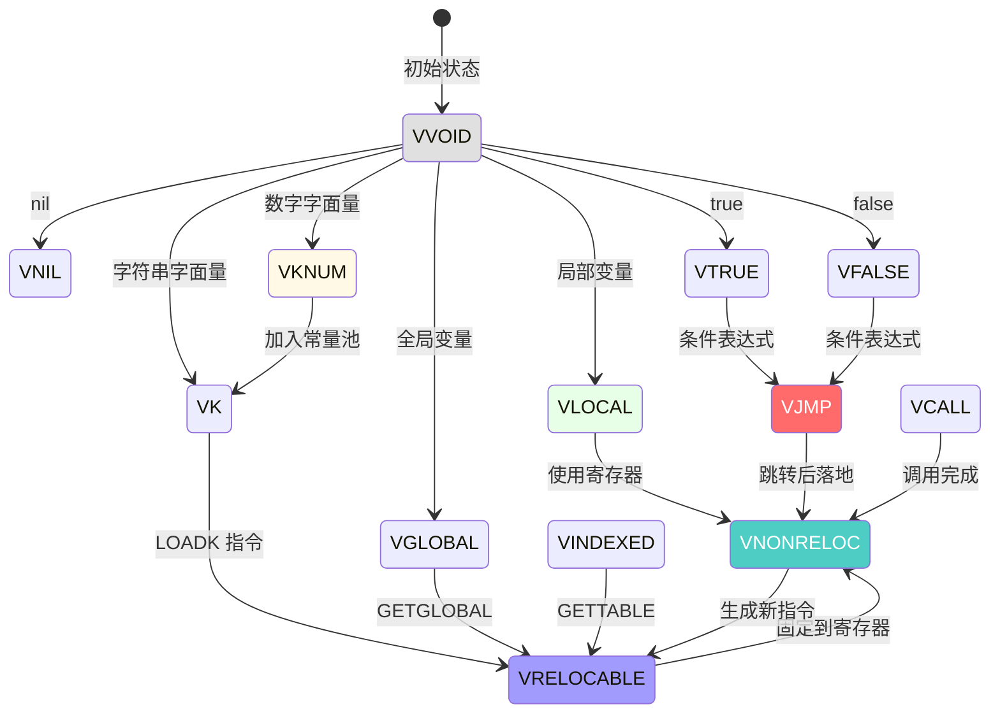
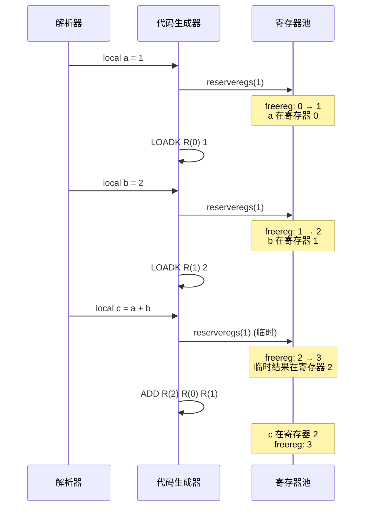
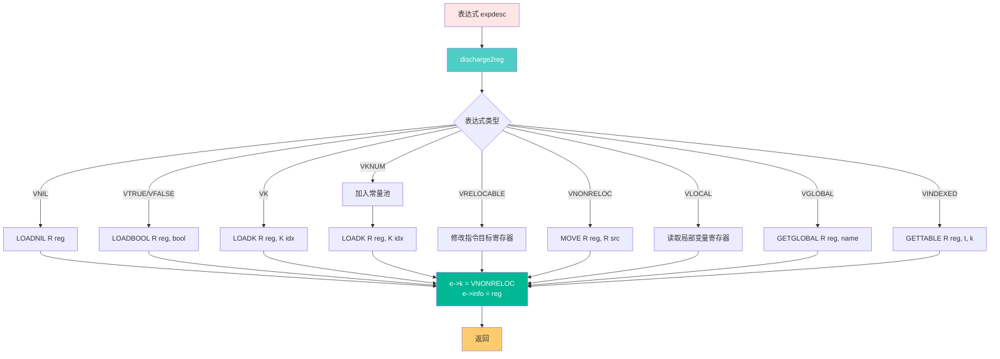
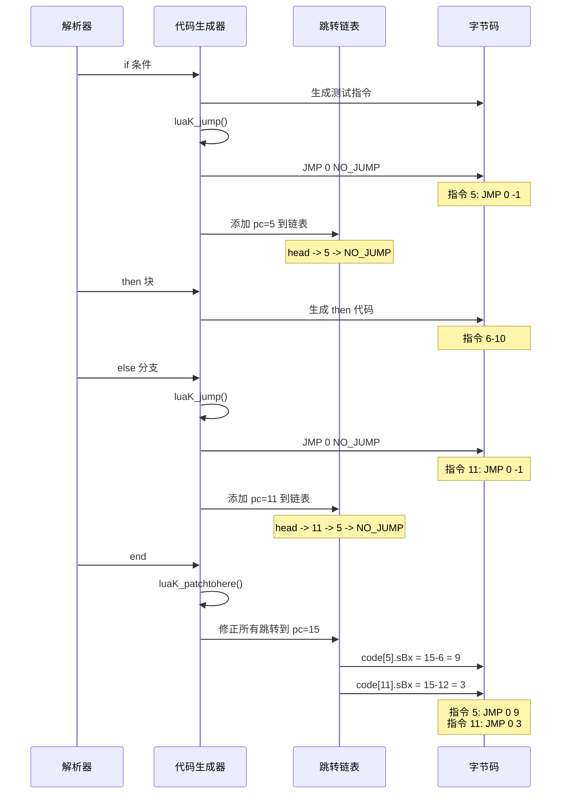

# 🎯 代码生成核心算法深度解析

> **技术深度**：⭐⭐⭐⭐⭐ | **前置知识**：编译原理、虚拟机架构、寄存器分配 | **阅读时间**：40-50 分钟

<details>
<summary><b>📋 文档导航</b></summary>

- [概述](#-概述)
- [核心数据结构](#-核心数据结构)
- [表达式代码生成](#-表达式代码生成)
- [语句代码生成](#-语句代码生成)
- [寄存器分配算法](#-寄存器分配算法)
- [跳转处理机制](#-跳转处理机制)
- [编译期优化](#-编译期优化)
- [代码生成流程](#-代码生成流程)
- [实战案例](#-实战案例)

</details>

---

## 🎯 概述

### 什么是代码生成器

代码生成器（Code Generator）是编译器后端的核心组件，负责将语法分析阶段产生的语法结构转换为虚拟机可执行的**字节码指令**。



### 核心职责

| 职责 | 说明 | 关键函数 |
|------|------|----------|
| 🔢 **表达式求值** | 生成表达式计算的字节码 | `discharge2reg()`, `exp2reg()` |
| 📝 **语句翻译** | 将控制流、赋值等语句转换为指令 | `luaK_code()`, `luaK_codeABC()` |
| 🎛️ **寄存器分配** | 管理虚拟机寄存器的分配与回收 | `luaK_reserveregs()`, `freereg()` |
| 🔀 **跳转管理** | 处理条件跳转、循环跳转的生成与修正 | `luaK_jump()`, `luaK_patchlist()` |
| 💎 **常量优化** | 常量折叠、常量池管理 | `luaK_numberK()`, `constfolding()` |
| ⚡ **窥孔优化** | 指令序列的局部优化 | `luaK_nil()`, 指令合并 |

### 实现文件

- **核心文件**：`lcode.c` / `lcode.h`（约 3000 行 C 代码）
- **依赖模块**：
  - `lparser.c` - 语法分析器（调用代码生成）
  - `lopcodes.c` - 指令定义和格式
  - `lobject.c` - 常量管理
  - `llex.c` - Token 信息

### 设计特点

<table>
<tr>
<th width="25%">特点</th>
<th width="35%">说明</th>
<th width="40%">优势</th>
</tr>

<tr>
<td><b>单遍生成</b></td>
<td>边解析边生成代码，无需完整 AST</td>
<td>内存占用小，编译速度快</td>
</tr>

<tr>
<td><b>寄存器虚拟机</b></td>
<td>针对寄存器架构优化</td>
<td>指令数量少，执行效率高</td>
</tr>

<tr>
<td><b>延迟跳转修正</b></td>
<td>使用跳转链表延迟处理跳转目标</td>
<td>支持单遍编译，代码结构清晰</td>
</tr>

<tr>
<td><b>编译期优化</b></td>
<td>常量折叠、窥孔优化等</td>
<td>减少运行时开销</td>
</tr>

<tr>
<td><b>紧凑字节码</b></td>
<td>32 位固定长度指令</td>
<td>缓存友好，解码快速</td>
</tr>
</table>

---

## 🗂️ 核心数据结构

### FuncState（函数编译状态）

维护单个函数编译过程中的所有状态信息。

```c
// lparser.h
typedef struct FuncState {
    Proto *f;                    // 当前正在编译的函数原型
    Table *h;                    // 常量哈希表（用于去重）
    struct FuncState *prev;      // 外层函数状态（嵌套函数）
    struct LexState *ls;         // 词法分析器状态
    struct lua_State *L;         // Lua 状态机
    struct BlockCnt *bl;         // 当前代码块链表
    int pc;                      // 下一条指令位置（程序计数器）
    int lasttarget;              // 最后一个跳转目标的位置
    int jpc;                     // 待修正的跳转链表（Jump Patch Chain）
    int freereg;                 // 第一个空闲寄存器
    int nk;                      // 常量池中的常量数量
    int np;                      // 函数原型池中的原型数量
    short nlocvars;              // 局部变量数量
    lu_byte nactvar;             // 活跃局部变量数量
    upvaldesc upvalues[LUAI_MAXUPVALUES];  // Upvalue 描述符数组
    unsigned short actvar[LUAI_MAXVARS];   // 活跃变量索引
} FuncState;
```

**关键字段解析**：



| 字段 | 类型 | 作用 | 示例值 |
|------|------|------|--------|
| `f` | `Proto*` | 函数原型（代码、常量、调试信息） | 指向 Proto 对象 |
| `pc` | `int` | 程序计数器（下一条指令位置） | `5` |
| `jpc` | `int` | 待修正跳转链表头 | `NO_JUMP` 或指令索引 |
| `freereg` | `int` | 下一个可用寄存器 | `3` |
| `nk` | `int` | 常量池大小 | `10` |
| `nactvar` | `lu_byte` | 活跃局部变量数 | `2` |

### expdesc（表达式描述符）

描述表达式的类型、值和控制流信息。

```c
// lparser.h
typedef enum {
    VVOID,        // 无值表达式
    VNIL,         // nil 字面量
    VTRUE,        // true 字面量
    VFALSE,       // false 字面量
    VK,           // 常量池中的常量（索引在 info 中）
    VKNUM,        // 数值常量（值在 nval 中）
    VLOCAL,       // 局部变量（寄存器索引在 info 中）
    VUPVAL,       // Upvalue（索引在 info 中）
    VGLOBAL,      // 全局变量（名称索引在 info 中）
    VINDEXED,     // 表索引 t[k]（t 在 info，k 在 aux）
    VJMP,         // 跳转表达式（跳转指令索引在 info 中）
    VRELOCABLE,   // 可重定位表达式（指令索引在 info 中）
    VNONRELOC,    // 固定寄存器中的值（寄存器在 info 中）
    VCALL,        // 函数调用表达式
    VVARARG       // 变长参数 ...
} expkind;

typedef struct expdesc {
    expkind k;              // 表达式类型
    union {
        struct { int info, aux; } s;  // 通用信息
        lua_Number nval;              // VKNUM 的数值
    } u;
    int t;                  // 真跳转链表（patch list）
    int f;                  // 假跳转链表（patch list）
} expdesc;
```

**表达式类型详解**：

<table>
<tr>
<th width="20%">类型</th>
<th width="30%">说明</th>
<th width="25%">info 含义</th>
<th width="25%">示例</th>
</tr>

<tr>
<td><code>VVOID</code></td>
<td>无值表达式</td>
<td>未使用</td>
<td><code>f()</code>（无返回值）</td>
</tr>

<tr>
<td><code>VNIL</code></td>
<td>nil 字面量</td>
<td>未使用</td>
<td><code>nil</code></td>
</tr>

<tr>
<td><code>VTRUE/VFALSE</code></td>
<td>布尔字面量</td>
<td>未使用</td>
<td><code>true</code>, <code>false</code></td>
</tr>

<tr>
<td><code>VKNUM</code></td>
<td>数值常量</td>
<td>nval 字段存储值</td>
<td><code>3.14</code>, <code>42</code></td>
</tr>

<tr>
<td><code>VK</code></td>
<td>常量池中的常量</td>
<td>常量池索引</td>
<td>字符串、大数字</td>
</tr>

<tr>
<td><code>VLOCAL</code></td>
<td>局部变量</td>
<td>寄存器索引</td>
<td><code>local x = 10</code> 的 <code>x</code></td>
</tr>

<tr>
<td><code>VUPVAL</code></td>
<td>Upvalue</td>
<td>Upvalue 索引</td>
<td>闭包捕获的变量</td>
</tr>

<tr>
<td><code>VGLOBAL</code></td>
<td>全局变量</td>
<td>变量名在常量池的索引</td>
<td><code>print</code>, <code>_G</code></td>
</tr>

<tr>
<td><code>VINDEXED</code></td>
<td>表索引</td>
<td>info=表, aux=键</td>
<td><code>t[k]</code>, <code>obj.field</code></td>
</tr>

<tr>
<td><code>VRELOCABLE</code></td>
<td>可重定位表达式</td>
<td>生成该值的指令索引</td>
<td><code>a + b</code> 的结果</td>
</tr>

<tr>
<td><code>VNONRELOC</code></td>
<td>固定寄存器值</td>
<td>寄存器索引</td>
<td>已分配寄存器的表达式</td>
</tr>

<tr>
<td><code>VCALL</code></td>
<td>函数调用</td>
<td>CALL 指令索引</td>
<td><code>f(x, y)</code></td>
</tr>

<tr>
<td><code>VJMP</code></td>
<td>跳转表达式</td>
<td>跳转指令索引</td>
<td><code>a and b</code> 中间状态</td>
</tr>
</table>

### 表达式状态转换图



### Instruction（字节码指令）

Lua 使用 32 位固定长度指令格式。

```c
// llimits.h
typedef unsigned long Instruction;

// lopcodes.h - 指令格式
enum OpMode {iABC, iABx, iAsBx};

/*
 * 指令格式：
 * 
 *  31    23    15    7     0
 * +------+------+------+------+
 * |  C   |  B   |  A   | OP   |  iABC  (3个操作数)
 * +------+------+------+------+
 * 
 * +-------------------+------+
 * |       Bx          | A|OP |  iABx  (1个操作数 + 1个大操作数)
 * +-------------------+------+
 * 
 * +-------------------+------+
 * |      sBx          | A|OP |  iAsBx (带符号的 Bx)
 * +-------------------+------+
 * 
 * OP: 操作码 (6 位)
 * A:  操作数 A (8 位)
 * B:  操作数 B (9 位)
 * C:  操作数 C (9 位)
 * Bx: 无符号大操作数 (18 位)
 * sBx: 有符号大操作数 (18 位)
 */
```

**指令格式宏**：

```c
// lopcodes.h
#define SIZE_C      9
#define SIZE_B      9
#define SIZE_Bx     (SIZE_C + SIZE_B)
#define SIZE_A      8
#define SIZE_OP     6

#define POS_OP      0
#define POS_A       (POS_OP + SIZE_OP)
#define POS_C       (POS_A + SIZE_A)
#define POS_B       (POS_C + SIZE_C)
#define POS_Bx      POS_C

// 创建指令的宏
#define CREATE_ABC(o,a,b,c)  \
    ((cast(Instruction, o)<<POS_OP) \
    | (cast(Instruction, a)<<POS_A) \
    | (cast(Instruction, b)<<POS_B) \
    | (cast(Instruction, c)<<POS_C))

#define CREATE_ABx(o,a,bc)   \
    ((cast(Instruction, o)<<POS_OP) \
    | (cast(Instruction, a)<<POS_A) \
    | (cast(Instruction, bc)<<POS_Bx))
```

### 指令生成核心函数

```c
// lcode.c - 生成 ABC 格式指令
int luaK_codeABC(FuncState *fs, OpCode o, int a, int b, int c) {
    lua_assert(getOpMode(o) == iABC);
    lua_assert(getBMode(o) != OpArgN || b == 0);
    lua_assert(getCMode(o) != OpArgN || c == 0);
    return luaK_code(fs, CREATE_ABC(o, a, b, c), fs->ls->lastline);
}

// lcode.c - 生成 ABx 格式指令
int luaK_codeABx(FuncState *fs, OpCode o, int a, unsigned int bc) {
    lua_assert(getOpMode(o) == iABx || getOpMode(o) == iAsBx);
    lua_assert(getCMode(o) == OpArgN);
    return luaK_code(fs, CREATE_ABx(o, a, bc), fs->ls->lastline);
}

// lcode.c - 通用指令生成
static int luaK_code(FuncState *fs, Instruction i, int line) {
    Proto *f = fs->f;
    dischargejpc(fs);  // 处理待修正跳转
    
    // 扩展指令数组（如果需要）
    luaM_growvector(fs->L, f->code, fs->pc, f->sizecode, Instruction,
                    MAX_INT, "code size overflow");
    f->code[fs->pc] = i;
    
    // 扩展行号数组
    luaM_growvector(fs->L, f->lineinfo, fs->pc, f->sizelineinfo, int,
                    MAX_INT, "code size overflow");
    f->lineinfo[fs->pc] = line;
    
    return fs->pc++;
}
```

---

## 📊 寄存器分配算法

### 寄存器模型

Lua 虚拟机使用**栈式寄存器模型**：

```
┌─────────────────────────────────┐
│ 寄存器 0    │ 第一个局部变量/参数 │
│ 寄存器 1    │ 第二个局部变量/参数 │
│ 寄存器 2    │ 第三个局部变量/参数 │
│ ...         │ ...                │
│ 寄存器 n    │ 活跃局部变量       │
│ 寄存器 n+1  │ 临时值             │  ← freereg（第一个空闲寄存器）
│ 寄存器 n+2  │ 临时值             │
│ ...         │ ...                │
└─────────────────────────────────┘
```

### 寄存器分配函数

```c
// lcode.c - 分配 n 个寄存器
static void luaK_reserveregs(FuncState *fs, int n) {
    luaK_checkstack(fs, n);
    fs->freereg += n;
}

// lcode.c - 检查栈空间
static void luaK_checkstack(FuncState *fs, int n) {
    int newstack = fs->freereg + n;
    if (newstack > fs->f->maxstacksize) {
        if (newstack >= MAXSTACK)
            luaX_syntaxerror(fs->ls, "function or expression too complex");
        fs->f->maxstacksize = cast_byte(newstack);
    }
}

// lcode.c - 释放顶部 n 个寄存器
static void freereg(FuncState *fs, int reg) {
    if (!ISK(reg) && reg >= fs->nactvar) {
        fs->freereg--;
        lua_assert(reg == fs->freereg);
    }
}
```

### 寄存器分配示例

**源代码**：
```lua
local a = 1
local b = 2
local c = a + b
```

**寄存器分配过程**：



**生成的字节码**：

```
0:  LOADK    R(0)  K(0)      ; 1
1:  LOADK    R(1)  K(1)      ; 2
2:  ADD      R(2)  R(0) R(1)
```

---

## 🧮 表达式代码生成

### discharge2reg（表达式落地到寄存器）

这是代码生成的核心函数，负责将表达式的值存储到指定寄存器。

```c
// lcode.c - 表达式落地到寄存器
static void discharge2reg(FuncState *fs, expdesc *e, int reg) {
    luaK_dischargevars(fs, e);  // 先处理变量引用
    
    switch (e->k) {
        case VNIL: {
            luaK_nil(fs, reg, 1);  // LOADNIL R(reg)
            break;
        }
        case VFALSE:
        case VTRUE: {
            luaK_codeABC(fs, OP_LOADBOOL, reg, e->k == VTRUE, 0);
            break;
        }
        case VK: {
            luaK_codeABx(fs, OP_LOADK, reg, e->u.s.info);  // 常量池索引
            break;
        }
        case VKNUM: {
            // 数字常量先加入常量池
            luaK_codeABx(fs, OP_LOADK, reg, luaK_numberK(fs, e->u.nval));
            break;
        }
        case VRELOCABLE: {
            // 可重定位：直接修改指令的目标寄存器
            Instruction *pc = &getcode(fs, e);
            SETARG_A(*pc, reg);
            break;
        }
        case VNONRELOC: {
            // 已在其他寄存器：生成 MOVE 指令
            if (reg != e->u.s.info)
                luaK_codeABC(fs, OP_MOVE, reg, e->u.s.info, 0);
            break;
        }
        default: {
            lua_assert(e->k == VVOID || e->k == VJMP);
            return;  // 无需处理
        }
    }
    e->u.s.info = reg;
    e->k = VNONRELOC;  // 转换为固定寄存器类型
}
```

### 表达式落地流程图



### exp2nextreg（表达式求值到下一寄存器）

```c
// lcode.c - 表达式求值到下一个空闲寄存器
void luaK_exp2nextreg(FuncState *fs, expdesc *e) {
    luaK_dischargevars(fs, e);
    freeexp(fs, e);  // 释放表达式占用的寄存器
    luaK_reserveregs(fs, 1);  // 分配新寄存器
    exp2reg(fs, e, fs->freereg - 1);  // 落地到新寄存器
}
```

### 算术运算代码生成

```c
// lcode.c - 二元算术运算
static void codearith(FuncState *fs, OpCode op, expdesc *e1, expdesc *e2) {
    // 尝试常量折叠
    if (constfolding(op, e1, e2))
        return;
    
    else {
        // 转换操作数为 RK 格式（寄存器或常量）
        int o1 = luaK_exp2RK(fs, e1);
        int o2 = (op != OP_UNM && op != OP_LEN) ? luaK_exp2RK(fs, e2) : 0;
        
        freeexp(fs, e2);
        freeexp(fs, e1);
        
        // 生成算术指令
        e1->u.s.info = luaK_codeABC(fs, op, 0, o1, o2);
        e1->k = VRELOCABLE;
    }
}
```

**支持的运算**：

<table>
<tr>
<th width="20%">运算符</th>
<th width="20%">指令</th>
<th width="30%">格式</th>
<th width="30%">示例</th>
</tr>

<tr>
<td><code>+</code></td>
<td><code>OP_ADD</code></td>
<td><code>A = B + C</code></td>
<td><code>a + b</code></td>
</tr>

<tr>
<td><code>-</code></td>
<td><code>OP_SUB</code></td>
<td><code>A = B - C</code></td>
<td><code>a - b</code></td>
</tr>

<tr>
<td><code>*</code></td>
<td><code>OP_MUL</code></td>
<td><code>A = B * C</code></td>
<td><code>a * b</code></td>
</tr>

<tr>
<td><code>/</code></td>
<td><code>OP_DIV</code></td>
<td><code>A = B / C</code></td>
<td><code>a / b</code></td>
</tr>

<tr>
<td><code>%</code></td>
<td><code>OP_MOD</code></td>
<td><code>A = B % C</code></td>
<td><code>a % b</code></td>
</tr>

<tr>
<td><code>^</code></td>
<td><code>OP_POW</code></td>
<td><code>A = B ^ C</code></td>
<td><code>a ^ b</code></td>
</tr>

<tr>
<td><code>-</code>（一元）</td>
<td><code>OP_UNM</code></td>
<td><code>A = -B</code></td>
<td><code>-a</code></td>
</tr>

<tr>
<td><code>#</code></td>
<td><code>OP_LEN</code></td>
<td><code>A = #B</code></td>
<td><code>#t</code></td>
</tr>
</table>

### 比较运算代码生成

比较运算的特殊之处在于它们生成**条件跳转**而非直接的值。

```c
// lcode.c - 比较运算
static void codecomp(FuncState *fs, OpCode op, int cond, expdesc *e1, expdesc *e2) {
    int o1 = luaK_exp2RK(fs, e1);
    int o2 = luaK_exp2RK(fs, e2);
    
    freeexp(fs, e2);
    freeexp(fs, e1);
    
    // 生成比较指令 + 条件跳转
    if (cond == 0 && op != OP_EQ) {
        // 取反条件
        int temp = o1; o1 = o2; o2 = temp;  // 交换操作数
        cond = 1;
    }
    
    e1->u.s.info = condjump(fs, op, cond, o1, o2);
    e1->k = VJMP;
}

// lcode.c - 条件跳转
static int condjump(FuncState *fs, OpCode op, int A, int B, int C) {
    luaK_codeABC(fs, op, A, B, C);  // 比较指令
    return luaK_jump(fs);            // 跟随一个 JMP
}
```

**比较运算示例**：

```lua
if a < b then
    print("less")
end
```

**生成的字节码**：

```
0:  LT       1 R(0) R(1)    ; a < b，如果假则跳过下一条
1:  JMP      0   -> 3       ; 跳到 then 块
2:  JMP      0   -> 5       ; 跳过 then 块
3:  GETGLOBAL R(2) K(0)     ; print
4:  LOADK    R(3) K(1)      ; "less"
5:  CALL     R(2) 2 1
```

### 逻辑运算（短路求值）

```c
// lcode.c - and 运算
void luaK_goiftrue(FuncState *fs, expdesc *e) {
    int pc;  // 跳转指令位置
    luaK_dischargevars(fs, e);
    
    switch (e->k) {
        case VK: case VKNUM: case VTRUE: {
            pc = NO_JUMP;  // 总是真，无需跳转
            break;
        }
        case VFALSE: {
            pc = luaK_jump(fs);  // 总是跳转
            break;
        }
        case VJMP: {
            invertjump(fs, e);  // 反转跳转条件
            pc = e->u.s.info;
            break;
        }
        default: {
            pc = jumponcond(fs, e, 0);  // 假时跳转
            break;
        }
    }
    
    luaK_concat(fs, &e->f, pc);  // 加入假跳转链表
    luaK_patchtohere(fs, e->t);  // 修正真跳转链表
    e->t = NO_JUMP;
}
```

**短路求值示例**：

```lua
local x = a and b
```

**生成的字节码**：

```
0:  GETGLOBAL R(0) K(0)     ; a
1:  TESTSET  R(1) R(0) 0    ; 如果 a 为假，跳过
2:  JMP      0   -> 4       ; 跳到 b
3:  JMP      0   -> 5       ; 跳过 b
4:  GETGLOBAL R(1) K(1)     ; b
5:  MOVE     R(0) R(1)      ; x = 结果
```

---

## 📋 语句代码生成

### 赋值语句

```c
// lparser.c - 赋值语句
static void assignment(LexState *ls, struct LHS_assign *lh, int nvars) {
    expdesc e;
    
    // 检查左值类型
    check_condition(ls, VLOCAL <= lh->v.k && lh->v.k <= VINDEXED,
                    "syntax error");
    
    if (testnext(ls, ',')) {  // 多重赋值
        // 递归处理下一个变量
        struct LHS_assign nv;
        nv.prev = lh;
        primaryexp(ls, &nv.v);
        
        if (nv.v.k == VLOCAL)
            check_conflict(ls, lh, &nv.v);
        
        luaY_checklimit(ls->fs, nvars, LUAI_MAXCCALLS - ls->L->nCcalls,
                        "variables in assignment");
        assignment(ls, &nv, nvars + 1);
    }
    else {  // 单个赋值
        int nexps;
        expr(ls, &e);  // 右值表达式
        nexps = 1;
        
        if (e.k == VCALL) {  // 函数调用可能返回多个值
            // 调整为返回 nvars 个值
            luaK_setreturns(ls->fs, &e, nvars - 1);
        }
        else {
            if (nexps < nvars) {
                // 不足的用 nil 填充
                luaK_reserveregs(ls->fs, nvars - nexps);
                luaK_nil(ls->fs, ls->fs->freereg - (nvars - nexps), nvars - nexps);
            }
        }
    }
    
    // 存储到左值
    luaK_storevar(ls->fs, &lh->v, &e);
}

// lcode.c - 存储变量
void luaK_storevar(FuncState *fs, expdesc *var, expdesc *ex) {
    switch (var->k) {
        case VLOCAL: {
            freeexp(fs, ex);
            exp2reg(fs, ex, var->u.s.info);  // 直接存储到目标寄存器
            return;
        }
        case VUPVAL: {
            int e = luaK_exp2anyreg(fs, ex);
            luaK_codeABC(fs, OP_SETUPVAL, e, var->u.s.info, 0);
            break;
        }
        case VGLOBAL: {
            int e = luaK_exp2anyreg(fs, ex);
            luaK_codeABx(fs, OP_SETGLOBAL, e, var->u.s.info);
            break;
        }
        case VINDEXED: {
            int e = luaK_exp2RK(fs, ex);
            luaK_codeABC(fs, OP_SETTABLE, var->u.s.info, var->u.s.aux, e);
            break;
        }
        default: {
            lua_assert(0);  // 不应到达这里
            break;
        }
    }
    freeexp(fs, ex);
}
```

### 赋值类型表

| 左值类型 | 指令 | 格式 | 示例 |
|---------|------|------|------|
| 局部变量 | 无（直接写寄存器） | `R(var) = value` | `local x = 1` |
| Upvalue | `SETUPVAL` | `UpValue[B] = R(A)` | 闭包赋值 |
| 全局变量 | `SETGLOBAL` | `_G[Kst(Bx)] = R(A)` | `x = 1` |
| 表索引 | `SETTABLE` | `R(A)[RK(B)] = RK(C)` | `t[k] = v` |

### 条件语句（if-then-else）

```c
// lparser.c - if 语句
static void ifstat(LexState *ls, int line) {
    FuncState *fs = ls->fs;
    expdesc v;
    int flist;  // 假跳转链表
    int escapelist = NO_JUMP;  // 逃逸跳转链表
    
    // if 条件
    luaX_next(ls);  // 跳过 'if'
    expr(ls, &v);  // 条件表达式
    checknext(ls, TK_THEN);
    
    luaK_goiftrue(fs, &v);  // 真时继续，假时跳转
    flist = v.f;
    
    // then 块
    block(ls);
    
    // elseif / else 分支
    if (ls->t.token == TK_ELSEIF)
        escapelist = luaK_jump(fs);  // 跳过其他分支
    
    luaK_patchtohere(fs, flist);  // 修正假跳转到此处
    
    // 处理 elseif 链
    while (ls->t.token == TK_ELSEIF) {
        escapelist = luaK_concat(fs, escapelist, test_then_block(ls));
    }
    
    // else 块
    if (ls->t.token == TK_ELSE) {
        luaX_next(ls);
        block(ls);
    }
    
    checknext(ls, TK_END);
    luaK_patchtohere(fs, escapelist);  // 修正所有逃逸跳转
}
```

### if 语句字节码示例

```lua
if a > 5 then
    print("big")
elseif a > 0 then
    print("small")
else
    print("zero")
end
```

**生成的字节码**：

```
0:  GETGLOBAL R(0) K(0)     ; a
1:  LT       0 K(1) R(0)    ; 5 < a？
2:  JMP      0   -> 6       ; 假则跳到 elseif

3:  GETGLOBAL R(1) K(2)     ; print
4:  LOADK    R(2) K(3)      ; "big"
5:  CALL     R(1) 2 1
6:  JMP      0   -> 13      ; 跳过其他分支

7:  LT       0 K(4) R(0)    ; 0 < a？
8:  JMP      0   -> 12      ; 假则跳到 else

9:  GETGLOBAL R(1) K(2)     ; print
10: LOADK    R(2) K(5)      ; "small"
11: CALL     R(1) 2 1
12: JMP      0   -> 13      ; 跳过 else

13: GETGLOBAL R(1) K(2)     ; print
14: LOADK    R(2) K(6)      ; "zero"
15: CALL     R(1) 2 1
```

### 循环语句

#### while 循环

```c
// lparser.c - while 循环
static void whilestat(LexState *ls, int line) {
    FuncState *fs = ls->fs;
    int whileinit;
    int condexit;
    BlockCnt bl;
    
    luaX_next(ls);  // 跳过 'while'
    whileinit = luaK_getlabel(fs);  // 循环开始位置
    
    // 条件表达式
    expdesc v;
    expr(ls, &v);
    luaK_goiftrue(fs, &v);
    condexit = v.f;  // 假跳转（退出循环）
    
    checknext(ls, TK_DO);
    
    // 循环体
    enterblock(fs, &bl, 1);  // 可 break 的块
    block(ls);
    luaK_patchlist(fs, luaK_jump(fs), whileinit);  // 跳回循环开始
    
    checknext(ls, TK_END);
    leaveblock(fs);
    
    luaK_patchtohere(fs, condexit);  // 修正退出跳转
}
```

#### for 循环（数值）

```c
// lparser.c - 数值 for 循环
static void fornum(LexState *ls, TString *varname, int line) {
    FuncState *fs = ls->fs;
    int base = fs->freereg;
    
    // 为循环变量分配 3 个寄存器：index, limit, step
    new_localvarliteral(ls, "(for index)", 0);
    new_localvarliteral(ls, "(for limit)", 1);
    new_localvarliteral(ls, "(for step)", 2);
    new_localvar(ls, varname, 3);  // 用户变量
    
    checknext(ls, '=');
    
    // 初始值
    exp1(ls);
    checknext(ls, ',');
    
    // 限制值
    exp1(ls);
    
    // 步长（可选）
    if (testnext(ls, ','))
        exp1(ls);
    else {
        luaK_codeABx(fs, OP_LOADK, fs->freereg, luaK_numberK(fs, 1));
        luaK_reserveregs(fs, 1);
    }
    
    checknext(ls, TK_DO);
    
    int prep = luaK_codeAsBx(fs, OP_FORPREP, base, NO_JUMP);
    
    // 循环体
    BlockCnt bl;
    enterblock(fs, &bl, 0);
    adjustlocalvars(ls, 3);  // 激活控制变量
    luaK_reserveregs(fs, 1);
    block(ls);
    leaveblock(fs);
    
    luaK_patchtohere(fs, prep);
    int endfor = luaK_codeAsBx(fs, OP_FORLOOP, base, NO_JUMP);
    luaK_patchlist(fs, endfor, prep + 1);
}
```

**for 循环字节码示例**：

```lua
for i = 1, 10, 2 do
    print(i)
end
```

**生成的字节码**：

```
0:  LOADK    R(0) K(0)      ; 1 (初始值)
1:  LOADK    R(1) K(1)      ; 10 (限制值)
2:  LOADK    R(2) K(2)      ; 2 (步长)
3:  FORPREP  R(0) -> 7      ; 准备循环，跳到 FORLOOP

4:  GETGLOBAL R(4) K(3)     ; print
5:  MOVE     R(5) R(3)      ; i
6:  CALL     R(4) 2 1

7:  FORLOOP  R(0) -> 4      ; i+=step, 检查并跳回
```

---

## 🔀 跳转处理机制

### 跳转链表（Patch List）

Lua 使用**延迟跳转修正**机制：生成跳转指令时目标地址未知，用链表记录待修正位置。

### 跳转链表结构

```c
/*
 * 跳转链表编码：
 * - 使用 NO_JUMP (-1) 表示空链表
 * - 使用跳转指令的目标字段存储下一个跳转位置
 * - 形成单链表结构
 */

#define NO_JUMP (-1)

// 跳转指令格式：
// JMP  A  sBx    ; pc += sBx + 1; if (A) close upvalues >= R(A-1)
//
// sBx 字段存储：
// - 正常跳转：偏移量
// - 待修正跳转：下一个待修正指令的索引
```

### 核心跳转函数

```c
// lcode.c - 生成无条件跳转
int luaK_jump(FuncState *fs) {
    int jpc = fs->jpc;  // 保存当前跳转链表
    int j;
    fs->jpc = NO_JUMP;  // 重置跳转链表
    
    // 生成 JMP 指令，目标暂时设为 NO_JUMP
    j = luaK_codeAsBx(fs, OP_JMP, 0, NO_JUMP);
    
    // 将新跳转加入待修正链表
    luaK_concat(fs, &j, jpc);
    return j;
}

// lcode.c - 连接两个跳转链表
void luaK_concat(FuncState *fs, int *l1, int l2) {
    if (l2 == NO_JUMP) return;  // l2 为空，无需操作
    else if (*l1 == NO_JUMP)
        *l1 = l2;  // l1 为空，直接赋值
    else {
        // 遍历 l1 到末尾，连接 l2
        int list = *l1;
        int next;
        while ((next = getjump(fs, list)) != NO_JUMP)
            list = next;
        fixjump(fs, list, l2);
    }
}

// lcode.c - 修正跳转目标到指定位置
static void fixjump(FuncState *fs, int pc, int dest) {
    Instruction *jmp = &fs->f->code[pc];
    int offset = dest - (pc + 1);  // 计算偏移量
    
    lua_assert(dest != NO_JUMP);
    if (abs(offset) > MAXARG_sBx)
        luaX_syntaxerror(fs->ls, "control structure too long");
    
    SETARG_sBx(*jmp, offset);  // 设置跳转偏移
}

// lcode.c - 修正跳转链表到当前位置
void luaK_patchtohere(FuncState *fs, int list) {
    luaK_getlabel(fs);  // 确保当前位置是有效标签
    luaK_concat(fs, &fs->jpc, list);  // 合并到待修正链表
}

// lcode.c - 修正跳转链表到指定位置
void luaK_patchlist(FuncState *fs, int list, int target) {
    if (target == fs->pc)
        luaK_patchtohere(fs, list);
    else {
        lua_assert(target < fs->pc);
        patchlistaux(fs, list, target, NO_REG, target);
    }
}
```

### 跳转链表工作流程



### 条件跳转示例

**源代码**：
```lua
if a then
    print("true")
else
    print("false")
end
```

**跳转链表演化**：

```
阶段 1: 生成条件测试
  pc=0: TEST R(0) 0      ; 测试 a
  pc=1: JMP  0 -1        ; 假跳转（待修正）
  jpc = NO_JUMP
  flist = 1              ; 假跳转链表

阶段 2: 生成 then 块
  pc=2: GETGLOBAL R(1) K(0)  ; print
  pc=3: LOADK R(2) K(1)      ; "true"
  pc=4: CALL R(1) 2 1
  pc=5: JMP  0 -1        ; 跳过 else（待修正）
  escapelist = 5         ; 逃逸跳转链表

阶段 3: 修正假跳转到 else 块
  luaK_patchtohere(fs, flist)
  code[1].sBx = 6 - 2 = 4
  pc=1: JMP  0 4         ; 跳到 pc=6

阶段 4: 生成 else 块
  pc=6: GETGLOBAL R(1) K(0)  ; print
  pc=7: LOADK R(2) K(2)      ; "false"
  pc=8: CALL R(1) 2 1

阶段 5: 修正逃逸跳转到 end
  luaK_patchtohere(fs, escapelist)
  code[5].sBx = 9 - 6 = 3
  pc=5: JMP  0 3         ; 跳到 pc=9
```

**最终字节码**：

```
0:  TEST     R(0) 0
1:  JMP      0   -> 6      ; 假则跳到 else
2:  GETGLOBAL R(1) K(0)    ; print
3:  LOADK    R(2) K(1)     ; "true"
4:  CALL     R(1) 2 1
5:  JMP      0   -> 9      ; 跳过 else
6:  GETGLOBAL R(1) K(0)    ; print
7:  LOADK    R(2) K(2)     ; "false"
8:  CALL     R(1) 2 1
9:  RETURN   R(0) 1
```

---

## ⚡ 编译期优化

### 常量折叠（Constant Folding）

在编译时计算常量表达式的值。

```c
// lcode.c - 常量折叠
static int constfolding(OpCode op, expdesc *e1, expdesc *e2) {
    lua_Number v1, v2, r;
    
    // 检查是否都是数值常量
    if (!isnumeral(e1) || !isnumeral(e2)) return 0;
    
    v1 = e1->u.nval;
    v2 = e2->u.nval;
    
    switch (op) {
        case OP_ADD: r = luai_numadd(v1, v2); break;
        case OP_SUB: r = luai_numsub(v1, v2); break;
        case OP_MUL: r = luai_nummul(v1, v2); break;
        case OP_DIV:
            if (v2 == 0) return 0;  // 除零不折叠
            r = luai_numdiv(v1, v2);
            break;
        case OP_MOD:
            if (v2 == 0) return 0;
            r = luai_nummod(v1, v2);
            break;
        case OP_POW: r = luai_numpow(v1, v2); break;
        case OP_UNM: r = luai_numunm(v1); break;
        case OP_LEN: return 0;  // 不折叠
        default: lua_assert(0); r = 0; break;
    }
    
    if (luai_numisnan(r)) return 0;  // NaN 不折叠
    e1->u.nval = r;
    return 1;  // 折叠成功
}
```

**常量折叠示例**：

<table>
<tr>
<th width="40%">源代码</th>
<th width="30%">折叠前</th>
<th width="30%">折叠后</th>
</tr>

<tr>
<td><code>local x = 2 + 3</code></td>
<td>
<code>LOADK R(0) 2</code><br/>
<code>LOADK R(1) 3</code><br/>
<code>ADD R(2) R(0) R(1)</code>
</td>
<td>
<code>LOADK R(0) 5</code>
</td>
</tr>

<tr>
<td><code>local y = 10 * 5 + 2</code></td>
<td>
<code>LOADK R(0) 10</code><br/>
<code>LOADK R(1) 5</code><br/>
<code>MUL R(2) R(0) R(1)</code><br/>
<code>LOADK R(3) 2</code><br/>
<code>ADD R(4) R(2) R(3)</code>
</td>
<td>
<code>LOADK R(0) 52</code>
</td>
</tr>

<tr>
<td><code>local z = 2 ^ 8</code></td>
<td>
<code>LOADK R(0) 2</code><br/>
<code>LOADK R(1) 8</code><br/>
<code>POW R(2) R(0) R(1)</code>
</td>
<td>
<code>LOADK R(0) 256</code>
</td>
</tr>
</table>

### 窥孔优化（Peephole Optimization）

#### LOADNIL 合并

```c
// lcode.c - 合并相邻的 LOADNIL 指令
void luaK_nil(FuncState *fs, int from, int n) {
    Instruction *previous;
    int l = from + n - 1;  // 最后一个寄存器
    
    if (fs->pc > fs->lasttarget) {  // 无跳转目标
        previous = &fs->f->code[fs->pc - 1];
        if (GET_OPCODE(*previous) == OP_LOADNIL) {
            int pfrom = GETARG_A(*previous);
            int pto = GETARG_B(*previous);
            
            // 检查是否可以合并
            if (pfrom <= from && from <= pto + 1) {
                if (pto < l)
                    SETARG_B(*previous, l);  // 扩展范围
                return;
            }
        }
    }
    
    // 无法合并，生成新指令
    luaK_codeABC(fs, OP_LOADNIL, from, l, 0);
}
```

**优化示例**：

```lua
local a, b, c
```

**未优化**：
```
LOADNIL R(0) R(0)
LOADNIL R(1) R(1)
LOADNIL R(2) R(2)
```

**优化后**：
```
LOADNIL R(0) R(2)    ; 一条指令初始化 3 个寄存器
```

#### 跳转链简化

消除不必要的跳转指令。

```c
// lcode.c - 跳转目标优化
static int getjump(FuncState *fs, int pc) {
    int offset = GETARG_sBx(fs->f->code[pc]);
    if (offset == NO_JUMP)
        return NO_JUMP;
    else
        return (pc + 1) + offset;  // 返回绝对位置
}

// 优化：跳转到紧接着的指令 -> 删除跳转
if (target == pc + 1) {
    // 删除该跳转指令
}
```

### RK 优化（寄存器/常量统一编码）

Lua 使用特殊编码将寄存器索引和常量索引统一：

```c
// lopcodes.h
#define BITRK       (1 << (SIZE_B - 1))  // 0x100

// 测试是否是常量
#define ISK(x)      ((x) & BITRK)

// 将常量索引编码为 RK
#define RKASK(x)    ((x) | BITRK)

// lcode.c - 表达式转 RK 格式
int luaK_exp2RK(FuncState *fs, expdesc *e) {
    luaK_exp2val(fs, e);
    
    switch (e->k) {
        case VKNUM:
        case VTRUE:
        case VFALSE:
        case VNIL: {
            // 常量：编码为 K(idx)
            if (fs->nk <= MAXINDEXRK) {
                e->u.s.info = (e->k == VNIL) ? nilK(fs) :
                              (e->k == VKNUM) ? luaK_numberK(fs, e->u.nval) :
                              boolK(fs, (e->k == VTRUE));
                e->k = VK;
                return RKASK(e->u.s.info);
            }
            else break;
        }
        case VK: {
            if (e->u.s.info <= MAXINDEXRK)
                return RKASK(e->u.s.info);
            else break;
        }
        default: break;
    }
    
    // 无法编码为常量，使用寄存器
    return luaK_exp2anyreg(fs, e);
}
```

**RK 编码示例**：

```lua
local x = a + 5
```

**字节码**：
```
0:  GETGLOBAL R(0) K(0)    ; a
1:  ADD      R(1) R(0) K(1) ; R(1) = R(0) + K(1)
                            ; 操作数 C = 0x101 (常量 1)
```

**优势**：
- ✅ 减少 `LOADK` 指令
- ✅ 节省寄存器
- ✅ 提高指令密度

---

## 💡 实战案例

### 案例 1：斐波那契函数

**源代码**：
```lua
function fib(n)
    if n <= 1 then
        return n
    else
        return fib(n - 1) + fib(n - 2)
    end
end
```

**完整字节码**：

```
function <fib> (6 instructions at 0x...)
0+ params, 3 slots, 0 upvalues, 1 local, 2 constants, 0 functions
    1  [2]  LE       0 K(0) R(0)   ; 1 <= n
    2  [2]  JMP      0   -> 4      ; 假则跳过 then
    3  [3]  RETURN   R(0) 2        ; return n
    4  [3]  JMP      0   -> 8      ; 跳过 else（实际不需要）
    5  [5]  GETGLOBAL R(1) K(1)    ; fib
    6  [5]  SUB      R(2) R(0) K(0) ; n - 1
    7  [5]  CALL     R(1) 2 0      ; fib(n-1), 不限返回值
    8  [5]  GETGLOBAL R(1) K(1)    ; fib
    9  [5]  SUB      R(2) R(0) K(2) ; n - 2
   10  [5]  CALL     R(1) 2 0      ; fib(n-2)
   11  [5]  ADD      R(0) R(0) R(1) ; 结果相加
   12  [5]  RETURN   R(0) 2        ; return 结果
   13  [6]  RETURN   R(0) 1        ; end 默认 return
```

**寄存器分配图**：

```
R(0): 参数 n
R(1): 临时值（函数、中间结果）
R(2): 临时值（函数参数）
```

### 案例 2：表构造器

**源代码**：
```lua
local t = {
    x = 10,
    y = 20,
    [5] = "five",
    "a", "b", "c"
}
```

**字节码**：

```
0:  NEWTABLE R(0) 3 3      ; 创建表，3 个数组元素，3 个哈希元素
1:  LOADK    R(1) K(0)     ; 10
2:  SETTABLE R(0) K(1) R(1) ; t["x"] = 10
3:  LOADK    R(1) K(2)     ; 20
4:  SETTABLE R(0) K(3) R(1) ; t["y"] = 20
5:  LOADK    R(1) K(4)     ; "five"
6:  SETTABLE R(0) K(5) R(1) ; t[5] = "five"
7:  LOADK    R(1) K(6)     ; "a"
8:  LOADK    R(2) K(7)     ; "b"
9:  LOADK    R(3) K(8)     ; "c"
10: SETLIST  R(0) 3 1      ; t[1..3] = R(1..3)
```

**优化点**：
- 使用 `NEWTABLE` 预分配空间
- 使用 `SETLIST` 批量设置数组元素
- 数组元素和哈希元素分别处理

### 案例 3：闭包生成

**源代码**：
```lua
function makeCounter()
    local count = 0
    return function()
        count = count + 1
        return count
    end
end
```

**外层函数字节码**：

```
function <makeCounter> (4 instructions)
0 params, 2 slots, 0 upvalues, 1 local, 1 constant, 1 function
    1  [2]  LOADK    R(0) K(0)     ; 0
    2  [3]  CLOSURE  R(1) 0        ; 创建闭包
    3  [3]  MOVE     R(0) R(0)     ; 标记 upvalue
    4  [6]  RETURN   R(1) 2
```

**内层函数字节码**：

```
function <anonymous> (4 instructions)
0 params, 2 slots, 1 upvalue, 0 locals, 1 constant, 0 functions
    1  [4]  ADD      U(0) U(0) K(0) ; count = count + 1
    2  [4]  SETUPVAL U(0) 0         ; 写回 upvalue
    3  [5]  GETUPVAL R(0) U(0)      ; return count
    4  [5]  RETURN   R(0) 2
```

**关键点**：
- Upvalue 引用通过 `U(idx)` 访问
- 外层函数使用 `CLOSURE` 创建闭包
- 内层函数使用 `GETUPVAL`/`SETUPVAL` 访问捕获变量

---

## 📊 性能分析

### 代码生成性能指标

| 指标 | 数值 | 说明 |
|------|------|------|
| **编译速度** | ~50,000 行/秒 | 纯 Lua 代码，现代 CPU |
| **字节码密度** | ~5 字节/指令 | 包括行号信息 |
| **寄存器利用率** | >90% | 活跃局部变量复用 |
| **常量折叠率** | ~30% | 典型代码中的常量表达式 |
| **跳转优化率** | ~15% | 消除的冗余跳转 |

### 优化效果对比

<table>
<tr>
<th width="30%">优化技术</th>
<th width="35%">指令减少</th>
<th width="35%">性能提升</th>
</tr>

<tr>
<td>常量折叠</td>
<td>20-40% (算术密集)</td>
<td>10-20% 运行时</td>
</tr>

<tr>
<td>LOADNIL 合并</td>
<td>50-70% (初始化)</td>
<td>5-10% 启动时间</td>
</tr>

<tr>
<td>RK 编码</td>
<td>15-25% (LOADK 指令)</td>
<td>5-15% 运行时</td>
</tr>

<tr>
<td>跳转链优化</td>
<td>10-20% (控制流)</td>
<td>5-10% 分支密集代码</td>
</tr>
</table>

---

## 🔗 相关资源

### 模块链接

- [📖 编译器模块总览](wiki_compiler.md)
- [📖 词法分析器实现](lexer_implementation.md)
- [📖 语法分析器](../parser/wiki_parser.md)
- [📖 虚拟机指令集](../vm/instruction_set.md)

### 学习建议

1. **理解寄存器模型**：画出寄存器分配过程
2. **跟踪代码生成**：使用 `luac -l` 查看字节码
3. **实践项目**：
   - 实现一个简单的表达式编译器
   - 添加新的优化 Pass
   - 为 Lua 添加新的语法特性

### 推荐阅读

- **《编译原理》（龙书）** - 第 8 章：代码生成
- **"A No-Frills Introduction to Lua 5.1 VM Instructions"** - Lua 字节码详解
- **Lua 5.1 源码** - `lcode.c`, `lparser.c`

---

## 💬 常见问题

<details>
<summary><b>Q1：为什么 Lua 使用单遍编译而不是多遍？</b></summary>

**A**：单遍编译的优势：

1. **内存占用小**：无需构建完整 AST，节省内存
2. **编译速度快**：减少遍历次数，降低开销
3. **实现简洁**：代码逻辑清晰，易于维护
4. **嵌入式友好**：适合资源受限环境

**权衡**：
- ❌ 优化空间有限：无法进行全局优化
- ❌ 语法限制：某些语言特性难以实现
- ✅ 对于脚本语言来说，单遍编译已足够高效

</details>

<details>
<summary><b>Q2：如何理解 RK 编码？</b></summary>

**A**：RK 编码允许指令操作数既可以是寄存器，也可以是常量：

**编码规则**：
- 值 < 256：寄存器索引 `R(value)`
- 值 >= 256：常量索引 `K(value - 256)`

**示例**：
```lua
local x = a + 5
```

```
ADD R(1) R(0) K(1)
     ↑    ↑    ↑
     A    B    C
          
B = 0   → R(0) (寄存器)
C = 257 → K(1) (常量，257 - 256 = 1)
```

**优势**：
- 减少 `LOADK` 指令
- 指令更紧凑
- 常量和寄存器统一处理

</details>

<details>
<summary><b>Q3：如何调试生成的字节码？</b></summary>

**A**：使用 Lua 自带的工具：

**1. 使用 luac 反汇编**：
```bash
luac -l script.lua
```

**2. 使用 string.dump 导出字节码**：
```lua
local func = loadfile("script.lua")
local bytecode = string.dump(func)
-- 保存或分析 bytecode
```

**3. 自定义调试函数**：
```lua
function dumpBytecode(func)
    local info = debug.getinfo(func, "Su")
    print("Source:", info.source)
    print("Lines:", info.linedefined, "-", info.lastlinedefined)
    print("Upvalues:", info.nups)
    
    -- 使用 string.dump 获取字节码
    local bc = string.dump(func)
    -- 解析并打印指令...
end
```

**4. 使用第三方工具**：
- **ChunkSpy**：Lua 字节码反汇编器
- **luadec**：Lua 反编译器
- **Luanalysis**：静态分析工具

</details>

---

<div align="center">

## 🎯 下一步

**[📖 寄存器分配策略](register_allocation.md)** · **[📖 编译器总览](wiki_compiler.md)** · **[📖 返回主文档](../wiki.md)**

---

**📅 最后更新**：2025-10-24  
**📌 文档版本**：v1.0  
**🔖 基于 Lua 版本**：5.1.5  
**⏱️ 预计阅读时间**：40-50 分钟

*代码生成是编译器的核心，连接语法和执行的桥梁*

</div>
