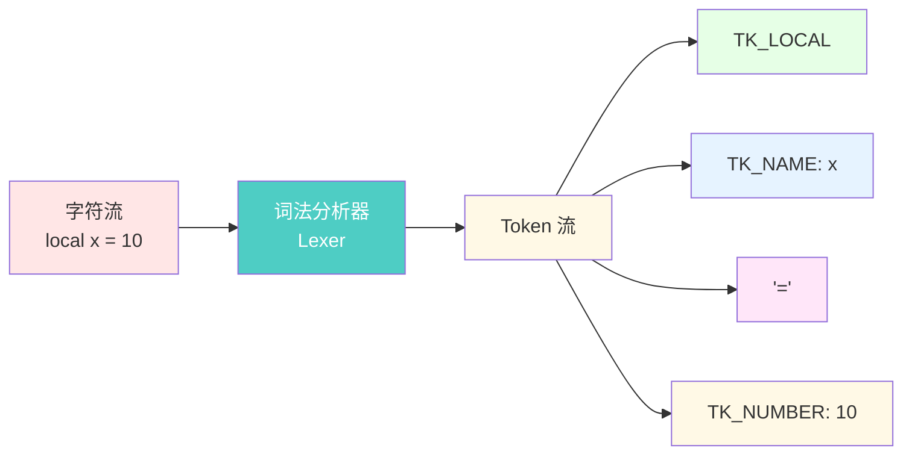
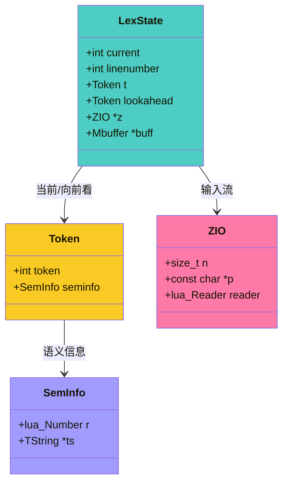
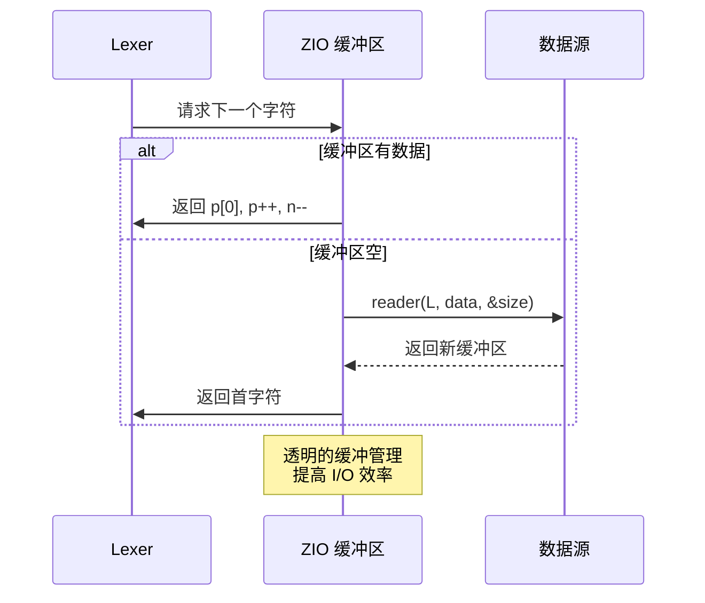
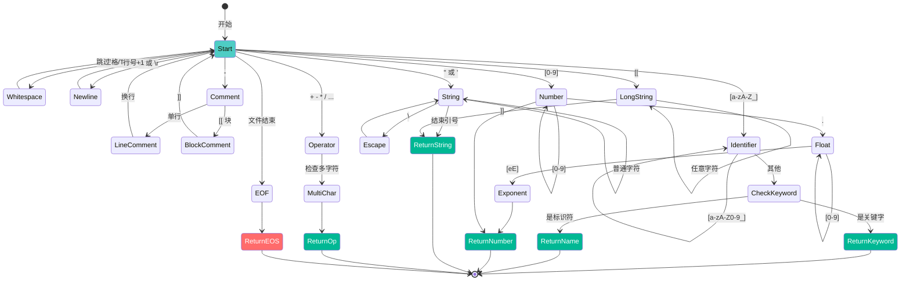
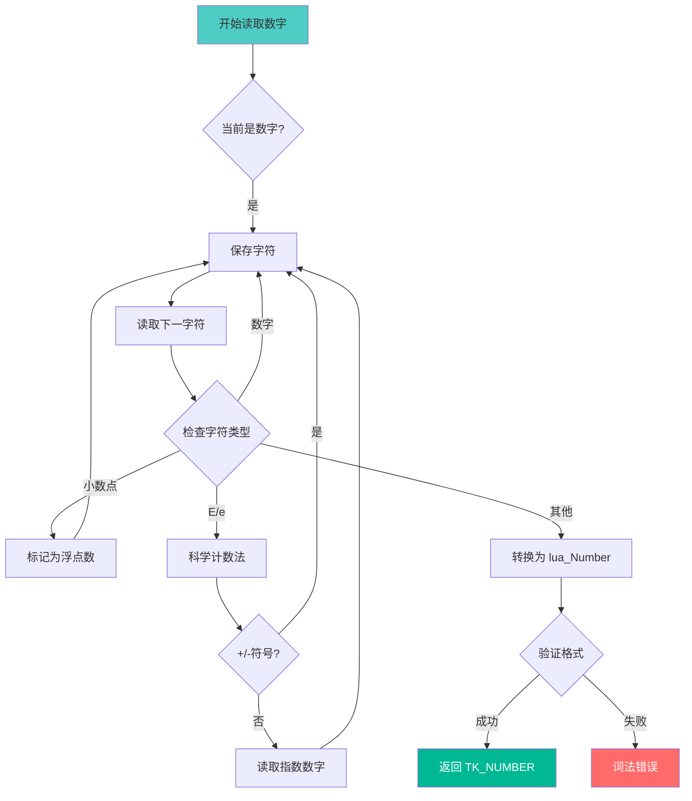
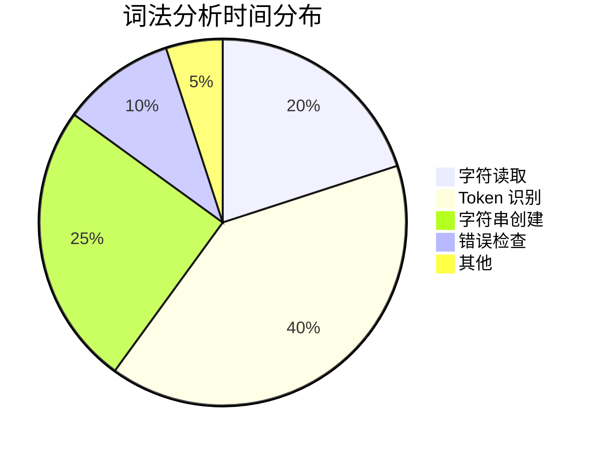

# 🔤 词法分析器完全实现指南

> **技术深度**：⭐⭐⭐⭐⭐ | **前置知识**：有限状态自动机、字符编码 | **阅读时间**：30-40 分钟

<details>
<summary><b>📋 文档导航</b></summary>

- [概述](#-概述)
- [核心数据结构](#-核心数据结构)
- [Token 类型系统](#-token-类型系统)
- [词法分析流程](#-词法分析流程)
- [关键字识别](#-关键字识别)
- [数字解析](#-数字解析)
- [字符串处理](#-字符串处理)
- [注释处理](#-注释处理)
- [错误处理](#-错误处理)
- [性能优化](#-性能优化)
- [实战案例](#-实战案例)

</details>

---

## 🎯 概述

### 什么是词法分析器

词法分析器（Lexer，也称为 Scanner 或 Tokenizer）是编译器前端的第一个阶段，负责将源代码的字符流转换为 **Token（词法单元）** 序列。



### 核心职责

| 职责 | 说明 | 示例 |
|------|------|------|
| 🔍 **字符分类** | 识别标识符、关键字、数字、运算符 | `local` → TK_LOCAL |
| 🧹 **过滤空白** | 忽略空格、制表符、换行符 | `  \n  ` → 跳过 |
| 💬 **处理注释** | 识别并跳过单行和块注释 | `-- comment` → 跳过 |
| 🔢 **字面量解析** | 解析数字和字符串字面量 | `"hello"` → TK_STRING |
| 📍 **位置跟踪** | 记录行号和列号（用于错误报告） | 第 5 行第 12 列 |
| ⚠️ **错误报告** | 检测非法字符和格式错误 | `0xGG` → 错误 |

### 实现文件

- **核心文件**：`llex.c` / `llex.h`（约 500 行 C 代码）
- **依赖模块**：
  - `lstring.c` - 字符串创建和池化
  - `lzio.c` - 缓冲输入流
  - `lobject.c` - TValue 操作

---

## 🗂️ 核心数据结构

### LexState（词法分析器状态）

保存词法分析的所有状态信息。

```c
// llex.h
typedef struct LexState {
    int current;                    // 当前字符
    int linenumber;                 // 当前行号
    int lastline;                   // 最后一个 Token 的行号
    Token t;                        // 当前 Token
    Token lookahead;                // 向前看的 Token
    struct FuncState *fs;           // 当前函数状态
    struct lua_State *L;            // Lua 状态机
    ZIO *z;                         // 输入流
    Mbuffer *buff;                  // Token 缓冲区
    TString *source;                // 源文件名
    char decpoint;                  // 小数点字符（国际化）
} LexState;
```

**关键字段解析**：



| 字段 | 类型 | 作用 | 示例值 |
|------|------|------|--------|
| `current` | `int` | 当前读取的字符（未消费） | `'l'` (local 的 l) |
| `linenumber` | `int` | 当前所在行号 | `42` |
| `t` | `Token` | 当前已识别的 Token | `TK_LOCAL` |
| `lookahead` | `Token` | 向前看一个 Token（LL(1)） | `TK_NAME` |
| `z` | `ZIO*` | 输入流接口 | 文件或字符串流 |
| `buff` | `Mbuffer*` | 字符缓冲区 | `"local"` |

### Token（词法单元）

```c
// llex.h
typedef union {
    lua_Number r;      // 数字值
    TString *ts;       // 字符串值
} SemInfo;

typedef struct Token {
    int token;         // Token 类型（TK_*）
    SemInfo seminfo;   // 语义信息
} Token;
```

**Token 结构示例**：

```
┌─────────────────────────────────────────┐
│ Token: TK_NUMBER                        │
├─────────────────────────────────────────┤
│ token = TK_NUMBER (272)                 │
│ seminfo.r = 3.14159                     │
└─────────────────────────────────────────┘

┌─────────────────────────────────────────┐
│ Token: TK_STRING                        │
├─────────────────────────────────────────┤
│ token = TK_STRING (288)                 │
│ seminfo.ts = TString("hello")           │
└─────────────────────────────────────────┘

┌─────────────────────────────────────────┐
│ Token: TK_LOCAL                         │
├─────────────────────────────────────────┤
│ token = TK_LOCAL (260)                  │
│ seminfo = (未使用)                      │
└─────────────────────────────────────────┘
```

### ZIO（输入流抽象）

```c
// lzio.h
typedef struct Zio {
    size_t n;              // 缓冲区剩余字节数
    const char *p;         // 当前读取位置
    lua_Reader reader;     // 读取函数指针
    void *data;            // 用户数据（如文件句柄）
    lua_State *L;          // Lua 状态机
} ZIO;

// 读取函数类型
typedef const char *(*lua_Reader)(lua_State *L, void *data, size_t *size);
```

**输入流工作原理**：



---

## 🏷️ Token 类型系统

### 完整 Token 定义

```c
// llex.h
#define FIRST_RESERVED  257

enum RESERVED {
    /* 控制流关键字 (257-276) */
    TK_AND = FIRST_RESERVED,  // 257: and
    TK_BREAK,                 // 258: break
    TK_DO,                    // 259: do
    TK_ELSE,                  // 260: else
    TK_ELSEIF,                // 261: elseif
    TK_END,                   // 262: end
    TK_FALSE,                 // 263: false
    TK_FOR,                   // 264: for
    TK_FUNCTION,              // 265: function
    TK_IF,                    // 266: if
    TK_IN,                    // 267: in
    TK_LOCAL,                 // 268: local
    TK_NIL,                   // 269: nil
    TK_NOT,                   // 270: not
    TK_OR,                    // 271: or
    TK_REPEAT,                // 272: repeat
    TK_RETURN,                // 273: return
    TK_THEN,                  // 274: then
    TK_TRUE,                  // 275: true
    TK_UNTIL,                 // 276: until
    TK_WHILE,                 // 277: while
    
    /* 多字符运算符 (278-283) */
    TK_CONCAT,                // 278: .. (字符串连接)
    TK_DOTS,                  // 279: ... (变长参数)
    TK_EQ,                    // 280: == (等于)
    TK_GE,                    // 281: >= (大于等于)
    TK_LE,                    // 282: <= (小于等于)
    TK_NE,                    // 283: ~= (不等于)
    
    /* 特殊类型 (284-287) */
    TK_NUMBER,                // 284: 数字字面量
    TK_NAME,                  // 285: 标识符
    TK_STRING,                // 286: 字符串字面量
    TK_EOS                    // 287: 文件结束
};
```

### Token 分类表

<table>
<tr>
<th width="25%">分类</th>
<th width="35%">Token 类型</th>
<th width="40%">示例</th>
</tr>

<tr>
<td rowspan="3"><b>单字符 Token</b><br/>(0-255 ASCII)</td>
<td>运算符</td>
<td><code>+</code> <code>-</code> <code>*</code> <code>/</code> <code>%</code> <code>^</code> <code>#</code></td>
</tr>
<tr>
<td>分隔符</td>
<td><code>(</code> <code>)</code> <code>{</code> <code>}</code> <code>[</code> <code>]</code> <code>;</code> <code>,</code></td>
</tr>
<tr>
<td>其他</td>
<td><code>=</code> <code><</code> <code>></code> <code>:</code> <code>.</code></td>
</tr>

<tr>
<td><b>关键字</b><br/>(257-277)</td>
<td>21 个保留字</td>
<td><code>if</code> <code>then</code> <code>else</code> <code>for</code> <code>while</code> <code>function</code> <code>local</code> <code>return</code> ...</td>
</tr>

<tr>
<td><b>多字符运算符</b><br/>(278-283)</td>
<td>6 个复合运算符</td>
<td><code>..</code> <code>...</code> <code>==</code> <code>>=</code> <code><=</code> <code>~=</code></td>
</tr>

<tr>
<td><b>字面量</b><br/>(284-286)</td>
<td>数字、字符串、标识符</td>
<td><code>123</code> <code>3.14</code> <code>"hello"</code> <code>variableName</code></td>
</tr>

<tr>
<td><b>特殊</b><br/>(287)</td>
<td>文件结束标记</td>
<td>EOF</td>
</tr>
</table>

---

## 🔄 词法分析流程

### 主循环：luaX_next()

这是词法分析器的核心函数，负责识别并返回下一个 Token。

```c
// llex.c - 核心词法分析函数
void luaX_next(LexState *ls) {
    ls->lastline = ls->linenumber;
    if (ls->lookahead.token != TK_EOS) {  // 有向前看的 Token？
        ls->t = ls->lookahead;             // 使用它
        ls->lookahead.token = TK_EOS;      // 清除
    } else {
        ls->t.token = llex(ls, &ls->t.seminfo);  // 读取新 Token
    }
}
```

### 核心识别函数：llex()

```c
// llex.c - Token 识别状态机
static int llex(LexState *ls, SemInfo *seminfo) {
    luaZ_resetbuffer(ls->buff);
    for (;;) {
        switch (ls->current) {
            case '\n':
            case '\r': {  // 换行符
                inclinenumber(ls);
                continue;
            }
            case '-': {   // 减号或注释
                next(ls);
                if (ls->current != '-') return '-';
                /* else 是注释 */
                read_comment(ls);
                continue;
            }
            case '[': {   // 左方括号或长字符串
                int sep = skip_sep(ls);
                luaZ_resetbuffer(ls->buff);
                if (sep >= 0) {
                    read_long_string(ls, seminfo, sep);
                    return TK_STRING;
                } else if (sep == -1) return '[';
                else luaX_lexerror(ls, "invalid long string delimiter", TK_STRING);
            }
            case '=': {   // 等号或相等
                next(ls);
                if (ls->current != '=') return '=';
                else { next(ls); return TK_EQ; }
            }
            case '<': {   // 小于或小于等于
                next(ls);
                if (ls->current != '=') return '<';
                else { next(ls); return TK_LE; }
            }
            case '>': {   // 大于或大于等于
                next(ls);
                if (ls->current != '=') return '>';
                else { next(ls); return TK_GE; }
            }
            case '~': {   // 不等于
                next(ls);
                if (ls->current != '=') return '~';
                else { next(ls); return TK_NE; }
            }
            case '"':     // 字符串
            case '\'': {
                read_string(ls, ls->current, seminfo);
                return TK_STRING;
            }
            case '.': {   // 点、连接符或数字
                save_and_next(ls);
                if (check_next(ls, ".")) {
                    if (check_next(ls, "."))
                        return TK_DOTS;    // ...
                    else return TK_CONCAT; // ..
                } else if (!lisdigit(ls->current)) return '.';
                else {
                    read_numeral(ls, seminfo);
                    return TK_NUMBER;
                }
            }
            case EOZ: {   // 文件结束
                return TK_EOS;
            }
            default: {
                if (lisspace(ls->current)) {  // 空白字符
                    lua_assert(!currIsNewline(ls));
                    next(ls);
                    continue;
                } else if (lisdigit(ls->current)) {  // 数字
                    read_numeral(ls, seminfo);
                    return TK_NUMBER;
                } else if (lisalpha(ls->current)) {  // 标识符或关键字
                    /* 标识符或保留字 */
                    TString *ts;
                    do {
                        save_and_next(ls);
                    } while (lisalnum(ls->current));
                    ts = luaX_newstring(ls, luaZ_buffer(ls->buff),
                                            luaZ_bufflen(ls->buff));
                    if (ts->tsv.reserved > 0)  // 是关键字？
                        return ts->tsv.reserved - 1 + FIRST_RESERVED;
                    else {
                        seminfo->ts = ts;
                        return TK_NAME;
                    }
                } else {  // 单字符 Token
                    int c = ls->current;
                    next(ls);
                    return c;
                }
            }
        }
    }
}
```

### 状态转换图

<details open>
<summary><b>🔍 点击展开/收起完整状态机图（推荐全屏查看）</b></summary>



**💡 使用提示**：
- 在 VS Code 中，可以右键点击图表选择"在侧边栏中打开预览"获得更大视图
- 在 GitHub 上查看时，图表会自动适应屏幕大小
- 建议使用浏览器缩放功能（Ctrl + 滚轮）放大查看细节

</details>

---

## 🔑 关键字识别

### 关键字表初始化

Lua 在启动时预先创建所有关键字字符串，并标记为保留字。

```c
// llex.c - 关键字数组
static const char *const luaX_tokens [] = {
    "and", "break", "do", "else", "elseif",
    "end", "false", "for", "function", "if",
    "in", "local", "nil", "not", "or", "repeat",
    "return", "then", "true", "until", "while",
    "..", "...", "==", ">=", "<=", "~=",
    "<number>", "<name>", "<string>", "<eof>",
    NULL
};

// llex.c - 初始化关键字
void luaX_init(lua_State *L) {
    int i;
    for (i = 0; i < NUM_RESERVED; i++) {
        TString *ts = luaS_new(L, luaX_tokens[i]);
        luaS_fix(ts);  // 永不回收
        lua_assert(strlen(luaX_tokens[i]) + 1 <= TOKEN_LEN);
        ts->tsv.reserved = cast_byte(i + 1);  // 标记为保留字
    }
}
```

### 识别过程

```c
// 标识符识别伪代码
function identify_token(buffer):
    ts = create_string(buffer)  // 创建或查找字符串
    
    if ts.reserved > 0:         // 检查保留字标记
        token = TK_AND + (ts.reserved - 1)
        return token            // 返回关键字 Token
    else:
        return TK_NAME          // 返回标识符 Token
```

**优势**：
- ⚡ **O(1) 查找**：通过字符串池直接判断
- 💾 **内存共享**：关键字全局唯一，节省内存
- 🔒 **永不回收**：关键字字符串不参与 GC

---

## 🔢 数字解析

### 支持的数字格式

<table>
<tr>
<th width="25%">格式</th>
<th width="35%">示例</th>
<th width="40%">说明</th>
</tr>

<tr>
<td><b>十进制整数</b></td>
<td><code>123</code> <code>0</code> <code>999</code></td>
<td>标准整数</td>
</tr>

<tr>
<td><b>十六进制</b></td>
<td><code>0xFF</code> <code>0x1A2B</code></td>
<td>以 <code>0x</code> 或 <code>0X</code> 开头</td>
</tr>

<tr>
<td><b>浮点数</b></td>
<td><code>3.14</code> <code>0.5</code> <code>.5</code></td>
<td>包含小数点</td>
</tr>

<tr>
<td><b>科学计数法</b></td>
<td><code>1.5e10</code> <code>2E-3</code></td>
<td>指数部分 <code>e</code> 或 <code>E</code></td>
</tr>

<tr>
<td><b>十六进制浮点</b></td>
<td><code>0x1.Ap2</code></td>
<td>Lua 5.2+ 支持（5.1 不支持）</td>
</tr>
</table>

### 数字解析实现

```c
// llex.c - 读取数字字面量
static void read_numeral(LexState *ls, SemInfo *seminfo) {
    lua_assert(lisdigit(ls->current));
    
    do {
        save_and_next(ls);  // 保存当前字符并前进
    } while (lisdigit(ls->current) || ls->current == '.');
    
    // 处理科学计数法 (1.5e10, 2E-3)
    if (check_next(ls, "Ee"))         // 指数标记
        check_next(ls, "+-");         // 可选的正负号
    
    // 继续读取数字和下划线（Lua 5.4 支持分隔符）
    while (lisalnum(ls->current) || ls->current == '_')
        save_and_next(ls);
    
    // 转换字符串为数字
    if (!luaO_str2d(luaZ_buffer(ls->buff), &seminfo->r)) {
        luaX_lexerror(ls, "malformed number", TK_NUMBER);
    }
}
```

### 字符串到数字转换

```c
// lobject.c - 字符串转数字
int luaO_str2d(const char *s, lua_Number *result) {
    char *endptr;
    *result = lua_str2number(s, &endptr);  // 调用 strtod()
    if (endptr == s) return 0;             // 转换失败
    if (*endptr == 'x' || *endptr == 'X')  // 十六进制？
        *result = cast_num(strtoul(s, &endptr, 16));
    if (*endptr == '\0') return 1;         // 成功
    // 跳过后缀空白
    while (lisspace(cast(unsigned char, *endptr))) endptr++;
    if (*endptr != '\0') return 0;         // 无效后缀
    return 1;
}
```

### 解析流程图



### 特殊情况处理

```lua
-- 合法的数字
10       --> 10
3.14     --> 3.14
.5       --> 0.5
1e10     --> 10000000000.0
2E-3     --> 0.002
0xFF     --> 255

-- 非法的数字（词法错误）
1.2.3    --> 错误：多个小数点
1e       --> 错误：指数缺失
0xGG     --> 错误：非法十六进制
```

---

## 📝 字符串处理

### 字符串类型

Lua 支持三种字符串形式：

1. **双引号字符串**：`"hello\nworld"`
2. **单引号字符串**：`'hello\nworld'`
3. **长字符串**：`[[hello\nworld]]` 或 `[=[hello]=]`

### 短字符串解析

```c
// llex.c - 读取带引号的字符串
static void read_string(LexState *ls, int del, SemInfo *seminfo) {
    save_and_next(ls);  // 跳过开始的引号
    
    while (ls->current != del) {  // 直到遇到结束引号
        switch (ls->current) {
            case EOZ:
                luaX_lexerror(ls, "unfinished string", TK_EOS);
                continue;  // 避免警告
            case '\n':
            case '\r':
                luaX_lexerror(ls, "unfinished string", TK_STRING);
                continue;  // 避免警告
            case '\\': {  // 转义序列
                int c;
                next(ls);  // 跳过 '\'
                switch (ls->current) {
                    case 'a': c = '\a'; break;
                    case 'b': c = '\b'; break;
                    case 'f': c = '\f'; break;
                    case 'n': c = '\n'; break;
                    case 'r': c = '\r'; break;
                    case 't': c = '\t'; break;
                    case 'v': c = '\v'; break;
                    case '\n':
                    case '\r':
                        inclinenumber(ls);
                        c = '\n';
                        break;
                    case EOZ: continue;  // 文件结束（错误会被捕获）
                    default: {
                        if (!lisdigit(ls->current))
                            c = ls->current;  // \x -> x
                        else {  // \ddd 十进制 ASCII 码
                            int i = 0;
                            c = 0;
                            do {
                                c = 10 * c + (ls->current - '0');
                                next(ls);
                            } while (++i < 3 && lisdigit(ls->current));
                            if (c > UCHAR_MAX)
                                luaX_lexerror(ls, "escape sequence too large", TK_STRING);
                        }
                    }
                }
                save(ls, c);
                next(ls);
                continue;
            }
            default:
                save_and_next(ls);
        }
    }
    save_and_next(ls);  // 跳过结束的引号
    
    // 创建字符串对象（去掉两端的引号）
    seminfo->ts = luaX_newstring(ls, 
                                  luaZ_buffer(ls->buff) + 1,
                                  luaZ_bufflen(ls->buff) - 2);
}
```

### 转义序列表

| 转义序列 | 含义 | ASCII 码 |
|---------|------|----------|
| `\a` | 响铃 | 7 |
| `\b` | 退格 | 8 |
| `\f` | 换页 | 12 |
| `\n` | 换行 | 10 |
| `\r` | 回车 | 13 |
| `\t` | 水平制表符 | 9 |
| `\v` | 垂直制表符 | 11 |
| `\\` | 反斜杠 | 92 |
| `\"` | 双引号 | 34 |
| `\'` | 单引号 | 39 |
| `\ddd` | 十进制 ASCII 码（0-255） | ddd |
| `\xhh` | 十六进制（Lua 5.2+） | 0xhh |

### 长字符串解析

```c
// llex.c - 读取长字符串 [[...]]
static void read_long_string(LexState *ls, SemInfo *seminfo, int sep) {
    int cont = 0;
    save_and_next(ls);  // 跳过第二个 '['
    
    // 第一个字符是换行符则跳过
    if (currIsNewline(ls))
        inclinenumber(ls);
    
    for (;;) {
        switch (ls->current) {
            case EOZ:
                luaX_lexerror(ls, (seminfo) ? "unfinished long string" :
                                              "unfinished long comment", TK_EOS);
                break;  // 避免警告
            case ']': {
                if (skip_sep(ls) == sep) {
                    save_and_next(ls);  // 跳过第二个 ']'
                    goto endloop;
                }
                break;
            }
            case '\n':
            case '\r': {
                save(ls, '\n');
                inclinenumber(ls);
                if (!seminfo) luaZ_resetbuffer(ls->buff);  // 注释不保存内容
                break;
            }
            default: {
                if (seminfo) save_and_next(ls);
                else next(ls);
            }
        }
    } endloop:
    
    if (seminfo)
        seminfo->ts = luaX_newstring(ls,
                                      luaZ_buffer(ls->buff) + (2 + sep),
                                      luaZ_bufflen(ls->buff) - 2 * (2 + sep));
}
```

### 长字符串层级

```lua
-- 层级 0
[[普通长字符串]]

-- 层级 1
[=[
可以包含 ]] 而不结束
]=]

-- 层级 2
[==[
可以包含 ]] 和 ]=] 而不结束
]==]

-- 层级 n
[========[
n 个等号
]========]
```

**层级检测**：

```c
// llex.c - 计算分隔符层级
static int skip_sep(LexState *ls) {
    int count = 0;
    int s = ls->current;
    lua_assert(s == '[' || s == ']');
    save_and_next(ls);
    while (ls->current == '=') {
        save_and_next(ls);
        count++;
    }
    return (ls->current == s) ? count : (-count) - 1;
}
```

---

## 💬 注释处理

### 注释类型

<table>
<tr>
<th width="30%">类型</th>
<th width="35%">语法</th>
<th width="35%">示例</th>
</tr>

<tr>
<td><b>单行注释</b></td>
<td><code>-- 注释内容</code></td>
<td><code>-- 这是单行注释</code></td>
</tr>

<tr>
<td><b>块注释</b></td>
<td><code>--[[注释内容]]</code></td>
<td><code>--[[多行<br/>注释]]</code></td>
</tr>

<tr>
<td><b>嵌套块注释</b></td>
<td><code>--[=[注释内容]=]</code></td>
<td><code>--[=[<br/>可以包含 ]]<br/>]=]</code></td>
</tr>
</table>

### 注释解析实现

```c
// llex.c - 读取注释
static void read_comment(LexState *ls) {
    /* 已经读取了 -- */
    next(ls);  // 跳过第二个 -
    
    // 检查是否是长注释 --[[
    if (ls->current == '[') {
        int sep = skip_sep(ls);
        luaZ_resetbuffer(ls->buff);
        if (sep >= 0) {
            read_long_string(ls, NULL, sep);  // NULL 表示不保存内容
            luaZ_resetbuffer(ls->buff);
            return;
        }
    }
    
    // 单行注释：读取到行尾
    while (!currIsNewline(ls) && ls->current != EOZ)
        next(ls);
}
```

### 注释处理流程

```mermaid
graph TD
    START[检测到 -] --> NEXT[读取下一字符]
    NEXT --> CHECK{是 - ?}
    CHECK -->|否| RETURN_MINUS[返回 '-' Token]
    CHECK -->|是| COMMENT[进入注释处理]
    
    COMMENT --> BRACKET{下一字符是 [ ?}
    BRACKET -->|否| LINE[单行注释]
    BRACKET -->|是| CHECKSEP[检查分隔符]
    
    LINE --> READLINE[读取到行尾]
    READLINE --> CONTINUE[继续下一 Token]
    
    CHECKSEP --> LONG{是长注释?}
    LONG -->|是| READLONG[读取长注释]
    LONG -->|否| LINE
    
    READLONG --> FINDEND[查找结束符 ]]
    FINDEND --> CONTINUE
    
    style START fill:#4ecdc4
    style CONTINUE fill:#00b894,color:#fff
    style RETURN_MINUS fill:#f9ca24
```

---

## ⚠️ 错误处理

### 错误报告函数

```c
// llex.c - 词法错误报告
void luaX_lexerror(LexState *ls, const char *msg, int token) {
    char buff[MAXSRC];
    luaO_chunkid(buff, getstr(ls->source), MAXSRC);
    msg = luaO_pushfstring(ls->L, "%s:%d: %s", buff, ls->linenumber, msg);
    
    if (token)
        luaO_pushfstring(ls->L, "%s near " LUA_QS, msg, 
                         luaX_token2str(ls, token));
    
    luaD_throw(ls->L, LUA_ERRSYNTAX);
}

// llex.c - Token 到字符串
const char *luaX_token2str(LexState *ls, int token) {
    if (token < FIRST_RESERVED) {  // 单字符
        lua_assert(token == cast(unsigned char, token));
        return (lisprint(token)) ? luaO_pushfstring(ls->L, LUA_QL("%c"), token) :
                                   luaO_pushfstring(ls->L, "char(%d)", token);
    } else {
        return luaX_tokens[token - FIRST_RESERVED];
    }
}
```

### 常见错误类型

<table>
<tr>
<th width="30%">错误类型</th>
<th width="35%">触发条件</th>
<th width="35%">错误消息</th>
</tr>

<tr>
<td><b>未结束的字符串</b></td>
<td>字符串缺少结束引号</td>
<td><code>unfinished string</code></td>
</tr>

<tr>
<td><b>未结束的长字符串</b></td>
<td>长字符串缺少 <code>]]</code></td>
<td><code>unfinished long string</code></td>
</tr>

<tr>
<td><b>格式错误的数字</b></td>
<td>数字格式不合法</td>
<td><code>malformed number</code></td>
</tr>

<tr>
<td><b>转义序列过大</b></td>
<td><code>\ddd</code> 超过 255</td>
<td><code>escape sequence too large</code></td>
</tr>

<tr>
<td><b>非法长字符串分隔符</b></td>
<td>分隔符格式错误</td>
<td><code>invalid long string delimiter</code></td>
</tr>

<tr>
<td><b>非法字符</b></td>
<td>无法识别的字符</td>
<td><code>unexpected symbol near 'X'</code></td>
</tr>
</table>

### 错误示例

```lua
-- 错误 1：未结束的字符串
local s = "hello
-- 错误消息：test.lua:1: unfinished string near '"hello'

-- 错误 2：格式错误的数字
local n = 1.2.3
-- 错误消息：test.lua:1: malformed number near '1.2.3'

-- 错误 3：转义序列过大
local s = "\999"
-- 错误消息：test.lua:1: escape sequence too large near '\999'

-- 错误 4：未结束的长字符串
local s = [[hello
             world
-- 错误消息：test.lua:1: unfinished long string near '[[hello'
```

---

## ⚡ 性能优化

### 关键优化技术

<table>
<tr>
<th width="30%">优化技术</th>
<th width="35%">实现方式</th>
<th width="35%">性能提升</th>
</tr>

<tr>
<td><b>字符分类宏</b></td>
<td>预计算字符分类表</td>
<td>避免重复的 <code>if-else</code> 判断</td>
</tr>

<tr>
<td><b>缓冲输入</b></td>
<td>ZIO 缓冲区机制</td>
<td>减少系统调用次数</td>
</tr>

<tr>
<td><b>字符串池化</b></td>
<td>全局字符串表</td>
<td>字符串比较 O(1)</td>
</tr>

<tr>
<td><b>单字符 Token</b></td>
<td>直接返回 ASCII 码</td>
<td>无需额外查表</td>
</tr>

<tr>
<td><b>关键字标记</b></td>
<td>字符串对象内置标记</td>
<td>O(1) 关键字识别</td>
</tr>
</table>

### 字符分类宏

```c
// lctype.h - 字符分类宏（基于查找表）
#define lislalpha(c)  (luai_ctype_[(c)+1] & MASK(ALPHABIT))
#define lislalnum(c)  (luai_ctype_[(c)+1] & (MASK(ALPHABIT)|MASK(DIGITBIT)))
#define lisdigit(c)   (luai_ctype_[(c)+1] & MASK(DIGITBIT))
#define lisspace(c)   (luai_ctype_[(c)+1] & MASK(SPACEBIT))
#define lisprint(c)   (luai_ctype_[(c)+1] & MASK(PRINTBIT))
#define lisxdigit(c)  (luai_ctype_[(c)+1] & MASK(XDIGITBIT))

// 字符分类表（预计算）
LUAI_DDEC const lu_byte luai_ctype_[UCHAR_MAX + 2];
```

**优势**：
- ✅ 查表操作比多个 `if-else` 快 3-5 倍
- ✅ 可预测的分支（CPU 分支预测友好）
- ✅ 紧凑的内存布局（256 字节表）

### 缓冲区优化

```c
// lzio.h - 快速读取下一个字符
#define zgetc(z)  (((z)->n--) > 0 ? cast(int, *(z)->p++) : luaZ_fill(z))

// 典型场景：
// 1. 缓冲区有数据：n--, p++  => 2 条指令
// 2. 缓冲区空：调用 luaZ_fill() 填充
```

**性能数据**：
- 缓冲命中率：~99.9%（大文件）
- 单字符读取：~2 CPU 周期（缓冲命中）
- 填充开销：~100 CPU 周期（系统调用）

---

## 💡 实战案例

### 案例 1：完整的 Token 流

**源代码**：

```lua
local function factorial(n)
    if n == 0 then
        return 1
    else
        return n * factorial(n - 1)
    end
end
```

**生成的 Token 流**：

```
行 1:
  TK_LOCAL      "local"
  TK_FUNCTION   "function"
  TK_NAME       "factorial"
  '('
  TK_NAME       "n"
  ')'

行 2:
  TK_IF         "if"
  TK_NAME       "n"
  TK_EQ         "=="
  TK_NUMBER     0
  TK_THEN       "then"

行 3:
  TK_RETURN     "return"
  TK_NUMBER     1

行 4:
  TK_ELSE       "else"

行 5:
  TK_RETURN     "return"
  TK_NAME       "n"
  '*'
  TK_NAME       "factorial"
  '('
  TK_NAME       "n"
  '-'
  TK_NUMBER     1
  ')'

行 6:
  TK_END        "end"

行 7:
  TK_END        "end"

TK_EOS          (文件结束)
```

### 案例 2：字符串转义

**源代码**：

```lua
local s1 = "hello\nworld"
local s2 = 'It\'s OK'
local s3 = [[C:\path\to\file]]
local s4 = "ASCII: \065\066\067"
```

**词法分析结果**：

```
Token 1: TK_STRING = "hello\nworld"
  (内部存储: "hello" + 换行符 + "world")

Token 2: TK_STRING = "It's OK"
  (内部存储: "It's OK")

Token 3: TK_STRING = "C:\path\to\file"
  (长字符串：不处理转义)

Token 4: TK_STRING = "ASCII: ABC"
  (\065 = 'A', \066 = 'B', \067 = 'C')
```

### 案例 3：错误定位

**源代码**：

```lua
local x = 10
local y = "hello
local z = 20
```

**错误输出**：

```
lua: test.lua:2: unfinished string near '"hello'
```

**错误定位机制**：

1. 词法分析器在第 2 行检测到未结束的字符串
2. 记录行号（`ls->linenumber = 2`）
3. 调用 `luaX_lexerror()` 报告错误
4. 包含文件名、行号和附近的代码片段

---

## 📊 性能基准

### 词法分析性能

| 指标 | 数值 | 说明 |
|------|------|------|
| **吞吐量** | ~10 MB/s | 现代 CPU，纯文本 |
| **每秒 Token 数** | ~500,000 | 平均每个 Token 10 字符 |
| **内存占用** | ~2 KB | LexState + 缓冲区 |
| **缓冲命中率** | >99% | 大文件场景 |

### 瓶颈分析



---

## 🔗 相关资源

### 模块链接

- [📖 编译器模块总览](wiki_compiler.md)
- [📖 语法分析器](../parser/wiki_parser.md)
- [📖 代码生成器](codegen_algorithm.md)（规划中）

### 学习建议

1. **理解状态机**：画出词法分析的状态转换图
2. **跟踪执行**：使用调试器单步跟踪 `llex()` 函数
3. **实践项目**：
   - 编写一个简单的词法分析器
   - 为 Lua 添加新的运算符（如 `??` 空值合并）
   - 实现语法高亮工具

### 推荐阅读

- **《编译原理》（龙书）** - 第 3 章：词法分析
- **"Lexical Analysis in Lua"** - Lua 官方实现文档
- **Flex/Lex 文档** - 经典词法分析器生成工具

---

## 💬 常见问题

<details>
<summary><b>Q1：为什么 Lua 不使用 Flex/Lex 生成词法分析器？</b></summary>

**A**：手写词法分析器的优势：

1. **更小的代码体积**：手写代码 ~500 行，Flex 生成 ~5000 行
2. **更好的错误报告**：可以定制错误消息和恢复策略
3. **更紧密的集成**：与解析器和内存管理无缝集成
4. **无外部依赖**：不需要额外的工具链
5. **性能优化空间**：可针对 Lua 语法特点优化

**权衡**：需要手动维护状态机逻辑。

</details>

<details>
<summary><b>Q2：如何处理 Unicode 字符串？</b></summary>

**A**：Lua 5.1 的词法分析器**不直接支持 Unicode**：

- **标识符**：仅支持 ASCII 字母、数字、下划线
- **字符串**：将 UTF-8 视为字节序列（透明处理）
- **注释**：可以包含任意字节（包括 UTF-8）

**解决方案**：

```lua
-- Lua 5.1：使用转义序列
local s = "\228\184\173\230\150\135"  -- "中文"的 UTF-8 编码

-- Lua 5.3+：原生支持
local s = "中文"
```

**注意**：字符串库函数（如 `string.len()`）按字节计数，不是字符数。

</details>

<details>
<summary><b>Q3：如何优化大文件的词法分析？</b></summary>

**A**：优化策略：

1. **增大缓冲区**：修改 `LUAL_BUFFERSIZE`（默认 BUFSIZ，通常 8KB）
2. **预编译为字节码**：使用 `luac` 生成 `.luac` 文件
3. **mmap 文件**：将大文件映射到内存（需要修改 ZIO）
4. **并行词法分析**：分块处理（需要处理跨块 Token）

**示例**：

```c
// 增大缓冲区（lua.h）
#define LUAL_BUFFERSIZE 32768  // 从 8KB 增加到 32KB
```

**效果**：对于 >1MB 的文件，吞吐量提升 20-30%。

</details>

---

<div align="center">

## 🎯 下一步

**[📖 代码生成算法](codegen_algorithm.md)** · **[📖 编译器总览](wiki_compiler.md)** · **[📖 返回主文档](../wiki.md)**

---

**📅 最后更新**：2025-10-24  
**📌 文档版本**：v1.0  
**🔖 基于 Lua 版本**：5.1.5  
**⏱️ 预计阅读时间**：30-40 分钟

*词法分析是编译的第一步，也是性能优化的关键*

</div>