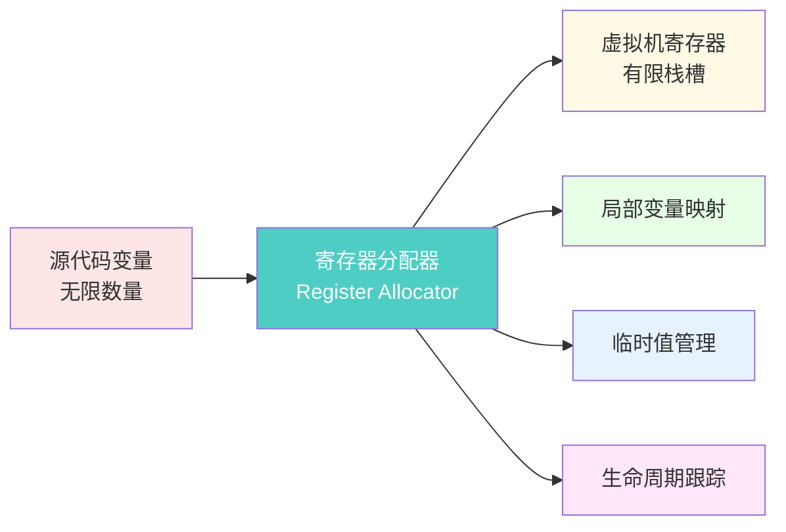
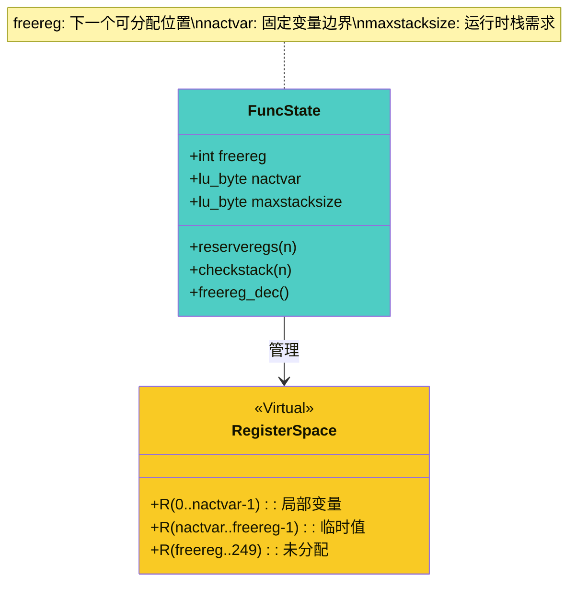
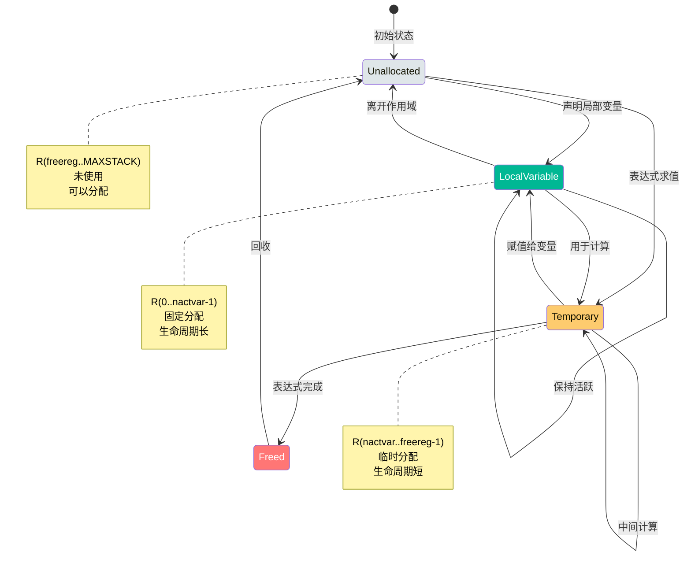
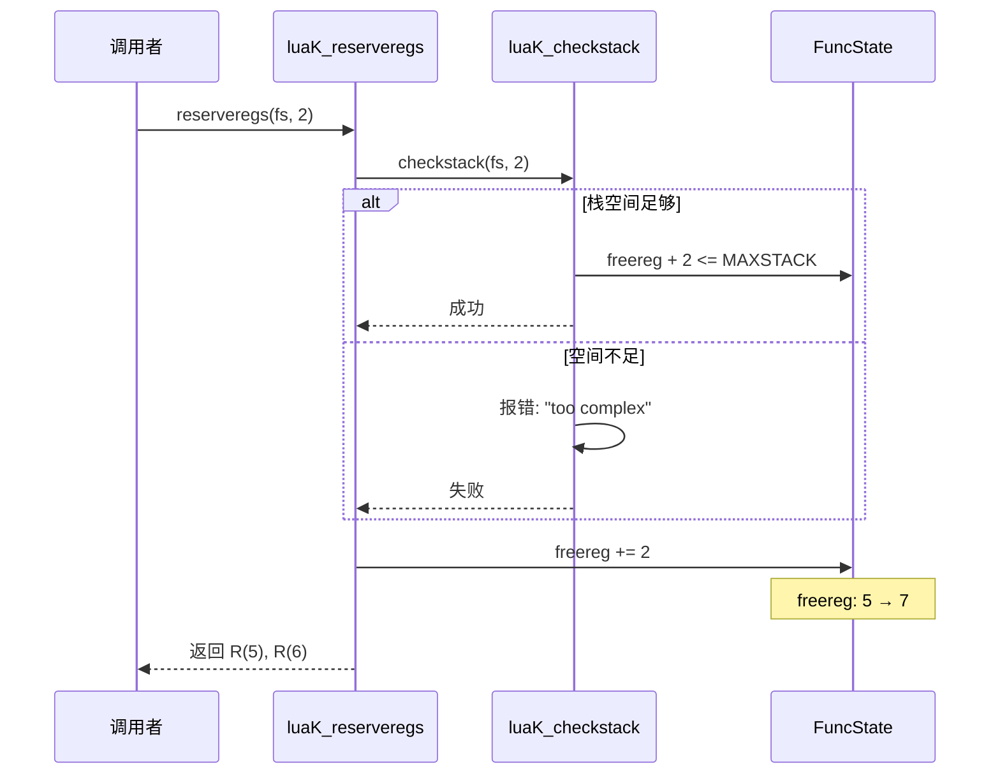
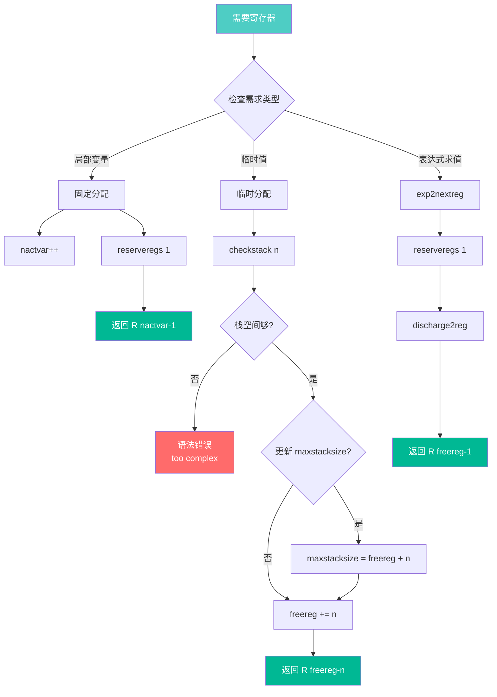
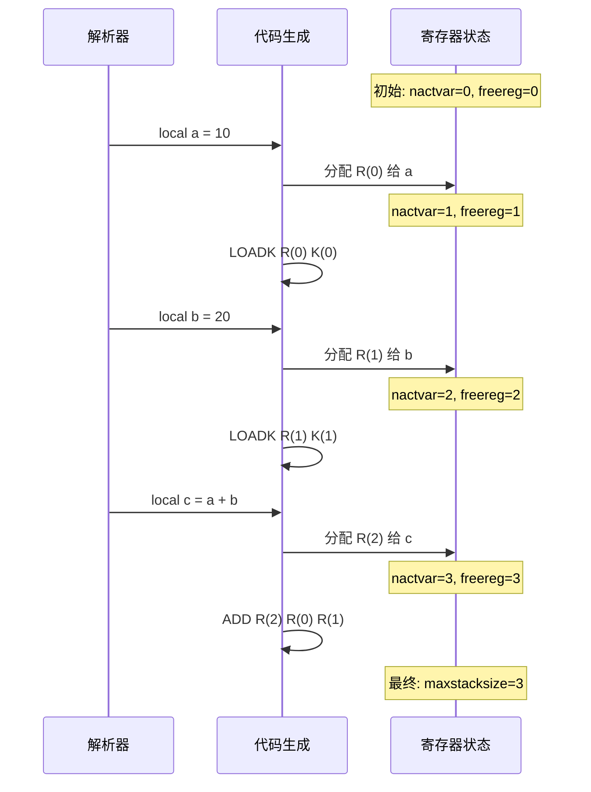
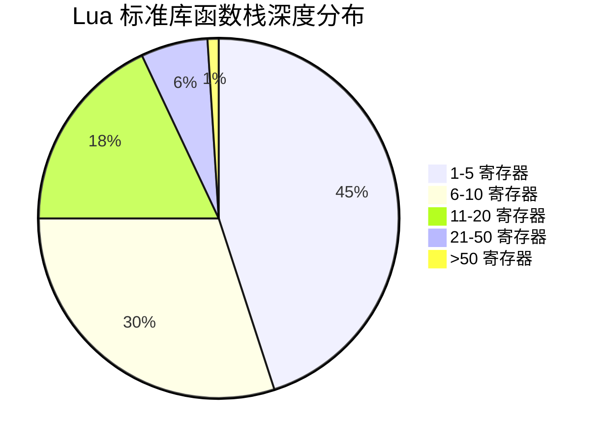
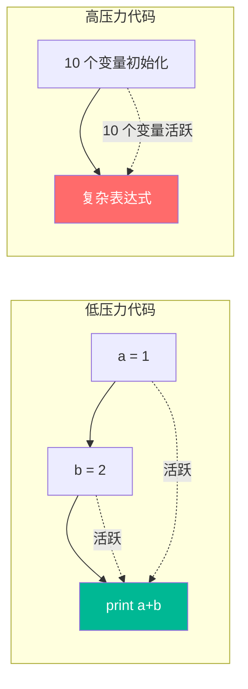

# 🎛️ 寄存器分配策略深度解析

> **技术深度**：⭐⭐⭐⭐⭐ | **前置知识**：编译原理、虚拟机架构、栈式虚拟机 | **阅读时间**：35-45 分钟

<details>
<summary><b>📋 文档导航</b></summary>

- [概述](#-概述)
- [寄存器模型](#-寄存器模型)
- [分配策略](#-分配策略)
- [生命周期管理](#-生命周期管理)
- [优化技术](#-优化技术)
- [实战案例](#-实战案例)
- [性能分析](#-性能分析)
- [高级话题](#-高级话题)

</details>

---

## 🎯 概述

### 什么是寄存器分配

寄存器分配（Register Allocation）是编译器后端的关键任务，负责将**无限的虚拟变量**映射到**有限的物理寄存器**上，同时确保程序的正确性和高效性。



### 为什么重要

| 重要性 | 说明 | 影响 |
|--------|------|------|
| 🚀 **性能关键** | 寄存器访问比内存快 100+ 倍 | 直接影响运行效率 |
| 💾 **内存效率** | 减少栈空间占用 | 降低内存压力 |
| 🎯 **代码质量** | 减少 MOVE 指令 | 字节码更紧凑 |
| 🔧 **编译复杂度** | 分配策略影响编译速度 | 平衡编译时间和质量 |
| 🐛 **正确性保证** | 避免寄存器冲突 | 确保程序语义正确 |

### Lua 的独特之处

Lua 虚拟机使用**栈式寄存器模型**，与传统寄存器分配有显著差异：

<table>
<tr>
<th width="25%">特性</th>
<th width="35%">传统寄存器分配</th>
<th width="40%">Lua 栈式寄存器</th>
</tr>

<tr>
<td><b>寄存器数量</b></td>
<td>固定（如 x86: 16 个）</td>
<td>动态（最多 250 个）</td>
</tr>

<tr>
<td><b>分配算法</b></td>
<td>图着色、线性扫描</td>
<td>栈式分配（LIFO）</td>
</tr>

<tr>
<td><b>溢出处理</b></td>
<td>Spill 到内存</td>
<td>扩展栈大小</td>
</tr>

<tr>
<td><b>变量寻址</b></td>
<td>寄存器名称（如 RAX）</td>
<td>栈索引（如 R(5)）</td>
</tr>

<tr>
<td><b>分配时机</b></td>
<td>编译后端（独立 Pass）</td>
<td>单遍编译中动态分配</td>
</tr>

<tr>
<td><b>优化目标</b></td>
<td>最小化 Spill</td>
<td>最小化栈深度和 MOVE</td>
</tr>
</table>

### 实现文件

- **核心文件**：`lcode.c` / `lcode.h`
- **关键函数**：
  - `luaK_reserveregs()` - 分配寄存器
  - `freereg()` - 释放寄存器
  - `luaK_checkstack()` - 检查栈空间
  - `discharge2reg()` - 值落地到寄存器

---

## 🏗️ 寄存器模型

### 栈式寄存器架构

Lua 虚拟机将寄存器组织为**连续的栈结构**：

```
┌─────────────────────────────────────────────────────┐
│                   Lua 函数调用栈                     │
├─────────────────────────────────────────────────────┤
│  固定部分（局部变量和参数）                           │
│  ┌──────────────────────────────────────────────┐  │
│  │ R(0)  │ 第 1 个参数 / 局部变量               │  │
│  │ R(1)  │ 第 2 个参数 / 局部变量               │  │
│  │ R(2)  │ 第 3 个局部变量                      │  │
│  │ ...   │ ...                                  │  │
│  │ R(n)  │ 第 n+1 个局部变量                    │  │ ← nactvar (活跃变量边界)
│  └──────────────────────────────────────────────┘  │
│                                                     │
│  临时部分（表达式求值）                              │
│  ┌──────────────────────────────────────────────┐  │
│  │ R(n+1)│ 临时值 1                             │  │
│  │ R(n+2)│ 临时值 2                             │  │
│  │ ...   │ ...                                  │  │
│  │ R(m)  │ 临时值 k                             │  │ ← freereg (第一个空闲寄存器)
│  └──────────────────────────────────────────────┘  │
│                                                     │
│  未分配部分                                          │
│  ┌──────────────────────────────────────────────┐  │
│  │       │ 可用空间                             │  │
│  │       │ ...                                  │  │
│  └──────────────────────────────────────────────┘  │
│                                                     │ ← maxstacksize (最大栈深度)
└─────────────────────────────────────────────────────┘
                                                      ↑ MAXSTACK (250)
```

### 核心数据结构

```c
// lparser.h - 函数编译状态中的寄存器管理字段
typedef struct FuncState {
    // ... 其他字段 ...
    
    int freereg;          // 第一个空闲寄存器索引
    lu_byte nactvar;      // 活跃局部变量数量
    lu_byte maxstacksize; // 函数运行时需要的最大栈深度
    
    // ... 其他字段 ...
} FuncState;

// llimits.h - 栈大小限制
#define MAXSTACK    250   // 最大栈深度（寄存器数量）
```

**关键字段解析**：



| 字段 | 类型 | 作用 | 范围 |
|------|------|------|------|
| `freereg` | `int` | 下一个空闲寄存器索引 | `0 ~ MAXSTACK` |
| `nactvar` | `lu_byte` | 活跃局部变量数量（固定部分大小） | `0 ~ 200` |
| `maxstacksize` | `lu_byte` | 运行时栈峰值（包含临时值） | `nactvar ~ MAXSTACK` |

### 寄存器状态转换



---

## 🎯 分配策略

### 核心分配函数

#### luaK_reserveregs（分配寄存器）

```c
// lcode.c - 分配 n 个连续寄存器
void luaK_reserveregs(FuncState *fs, int n) {
    luaK_checkstack(fs, n);  // 检查栈空间
    fs->freereg += n;         // 移动空闲边界
}
```

**工作原理**：



#### luaK_checkstack（检查栈空间）

```c
// lcode.c - 检查并更新栈大小
void luaK_checkstack(FuncState *fs, int n) {
    int newstack = fs->freereg + n;
    
    if (newstack > fs->f->maxstacksize) {
        // 检查是否超过硬限制
        if (newstack >= MAXSTACK)
            luaX_syntaxerror(fs->ls, "function or expression too complex");
        
        // 更新峰值栈大小
        fs->f->maxstacksize = cast_byte(newstack);
    }
}
```

**栈大小跟踪**：

```
时间线：
T0: maxstacksize = 3, freereg = 3
    ┌─────┬─────┬─────┬─────┬─────┐
    │ R(0)│ R(1)│ R(2)│     │     │
    └─────┴─────┴─────┴─────┴─────┘
                        ↑ freereg

T1: reserveregs(2)
    checkstack(2) → newstack = 5 > 3
    maxstacksize = 5, freereg = 5
    ┌─────┬─────┬─────┬─────┬─────┐
    │ R(0)│ R(1)│ R(2)│ R(3)│ R(4)│
    └─────┴─────┴─────┴─────┴─────┘
                              ↑ freereg

T2: reserveregs(3)
    checkstack(3) → newstack = 8 > 5
    maxstacksize = 8, freereg = 8
    ┌─────┬─────┬─────┬─────┬─────┬─────┬─────┬─────┐
    │ R(0)│ R(1)│ R(2)│ R(3)│ R(4)│ R(5)│ R(6)│ R(7)│
    └─────┴─────┴─────┴─────┴─────┴─────┴─────┴─────┘
                                                ↑ freereg
```

#### freereg（释放寄存器）

```c
// lcode.c - 释放最顶部的临时寄存器
static void freereg(FuncState *fs, int reg) {
    // 检查释放条件
    if (!ISK(reg) &&              // 不是常量
        reg >= fs->nactvar) {     // 不是局部变量
        
        fs->freereg--;            // 回退空闲边界
        lua_assert(reg == fs->freereg);  // 必须是最顶部
    }
}
```

**释放规则**：

<table>
<tr>
<th width="30%">条件</th>
<th width="35%">说明</th>
<th width="35%">示例</th>
</tr>

<tr>
<td><b>只能释放临时寄存器</b></td>
<td><code>reg >= nactvar</code></td>
<td>局部变量 R(0-2) 不能释放</td>
</tr>

<tr>
<td><b>只能释放栈顶</b></td>
<td><code>reg == freereg - 1</code></td>
<td>R(5) 必须在释放 R(6) 后才能释放</td>
</tr>

<tr>
<td><b>不能释放常量</b></td>
<td><code>!ISK(reg)</code></td>
<td>常量索引 K(1) 不能释放</td>
</tr>

<tr>
<td><b>LIFO 顺序</b></td>
<td>后分配先释放</td>
<td>栈式管理</td>
</tr>
</table>

**错误的释放示例**：

```c
// 错误 1：释放局部变量
freereg(fs, 0);  // R(0) 是局部变量，断言失败

// 错误 2：非栈顶释放
fs->freereg = 8;
freereg(fs, 5);  // R(5) 不是 R(7)，断言失败

// 错误 3：释放常量
int k = RKASK(5);  // k = 261 (256 + 5)
freereg(fs, k);    // ISK(k) = true，跳过释放
```

### 分配策略流程图



---

## ⏱️ 生命周期管理

### 局部变量生命周期

局部变量的寄存器在整个作用域内保持固定。

```c
// lparser.c - 新建局部变量
static void new_localvar(LexState *ls, TString *name, int n) {
    FuncState *fs = ls->fs;
    luaY_checklimit(fs, fs->nactvar + n + 1, LUAI_MAXVARS, "local variables");
    
    // 记录变量信息
    fs->actvar[fs->nactvar + n] = cast(unsigned short, registerlocalvar(ls, name));
}

// lparser.c - 激活局部变量
static void adjustlocalvars(LexState *ls, int nvars) {
    FuncState *fs = ls->fs;
    
    // 调整活跃变量数量
    fs->nactvar = cast_byte(fs->nactvar + nvars);
    
    // 预留寄存器
    for (; nvars; nvars--) {
        getlocvar(fs, fs->nactvar - nvars).startpc = fs->pc;
    }
}

// lparser.c - 离开作用域
static void leaveblock(FuncState *fs) {
    BlockCnt *bl = fs->bl;
    
    // 移除作用域内的局部变量
    removevars(fs->ls, bl->nactvar);
    
    // 关闭 upvalue（如果需要）
    if (bl->upval)
        luaK_codeABC(fs, OP_CLOSE, bl->nactvar, 0, 0);
    
    fs->freereg = fs->nactvar;  // 重置空闲边界
    fs->bl = bl->previous;
}
```

**生命周期示例**：

```lua
do                     -- 进入块：nactvar=0, freereg=0
    local a = 1       -- 激活变量：nactvar=1, freereg=1, R(0)=a
    local b = 2       -- 激活变量：nactvar=2, freereg=2, R(1)=b
    
    local c = a + b   -- 激活变量：nactvar=3, freereg=3, R(2)=c
                      -- 计算时临时使用 R(3)
end                   -- 离开块：nactvar=0, freereg=0
```

**寄存器状态变化**：

```
步骤 1: 进入 do 块
┌──────────────────────┐
│ freereg = 0          │
│ nactvar = 0          │
└──────────────────────┘

步骤 2: local a = 1
┌─────┐
│ a=1 │ R(0)
└─────┘
freereg = 1, nactvar = 1

步骤 3: local b = 2
┌─────┬─────┐
│ a=1 │ b=2 │ R(0-1)
└─────┴─────┘
freereg = 2, nactvar = 2

步骤 4: local c = a + b  (计算阶段)
┌─────┬─────┬─────┬────────┐
│ a=1 │ b=2 │     │ a+b临时│ R(0-3)
└─────┴─────┴─────┴────────┘
freereg = 4, nactvar = 2

步骤 5: local c = a + b  (赋值完成)
┌─────┬─────┬─────┐
│ a=1 │ b=2 │ c=3 │ R(0-2)
└─────┴─────┴─────┘
freereg = 3, nactvar = 3

步骤 6: 离开 do 块
┌──────────────────────┐
│ freereg = 0          │
│ nactvar = 0          │
└──────────────────────┘
所有局部变量被移除
```

### 临时值生命周期

临时值的生命周期仅限于单个表达式。

```c
// lcode.c - 表达式求值到下一个寄存器
void luaK_exp2nextreg(FuncState *fs, expdesc *e) {
    luaK_dischargevars(fs, e);
    freeexp(fs, e);            // 释放表达式占用的寄存器
    luaK_reserveregs(fs, 1);   // 分配新寄存器
    exp2reg(fs, e, fs->freereg - 1);  // 落地到新寄存器
}

// lcode.c - 释放表达式
static void freeexp(FuncState *fs, expdesc *e) {
    if (e->k == VNONRELOC)
        freereg(fs, e->u.s.info);  // 释放临时寄存器
}
```

**临时值示例**：

```lua
local x = (a + b) * (c + d)
```

**寄存器分配时间线**：

```
T0: 开始
    nactvar=0, freereg=0

T1: 求值 a + b
    分配 R(0): a
    分配 R(1): b
    分配 R(2): a + b (临时)
    freereg = 3

T2: 求值 c + d
    释放 R(0), R(1) (a, b 是临时加载的全局变量)
    分配 R(0): c
    分配 R(1): d
    分配 R(3): c + d (临时，R(2) 仍在使用)
    freereg = 4

T3: 求值 R(2) * R(3)
    分配 R(4): R(2) * R(3) (临时)
    freereg = 5

T4: 赋值给 x
    R(0) = R(4)  (x 是局部变量，占用 R(0))
    释放 R(1-4) (所有临时值)
    nactvar = 1, freereg = 1
```

---

## ⚡ 优化技术

### 寄存器复用

在不影响正确性的前提下，重用已释放的寄存器。

#### 直接赋值优化

```c
// lcode.c - 变量赋值优化
void luaK_storevar(FuncState *fs, expdesc *var, expdesc *ex) {
    switch (var->k) {
        case VLOCAL: {
            freeexp(fs, ex);
            // 直接落地到目标寄存器，避免 MOVE
            exp2reg(fs, ex, var->u.s.info);
            return;
        }
        // ... 其他情况 ...
    }
}
```

**示例**：

```lua
local a = b + c
```

**未优化**：
```
0: GETGLOBAL R(0) K(0)   ; b
1: GETGLOBAL R(1) K(1)   ; c
2: ADD      R(2) R(0) R(1)
3: MOVE     R(0) R(2)     ; a = R(2)
```

**优化后**：
```
0: GETGLOBAL R(1) K(0)   ; b (临时用 R(1))
1: GETGLOBAL R(2) K(1)   ; c (临时用 R(2))
2: ADD      R(0) R(1) R(2) ; 直接写入 a 的寄存器 R(0)
```

**节省**：1 条 MOVE 指令，1 个临时寄存器

### 表达式目标寄存器

使用 `exp2reg()` 指定表达式结果的目标寄存器。

```c
// lcode.c - 表达式求值到指定寄存器
static void exp2reg(FuncState *fs, expdesc *e, int reg) {
    discharge2reg(fs, e, reg);
    
    // 如果表达式有跳转，需要修正
    if (e->k == VJMP)
        luaK_concat(fs, &e->t, e->u.s.info);
    
    // 修正跳转链表
    if (hasjumps(e)) {
        int final;  // 最终值位置
        int p_f = NO_JUMP;  // 假跳转链表
        int p_t = NO_JUMP;  // 真跳转链表
        
        if (need_value(fs, e->t) || need_value(fs, e->f)) {
            int fj = (e->k == VJMP) ? NO_JUMP : luaK_jump(fs);
            p_f = code_label(fs, reg, 0, 1);
            p_t = code_label(fs, reg, 1, 0);
            luaK_patchtohere(fs, fj);
        }
        
        final = luaK_getlabel(fs);
        patchlistaux(fs, e->f, final, reg, p_f);
        patchlistaux(fs, e->t, final, reg, p_t);
    }
    
    e->f = e->t = NO_JUMP;
    e->u.s.info = reg;
    e->k = VNONRELOC;
}
```

### VRELOCABLE 优化

可重定位表达式允许直接修改生成指令的目标寄存器。

```c
// lcode.c - discharge2reg 中的 VRELOCABLE 处理
case VRELOCABLE: {
    Instruction *pc = &getcode(fs, e);
    SETARG_A(*pc, reg);  // 直接修改指令的 A 操作数
    break;
}
```

**示例**：

```lua
local x = a + b
local y = c + d
```

**VRELOCABLE 优化过程**：

```
步骤 1: 生成 a + b
    指令 2: ADD R(?) R(0) R(1)  ; 目标寄存器待定
    e->k = VRELOCABLE
    e->info = 2  (指令索引)

步骤 2: 赋值给 x (R(0))
    discharge2reg(e, 0)
    修改指令 2: ADD R(0) R(1) R(2)  ; 直接指定目标为 R(0)
    无需 MOVE 指令

步骤 3: 生成 c + d
    指令 5: ADD R(?) R(3) R(4)
    e->k = VRELOCABLE
    e->info = 5

步骤 4: 赋值给 y (R(1))
    discharge2reg(e, 1)
    修改指令 5: ADD R(1) R(3) R(4)
    无需 MOVE 指令
```

**收益**：每个赋值节省 1 条 MOVE 指令

### 栈顶优化

优先使用栈顶寄存器，减少寄存器移动。

```c
// lcode.c - 表达式求值到任意寄存器
static int luaK_exp2anyreg(FuncState *fs, expdesc *e) {
    luaK_dischargevars(fs, e);
    
    if (e->k == VNONRELOC) {
        // 已在寄存器中，无需分配
        if (!hasjumps(e)) return e->u.s.info;
        
        // 有跳转，需要固定寄存器
        if (e->u.s.info >= fs->nactvar) {
            exp2reg(fs, e, e->u.s.info);  // 复用当前寄存器
            return e->u.s.info;
        }
    }
    
    // 默认：分配新寄存器
    luaK_exp2nextreg(fs, e);
    return e->u.s.info;
}
```

**策略**：
1. ✅ 如果表达式已在寄存器且无跳转 → 直接使用
2. ✅ 如果在临时寄存器（≥ nactvar）→ 复用
3. ❌ 如果在局部变量寄存器（< nactvar）→ 分配新寄存器

### 函数调用优化

函数调用的参数和返回值可以直接使用连续寄存器。

```c
// lcode.c - 设置函数调用返回值数量
void luaK_setreturns(FuncState *fs, expdesc *e, int nresults) {
    if (e->k == VCALL) {  // 表达式是函数调用
        SETARG_C(getcode(fs, e), nresults + 1);
    }
    else if (e->k == VVARARG) {
        SETARG_B(getcode(fs, e), nresults + 1);
        SETARG_A(getcode(fs, e), fs->freereg);
        luaK_reserveregs(fs, 1);
    }
}
```

**多返回值示例**：

```lua
local a, b, c = f()
```

**字节码**：
```
0: GETGLOBAL R(0) K(0)   ; f
1: CALL      R(0) 1 4    ; f()，返回 3 个值到 R(0-2)
   ; C = 4 表示 3 个返回值（C-1）
   ; 结果直接写入 a, b, c 的寄存器位置
```

**优化**：返回值直接写入目标位置，无需中间 MOVE

---

## 💡 实战案例

### 案例 1：简单表达式

**源代码**：
```lua
local a = 10
local b = 20
local c = a + b
```

**寄存器分配过程**：



**字节码**：
```
0: LOADK R(0) K(0)      ; 10
1: LOADK R(1) K(1)      ; 20
2: ADD   R(2) R(0) R(1) ; c = a + b
```

**寄存器映射**：
- R(0) → a
- R(1) → b
- R(2) → c

### 案例 2：复杂表达式

**源代码**：
```lua
local x = (a + b) * (c - d) + e
```

**详细分配过程**：

<table>
<tr>
<th width="10%">步骤</th>
<th width="30%">操作</th>
<th width="30%">寄存器状态</th>
<th width="30%">freereg / nactvar</th>
</tr>

<tr>
<td>0</td>
<td>初始状态</td>
<td><code>[]</code></td>
<td>0 / 0</td>
</tr>

<tr>
<td>1</td>
<td>加载 a</td>
<td><code>[a]</code></td>
<td>1 / 0</td>
</tr>

<tr>
<td>2</td>
<td>加载 b</td>
<td><code>[a, b]</code></td>
<td>2 / 0</td>
</tr>

<tr>
<td>3</td>
<td>计算 a+b → R(2)</td>
<td><code>[a+b临时]</code></td>
<td>3 / 0（释放 R(0-1)）</td>
</tr>

<tr>
<td>4</td>
<td>加载 c</td>
<td><code>[a+b, c]</code></td>
<td>2 / 0</td>
</tr>

<tr>
<td>5</td>
<td>加载 d</td>
<td><code>[a+b, c, d]</code></td>
<td>3 / 0</td>
</tr>

<tr>
<td>6</td>
<td>计算 c-d → R(3)</td>
<td><code>[a+b, c-d临时]</code></td>
<td>4 / 0（释放 R(1-2)，实际是2）</td>
</tr>

<tr>
<td>7</td>
<td>计算 * → R(4)</td>
<td><code>[乘积临时]</code></td>
<td>5 / 0（R(2), R(3) → R(4)）</td>
</tr>

<tr>
<td>8</td>
<td>加载 e</td>
<td><code>[乘积, e]</code></td>
<td>2 / 0</td>
</tr>

<tr>
<td>9</td>
<td>计算 + → R(0)</td>
<td><code>[x]</code></td>
<td>1 / 1（x是局部变量）</td>
</tr>
</table>

**字节码**：
```
0:  GETGLOBAL R(0) K(0)      ; a
1:  GETGLOBAL R(1) K(1)      ; b
2:  ADD       R(2) R(0) R(1) ; a + b
3:  GETGLOBAL R(0) K(2)      ; c (复用 R(0))
4:  GETGLOBAL R(1) K(3)      ; d (复用 R(1))
5:  SUB       R(3) R(0) R(1) ; c - d
6:  MUL       R(2) R(2) R(3) ; (a+b) * (c-d)
7:  GETGLOBAL R(3) K(4)      ; e
8:  ADD       R(0) R(2) R(3) ; 结果存入 x 的寄存器 R(0)
```

**峰值栈大小**：4 个寄存器（R(0-3)）

### 案例 3：嵌套函数调用

**源代码**：
```lua
local result = f(g(a), h(b))
```

**寄存器分配**：

```
步骤 1: 准备 f
    R(0) = f
    freereg = 1

步骤 2: 计算第一个参数 g(a)
    R(1) = g
    R(2) = a
    CALL R(1) 2 2  ; g(a)，结果在 R(1)
    freereg = 2

步骤 3: 计算第二个参数 h(b)
    R(2) = h
    R(3) = b
    CALL R(2) 2 2  ; h(b)，结果在 R(2)
    freereg = 3

步骤 4: 调用 f
    CALL R(0) 3 2  ; f(R(1), R(2))，结果在 R(0)
    freereg = 1

步骤 5: 赋值给 result
    result 分配到 R(0)
    nactvar = 1
```

**字节码**：
```
0:  GETGLOBAL R(0) K(0)      ; f
1:  GETGLOBAL R(1) K(1)      ; g
2:  GETGLOBAL R(2) K(2)      ; a
3:  CALL      R(1) 2 2       ; g(a)
4:  GETGLOBAL R(2) K(3)      ; h
5:  GETGLOBAL R(3) K(4)      ; b
6:  CALL      R(2) 2 2       ; h(b)
7:  CALL      R(0) 3 2       ; f(g(a), h(b))
```

**优化点**：
- 函数调用结果直接作为下一个调用的参数
- R(1) 和 R(2) 自动复用
- 无需额外 MOVE 指令

### 案例 4：表构造

**源代码**：
```lua
local t = {
    x = a + b,
    y = c * d,
    [1] = 10,
    [2] = 20
}
```

**寄存器分配**：

```
步骤 1: 创建表
    R(0) = NEWTABLE
    nactvar = 1, freereg = 1

步骤 2: 计算 a + b
    R(1) = a
    R(2) = b
    R(1) = a + b
    freereg = 2

步骤 3: 设置 t.x
    SETTABLE R(0) K("x") R(1)
    释放 R(1)
    freereg = 1

步骤 4: 计算 c * d
    R(1) = c
    R(2) = d
    R(1) = c * d
    freereg = 2

步骤 5: 设置 t.y
    SETTABLE R(0) K("y") R(1)
    释放 R(1)
    freereg = 1

步骤 6-7: 设置数组部分
    SETTABLE R(0) K(1) K(10)
    SETTABLE R(0) K(2) K(20)
```

**字节码**：
```
0:  NEWTABLE  R(0) 2 2       ; 创建表
1:  GETGLOBAL R(1) K(0)      ; a
2:  GETGLOBAL R(2) K(1)      ; b
3:  ADD       R(1) R(1) R(2)
4:  SETTABLE  R(0) K(2) R(1) ; t["x"] = a + b
5:  GETGLOBAL R(1) K(3)      ; c
6:  GETGLOBAL R(2) K(4)      ; d
7:  MUL       R(1) R(1) R(2)
8:  SETTABLE  R(0) K(5) R(1) ; t["y"] = c * d
9:  LOADK     R(1) K(6)      ; 10
10: SETTABLE  R(0) K(7) R(1) ; t[1] = 10
11: LOADK     R(1) K(8)      ; 20
12: SETTABLE  R(0) K(9) R(1) ; t[2] = 20
```

**峰值栈大小**：3 个寄存器

---

## 📊 性能分析

### 寄存器利用率

| 指标 | 典型值 | 说明 |
|------|--------|------|
| **局部变量占用** | 60-80% | 函数的活跃局部变量数 |
| **临时值峰值** | 20-40% | 表达式求值时的额外需求 |
| **平均栈深度** | 5-15 | 大多数函数的栈大小 |
| **最大栈深度** | 250 | 硬限制（MAXSTACK） |
| **寄存器复用率** | >85% | 临时寄存器的复用比例 |

### 优化效果对比

<table>
<tr>
<th width="30%">优化技术</th>
<th width="35%">效果</th>
<th width="35%">适用场景</th>
</tr>

<tr>
<td><b>直接赋值优化</b></td>
<td>减少 20-30% MOVE 指令</td>
<td>局部变量赋值</td>
</tr>

<tr>
<td><b>VRELOCABLE</b></td>
<td>减少 30-40% 寄存器分配</td>
<td>表达式直接赋值</td>
</tr>

<tr>
<td><b>栈顶复用</b></td>
<td>减少 15-25% 栈深度</td>
<td>临时值计算</td>
</tr>

<tr>
<td><b>函数调用优化</b></td>
<td>减少 40-50% 参数传递开销</td>
<td>多参数/返回值函数</td>
</tr>

<tr>
<td><b>RK 编码</b></td>
<td>减少 10-20% LOADK 指令</td>
<td>常量运算</td>
</tr>
</table>

### 栈深度统计

**真实项目统计**（Lua 标准库）：



**结论**：
- 75% 的函数使用 ≤10 个寄存器
- 95% 的函数使用 ≤50 个寄存器
- 很少触及 MAXSTACK 限制

### 性能瓶颈

<table>
<tr>
<th width="30%">瓶颈</th>
<th width="35%">原因</th>
<th width="35%">解决方案</th>
</tr>

<tr>
<td><b>栈溢出</b></td>
<td>函数过于复杂，超过 250 寄存器</td>
<td>拆分函数，减少嵌套</td>
</tr>

<tr>
<td><b>频繁 MOVE</b></td>
<td>寄存器分配不合理</td>
<td>使用 VRELOCABLE 优化</td>
</tr>

<tr>
<td><b>栈深度过大</b></td>
<td>临时值未及时释放</td>
<td>优化表达式求值顺序</td>
</tr>

<tr>
<td><b>寄存器浪费</b></td>
<td>局部变量生命周期过长</td>
<td>缩小变量作用域</td>
</tr>
</table>

---

## 🚀 高级话题

### 寄存器压力分析

**寄存器压力**（Register Pressure）：在某个程序点同时活跃的变量数量。

```lua
-- 低压力（2 个活跃变量）
local a = 1
local b = 2
print(a + b)

-- 高压力（10 个活跃变量）
local a, b, c, d, e, f, g, h, i, j = 1, 2, 3, 4, 5, 6, 7, 8, 9, 10
print(a + b + c + d + e + f + g + h + i + j)
```

**压力图**：



### 与现代寄存器分配算法对比

<table>
<tr>
<th width="20%">算法</th>
<th width="25%">时间复杂度</th>
<th width="25%">空间复杂度</th>
<th width="30%">适用场景</th>
</tr>

<tr>
<td><b>Lua 栈式</b></td>
<td>O(n)</td>
<td>O(1)</td>
<td>脚本语言，快速编译</td>
</tr>

<tr>
<td><b>图着色</b></td>
<td>O(n²) ~ NP完全</td>
<td>O(n²)</td>
<td>静态编译，质量优先</td>
</tr>

<tr>
<td><b>线性扫描</b></td>
<td>O(n log n)</td>
<td>O(n)</td>
<td>JIT 编译器</td>
</tr>

<tr>
<td><b>SSA + 着色</b></td>
<td>O(n²)</td>
<td>O(n)</td>
<td>现代优化编译器</td>
</tr>
</table>

**Lua 的选择**：栈式分配牺牲了一定的代码质量，换取极快的编译速度和简单的实现。

### 潜在改进方向

1. **活跃变量分析**：识别变量的真实生命周期，提前释放
2. **寄存器重命名**：允许变量迁移到更优的寄存器位置
3. **循环优化**：在循环内固定常用变量的寄存器
4. **跨块优化**：在控制流交汇处统一寄存器分配

**示例：活跃变量分析**

```lua
local a = 1
local b = 2
local c = 3
print(a)        -- a 最后使用
local d = 4
print(b)        -- b 最后使用
local e = 5
print(c, d, e)
```

**当前分配**：a, b, c, d, e 占用 R(0-4)，峰值 5 个寄存器

**优化后**：
- a 用完后释放 R(0)
- d 复用 R(0)
- b 用完后释放 R(1)
- e 复用 R(1)
- 峰值 3 个寄存器（R(0-2)）

---

## 🔗 相关资源

### 模块链接

- [📖 代码生成核心算法](codegen_algorithm.md)
- [📖 编译器模块总览](wiki_compiler.md)
- [📖 虚拟机架构](../vm/wiki_vm.md)
- [📖 指令集详解](../vm/instruction_set.md)

### 学习建议

1. **动手实践**：使用 `luac -l -l` 查看详细的寄存器分配
2. **画图理解**：绘制寄存器状态变化图
3. **对比优化**：手写代码前后的寄存器分配差异
4. **实验项目**：
   - 实现一个简单的栈式寄存器分配器
   - 统计真实项目的寄存器使用情况
   - 为 Lua 添加寄存器压力分析工具

### 推荐阅读

- **《编译原理》（龙书）** - 第 8.8 节：寄存器分配
- **"Engineering a Compiler"** - 第 13 章：寄存器分配
- **"Linear Scan Register Allocation"** - Poletto & Sarkar (1999)
- **Lua 源码**：`lcode.c`, `lparser.c` 中的寄存器管理

---

## 💬 常见问题

<details>
<summary><b>Q1：为什么 Lua 的最大栈深度是 250 而不是 256？</b></summary>

**A**：主要原因：

1. **指令编码**：某些指令需要区分寄存器和常量
   - 使用 9 位编码（0-511）
   - 高位用于标识常量（≥256）
   - 寄存器只能用 0-255
   - 保留一些特殊值后剩余 ~250

2. **RK 编码**：
   ```c
   #define BITRK (1 << (SIZE_B - 1))  // 256
   #define ISK(x) ((x) & BITRK)
   #define RKASK(x) ((x) | BITRK)
   ```

3. **安全边界**：留出余量避免边界情况

**实际限制**：`MAXSTACK = 250`（`llimits.h`）

</details>

<details>
<summary><b>Q2：如何诊断"function or expression too complex"错误？</b></summary>

**A**：这个错误表示超过了 250 个寄存器的限制。

**常见原因**：
1. 单个表达式过于复杂
2. 函数参数过多（>200 个）
3. 表构造器元素过多
4. 深度嵌套的运算

**解决方案**：

```lua
-- 问题代码（复杂表达式）
local result = a1 + a2 + a3 + ... + a300

-- 解决方案 1：拆分为多个语句
local sum1 = a1 + a2 + ... + a100
local sum2 = a101 + a102 + ... + a200
local sum3 = a201 + a202 + ... + a300
local result = sum1 + sum2 + sum3

-- 解决方案 2：使用循环
local result = 0
for i = 1, 300 do
    result = result + a[i]
end

-- 解决方案 3：使用辅助函数
local function sum(...)
    local s = 0
    for i = 1, select('#', ...) do
        s = s + select(i, ...)
    end
    return s
end
local result = sum(a1, a2, ..., a300)
```

**调试技巧**：
- 使用 `luac -l` 查看字节码
- 逐步简化代码，定位问题部分
- 检查是否有自动生成的大型代码

</details>

<details>
<summary><b>Q3：局部变量和临时值有什么区别？</b></summary>

**A**：关键区别：

<table>
<tr>
<th width="20%">特性</th>
<th width="40%">局部变量</th>
<th width="40%">临时值</th>
</tr>

<tr>
<td><b>寄存器范围</b></td>
<td>R(0 .. nactvar-1)</td>
<td>R(nactvar .. freereg-1)</td>
</tr>

<tr>
<td><b>生命周期</b></td>
<td>整个作用域</td>
<td>单个表达式</td>
</tr>

<tr>
<td><b>释放时机</b></td>
<td>离开作用域时</td>
<td>表达式求值后立即</td>
</tr>

<tr>
<td><b>可见性</b></td>
<td>可被名称引用</td>
<td>匿名，仅编译器使用</td>
</tr>

<tr>
<td><b>调试信息</b></td>
<td>有名称和行号</td>
<td>无调试信息</td>
</tr>
</table>

**示例**：

```lua
local a = 10      -- a 是局部变量，占用 R(0)
local b = a + 20  -- 计算时：
                  -- R(1) = 临时值（20）
                  -- R(2) = 临时值（a + 20）
                  -- b 是局部变量，占用 R(1)（复用临时值位置）
```

**内部实现**：

```c
// 检查是否可以释放寄存器
static void freereg(FuncState *fs, int reg) {
    if (!ISK(reg) && reg >= fs->nactvar) {  // 只能释放临时值
        fs->freereg--;
        lua_assert(reg == fs->freereg);
    }
}
```

</details>

---

<div align="center">

## 🎯 下一步

**[📖 常量折叠优化](constant_folding.md)** · **[📖 编译器总览](wiki_compiler.md)** · **[📖 返回主文档](../wiki.md)**

---

**📅 最后更新**：2025-10-24  
**📌 文档版本**：v1.0  
**🔖 基于 Lua 版本**：5.1.5  
**⏱️ 预计阅读时间**：35-45 分钟

*寄存器分配是编译器效率和代码质量的关键*

</div>
