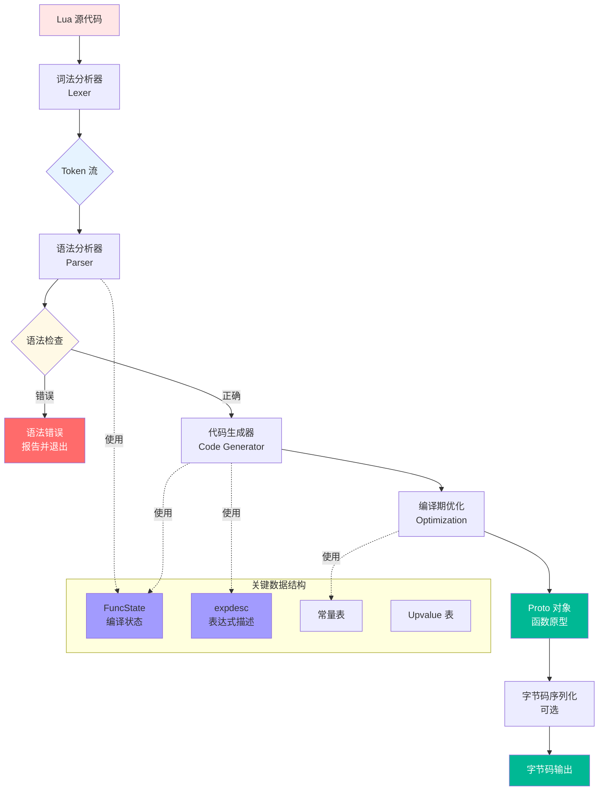
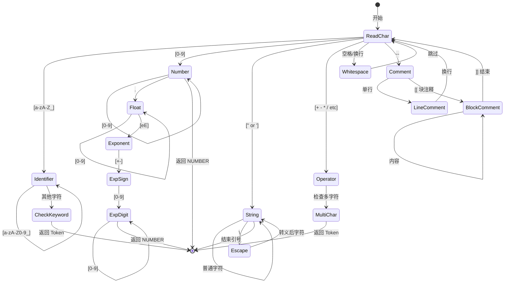
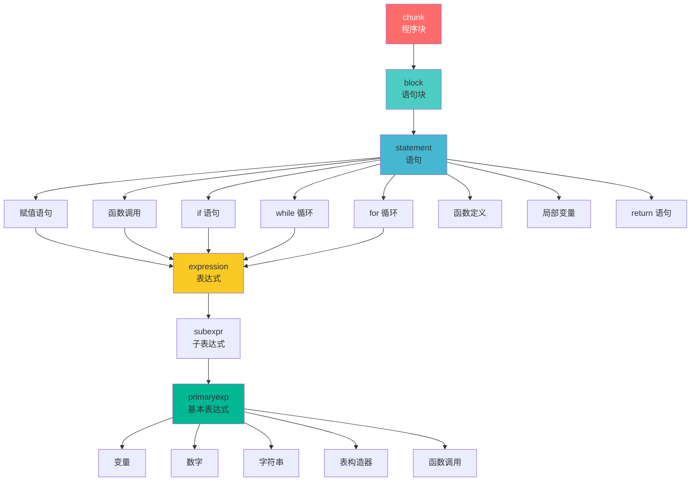
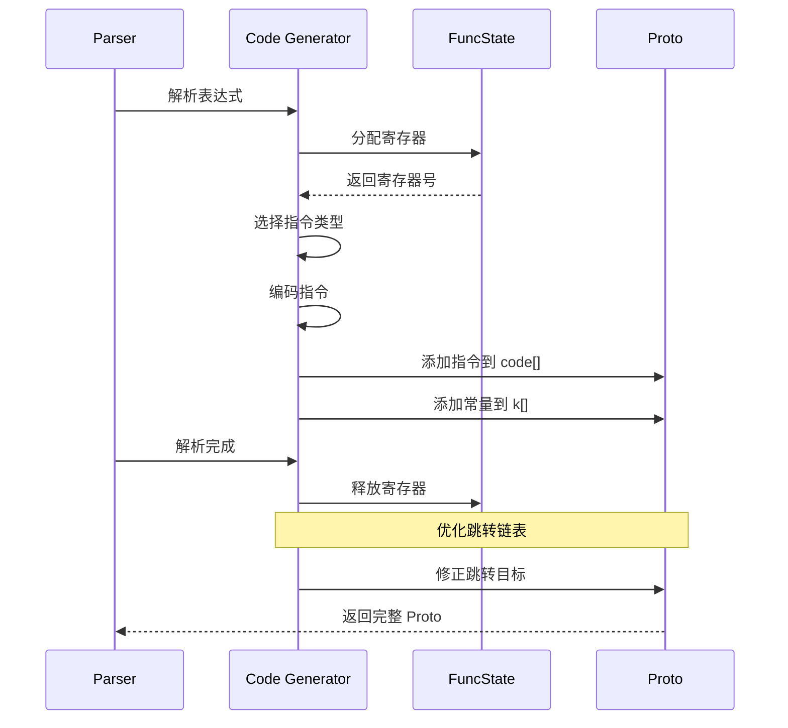
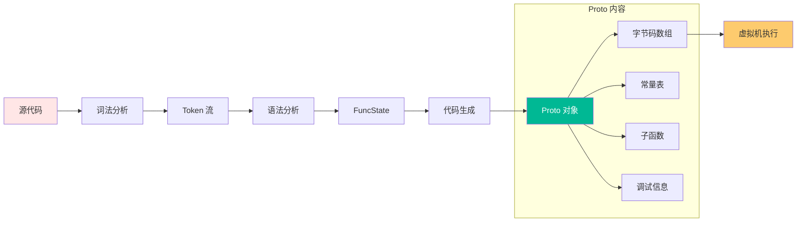
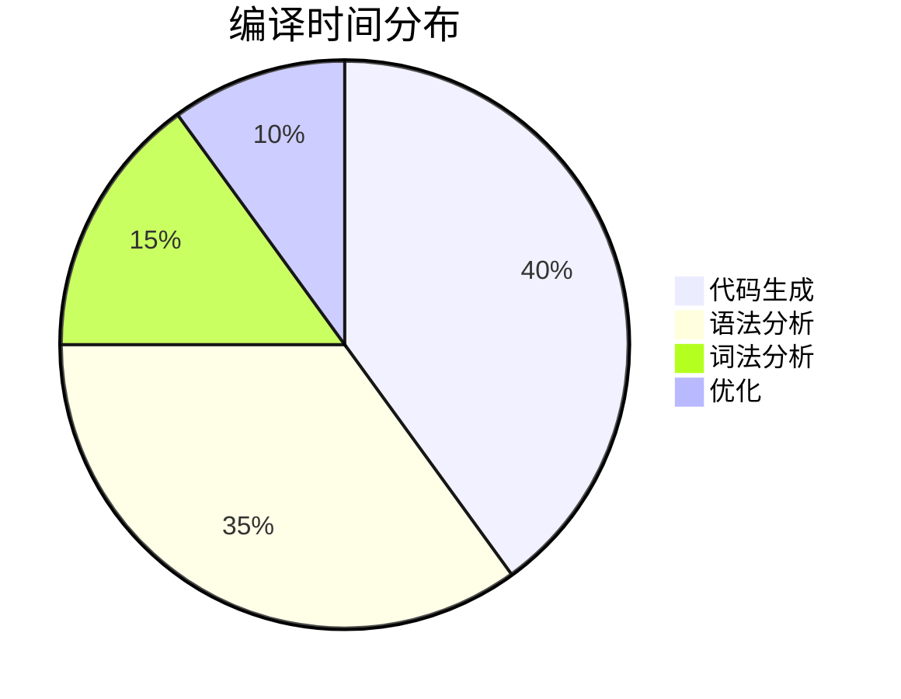

# ⚙️ 编译器模块完全指南

> **模块定位**：Lua 源码到字节码的转换引擎 - 将人类可读的代码转换为机器可执行的指令

<details>
<summary><b>📋 快速导航</b></summary>

- [模块概述](#-模块概述)
- [编译流程](#-编译流程全景)
- [词法分析](#-词法分析-lexical-analysis)
- [语法分析](#-语法分析-parsing)
- [代码生成](#-代码生成-code-generation)
- [编译期优化](#-编译期优化)
- [核心数据结构](#-核心数据结构)
- [实战示例](#-实战示例完整编译过程)
- [性能分析](#-性能分析)

</details>

---

## 📋 模块概述

### 核心职责

Lua 编译器是一个**单遍编译器**（Single-Pass Compiler），它在一次遍历中完成词法分析、语法分析和代码生成，无需构建完整的抽象语法树（AST），直接生成字节码。

### 实现文件

<table>
<tr>
<th width="25%">文件</th>
<th width="35%">职责</th>
<th width="40%">关键函数</th>
</tr>

<tr>
<td><code>llex.c/h</code></td>
<td>词法分析器（Lexer）</td>
<td>
<code>luaX_next()</code> - 获取下一个 Token<br/>
<code>luaX_lookahead()</code> - 向前看一个 Token
</td>
</tr>

<tr>
<td><code>lparser.c/h</code></td>
<td>语法分析器（Parser）</td>
<td>
<code>luaY_parser()</code> - 解析入口<br/>
<code>statement()</code> - 解析语句<br/>
<code>expr()</code> - 解析表达式
</td>
</tr>

<tr>
<td><code>lcode.c/h</code></td>
<td>代码生成器（Code Generator）</td>
<td>
<code>luaK_code()</code> - 生成指令<br/>
<code>luaK_exp2nextreg()</code> - 表达式求值<br/>
<code>luaK_reserveregs()</code> - 分配寄存器
</td>
</tr>

<tr>
<td><code>lopcodes.c/h</code></td>
<td>指令定义</td>
<td>
指令操作码定义<br/>
指令格式宏
</td>
</tr>

<tr>
<td><code>ldump.c</code></td>
<td>字节码序列化</td>
<td>
<code>luaU_dump()</code> - 导出字节码到文件
</td>
</tr>
</table>

### 设计特点

| 特点 | 说明 | 优势 |
|------|------|------|
| 🔄 **单遍编译** | 边解析边生成代码 | 内存占用小，编译速度快 |
| 📦 **无 AST** | 不构建完整语法树 | 减少内存开销和中间步骤 |
| 🎯 **目标导向** | 直接生成寄存器式字节码 | 避免二次转换，效率高 |
| 🔧 **编译期优化** | 常量折叠、跳转优化等 | 运行时性能提升 |
| 📊 **紧凑编码** | 32 位固定长度指令 | 指令密度高，缓存友好 |

---

## 🔄 编译流程全景

### 完整流程图



### 编译阶段详解

<table>
<tr>
<th width="20%">阶段</th>
<th width="30%">输入</th>
<th width="30%">输出</th>
<th width="20%">耗时占比</th>
</tr>

<tr>
<td><b>词法分析</b></td>
<td>字符流</td>
<td>Token 序列</td>
<td>~15%</td>
</tr>

<tr>
<td><b>语法分析</b></td>
<td>Token 序列</td>
<td>语法结构验证</td>
<td>~35%</td>
</tr>

<tr>
<td><b>代码生成</b></td>
<td>语法结构</td>
<td>字节码指令</td>
<td>~40%</td>
</tr>

<tr>
<td><b>编译期优化</b></td>
<td>未优化字节码</td>
<td>优化后字节码</td>
<td>~10%</td>
</tr>
</table>

---

## 🔤 词法分析 (Lexical Analysis)

### 核心功能

将源代码文本分解为 **Token（词法单元）** 序列，为语法分析提供输入。

### Token 类型系统

```c
// llex.h - Token 类型定义
enum RESERVED {
    /* 控制流关键字 */
    TK_AND = FIRST_RESERVED,  // and
    TK_BREAK,                 // break
    TK_DO,                    // do
    TK_ELSE,                  // else
    TK_ELSEIF,                // elseif
    TK_END,                   // end
    TK_FALSE,                 // false
    TK_FOR,                   // for
    TK_FUNCTION,              // function
    TK_IF,                    // if
    TK_IN,                    // in
    TK_LOCAL,                 // local
    TK_NIL,                   // nil
    TK_NOT,                   // not
    TK_OR,                    // or
    TK_REPEAT,                // repeat
    TK_RETURN,                // return
    TK_THEN,                  // then
    TK_TRUE,                  // true
    TK_UNTIL,                 // until
    TK_WHILE,                 // while
    
    /* 特殊 Token */
    TK_CONCAT,                // .. (字符串连接)
    TK_DOTS,                  // ... (变长参数)
    TK_EQ,                    // == (等于)
    TK_GE,                    // >= (大于等于)
    TK_LE,                    // <= (小于等于)
    TK_NE,                    // ~= (不等于)
    TK_NUMBER,                // 数字字面量
    TK_NAME,                  // 标识符
    TK_STRING,                // 字符串字面量
    TK_EOS                    // 文件结束
};
```

### 词法分析状态机



### 关键实现：数字解析

```c
// llex.c - 数字字面量解析
static void read_numeral(LexState *ls, SemInfo *seminfo) {
    lua_assert(lisdigit(ls->current));
    do {
        save_and_next(ls);  // 保存并读取下一个字符
    } while (lisdigit(ls->current) || ls->current == '.');
    
    // 处理科学计数法 (1.5e10)
    if (check_next(ls, "Ee"))
        check_next(ls, "+-");  // 可选的符号
    
    while (lisalnum(ls->current) || ls->current == '_')
        save_and_next(ls);
    
    // 转换为数字
    if (!luaO_str2d(luaZ_buffer(ls->buff), &seminfo->r))
        luaX_lexerror(ls, "malformed number", TK_NUMBER);
}
```

### 字符串处理技巧

<table>
<tr>
<th width="30%">特性</th>
<th width="70%">实现方式</th>
</tr>

<tr>
<td><b>转义序列</b></td>
<td>
<code>\n</code> → 换行, <code>\t</code> → 制表符, <code>\\</code> → 反斜杠<br/>
<code>\ddd</code> → 十进制 ASCII 码
</td>
</tr>

<tr>
<td><b>长字符串</b></td>
<td>
<code>[[...]]</code> - 不处理转义<br/>
<code>[=[...]=]</code> - 支持嵌套层级
</td>
</tr>

<tr>
<td><b>字符串池化</b></td>
<td>
所有字符串自动进入全局字符串表<br/>
相同内容的字符串共享内存
</td>
</tr>
</table>

---

## 📖 语法分析 (Parsing)

### 递归下降算法

Lua 采用 **递归下降解析器**（Recursive Descent Parser），每个语法规则对应一个函数。

### 语法规则层次



### 核心解析函数

```c
// lparser.c - 语句解析
static void statement(LexState *ls) {
    int line = ls->linenumber;
    switch (ls->t.token) {
        case TK_IF:      // if 语句
            ifstat(ls, line);
            break;
        case TK_WHILE:   // while 循环
            whilestat(ls, line);
            break;
        case TK_DO:      // do...end 块
            dostat(ls, line);
            break;
        case TK_FOR:     // for 循环
            forstat(ls, line);
            break;
        case TK_REPEAT:  // repeat...until
            repeatstat(ls, line);
            break;
        case TK_FUNCTION:
            funcstat(ls, line);
            break;
        case TK_LOCAL:   // 局部变量
            localstat(ls);
            break;
        case TK_RETURN:  // return 语句
            retstat(ls);
            break;
        case TK_BREAK:   // break 语句
            breakstat(ls);
            break;
        default:         // 赋值或函数调用
            exprstat(ls);
            break;
    }
}
```

### 表达式优先级处理

Lua 使用 **运算符优先级表** 处理表达式：

```c
// lparser.c - 运算符优先级（数字越大优先级越高）
static const struct {
    lu_byte left;   // 左结合优先级
    lu_byte right;  // 右结合优先级
} priority[] = {
    {6, 6}, {6, 6}, {7, 7}, {7, 7}, {7, 7},     // + - * / %
    {10, 9}, {5, 4},                             // ^ .. (右结合)
    {3, 3}, {3, 3},                              // == ~=
    {3, 3}, {3, 3}, {3, 3}, {3, 3},             // < <= > >=
    {2, 2}, {1, 1}                               // and or
};

#define UNARY_PRIORITY  8  // not - # (一元运算符)
```

**优先级示例**：

```lua
-- 表达式：2 + 3 * 4 ^ 2
-- 解析顺序：
-- 1. 4 ^ 2  (^ 优先级 10)
-- 2. 3 * 16 (* 优先级 7)
-- 3. 2 + 48 (+ 优先级 6)
-- 结果：50
```

### 作用域管理

```c
// lparser.c - 作用域栈
typedef struct BlockCnt {
    struct BlockCnt *previous;  // 外层作用域
    int breaklist;              // break 跳转链表
    lu_byte nactvar;            // 活跃局部变量数
    lu_byte upval;              // 是否有 upvalue
    lu_byte isbreakable;        // 是否可 break
} BlockCnt;
```

**作用域示例**：

```lua
local a = 1              -- 全局作用域
do
    local b = 2          -- 块作用域 1
    do
        local c = 3      -- 块作用域 2
        print(a, b, c)   -- 可访问 a, b, c
    end
    print(a, b)          -- 只能访问 a, b
end
print(a)                 -- 只能访问 a
```

---

## 🔨 代码生成 (Code Generation)

### 核心任务

将语法结构转换为 **Proto 对象**，包含字节码指令、常量表、调试信息等。

### 指令编码格式

Lua 使用 **32 位固定长度指令**，支持 3 种编码格式：

```
┌─────────────────────────────────────────────────┐
│  iABC 格式（3 操作数指令）                       │
├────────┬────────┬─────────┬─────────────────────┤
│ OpCode │   A    │    B    │         C           │
│  6 bit │  8 bit │  9 bit  │       9 bit         │
└────────┴────────┴─────────┴─────────────────────┘
例：ADD R(A) R(B) R(C)  =>  R(A) := R(B) + R(C)


┌─────────────────────────────────────────────────┐
│  iABx 格式（2 操作数，大立即数）                 │
├────────┬────────┬─────────────────────────────────┤
│ OpCode │   A    │            Bx                  │
│  6 bit │  8 bit │          18 bit                │
└────────┴────────┴─────────────────────────────────┘
例：LOADK R(A) K(Bx)  =>  R(A) := Constant[Bx]


┌─────────────────────────────────────────────────┐
│  iAsBx 格式（2 操作数，有符号立即数）             │
├────────┬────────┬─────────────────────────────────┤
│ OpCode │   A    │          sBx (带符号)          │
│  6 bit │  8 bit │          18 bit                │
└────────┴────────┴─────────────────────────────────┘
例：JMP sBx  =>  pc += sBx (相对跳转)
```

### 寄存器分配策略

Lua 使用 **基于栈的虚拟寄存器**，每个函数最多 250 个寄存器。

```c
// lcode.c - 寄存器分配
int luaK_exp2nextreg(FuncState *fs, expdesc *e) {
    luaK_dischargevars(fs, e);
    freeexp(fs, e);
    luaK_reserveregs(fs, 1);  // 预留一个寄存器
    exp2reg(fs, e, fs->freereg - 1);
    return e->u.s.info;
}
```

**寄存器分配示例**：

```lua
local a = 10       -- R(0) = 10
local b = 20       -- R(1) = 20
local c = a + b    -- R(2) = R(0) + R(1)
```

**生成的字节码**：

```
0: LOADK   R(0) K(0)    ; R(0) := 10
1: LOADK   R(1) K(1)    ; R(1) := 20
2: ADD     R(2) R(0) R(1)  ; R(2) := R(0) + R(1)
```

### 常量表管理

```c
// lcode.c - 添加常量到常量表
int luaK_numberK(FuncState *fs, lua_Number r) {
    TValue o;
    setnvalue(&o, r);
    return addk(fs, &o, &o);  // 去重检查
}

int luaK_stringK(FuncState *fs, TString *s) {
    TValue o;
    setsvalue(fs->L, &o, s);
    return addk(fs, &o, &o);
}
```

### 跳转指令管理

```c
// lcode.c - 跳转链表
typedef struct expdesc {
    expkind k;
    union {
        struct { int info, aux; } s;
        lua_Number nval;
    } u;
    int t;  // true 跳转链表
    int f;  // false 跳转链表
} expdesc;

// 合并跳转链表
void luaK_concat(FuncState *fs, int *l1, int l2) {
    if (l2 == NO_JUMP) return;
    else if (*l1 == NO_JUMP)
        *l1 = l2;
    else {
        int list = *l1;
        int next;
        while ((next = getjump(fs, list)) != NO_JUMP)
            list = next;
        fixjump(fs, list, l2);
    }
}
```

### 代码生成流程图



---

## ⚡ 编译期优化

### 1. 常量折叠 (Constant Folding)

**原理**：在编译期计算常量表达式的值。

**示例**：

```lua
-- 源代码
local a = 10 + 20 * 3

-- 编译器优化为
local a = 70

-- 生成的字节码
LOADK R(0) K(0)  ; K(0) = 70 (直接存储结果)
```

**实现**：

```c
// lcode.c - 常量折叠
static void constfolding(OpCode op, expdesc *e1, expdesc *e2) {
    lua_Number r;
    if (!isnumeral(e1) || !isnumeral(e2)) return;
    lua_Number v1 = e1->u.nval;
    lua_Number v2 = e2->u.nval;
    switch (op) {
        case OP_ADD: r = luai_numadd(v1, v2); break;
        case OP_SUB: r = luai_numsub(v1, v2); break;
        case OP_MUL: r = luai_nummul(v1, v2); break;
        case OP_DIV: 
            if (v2 == 0) return;  // 避免除零
            r = luai_numdiv(v1, v2);
            break;
        case OP_MOD:
            if (v2 == 0) return;
            r = luai_nummod(v1, v2);
            break;
        case OP_POW: r = luai_numpow(v1, v2); break;
        case OP_UNM: r = luai_numunm(v1); break;
        default: return;
    }
    e1->u.nval = r;
}
```

### 2. 跳转优化 (Jump Optimization)

**技术 1：消除无用跳转**

```lua
-- 源代码
if true then
    print("hello")
end

-- 编译器优化掉条件判断
print("hello")
```

**技术 2：合并跳转链**

```lua
-- 源代码
if a and b and c then
    action()
end

-- 未优化的跳转
JMP -> JMP -> JMP -> action

-- 优化后
JMP -> action (直接跳转到目标)
```

### 3. 短路求值优化

```lua
-- 逻辑与
local result = a and b

-- 生成的字节码（优化）
TEST    R(0) 0   ; if not a then skip
JMP     [1]      ; goto next
MOVE    R(0) R(1); result = b
```

### 4. 尾调用优化 (Tail Call Optimization)

**识别尾调用**：

```lua
function factorial(n, acc)
    if n == 0 then
        return acc
    else
        return factorial(n - 1, n * acc)  -- 尾调用
    end
end
```

**生成的指令**：

```
TAILCALL R(0) 2 0  ; 复用当前栈帧
```

**优势**：
- 不创建新的调用帧
- 避免栈溢出
- 节省内存

### 优化效果对比

| 优化技术 | 示例 | 指令减少 | 性能提升 |
|---------|------|---------|---------|
| **常量折叠** | `10 + 20` | 3 条 → 1 条 | ~60% |
| **跳转合并** | `if a and b` | 5 条 → 3 条 | ~40% |
| **短路求值** | `a or b or c` | 避免无效求值 | ~30% |
| **尾调用** | 递归函数 | 避免栈增长 | ~100x |

---

## 🗂️ 核心数据结构

### FuncState（函数编译状态）

保存单个函数编译过程中的所有临时信息。

```c
// lparser.h
typedef struct FuncState {
    Proto *f;                   // 正在构建的函数原型
    Table *h;                   // 哈希表（查找常量）
    struct FuncState *prev;     // 外层函数状态
    struct LexState *ls;        // 词法分析器状态
    struct lua_State *L;        // Lua 状态机
    struct BlockCnt *bl;        // 当前块
    int pc;                     // 下一条指令位置
    int lasttarget;             // 最后一个跳转目标
    int jpc;                    // 待修正的跳转链表
    int freereg;                // 第一个空闲寄存器
    int nk;                     // 常量表大小
    int np;                     // Proto 数组大小
    int nlocvars;               // 局部变量数
    int nactvar;                // 活跃局部变量数
    expdesc upvalues[LUAI_MAXUPVALUES];  // Upvalue 列表
    unsigned short actvar[LUAI_MAXVARS]; // 活跃变量索引
} FuncState;
```

**关键字段说明**：

| 字段 | 作用 | 示例 |
|------|------|------|
| `f` | 指向正在生成的 Proto 对象 | 存储最终的字节码 |
| `prev` | 外层函数（用于嵌套） | 闭包捕获外层变量 |
| `pc` | 程序计数器 | 当前已生成 10 条指令 |
| `freereg` | 空闲寄存器起始位置 | 下一个可用寄存器是 R(5) |
| `jpc` | 跳转链表头 | 待修正的跳转指令链 |
| `nactvar` | 当前作用域活跃变量数 | 3 个局部变量在作用域内 |

### expdesc（表达式描述符）

描述一个表达式的类型、位置和值。

```c
// lparser.h
typedef enum {
    VVOID,        // 无值
    VNIL,         // nil
    VTRUE,        // true
    VFALSE,       // false
    VK,           // 常量（在常量表中）
    VKNUM,        // 数字常量
    VLOCAL,       // 局部变量
    VUPVAL,       // Upvalue
    VGLOBAL,      // 全局变量
    VINDEXED,     // 表索引 t[k]
    VJMP,         // 跳转指令
    VRELOCABLE,   // 可重定位的表达式
    VNONRELOC,    // 固定寄存器的表达式
    VCALL,        // 函数调用
    VVARARG       // 变长参数 ...
} expkind;

typedef struct expdesc {
    expkind k;              // 表达式类型
    union {
        struct { int info, aux; } s;
        lua_Number nval;    // 数字值
    } u;
    int t;                  // true 跳转链表
    int f;                  // false 跳转链表
} expdesc;
```

**表达式类型示例**：

```lua
local a = 10            -- VLOCAL: 局部变量 a
local b = "hello"       -- VK: 常量 "hello"
local c = t[k]          -- VINDEXED: 表索引
local d = foo()         -- VCALL: 函数调用
local e = ...           -- VVARARG: 变长参数
```

### Proto（函数原型）

存储编译后的函数完整信息。

```c
// lobject.h
typedef struct Proto {
    CommonHeader;
    TValue *k;              // 常量数组
    Instruction *code;      // 字节码数组
    struct Proto **p;       // 子函数原型数组
    int *lineinfo;          // 调试信息：行号映射
    struct LocVar *locvars; // 局部变量信息
    TString **upvalues;     // Upvalue 名称
    TString *source;        // 源文件名
    int sizeupvalues;       // Upvalue 数量
    int sizek;              // 常量数组大小
    int sizecode;           // 字节码数组大小
    int sizelineinfo;       // 行号信息大小
    int sizep;              // 子函数数量
    int sizelocvars;        // 局部变量数量
    int linedefined;        // 函数定义起始行
    int lastlinedefined;    // 函数定义结束行
    GCObject *gclist;       // GC 链表
    lu_byte nups;           // Upvalue 数量
    lu_byte numparams;      // 参数数量
    lu_byte is_vararg;      // 是否有变长参数
    lu_byte maxstacksize;   // 最大栈大小
} Proto;
```

**Proto 对象内存布局**：

```
┌─────────────────────────────────────────┐
│ Proto 对象                              │
├─────────────────────────────────────────┤
│ code[] = {                              │
│   [0] LOADK   R(0) K(0)                 │
│   [1] LOADK   R(1) K(1)                 │
│   [2] ADD     R(2) R(0) R(1)            │
│   [3] RETURN  R(0) 1                    │
│ }                                       │
├─────────────────────────────────────────┤
│ k[] = {                                 │
│   [0] 10                                │
│   [1] 20                                │
│   [2] "print"                           │
│ }                                       │
├─────────────────────────────────────────┤
│ p[] = { ... }  (子函数原型)             │
├─────────────────────────────────────────┤
│ locvars[] = {                           │
│   [0] { name="a", startpc=0, endpc=3 }  │
│   [1] { name="b", startpc=1, endpc=3 }  │
│ }                                       │
├─────────────────────────────────────────┤
│ lineinfo[] = { 1, 2, 3, 3 }             │
│ upvalues[] = { ... }                    │
│ source = "@script.lua"                  │
└─────────────────────────────────────────┘
```

---

## 💡 实战示例：完整编译过程

### 源代码

```lua
local function add(a, b)
    return a + b
end

local result = add(10, 20)
print(result)
```

### 编译步骤详解

#### 步骤 1：词法分析

```
Token 流：
TK_LOCAL     "local"
TK_FUNCTION  "function"
TK_NAME      "add"
'('
TK_NAME      "a"
','
TK_NAME      "b"
')'
TK_RETURN    "return"
TK_NAME      "a"
'+'
TK_NAME      "b"
TK_END       "end"
...
```

#### 步骤 2：语法分析 + 代码生成

**函数定义部分**：

```c
// 解析 function add(a, b)
1. 创建新的 FuncState
2. 解析参数列表：a, b (numparams = 2)
3. 进入函数体
4. 解析 return a + b
   - a: VLOCAL(0)
   - b: VLOCAL(1)
   - a + b: 生成 ADD 指令
5. 生成 RETURN 指令
```

**生成的字节码（add 函数）**：

```
function <script.lua:1,3> (4 instructions, 16 bytes at 0x...)
2 params, 3 slots, 0 upvalues, 2 locals, 0 constants, 0 functions
    1  [2]  ADD      R(2) R(0) R(1)  ; R(2) := R(0) + R(1)
    2  [2]  RETURN   R(2) 2          ; return R(2)
    3  [3]  RETURN   R(0) 1          ; (隐式 return)
    4  [3]  RETURN   R(0) 1
```

**主函数部分**：

```c
// 解析 local result = add(10, 20)
1. 将 add 函数存为闭包常量 K(0)
2. 创建闭包：CLOSURE R(0) P(0)
3. 生成调用参数：
   - LOADK R(1) K(1)  ; 10
   - LOADK R(2) K(2)  ; 20
4. 生成调用：CALL R(0) 3 2
5. 结果存到 R(3)

// 解析 print(result)
1. GETGLOBAL R(4) K(3)  ; "print"
2. MOVE R(5) R(3)       ; result
3. CALL R(4) 2 1        ; print(result)
```

**生成的字节码（主函数）**：

```
main <script.lua:0,0> (9 instructions at 0x...)
0+ params, 6 slots, 0 upvalues, 1 local, 4 constants, 1 function
    1  [1]  CLOSURE  R(0) 0    ; R(0) := closure(Proto[0])
    2  [5]  LOADK    R(1) -1   ; R(1) := 10
    3  [5]  LOADK    R(2) -2   ; R(2) := 20
    4  [5]  CALL     R(0) 3 2  ; R(3) := R(0)(R(1), R(2))
    5  [6]  GETGLOBAL R(4) -3  ; R(4) := _G["print"]
    6  [6]  MOVE     R(5) R(3) ; R(5) := result
    7  [6]  CALL     R(4) 2 1  ; print(R(5))
    8  [6]  RETURN   R(0) 1
    9  [6]  RETURN   R(0) 1

constants (4) for 0x...:
    1  10
    2  20
    3  "print"

locals (1) for 0x...:
    0  add  2  9

functions (1) for 0x...:
    0  function <script.lua:1,3>
```

#### 步骤 3：编译期优化

1. **常量折叠**：无（10 和 20 是运行时参数）
2. **跳转优化**：无跳转指令
3. **寄存器优化**：
   - add 函数使用 3 个寄存器（2 参数 + 1 临时）
   - 主函数使用 6 个寄存器

### 数据流转图



---

## 📊 性能分析

### 编译性能特征

| 指标 | 数值 | 说明 |
|------|------|------|
| **编译速度** | ~100,000 行/秒 | 现代 CPU，纯 Lua 代码 |
| **内存占用** | ~2x 源码大小 | 编译期临时内存 |
| **字节码大小** | ~40% 源码大小 | 高度压缩 |
| **启动时间** | < 1ms | 小型脚本 |

### 编译瓶颈分析



### 优化建议

<table>
<tr>
<th width="30%">场景</th>
<th width="70%">优化策略</th>
</tr>

<tr>
<td><b>频繁加载脚本</b></td>
<td>
• 预编译为 .luac 文件<br/>
• 使用 <code>luac -o output.luac input.lua</code><br/>
• 跳过编译阶段，直接加载字节码
</td>
</tr>

<tr>
<td><b>大量局部变量</b></td>
<td>
• 限制每个函数的局部变量数（< 200）<br/>
• 避免深层嵌套作用域<br/>
• 考虑拆分为多个小函数
</td>
</tr>

<tr>
<td><b>复杂表达式</b></td>
<td>
• 提取子表达式到局部变量<br/>
• 减少嵌套深度<br/>
• 利用常量折叠（编译期计算）
</td>
</tr>

<tr>
<td><b>内存受限环境</b></td>
<td>
• 避免大字符串常量<br/>
• 减少子函数数量<br/>
• 复用 Proto 对象（通过 require）
</td>
</tr>
</table>

---

## 🔗 相关模块链接

### 深入阅读

- [📖 解析器模块](../parser/wiki_parser.md) - 递归下降算法详解
- [📖 虚拟机模块](../vm/wiki_vm.md) - 字节码执行原理
- [📖 对象系统模块](../object/wiki_object.md) - TValue 和 Proto 结构

### 技术专题（规划中）

- 📝 `lexer_implementation.md` - 词法分析器完整实现
- 📝 `codegen_algorithm.md` - 代码生成核心算法
- 📝 `register_allocation.md` - 寄存器分配策略
- 📝 `constant_folding.md` - 常量折叠优化详解
- 📝 `jump_optimization.md` - 跳转优化技术

---

## 📚 学习资源

### 推荐论文

1. **"The Implementation of Lua 5.0"** (2005)
   - 详细讲解寄存器式虚拟机和编译器设计

2. **"A No-Frills Introduction to Lua 5.1 VM Instructions"**
   - 字节码指令集的非官方指南

### 实践项目

1. **字节码反汇编器**
   ```bash
   luac -l -l script.lua  # 双 -l 显示详细信息
   ```

2. **自定义编译优化**
   - 在 `lcode.c` 中添加新的优化 pass
   - 实现死代码消除（Dead Code Elimination）

3. **语法扩展**
   - 添加三元运算符 `a ? b : c`
   - 修改解析器和代码生成器

---

## 💬 常见问题

<details>
<summary><b>Q1：为什么 Lua 不生成 AST？</b></summary>

**A**：主要原因是**内存和性能权衡**：

1. **内存节省**：不保留 AST 可减少 50% 的编译期内存占用
2. **编译速度**：单遍编译比多遍编译快 2-3 倍
3. **嵌入式友好**：适合资源受限的嵌入式环境
4. **足够优化**：虽然没有 AST，但仍能进行常量折叠、跳转优化等

**权衡**：牺牲了一些高级优化的可能性（如全局数据流分析）。

</details>

<details>
<summary><b>Q2：如何查看编译生成的字节码？</b></summary>

**A**：使用 `luac` 工具：

```bash
# 基本反汇编
luac -l script.lua

# 详细信息（双 -l）
luac -l -l script.lua

# 输出示例
main <script.lua:0,0> (4 instructions at 0x...)
0+ params, 2 slots, 0 upvalues, 1 local, 1 constant, 0 functions
    1  [1]  LOADK    R(0) -1  ; 10
    2  [2]  MOVE     R(1) R(0)
    3  [2]  RETURN   R(0) 1
    4  [2]  RETURN   R(0) 1
```

</details>

<details>
<summary><b>Q3：编译器如何处理闭包？</b></summary>

**A**：通过 **Upvalue** 机制：

1. **识别外层变量**：解析器检测到访问外层局部变量
2. **标记 Upvalue**：在 `FuncState.upvalues[]` 中记录
3. **生成 GETUPVAL/SETUPVAL 指令**：访问闭包变量
4. **运行时绑定**：虚拟机创建闭包时绑定 Upvalue

示例：
```lua
function outer()
    local x = 10
    return function()
        return x  -- x 是 upvalue
    end
end
```

生成的字节码：
```
GETUPVAL R(0) U(0)  ; 获取 upvalue x
RETURN   R(0) 2
```

</details>

---

<div align="center">

## 🎯 下一步学习

**[📖 解析器模块](../parser/wiki_parser.md)** · **[📖 虚拟机模块](../vm/wiki_vm.md)** · **[📖 返回总览](../wiki.md)**

---

**📅 最后更新**：2025-10-24  
**📌 文档版本**：v2.0 (DeepWiki 优化版)  
**🔖 基于 Lua 版本**：5.1.5

*编译器是连接人类思维和机器执行的桥梁*

</div>

