# 📚 Lua字节码生成机制深度解析

> **学习指南**: 本文档是对Lua编译器字节码生成模块(lcode.h/lcode.c)的深度技术分析，将带你全面了解Lua如何从源代码生成高效的字节码指令。

---

## 🎯 学习目标与路径

### 📖 适合读者
- **初级开发者**: 具备C语言基础，希望了解编译原理
- **中级开发者**: 熟悉Lua虚拟机，想深入理解字节码生成
- **高级开发者**: 研究编译器优化，寻求性能调优方案

### 🛤️ 学习路径
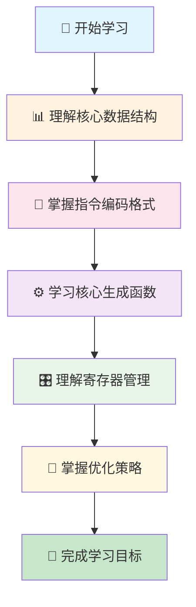

### ⏱️ 预计学习时间
- **快速浏览**: 30-45分钟
- **深度学习**: 2-3小时
- **实践应用**: 4-6小时

---

## 🧭 文档导航

### 📑 核心章节
| 章节 | 内容概要 | 难度 | 重要性 |
|------|----------|------|--------|
| [🎯 概述](#-概述与架构) | 字节码生成整体架构 | ⭐⭐ | 🔥🔥🔥 |
| [📊 数据结构](#-核心数据结构) | 核心数据结构详解 | ⭐⭐⭐ | 🔥🔥🔥 |
| [🔧 指令格式](#-字节码指令格式) | 指令编码与格式 | ⭐⭐⭐⭐ | 🔥🔥🔥 |
| [⚙️ 核心函数](#-核心生成函数) | 关键函数实现 | ⭐⭐⭐⭐⭐ | 🔥🔥🔥 |
| [🎛️ 寄存器管理](#-寄存器分配机制) | 寄存器分配策略 | ⭐⭐⭐⭐ | 🔥🔥 |
| [🚀 优化策略](#-优化策略) | 编译时优化技术 | ⭐⭐⭐⭐⭐ | 🔥🔥 |

### 🔗 相关文档链接
- 📖 [Lua虚拟机架构](./wiki_vm.md)
- 🔍 [词法分析器详解](./wiki_lexer.md)  
- 🌳 [语法分析器实现](./wiki_parser.md)
- 🏃‍♂️ [字节码执行引擎](./wiki_execution.md)
- 📊 [操作码定义](./wiki_opcodes.md)

---

## 🎯 概述与架构

### 🔍 什么是字节码生成器？

字节码生成器是Lua编译器的核心组件，负责将语法分析树转换为虚拟机可执行的字节码指令。它在Lua编译流程中的位置：


### 🏗️ 模块架构设计

lcode模块采用分层设计，各组件职责清晰：

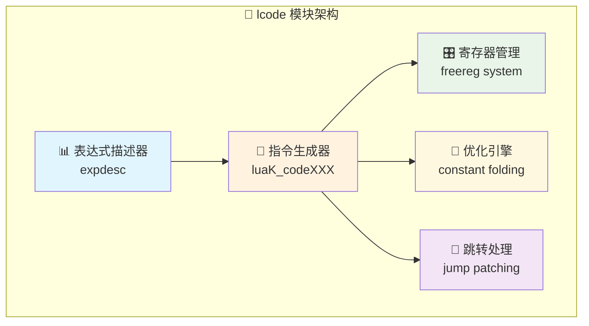

### 💡 核心设计理念

| 设计原则 | 具体体现 | 优势 |
|----------|----------|------|
| **🎯 单一职责** | 每个函数专注特定功能 | 易维护、易测试 |
| **🔧 模块化** | 清晰的接口分离 | 松耦合、高内聚 |
| **🚀 高效性** | 寄存器基础的VM设计 | 减少内存访问 |
| **🛡️ 健壮性** | 全面的边界检查 | 错误处理完善 |

### 📈 性能特色
- ✅ **常量折叠优化** - 编译时计算常量表达式
- ✅ **智能跳转合并** - 减少不必要的跳转指令  
- ✅ **寄存器复用** - 最小化寄存器使用
- ✅ **指令密度优化** - 32位紧凑指令格式

---

## 📊 核心数据结构

### 🎯 表达式描述器 (expdesc)

`expdesc` 是字节码生成的核心数据结构，描述表达式的类型和状态：

```c
typedef struct expdesc {
  expkind k;           // 🏷️ 表达式类型标识
  union {
    struct { int info, aux; } s;  // 📍 寄存器或跳转信息
    lua_Number nval;              // 🔢 数值常量
  } u;
  int t;  // 🔄 true跳转链表
  int f;  // ❌ false跳转链表  
} expdesc;
```

### 🏷️ 表达式类型枚举 (expkind)

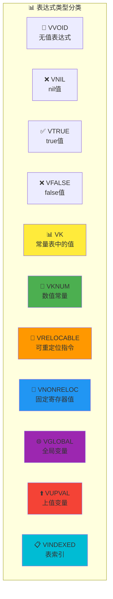

#### 🔍 详细说明表

| 类型 | 含义 | 使用场景 | 示例代码 |
|------|------|----------|----------|
| `VVOID` | 🔵 无返回值表达式 | 语句执行后 | `print("hello")` |
| `VNIL` | ❌ nil值 | 未初始化变量 | `local x` |
| `VTRUE/VFALSE` | ✅❌ 布尔常量 | 布尔字面量 | `true`, `false` |
| `VK` | 📊 常量表引用 | 字符串常量 | `"hello"` |
| `VKNUM` | 🔢 数值常量 | 数字字面量 | `3.14`, `42` |
| `VRELOCABLE` | 🔄 可重定位 | 表达式结果 | `a + b` |
| `VNONRELOC` | 📍 固定寄存器 | 局部变量 | `local x = 1` |
| `VGLOBAL` | 🌐 全局变量 | 全局访问 | `print` |
| `VUPVAL` | ⬆️ 上值变量 | 闭包变量 | 闭包中的外部变量 |
| `VINDEXED` | 📋 表索引 | 表访问 | `t[key]` |

### 🔢 操作符枚举

#### 二元操作符 (BinOpr)
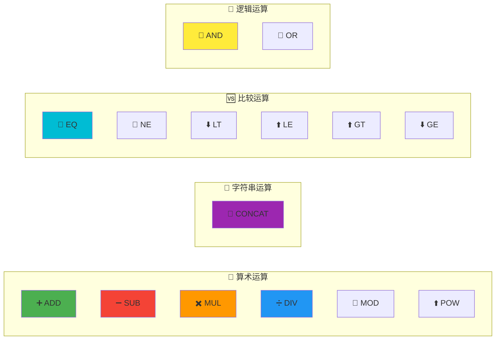

#### 一元操作符 (UnOpr)
```c
typedef enum UnOpr {
  OPR_MINUS,    // 🔄 取负号 (-)
  OPR_NOT,      // ❗ 逻辑非 (not)  
  OPR_LEN,      // 📏 长度运算符 (#)
  OPR_NOUNOPR   // ❌ 非一元运算符
} UnOpr;
```

---

## 🔧 字节码指令格式

### 🎯 32位指令编码结构

Lua使用32位定长指令格式，通过不同的编码方式最大化信息密度：

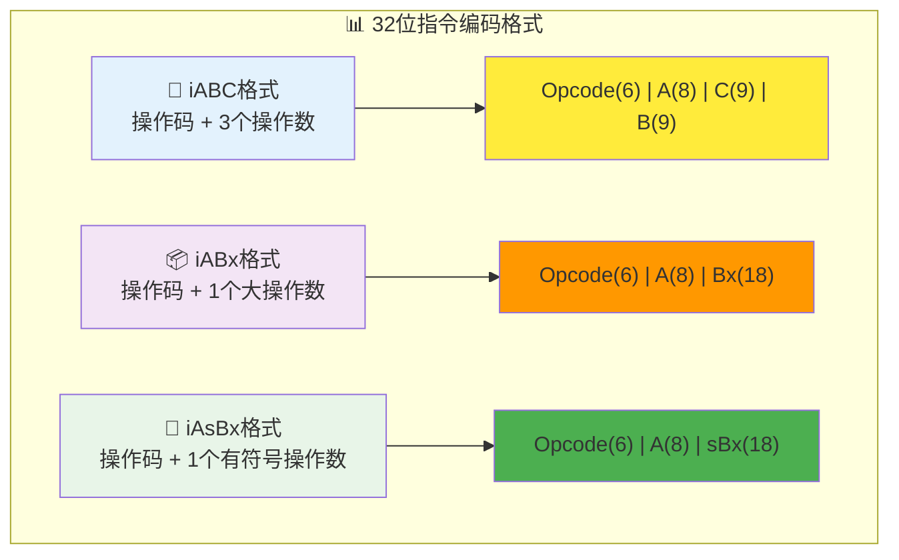

### 📋 指令格式详解

#### 🔧 iABC格式 - 三操作数指令
```
┌─────────┬─────────┬─────────┬─────────┐
│ Opcode  │    A    │    C    │    B    │
│ (6 bit) │ (8 bit) │ (9 bit) │ (9 bit) │
└─────────┴─────────┴─────────┴─────────┘
    31-26     25-18    17-9      8-0
```

**💡 使用示例**：
- `ADD R1, R2, R3` → 将R2和R3相加，结果存入R1
- `LOADNIL R5, R6, R7` → 将R5-R7设为nil

#### 📦 iABx格式 - 大操作数指令  
```
┌─────────┬─────────┬───────────────────┐
│ Opcode  │    A    │        Bx         │
│ (6 bit) │ (8 bit) │     (18 bit)      │
└─────────┴─────────┴───────────────────┘
    31-26     25-18        17-0
```

**💡 使用示例**：
- `LOADK R1, K123` → 加载常量表中第123个常量到R1
- `CLOSURE R2, F456` → 创建函数原型456的闭包到R2

#### 🔄 iAsBx格式 - 有符号跳转指令
```
┌─────────┬─────────┬───────────────────┐
│ Opcode  │    A    │       sBx         │
│ (6 bit) │ (8 bit) │ (18 bit signed)   │
└─────────┴─────────┴───────────────────┘
    31-26     25-18        17-0
```

**💡 使用示例**：
- `JMP +15` → 向前跳转15个指令
- `FORLOOP R1, -5` → for循环向后跳转5个指令

### 🎛️ 操作数类型 (RK编码)

Lua的RK编码允许操作数既可以是寄存器，也可以是常量：

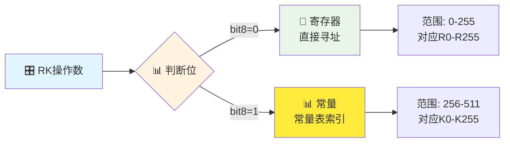

### 📊 RK编码示例表

| RK值 | 二进制 | 类型 | 实际含义 |
|------|--------|------|----------|
| 0 | `000000000` | 📍 寄存器 | R0 |
| 1 | `000000001` | 📍 寄存器 | R1 |
| 255 | `011111111` | 📍 寄存器 | R255 |
| 256 | `100000000` | 📊 常量 | K0 |
| 257 | `100000001` | 📊 常量 | K1 |
| 511 | `111111111` | 📊 常量 | K255 |

### 🔍 指令编码宏定义

```c
/* 🎯 操作码提取与设置 */
#define GET_OPCODE(i)    (cast(OpCode, ((i)>>POS_OP) & MASK1(SIZE_OP,0)))
#define SET_OPCODE(i,o)  ((i) = (((i)&MASK0(SIZE_OP,POS_OP)) | \
                          ((cast(Instruction, o)<<POS_OP)&MASK1(SIZE_OP,POS_OP))))

/* 📊 操作数A提取与设置 */  
#define GETARG_A(i)      (cast(int, ((i)>>POS_A) & MASK1(SIZE_A,0)))
#define SETARG_A(i,u)    ((i) = (((i)&MASK0(SIZE_A,POS_A)) | \
                          ((cast(Instruction, u)<<POS_A)&MASK1(SIZE_A,POS_A))))

/* 🎛️ RK操作数判断 */
#define ISK(x)           ((x) & BITRK)          // 是否为常量
#define INDEXK(r)        ((int)(r) & ~BITRK)    // 提取常量索引
#define MAXINDEXRK       (BITRK - 1)            // 最大RK值
#define RKASK(x)         ((x) | BITRK)          // 转换为常量形式
```

---

## ⚙️ 核心生成函数

### 🎯 指令生成函数族

#### 🔧 luaK_codeABC - 三操作数指令生成

```c
int luaK_codeABC (FuncState *fs, OpCode o, int a, int b, int c) {
  lua_assert(getOpMode(o) == iABC);           // 🔍 验证指令格式
  lua_assert(getBMode(o) != OpArgN || b == 0); // 🔍 验证B操作数
  lua_assert(getCMode(o) != OpArgN || c == 0); // 🔍 验证C操作数
  return luaK_code(fs, CREATE_ABC(o, a, b, c), fs->ls->linenumber);
}
```

**🚀 核心流程**：


#### 📦 luaK_codeABx - 大操作数指令生成

```c
int luaK_codeABx (FuncState *fs, OpCode o, int a, unsigned int bc) {
  lua_assert(getOpMode(o) == iABx || getOpMode(o) == iAsBx);
  lua_assert(getCMode(o) == OpArgN);          // 🔍 C操作数必须为N
  return luaK_code(fs, CREATE_ABx(o, a, bc), fs->ls->linenumber);
}
```

#### 🎛️ luaK_codeAsBx - 有符号跳转指令

```c
int luaK_codeAsBx (FuncState *fs, OpCode o, int a, int bc) {
  unsigned int c = (int)bc + MAXARG_sBx;     // 🔄 转换为无符号
  lua_assert(getOpMode(o) == iAsBx);
  lua_assert(c <= MAXARG_Bx);                // 🔍 范围检查
  return luaK_code(fs, CREATE_ABx(o, a, c), fs->ls->linenumber);
}
```

### 🔄 表达式处理核心函数

#### 📍 luaK_exp2anyreg - 表达式转任意寄存器

```c
int luaK_exp2anyreg (FuncState *fs, expdesc *e) {
  luaK_dischargevars(fs, e);                 // 🔄 解引用变量
  if (e->k == VNONRELOC) {                   // 📍 已在寄存器中
    if (!hasjumps(e)) return e->u.s.info;   // 🚀 无跳转，直接返回
    if (e->u.s.info >= fs->nactvar) {       // 🎯 临时寄存器
      exp2reg(fs, e, e->u.s.info);          // 📝 保持在原寄存器
      return e->u.s.info;
    }
  }
  luaK_exp2nextreg(fs, e);                   // 📈 分配新寄存器
  return e->u.s.info;
}
```

**🚀 决策流程**：
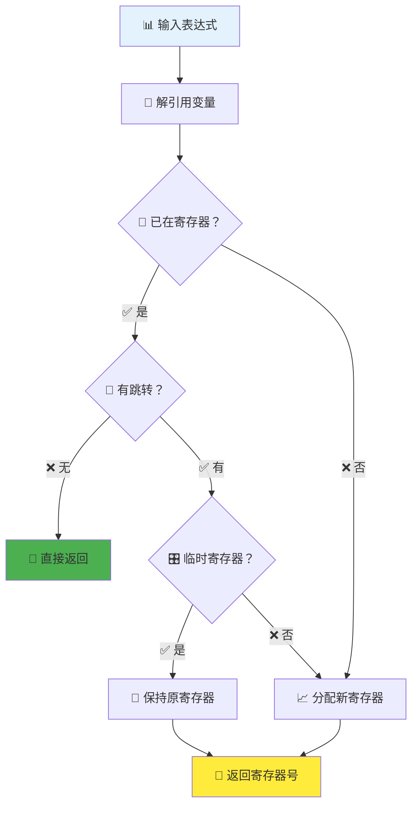

#### 🎯 luaK_exp2RK - 表达式转RK操作数

```c
int luaK_exp2RK (FuncState *fs, expdesc *e) {
  luaK_exp2val(fs, e);                       // 🔄 转换为值
  switch (e->k) {
    case VKNUM:                              // 🔢 数值常量
      e->u.s.info = luaK_numberK(fs, e->u.nval);
      e->k = VK;
      /* fall through */
    case VK:                                 // 📊 常量表项
      if (e->u.s.info <= MAXINDEXRK)        // 🔍 范围检查
        return RKASK(e->u.s.info);          // 🎯 返回常量形式
      else break;
    default: break;
  }
  /* 📍 不能作为常量，需要寄存器 */
  return luaK_exp2anyreg(fs, e);
}
```

**💡 RK选择策略**：
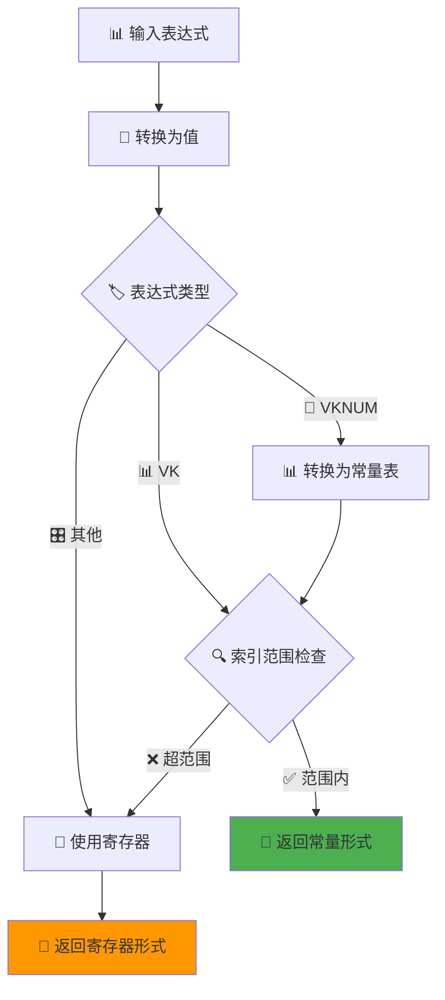

### 🔗 跳转处理函数

#### 🚀 luaK_jump - 生成跳转指令

```c
int luaK_jump (FuncState *fs) {
  int jpc = fs->jpc;                         // 💾 保存待处理跳转
  int j;
  fs->jpc = NO_JUMP;                         // 🔄 清空跳转链
  j = luaK_codeAsBx(fs, OP_JMP, 0, NO_JUMP); // 🎯 生成跳转指令
  luaK_concat(fs, &j, jpc);                  // 🔗 连接跳转链
  return j;                                  // 📍 返回跳转位置
}
```

#### 🔧 luaK_patchlist - 修补跳转列表

```c
void luaK_patchlist (FuncState *fs, int list, int target) {
  if (target == fs->pc)                      // 🎯 目标为当前位置
    luaK_patchtohere(fs, list);             // 📍 修补到此处
  else {
    lua_assert(target < fs->pc);             // 🔍 目标必须在前面
    patchlistaux(fs, list, target, NO_REG, target); // 🔧 修补到目标
  }
}
```

**🔗 跳转链管理**：
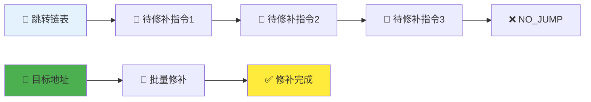

---

## 🎛️ 寄存器分配机制

### 🏗️ 寄存器管理架构

Lua虚拟机采用基于栈的寄存器分配机制，有效管理函数内的临时存储：

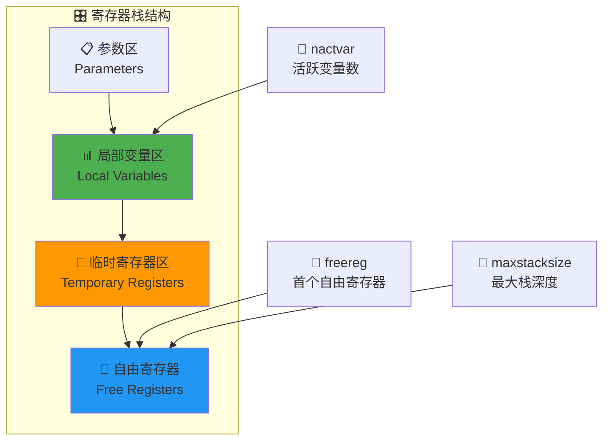

### 📊 核心管理函数

#### 🔍 luaK_checkstack - 栈空间检查

```c
void luaK_checkstack (FuncState *fs, int n) {
  int newstack = fs->freereg + n;            // 🧮 计算新栈大小
  if (newstack > fs->f->maxstacksize) {      // 📏 超出当前最大值？
    if (newstack >= MAXSTACK)                // ⚠️ 超出绝对限制？
      luaX_syntaxerror(fs->ls, "function or expression too complex");
    fs->f->maxstacksize = cast_byte(newstack); // 📈 更新最大栈大小
  }
}
```

**🚨 栈溢出检查流程**：
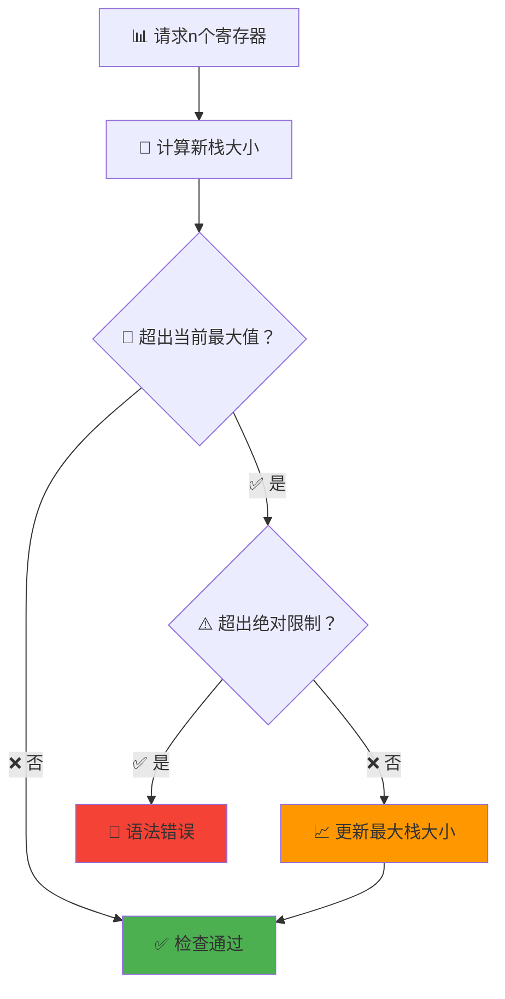

#### 📈 luaK_reserveregs - 预留寄存器

```c
void luaK_reserveregs (FuncState *fs, int n) {
  luaK_checkstack(fs, n);                    // 🔍 检查栈空间
  fs->freereg += n;                          // 📈 移动自由寄存器指针
}
```

#### 📉 freereg - 释放寄存器

```c
static void freereg (FuncState *fs, int reg) {
  if (!ISK(reg) && reg >= fs->nactvar) {    // 🔍 可释放的寄存器？
    fs->freereg--;                           // 📉 回退自由寄存器指针
    lua_assert(reg == fs->freereg);          // 🔍 必须是栈顶寄存器
  }
}
```

### 🎯 寄存器分配策略

#### 📊 分配决策树
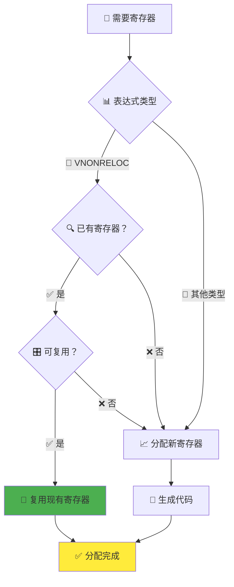

#### 🔄 释放策略
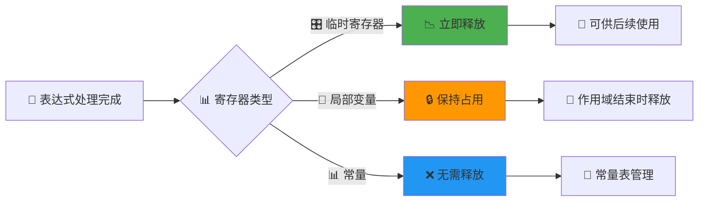

### 💡 优化技巧

#### ✅ 最佳实践
- **🚀 及时释放**: 表达式计算完成立即释放临时寄存器
- **🔄 复用优先**: 优先复用已有寄存器减少MOVE指令
- **📊 常量优化**: 小常量直接编码到指令中
- **🎛️ 栈深度控制**: 避免过深的表达式嵌套

#### ⚠️ 常见陷阱
- **💥 栈溢出**: 复杂表达式可能超出栈限制
- **🔄 寄存器泄漏**: 未正确释放临时寄存器
- **📍 越界访问**: 访问超出范围的寄存器

---

## 🚀 编译优化策略

### 💡 常量折叠优化

常量折叠是编译时优化的重要技术，能显著减少运行时计算开销：

```c
static int constfolding (OpCode op, expdesc *e1, expdesc *e2) {
  lua_Number v1, v2, r;
  if (!isnumeral(e1) || !isnumeral(e2)) return 0;  // 🔍 检查是否为数值
  v1 = e1->u.nval;
  v2 = e2->u.nval;
  switch (op) {
    case OP_ADD: r = luai_numadd(v1, v2); break;    // ➕ 加法
    case OP_SUB: r = luai_numsub(v1, v2); break;    // ➖ 减法  
    case OP_MUL: r = luai_nummul(v1, v2); break;    // ✖️ 乘法
    case OP_DIV:                                     // ➗ 除法
      if (v2 == 0) return 0;                        // ⚠️ 避免除零
      r = luai_numdiv(v1, v2); break;
    case OP_MOD: r = luai_nummod(v1, v2); break;    // 📐 取模
    case OP_POW: r = luai_numpow(v1, v2); break;    // ⬆️ 幂运算
    case OP_UNM: r = luai_numunm(v1); break;        // 🔄 取负
    case OP_LEN: return 0;                          // 📏 长度运算不折叠
    default: lua_assert(0); return 0;
  }
  if (luai_numisnan(r)) return 0;                   // 🚫 避免产生NaN
  e1->u.nval = r;                                   // 💾 存储结果
  return 1;                                         // ✅ 折叠成功
}
```

**🎯 折叠效果对比**：
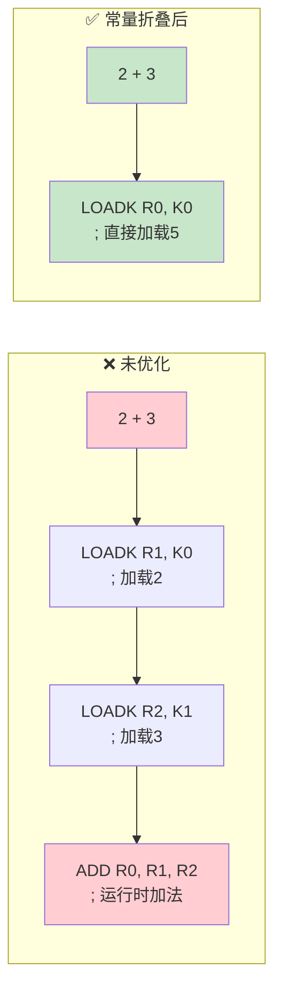

### 🔗 跳转优化技术

#### 📊 跳转链合并
```c
void luaK_concat (FuncState *fs, int *l1, int l2) {
  if (l2 == NO_JUMP) return;                        // 🔍 空链表直接返回
  else if (*l1 == NO_JUMP)                         // 🔄 第一个链表为空
    *l1 = l2;                                       // 📍 直接赋值
  else {
    int list = *l1;
    int next;
    while ((next = getjump(fs, list)) != NO_JUMP)   // 🔗 遍历到链表末尾
      list = next;
    fixjump(fs, list, l2);                          // 🔧 连接两个链表
  }
}
```

**🔗 跳转链示例**：
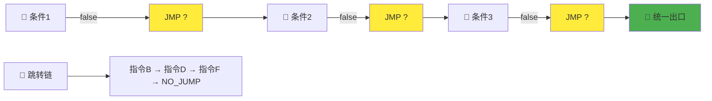

#### 🚀 条件跳转优化
```c
void luaK_goiffalse (FuncState *fs, expdesc *e) {
  int pc;  /* pc of last jump */
  luaK_dischargevars(fs, e);
  switch (e->k) {
    case VNIL: case VFALSE:                         // ❌ 总是false
      pc = NO_JUMP;  /* always false; do nothing */ break;
    case VTRUE:                                     // ✅ 总是true  
      pc = luaK_jump(fs);  /* always jump */        break;
    case VJMP:                                      // 🔄 已有跳转
      pc = e->u.s.info;                             break;
    default: {
      pc = jumponcond(fs, e, 1);                   // 🎯 生成条件跳转
      break;
    }
  }
  luaK_concat(fs, &e->f, pc);                      // 🔗 连接false链表
  luaK_patchtohere(fs, e->t);                      // 🔧 修补true链表
  e->t = NO_JUMP;
}
```

### 📊 指令合并优化

#### 🔄 LOADNIL指令合并
```c
void luaK_nil (FuncState *fs, int from, int n) {
  Instruction *previous;
  if (fs->pc > fs->lasttarget) {                   // 🔍 不是跳转目标？
    if (fs->pc == 0) return;                       // 🎯 函数开始已是nil
    if (GET_OPCODE(*(previous = &fs->f->code[fs->pc-1])) == OP_LOADNIL) {
      int pfrom = GETARG_A(*previous);              // 📊 前一条指令起始位置  
      int pto = GETARG_B(*previous);                // 📊 前一条指令结束位置
      if (pfrom <= from && from <= pto+1) {        // 🔗 可以合并？
        if (from+n-1 > pto)                        // 📈 扩展范围
          SETARG_B(*previous, from+n-1);
        return;                                     // ✅ 合并完成
      }
    }
  }
  luaK_codeABC(fs, OP_LOADNIL, from, from+n-1, 0); // 📝 生成新指令
}
```

**🔄 合并示例**：
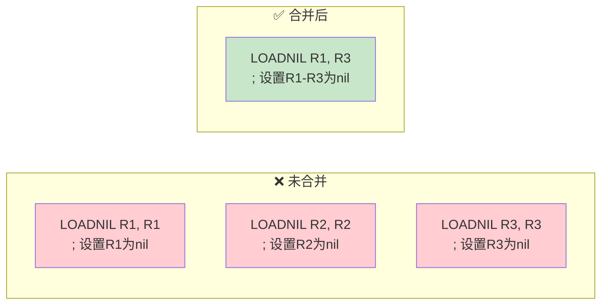

### 🎛️ RK操作数优化

RK编码允许操作数灵活选择寄存器或常量，减少指令数量：

```c
static void codearith (FuncState *fs, OpCode op, expdesc *e1, expdesc *e2) {
  if (constfolding(op, e1, e2))                    // 🔍 尝试常量折叠
    return;                                         // ✅ 折叠成功，无需生成指令
  else {
    int o1 = luaK_exp2RK(fs, e1);                  // 🎯 转换第一操作数
    int o2 = (op != OP_UNM && op != OP_LEN) ? 
             luaK_exp2RK(fs, e2) : 0;              // 🎯 转换第二操作数
    freeexp(fs, e2);                               // 📉 释放表达式2
    freeexp(fs, e1);                               // 📉 释放表达式1
    e1->u.s.info = luaK_codeABC(fs, op, 0, o1, o2); // 📝 生成算术指令
    e1->k = VRELOCABLE;                            // 🏷️ 标记为可重定位
  }
}
```

**🎯 RK优化效果**：
```mermaid
graph TB
    A[表达式: x + 5] --> B{🔍 操作数分析}
    B --> C[x在寄存器R1]
    B --> D[5是小常量]
    C --> E[o1 = R1<br/>寄存器形式]
    D --> F[o2 = K0|BITRK<br/>常量形式]  
    E --> G[ADD R0, R1, K0<br/>混合操作数指令]
    F --> G
    
    style G fill:#4caf50
    style E fill:#2196f3
    style F fill:#ff9800
```

## 🔄 字节码生成完整流程

### 🎯 表达式处理管线

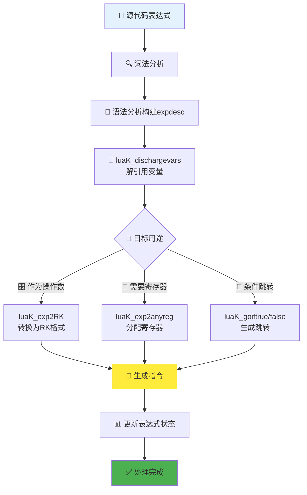

### 📊 语句处理流水线

```mermaid
graph LR
    subgraph "🎯 赋值语句: var = expr"
        A1[📊 处理右侧表达式] --> B1[🎯 luaK_exp2anyreg]
        B1 --> C1[📍 处理左侧变量] 
        C1 --> D1[📝 luaK_storevar]
        D1 --> E1[🎛️ 生成存储指令]
    end
    
    subgraph "🔄 控制流语句: if condition"  
        A2[🎯 处理条件表达式] --> B2[🔗 luaK_goiftrue/false]
        B2 --> C2[📝 生成条件跳转]
        C2 --> D2[🌳 处理分支代码]
        D2 --> E2[🔧 luaK_patchlist修补跳转]
    end
    
    style E1 fill:#4caf50
    style E2 fill:#4caf50
```

### 🔧 错误处理与边界检查

#### 🚨 栈溢出预防
```c
void luaK_checkstack (FuncState *fs, int n) {
  int newstack = fs->freereg + n;
  if (newstack > fs->f->maxstacksize) {
    if (newstack >= MAXSTACK)                       // ⚠️ 超出绝对限制
      luaX_syntaxerror(fs->ls, "function or expression too complex");
    fs->f->maxstacksize = cast_byte(newstack);      // 📈 更新栈大小
  }
}
```

#### 📏 跳转距离验证
```c
static void fixjump (FuncState *fs, int pc, int dest) {
  Instruction *jmp = &fs->f->code[pc];
  int offset = dest-(pc+1);                         // 🧮 计算跳转偏移
  lua_assert(dest != NO_JUMP);
  if (abs(offset) > MAXARG_sBx)                     // 🔍 检查跳转范围
    luaX_syntaxerror(fs->ls, "control structure too long");
  SETARG_sBx(*jmp, offset);                         // 📝 设置跳转偏移
}
```

#### 📊 常量表管理
```c
static int addk (FuncState *fs, TValue *k, TValue *v) {
  lua_State *L = fs->L;
  TValue *idx = luaH_set(L, fs->h, k);              // 🔍 查找/插入常量
  Proto *f = fs->f;
  int oldsize = f->sizek;
  if (ttisnumber(idx)) {                            // 📊 已存在的常量
    lua_assert(luaO_rawequalObj(&f->k[cast_int(nvalue(idx))], v));
    return cast_int(nvalue(idx));                   // 🎯 返回已有索引
  }
  else {  /* constant not found; create a new entry */
    setnvalue(idx, cast_num(fs->nk));              // 📝 设置新索引
    luaM_growvector(L, f->k, fs->nk, f->sizek, TValue,
                    MAXARG_Bx, "constant table overflow"); // 🔍 扩展检查
    while (oldsize < f->sizek) setnilvalue(&f->k[oldsize++]);
    setobj(L, &f->k[fs->nk], v);                   // 💾 存储常量值
    luaC_barrier(L, f, v);                         // 🛡️ GC屏障
    return fs->nk++;                               // 📈 返回新索引
  }
}
```

## 🎯 实战应用案例

### 📊 简单表达式生成

**源代码**: `local a = b + 1`

```mermaid
graph TB
    A[📄 local a = b + 1] --> B[🔍 解析右侧表达式 b + 1]
    B --> C[📊 b → expdesc VGLOBAL]
    C --> D[🔢 1 → expdesc VKNUM] 
    D --> E[🎯 luaK_exp2RK 处理操作数]
    E --> F[o1 = GETGLOBAL指令结果<br/>o2 = 常量1的RK编码]
    F --> G[📝 ADD R0, R1, K0]
    G --> H[📍 创建局部变量a绑定到R0]
    
    style A fill:#e3f2fd
    style G fill:#4caf50
    style H fill:#ffeb3b
```

### 🔄 条件语句生成

**源代码**: `if x > 0 then print("positive") end`

```mermaid
graph TB
    A[📄 if x > 0 then...] --> B[🎯 处理条件 x > 0]
    B --> C[📊 生成比较指令 LT K0, R0<br/>K0=0, R0=x]
    C --> D[🔗 luaK_goiffalse 生成跳转]
    D --> E[📝 JMP to end_if]
    E --> F[🌳 处理then分支]
    F --> G[📞 调用print函数]
    G --> H[🔧 修补跳转地址]
    H --> I[✅ if语句完成]
    
    style D fill:#ff9800
    style H fill:#4caf50
    style I fill:#ffeb3b
```

## 💡 性能优化指南

### 🚀 编码最佳实践

#### ✅ 推荐做法
- **🎯 使用局部变量**: 访问速度更快，寄存器直接寻址
- **📊 提取公共子表达式**: 避免重复计算
- **🔢 使用字面常量**: 编译器可进行常量折叠
- **🎛️ 控制表达式复杂度**: 避免过深嵌套

#### ❌ 避免的模式
- **🌐 频繁全局变量访问**: 需要额外的查表操作
- **📊 动态字符串拼接**: 产生大量临时对象
- **🔄 深度递归表达式**: 可能超出栈限制
- **💥 过大的常量表**: 影响加载性能

### 📈 性能测量工具

```lua
-- 📊 字节码查看工具
function dump_bytecode(func)
  local info = debug.getinfo(func, "f")
  -- 使用string.dump获取字节码
  local bytecode = string.dump(func)  
  return bytecode
end

-- 🔍 指令统计分析
function analyze_instructions(func)
  local instructions = {}
  -- 分析指令分布和复杂度
  return instructions
end
```

## 🎓 学习检验与进阶

### 📝 自我检测清单

- [ ] **🎯 理解expdesc结构**: 能识别不同表达式类型的区别
- [ ] **🔧 掌握指令格式**: 理解iABC、iABx、iAsBx三种编码方式  
- [ ] **⚙️ 熟悉核心函数**: 了解luaK_codeABC等关键函数的作用
- [ ] **🎛️ 理解寄存器管理**: 掌握分配、释放和复用策略
- [ ] **🚀 掌握优化技术**: 理解常量折叠、跳转合并等优化原理
- [ ] **🔧 能读懂生成的字节码**: 分析简单Lua代码的字节码输出

### 🚀 进阶学习建议

#### 📚 深入研究方向
1. **🔬 虚拟机执行**: 学习字节码如何在VM中执行
2. **🛠️ JIT编译**: 了解LuaJIT的即时编译技术  
3. **🎯 性能优化**: 研究高级编译器优化技术
4. **🔄 垃圾收集**: 理解GC与代码生成的交互

#### 🧪 实践项目建议
- **🔨 Mini编译器**: 实现简单表达式语言的字节码生成
- **📊 性能分析器**: 开发Lua代码的性能分析工具
- **🎛️ 调试器**: 构建字节码级别的调试工具
- **🚀 优化器**: 实现额外的编译时优化pass

---

## 📚 相关资源与参考

### 🔗 核心文档链接

#### 🏗️ Lua架构相关
- 📖 [Lua虚拟机架构详解](./wiki_vm.md) - VM整体设计和执行模型
- 🏃‍♂️ [字节码执行引擎](./wiki_execution.md) - 指令执行和调用栈管理
- 📊 [操作码完整参考](./wiki_opcodes.md) - 所有指令的详细说明

#### 🔍 编译前端
- 🎯 [词法分析器实现](./wiki_lexer.md) - Token识别和处理  
- 🌳 [语法分析器详解](./wiki_parser.md) - AST构建和语法制导翻译
- 🔧 [函数编译流程](./wiki_function.md) - 函数定义和闭包处理

#### 🎛️ 运行时系统  
- 🗂️ [表实现机制](./wiki_table.md) - Lua表的内部结构和算法
- 🧹 [垃圾收集器](./wiki_gc.md) - 内存管理和GC算法
- 📄 [字符串处理](./wiki_lib_string.md) - 字符串池和操作实现

### 📖 扩展阅读材料

#### 🎓 学术资源
- **《Compilers: Principles, Techniques, and Tools》** - 编译原理经典教材
- **《Engineering a Compiler》** - 现代编译技术详解
- **《The Implementation of Lua 5.0》** - Lua官方实现论文

#### 🌐 在线资源
- **[Lua官方网站](https://www.lua.org/)** - 最新文档和资源
- **[LuaJIT Wiki](http://wiki.luajit.org/)** - JIT编译技术资料  
- **[Lua Users Wiki](http://lua-users.org/wiki/)** - 社区知识库

### 🛠️ 开发工具推荐

#### 🔍 分析工具
- **LuaDec** - Lua字节码反编译器
- **luac -l** - 官方字节码查看工具
- **LuaProfiler** - 性能分析工具

#### 🧪 调试环境
- **VS Code + Lua插件** - 现代IDE支持
- **ZeroBrane Studio** - 专业Lua开发环境
- **Decoda** - 商业级Lua调试器

---

## 🎉 总结

### 🎯 核心要点回顾

通过本文档的学习，你应该已经掌握了Lua字节码生成机制的核心知识：

1. **📊 数据结构设计** - expdesc表达式描述器是整个系统的核心
2. **🔧 指令编码格式** - 32位紧凑编码最大化信息密度  
3. **⚙️ 代码生成函数** - 模块化的函数设计便于维护和扩展
4. **🎛️ 寄存器管理** - 基于栈的分配策略平衡性能和复杂度
5. **🚀 编译优化** - 多层次优化技术提升代码质量

### 💡 设计哲学

Lua字节码生成器体现了以下设计哲学：

- **🎯 简洁性**: 核心概念清晰，接口简单明了
- **🔧 模块化**: 职责分离，便于理解和维护  
- **⚡ 高效性**: 针对动态语言特点的专门优化
- **🛡️ 健壮性**: 全面的错误检查和边界处理

### 🚀 技术影响

这种设计对现代动态语言实现具有重要启发意义：

- **📊 紧凑的字节码格式** 成为许多VM的参考标准
- **🎛️ 基于寄存器的架构** 被多个现代虚拟机采用
- **🔄 增量编译策略** 平衡了编译速度和代码质量
- **💡 优化技术** 为JIT编译器发展奠定基础

Lua的字节码生成器虽然相对简单，但其设计精妙，为理解现代编译技术提供了极好的学习材料。掌握这些知识将为你深入研究编译器技术和虚拟机实现打下坚实基础。

---

*📝 文档版本: v1.0 | 最后更新: 2024 | 🎯 DeepWiki优化版本*
