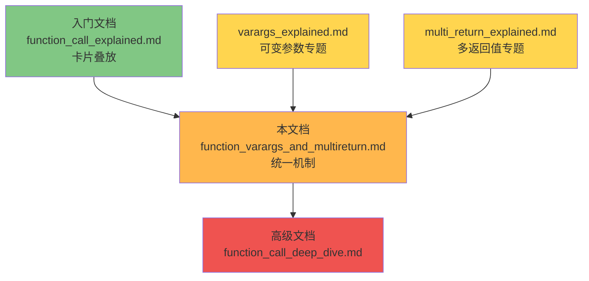
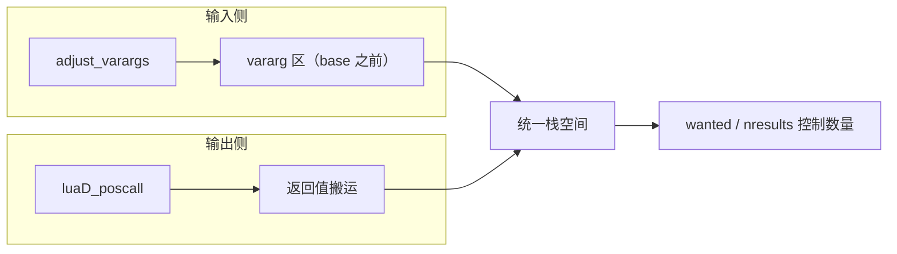
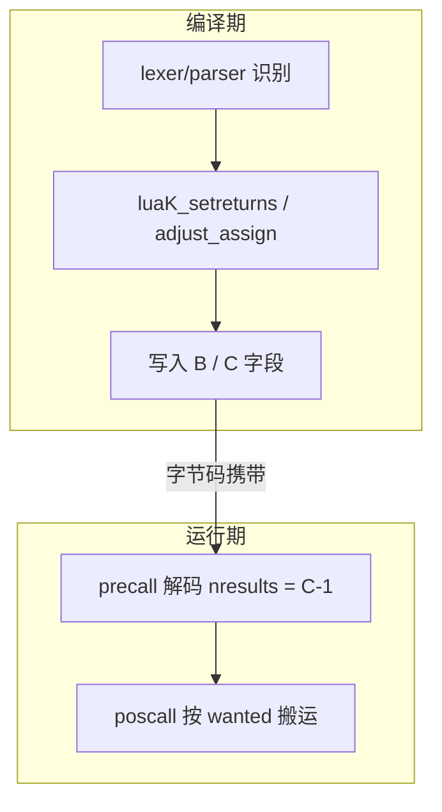
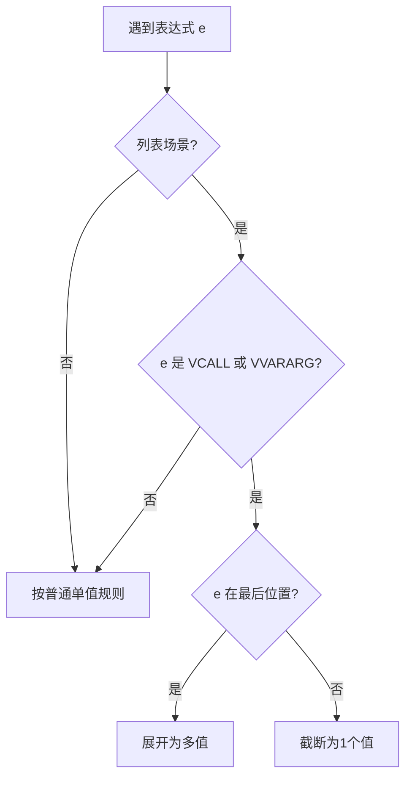
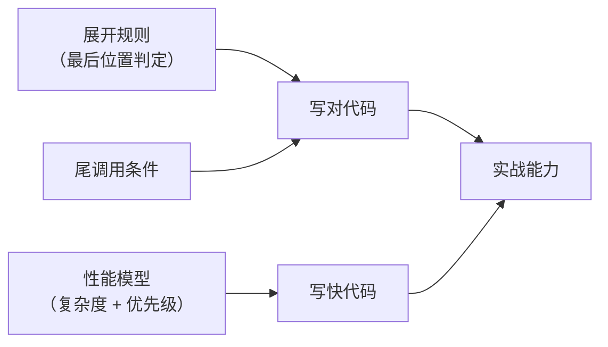
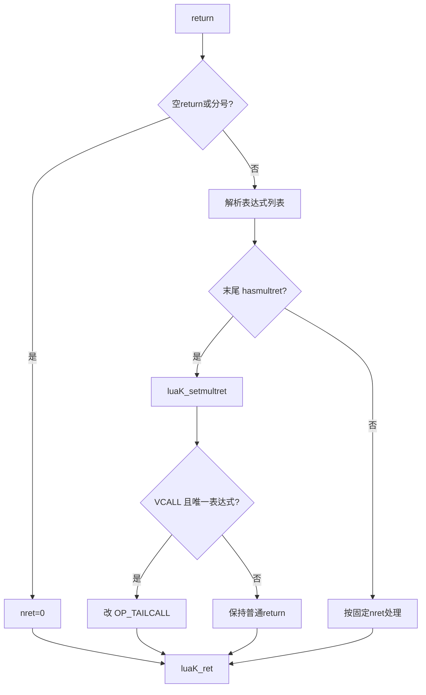

# 🎯 Lua 函数可变参数与多返回值统一机制详解

> **面向中级开发者**：把 `...` 与多返回值放进同一套栈模型，理解 Lua 5.1.5 调用链路的完整闭环
>
> **技术深度**：⭐⭐⭐ (介于初学者与高级开发者之间)
> **预计阅读时间**：45-60 分钟

<div align="center">

**栈空间重排 · 值搬运 · OP_VARARG / OP_CALL / OP_RETURN · adjust_varargs / luaD_poscall / hasmultret**

[📖 核心模型](#-一句话核心) · [🔧 机制细节](#-第二阶段统一编码与执行机制) · [⚡ 关键场景](#-第三阶段特殊场景性能与优化) · [🧠 源码附录](#附录-a-关键源码统一剖析)

</div>

---

## 📋 文档定位

### 目标读者

本文档专为以下开发者设计：

- ✅ 已理解 Lua 函数调用的基本栈帧概念（`func` / `base` / `top`）
- ✅ 希望把“可变参数”和“多返回值”串成一套统一心智模型
- ✅ 需要阅读 `lparser.c` / `lcode.c` / `lvm.c` / `ldo.c` 相关源码
- ✅ 关注性能、展开规则、尾调用与编译器回填机制

### 与其他文档的关系



### 学习目标

完成本文档后，你将能够：

1. **统一理解**：`...` 与多返回值都是“栈上连续值 + 上下文决定数量”
2. **掌握执行链路**：`adjust_varargs` → `OP_VARARG` → `OP_CALL`/`OP_RETURN` → `luaD_poscall`
3. **理解编译器策略**：`hasmultret`、`luaK_setreturns`、`adjust_assign`、`retstat`
4. **准确判断展开规则**：为什么“只在最后位置展开”
5. **优化代码**：减少不必要复制/打包，利用尾调用和 `LUA_MULTRET`

<details>
<summary>💡 设计备注：学习路径</summary>

先给出"你最终会掌握什么"，再进入正文，可降低读者的目标不确定性，减少阅读焦虑与外在认知负荷。
</details>

---

## 📚 目录

**第一阶段：统一空间模型（15 分钟）**
1. [一句话核心](#-一句话核心)
2. [统一视角：输入侧与输出侧](#-统一视角输入侧与输出侧)
3. [调用栈全景图](#-调用栈全景图)
4. [为什么要移动 base，为什么要搬运返回值](#-为什么要移动-base为什么要搬运返回值)
5. [完整演算：从 `sum(...)` 到 `local a,b = f()`](#-完整演算从-sum-到-local-ab--f)

**第二阶段：统一编码与执行机制**
6. [OP_VARARG：读取输入侧可变参数](#-op_vararg读取输入侧可变参数)
7. [OP_CALL：调用方声明“要几个返回值”](#-op_call调用方声明要几个返回值)
8. [OP_RETURN：被调方声明“返回哪些值”](#-op_return被调方声明返回哪些值)
9. [LUA_MULTRET 协议：`-1 ↔ 0` 的三层统一编码](#-lua_multret-协议-1--0-的三层统一编码)
10. [编译器桥梁：`hasmultret` / `luaK_setreturns` / `retstat` / `adjust_assign`](#-编译器桥梁-hasmultret--luak_setreturns--retstat--adjust_assign)

**第三阶段：特殊场景、性能与优化**
11. [最后位置展开规则（参数、赋值、return、表构造）](#-最后位置展开规则参数赋值return表构造)
12. [尾调用优化与完整传递](#-尾调用优化与完整传递)
13. [性能模型与优化建议](#-性能模型与优化建议)

**附录**
- [附录 A: 关键源码统一剖析](#附录-a-关键源码统一剖析)
- [附录 B: 常见误区（合并版）](#附录-b-常见误区合并版)
- [学习检查清单](#-学习检查清单)
- [自检题答案](#-自检题答案)

---

# 第一阶段：统一空间模型

> **目标**：建立一个可以同时解释 `...` 和多返回值的稳定心智模型

<details>
<summary>💡 设计备注：难度梯度</summary>

第一阶段只做"空间与角色定位"，暂不深入指令细节，避免一开始把语义层和编码层混在一起。
</details>

## 🎯 一句话核心

```
可变参数 = base 之前的连续输入区域
多返回值 = 从被调用者连续结果区搬运到调用者 func 位置
数量控制 = 调用方/上下文通过固定数量或 LUA_MULTRET 协议决定
```

## 🧭 术语预热卡（首次出现先直觉）

<details>
<summary>💡 设计备注：术语简化</summary>

先用"角色卡片"解释术语，再进入源码细节，减少首次术语冲击。
</details>

| 术语 | 直觉类比 | 一句话定义 |
|------|----------|-----------|
| `adjust_varargs` | 入场安检，把“固定座位”和“临时加座”分区 | 调整 `base`，让 vararg 落在 `base` 前 |
| `luaD_poscall` | 散场搬运工，把奖品送回主舞台 | 把返回值从 callee 搬到 caller 的 `func` 槽位 |
| `LUA_MULTRET` | “不限量套餐”标记 | 表示“不限定数量，实际多少收多少” |
| `hasmultret` | 编译器的“是否不定长”检测器 | 判断表达式是否可能产生不定长值（`VCALL`/`VVARARG`） |

## 🔁 先建立统一直觉：同一条流水线的两端


读这篇文档时，把 `...` 看作“输入侧不定长序列”，把多返回值看作“输出侧不定长序列”。
两者不是两套机制，而是**同一栈模型在不同方向上的投影**。

<details>
<summary>💡 设计备注：统一心智模型</summary>

显式强调"同一机制、不同方向"，避免读者把主题割裂成两章独立知识。
</details>

---

## 🔍 统一视角：输入侧与输出侧

### 输入侧（进入函数）

- 可变参数来自“调用时多传入的参数”
- `adjust_varargs` 通过移动 `base`，把 vararg 固定到 `base` 之前
- 函数体内部通过 `OP_VARARG` / `select` / `{...}` 访问

先记一个“方向感”：输入侧回答的问题是“**参数从哪里来，如何被函数体看到**”。

### 输出侧（离开函数）

- 返回值是被调用者栈上的连续值（从 `ra` 开始）
- `luaD_poscall` 把值搬运到调用者 `ci->func` 位置
- 调用者通过 `ci->nresults`（来自 `OP_CALL` 的 `C-1`）决定保留数量

先记一个“方向感”：输出侧回答的问题是“**结果要搬到哪里，保留多少个**”。

### 统一观察


---

## 📐 调用栈全景图

### 可变参数函数（输入端）

以 `printf(fmt, ...)` 调用 `printf("x=%d, y=%d", 10, 20)` 为例：

```
┌─────────────────────────────────────┐
│ [printf函数]                         │ ← func
├─────────────────────────────────────┤
│ [10]            vararg[1]            │ ← base-2
├─────────────────────────────────────┤
│ [20]            vararg[2]            │ ← base-1
├═════════════════════════════════════┤ ← base
│ ["x=%d, y=%d"]   R(0)=fmt            │
├─────────────────────────────────────┤
│ [nil]           R(1)=局部变量         │
├═════════════════════════════════════┤ ← top
```

### 多返回值（输出端）

以 `local a, b = f(1)` 且 `f` 返回 `10,20,30` 为例：

```
返回前（callee 栈帧末尾有返回值）
[caller ...][f][1][local...][10][20][30]
             ^ci->func         ^ra     ^top

luaD_poscall 后
[caller ...][10][20]
             ^res
```

### 一眼对比（输入/输出的镜像关系）

```
输入侧（vararg）:      base 前是“额外输入”
输出侧（multret）:     func 位置是“统一落点”

共同点：
1) 都是连续值序列
2) 都由上下文决定取多少个
3) 都通过栈指针边界来界定范围
```

<details>
<summary>💡 设计备注：减少脑补</summary>

增加"共同点清单"，把读者本应自行归纳的三点显式写出。
</details>

---

## 🤔 为什么要移动 base，为什么要搬运返回值

### 为什么移动 `base`

若不移动：vararg 会与寄存器区（`R(0), R(1)...`）混在一起，编译器生成的寄存器访问失效。

移动后：
- vararg 固定在 `base` 之前（负索引区域）
- 局部变量/固定参数在 `base` 之后（正索引区域）
- 编译器与 VM 都能稳定按寄存器模型工作

### 为什么搬运返回值

调用者视角中，被调用函数对象所在槽位（`ci->func`）是“结果落点”。

`luaD_poscall` 的本质：
- 从 `firstResult`（`ra`）开始复制
- 复制到 `res = ci->func`
- 多余的丢弃，不足补 `nil`，或在 `LUA_MULTRET` 时全部复制

把两件事并排记忆：

```
adjust_varargs 解决的是“进入函数后，输入怎么排布”
luaD_poscall    解决的是“离开函数时，输出怎么交接”
```

<details>
<summary>💡 设计备注：分块记忆</summary>

把两个核心函数放入"进入/离开"二元框架，降低工作记忆切换成本。
</details>

---

## 🎬 完整演算：从 `sum(...)` 到 `local a,b = f()`

### 演算 A：可变参数读取（`sum(...)`）

```lua
function sum(...)
    local total = 0
    for i = 1, select('#', ...) do
        total = total + select(i, ...)
    end
    return total
end

sum(10, 20, 30)
```

关键步骤：
1. `luaD_precall` 识别 vararg 函数，执行 `adjust_varargs`
2. `base` 下移，形成 `vararg区 + 寄存器区` 分离
3. `select` / `OP_VARARG` 从 `base` 之前读取参数
4. 计算完成后 `return total`

**逐步栈演化**（假设调用者 `base` 在地址 100）：

```
── Step 0：调用者压入函数和实参 ──────────────────────
地址:  100   101   102   103   104
内容: [sum] [10]  [20]  [30]  ← top
       ↑ func

── Step 1：luaD_precall → adjust_varargs ─────────────
numparams=0, actual=3
固定参数 0 个 → 直接把 3 个实参留作 vararg 区
新建哨兵函数对象，重设 base

地址:  100   101   102   103   104     105     106
内容: [sum] [10]  [20]  [30]  [sum']  [nil]   ← top
       旧func  ← vararg 区 →     ↑base  ↑R(0)=total

注意：sum' 是 adjust_varargs 内复制到新位置的函数闭包副本。

── Step 2：函数体执行 OP_VARARG（例如 select(1, ...)）──
OP_VARARG 发现 base(105) 之前有 3 个 vararg 值（101-103）
select(1, ...) 取 addr=101 → 值为 10

── Step 3：return total ──────────────────────────────
R(0) 保存了最终 total=60
RETURN 把 R(0) 写回调用者期望的位置
```

中间状态（补全易跳步环节）：

```
调用刚进入函数时：
[func][arg1][arg2][arg3]

adjust_varargs 后：
[func][vararg区...][base][R(0)局部区...]
```

<details>
<summary>💡 设计备注：补中间步骤</summary>

原链路默认读者能脑补"进入函数到重排完成"的过渡，这里显式补上。
</details>

### 演算 B：多返回值接收（`local a,b = f()`）

```lua
function f()
    return 10, 20, 30
end

local a, b = f()
```

关键步骤：
1. 编译器把调用点设为 `CALL ..., C=3`（要 2 个返回值）
2. `f` 返回时 `RETURN ..., B=4`（返回 3 个值）
3. `luaD_poscall` 按 `wanted=2` 只复制两个值
4. 结果 `a=10, b=20`，第三个返回值自然丢弃

**逐步栈演化**（假设 `local a, b = f()` 位于调用者寄存器 R(5)、R(6)）：

```
── Step 0：调用者压入函数对象 ─────────────────────────
调用者: ... [R(5)=?] [R(6)=?] [f] ← top
编译器生成: CALL R(5), B=1, C=3     -- 0 个参数, wanted=2

── Step 1：进入 f()，f 的栈帧 ────────────────────────
f 内部:  [f] [base→ R(0)] [R(1)] [R(2)]
执行: LOADK R(0), 10
      LOADK R(1), 20
      LOADK R(2), 30
      RETURN R(0), B=4            -- 返回 3 个值

── Step 2：luaD_poscall(wanted=2) ────────────────────
poscall 看到 wanted=2，actual=3
只复制 min(2,3)=2 个值到调用者目标位置

    f 栈帧:    [10] [20] [30]
                 ↓     ↓   ✗ 丢弃
    调用者:   [R(5)=10] [R(6)=20]

── Step 3：完成 ─────────────────────────────────────
a = R(5) = 10
b = R(6) = 20
第三个返回值 30 从未被复制，无额外开销
```
中间状态（补全“谁在决定数量”）：

```
CALL 的 C=3 先写入 ci->nresults=2
随后 poscall 读取 wanted=2 执行搬运
```

<details>
<summary>💡 设计备注：因果链显式化</summary>

强化"编译期编码 → 运行期读取"的前后因果，减少术语孤立记忆。
</details>

### ✅ 第一阶段自检

> 尝试不翻回正文，快速回答以下问题。答不出来的条目说明对应知识点还需复习。

<details>
<summary>Q1：<code>adjust_varargs</code> 完成后，<code>base</code> 指针的作用是什么？</summary>

`base` 将 **vararg 区**（base 之前）与 **寄存器区**（base 之后）分隔开来。
函数正常运行时只看到 base 之后的寄存器区，vararg 区需要通过 `OP_VARARG` / `select` 显式访问。
</details>

<details>
<summary>Q2：<code>luaD_poscall</code> 中的 <code>wanted</code> 从哪来？</summary>

来自调用指令 `OP_CALL` 的 `C` 字段：`wanted = C - 1`。
编译器在生成 CALL 指令时就把调用方需要的返回值数量写进了 `C`。
</details>

<details>
<summary>Q3：<code>function f() return 1,2,3 end; local a = f()</code> — <code>a</code> 等于多少？多余的返回值去哪了？</summary>

`a = 1`。编译器对 `local a = f()` 生成 `CALL ..., C=2`（wanted=1），
`poscall` 只复制 1 个值到目标寄存器，第 2、3 个返回值不会被复制，栈指针直接越过它们。
</details>

### 🗺️ 第一阶段知识图谱



> **记忆锚**：第一阶段 = "值在栈上**怎么摆**、**怎么搬**"。

---

# 第二阶段：统一编码与执行机制

> **阶段过渡说明**：第一阶段你已经知道“值在栈上怎么摆、怎么搬”；第二阶段只回答一个问题：
> **这些行为如何被字节码参数精确表达？**

<details>
<summary>💡 设计备注：转折桥</summary>

在阶段切换处补"旧知识→新问题"桥接句，防止读者感到话题突变。
</details>

## 🔧 OP_VARARG：读取输入侧可变参数

### 指令格式

```
OP_VARARG A B
A: 目标寄存器起始
B: 复制数量编码（B-1 个，B=0 表示全部）
```

记忆句：`VARARG` 做的是“把 base 前的连续值，复制到当前寄存器窗口”。

<details>
<summary>💡 设计备注：单句锚点</summary>

每节加"记忆句"作为认知锚，便于快速回忆。
</details>

### 典型示例

```lua
function f(...)
    local a, b, c = ...
end
```

- 编译为 `VARARG 0 4`，即复制 3 个值到 `R(0..2)`
- 若参数不足，后续槽位补 `nil`

### `{...}` 的本质序列

```lua
local args = {...}
```

对应字节码思想：

1. `NEWTABLE`
2. `VARARG`（把 vararg 复制到连续寄存器）
3. `SETLIST`（写入新表）

---

## 📞 OP_CALL：调用方声明“要几个返回值”

### 指令格式

```
OP_CALL A B C
B: 参数数量编码（B-1 个；B=0 表示参数到栈顶）
C: 期望返回值编码（C-1 个；C=0 表示 LUA_MULTRET）
```

直觉类比：`OP_CALL.C` 像“点餐数量”，调用方先声明“我准备接收几份结果”。

### C 参数解码

- `nresults = C - 1`
- `C=2` → 要 1 个返回值
- `C=3` → 要 2 个返回值
- `C=0` → `nresults=-1`（`LUA_MULTRET`）

最小因果链：

```
编译期写入 C  →  运行期 precall 解码 nresults  →  poscall 按 wanted 搬运
```

<details>
<summary>💡 设计备注：减少跳跃</summary>

原文给了定义但缺"从 C 到 wanted"的短链路，这里补齐中间桥。
</details>

### 场景示例

```lua
f()                    -- CALL ..., C=1（不需要返回值）
local x = f()          -- CALL ..., C=2（要1个）
local a,b = f()        -- CALL ..., C=3（要2个）
return f()             -- CALL ..., C=0（全要）
print(f())             -- 内层CALL通常 C=0（全展开）
```

---

## 📦 OP_RETURN：被调方声明“返回哪些值”

### 指令格式

```
OP_RETURN A B
A: 第一个返回值寄存器
B: 返回数量编码（B-1 个；B=0 表示到栈顶）
```

直觉类比：`OP_RETURN.B` 像“打包清单”，被调方声明这次要交付几份结果。

### B 参数规则

- `B=1`：无返回值（`return`）
- `B=2`：返回 1 个值（`return x`）
- `B=4`：返回 3 个值（`return x,y,z`）
- `B=0`：返回 `R(A)..top` 全部值（常见于 `return f()`）

### VM 关键路径

- `OP_RETURN` 先设置或保留 `L->top`
- 调用 `luaD_poscall` 搬运到调用者槽位
- 若是固定数量结果，后续可能恢复 `L->top = ci->top`
- 若是 `LUA_MULTRET`，保留精确的返回边界供后续使用

---

## 🔗 LUA_MULTRET 协议：`-1 ↔ 0` 的三层统一编码

```c
#define LUA_MULTRET (-1)
```

先用一句话抓本质：`LUA_MULTRET` 不是“很多个”，而是“**不预设上限**”。

### 三层映射

| 层面 | 存储值 | 语义 |
|------|--------|------|
| `OP_CALL.C` | `0` | 调用方接收全部返回值 |
| `OP_RETURN.B` | `0` | 被调方返回到栈顶全部值 |
| `ci->nresults` | `-1` | `luaD_poscall` 全量搬运 |

### 统一技巧

- 编码：`stored = real + 1`
- 解码：`real = stored - 1`
- 因而 `LUA_MULTRET(-1)` 自然编码为 `0`

再用一个直觉类比：

```
固定数量 = 点套餐（份数固定）
LUA_MULTRET = 自助餐（吃多少拿多少）
```

<details>
<summary>💡 设计备注：抽象降维</summary>

用生活类比解释 `-1/0` 编码意图，降低符号层抽象负担。
</details>

---

## 🧠 编译器桥梁：`hasmultret` / `luaK_setreturns` / `retstat` / `adjust_assign`

阅读顺序建议（防止细节堆叠）：

1. 先看 `hasmultret`（判定“是否不定长”）
2. 再看 `luaK_setreturns`（如何回填参数）
3. 再看 `retstat`（return 分支决策）
4. 最后看 `adjust_assign`（赋值场景修正）

<details>
<summary>💡 设计备注：认知分块</summary>

把四个函数按"判定→回填→决策→修正"排序，避免并列罗列造成信息拥堵。
</details>

### 1) `hasmultret`：连接 vararg 与多返回值的关键点

```c
#define hasmultret(k) ((k) == VCALL || (k) == VVARARG)
```

这正是两大主题的汇合处：
- `VCALL`：函数调用可能产生不定长返回值
- `VVARARG`：`...` 本身也是不定长值序列

一句话抓核心：`hasmultret` 在编译器里把“输入端不定长”和“输出端不定长”统一成同一种判定问题。

### 2) `luaK_setreturns`：回填 CALL/VARARG 指令参数

- 对 `VCALL`：改 `CALL.C = nresults + 1`
- 对 `VVARARG`：改 `VARARG.B = nresults + 1`

这让编译器可以“先生成默认值，再按上下文回填真实需求”。

### 3) `retstat`：`return` 语句编译决策

核心逻辑：
1. 空 `return` → `nret=0`
2. 有表达式列表 → 若末尾 `hasmultret` 成立则设为 `LUA_MULTRET`
3. 若是唯一 `VCALL` 返回表达式，可转 `OP_TAILCALL`
4. 最终 `luaK_ret(fs, first, nret)`

### 4) `adjust_assign`：赋值场景数量调节

典型例子：

```lua
local a,b,c = f()      -- extra=3，CALL.C=4，不足补nil
local a,b = f(), g()   -- f() 非末尾被截断，g() 按末尾规则处理
```

微型推导（补全常见跳步）：

```
local a,b,c = f()
nvars=3, nexps=1
extra = nvars - nexps + 1 = 3   （+1 来自 hasmultret 分支）
=> CALL.C = extra + 1 = 4
```

<details>
<summary>💡 设计备注：补推导</summary>

显式给出 `extra` 的数字推导，减少读者在公式处中断。
</details>

### ✅ 第二阶段自检

<details>
<summary>Q1：<code>OP_CALL A B C</code> 中，<code>C=0</code> 和 <code>C=3</code> 分别表示什么？</summary>

- `C=0` → `LUA_MULTRET`（-1），表示"我要全部返回值"，运行时由 `poscall` 根据实际返回量搬运。
- `C=3` → `wanted = C-1 = 2`，表示调用方刚好需要 **2 个**返回值。
</details>

<details>
<summary>Q2：<code>OP_RETURN A B</code> 中，<code>B=0</code> 的含义？它和 <code>C=0</code> 有什么对应关系？</summary>

- `B=0` 表示返回值数量在编译期未知（来自 `VCALL` / `VVARARG`），运行时用 `top - ra` 计算实际数量。
- 与 `C=0` 的呼应：**C=0 是调用方说"我全要"**，**B=0 是被调方说"我有多少给多少"**。两端都用 0 来表示"运行时再定"。
</details>

<details>
<summary>Q3：<code>local a,b,c = f()</code> 编译后，CALL 的 C 值是多少？写出推导。</summary>

```
nvars = 3, nexps = 1
f() 是 hasmultret → extra = nvars - nexps + 1 = 3
C = extra + 1 = 4   →   wanted = C - 1 = 3
```
含义：调用方需要 3 个返回值。
</details>

### 🗺️ 第二阶段知识图谱



> **记忆锚**：第二阶段 = "行为**怎么被字节码参数精确表达**"。

---

# 第三阶段：特殊场景、性能与优化

> **阶段过渡说明**：前两阶段解决“原理能否讲通”，第三阶段解决“写代码时怎么不踩坑、怎么更高效”。

<details>
<summary>💡 设计备注：学习迁移</summary>

强调从"理解机制"到"应用决策"的迁移目标，提升知识可用性。
</details>

## 📤 最后位置展开规则（参数、赋值、return、表构造）

**规则**：只有 `VCALL` 或 `VVARARG` 处在“列表最后位置”时才展开。

四步判定法（实战时可直接套用）：

1. 这是列表场景吗（参数/赋值/return/表构造）？
2. 目标表达式是 `VCALL` 或 `VVARARG` 吗？
3. 它在列表最后位置吗？
4. 若任一答案为否，则按“单值截断”处理。



<details>
<summary>💡 设计备注：决策外化</summary>

把隐式语法规则改成可执行判定流程，减少读者临场判断负担。
</details>

### 参数列表

```lua
print(f())           -- 展开：print(10,20,30)
print(f(), "hi")     -- 截断：f() 只取首值
print("hi", f())     -- 展开
```

### 赋值列表

```lua
local a,b = f(), 1      -- f() 非末尾，截断为1个
local a,b,c = 1, f()    -- f() 在末尾，可展开补齐
```

### return 列表

```lua
return f()              -- 全量转发
return 1, f()           -- f() 在末尾，可展开
return (f())            -- 括号会强制单值
```

### 表构造列表

```lua
local t1 = {f()}        -- f() 在末尾，可展开
local t2 = {f(), 1}     -- f() 非末尾，只取首值
```

---

## 🚀 尾调用优化与完整传递

```lua
function wrapper(...)
    return actual(...)
end
```

- 编译器在满足条件时将 `return <single VCALL>` 改成 `OP_TAILCALL`
- 尾调用始终按 `LUA_MULTRET` 路径传递
- 复用当前栈帧，避免额外一层调用开销
- 对多返回值是“零损耗转发”的最佳形态

### 尾调用生效条件（三条全部满足）

| # | 条件 | 不满足的典型情况 |
|---|------|-----------------|
| 1 | `return` 后恰好只有一个函数调用 | `return f(), g()` — 有两个表达式 |
| 2 | 调用不被括号包裹 | `return (f())` — 括号强制单值 |
| 3 | 外层函数没有待关闭的 upvalue | 带 `close` 语义的 upvalue 需要 `OP_CLOSE` |

### 经典陷阱：`return (f())` 不是尾调用

```lua
function a() return  f()  end   -- OP_TAILCALL，零开销转发
function b() return (f()) end   -- OP_CALL + OP_RETURN，多返回值被截断为1
```

原因：括号是一个“单值表达式”运算符。`(f())` 先求值为一个值，再 `return`。
编译器看到的已不再是 `return <VCALL>` 而是 `return <单值>`，无法判定为尾调用。

### 栈帧复用图示

```
普通调用：
[caller frame] → [wrapper frame] → [actual frame] → 返回逐层回收

尾调用：
[caller frame] → [wrapper frame 被 actual 原地覆盖] → 直接返回 caller
                  ↑ 无新增栈帧，递归深度不增长
```

把它与第一阶段模型对齐来记忆：

```
普通 return f()：可能经历“中间栈帧接力”
尾调用 return f()：直接把“输出端序列”交给上层调用者
```

<details>
<summary>💡 设计备注：模型回扣</summary>

再次回扣"同一序列传递"主线，强化跨章节一致性。
</details>

对比：

```lua
-- 优：尾调用
return actual_function()

-- 劣：先接收再返回（可能截断、重复搬运）
local a,b,c = actual_function()
return a,b,c
```

---

## 📊 性能模型与优化建议

### 核心操作复杂度

| 操作 | 时间复杂度 | 说明 |
|------|------------|------|
| `adjust_varargs` | `O(nfixargs)` | 仅移动固定参数，不复制 vararg |
| `OP_VARARG` | `O(k)` | 复制 `k` 个 vararg 到寄存器 |
| `{...}` | `O(n)` + 分配 | 创建表并复制，带 GC 压力 |
| `select('#', ...)` | `O(1)` | 仅取数量 |
| `select(i, ...)` | `O(1)` | 直接访问位置 |
| `luaD_poscall` | `O(min(wanted, actual))` | 返回值搬运 |

先给一条优先级原则（便于落地）：

```
先减少不必要的数据形态变化（打包/拆包），
再考虑减少复制次数，最后再看指令级微优化。
```

<details>
<summary>💡 设计备注：决策顺序</summary>

增加优化优先级，避免读者在细节优化上过早投入。
</details>

### 优化建议（合并版）

1. **只接收需要的返回值**：避免不必要搬运与 `nil` 补齐
2. **优先尾调用转发**：`return f(...)` 通常最优
3. **按场景选 vararg 访问方式**：
   - 只要数量/单次访问：`select`
   - 多次遍历/表操作：`{...}`
4. **避免中间位置多返回值**：中间位置会被截断，常带来隐性 bug
5. **避免重复打包拆包**：`{f(...)}` + `unpack` 往往比直接传递更慢

### 实战对比：常见写法的内部开销

```lua
-- 场景：将 f() 的全部返回值转发给 g()

-- 写法 A（最优）：尾调用直接转发
function forward_A(...)
    return g(...)               -- 1 次 OP_VARARG + OP_TAILCALL，零额外栈帧
end

-- 写法 B（次优）：非尾位置调用
function forward_B(...)
    return 1, g(...)            -- g() 在末位展开，但多一层栈帧
end

-- 写法 C（较差）：打包再拆包
function forward_C(...)
    local t = {...}             -- O(n) 复制 + 表分配 + GC 压力
    return unpack(t)            -- 再 O(n) 复制回栈
end

-- 写法 D（最差）：固定变量接收再返回
function forward_D(...)
    local a,b,c = ...           -- 硬编码数量，超过 3 个会丢失
    return a,b,c                -- 返回值数量固定
end
```

| 写法 | 栈操作次数 | GC 压力 | 值丢失风险 | 推荐度 |
|------|-----------|---------|-----------|--------|
| A | 最少 | 无 | 无 | ⭐⭐⭐ |
| B | 较少 | 无 | 无 | ⭐⭐ |
| C | 2×O(n) | 有 | 无 | ⭐ |
| D | 固定 | 无 | 有 | ❌ |

### ✅ 第三阶段自检

<details>
<summary>Q1：<code>print(f(), "hi")</code> 中，<code>f()</code> 返回 3 个值，<code>print</code> 实际收到几个参数？为什么？</summary>

**2 个**：`f()` 不在参数列表最后位置，被截断为首值。`print` 收到 `f()的首值, "hi"`。
规则：只有处于列表 **最后位置** 的 `VCALL` / `VVARARG` 才会展开。
</details>

<details>
<summary>Q2：尾调用需要满足什么条件？<code>return (f())</code> 算尾调用吗？</summary>

条件（全部满足）：
1. `return` 后只有一个函数调用表达式
2. 外层函数没有需要关闭的 upvalue（即没有待执行的 `close` 操作）
3. 表达式不被括号包裹

`return (f())` **不是**尾调用——括号把多返回值强制截断为单值，编译器会生成普通 `OP_CALL + OP_RETURN` 而非 `OP_TAILCALL`。
</details>

<details>
<summary>Q3：高频访问 <code>...</code> 的参数时，<code>select(i, ...)</code> 和 <code>{...}</code> 分别适用于什么场景？</summary>

| 场景 | 推荐方式 | 原因 |
|------|----------|------|
| 只需数量 | `select('#', ...)` | O(1)，无复制 |
| 访问单个位置 | `select(i, ...)` | O(1)，无表分配 |
| 需要多次遍历 / 作为表操作 | `local t = {...}` | 一次 O(n) 复制，后续访问 O(1)，无需反复 `OP_VARARG` |
</details>

### 🗺️ 第三阶段知识图谱



> **记忆锚**：第三阶段 = "**不踩坑** + **写得快**"。

---

# 附录

## 附录 A: 关键源码统一剖析

### A.1 `adjust_varargs`（输入布局重排）

```c
static StkId adjust_varargs(lua_State *L, Proto *p, int actual) {
    int i;
    int nfixargs = p->numparams;
    Table *htab = NULL;
    StkId base, fixed;

    if (p->is_vararg & VARARG_NEEDSARG) {
        int nvar = actual - nfixargs;
        luaC_checkGC(L);
        htab = luaH_new(L, nvar, 1);
        for (i = 0; i < nvar; i++) {
            setobj2n(L, luaH_setnum(L, htab, i + 1), L->top - nvar + i);
        }
        setnvalue(luaH_setstr(L, htab, luaS_newliteral(L, "n")), cast_num(nvar));
    }

    base = L->top + 1;
    fixed = L->base;
    for (i = 0; i < nfixargs; i++) {
        setobjs2s(L, L->top++, fixed + i);
        setnilvalue(fixed + i);
    }

    if (htab) sethvalue(L, L->top++, htab);
    return base;
}
```

要点：
- vararg 本身不被整体搬走
- 核心是固定参数移动 + 新 `base` 计算

### A.2 `luaD_poscall`（输出值搬运）

```c
int luaD_poscall(lua_State *L, StkId firstResult) {
    StkId res;
    int wanted, i;
    CallInfo *ci;

    if (L->hookmask & LUA_MASKRET) {
        firstResult = callrethooks(L, firstResult);
    }

    ci = L->ci--;
    res = ci->func;
    wanted = ci->nresults;

    L->base = (ci - 1)->base;
    L->savedpc = (ci - 1)->savedpc;

    for (i = wanted; i != 0 && firstResult < L->top; i--) {
        setobjs2s(L, res++, firstResult++);
    }
    while (i-- > 0) {
        setnilvalue(res++);
    }
    L->top = res;

    return (wanted - LUA_MULTRET);
}
```

要点：
- `wanted>0`：固定数量
- `wanted=-1`：全量复制
- 多余值通过“不复制”自然丢弃

### A.3 `retstat` 与 `hasmultret`（编译入口）

```c
#define hasmultret(k)  ((k) == VCALL || (k) == VVARARG)
```

`retstat` 决策树（简化）：



---

## 附录 B: 常见误区（合并版）

1. ❌ `...` 是 table  
   ✅ `...` 是栈上连续值序列，`{...}` 才创建 table

2. ❌ `adjust_varargs` 会复制所有参数  
   ✅ 它主要移动固定参数并重设 `base`

3. ❌ 多返回值在任何位置都展开  
   ✅ 只在列表最后位置展开

4. ❌ 返回值有独立“特殊存储区”  
   ✅ 都在普通栈上，`luaD_poscall` 只是位置搬运

5. ❌ `LUA_MULTRET` 表示“无限个”  
   ✅ 表示“不限，实际多少收多少”，仍受栈空间限制

6. ❌ `return f()` 总是尾调用  
   ✅ 仅在满足编译器尾调用条件时成立（如唯一返回表达式）

---

## 📋 学习检查清单

### 第一阶段：模型

- [ ] 能画出 vararg 区（`base` 前）与寄存器区（`base` 后）
- [ ] 能解释返回值为什么落在 `ci->func`
- [ ] 能用统一视角描述“输入重排 + 输出搬运”

### 第二阶段：编码

- [ ] 掌握 `CALL.C = nresults + 1`
- [ ] 掌握 `RETURN.B = nret + 1`
- [ ] 理解 `LUA_MULTRET(-1)` 与字节码 `0` 的映射
- [ ] 理解 `hasmultret` 同时覆盖 `VCALL` 与 `VVARARG`

### 第三阶段：场景与优化

- [ ] 能判断最后位置展开规则
- [ ] 能解释 `adjust_assign` 的 `extra` 逻辑
- [ ] 能说明尾调用为何天然适合多返回值转发
- [ ] 能给出针对 `{...}`/`select`/`return f(...)` 的性能建议

---

## 📝 自检题答案

1. **谁决定最终保留几个返回值？**  
   调用者，通过 `OP_CALL.C` 解码得到的 `ci->nresults`。

2. **`{...}` 与 `select` 的本质差异？**  
   前者创建表并复制，后者直接访问 vararg 序列（通常 O(1) 访问/计数）。

3. **为什么 `C=0` / `B=0` 很关键？**  
   它们是 `LUA_MULTRET` 的统一编码，允许“到栈顶”的不定长传递。

4. **`hasmultret` 为什么是统一机制的核心？**  
   它把 `VCALL`（多返回值来源）和 `VVARARG`（不定长输入来源）放进同一套编译器决策。

---

## 🎓 进阶阅读

### 相关文档

- [function_call_explained.md](function_call_explained.md) - 函数调用基础
- [varargs_explained.md](varargs_explained.md) - 可变参数专题
- [multi_return_explained.md](multi_return_explained.md) - 多返回值专题
- [function_call_deep_dive.md](function_call_deep_dive.md) - 高级调用链路

### 核心源码文件

| 文件 | 关键符号 | 作用 |
|------|---------|------|
| `ldo.c` | `adjust_varargs` / `luaD_poscall` | 输入重排与输出搬运 |
| `lvm.c` | `OP_VARARG` / `OP_CALL` / `OP_RETURN` / `OP_TAILCALL` | VM 执行路径 |
| `lparser.c` | `hasmultret` / `retstat` / `funcargs` / `adjust_assign` | 编译决策与回填上下文 |
| `lcode.c` | `luaK_setreturns` / `luaK_ret` | 指令参数编码 |
| `lua.h` | `LUA_MULTRET` | 协议常量定义 |

---

<div align="center">

**🎉 恭喜！你已把 Lua 5.1.5 的 varargs 与 multi-return 融合为同一张机制地图。**

当你能把 `hasmultret`、`LUA_MULTRET`、`base` 重排和 `poscall` 搬运串成一条线时，
你对 Lua 调用系统已经达到“可读源码、可做优化、可定位 bug”的中级能力。

</div>

---

## 📄 文档元信息

- **创建日期**：2026-02-20
- **适用 Lua 版本**：5.1.5
- **文档版本**：v2.0（认知优化版）
- **维护状态**：活跃
- **技术深度**：⭐⭐⭐（中级）
- **v2.0 变更摘要**：
  - 全部改进注释折叠为 `<details>` 设计备注
  - 每阶段末尾新增自检题（共 9 题）与知识图谱
  - 演算 A/B 补充逐步栈地址演化图
  - 尾调用：补充生效条件表、`return (f())` 陷阱、栈帧复用图示
  - 性能：补充实战对比（四种转发写法开销表）
  - 三阶段各增记忆锚句与 Mermaid 回顾图
