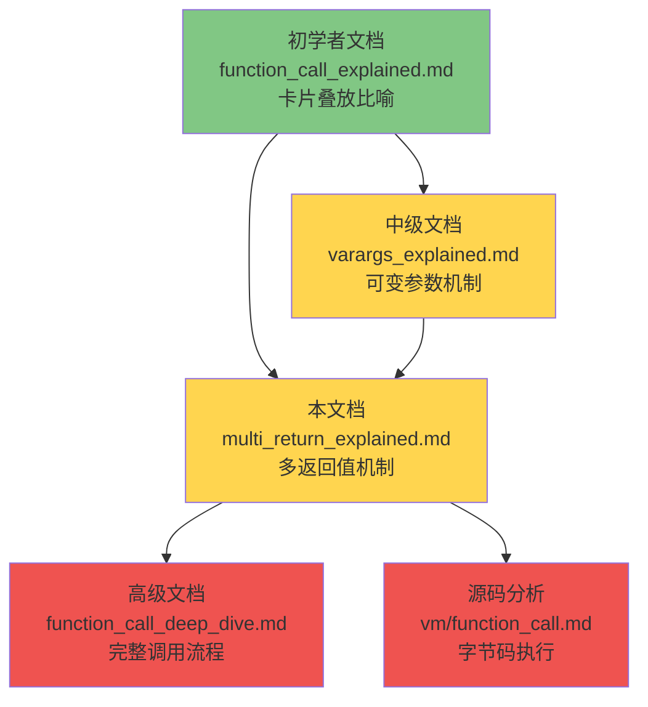

# 🎯 Lua 函数多返回值实现机制详解

> **面向中级开发者**：从"卡片叠放"到栈值搬运，深入理解 Lua 多返回值的内部实现
>
> **技术深度**：⭐⭐⭐ (介于初学者与高级开发者之间)  
> **预计阅读时间**：30-40 分钟

<div align="center">

**栈值搬运 · OP_CALL / OP_RETURN · luaD_poscall · LUA_MULTRET**

[📖 核心概念](#-一句话核心) · [🔧 实现机制](#-op_return-指令如何编码返回值) · [⚡ 编译器处理](#-编译器如何处理-return-语句) · [🛠️ 特殊场景](#-多返回值作为最后一个函数参数)

</div>

---

## 📋 文档定位

### 目标读者

本文档专为以下开发者设计：

- ✅ 已理解 Lua 函数调用的"卡片叠放"比喻
- ✅ 熟悉基本的栈帧概念（func、base、top）
- ✅ 希望深入理解多返回值的实现原理
- ✅ 需要理解 `OP_CALL` / `OP_RETURN` 指令的协作方式
- ✅ 对 `LUA_MULTRET` 的含义和使用场景感兴趣

### 与其他文档的关系



### 前置知识

建议先阅读：
- 📖 [function_call_explained.md](function_call_explained.md) - 理解"卡片叠放"比喻
- 📖 [varargs_explained.md](varargs_explained.md) - 理解可变参数的栈布局

### 学习目标

完成本文档后，你将能够：

1. **理解**多返回值在栈上的存储方式
2. **掌握** `OP_RETURN` 和 `OP_CALL` 指令的返回值编码规则
3. **分析** `luaD_poscall` 如何搬运返回值到调用者栈帧
4. **理解** `LUA_MULTRET` 的协议含义
5. **对比**固定数量接收 vs 可变数量接收的差异
6. **分析**多返回值传递给其他函数（如 `print(f())`）的展开行为
7. **理解**尾调用优化如何影响多返回值

---

## 📚 目录

**第一阶段：建立空间模型**（15 分钟核心理解）
1. [一句话核心](#-一句话核心)
2. [多返回值是什么](#-多返回值是什么)
3. [返回值的栈布局](#-返回值的栈布局)
4. [值搬运：luaD_poscall 的核心操作](#-值搬运luad_poscall-的核心操作)
5. [完整调用演算](#-完整调用演算)

**第二阶段：理解编码机制**
6. [OP_RETURN 指令详解](#-op_return-指令如何编码返回值)
7. [OP_CALL 指令详解](#-op_call-指令如何指定期望数量)
8. [LUA_MULTRET 协议](#-lua_multret-协议)
9. [编译器处理](#-编译器如何处理-return-语句)

**第三阶段：特殊场景与优化**
10. [多返回值作为函数参数](#-多返回值作为最后一个函数参数)
11. [多返回值在赋值中的调整](#-多返回值在赋值中的调整)
12. [尾调用优化](#-尾调用优化对多返回值的影响)
13. [性能分析与优化建议](#-性能分析与优化建议)

**附录**
- [luaD_poscall 源码剖析](#附录-a-luad_poscall-源码剖析)
- [retstat 编译器源码剖析](#附录-b-retstat-编译器源码剖析)
- [常见误区](#附录-c-常见误区)
- [学习检查清单](#-学习检查清单)

---

# 第一阶段：建立空间模型

> **目标**：15 分钟内建立稳定的心智模型
> **核心**：理解"返回值 = 从被调用者栈帧搬运到调用者栈帧的连续值"

---

## 🎯 一句话核心

```
多返回值 = 被调用函数栈上的连续值
luaD_poscall 负责搬运到调用者的 func 位置
调用者决定保留多少个
```

**这是整篇文档的认知压缩器，请牢记这三句话。**

---

## 🔍 多返回值是什么

### 语法

#### 1.1 函数可以返回多个值

**基本语法**：

```lua
function multi()
    return 10, 20, 30    -- 返回三个值
end
```

**接收多个返回值**：

```lua
local a, b, c = multi()   -- a=10, b=20, c=30
```

#### 1.2 多返回值的基本规则

```lua
-- 规则 1：变量少于返回值 → 多余的被丢弃
local x = multi()              -- x=10（20, 30 被丢弃）

-- 规则 2：变量多于返回值 → 缺少的填 nil
local a, b, c, d = multi()    -- a=10, b=20, c=30, d=nil

-- 规则 3：多返回值在列表末尾才展开
local p, q = multi(), "hi"    -- p=10, q="hi"（multi() 只取第一个值）

-- 规则 4：多返回值可以传递给其他函数
print(multi())                 -- 输出：10  20  30
```

#### 1.3 为什么需要多返回值？

```lua
-- 典型应用：返回多个相关结果
function divide(a, b)
    return math.floor(a/b), a % b   -- 同时返回商和余数
end

local quotient, remainder = divide(17, 5)
-- quotient=3, remainder=2

-- 典型应用：错误处理模式
function read_file(path)
    local f = io.open(path)
    if not f then
        return nil, "file not found"   -- 返回 nil + 错误信息
    end
    return f:read("*a"), nil           -- 返回内容 + 无错误
end
```

---

## 📐 返回值的栈布局

> **这是整篇文档最重要的一张图，请务必理解透彻**

### 核心概念：函数返回就是"值搬运"

回忆"卡片叠放"比喻：每次函数调用就是在桌上叠一张卡片。函数返回则是**拿走卡片**，但要把卡片上的返回值**留在桌上**给调用者。

```
返回前：两张卡片叠在一起

┌─────────────────────────────────────┐
│  卡片 2（被调用者 callee）           │
│  [callee] [局部变量...] [ret1][ret2] │ ← 返回值在卡片末端
├═════════════════════════════════════┤ ← callee 的 base
│  卡片 1（调用者 caller）             │
│  [caller] [局部变量...] [callee]     │ ← callee 的 func 位置
│  ↑ 返回值要搬到这里                  │
└─────────────────────────────────────┘

返回后：拿走卡片 2，返回值写入调用者区域

┌─────────────────────────────────────┐
│  卡片 1（调用者 caller）             │
│  [caller] [局部变量...] [ret1][ret2] │ ← 覆盖了 [callee] 位置
└─────────────────────────────────────┘
```

### 精确的栈地址图

以 `local a, b = f(1)` 为例：

```
═══ 调用 f(1) 后，f 执行 return 10, 20 前 ═══

地址:  0x100   0x108   0x110   0x118   0x120   0x128   0x130
       ┌───────┬───────┬───────┬───────┬───────┬───────┬───────┐
       │caller │ ...   │  f    │  1    │local..│  10   │  20   │
       │ 栈帧  │       │       │       │       │       │       │
       └───────┴───────┴───────┴───────┴───────┴───────┴───────┘
                        ↑func   ↑base                   ↑top
                        │                       ↑ra (第一个返回值)
                        │
                        └─ 返回值最终要搬到这里（res = ci->func）

═══ luaD_poscall 搬运后 ═══

地址:  0x100   0x108   0x110   0x118
       ┌───────┬───────┬───────┬───────┐
       │caller │ ...   │  10   │  20   │
       │ 栈帧  │       │       │       │
       └───────┴───────┴───────┴───────┘
                        ↑res    ↑L->top
                        (原 func 位置)
```

### 核心结论（强锚点）

```
1. 返回值的目标位置 = ci->func（被调用函数对象所在的栈槽）
2. luaD_poscall 将返回值从 ra 位置复制到 func 位置
3. 复制完成后 L->top 指向最后一个返回值之后
4. 调用者用 ci->nresults 决定保留几个返回值
```

**请在脑中形成这个"搬运"画面，后续所有内容都基于此模型。**

---

## 🔄 值搬运：luaD_poscall 的核心操作

### 三种搬运策略

`luaD_poscall` 根据调用者**期望的返回值数量**（`ci->nresults`），采用不同策略：

#### 策略 1：固定数量（wanted > 0）

```lua
local a, b = f()   -- 调用者想要 2 个返回值
```

```
wanted = 2, 实际返回 3 个值 (10, 20, 30)

搬运过程：
  firstResult: [10] [20] [30]     ← 只搬运 wanted 个
                 ↓    ↓
  res 位置:    [10] [20]          ← 30 被丢弃
               ↑res       ↑top
```

#### 策略 2：固定数量但不够（wanted > 实际数量）

```lua
local a, b, c, d = f()   -- 调用者想要 4 个，f 只返回 2 个
```

```
wanted = 4, 实际返回 2 个值 (10, 20)

搬运过程：
  firstResult: [10] [20]          ← 先搬运有的 2 个
                 ↓    ↓
  res 位置:    [10] [20] [nil] [nil]  ← 不足的补 nil
               ↑res                ↑top
```

#### 策略 3：全部接收（wanted == LUA_MULTRET）

```lua
return f()   -- 调用者要接收 f 的所有返回值
```

```
wanted = LUA_MULTRET (-1), 实际返回 3 个值 (10, 20, 30)

搬运过程：
  firstResult: [10] [20] [30]    ← 全部搬运
                 ↓    ↓    ↓
  res 位置:    [10] [20] [30]    ← 保留所有值
               ↑res            ↑top
```

### 搬运策略汇总表

| 场景 | wanted 值 | 实际返回 | 结果 | 处理方式 |
|------|----------|---------|------|---------|
| 精确匹配 | 2 | 2 | [10][20] | 直接复制 |
| 返回过多 | 2 | 3 | [10][20] | 丢弃多余 |
| 返回过少 | 4 | 2 | [10][20][nil][nil] | nil 补齐 |
| 全部接收 | -1 | 3 | [10][20][30] | 复制所有 |
| 不需要返回值 | 0 | 3 | (空) | 全部丢弃 |

---

## 🎬 完整调用演算

> **目标**：通过一个完整示例，演示从编译到执行的全过程

### 示例代码

```lua
function f()
    return 10, 20, 30
end

local a, b = f()    -- a=10, b=20, 30被丢弃
```

### 演算步骤

#### 步骤 1：编译阶段

```
编译器分析 local a, b = f()：
- 左侧变量数 nvars = 2
- 右侧表达式数 nexps = 1
- 最后一个表达式是 VCALL（函数调用，多返回值）

调用 adjust_assign(ls, 2, 1, &e)：
  extra = nvars - nexps + 1 = 2    (hasmultret 分支, +1)
  luaK_setreturns(fs, e, 2)        → CALL 指令的 C = 2+1 = 3

生成字节码：
  GETGLOBAL  R(0), "f"        ; 获取函数 f
  CALL       R(0), 1, 3       ; B=1(0个参数), C=3(要2个返回值)
  ; R(0) 和 R(1) 现在存储返回值
```

#### 步骤 2：VM 执行 OP_CALL

```c
// lvm.c: OP_CALL 处理
case OP_CALL: {
    int b = GETARG_B(i);              // b = 1
    int nresults = GETARG_C(i) - 1;   // nresults = 3-1 = 2

    if (b != 0) L->top = ra + b;      // L->top = ra + 1（0个参数）

    luaD_precall(L, ra, nresults);     // 设置 ci->nresults = 2
}
```

```
执行 precall 后的栈状态：

调用者栈帧：
  [caller局部变量...] [f函数]
                       ↑ ci->func

被调用者栈帧（f 的执行环境）：
  [f函数] → [base 开始] [局部变量...]
             ↑ ci->base
```

#### 步骤 3：f() 执行 return 10, 20, 30

```
编译器为 return 10, 20, 30 生成：
  LOADK   R(0), 10
  LOADK   R(1), 20
  LOADK   R(2), 30
  RETURN  R(0), 4          ; A=0, B=4 (返回 4-1=3 个值)
```

```c
// lvm.c: OP_RETURN 处理
case OP_RETURN: {
    int b = GETARG_B(i);           // b = 4
    if (b != 0) L->top = ra + b - 1;  // L->top = ra + 3（精确设置栈顶）

    luaD_poscall(L, ra);           // ra 指向第一个返回值
}
```

```
OP_RETURN 执行时的栈状态：

  [f函数] [10] [20] [30]
  ↑func   ↑ra           ↑L->top
  ↑res（返回值要搬到这里）
```

#### 步骤 4：luaD_poscall 搬运返回值

```c
int luaD_poscall(lua_State *L, StkId firstResult) {
    ci = L->ci--;
    res = ci->func;             // res = f函数的位置
    wanted = ci->nresults;      // wanted = 2

    // 循环搬运：wanted=2, 搬运 min(2, 3) = 2 个
    // 第 1 轮：res[0] = firstResult[0] → 10
    // 第 2 轮：res[1] = firstResult[1] → 20
    // i 变为 0，退出循环 → 30 被丢弃

    L->top = res;               // top 指向最后搬运位置之后
}
```

```
搬运后的栈状态：

  [...调用者局部变量...] [10] [20]
                          ↑res     ↑L->top
                          ↑a=10  ↑b=20-
```

#### 步骤 5：回到 OP_CALL，恢复栈顶

```c
// 回到 OP_CALL 的后续处理
case PCRC: {
    if (nresults >= 0)           // nresults=2 >= 0
        L->top = L->ci->top;    // 恢复调用者的栈顶上限
    base = L->base;
    continue;                    // 执行下一条指令
}
```

**最终结果**：`a = 10, b = 20` ✅

---

### 自检题（验证理解）

请回答以下问题（答案在文末）：

1. **返回值搬运到哪个位置？**
2. **谁决定保留多少个返回值？**
3. **多余的返回值去哪了？**
4. **不足的返回值如何处理？**

---

## 🎯 第一阶段总结

**核心心智模型**：

```
多返回值的生命周期 = 三步走

① [被调用者] 把返回值放在寄存器中（从 ra 开始）
② [OP_RETURN] 设置 L->top 标记返回值范围
③ [luaD_poscall] 从 ra 搬运到 ci->func 位置
    → 多了丢弃，少了补 nil
```

**关键要点**：

1. ✅ 返回值目标位置 = `ci->func`（覆盖函数对象本身）
2. ✅ `ci->nresults` 记录调用者期望的数量
3. ✅ `luaD_poscall` 是"搬运工"，负责复制和调整
4. ✅ `LUA_MULTRET` 表示"全部搬运，不设上限"

**如果你理解了以上内容，恭喜你已经掌握了多返回值的核心机制！**

接下来进入第二阶段：理解编码机制。

---

# 第二阶段：理解编码机制

> **前提**：已建立稳定的空间模型（值搬运）
> **目标**：理解字节码如何编码返回值数量，编译器如何生成这些指令

---

## 📦 OP_RETURN 指令如何编码返回值

### 指令格式

```
OP_RETURN  A  B
           │  │
           │  └─ 返回值数量编码（关键参数）
           └──── 第一个返回值的寄存器位置
```

### B 参数的编码规则

B 存储的是 `nret + 1`（**返回值数量加 1**）：

| B 值 | 含义 | 返回值范围 | 对应 Lua 代码 |
|------|------|-----------|-------------- |
| `0`  | 返回从 R(A) 到**栈顶**的所有值 | `R(A) ... L->top-1` | `return f()` |
| `1`  | 无返回值 | 空 | `return` |
| `2`  | 返回 1 个值 | `R(A)` | `return x` |
| `3`  | 返回 2 个值 | `R(A), R(A+1)` | `return x, y` |
| `4`  | 返回 3 个值 | `R(A) ... R(A+2)` | `return x, y, z` |

> **为什么 +1？** 因为 `LUA_MULTRET` 的值是 `-1`，加 1 后变为 `0`，正好用 0 这个特殊值表示"返回所有值"。这是一个巧妙的编码技巧。

### 编译器生成 OP_RETURN 的代码

```c
// lcode.c: luaK_ret()
void luaK_ret (FuncState *fs, int first, int nret) {
    luaK_codeABC(fs, OP_RETURN, first, nret+1, 0);
    //                          ↑A     ↑B=nret+1
}
```

### VM 执行 OP_RETURN 的逻辑

```c
// lvm.c: OP_RETURN 处理
case OP_RETURN: {
    int b = GETARG_B(i);

    if (b != 0)
        L->top = ra + b - 1;    // 固定数量：精确计算栈顶
    // b == 0 时：栈顶保持不变（由之前的 CALL 或 VARARG 设置）

    if (L->openupval) luaF_close(L, base);  // 关闭 upvalue
    L->savedpc = pc;

    b = luaD_poscall(L, ra);    // 搬运返回值！

    if (--nexeccalls == 0)
        return;                  // 回到 C 层
    else {
        if (b) L->top = L->ci->top;  // 固定数量时恢复栈顶
        goto reentry;                 // 继续执行调用者
    }
}
```

### 关键细节：B=0 的特殊处理

当 `B=0` 时（`LUA_MULTRET`），不修改 `L->top`。这意味着返回值的数量由**之前的操作**隐式确定：

```lua
function f()
    return g()     -- g() 的返回值数量在运行时才知道
end
```

```
编译结果：
  CALL    R(0), 1, 0      ; 调用 g()，C=0 → 接收所有返回值
  RETURN  R(0), 0          ; B=0 → 从 R(0) 到栈顶全部返回

执行时：
  g() 返回 3 个值 → L->top 指向第 3 个值之后
  RETURN B=0 → 不修改 L->top → 3 个值全部传递给 f 的调用者
```

---

## 📞 OP_CALL 指令如何指定期望数量

### 指令格式

```
OP_CALL  A  B  C
         │  │  │
         │  │  └─ 期望返回值数量编码（关键参数）
         │  └──── 参数数量编码
         └─────── 函数所在的寄存器
```

### B 参数：参数数量编码

| B 值 | 含义 |
|------|------|
| `0`  | 参数从 R(A+1) 到栈顶（可变参数） |
| `1`  | 0 个参数 |
| `2`  | 1 个参数 |
| `n`  | n-1 个参数 |

### C 参数：期望返回值数量编码

C 存储的是 `nresults + 1`（**期望数量加 1**）：

| C 值 | 含义 | nresults 值 | 对应 Lua 场景 |
|------|------|------------|--------------|
| `0`  | 接收**所有**返回值（`LUA_MULTRET`） | `-1` | `return f()` / `print(f())` |
| `1`  | **不需要**返回值 | `0` | `f()` （语句形式调用） |
| `2`  | 需要 **1** 个返回值 | `1` | `local x = f()` |
| `3`  | 需要 **2** 个返回值 | `2` | `local x, y = f()` |
| `n`  | 需要 **n-1** 个返回值 | `n-1` | 对应 n-1 个左值 |

### VM 执行 OP_CALL 的解码

```c
// lvm.c: OP_CALL 处理
case OP_CALL: {
    int b = GETARG_B(i);
    int nresults = GETARG_C(i) - 1;   // ★ 解码：C-1 还原真实数量
                                        //   C=0 → nresults=-1 = LUA_MULTRET
                                        //   C=2 → nresults=1
                                        //   C=3 → nresults=2

    if (b != 0) L->top = ra + b;       // 设置参数范围

    switch (luaD_precall(L, ra, nresults)) {
        case PCRLUA:                    // Lua 函数
            goto reentry;               // 进入被调用函数执行
        case PCRC:                      // C 函数
            if (nresults >= 0)
                L->top = L->ci->top;   // ★ 固定数量时重置栈顶
            // nresults == -1 时不动 top → 保留所有返回值
            continue;
    }
}
```

### 编码对照示例

```lua
-- 场景 1：语句形式调用
f()
-- CALL R(0), 1, 1     ; B=1(0参数), C=1(不需要返回值)

-- 场景 2：单返回值
local x = f()
-- CALL R(0), 1, 2     ; B=1(0参数), C=2(要1个返回值)

-- 场景 3：多返回值
local a, b, c = f(1, 2)
-- CALL R(0), 3, 4     ; B=3(2参数), C=4(要3个返回值)

-- 场景 4：全部接收
return f()
-- CALL R(0), 1, 0     ; B=1(0参数), C=0(接收所有)
-- RETURN R(0), 0       ; B=0(返回所有)
```

---

## 🔗 LUA_MULTRET 协议

### 定义

```c
// lua.h
#define LUA_MULTRET  (-1)    // 返回所有结果值的特殊标识
```

### "协议"的含义

`LUA_MULTRET` 不是一个简单的数字，它是**调用者和被调用者之间的一种约定**：

```
调用者说："我不限制你返回多少个值，你返回几个我就收几个。"
被调用者说："好的，我把所有返回值放在栈上，栈顶就是边界。"
```

### 三层一致的编码

`LUA_MULTRET = -1` 在三个层面通过 `+1` 统一编码为 `0`：

```
┌──────────────────────┬──────────────┬──────────────────────┐
│ 层面                  │ 存储值       │ 含义                 │
├──────────────────────┼──────────────┼──────────────────────┤
│ OP_CALL 的 C 参数     │ 0            │ 接收所有返回值       │
│ OP_RETURN 的 B 参数   │ 0            │ 返回到栈顶的所有值   │
│ ci->nresults         │ -1           │ luaD_poscall 全部搬运│
└──────────────────────┴──────────────┴──────────────────────┘

转换关系：
  编码时：存储值 = LUA_MULTRET + 1 = 0
  解码时：nresults = 存储值 - 1 = -1 = LUA_MULTRET
```

### LUA_MULTRET 的使用场景

| 场景 | Lua 代码 | 为什么用 MULTRET |
|------|---------|-----------------|
| 转发所有返回值 | `return f()` | 不知道 f 返回几个 |
| 展开为参数 | `print(f())` | f 的返回值全部作为 print 的参数 |
| 表构造器末尾 | `{f()}` | f 的返回值全部作为表元素 |
| 尾调用 | `return f()` (tailcall) | 尾调用始终使用 MULTRET |
| 协程恢复 | `coroutine.resume(co)` | 不知道 yield 了几个值 |
| C API | `lua_call(L, n, LUA_MULTRET)` | C 代码接收所有返回值 |

### luaD_poscall 如何处理 LUA_MULTRET

```c
int luaD_poscall(lua_State *L, StkId firstResult) {
    // ...
    wanted = ci->nresults;    // wanted = -1 (LUA_MULTRET)

    // 核心循环
    for (i = wanted; i != 0 && firstResult < L->top; i--) {
        setobjs2s(L, res++, firstResult++);
    }
    //   i 从 -1 开始，每次 -1 → -2, -3, ...
    //   i 永远 != 0 → 循环只在 firstResult >= L->top 时终止
    //   效果：复制所有返回值！

    while (i-- > 0) {
        setnilvalue(res++);   // i < 0，条件不满足，不补 nil
    }

    L->top = res;             // top 紧跟在最后一个返回值之后

    return (wanted - LUA_MULTRET);  // -1 - (-1) = 0
    //   返回 0 → 告诉 VM 不要重置 L->top
}
```

> **关键**：`luaD_poscall` 返回 `0`（假值）时，VM **不会**执行 `L->top = L->ci->top`。这保证了 `L->top` 精确地反映实际返回值数量，后续指令可以据此判断有多少个返回值。

---

## 🔧 编译器如何处理 return 语句

### retstat() 函数解析流程

```c
// lparser.c: retstat() — 解析 return 语句
static void retstat (LexState *ls) {
    FuncState *fs = ls->fs;
    expdesc e;
    int first, nret;
    luaX_next(ls);                              // 跳过 'return'

    if (block_follow(ls->t.token) || ls->t.token == ';')
        first = nret = 0;                       // ① return; → 无返回值
    else {
        nret = explist1(ls, &e);                // ② 解析表达式列表

        if (hasmultret(e.k)) {                  // ③ 最后一个表达式是多返回值？
            luaK_setmultret(fs, &e);            //    设为 MULTRET
            if (e.k == VCALL && nret == 1) {    // ④ 尾调用检测
                SET_OPCODE(getcode(fs,&e), OP_TAILCALL);
            }
            first = fs->nactvar;
            nret = LUA_MULTRET;                 //    标记为多返回值
        }
        else {
            if (nret == 1)                      // ⑤ 单表达式返回
                first = luaK_exp2anyreg(fs, &e);
            else {                              // ⑥ 多表达式返回
                luaK_exp2nextreg(fs, &e);
                first = fs->nactvar;
            }
        }
    }
    luaK_ret(fs, first, nret);                  // ⑦ 生成 OP_RETURN
}
```

### 编译结果对照表

| return 语句 | nret | first | OP_RETURN 的 B | 说明 |
|------------|------|-------|---------------|------|
| `return` | 0 | 0 | 1 (0+1) | 无返回值 |
| `return 42` | 1 | R(x) | 2 (1+1) | 单值，放入任意寄存器 |
| `return a, b` | 2 | nactvar | 3 (2+1) | 两个值，连续寄存器 |
| `return a, b, c` | 3 | nactvar | 4 (3+1) | 三个值 |
| `return f()` | MULTRET | nactvar | 0 (-1+1) | 转发所有返回值 |
| `return a, f()` | MULTRET | nactvar | 0 (-1+1) | 最后一个是多返回值 |

### hasmultret 宏：识别多返回值表达式

```c
// lparser.c
#define hasmultret(k)  ((k) == VCALL || (k) == VVARARG)
```

只有两种表达式能产生**不确定数量**的值：
- `VCALL`：函数调用 `f()`
- `VVARARG`：可变参数 `...`

其他所有表达式（数字、字符串、算术运算、表构造器等）都只产生 **1 个值**。

### luaK_setreturns：回填返回值数量

编译器的一个巧妙设计：**先生成指令（默认返回 1 个值），后续再回填实际需要的数量**。

```c
// lcode.c
void luaK_setreturns (FuncState *fs, expdesc *e, int nresults) {
    if (e->k == VCALL) {
        SETARG_C(getcode(fs, e), nresults+1);   // 修改 CALL 的 C 参数
        //   nresults=2  → C=3（要 2 个返回值）
        //   nresults=-1 → C=0（要所有返回值）
    }
    else if (e->k == VVARARG) {
        SETARG_B(getcode(fs, e), nresults+1);   // 修改 VARARG 的 B 参数
        SETARG_A(getcode(fs, e), fs->freereg);
        luaK_reserveregs(fs, 1);
    }
}

// 便捷宏
#define luaK_setmultret(fs,e)  luaK_setreturns(fs, e, LUA_MULTRET)
```

**工作流程**：

```
① funcargs() 生成 CALL 指令，默认 C=2（返回 1 个值）
   CALL  R(0), B, 2

② 上层代码根据上下文调用 luaK_setreturns 回填：
   - local a, b = f()     → luaK_setreturns(fs, e, 2)  → C = 3
   - return f()           → luaK_setmultret(fs, e)     → C = 0
   - print(f())           → 保持 C=0（在 funcargs 中设置）
```

---

## 🎯 第二阶段总结

**核心理解**：

```
字节码编码的核心技巧 = +1 编码

  OP_RETURN B = nret + 1     (0 表示 MULTRET)
  OP_CALL   C = nresults + 1 (0 表示 MULTRET)

  编译器先生成默认指令，再通过 luaK_setreturns 回填

  luaD_poscall 根据 ci->nresults 决定搬运策略：
    > 0  → 搬运固定数量，多丢少补 nil
    -1   → 搬运所有值，不设上限
```

---

# 第三阶段：特殊场景与优化

> **前提**：已理解空间模型和编码机制
> **目标**：掌握多返回值在各种特殊场景下的行为

---

## 📤 多返回值作为最后一个函数参数

### 规则

**只有当多返回值表达式位于参数列表的最后时，才会展开**。

```lua
function f() return 10, 20, 30 end

print(f())           -- 展开：print(10, 20, 30)
print(f(), "hi")     -- 截断：print(10, "hi")
print("hi", f())     -- 展开：print("hi", 10, 20, 30)
```

### 编译器实现

```c
// lparser.c: funcargs() — 解析函数参数
static void funcargs (LexState *ls, expdesc *f) {
    // ...解析参数列表后...

    if (hasmultret(args.k))
        nparams = LUA_MULTRET;  // 最后一个参数是多返回值 → B=0
    else {
        nparams = fs->freereg - (base+1);  // 固定参数个数
    }

    // 生成 CALL 指令
    init_exp(f, VCALL, luaK_codeABC(fs, OP_CALL, base, nparams+1, 2));
    //                                              ↑B=0 表示参数到栈顶
}
```

### 栈布局示例：`print(f())`

```
═══ 步骤 1：调用 f() ═══

  [print] [f]            ; print 和 f 都在寄存器中
          ↑ 调用 f       ; CALL R(1), 1, 0   C=0 → 接收所有返回值

═══ 步骤 2：f() 返回后（C=0，不重置 top）═══

  [print] [10] [20] [30]  ; f 的返回值展开在栈上
          ↑               ↑L->top
          覆盖了 [f]

═══ 步骤 3：调用 print ═══

  CALL R(0), 0, 1         ; B=0 → 参数从 R(1) 到 L->top
                           ; 即 print(10, 20, 30)
```

### 对比：`print(f(), "hi")`

```
═══ f() 不在最后位置 → 编译器截断为 1 个返回值 ═══

编译时：
  CALL R(1), 1, 2          ; C=2 → 只要 1 个返回值
  LOADK R(2), "hi"         ; 加载 "hi"
  CALL R(0), 3, 1          ; B=3 → 2 个参数（10, "hi"）

结果：print(10, "hi")       ; 20, 30 被丢弃
```

### 关键洞察

```
多返回值展开的条件：
1. 表达式类型必须是 VCALL 或 VVARARG
2. 必须位于参数列表/表达式列表的 【最后一个位置】
3. 编译器在中间位置会调用 luaK_setoneret() 截断为 1 个值

这是编译时行为，不是运行时判断！
```

---

## 📝 多返回值在赋值中的调整

### adjust_assign 函数

```c
// lparser.c
static void adjust_assign (LexState *ls, int nvars, int nexps, expdesc *e) {
    FuncState *fs = ls->fs;
    int extra = nvars - nexps;

    if (hasmultret(e->k)) {
        extra++;                              // +1 是因为多返回值表达式本身算 1 个
        if (extra < 0) extra = 0;
        luaK_setreturns(fs, e, extra);        // 设置 CALL 的 C 参数
        if (extra > 1) luaK_reserveregs(fs, extra-1);
    }
    else {
        if (e->k != VVOID) luaK_exp2nextreg(fs, e);
        if (extra > 0) {
            int reg = fs->freereg;
            luaK_reserveregs(fs, extra);
            luaK_nil(fs, reg, extra);         // 多余变量填 nil
        }
    }
}
```

### 场景对比表

| Lua 代码 | nvars | nexps | extra | CALL 的 C | 效果 |
|---------|-------|-------|-------|----------|------|
| `local a = f()` | 1 | 1 | 1 | 2 | 取 1 个返回值 |
| `local a, b = f()` | 2 | 1 | 2 | 3 | 取 2 个返回值 |
| `local a, b, c = f()` | 3 | 1 | 3 | 4 | 取 3 个返回值 |
| `local a, b = f(), g()` | 2 | 2 | 1 | 2 | f() 取 1 个，g() 取 1 个 |
| `local a, b, c = f(), 1` | 3 | 2 | 1 | — | f() 取 1 个，1 赋给 b，c=nil |

### 详细示例

```lua
local a, b, c = f()    -- nvars=3, nexps=1
```

```
编译器处理：
  hasmultret(VCALL) = true
  extra = 3 - 1 + 1 = 3
  luaK_setreturns(fs, e, 3)    → CALL 的 C = 4
  luaK_reserveregs(fs, 2)      → 为 b, c 预留寄存器

生成字节码：
  CALL  R(0), 1, 4     ; 调用 f()，要 3 个返回值

运行时：
  f() 返回 10, 20 → luaD_poscall wanted=3
    → [10] [20] [nil]   ← 第 3 个补 nil
  结果：a=10, b=20, c=nil
```

```lua
local a, b = f(), g()    -- nvars=2, nexps=2
```

```
编译器处理：
  f() 不是最后一个表达式 → luaK_setoneret(fs, &e) → 截断为 1 个值
    CALL 的 C = 2（只要 1 个返回值）
  g() 是最后一个表达式 → extra = 2 - 2 + 1 = 1
    CALL 的 C = 2（只要 1 个返回值）

结果：a = f() 的第一个返回值, b = g() 的第一个返回值
```

---

## 🚀 尾调用优化对多返回值的影响

### 什么是尾调用

```lua
function f(n)
    return g(n + 1)    -- ← 这是尾调用：return 的唯一表达式是函数调用
end
```

尾调用的检测条件（编译器 `retstat()` 中）：

```c
if (e.k == VCALL && nret == 1) {     // 唯一的返回表达式是函数调用
    SET_OPCODE(getcode(fs,&e), OP_TAILCALL);
}
```

### 尾调用始终使用 LUA_MULTRET

```c
// lvm.c: OP_TAILCALL
case OP_TAILCALL: {
    lua_assert(GETARG_C(i) - 1 == LUA_MULTRET);  // ★ 始终 MULTRET
    luaD_precall(L, ra, LUA_MULTRET);             // ★ 传递 MULTRET
}
```

**为什么？** 尾调用的语义是"用被调用函数的返回值直接作为我自己的返回值"。因为不知道调用者期望多少个返回值，所以必须全部传递。

### 尾调用的栈帧复用

```c
// lvm.c: OP_TAILCALL — Lua 函数分支
case PCRLUA: {
    CallInfo *ci = L->ci - 1;       // 当前函数的 CallInfo
    StkId func = ci->func;          // 当前函数的位置
    StkId pfunc = (ci + 1)->func;   // 被调用函数的位置

    // 关闭 upvalue
    if (L->openupval) luaF_close(L, ci->base);

    // ★ 核心：将被调用函数的栈帧复制到当前函数位置
    L->base = ci->base = ci->func + ((ci + 1)->base - pfunc);
    for (aux = 0; pfunc + aux < L->top; aux++)
        setobjs2s(L, func + aux, pfunc + aux);

    ci->top = L->top = func + aux;
    L->ci--;                // 弹出多余的 CallInfo
    goto reentry;           // 不压新帧，直接重新执行
}
```

### 栈演化图示

```
═══ 普通调用 return g() ═══

  ┌──────────────────┐
  │ g 的栈帧          │ ← 新增栈帧
  ├──────────────────┤
  │ f 的栈帧          │ ← 保留
  ├──────────────────┤
  │ caller 的栈帧     │
  └──────────────────┘

  g 返回 → luaD_poscall 到 f → f 再 OP_RETURN 到 caller
  （两次搬运）

═══ 尾调用 return g()（OP_TAILCALL）═══

  ┌──────────────────┐
  │ g 的栈帧          │ ← 直接复用 f 的位置！
  ├──────────────────┤
  │ caller 的栈帧     │
  └──────────────────┘

  g 返回 → luaD_poscall 直接到 caller
  （一次搬运，省一层栈帧）
```

### 尾调用对多返回值的优势

```
1. ✅ 节省栈空间：不累积栈帧
2. ✅ 完整传递：g 返回多少个值，caller 就收到多少个
3. ✅ 无限递归：尾递归不会栈溢出
4. ✅ 无损传递：return f() 的尾调用形式保证零损耗
```

```lua
-- 实际应用：状态机
function state_a(input)
    if input == "x" then
        return state_b(next_input())    -- 尾调用，不累积栈
    end
    return state_a(next_input())        -- 尾递归
end
```

---

## 📊 性能分析与优化建议

### 返回值搬运的成本

| 操作 | 时间复杂度 | 说明 |
|------|-----------|------|
| `luaD_poscall` 搬运 | O(n) | n = min(wanted, 实际返回数) |
| nil 补齐 | O(k) | k = wanted - 实际返回数（如果 wanted > 实际） |
| OP_RETURN 设置栈顶 | O(1) | 只修改 `L->top` 指针 |
| OP_CALL 恢复栈顶 | O(1) | 只修改 `L->top` 指针 |

### 性能对比

```lua
-- 场景 1：返回单个值
function f1() return 42 end
local x = f1()
-- 搬运成本：1 次 TValue 复制

-- 场景 2：返回多个值但只用一个
function f2() return 10, 20, 30 end
local x = f2()
-- 搬运成本：1 次 TValue 复制（20, 30 直接被丢弃）
-- ★ 注意：被丢弃的值不需要额外清理，只是不复制

-- 场景 3：返回多个值全部使用
local a, b, c = f2()
-- 搬运成本：3 次 TValue 复制

-- 场景 4：MULTRET 传递
return f2()
-- 搬运成本：3 次 TValue 复制（全部搬运）
```

### 优化建议

#### 建议 1：不需要的返回值直接丢弃

```lua
-- ✅ 高效：只搬运 1 个值
local ok = pcall(risky_function)

-- ❌ 低效（如果不需要错误信息）：
local ok, err = pcall(risky_function)
-- 搬运 2 个值，且 err 可能只是 nil
```

#### 建议 2：尾调用传递多返回值

```lua
-- ✅ 零额外开销：尾调用直接传递
function wrapper()
    return actual_function()    -- 编译为 OP_TAILCALL
end

-- ❌ 有额外开销：先接收再返回
function wrapper()
    local a, b, c = actual_function()   -- 搬运到 wrapper 栈帧
    return a, b, c                      -- 再搬运回调用者
    -- 而且如果 actual_function 返回 4 个值，第 4 个就丢了！
end
```

#### 建议 3：避免中间位置的多返回值

```lua
-- ❌ f() 只取第一个值，其余被丢弃
local t = {f(), g(), h()}
-- 等价于 {f()[1], g()[1], h_ret1, h_ret2, ...}

-- ✅ 如果确实只需要第一个值，明确接收
local f_val = f()
local g_val = g()
local t = {f_val, g_val, h()}   -- 只有 h() 展开
```

#### 建议 4：利用 select 代替表打包

```lua
-- 需要传递多返回值时
function count_results(...)
    return select('#', ...)    -- O(1)，不创建表
end

-- 而不是
function count_results(...)
    return #{...}              -- O(n)，创建表
end
```

### 性能总结

```
返回值搬运本身很轻量（逐个 TValue 复制）
真正的性能瓶颈是：
  1. 不必要的多返回值接收（多余的 nil 补齐）
  2. 中间打包再拆包（{f()} → table.unpack(...)）
  3. 没有使用尾调用优化

优化原则：
  ✅ 只接收需要的返回值数量
  ✅ 尽量使用尾调用传递
  ✅ 利用 MULTRET 零损耗传递
  ✅ 避免中间位置的多返回值截断
```

---

## 📝 第三阶段总结

**特殊场景要点**：

1. ✅ 多返回值只在**最后位置**展开（编译时决定，不是运行时）
2. ✅ 赋值中 `adjust_assign` 会计算 `extra` 并回填 CALL 指令的 C 参数
3. ✅ 尾调用始终使用 `LUA_MULTRET`，复用栈帧，完整传递返回值
4. ✅ `luaD_poscall` 的搬运是逐个 TValue 复制，成本与返回值数量成正比

---

# 附录

## 附录 A: luaD_poscall 源码剖析

### 完整源码（Lua 5.1.5）

```c
// ldo.c: luaD_poscall — 函数返回后的处理
int luaD_poscall(lua_State *L, StkId firstResult) {
    StkId res;
    int wanted, i;
    CallInfo *ci;

    // 调用返回钩子（如果启用了调试钩子）
    if (L->hookmask & LUA_MASKRET) {
        firstResult = callrethooks(L, firstResult);
    }

    // 获取当前调用信息并弹出调用栈
    ci = L->ci--;                        // ① 弹出 CallInfo

    res = ci->func;                       // ② 目标位置 = func 槽位
    wanted = ci->nresults;                // ③ 调用者期望的返回值数量

    // 恢复调用者的执行状态
    L->base = (ci - 1)->base;            // ④ 恢复调用者的 base
    L->savedpc = (ci - 1)->savedpc;      // ⑤ 恢复调用者的 PC

    // ⑥ 核心：复制返回值到目标位置
    for (i = wanted; i != 0 && firstResult < L->top; i--) {
        setobjs2s(L, res++, firstResult++);
    }

    // ⑦ 补齐缺失的返回值（设为 nil）
    while (i-- > 0) {
        setnilvalue(res++);
    }

    // ⑧ 设置新的栈顶
    L->top = res;

    // ⑨ 返回标识：非零表示"固定数量"，零表示"MULTRET"
    return (wanted - LUA_MULTRET);
}
```

### 关键变量说明

| 变量 | 类型 | 作用 | 示例值 |
|------|------|------|--------|
| `firstResult` | `StkId` | 第一个返回值的栈位置 | 指向 OP_RETURN 的 R(A) |
| `res` | `StkId` | 返回值的目标位置 | `ci->func`（调用者视角的函数位置） |
| `wanted` | `int` | 调用者期望的返回值数量 | 2, 0, -1(MULTRET) |
| `i` | `int` | 循环计数器 | 从 wanted 递减到 0 |
| `ci` | `CallInfo*` | 当前调用信息（即将弹出） | 被调用函数的 CallInfo |

### 执行流程图

```
luaD_poscall 执行流程：

  ┌─────────────────────────────┐
  │ 调用返回钩子（如果启用）      │
  └──────────────┬──────────────┘
                 ↓
  ┌─────────────────────────────┐
  │ 弹出 CallInfo (L->ci--)     │
  │ 记录 res = ci->func         │
  │ 记录 wanted = ci->nresults  │
  └──────────────┬──────────────┘
                 ↓
  ┌─────────────────────────────┐
  │ 恢复调用者的 base 和 savedpc │
  └──────────────┬──────────────┘
                 ↓
  ┌─────────────────────────────┐
  │ 复制返回值：                 │
  │   wanted > 0：复制 min 个    │
  │   wanted = -1：复制全部      │
  └──────────────┬──────────────┘
                 ↓
  ┌─────────────────────────────┐
  │ 补齐 nil（如果 wanted > 实际）│
  └──────────────┬──────────────┘
                 ↓
  ┌─────────────────────────────┐
  │ L->top = res                │
  │ return (wanted - MULTRET)   │
  └─────────────────────────────┘
```

---

## 附录 B: retstat 编译器源码剖析

### 完整流程解读

```
retstat() 的决策树：

  token 是 return
        │
        ▼
  下一个 token 是块结尾或 ';' ？
     │ YES                │ NO
     ▼                    ▼
  first=0, nret=0       解析表达式列表
  （无返回值）           nret = 表达式数量
                              │
                              ▼
                        最后一个表达式是多返回值？
                        hasmultret(e.k)
                           │ YES              │ NO
                           ▼                  ▼
                     luaK_setmultret     nret==1 ?
                     nret=MULTRET           │ YES     │ NO
                           │                ▼         ▼
                           │          单值返回    多值返回
                     尾调用？               first=      first=
                     VCALL && nret==1     anyreg     nactvar
                        │ YES
                        ▼
                  改为 OP_TAILCALL
                        │
                        ▼
              所有分支汇聚：luaK_ret(fs, first, nret)
              生成 OP_RETURN first, nret+1
```

### 配合 funcargs() 的完整编译流程

以 `print(f())` 为例：

```
① 解析 print(...)：进入 funcargs()
② 解析参数列表：explist1 解析到 f()
③ f() 编译为 CALL，默认 C=2（返回 1 个值）
④ luaK_setmultret → 回填 C=0（返回所有值，因为在参数列表末尾）
⑤ nparams = LUA_MULTRET → 外层 CALL 的 B=0（参数到栈顶）
⑥ 生成外层 CALL：CALL print_reg, 0, 2

最终字节码：
  GETGLOBAL R(0), "print"
  GETGLOBAL R(1), "f"
  CALL      R(1), 1, 0    ; 调用 f()，接收所有返回值
  CALL      R(0), 0, 1    ; 调用 print，参数到栈顶，不需要返回值
```

---

## 附录 C: 常见误区

### 误区 1：多返回值在任何位置都会展开

❌ **错误理解**：`f()` 在任何位置都返回多个值

✅ **正确理解**：只有在列表的**最后位置**才展开，其他位置截断为 1 个值

```lua
local a, b = f(), "x"    -- a = f()的第一个返回值, b = "x"
local a, b = "x", f()    -- a = "x", b = f()的第一个返回值（如果只要2个的话）
```

### 误区 2：返回值存储在特殊区域

❌ **错误理解**：返回值有一个专门的存储区

✅ **正确理解**：返回值就在普通的栈上，`luaD_poscall` 只是把值从一个位置复制到另一个位置

### 误区 3：LUA_MULTRET 表示"无限多"

❌ **错误理解**：`LUA_MULTRET` 表示可以返回无限多个值

✅ **正确理解**：`LUA_MULTRET` 表示"不限制数量，实际有多少就要多少"。受制于栈空间大小。

### 误区 4：丢弃返回值有性能开销

❌ **错误理解**：丢弃多余的返回值需要清理它们

✅ **正确理解**：丢弃是通过**不复制**实现的。`luaD_poscall` 的 for 循环到 wanted 就停了，多余的值自然被后续操作覆盖。

### 误区 5：尾调用可以用于任何 return

❌ **错误理解**：所有 `return f()` 都是尾调用

✅ **正确理解**：只有 `return f()` 是尾调用（单个函数调用作为唯一返回表达式）

```lua
return f()           -- ✅ 尾调用
return f(), g()      -- ❌ 不是尾调用（f() 不是唯一表达式）
return (f())         -- ❌ 不是尾调用（括号强制截断为 1 个值）
return 1 + f()       -- ❌ 不是尾调用（f() 不是最外层调用）
```

---

## 📋 学习检查清单

### 第一阶段：空间模型

- [ ] 理解"返回值 = 从 ra 搬运到 ci->func 的连续值"
- [ ] 能画出函数返回时的栈布局变化
- [ ] 理解 `luaD_poscall` 的三种搬运策略
- [ ] 能解释返回值目标位置为什么是 `ci->func`

### 第二阶段：编码机制

- [ ] 理解 `OP_RETURN` B 参数 = `nret + 1` 的编码
- [ ] 理解 `OP_CALL` C 参数 = `nresults + 1` 的编码
- [ ] 理解 `LUA_MULTRET` 在三个层面的统一编码
- [ ] 能解释 `luaK_setreturns` 的回填机制
- [ ] 能区分 `hasmultret` 的两种表达式类型

### 第三阶段：特殊场景

- [ ] 理解多返回值只在最后位置展开的规则
- [ ] 能分析 `adjust_assign` 的 extra 计算逻辑
- [ ] 理解尾调用始终使用 `LUA_MULTRET` 的原因
- [ ] 理解尾调用的栈帧复用机制
- [ ] 掌握多返回值的性能优化策略

### 附录：深入理解

- [ ] 能逐行解读 `luaD_poscall` 源码
- [ ] 理解 `retstat()` 的决策树
- [ ] 避免五个常见误区

---

## 📝 自检题答案

### 第一阶段

1. **返回值搬运到哪个位置？** → `ci->func`（被调用函数对象所在的栈槽位置）
2. **谁决定保留多少个返回值？** → 调用者，通过 `ci->nresults`（编码在 `OP_CALL` 的 C 参数中）
3. **多余的返回值去哪了？** → 没有被复制，保留在原栈位置但会被后续操作覆盖
4. **不足的返回值如何处理？** → `luaD_poscall` 的 while 循环补充 nil

---

## 🎓 进阶阅读

### 相关文档

- [function_call_explained.md](function_call_explained.md) - 函数调用基础（"卡片叠放"比喻）
- [varargs_explained.md](varargs_explained.md) - 可变参数机制
- [function_call_deep_dive.md](function_call_deep_dive.md) - 完整调用流程源码分析

### 源码文件

| 文件 | 相关函数/位置 | 说明 |
|------|-------------|------|
| `lvm.c` | `OP_CALL` 处理 | 调用指令的 VM 执行逻辑 |
| `lvm.c` | `OP_RETURN` 处理 | 返回指令的 VM 执行逻辑 |
| `lvm.c` | `OP_TAILCALL` 处理 | 尾调用的栈帧复用逻辑 |
| `ldo.c` | `luaD_precall` | 函数调用前准备，设置 `ci->nresults` |
| `ldo.c` | `luaD_poscall` | 函数返回后处理，搬运返回值 |
| `lparser.c` | `retstat` | 编译 return 语句 |
| `lparser.c` | `adjust_assign` | 赋值语句中的返回值数量调整 |
| `lparser.c` | `funcargs` | 函数参数中的多返回值展开 |
| `lcode.c` | `luaK_setreturns` | 回填 CALL 指令的 C 参数 |
| `lcode.c` | `luaK_ret` | 生成 OP_RETURN 指令 |
| `lua.h` | `LUA_MULTRET` | 多返回值协议常量定义 |

---

<div align="center">

**🎉 恭喜！你已经完全掌握了 Lua 多返回值的实现机制！**

从栈上的值搬运到字节码编码，再到编译器的回填策略，
你现在拥有了深入理解 Lua 函数调用返回值处理的完整知识体系。

</div>

---

## 📄 文档元信息

- **创建日期**：2026-02-20
- **适用 Lua 版本**：5.1.5
- **文档版本**：v1.0
- **维护状态**：活跃
- **技术深度**：⭐⭐⭐（中级）
