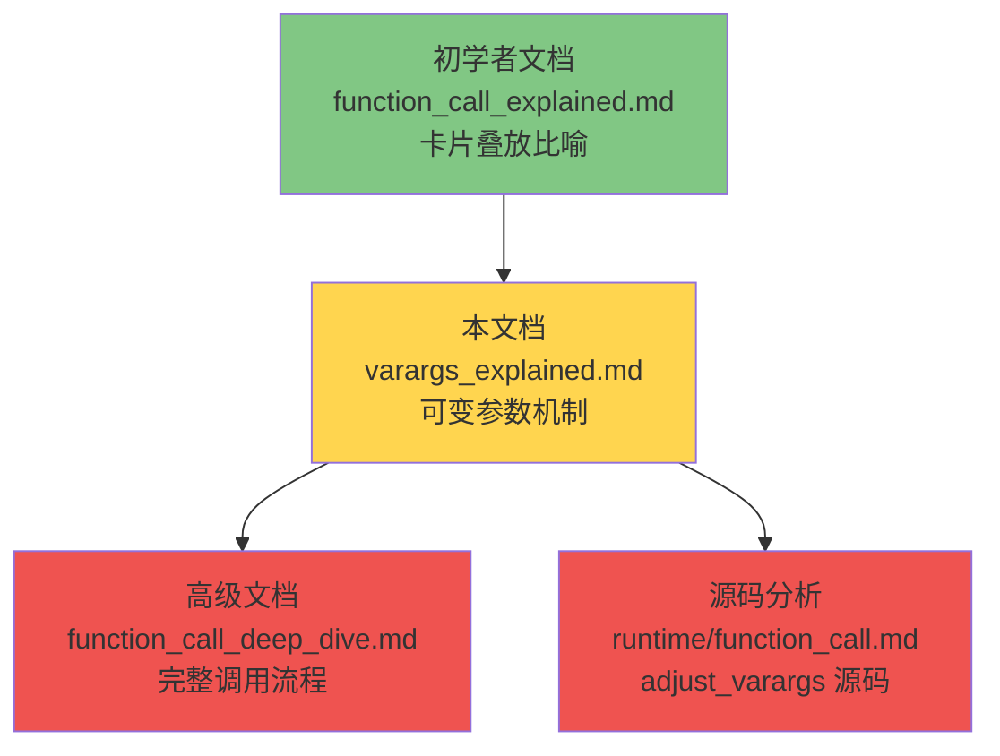

# 🎯 Lua 可变参数（`...`）实现机制详解

> **面向中级开发者**：从"卡片叠放"到栈调整，深入理解 Lua 可变参数的内部实现
>
> **技术深度**：⭐⭐⭐ (介于初学者与高级开发者之间)  
> **预计阅读时间**：30-40 分钟

<div align="center">

**栈布局调整 · adjust_varargs · OP_VARARG · 访问机制**

[📖 核心概念](#-核心概念什么是可变参数) · [🔧 实现机制](#-实现机制adjust_varargs-的魔法) · [⚡ 访问方式](#-访问方式三种获取可变参数的方法) · [🛠️ 实战应用](#-实战应用常见使用场景)

</div>

---

## 📋 文档定位

### 目标读者

本文档专为以下开发者设计：

- ✅ 已理解 Lua 函数调用的"卡片叠放"比喻
- ✅ 熟悉基本的栈帧概念（base、top、func）
- ✅ 希望深入理解可变参数的实现原理
- ✅ 需要优化使用可变参数的代码
- ✅ 对虚拟机栈管理感兴趣

### 与其他文档的关系



### 前置知识

建议先阅读：
- 📖 [function_call_explained.md](../beginner/function_call_explained.md) - 理解"卡片叠放"比喻
- 📖 基本的 Lua 函数调用机制

### 学习目标

完成本文档后，你将能够：

1. **理解**可变参数的语法和使用场景
2. **掌握** `adjust_varargs` 函数的栈调整过程
3. **分析**可变参数的栈布局变化
4. **理解** `OP_VARARG` 指令的执行机制
5. **对比**三种访问可变参数的方式
6. **优化**可变参数的性能
7. **避免**常见的使用陷阱

---

## 📚 目录

**第一阶段：建立空间模型**（15 分钟核心理解）
1. [一句话核心](#-一句话核心)
2. [可变参数是什么](#-可变参数是什么)
3. [栈空间结构总览](#-栈空间结构总览)
4. [为什么要移动 base](#-为什么要移动-base)
5. [完整调用演算](#-完整调用演算)

**第二阶段：理解访问机制**
6. [三种访问方式对比](#-三种访问方式对比)
7. [OP_VARARG 指令原理](#-op_vararg-指令原理)
8. [字节码层面解析](#-字节码层面解析)

**第三阶段：性能与优化**
9. [性能模型分析](#-性能模型分析)
10. [优化策略](#-优化策略)
11. [实战应用场景](#-实战应用场景)

**附录**
- [adjust_varargs 源码剖析](#附录-a-adjust_varargs-源码剖析)
- [地址级栈演化](#附录-b-地址级栈演化)
- [常见误区](#附录-c-常见误区)
- [学习检查清单](#-学习检查清单)

---

# 第一阶段：建立空间模型

> **目标**：15 分钟内建立稳定的心智模型
> **核心**：理解"可变参数 = base 前的连续区域"

---

## � 一句话核心

```
可变参数 = 调用时多传的参数
存放在 base 前的连续栈区域
OP_VARARG 负责复制它们
```

**这是整篇文档的认知压缩器，请牢记这三句话。**

---

## 🔍 可变参数是什么

### 语法

#### 1.1 定义可变参数函数

**基本语法**：

```lua
function func_name(...)
    -- 函数体
end
```

**混合固定参数与可变参数**：

```lua
function func_name(arg1, arg2, ...)
    -- arg1, arg2 是固定参数
    -- ... 是可变参数
end
```

#### 1.2 简单示例

**示例 1：打印所有参数**

```lua
function print_all(...)
    local args = {...}  -- 打包成表
    for i, v in ipairs(args) do
        print(string.format("参数 %d: %s", i, tostring(v)))
    end
end

print_all(10, "hello", true, nil, 42)
-- 输出：
-- 参数 1: 10
-- 参数 2: hello
-- 参数 3: true
-- 参数 4: nil
-- 参数 5: 42
```

**示例 2：求和函数**

```lua
function sum(...)
    local total = 0
    for i = 1, select('#', ...) do
        total = total + select(i, ...)
    end
    return total
end

print(sum(1, 2, 3, 4, 5))  -- 输出：15
```

**示例 3：格式化输出**

```lua
function printf(fmt, ...)
    print(string.format(fmt, ...))
end

printf("x=%d, y=%d, z=%d", 10, 20, 30)
-- 输出：x=10, y=20, z=30
```

---

## 📐 栈空间结构总览

> **这是整篇文档最重要的一张图，请务必理解透彻**

### 全局结构图（抽象版）

```
函数调用后的最终栈结构：

┌─────────────────────────────────────┐
│  [func]          函数对象            │ ← func 指针
├─────────────────────────────────────┤
│  [vararg1]       可变参数区域        │
│  [vararg2]       （base 之前）       │
│  [...]                               │
│  [varargN]                           │
├═════════════════════════════════════┤ ← base 指针（关键分界线）
│  [fixed1]        固定参数            │
│  [fixed2]        （如果有）          │
├─────────────────────────────────────┤
│  [local1]        局部变量区域        │
│  [local2]        （base 之后）       │
│  [...]                               │
├═════════════════════════════════════┤ ← top 指针
│  [预留空间]                         │
└─────────────────────────────────────┘
```

### 核心结论（强锚点）

```
1. base 永远指向局部变量区的起点
2. vararg 永远在 base 之前
3. 访问局部变量：base[0], base[1], ...
4. 访问可变参数：base[-n], base[-n+1], ...（负索引）
```

**请在脑中形成这个二维空间图，后续所有内容都基于此结构。**

---

### 具体示例：`printf(fmt, ...)`

**调用**：`printf("x=%d, y=%d", 10, 20)`

**最终栈布局**：

```
┌─────────────────────────────────────┐
│  [printf 函数]                       │ ← func
├─────────────────────────────────────┤
│  [10]            vararg[0]           │ ← base - 2
├─────────────────────────────────────┤
│  [20]            vararg[1]           │ ← base - 1
├═════════════════════════════════════┤ ← base（分界线）
│  ["x=%d, y=%d"]  R(0) = fmt          │ ← base + 0
├─────────────────────────────────────┤
│  [nil]           R(1) = 局部变量     │ ← base + 1
├═════════════════════════════════════┤ ← top
│  [预留空间]                         │
└─────────────────────────────────────┘

关键观察：
- 固定参数 fmt 在 base 之后（R(0)）
- 可变参数 10, 20 在 base 之前
- 两个区域完全分离
```

---

## 🤔 为什么要移动 base

### 反例：如果不移动 base 会怎样？

**错误的栈布局**（假设不调整）：

```
┌─────────────────────────────────────┐
│  [printf 函数]                       │ ← func
├═════════════════════════════════════┤ ← base（错误位置）
│  ["x=%d, y=%d"]  R(0) = fmt          │
├─────────────────────────────────────┤
│  [10]            R(1) = ???          │ ← 这是可变参数，不是局部变量！
├─────────────────────────────────────┤
│  [20]            R(2) = ???          │ ← 这也是可变参数！
├─────────────────────────────────────┤
│  [???]           R(3) = 局部变量？   │ ← 局部变量没有位置了！
└─────────────────────────────────────┘

问题：
1. ❌ 可变参数占据了 R(1), R(2) 的位置
2. ❌ 局部变量无法从 R(1) 开始分配
3. ❌ 编译器期望 R(1) 是第一个局部变量，但实际是可变参数
4. ❌ 无法区分哪些是可变参数，哪些是局部变量
```

### 正确的做法：移动 base

**调整后的栈布局**：

```
┌─────────────────────────────────────┐
│  [printf 函数]                       │ ← func
├─────────────────────────────────────┤
│  ["x=%d, y=%d"]  固定参数（移动后）  │ ← 移到 base 之前
├─────────────────────────────────────┤
│  [10]            可变参数            │
├─────────────────────────────────────┤
│  [20]            可变参数            │
├═════════════════════════════════════┤ ← base（新位置，向下移动）
│  [nil]           R(0) = 局部变量     │ ← 局部变量从 R(0) 开始
├─────────────────────────────────────┤
│  [nil]           R(1) = 局部变量     │
├═════════════════════════════════════┤ ← top
│  [预留空间]                         │
└─────────────────────────────────────┘

优点：
1. ✅ 可变参数和局部变量完全分离
2. ✅ 局部变量从 R(0) 开始，符合编译器预期
3. ✅ 可变参数通过负索引访问（base[-2], base[-1]）
4. ✅ 结构清晰，易于管理
```

### 关键洞察

```
base 移动的本质：

将"可变参数"和"局部变量"分离到两个独立区域
- 可变参数：base 之前（负索引）
- 局部变量：base 之后（正索引）

这样编译器生成的字节码（R(0), R(1), ...）
才能正确映射到局部变量，而不会与可变参数冲突。
```

---

## 🎬 完整调用演算

> **目标**：通过一个完整示例，演示从调用到执行的全过程

### 示例函数

```lua
function sum(...)
    local total = 0
    for i = 1, select('#', ...) do
        total = total + select(i, ...)
    end
    return total
end

sum(10, 20, 30)
```

### 演算步骤

#### 步骤 1：调用前（调用者准备参数）

```
调用者执行：
1. 压入 sum 函数对象
2. 压入参数 10
3. 压入参数 20
4. 压入参数 30
5. 调用 luaD_precall

栈状态：
┌─────────────────────────────────────┐
│  [sum 函数]                          │ ← func
├─────────────────────────────────────┤ ← L->base（旧）
│  [10]                                │
├─────────────────────────────────────┤
│  [20]                                │
├─────────────────────────────────────┤
│  [30]                                │
├─────────────────────────────────────┤ ← L->top
└─────────────────────────────────────┘

参数分析：
- 总参数数量：3
- 固定参数数量：0（sum 没有固定参数）
- 可变参数数量：3
```

#### 步骤 2：adjust_varargs 调整

```
检测到 p->is_vararg = true
调用 adjust_varargs(L, p, 3)

操作：
1. 计算：nfixargs = 0, nactual = 3
2. 无需移动固定参数（因为没有固定参数）
3. 计算新 base = L->base + 3
4. 返回新 base

栈状态（调整后）：
┌─────────────────────────────────────┐
│  [sum 函数]                          │ ← func
├─────────────────────────────────────┤
│  [10]            vararg[0]           │ ← base - 3
├─────────────────────────────────────┤
│  [20]            vararg[1]           │ ← base - 2
├─────────────────────────────────────┤
│  [30]            vararg[2]           │ ← base - 1
├═════════════════════════════════════┤ ← base（新位置）
│  [nil]           R(0) = total        │
├─────────────────────────────────────┤ ← top
└─────────────────────────────────────┘

关键变化：
- base 向下移动了 3 个位置
- 可变参数 (10, 20, 30) 现在在 base 之前
- R(0) 位置留给局部变量 total
```

#### 步骤 3：函数执行

```
执行字节码：
1. LOADK 0 0      ; R(0) = 0 (total = 0)
2. ...
3. VARARG 1 0     ; 读取所有可变参数到 R(1), R(2), R(3)

执行 VARARG 后的栈状态：
┌─────────────────────────────────────┐
│  [sum 函数]                          │
├─────────────────────────────────────┤
│  [10] [20] [30]  可变参数区域        │ ← 保持不变
├═════════════════════════════════════┤ ← base
│  [0]             R(0) = total        │
├─────────────────────────────────────┤
│  [10]            R(1)（从 vararg 复制）│
├─────────────────────────────────────┤
│  [20]            R(2)（从 vararg 复制）│
├─────────────────────────────────────┤
│  [30]            R(3)（从 vararg 复制）│
├─────────────────────────────────────┤ ← top
└─────────────────────────────────────┘

关键操作：
- VARARG 从 base[-3], base[-2], base[-1] 复制到 R(1), R(2), R(3)
- 可变参数区域保持不变
- 局部变量区域获得了可变参数的副本
```

#### 步骤 4：返回结果

```
执行 RETURN 指令后：
┌─────────────────────────────────────┐
│  [60]            返回值              │ ← 覆盖 func 位置
├─────────────────────────────────────┤ ← top
│  （栈帧已清理）                     │
└─────────────────────────────────────┘

结果：sum(10, 20, 30) = 60
```

---

### 自检题（验证理解）

请回答以下问题（答案在文末）：

1. **vararg 是 table 吗？**
2. **adjust_varargs 会复制所有参数吗？**
3. **base 移动后，可变参数的位置改变了吗？**
4. **R(0) 指向什么？**

---

## 🎯 第一阶段总结

**核心心智模型**：

```
可变参数函数的栈结构 = 三段式空间

[ func ]
[ vararg 区域 ]  ← base 之前（负索引）
---- base ----   ← 分界线
[ 局部变量区域 ]  ← base 之后（正索引）
```

**关键要点**：

1. ✅ base 是分界线，永远指向局部变量区起点
2. ✅ 可变参数在 base 之前，通过负索引访问
3. ✅ adjust_varargs 的作用是移动 base，分离两个区域
4. ✅ 移动 base 是为了让编译器生成的 R(0), R(1), ... 正确映射到局部变量

**如果你理解了以上内容，恭喜你已经掌握了可变参数的核心机制！**

接下来进入第二阶段：理解访问机制。

---

# 第二阶段：理解访问机制

> **前提**：已建立稳定的空间模型
> **目标**：理解三种访问方式的本质差异

---

## 🔄 三种访问方式对比

现在我们已经知道：

```
可变参数存储在 base 之前的连续区域
```

那么如何访问它们呢？Lua 提供了三种方式：

### 方式对比表

| 访问方式 | 本质操作 | 是否创建 table | 适用场景 |
|---------|---------|---------------|---------|
| `{...}` | NEWTABLE + VARARG + SETLIST | ✅ 是 | 需要多次访问、存储参数 |
| `select(i, ...)` | 直接从 vararg 区读取 | ❌ 否 | 单次访问特定参数 |
| `select('#', ...)` | 计算 vararg 数量 | ❌ 否 | 只需要参数数量 |

### 核心区别

```
{...}：
- 创建 table
- 从 base 之前复制所有 vararg 到 table
- 返回 table

select(i, ...):
- 不创建 table
- 直接从 base[-n+i-1] 读取
- 返回原始值

select('#', ...):
- 不创建 table
- 计算 base 之前的 vararg 数量
- 返回数字
```

---

### 示例代码对比

#### `{...}` - 打包成表

```lua
function print_all(...)
    local args = {...}  -- 创建表并复制所有 vararg
    for i, v in ipairs(args) do
        print(v)
    end
end

print_all(10, 20, 30)
```

**适用场景**：
- ✅ 需要多次遍历可变参数
- ✅ 需要存储可变参数供后续使用
- ✅ 需要对可变参数进行表操作（如 `table.concat`）

---

#### `select()` - 直接访问

```lua
function sum(...)
    local total = 0
    local n = select('#', ...)  -- 获取参数数量
    for i = 1, n do
        total = total + select(i, ...)  -- 直接访问第 i 个参数
    end
    return total
end

sum(10, 20, 30)  -- 返回 60
```

**适用场景**：
- ✅ 只需要访问特定位置的参数
- ✅ 只需要知道参数数量
- ✅ 性能敏感的场景（避免创建表）

---

## 🔍 OP_VARARG 指令原理

> **核心作用**：从 base 之前的 vararg 区域复制数据到局部变量区域

### 指令格式

```
OP_VARARG A B
- A: 目标寄存器起始位置（从 R(A) 开始存储）
- B: 复制数量（B-1 个参数，0 表示全部）
```

### 执行逻辑（简化版）

```c
case OP_VARARG: {
    int b = GETARG_B(i) - 1;  // 需要复制的数量
    int n = /* 计算 vararg 数量 */;

    if (b == LUA_MULTRET) {  // B = 0，复制全部
        b = n;
    }

    // 从 base 之前复制 vararg
    for (j = 0; j < b; j++) {
        if (j < n) {
            R(A+j) = base[-(n-j)];  // 从 base 之前读取
        } else {
            R(A+j) = nil;  // 超出部分填 nil
        }
    }
}
```

### 关键计算

```
vararg 数量 = (base - func) - numparams - 1
vararg[i] 的位置 = base - n + i
```

### 示例

```lua
function f(...)
    local a, b, c = ...  -- 编译为 VARARG 0 4（复制3个）
end

f(10, 20, 30, 40)
```

**执行过程**：

```
调用后栈状态：
┌─────────────────────────────────────┐
│  [f 函数]                            │
├─────────────────────────────────────┤
│  [10][20][30][40]  vararg 区域       │ ← base 之前
├═════════════════════════════════════┤ ← base
│  [nil][nil][nil]   R(0), R(1), R(2)  │
└─────────────────────────────────────┘

执行 VARARG 0 4 后：
┌─────────────────────────────────────┐
│  [f 函数]                            │
├─────────────────────────────────────┤
│  [10][20][30][40]  vararg 区域       │ ← 保持不变
├═════════════════════════════════════┤ ← base
│  [10][20][30]      R(0), R(1), R(2)  │ ← 从 vararg 复制
└─────────────────────────────────────┘

结果：a=10, b=20, c=30
```

---

## 🔍 访问方式的本质差异

### `{...}` 的字节码序列

```lua
function f(...)
    local args = {...}
end
```

**编译为**：

```
1. NEWTABLE  0 0 0    ; 创建空表 → R(0)
2. VARARG    1 0      ; 从 base 之前复制所有 vararg → R(1), R(2), ...
3. SETLIST   0 0 1    ; 将 R(1), R(2), ... 填充到 R(0) 表中
```

**本质**：`{...}` = NEWTABLE + VARARG + SETLIST

---

### `select()` 的实现

```lua
select(index, ...)
```

**两种用法**：

1. **`select('#', ...)`**：返回参数数量
   ```lua
   local n = select('#', ...)  -- O(1) 操作
   ```

2. **`select(i, ...)`**：返回从第 i 个参数开始的所有参数
   ```lua
   local a, b = select(2, 10, 20, 30)  -- a=20, b=30
   ```

**实现原理**（简化）：

```c
// select 不创建表，直接操作栈
if (index == '#') {
    return vararg_count;  // 返回数量
} else {
    return vararg[i], vararg[i+1], ...;  // 返回子序列
}
```

---

## 🎯 第二阶段总结

**核心理解**：

```
访问方式的本质差异 = 是否创建中间对象

{...}:
- 创建 table
- 复制所有 vararg 到 table
- 适合：需要多次访问、存储参数

select(i, ...):
- 不创建 table
- 直接从 vararg 区域读取
- 适合：单次访问、获取数量

OP_VARARG:
- 底层指令
- 从 base 之前复制数据到 base 之后
- 两种方式都依赖它
```

**自检题**：

1. **`{...}` 会复制 vararg 吗？**（会，复制到新创建的 table）
2. **`select('#', ...)` 的时间复杂度是多少？**（O(1)）
3. **OP_VARARG 从哪里读取数据？**（从 base 之前的 vararg 区域）

---

# 第三阶段：性能与优化

> **前提**：已理解空间模型和访问机制
> **目标**：掌握性能特征和优化策略

---

## 📊 性能模型分析

### 结构回顾

在分析性能之前，快速回顾核心概念：

```
1. 可变参数存储在 base 之前的连续区域
2. adjust_varargs 只移动固定参数，不复制 vararg
3. OP_VARARG 从 base 之前复制数据到 base 之后
4. {...} 创建表 + 复制数据
5. select 直接读取，不创建表
```

---

### 性能对比表

| 操作 | 时间复杂度 | 空间复杂度 | 是否复制 | 是否创建表 | 适用场景 |
|------|-----------|-----------|---------|-----------|---------|
| `adjust_varargs` | O(nfixargs) | O(1) | 只复制固定参数 | 否 | 自动调用 |
| `{...}` | O(nvarargs) | O(nvarargs) | 是 | 是 | 需要多次访问 |
| `select('#', ...)` | O(1) | O(1) | 否 | 否 | 只需数量 |
| `select(i, ...)` | O(1) | O(1) | 否 | 否 | 单次访问 |

### 关键洞察

```
1. adjust_varargs 的成本与 vararg 数量无关
   - 只移动固定参数
   - vararg 保持原位

2. {...} 的成本与 vararg 数量成正比
   - 创建表：O(n)
   - 复制数据：O(n)
   - GC 压力：每次调用创建新表

3. select 的成本是常数
   - 不创建对象
   - 直接栈操作
```

---

## 🚀 优化策略

### 策略 1：避免不必要的打包

❌ **低效**：

```lua
function log(...)
    local args = {...}  -- 每次调用都创建表
    print(table.concat(args, ", "))
end
```

✅ **高效**：

```lua
function log(...)
    local n = select('#', ...)
    if n == 0 then return end

    local parts = {}
    for i = 1, n do
        parts[i] = tostring(select(i, ...))
    end
    print(table.concat(parts, ", "))
end
```

### 策略 2：缓存参数数量

❌ **低效**：

```lua
function sum(...)
    local total = 0
    for i = 1, select('#', ...) do  -- 每次循环都调用
        total = total + select(i, ...)
    end
    return total
end
```

✅ **高效**：

```lua
function sum(...)
    local n = select('#', ...)  -- 缓存数量
    local total = 0
    for i = 1, n do
        total = total + select(i, ...)
    end
    return total
end
```

### 策略 3：根据场景选择访问方式

| 场景 | 推荐方式 | 原因 |
|------|---------|------|
| 只需要参数数量 | `select('#', ...)` | O(1)，无额外开销 |
| 访问单个参数 | `select(i, ...)` | O(1)，不创建表 |
| 需要多次遍历 | `{...}` | 一次性打包，避免重复 select |
| 转发给其他函数 | 直接传递 `...` | 零开销 |
| 需要表操作 | `{...}` | 必须创建表 |

### 策略 4：直接转发

✅ **最高效**：

```lua
function wrapper(...)
    return original_function(...)  -- 直接转发，零开销
end
```

---

## �️ 实战应用场景

### 场景 1：日志函数

```lua
function log(level, fmt, ...)
    if level >= LOG_LEVEL then
        local msg = string.format(fmt, ...)  -- 直接转发
        write_log(msg)
    end
end

log(INFO, "User %s logged in at %s", username, timestamp)
```

### 场景 2：函数包装器（计时器）

```lua
function timer(func)
    return function(...)
        local start = os.clock()
        local results = {func(...)}  -- 捕获所有返回值
        local elapsed = os.clock() - start
        print(string.format("Elapsed: %.3f ms", elapsed * 1000))
        return table.unpack(results)
    end
end
```

### 场景 3：参数验证

```lua
function validate_numbers(...)
    local n = select('#', ...)
    for i = 1, n do
        local arg = select(i, ...)
        if type(arg) ~= "number" then
            error(string.format("Argument %d must be number, got %s",
                                i, type(arg)))
        end
    end
end
```

### 场景 4：可选参数处理

```lua
function create_window(title, width, height, ...)
    local options = {...}  -- 额外选项打包成表
    local window = {
        title = title,
        width = width or 800,
        height = height or 600,
        options = options
    }
    return window
end
```

---

## 📝 第三阶段总结

**性能要点**：

1. ✅ `adjust_varargs` 成本 = O(固定参数数量)
2. ✅ `{...}` 成本 = O(可变参数数量)
3. ✅ `select` 成本 = O(1)
4. ✅ 根据使用场景选择合适的访问方式

**优化原则**：

1. 避免不必要的表创建
2. 缓存 `select('#', ...)` 的结果
3. 能直接转发就不要打包
4. 需要多次访问时才打包成表

**自检题**：

1. **什么时候应该使用 `{...}`？**（需要多次访问或表操作时）
2. **什么时候应该使用 `select`？**（单次访问或只需数量时）
3. **最高效的参数转发方式是什么？**（直接传递 `...`）

---

# 附录

## 附录 A: adjust_varargs 源码剖析

### 完整源码（Lua 5.1.5）

```c
// ldo.c: adjust_varargs 函数
static StkId adjust_varargs(lua_State *L, Proto *p, int actual) {
    int i;
    int nfixargs = p->numparams;  // 固定参数数量
    Table *htab = NULL;
    StkId base, fixed;

    // 第1步：创建 arg 表（Lua 5.0 兼容特性）
    if (p->is_vararg & VARARG_NEEDSARG) {
        int nvar = actual - nfixargs;  // 可变参数数量
        luaC_checkGC(L);
        htab = luaH_new(L, nvar, 1);  // 创建表

        // 填充 arg 表
        for (i = 0; i < nvar; i++) {
            setobj2n(L, luaH_setnum(L, htab, i + 1),
                     L->top - nvar + i);
        }

        // 设置 arg.n = 可变参数数量
        setnvalue(luaH_setstr(L, htab, luaS_newliteral(L, "n")),
                  cast_num(nvar));
    }

    // 第2步：移动固定参数到正确位置
    base = L->top + 1;  // 新 base = 当前 top + 1
    fixed = L->base;    // 旧 base（固定参数起始位置）

    // 移动固定参数
    for (i = 0; i < nfixargs; i++) {
        setobjs2s(L, L->top++, fixed + i);  // 复制到新位置
        setnilvalue(fixed + i);             // 清空旧位置
    }

    // 第3步：如果需要，将 arg 表放到栈上
    if (htab) {
        sethvalue(L, L->top++, htab);  // 压入 arg 表
    }

    // 第4步：返回新的 base
    return base;
}
```

### 关键变量说明

| 变量 | 类型 | 作用 | 示例值 |
|------|------|------|--------|
| `p->numparams` | `int` | 固定参数数量 | `1` (fmt) |
| `actual` | `int` | 实际传入的参数总数 | `3` (fmt, 10, 20) |
| `nfixargs` | `int` | 固定参数数量 | `1` |
| `nvar` | `int` | 可变参数数量 | `2` (10, 20) |
| `base` | `StkId` | 新的栈帧基地址 | `L->top + 1` |
| `fixed` | `StkId` | 旧的栈帧基地址 | `L->base` |
| `htab` | `Table*` | arg 表（如果需要） | `{[1]=10, [2]=20, n=2}` |

---

## 附录 B: 地址级栈演化

### 示例：`printf("x=%d", 10, 20)`

#### 调用前（地址版）

```
地址      内容              说明
0x1000    [printf 函数]     func
0x1008    ["x=%d"]          参数1
0x1010    [10]              参数2
0x1018    [20]              参数3
0x1020    [...]             top
```

#### adjust_varargs 后

```
地址      内容              说明
0x1000    [printf 函数]     func
0x1008    [nil]             原参数1位置（已移动）
0x1010    [10]              vararg[0]
0x1018    [20]              vararg[1]
0x1020    ["x=%d"]          固定参数（移动后）
0x1028    [nil]             base（新位置）← R(0)
0x1030    [...]             top
```

---

## 附录 C: 常见误区

### 误区 1：vararg 是 table

❌ **错误理解**：`...` 是一个 table

✅ **正确理解**：`...` 是栈上的连续区域，`{...}` 才会创建 table

### 误区 2：adjust_varargs 复制所有参数

❌ **错误理解**：adjust_varargs 复制所有参数

✅ **正确理解**：只移动固定参数，可变参数保持原位

### 误区 3：base 移动后 vararg 位置改变

❌ **错误理解**：base 移动后，vararg 的绝对位置改变了

✅ **正确理解**：vararg 的绝对位置不变，只是相对 base 的位置变成负索引

### 误区 4：R(0) 是第一个参数

❌ **错误理解**：R(0) 是第一个参数

✅ **正确理解**：R(0) 是第一个局部变量（或固定参数），vararg 在 base 之前

---

## 📋 学习检查清单

### 第一阶段：空间模型

- [ ] 理解"可变参数 = base 前的连续区域"
- [ ] 能画出栈的三段结构（func / vararg / locals）
- [ ] 理解为什么要移动 base
- [ ] 能解释 R(0) 指向什么

### 第二阶段：访问机制

- [ ] 理解 `{...}` 的本质（NEWTABLE + VARARG + SETLIST）
- [ ] 理解 `select` 的两种用法
- [ ] 理解 OP_VARARG 指令的作用
- [ ] 能区分三种访问方式的差异

### 第三阶段：性能与优化

- [ ] 理解各种操作的时间复杂度
- [ ] 能根据场景选择合适的访问方式
- [ ] 掌握常见的优化策略
- [ ] 能识别性能陷阱

### 附录：深入理解

- [ ] 理解 adjust_varargs 的完整实现
- [ ] 能追踪地址级的栈演化
- [ ] 避免常见误区

---

## 🎓 进阶阅读

### 相关文档

- [function_call_explained.md](../beginner/function_call_explained.md) - 函数调用基础
- [function_call_deep_dive.md](../advanced/function_call_deep_dive.md) - 完整调用流程
- [runtime/function_call.md](../runtime/function_call.md) - 源码级分析

### 源码文件

| 文件 | 相关函数 | 说明 |
|------|---------|------|
| `ldo.c` | `luaD_precall` | 函数调用入口 |
| `ldo.c` | `adjust_varargs` | 栈布局调整 |
| `lvm.c` | `OP_VARARG` | 可变参数指令 |
| `lbaselib.c` | `luaB_select` | select 函数实现 |

---

## 📝 自检题答案

### 第一阶段

1. **vararg 是 table 吗？** → 不是，是栈上的连续区域
2. **adjust_varargs 会复制所有参数吗？** → 不会，只移动固定参数
3. **base 移动后，可变参数的位置改变了吗？** → 绝对位置不变，相对位置变成负索引
4. **R(0) 指向什么？** → 第一个局部变量（或固定参数）

### 第二阶段

1. **`{...}` 会复制 vararg 吗？** → 会，复制到新创建的 table
2. **`select('#', ...)` 的时间复杂度是多少？** → O(1)
3. **OP_VARARG 从哪里读取数据？** → 从 base 之前的 vararg 区域

### 第三阶段

1. **什么时候应该使用 `{...}`？** → 需要多次访问或表操作时
2. **什么时候应该使用 `select`？** → 单次访问或只需数量时
3. **最高效的参数转发方式是什么？** → 直接传递 `...`

---

<div align="center">

**🎉 恭喜！你已经完全掌握了 Lua 可变参数的实现机制！**

从空间模型到访问机制，再到性能优化，
你现在拥有了深入理解 Lua 虚拟机的坚实基础。

</div>

---

## 📄 文档元信息

- **创建日期**：2026-02-15
- **适用 Lua 版本**：5.1.5
- **文档版本**：v2.0（认知科学优化版）
- **维护状态**：活跃
- **技术深度**：⭐⭐⭐（中级）
