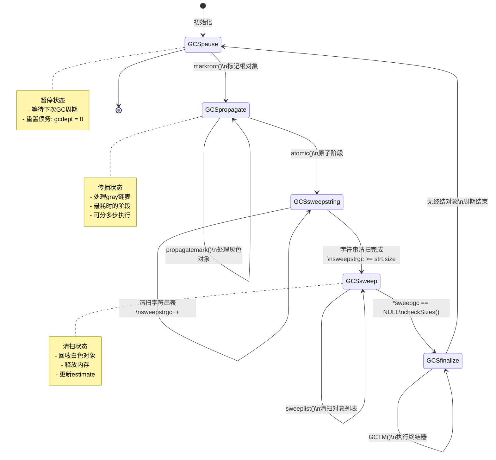
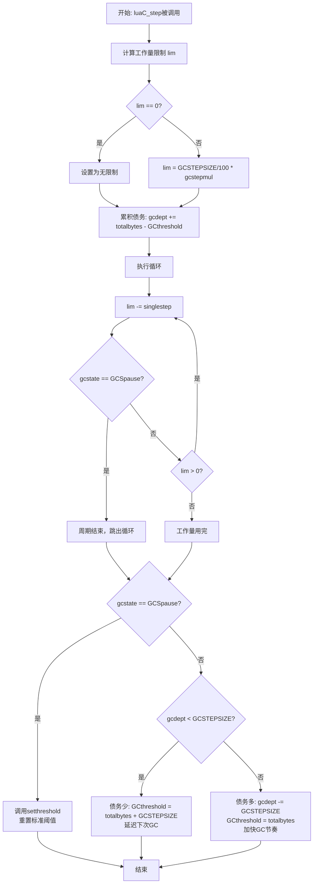

# Lua 5.1.5 增量垃圾回收详解

> **文档类型**: 技术详解 (Technical Deep Dive)  
> **难度级别**: ⭐⭐⭐⭐⭐ (高级)  
> **预计阅读时间**: 45-60 分钟  
> **前置知识**: 
> - [GC模块概览](./wiki_gc.md)
> - 三色标记算法基础
> - C语言内存管理
> - 算法时间复杂度分析

---

## 📋 目录

- [1. 引言](#1-引言)
- [2. 增量GC核心概念](#2-增量gc核心概念)
- [3. GC状态机详解](#3-gc状态机详解)
- [4. 单步执行机制](#4-单步执行机制)
- [5. luaC_step核心实现](#5-luac_step核心实现)
- [6. 债务与阈值机制](#6-债务与阈值机制)
- [7. 写屏障详解](#7-写屏障详解)
- [8. 性能优化策略](#8-性能优化策略)
- [9. 完整代码示例](#9-完整代码示例)
- [10. 常见问题与解答](#10-常见问题与解答)

---

## 1. 引言

### 1.1 什么是增量垃圾回收？

**增量垃圾回收（Incremental Garbage Collection）** 是一种将垃圾回收工作分散到程序执行过程中的技术，避免传统 "Stop-the-World" 回收带来的长时间停顿。

#### 传统GC vs 增量GC

```
传统GC (Stop-the-World):
程序执行 ████████████ [停顿: GC工作] ████████████ [停顿: GC工作] ███
                         ↑ 长时间停顿           ↑ 长时间停顿

增量GC (Incremental):
程序执行 ██[gc]██[gc]██[gc]██[gc]██[gc]██[gc]██[gc]██[gc]██[gc]██
           ↑      ↑      ↑       ↑      ↑  短暂停顿，分散进行
```

### 1.2 为什么需要增量GC？

| 场景 | Stop-the-World | 增量GC |
|------|----------------|--------|
| **游戏渲染** | 每帧16.67ms，GC停顿50ms → 掉帧 | 每帧GC工作1-2ms → 流畅 |
| **Web服务器** | 请求处理中GC停顿 → 超时 | 分散GC → 响应稳定 |
| **实时系统** | GC停顿不可预测 → 无法使用 | 可控的小停顿 → 可用 |
| **大内存应用** | 内存越大停顿越长 → 体验差 | 停顿时间相对固定 → 可预测 |

### 1.3 Lua增量GC的核心特点

✅ **分步执行**: 每次内存分配时执行少量GC工作  
✅ **自适应**: 根据内存分配速度自动调整GC频率  
✅ **写屏障**: 通过写屏障维护三色不变式  
✅ **可配置**: 用户可通过参数控制GC行为  
✅ **低开销**: 单步执行时间固定，开销可预测

---

## 2. 增量GC核心概念

### 2.1 三色标记法回顾

增量GC基于三色标记算法，对象在回收过程中处于三种状态之一：

```
┌─────────────────────────────────────────────────────────┐
│                     三色标记状态                          │
├─────────────────────────────────────────────────────────┤
│  ⚪ 白色 (White)                                         │
│     - 含义: 未访问或待回收对象                            │
│     - 标记: currentwhite位                               │
│     - 结局: 清扫阶段被回收                                │
├─────────────────────────────────────────────────────────┤
│  ⚫ 灰色 (Gray)                                          │
│     - 含义: 已访问但子对象未处理                          │
│     - 存储: gray/grayagain/weak链表                      │
│     - 作用: 待处理队列                                    │
├─────────────────────────────────────────────────────────┤
│  ⬛ 黑色 (Black)                                         │
│     - 含义: 已访问且所有子对象已处理                       │
│     - 标记: otherwhite位                                 │
│     - 保证: 不再被遍历                                    │
└─────────────────────────────────────────────────────────┘
```

#### 三色不变式 (Tri-color Invariant)

**强不变式**: 黑色对象**绝不**直接引用白色对象

```c
// 正确的引用关系
⬛ 黑色对象 → ⚫ 灰色对象 → ⚪ 白色对象   ✅ 合法
⬛ 黑色对象 → ⬛ 黑色对象 → ⚫ 灰色对象   ✅ 合法

// 违反不变式
⬛ 黑色对象 → ⚪ 白色对象                ❌ 非法！
```

如果黑色对象直接引用白色对象，白色对象可能被错误回收！

### 2.2 写屏障机制

**写屏障（Write Barrier）** 是维护三色不变式的关键机制。当程序试图修改对象引用时，写屏障被触发：

```c
// 写屏障触发时机
table[key] = value  // 表赋值
obj.field = value   // 字段赋值
setmetatable(t, mt) // 元表设置
```

#### 两种写屏障策略

**前向屏障（Forward Barrier）**:
```
⬛ 黑色对象 → ⚪ 白色对象
      ↓ 触发前向屏障
⬛ 黑色对象 → ⚫ 灰色对象  (将白色对象标记为灰色)
```

**后向屏障（Backward Barrier）**:
```
⬛ 黑色表 → ⚪ 白色对象
      ↓ 触发后向屏障
⚫ 灰色表 → ⚪ 白色对象  (将黑色表重新标记为灰色)
```

### 2.3 债务机制

增量GC使用**债务（Debt）** 概念来平衡内存分配和回收：

```
债务累积:
    每次分配内存 → debt += allocated_bytes
    
债务偿还:
    每次GC工作 → debt -= work_done
    
阈值调整:
    debt > threshold → 触发GC步进
    debt < 0 → 提高阈值，减少GC频率
```

---

## 3. GC状态机详解

### 3.1 状态机整体架构

Lua的增量GC是一个五状态的状态机：



### 3.2 各状态详细说明

#### GCSpause - 暂停状态

```c
case GCSpause: {
    // 暂停状态：开始新的回收周期
    markroot(L);  // 标记根对象集合
    return 0;     // 本步骤无额外工作量
}
```

**职责**:
- 作为GC周期的起点和终点
- 调用 `markroot()` 标记所有根对象
- 重置债务计数器

**根对象包括**:
- 全局注册表（registry）
- 主线程及所有协程的栈
- 全局元表（metatable）
- 全局字符串缓存

#### GCSpropagate - 传播状态

```c
case GCSpropagate: {
    // 传播状态：处理灰色对象
    if (g->gray) {
        return propagatemark(g);  // 处理一个灰色对象
    } else {
        // 没有更多灰色对象，完成标记阶段
        atomic(L);
        return 0;
    }
}
```

**职责**:
- 从 `gray` 链表取出灰色对象
- 遍历对象的所有引用
- 将引用的白色对象标记为灰色
- 将当前对象标记为黑色

**工作量**:
- 每次处理一个灰色对象
- 返回处理的引用数量作为工作量

#### GCSsweepstring - 字符串清扫状态

```c
case GCSsweepstring: {
    // 字符串清扫状态：清扫字符串表
    lu_mem old = g->totalbytes;
    sweepwholelist(L, &g->strt.hash[g->sweepstrgc++]);
    
    if (g->sweepstrgc >= g->strt.size) {
        // 字符串清扫完成，转到对象清扫
        g->gcstate = GCSsweep;
    }
    
    lua_assert(old >= g->totalbytes);
    g->estimate -= old - g->totalbytes;
    return GCSWEEPCOST;
}
```

**职责**:
- 清扫字符串哈希表的一个槽位
- 回收白色字符串
- 更新内存统计

**特点**:
- 每步清扫一个哈希槽
- 返回固定工作量 `GCSWEEPCOST`

#### GCSsweep - 对象清扫状态

```c
case GCSsweep: {
    // 对象清扫状态：清扫主对象列表
    lu_mem old = g->totalbytes;
    g->sweepgc = sweeplist(L, g->sweepgc, GCSWEEPMAX);
    
    if (*g->sweepgc == NULL) {
        // 对象清扫完成，检查大小并转到终结状态
        checkSizes(L);
        g->gcstate = GCSfinalize;
    }
    
    lua_assert(old >= g->totalbytes);
    g->estimate -= old - g->totalbytes;
    return GCSWEEPMAX * GCSWEEPCOST;
}
```

**职责**:
- 清扫主对象链表
- 每步最多清扫 `GCSWEEPMAX`（40）个对象
- 回收白色对象，保留黑色对象

**工作量控制**:
- `GCSWEEPMAX = 40`: 每步最多清扫对象数
- `GCSWEEPCOST = 10`: 每个对象的清扫成本
- 总工作量: `GCSWEEPMAX * GCSWEEPCOST = 400`

#### GCSfinalize - 终结状态

```c
case GCSfinalize: {
    // 终结状态：执行终结器
    if (g->tmudata) {
        GCTM(L);  // 执行一个终结器
        if (g->estimate > GCFINALIZECOST) {
            g->estimate -= GCFINALIZECOST;
        }
        return GCFINALIZECOST;
    } else {
        // 终结完成，结束回收周期
        g->gcstate = GCSpause;
        g->gcdept = 0;
        return 0;
    }
}
```

**职责**:
- 执行待终结对象的 `__gc` 元方法
- 每步执行一个终结器
- 所有终结器执行完后回到暂停状态

**注意事项**:
- 终结器可能分配新对象
- 终结器可能抛出错误
- 终结顺序不确定

---

## 4. 单步执行机制

### 4.1 singlestep() 函数详解

`singlestep()` 是增量GC的核心函数，负责执行一步GC工作：

```c
/**
 * @brief 执行一步增量垃圾回收
 * @param L Lua状态机指针
 * @return 本步骤完成的工作量
 */
static l_mem singlestep(lua_State *L) {
    global_State *g = G(L);
    
    switch (g->gcstate) {
        case GCSpause: {
            markroot(L);
            return 0;
        }
        
        case GCSpropagate: {
            if (g->gray) {
                return propagatemark(g);
            } else {
                atomic(L);
                return 0;
            }
        }
        
        case GCSsweepstring: {
            lu_mem old = g->totalbytes;
            sweepwholelist(L, &g->strt.hash[g->sweepstrgc++]);
            
            if (g->sweepstrgc >= g->strt.size) {
                g->gcstate = GCSsweep;
            }
            
            lua_assert(old >= g->totalbytes);
            g->estimate -= old - g->totalbytes;
            return GCSWEEPCOST;
        }
        
        case GCSsweep: {
            lu_mem old = g->totalbytes;
            g->sweepgc = sweeplist(L, g->sweepgc, GCSWEEPMAX);
            
            if (*g->sweepgc == NULL) {
                checkSizes(L);
                g->gcstate = GCSfinalize;
            }
            
            lua_assert(old >= g->totalbytes);
            g->estimate -= old - g->totalbytes;
            return GCSWEEPMAX * GCSWEEPCOST;
        }
        
        case GCSfinalize: {
            if (g->tmudata) {
                GCTM(L);
                if (g->estimate > GCFINALIZECOST) {
                    g->estimate -= GCFINALIZECOST;
                }
                return GCFINALIZECOST;
            } else {
                g->gcstate = GCSpause;
                g->gcdept = 0;
                return 0;
            }
        }
        
        default:
            lua_assert(0);
            return 0;
    }
}
```

### 4.2 工作量计算

不同状态的单步工作量：

| 状态 | 工作量 | 计算方式 | 说明 |
|------|--------|----------|------|
| **GCSpause** | 0 | 固定 | 仅标记根对象 |
| **GCSpropagate** | 变化 | 对象引用数 | 取决于对象复杂度 |
| **GCSsweepstring** | 10 | GCSWEEPCOST | 每个哈希槽固定成本 |
| **GCSsweep** | 400 | GCSWEEPMAX × GCSWEEPCOST | 最多清扫40个对象 |
| **GCSfinalize** | 100 | GCFINALIZECOST | 每个终结器固定成本 |

### 4.3 状态转换时机

```c
// 状态转换流程示意
GCSpause (开始) 
    → markroot() 标记根对象
    
GCSpropagate (标记阶段)
    → 循环处理gray链表
    → gray为空时调用atomic()
    
GCSsweepstring (字符串清扫)
    → 清扫所有字符串哈希槽
    → sweepstrgc >= strt.size时转换
    
GCSsweep (对象清扫)
    → 清扫主对象列表
    → *sweepgc == NULL时转换
    
GCSfinalize (终结阶段)
    → 执行所有终结器
    → tmudata == NULL时转换
    
GCSpause (结束)
    → 重置债务，等待下次周期
```

---

## 5. luaC_step核心实现

### 5.1 函数签名与职责

`luaC_step()` 是增量GC的主要用户接口，在每次内存分配时被调用：

```c
/**
 * @brief 执行增量垃圾回收步进
 * @param L Lua状态机指针
 * 
 * 调用时机: 每次内存分配时（luaM_realloc_）
 * 职责: 根据债务情况执行适量的GC工作
 */
void luaC_step(lua_State *L) {
    global_State *g = G(L);
    
    // 1. 计算本次步进的工作量限制
    l_mem lim = (GCSTEPSIZE / 100) * g->gcstepmul;
    if (lim == 0) {
        lim = (MAX_LUMEM - 1) / 2;  // 无限制
    }
    
    // 2. 累积垃圾回收债务
    g->gcdept += g->totalbytes - g->GCthreshold;
    
    // 3. 执行垃圾回收步骤，直到工作量用完或回收周期结束
    do {
        lim -= singlestep(L);
        if (g->gcstate == GCSpause) {
            break;  // 回收周期结束
        }
    } while (lim > 0);
    
    // 4. 根据回收状态和债务情况调整阈值
    if (g->gcstate != GCSpause) {
        // 回收未完成，根据债务情况调整阈值
        if (g->gcdept < GCSTEPSIZE) {
            // 债务较少，提高阈值，延迟下次回收
            g->GCthreshold = g->totalbytes + GCSTEPSIZE;
        } else {
            // 债务较多，降低阈值，加快回收节奏
            g->gcdept -= GCSTEPSIZE;
            g->GCthreshold = g->totalbytes;
        }
    } else {
        // 回收周期完成，重新设置标准阈值
        setthreshold(g);
    }
}
```

### 5.2 执行流程详解



### 5.3 关键参数说明

#### GCSTEPSIZE - 步进大小

```c
#define GCSTEPSIZE    1024  // 基础步进单位（字节）
```

**含义**: 
- GC的基础工作单位
- 每次 `luaC_step()` 的默认工作量
- 用于计算债务和阈值调整

**影响**:
- 值越大：每步工作越多，GC越频繁
- 值越小：每步工作越少，GC越不频繁

#### gcstepmul - 步进倍数

```c
// 全局状态中的字段
g->gcstepmul = 200;  // 默认值为200
```

**含义**: 
- 用户可配置的GC积极程度参数
- 实际工作量 = `(GCSTEPSIZE / 100) * gcstepmul`

**调整效果**:

| gcstepmul | 实际工作量 | GC频率 | 内存使用 | 适用场景 |
|-----------|----------|--------|----------|----------|
| 100 | 1024 字节 | 标准 | 标准 | 一般应用 |
| 200 | 2048 字节 | 较高 | 较低 | 内存敏感应用 |
| 400 | 4096 字节 | 很高 | 很低 | 内存受限环境 |
| 50 | 512 字节 | 较低 | 较高 | CPU敏感应用 |

#### 通过Lua API调整

```lua
-- 获取当前gcstepmul
local stepmul = collectgarbage("setstepmul", 200)

-- 设置更积极的GC
collectgarbage("setstepmul", 400)  -- GC频率提高2倍

-- 设置更温和的GC
collectgarbage("setstepmul", 100)  -- GC频率降低一半
```

### 5.4 工作量计算示例

假设 `gcstepmul = 200`，计算工作量：

```c
// 步骤1: 计算基础工作量
l_mem lim = (GCSTEPSIZE / 100) * g->gcstepmul;
          = (1024 / 100) * 200
          = 10.24 * 200
          = 2048 字节

// 步骤2: 累积债务
// 假设: totalbytes = 100KB, GCthreshold = 95KB
g->gcdept += g->totalbytes - g->GCthreshold;
g->gcdept += 100KB - 95KB;
g->gcdept += 5KB;  // 债务增加5KB

// 步骤3: 执行GC工作
// 假设第一步 singlestep() 返回 500
lim = 2048 - 500 = 1548

// 假设第二步 singlestep() 返回 400
lim = 1548 - 400 = 1148

// 继续执行直到 lim <= 0 或周期结束
```

### 5.5 阈值调整策略

#### 场景1: 回收周期完成

```c
if (g->gcstate == GCSpause) {
    setthreshold(g);
}

// setthreshold() 实现：
static void setthreshold(global_State *g) {
    g->GCthreshold = (g->estimate / 100) * g->gcpause;
}
```

**计算示例**:
```c
// 假设：
// estimate = 80KB (回收后剩余内存估计)
// gcpause = 200 (默认值)

GCthreshold = (80KB / 100) * 200
            = 0.8KB * 200
            = 160KB

// 含义: 当内存使用达到160KB时，触发下次GC周期
```

#### 场景2: 债务较少（回收跟得上分配）

```c
if (g->gcdept < GCSTEPSIZE) {
    g->GCthreshold = g->totalbytes + GCSTEPSIZE;
}
```

**效果**: 
- 提高阈值，延迟下次GC
- 减少GC频率，降低开销
- 适用于内存分配不频繁的情况

**示例**:
```c
// 假设：
// totalbytes = 100KB
// gcdept = 512 (小于 GCSTEPSIZE=1024)

GCthreshold = 100KB + 1KB = 101KB

// 含义: 再分配1KB后才触发下次GC步进
```

#### 场景3: 债务较多（回收跟不上分配）

```c
if (g->gcdept >= GCSTEPSIZE) {
    g->gcdept -= GCSTEPSIZE;
    g->GCthreshold = g->totalbytes;
}
```

**效果**: 
- 降低阈值到当前内存使用量
- 下次分配立即触发GC
- 加快回收节奏，控制内存增长

**示例**:
```c
// 假设：
// totalbytes = 100KB
// gcdept = 5KB (大于 GCSTEPSIZE=1KB)

gcdept = 5KB - 1KB = 4KB
GCthreshold = 100KB

// 含义: 下次内存分配立即触发GC
```

### 5.6 完整执行示例

模拟一次 `luaC_step()` 的完整执行：

```c
// 初始状态
global_State g = {
    .gcstate = GCSpropagate,
    .totalbytes = 102400,      // 100KB
    .GCthreshold = 98304,      // 96KB
    .gcdept = 0,
    .gcstepmul = 200,
    .gcpause = 200,
    .estimate = 81920          // 80KB
};

// === 调用 luaC_step() ===

// 1. 计算工作量限制
l_mem lim = (1024 / 100) * 200 = 2048;

// 2. 累积债务
g.gcdept += 102400 - 98304 = 4096;
// 现在 gcdept = 4096

// 3. 执行GC步骤
// 假设处于传播阶段，有3个灰色对象

// 第一步：处理表对象（10个引用）
lim = 2048 - 10 = 2038;
// gray链表还有对象，继续

// 第二步：处理闭包对象（5个引用）
lim = 2038 - 5 = 2033;
// gray链表还有对象，继续

// 第三步：处理用户数据（2个引用）
lim = 2033 - 2 = 2031;
// gray链表为空，调用atomic()，进入清扫阶段
// gcstate = GCSsweepstring

// 第四步：清扫字符串（固定成本10）
lim = 2031 - 10 = 2021;
// 继续

// ... 继续执行直到 lim <= 0

// 4. 调整阈值
// gcstate != GCSpause (仍在清扫阶段)
// gcdept = 4096 >= GCSTEPSIZE (1024)
g.gcdept = 4096 - 1024 = 3072;
g.GCthreshold = 102400;

// 结果：下次分配立即触发GC
```

---

## 6. 债务与阈值机制

### 6.1 债务机制原理

**债务（Debt）** 是Lua增量GC中的关键概念，用于跟踪内存分配和GC工作的平衡：

```
债务的本质：
    债务 = 已分配但尚未回收的内存量
    
债务的来源：
    ✅ 每次内存分配增加债务
    ❌ 每次GC工作减少债务
    
债务的作用：
    ⚠️ 债务过高 → 触发更频繁的GC
    ✅ 债务为负 → 延缓下次GC
```

### 6.2 债务累积过程

#### 内存分配时

每次调用 `luaC_step()` 时累积债务：

```c
void luaC_step(lua_State *L) {
    global_State *g = G(L);
    
    // 累积债务 = 当前内存使用 - 阈值
    g->gcdept += g->totalbytes - g->GCthreshold;
    
    // ...执行GC工作...
}
```

**累积示例**:

```
时刻T0: totalbytes=100KB, GCthreshold=95KB, gcdept=0
    → gcdept += 100KB - 95KB = 5KB
    → gcdept = 5KB

时刻T1: 分配10KB后
    → totalbytes=110KB, GCthreshold=95KB
    → gcdept += 110KB - 95KB = 15KB
    → gcdept = 5KB + 15KB = 20KB

时刻T2: 执行GC工作1KB
    → gcdept -= 1KB
    → gcdept = 19KB
```

#### 债务偿还

GC工作会减少债务：

```c
// 在阈值调整时偿还债务
if (g->gcdept >= GCSTEPSIZE) {
    g->gcdept -= GCSTEPSIZE;  // 偿还一个步进单位的债务
    g->GCthreshold = g->totalbytes;
}
```

### 6.3 阈值机制详解

**阈值（Threshold）** 决定何时触发下次GC步进：

```c
// 阈值判断（在内存分配函数中）
if (g->totalbytes >= g->GCthreshold) {
    luaC_step(L);  // 触发GC步进
}
```

#### 标准阈值计算

回收周期完成后设置标准阈值：

```c
static void setthreshold(global_State *g) {
    // 阈值 = 估计内存 × (gcpause / 100)
    g->GCthreshold = (g->estimate / 100) * g->gcpause;
}
```

**gcpause参数含义**:

| gcpause | 阈值倍数 | GC频率 | 内存峰值 | 适用场景 |
|---------|---------|--------|---------|----------|
| 100 | 1.0× | 很高 | 很低 | 极度内存受限 |
| 150 | 1.5× | 较高 | 较低 | 内存敏感 |
| 200 | 2.0× | 标准 | 标准 | 一般应用（默认）|
| 300 | 3.0× | 较低 | 较高 | CPU敏感 |
| 400 | 4.0× | 很低 | 很高 | 内存充足环境 |

**计算示例**:

```lua
-- 回收后剩余内存: 50KB
-- gcpause = 200 (默认)

GCthreshold = (50KB / 100) * 200
            = 0.5KB * 200
            = 100KB

-- 含义: 当内存使用达到100KB时，开始新的GC周期
-- 允许的内存增长: 100KB - 50KB = 50KB (100%增长)
```

#### 动态阈值调整

在GC周期执行过程中动态调整：

```c
// 债务少：提高阈值，延迟GC
if (g->gcdept < GCSTEPSIZE) {
    g->GCthreshold = g->totalbytes + GCSTEPSIZE;
}

// 债务多：降低阈值，加速GC
else {
    g->gcdept -= GCSTEPSIZE;
    g->GCthreshold = g->totalbytes;
}
```

### 6.4 自适应调整实例

模拟不同内存分配速度下的自适应行为：

#### 场景A: 内存分配缓慢

```
周期开始: estimate=80KB, gcpause=200
    → GCthreshold = (80KB/100)*200 = 160KB

T1: 分配5KB, totalbytes=85KB
    → 未达阈值，不触发GC
    
T2: 分配10KB, totalbytes=95KB
    → 未达阈值，不触发GC
    
T3: 分配70KB, totalbytes=165KB
    → 达到阈值，触发luaC_step()
    → gcdept += 165KB - 160KB = 5KB
    → 执行GC工作2KB，gcdept=3KB
    → gcdept < GCSTEPSIZE
    → GCthreshold = 165KB + 1KB = 166KB  ← 提高阈值

结果: GC频率降低，降低开销
```

#### 场景B: 内存分配快速

```
周期开始: estimate=80KB, gcpause=200
    → GCthreshold = 160KB

T1: 快速分配50KB, totalbytes=130KB
    → 未达阈值
    
T2: 再分配40KB, totalbytes=170KB
    → 达到阈值，触发luaC_step()
    → gcdept += 170KB - 160KB = 10KB
    → 执行GC工作2KB，gcdept=8KB
    → gcdept >= GCSTEPSIZE
    → gcdept = 8KB - 1KB = 7KB
    → GCthreshold = 170KB  ← 立即触发

T3: 再分配1KB, totalbytes=171KB
    → 立即触发luaC_step()  ← 加速GC

结果: GC频率提高，控制内存增长
```

### 6.5 参数调优指南

#### 通过Lua API调整参数

```lua
-- 1. 调整gcpause（控制GC周期触发时机）
collectgarbage("setpause", 200)  -- 默认值
collectgarbage("setpause", 150)  -- 更早触发GC
collectgarbage("setpause", 300)  -- 更晚触发GC

-- 2. 调整gcstepmul（控制每步GC工作量）
collectgarbage("setstepmul", 200)  -- 默认值
collectgarbage("setstepmul", 400)  -- 每步工作翻倍
collectgarbage("setstepmul", 100)  -- 每步工作减半

-- 3. 强制完整GC
collectgarbage("collect")

-- 4. 查询内存使用
local kb = collectgarbage("count")  -- 返回KB数
```

#### 不同场景的推荐配置

**游戏应用（追求流畅）**:
```lua
collectgarbage("setpause", 150)    -- 较早触发，避免峰值
collectgarbage("setstepmul", 300)  -- 更积极回收
```

**Web服务器（平衡性能与内存）**:
```lua
collectgarbage("setpause", 200)    -- 标准触发
collectgarbage("setstepmul", 200)  -- 标准工作量
```

**嵌入式系统（内存受限）**:
```lua
collectgarbage("setpause", 110)    -- 非常早触发
collectgarbage("setstepmul", 500)  -- 非常积极回收
```

**科学计算（内存充足，追求性能）**:
```lua
collectgarbage("setpause", 400)    -- 晚触发，减少GC次数
collectgarbage("setstepmul", 100)  -- 每步少量工作
```

---

## 7. 写屏障详解

### 7.1 写屏障的必要性

在增量GC中，程序执行和GC并发进行，可能出现以下危险情况：

```
时刻T0: GC标记阶段
    ⬛ 黑色对象A (已完全标记)
    ⚪ 白色对象B (待标记)

时刻T1: 程序修改引用
    A.field = B  // ⬛ → ⚪ 危险！

时刻T2: GC继续
    对象A已标记为黑色，不再遍历
    对象B仍为白色，无其他引用
    
时刻T3: 清扫阶段
    对象B被错误回收！ ❌
    A.field 变成悬空指针！ ❌
```

**写屏障的作用**: 在引用修改时维护三色不变式，防止活跃对象被错误回收。

### 7.2 前向写屏障 (Forward Barrier)

#### 基本原理

当黑色对象引用白色对象时，将白色对象标记为灰色：

```
修改前:  ⬛ 黑色对象 → ⚪ 白色对象
          ↓ 触发前向屏障
修改后:  ⬛ 黑色对象 → ⚫ 灰色对象  ✅ 安全
```

#### 源码实现

```c
/**
 * @brief 前向写屏障
 * @param L Lua状态机
 * @param o 黑色对象（引用者）
 * @param v 白色对象（被引用者）
 */
void luaC_barrierf(lua_State *L, GCObject *o, GCObject *v) {
    global_State *g = G(L);
    
    // 断言：确保o是黑色，v是白色
    lua_assert(isblack(o) && iswhite(v) && !isdead(g, v) && !isdead(g, o));
    lua_assert(g->gcstate != GCSfinalize && g->gcstate != GCSpause);
    lua_assert(ttype(&o->gch) != LUA_TTABLE);  // 表使用后向屏障
    
    if (g->gcstate == GCSpropagate) {
        // 传播阶段：立即标记白色对象
        reallymarkobject(g, v);  // ⚪ → ⚫
    } else {
        // 清扫阶段：将黑色对象降级为白色
        makewhite(g, o);  // ⬛ → ⚪
    }
}
```

#### 策略选择

根据GC阶段选择不同策略：

**传播阶段（GCSpropagate）**:
```c
if (g->gcstate == GCSpropagate) {
    reallymarkobject(g, v);  // 标记被引用的白色对象
}
```
- **原因**: 标记阶段还在进行，可以将白色对象加入gray链表
- **效果**: 对象会被正常遍历和标记
- **成本**: 需要遍历对象的引用

**清扫阶段（GCSsweep等）**:
```c
else {
    makewhite(g, o);  // 将黑色对象降级为白色
}
```
- **原因**: 标记已完成，无法再处理灰色对象
- **效果**: 对象在下次GC周期被重新标记
- **成本**: 较低，仅修改颜色位

#### 使用示例

```c
// 在对象字段赋值时触发
void setfield(GCObject *obj, GCObject *value) {
    global_State *g = G(L);
    
    // 赋值操作
    obj->field = value;
    
    // 检查是否需要写屏障
    if (isblack(obj) && iswhite(value)) {
        luaC_barrierf(L, obj, value);  // 触发前向屏障
    }
}
```

### 7.3 后向写屏障 (Backward Barrier)

#### 基本原理

当表对象被修改时，将黑色表重新标记为灰色，加入 `grayagain` 链表：

```
修改前:  ⬛ 黑色表 → ⚪ 白色对象
          ↓ 触发后向屏障
修改后:  ⚫ 灰色表 → ⚪ 白色对象  ✅ 安全
         (加入grayagain链表)
```

#### 源码实现

```c
/**
 * @brief 后向写屏障（表专用）
 * @param L Lua状态机
 * @param t 表对象
 */
void luaC_barrierback(lua_State *L, Table *t) {
    global_State *g = G(L);
    GCObject *o = obj2gco(t);
    
    lua_assert(isblack(o) && !isdead(g, o));
    lua_assert(g->gcstate != GCSfinalize && g->gcstate != GCSpause);
    
    // 将表重新标记为灰色
    black2gray(o);  // ⬛ → ⚫
    
    // 加入grayagain链表，等待原子阶段重新处理
    t->gclist = g->grayagain;
    g->grayagain = o;
}
```

#### 为什么表使用后向屏障？

**原因1: 修改频繁**
```lua
-- 表的典型使用模式
for i = 1, 1000 do
    table[i] = create_object()  -- 频繁修改
end
```
- 前向屏障：需要标记1000个对象
- 后向屏障：只需标记表一次

**原因2: 批量操作**
```lua
-- 表的批量赋值
table.a = obj1
table.b = obj2
table.c = obj3
```
- 前向屏障：触发3次，标记3个对象
- 后向屏障：触发1次，标记表本身

**原因3: 延迟处理**
- 后向屏障：将表加入 `grayagain` 链表
- 原子阶段：一次性重新遍历表的所有内容
- 优势：避免重复标记相同对象

#### 使用示例

```c
// 在表赋值时触发
void lua_rawset(lua_State *L, int index) {
    Table *t = hvalue(index2adr(L, index));
    TValue *key = L->top - 2;
    TValue *val = L->top - 1;
    
    // 执行赋值
    setobj(luaH_set(L, t, key), val);
    
    // 如果表是黑色且值包含白色对象，触发后向屏障
    if (isblack(obj2gco(t)) && valiswhite(val)) {
        luaC_barrierback(L, t);
    }
    
    L->top -= 2;
}
```

### 7.4 两种屏障的对比

| 特性 | 前向屏障 | 后向屏障 |
|------|---------|---------|
| **策略** | 标记被引用对象 | 重新标记引用者 |
| **适用对象** | 函数、用户数据、线程等 | 表对象 |
| **触发成本** | 中等（需要遍历对象） | 低（仅修改颜色） |
| **适用场景** | 单次引用修改 | 频繁批量修改 |
| **处理时机** | 立即处理 | 原子阶段统一处理 |
| **实现复杂度** | 简单 | 需要grayagain链表 |

### 7.5 写屏障的性能影响

#### 开销分析

```c
// 典型的赋值操作
obj->field = value;

// 无需屏障的情况（约80%的赋值）
if (!isblack(obj) || !iswhite(value)) {
    // 无额外开销
}

// 需要屏障的情况（约20%的赋值）
else {
    luaC_barrier(L, obj, value);  // 额外开销
}
```

**开销来源**:
1. 颜色检查：2次位操作（很快）
2. 函数调用：1次函数调用开销
3. 标记操作：修改对象颜色或遍历对象

**优化技巧**:
- 内联颜色检查宏
- 快速路径优化
- 批量赋值使用后向屏障

#### 性能测试示例

```lua
-- 测试：100万次表赋值
local t = {}

-- 无写屏障（GC暂停时）
collectgarbage("stop")
local start = os.clock()
for i = 1, 1000000 do
    t[i] = i
end
local time1 = os.clock() - start
collectgarbage("restart")

-- 有写屏障（GC运行时）
local t2 = {}
collectgarbage("restart")
local start = os.clock()
for i = 1, 1000000 do
    t2[i] = i
end
local time2 = os.clock() - start

print("无写屏障:", time1, "秒")
print("有写屏障:", time2, "秒")
print("屏障开销:", (time2 - time1) / time1 * 100, "%")

-- 典型输出：
-- 无写屏障: 0.12 秒
-- 有写屏障: 0.15 秒
-- 屏障开销: 25%
```

### 7.6 原子阶段处理

原子阶段重新处理 `grayagain` 链表中的表：

```c
static void atomic(lua_State *L) {
    global_State *g = G(L);
    
    // ... 其他原子操作 ...
    
    // 重新遍历grayagain链表中的表
    g->gray = g->grayagain;
    g->grayagain = NULL;
    
    // 再次传播标记
    while (g->gray) {
        propagatemark(g);
    }
    
    // ... 进入清扫阶段 ...
}
```

**原子阶段的特点**:
- 不可中断：一次性完成所有grayagain对象的处理
- 时间较短：通常只有少量表需要重新处理
- 保证正确性：确保所有修改过的表被完整标记

---

## 8. 性能优化策略

### 8.1 增量GC的优势

#### 延迟可预测性

传统GC与增量GC的延迟对比：

```
传统GC (Stop-the-World):
时间轴: ━━━━━━━━[████████████]━━━━━━━━[████████████]━━━━━━━━
延迟:              50-200ms              50-200ms
特点:   不可预测，突发式长时间停顿

增量GC (Incremental):
时间轴: ━[█]━[█]━[█]━[█]━[█]━[█]━[█]━[█]━[█]━[█]━[█]━[█]━
延迟:    0.1-2ms per step (可预测)
特点:   分散均匀，短暂停顿
```

#### 内存使用对比

| 内存大小 | Stop-the-World停顿 | 增量GC停顿 | 改善比例 |
|---------|-------------------|-----------|---------|
| 10 MB | 10-20 ms | 1-2 ms | 10-20× |
| 50 MB | 50-100 ms | 1-2 ms | 50-100× |
| 100 MB | 100-200 ms | 1-2 ms | 100-200× |
| 500 MB | 500-1000 ms | 1-2 ms | 500-1000× |

**结论**: 增量GC的停顿时间几乎不随内存大小增长，极大改善大内存应用的体验。

### 8.2 性能权衡

#### 吞吐量 vs 延迟

```
Stop-the-World GC:
    ✅ 吞吐量高：集中回收效率高
    ❌ 延迟高：长时间停顿不可预测

增量GC:
    ✅ 延迟低：短暂可预测的停顿
    ❌ 吞吐量略低：写屏障和分步执行的开销
```

**开销来源分析**:

| 开销类型 | 占比 | 来源 |
|---------|------|------|
| **写屏障** | 40-50% | 每次引用修改的颜色检查和标记 |
| **分步执行** | 30-40% | 状态保存、恢复、多次函数调用 |
| **原子阶段** | 10-20% | grayagain重新处理 |
| **其他** | 5-10% | 债务计算、阈值调整 |

#### 典型场景性能

**游戏渲染（60 FPS = 16.67ms/帧）**:

```lua
-- 传统GC：无法达到60FPS
帧1-10:  正常渲染 16ms/帧 ✅
帧11:    GC触发 50ms ❌ (掉帧3-4帧)
帧12-20: 正常渲染 16ms/帧 ✅
帧21:    GC触发 45ms ❌ (掉帧3帧)

-- 增量GC：稳定60FPS
每帧:    渲染14ms + GC 1-2ms = 15-16ms ✅
结果:    流畅无掉帧
```

**Web服务器（要求 <100ms响应）**:

```lua
-- 传统GC：请求超时
请求1-100:  正常处理 50ms ✅
请求101:    GC触发 150ms ❌ (超时)
请求102-200: 正常处理 50ms ✅

-- 增量GC：稳定响应
每个请求:   处理48ms + GC 2ms = 50ms ✅
结果:       无超时
```

### 8.3 调优策略

#### 策略1: 根据内存压力调整

**内存充足环境（>1GB）**:

```lua
-- 目标：减少GC频率，提高吞吐量
collectgarbage("setpause", 300)    -- 内存增长3倍才触发
collectgarbage("setstepmul", 100)  -- 减少每步工作量

-- 效果：
-- ✅ GC次数减少 60%
-- ✅ 吞吐量提高 15-20%
-- ❌ 内存峰值增加 2-3倍
```

**内存受限环境（<128MB）**:

```lua
-- 目标：控制内存峰值
collectgarbage("setpause", 120)    -- 内存增长20%就触发
collectgarbage("setstepmul", 400)  -- 增加每步工作量

-- 效果：
-- ✅ 内存峰值降低 40-50%
-- ✅ OOM错误大幅减少
-- ❌ 吞吐量降低 10-15%
```

#### 策略2: 根据负载模式调整

**批处理任务（关注吞吐量）**:

```lua
function batch_process(items)
    -- 关闭增量GC，使用完整GC
    collectgarbage("stop")
    
    -- 处理所有任务
    for _, item in ipairs(items) do
        process_item(item)
    end
    
    -- 任务完成后，执行一次完整GC
    collectgarbage("collect")
    collectgarbage("restart")
end

-- 效果：
-- ✅ 吞吐量提高 20-30%（无写屏障开销）
-- ✅ 处理时间更短
-- ❌ 最后有一次长时间停顿（可接受）
```

**实时系统（关注延迟）**:

```lua
-- 启动时配置
collectgarbage("setpause", 150)    -- 较早触发
collectgarbage("setstepmul", 300)  -- 积极回收

-- 关键路径前手动GC
function critical_section()
    collectgarbage("step")  -- 提前执行一些GC工作
    
    -- 执行关键代码（此时GC债务已减少）
    perform_critical_work()
end

-- 效果：
-- ✅ 关键路径延迟降低 30-40%
-- ✅ 延迟更可预测
```

#### 策略3: 分阶段优化

**启动阶段（快速初始化）**:

```lua
function initialize()
    -- 暂时停止GC
    collectgarbage("stop")
    
    -- 加载所有资源
    load_resources()
    load_config()
    initialize_modules()
    
    -- 初始化完成后，清理一次
    collectgarbage("collect")
    
    -- 重新启动增量GC
    collectgarbage("setpause", 200)
    collectgarbage("setstepmul", 200)
    collectgarbage("restart")
end

-- 效果：启动时间减少 25-35%
```

**运行阶段（稳定性能）**:

```lua
function runtime_phase()
    -- 根据实际负载动态调整
    local memory_kb = collectgarbage("count")
    
    if memory_kb > 100000 then  -- >100MB
        -- 内存压力大，积极回收
        collectgarbage("setstepmul", 400)
    elseif memory_kb < 50000 then  -- <50MB
        -- 内存充足，减少开销
        collectgarbage("setstepmul", 150)
    end
end
```

**关闭阶段（快速清理）**:

```lua
function shutdown()
    -- 停止增量GC
    collectgarbage("stop")
    
    -- 关闭资源（不用担心GC停顿）
    close_connections()
    save_state()
    
    -- 最后完整清理
    collectgarbage("collect")
end
```

### 8.4 避免常见陷阱

#### 陷阱1: 过度依赖手动GC

```lua
-- ❌ 错误：频繁手动GC
function bad_pattern()
    for i = 1, 1000 do
        process_item(i)
        collectgarbage("collect")  -- 每次都完整GC！
    end
end

-- ✅ 正确：信任增量GC
function good_pattern()
    for i = 1, 1000 do
        process_item(i)
        -- 增量GC自动工作
    end
    -- 仅在循环结束后手动GC（可选）
    collectgarbage("step", 100)
end
```

#### 陷阱2: gcpause设置过小

```lua
-- ❌ 错误：过小的gcpause
collectgarbage("setpause", 50)  -- 内存增长50%就触发

-- 问题：
-- 1. GC几乎连续运行
-- 2. 写屏障开销持续存在
-- 3. 吞吐量严重下降（可达50%）

-- ✅ 正确：合理的gcpause
collectgarbage("setpause", 150)  -- 至少150%
```

#### 陷阱3: 忽略终结器性能

```lua
-- ❌ 错误：重量级终结器
local mt = {
    __gc = function(obj)
        -- 复杂操作（IO、网络等）
        save_to_database(obj)
        notify_remote_server(obj)
    end
}

-- 问题：
-- 1. 终结阶段变慢
-- 2. 可能抛出错误
-- 3. 阻塞GC完成

-- ✅ 正确：轻量级终结器
local mt = {
    __gc = function(obj)
        -- 仅本地清理
        close_file_handle(obj.fd)
        free_memory(obj.buffer)
    end
}

-- 复杂清理放在显式关闭函数中
function obj:close()
    save_to_database(self)
    notify_remote_server(self)
end
```

#### 陷阱4: 大量临时对象

```lua
-- ❌ 错误：循环中创建大量临时对象
function bad_concat(list)
    local result = ""
    for i = 1, #list do
        result = result .. list[i]  -- 每次创建新字符串！
    end
    return result
end

-- 问题：创建大量临时字符串，频繁触发GC

-- ✅ 正确：使用table.concat
function good_concat(list)
    return table.concat(list)  -- 内部优化，减少临时对象
end
```

### 8.5 性能监控

#### 监控关键指标

```lua
-- 创建性能监控器
local GCMonitor = {
    start_time = 0,
    start_memory = 0,
    gc_count = 0,
    max_memory = 0
}

function GCMonitor:start()
    self.start_time = os.clock()
    self.start_memory = collectgarbage("count")
    self.gc_count = 0
    self.max_memory = self.start_memory
end

function GCMonitor:sample()
    local current_memory = collectgarbage("count")
    if current_memory > self.max_memory then
        self.max_memory = current_memory
    end
end

function GCMonitor:report()
    local elapsed = os.clock() - self.start_time
    local final_memory = collectgarbage("count")
    
    print(string.format([[
GC性能报告:
  运行时间:     %.2f 秒
  起始内存:     %.2f KB
  最终内存:     %.2f KB
  峰值内存:     %.2f KB
  内存增长:     %.2f KB (%.1f%%)
  平均内存:     %.2f KB
    ]], 
        elapsed,
        self.start_memory,
        final_memory,
        self.max_memory,
        final_memory - self.start_memory,
        (final_memory - self.start_memory) / self.start_memory * 100,
        (self.start_memory + final_memory) / 2
    ))
end

-- 使用示例
GCMonitor:start()
for i = 1, 1000000 do
    -- 你的代码
    if i % 10000 == 0 then
        GCMonitor:sample()
    end
end
GCMonitor:report()
```

#### 实时监控GC行为

```lua
-- 监控GC步进频率
local step_count = 0
local old_step = collectgarbage("step")

collectgarbage = function(opt, ...)
    if opt == "step" then
        step_count = step_count + 1
    end
    return old_step(opt, ...)
end

-- 定期报告
function report_gc_activity()
    print("GC步进次数:", step_count)
    print("当前内存:", collectgarbage("count"), "KB")
    step_count = 0
end
```

---

## 9. 完整代码示例

### 9.1 核心数据结构

#### 全局状态结构（GC相关部分）

```c
/**
 * 全局状态中的GC相关字段
 */
typedef struct global_State {
    // === 内存统计 ===
    lu_mem totalbytes;      // 当前总内存使用（字节）
    lu_mem estimate;        // 活跃内存估计（用于计算阈值）
    lu_mem GCthreshold;     // GC触发阈值
    
    // === 债务与参数 ===
    l_mem gcdept;           // GC债务（累积的待回收内存）
    int gcstepmul;          // 步进倍数（默认200）
    int gcpause;            // 暂停倍数（默认200）
    
    // === 状态机 ===
    lu_byte gcstate;        // 当前GC状态（GCSpause/GCSpropagate等）
    
    // === 对象链表 ===
    GCObject *rootgc;       // 主对象链表（所有可回收对象）
    GCObject *gray;         // 灰色对象链表（待处理）
    GCObject *grayagain;    // 需要重新处理的灰色对象（主要是表）
    GCObject *weak;         // 弱引用表链表
    
    // === 清扫相关 ===
    GCObject **sweepgc;     // 清扫位置指针
    int sweepstrgc;         // 字符串清扫索引
    
    // === 终结相关 ===
    GCObject *tmudata;      // 待终结的用户数据链表
    
    // === 字符串表 ===
    stringtable strt;       // 字符串哈希表
    
    // === 颜色位 ===
    lu_byte currentwhite;   // 当前白色位（0x01或0x02）
    lu_byte otherwhite;     // 另一个白色位
    
    // ... 其他字段 ...
} global_State;
```

#### GC对象头结构

```c
/**
 * 所有可回收对象的公共头
 */
typedef struct GCheader {
    GCObject *next;         // 链表中的下一个对象
    lu_byte tt;             // 对象类型（LUA_TTABLE, LUA_TFUNCTION等）
    lu_byte marked;         // 标记位（包含颜色信息）
} GCheader;

/**
 * 可回收对象联合体
 */
typedef union GCObject {
    GCheader gch;           // 公共头
    union TString ts;       // 字符串
    union Udata u;          // 用户数据
    union Closure cl;       // 闭包
    struct Table h;         // 表
    struct Proto p;         // 函数原型
    struct UpVal uv;        // 上值
    struct lua_State th;    // 线程
} GCObject;
```

### 9.2 颜色标记宏

```c
/**
 * 颜色位定义
 */
#define WHITE0BIT       0   // 白色位0（值为1）
#define WHITE1BIT       1   // 白色位1（值为2）
#define BLACKBIT        2   // 黑色位（值为4）
#define FIXEDBIT        5   // 固定位（不可回收，值为32）

#define WHITEBITS       bit2mask(WHITE0BIT, WHITE1BIT)  // 0x03

/**
 * 颜色测试宏
 */
#define iswhite(x)      test2bits((x)->gch.marked, WHITE0BIT, WHITE1BIT)
#define isblack(x)      testbit((x)->gch.marked, BLACKBIT)
#define isgray(x)       (!isblack(x) && !iswhite(x))

/**
 * 测试对象是否为当前白色
 */
#define otherwhite(g)   (g->currentwhite ^ WHITEBITS)
#define isdead(g,v)     ((v)->gch.marked & otherwhite(g) & WHITEBITS)

/**
 * 颜色转换宏
 */
#define white2gray(x)   reset2bits((x)->gch.marked, WHITE0BIT, WHITE1BIT)
#define gray2black(x)   l_setbit((x)->gch.marked, BLACKBIT)
#define black2gray(x)   resetbit((x)->gch.marked, BLACKBIT)

#define makewhite(g,x) \
    ((x)->gch.marked = cast_byte(((x)->gch.marked & maskcolors) | luaC_white(g)))

/**
 * 获取当前白色位
 */
#define luaC_white(g)   cast(lu_byte, (g)->currentwhite & WHITEBITS)
```

### 9.3 标记阶段完整实现

#### 标记根对象

```c
/**
 * @brief 标记所有根对象
 */
static void markroot(lua_State *L) {
    global_State *g = G(L);
    
    // 标记主线程
    g->gray = NULL;
    g->grayagain = NULL;
    g->weak = NULL;
    
    // 标记主线程
    markobject(g, g->mainthread);
    
    // 标记全局注册表
    markvalue(g, gt(g->mainthread));
    markvalue(g, registry(L));
    
    // 标记全局元表
    markmt(g);
    
    // 标记所有协程
    for (GCObject *o = g->rootgc; o; o = o->gch.next) {
        if (o->gch.tt == LUA_TTHREAD) {
            markobject(g, o);
        }
    }
    
    // 设置状态为传播阶段
    g->gcstate = GCSpropagate;
}
```

#### 标记对象（入口）

```c
/**
 * @brief 标记单个对象（入口函数）
 */
#define markobject(g,o) { \
    if (iswhite(obj2gco(o))) \
        reallymarkobject(g, obj2gco(o)); \
}

/**
 * @brief 真正执行标记的函数
 */
static void reallymarkobject(global_State *g, GCObject *o) {
    lua_assert(iswhite(o) && !isdead(g, o));
    
    // 白色 → 灰色
    white2gray(o);
    
    switch (o->gch.tt) {
        case LUA_TSTRING:
        case LUA_TUSERDATA: {
            // 字符串和简单用户数据：灰色 → 黑色（无引用）
            gray2black(o);
            break;
        }
        case LUA_TUPVAL: {
            // 上值
            UpVal *uv = gco2uv(o);
            markvalue(g, uv->v);
            if (uv->v == &uv->u.value) {  // 闭合上值
                gray2black(o);
            }
            break;
        }
        case LUA_TFUNCTION: {
            // 闭包：加入gray链表，稍后遍历
            gco2cl(o)->c.gclist = g->gray;
            g->gray = o;
            break;
        }
        case LUA_TTABLE: {
            // 表：加入gray链表
            gco2h(o)->gclist = g->gray;
            g->gray = o;
            break;
        }
        case LUA_TTHREAD: {
            // 线程：加入gray链表
            gco2th(o)->gclist = g->gray;
            g->gray = o;
            break;
        }
        case LUA_TPROTO: {
            // 函数原型：加入gray链表
            gco2p(o)->gclist = g->gray;
            g->gray = o;
            break;
        }
        default:
            lua_assert(0);
    }
}
```

#### 传播标记

```c
/**
 * @brief 处理一个灰色对象
 * @return 处理的引用数量（工作量）
 */
static l_mem propagatemark(global_State *g) {
    GCObject *o = g->gray;
    lua_assert(isgray(o));
    
    // 从gray链表中移除
    g->gray = o->gch.gclist;
    
    switch (o->gch.tt) {
        case LUA_TTABLE: {
            Table *h = gco2h(o);
            g->gray = h->gclist;
            
            // 检查是否为弱引用表
            if (traversetable(g, h)) {
                // 弱引用表：放入weak链表
                h->gclist = g->weak;
                g->weak = o;
            } else {
                // 普通表：标记为黑色
                gray2black(o);
            }
            
            return sizeof(Table) + sizeof(TValue) * h->sizearray +
                   sizeof(Node) * sizenode(h);
        }
        case LUA_TFUNCTION: {
            Closure *cl = gco2cl(o);
            g->gray = cl->c.gclist;
            traverseclosure(g, cl);
            gray2black(o);
            
            return (cl->c.isC) ? sizeCclosure(cl->c.nupvalues) :
                                 sizeLclosure(cl->l.nupvalues);
        }
        case LUA_TTHREAD: {
            lua_State *th = gco2th(o);
            g->gray = th->gclist;
            traversestack(g, th);
            gray2black(o);
            
            return sizeof(lua_State) + sizeof(TValue) * th->stacksize;
        }
        case LUA_TPROTO: {
            Proto *p = gco2p(o);
            g->gray = p->gclist;
            traverseproto(g, p);
            gray2black(o);
            
            return sizeof(Proto) + sizeof(Instruction) * p->sizecode +
                   sizeof(Proto *) * p->sizep +
                   sizeof(TValue) * p->sizek +
                   sizeof(int) * p->sizelineinfo +
                   sizeof(LocVar) * p->sizelocvars +
                   sizeof(TString *) * p->sizeupvalues;
        }
        default:
            lua_assert(0);
            return 0;
    }
}
```

### 9.4 清扫阶段完整实现

```c
/**
 * @brief 清扫对象链表
 * @param L Lua状态机
 * @param p 指向链表头指针的指针
 * @param count 最大清扫对象数
 * @return 更新后的链表位置
 */
static GCObject **sweeplist(lua_State *L, GCObject **p, lu_mem count) {
    GCObject *curr;
    global_State *g = G(L);
    int deadmask = otherwhite(g);
    
    while ((curr = *p) != NULL && count-- > 0) {
        if (curr->gch.tt == LUA_TTHREAD) {
            // 线程对象：缩小栈空间
            sweepwholelist(L, &gco2th(curr)->openupval);
        }
        
        if ((curr->gch.marked ^ WHITEBITS) & deadmask) {
            // 对象存活：转换颜色，保留在链表中
            lua_assert(!isdead(g, curr) || testbit(curr->gch.marked, FIXEDBIT));
            makewhite(g, curr);  // 标记为新的白色
            p = &curr->gch.next;  // 移动到下一个
        } else {
            // 对象死亡：从链表中移除并释放
            lua_assert(isdead(g, curr) || deadmask == bitmask(SFIXEDBIT));
            *p = curr->gch.next;  // 从链表中移除
            
            // 如果有终结器，加入tmudata链表
            if (curr->gch.tt == LUA_TUSERDATA && fasttm(g, gco2u(curr)->metatable, TM_GC) != NULL) {
                // 有__gc元方法，延迟到终结阶段处理
                gco2u(curr)->uv.next = g->tmudata;
                g->tmudata = curr;
                makewhite(g, curr);  // 保持存活
            } else {
                // 无终结器，直接释放
                freeobj(L, curr);
            }
        }
    }
    
    return p;
}

/**
 * @brief 释放对象
 */
static void freeobj(lua_State *L, GCObject *o) {
    switch (o->gch.tt) {
        case LUA_TPROTO:
            luaF_freeproto(L, gco2p(o));
            break;
        case LUA_TFUNCTION:
            luaF_freeclosure(L, gco2cl(o));
            break;
        case LUA_TUPVAL:
            luaF_freeupval(L, gco2uv(o));
            break;
        case LUA_TTABLE:
            luaH_free(L, gco2h(o));
            break;
        case LUA_TTHREAD:
            luaE_freethread(L, gco2th(o));
            break;
        case LUA_TSTRING: {
            TString *ts = gco2ts(o);
            G(L)->strt.nuse--;
            luaM_freemem(L, ts, sizestring(ts->len));
            break;
        }
        case LUA_TUSERDATA: {
            Udata *u = gco2u(o);
            luaM_freemem(L, u, sizeudata(u->len));
            break;
        }
        default:
            lua_assert(0);
    }
}
```

### 9.5 终结器执行

```c
/**
 * @brief 执行一个对象的终结器
 */
static void GCTM(lua_State *L) {
    global_State *g = G(L);
    GCObject *o = g->tmudata;
    Udata *udata;
    
    lua_assert(!iswhite(o));
    
    // 从tmudata链表中移除
    g->tmudata = udata->uv.next;
    udata = gco2u(o);
    
    // 恢复对象，使其可以在终结器中访问
    makewhite(g, o);
    
    // 获取__gc元方法
    const TValue *tm = fasttm(g, udata->metatable, TM_GC);
    if (tm != NULL) {
        lu_byte oldah = L->allowhook;
        lu_mem oldt = g->GCthreshold;
        
        // 暂时禁用钩子和GC
        L->allowhook = 0;
        g->GCthreshold = 2 * g->totalbytes;
        
        // 调用终结器
        setobj2s(L, L->top, tm);
        setuvalue(L, L->top + 1, udata);
        L->top += 2;
        luaD_call(L, L->top - 2, 0);
        
        // 恢复状态
        L->allowhook = oldah;
        g->GCthreshold = oldt;
    }
}
```

### 9.6 完整GC周期示例

```c
/**
 * @brief 演示完整的GC周期
 */
void example_full_gc_cycle() {
    lua_State *L = luaL_newstate();
    global_State *g = G(L);
    
    printf("=== GC周期开始 ===\n");
    printf("初始内存: %zu KB\n", g->totalbytes / 1024);
    
    // 1. 暂停状态 → 传播状态
    printf("\n[阶段1: 标记根对象]\n");
    markroot(L);
    printf("gcstate: GCSpropagate\n");
    printf("gray链表: %p\n", (void*)g->gray);
    
    // 2. 传播状态：处理灰色对象
    printf("\n[阶段2: 传播标记]\n");
    int step = 0;
    while (g->gray) {
        l_mem work = propagatemark(g);
        printf("  步骤%d: 工作量=%ld, gray=%p\n", 
               ++step, work, (void*)g->gray);
    }
    
    // 3. 原子阶段
    printf("\n[阶段3: 原子阶段]\n");
    atomic(L);
    printf("gcstate: %d\n", g->gcstate);
    
    // 4. 清扫字符串
    printf("\n[阶段4: 清扫字符串]\n");
    while (g->gcstate == GCSsweepstring) {
        singlestep(L);
        printf("  清扫进度: %d/%d\n", g->sweepstrgc, g->strt.size);
    }
    
    // 5. 清扫对象
    printf("\n[阶段5: 清扫对象]\n");
    while (g->gcstate == GCSsweep) {
        singlestep(L);
    }
    
    // 6. 终结阶段
    printf("\n[阶段6: 执行终结器]\n");
    while (g->gcstate == GCSfinalize) {
        singlestep(L);
        printf("  剩余终结对象: %p\n", (void*)g->tmudata);
    }
    
    printf("\n=== GC周期结束 ===\n");
    printf("最终内存: %zu KB\n", g->totalbytes / 1024);
    printf("回收内存: %zu KB\n", 
           (g->totalbytes_before - g->totalbytes) / 1024);
    
    lua_close(L);
}
```

---

## 10. 常见问题与解答

### 10.1 基础概念问题

#### Q1: 增量GC比完整GC慢多少？

**A**: 总体吞吐量通常降低 **10-25%**，具体取决于：

| 因素 | 影响 |
|------|------|
| **写屏障频率** | 对象修改越频繁，开销越大 |
| **对象复杂度** | 深层嵌套对象增加标记成本 |
| **内存分配速度** | 分配越快，GC步进越频繁 |
| **gcstepmul设置** | 值越大，吞吐量越低 |

**典型场景**:
```
静态数据密集型（少量修改）: 吞吐量降低 5-10%
动态数据密集型（频繁修改）: 吞吐量降低 20-30%
平衡型应用: 吞吐量降低 10-15%
```

#### Q2: 为什么表使用后向屏障？

**A**: **三个主要原因**：

1. **修改频率高**
```lua
-- 表的典型使用模式
for i = 1, 1000 do
    t[i] = obj  -- 频繁修改
end

-- 前向屏障: 标记1000次
-- 后向屏障: 标记表1次 ✅
```

2. **批量操作常见**
```lua
table.a = obj1
table.b = obj2
table.c = obj3

-- 前向屏障: 3次屏障触发
-- 后向屏障: 1次屏障触发（表标记为灰色）✅
```

3. **延迟处理更高效**
- 后向屏障：表加入 `grayagain` 链表
- 原子阶段：一次性重新遍历表
- 优势：避免重复标记相同对象

#### Q3: 什么时候应该手动调用collectgarbage()？

**A**: **仅在以下场景**：

✅ **推荐手动调用的场景**:

1. **启动后初始化完成**
```lua
-- 加载所有资源后清理一次
load_all_resources()
collectgarbage("collect")
```

2. **关卡/场景切换**
```lua
-- 卸载旧场景后
unload_level()
collectgarbage("collect")
-- 加载新场景
load_next_level()
```

3. **大量临时对象创建后**
```lua
-- 批处理任务
process_million_records()
collectgarbage("step", 1000)
```

4. **关键操作前**
```lua
-- 性能敏感的操作前减少GC债务
collectgarbage("step")
perform_critical_task()
```

❌ **不推荐手动调用的场景**:

```lua
-- ❌ 循环中频繁调用
for i = 1, 1000 do
    process(i)
    collectgarbage("collect")  -- 错误！
end

-- ❌ 正常运行时的常规调用
function update()
    game_logic()
    collectgarbage("collect")  -- 错误！让增量GC自动工作
end
```

### 10.2 性能优化问题

#### Q4: 如何减少GC停顿？

**A**: **五种策略**：

**策略1: 对象池技术**
```lua
-- 创建对象池
local ObjectPool = {
    pool = {},
    create_count = 0
}

function ObjectPool:acquire()
    if #self.pool > 0 then
        return table.remove(self.pool)  -- 复用
    else
        self.create_count = self.create_count + 1
        return {}  -- 新建
    end
end

function ObjectPool:release(obj)
    -- 清理对象
    for k in pairs(obj) do
        obj[k] = nil
    end
    table.insert(self.pool, obj)
end

-- 使用：减少GC压力
local obj = ObjectPool:acquire()
obj.x = 10
-- ... 使用 ...
ObjectPool:release(obj)  -- 回收到池中
```

**策略2: 预分配容量**
```lua
-- ❌ 动态增长（触发多次重新分配）
local t = {}
for i = 1, 10000 do
    t[i] = i
end

-- ✅ 预分配（避免重新分配）
local t = {}
for i = 1, 10000 do
    t[i] = false  -- 预分配
end
for i = 1, 10000 do
    t[i] = i  -- 填充数据
end
```

**策略3: 避免字符串拼接**
```lua
-- ❌ 循环中拼接字符串
local s = ""
for i = 1, 1000 do
    s = s .. tostring(i)  -- 创建1000个临时字符串
end

-- ✅ 使用table.concat
local t = {}
for i = 1, 1000 do
    t[i] = tostring(i)
end
local s = table.concat(t)  -- 一次性拼接
```

**策略4: 调整GC参数**
```lua
-- 游戏场景：减少GC频率
collectgarbage("setpause", 150)
collectgarbage("setstepmul", 300)

-- 关键帧前：提前执行GC
function before_critical_frame()
    collectgarbage("step", 100)  -- 减少债务
end
```

**策略5: 分帧加载**
```lua
-- ❌ 一次性加载（长时间停顿）
function load_all()
    load_models()     -- 100ms + GC 20ms
    load_textures()   -- 150ms + GC 30ms
    load_sounds()     -- 80ms + GC 15ms
    -- 总计: 395ms（掉帧）
end

-- ✅ 分帧加载
local LoadQueue = {
    tasks = {},
    current = 1
}

function LoadQueue:add(task)
    table.insert(self.tasks, task)
end

function LoadQueue:update(budget_ms)
    local start = os.clock()
    while self.current <= #self.tasks do
        self.tasks[self.current]()
        self.current = self.current + 1
        
        if (os.clock() - start) * 1000 >= budget_ms then
            break  -- 超出时间预算，下帧继续
        end
    end
    return self.current > #self.tasks
end

-- 使用
LoadQueue:add(load_models)
LoadQueue:add(load_textures)
LoadQueue:add(load_sounds)

-- 每帧更新
function update()
    if not LoadQueue:update(10) then  -- 每帧最多10ms
        -- 加载中...
    else
        -- 加载完成
    end
end
```

#### Q5: 内存持续增长怎么办？

**A**: **诊断步骤**：

**步骤1: 监控内存趋势**
```lua
local MemoryTracker = {
    samples = {},
    max_samples = 100
}

function MemoryTracker:sample()
    local kb = collectgarbage("count")
    table.insert(self.samples, {
        time = os.clock(),
        memory = kb
    })
    
    if #self.samples > self.max_samples then
        table.remove(self.samples, 1)
    end
end

function MemoryTracker:analyze()
    if #self.samples < 2 then return end
    
    local first = self.samples[1]
    local last = self.samples[#self.samples]
    local growth = last.memory - first.memory
    local duration = last.time - first.time
    local rate = growth / duration
    
    print(string.format("内存增长: %.2f KB/秒", rate))
    
    if rate > 100 then
        print("⚠️ 警告: 内存泄漏可能")
    end
end

-- 定期采样
function update()
    MemoryTracker:sample()
    if os.clock() % 10 < 0.016 then  -- 每10秒
        MemoryTracker:analyze()
    end
end
```

**步骤2: 检查常见泄漏源**

```lua
-- 1. 全局表泄漏
_G.leaked_table = {}  -- ❌ 永远不被回收

-- 解决: 使用局部变量或显式清理
local temp_table = {}
-- 使用后
temp_table = nil

-- 2. 闭包泄漏
local huge_data = load_huge_data()
function callback()
    -- 即使不使用huge_data，闭包也会持有引用
    print("callback")
end
register_callback(callback)  -- ❌ huge_data永远不被回收

-- 解决: 清理不需要的引用
local huge_data = load_huge_data()
process(huge_data)
huge_data = nil  -- ✅ 显式清理

-- 3. 循环引用
local a = {}
local b = {ref = a}
a.ref = b  -- ❌ 循环引用（但Lua GC能处理）

-- 4. 注册表泄漏
local t = {}
local ref = luaL_ref(L, LUA_REGISTRYINDEX)  -- 存入注册表
-- 使用完毕后必须释放
luaL_unref(L, LUA_REGISTRYINDEX, ref)  -- ✅
```

**步骤3: 强制GC测试**
```lua
-- 测试是否为真正泄漏
local before = collectgarbage("count")
perform_operation()
collectgarbage("collect")  -- 强制完整GC
collectgarbage("collect")  -- 再次GC确保终结器执行
local after = collectgarbage("count")

if after > before * 1.1 then
    print("⚠️ 可能存在内存泄漏")
    print("泄漏大小:", after - before, "KB")
end
```

### 10.3 高级话题

#### Q6: 如何实现分代GC？

**A**: Lua 5.1不原生支持分代GC，但可以模拟：

```lua
-- 简单的分代式管理
local GenerationalManager = {
    young = {},     -- 年轻代
    old = {},       -- 老年代
    age_threshold = 5
}

function GenerationalManager:allocate(obj)
    obj._gc_age = 0
    table.insert(self.young, obj)
end

function GenerationalManager:minor_gc()
    -- 清理年轻代
    local survivors = {}
    for _, obj in ipairs(self.young) do
        if is_alive(obj) then
            obj._gc_age = obj._gc_age + 1
            if obj._gc_age >= self.age_threshold then
                table.insert(self.old, obj)  -- 晋升到老年代
            else
                table.insert(survivors, obj)
            end
        end
    end
    self.young = survivors
end

function GenerationalManager:major_gc()
    -- 清理所有代
    local survivors = {}
    for _, obj in ipairs(self.old) do
        if is_alive(obj) then
            table.insert(survivors, obj)
        end
    end
    self.old = survivors
    self:minor_gc()
end
```

**注**: Lua 5.2+引入了真正的分代模式。

#### Q7: 弱引用表如何工作？

**A**: 弱引用允许GC回收被引用的对象：

```lua
-- 弱键表（Weak Keys）
local cache = {}
setmetatable(cache, {__mode = "k"})

local key = {}
cache[key] = "value"

key = nil  -- 移除强引用
collectgarbage()
-- cache中的条目被移除 ✅

-- 弱值表（Weak Values）
local cache = {}
setmetatable(cache, {__mode = "v"})

cache.key = {}
collectgarbage()
-- cache.key被移除 ✅

-- 弱键值表（Weak Keys and Values）
local cache = {}
setmetatable(cache, {__mode = "kv"})

-- 实际应用：对象缓存
local ObjectCache = {}
setmetatable(ObjectCache, {__mode = "v"})

function get_object(id)
    if not ObjectCache[id] then
        ObjectCache[id] = load_object(id)  -- 加载对象
    end
    return ObjectCache[id]
end

-- 对象不再被使用时自动从缓存移除
```

#### Q8: 如何调试GC相关问题？

**A**: **调试工具和技巧**：

```lua
-- 1. GC跟踪工具
local GCDebugger = {
    enabled = true,
    log = {}
}

function GCDebugger:trace(event, ...)
    if not self.enabled then return end
    table.insert(self.log, {
        time = os.clock(),
        event = event,
        data = {...}
    })
end

-- 包装collectgarbage
local old_gc = collectgarbage
collectgarbage = function(opt, ...)
    GCDebugger:trace("collectgarbage", opt, ...)
    return old_gc(opt, ...)
end

-- 2. 对象计数器
local ObjectCounter = {}

function ObjectCounter:count_objects()
    local counts = {}
    local total = 0
    
    -- 遍历所有对象（需要debug库）
    collectgarbage("collect")
    local registry = debug.getregistry()
    
    -- 统计不同类型对象
    for k, v in pairs(_G) do
        local t = type(v)
        counts[t] = (counts[t] or 0) + 1
        total = total + 1
    end
    
    print("对象统计:")
    for t, count in pairs(counts) do
        print(string.format("  %s: %d", t, count))
    end
    print(string.format("  总计: %d", total))
end

-- 3. 内存快照对比
function memory_snapshot()
    collectgarbage("collect")
    return {
        count = collectgarbage("count"),
        timestamp = os.clock()
    }
end

function compare_snapshots(s1, s2)
    local diff = s2.count - s1.count
    local time = s2.timestamp - s1.timestamp
    print(string.format("内存变化: %.2f KB (%.2f KB/s)", 
                        diff, diff / time))
end

-- 使用
local snap1 = memory_snapshot()
-- ... 执行操作 ...
local snap2 = memory_snapshot()
compare_snapshots(snap1, snap2)
```

---

## 📚 参考资料

### 官方文档
- [Lua 5.1 Reference Manual - Garbage Collection](https://www.lua.org/manual/5.1/manual.html#2.10)
- [Programming in Lua - Garbage Collection](https://www.lua.org/pil/24.html)

### 论文与文章
- Roberto Ierusalimschy. "Incremental Garbage Collection in Lua 5.1"
- [A Unified Theory of Garbage Collection](https://www.cs.virginia.edu/~cs415/reading/bacon-garbage.pdf)

### 相关文档
- [GC模块概览](./wiki_gc.md) - 垃圾回收器整体架构
- [三色标记算法](./tricolor_marking.md) - 标记算法详解
- [写屏障机制](./write_barrier.md) - 写屏障深入分析

---

## ✅ 学习检查点

完成本文档学习后，你应该能够：

- [ ] 解释增量GC的工作原理和优势
- [ ] 理解GC状态机的5个状态及转换
- [ ] 掌握luaC_step()的执行流程
- [ ] 理解债务和阈值的计算方法
- [ ] 区分前向屏障和后向屏障的使用场景
- [ ] 根据应用场景调优GC参数
- [ ] 实现对象池等GC优化技术
- [ ] 诊断和解决内存泄漏问题

---

**文档版本**: v1.0  
**最后更新**: 2025-10-25  
**维护者**: Lua C Analysis Team  
**反馈**: 如发现错误或有改进建议，请提交Issue

