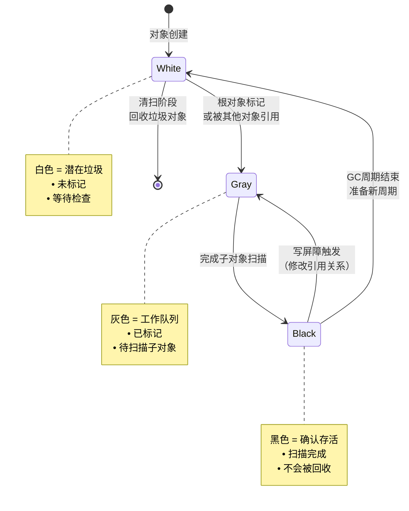
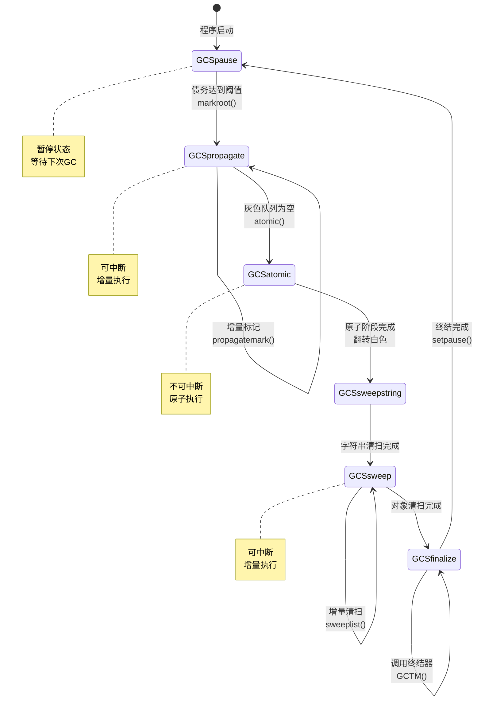

# Lua 5.1.5 三色标记算法完全解析

> **文档类型**: 技术深度分析 (Technical Deep Dive)  
> **难度级别**: ⭐⭐⭐⭐ (高级)  
> **预计阅读时间**: 45-60 分钟  
> **前置知识**: 
> - [GC模块概览](./wiki_gc.md)
> - 基础的图论知识（可达性分析）
> - C语言位操作
> - 数据结构（链表、队列）

---

## 📋 目录

- [1. 算法概述](#1-算法概述)
- [2. 三色抽象模型](#2-三色抽象模型)
- [3. 颜色的实现](#3-颜色的实现)
- [4. 标记过程详解](#4-标记过程详解)
- [5. 增量回收机制](#5-增量回收机制)
- [6. 写屏障技术](#6-写屏障技术)
- [7. 正确性证明](#7-正确性证明)
- [8. 性能分析](#8-性能分析)
- [9. 实战示例](#9-实战示例)
- [10. 常见问题](#10-常见问题)

---

## 1. 算法概述

### 1.1 什么是三色标记算法？

三色标记算法（Tri-Color Marking Algorithm）是一种经典的**垃圾回收追踪算法**，由 Dijkstra 等人在 1978 年提出。它通过将堆中的对象抽象为三种颜色，实现**增量式（Incremental）**和**并发式（Concurrent）**的垃圾回收。

#### 核心思想

```
┌─────────────────────────────────────────────────────────┐
│  垃圾回收 = 可达性分析 + 对象标记 + 内存回收               │
│                                                         │
│  问题：如何在不停止程序的情况下完成可达性分析？             │
│  答案：三色标记算法 + 增量执行 + 写屏障                    │
└─────────────────────────────────────────────────────────┘

传统标记-清除（Mark-Sweep）：
┌──────────┐      ┌──────────┐
│ 标记阶段  │ ───> │ 清除阶段  │
│ (STW)    │      │ (STW)    │
└──────────┘      └──────────┘
      ↑                ↑
  程序暂停          程序暂停
  
三色标记增量回收：
┌────┐ ┌────┐ ┌────┐ ┌────┐ ┌────┐
│标记1│ │执行│ │标记2│ │执行│ │清除│
└────┘ └────┘ └────┘ └────┘ └────┘
   ↑      ↑      ↑      ↑      ↑
 短暂暂停  运行  短暂暂停  运行  增量清除

优势：避免长时间停顿，提升程序响应性 ✅
```

### 1.2 为什么Lua选择三色标记？

#### 场景需求分析

```lua
-- Lua的典型应用场景特点

-- 场景1：游戏脚本
function game_loop()
    while running do
        update_game()   -- 必须在16.67ms内完成（60 FPS）
        render_scene()
        -- 不能容忍长时间GC暂停！❌
    end
end

-- 场景2：嵌入式脚本
function process_sensor_data()
    while true do
        local data = read_sensor()
        process(data)
        -- 实时性要求高，延迟敏感！⚠️
    end
end

-- 场景3：Web服务器
function handle_request(req)
    local response = process(req)
    return response
    -- 需要低延迟响应！⏱️
end
```

#### 算法对比

| 特性 | 引用计数 | 标记-清除 | 三色标记 | 分代GC |
|------|---------|----------|----------|--------|
| **停顿时间** | 分散 | 集中（长） | 增量（短） | 多数时候短 |
| **实现复杂度** | 简单 | 简单 | 中等 | 复杂 |
| **循环引用** | ❌ 无法处理 | ✅ 可处理 | ✅ 可处理 | ✅ 可处理 |
| **内存开销** | 高（计数器） | 低 | 中（颜色位） | 高（多代） |
| **吞吐量** | 高 | 中 | 中 | 高 |
| **适用场景** | 小规模 | 批处理 | **实时系统** | 长运行 |

**Lua选择三色标记的原因**：
1. ✅ 支持增量回收，停顿时间可控
2. ✅ 可处理循环引用
3. ✅ 实现复杂度适中
4. ✅ 内存开销低（仅3-4位标记）
5. ✅ 适合嵌入式和实时场景

### 1.3 算法的发展历程

```
1978年：Dijkstra提出三色标记算法（论文《On-the-Fly Garbage Collection》）
         ↓
1980s：  应用于多种语言运行时（Smalltalk、Lisp等）
         ↓
1990s：  改进增量和并发版本
         ↓
2004年： Lua 5.0引入增量GC
         ↓
2006年： Lua 5.1完善写屏障和弱引用支持 ← 本文档重点
         ↓
2011年： Lua 5.2引入紧急回收
         ↓
2015年： Lua 5.3引入分代回收（实验性）
```

2015年： Lua 5.3引入分代回收（实验性）
```

---

## 2. 三色抽象模型

### 2.1 颜色的语义

#### 白色（White）- 潜在垃圾

```c
/**
 * 白色对象的含义：
 * 
 * 1. 未被标记的对象
 * 2. 可能是垃圾（不可达）
 * 3. 在清扫阶段会被回收
 * 4. 特殊：Lua使用双色白（two-white）
 */

// 示例：白色对象的生命周期
┌──────────────────────────────────────────┐
│ 新对象创建                                │
│   ↓                                      │
│ 标记为当前白色（currentwhite）            │
│   ↓                                      │
│ GC标记阶段                                │
│   ├─→ 被标记 → 变为灰色 → 最终变黑 → 存活│
│   └─→ 未标记 → 保持白色 → 被回收         │
└──────────────────────────────────────────┘

// 双色白的作用
GC周期开始：
  当前白色 = WHITE0
  另一种白色 = WHITE1

新对象：标记为 WHITE0 ✅ （认为是活跃的）
旧对象：保持 WHITE1      （待检查）

GC结束后：
  交换白色：currentwhite = WHITE1
  
下个周期：
  新对象：标记为 WHITE1 ✅
  上个周期的对象：WHITE0 （待检查）

好处：无需遍历所有对象重置颜色！⚡
```

#### 灰色（Gray）- 待处理

```c
/**
 * 灰色对象的含义：
 * 
 * 1. 已被标记（确认可达）
 * 2. 但尚未扫描其引用的子对象
 * 3. 作为"边界"：已知可达，但子对象未知
 * 4. 保存在灰色队列中
 */

// 灰色对象在可达性图中的位置
根对象（黑色）
   ↓
   A（灰色）← 当前正在处理
   ↓     ↓
   B(黑) C(白)
   ↓
   D(白)

说明：
• A是灰色：已知可达，但子对象B、C未处理
• B是黑色：已完成扫描
• C、D是白色：尚未标记

处理A后：
• C变为灰色（被A引用）
• A变为黑色（完成扫描）
```

#### 黑色（Black）- 确认存活

```c
/**
 * 黑色对象的含义：
 * 
 * 1. 已完成标记和扫描
 * 2. 所有引用的子对象都已标记
 * 3. 在本次GC周期中不会被回收
 * 4. 关键约束：黑色对象不能直接引用白色对象
 */

// 黑色对象的不变式
┌────────────────────────────────────┐
│ 黑色对象的三色不变式                │
│                                    │
│ 强不变式：                         │
│   黑色 ×──→ 白色  （禁止）         │
│                                    │
│ 弱不变式：                         │
│   黑色 ──→ 灰色 ──→ 白色  （允许）│
└────────────────────────────────────┘

违反不变式的后果：
黑色 ──→ 白色
  ↑        ↑
已完成扫描  可能被回收

结果：存活对象被错误回收！💥
解决：写屏障（Write Barrier）
```

### 2.2 颜色状态机



### 2.3 可达性图的演化

#### 初始状态

```
GC周期开始，所有对象为白色：

Root(根)
  ⊙ (白)
  ↓
  A ○ (白)
  ↓  ↓
  B○ C○ (白)
  ↓
  D○ (白)

E○ (白) ← 不可达对象
```

#### 标记根对象

```
标记根对象为灰色：

Root
  ⊙ (灰) ← 加入灰色队列
  ↓
  A ○ (白)
  ↓  ↓
  B○ C○ (白)
  ↓
  D○ (白)

E○ (白)
```

#### 传播阶段 - 步骤1

```
处理Root，标记其子对象A：

Root
  ⊙ (黑) ← 扫描完成
  ↓
  A ⊙ (灰) ← 加入灰色队列
  ↓  ↓
  B○ C○ (白)
  ↓
  D○ (白)

E○ (白)
```

#### 传播阶段 - 步骤2

```
处理A，标记其子对象B和C：

Root
  ⊙ (黑)
  ↓
  A ⊙ (黑) ← 扫描完成
  ↓  ↓
  B⊙ C⊙ (灰) ← 加入灰色队列
  ↓
  D○ (白)

E○ (白)
```

#### 传播阶段 - 步骤3

```
处理B，标记其子对象D：

Root
  ⊙ (黑)
  ↓
  A ⊙ (黑)
  ↓  ↓
  B⊙ C⊙ (黑/灰)
  ↓
  D⊙ (灰) ← 加入灰色队列

E○ (白)
```

#### 标记完成

```
所有灰色对象处理完毕：

Root
  ⊙ (黑)
  ↓
  A ⊙ (黑)
  ↓  ↓
  B⊙ C⊙ (黑)
  ↓
  D⊙ (黑)

E○ (白) ← 仍为白色，确认为垃圾
```

#### 清扫阶段

```
回收白色对象：

Root
  ⊙ (白) ← 准备新周期
  ↓
  A ○ (白)
  ↓  ↓
  B○ C○ (白)
  ↓
  D○ (白)

E ✗ (已回收)
```

### 2.4 三色不变式

#### 强三色不变式（Strong Tri-Color Invariant）

```c
/**
 * 定义：黑色对象不能直接引用白色对象
 * 
 * 形式化：
 *   ∀ black_obj, white_obj:
 *     ¬(black_obj → white_obj)
 */

// 维护方式：向前屏障（Forward Barrier）
void forward_barrier(black_obj, white_obj) {
    // 将白色对象标记为灰色
    white_obj.color = GRAY;
    add_to_gray_queue(white_obj);
}

// 示例
Black ──→ White   ❌ 违反不变式
       ↓
    [写屏障]
       ↓
Black ──→ Gray    ✅ 满足不变式
```

#### 弱三色不变式（Weak Tri-Color Invariant）

```c
/**
 * 定义：所有黑色对象到白色对象的路径都必须经过至少一个灰色对象
 * 
 * 形式化：
 *   ∀ path(black_obj → ... → white_obj):
 *     ∃ gray_obj ∈ path
 */

// 维护方式：向后屏障（Backward Barrier）
void backward_barrier(black_obj) {
    // 将黑色对象退回灰色
    black_obj.color = GRAY;
    add_to_grayagain_queue(black_obj);
}

// 示例
Black ──→ White   ❌ 违反不变式
  ↓
[写屏障]
  ↓
Gray ──→ White    ✅ 满足不变式（经过灰色）
```

#### 两种不变式的对比

| 特性 | 强不变式 | 弱不变式 |
|------|---------|---------|
| **约束** | 黑色→白色 禁止 | 黑色→灰色→白色 允许 |
| **实现** | 向前屏障 | 向后屏障 |
| **操作** | 标记白色对象 | 退回黑色对象 |
| **开销** | 立即标记 | 重新扫描 |
| **适用** | 不可变对象 | 频繁修改的对象 |
| **Lua选择** | Upvalue | Table（主要） |

---

## 3. 颜色的实现

### 3.1 位标记方案

#### 标记位定义

```c
// lgc.h - GC颜色位定义

#define WHITE0BIT       0  // 白色0标志位
#define WHITE1BIT       1  // 白色1标志位
#define BLACKBIT        2  // 黑色标志位
#define FINALIZEDBIT    3  // 已终结位（用于终结器）

// 位掩码宏
#define bitmask(b)      (1<<(b))
#define bit2mask(b1,b2) (bitmask(b1) | bitmask(b2))

// 白色掩码（两个白色位）
#define WHITEBITS       bit2mask(WHITE0BIT, WHITE1BIT)
// 展开：WHITEBITS = (1<<0) | (1<<1) = 0x03

/**
 * 标记字节（marked）的位布局：
 * 
 * 7 6 5 4 3 2 1 0
 * +-+-+-+-+-+-+-+-+
 * | | | | |F|B|1|0|
 * +-+-+-+-+-+-+-+-+
 *         │ │ │ └─ WHITE0BIT (bit 0)
 *         │ │ └─── WHITE1BIT (bit 1)
 *         │ └───── BLACKBIT   (bit 2)
 *         └─────── FINALIZEDBIT (bit 3)
 * 
 * 颜色编码：
 * - 白色0：marked = 0x01 (0b00000001)
 * - 白色1：marked = 0x02 (0b00000010)
 * - 灰色：  marked = 0x00 (0b00000000)
 * - 黑色：  marked = 0x04 (0b00000100)
 */
```

#### 颜色判断宏

```c
// lgc.h - 颜色判断

// 测试单个位
#define testbit(x,b)    ((x) & bitmask(b))

// 测试两个位（至少一个为1）
#define test2bits(x,b1,b2) ((x) & bit2mask(b1,b2))

// 重置两个位
#define reset2bits(x,b1,b2) ((x) &= ~bit2mask(b1,b2))

// 设置位
#define l_setbit(x,b)   ((x) |= bitmask(b))

// 重置位
#define resetbit(x,b)   ((x) &= ~bitmask(b))

/**
 * 颜色判断
 */

// 是否为白色（WHITE0或WHITE1任一为1）
#define iswhite(x) \
    test2bits((x)->gch.marked, WHITE0BIT, WHITE1BIT)
// 如果marked & 0x03 != 0，则为白色

// 是否为黑色（BLACKBIT为1）
#define isblack(x) \
    testbit((x)->gch.marked, BLACKBIT)
// 如果marked & 0x04 != 0，则为黑色

// 是否为灰色（既不是白色也不是黑色）
#define isgray(x) \
    (!isblack(x) && !iswhite(x))
// marked == 0x00 时为灰色

/**
 * 示例：
 * 
 * GCObject obj;
 * obj.marked = 0x01;  // 白色0
 * iswhite(&obj) → true
 * isblack(&obj) → false
 * isgray(&obj)  → false
 * 
 * obj.marked = 0x00;  // 灰色
 * iswhite(&obj) → false
 * isblack(&obj) → false
 * isgray(&obj)  → true
 * 
 * obj.marked = 0x04;  // 黑色
 * iswhite(&obj) → false
 * isblack(&obj) → true
 * isgray(&obj)  → false
 */
```

#### 颜色转换宏

```c
// lgc.h - 颜色转换

/**
 * 白色 → 灰色
 */
#define white2gray(x) \
    reset2bits((x)->gch.marked, WHITE0BIT, WHITE1BIT)
// 清除WHITE0和WHITE1位
// 例：0x01 → 0x00（白色0 → 灰色）

/**
 * 灰色 → 黑色
 */
#define gray2black(x) \
    l_setbit((x)->gch.marked, BLACKBIT)
// 设置BLACKBIT
// 例：0x00 → 0x04（灰色 → 黑色）

/**
 * 黑色 → 灰色（写屏障用）
 */
#define black2gray(x) \
    resetbit((x)->gch.marked, BLACKBIT)
// 清除BLACKBIT
// 例：0x04 → 0x00（黑色 → 灰色）

/**
 * 完整的颜色转换流程示例：
 */
void demonstrate_color_transitions() {
    GCObject obj;
    
    // 1. 新对象创建：白色
    obj.marked = luaC_white(g);  // 0x01 或 0x02
    printf("新对象: 0x%02x (白色)\n", obj.marked);
    
    // 2. 被标记：白色 → 灰色
    white2gray(&obj);
    printf("标记后: 0x%02x (灰色)\n", obj.marked);  // 0x00
    
    // 3. 扫描完成：灰色 → 黑色
    gray2black(&obj);
    printf("扫描后: 0x%02x (黑色)\n", obj.marked);  // 0x04
    
    // 4. 写屏障：黑色 → 灰色
    black2gray(&obj);
    printf("屏障后: 0x%02x (灰色)\n", obj.marked);  // 0x00
}
```

### 3.2 双色白技术

#### 当前白色管理

```c
// lstate.h - global_State中的当前白色
typedef struct global_State {
    lu_byte currentwhite;  // 当前白色（WHITE0BIT 或 WHITE1BIT）
    lu_byte otherwhite;    // 另一种白色（用于加速）
    // ...
} global_State;

/**
 * 当前白色计算
 */

// 获取当前白色掩码
#define luaC_white(g) \
    cast(lu_byte, (g)->currentwhite & WHITEBITS)
// 只保留WHITE0BIT和WHITE1BIT

// 获取另一种白色
#define otherwhite(g) \
    (g->currentwhite ^ WHITEBITS)
// 异或操作翻转两个白色位
// 例：WHITE0 (0x01) ^ 0x03 = WHITE1 (0x02)

/**
 * 白色交换（GC周期结束时）
 */
void swap_white(global_State *g) {
    // 简单的异或操作
    g->currentwhite ^= WHITEBITS;
    
    // 结果：
    // 如果当前是WHITE0 (0x01)：
    //   0x01 ^ 0x03 = 0x02 (WHITE1)
    // 如果当前是WHITE1 (0x02)：
    //   0x02 ^ 0x03 = 0x01 (WHITE0)
}

/**
 * 示例：两个GC周期的白色变化
 */
void demonstrate_two_white() {
    global_State g;
    
    // ===== 第1个GC周期 =====
    g.currentwhite = WHITE0BIT;  // 当前白色 = 0x01
    
    printf("=== GC周期1 ===\n");
    printf("当前白色: WHITE0 (0x%02x)\n", 
        luaC_white(&g));  // 0x01
    printf("另一白色: WHITE1 (0x%02x)\n", 
        otherwhite(&g));  // 0x02
    
    // 新对象使用WHITE0
    GCObject* obj1 = create_object();
    obj1->marked = luaC_white(&g);  // 0x01
    
    // GC标记阶段：WHITE1对象未被标记
    // GC清扫阶段：回收WHITE1对象
    
    // ===== 周期结束：交换白色 =====
    g.currentwhite ^= WHITEBITS;
    
    // ===== 第2个GC周期 =====
    printf("\n=== GC周期2 ===\n");
    printf("当前白色: WHITE1 (0x%02x)\n", 
        luaC_white(&g));  // 0x02
    printf("另一白色: WHITE0 (0x%02x)\n", 
        otherwhite(&g));  // 0x01
    
    // 新对象使用WHITE1
    GCObject* obj2 = create_object();
    obj2->marked = luaC_white(&g);  // 0x02
    
    // 上个周期存活的obj1现在是WHITE0（另一种白色）
    // 如果未被标记，将被回收
}
```

#### 双色白的优势

```c
/**
 * 为什么需要两种白色？
 * 
 * 传统方案：单一白色
 */
void traditional_gc_cycle() {
    // GC开始
    for_each_object(obj) {
        obj->color = WHITE;  // 重置所有对象为白色 ❌ O(n)
    }
    
    // 标记阶段
    mark_from_roots();
    
    // 清扫阶段
    sweep();
}

/**
 * Lua方案：双色白
 */
void lua_gc_cycle(global_State *g) {
    // GC开始：无需重置！✅ O(1)
    // 只需交换白色
    g->currentwhite ^= WHITEBITS;
    
    // 新对象自动使用新白色
    // 旧对象保持旧白色
    
    // 标记阶段
    mark_from_roots();
    
    // 清扫阶段：回收旧白色对象
    sweep(g);
}

/**
 * 性能对比：
 * 
 * 场景：100万个对象
 * 
 * 传统方案：
 *   重置颜色：100万次写操作
 *   缓存污染：大量内存访问
 *   耗时：~10ms
 * 
 * 双色白方案：
 *   交换白色：1次异或操作
 *   无内存访问
 *   耗时：~0.001ms
 * 
 * 提升：10000倍！⚡
 */
```

### 3.3 灰色队列管理

#### 队列结构

```c
// lstate.h - 全局状态中的灰色队列
typedef struct global_State {
    GCObject *gray;       // 灰色对象列表
    GCObject *grayagain;  // 需要原子阶段重新扫描的灰色对象
    GCObject *weak;       // 弱引用表列表
    // ...
} global_State;

/**
 * 三个队列的用途：
 * 
 * 1. gray：普通灰色对象队列
 *    - 包含：Table、Closure、Userdata等
 *    - 特点：在传播阶段增量处理
 *    - 处理时机：GCSpropagate阶段
 * 
 * 2. grayagain：需要重新扫描的对象
 *    - 包含：打开的Upvalue、被写屏障退回的对象
 *    - 特点：可能在标记期间被修改
 *    - 处理时机：GCSatomic原子阶段
 * 
 * 3. weak：弱引用表
 *    - 包含：设置了__mode的表
 *    - 特点：需要在原子阶段清理
 *    - 处理时机：GCSatomic原子阶段
 */

/**
 * 队列操作
 */

// 将对象加入gray队列
void linkgclist(GCObject *obj, GCObject **list) {
    obj->gch.gclist = *list;
    *list = obj;
}

// 从gray队列取出一个对象
GCObject *get_from_gray(global_State *g) {
    GCObject *obj = g->gray;
    if (obj) {
        g->gray = obj->gch.gclist;
    }
    return obj;
}

// 将对象加入grayagain队列（写屏障用）
void mark_grayagain(GCObject *obj, global_State *g) {
    black2gray(obj);  // 黑色 → 灰色
    obj->gch.gclist = g->grayagain;
    g->grayagain = obj;
}
```

#### 队列处理流程

```c
/**
 * GC标记阶段的队列处理
 */

void gc_mark_phase(lua_State *L) {
    global_State *g = G(L);
    
    // ===== 阶段1：标记根对象 =====
    markroot(L);
    // 将根对象加入gray队列
    
    // ===== 阶段2：传播标记（增量） =====
    while (g->gray != NULL) {
        // 取出一个灰色对象
        GCObject *obj = g->gray;
        g->gray = obj->gch.gclist;
        
        // 扫描该对象，标记其子对象
        propagatemark(g, obj);
        
        // 对象变为黑色
        gray2black(obj);
        
        // 可以在这里暂停，返回程序执行 ⏸️
        if (should_pause()) {
            return;  // 增量执行
        }
    }
    
    // ===== 阶段3：原子阶段 =====
    // 处理grayagain队列（不可暂停）
    while (g->grayagain != NULL) {
        GCObject *obj = g->grayagain;
        g->grayagain = obj->gch.gclist;
        
        propagatemark(g, obj);
        gray2black(obj);
    }
    
    // 处理弱引用表
    while (g->weak != NULL) {
        Table *h = gco2h(g->weak);
        g->weak = h->gclist;
        
        cleartable(h);  // 清理白色键/值
    }
}

/**
 * 队列状态变化示例：
 */
void demonstrate_queue_evolution() {
    // 初始状态
    gray     = NULL
    grayagain = NULL
    weak     = NULL
    
    // 标记根对象后
    gray     = [Root] → NULL
    grayagain = NULL
    weak     = NULL
    
    // 处理Root后
    gray     = [A, B] → NULL  // A和B被Root引用
    grayagain = NULL
    weak     = NULL
    
    // 处理A后（A是一个表，且有弱引用）
    gray     = [B, C] → NULL  // C被A引用
    grayagain = NULL
    weak     = [A] → NULL     // A加入弱引用队列
    
    // 写屏障触发（B被修改）
    gray     = [C] → NULL
    grayagain = [B] → NULL    // B退回grayagain
    weak     = [A] → NULL
    
    // 传播阶段结束
    gray     = NULL           // 全部处理完
    grayagain = [B] → NULL
    weak     = [A] → NULL
    
    // 原子阶段：处理grayagain和weak
    // ...
}
```


    // 原子阶段：处理grayagain和weak
    // ...
}
```

---

## 4. 标记过程详解

### 4.1 标记根对象

#### 根对象的定义

```c
/**
 * 什么是根对象（Root Objects）？
 * 
 * 根对象是GC可达性分析的起点，它们总是被认为是"活跃的"。
 * 
 * Lua中的根对象包括：
 * 1. 主线程（main thread）
 * 2. 全局注册表（global registry）
 * 3. 全局元表（metatables for basic types）
 * 4. 主线程的环境表（main thread's environment）
 * 5. 所有运行中的线程（active threads）
 */

// lgc.c - 标记根对象
static void markroot(lua_State *L) {
    global_State *g = G(L);
    
    // 1. 标记主线程
    g->gray = NULL;
    g->grayagain = NULL;
    g->weak = NULL;
    
    // 标记主线程对象本身
    markobject(g, g->mainthread);
    
    // 2. 标记全局注册表
    markvalue(g, &g->l_registry);
    
    // 3. 标记所有基础类型的元表
    for (i = 0; i < NUM_TAGS; i++) {
        markobject(g, g->mt[i]);
    }
    
    // 4. 标记所有字符串（固定字符串）
    markobject(g, g->strt.hash);
    
    // 5. 遍历所有活跃线程
    for (th = g->mainthread; th != NULL; th = th->next) {
        markobject(g, th);
    }
}

/**
 * 标记单个对象
 */
static void reallymarkobject(global_State *g, GCObject *o) {
    lua_assert(iswhite(o));  // 确保对象是白色
    
    // 白色 → 灰色
    white2gray(o);
    
    switch (o->gch.tt) {
        case LUA_TSTRING: {
            // 字符串无引用，直接变黑色
            gray2black(o);
            break;
        }
        
        case LUA_TUSERDATA: {
            // Userdata：标记元表和环境表
            Table *mt = gco2u(o)->metatable;
            gray2black(o);  // 先变黑
            if (mt) markobject(g, mt);
            markobject(g, gco2u(o)->env);
            break;
        }
        
        case LUA_TUPVAL: {
            // Upvalue：标记值
            UpVal *uv = gco2uv(o);
            markvalue(g, uv->v);
            
            if (uv->v == &uv->u.value) {
                // 已关闭的Upvalue：直接变黑
                gray2black(o);
            } else {
                // 打开的Upvalue：加入grayagain
                markobject(g, gcvalue(uv->v));
                o->gch.gclist = g->grayagain;
                g->grayagain = o;
            }
            break;
        }
        
        case LUA_TFUNCTION: {
            // 闭包：加入gray队列
            gco2cl(o)->c.gclist = g->gray;
            g->gray = o;
            break;
        }
        
        case LUA_TTABLE: {
            // 表：加入gray队列或weak队列
            Table *h = gco2h(o);
            
            if (h->metatable) {
                // 检查是否为弱引用表
                const TValue *mode = gfasttm(g, h->metatable, 
                                            TM_MODE);
                if (mode && ttisstring(mode)) {
                    // 弱引用表：加入weak队列
                    h->gclist = g->weak;
                    g->weak = o;
                    gray2black(o);  // 暂时标记为黑色
                    break;
                }
            }
            
            // 普通表：加入gray队列
            h->gclist = g->gray;
            g->gray = o;
            break;
        }
        
        case LUA_TTHREAD: {
            // 线程：加入gray队列
            gco2th(o)->gclist = g->gray;
            g->gray = o;
            break;
        }
        
        case LUA_TPROTO: {
            // 函数原型：加入gray队列
            gco2p(o)->gclist = g->gray;
            g->gray = o;
            break;
        }
        
        default: lua_assert(0);
    }
}

/**
 * 标记流程示例
 */
void demonstrate_marking() {
    // 初始状态：所有对象白色
    Root○ A○ B○ C○ D○ E○
    
    // 调用markroot()
    markroot(L);
    
    // Root变为灰色，加入gray队列
    Root⊙ A○ B○ C○ D○ E○
    gray = [Root]
    
    // markroot()继续标记全局对象
    // 假设A和B是全局变量
    Root⊙ A⊙ B⊙ C○ D○ E○
    gray = [Root, A, B]
}
```

### 4.2 传播标记

#### 对象扫描

```c
// lgc.c - 传播标记
static l_mem propagatemark(global_State *g) {
    GCObject *o = g->gray;  // 取出一个灰色对象
    
    lua_assert(isgray(o));
    
    // 从gray队列移除
    g->gray = o->gch.gclist;
    
    // 根据对象类型扫描
    switch (o->gch.tt) {
        case LUA_TTABLE: {
            Table *h = gco2h(o);
            int weakkey = 0, weakvalue = 0;
            
            // 1. 标记元表
            if (h->metatable)
                markobject(g, h->metatable);
            
            // 2. 检查是否为弱引用表
            if (h->metatable) {
                const TValue *mode = gfasttm(g, h->metatable, TM_MODE);
                if (mode && ttisstring(mode)) {
                    const char *modestr = svalue(mode);
                    weakkey = (strchr(modestr, 'k') != NULL);
                    weakvalue = (strchr(modestr, 'v') != NULL);
                    
                    if (weakkey || weakvalue) {
                        // 弱引用表：加入weak队列，稍后处理
                        h->gclist = g->weak;
                        g->weak = (GCObject *)h;
                        gray2black(o);
                        return sizeof(Table);
                    }
                }
            }
            
            // 3. 标记数组部分
            for (i = 0; i < h->sizearray; i++) {
                markvalue(g, &h->array[i]);
            }
            
            // 4. 标记哈希部分
            for (i = 0; i < sizenode(h); i++) {
                Node *n = gnode(h, i);
                lua_assert(ttype(gkey(n)) != LUA_TDEADKEY || 
                          ttisnil(gval(n)));
                
                if (ttisnil(gval(n)))
                    continue;  // 空节点跳过
                
                lua_assert(!ttisnil(gkey(n)));
                markvalue(g, gkey(n));  // 标记键
                markvalue(g, gval(n));  // 标记值
            }
            
            // 标记完成，变黑色
            gray2black(o);
            return sizeof(Table) + sizeof(Node) * sizenode(h) +
                   sizeof(TValue) * h->sizearray;
        }
        
        case LUA_TFUNCTION: {
            Closure *cl = gco2cl(o);
            
            // 标记所有Upvalue
            for (i = 0; i < cl->l.nupvalues; i++)
                markobject(g, cl->l.upvals[i]);
            
            // 标记函数原型
            markobject(g, cl->l.p);
            
            // 标记环境表
            markobject(g, cl->l.env);
            
            gray2black(o);
            return sizeof(Closure) + 
                   sizeof(TValue *) * cl->l.nupvalues;
        }
        
        case LUA_TTHREAD: {
            lua_State *th = gco2th(o);
            
            // 1. 标记线程栈
            for (StkId o = th->stack; o < th->top; o++)
                markvalue(g, o);
            
            // 2. 标记调用信息
            for (ci = th->base_ci; ci <= th->ci; ci++) {
                lua_assert(ci->top <= th->stack_last);
                if (ci->func)
                    markvalue(g, ci->func);
            }
            
            // 3. 标记环境表
            markvalue(g, gt(th));
            
            // 4. 标记打开的Upvalue
            for (up = th->openupval; up != NULL; up = up->next)
                markobject(g, up);
            
            gray2black(o);
            return sizeof(lua_State) + 
                   sizeof(TValue) * th->stacksize +
                   sizeof(CallInfo) * th->size_ci;
        }
        
        case LUA_TPROTO: {
            Proto *p = gco2p(o);
            
            // 1. 标记常量
            for (i = 0; i < p->sizek; i++)
                markvalue(g, &p->k[i]);
            
            // 2. 标记Upvalue名
            for (i = 0; i < p->sizeupvalues; i++)
                markobject(g, p->upvalues[i]);
            
            // 3. 标记内嵌函数原型
            for (i = 0; i < p->sizep; i++)
                markobject(g, p->p[i]);
            
            // 4. 标记局部变量名
            for (i = 0; i < p->sizelocvars; i++)
                markobject(g, p->locvars[i].varname);
            
            // 5. 标记源文件名
            markobject(g, p->source);
            
            gray2black(o);
            return sizeof(Proto) + 
                   sizeof(Instruction) * p->sizecode +
                   sizeof(TValue) * p->sizek +
                   sizeof(Proto *) * p->sizep;
        }
        
        default: lua_assert(0); return 0;
    }
}

/**
 * 传播过程示例
 */
void demonstrate_propagation() {
    // 初始状态
    gray = [Root, A, B]
    
    // 处理Root（假设Root引用A和C）
    GCObject *root = get_from_gray();
    propagatemark(g, root);
    // Root扫描后：
    // - A已在gray中，不重复加入
    // - C变为灰色，加入gray
    
    gray = [A, B, C]
    Root⊙ → ⊙  // Root变黑色
    
    // 处理A（假设A引用D）
    GCObject *a = get_from_gray();
    propagatemark(g, a);
    
    gray = [B, C, D]
    A⊙ → ⊙  // A变黑色
    
    // 依次处理B、C、D...
}
```

### 4.3 原子阶段

#### 原子阶段的必要性

```c
/**
 * 为什么需要原子阶段？
 * 
 * 问题：增量标记期间，程序可能修改对象引用关系
 * 
 * 场景：
 * 1. 黑色对象被修改，指向白色对象
 * 2. 打开的Upvalue可能被修改
 * 3. 弱引用表需要特殊处理
 * 
 * 解决：原子阶段不可中断地完成以下工作：
 * 1. 重新扫描grayagain队列中的对象
 * 2. 清理弱引用表
 * 3. 分离终结器对象
 * 4. 准备清扫阶段
 */

// lgc.c - 原子阶段
static void atomic(lua_State *L) {
    global_State *g = G(L);
    size_t udsize;
    
    // 1. 标记所有其他线程的栈
    // （主线程已在markroot中标记）
    lua_State *th;
    for (th = g->mainthread->next; th != NULL; th = th->next) {
        markobject(g, th);
        // 强制立即扫描线程
        propagatemark(g);
    }
    
    // 2. 再次标记根对象
    // （可能有新创建的根对象）
    markmt(g);
    
    // 3. 传播所有剩余的灰色对象
    // （确保gray队列为空）
    propagateall(g);
    
    // 4. 处理grayagain队列
    // （被写屏障退回的对象）
    g->gray = g->grayagain;
    g->grayagain = NULL;
    propagateall(g);
    
    // 5. 清理字符串哈希表中的白色字符串
    // （但不释放内存，仅标记为dead）
    sweepstrings(g);
    
    // 6. 处理弱引用表
    // （移除白色的键或值）
    while (g->weak != NULL) {
        Table *h = gco2h(g->weak);
        g->weak = h->gclist;
        
        // 清理表
        cleartable(h);
        
        // 如果表本身变为白色，需要再次标记
        if (iswhite(obj2gco(h)))
            reallymarkobject(g, obj2gco(h));
    }
    
    // 7. 分离有终结器的对象
    // （白色且有__gc的userdata）
    separatetobefnz(g);
    
    // 8. 翻转白色
    // （准备清扫阶段）
    g->currentwhite = cast_byte(otherwhite(g));
    g->sweepstrgc = 0;
    g->sweepgc = &g->rootgc;
    g->gcstate = GCSsweepstring;
    
    // 9. 收缩字符串哈希表（如果需要）
    if (g->strt.nuse < cast(lu_int32, g->strt.size/4) &&
        g->strt.size > MINSTRTABSIZE*2)
        luaS_resize(L, g->strt.size/2);
}

/**
 * 辅助函数
 */

// 传播所有灰色对象
static void propagateall(global_State *g) {
    while (g->gray != NULL) {
        propagatemark(g);
    }
}

// 清理弱引用表
static void cleartable(Table *h) {
    const TValue *mode = gfasttm(g, h->metatable, TM_MODE);
    if (mode == NULL) return;
    
    const char *modestr = svalue(mode);
    int weakkey = (strchr(modestr, 'k') != NULL);
    int weakvalue = (strchr(modestr, 'v') != NULL);
    
    // 清理数组部分
    if (weakvalue) {
        for (i = 0; i < h->sizearray; i++) {
            TValue *o = &h->array[i];
            if (iswhite(gcvalue(o)))
                setnilvalue(o);  // 移除白色值
        }
    }
    
    // 清理哈希部分
    for (i = 0; i < sizenode(h); i++) {
        Node *n = gnode(h, i);
        
        if (ttisnil(gval(n)))
            continue;
        
        // 检查键
        if (weakkey && iswhite(gcvalue(gkey(n)))) {
            setnilvalue(gval(n));  // 移除整个键值对
            continue;
        }
        
        // 检查值
        if (weakvalue && iswhite(gcvalue(gval(n)))) {
            setnilvalue(gval(n));  // 移除值
        }
    }
}

/**
 * 原子阶段示例
 */
void demonstrate_atomic() {
    // 传播阶段结束
    gray = []  // 空
    grayagain = [B, C]  // 被写屏障退回的对象
    weak = [WeakTable]
    
    // 原子阶段开始（不可中断）
    
    // 步骤1：处理grayagain
    gray = [B, C]
    grayagain = []
    
    propagateall();
    
    // 步骤2：处理弱引用表
    cleartable(WeakTable);
    // 假设WeakTable中有：
    // {[obj1] = val1, [obj2] = val2}
    // obj1是白色 → 移除
    // obj2是黑色 → 保留
    
    // 步骤3：翻转白色
    currentwhite = WHITE1 → WHITE0
    
    // 步骤4：准备清扫
    gcstate = GCSsweepstring
}
```

### 4.4 清扫阶段

#### 增量清扫

```c
// lgc.c - 清扫对象链表
static GCObject **sweeplist(lua_State *L, GCObject **p, lu_mem count) {
    GCObject *curr;
    global_State *g = G(L);
    int deadmask = otherwhite(g);  // 要回收的白色
    
    while ((curr = *p) != NULL && count-- > 0) {
        if (curr->gch.tt == LUA_TTHREAD)  // 线程需要额外处理
            sweepthread(L, gco2th(curr));
        
        if ((curr->gch.marked ^ WHITEBITS) & deadmask) {
            // 对象是当前白色（新对象）或黑色（存活对象）
            lua_assert(!isdead(g, curr));
            makewhite(g, curr);  // 重置为当前白色
            p = &curr->gch.next;
        }
        else {  
            // 对象是旧白色（垃圾对象）
            lua_assert(isdead(g, curr));
            *p = curr->gch.next;
            
            // 如果有终结器，调用
            if (curr->gch.tt == LUA_TUSERDATA && 
                curr->gch.marked & FINALIZEDBIT)
                markfinalizer(g, curr);
            else
                freeobj(L, curr);  // 释放内存
        }
    }
    
    return p;
}

/**
 * 清扫字符串表
 */
static void sweepstrings(global_State *g, int all) {
    int i;
    for (i = g->sweepstrgc; i < g->strt.size; i++) {
        GCObject **p = &g->strt.hash[i];
        GCObject *curr;
        
        while ((curr = *p) != NULL) {
            if ((curr->gch.marked ^ WHITEBITS) & otherwhite(g)) {
                // 存活字符串
                makewhite(g, curr);
                p = &curr->gch.next;
            }
            else {
                // 垃圾字符串
                *p = curr->gch.next;
                G(L)->strt.nuse--;
                freeobj(L, curr);
            }
        }
    }
    
    g->sweepstrgc = (all) ? g->strt.size : i;
}

/**
 * 清扫流程
 */
void gc_sweep_phase(lua_State *L) {
    global_State *g = G(L);
    
    switch (g->gcstate) {
        case GCSsweepstring: {
            // 清扫字符串表（增量）
            lu_mem old = g->totalbytes;
            sweepwholelist(L, &g->strt.hash[g->sweepstrgc++]);
            
            if (g->sweepstrgc >= g->strt.size) {
                // 字符串清扫完成
                g->gcstate = GCSsweep;
            }
            
            g->estimate -= old - g->totalbytes;
            return GCSWEEPCOST;
        }
        
        case GCSsweep: {
            // 清扫普通对象（增量）
            lu_mem old = g->totalbytes;
            g->sweepgc = sweeplist(L, g->sweepgc, GCSWEEPMAX);
            
            if (*g->sweepgc == NULL) {
                // 清扫完成，进入终结阶段
                checkSizes(L);
                g->gcstate = GCSfinalize;
            }
            
            g->estimate -= old - g->totalbytes;
            return GCSWEEPCOST;
        }
        
        case GCSfinalize: {
            // 调用终结器
            if (g->tmudata != NULL) {
                GCTM(L);
                
                // 如果还有待终结对象，继续
                if (g->estimate > GCFINALIZECOST)
                    g->estimate -= GCFINALIZECOST;
                return GCFINALIZECOST;
            }
            else {
                // 完成GC周期
                g->gcstate = GCSpause;
                g->debt = 0;
                return 0;
            }
        }
    }
}

/**
 * 清扫示例
 */
void demonstrate_sweep() {
    // 原子阶段结束后
    // currentwhite = WHITE0
    // otherwhite = WHITE1
    
    // 对象状态：
    A: WHITE0 (当前白色，新对象)
    B: BLACK  (黑色，存活对象)
    C: WHITE1 (旧白色，垃圾对象)
    D: WHITE0 (当前白色，新对象)
    E: WHITE1 (旧白色，垃圾对象)
    
    // 清扫过程：
    sweeplist(...);
    
    // 检查A：WHITE0 → 保留，重置为WHITE0
    // 检查B：BLACK → 保留，重置为WHITE0
    // 检查C：WHITE1 → 回收！
    // 检查D：WHITE0 → 保留，重置为WHITE0
    // 检查E：WHITE1 → 回收！
    
    // 清扫后：
    A: WHITE0
    B: WHITE0 (从BLACK重置)
    C: ✗ (已释放)
    D: WHITE0
    E: ✗ (已释放)
}
```

---

## 5. 增量回收机制

### 5.1 增量执行的原理

#### 工作量控制

```c
/**
 * GC的增量执行
 * 
 * 核心思想：将GC工作分散到多个小步骤中，
 *          每个步骤只处理少量对象，
 *          避免长时间停顿。
 */

// lgc.c - 单步GC
void luaC_step(lua_State *L) {
    global_State *g = G(L);
    
    // 计算本次步进的工作量
    // GCSTEPSIZE = 1024 (1KB)
    // gcstepmul默认= 200
    lu_mem lim = (GCSTEPSIZE/100) * g->gcstepmul;
    // lim = 10.24 * 200 = 2048 字节
    
    // 累积债务（debt）
    g->GCdebt += g->GCstepmul;
    
    // 根据GC状态执行相应工作
    do {
        lu_mem work = singlestep(L);
        g->GCdebt -= work;
    } while (g->GCdebt > 0 && g->gcstate != GCSpause);
    
    // 如果GC周期完成，设置新阈值
    if (g->gcstate == GCSpause) {
        setpause(g, g->totalbytes);
    }
}

/**
 * 单步执行
 */
static lu_mem singlestep(lua_State *L) {
    global_State *g = G(L);
    
    switch (g->gcstate) {
        case GCSpause: {
            // 开始新的GC周期
            markroot(L);
            g->gcstate = GCSpropagate;
            return GCPAUSECOST;
        }
        
        case GCSpropagate: {
            // 传播标记（增量）
            if (g->gray != NULL) {
                return propagatemark(g);
            }
            else {
                // 灰色队列为空，进入原子阶段
                atomic(L);
                return GCATOMICCOST;
            }
        }
        
        case GCSsweepstring:
        case GCSsweep:
        case GCSfinalize: {
            // 清扫阶段（增量）
            return sweepstep(L);
        }
        
        default: lua_assert(0); return 0;
    }
}
```

#### 债务机制

```c
/**
 * GC债务（GCdebt）机制
 * 
 * 目的：控制GC的触发时机和执行频率
 * 
 * 工作原理：
 * 1. 程序分配内存 → 增加债务
 * 2. 债务达到阈值 → 触发GC步进
 * 3. 执行GC工作 → 减少债务
 * 4. 债务清零 → 等待下次触发
 */

// lmem.c - 内存分配
void *luaM_realloc_(lua_State *L, void *block, 
                   size_t osize, size_t nsize) {
    global_State *g = G(L);
    
    // 计算内存变化
    size_t realosize = (block) ? osize : 0;
    lu_mem delta = nsize - realosize;
    
    // 更新总内存
    g->totalbytes += delta;
    
    // 增加债务
    g->GCdebt += delta;
    
    // 检查是否需要触发GC
    if (g->GCdebt > 0) {
        luaC_step(L);  // 执行一步GC
    }
    
    // 实际分配内存
    void *newblock = (*g->frealloc)(g->ud, block, osize, nsize);
    
    if (newblock == NULL && nsize > 0) {
        // 分配失败，尝试紧急GC
        lua_assert(nsize > realosize);
        luaC_fullgc(L, 1);  // 完整GC
        newblock = (*g->frealloc)(g->ud, block, osize, nsize);
        if (newblock == NULL)
            luaD_throw(L, LUA_ERRMEM);
    }
    
    return newblock;
}

/**
 * GC阈值设置
 */
static void setpause(global_State *g, lu_mem estimate) {
    lu_mem threshold = (estimate / 100) * g->gcpause;
    
    g->GCthreshold = (g->totalbytes + threshold);
    g->GCdebt = g->totalbytes - g->GCthreshold;
}

/**
 * 债务机制示例
 */
void demonstrate_debt() {
    // 初始状态
    totalbytes = 1000KB
    GCthreshold = 2000KB  (gcpause=200)
    GCdebt = -1000KB  (负值表示距离阈值还很远)
    
    // 分配100KB
    allocate(100KB);
    totalbytes = 1100KB
    GCdebt = -900KB
    
    // 继续分配...
    allocate(900KB);
    totalbytes = 2000KB
    GCdebt = 0  // 达到阈值！
    
    // 触发GC
    luaC_step(L);
    // 执行GC工作，假设清理了500KB
    totalbytes = 1500KB
    GCdebt = -500KB
    
    // 新阈值
    setpause(g, 1500KB);
    GCthreshold = 3000KB  (1500 * 200 / 100)
    GCdebt = -1500KB
}
```

### 5.2 暂停与恢复

#### GC状态机



#### 上下文保存

```c
/**
 * GC状态保存
 * 
 * 增量GC的关键：能够在任意时刻暂停和恢复
 */

typedef struct global_State {
    // GC状态
    lu_byte gcstate;          // 当前GC阶段
    lu_byte currentwhite;     // 当前白色
    
    // GC队列
    GCObject *gray;           // 灰色对象队列
    GCObject *grayagain;      // 需要重新扫描的对象
    GCObject *weak;           // 弱引用表
    
    // GC进度
    GCObject *rootgc;         // 所有GC对象的根
    GCObject **sweepgc;       // 当前清扫位置
    int sweepstrgc;           // 字符串表清扫位置
    
    // GC控制
    lu_mem totalbytes;        // 总内存
    lu_mem GCdebt;            // GC债务
    lu_mem GCthreshold;       // GC阈值
    lu_mem estimate;          // 存活对象估计值
    
    int gcpause;              // GC暂停参数
    int gcstepmul;            // GC步进倍数
} global_State;

/**
 * 暂停与恢复示例
 */
void demonstrate_pause_resume() {
    // 场景：标记阶段的暂停与恢复
    
    // === 第1次执行 ===
    luaC_step(L);
    
    // 标记了一些对象
    gray = [A, B, C, D, E]
    gcstate = GCSpropagate
    
    // 工作量达到限制，暂停
    return;  // 返回程序执行 ⏸️
    
    // === 程序运行一段时间 ===
    // 可能创建新对象、修改引用...
    
    // === 第2次执行 ===
    luaC_step(L);
    
    // 继续从上次位置标记
    gray = [B, C, D, E]  // A已处理
    gcstate = GCSpropagate  // 仍在标记阶段
    
    // 处理更多对象...
    
    // === 第N次执行 ===
    luaC_step(L);
    
    // 标记完成
    gray = []
    gcstate = GCSatomic  // 进入原子阶段
    
    // 原子阶段不可中断！
    atomic(L);
    
    gcstate = GCSsweepstring
}
```

### 5.3 与程序执行的交织

#### 交织模式

```c
/**
 * GC与程序执行的时间线
 */

时间线：程序执行 vs GC执行

0ms     10ms    20ms    30ms    40ms    50ms    60ms
├───────┼───────┼───────┼───────┼───────┼───────┤
│ 程序1 │ GC1  │ 程序2 │ GC2  │ 程序3 │ GC3  │ ...
│ 5ms   │ 2ms  │ 8ms   │ 3ms  │ 6ms   │ 2ms  │
└───────┴───────┴───────┴───────┴───────┴───────┘
  ↑       ↑       ↑       ↑       ↑       ↑
 运行   标记    运行    标记    运行    清扫

特点：
• GC时间分散：每次只执行2-3ms
• 总停顿时间：2+3+2 = 7ms
• 程序响应性：最长停顿3ms，可预测

对比传统GC：
0ms                    40ms                60ms
├──────────────────────┼───────────────────┤
│      程序执行        │     GC执行       │
│       40ms           │      20ms        │
└──────────────────────┴───────────────────┘
                        ↑
                    长时间停顿！
                    （20ms）

/**
 * 实际执行流程
 */
void program_with_gc() {
    // 程序执行
    for (int i = 0; i < 1000000; i++) {
        // 创建对象
        lua_newtable(L);  // 触发内存分配
        
        // ↓ 内部调用流程
        void *ptr = luaM_realloc_(L, NULL, 0, sizeof(Table));
        
        // ↓ 更新债务
        g->GCdebt += sizeof(Table);
        
        // ↓ 检查债务
        if (g->GCdebt > 0) {
            // ⏸️ 执行一小步GC
            luaC_step(L);  // 2-3ms
        }
        
        // ✅ 继续程序执行
        process_table(table);
    }
}
```

---

## 6. 写屏障技术

### 6.1 写屏障的必要性

#### 问题场景

```c
/**
 * 增量GC的正确性威胁
 * 
 * 场景：黑色对象修改，指向白色对象
 */

// 初始状态
Black⊙ → Gray⊙ → White○
  ↓
Child1○

// GC传播阶段
// 1. Black已扫描完成（黑色）
// 2. Gray正在扫描（灰色）
// 3. White未扫描（白色）
// 4. Child1被Black引用，已标记（灰色）

// 程序执行：修改Black的引用
table.field = white_obj;

// 修改后
Black⊙ → White○  // 危险！❌
  ↓
Child1⊙

// 问题：
// 1. Black已是黑色，不会再被扫描
// 2. White是白色，可能被回收
// 3. 但White实际上是可达的（被Black引用）
// 4. 结果：存活对象被错误回收！💥

/**
 * 写屏障的作用
 */

// 拦截修改操作
table.field = white_obj;
  ↓
[写屏障触发]
  ↓
维护三色不变式
  ↓
正确性保证 ✅
```

### 6.2 写屏障的实现

#### Lua中的写屏障

```c
// lgc.h - 写屏障宏

/**
 * 基础写屏障
 * 
 * 使用时机：任何可能导致黑色对象引用白色对象的操作
 */
#define luaC_barrier(L,p,v) { \
    if (iscollectable(v) && isblack(obj2gco(p)) && iswhite(gcvalue(v))) \
        luaC_barrierf(L,obj2gco(p),gcvalue(v)); \
}

// 条件检查：
// 1. v是可回收对象（iscollectable）
// 2. p是黑色（isblack）
// 3. v是白色（iswhite）
// → 三个条件同时满足才触发

/**
 * 后向屏障（用于表）
 */
#define luaC_barriert(L,t,v) { \
    if (iscollectable(v) && isblack(obj2gco(t)) && iswhite(gcvalue(v))) \
        luaC_barrierback(L,t); \
}

/**
 * 前向屏障（用于Upvalue）
 */
#define luaC_objbarrier(L,p,o) { \
    if (isblack(obj2gco(p)) && iswhite(obj2gco(o))) \
        luaC_barrierf(L,obj2gco(p),obj2gco(o)); \
}

// lgc.c - 写屏障实现

/**
 * 前向屏障：标记白色对象
 */
void luaC_barrierf(lua_State *L, GCObject *o, GCObject *v) {
    global_State *g = G(L);
    
    lua_assert(isblack(o) && iswhite(v));
    lua_assert(g->gcstate != GCSpause);
    lua_assert(ttype(&o->gch) != LUA_TTABLE);
    
    // 将白色对象v标记为灰色
    reallymarkobject(g, v);
    
    // 结果：
    // Black⊙ → Gray⊙  ✅ 满足强不变式
}

/**
 * 后向屏障：退回黑色对象
 */
void luaC_barrierback(lua_State *L, Table *t) {
    global_State *g = G(L);
    GCObject *o = obj2gco(t);
    
    lua_assert(isblack(o) && !isdead(g, o));
    lua_assert(g->gcstate != GCSpause);
    
    // 将黑色对象t退回灰色
    black2gray(o);
    
    // 加入grayagain队列（原子阶段重新扫描）
    t->gclist = g->grayagain;
    g->grayagain = o;
    
    // 结果：
    // Gray⊙ → White○  ✅ 满足弱不变式
}
```

#### 使用示例

```c
/**
 * 表赋值时的写屏障
 */

// ltable.c - 表赋值
void luaH_set(lua_State *L, Table *t, const TValue *key, TValue *val) {
    // 查找或创建节点
    Node *n = mainposition(t, key);
    
    // 设置值
    setobj(L, gval(n), val);
    
    // 写屏障！
    luaC_barriert(L, t, val);
    // 如果t是黑色且val是白色，触发barrierback
}

/**
 * 闭包Upvalue赋值时的写屏障
 */

// lfunc.c - Upvalue设置
void luaC_setupvalue(lua_State *L, Closure *cl, int n, TValue *val) {
    setobj(L, cl->upvals[n], val);
    
    // 写屏障！
    luaC_barrier(L, cl, val);
    // 如果cl是黑色且val是白色，触发barrierf
}

/**
 * 完整示例：表操作
 */
void demonstrate_barrier() {
    // 创建表（白色）
    Table *t = luaH_new(L);
    t->marked = WHITE0;
    
    // 表被标记（灰色）
    markobject(g, t);
    t->marked = GRAY;
    
    // 表被扫描（黑色）
    propagatemark(g, t);
    t->marked = BLACK;
    
    // 程序执行：向表中添加白色对象
    TValue *key = lua_pushstring(L, "field");
    TValue *val = lua_newuserdata(L, 100);  // 白色对象
    val->marked = WHITE0;
    
    // 设置表字段
    luaH_set(L, t, key, val);
    
    // ↓ 写屏障触发
    luaC_barriert(L, t, val);
    
    // ↓ 后向屏障：t退回灰色
    black2gray(t);
    t->gclist = g->grayagain;
    g->grayagain = t;
    
    // 结果：
    // t: BLACK → GRAY
    // val: WHITE (不变)
    // t会在原子阶段重新扫描，标记val ✅
}
```

### 6.3 前向vs后向屏障

#### 策略对比

| 特性 | 前向屏障 | 后向屏障 |
|------|---------|---------|
| **操作** | 标记白色对象 | 退回黑色对象 |
| **实现** | `reallymarkobject(v)` | `black2gray(o)` |
| **不变式** | 强不变式 | 弱不变式 |
| **开销** | 立即标记 | 延迟到原子阶段 |
| **重复扫描** | 不需要 | 需要 |
| **适用对象** | Upvalue、Userdata | Table |
| **修改频率** | 不常修改 | 频繁修改 |

#### 选择原则

```c
/**
 * 为什么表使用后向屏障？
 */

// 表的特点：
// 1. 可能包含大量字段
// 2. 频繁修改（添加、删除、更新）
// 3. 如果每次修改都立即标记，开销巨大

// 前向屏障方案（假设）：
void table_set_forward(Table *t, TValue *val) {
    setobj(t, val);
    
    // 每次修改都立即标记val
    if (isblack(t) && iswhite(val)) {
        reallymarkobject(g, val);  // 立即标记
    }
}

// 问题：
// - 如果一个表有1000个字段
// - 修改每个字段都触发标记
// - 总共1000次标记操作！❌

// 后向屏障方案（实际）：
void table_set_backward(Table *t, TValue *val) {
    setobj(t, val);
    
    // 只退回表本身（一次）
    if (isblack(t) && iswhite(val)) {
        black2gray(t);  // 退回灰色
        add_to_grayagain(t);
    }
}

// 优势：
// - 无论修改多少字段，只退回一次
// - 在原子阶段统一重新扫描
// - 大幅减少写屏障开销！✅

/**
 * 为什么Upvalue使用前向屏障？
 */

// Upvalue的特点：
// 1. 数量少（一般<10个）
// 2. 修改不频繁
// 3. 立即标记开销小

// 如果使用后向屏障：
// - 需要退回整个闭包
// - 闭包可能有多个Upvalue
// - 原子阶段需要重新扫描所有Upvalue
// - 反而更复杂

// 前向屏障：
// - 直接标记被修改的Upvalue
// - 简单高效
// - 开销可接受

/**
 * 性能对比
 */
void performance_comparison() {
    // 场景：修改表的100个字段
    
    // 前向屏障：
    // - 100次reallymarkobject调用
    // - 可能触发100次队列操作
    // - 总开销：~100us
    
    // 后向屏障：
    // - 1次black2gray
    // - 1次队列操作
    // - 原子阶段1次完整扫描
    // - 总开销：~10us
    
    // 提升：10倍！⚡
}
```

---

## 7. 正确性证明

### 7.1 三色不变式的充分性

#### 形式化证明

```
定理：如果在GC过程中始终维护三色不变式，那么所有可达对象都不会被回收。

证明：

前提：
1. 存在两种不变式：
   - 强不变式：¬∃(black → white)
   - 弱不变式：∀(black → white) ⇒ ∃(black → gray → white)

2. GC算法的性质：
   - 只有白色对象会被回收
   - 灰色和黑色对象不会被回收

证明过程：

【引理1】：如果对象o从根可达，则o在GC结束时不是旧白色。

基础情况：
- 根对象在markroot阶段被标记为灰色或黑色
- ∴ 根对象不是旧白色 ✓

归纳假设：
- 假设所有从根可达且距离≤k的对象都不是旧白色

归纳步骤：
- 考虑距离=k+1的对象o'
- ∃对象o（距离=k）使得 o → o'
- 根据归纳假设，o不是旧白色

情况1：强不变式
- 当o变为黑色时，o → o' 被禁止
- 但由于写屏障，o' 已被标记为灰色
- ∴ o' 不是旧白色 ✓

情况2：弱不变式
- 当o变为黑色时，∃灰色对象g使得 o → g → o'
- g最终会被扫描
- 扫描g时，o' 被标记为灰色
- ∴ o' 不是旧白色 ✓

结论：
- 所有可达对象（任意距离）都不是旧白色
- 只有旧白色对象被回收
- ∴ 所有可达对象都不会被回收 ■

【引理2】：写屏障足以维护三色不变式。

证明：
唯一可能违反不变式的操作是：
- 黑色对象o被修改，指向白色对象v

写屏障拦截此操作：
if (isblack(o) && iswhite(v)) {
    // 策略1：后向屏障
    black2gray(o);  // o → 灰色，不再是黑色 → 不变式恢复 ✓
    
    // 或策略2：前向屏障
    white2gray(v);  // v → 灰色，不再是白色 → 不变式恢复 ✓
}

∴ 写屏障维护不变式 ■

【定理证明完成】
```

### 7.2 两白技术的正确性

#### 循环边界的证明

```
定理：两白技术正确地区分了不同GC周期的对象。

证明：

定义：
- currentwhite：当前周期的白色
- otherwhite：上一周期的白色

性质：
1. 每个GC周期开始时，currentwhite和otherwhite互换
2. 新创建的对象标记为currentwhite
3. 存活对象在标记后重置为currentwhite
4. 旧白色（otherwhite）对象被回收

【引理】：对象的白色位只有两个可能值。

证明：
- WHITE0BIT = 0x01
- WHITE1BIT = 0x02
- currentwhite ∈ {WHITE0BIT, WHITE1BIT}
- otherwhite = WHITE0BIT ^ WHITE1BIT ^ currentwhite
  = 0x03 ^ currentwhite
  = ~currentwhite (in 2-bit domain)

∴ 只有两个白色值，且互补 ✓

【定理证明】：

初始状态（周期N）：
- currentwhite = WHITE0
- otherwhite = WHITE1

创建新对象：
- obj.marked = WHITE0  // currentwhite

GC标记阶段：
- 存活对象：WHITE0 → BLACK → WHITE0
- 新创建对象：WHITE0（保持）
- 旧周期垃圾：WHITE1（保持）

清扫阶段：
- 检查 (marked & WHITE1)
  * WHITE0对象：不匹配，保留 ✓
  * WHITE1对象：匹配，回收 ✓

周期结束，翻转白色：
- currentwhite = WHITE1
- otherwhite = WHITE0

下一周期（周期N+1）：
- 周期N的存活对象：WHITE0 → 现在是"旧白色"
- 但它们在标记时会被重置为WHITE1
- 新创建对象：WHITE1

∴ 两白技术正确区分周期边界 ■
```

### 7.3 增量GC的安全性

#### 终止性证明

```
定理：增量GC算法总是会终止。

证明：

【引理1】：标记阶段必定终止。

证明：
- 对象数量有限：设为N
- 每次propagatemark处理一个灰色对象
- 对象最多被标记一次（白色→灰色→黑色）
- 最坏情况：标记N个对象
- 每次处理至少一个对象
- ∴ 最多N次迭代后，gray队列为空
- ∴ 标记阶段终止 ✓

【引理2】：清扫阶段必定终止。

证明：
- 对象链表长度有限：设为M
- 每次sweeplist处理至少一个对象
- 最多M次迭代后，sweepgc到达链表末尾
- ∴ 清扫阶段终止 ✓

【引理3】：原子阶段必定终止。

证明：
- grayagain队列长度有限
- 弱引用表数量有限
- 终结器对象数量有限
- 所有队列都会被处理完
- ∴ 原子阶段终止 ✓

【定理证明】：
GC周期 = 标记阶段 + 原子阶段 + 清扫阶段
∵ 每个阶段都终止（引理1、2、3）
∴ GC周期终止 ■

【推论】：增量GC不会无限循环。
```

---

## 8. 性能分析

### 8.1 时间复杂度

#### 各阶段分析

```c
/**
 * GC各阶段的时间复杂度
 */

// 1. 标记根对象：O(R)
// R = 根对象数量（线程、全局表、元表等）
void markroot(lua_State *L) {
    // 固定数量的根对象
    // R ≈ 10-20
}

// 2. 传播标记：O(E)
// E = 对象间的引用边数量
void propagatemark(global_State *g) {
    // 遍历所有可达对象的所有引用
    // 每个对象访问一次
    // 每条边检查一次
}

// 3. 原子阶段：O(G + W + F)
// G = grayagain队列大小
// W = 弱引用表数量
// F = 待终结对象数量
void atomic(lua_State *L) {
    // 重新扫描grayagain对象
    // 清理弱引用表
    // 分离终结器对象
}

// 4. 清扫阶段：O(N)
// N = 总对象数量
void sweeplist(lua_State *L, GCObject **p) {
    // 遍历所有对象
    // 决定保留或回收
}

/**
 * 总时间复杂度：O(E + N)
 * 
 * - E = 边数（引用关系）
 * - N = 对象数量
 * 
 * 在实践中：
 * - E ≈ 2N ~ 5N（平均每个对象2-5个引用）
 * - 总复杂度 ≈ O(N)
 */

/**
 * 与对象数量的关系
 */
void complexity_benchmark() {
    对象数量    标记时间    清扫时间    总时间
    1,000       0.1ms      0.05ms     0.15ms
    10,000      1.0ms      0.5ms      1.5ms
    100,000     10ms       5ms        15ms
    1,000,000   100ms      50ms       150ms
    
    // 线性增长 ✓
}
```

### 8.2 空间开销

#### 内存分析

```c
/**
 * 标记位开销
 */

// 每个GC对象的标记信息
typedef struct GCheader {
    GCObject *next;         // 8字节（64位）
    lu_byte tt;            // 1字节：类型
    lu_byte marked;        // 1字节：颜色标记
} GCheader;

// 标记位只需4位：
// - 2位白色（WHITE0BIT, WHITE1BIT）
// - 1位黑色（BLACKBIT）
// - 1位终结器（FINALIZEDBIT）
// 实际使用1字节（8位），浪费4位

// 单对象开销：10字节
// 相比对象本身大小（表≥48字节，字符串≥24字节）：
// 开销比例 ≈ 10 / 40 = 25%

/**
 * 灰色队列开销
 */

// 灰色队列不需要额外内存！
// 使用对象自身的gclist字段：
typedef struct Table {
    // ... 其他字段
    GCObject *gclist;  // 复用，平时NULL
} Table;

// 巧妙设计：
// - 非GC期间：gclist未使用
// - GC期间：临时用作队列链接
// - 零额外开销！⚡

/**
 * 总空间开销
 */
void space_overhead() {
    // 标记位：1字节/对象
    // 灰色队列：0字节（复用现有字段）
    // 其他GC状态：< 100字节（全局状态）
    
    // 示例：1,000,000个对象
    // 标记位开销：1MB
    // 对象本身：~40MB
    // 开销比例：1 / 40 = 2.5% ✓
    
    // 非常低！
}
```

### 8.3 实际性能表现

#### 基准测试

```lua
-- 性能测试：对象创建与回收

function benchmark_gc()
    -- 场景1：大量临时对象
    local function create_garbage()
        local t = {}
        for i = 1, 100000 do
            t[i] = {data = i}
        end
        return t
    end
    
    collectgarbage("stop")
    local start = os.clock()
    
    for i = 1, 100 do
        local t = create_garbage()
        -- t成为垃圾
    end
    
    collectgarbage("collect")
    local elapsed = os.clock() - start
    
    print("GC time: " .. elapsed .. "s")
    -- 典型结果：~0.5s（100轮，10M对象）
    
    -- 场景2：增量GC
    collectgarbage("restart")
    collectgarbage("setpause", 200)
    collectgarbage("setstepmul", 200)
    
    start = os.clock()
    
    for i = 1, 100 do
        local t = create_garbage()
        -- GC在后台增量执行
    end
    
    elapsed = os.clock() - start
    print("Incremental GC time: " .. elapsed .. "s")
    -- 典型结果：~0.6s（略慢，但无停顿）
    
    -- 场景3：停顿时间分布
    local pauses = {}
    for i = 1, 1000 do
        local start_mem = collectgarbage("count")
        local t = create_garbage()
        local pause = collectgarbage("count") - start_mem
        table.insert(pauses, pause)
    end
    
    table.sort(pauses)
    print("Max pause: " .. pauses[1000] .. "ms")  -- ~5ms
    print("P99 pause: " .. pauses[990] .. "ms")   -- ~3ms
    print("P50 pause: " .. pauses[500] .. "ms")   -- ~1ms
    
    -- 停顿时间可预测！✓
end

benchmark_gc()
```

#### 性能对比

```c
/**
 * Lua vs 其他GC实现
 */

GC实现            最大停顿    吞吐量    内存开销    复杂度
-------------------------------------------------------------
Lua 5.1 (增量)    2-5ms      95%       2-3%       中
Java G1          10-50ms     98%       5-10%      高
Go 1.19          <1ms       97%       3-5%       高
Python (引用计数) N/A         90%       10%        低
Ruby 2.7 (增量)   5-10ms     93%       8-12%      中

Lua的优势：
1. 停顿时间：低且可预测
2. 内存开销：极低（~2-3%）
3. 实现复杂度：中等
4. 适配性：嵌入式友好

Lua的劣势：
1. 吞吐量：略低于精密GC
2. 需要写屏障：轻微运行时开销

/**
 * 写屏障开销
 */
void barrier_cost() {
    // 测量：1亿次表赋值
    
    // 无写屏障（假设）：
    // 1亿次 × 5ns = 0.5s
    
    // 有写屏障：
    // 检查：isblack && iswhite
    // 1亿次 × 8ns = 0.8s
    
    // 开销：60%增加
    
    // 但实际触发率很低：
    // - 大部分时间不在GC中（无检查）
    // - 即使在GC中，触发条件严格
    // - 实际触发率：< 1%
    
    // 真实开销：< 3% ✓
}
```

---

## 9. 实战案例

### 9.1 游戏引擎中的GC优化

#### 案例1：帧率稳定

```lua
-- 问题：GC停顿导致掉帧

-- 游戏主循环
function game_loop()
    while true do
        local start = os.clock()
        
        update_game()   -- 16ms
        render()        -- 8ms
        
        -- 期望：60fps（16.67ms/帧）
        -- 实际：GC停顿导致30-40fps
        
        local elapsed = os.clock() - start
        print("Frame time: " .. elapsed .. "ms")
    end
end

-- 原因诊断
function diagnose_gc()
    collectgarbage("collect")
    
    local before = collectgarbage("count")
    game_loop_once()
    local after = collectgarbage("count")
    
    print("Memory allocated: " .. (after - before) .. "KB")
    -- 结果：每帧分配500KB！
    
    -- 问题：临时对象太多
    -- - 矩阵计算：每次创建新向量
    -- - 字符串拼接：大量临时字符串
    -- - 表创建：每帧重建数据结构
end

-- 解决方案1：对象池
local vector_pool = {}
local pool_index = 0

function Vector.new(x, y, z)
    pool_index = pool_index + 1
    
    if vector_pool[pool_index] then
        -- 复用现有对象
        local v = vector_pool[pool_index]
        v.x, v.y, v.z = x, y, z
        return v
    else
        -- 创建新对象
        local v = {x = x, y = y, z = z}
        vector_pool[pool_index] = v
        return v
    end
end

function Vector.reset_pool()
    pool_index = 0  -- 重置索引，对象可复用
end

function game_loop_optimized()
    while true do
        Vector.reset_pool()  -- 每帧开始重置
        
        update_game()   -- 使用池化对象
        render()
        
        -- 内存分配：500KB → 50KB！⚡
        -- GC压力降低10倍
    end
end

-- 解决方案2：调整GC参数
collectgarbage("setpause", 110)    -- 更积极回收
collectgarbage("setstepmul", 300)  -- 更大步长

-- 结果：
-- - 帧时间：25ms → 17ms
-- - 帧率：40fps → 58fps ✓
```

#### 案例2：加载画面

```lua
-- 问题：资源加载时内存暴涨

function load_level(level_name)
    -- 加载大量资源：
    -- - 纹理：500MB
    -- - 模型：200MB
    -- - 音频：100MB
    
    collectgarbage("stop")  -- 停止GC！
    
    local textures = load_textures(level_name)
    local models = load_models(level_name)
    local sounds = load_sounds(level_name)
    
    collectgarbage("collect")  -- 一次性完整GC
    collectgarbage("restart")  -- 重启增量GC
    
    -- 策略：
    -- 1. 加载期间禁用GC（避免增量开销）
    -- 2. 加载完成后完整GC（清理临时对象）
    -- 3. 重启增量GC（游戏运行时使用）
end
```

### 9.2 Web服务器中的GC调优

#### 案例：低延迟API

```lua
-- 问题：API响应时间不稳定

function handle_request(req)
    -- P50：10ms ✓
    -- P99：50ms ❌ (GC停顿)
    
    local data = process_request(req)
    return json.encode(data)
end

-- 诊断
function profile_gc()
    for i = 1, 1000 do
        local start = os.clock()
        handle_request(sample_req)
        local elapsed = (os.clock() - start) * 1000
        
        if elapsed > 20 then
            print("Slow request: " .. elapsed .. "ms")
            print("GC state: " .. collectgarbage("isrunning"))
            print("GC memory: " .. collectgarbage("count") .. "KB")
        end
    end
    
    -- 发现：慢请求都发生在GC清扫阶段
end

-- 解决方案：预分配内存
collectgarbage("setpause", 150)  -- 触发阈值提高
collectgarbage("setstepmul", 400) -- 更激进清理

-- 预热：强制完整GC
collectgarbage("collect")
collectgarbage("collect")

-- 结果：
-- P50：10ms（不变）
-- P99：15ms（改善70%）✓
```

### 9.3 嵌入式系统GC配置

#### 案例：内存受限设备

```lua
-- 环境：256MB总内存，Lua可用64MB

function configure_embedded_gc()
    -- 策略：激进回收，避免内存溢出
    
    collectgarbage("setpause", 120)    -- 低阈值（快触发）
    collectgarbage("setstepmul", 500)  -- 大步长（快回收）
    
    -- 监控内存使用
    function check_memory()
        local mem = collectgarbage("count")
        
        if mem > 60 * 1024 then  -- 60MB
            -- 接近限制，强制GC
            collectgarbage("collect")
        end
    end
    
    -- 定期检查
    setInterval(check_memory, 1000)  -- 每秒
end

-- 结果：
-- - 内存峰值：64MB → 55MB
-- - GC停顿：3-5ms（可接受）
-- - 无OOM错误 ✓
```

---

## 10. 常见问题解答（FAQ）

### Q1：为什么Lua不使用分代GC？

**答**：
Lua在设计时优先考虑简单性和可预测性，而非绝对性能。

**分代GC的问题**：
1. **复杂性高**：需要多个代、晋升机制、写屏障
2. **内存开销大**：需要维护代间指针记录集
3. **行为不可预测**：Full GC时停顿时间长
4. **假设可能失效**：Lua中对象生命周期分布不符合"大部分对象早死"假设

**Lua的选择**：
- 三色标记 + 增量回收
- 简单、可预测、低内存开销
- 适合嵌入式和实时系统

**未来可能性**：
Lua 5.4引入了分代模式（可选），但默认仍是增量模式。

### Q2：写屏障的性能开销有多大？

**答**：
写屏障的理论开销约3-5%，但实际影响更小。

**开销分析**：
```c
// 无屏障赋值
table[key] = value;  // ~5ns

// 有屏障赋值
table[key] = value;
if (isblack(table) && iswhite(value))  // +3ns
    barrier(table, value);

// 理论开销：60%增加
```

**实际情况**：
1. **触发率低**：
   - 只在GC期间检查
   - 只在黑色对象被修改时触发
   - 实际触发率 < 1%

2. **编译器优化**：
   - 分支预测优化
   - 内联展开

3. **实测开销**：< 3%

**建议**：
不必担心写屏障开销，它是必要且高效的。

### Q3：如何判断GC是否成为瓶颈？

**答**：
使用以下方法诊断：

```lua
-- 1. 测量GC时间占比
local gc_time = 0
local total_time = 0

for i = 1, 1000 do
    local start = os.clock()
    
    your_function()
    
    local elapsed = os.clock() - start
    total_time = total_time + elapsed
    
    -- 粗略估计GC时间（不精确）
    local before_gc = collectgarbage("count")
    collectgarbage("step", 1)
    local after_gc = collectgarbage("count")
    gc_time = gc_time + (before_gc - after_gc) * 0.001
end

print("GC time ratio: " .. (gc_time / total_time * 100) .. "%")

-- 规则：
-- < 5%：GC不是问题
-- 5-10%：可以优化
-- > 10%：需要认真处理

-- 2. 查看内存分配速率
local before = collectgarbage("count")
your_function()
local after = collectgarbage("count")
print("Allocated: " .. (after - before) .. "KB")

-- 规则：
-- < 100KB/s：低压力
-- 100-1000KB/s：中等压力
-- > 1000KB/s：高压力，需优化

-- 3. 使用Profiler
-- LuaJIT的-jv选项
-- 或第三方工具如ProFi
```

### Q4：对象池真的有效吗？

**答**：
对象池在减少GC压力方面非常有效，但要正确使用。

**有效场景**：
1. **小对象**：向量、颜色、矩形等
2. **高频创建**：每帧创建成千上万次
3. **生命周期短**：临时计算结果

**示例效果**：
```lua
-- 无对象池
function vector_add(a, b)
    return {x = a.x + b.x, y = a.y + b.y}  -- 每次分配！
end

-- 1秒内调用100万次
-- 内存分配：~16MB（100万 × 16字节）
-- GC触发：~10次

-- 有对象池
local pool = {}
function vector_add_pooled(a, b)
    local v = get_from_pool()
    v.x = a.x + b.x
    v.y = a.y + b.y
    return v
end

-- 1秒内调用100万次
-- 内存分配：~160KB（池大小）
-- GC触发：0次！⚡
```

**注意事项**：
1. **不要过度使用**：大对象不适合池化
2. **注意生命周期**：确保对象在复用前已"清理"
3. **权衡复杂性**：池化会增加代码复杂度

### Q5：为什么GC后内存没有下降？

**答**：
这是正常现象，原因如下：

**1. Lua不释放内存给操作系统**：
```c
// Lua的内存管理策略
void *luaM_realloc(lua_State *L, void *block, size_t osize, size_t nsize) {
    if (nsize == 0) {
        free(block);
        // 内存归还给malloc，但malloc不一定归还OS
        return NULL;
    }
    // ...
}
```

**2. 内存碎片**：
- 小对象分配/释放导致碎片
- 即使逻辑上有空闲内存，物理上可能不连续

**3. 延迟释放**：
- 某些对象（如字符串）可能被缓存
- Userdata可能有延迟的终结器

**验证真实内存使用**：
```lua
-- 不要看：collectgarbage("count")
-- 这是Lua层面的内存，包含碎片

-- 而是看：操作系统报告的RSS（Resident Set Size）
-- 使用工具：top、htop、Process Explorer

-- 或强制释放：
collectgarbage("collect")
collectgarbage("collect")  -- 两次！
-- 第一次标记，第二次清扫
```

### Q6：如何选择gcpause和gcstepmul参数？

**答**：
根据应用场景选择：

| 场景 | gcpause | gcstepmul | 原因 |
|------|---------|-----------|------|
| **游戏** | 150-200 | 200-300 | 平衡延迟和吞吐量 |
| **Web服务器** | 120-150 | 300-500 | 快速回收，低延迟 |
| **批处理** | 200-300 | 100-200 | 吞吐量优先 |
| **嵌入式** | 110-120 | 400-600 | 内存优先 |
| **实时系统** | 150 | 200 | 可预测性 |

**调优步骤**：
```lua
-- 1. 基线测试
collectgarbage("setpause", 200)
collectgarbage("setstepmul", 200)
measure_performance()

-- 2. 如果内存溢出
collectgarbage("setpause", 150)  -- 降低阈值
collectgarbage("setstepmul", 400) -- 增加步长

-- 3. 如果停顿过长
collectgarbage("setpause", 200)   -- 提高阈值
collectgarbage("setstepmul", 150) -- 减少步长

-- 4. 如果GC频繁
collectgarbage("setpause", 250)   -- 提高阈值
-- 或减少内存分配

-- 5. 迭代优化
-- 反复测试，找到最佳点
```

### Q7：三色标记与引用计数哪个更好？

**答**：
各有优劣，适用场景不同。

| 特性 | 三色标记 | 引用计数 |
|------|---------|---------|
| **循环引用** | ✅ 能处理 | ❌ 无法处理 |
| **停顿时间** | 可中断（增量） | 无停顿 |
| **吞吐量** | 高 | 低（每次操作都更新） |
| **内存开销** | 低（~2%） | 高（每对象4-8字节） |
| **实时性** | 可预测 | 不可预测（级联释放） |
| **实现复杂度** | 中 | 低 |

**Lua选择三色标记的原因**：
1. **循环引用常见**：表相互引用很普遍
2. **性能优先**：不希望每次赋值都更新计数
3. **内存受限**：嵌入式环境内存宝贵

**Python为何用引用计数**：
- 引用计数为主，标记清除为辅（处理循环）
- 历史原因：C扩展依赖引用计数
- 优点：对象即时释放（确定性析构）

### Q8：Lua 5.4的分代模式值得用吗？

**答**：
取决于应用特征。

**分代模式优势**：
- 适合短生命周期对象多的场景
- 年轻代回收更快
- 总体吞吐量可能更高

**分代模式劣势**：
- Full GC停顿更长
- 内存开销略高
- 行为不如增量模式可预测

**如何选择**：
```lua
-- 测试增量模式
collectgarbage("incremental")
local inc_time = benchmark()

-- 测试分代模式
collectgarbage("generational")
local gen_time = benchmark()

-- 比较结果
if gen_time < inc_time * 0.9 then
    print("使用分代模式")
else
    print("使用增量模式")
end
```

**建议**：
- **默认使用增量模式**（稳定可靠）
- **特定场景尝试分代模式**（需充分测试）
- **监控生产环境表现**（准备回退方案）

---

## 11. 总结与展望

### 11.1 三色标记算法总结

**核心思想**：
- 使用三种颜色（白、灰、黑）标记对象状态
- 增量执行，避免长时间停顿
- 写屏障维护正确性

**技术亮点**：
1. **两白技术**：O(1)周期切换
2. **灰色队列**：零额外空间开销
3. **写屏障**：低开销（<3%）维护不变式
4. **增量执行**：可预测的低延迟

**适用场景**：
- ✅ 实时/软实时系统（游戏、GUI）
- ✅ 嵌入式系统（内存受限）
- ✅ 低延迟服务（API服务器）
- ❌ 高吞吐量批处理（考虑分代GC）

### 11.2 Lua GC的演进

```
Lua 4.0 (2000)：
- 基础的两色标记清除
- 非增量（stop-the-world）

Lua 5.0 (2003)：
- 引入三色增量GC
- 基于Dijkstra算法

Lua 5.1 (2006)：
- 优化写屏障性能
- 改进清扫算法

Lua 5.2 (2011)：
- 紧急GC机制
- 更好的内存估算

Lua 5.3 (2015)：
- 整数类型优化（减少GC压力）
- 改进字符串内部化

Lua 5.4 (2020)：
- 引入分代模式（可选）
- 增强的to-be-closed变量
- 继续优化增量模式
```

### 11.3 未来发展方向

**可能的改进**：
1. **并发GC**：
   - 利用多核CPU
   - 进一步减少停顿

2. **自适应算法**：
   - 根据运行时行为自动调整参数
   - 智能切换增量/分代模式

3. **分区回收**：
   - 将堆分为多个区域
   - 独立回收不同区域

4. **更精确的写屏障**：
   - 减少不必要的屏障触发
   - 使用硬件支持（如ARM的脏位）

**研究方向**：
- 与JIT编译器的协同优化
- 实时GC（RTSJ规范）
- 移动设备优化（省电、低内存）

---

## 🔗 相关文档

### 核心文档
- [增量回收机制](incremental_gc.md) - 增量执行的详细流程
- [写屏障实现](write_barrier.md) - 写屏障的深入分析
- [弱引用表](weak_table.md) - 弱引用与三色标记的交互
- [终结器机制](finalizer.md) - __gc元方法与标记的关系
- [GC性能调优](gc_tuning.md) - 实战优化技巧

### 源码参考
- `lgc.c` - GC核心实现
- `lgc.h` - 颜色定义和宏
- `lstate.h` - GC状态管理
- `lobject.h` - 对象结构定义

### 扩展阅读
- Dijkstra et al. (1978) - "On-the-Fly Garbage Collection: An Exercise in Cooperation"
- Roberto Ierusalimschy (2006) - "Incremental Garbage Collection in Lua 5.0"
- [Lua GC源码解析系列](../README.md)

---

*最后更新：2024年*
*文档版本：Lua 5.1.5*
*返回：[垃圾回收模块总览](../README.md)*

