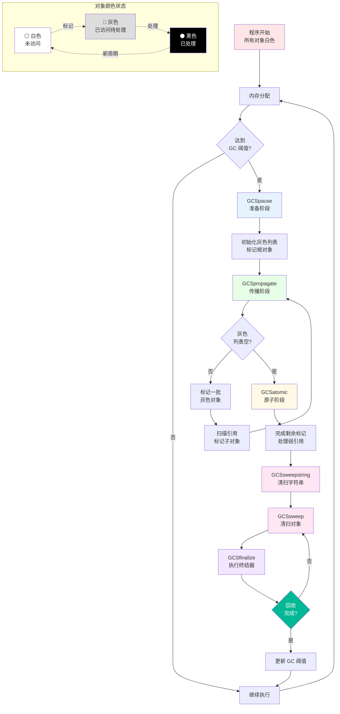
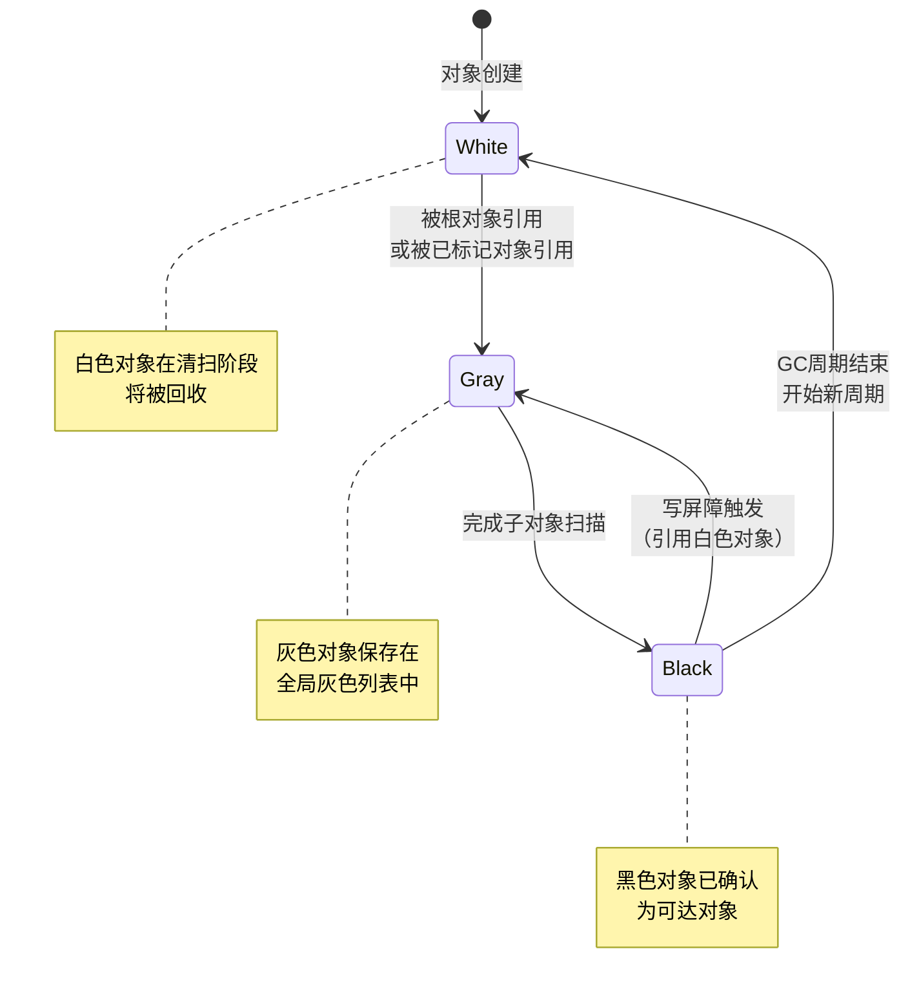
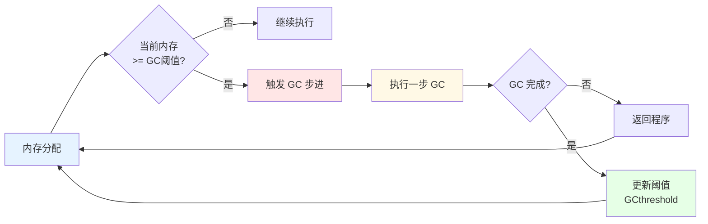
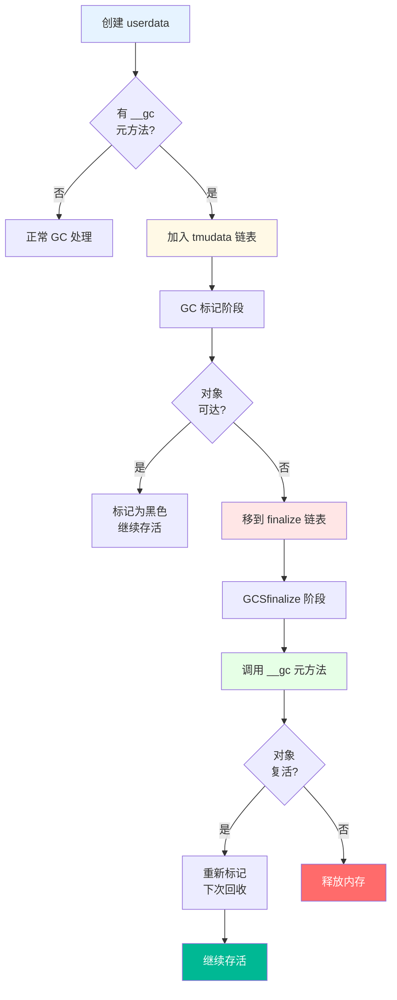

# ♻️ 垃圾回收模块完全指南

> **模块定位**：Lua 自动内存管理的核心 - 实现高效的三色标记增量垃圾回收算法

<details>
<summary><b>📋 快速导航</b></summary>

- [模块概述](#-模块概述)
- [GC 工作流程](#-gc-工作流程全景)
- [三色标记算法](#-三色标记算法)
- [增量回收机制](#-增量回收机制)
- [写屏障技术](#-写屏障技术)
- [终结器机制](#-终结器机制-finalizer)
- [弱引用表](#-弱引用表-weak-tables)
- [核心数据结构](#-核心数据结构)
- [GC 调优](#-gc-调优与性能分析)
- [实战示例](#-实战示例)

</details>

---

## 📋 模块概述

### 核心职责

Lua 垃圾回收器采用**三色标记-清除（Tri-Color Mark-Sweep）增量算法**，负责自动识别和回收不再使用的对象。增量回收将 GC 工作分散到多个小步骤中，与程序执行交替进行，避免长时间停顿，确保程序的响应性和流畅性。

### 实现文件

<table>
<tr>
<th width="25%">文件</th>
<th width="35%">职责</th>
<th width="40%">关键函数</th>
</tr>

<tr>
<td><code>lgc.c/h</code></td>
<td>垃圾回收器核心实现</td>
<td>
<code>luaC_step()</code> - 执行一步 GC<br/>
<code>luaC_fullgc()</code> - 完整 GC 周期<br/>
<code>luaC_barrier()</code> - 写屏障<br/>
<code>luaC_link()</code> - 链接新对象
</td>
</tr>

<tr>
<td><code>lgc.h</code></td>
<td>GC 接口定义和宏</td>
<td>
颜色标记宏<br/>
GC 状态常量<br/>
辅助操作宏
</td>
</tr>

<tr>
<td><code>lmem.c/h</code></td>
<td>内存分配器（GC 集成）</td>
<td>
<code>luaM_realloc_()</code> - 内存分配<br/>
触发 GC 检查
</td>
</tr>
</table>

### 设计特点

| 特点 | 说明 | 优势 |
|------|------|------|
| 🎨 **三色标记** | 白色→灰色→黑色状态机 | 算法简洁高效，易于增量化 |
| ⏱️ **增量回收** | 分多步执行，与程序交替 | 减少停顿时间，提升响应性 |
| 🛡️ **写屏障** | 保护增量 GC 正确性 | 防止对象误回收，维护不变式 |
| 🔗 **弱引用** | 支持弱键表和弱值表 | 避免内存泄漏，实现缓存 |
| 🏁 **终结器** | `__gc` 元方法支持 | 资源清理，RAII 模式 |
| 📊 **自适应** | 根据内存分配速度调整 | 平衡内存使用和性能 |

---

## 🔄 GC 工作流程全景

### 完整流程图



### GC 阶段详解

<table>
<tr>
<th width="20%">阶段</th>
<th width="30%">主要工作</th>
<th width="30%">关键操作</th>
<th width="20%">耗时占比</th>
</tr>

<tr>
<td><b>Pause<br/>（暂停）</b></td>
<td>准备新的回收周期</td>
<td>
• 标记根对象<br/>
• 初始化灰色列表<br/>
• 重置 GC 计数器
</td>
<td>~5%</td>
</tr>

<tr>
<td><b>Propagate<br/>（传播）</b></td>
<td>标记可达对象</td>
<td>
• 处理灰色对象<br/>
• 标记引用对象<br/>
• 增量执行
</td>
<td>~40%</td>
</tr>

<tr>
<td><b>Atomic<br/>（原子）</b></td>
<td>完成标记阶段</td>
<td>
• 处理剩余灰色对象<br/>
• 处理弱引用表<br/>
• 不可中断
</td>
<td>~10%</td>
</tr>

<tr>
<td><b>Sweep String<br/>（清扫字符串）</b></td>
<td>回收字符串</td>
<td>
• 遍历字符串哈希表<br/>
• 回收白色字符串<br/>
• 增量执行
</td>
<td>~15%</td>
</tr>

<tr>
<td><b>Sweep<br/>（清扫）</b></td>
<td>回收其他对象</td>
<td>
• 遍历对象链表<br/>
• 回收白色对象<br/>
• 增量执行
</td>
<td>~25%</td>
</tr>

<tr>
<td><b>Finalize<br/>（终结）</b></td>
<td>执行终结器</td>
<td>
• 调用 __gc 元方法<br/>
• 处理复活对象<br/>
• 可能触发新对象创建
</td>
<td>~5%</td>
</tr>
</table>

---

## 🎨 三色标记算法

### 核心概念

三色标记算法是垃圾回收的核心，通过三种颜色标记对象的可达性状态：

```c
// lgc.h - 颜色位定义
#define WHITE0BIT       0  // 白色0标志位
#define WHITE1BIT       1  // 白色1标志位（双缓冲）
#define BLACKBIT        2  // 黑色标志位

// 白色：未被访问（两个白色用于双缓冲）
#define WHITEBITS       bit2mask(WHITE0BIT, WHITE1BIT)

// 灰色：已访问但未完成扫描（通过链表管理）
// 黑色：已完成扫描
```

### 颜色状态机



### 三色不变式

GC 必须维护的两个不变式：

<table>
<tr>
<th width="30%">不变式</th>
<th width="40%">描述</th>
<th width="30%">维护方式</th>
</tr>

<tr>
<td><b>强三色不变式<br/>(Strong)</b></td>
<td>
黑色对象<b>不能直接</b>引用白色对象
</td>
<td>
写屏障：将白色对象标记为灰色
</td>
</tr>

<tr>
<td><b>弱三色不变式<br/>(Weak)</b></td>
<td>
黑色对象引用的白色对象<br/>
必须被某个灰色对象可达
</td>
<td>
写屏障：将黑色对象标记为灰色
</td>
</tr>
</table>

### 标记过程实现

```c
// lgc.c - 核心标记函数
static void reallymarkobject(global_State *g, GCObject *o) {
    white2gray(o);  // 白色转灰色
    
    switch (o->gch.tt) {
        case LUA_TSTRING: {
            // 字符串无引用，直接变黑色（隐式）
            return;
        }
        case LUA_TUSERDATA: {
            Table *mt = gco2u(o)->metatable;
            gray2black(o);  // 灰色转黑色
            if (mt) markobject(g, mt);  // 标记元表
            markobject(g, gco2u(o)->env);  // 标记环境
            return;
        }
        case LUA_TUPVAL: {
            UpVal *uv = gco2uv(o);
            markvalue(g, uv->v);  // 标记 upvalue 引用的值
            if (uv->v == &uv->u.value)  // 已关闭的 upvalue
                gray2black(o);
            return;
        }
        case LUA_TFUNCTION: {
            gco2cl(o)->c.gclist = g->gray;  // 加入灰色列表
            g->gray = o;
            break;
        }
        case LUA_TTABLE: {
            gco2h(o)->gclist = g->gray;  // 加入灰色列表
            g->gray = o;
            break;
        }
        // ... 其他类型
    }
}
```

---

## ⏱️ 增量回收机制

### 增量策略

增量 GC 将回收工作分散到多个时间片中，避免长时间停顿：

```c
// lgc.c - 增量步进
#define GCSTEPSIZE      1024u   // 每步处理1KB
#define GCSWEEPMAX      40      // 每步最多清扫40个对象
#define GCSWEEPCOST     10      // 清扫成本估算
#define GCFINALIZECOST  100     // 终结器成本估算

void luaC_step(lua_State *L) {
    global_State *g = G(L);
    lu_mem lim = (GCSTEPSIZE / 100) * g->gcstepmul;
    
    // 根据当前阶段执行相应工作
    switch (g->gcstate) {
        case GCSpause: {
            markroot(g);  // 标记根对象
            break;
        }
        case GCSpropagate: {
            // 增量标记
            while (g->gray && lim > 0) {
                lim -= propagatemark(g);
            }
            if (!g->gray) {
                g->gcstate = GCSatomic;
            }
            break;
        }
        case GCSsweep: {
            // 增量清扫
            lu_mem old = g->totalbytes;
            sweeplist(L, &g->rootgc, GCSWEEPMAX);
            g->estimate -= old - g->totalbytes;
            break;
        }
        // ... 其他阶段
    }
}
```

### 触发时机



### GC 阈值计算

```c
// lgc.c - 设置 GC 阈值
#define setthreshold(g) \
    (g->GCthreshold = (g->estimate / 100) * g->gcpause)

/**
 * GC 阈值 = (当前内存估算 / 100) × gcpause
 * 
 * 示例：
 * - 当前内存: 1MB
 * - gcpause = 200 (默认)
 * - GC阈值 = (1MB / 100) × 200 = 2MB
 * 
 * 即内存增长到2MB时触发下一次GC
 */
```

---

## 🛡️ 写屏障技术

### 问题背景

增量 GC 期间，程序可能修改对象引用关系，破坏三色不变式：

```
场景：黑色对象 A 引用白色对象 B

Before:          After (写入):
  A(黑) → C(灰)     A(黑) → B(白)  ❌ 违反不变式
         ↓                  
       B(白)         C(灰)

问题：B 可能被误回收！
```

### 写屏障实现

```c
// lgc.h - 写屏障宏
#define luaC_barrier(L, p, v) { \
    if (iscollectable(v) && isblack(obj2gco(p)) && iswhite(gcvalue(v))) \
        luaC_barrierf(L, obj2gco(p), gcvalue(v)); \
}

// lgc.c - 写屏障前向版本（Forward Barrier）
void luaC_barrierf(lua_State *L, GCObject *o, GCObject *v) {
    global_State *g = G(L);
    lua_assert(isblack(o) && iswhite(v));
    lua_assert(g->gcstate != GCSpause);
    
    // 将白色对象标记为灰色
    reallymarkobject(g, v);
}

// lgc.c - 写屏障后向版本（Backward Barrier）
void luaC_barrierback(lua_State *L, Table *t) {
    global_State *g = G(L);
    GCObject *o = obj2gco(t);
    lua_assert(isblack(o) && !isdead(g, o));
    
    // 将黑色对象退回灰色
    black2gray(o);
    t->gclist = g->grayagain;
    g->grayagain = o;
}
```

### 两种屏障策略对比

<table>
<tr>
<th width="20%">策略</th>
<th width="30%">操作</th>
<th width="25%">适用场景</th>
<th width="25%">性能特点</th>
</tr>

<tr>
<td><b>前向屏障<br/>(Forward)</b></td>
<td>将白色对象标记为灰色</td>
<td>
• 不可变对象<br/>
• 引用不常变化
</td>
<td>
✅ 无需重新扫描<br/>
❌ 标记开销大
</td>
</tr>

<tr>
<td><b>后向屏障<br/>(Backward)</b></td>
<td>将黑色对象退回灰色</td>
<td>
• 可变对象（表）<br/>
• 引用频繁变化
</td>
<td>
✅ 标记开销小<br/>
❌ 需重新扫描
</td>
</tr>
</table>

---

## 🏁 终结器机制 (Finalizer)

### 概念与用途

终结器允许为对象（主要是 userdata）定义清理函数（`__gc` 元方法），在对象被回收前自动调用：

```lua
-- Lua 层面定义终结器
local obj = newproxy(true)
getmetatable(obj).__gc = function(self)
    print("Object is being collected")
    -- 释放资源、关闭文件等
end
```

### 终结流程



---

## 🔗 弱引用表 (Weak Tables)

### 三种弱引用模式

```lua
-- 弱键表 (weak keys)
local weak_keys = {}
setmetatable(weak_keys, {__mode = "k"})

-- 弱值表 (weak values)
local weak_values = {}
setmetatable(weak_values, {__mode = "v"})

-- 全弱表 (weak keys and values)
local weak_both = {}
setmetatable(weak_both, {__mode = "kv"})
```

### 弱引用语义

<table>
<tr>
<th width="20%">模式</th>
<th width="30%">行为</th>
<th width="25%">应用场景</th>
<th width="25%">注意事项</th>
</tr>

<tr>
<td><b>弱键<br/>(__mode="k")</b></td>
<td>键被回收时<br/>删除键值对</td>
<td>
• 对象属性存储<br/>
• 反向索引表
</td>
<td>
键必须是<br/>可回收对象
</td>
</tr>

<tr>
<td><b>弱值<br/>(__mode="v")</b></td>
<td>值被回收时<br/>删除键值对</td>
<td>
• 缓存系统<br/>
• 对象池
</td>
<td>
值必须是<br/>可回收对象
</td>
</tr>

<tr>
<td><b>全弱<br/>(__mode="kv")</b></td>
<td>键或值被回收<br/>都删除键值对</td>
<td>
• 双向映射<br/>
• 临时关联
</td>
<td>
键值都必须是<br/>可回收对象
</td>
</tr>
</table>

---

## 📊 核心数据结构

### GCObject - 可回收对象

```c
// lobject.h - GC 对象头
typedef union GCObject {
    GCheader gch;
    union TString ts;
    union Udata u;
    union Closure cl;
    struct Table h;
    struct Proto p;
    struct UpVal uv;
    struct lua_State th;
} GCObject;

typedef struct GCheader {
    GCObject *next;   // 链表指针
    lu_byte tt;       // 对象类型
    lu_byte marked;   // GC 标记位
} GCheader;
```

### global_State - 全局 GC 状态

```c
// lstate.h - 全局状态中的 GC 字段
typedef struct global_State {
    // GC 链表
    GCObject *rootgc;       // 所有可回收对象的根链表
    GCObject *gray;         // 灰色对象列表
    GCObject *grayagain;    // 需要原子阶段重新扫描的对象
    GCObject *weak;         // 弱引用表列表
    
    // GC 状态
    lu_byte gcstate;        // 当前 GC 阶段
    lu_byte currentwhite;   // 当前白色（双缓冲）
    
    // GC 参数
    int gcpause;            // GC 暂停参数（默认 200）
    int gcstepmul;          // GC 步进倍数（默认 200）
    
    // 内存统计
    lu_mem totalbytes;      // 总分配字节数
    lu_mem GCthreshold;     // GC 触发阈值
    lu_mem estimate;        // 存活对象估计值
    
    // 终结器
    GCObject *tmudata;      // 带终结器的 userdata 列表
    GCObject *finalize;     // 当前需要终结的对象
} global_State;
```

---

## 🎛️ GC 调优与性能分析

### GC 参数详解

#### 1. gcpause - 暂停倍数

```lua
-- 获取当前值
local pause = collectgarbage("setpause", -1)

-- 设置新值
collectgarbage("setpause", 200)  -- 默认值

--[[
gcpause 控制 GC 触发频率：
- GC阈值 = (当前内存 / 100) × gcpause
- 值越小，GC 越频繁，内存占用越低
- 值越大，GC 越少，但内存峰值更高

示例：
gcpause = 200:  内存翻倍时触发 GC
gcpause = 100:  内存增长时立即触发
gcpause = 400:  内存增长4倍才触发
--]]
```

#### 2. gcstepmul - 步进倍数

```lua
-- 获取当前值
local step = collectgarbage("setstepmul", -1)

-- 设置新值
collectgarbage("setstepmul", 200)  -- 默认值

--[[
gcstepmul 控制每步 GC 工作量：
- 工作量 = (GCSTEPSIZE / 100) × gcstepmul
- 值越小，每步工作少，停顿时间短，但总开销大
- 值越大，每步工作多，停顿时间长，但总开销小
--]]
```

### 性能优化建议

<table>
<tr>
<th width="30%">场景</th>
<th width="35%">建议配置</th>
<th width="35%">原因</th>
</tr>

<tr>
<td><b>嵌入式系统<br/>（内存紧张）</b></td>
<td>
<code>gcpause = 100</code><br/>
<code>gcstepmul = 200</code>
</td>
<td>
频繁回收，<br/>
保持低内存占用
</td>
</tr>

<tr>
<td><b>游戏主循环<br/>（低延迟要求）</b></td>
<td>
<code>gcpause = 200</code><br/>
<code>gcstepmul = 100</code>
</td>
<td>
小步回收，<br/>
减少单帧停顿
</td>
</tr>

<tr>
<td><b>服务器<br/>（高吞吐量）</b></td>
<td>
<code>gcpause = 300</code><br/>
<code>gcstepmul = 300</code>
</td>
<td>
减少 GC 频率，<br/>
提升吞吐量
</td>
</tr>

<tr>
<td><b>批处理<br/>（非交互）</b></td>
<td>
手动控制 GC，<br/>
在合适时机调用
</td>
<td>
避免 GC 干扰<br/>
计算密集任务
</td>
</tr>
</table>

---

## 💻 实战示例

### 示例 1：GC 监控器

```lua
-- gc_monitor.lua
local GCMonitor = {}

function GCMonitor.new()
    local self = {
        collections = 0,
        total_time = 0,
        peak_memory = 0
    }
    
    function self.start()
        self.start_time = os.clock()
        self.start_mem = collectgarbage("count")
    end
    
    function self.stop()
        local end_time = os.clock()
        local end_mem = collectgarbage("count")
        
        self.collections = self.collections + 1
        self.total_time = self.total_time + (end_time - self.start_time)
        self.peak_memory = math.max(self.peak_memory, end_mem)
        
        return {
            duration = end_time - self.start_time,
            memory_freed = self.start_mem - end_mem
        }
    end
    
    return self
end
```

### 示例 2：对象池（弱引用）

```lua
-- object_pool.lua
local ObjectPool = {}

function ObjectPool.new(create_func)
    local pool = {}
    setmetatable(pool, {__mode = "kv"})
    
    return {
        acquire = function()
            local obj = next(pool)
            if obj then
                pool[obj] = nil
                return obj
            end
            return create_func()
        end,
        
        release = function(obj)
            if type(obj) == "table" then
                for k in pairs(obj) do
                    obj[k] = nil
                end
                pool[obj] = true
            end
        end
    }
end
```

---

## 📚 详细技术文档

### 已完成 ✅

- [三色标记算法详解](tri_color_marking.md) - 标记算法的完整实现和原理

### 规划中 🚧

- `incremental_gc.md` - 增量回收的详细工作流程
- `write_barrier.md` - 写屏障的实现原理和优化
- `finalizer.md` - 终结器的完整实现和复活机制
- `weak_table.md` - 弱引用表的实现细节
- `gc_tuning.md` - GC 参数调优指南

---

## 🔗 相关模块

- [内存管理模块](../memory/wiki_memory.md) - 提供统一的内存分配接口
- [对象系统模块](../object/wiki_object.md) - 定义 GC 管理的所有对象类型
- [运行时模块](../runtime/wiki_runtime.md) - GC 与程序执行的协作机制

---

## 🎯 学习检查点

完成本文档学习后，你应该能够：

- [ ] 理解三色标记算法的工作原理和状态转换
- [ ] 解释增量 GC 如何减少停顿时间
- [ ] 说明写屏障的必要性和两种实现策略
- [ ] 使用终结器正确管理资源生命周期
- [ ] 应用弱引用表实现缓存和对象池
- [ ] 根据应用场景调优 GC 参数
- [ ] 监控和分析 GC 性能

---

<div align="center">

**[⬆️ 返回顶部](#-垃圾回收模块完全指南)** · **[📖 继续阅读](tri_color_marking.md)** · **[🏠 返回总览](../wiki.md)**

---

**📅 最后更新**：2025-10-25  
**📌 文档版本**：v2.0 (DeepWiki 优化版)  
**🔖 基于 Lua 版本**：5.1.5

</div>
