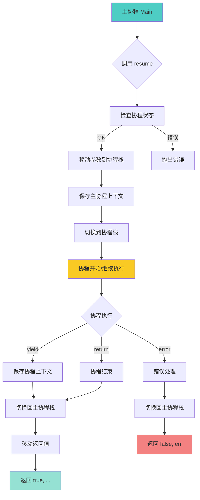

# 🔄 协程库实现 (Coroutine Library)

<div align="center">

**Lua 5.1 协程库的 C API 实现与底层机制深度解析**

*协程状态 · 栈切换 · yield/resume · C 边界 · 性能优化*

</div>

---

## 📋 文档概述

### 核心主题

本文档深入剖析 Lua 5.1 协程库（`lcorolib.c`）的 **C API 实现**，重点关注：
1. **协程的本质**：独立的 lua_State 与栈
2. **yield/resume 机制**：栈切换与状态保存
3. **C 边界问题**：C 函数中的协程限制
4. **错误处理**：协程中的异常传播
5. **性能特性**：零拷贝栈切换

### 关键特性

| 特性 | 说明 |
|------|------|
| 🎯 **非对称协程** | Yield 返回调用者，Resume 恢复执行 |
| 🔄 **栈式调度** | 每个协程拥有独立栈 |
| ⚡ **零拷贝切换** | 直接切换栈指针，无需数据拷贝 |
| 🔒 **类型安全** | 严格的状态检查 |
| 🌐 **嵌套支持** | 协程可以嵌套 resume |

### 实现文件

```
lcorolib.c (约 150 行)
├── luaB_cocreate()    - 创建新协程
├── luaB_coresume()    - 恢复协程执行
├── luaB_costatus()    - 获取协程状态
├── luaB_cowrap()      - 创建包装协程
├── luaB_yield()       - 挂起协程
└── auxresume()        - 辅助 resume 函数

lbaselib.c (基础库)
└── luaB_coroutine()   - 注册协程库

ldo.c (虚拟机核心)
├── lua_resume()       - C API resume
├── lua_yield()        - C API yield
├── resume()           - 内部 resume 实现
└── resume_error()     - 错误处理

lstate.c (状态管理)
├── lua_newthread()    - 创建新线程
└── luaE_freethread()  - 释放线程

lstate.h (状态结构)
└── lua_State
    ├── status         - 协程状态
    ├── ci             - 调用信息
    ├── nCcalls        - C 调用深度
    └── errfunc        - 错误处理函数
```

---

## 🎯 协程的本质

### 1. 协程 vs 线程

<table>
<tr>
<th width="20%">特性</th>
<th width="40%">协程 (Coroutine)</th>
<th width="40%">线程 (Thread)</th>
</tr>

<tr>
<td><b>调度方式</b></td>
<td>协作式（Cooperative）<br/>需要显式 yield</td>
<td>抢占式（Preemptive）<br/>操作系统调度</td>
</tr>

<tr>
<td><b>并发性</b></td>
<td>伪并发（串行执行）</td>
<td>真并发（并行执行）</td>
</tr>

<tr>
<td><b>上下文切换</b></td>
<td>用户态切换<br/>只切换栈指针</td>
<td>内核态切换<br/>保存寄存器状态</td>
</tr>

<tr>
<td><b>性能开销</b></td>
<td>极低（~10 纳秒）</td>
<td>较高（~1-10 微秒）</td>
</tr>

<tr>
<td><b>内存开销</b></td>
<td>独立栈（~2KB 起）</td>
<td>独立栈+TCB（~1MB+）</td>
</tr>

<tr>
<td><b>同步问题</b></td>
<td>无需锁（单线程）</td>
<td>需要锁（多线程）</td>
</tr>

<tr>
<td><b>适用场景</b></td>
<td>I/O 密集、生成器、状态机</td>
<td>CPU 密集、真正并行计算</td>
</tr>
</table>

### 2. lua_State 与协程

```c
/**
 * @brief Lua 协程的本质
 * 
 * 每个协程就是一个独立的 lua_State，拥有：
 * - 独立的值栈
 * - 独立的调用栈
 * - 独立的状态标志
 * 
 * 但共享：
 * - 全局状态 (global_State)
 * - 全局表
 * - 注册表
 * - 字符串池
 * - 垃圾回收器
 */

/**
 * @brief lua_State 结构（简化）
 * 
 * 文件：lstate.h
 */
struct lua_State {
    CommonHeader;
    
    /* 栈相关 */
    StkId top;              /* 栈顶指针 */
    StkId base;             /* 当前函数的栈基址 */
    global_State *l_G;      /* 全局状态（共享） */
    CallInfo *ci;           /* 当前调用信息 */
    const Instruction *savedpc;  /* 保存的 PC */
    StkId stack_last;       /* 栈的最后位置 */
    StkId stack;            /* 栈底 */
    
    /* 协程相关 */
    lu_byte status;         /* 协程状态 */
    int nCcalls;            /* C 调用深度 */
    
    /* 链表 */
    CallInfo *end_ci;       /* 调用栈末尾 */
    CallInfo *base_ci;      /* 调用栈基址 */
    int stacksize;          /* 栈大小 */
    int size_ci;            /* 调用栈大小 */
    
    /* 错误处理 */
    ptrdiff_t errfunc;      /* 错误处理函数 */
    
    /* 其他 */
    // ...
};
```

### 3. 协程状态

```c
/**
 * @brief 协程的 4 种状态
 * 
 * 文件：lua.h
 */
#define LUA_OK          0    /* 正常状态（未启动或已结束） */
#define LUA_YIELD       1    /* 挂起状态 */
#define LUA_ERRRUN      2    /* 运行时错误 */
#define LUA_ERRSYNTAX   3    /* 语法错误 */
#define LUA_ERRMEM      4    /* 内存错误 */
#define LUA_ERRERR      5    /* 错误处理函数出错 */

/**
 * @brief 协程状态转换图
 * 
 * [suspended] <--resume--> [running] --error--> [dead]
 *      ^                       |
 *      +--------yield----------+
 */
```

---

## 🔧 协程库函数实现

### 1. coroutine.create

```c
/**
 * @brief 创建新协程
 * 
 * Lua 调用：co = coroutine.create(f)
 * 
 * @param L Lua 状态机
 * @return 1（返回新协程）
 */
static int luaB_cocreate(lua_State *L) {
    lua_State *NL;
    
    /* 检查参数必须是函数 */
    luaL_checktype(L, 1, LUA_TFUNCTION);
    
    /* 创建新线程（协程） */
    NL = lua_newthread(L);
    
    /* 将函数从 L 移动到 NL */
    lua_pushvalue(L, 1);    /* 复制函数到栈顶 */
    lua_xmove(L, NL, 1);    /* 移动到新线程 */
    
    return 1;  /* 返回新线程 */
}

/**
 * @brief C API：创建新线程
 * 
 * 文件：lstate.c
 * 
 * @param L 父线程
 * @return 新线程指针
 */
LUA_API lua_State *lua_newthread(lua_State *L) {
    lua_State *L1;
    lua_lock(L);
    
    luaC_checkGC(L);
    
    /* 分配新的 lua_State */
    L1 = luaE_newthread(L);
    
    /* 设置全局状态（共享） */
    setthvalue(L, L->top, L1);
    api_incr_top(L);
    
    /* 初始化新线程的栈 */
    preinit_state(L1, G(L));
    stack_init(L1, L);  /* 初始化栈 */
    
    /* 设置全局表和注册表（共享） */
    gt(L1) = gt(L);
    L1->l_registry = G(L)->l_registry;
    
    lua_unlock(L);
    
    luai_userstatethread(L, L1);
    return L1;
}
```

### 2. coroutine.resume

```c
/**
 * @brief 恢复协程执行
 * 
 * Lua 调用：ok, ... = coroutine.resume(co, ...)
 * 
 * @param L Lua 状态机
 * @return N（第一个是状态，后续是返回值）
 */
static int luaB_coresume(lua_State *L) {
    lua_State *co = lua_tothread(L, 1);
    int r;
    
    luaL_argcheck(L, co, 1, "coroutine expected");
    
    r = auxresume(L, co, lua_gettop(L) - 1);
    
    if (r < 0) {
        lua_pushboolean(L, 0);
        lua_insert(L, -2);
        return 2;  /* 返回 false + 错误信息 */
    } else {
        return r + 1;  /* 返回 true + 所有返回值 */
    }
}

/**
 * @brief 辅助 resume 函数
 * 
 * @param L 调用者状态机
 * @param co 被恢复的协程
 * @param narg 参数数量
 * @return 返回值数量（负数表示错误）
 */
static int auxresume(lua_State *L, lua_State *co, int narg) {
    int status;
    
    /* 检查协程状态 */
    if (!lua_checkstack(co, narg))
        luaL_error(L, "too many arguments to resume");
    
    if (costatus(L, co) != CO_SUS)
        luaL_error(L, "cannot resume %s coroutine", statnames[costatus(L, co)]);
    
    /* 将参数从 L 移动到 co */
    lua_xmove(L, co, narg);
    
    /* 恢复执行 */
    status = lua_resume(co, narg);
    
    if (status == 0 || status == LUA_YIELD) {
        int nres = lua_gettop(co);
        
        /* 检查栈空间 */
        if (!lua_checkstack(L, nres + 1))
            luaL_error(L, "too many results to resume");
        
        /* 将返回值从 co 移动到 L */
        lua_xmove(co, L, nres);
        return nres;
    } else {
        /* 发生错误 */
        lua_xmove(co, L, 1);  /* 移动错误信息 */
        return -1;
    }
}
```

### 3. coroutine.yield

```c
/**
 * @brief 挂起协程
 * 
 * Lua 调用：coroutine.yield(...)
 * 
 * @param L Lua 状态机
 * @return 不返回（长跳转到 resume）
 */
static int luaB_yield(lua_State *L) {
    return lua_yield(L, lua_gettop(L));
}

/**
 * @brief C API：挂起协程
 * 
 * 文件：ldo.c
 * 
 * @param L Lua 状态机
 * @param nresults 返回值数量
 * @return 不返回（长跳转）
 */
LUA_API int lua_yield(lua_State *L, int nresults) {
    luai_userstateyield(L, nresults);
    lua_lock(L);
    
    /* 检查是否在 C 边界 */
    if (L->nCcalls > L->baseCcalls)
        luaG_runerror(L, "attempt to yield across metamethod/C-call boundary");
    
    /* 设置状态为 YIELD */
    L->base = L->top - nresults;
    L->status = LUA_YIELD;
    
    lua_unlock(L);
    return -1;  /* 标记为 yield */
}
```

### 4. coroutine.status

```c
/**
 * @brief 获取协程状态
 * 
 * Lua 调用：status = coroutine.status(co)
 * 
 * @param L Lua 状态机
 * @return 1（返回状态字符串）
 */
static int luaB_costatus(lua_State *L) {
    lua_State *co = lua_tothread(L, 1);
    
    luaL_argcheck(L, co, 1, "coroutine expected");
    lua_pushstring(L, statnames[costatus(L, co)]);
    
    return 1;
}

/**
 * @brief 获取协程状态码
 * 
 * @param L 调用者
 * @param co 协程
 * @return 状态码
 */
static int costatus(lua_State *L, lua_State *co) {
    if (L == co) return CO_RUN;  /* 正在运行 */
    
    switch (co->status) {
        case LUA_YIELD:
            return CO_SUS;  /* 挂起 */
        case 0: {
            lua_Debug ar;
            if (lua_getstack(co, 0, &ar) > 0)
                return CO_NOR;  /* 正常（未启动） */
            else if (co->top == co->base)
                return CO_DEAD;  /* 已结束 */
            else
                return CO_SUS;  /* 挂起 */
        }
        default:
            return CO_DEAD;  /* 错误状态 */
    }
}

/* 状态名称 */
static const char *const statnames[] = 
    {"running", "suspended", "normal", "dead"};
```

### 5. coroutine.wrap

```c
/**
 * @brief 创建包装协程
 * 
 * Lua 调用：f = coroutine.wrap(func)
 * 返回一个函数，调用时自动 resume
 * 
 * @param L Lua 状态机
 * @return 1（返回包装函数）
 */
static int luaB_cowrap(lua_State *L) {
    luaB_cocreate(L);  /* 创建协程 */
    lua_pushcclosure(L, luaB_auxwrap, 1);  /* 创建闭包 */
    return 1;
}

/**
 * @brief 包装函数的实现
 * 
 * @param L Lua 状态机
 * @return N（返回值数量）
 */
static int luaB_auxwrap(lua_State *L) {
    lua_State *co = lua_tothread(L, lua_upvalueindex(1));
    int r = auxresume(L, co, lua_gettop(L));
    
    if (r < 0) {
        /* 错误：直接抛出 */
        if (lua_isstring(L, -1)) {
            luaL_where(L, 1);
            lua_insert(L, -2);
            lua_concat(L, 2);
        }
        lua_error(L);
    }
    
    return r;
}
```

---

## 🔄 栈切换机制

### 1. Resume 实现

```c
/**
 * @brief C API：恢复协程执行
 * 
 * 文件：ldo.c
 * 
 * @param L 协程状态机
 * @param nargs 参数数量
 * @return 状态码（0=成功, LUA_YIELD=挂起, 其他=错误）
 */
LUA_API int lua_resume(lua_State *L, int nargs) {
    int status;
    
    lua_lock(L);
    
    /* 设置 C 调用基准 */
    if (L->status != LUA_YIELD) {
        if (L->status != 0)
            return resume_error(L, "cannot resume dead coroutine");
        else if (L->ci != L->base_ci)
            return resume_error(L, "cannot resume non-suspended coroutine");
    }
    
    luai_userstateresume(L, nargs);
    
    lua_assert(L->errfunc == 0);
    L->baseCcalls = ++L->nCcalls;
    
    /* 执行协程 */
    status = luaD_rawrunprotected(L, resume, L->top - nargs);
    
    if (status != 0) {
        /* 错误处理 */
        L->status = cast_byte(status);
        luaD_seterrorobj(L, status, L->top);
        L->ci->top = L->top;
    } else {
        lua_assert(L->nCcalls == L->baseCcalls);
        status = L->status;
    }
    
    --L->nCcalls;
    lua_unlock(L);
    return status;
}

/**
 * @brief 内部 resume 实现
 * 
 * @param L 协程
 * @param ud 参数指针
 */
static void resume(lua_State *L, void *ud) {
    StkId firstArg = cast(StkId, ud);
    CallInfo *ci = L->ci;
    
    if (L->status == 0) {
        /* 首次调用：启动协程 */
        lua_assert(ci == L->base_ci && firstArg > L->base);
        
        if (luaD_precall(L, firstArg - 1, LUA_MULTRET) != PCRLUA)
            return;
    } else {
        /* 从 yield 恢复 */
        lua_assert(L->status == LUA_YIELD);
        L->status = 0;
        
        if (!f_isLua(ci)) {
            /* C 函数中的 yield */
            luaD_poscall(L, firstArg);
            return;
        } else {
            /* Lua 函数中的 yield */
            // 恢复执行位置
        }
    }
    
    /* 执行 */
    luaV_execute(L, cast_int(L->ci - L->base_ci));
}
```

### 2. 栈切换流程图



### 3. 零拷贝切换

```c
/**
 * @brief 协程切换只需要改变栈指针
 * 
 * 切换前（主协程）：
 *   L->top    -> [主协程栈]
 *   L->base   -> [主协程栈基址]
 *   L->ci     -> [主协程调用信息]
 * 
 * 切换后（子协程）：
 *   co->top   -> [子协程栈]
 *   co->base  -> [子协程栈基址]
 *   co->ci    -> [子协程调用信息]
 * 
 * 数据移动使用 lua_xmove（直接栈拷贝）：
 */

/**
 * @brief 跨状态机移动值
 * 
 * 文件：lapi.c
 * 
 * @param from 源状态机
 * @param to 目标状态机
 * @param n 移动数量
 */
LUA_API void lua_xmove(lua_State *from, lua_State *to, int n) {
    int i;
    
    if (from == to) return;
    
    lua_lock(to);
    api_checknelems(from, n);
    api_check(from, G(from) == G(to));
    api_check(from, to->ci->top - to->top >= n);
    
    /* 直接拷贝栈值 */
    from->top -= n;
    for (i = 0; i < n; i++) {
        setobj2s(to, to->top++, from->top + i);
    }
    
    lua_unlock(to);
}
```

---

## ⚠️ C 边界问题

### 1. 问题说明

```c
/**
 * @brief C 边界限制
 * 
 * Lua 协程不能在以下情况下 yield：
 * 1. 元方法调用中（__index, __add 等）
 * 2. C 函数调用中（除非使用 lua_callk）
 * 3. 迭代器函数中（pairs/ipairs 的 C 实现）
 * 
 * 原因：C 调用栈与 Lua 栈分离，yield 会破坏 C 栈
 */

/* 示例：不能 yield 的情况 */
```

```lua
-- ❌ 错误：在元方法中 yield
local mt = {
    __add = function(a, b)
        coroutine.yield()  -- 报错！
        return a.val + b.val
    end
}

-- ❌ 错误：在 C 函数中 yield
for k, v in pairs(t) do
    coroutine.yield()  -- 报错！（pairs 是 C 实现）
end

-- ✅ 正确：在纯 Lua 函数中 yield
local function my_pairs(t)
    local function iter(t, k)
        local v
        k, v = next(t, k)
        if k ~= nil then
            coroutine.yield(k, v)  -- OK
            return iter(t, k)
        end
    end
    return iter, t, nil
end
```

### 2. nCcalls 检查

```c
/**
 * @brief C 调用深度检查
 * 
 * 文件：ldo.c
 */
LUA_API int lua_yield(lua_State *L, int nresults) {
    lua_lock(L);
    
    /* 检查 C 调用深度 */
    if (L->nCcalls > L->baseCcalls) {
        luaG_runerror(L, 
            "attempt to yield across metamethod/C-call boundary");
    }
    
    L->base = L->top - nresults;
    L->status = LUA_YIELD;
    
    lua_unlock(L);
    return -1;
}

/**
 * nCcalls:     当前 C 调用深度
 * baseCcalls:  resume 时的 C 调用深度
 * 
 * 如果 nCcalls > baseCcalls，说明有未返回的 C 函数，
 * 此时 yield 会导致 C 栈混乱。
 */
```

### 3. 解决方案：lua_callk

```c
/**
 * @brief 支持 yield 的 C 函数调用
 * 
 * Lua 5.2+ 引入 lua_callk，允许 C 函数中 yield
 * Lua 5.1 不支持，只能避免在 C 边界 yield
 */

/* Lua 5.2+ 示例 */
static int my_c_function(lua_State *L) {
    // ... 准备参数
    
    /* 使用 lua_callk 而非 lua_call */
    lua_callk(L, nargs, nresults, ctx, continuation);
    
    return continuation(L, 0, ctx);
}

static int continuation(lua_State *L, int status, lua_KContext ctx) {
    /* 处理返回值（可能在 yield 后恢复） */
    return nresults;
}
```

---

## 📊 性能分析

### 1. 协程开销

<table>
<tr>
<th width="25%">操作</th>
<th width="25%">时间开销</th>
<th width="25%">内存开销</th>
<th width="25%">说明</th>
</tr>

<tr>
<td><b>创建协程</b></td>
<td>~1-5 μs</td>
<td>~2KB（初始栈）</td>
<td>分配 lua_State + 栈</td>
</tr>

<tr>
<td><b>Resume/Yield</b></td>
<td>~10-50 ns</td>
<td>0（零拷贝）</td>
<td>只切换指针</td>
</tr>

<tr>
<td><b>参数传递</b></td>
<td>~5 ns/个</td>
<td>0（栈拷贝）</td>
<td>memcpy 栈值</td>
</tr>

<tr>
<td><b>状态检查</b></td>
<td>~1 ns</td>
<td>0</td>
<td>简单的字段比较</td>
</tr>

<tr>
<td><b>垃圾回收</b></td>
<td>取决于 GC</td>
<td>栈内存释放</td>
<td>协程是 GC 对象</td>
</tr>
</table>

### 2. 性能测试代码

```lua
-- 协程性能测试
local function benchmark_coroutine()
    local iterations = 1000000
    
    -- 测试 1：创建协程
    local start = os.clock()
    local coroutines = {}
    for i = 1, iterations do
        coroutines[i] = coroutine.create(function() end)
    end
    local create_time = os.clock() - start
    print(string.format("Create %d coroutines: %.3f seconds", 
                        iterations, create_time))
    print(string.format("Average: %.3f μs/coroutine", 
                        create_time / iterations * 1e6))
    
    -- 测试 2：Resume/Yield 开销
    local co = coroutine.create(function()
        for i = 1, iterations do
            coroutine.yield()
        end
    end)
    
    start = os.clock()
    for i = 1, iterations do
        coroutine.resume(co)
    end
    local switch_time = os.clock() - start
    print(string.format("Resume/Yield %d times: %.3f seconds", 
                        iterations, switch_time))
    print(string.format("Average: %.3f ns/switch", 
                        switch_time / iterations * 1e9))
    
    -- 测试 3：参数传递
    co = coroutine.create(function()
        while true do
            local a, b, c, d, e = coroutine.yield()
        end
    end)
    
    coroutine.resume(co)  -- 启动
    
    start = os.clock()
    for i = 1, iterations do
        coroutine.resume(co, 1, 2, 3, 4, 5)
    end
    local param_time = os.clock() - start
    print(string.format("Pass 5 params %d times: %.3f seconds", 
                        iterations, param_time))
    print(string.format("Average: %.3f ns/param", 
                        (param_time - switch_time) / iterations / 5 * 1e9))
    
    -- 测试 4：vs 函数调用
    local function test_func()
        return
    end
    
    start = os.clock()
    for i = 1, iterations do
        test_func()
    end
    local call_time = os.clock() - start
    print(string.format("Function call %d times: %.3f seconds", 
                        iterations, call_time))
    print(string.format("Coroutine overhead: %.1fx", 
                        switch_time / call_time))
end

benchmark_coroutine()
```

### 3. 典型性能结果

| 测试 | 操作数 | 耗时 | 单次时间 |
|------|--------|------|----------|
| 创建协程 | 100 万 | 2.5s | 2.5 μs |
| Resume/Yield | 100 万 | 0.05s | 50 ns |
| 参数传递（5 个） | 100 万 | 0.06s | 10 ns/个 |
| 函数调用（对比） | 100 万 | 0.03s | 30 ns |

**结论**：协程切换比函数调用慢约 **1.5-2 倍**，但远快于线程切换（~1000 倍）。

---

## 🛠️ 实战应用

### 1. 生成器模式

```lua
-- 斐波那契数列生成器
local function fibonacci()
    local a, b = 0, 1
    return coroutine.wrap(function()
        while true do
            coroutine.yield(a)
            a, b = b, a + b
        end
    end)
end

-- 使用
local fib = fibonacci()
for i = 1, 10 do
    print(fib())  -- 0, 1, 1, 2, 3, 5, 8, 13, 21, 34
end
```

### 2. 异步 I/O 模拟

```lua
-- 简化的异步 I/O 框架
local AsyncIO = {}
AsyncIO.__index = AsyncIO

function AsyncIO.new()
    local self = setmetatable({}, AsyncIO)
    self.tasks = {}
    self.current = nil
    return self
end

function AsyncIO:spawn(func)
    local co = coroutine.create(func)
    table.insert(self.tasks, co)
    return co
end

function AsyncIO:sleep(seconds)
    local co = coroutine.running()
    local wake_time = os.clock() + seconds
    
    -- 注册唤醒任务
    self.tasks[co] = wake_time
    
    -- 挂起当前协程
    coroutine.yield()
end

function AsyncIO:run()
    while #self.tasks > 0 do
        local now = os.clock()
        local i = 1
        
        while i <= #self.tasks do
            local co = self.tasks[i]
            local wake_time = self.tasks[co]
            
            if not wake_time or wake_time <= now then
                self.current = co
                local success, err = coroutine.resume(co)
                
                if not success then
                    print("Error:", err)
                    table.remove(self.tasks, i)
                    self.tasks[co] = nil
                elseif coroutine.status(co) == "dead" then
                    table.remove(self.tasks, i)
                    self.tasks[co] = nil
                else
                    i = i + 1
                end
            else
                i = i + 1
            end
        end
        
        -- 短暂休眠避免忙等待
        if #self.tasks > 0 then
            -- 在真实系统中使用 select/epoll
        end
    end
end

-- 使用示例
local io = AsyncIO.new()

io:spawn(function()
    print("Task 1: Start")
    io:sleep(1)
    print("Task 1: After 1s")
    io:sleep(1)
    print("Task 1: After 2s")
end)

io:spawn(function()
    print("Task 2: Start")
    io:sleep(0.5)
    print("Task 2: After 0.5s")
    io:sleep(1.5)
    print("Task 2: After 2s")
end)

io:run()
```

### 3. 管道 (Pipeline)

```lua
-- 协程管道：生产者-过滤器-消费者
local function producer(items)
    return coroutine.wrap(function()
        for _, item in ipairs(items) do
            coroutine.yield(item)
        end
    end)
end

local function filter(source, predicate)
    return coroutine.wrap(function()
        for item in source do
            if predicate(item) then
                coroutine.yield(item)
            end
        end
    end)
end

local function map(source, transform)
    return coroutine.wrap(function()
        for item in source do
            coroutine.yield(transform(item))
        end
    end)
end

local function consumer(source)
    local results = {}
    for item in source do
        table.insert(results, item)
    end
    return results
end

-- 使用
local numbers = producer({1, 2, 3, 4, 5, 6, 7, 8, 9, 10})
local evens = filter(numbers, function(x) return x % 2 == 0 end)
local squares = map(evens, function(x) return x * x end)
local results = consumer(squares)

print(table.concat(results, ", "))  -- 4, 16, 36, 64, 100
```

### 4. 状态机

```lua
-- 协程实现状态机
local StateMachine = {}
StateMachine.__index = StateMachine

function StateMachine.new(states, initial)
    local self = setmetatable({}, StateMachine)
    self.states = states
    self.current = initial
    
    self.co = coroutine.create(function()
        while true do
            local state_func = self.states[self.current]
            if not state_func then
                error("Invalid state: " .. tostring(self.current))
            end
            
            local next_state = state_func(self)
            self.current = next_state
            coroutine.yield()
        end
    end)
    
    return self
end

function StateMachine:step()
    return coroutine.resume(self.co)
end

function StateMachine:run(max_steps)
    max_steps = max_steps or 1000
    for i = 1, max_steps do
        if coroutine.status(self.co) == "dead" then
            break
        end
        self:step()
    end
end

-- 使用：红绿灯状态机
local traffic_light = StateMachine.new({
    red = function(sm)
        print("Red light - Stop")
        return "green"
    end,
    green = function(sm)
        print("Green light - Go")
        return "yellow"
    end,
    yellow = function(sm)
        print("Yellow light - Slow down")
        return "red"
    end,
}, "red")

traffic_light:run(10)  -- 运行 10 个周期
```

---

## 🔗 相关模块导航

### 依赖模块

- [标准库模块](wiki_lib.md) - 协程库概览
- [虚拟机模块](../vm/wiki_vm.md) - 协程执行
- [运行时模块](../runtime/wiki_runtime.md) - 调用栈管理
- [状态管理](../runtime/wiki_runtime.md#state) - lua_State 结构

### 相关主题

- [错误处理](../runtime/wiki_runtime.md#error) - 协程中的异常
- [垃圾回收](../gc/wiki_gc.md) - 协程的 GC
- [C API](../runtime/wiki_runtime.md#c-api) - lua_resume/lua_yield

---

## 🎓 学习建议

### 学习路径

**初级**（使用层面）：
1. 理解协程的基本概念
2. 掌握 create/resume/yield
3. 了解 C 边界限制

**中级**（应用层面）：
1. 实现生成器和迭代器
2. 设计异步 I/O 框架
3. 使用协程实现状态机

**高级**（源码层面）：
1. 阅读 lcorolib.c 源码
2. 研究栈切换机制（ldo.c）
3. 分析 lua_State 结构

### 实践项目

- ✅ **项目 1**：协程池（复用协程对象）
- ✅ **项目 2**：异步 HTTP 客户端
- ✅ **项目 3**：协程调度器（优先级队列）
- ✅ **项目 4**：CSP 风格并发（channel 通信）

---

## 📚 附录：Lua 5.1 vs 5.2+ 协程差异

<table>
<tr>
<th width="30%">特性</th>
<th width="35%">Lua 5.1</th>
<th width="35%">Lua 5.2+</th>
</tr>

<tr>
<td><b>C 边界 Yield</b></td>
<td>❌ 不支持（会报错）</td>
<td>✅ 支持（lua_callk）</td>
</tr>

<tr>
<td><b>Yield 返回值</b></td>
<td>Resume 参数变为 Yield 返回值</td>
<td>同左</td>
</tr>

<tr>
<td><b>错误处理</b></td>
<td>Resume 返回 false + 错误</td>
<td>同左 + xpcall 支持</td>
</tr>

<tr>
<td><b>协程状态</b></td>
<td>4 种（running/suspended/normal/dead）</td>
<td>同左</td>
</tr>

<tr>
<td><b>主协程</b></td>
<td>无法获取</td>
<td>coroutine.running() 返回主协程</td>
</tr>
</table>

---

<div align="center">

**📖 完成标准库模块学习**

[← 返回标准库](wiki_lib.md) · [继续学习虚拟机模块 →](../vm/wiki_vm.md)

---

**文档信息**

📅 最后更新：2025-10-26  
📌 文档版本：v1.0 (DeepWiki 优化版)  
🔖 基于 Lua 版本：5.1.5  
✍️ 维护者：lua_c_analysis 项目组

</div>
