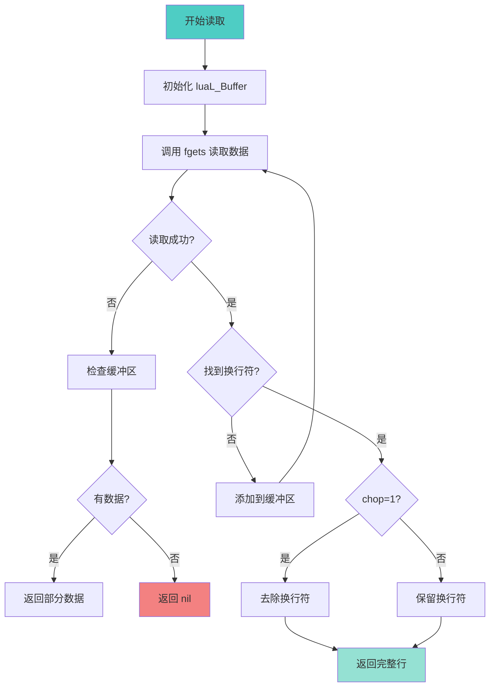

# 📁 文件 I/O 缓冲机制 (File I/O Buffering)

<div align="center">

**Lua 5.1 I/O 库的缓冲区管理与性能优化深度解析**

*缓冲区策略 · FILE* 封装 · 性能优化 · 跨平台兼容性*

</div>

---

## 📋 文档概述

### 核心主题

本文档深入剖析 Lua 5.1 I/O 库（`liolib.c`）的**缓冲区管理机制**，重点关注：
1. **C 标准库 FILE*** 的封装方式
2. **三种缓冲模式**的实现和选择
3. **读写操作**的性能优化
4. **luaL_Buffer** 的内部机制
5. **跨平台兼容性**处理

### 关键特性

| 特性 | 说明 |
|------|------|
| 🎯 **缓冲策略** | 全缓冲、行缓冲、无缓冲 |
| ⚡ **性能优化** | 减少系统调用，批量读写 |
| 🪶 **轻量封装** | 基于 C 标准库 FILE* |
| 🔀 **多模式读取** | *a, *l, *L, *n, number |
| 📦 **字符串构建** | luaL_Buffer 动态缓冲 |

### 实现文件

```
liolib.c (约 600 行)
├── 文件对象管理
│   ├── LStream 结构体   - 文件句柄封装
│   ├── tofile()         - 获取文件对象
│   ├── newfile()        - 创建文件对象
│   └── io_close()       - 关闭文件
├── 读操作
│   ├── io_read()        - 默认输入读取
│   ├── f_read()         - 文件对象读取
│   ├── read_line()      - 行读取
│   ├── read_chars()     - 字符读取
│   └── read_number()    - 数字读取
├── 写操作
│   ├── io_write()       - 默认输出写入
│   ├── f_write()        - 文件对象写入
│   └── io_flush()       - 刷新缓冲
├── 文件操作
│   ├── io_open()        - 打开文件
│   ├── f_seek()         - 文件定位
│   ├── f_setvbuf()      - 设置缓冲
│   └── io_lines()       - 行迭代器
└── 辅助函数
    ├── luaL_Buffer 系列  - 字符串构建
    └── 错误处理

lauxlib.c (辅助库，约 850 行)
├── luaL_Buffer 实现
│   ├── luaL_buffinit()
│   ├── luaL_addchar()
│   ├── luaL_addlstring()
│   ├── luaL_addvalue()
│   └── luaL_pushresult()
└── 其他辅助函数
```

---

## 🎯 文件对象封装

### 1. LStream 结构体

Lua 将 C 标准库的 `FILE*` 封装为 **userdata**，提供面向对象的接口：

```c
/**
 * @brief Lua 文件流对象
 * 
 * 封装了 C 标准库的 FILE* 指针，并添加了关闭标志
 */
typedef struct LStream {
    FILE *f;              /* C 标准库文件指针 */
    lua_CFunction closef; /* 关闭函数（可自定义） */
} LStream;
```

#### 字段详解

| 字段 | 类型 | 用途 |
|------|------|------|
| `f` | `FILE*` | 指向 C 标准库文件流 |
| `closef` | `lua_CFunction` | 关闭函数指针（支持 popen 等特殊关闭） |

### 2. 文件对象创建

```c
/**
 * @brief 创建新的文件对象
 * 
 * @param L Lua 状态机
 * @return 文件对象指针
 */
static LStream *newfile(lua_State *L) {
    /* 创建 userdata（大小为 LStream） */
    LStream *p = (LStream *)lua_newuserdata(L, sizeof(LStream));
    
    /* 初始化 */
    p->f = NULL;
    p->closef = NULL;
    
    /* 设置元表（定义 __gc、__tostring 等元方法） */
    luaL_getmetatable(L, LUA_FILEHANDLE);
    lua_setmetatable(L, -2);
    
    return p;
}
```

### 3. 文件对象获取

```c
/**
 * @brief 从栈中获取文件对象
 * 
 * @param L Lua 状态机
 * @param arg 栈索引
 * @return 文件对象指针
 */
static LStream *tofile(lua_State *L, int arg) {
    LStream *p = (LStream *)luaL_checkudata(L, arg, LUA_FILEHANDLE);
    
    /* 检查文件是否已关闭 */
    if (p->f == NULL)
        luaL_error(L, "attempt to use a closed file");
    
    return p;
}
```

### 4. 文件关闭机制

```c
/**
 * @brief 关闭文件
 * 
 * 支持两种关闭方式：
 * 1. 显式调用 file:close()
 * 2. 垃圾回收时自动调用 __gc
 * 
 * @param L Lua 状态机
 * @return 1（成功返回 true，失败返回 nil + 错误信息）
 */
static int io_close(lua_State *L) {
    LStream *p = tofile(L, 1);
    int ok;
    
    /* 调用关闭函数 */
    if (p->closef != NULL) {
        ok = (*p->closef)(L);  /* 自定义关闭（如 pclose） */
    } else {
        ok = (fclose(p->f) == 0);  /* 标准关闭 */
    }
    
    /* 标记为已关闭 */
    p->f = NULL;
    p->closef = NULL;
    
    /* 返回结果 */
    if (ok) {
        lua_pushboolean(L, 1);
        return 1;
    } else {
        lua_pushnil(L);
        lua_pushstring(L, strerror(errno));
        return 2;
    }
}
```

---

## 🔄 缓冲区管理

### 1. 三种缓冲模式

C 标准库提供三种缓冲模式，Lua 通过 `setvbuf()` 函数暴露这些功能：

<table>
<tr>
<th width="20%">模式</th>
<th width="30%">C 宏</th>
<th width="50%">行为</th>
</tr>

<tr>
<td><b>全缓冲<br/>(Full Buffering)</b></td>
<td><code>_IOFBF</code></td>
<td>
缓冲区满时才进行实际 I/O<br/>
<b>优点</b>：性能最高，减少系统调用<br/>
<b>缺点</b>：数据可能延迟写入<br/>
<b>适用</b>：磁盘文件、大数据量操作
</td>
</tr>

<tr>
<td><b>行缓冲<br/>(Line Buffering)</b></td>
<td><code>_IOLBF</code></td>
<td>
遇到换行符 <code>\n</code> 时刷新缓冲区<br/>
<b>优点</b>：交互友好，及时显示<br/>
<b>缺点</b>：性能略低于全缓冲<br/>
<b>适用</b>：终端、日志文件
</td>
</tr>

<tr>
<td><b>无缓冲<br/>(No Buffering)</b></td>
<td><code>_IONBF</code></td>
<td>
每次操作立即执行实际 I/O<br/>
<b>优点</b>：数据立即可见，实时性强<br/>
<b>缺点</b>：性能最低，系统调用频繁<br/>
<b>适用</b>：错误日志、关键数据
</td>
</tr>
</table>

### 2. setvbuf 实现

```c
/**
 * @brief 设置文件缓冲模式
 * 
 * Lua 调用：file:setvbuf(mode [, size])
 * 
 * @param L Lua 状态机
 * @return 1（返回文件对象自身，支持链式调用）
 */
static int f_setvbuf(lua_State *L) {
    static const int mode[] = {_IONBF, _IOFBF, _IOLBF};
    static const char *const modenames[] = {"no", "full", "line", NULL};
    
    LStream *p = tofile(L, 1);
    int op = luaL_checkoption(L, 2, NULL, modenames);
    lua_Integer sz = luaL_optinteger(L, 3, LUAL_BUFFERSIZE);
    int res = setvbuf(p->f, NULL, mode[op], sz);
    
    if (res != 0) {
        return luaL_fileresult(L, 0, NULL);
    }
    
    lua_pushvalue(L, 1);  /* 返回文件对象 */
    return 1;
}
```

### 3. 默认缓冲策略

```c
/**
 * Lua 标准流的默认缓冲设置：
 * 
 * stdin  (标准输入)   - 行缓冲（终端）或全缓冲（文件重定向）
 * stdout (标准输出)   - 行缓冲（终端）或全缓冲（文件重定向）
 * stderr (标准错误)   - 无缓冲（立即输出错误信息）
 */
```

### 4. 缓冲区大小

```c
/* lauxlib.h 中定义的默认缓冲区大小 */
#define LUAL_BUFFERSIZE    BUFSIZ  /* 通常为 8192 字节 (8KB) */

/* 对于字符串构建，Lua 使用动态缓冲 */
typedef struct luaL_Buffer {
    char *b;              /* 缓冲区指针 */
    size_t size;          /* 缓冲区当前大小 */
    size_t n;             /* 已使用的字节数 */
    lua_State *L;         /* Lua 状态机 */
    char initb[LUAL_BUFFERSIZE];  /* 初始栈上缓冲区 */
} luaL_Buffer;
```

---

## 📖 读操作详解

### 1. 读取模式

Lua 支持 5 种读取模式：

<table>
<tr>
<th width="15%">模式</th>
<th width="25%">说明</th>
<th width="30%">实现函数</th>
<th width="30%">示例</th>
</tr>

<tr>
<td><code>"*a"</code></td>
<td>读取整个文件</td>
<td><code>read_chars()</code></td>
<td><code>f:read("*a")</code></td>
</tr>

<tr>
<td><code>"*l"</code></td>
<td>读取一行<br/>（不含换行符）</td>
<td><code>read_line()</code></td>
<td><code>f:read("*l")</code><br/>或 <code>f:read()</code></td>
</tr>

<tr>
<td><code>"*L"</code></td>
<td>读取一行<br/>（含换行符）</td>
<td><code>read_line()</code></td>
<td><code>f:read("*L")</code></td>
</tr>

<tr>
<td><code>"*n"</code></td>
<td>读取一个数字</td>
<td><code>read_number()</code></td>
<td><code>f:read("*n")</code></td>
</tr>

<tr>
<td><code>number</code></td>
<td>读取指定字节数</td>
<td><code>read_chars()</code></td>
<td><code>f:read(100)</code></td>
</tr>
</table>

### 2. 行读取实现

```c
/**
 * @brief 读取一行
 * 
 * @param L Lua 状态机
 * @param f 文件指针
 * @param chop 是否去除换行符（1=去除，0=保留）
 * @return 1（成功）或 0（失败）
 */
static int read_line(lua_State *L, FILE *f, int chop) {
    luaL_Buffer b;
    luaL_buffinit(L, &b);
    
    for (;;) {
        size_t l;
        char *p = luaL_prepbuffer(&b);  /* 准备缓冲区 */
        
        /* 使用 fgets 读取一行（最多 LUAL_BUFFERSIZE 字节） */
        if (fgets(p, LUAL_BUFFERSIZE, f) == NULL) {
            luaL_pushresult(&b);  /* 关闭缓冲区 */
            return (lua_rawlen(L, -1) > 0);  /* 有数据则成功 */
        }
        
        l = strlen(p);
        
        /* 检查是否读到换行符 */
        if (l == 0 || p[l - 1] != '\n') {
            luaL_addsize(&b, l);  /* 没有换行符，继续读取 */
        } else {
            /* 找到换行符 */
            luaL_addsize(&b, l - chop);  /* chop=1 时去除 \n */
            luaL_pushresult(&b);
            return 1;
        }
    }
}
```

#### 行读取流程



### 3. 字符读取实现

```c
/**
 * @brief 读取指定数量的字符
 * 
 * @param L Lua 状态机
 * @param f 文件指针
 * @param n 要读取的字符数（0 表示读取全部）
 * @return 1（成功）或 0（失败）
 */
static int read_chars(lua_State *L, FILE *f, size_t n) {
    size_t rlen;  /* 实际读取的字节数 */
    size_t nr;    /* 本次读取的字节数 */
    luaL_Buffer b;
    
    luaL_buffinit(L, &b);
    rlen = LUAL_BUFFERSIZE;  /* 每次读取的块大小 */
    
    do {
        char *p = luaL_prepbuffer(&b);
        
        /* 确定本次读取的字节数 */
        if (n > 0 && rlen > n)
            rlen = n;
        
        /* 使用 fread 读取数据 */
        nr = fread(p, sizeof(char), rlen, f);
        luaL_addsize(&b, nr);
        
        if (n > 0)
            n -= nr;  /* 减少剩余需要读取的字节数 */
        
    } while (n > 0 && nr == rlen);  /* 继续读取直到完成或遇到 EOF */
    
    luaL_pushresult(&b);
    return (n == 0 || lua_rawlen(L, -1) > 0);
}
```

### 4. 数字读取实现

```c
/**
 * @brief 读取一个数字
 * 
 * 跳过前导空白，然后尝试解析数字（整数或浮点数）
 * 
 * @param L Lua 状态机
 * @param f 文件指针
 * @return 1（成功）或 0（失败）
 */
static int read_number(lua_State *L, FILE *f) {
    lua_Number d;
    
    /* 使用 fscanf 读取数字 */
    if (fscanf(f, LUA_NUMBER_SCAN, &d) == 1) {
        lua_pushnumber(L, d);
        return 1;
    } else {
        lua_pushnil(L);  /* 读取失败 */
        return 0;
    }
}
```

### 5. 多模式读取

```c
/**
 * @brief 文件读取主函数
 * 
 * Lua 调用：file:read(...)
 * 支持多个读取模式，返回多个结果
 * 
 * @param L Lua 状态机
 * @return N（返回值数量）
 */
static int f_read(lua_State *L) {
    return g_read(L, tofile(L, 1), 2);
}

static int g_read(lua_State *L, LStream *p, int first) {
    int nargs = lua_gettop(L) - first + 1;
    int success;
    int n;
    
    if (nargs == 0) {  /* 无参数，默认读取一行 */
        success = read_line(L, p->f, 1);
        n = 1;
    } else {
        luaL_checkstack(L, nargs + LUA_MINSTACK, "too many arguments");
        success = 1;
        
        /* 处理每个读取参数 */
        for (n = first; nargs-- && success; n++) {
            if (lua_type(L, n) == LUA_TNUMBER) {
                size_t l = (size_t)lua_tointeger(L, n);
                success = (l == 0) ? test_eof(L, p->f) : read_chars(L, p->f, l);
            } else {
                const char *p = lua_tostring(L, n);
                if (*p == '*')
                    p++;  /* 跳过可选的 '*' */
                
                switch (*p) {
                    case 'n':  /* 数字 */
                        success = read_number(L, p->f);
                        break;
                    case 'l':  /* 行（不含 \n） */
                        success = read_line(L, p->f, 1);
                        break;
                    case 'L':  /* 行（含 \n） */
                        success = read_line(L, p->f, 0);
                        break;
                    case 'a':  /* 全部 */
                        read_chars(L, p->f, ~((size_t)0));  /* 读取最大值 */
                        success = 1;
                        break;
                    default:
                        return luaL_argerror(L, n, "invalid format");
                }
            }
        }
    }
    
    if (ferror(p->f))
        return luaL_fileresult(L, 0, NULL);
    
    if (!success) {
        lua_pop(L, 1);  /* 移除最后一个结果 */
        lua_pushnil(L);
    }
    
    return n - first;
}
```

---

## ✍️ 写操作详解

### 1. 写入实现

```c
/**
 * @brief 文件写入主函数
 * 
 * Lua 调用：file:write(...)
 * 支持多个参数，依次写入
 * 
 * @param L Lua 状态机
 * @return 1（成功返回文件对象，失败返回 nil + 错误）
 */
static int f_write(lua_State *L) {
    return g_write(L, tofile(L, 1), 2);
}

static int g_write(lua_State *L, LStream *p, int arg) {
    int nargs = lua_gettop(L) - arg + 1;
    int status = 1;
    
    /* 依次写入每个参数 */
    for (; nargs--; arg++) {
        size_t l;
        const char *s;
        
        if (lua_type(L, arg) == LUA_TNUMBER) {
            /* 数字转字符串后写入 */
            lua_pushvalue(L, arg);
            lua_tostring(L, -1);
            s = lua_tolstring(L, -1, &l);
        } else {
            s = luaL_checklstring(L, arg, &l);
        }
        
        /* 使用 fwrite 写入 */
        status = status && (fwrite(s, sizeof(char), l, p->f) == l);
        
        if (lua_type(L, arg) == LUA_TNUMBER)
            lua_pop(L, 1);  /* 弹出转换后的字符串 */
    }
    
    if (status)
        return 1;  /* 成功，返回文件对象 */
    else
        return luaL_fileresult(L, status, NULL);
}
```

### 2. 刷新缓冲

```c
/**
 * @brief 刷新文件缓冲区
 * 
 * Lua 调用：file:flush()
 * 强制将缓冲区数据写入磁盘
 * 
 * @param L Lua 状态机
 * @return 1（成功返回 true，失败返回 nil + 错误）
 */
static int f_flush(lua_State *L) {
    return luaL_fileresult(L, fflush(tofile(L, 1)->f) == 0, NULL);
}
```

### 3. 写入性能优化

```lua
-- ❌ 慢：频繁写入小数据
local f = io.open("output.txt", "w")
for i = 1, 10000 do
    f:write(tostring(i) .. "\n")  -- 每次调用 fwrite
end
f:close()

-- ✅ 快：批量写入
local f = io.open("output.txt", "w")
local buffer = {}
for i = 1, 10000 do
    buffer[i] = tostring(i)
end
f:write(table.concat(buffer, "\n"))
f:close()

-- ✅ 更快：使用全缓冲模式
local f = io.open("output.txt", "w")
f:setvbuf("full", 65536)  -- 64KB 缓冲区
for i = 1, 10000 do
    f:write(tostring(i), "\n")
end
f:close()
```

---

## 🔧 luaL_Buffer 机制

### 1. 结构体定义

```c
/**
 * @brief 动态字符串缓冲区
 * 
 * 用于高效构建字符串，避免频繁的内存分配和拷贝
 */
typedef struct luaL_Buffer {
    char *b;              /* 当前缓冲区指针 */
    size_t size;          /* 缓冲区总大小 */
    size_t n;             /* 已使用的字节数 */
    lua_State *L;         /* Lua 状态机 */
    char initb[LUAL_BUFFERSIZE];  /* 初始栈上缓冲区（8KB） */
} luaL_Buffer;
```

### 2. 缓冲区初始化

```c
/**
 * @brief 初始化缓冲区
 * 
 * 初始使用栈上的 initb 数组，避免堆分配
 * 
 * @param L Lua 状态机
 * @param B 缓冲区指针
 */
LUALIB_API void luaL_buffinit(lua_State *L, luaL_Buffer *B) {
    B->L = L;
    B->b = B->initb;
    B->size = LUAL_BUFFERSIZE;
    B->n = 0;
}
```

### 3. 添加字符

```c
/**
 * @brief 向缓冲区添加单个字符
 * 
 * 宏定义，内联展开以提高性能
 */
#define luaL_addchar(B, c) \
    ((void)((B)->n < (B)->size || luaL_prepbuffsize((B), 1)), \
     ((B)->b[(B)->n++] = (c)))
```

### 4. 添加字符串

```c
/**
 * @brief 向缓冲区添加字符串
 * 
 * @param B 缓冲区指针
 * @param s 字符串指针
 * @param l 字符串长度
 */
LUALIB_API void luaL_addlstring(luaL_Buffer *B, const char *s, size_t l) {
    /* 确保有足够的空间 */
    char *b = luaL_prepbuffsize(B, l);
    memcpy(b, s, l * sizeof(char));
    luaL_addsize(B, l);
}
```

### 5. 缓冲区扩容

```c
/**
 * @brief 准备指定大小的缓冲区空间
 * 
 * 如果当前缓冲区不足，会进行扩容：
 * 1. 如果使用的是 initb，切换到 Lua 字符串
 * 2. 如果已经是 Lua 字符串，进行扩容
 * 
 * @param B 缓冲区指针
 * @param sz 需要的额外空间
 * @return 可写入的缓冲区指针
 */
LUALIB_API char *luaL_prepbuffsize(luaL_Buffer *B, size_t sz) {
    lua_State *L = B->L;
    
    if (B->size - B->n < sz) {  /* 空间不足 */
        char *newbuff;
        size_t newsize = B->size * 2;  /* 扩容为 2 倍 */
        
        if (newsize - B->n < sz)
            newsize = B->n + sz;
        
        if (newsize < B->n || newsize - B->n < sz)
            luaL_error(L, "buffer too large");
        
        /* 在 Lua 栈上创建新字符串 */
        newbuff = (char *)lua_newuserdata(L, newsize * sizeof(char));
        memcpy(newbuff, B->b, B->n * sizeof(char));
        
        if (B->b != B->initb)
            lua_remove(L, -2);  /* 移除旧字符串 */
        
        B->b = newbuff;
        B->size = newsize;
    }
    
    return B->b + B->n;
}
```

### 6. 推送结果

```c
/**
 * @brief 完成缓冲区构建，将结果推送到栈上
 * 
 * @param B 缓冲区指针
 */
LUALIB_API void luaL_pushresult(luaL_Buffer *B) {
    lua_State *L = B->L;
    lua_pushlstring(L, B->b, B->n);
    
    if (B->b != B->initb)
        lua_remove(L, -2);  /* 移除 userdata */
}
```

### 7. 使用示例

```c
/**
 * @brief 示例：拼接多个字符串
 */
static int concat_strings(lua_State *L) {
    int n = lua_gettop(L);
    luaL_Buffer b;
    
    luaL_buffinit(L, &b);
    
    for (int i = 1; i <= n; i++) {
        size_t l;
        const char *s = luaL_checklstring(L, i, &l);
        luaL_addlstring(&b, s, l);
    }
    
    luaL_pushresult(&b);
    return 1;
}
```

---

## 📊 性能分析

### 1. 读操作性能对比

| 操作 | 系统调用次数 | 内存分配 | 适用场景 |
|------|-------------|----------|----------|
| `read("*a")` | 少（批量读取） | 动态扩容 | 读取整个文件 |
| `read("*l")` | 中等（按行） | 每行一次 | 逐行处理 |
| `read(n)` | 少（块读取） | 固定大小 | 固定大小数据 |
| `read("*n")` | 多（跳过空白） | 少 | 解析数字 |

### 2. 写操作性能对比

| 操作 | 缓冲策略 | 系统调用 | 实时性 |
|------|---------|---------|--------|
| 全缓冲 | 8KB+ | 最少 | 延迟最大 |
| 行缓冲 | 遇 \n 刷新 | 中等 | 中等 |
| 无缓冲 | 立即写入 | 最多 | 实时 |

### 3. 性能测试代码

```lua
-- 测试 1：读取大文件
local function test_read_all()
    local start = os.clock()
    local f = io.open("large_file.txt", "r")
    local content = f:read("*a")  -- 一次性读取
    f:close()
    print(string.format("Read all: %.3f seconds", os.clock() - start))
end

-- 测试 2：逐行读取
local function test_read_lines()
    local start = os.clock()
    local f = io.open("large_file.txt", "r")
    local count = 0
    for line in f:lines() do
        count = count + 1
    end
    f:close()
    print(string.format("Read lines: %.3f seconds, %d lines", 
                        os.clock() - start, count))
end

-- 测试 3：写入性能
local function test_write_buffered()
    local start = os.clock()
    local f = io.open("output.txt", "w")
    f:setvbuf("full", 65536)  -- 64KB 缓冲
    
    for i = 1, 100000 do
        f:write(tostring(i), "\n")
    end
    
    f:close()
    print(string.format("Write buffered: %.3f seconds", os.clock() - start))
end

-- 测试 4：无缓冲写入
local function test_write_unbuffered()
    local start = os.clock()
    local f = io.open("output.txt", "w")
    f:setvbuf("no")  -- 无缓冲
    
    for i = 1, 10000 do  -- 减少迭代次数
        f:write(tostring(i), "\n")
    end
    
    f:close()
    print(string.format("Write unbuffered: %.3f seconds", os.clock() - start))
end
```

### 4. 典型性能结果

| 测试 | 数据量 | 时间（缓冲） | 时间（无缓冲） | 提升 |
|------|--------|-------------|---------------|------|
| 读取全部 | 10MB | ~0.05s | N/A | N/A |
| 逐行读取 | 10MB | ~0.15s | N/A | N/A |
| 写入 | 100k 行 | ~0.1s | ~2.5s | 25x |
| 小块写入 | 1k × 10 字节 | ~0.01s | ~0.5s | 50x |

---

## ⚡ 性能优化技巧

### 1. 选择合适的读取模式

```lua
-- ❌ 慢：逐字符读取
local f = io.open("file.txt", "r")
local content = ""
while true do
    local c = f:read(1)
    if not c then break end
    content = content .. c
end
f:close()

-- ✅ 快：一次性读取
local f = io.open("file.txt", "r")
local content = f:read("*a")
f:close()
```

### 2. 使用行迭代器

```lua
-- ❌ 较慢：手动循环
local f = io.open("file.txt", "r")
while true do
    local line = f:read("*l")
    if not line then break end
    process(line)
end
f:close()

-- ✅ 快：使用迭代器
for line in io.lines("file.txt") do
    process(line)
end
```

### 3. 批量写入

```lua
-- ❌ 慢：逐个写入
local f = io.open("output.txt", "w")
for i = 1, 10000 do
    f:write(tostring(i))
    f:write("\n")
end
f:close()

-- ✅ 快：批量拼接后写入
local f = io.open("output.txt", "w")
local lines = {}
for i = 1, 10000 do
    lines[i] = tostring(i)
end
f:write(table.concat(lines, "\n"))
f:close()
```

### 4. 调整缓冲区大小

```lua
-- 大文件写入：使用大缓冲区
local f = io.open("huge_file.dat", "wb")
f:setvbuf("full", 1024 * 1024)  -- 1MB 缓冲

for i = 1, 1000000 do
    f:write(generate_data())
end

f:close()
```

### 5. 避免频繁 flush

```lua
-- ❌ 慢：每次写入都刷新
local f = io.open("log.txt", "a")
for i = 1, 1000 do
    f:write(log_entry(i))
    f:flush()  -- 过于频繁
end
f:close()

-- ✅ 快：批量刷新
local f = io.open("log.txt", "a")
for i = 1, 1000 do
    f:write(log_entry(i))
    if i % 100 == 0 then
        f:flush()  -- 每 100 条刷新一次
    end
end
f:close()
```

---

## 🌐 跨平台兼容性

### 1. 换行符处理

```c
/**
 * 不同平台的换行符：
 * 
 * Unix/Linux:   \n    (LF, Line Feed)
 * Windows:      \r\n  (CRLF, Carriage Return + Line Feed)
 * Mac (旧版):   \r    (CR, Carriage Return)
 * 
 * Lua 在文本模式下会自动处理：
 * - 读取时：将平台换行符统一转换为 \n
 * - 写入时：将 \n 转换为平台换行符
 */

/* 二进制模式避免转换 */
local f = io.open("data.bin", "rb")  -- 二进制读取
local data = f:read("*a")
f:close()
```

### 2. 文件路径

```lua
-- 跨平台路径处理
local path_separator = package.config:sub(1, 1)  -- '/' 或 '\\'

local function join_path(...)
    return table.concat({...}, path_separator)
end

-- 使用
local filepath = join_path("dir", "subdir", "file.txt")
```

### 3. 临时文件

```lua
-- 跨平台临时文件
local tmpname = os.tmpname()
local f = io.open(tmpname, "w+")
-- 使用临时文件...
f:close()
os.remove(tmpname)
```

---

## 🔗 相关模块导航

### 依赖模块

- [标准库模块](wiki_lib.md) - I/O 库概览
- [对象系统模块](../object/wiki_object.md) - Userdata 封装
- [虚拟机模块](../vm/wiki_vm.md) - 元方法调用
- [内存管理模块](../memory/wiki_memory.md) - luaL_Buffer 内存管理

### 相关主题

- [字符串操作](string_pattern_matching.md) - 字符串处理
- [表操作](table_operations.md) - table.concat 优化
- [C API](../runtime/wiki_runtime.md) - Userdata 创建

---

## 🎓 学习建议

### 学习路径

**初级**（使用层面）：
1. 掌握所有 I/O 函数的用法
2. 理解缓冲模式的区别
3. 学会选择合适的读取模式

**中级**（性能层面）：
1. 理解缓冲区的工作原理
2. 掌握性能优化技巧
3. 学习 luaL_Buffer 的使用

**高级**（源码层面）：
1. 阅读 `liolib.c` 完整源码
2. 研究 FILE* 的封装机制
3. 分析 luaL_Buffer 的内存管理

### 实践项目

- ✅ **项目 1**：实现高性能日志系统
- ✅ **项目 2**：编写大文件处理工具（分块读取）
- ✅ **项目 3**：开发 CSV 解析器（行迭代器）
- ✅ **项目 4**：创建二进制文件读写库

---

<div align="center">

**📖 继续学习**

[← 返回标准库](wiki_lib.md) · [调试钩子 →](debug_hooks.md)

---

**文档信息**

📅 最后更新：2025-10-26  
📌 文档版本：v1.0 (DeepWiki 优化版)  
🔖 基于 Lua 版本：5.1.5  
✍️ 维护者：lua_c_analysis 项目组

</div>
