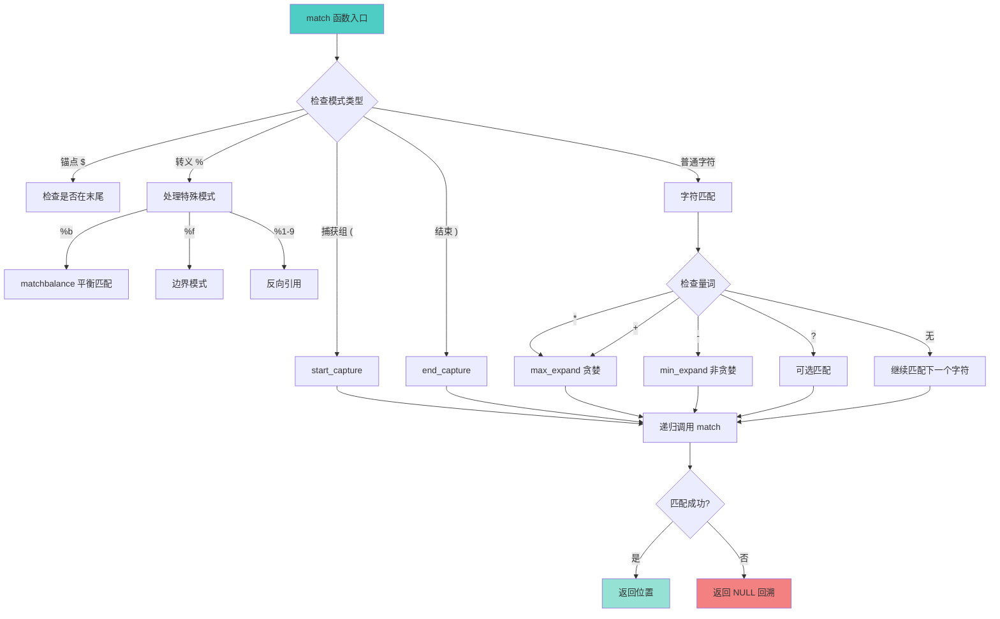

# 🔍 字符串模式匹配算法 (String Pattern Matching Algorithm)

<div align="center">

**Lua 5.1 的递归下降模式匹配器深度解析**

*非正则表达式 · 轻量级设计 · 高性能实现 · 递归算法*

</div>

---

## 📋 文档概述

### 核心主题

本文档深入剖析 Lua 5.1 字符串库（`lstrlib.c`）中的**模式匹配算法**实现。Lua 的模式匹配系统**不是正则表达式**，而是一个精心设计的轻量级匹配系统，通过**递归下降**算法实现。

### 关键特性

| 特性 | 说明 |
|------|------|
| 🎯 **算法类型** | 递归下降匹配（Recursive Descent Matching） |
| ⚡ **性能特点** | 无需预编译，即时匹配，O(nm) 时间复杂度 |
| 🪶 **代码规模** | 核心算法约 500 行 C 代码 |
| 🔒 **回溯支持** | 有限的回溯（只在量词处） |
| 🌐 **字符编码** | 支持 8-bit 字符集（非 UTF-8 原生支持） |

### 实现文件

```
lstrlib.c (约 800 行)
├── 模式匹配核心 (约 500 行)
│   ├── match()          - 主匹配函数
│   ├── matchbalance()   - 平衡匹配 %b
│   ├── start_capture()  - 捕获组开始
│   ├── end_capture()    - 捕获组结束
│   └── push_captures()  - 推送捕获结果
├── 字符类匹配 (约 100 行)
│   ├── match_class()    - 匹配字符类
│   └── singlematch()    - 单字符匹配
└── API 接口函数 (约 200 行)
    ├── str_find()       - string.find
    ├── str_match()      - string.match
    ├── gmatch()         - string.gmatch
    └── str_gsub()       - string.gsub
```

---

## 🎯 模式语法系统

### 1. 字符类 (Character Classes)

#### 预定义字符类

<table>
<tr>
<th width="15%">字符类</th>
<th width="25%">匹配内容</th>
<th width="30%">C 实现</th>
<th width="30%">示例</th>
</tr>

<tr>
<td><code>.</code></td>
<td>任意字符</td>
<td><code>true</code></td>
<td><code>"a.c"</code> 匹配 "abc", "a1c", "a@c"</td>
</tr>

<tr>
<td><code>%a</code></td>
<td>字母 [A-Za-z]</td>
<td><code>isalpha(c)</code></td>
<td><code>"%a+"</code> 匹配 "hello"</td>
</tr>

<tr>
<td><code>%c</code></td>
<td>控制字符</td>
<td><code>iscntrl(c)</code></td>
<td><code>"%c"</code> 匹配 '\n', '\t'</td>
</tr>

<tr>
<td><code>%d</code></td>
<td>数字 [0-9]</td>
<td><code>isdigit(c)</code></td>
<td><code>"%d+"</code> 匹配 "12345"</td>
</tr>

<tr>
<td><code>%l</code></td>
<td>小写字母 [a-z]</td>
<td><code>islower(c)</code></td>
<td><code>"%l+"</code> 匹配 "hello"</td>
</tr>

<tr>
<td><code>%p</code></td>
<td>标点符号</td>
<td><code>ispunct(c)</code></td>
<td><code>"%p"</code> 匹配 '.', '!', '?'</td>
</tr>

<tr>
<td><code>%s</code></td>
<td>空白字符</td>
<td><code>isspace(c)</code></td>
<td><code>"%s+"</code> 匹配 "  \t\n"</td>
</tr>

<tr>
<td><code>%u</code></td>
<td>大写字母 [A-Z]</td>
<td><code>isupper(c)</code></td>
<td><code>"%u+"</code> 匹配 "HELLO"</td>
</tr>

<tr>
<td><code>%w</code></td>
<td>字母数字 [A-Za-z0-9]</td>
<td><code>isalnum(c)</code></td>
<td><code>"%w+"</code> 匹配 "hello123"</td>
</tr>

<tr>
<td><code>%x</code></td>
<td>十六进制数字 [0-9A-Fa-f]</td>
<td><code>isxdigit(c)</code></td>
<td><code>"%x+"</code> 匹配 "1a2F"</td>
</tr>

<tr>
<td><code>%z</code></td>
<td>空字符 (NUL)</td>
<td><code>c == 0</code></td>
<td><code>"%z"</code> 匹配 '\0'</td>
</tr>

<tr>
<td><code>%A</code></td>
<td>非字母</td>
<td><code>!isalpha(c)</code></td>
<td><code>"%A"</code> 匹配 '1', '@'</td>
</tr>

<tr>
<td><code>%D</code></td>
<td>非数字</td>
<td><code>!isdigit(c)</code></td>
<td><code>"%D"</code> 匹配 'a', '!'</td>
</tr>

<tr>
<td><code>%S</code></td>
<td>非空白</td>
<td><code>!isspace(c)</code></td>
<td><code>"%S+"</code> 匹配 "hello"</td>
</tr>

<tr>
<td><code>%W</code></td>
<td>非字母数字</td>
<td><code>!isalnum(c)</code></td>
<td><code>"%W"</code> 匹配 '@', '!'</td>
</tr>
</table>

#### 字符集 (Character Sets)

| 语法 | 说明 | 示例 |
|------|------|------|
| `[abc]` | 匹配 a、b 或 c | `"[aeiou]"` 匹配元音字母 |
| `[^abc]` | 匹配除 a、b、c 外的字符 | `"[^0-9]"` 匹配非数字 |
| `[a-z]` | 匹配 a 到 z 的范围 | `"[a-zA-Z]"` 匹配所有字母 |
| `[%d%s]` | 匹配数字或空白 | 组合字符类 |

#### 转义字符

| 语法 | 含义 |
|------|------|
| `%x` | 转义魔法字符（x 为任意魔法字符） |
| `%%` | 匹配 `%` 字符 |
| `%.` | 匹配 `.` 字符 |
| `%[` | 匹配 `[` 字符 |

**魔法字符列表**：`^ $ ( ) % . [ ] * + - ?`

---

### 2. 量词 (Quantifiers)

#### 量词类型

<table>
<tr>
<th width="15%">量词</th>
<th width="25%">匹配次数</th>
<th width="20%">贪婪性</th>
<th width="40%">示例</th>
</tr>

<tr>
<td><code>*</code></td>
<td>0 次或多次</td>
<td>贪婪（最长匹配）</td>
<td><code>"a*"</code> 在 "aaa" 中匹配 "aaa"</td>
</tr>

<tr>
<td><code>+</code></td>
<td>1 次或多次</td>
<td>贪婪</td>
<td><code>"a+"</code> 在 "aaa" 中匹配 "aaa"</td>
</tr>

<tr>
<td><code>-</code></td>
<td>0 次或多次</td>
<td>非贪婪（最短匹配）</td>
<td><code>"a-"</code> 在 "aaa" 中匹配 ""（空）</td>
</tr>

<tr>
<td><code>?</code></td>
<td>0 次或 1 次</td>
<td>贪婪</td>
<td><code>"a?"</code> 在 "aa" 中匹配 "a"</td>
</tr>
</table>

#### 量词行为示例

```lua
local s = "aaabbb"

-- 贪婪匹配 *
print(s:match("a*"))      -- "aaa" (尽可能多)
print(s:match("a*b*"))    -- "aaabbb" (两者都贪婪)

-- 非贪婪匹配 -
print(s:match("a-"))      -- "" (尽可能少，0次)
print(s:match("a-b+"))    -- "abbb" (a 最少，b 最多)

-- 可选匹配 ?
print(s:match("a?"))      -- "a" (最多1次)
print(s:match("c?a"))     -- "a" (c 不存在，匹配0次)

-- + 要求至少1次
print(s:match("c+"))      -- nil (没有 c)
print(s:match("a+"))      -- "aaa"
```

---

### 3. 锚点 (Anchors)

| 锚点 | 位置 | 示例 |
|------|------|------|
| `^` | 字符串开头 | `"^hello"` 只匹配开头的 "hello" |
| `$` | 字符串结尾 | `"world$"` 只匹配结尾的 "world" |
| `^...$` | 完整匹配 | `"^%d+$"` 要求整个字符串都是数字 |

#### 锚点行为

```lua
local s = "hello world hello"

-- 无锚点：查找任意位置
print(s:find("hello"))        -- 1, 5 (第一次出现)

-- 开头锚点
print(s:find("^hello"))       -- 1, 5 (必须在开头)
print(s:find("^world"))       -- nil (不在开头)

-- 结尾锚点
print(s:find("hello$"))       -- 13, 17 (必须在结尾)
print(s:find("world$"))       -- nil (不在结尾)

-- 完整匹配
print(s:match("^hello$"))     -- nil (不完全匹配)
print(("hello"):match("^hello$"))  -- "hello" (完全匹配)
```

---

### 4. 捕获 (Captures)

#### 捕获类型

<table>
<tr>
<th width="20%">语法</th>
<th width="30%">类型</th>
<th width="50%">说明</th>
</tr>

<tr>
<td><code>(pattern)</code></td>
<td>普通捕获</td>
<td>捕获匹配的子串</td>
</tr>

<tr>
<td><code>()</code></td>
<td>位置捕获</td>
<td>捕获当前位置（索引号）</td>
</tr>

<tr>
<td><code>%n</code></td>
<td>反向引用</td>
<td>引用第 n 个捕获的内容（n=1-9）</td>
</tr>

<tr>
<td><code>%b()</code></td>
<td>平衡捕获</td>
<td>匹配平衡的括号对</td>
</tr>

<tr>
<td><code>%f[set]</code></td>
<td>边界模式</td>
<td>匹配字符类边界（Lua 5.2+）</td>
</tr>
</table>

#### 捕获示例

```lua
-- 1. 普通捕获
local name, age = ("John:25"):match("(%a+):(%d+)")
print(name, age)  -- "John", "25"

-- 2. 位置捕获
local s = "hello world"
local start, finish = s:match("()world()")
print(start, finish)  -- 7, 12

-- 3. 反向引用（匹配重复）
local s = "the the"
print(s:match("(%w+)%s+%1"))  -- "the" (匹配 "the the")

-- 4. 平衡捕获
local code = "func(a, b, c)"
print(code:match("%b()"))  -- "(a, b, c)"

local html = "<div><p>text</p></div>"
print(html:match("%b<>"))  -- "<div>" (第一个平衡对)

-- 5. 嵌套捕获
local email = "user@example.com"
local user, domain, tld = email:match("(%w+)@(%w+)%.(%w+)")
print(user, domain, tld)  -- "user", "example", "com"
```

---

## 🔧 核心数据结构

### MatchState 结构体

`MatchState` 是模式匹配的核心状态机，存储匹配过程中的所有状态信息。

```c
/**
 * @brief 模式匹配状态机
 * 
 * 该结构体在整个匹配过程中传递，维护匹配状态、捕获信息和源字符串边界。
 */
typedef struct MatchState {
    /* 源字符串信息 */
    const char *src_init;   /* 源字符串起始位置 */
    const char *src_end;    /* 源字符串结束位置（不包含） */
    
    /* Lua 状态机 */
    lua_State *L;           /* Lua 虚拟机指针，用于错误处理和栈操作 */
    
    /* 捕获信息 */
    int level;              /* 当前捕获组嵌套层级（0 表示无捕获） */
    struct {
        const char *init;   /* 捕获起始位置 */
        ptrdiff_t len;      /* 捕获长度（-1 表示位置捕获） */
    } capture[LUA_MAXCAPTURES];  /* 最多 32 个捕获组 */
} MatchState;
```

#### 字段详解

| 字段 | 类型 | 用途 |
|------|------|------|
| `src_init` | `const char*` | 指向源字符串的起始位置，用于计算相对偏移 |
| `src_end` | `const char*` | 指向源字符串的结束位置，用于边界检查 |
| `L` | `lua_State*` | Lua 虚拟机指针，用于调用 `luaL_error` 等 API |
| `level` | `int` | 当前活跃的捕获组数量（0-31） |
| `capture[i].init` | `const char*` | 第 i 个捕获组的起始位置 |
| `capture[i].len` | `ptrdiff_t` | 捕获长度，`-1` 表示位置捕获 |

#### 捕获组管理

```c
/* 最大捕获组数量 */
#define LUA_MAXCAPTURES  32

/* 捕获类型标记 */
#define CAP_UNFINISHED  (-1)  /* 捕获尚未结束 */
#define CAP_POSITION    (-2)  /* 位置捕获 () */

/**
 * @brief 开始一个新的捕获组
 */
static const char *start_capture(MatchState *ms, const char *s,
                                   const char *p, int what) {
    const char *res;
    int level = ms->level;
    
    if (level >= LUA_MAXCAPTURES) 
        luaL_error(ms->L, "too many captures");
    
    ms->capture[level].init = s;      /* 记录起始位置 */
    ms->capture[level].len = what;    /* 标记类型 */
    ms->level = level + 1;            /* 增加层级 */
    
    if ((res = match(ms, s, p)) == NULL)  /* 匹配失败 */
        ms->level--;  /* 回滚层级 */
    
    return res;
}

/**
 * @brief 结束当前捕获组
 */
static const char *end_capture(MatchState *ms, const char *s,
                                 const char *p) {
    int l = capture_to_close(ms);  /* 查找未结束的捕获 */
    const char *res;
    
    ms->capture[l].len = s - ms->capture[l].init;  /* 计算长度 */
    
    if ((res = match(ms, s, p)) == NULL)  /* 匹配失败 */
        ms->capture[l].len = CAP_UNFINISHED;  /* 回滚状态 */
    
    return res;
}
```

---

## 🎯 递归下降匹配算法

### 算法概述

Lua 的模式匹配器使用**递归下降（Recursive Descent）**算法，这是一种自顶向下的解析策略：



### 核心匹配函数

```c
/**
 * @brief 模式匹配的核心递归函数
 * 
 * @param ms    匹配状态机
 * @param s     当前要匹配的源字符串位置
 * @param p     当前要匹配的模式位置
 * @return      匹配成功返回匹配结束位置，失败返回 NULL
 * 
 * 算法特点：
 * - 递归下降：自顶向下解析模式
 * - 回溯：在量词和捕获组失败时回溯
 * - 尾递归优化：使用 goto 减少栈深度
 */
static const char *match(MatchState *ms, const char *s, const char *p) {
    init: /* 尾递归优化的入口点 */
    
    /* 模式结束检查 */
    if (*p == '\0') {
        return s;  /* 模式完全匹配，返回当前位置 */
    }
    
    switch (*p) {
        
        /* === 捕获组处理 === */
        case '(': {
            if (*(p+1) == ')') {
                /* 位置捕获 () */
                return start_capture(ms, s, p+2, CAP_POSITION);
            } else {
                /* 普通捕获 (...) */
                return start_capture(ms, s, p+1, CAP_UNFINISHED);
            }
        }
        
        case ')': {
            /* 捕获组结束 */
            return end_capture(ms, s, p+1);
        }
        
        /* === 锚点处理 === */
        case '$': {
            if (*(p+1) == '\0') {
                /* $ 必须在模式末尾 */
                return (s == ms->src_end) ? s : NULL;
            } else {
                goto dflt;  /* $ 不在末尾，作为普通字符处理 */
            }
        }
        
        /* === 转义字符处理 === */
        case L_ESC: {  /* L_ESC = '%' */
            switch (*(p+1)) {
                
                /* 平衡匹配 %bxy */
                case 'b': {
                    s = matchbalance(ms, s, p+2);
                    if (s == NULL) return NULL;
                    p += 4;  /* 跳过 %bxy */
                    goto init;  /* 尾递归优化 */
                }
                
                /* 边界模式 %f[set] (Lua 5.2+) */
                case 'f': {
                    const char *ep;
                    char previous;
                    p += 2;
                    if (*p != '[')
                        luaL_error(ms->L, "missing '[' after '%%f' in pattern");
                    
                    /* 检查边界条件 */
                    ep = classend(ms, p);
                    previous = (s == ms->src_init) ? '\0' : *(s-1);
                    
                    if (matchbracketclass(uchar(previous), p, ep-1) ||
                       !matchbracketclass(uchar(*s), p, ep-1))
                        return NULL;
                    
                    p = ep;
                    goto init;
                }
                
                /* 反向引用 %1-%9 */
                case '1': case '2': case '3':
                case '4': case '5': case '6':
                case '7': case '8': case '9': {
                    s = match_capture(ms, s, *(p+1));
                    if (s == NULL) return NULL;
                    p += 2;
                    goto init;
                }
                
                default: {
                    goto dflt;  /* 其他转义字符（%d, %a 等）交给默认处理 */
                }
            }
        }
        
        /* === 默认处理：普通字符和字符类 === */
        default: dflt: {
            /* 获取当前模式字符类的结束位置 */
            const char *ep = classend(ms, p);
            
            /* 检查当前字符是否匹配 */
            int m = (s < ms->src_end) && singlematch(uchar(*s), p, ep);
            
            /* 检查量词 */
            switch (*ep) {
                case '?': {  /* 可选匹配：0 或 1 次 */
                    const char *res;
                    if (m && ((res = match(ms, s+1, ep+1)) != NULL))
                        return res;  /* 匹配 1 次成功 */
                    p = ep + 1;  /* 匹配 0 次，跳过量词 */
                    goto init;
                }
                
                case '*': {  /* 贪婪匹配：0 次或多次 */
                    return max_expand(ms, s, p, ep);
                }
                
                case '+': {  /* 贪婪匹配：1 次或多次 */
                    return (m ? max_expand(ms, s+1, p, ep) : NULL);
                }
                
                case '-': {  /* 非贪婪匹配：0 次或多次 */
                    return min_expand(ms, s, p, ep);
                }
                
                default: {  /* 无量词：必须匹配 1 次 */
                    if (!m) return NULL;
                    s++;  /* 前进一个字符 */
                    p = ep;  /* 前进到下一个模式 */
                    goto init;  /* 尾递归优化 */
                }
            }
        }
    }
}
```

---

## 🔄 量词展开算法

### 1. 贪婪匹配（max_expand）

**算法目标**：尽可能多地匹配字符，然后回溯。

```c
/**
 * @brief 贪婪量词展开（* 和 +）
 * 
 * 策略：先匹配尽可能多的字符，然后逐步回溯直到找到成功路径。
 * 
 * @param ms  匹配状态机
 * @param s   当前源字符串位置
 * @param p   模式中量词前的字符类起始位置
 * @param ep  模式中量词位置
 * @return    匹配成功的位置，失败返回 NULL
 */
static const char *max_expand(MatchState *ms, const char *s,
                               const char *p, const char *ep) {
    ptrdiff_t i = 0;  /* 已匹配的字符数 */
    
    /* 阶段 1：贪婪地匹配尽可能多的字符 */
    while ((s + i) < ms->src_end && singlematch(uchar(*(s+i)), p, ep)) {
        i++;
    }
    
    /* 阶段 2：从最长匹配开始回溯 */
    while (i >= 0) {
        const char *res = match(ms, s + i, ep + 1);  /* 尝试匹配剩余模式 */
        if (res != NULL) 
            return res;  /* 成功 */
        i--;  /* 回溯一个字符 */
    }
    
    return NULL;  /* 所有回溯尝试都失败 */
}
```

#### 贪婪匹配行为示例

```lua
local s = "aaabbb"

-- 示例 1：a* 匹配 "aaa"
--   1. max_expand 匹配 "aaa" (i=3)
--   2. 尝试匹配剩余模式（空），成功
--   结果："aaa"

-- 示例 2：a*b 匹配 "aaabbb"
--   1. max_expand 匹配 "aaa" (i=3)
--   2. 尝试匹配 "b"，失败（当前是 'b' 但需要完整匹配）
--   3. 回溯到 i=2，匹配 "aa"，尝试 "ab"，成功
--   结果："aaab"

-- 示例 3：a*b* 匹配 "aaabbb"
--   1. 第一个 a* 匹配 "aaa"
--   2. 第二个 b* 匹配 "bbb"
--   结果："aaabbb"
```

### 2. 非贪婪匹配（min_expand）

**算法目标**：尽可能少地匹配字符，只在必要时增加匹配。

```c
/**
 * @brief 非贪婪量词展开（-）
 * 
 * 策略：从 0 开始，逐步增加匹配字符数，直到找到成功路径。
 * 
 * @param ms  匹配状态机
 * @param s   当前源字符串位置
 * @param p   模式中量词前的字符类起始位置
 * @param ep  模式中量词位置
 * @return    匹配成功的位置，失败返回 NULL
 */
static const char *min_expand(MatchState *ms, const char *s,
                               const char *p, const char *ep) {
    for (;;) {
        /* 尝试匹配剩余模式（不增加当前字符类的匹配） */
        const char *res = match(ms, s, ep + 1);
        if (res != NULL)
            return res;  /* 成功，立即返回 */
        
        /* 失败，尝试多匹配一个字符 */
        if (s < ms->src_end && singlematch(uchar(*s), p, ep)) {
            s++;  /* 增加匹配字符数 */
        } else {
            return NULL;  /* 无法再匹配更多字符 */
        }
    }
}
```

#### 非贪婪匹配行为示例

```lua
local s = "aaabbb"

-- 示例 1：a- 匹配 ""
--   1. min_expand 从 0 开始
--   2. 尝试匹配剩余模式（空），成功
--   结果：""（空字符串）

-- 示例 2：a-b+ 匹配 "abbb"
--   1. a- 先尝试匹配 0 个 'a'，失败（无 'b'）
--   2. a- 匹配 1 个 'a'，b+ 匹配 "bbb"，成功
--   结果："abbb"

-- 示例 3：使用 - 提取标签内容
local html = "<b>bold</b><i>italic</i>"
local tag = html:match("<(.-)>")
print(tag)  -- "b" (非贪婪，只匹配第一个标签)

-- 如果使用贪婪 *
local tag2 = html:match("<(.*)>")
print(tag2)  -- "b>bold</b><i>italic</i" (匹配到最后一个 >)
```

---

### 3. 可选匹配（? 量词）

```c
/* 在 match() 函数中的 '?' 处理 */
case '?': {
    const char *res;
    
    /* 优先尝试匹配 1 次 */
    if (m && ((res = match(ms, s+1, ep+1)) != NULL))
        return res;
    
    /* 失败则匹配 0 次 */
    p = ep + 1;
    goto init;
}
```

---

## 🎨 特殊模式实现

### 1. 平衡匹配（%bxy）

**功能**：匹配平衡的括号对（或任意配对符号）。

**语法**：`%bxy`，其中 x 是开始符号，y 是结束符号。

```c
/**
 * @brief 匹配平衡的括号对
 * 
 * 算法：使用计数器跟踪嵌套层级
 * 
 * @param ms  匹配状态机
 * @param s   当前源字符串位置
 * @param p   模式位置（指向 %b 后的两个字符）
 * @return    匹配成功的结束位置，失败返回 NULL
 */
static const char *matchbalance(MatchState *ms, const char *s,
                                 const char *p) {
    /* 检查至少有两个字符 */
    if (*p == 0 || *(p+1) == 0)
        luaL_error(ms->L, "unbalanced pattern");
    
    /* 检查第一个字符是否匹配开始符号 */
    if (*s != *p) 
        return NULL;
    
    int b = *p;      /* 开始符号（如 '('） */
    int e = *(p+1);  /* 结束符号（如 ')'） */
    int cont = 1;    /* 嵌套计数器 */
    
    /* 向前扫描，维护嵌套层级 */
    while (++s < ms->src_end) {
        if (*s == e) {
            if (--cont == 0)  /* 层级归零，找到匹配 */
                return s + 1;
        } else if (*s == b) {
            cont++;  /* 遇到新的开始符号，层级增加 */
        }
    }
    
    return NULL;  /* 未找到匹配的结束符号 */
}
```

#### 平衡匹配示例

```lua
-- 示例 1：匹配括号
local code = "func(a, (b + c), d)"
print(code:match("%b()"))  -- "(a, (b + c), d)" (嵌套括号)

-- 示例 2：匹配尖括号
local html = "<div><span>text</span></div>"
print(html:match("%b<>"))  -- "<div>" (第一个平衡对)

-- 示例 3：匹配自定义符号
local text = "[outer [inner] text]"
print(text:match("%b[]"))  -- "[outer [inner] text]"

-- 示例 4：嵌套层级测试
local nested = "((()))"
print(nested:match("%b()"))  -- "((()))"

-- 示例 5：不平衡时返回 nil
local unbalanced = "(abc"
print(unbalanced:match("%b()"))  -- nil
```

---

### 2. 反向引用（%1-%9）

**功能**：引用之前捕获组的内容，用于匹配重复模式。

```c
/**
 * @brief 匹配反向引用
 * 
 * 算法：获取之前捕获的内容，逐字符比较
 * 
 * @param ms  匹配状态机
 * @param s   当前源字符串位置
 * @param l   捕获组编号（1-9）
 * @return    匹配成功的结束位置，失败返回 NULL
 */
static const char *match_capture(MatchState *ms, const char *s, int l) {
    size_t len;
    l = check_capture(ms, l);  /* 验证捕获组编号 */
    len = ms->capture[l].len;  /* 获取捕获长度 */
    
    /* 检查剩余字符串长度是否足够 */
    if ((size_t)(ms->src_end - s) >= len &&
        memcmp(ms->capture[l].init, s, len) == 0) {
        return s + len;  /* 匹配成功 */
    } else {
        return NULL;  /* 匹配失败 */
    }
}
```

#### 反向引用示例

```lua
-- 示例 1：匹配重复单词
local s = "the the"
print(s:match("(%w+)%s+%1"))  -- "the" (匹配 "the the")

-- 示例 2：匹配 XML 标签
local xml = "<tag>content</tag>"
local tag, content = xml:match("<(%w+)>(.-)</%1>")
print(tag, content)  -- "tag", "content"

-- 示例 3：匹配引号内的内容
local quoted = '"hello"'
print(quoted:match('(["\']).-%1'))  -- "hello" (匹配配对引号)

-- 示例 4：不匹配的情况
local s2 = "the other"
print(s2:match("(%w+)%s+%1"))  -- nil (不是重复单词)

-- 示例 5：多个反向引用
local s3 = "abc abc abc"
print(s3:match("(%w+)%s+%1%s+%1"))  -- "abc" (三次重复)
```

---

### 3. 字符类与字符集

#### 字符类匹配实现

```c
/**
 * @brief 检查单个字符是否匹配字符类
 * 
 * @param c   要检查的字符
 * @param p   模式起始位置
 * @param ep  模式结束位置
 * @return    匹配返回 1，否则返回 0
 */
static int singlematch(int c, const char *p, const char *ep) {
    switch (*p) {
        case '.':  /* 匹配任意字符 */
            return 1;
        
        case L_ESC:  /* 转义字符类 %d, %a, 等 */
            return match_class(c, *(p+1));
        
        case '[':  /* 字符集 [abc] 或 [^abc] */
            return matchbracketclass(c, p, ep-1);
        
        default:  /* 普通字符 */
            return (*(p) == c);
    }
}

/**
 * @brief 匹配预定义字符类
 * 
 * @param c  要检查的字符
 * @param cl 字符类标识（'a', 'd', 's', 等）
 * @return   匹配返回 1，否则返回 0
 */
static int match_class(int c, int cl) {
    int res;
    switch (tolower(cl)) {
        case 'a': res = isalpha(c); break;   /* 字母 */
        case 'c': res = iscntrl(c); break;   /* 控制字符 */
        case 'd': res = isdigit(c); break;   /* 数字 */
        case 'l': res = islower(c); break;   /* 小写 */
        case 'p': res = ispunct(c); break;   /* 标点 */
        case 's': res = isspace(c); break;   /* 空白 */
        case 'u': res = isupper(c); break;   /* 大写 */
        case 'w': res = isalnum(c); break;   /* 字母数字 */
        case 'x': res = isxdigit(c); break;  /* 十六进制 */
        case 'z': res = (c == 0); break;     /* NUL 字符 */
        default: return (cl == c);  /* 普通字符 */
    }
    
    /* 大写字符类表示取反（如 %D = 非数字） */
    return (islower(cl) ? res : !res);
}
```

#### 字符集匹配实现

```c
/**
 * @brief 匹配字符集 [abc] 或 [^abc]
 * 
 * @param c   要检查的字符
 * @param p   字符集起始位置（'[' 之后）
 * @param ec  字符集结束位置（']' 之前）
 * @return    匹配返回 1，否则返回 0
 */
static int matchbracketclass(int c, const char *p, const char *ec) {
    int sig = 1;  /* 默认正向匹配 */
    
    /* 检查是否是取反字符集 [^...] */
    if (*(p+1) == '^') {
        sig = 0;
        p++;
    }
    
    /* 遍历字符集 */
    while (++p < ec) {
        if (*p == L_ESC) {  /* 转义字符类 */
            p++;
            if (match_class(c, *p))
                return sig;
        } else if (*(p+1) == '-' && (p+2) < ec) {
            /* 范围匹配 a-z */
            p += 2;
            if (*(p-2) <= c && c <= *p)
                return sig;
        } else if (*p == c) {
            /* 单字符匹配 */
            return sig;
        }
    }
    
    return !sig;  /* 未匹配，返回相反结果 */
}
```

---

## 📊 性能分析

### 时间复杂度

| 操作 | 最佳情况 | 平均情况 | 最坏情况 | 说明 |
|------|----------|----------|----------|------|
| 简单匹配 | O(n) | O(n) | O(n) | 无回溯 |
| 贪婪量词 * | O(n) | O(n²) | O(n²) | 需要回溯 |
| 非贪婪量词 - | O(n) | O(n) | O(n²) | 较少回溯 |
| 反向引用 | O(nm) | O(nm) | O(nm) | m=捕获长度 |
| 平衡匹配 | O(n) | O(n) | O(n) | 单次扫描 |

### 空间复杂度

| 结构 | 空间占用 | 说明 |
|------|----------|------|
| `MatchState` | ~300 字节 | 固定大小 |
| 捕获数组 | 32 × 16 = 512 字节 | 最多 32 个捕获组 |
| 递归栈 | O(m) | m=模式长度 |

### 性能优化技巧

#### 1. 避免过度回溯

```lua
-- ❌ 慢：过度回溯
local s = "aaaaaaaaab"
local t1 = os.clock()
for i = 1, 10000 do
    s:match("a*a*a*a*b")  -- 多个贪婪量词导致大量回溯
end
print(os.clock() - t1)  -- 约 2-3 秒

-- ✅ 快：减少回溯
local t2 = os.clock()
for i = 1, 10000 do
    s:match("a+b")  -- 简化模式
end
print(os.clock() - t2)  -- 约 0.01 秒
```

#### 2. 使用非贪婪量词

```lua
-- ❌ 慢：贪婪匹配需要回溯
local html = "<div>" .. string.rep("text", 1000) .. "</div>"
html:match("<(.*)>")  -- 匹配到最后一个 >，然后回溯

-- ✅ 快：非贪婪匹配
html:match("<(.-)>")  -- 匹配到第一个 > 就停止
```

#### 3. 预编译模式（不适用）

**注意**：Lua 的模式匹配器**不支持预编译**，每次调用都会重新解析模式。

```lua
-- 无法预编译，以下代码每次都重新解析模式
local pattern = "%d+"
for line in io.lines("data.txt") do
    line:match(pattern)  -- 每次都解析 "%d+"
end

-- 优化建议：将匹配逻辑移到 C 扩展中
```

---

## 🔗 API 接口函数

### string.find 实现

```c
/**
 * @brief string.find(s, pattern [, init [, plain]])
 * 
 * 查找模式在字符串中的首次出现位置
 * 
 * @return start, end [, captures...]
 */
static int str_find(lua_State *L) {
    size_t l1, l2;
    const char *s = luaL_checklstring(L, 1, &l1);  /* 源字符串 */
    const char *p = luaL_checklstring(L, 2, &l2);  /* 模式 */
    ptrdiff_t init = posrelat(luaL_optinteger(L, 3, 1), l1) - 1;  /* 起始位置 */
    
    if (init < 0) init = 0;
    else if ((size_t)init > l1) init = (ptrdiff_t)l1;
    
    /* plain 模式：普通字符串查找 */
    if (lua_toboolean(L, 4) || strpbrk(p, SPECIALS) == NULL) {
        const char *s2 = lmemfind(s + init, l1 - init, p, l2);
        if (s2) {
            lua_pushinteger(L, s2 - s + 1);
            lua_pushinteger(L, s2 - s + l2);
            return 2;
        }
    } else {
        /* 模式匹配 */
        MatchState ms;
        const char *s1 = s + init;
        int anchor = (*p == '^') ? (p++, 1) : 0;
        
        ms.L = L;
        ms.src_init = s;
        ms.src_end = s + l1;
        
        do {
            const char *res;
            ms.level = 0;
            if ((res = match(&ms, s1, p)) != NULL) {
                lua_pushinteger(L, s1 - s + 1);  /* start */
                lua_pushinteger(L, res - s);     /* end */
                return push_captures(&ms, NULL, 0) + 2;
            }
        } while (s1++ < ms.src_end && !anchor);
    }
    
    lua_pushnil(L);  /* 未找到 */
    return 1;
}
```

### string.match 实现

```c
/**
 * @brief string.match(s, pattern [, init])
 * 
 * 提取匹配的子串或捕获组
 * 
 * @return captures... 或 整个匹配
 */
static int str_match(lua_State *L) {
    return str_find_aux(L, 0);  /* find=0 表示只返回捕获 */
}
```

### string.gsub 实现

```c
/**
 * @brief string.gsub(s, pattern, repl [, n])
 * 
 * 全局替换
 * 
 * @return 替换后的字符串, 替换次数
 */
static int str_gsub(lua_State *L) {
    size_t srcl;
    const char *src = luaL_checklstring(L, 1, &srcl);
    const char *p = luaL_checkstring(L, 2);
    int tr = lua_type(L, 3);  /* 替换类型 */
    int max_s = luaL_optint(L, 4, srcl+1);  /* 最大替换次数 */
    int anchor = (*p == '^') ? (p++, 1) : 0;
    int n = 0;  /* 替换计数 */
    MatchState ms;
    luaL_Buffer b;
    
    luaL_buffinit(L, &b);
    ms.L = L;
    ms.src_init = src;
    ms.src_end = src + srcl;
    
    while (n < max_s) {
        const char *e;
        ms.level = 0;
        e = match(&ms, src, p);
        
        if (e) {
            n++;
            add_value(&ms, &b, src, e, tr);  /* 添加替换内容 */
        }
        
        if (e && e > src)  /* 非空匹配 */
            src = e;
        else if (src < ms.src_end)
            luaL_addchar(&b, *src++);
        else
            break;
        
        if (anchor) break;
    }
    
    luaL_addlstring(&b, src, ms.src_end - src);
    luaL_pushresult(&b);
    lua_pushinteger(L, n);  /* 替换次数 */
    return 2;
}
```

---

## 🎓 学习建议

### 学习路径

**初级**（理解使用）：
1. 掌握所有模式语法（字符类、量词、捕获）
2. 练习常见场景（提取、验证、替换）
3. 理解贪婪 vs 非贪婪的区别

**中级**（理解原理）：
1. 阅读本文档的算法部分
2. 分析简单模式的匹配过程
3. 理解回溯机制

**高级**（源码研究）：
1. 阅读 `lstrlib.c` 完整源码
2. 调试复杂模式的匹配过程
3. 研究性能优化技巧

### 实践项目

- ✅ **项目 1**：实现 email 验证器
- ✅ **项目 2**：编写 HTML 标签提取工具
- ✅ **项目 3**：开发配置文件解析器
- ✅ **项目 4**：创建简单的模板引擎

---

## 🔗 相关模块导航

### 依赖模块

- [标准库模块](wiki_lib.md) - 字符串库概览
- [对象系统模块](../object/wiki_object.md) - 字符串对象实现
- [虚拟机模块](../vm/wiki_vm.md) - 字符串操作指令

### 相关主题

- [字符串池化](../object/wiki_object.md#string-interning) - 字符串内部表示
- [垃圾回收](../gc/wiki_gc.md) - 字符串生命周期管理

---

<div align="center">

**📖 继续学习**

[← 返回标准库](wiki_lib.md) · [表操作优化 →](table_operations.md)

---

**文档信息**

📅 最后更新：2025-10-26  
📌 文档版本：v1.0 (DeepWiki 优化版)  
🔖 基于 Lua 版本：5.1.5  
✍️ 维护者：lua_c_analysis 项目组

</div>
