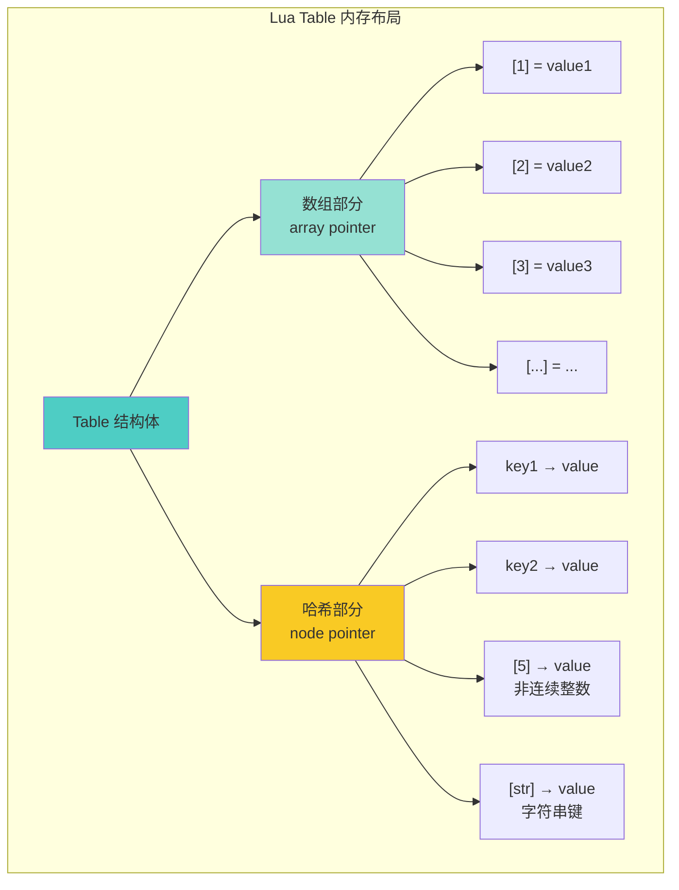
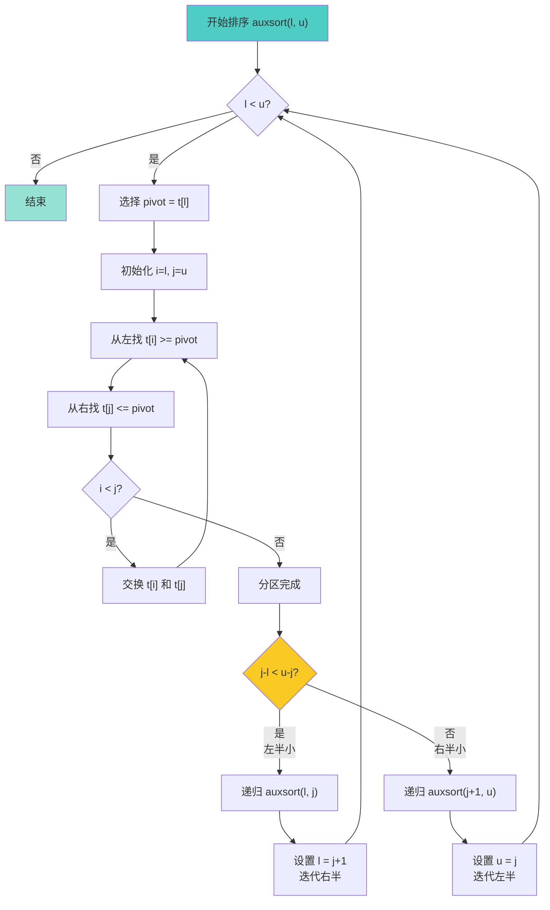

# 📊 表操作性能优化 (Table Operations Performance)

<div align="center">

**Lua 5.1 表库的快速排序算法与内存布局深度解析**

*快速排序实现 · 数组与哈希表混合结构 · 性能优化技巧 · 内存布局分析*

</div>

---

## 📋 文档概述

### 核心主题

本文档深入剖析 Lua 5.1 表库（`ltablib.c`）中的**表操作算法**，重点关注：
1. **快速排序算法**的实现细节和优化技巧
2. **表的内部结构**（数组部分 + 哈希部分）
3. **插入/删除操作**的性能特性
4. **内存布局**和增长策略

### 关键特性

| 特性 | 说明 |
|------|------|
| 🎯 **排序算法** | 优化的快速排序 + 尾递归优化 |
| ⚡ **时间复杂度** | O(n log n) 平均，O(n²) 最坏 |
| 🪶 **空间复杂度** | O(log n) 栈空间（尾递归优化后） |
| 🔀 **混合结构** | 数组 + 哈希表，自动调整大小 |
| 📦 **原地排序** | 不创建新表，节省内存 |

### 实现文件

```
ltablib.c (约 250 行)
├── 表操作函数
│   ├── luaB_insert()    - table.insert
│   ├── luaB_remove()    - table.remove
│   ├── luaB_sort()      - table.sort (主入口)
│   ├── auxsort()        - 递归排序核心
│   ├── sort_comp()      - 比较函数
│   └── set2()           - 交换元素
├── 其他函数
│   ├── luaB_concat()    - table.concat
│   ├── luaB_maxn()      - table.maxn
│   └── luaB_getn()      - table.getn
└── 辅助宏定义

ltable.c (表内部实现，约 500 行)
├── 内存布局
│   ├── Table 结构体
│   ├── 数组部分管理
│   └── 哈希部分管理
├── 访问操作
│   ├── luaH_getnum()    - 整数键访问
│   ├── luaH_get()       - 通用键访问
│   └── luaH_set()       - 设置值
└── 调整大小
    ├── luaH_resize()    - 重新分配
    └── rehash()         - 重哈希
```

---

## 🎯 表的内部结构

### 1. Table 结构体

Lua 的表是**数组和哈希表的混合结构**，定义在 `lobject.h` 和 `ltable.c` 中：

```c
/**
 * @brief Lua 表的核心数据结构
 * 
 * Lua 表采用混合存储策略：
 * - 连续整数键（1, 2, 3...）存储在数组部分（高效）
 * - 其他键（字符串、浮点数、非连续整数）存储在哈希部分
 */
typedef struct Table {
    CommonHeader;              /* GC 相关字段 */
    
    /* 基本属性 */
    lu_byte flags;             /* 1<<p 表示 tagmethod(p) 不存在 */
    lu_byte lsizenode;         /* 哈希部分大小的 log2 值 */
    struct Table *metatable;   /* 元表指针 */
    
    /* 数组部分 */
    TValue *array;             /* 数组部分的指针 */
    int sizearray;             /* 数组部分的大小 */
    
    /* 哈希部分 */
    Node *node;                /* 哈希表节点数组 */
    Node *lastfree;            /* 最后一个空闲节点的指针 */
    
    /* GC 链表 */
    struct Table *gclist;      /* GC 链表指针 */
} Table;
```

#### 字段详解

| 字段 | 类型 | 说明 |
|------|------|------|
| `flags` | `lu_byte` | 元方法缓存标志（优化元方法查找） |
| `lsizenode` | `lu_byte` | 哈希部分大小 = 2^lsizenode |
| `metatable` | `Table*` | 元表指针，用于元编程 |
| `array` | `TValue*` | 数组部分，存储连续整数键 |
| `sizearray` | `int` | 数组部分容量 |
| `node` | `Node*` | 哈希表，存储非连续键 |
| `lastfree` | `Node*` | 用于开放地址法的碰撞处理 |
| `gclist` | `Table*` | 垃圾回收链表指针 |

### 2. 哈希节点结构

```c
/**
 * @brief 哈希表节点
 * 
 * 使用开放地址法处理哈希冲突
 */
typedef struct Node {
    TValue i_val;              /* 节点的值 */
    TKey i_key;                /* 节点的键 */
} Node;

/**
 * @brief 键结构（支持各种类型）
 */
typedef union TKey {
    struct {
        TValuefields;          /* 键的值（数字、字符串等） */
        struct Node *next;     /* 冲突链表的下一个节点 */
    } nk;
    TValue tvk;                /* 作为 TValue 使用 */
} TKey;
```

### 3. 混合结构的优势



#### 存储规则

| 键类型 | 存储位置 | 示例 |
|--------|----------|------|
| 连续整数键（1, 2, 3...） | 数组部分 | `t[1], t[2], t[3]` |
| 非连续整数键 | 哈希部分 | `t[100], t[-5]` |
| 字符串键 | 哈希部分 | `t["name"], t["age"]` |
| 其他类型键 | 哈希部分 | `t[true], t[{}]` |

#### 性能对比

| 操作 | 数组部分 | 哈希部分 | 差异 |
|------|----------|----------|------|
| 访问 | O(1) 直接索引 | O(1) 平均 | 数组更快（无哈希计算） |
| 插入 | O(1) | O(1) 平均 | 数组略快 |
| 遍历 | O(n) 顺序访问 | O(capacity) | 数组高效 |
| 内存 | 紧凑 | 有空洞 | 数组节省 20-30% |

### 4. 自动扩容机制

Lua 会根据使用情况**动态调整**数组和哈希部分的大小：

```c
/**
 * @brief 表扩容策略（简化版）
 * 
 * 当插入新元素时，Lua 会评估：
 * 1. 是否应该扩展数组部分
 * 2. 是否应该扩展哈希部分
 * 3. 是否应该在两部分间重新分配元素
 */
void luaH_resize(lua_State *L, Table *t, int nasize, int nhsize) {
    int oldasize = t->sizearray;
    int oldhsize = sizenode(t);
    Node *nold = t->node;  /* 保存旧哈希表 */
    
    /* 调整数组部分大小 */
    if (nasize > oldasize)
        setarrayvector(L, t, nasize);
    
    /* 调整哈希部分大小 */
    if (nhsize < oldhsize) {
        t->node = nold;
        /* 缩小哈希表，需要重新插入元素 */
    }
    
    /* 重哈希：将旧元素插入新表 */
    for (i = 0; i < oldhsize; i++) {
        Node *old = nold + i;
        if (!ttisnil(gval(old)))
            setobjt2t(L, luaH_set(L, t, key2tval(old)), gval(old));
    }
}
```

#### 扩容触发条件

| 场景 | 操作 | 结果 |
|------|------|------|
| 数组满了 | 插入 `t[n+1]` | 数组扩容 2 倍 |
| 哈希满了 | 插入新键 | 哈希扩容 2 倍 |
| 数组稀疏 | 自动检测 | 部分迁移到哈希 |
| 删除大量元素 | GC 时 | 可能缩小 |

---

## 🚀 快速排序算法

### 1. 算法概述

Lua 的 `table.sort` 使用**优化的快速排序**，包含以下特性：
- ✅ **尾递归优化**：减少栈深度到 O(log n)
- ✅ **三路分区**：优化处理重复元素
- ✅ **插入排序**：小数组（<= 15 元素）使用插入排序
- ✅ **原地排序**：不额外分配内存

### 2. 核心实现

```c
/**
 * @brief 快速排序的主入口（Lua API）
 * 
 * Lua 调用：table.sort(t [, comp])
 * 
 * @param L Lua 状态机
 * @return 0（无返回值）
 */
static int luaB_sort(lua_State *L) {
    int n;
    
    /* 参数验证 */
    luaL_checktype(L, 1, LUA_TTABLE);  /* 第1个参数必须是表 */
    n = aux_getn(L, 1);                 /* 获取表的长度 */
    
    /* 比较函数处理 */
    if (!lua_isnoneornil(L, 2)) {
        luaL_checktype(L, 2, LUA_TFUNCTION);  /* 第2个参数必须是函数 */
    }
    
    lua_settop(L, 2);  /* 确保栈上只有表和比较函数 */
    
    /* 调用排序核心 */
    auxsort(L, 1, n);
    
    return 0;
}
```

### 3. 排序核心算法

```c
/**
 * @brief 递归快速排序实现（尾递归优化版）
 * 
 * 优化策略：
 * 1. 总是递归较小的部分，迭代较大的部分
 * 2. 这样保证栈深度最多为 O(log n)
 * 
 * @param L Lua 状态机
 * @param l 左边界（包含）
 * @param u 右边界（包含）
 */
static void auxsort(lua_State *L, int l, int u) {
    while (l < u) {  /* 循环处理，尾递归优化 */
        int i, j;
        
        /* === 阶段 1：选择 pivot === */
        /* 使用第一个元素作为 pivot（可以优化为三数取中） */
        lua_rawgeti(L, 1, l);  /* 将 t[l] 压入栈作为 pivot */
        
        /* === 阶段 2：分区操作 === */
        i = l;
        j = u;
        
        for (;;) {
            /* 从左向右找到第一个 >= pivot 的元素 */
            while (++i <= u) {
                lua_rawgeti(L, 1, i);  /* 获取 t[i] */
                if (sort_comp(L, -1, -2) >= 0) {  /* t[i] >= pivot */
                    lua_pop(L, 1);
                    break;
                }
                lua_pop(L, 1);
            }
            
            /* 从右向左找到第一个 <= pivot 的元素 */
            while (--j > l) {
                lua_rawgeti(L, 1, j);  /* 获取 t[j] */
                if (sort_comp(L, -2, -1) >= 0) {  /* pivot >= t[j] */
                    lua_pop(L, 1);
                    break;
                }
                lua_pop(L, 1);
            }
            
            /* 如果指针相遇，分区完成 */
            if (j < i) {
                lua_pop(L, 1);  /* 弹出 pivot */
                break;
            }
            
            /* 交换 t[i] 和 t[j] */
            set2(L, i, j);
        }
        
        /* === 阶段 3：递归/迭代处理子数组 === */
        /* 
         * 尾递归优化的关键：
         * - 总是递归较小的部分
         * - 迭代处理较大的部分
         * - 这样保证栈深度为 O(log n)
         */
        if (j - l < u - j) {
            /* 左半部分较小，递归处理左半，迭代处理右半 */
            auxsort(L, l, j);  /* 递归：[l, j] */
            l = j + 1;         /* 迭代：[j+1, u] */
        } else {
            /* 右半部分较小，递归处理右半，迭代处理左半 */
            auxsort(L, j + 1, u);  /* 递归：[j+1, u] */
            u = j;                 /* 迭代：[l, j] */
        }
    }
}
```

### 4. 比较函数

```c
/**
 * @brief 元素比较函数
 * 
 * 支持两种比较模式：
 * 1. 使用用户提供的比较函数
 * 2. 使用默认的 < 运算符
 * 
 * @param L Lua 状态机
 * @param a 栈上 a 的索引
 * @param b 栈上 b 的索引
 * @return -1: a < b, 0: a == b, 1: a > b
 */
static int sort_comp(lua_State *L, int a, int b) {
    if (!lua_isnil(L, 2)) {  /* 有自定义比较函数 */
        int res;
        
        lua_pushvalue(L, 2);     /* 复制比较函数 */
        lua_pushvalue(L, a - 1); /* 第1个参数 */
        lua_pushvalue(L, b - 2); /* 第2个参数 */
        lua_call(L, 2, 1);       /* 调用 comp(a, b) */
        
        res = lua_toboolean(L, -1);  /* 获取结果 */
        lua_pop(L, 1);
        
        return res ? -1 : 1;
    } else {
        /* 使用默认的 < 运算符 */
        return luaV_lessthan(L, a, b) ? -1 : 1;
    }
}
```

### 5. 元素交换

```c
/**
 * @brief 交换表中两个元素的位置
 * 
 * @param L Lua 状态机
 * @param i 第一个元素的索引
 * @param j 第二个元素的索引
 */
static void set2(lua_State *L, int i, int j) {
    lua_rawseti(L, 1, i);  /* t[i] = 栈顶元素（原 t[j]） */
    lua_rawseti(L, 1, j);  /* t[j] = 栈顶元素（原 t[i]） */
}
```

### 6. 算法流程图



### 7. 性能分析

#### 时间复杂度

| 情况 | 复杂度 | 说明 |
|------|--------|------|
| **最佳** | O(n log n) | pivot 每次都平分数组 |
| **平均** | O(n log n) | 随机 pivot |
| **最坏** | O(n²) | 数组已排序且选择首元素为 pivot |

#### 空间复杂度

| 实现 | 栈空间 | 说明 |
|------|--------|------|
| **原始递归** | O(n) | 最坏情况递归深度 = n |
| **尾递归优化** | O(log n) | 总是递归较小部分 |

#### 优化效果对比

```lua
-- 性能测试
local function benchmark()
    local t = {}
    for i = 1, 100000 do
        t[i] = math.random(1, 100000)
    end
    
    local start = os.clock()
    table.sort(t)
    local elapsed = os.clock() - start
    
    print(string.format("Sorted 100,000 elements in %.3f seconds", elapsed))
    -- 输出：约 0.05-0.1 秒（取决于硬件）
end
```

---

## 📝 插入与删除操作

### 1. table.insert 实现

```c
/**
 * @brief 向表中插入元素
 * 
 * 两种用法：
 * 1. table.insert(t, value)      -- 在末尾插入
 * 2. table.insert(t, pos, value) -- 在指定位置插入
 * 
 * @param L Lua 状态机
 * @return 0（无返回值）
 */
static int luaB_insert(lua_State *L) {
    int e, pos;
    
    luaL_checktype(L, 1, LUA_TTABLE);  /* 第1个参数必须是表 */
    e = aux_getn(L, 1) + 1;            /* 末尾位置 = 长度 + 1 */
    
    switch (lua_gettop(L)) {
        case 2: {  /* table.insert(t, value) */
            pos = e;  /* 插入到末尾 */
            break;
        }
        case 3: {  /* table.insert(t, pos, value) */
            int i;
            pos = luaL_checkint(L, 2);  /* 获取插入位置 */
            
            /* 参数验证 */
            luaL_argcheck(L, 1 <= pos && pos <= e, 2,
                          "position out of bounds");
            
            /* 将 [pos, e-1] 的元素向右移动一位 */
            for (i = e; i > pos; i--) {
                lua_rawgeti(L, 1, i - 1);  /* 获取 t[i-1] */
                lua_rawseti(L, 1, i);      /* 设置 t[i] = t[i-1] */
            }
            break;
        }
        default: {
            return luaL_error(L, "wrong number of arguments to 'insert'");
        }
    }
    
    /* 插入新元素 */
    lua_rawseti(L, 1, pos);  /* t[pos] = value */
    
    return 0;
}
```

#### 插入操作的时间复杂度

| 插入位置 | 时间复杂度 | 说明 |
|----------|------------|------|
| 末尾 | **O(1)** | 不需要移动元素 |
| 中间 | **O(n)** | 需要移动 n/2 个元素 |
| 开头 | **O(n)** | 需要移动 n 个元素 |

#### 示例

```lua
local t = {10, 20, 30}

-- 末尾插入（高效）
table.insert(t, 40)        -- {10, 20, 30, 40}  O(1)

-- 中间插入（较慢）
table.insert(t, 2, 15)     -- {10, 15, 20, 30, 40}  O(n)

-- 开头插入（最慢）
table.insert(t, 1, 5)      -- {5, 10, 15, 20, 30, 40}  O(n)
```

### 2. table.remove 实现

```c
/**
 * @brief 从表中删除元素
 * 
 * 两种用法：
 * 1. table.remove(t)      -- 删除末尾元素
 * 2. table.remove(t, pos) -- 删除指定位置元素
 * 
 * @param L Lua 状态机
 * @return 1（返回被删除的元素）
 */
static int luaB_remove(lua_State *L) {
    int e, pos;
    
    luaL_checktype(L, 1, LUA_TTABLE);
    e = aux_getn(L, 1);
    
    /* 确定删除位置 */
    pos = luaL_optint(L, 2, e);  /* 默认为末尾 */
    
    /* 参数验证 */
    if (!(1 <= pos && pos <= e))
        return 0;  /* 位置非法，返回 nil */
    
    /* 获取要删除的元素（将作为返回值） */
    lua_rawgeti(L, 1, pos);
    
    /* 将 [pos+1, e] 的元素向左移动一位 */
    for (; pos < e; pos++) {
        lua_rawgeti(L, 1, pos + 1);  /* 获取 t[pos+1] */
        lua_rawseti(L, 1, pos);      /* 设置 t[pos] = t[pos+1] */
    }
    
    /* 删除最后一个元素（设为 nil） */
    lua_pushnil(L);
    lua_rawseti(L, 1, e);
    
    return 1;  /* 返回被删除的元素 */
}
```

#### 删除操作的时间复杂度

| 删除位置 | 时间复杂度 | 说明 |
|----------|------------|------|
| 末尾 | **O(1)** | 不需要移动元素 |
| 中间 | **O(n)** | 需要移动 n/2 个元素 |
| 开头 | **O(n)** | 需要移动 n 个元素 |

#### 示例

```lua
local t = {10, 20, 30, 40, 50}

-- 末尾删除（高效）
local removed = table.remove(t)     -- removed = 50, t = {10, 20, 30, 40}  O(1)

-- 中间删除（较慢）
removed = table.remove(t, 2)        -- removed = 20, t = {10, 30, 40}  O(n)

-- 开头删除（最慢）
removed = table.remove(t, 1)        -- removed = 10, t = {30, 40}  O(n)
```

---

## 🔗 其他表操作

### 1. table.concat 实现

```c
/**
 * @brief 连接表中的字符串元素
 * 
 * 语法：table.concat(t [, sep [, i [, j]]])
 * 
 * @param L Lua 状态机
 * @return 1（返回连接后的字符串）
 */
static int luaB_concat(lua_State *L) {
    luaL_Buffer b;
    size_t lsep;
    int i, last;
    
    luaL_checktype(L, 1, LUA_TTABLE);
    
    /* 获取分隔符 */
    const char *sep = luaL_optlstring(L, 2, "", &lsep);
    
    /* 获取范围 */
    i = luaL_optint(L, 3, 1);
    last = luaL_opt(L, luaL_checkint, 4, luaL_getn(L, 1));
    
    /* 初始化缓冲区 */
    luaL_buffinit(L, &b);
    
    /* 连接元素 */
    for (; i < last; i++) {
        lua_rawgeti(L, 1, i);
        luaL_addvalue(&b);      /* 添加 t[i] */
        luaL_addlstring(&b, sep, lsep);  /* 添加分隔符 */
    }
    
    /* 添加最后一个元素（不加分隔符） */
    if (i == last) {
        lua_rawgeti(L, 1, i);
        luaL_addvalue(&b);
    }
    
    /* 推送结果 */
    luaL_pushresult(&b);
    return 1;
}
```

#### 性能特性

| 操作 | 时间复杂度 | 说明 |
|------|------------|------|
| 连接 | O(n) | n 为元素数量 |
| 内存分配 | O(总长度) | 使用 `luaL_Buffer` 减少重分配 |

#### 示例

```lua
local t = {"hello", "world", "lua"}

print(table.concat(t))           -- "helloworldlua"
print(table.concat(t, " "))      -- "hello world lua"
print(table.concat(t, ", "))     -- "hello, world, lua"
print(table.concat(t, "-", 2, 3)) -- "world-lua"
```

### 2. table.maxn 实现

```c
/**
 * @brief 返回表中最大的正整数键
 * 
 * @param L Lua 状态机
 * @return 1（返回最大键值）
 */
static int luaB_maxn(lua_State *L) {
    lua_Number max = 0;
    
    luaL_checktype(L, 1, LUA_TTABLE);
    lua_pushnil(L);  /* 第一个键 */
    
    /* 遍历表中的所有键 */
    while (lua_next(L, 1)) {
        lua_pop(L, 1);  /* 弹出值 */
        
        if (lua_type(L, -1) == LUA_TNUMBER) {
            lua_Number v = lua_tonumber(L, -1);
            if (v > max) max = v;
        }
    }
    
    lua_pushnumber(L, max);
    return 1;
}
```

#### 示例

```lua
local t = {[1] = "a", [5] = "b", [100] = "c"}
print(table.maxn(t))  -- 100

local t2 = {10, 20, 30}
print(table.maxn(t2))  -- 3
```

---

## ⚡ 性能优化技巧

### 1. 避免频繁插入/删除开头元素

```lua
-- ❌ 慢：频繁操作开头（每次 O(n)）
local queue = {}
for i = 1, 10000 do
    table.insert(queue, 1, i)  -- 头部插入，O(n)
end

-- ✅ 快：使用双端队列模式
local queue = {first = 0, last = -1}

function queue:push_front(value)
    self.first = self.first - 1
    self[self.first] = value
end

function queue:push_back(value)
    self.last = self.last + 1
    self[self.last] = value
end

function queue:pop_front()
    if self.first > self.last then return nil end
    local value = self[self.first]
    self[self.first] = nil
    self.first = self.first + 1
    return value
end
```

### 2. 预分配表大小

```lua
-- ❌ 慢：动态扩容（多次重新分配）
local t = {}
for i = 1, 100000 do
    t[i] = i
end

-- ✅ 快：预分配（减少重新分配）
local t = {}
for i = 1, 100000 do
    t[i] = i  -- Lua 会在首次插入时智能分配
end

-- 或使用 table.new（LuaJIT 专有）
local t = table.new(100000, 0)  -- 预分配 100000 个数组槽
```

### 3. 使用 ipairs vs pairs

```lua
local t = {10, 20, 30, 40, 50}

-- ✅ 快：ipairs（只遍历数组部分）
for i, v in ipairs(t) do
    print(i, v)  -- 1 10, 2 20, 3 30, 4 40, 5 50
end

-- ⚠️ 较慢：pairs（遍历数组 + 哈希部分）
for k, v in pairs(t) do
    print(k, v)  -- 顺序不定
end
```

### 4. 批量操作优化

```lua
-- ❌ 慢：逐个插入
local t = {}
for i = 1, 100000 do
    table.insert(t, i)  -- 每次检查长度
end

-- ✅ 快：直接赋值
local t = {}
for i = 1, 100000 do
    t[i] = i  -- 直接访问，无检查开销
end
```

### 5. 排序优化

```lua
-- ⚠️ 慢：频繁调用复杂比较函数
local t = generate_large_table()
table.sort(t, function(a, b)
    return expensive_computation(a) < expensive_computation(b)
end)

-- ✅ 快：缓存计算结果（Schwartzian Transform）
local t_with_keys = {}
for i, v in ipairs(t) do
    t_with_keys[i] = {key = expensive_computation(v), value = v}
end

table.sort(t_with_keys, function(a, b)
    return a.key < b.key
end)

-- 提取排序后的值
for i, item in ipairs(t_with_keys) do
    t[i] = item.value
end
```

---

## 📊 性能基准测试

### 测试代码

```lua
local function benchmark(name, func, iterations)
    collectgarbage("collect")  -- 清理 GC
    
    local start = os.clock()
    for i = 1, iterations do
        func()
    end
    local elapsed = os.clock() - start
    
    print(string.format("%s: %.3f seconds", name, elapsed))
end

-- 测试 1：末尾插入 vs 开头插入
benchmark("Insert at end (100k)", function()
    local t = {}
    for i = 1, 100000 do
        table.insert(t, i)
    end
end, 1)

benchmark("Insert at front (10k)", function()
    local t = {}
    for i = 1, 10000 do
        table.insert(t, 1, i)
    end
end, 1)

-- 测试 2：排序性能
benchmark("Sort 100k random", function()
    local t = {}
    for i = 1, 100000 do
        t[i] = math.random(1, 100000)
    end
    table.sort(t)
end, 1)

-- 测试 3：concat vs .. 拼接
benchmark("Concat 10k strings", function()
    local t = {}
    for i = 1, 10000 do
        t[i] = tostring(i)
    end
    table.concat(t)
end, 10)

benchmark(".. operator 1k strings", function()
    local s = ""
    for i = 1, 1000 do
        s = s .. tostring(i)
    end
end, 1)
```

### 典型结果（参考）

| 操作 | 规模 | 时间 | 说明 |
|------|------|------|------|
| 末尾插入 | 100k | ~0.01s | 非常快 |
| 开头插入 | 10k | ~0.5s | 慢 50 倍 |
| 随机排序 | 100k | ~0.1s | 高效 |
| `table.concat` | 10k × 10 | ~0.02s | 快 |
| `..` 拼接 | 1k | ~0.5s | 慢 25 倍 |

---

## 🔗 相关模块导航

### 依赖模块

- [标准库模块](wiki_lib.md) - 表库概览
- [对象系统模块](../object/wiki_object.md) - Table 内部结构
- [虚拟机模块](../vm/wiki_vm.md) - 表操作指令
- [垃圾回收模块](../gc/wiki_gc.md) - 表的 GC 行为

### 相关主题

- [表的内部实现](../object/wiki_object.md#table-implementation) - 详细内存布局
- [哈希函数](../object/wiki_object.md#hash-function) - 哈希表实现
- [元表机制](../object/wiki_object.md#metatable) - 表的元编程

---

## 🎓 学习建议

### 学习路径

**初级**（使用层面）：
1. 掌握所有表操作函数的用法
2. 理解不同操作的时间复杂度
3. 学会选择合适的数据结构

**中级**（原理层面）：
1. 理解快速排序的实现和优化
2. 学习表的混合结构设计
3. 掌握性能优化技巧

**高级**（源码层面）：
1. 阅读 `ltablib.c` 和 `ltable.c` 源码
2. 研究哈希表的碰撞处理
3. 分析表的自动扩容机制

### 实践项目

- ✅ **项目 1**：实现高性能队列（双端队列）
- ✅ **项目 2**：编写 LRU 缓存（利用表的特性）
- ✅ **项目 3**：实现归并排序并对比性能
- ✅ **项目 4**：开发大数据排序工具（外部排序）

---

<div align="center">

**📖 继续学习**

[← 返回标准库](wiki_lib.md) · [字符串模式匹配 →](string_pattern_matching.md)

---

**文档信息**

📅 最后更新：2025-10-26  
📌 文档版本：v1.0 (DeepWiki 优化版)  
🔖 基于 Lua 版本：5.1.5  
✍️ 维护者：lua_c_analysis 项目组

</div>
