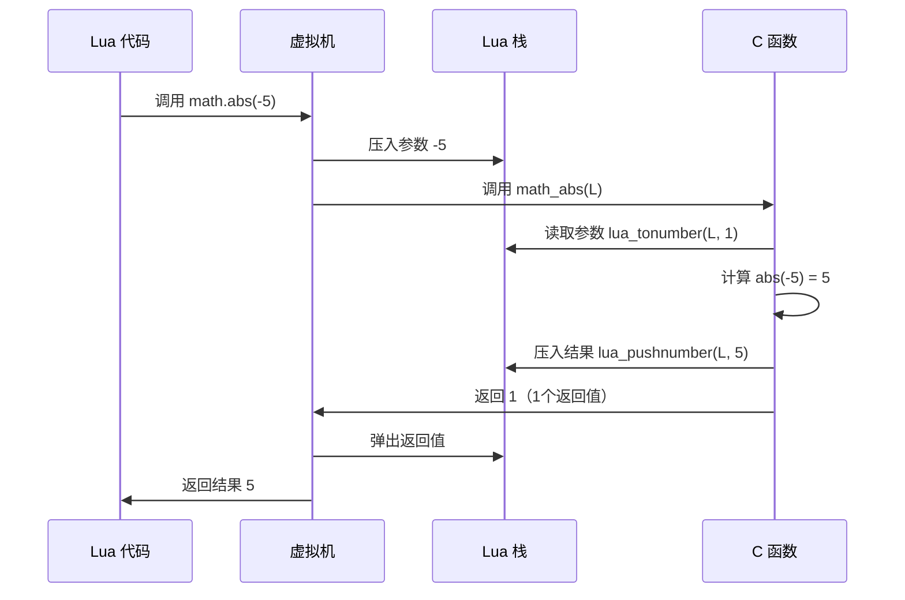
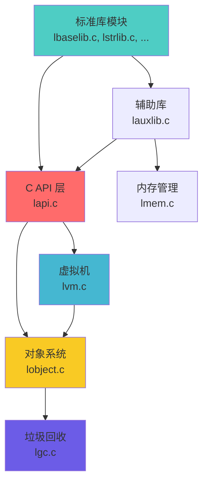

# 📚 标准库模块 (Standard Library Module)

<div align="center">

**Lua 内置函数与常用功能的 C 实现**

*8 大子库 · 100+ 内置函数 · C API 规范 · 高性能实现*

</div>

---

## 📋 模块概述

### 模块定位

标准库模块是 **Lua 语言功能的核心扩展**，提供了程序开发所需的基础设施。所有标准库函数都通过 **C API** 实现，直接与 Lua 虚拟机交互，确保了高性能和可靠性。

### 核心特点

| 特性 | 说明 |
|------|------|
| 🎯 **模块化设计** | 8 个独立子库，按需加载 |
| ⚡ **高性能实现** | 纯 C 实现，性能接近原生代码 |
| 🔒 **类型安全** | 严格的参数检查和类型验证 |
| 🌐 **跨平台** | 支持 ANSI C，可移植性强 |
| 📦 **统一接口** | 遵循 `lua_CFunction` 调用约定 |

### 实现文件清单

<table>
<tr>
<th width="25%">源文件</th>
<th width="20%">子库名称</th>
<th width="15%">代码行数</th>
<th width="40%">核心功能</th>
</tr>

<tr>
<td><code>lbaselib.c</code></td>
<td>基础库</td>
<td>~650 行</td>
<td>print, type, pairs, pcall, load, setmetatable 等</td>
</tr>

<tr>
<td><code>lstrlib.c</code></td>
<td>字符串库</td>
<td>~800 行</td>
<td>find, match, gsub, format, sub, byte, char 等</td>
</tr>

<tr>
<td><code>ltablib.c</code></td>
<td>表库</td>
<td>~250 行</td>
<td>insert, remove, sort, concat, maxn 等</td>
</tr>

<tr>
<td><code>lmathlib.c</code></td>
<td>数学库</td>
<td>~250 行</td>
<td>sin, cos, sqrt, random, floor, ceil, abs 等</td>
</tr>

<tr>
<td><code>liolib.c</code></td>
<td>I/O 库</td>
<td>~600 行</td>
<td>open, close, read, write, lines, flush 等</td>
</tr>

<tr>
<td><code>loslib.c</code></td>
<td>OS 库</td>
<td>~250 行</td>
<td>time, date, clock, execute, getenv, exit 等</td>
</tr>

<tr>
<td><code>ldblib.c</code></td>
<td>调试库</td>
<td>~400 行</td>
<td>getinfo, getlocal, traceback, sethook 等</td>
</tr>

<tr>
<td><code>loadlib.c</code></td>
<td>模块加载库</td>
<td>~600 行</td>
<td>require, loadlib, 包管理机制</td>
</tr>

<tr>
<td><code>lauxlib.c</code></td>
<td>辅助库（内部）</td>
<td>~850 行</td>
<td>参数检查、错误处理、缓冲区管理</td>
</tr>
</table>

**统计数据**：
- 总代码量：约 **4,650 行** C 代码
- 暴露函数：约 **100+ 个** Lua 可调用函数
- 辅助函数：约 **50+ 个** 内部辅助函数

---

## 🎯 核心技术

### 1. C API 调用规范 (C Function Convention)

#### 统一函数签名

所有 Lua 标准库函数都遵循 **`lua_CFunction`** 类型定义：

```c
typedef int (*lua_CFunction) (lua_State *L);
```

**关键特点**：
- ✅ **单一参数**：只接受 `lua_State *L` 指针
- ✅ **栈式传参**：通过 Lua 栈传递所有参数
- ✅ **栈式返回**：将返回值压入栈
- ✅ **返回计数**：返回值为栈上返回值的数量

#### 调用约定详解



#### 完整示例：`math.abs` 的实现

```c
/**
 * @brief 计算数值的绝对值
 * 
 * Lua 调用：result = math.abs(x)
 * 
 * @param L Lua 状态机指针
 * @return 返回值数量（总是 1）
 */
static int math_abs(lua_State *L) {
    // 步骤 1: 参数验证与提取
    lua_Number x = luaL_checknumber(L, 1);  // 获取第1个参数，必须是数字
    
    // 步骤 2: 执行计算
    lua_Number result = fabs(x);  // 使用 C 标准库的 fabs
    
    // 步骤 3: 压入返回值
    lua_pushnumber(L, result);
    
    // 步骤 4: 返回返回值数量
    return 1;  // 告诉虚拟机栈上有 1 个返回值
}
```

#### 栈操作模式

| 操作 | API 函数 | 说明 |
|------|----------|------|
| **参数获取** | `lua_tonumber(L, idx)` | 读取栈上第 idx 个参数 |
| **参数检查** | `luaL_checknumber(L, idx)` | 检查类型，失败则抛错 |
| **可选参数** | `luaL_optnumber(L, idx, def)` | 可选参数，提供默认值 |
| **压入返回值** | `lua_pushnumber(L, val)` | 将结果压入栈顶 |
| **多返回值** | 连续 push，return N | 依次压入，返回数量 |

#### 参数处理模式

**模式 1：固定参数**
```c
// string.sub(s, i, j)
static int str_sub(lua_State *L) {
    size_t l;
    const char *s = luaL_checklstring(L, 1, &l);  // 必需参数
    ptrdiff_t start = posrelat(luaL_checkinteger(L, 2), l);  // 必需
    ptrdiff_t end = posrelat(luaL_optinteger(L, 3, -1), l);   // 可选
    // ... 处理逻辑
    return 1;
}
```

**模式 2：可变参数**
```c
// print(...)
static int luaB_print(lua_State *L) {
    int n = lua_gettop(L);  // 获取参数数量
    for (int i = 1; i <= n; i++) {
        // 处理每个参数
    }
    return 0;  // print 无返回值
}
```

**模式 3：多返回值**
```c
// string.find(s, pattern) -> start, end
static int str_find(lua_State *L) {
    // ... 查找逻辑
    lua_pushinteger(L, start);  // 第1个返回值
    lua_pushinteger(L, end);    // 第2个返回值
    return 2;  // 返回2个值
}
```

#### 错误处理机制

```c
// 方式1：使用 luaL_check* 系列（推荐）
static int safe_divide(lua_State *L) {
    lua_Number a = luaL_checknumber(L, 1);  // 自动类型检查
    lua_Number b = luaL_checknumber(L, 2);
    
    if (b == 0) {
        return luaL_error(L, "division by zero");  // 抛出 Lua 错误
    }
    
    lua_pushnumber(L, a / b);
    return 1;
}

// 方式2：使用 luaL_argcheck（条件检查）
static int array_get(lua_State *L) {
    int index = luaL_checkint(L, 2);
    luaL_argcheck(L, index > 0, 2, "index must be positive");
    // ... 处理逻辑
}
```

---

### 2. 基础库 (Base Library) - `lbaselib.c`

基础库是 Lua 的**核心函数集**，提供了最常用的功能。这些函数无需通过 `table.` 或 `string.` 前缀访问，直接在全局环境中可用。

#### 函数分类表

<table>
<tr>
<th width="20%">功能类别</th>
<th width="30%">函数列表</th>
<th width="50%">功能说明</th>
</tr>

<tr>
<td><b>输出与调试</b></td>
<td><code>print</code></td>
<td>格式化输出到标准输出，自动调用 <code>tostring</code></td>
</tr>

<tr>
<td><b>类型操作</b></td>
<td>
<code>type</code><br/>
<code>tonumber</code><br/>
<code>tostring</code>
</td>
<td>
获取值的类型名称<br/>
转换为数字，支持进制指定<br/>
转换为字符串表示
</td>
</tr>

<tr>
<td><b>元表操作</b></td>
<td>
<code>getmetatable</code><br/>
<code>setmetatable</code>
</td>
<td>
获取对象的元表<br/>
设置表的元表（实现元编程）
</td>
</tr>

<tr>
<td><b>迭代器</b></td>
<td>
<code>pairs</code><br/>
<code>ipairs</code><br/>
<code>next</code>
</td>
<td>
遍历表的所有键值对<br/>
遍历数组部分（连续整数键）<br/>
获取表的下一个键值对
</td>
</tr>

<tr>
<td><b>错误处理</b></td>
<td>
<code>error</code><br/>
<code>assert</code><br/>
<code>pcall</code><br/>
<code>xpcall</code>
</td>
<td>
抛出错误并终止执行<br/>
断言条件，失败则抛错<br/>
保护调用，捕获错误<br/>
保护调用，支持自定义错误处理函数
</td>
</tr>

<tr>
<td><b>代码加载</b></td>
<td>
<code>load</code><br/>
<code>loadfile</code><br/>
<code>loadstring</code><br/>
<code>dofile</code>
</td>
<td>
从函数或字符串加载代码块<br/>
从文件加载代码块<br/>
从字符串加载代码块<br/>
加载并执行文件
</td>
</tr>

<tr>
<td><b>原始操作</b></td>
<td>
<code>rawget</code><br/>
<code>rawset</code><br/>
<code>rawequal</code>
</td>
<td>
绕过元方法的表读取<br/>
绕过元方法的表写入<br/>
绕过元方法的相等比较
</td>
</tr>

<tr>
<td><b>垃圾回收</b></td>
<td><code>collectgarbage</code></td>
<td>控制垃圾回收器行为（stop/restart/collect/count等）</td>
</tr>

<tr>
<td><b>实用工具</b></td>
<td>
<code>select</code><br/>
<code>unpack</code>
</td>
<td>
选择参数或返回参数数量<br/>
展开表为多个返回值
</td>
</tr>
</table>

#### 核心实现解析

**1. `print` 函数的实现**

```c
static int luaB_print(lua_State *L) {
    int n = lua_gettop(L);  // 获取参数数量
    int i;
    
    lua_getglobal(L, "tostring");  // 获取全局 tostring 函数
    
    for (i = 1; i <= n; i++) {
        const char *s;
        lua_pushvalue(L, -1);     // 复制 tostring 函数
        lua_pushvalue(L, i);      // 压入第 i 个参数
        lua_call(L, 1, 1);        // 调用 tostring(arg)
        
        s = lua_tostring(L, -1);  // 获取转换后的字符串
        if (s == NULL)
            return luaL_error(L, "'tostring' must return a string to 'print'");
        
        if (i > 1) fputs("\t", stdout);  // 参数间用制表符分隔
        fputs(s, stdout);
        lua_pop(L, 1);  // 弹出 tostring 的结果
    }
    
    fputs("\n", stdout);  // 输出换行
    return 0;  // print 无返回值
}
```

**2. `pairs` 迭代器的实现**

```c
static int luaB_pairs(lua_State *L) {
    luaL_checktype(L, 1, LUA_TTABLE);  // 检查第1个参数是表
    
    lua_pushvalue(L, lua_upvalueindex(1));  // 压入迭代函数（next）
    lua_pushvalue(L, 1);  // 压入表
    lua_pushnil(L);       // 压入初始键（nil）
    
    return 3;  // 返回：迭代函数、不变状态（表）、初始值（nil）
}

// next 函数的实现
static int luaB_next(lua_State *L) {
    luaL_checktype(L, 1, LUA_TTABLE);
    lua_settop(L, 2);  // 确保只有2个参数（表和当前键）
    
    if (lua_next(L, 1)) {  // 获取下一个键值对
        return 2;  // 返回键和值
    } else {
        lua_pushnil(L);
        return 1;  // 遍历结束，返回 nil
    }
}
```

**3. `pcall` 保护调用的实现**

```c
static int luaB_pcall(lua_State *L) {
    int status;
    
    luaL_checkany(L, 1);  // 检查至少有1个参数（要调用的函数）
    
    status = lua_pcall(L, lua_gettop(L) - 1, LUA_MULTRET, 0);
    // 参数：状态机、参数数量、返回值数量、错误处理函数位置
    
    lua_pushboolean(L, (status == 0));  // 第1个返回值：成功标志
    lua_insert(L, 1);  // 将标志插入到栈底
    
    return lua_gettop(L);  // 返回所有值（标志 + 结果或错误信息）
}
```

#### 使用示例

```lua
-- 1. 类型操作
print(type(42))           -- "number"
print(tonumber("3.14"))   -- 3.14
print(tostring(true))     -- "true"

-- 2. 元表实现运算符重载
local vec = {x = 1, y = 2}
setmetatable(vec, {
    __add = function(a, b)
        return {x = a.x + b.x, y = a.y + b.y}
    end
})
local v2 = vec + {x = 3, y = 4}  -- {x = 4, y = 6}

-- 3. 迭代器遍历
local t = {a = 1, b = 2, c = 3}
for k, v in pairs(t) do
    print(k, v)  -- 顺序不定
end

for i, v in ipairs({10, 20, 30}) do
    print(i, v)  -- 1 10, 2 20, 3 30（顺序固定）
end

-- 4. 错误处理
local success, result = pcall(function()
    return 10 / 0  -- 某些操作
end)
if not success then
    print("Error:", result)
end

-- 5. 动态代码加载
local chunk, err = loadstring("return 1 + 2")
if chunk then
    print(chunk())  -- 3
end
```

---

### 3. 字符串库 (String Library) - `lstrlib.c`

字符串库提供了强大的**文本处理功能**，包括 Lua 特有的**模式匹配系统**（不是正则表达式，而是更轻量级的实现）。

#### 函数功能表

| 函数 | 功能 | 示例 |
|------|------|------|
| `string.len(s)` | 返回字符串长度 | `len("hello")` → 5 |
| `string.sub(s, i, j)` | 截取子串 | `sub("hello", 1, 2)` → "he" |
| `string.find(s, pattern, init)` | 查找模式首次出现位置 | `find("hello", "ll")` → 3, 4 |
| `string.match(s, pattern, init)` | 提取匹配的子串 | `match("abc123", "%d+")` → "123" |
| `string.gmatch(s, pattern)` | 迭代所有匹配 | `for w in gmatch(s, "%w+")` |
| `string.gsub(s, pattern, repl, n)` | 全局替换 | `gsub("aaa", "a", "b")` → "bbb", 3 |
| `string.byte(s, i, j)` | 返回字符的数值编码 | `byte("A")` → 65 |
| `string.char(...)` | 从数值编码构造字符串 | `char(65, 66)` → "AB" |
| `string.upper(s)` | 转大写 | `upper("hello")` → "HELLO" |
| `string.lower(s)` | 转小写 | `lower("HELLO")` → "hello" |
| `string.rep(s, n)` | 重复字符串 | `rep("a", 3)` → "aaa" |
| `string.reverse(s)` | 反转字符串 | `reverse("abc")` → "cba" |
| `string.format(fmt, ...)` | 格式化输出（类似 printf） | `format("%.2f", 3.14159)` → "3.14" |

#### Lua 模式匹配系统

**与正则表达式的区别**：
- ✅ 更简单、更轻量级
- ✅ 性能更好（无需编译状态机）
- ❌ 功能相对有限（无前瞻、后顾等高级特性）

**模式字符类**：

| 字符类 | 匹配内容 | 示例 |
|--------|----------|------|
| `.` | 任意字符 | `"a.c"` 匹配 "abc", "a1c" |
| `%a` | 字母 | `"%a+"` 匹配 "hello" |
| `%d` | 数字 | `"%d+"` 匹配 "123" |
| `%w` | 字母数字 | `"%w+"` 匹配 "hello123" |
| `%s` | 空白字符 | `"%s+"` 匹配 "  \t\n" |
| `%c` | 控制字符 | `"%c"` 匹配 `\n`, `\t` |
| `%p` | 标点符号 | `"%p"` 匹配 ".", "!" |
| `%u` | 大写字母 | `"%u+"` 匹配 "HELLO" |
| `%l` | 小写字母 | `"%l+"` 匹配 "hello" |
| `%x` | 十六进制数字 | `"%x+"` 匹配 "1a2f" |
| `%A` | 非字母 | `"%A"` 匹配 "1", "!" |
| `%D` | 非数字 | `"%D"` 匹配 "a", "!" |

**修饰符**：

| 修饰符 | 含义 | 示例 |
|--------|------|------|
| `*` | 0次或多次（贪婪） | `"a*"` 匹配 "", "a", "aaa" |
| `+` | 1次或多次（贪婪） | `"a+"` 匹配 "a", "aaa" |
| `-` | 0次或多次（非贪婪） | `"a-"` 匹配最短 |
| `?` | 0次或1次 | `"a?"` 匹配 "", "a" |

**锚点**：

| 锚点 | 含义 | 示例 |
|------|------|------|
| `^` | 字符串开头 | `"^hello"` 必须以 hello 开头 |
| `$` | 字符串结尾 | `"world$"` 必须以 world 结尾 |

**捕获组**：

| 语法 | 功能 | 示例 |
|------|------|------|
| `()` | 捕获匹配内容 | `"(%d+)"` 捕获数字 |
| `%n` | 引用第n个捕获 | `"(%w+)%1"` 匹配重复单词 |
| `%b()` | 平衡配对 | `"%b()"` 匹配括号内容 |

#### 核心实现：模式匹配算法

**递归下降匹配器**：

```c
// 核心匹配函数（简化版）
static const char *match(MatchState *ms, const char *s, const char *p) {
    init: // 匹配循环入口
    switch (*p) {
        case '(': {  // 捕获组
            if (*(p+1) == ')')  // 位置捕获
                return start_capture(ms, s, p+2, CAP_POSITION);
            else
                return start_capture(ms, s, p+1, CAP_UNFINISHED);
        }
        case ')': {  // 捕获组结束
            return end_capture(ms, s, p+1);
        }
        case '$': {
            if (*(p+1) == '\0')  // 必须在字符串末尾
                return (s == ms->src_end) ? s : NULL;
            else goto dflt;
        }
        case L_ESC: {  // 转义字符 %
            switch (*(p+1)) {
                case 'b': {  // 平衡匹配 %bxy
                    s = matchbalance(ms, s, p+2);
                    if (s == NULL) return NULL;
                    p += 4; goto init;
                }
                case 'f': {  // 边界模式 %f[set]
                    // ...
                }
                // 处理 %d, %a, %w 等字符类
            }
        }
        default: dflt: {  // 普通字符
            int c = (uchar)*p;
            // 检查是否匹配，处理 *, +, -, ? 修饰符
            // ...
        }
    }
}
```

#### 使用示例

```lua
-- 1. 查找与提取
local s = "The price is $19.99"
local start, end_ = string.find(s, "%d+%.%d+")  -- 查找小数
print(start, end_)  -- 14, 19

local price = string.match(s, "%$([%d%.]+)")  -- 提取价格
print(price)  -- "19.99"

-- 2. 全局替换
local text = "hello world, hello Lua"
local result, count = string.gsub(text, "hello", "hi")
print(result)  -- "hi world, hi Lua"
print(count)   -- 2（替换了2次）

-- 3. 迭代匹配
local text = "apple banana cherry"
for word in string.gmatch(text, "%a+") do
    print(word)  -- 依次输出：apple, banana, cherry
end

-- 4. 格式化字符串
local formatted = string.format("Name: %s, Age: %d, Score: %.2f", 
                                 "Alice", 25, 95.678)
print(formatted)  -- "Name: Alice, Age: 25, Score: 95.68"

-- 5. 字符编码操作
local codes = {string.byte("ABC", 1, 3)}  -- {65, 66, 67}
local str = string.char(72, 101, 108, 108, 111)  -- "Hello"

-- 6. 捕获组与引用
local html = "<b>bold</b>"
local tag, content = string.match(html, "<(%w+)>(.*)</%1>")
print(tag, content)  -- "b", "bold"

-- 7. 平衡匹配
local code = "function foo() return bar() end"
local func_body = string.match(code, "function%s+%w+%s*%b()")
print(func_body)  -- "function foo()"
```

#### 性能考量

| 操作 | 时间复杂度 | 说明 |
|------|------------|------|
| `string.find` | O(nm) | n=文本长度, m=模式长度 |
| `string.gsub` | O(nm) | 全局替换需遍历整个字符串 |
| `string.sub` | O(j-i) | 创建新字符串的开销 |
| `string.format` | O(n) | n=格式化后的字符串长度 |

**优化建议**：
- ✅ 预编译模式（在循环外调用 `string.find`）
- ✅ 使用 `table.concat` 而非 `..` 拼接大量字符串
- ✅ 避免在循环中频繁调用 `string.sub`

---

### 4. 表库 (Table Library) - `ltablib.c`

表库提供了表的**通用操作函数**，包括插入、删除、排序和连接等。

#### 函数列表

| 函数 | 功能 | 时间复杂度 | 示例 |
|------|------|------------|------|
| `table.insert(t, [pos,] value)` | 插入元素 | O(n) | `insert(t, 1, "x")` 头部插入 |
| `table.remove(t, [pos])` | 删除并返回元素 | O(n) | `remove(t, 1)` 删除首元素 |
| `table.sort(t, [comp])` | 原地排序 | O(n log n) | `sort(t, function(a,b) return a>b end)` |
| `table.concat(t, [sep, i, j])` | 连接字符串 | O(n) | `concat({"a","b","c"}, ",")` → "a,b,c" |
| `table.maxn(t)` | 返回最大整数键 | O(n) | `maxn({[1]=10, [5]=20})` → 5 |
| `table.getn(t)` | 获取长度 | O(1) | 等价于 `#t` |

#### 核心实现：快速排序

```c
// 表排序的实现（简化版）
static void auxsort(lua_State *L, int l, int u) {
    while (l < u) {  // 尾递归优化的快速排序
        int i, j;
        
        // 分区操作
        lua_rawgeti(L, 1, l);  // 获取 pivot
        for (i = l, j = u; ; i++, j--) {
            while (i < j && sort_comp(L, i, -1) < 0) i++;
            while (j > i && sort_comp(L, -1, j) < 0) j--;
            if (i >= j) break;
            set2(L, i, j);  // 交换 t[i] 和 t[j]
        }
        
        // 递归排序较小的部分，迭代排序较大的部分
        if (j - l < u - j) {
            auxsort(L, l, j);
            l = j + 1;
        } else {
            auxsort(L, j + 1, u);
            u = j;
        }
    }
}
```

#### 使用示例

```lua
-- 1. 数组操作
local arr = {10, 20, 30}
table.insert(arr, 40)        -- {10, 20, 30, 40}
table.insert(arr, 2, 15)     -- {10, 15, 20, 30, 40}
local removed = table.remove(arr)  -- 移除末尾，返回 40

-- 2. 排序
local numbers = {5, 2, 8, 1, 9}
table.sort(numbers)  -- {1, 2, 5, 8, 9}

-- 自定义比较函数（降序）
table.sort(numbers, function(a, b) return a > b end)  -- {9, 8, 5, 2, 1}

-- 3. 字符串连接
local words = {"hello", "world", "lua"}
print(table.concat(words, " "))  -- "hello world lua"
print(table.concat(words, ", ", 2, 3))  -- "world, lua"

-- 4. 最大键
local sparse = {[1] = "a", [10] = "b", [100] = "c"}
print(table.maxn(sparse))  -- 100
```

---

### 5. 数学库 (Math Library) - `lmathlib.c`

数学库封装了 **C 标准库** (`<math.h>`) 的数学函数，提供完整的数值计算支持。

#### 函数分类

<table>
<tr>
<th width="25%">类别</th>
<th width="35%">函数</th>
<th width="40%">说明</th>
</tr>

<tr>
<td><b>三角函数</b></td>
<td>
<code>sin</code>, <code>cos</code>, <code>tan</code><br/>
<code>asin</code>, <code>acos</code>, <code>atan</code>, <code>atan2</code>
</td>
<td>正弦、余弦、正切及反函数<br/>角度单位为弧度</td>
</tr>

<tr>
<td><b>双曲函数</b></td>
<td><code>sinh</code>, <code>cosh</code>, <code>tanh</code></td>
<td>双曲正弦、余弦、正切</td>
</tr>

<tr>
<td><b>指数对数</b></td>
<td>
<code>exp</code>, <code>log</code>, <code>log10</code>
</td>
<td>自然指数、自然对数、常用对数</td>
</tr>

<tr>
<td><b>幂运算</b></td>
<td><code>pow</code>, <code>sqrt</code></td>
<td>幂运算、平方根</td>
</tr>

<tr>
<td><b>取整函数</b></td>
<td>
<code>floor</code>, <code>ceil</code><br/>
<code>modf</code>
</td>
<td>向下取整、向上取整<br/>分离整数和小数部分</td>
</tr>

<tr>
<td><b>其他</b></td>
<td>
<code>abs</code>, <code>max</code>, <code>min</code><br/>
<code>fmod</code>, <code>frexp</code>, <code>ldexp</code><br/>
<code>deg</code>, <code>rad</code>
</td>
<td>
绝对值、最大值、最小值<br/>
浮点取模、浮点分解<br/>
弧度角度转换
</td>
</tr>

<tr>
<td><b>随机数</b></td>
<td>
<code>random</code>, <code>randomseed</code>
</td>
<td>生成随机数、设置种子</td>
</tr>

<tr>
<td><b>常量</b></td>
<td><code>pi</code>, <code>huge</code></td>
<td>圆周率π、无穷大</td>
</tr>
</table>

#### 使用示例

```lua
-- 1. 基本运算
print(math.abs(-5))        -- 5
print(math.max(1, 5, 3))   -- 5
print(math.min(1, 5, 3))   -- 1
print(math.sqrt(16))       -- 4

-- 2. 三角函数（弧度制）
print(math.sin(math.pi / 2))  -- 1.0
print(math.cos(0))            -- 1.0
print(math.deg(math.pi))      -- 180（弧度转角度）
print(math.rad(180))          -- 3.14159...（角度转弧度）

-- 3. 取整
print(math.floor(3.7))   -- 3
print(math.ceil(3.2))    -- 4
local int, frac = math.modf(3.14)  -- int=3, frac=0.14

-- 4. 随机数
math.randomseed(os.time())  -- 设置随机种子
print(math.random())        -- [0, 1) 的随机浮点数
print(math.random(10))      -- [1, 10] 的随机整数
print(math.random(5, 10))   -- [5, 10] 的随机整数

-- 5. 常量
print(math.pi)    -- 3.14159265358979...
print(math.huge)  -- inf（无穷大）
```

---

### 6. I/O 库 (I/O Library) - `liolib.c`

I/O 库提供了**文件操作**和**输入输出**功能，支持文本和二进制模式。

#### 文件操作函数

| 函数 | 功能 | 示例 |
|------|------|------|
| `io.open(filename, mode)` | 打开文件 | `f = io.open("data.txt", "r")` |
| `io.close([file])` | 关闭文件 | `io.close(f)` 或 `f:close()` |
| `io.input([file])` | 设置默认输入文件 | `io.input("in.txt")` |
| `io.output([file])` | 设置默认输出文件 | `io.output("out.txt")` |
| `io.read(...)` | 从默认输入读取 | `io.read("*a")` |
| `io.write(...)` | 写入默认输出 | `io.write("hello\n")` |
| `io.lines([filename])` | 迭代文件行 | `for line in io.lines("f.txt")` |
| `io.flush()` | 刷新输出缓冲 | `io.flush()` |
| `io.type(obj)` | 检查文件对象类型 | `io.type(f)` → "file" |
| `io.popen(prog, [mode])` | 执行外部程序 | `f = io.popen("ls")` |
| `io.tmpfile()` | 创建临时文件 | `tmp = io.tmpfile()` |

#### 文件对象方法

| 方法 | 功能 | 说明 |
|------|------|------|
| `file:read(...)` | 读取内容 | 支持多种模式 |
| `file:write(...)` | 写入内容 | 可写入多个参数 |
| `file:lines()` | 迭代行 | 返回迭代器 |
| `file:seek(whence, offset)` | 定位文件指针 | whence: "set"/"cur"/"end" |
| `file:setvbuf(mode, size)` | 设置缓冲模式 | "no"/"full"/"line" |
| `file:flush()` | 刷新缓冲 | 强制写入磁盘 |
| `file:close()` | 关闭文件 | 释放资源 |

#### 文件打开模式

| 模式 | 说明 |
|------|------|
| `"r"` | 只读模式，文件必须存在 |
| `"w"` | 写模式，清空原内容或创建新文件 |
| `"a"` | 追加模式，在文件末尾写入 |
| `"r+"` | 读写模式，文件必须存在 |
| `"w+"` | 读写模式，清空原内容或创建新文件 |
| `"a+"` | 读写模式，在文件末尾写入 |
| `"rb"`, `"wb"`, ... | 二进制模式（加 `b` 后缀） |

#### 读取模式

| 模式 | 说明 | 示例 |
|------|------|------|
| `"*n"` | 读取一个数字 | `f:read("*n")` → 123 |
| `"*a"` | 读取整个文件 | `f:read("*a")` |
| `"*l"` | 读取一行（不含换行符） | `f:read("*l")` |
| `"*L"` | 读取一行（含换行符） | `f:read("*L")` |
| `number` | 读取指定字节数 | `f:read(10)` |

#### 使用示例

```lua
-- 1. 基本文件读写
local f = io.open("data.txt", "w")
if f then
    f:write("Hello, World!\n")
    f:write("Line 2\n", "Line 3\n")  -- 多个参数
    f:close()
end

-- 2. 读取整个文件
local f = io.open("data.txt", "r")
if f then
    local content = f:read("*a")
    print(content)
    f:close()
end

-- 3. 逐行读取
for line in io.lines("data.txt") do
    print(line)
end

-- 4. 读取数字
local f = io.open("numbers.txt", "r")
while true do
    local num = f:read("*n")
    if not num then break end
    print(num)
end
f:close()

-- 5. 文件定位
local f = io.open("data.txt", "r+")
f:seek("set", 10)  -- 定位到第10字节
f:write("X")       -- 覆盖一个字符
f:seek("end", 0)   -- 跳到文件末尾
print(f:seek())    -- 获取当前位置
f:close()

-- 6. 执行外部命令
local handle = io.popen("ls -l")
local result = handle:read("*a")
handle:close()
print(result)
```

---

### 7. 操作系统库 (OS Library) - `loslib.c`

OS 库提供了与**操作系统交互**的功能，包括时间、日期、环境变量和进程控制。

#### 函数列表

| 函数 | 功能 | 返回值 |
|------|------|--------|
| `os.time([table])` | 获取时间戳 | Unix 时间戳（秒） |
| `os.date([format, time])` | 格式化日期 | 字符串或表 |
| `os.clock()` | 获取 CPU 时间 | 秒数（浮点） |
| `os.difftime(t2, t1)` | 计算时间差 | 秒数 |
| `os.execute([command])` | 执行系统命令 | 退出码 |
| `os.exit([code])` | 退出程序 | 不返回 |
| `os.getenv(varname)` | 获取环境变量 | 字符串或 nil |
| `os.remove(filename)` | 删除文件 | true/nil+错误信息 |
| `os.rename(old, new)` | 重命名文件 | true/nil+错误信息 |
| `os.tmpname()` | 生成临时文件名 | 字符串 |
| `os.setlocale(locale, category)` | 设置区域信息 | 区域字符串或 nil |

#### 时间日期操作

**`os.time()` 用法**：
```lua
-- 获取当前时间戳
local timestamp = os.time()  -- 例如：1698345678

-- 从表构造时间戳
local t = os.time({year=2023, month=10, day=26, hour=12, min=30, sec=0})
```

**`os.date()` 格式化字符串**：

| 格式符 | 含义 | 示例 |
|--------|------|------|
| `%Y` | 四位年份 | 2023 |
| `%y` | 两位年份 | 23 |
| `%m` | 月份（01-12） | 10 |
| `%d` | 日期（01-31） | 26 |
| `%H` | 小时（00-23） | 14 |
| `%M` | 分钟（00-59） | 30 |
| `%S` | 秒（00-59） | 45 |
| `%w` | 星期（0-6，0=周日） | 4 |
| `%a` | 星期简写 | Thu |
| `%A` | 星期全称 | Thursday |
| `%b` | 月份简写 | Oct |
| `%B` | 月份全称 | October |
| `%c` | 完整日期时间 | Thu Oct 26 14:30:45 2023 |
| `%x` | 日期 | 10/26/23 |
| `%X` | 时间 | 14:30:45 |

#### 使用示例

```lua
-- 1. 时间操作
local now = os.time()
print(now)  -- 1698345678

local formatted = os.date("%Y-%m-%d %H:%M:%S", now)
print(formatted)  -- "2023-10-26 14:30:45"

-- 获取日期表
local t = os.date("*t", now)
print(t.year, t.month, t.day)  -- 2023, 10, 26

-- 2. 性能测试
local start = os.clock()
-- ... 执行某些操作
for i = 1, 1000000 do end
local elapsed = os.clock() - start
print(string.format("Elapsed: %.3f seconds", elapsed))

-- 3. 环境变量
print(os.getenv("PATH"))    -- 系统 PATH
print(os.getenv("HOME"))    -- 用户主目录

-- 4. 执行系统命令
local exitcode = os.execute("ls -l")
if exitcode == 0 then
    print("Command succeeded")
end

-- 5. 文件操作
os.rename("old.txt", "new.txt")
os.remove("temp.txt")

-- 6. 生成唯一文件名
local tmpname = os.tmpname()
print(tmpname)  -- 类似 "/tmp/lua_abc123"
```

---

### 8. 调试库 (Debug Library) - `ldblib.c`

调试库提供了**运行时自省**和**调试钩子**功能，用于诊断程序行为、获取调用栈信息和动态修改程序状态。

⚠️ **注意**：调试库功能强大，但会影响性能，生产环境应谨慎使用。

#### 核心函数

<table>
<tr>
<th width="30%">函数</th>
<th width="70%">功能</th>
</tr>

<tr>
<td><code>debug.getinfo(thread, f, what)</code></td>
<td>
获取函数信息（名称、源文件、行号、参数数量等）<br/>
<b>what</b> 参数：<code>"n"</code>名称, <code>"S"</code>源, <code>"l"</code>行, <code>"u"</code>upvalue, <code>"f"</code>函数
</td>
</tr>

<tr>
<td><code>debug.getlocal(thread, level, local)</code></td>
<td>获取指定栈层级的局部变量名和值</td>
</tr>

<tr>
<td><code>debug.setlocal(thread, level, local, value)</code></td>
<td>设置局部变量的值（动态修改程序状态）</td>
</tr>

<tr>
<td><code>debug.getupvalue(func, up)</code></td>
<td>获取函数的 upvalue 名称和值</td>
</tr>

<tr>
<td><code>debug.setupvalue(func, up, value)</code></td>
<td>设置函数的 upvalue 值</td>
</tr>

<tr>
<td><code>debug.traceback([thread,] [message,] [level])</code></td>
<td>生成调用栈跟踪字符串（错误报告常用）</td>
</tr>

<tr>
<td><code>debug.sethook(thread, hook, mask, count)</code></td>
<td>
设置调试钩子函数<br/>
<b>mask</b>：<code>"c"</code>调用, <code>"r"</code>返回, <code>"l"</code>行, <code>"count"</code>指令计数
</td>
</tr>

<tr>
<td><code>debug.gethook([thread])</code></td>
<td>获取当前的钩子函数和掩码</td>
</tr>

<tr>
<td><code>debug.getmetatable(object)</code></td>
<td>获取任意类型的元表（不受 <code>__metatable</code> 限制）</td>
</tr>

<tr>
<td><code>debug.setmetatable(object, table)</code></td>
<td>设置任意类型的元表</td>
</tr>

<tr>
<td><code>debug.getregistry()</code></td>
<td>获取 Lua 注册表（全局共享数据存储）</td>
</tr>

<tr>
<td><code>debug.getfenv(object)</code></td>
<td>获取函数或线程的环境表</td>
</tr>

<tr>
<td><code>debug.setfenv(object, table)</code></td>
<td>设置函数或线程的环境表</td>
</tr>

<tr>
<td><code>debug.debug()</code></td>
<td>进入交互式调试模式（REPL）</td>
</tr>
</table>

#### 使用示例

**1. 获取函数信息**

```lua
function example_function(a, b)
    return a + b
end

local info = debug.getinfo(example_function, "nSlu")
print(info.name)          -- "example_function"
print(info.source)        -- "@script.lua"
print(info.linedefined)   -- 1
print(info.nparams)       -- 2
print(info.nups)          -- 0 (upvalue 数量)
```

**2. 调用栈跟踪**

```lua
function foo()
    error("Something went wrong!")
end

function bar()
    foo()
end

local success, err = pcall(bar)
if not success then
    print(debug.traceback(err))
end

-- 输出：
-- script.lua:2: Something went wrong!
-- stack traceback:
--     script.lua:2: in function 'foo'
--     script.lua:6: in function 'bar'
--     script.lua:9: in main chunk
```

**3. 访问局部变量**

```lua
function test()
    local x = 10
    local y = 20
    
    -- 获取当前函数的局部变量
    local i = 1
    while true do
        local name, value = debug.getlocal(1, i)  -- level=1 表示当前函数
        if not name then break end
        print(name, value)  -- 输出：x 10, y 20, i 1
        i = i + 1
    end
    
    -- 动态修改局部变量
    debug.setlocal(1, 1, 100)  -- 将第1个局部变量（x）设为 100
    print(x)  -- 100
end

test()
```

**4. 调试钩子（性能分析）**

```lua
-- 统计函数调用次数
local call_count = {}

debug.sethook(function(event)
    if event == "call" then
        local info = debug.getinfo(2, "n")
        local name = info.name or "anonymous"
        call_count[name] = (call_count[name] or 0) + 1
    end
end, "c")  -- "c" = 在函数调用时触发

-- 执行一些代码
for i = 1, 10 do
    math.sqrt(i)
end

debug.sethook()  -- 清除钩子

-- 打印统计结果
for name, count in pairs(call_count) do
    print(name, count)
end
```

**5. 交互式调试器**

```lua
function my_debugger()
    debug.debug()  -- 进入 REPL
end

-- 在代码中插入断点
function buggy_function()
    local x = 10
    my_debugger()  -- 暂停执行，进入调试模式
    local y = x / 0
    return y
end
```

---

## � 性能对比与优化建议

### 标准库性能特性

| 操作 | 时间复杂度 | 优化建议 |
|------|------------|----------|
| `table.insert` (末尾) | O(1) | ✅ 推荐，非常高效 |
| `table.insert` (头部) | O(n) | ⚠️ 考虑使用队列结构 |
| `table.remove` (末尾) | O(1) | ✅ 推荐 |
| `table.remove` (头部) | O(n) | ⚠️ 大量操作时性能较差 |
| `table.sort` | O(n log n) | ✅ 高效的快速排序 |
| `table.concat` | O(n) | ✅ 比 `..` 拼接快 10-100 倍 |
| `string.find` | O(nm) | ⚠️ 复杂模式可能较慢 |
| `string.gsub` | O(nm) | ⚠️ 大文本替换需注意 |
| `math.*` | O(1) | ✅ C 实现，接近原生速度 |
| `io.read("*a")` | O(n) | ✅ 高效的缓冲读取 |

### 性能优化技巧

**字符串拼接优化**：
```lua
-- ❌ 慢（每次拼接都创建新字符串）
local s = ""
for i = 1, 10000 do
    s = s .. tostring(i)
end

-- ✅ 快（使用 table.concat）
local t = {}
for i = 1, 10000 do
    t[i] = tostring(i)
end
local s = table.concat(t)
```

**表操作优化**：
```lua
-- ❌ 慢（频繁调用 insert）
local arr = {}
for i = 1, 10000 do
    table.insert(arr, i)
end

-- ✅ 快（直接赋值）
local arr = {}
for i = 1, 10000 do
    arr[i] = i
end
```

**模式匹配优化**：
```lua
-- ❌ 慢（循环中编译模式）
for i = 1, 10000 do
    local result = string.match(data[i], "%d+")
end

-- ✅ 快（预编译模式不适用于 Lua，但可缓存结果）
-- 或使用 gmatch 一次性匹配所有
```

---

## 🔗 模块间协作

### 标准库与核心模块的关系



### 调用链示例

```
Lua 代码: table.sort(arr)
    ↓
lbaselib.c: luaB_sort()
    ↓
lauxlib.c: luaL_checktype() - 参数验证
    ↓
lapi.c: lua_rawgeti() - 访问表元素
    ↓
ltable.c: luaH_getnum() - 表内部操作
    ↓
lvm.c: luaV_lessthan() - 比较操作
    ↓
返回排序后的结果
```

---

## 📚 详细技术文档

本模块的深度技术文档（规划中）：

- 📝 [字符串模式匹配算法](string_pattern_matching.md) - 递归下降匹配器实现
- 📝 [表操作性能优化](table_operations.md) - 快速排序与内存布局
- 📝 [文件 I/O 缓冲机制](file_io.md) - 缓冲区管理与性能
- 📝 [调试钩子实现原理](debug_hooks.md) - 钩子机制与性能影响
- 📝 [协程库实现](coroutine_library.md) - 协程的 C API 实现

---

## 🔗 相关模块导航

### 依赖模块

- [虚拟机模块](../vm/wiki_vm.md) - 标准库函数最终通过 VM 执行
- [对象系统模块](../object/wiki_object.md) - 标准库操作的数据类型（TValue, Table, String）
- [内存管理模块](../memory/wiki_memory.md) - 标准库的内存分配
- [运行时模块](../runtime/wiki_runtime.md) - 函数调用和错误处理机制

### 相关主题

- [C API 使用指南](../runtime/wiki_runtime.md#c-api) - 如何从 C 调用 Lua
- [元表机制](../object/wiki_object.md#metatable) - 元编程基础
- [字符串池化](../object/wiki_object.md#string-interning) - 字符串优化

---

## 🎓 学习建议

### 学习路径

**初学者**：
1. 阅读本文档，了解各子库的功能
2. 尝试所有示例代码
3. 重点学习基础库、字符串库、表库

**进阶开发者**：
1. 研究 C API 调用规范
2. 阅读 `lauxlib.c` 的辅助函数实现
3. 学习如何自己编写 C 扩展

**源码研究者**：
1. 深入阅读 `lstrlib.c` 的模式匹配实现
2. 分析 `ltablib.c` 的排序算法
3. 研究 `ldblib.c` 的调试钩子机制

### 实践项目

- ✅ **项目 1**：实现自己的日志库（使用 io 库）
- ✅ **项目 2**：编写文本处理工具（使用 string 库）
- ✅ **项目 3**：开发性能分析工具（使用 debug 库）
- ✅ **项目 4**：创建 C 语言扩展模块（学习 C API）

---

<div align="center">

**📖 继续学习**

[← 返回总览](../wiki.md) · [运行时模块 →](../runtime/wiki_runtime.md)

---

**文档信息**

📅 最后更新：2025-10-26  
📌 文档版本：v2.0 (DeepWiki 优化版)  
🔖 基于 Lua 版本：5.1.5  
✍️ 维护者：lua_c_analysis 项目组

</div>
