# Lua 5.1 内存管理源码深度解析

> **DeepWiki 系列文档 - 源码分析专题**  
> 深入 Lua 5.1.5 C 源码，剖析内存分配、垃圾回收和对象管理的实现细节

## 文档信息

- **Lua 版本**：5.1.5
- **文档类型**：DeepWiki 源码深度分析
- **难度等级**：高级到专家
- **预计阅读时间**：90-120 分钟
- **前置知识**：C 语言、数据结构、操作系统内存管理
- **相关文档**：
  - [memory_allocator_design.md](memory_allocator_design.md) - 内存分配器设计
  - [memory_gc_interaction.md](memory_gc_interaction.md) - GC 交互机制
  - [memory_performance_tuning.md](memory_performance_tuning.md) - 性能优化指南
  - [memory_leak_detection.md](memory_leak_detection.md) - 泄漏检测

---

## 目录

### 第一部分：核心数据结构
1. [GCObject 体系](#1-gcobject-体系)
   - 1.1 [GCObject 基类](#11-gcobject-基类)
   - 1.2 [对象类型枚举](#12-对象类型枚举)
   - 1.3 [CommonHeader 宏](#13-commonheader-宏)
   - 1.4 [对象标记位](#14-对象标记位)

2. [基本对象结构](#2-基本对象结构)
   - 2.1 [TString 字符串](#21-tstring-字符串)
   - 2.2 [Table 表](#22-table-表)
   - 2.3 [Closure 闭包](#23-closure-闭包)
   - 2.4 [Userdata 用户数据](#24-userdata-用户数据)

3. [全局状态](#3-全局状态)
   - 3.1 [global_State 结构](#31-global_state-结构)
   - 3.2 [lua_State 结构](#32-lua_state-结构)
   - 3.3 [内存状态管理](#33-内存状态管理)

### 第二部分：内存分配系统
4. [分配器接口](#4-分配器接口)
   - 4.1 [lua_Alloc 函数指针](#41-lua_alloc-函数指针)
   - 4.2 [luaM_realloc_ 实现](#42-luam_realloc_-实现)
   - 4.3 [内存统计](#43-内存统计)
   - 4.4 [OOM 处理](#44-oom-处理)

5. [对象分配](#5-对象分配)
   - 5.1 [luaC_newobj 对象创建](#51-luac_newobj-对象创建)
   - 5.2 [字符串分配](#52-字符串分配)
   - 5.3 [Table 分配](#53-table-分配)
   - 5.4 [Closure 分配](#54-closure-分配)

6. [内存管理辅助](#6-内存管理辅助)
   - 6.1 [luaM_growaux_ 动态增长](#61-luam_growaux_-动态增长)
   - 6.2 [数组重分配](#62-数组重分配)
   - 6.3 [内存对齐](#63-内存对齐)

### 第三部分：垃圾回收器
7. [GC 状态机](#7-gc-状态机)
   - 7.1 [GC 状态枚举](#71-gc-状态枚举)
   - 7.2 [状态转换](#72-状态转换)
   - 7.3 [增量执行](#73-增量执行)

8. [标记阶段](#8-标记阶段)
   - 8.1 [reallymarkobject 实现](#81-reallymarkobject-实现)
   - 8.2 [灰色对象队列](#82-灰色对象队列)
   - 8.3 [原子标记](#83-原子标记)
   - 8.4 [写屏障](#84-写屏障)

9. [清除阶段](#9-清除阶段)
   - 9.1 [sweeplist 链表清除](#91-sweeplist-链表清除)
   - 9.2 [字符串回收](#92-字符串回收)
   - 9.3 [析构器调用](#93-析构器调用)

10. [终结器系统](#10-终结器系统)
    - 10.1 [__gc 元方法](#101-__gc-元方法)
    - 10.2 [tobefnz 链表](#102-tobefnz-链表)
    - 10.3 [复活机制](#103-复活机制)

### 第四部分：特殊机制
11. [字符串内化](#11-字符串内化)
    - 11.1 [字符串哈希表](#111-字符串哈希表)
    - 11.2 [newlstr 实现](#112-newlstr-实现)
    - 11.3 [字符串比较优化](#113-字符串比较优化)

12. [Table 实现](#12-table-实现)
    - 12.1 [数组部分和哈希部分](#121-数组部分和哈希部分)
    - 12.2 [luaH_set 插入](#122-luah_set-插入)
    - 12.3 [rehash 重哈希](#123-rehash-重哈希)
    - 12.4 [弱表处理](#124-弱表处理)

13. [栈管理](#13-栈管理)
    - 13.1 [栈结构](#131-栈结构)
    - 13.2 [栈增长](#132-栈增长)
    - 13.3 [调用帧](#133-调用帧)

### 第五部分：性能优化
14. [内存优化技巧](#14-内存优化技巧)
    - 14.1 [对象池](#141-对象池)
    - 14.2 [内存预分配](#142-内存预分配)
    - 14.3 [减少分配](#143-减少分配)

15. [GC 调优](#15-gc-调优)
    - 15.1 [GC 参数](#151-gc-参数)
    - 15.2 [步进控制](#152-步进控制)
    - 15.3 [暂停时间优化](#153-暂停时间优化)

16. [案例分析](#16-案例分析)
    - 16.1 [高频分配场景](#161-高频分配场景)
    - 16.2 [大对象处理](#162-大对象处理)
    - 16.3 [实时系统优化](#163-实时系统优化)

---

## GCObject 体系

> **本章导读**  
> GCObject 是 Lua 内存管理的核心抽象。本章将深入解析：
> - GCObject 的设计哲学和内存布局
> - CommonHeader 的宏展开机制
> - 对象类型系统的实现细节
> - GC 标记位的完整语义
>
> **阅读建议**：先理解联合体设计，再深入标记位机制

### 1.1 GCObject 基类

#### 设计哲学：为什么使用联合体？

Lua 采用 **union（联合体）** 统一管理所有可回收对象，这个设计决策带来了三大核心优势：

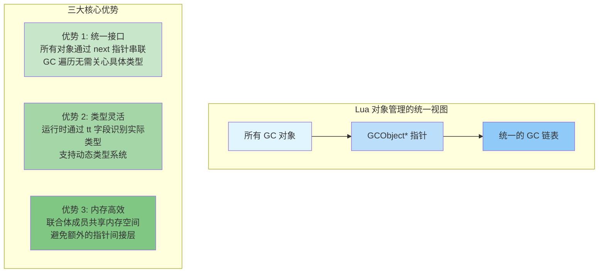

#### lobject.h 中的定义

```c
/*
** Union of all collectable objects
** 所有可回收对象的联合体
**
** 📌 核心设计理念：
** 1. 所有成员占用同一块内存（union 的本质）
** 2. 无论实际类型，前面都是 CommonHeader（10 字节）
** 3. GC 只需访问 gch 成员即可遍历所有对象
** 4. 类型转换通过宏完成，零运行时开销
*/
typedef union GCObject {
  GCheader gch;        /* 公共头部（用于 GC 遍历）*/
  union TString ts;    /* 字符串对象 */
  union Udata u;       /* 用户数据（full userdata）*/
  union Closure cl;    /* 闭包（Lua 闭包 or C 闭包）*/
  struct Table h;      /* 表对象 */
  struct Proto p;      /* 函数原型（字节码）*/
  struct UpVal uv;     /* Upvalue（闭包捕获的变量）*/
  struct lua_State th; /* 线程（协程）*/
} GCObject;

/*
** Common header for all collectable objects
** 所有可回收对象的公共头部
**
** 📌 为什么用宏而不是结构体？
** 答：C 语言限制。如果用结构体继承，无法在 union 中使用。
**     宏展开后直接嵌入字段，保证所有类型的头部一致。
*/
#define CommonHeader GCObject *next; lu_byte tt; lu_byte marked

typedef struct GCheader {
  CommonHeader;
} GCheader;

/*
内存布局详解（64 位系统）：

假设 GCObject* 指针地址为 0x1000
*/
```

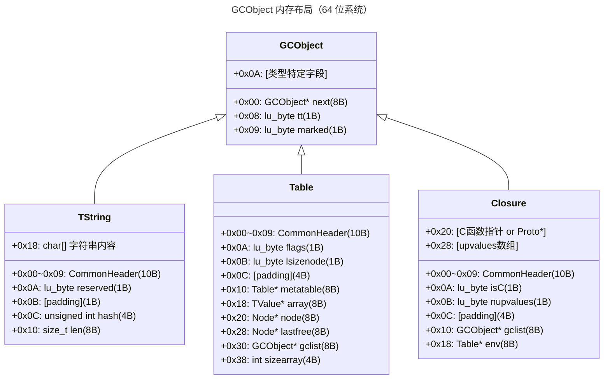

```c
/*
🔑 关键观察：
  • CommonHeader 总是占据前 10 字节
  • GC 遍历时只需访问 gch.next 和 gch.marked
  • 类型识别通过 gch.tt 完成
  • 实际对象大小 = sizeof(CommonHeader) + 类型特定大小
*/
```

#### 类型转换宏：零开销的类型安全

```c
/*
** 类型转换宏（lgc.h / lobject.h）
**
** 📌 设计精妙之处：
** 1. Debug 模式：check_exp 验证类型正确性
** 2. Release 模式：直接转换，零性能损失
** 3. 编译期检查，运行期无开销
*/

/* GCObject* → 具体类型指针 */
#define gco2ts(o)   check_exp((o)->gch.tt == LUA_TSTRING, &((o)->ts))
#define gco2u(o)    check_exp((o)->gch.tt == LUA_TUSERDATA, &((o)->u))
#define gco2cl(o)   check_exp((o)->gch.tt == LUA_TFUNCTION, &((o)->cl))
#define gco2h(o)    check_exp((o)->gch.tt == LUA_TTABLE, &((o)->h))
#define gco2p(o)    check_exp((o)->gch.tt == LUA_TPROTO, &((o)->p))
#define gco2uv(o)   check_exp((o)->gch.tt == LUA_TUPVAL, &((o)->uv))
#define gco2th(o)   check_exp((o)->gch.tt == LUA_TTHREAD, &((o)->th))

/* 具体类型指针 → GCObject* */
#define obj2gco(v)  cast(GCObject *, (v))

/*
check_exp 的魔法：

  #define check_exp(c, e)  (lua_assert(c), (e))
  
  原理：C 语言逗号表达式 (a, b) 先执行 a，返回 b
  
  Debug 构建：
    gco2ts(o) 展开为：
    (lua_assert(o->gch.tt == LUA_TSTRING), &(o->ts))
    如果类型不匹配，断言失败，程序中断
  
  Release 构建：
    lua_assert 宏为空
    gco2ts(o) 展开为：
    &(o->ts)
    直接返回指针，无任何开销
  
  这是一种零开销抽象（Zero-cost Abstraction）！
*/

/* 使用示例 */
void process_object(GCObject *o) {
  switch (o->gch.tt) {
    case LUA_TSTRING: {
      TString *ts = gco2ts(o);  /* 类型安全转换 */
      printf("String: %s (len=%zu)\n", getstr(ts), ts->tsv.len);
      break;
    }
    
    case LUA_TTABLE: {
      Table *h = gco2h(o);  /* 类型安全转换 */
      printf("Table: array_size=%d, hash_size=%d\n", 
             h->sizearray, 1 << h->lsizenode);
      break;
    }
    
    /* ... 其他类型 ... */
  }
}
```

**关键字段解析：**

```mermaid
graph TB
    subgraph "CommonHeader 三大字段"
        A["字段 1: next<br/>(GCObject*, 8字节)"]
        B["字段 2: tt<br/>(lu_byte, 1字节)"]
        C["字段 3: marked<br/>(lu_byte, 1字节)"]
    end
    
    subgraph "next 指针的多态性"
        D["GCSpause阶段<br/>→ rootgc链表"]
        E["GCSpropagate阶段<br/>→ gray链表"]
        F["GCSsweep阶段<br/>→ sweepgc链表"]
    end
    
    subgraph "tt 类型标签 (0-8)"
        G["0: LUA_TNIL"]
        H["3: LUA_TNUMBER"]
        I["4: LUA_TSTRING ← GC管理"]
        J["5: LUA_TTABLE ← GC管理"]
        K["6: LUA_TFUNCTION ← GC管理"]
    end
    
    subgraph "marked 标记位 (8位)"
        L["位0-1: 白色位<br/>(双白色技术)"]
        M["位2: 黑色位<br/>(三色标记)"]
        N["位3: 终结标记<br/>(FINALIZEDBIT)"]
        O["位4-5: 弱表标记<br/>(KEYWEAKBIT/VALUEWEAKBIT)"]
        P["位6: 固定对象<br/>(FIXEDBIT)"]
    end
    
    A --> D
    A --> E
    A --> F
    
    B --> G
    B --> H
    B --> I
    B --> J
    B --> K
    
    C --> L
    C --> M
    C --> N
    C --> O
    C --> P
    
    style A fill:#e3f2fd
    style B fill:#fff3e0
    style C fill:#fce4ec
    style D fill:#b3e5fc
    style E fill:#b3e5fc
    style F fill:#b3e5fc
    style I fill:#ffcc80
    style J fill:#ffcc80
    style K fill:#ffcc80
```

```c
/*
═══════════════════════════════════════════════════════════
  CommonHeader 三大字段深度解析
═══════════════════════════════════════════════════════════

/* 标记位常量定义（lgc.h）*/
#define WHITE0BIT       0  /* 白色 0（当前周期的死白色）*/
#define WHITE1BIT       1  /* 白色 1（下个周期的活白色）*/
#define BLACKBIT        2  /* 黑色（已标记且子对象已扫描）*/
#define FINALIZEDBIT    3  /* 已终结（__gc 元方法已调用）*/
#define KEYWEAKBIT      4  /* 弱键表（键是弱引用）*/
#define VALUEWEAKBIT    5  /* 弱值表（值是弱引用）*/
#define FIXEDBIT        6  /* 固定对象（如全局表，永不回收）*/
#define SFIXEDBIT       7  /* 字符串固定（内化字符串）*/

/* 白色掩码（两种白色交替使用）*/
#define WHITEBITS       bit2mask(WHITE0BIT, WHITE1BIT)  /* 0x03 */

/* 颜色测试宏 */
#define iswhite(x)      test2bits((x)->gch.marked, WHITE0BIT, WHITE1BIT)
#define isblack(x)      testbit((x)->gch.marked, BLACKBIT)
#define isgray(x)       (!isblack(x) && !iswhite(x))  /* 既不黑也不白 */

/* 当前白色判断（GC 使用双白色技术）*/
#define otherwhite(g)   (g->currentwhite ^ WHITEBITS)
#define isdead(g,v)     ((v)->gch.marked & otherwhite(g) & WHITEBITS)

/*
═══════════════════════════════════════════════════════════
  双白色技术（Two-White Technique）详解
═══════════════════════════════════════════════════════════

为什么需要两种白色？

问题：增量 GC 中，新对象如何处理？
  • 如果标记为白色 → 可能被误删（尚未来得及标记）
  • 如果标记为黑色 → 子对象可能漏标（违反不变式）

解决：双白色技术
  • GC 周期 N：WHITE0 = 死白色，WHITE1 = 活白色
  • GC 周期 N+1：WHITE1 = 死白色，WHITE0 = 活白色
  • 交替使用，新对象总是标记为当前活白色

工作流程：

周期 N 开始：
  currentwhite = WHITE0  (活白色)
  otherwhite   = WHITE1  (死白色)
  
  所有对象：
    [Obj1: WHITE1] [Obj2: WHITE1] [Obj3: WHITE1]
       ↑ 上个周期的活白色，现在是死白色
  
  新建对象：
    newobj = create_object()
    newobj->marked = currentwhite = WHITE0  (活白色)
  
  标记过程：
    WHITE0 → GRAY → BLACK
    WHITE1 保持不变（死白色，等待清除）
  
  清除阶段：
    扫描所有对象
    if (obj->marked & WHITE1)  // 死白色
      free(obj)
  
周期 N+1 开始：
  currentwhite ^= WHITEBITS  // 翻转
  currentwhite = WHITE1  (新的活白色)
  otherwhite   = WHITE0  (新的死白色)
  
  所有存活对象：
    makewhite(obj)  // WHITE1 或 WHITE0 → currentwhite
  
优势：
  ✓ 新对象自动安全（标记为活白色）
  ✓ 无需特殊处理增量 GC 中的新分配
  ✓ 分代效果：新对象更快被标记
*/
```

#### 对象链表组织

```c
/* global_State 中的 GC 链表（lstate.h）*/
struct global_State {
  /* ... 其他字段 ... */
  
  GCObject *rootgc;      /* 根对象链表（所有可回收对象）*/
  GCObject **sweepgc;    /* 清除阶段当前位置 */
  GCObject *gray;        /* 灰色对象链表（待扫描）*/
  GCObject *grayagain;   /* 需要再次扫描的灰色对象 */
  GCObject *weak;        /* 弱表链表 */
  GCObject *tmudata;     /* 带 __gc 元方法的 userdata */
  
  /* ... */
};

/*
═══════════════════════════════════════════════════════════
  GC 链表组织结构可视化
═══════════════════════════════════════════════════════════
*/
```

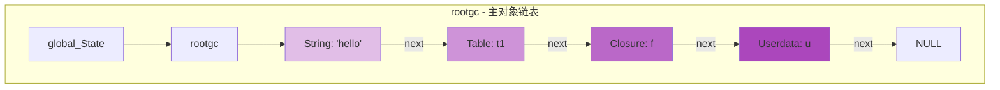

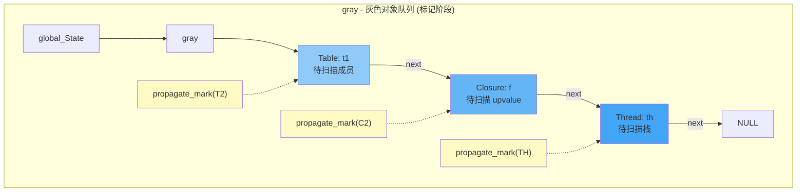

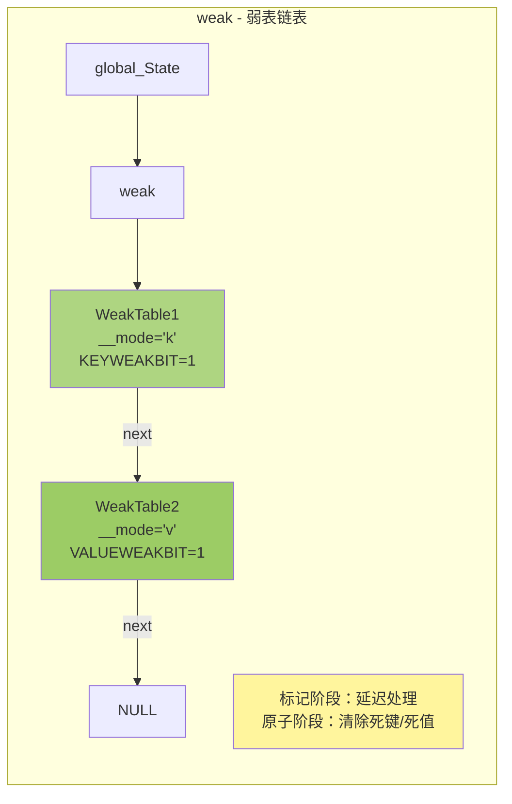

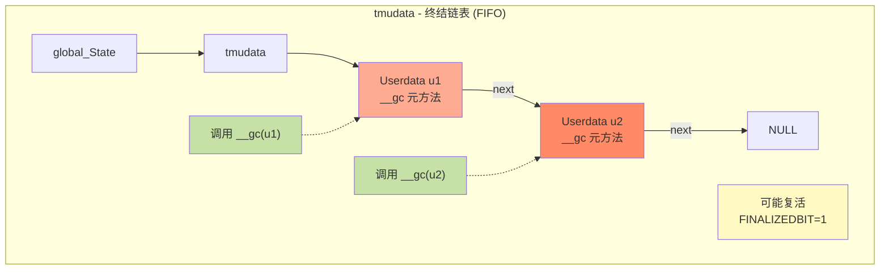

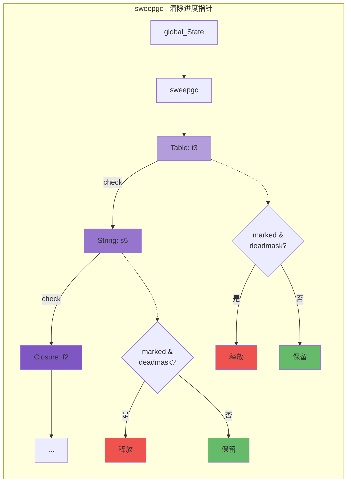

```c
/*
链表操作流程说明：

1. rootgc（根对象链表）：
   • 包含所有可回收对象
   • 通过 next 指针串联
   • GC 从这里开始遍历

2. gray（灰色队列）：
   工作流程：
     while (gray != NULL) {
       obj = gray;
       gray = obj->next;        // 从队列取出
       propagate_mark(obj);     // 扫描子对象
       gray2black(obj);         // 标记为黑色
     }

3. weak（弱表链表）：
   • 标记阶段：延迟处理
   • 原子阶段：清除死键/死值
   • 特殊处理：不阻止对象回收

4. tmudata（终结链表）：
   • FIFO 顺序（先创建先调用）
   • 调用 __gc 元方法
   • 可能发生对象复活

5. sweepgc（清除进度指针）：
   • 增量清除：每次 GCSWEEPMAX 个
   • 检查 marked 决定释放/保留
   • 逐段推进直到链表尾
*/

/* 链表操作示例 */
void example_gc_lists(lua_State *L) {
  global_State *g = G(L);
  
  /* 遍历所有对象 */
  printf("=== All Objects ===\n");
  GCObject *o = g->rootgc;
  int count = 0;
  while (o != NULL) {
    printf("[%d] Type=%d, Marked=0x%02x\n", 
           count++, o->gch.tt, o->gch.marked);
    o = o->gch.next;
  }
  
  /* 遍历灰色对象 */
  printf("\n=== Gray Objects ===\n");
  o = g->gray;
  count = 0;
  while (o != NULL) {
    printf("[%d] Type=%d (待扫描)\n", count++, o->gch.tt);
    o = o->gch.next;
  }
  
  /* 统计对象颜色 */
  int white_count = 0, gray_count = 0, black_count = 0;
  for (o = g->rootgc; o != NULL; o = o->gch.next) {
    if (iswhite(o)) white_count++;
    else if (isgray(o)) gray_count++;
    else if (isblack(o)) black_count++;
  }
  
  printf("\n=== Color Statistics ===\n");
  printf("White: %d\n", white_count);
  printf("Gray:  %d\n", gray_count);
  printf("Black: %d\n", black_count);
}
  
  /* 遍历所有 GC 对象 */
  GCObject *o = g->rootgc;
  while (o) {
    printf("Object type: %d, marked: 0x%02x\n", 
           o->gch.tt, o->gch.marked);
    o = o->gch.next;
  }
  
  /*
  标记阶段：gray 链表
  
  [Table1] -> [Closure1] -> NULL
      |           |
   已标记      已标记
   子对象      子对象
   待扫描      待扫描
  */
  
  /* 灰色对象处理 */
  while (g->gray) {
    GCObject *o = g->gray;
    g->gray = o->gch.next;  /* 从灰色队列移除 */
    
    /* 扫描子对象，变成黑色 */
    /* reallymarkobject(g, o); */
  }
}
```

---

### 1.2 对象类型枚举

#### lua.h 中的类型定义

```c
/*
** basic types
** 基本类型常量
*/
#define LUA_TNONE          (-1)

#define LUA_TNIL           0
#define LUA_TBOOLEAN       1
#define LUA_TLIGHTUSERDATA 2
#define LUA_TNUMBER        3
#define LUA_TSTRING        4
#define LUA_TTABLE         5
#define LUA_TFUNCTION      6
#define LUA_TUSERDATA      7
#define LUA_TTHREAD        8

/*
类型说明：

1. LUA_TNIL (0)
   - nil 值
   - 不需要 GC（没有对应的 GCObject）
   
2. LUA_TBOOLEAN (1)
   - boolean 值
   - 不需要 GC（值语义）
   
3. LUA_TLIGHTUSERDATA (2)
   - 轻量级 userdata（仅指针）
   - 不需要 GC（不在 Lua 堆上）
   
4. LUA_TNUMBER (3)
   - 数字（double）
   - 不需要 GC（值语义）
   
5. LUA_TSTRING (4)
   - 字符串
   - 需要 GC，内化存储
   
6. LUA_TTABLE (5)
   - 表（哈希表 + 数组）
   - 需要 GC
   
7. LUA_TFUNCTION (6)
   - 函数（Lua 闭包或 C 函数）
   - 需要 GC（Lua 闭包）
   
8. LUA_TUSERDATA (7)
   - 完整 userdata
   - 需要 GC，可有元表和 __gc
   
9. LUA_TTHREAD (8)
   - 协程（lua_State）
   - 需要 GC
*/

/* TValue 结构（lobject.h）*/
typedef struct lua_TValue {
  Value value;      /* 值联合体 */
  int tt;           /* 类型标签 */
} TValue;

/* Value 联合体 */
typedef union {
  GCObject *gc;     /* 可回收对象指针 */
  void *p;          /* lightuserdata 指针 */
  lua_Number n;     /* 数字 */
  int b;            /* boolean */
} Value;

/* 类型判断宏 */
#define ttisnil(o)      (ttype(o) == LUA_TNIL)
#define ttisnumber(o)   (ttype(o) == LUA_TNUMBER)
#define ttisstring(o)   (ttype(o) == LUA_TSTRING)
#define ttistable(o)    (ttype(o) == LUA_TTABLE)
#define ttisfunction(o) (ttype(o) == LUA_TFUNCTION)
#define ttisboolean(o)  (ttype(o) == LUA_TBOOLEAN)
#define ttisuserdata(o) (ttype(o) == LUA_TUSERDATA)
#define ttisthread(o)   (ttype(o) == LUA_TTHREAD)
#define ttislightuserdata(o) (ttype(o) == LUA_TLIGHTUSERDATA)

/* 值访问宏 */
#define gcvalue(o)      check_exp(iscollectable(o), (o)->value.gc)
#define pvalue(o)       check_exp(ttislightuserdata(o), (o)->value.p)
#define nvalue(o)       check_exp(ttisnumber(o), (o)->value.n)
#define rawtsvalue(o)   check_exp(ttisstring(o), &(o)->value.gc->ts)
#define hvalue(o)       check_exp(ttistable(o), &(o)->value.gc->h)
```

#### 类型系统示例

```c
/* type_system_example.c - 类型系统使用示例 */

void demonstrate_type_system(lua_State *L) {
  TValue tv;
  
  /* 示例 1：存储数字 */
  tv.value.n = 42.0;
  tv.tt = LUA_TNUMBER;
  
  printf("Type: %d, Value: %f\n", tv.tt, nvalue(&tv));
  /* 输出：Type: 3, Value: 42.000000 */
  
  /* 示例 2：存储字符串 */
  TString *str = luaS_newlstr(L, "hello", 5);
  tv.value.gc = obj2gco(str);  /* 转换为 GCObject */
  tv.tt = LUA_TSTRING;
  
  printf("Type: %d, String: %s\n", tv.tt, getstr(rawtsvalue(&tv)));
  /* 输出：Type: 4, String: hello */
  
  /* 示例 3：存储 lightuserdata */
  void *ptr = malloc(100);
  tv.value.p = ptr;
  tv.tt = LUA_TLIGHTUSERDATA;
  
  printf("Type: %d, Pointer: %p\n", tv.tt, pvalue(&tv));
  
  free(ptr);
  
  /* 示例 4：存储 nil */
  tv.tt = LUA_TNIL;
  /* nil 不需要设置 value */
  
  printf("Type: %d (nil)\n", tv.tt);
  /* 输出：Type: 0 (nil) */
}

/* 类型转换辅助宏（lobject.h）*/
#define obj2gco(v)  (cast(GCObject *, (v)))
#define gco2ts(o)   check_exp((o)->gch.tt == LUA_TSTRING, &((o)->ts))
#define gco2h(o)    check_exp((o)->gch.tt == LUA_TTABLE, &((o)->h))
#define gco2cl(o)   check_exp((o)->gch.tt == LUA_TFUNCTION, &((o)->cl))
#define gco2uv(o)   check_exp((o)->gch.tt == LUA_TUPVAL, &((o)->uv))
#define gco2th(o)   check_exp((o)->gch.tt == LUA_TTHREAD, &((o)->th))

/* 使用类型转换 */
void type_conversion_example(lua_State *L) {
  /* 创建字符串 */
  TString *str = luaS_newlstr(L, "world", 5);
  
  /* 转换为 GCObject */
  GCObject *gco = obj2gco(str);
  
  /* 检查类型 */
  assert(gco->gch.tt == LUA_TSTRING);
  
  /* 转换回 TString */
  TString *str2 = gco2ts(gco);
  
  assert(str == str2);  /* 同一个对象 */
}
```

---

### 1.3 CommonHeader 宏

#### 宏展开分析

```c
/* lobject.h 中的 CommonHeader 定义 */
#define CommonHeader GCObject *next; lu_byte tt; lu_byte marked

/*
宏展开示例：

struct Table {
  CommonHeader;           // 展开为：
  // GCObject *next;      // 链表指针
  // lu_byte tt;          // 类型标签
  // lu_byte marked;      // 标记位
  
  lu_byte flags;
  lu_byte lsizenode;
  struct Table *metatable;
  TValue *array;
  Node *node;
  Node *lastfree;
  GCObject *gclist;
  int sizearray;
};

union TString {
  L_Umaxalign dummy;
  struct {
    CommonHeader;         // 展开为：
    // GCObject *next;
    // lu_byte tt;
    // lu_byte marked;
    
    lu_byte reserved;
    unsigned int hash;
    size_t len;
  } tsv;
};
*/

/* 为什么使用宏？*/
/*
1. 统一接口：
   - 所有 GC 对象有相同的头部布局
   - 可以统一处理（强制转换为 GCheader *）
   
2. 内存布局：
   - 确保 next, tt, marked 在相同偏移
   - 便于 GC 遍历和标记
   
3. 类型安全：
   - 编译时检查
   - 避免手动复制粘贴错误
*/

/* 头部访问示例 */
void access_common_header(GCObject *o) {
  /* 方法 1：直接访问 GCheader */
  GCheader *h = &o->gch;
  printf("Type: %d, Marked: 0x%02x\n", h->tt, h->marked);
  
  /* 方法 2：转换为具体类型后访问 */
  if (o->gch.tt == LUA_TSTRING) {
    TString *str = gco2ts(o);
    printf("String marked: 0x%02x\n", str->tsv.marked);
    /* str->tsv.next, str->tsv.tt, str->tsv.marked 
       与 o->gch.next, o->gch.tt, o->gch.marked 相同 */
  }
  else if (o->gch.tt == LUA_TTABLE) {
    Table *t = gco2h(o);
    printf("Table marked: 0x%02x\n", t->marked);
  }
}

/* 内存布局可视化 */
/*
GCObject 内存布局（以 TString 为例）：

字节偏移    字段               大小
-----------------------------------------
0          next (GCObject *)  8 字节（64位）
8          tt (lu_byte)       1 字节
9          marked (lu_byte)   1 字节
10         reserved           1 字节
11         padding            1 字节（对齐）
12         hash (uint)        4 字节
16         len (size_t)       8 字节（64位）
24         字符串内容          len 字节
-----------------------------------------

所有 GC 对象的前 10 字节布局相同！
这允许 GC 统一处理所有对象。
*/
```

继续第 1.4 节（对象标记位）和第 2 章（基本对象结构）？

---

### 1.4 对象标记位

> **核心概念**  
> `marked` 字段是一个 8 位的位图，每一位都有特定的语义。理解这 8 位的含义是掌握 Lua GC 的关键。

#### 标记位布局总览

```c
/*
═══════════════════════════════════════════════════════════
  marked 字段位布局（1 字节 = 8 位）
═══════════════════════════════════════════════════════════
*/

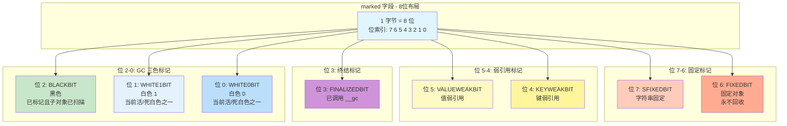

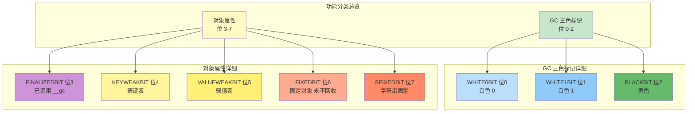

```c
/*
功能分类：

[GC 三色标记]  位 0-2
  • WHITE0BIT (0)   白色 0
  • WHITE1BIT (1)   白色 1
  • BLACKBIT  (2)   黑色

[对象属性]     位 3-7
  • FINALIZEDBIT  (3)  已调用 __gc
  • KEYWEAKBIT    (4)  弱键表
  • VALUEWEAKBIT  (5)  弱值表
  • FIXEDBIT      (6)  固定对象（永不回收）
  • SFIXEDBIT     (7)  字符串固定
*/

/* Layout for bit use in `marked' field (lgc.h) */
#define WHITE0BIT       0  /* 白色 0（当前活/死白色之一）*/
#define WHITE1BIT       1  /* 白色 1（当前活/死白色之一）*/
#define BLACKBIT        2  /* 黑色（已标记且子对象已扫描）*/
#define FINALIZEDBIT    3  /* 已终结（__gc 元方法已调用）*/
#define KEYWEAKBIT      4  /* 表的键是弱引用 */
#define VALUEWEAKBIT    5  /* 表的值是弱引用 */
#define FIXEDBIT        6  /* 对象固定（如全局表）*/
#define SFIXEDBIT       7  /* 字符串固定（短字符串？）*/

/* 位操作基础宏 */
#define bitmask(b)      (1<<(b))
#define bit2mask(b1,b2) (bitmask(b1) | bitmask(b2))
#define l_setbit(x,b)   ((x) |= bitmask(b))
#define resetbit(x,b)   ((x) &= cast(lu_byte, ~bitmask(b)))
#define testbit(x,b)    ((x) & bitmask(b))
#define test2bits(x,b1,b2) ((x) & bit2mask(b1,b2))

/* 白色掩码（两种白色的组合）*/
#define WHITEBITS       bit2mask(WHITE0BIT, WHITE1BIT)  /* 0x03 */

/*
示例值：
  WHITEBITS      = 0x03 = 0b00000011
  bitmask(BLACKBIT) = 0x04 = 0b00000100
  bitmask(FIXEDBIT) = 0x40 = 0b01000000
*/
```

#### 三色标记算法详解

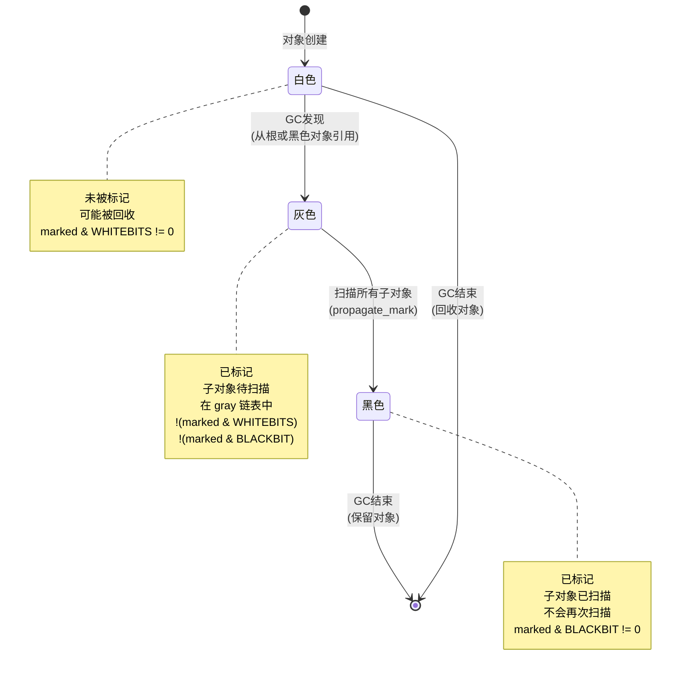

```c
/*
═══════════════════════════════════════════════════════════
  三色标记（Tri-color Marking）算法
═══════════════════════════════════════════════════════════

算法原理：
  将对象分为三种颜色，通过颜色转换实现增量标记
#define iswhite(x)      test2bits((x)->gch.marked, WHITE0BIT, WHITE1BIT)
#define isblack(x)      testbit((x)->gch.marked, BLACKBIT)
#define isgray(x)       (!isblack(x) && !iswhite(x))  /* 既不黑也不白 */

/*
颜色转换操作：
*/
#define white2gray(x)   resetbits((x)->gch.marked, WHITEBITS)  /* 清除白色位 */
#define gray2black(x)   l_setbit((x)->gch.marked, BLACKBIT)    /* 设置黑色位 */
#define black2gray(x)   resetbit((x)->gch.marked, BLACKBIT)    /* 清除黑色位 */

/*
三色不变式（Tri-color Invariant）：
  
  强不变式：黑色对象不能直接引用白色对象
  弱不变式：所有灰色对象最终会变为黑色
  
  违反不变式的情况：
    1. 黑色对象获得新的白色子对象
    2. 灰色队列为空但还有白色对象可达
  
  Lua 的解决方案：
    - 写屏障（Write Barrier）：新引用时重新标记
    - 增量标记：逐步扫描，避免遗漏
*/
```

#### 双白色技术（Two-White Technique）

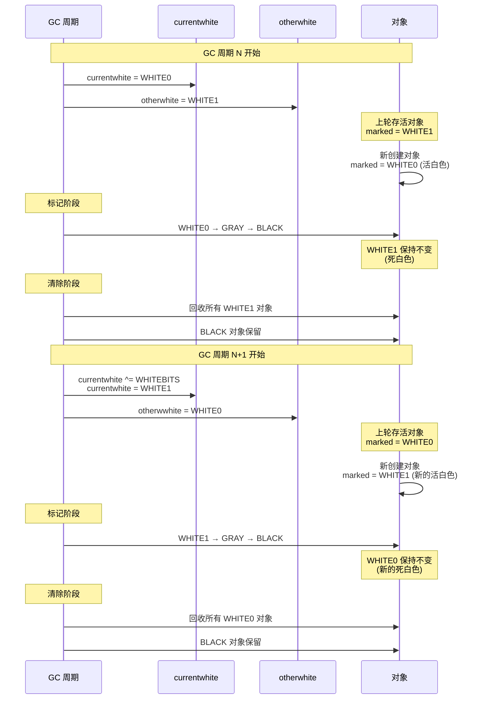

```c
/*
═══════════════════════════════════════════════════════════
  双白色技术：解决增量 GC 中的新对象问题
═══════════════════════════════════════════════════════════

问题背景：
  增量 GC 在标记阶段会不断创建新对象
  这些新对象应该被视为"存活"还是"死亡"？
  
  如果标记为白色 → 可能被误删（尚未扫描）
  如果标记为黑色 → 违反不变式（子对象未扫描）

解决方案：使用两种白色交替
#define otherwhite(g)   (g->currentwhite ^ WHITEBITS)
#define isdead(g,v)     ((v)->gch.marked & otherwhite(g) & WHITEBITS)
#define makewhite(g,x)  \
  ((x)->gch.marked = cast_byte(((x)->gch.marked & maskmarks) | luaC_white(g)))

/*
工作流程示例：
*/
void demonstrate_double_white(lua_State *L) {
    global_State *g = G(L);
    
    printf("=== GC Cycle N ===\n");
    printf("currentwhite: 0x%02x\n", g->currentwhite);    /* 0x01 (WHITE0) */
    printf("otherwhite:   0x%02x\n", otherwhite(g));      /* 0x02 (WHITE1) */
    
    /* 创建新对象，自动标记为 currentwhite */
    Table *t = luaH_new(L, 0, 0);
    printf("New table marked: 0x%02x\n", t->marked);      /* 0x01 (WHITE0) */
    
    /* 假设有旧对象（上轮的 WHITE1）*/
    TString *old_str;  /* marked = 0x02 (WHITE1) */
    
    /* GC 标记阶段 */
    /* ... WHITE0 对象会被扫描并变为 GRAY/BLACK ... */
    /* ... WHITE1 对象如果不可达则保持 WHITE1 ... */
    
    /* GC 清除阶段 */
    if (isdead(g, obj2gco(old_str))) {
        printf("Old string is dead, will be collected\n");
        /* 回收 old_str */
    }
    
    /* 下个周期：翻转白色 */
    g->currentwhite ^= WHITEBITS;
    
    printf("\n=== GC Cycle N+1 ===\n");
    printf("currentwhite: 0x%02x\n", g->currentwhite);    /* 0x02 (WHITE1) */
    printf("otherwhite:   0x%02x\n", otherwhite(g));      /* 0x01 (WHITE0) */
}

/*
优势总结：
  ✓ 新对象自动安全（标记为活白色，不会被误删）
  ✓ 无需在标记阶段更改所有对象的颜色
  ✓ 简化增量 GC 的实现
  ✓ 提供类似分代 GC 的效果（新对象更快被检查）
*/
```

#### 其他标记位详解

```c
/*
═══════════════════════════════════════════════════════════
  标记位 3-7：对象属性标记
═══════════════════════════════════════════════════════════
*/

/* ────────────────────────────────────────────────────── */
/*  位 3: FINALIZEDBIT - 终结标记                         */
/* ────────────────────────────────────────────────────── */

#define FINALIZEDBIT    3  /* 对象已调用 __gc 元方法 */

/*
用途：防止 __gc 元方法被重复调用

工作流程：

  1. 对象分配时：FINALIZEDBIT = 0
  
  2. GC 标记阶段：检测到对象有 __gc 元方法
     → 加入 tmudata 链表
  
  3. GC 终结阶段：
     if (!testbit(udata->marked, FINALIZEDBIT)) {
       call_gc_metamethod(udata);  // 调用 __gc
       l_setbit(udata->marked, FINALIZEDBIT);  // 标记已终结
     }
  
  4. 对象复活（resurrection）：
     __gc 内部可能让对象重新可达
     → 对象保留，但 FINALIZEDBIT = 1
     → 下次 GC 不再调用 __gc
*/
```

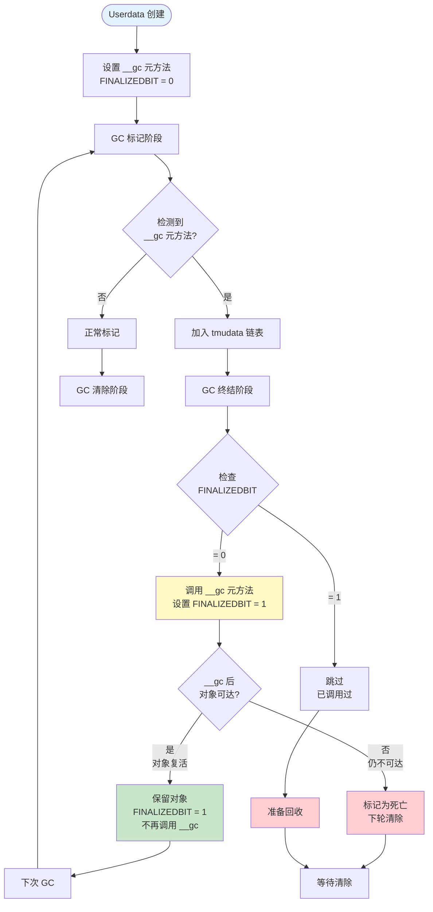

```c
/*
终结器调用流程说明：
void demonstrate_finalized_bit(lua_State *L) {
    /* 创建 userdata */
    void *ud = lua_newuserdata(L, 100);
    
    /* 设置元表和 __gc */
    lua_newtable(L);
    lua_pushcfunction(L, my_gc_function);
    lua_setfield(L, -2, "__gc");
    lua_setmetatable(L, -2);
    
    /* 获取 Udata 对象 */
    TValue *o = L->top - 1;
    Udata *u = rawudata(o);
    
    printf("Initial FINALIZEDBIT: %d\n", 
           testbit(u->uv.marked, FINALIZEDBIT));  /* 0 */
    
    /* 第一次 GC：调用 __gc */
    lua_gc(L, LUA_GCCOLLECT, 0);
    /* __gc 被调用，FINALIZEDBIT 设置为 1 */
    
    printf("After first GC: %d\n", 
           testbit(u->uv.marked, FINALIZEDBIT));  /* 1 */
    
    /* 即使对象复活，__gc 也不会再次调用 */
}

/* ────────────────────────────────────────────────────── */
/*  位 4-5: KEYWEAKBIT & VALUEWEAKBIT - 弱表标记          */
/* ────────────────────────────────────────────────────── */

#define KEYWEAKBIT      4  /* 表的键是弱引用 */
#define VALUEWEAKBIT    5  /* 表的值是弱引用 */

/*
用途：标识弱表（Weak Table），允许 GC 回收键或值

弱表类型：
┌──────────────┬──────────────┬──────────────────────────┐
│  KEYWEAKBIT  │ VALUEWEAKBIT │  表类型                  │
├──────────────┼──────────────┼──────────────────────────┤
│      0       │      0       │  强表（普通表）          │
│      1       │      0       │  弱键表 {__mode="k"}     │
│      0       │      1       │  弱值表 {__mode="v"}     │
│      1       │      1       │  双弱表 {__mode="kv"}    │
└──────────────┴──────────────┴──────────────────────────┘

工作原理：

强表（默认）：
  table[key] = value
  → key 和 value 都是强引用
  → 只要 table 存活，key 和 value 就不会被回收

弱键表（__mode="k"）：
  table[key] = value
  → key 是弱引用（不阻止 GC）
  → value 是强引用
  → 如果 key 不被其他对象引用，可以被回收
  → key 被回收后，整个条目删除

弱值表（__mode="v"）：
  table[key] = value
  → key 是强引用
  → value 是弱引用（不阻止 GC）
  → 如果 value 不被其他对象引用，可以被回收
  → value 被回收后，条目值变为 nil
*/
```

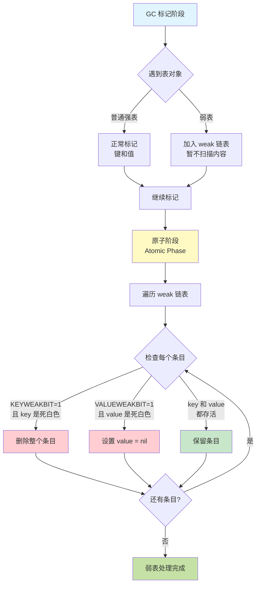

```c
/*
弱表 GC 处理流程：

标记阶段：
  1. 扫描到弱表 → 加入 weak 链表
  2. 暂不扫描弱表内容

原子阶段（Atomic Phase）：
  3. 遍历 weak 链表
  4. 对每个弱表：
     for each entry in table:
       if (KEYWEAKBIT && iswhite(key)):
         remove entry  // 键是死白色，删除条目
       elif (VALUEWEAKBIT && iswhite(value)):
         set value = nil  // 值是死白色，清除值
  5. 清理后，弱表内容只保留活对象

示例代码：
*/
void demonstrate_weak_tables(lua_State *L) {
    printf("=== 弱表演示 ===\n\n");
    
    /* 示例 1：弱键表 */
    lua_newtable(L);  /* 创建表 */
    lua_newtable(L);  /* 创建元表 */
    lua_pushliteral(L, "k");
    lua_setfield(L, -2, "__mode");  /* __mode = "k" */
    lua_setmetatable(L, -2);
    
    /* Lua 内部会设置 KEYWEAKBIT */
    Table *weak_key_table = hvalue(L->top - 1);
    assert(testbit(weak_key_table->marked, KEYWEAKBIT));
    printf("弱键表标记: 0x%02x\n", weak_key_table->marked);
    
    /* 示例 2：弱值表 */
    lua_newtable(L);
    lua_newtable(L);
    lua_pushliteral(L, "v");
    lua_setfield(L, -2, "__mode");  /* __mode = "v" */
    lua_setmetatable(L, -2);
    
    Table *weak_value_table = hvalue(L->top - 1);
    assert(testbit(weak_value_table->marked, VALUEWEAKBIT));
    printf("弱值表标记: 0x%02x\n", weak_value_table->marked);
    
    /* 示例 3：双弱表 */
    lua_newtable(L);
    lua_newtable(L);
    lua_pushliteral(L, "kv");
    lua_setfield(L, -2, "__mode");  /* __mode = "kv" */
    lua_setmetatable(L, -2);
    
    Table *weak_kv_table = hvalue(L->top - 1);
    assert(testbit(weak_kv_table->marked, KEYWEAKBIT));
    assert(testbit(weak_kv_table->marked, VALUEWEAKBIT));
    printf("双弱表标记: 0x%02x\n", weak_kv_table->marked);
}

/*
弱表判断宏（lgc.h）：
*/
#define weakkey(x)   (testbit((x)->marked, KEYWEAKBIT))
#define weakvalue(x) (testbit((x)->marked, VALUEWEAKBIT))

/*
实际应用场景：

1. 弱键表（缓存）：
   cache = setmetatable({}, {__mode="k"})
   cache[object] = computed_value
   → object 被回收后，缓存自动清理

2. 弱值表（对象注册表）：
   registry = setmetatable({}, {__mode="v"})
   registry[name] = object
   → object 被回收后，注册项自动删除

3. 双弱表（双向映射）：
   map = setmetatable({}, {__mode="kv"})
   map[obj1] = obj2
   → 任一对象被回收，映射自动清理
*/

/* ────────────────────────────────────────────────────── */
/*  位 6: FIXEDBIT - 固定对象标记                         */
/* ────────────────────────────────────────────────────── */

#define FIXEDBIT        6  /* 对象固定，永不回收 */

/*
用途：标记永久对象，GC 跳过这些对象

固定对象类型：
  • 全局注册表（registry）
  • 主线程（mainthread）
  • 元方法字符串（"__index", "__newindex" 等）
  • 全局环境表
*/
```

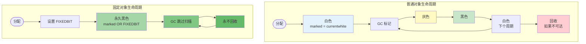

```c
/*
固定对象 vs 普通对象：

普通对象：
  分配 → 白色 → 灰色 → 黑色 → 白色 → ...
         ↑                      ↓
         └──────── GC 循环 ─────┘

固定对象：
  分配 → 设置 FIXEDBIT → 永久黑色
                         ↓
                    GC 跳过扫描
                    永不回收

GC 处理逻辑：
*/
static void sweeplist(lua_State *L, GCObject **p, lu_mem count) {
  GCObject *curr;
  global_State *g = G(L);
  int deadmask = otherwhite(g);
  
  while ((curr = *p) != NULL && count-- > 0) {
    if (curr->gch.tt == LUA_TTHREAD)
      sweepwholelist(L, &gco2th(curr)->openupval);
    
    /* 检查固定位 */
    if (testbit(curr->gch.marked, FIXEDBIT)) {
      /* 固定对象：保留，不修改颜色 */
      lua_assert(!isdead(g, curr));
      makewhite(g, curr);  /* 标记为活白色（可选）*/
      p = &curr->gch.next;
    }
    else if ((curr->gch.marked ^ WHITEBITS) & deadmask) {
      /* 普通存活对象 */
      makewhite(g, curr);
      p = &curr->gch.next;
    }
    else {
      /* 死亡对象：回收 */
      *p = curr->gch.next;
      if (curr == g->rootgc) g->rootgc = curr->gch.next;
      freeobj(L, curr);
    }
  }
}

/*
设置固定对象：
*/
void demonstrate_fixed_objects(lua_State *L) {
    global_State *g = G(L);
    
    /* 主线程是固定的 */
    lua_State *mainthread = g->mainthread;
    assert(testbit(obj2gco(mainthread)->gch.marked, FIXEDBIT));
    printf("主线程 marked: 0x%02x (FIXEDBIT=%d)\n", 
           obj2gco(mainthread)->gch.marked,
           testbit(obj2gco(mainthread)->gch.marked, FIXEDBIT));
    
    /* 元方法字符串固定 */
    TString *index_str = luaS_newliteral(L, "__index");
    l_setbit(index_str->tsv.marked, FIXEDBIT);
    printf("__index 字符串 marked: 0x%02x\n", index_str->tsv.marked);
    
    /* 自定义固定对象 */
    Table *permanent_table = luaH_new(L, 0, 0);
    l_setbit(permanent_table->marked, FIXEDBIT);
    
    /* GC 永不回收 */
    lua_gc(L, LUA_GCCOLLECT, 0);  /* 完整 GC */
    lua_gc(L, LUA_GCCOLLECT, 0);  /* 再次 GC */
    /* permanent_table 仍然存在 */
}

/* ────────────────────────────────────────────────────── */
/*  位 7: SFIXEDBIT - 字符串固定标记                      */
/* ────────────────────────────────────────────────────── */

#define SFIXEDBIT       7  /* 字符串固定（短字符串？）*/

/*
用途：特殊的字符串固定标记（Lua 5.1 中用途不明确）

可能的用途：
  • 区分固定字符串和其他固定对象
  • 短字符串优化标记
  • 保留位，未来扩展

注意：在 Lua 5.1.5 源码中，SFIXEDBIT 定义了但很少使用

与 FIXEDBIT 的区别：
  FIXEDBIT:  通用固定标记（所有对象）
  SFIXEDBIT: 字符串专用固定标记

判断宏：
*/
#define isfinalized(u)  testbit((u)->marked, FINALIZEDBIT)

/*
═══════════════════════════════════════════════════════════
  标记位组合示例
═══════════════════════════════════════════════════════════

常见标记组合：

1. 普通新对象：
   marked = 0x01 (WHITE0)
   → 仅白色位设置

2. 标记后的对象：
   marked = 0x04 (BLACKBIT)
   → 黑色

3. 弱键表：
   marked = 0x11 (WHITE0 + KEYWEAKBIT)
   → 白色 + 弱键位

4. 固定对象：
   marked = 0x44 (BLACKBIT + FIXEDBIT)
   → 黑色 + 固定位

5. 已终结的 userdata：
   marked = 0x0C (BLACKBIT + FINALIZEDBIT)
   → 黑色 + 已终结

6. 双弱固定表：
   marked = 0x74 (BLACKBIT + FIXEDBIT + VALUEWEAKBIT + KEYWEAKBIT)
   → 黑色 + 固定 + 双弱

位图示例：
  0x74 = 0b01110100
         |||||||└─ WHITE0BIT = 0
         ||||||└── WHITE1BIT = 0
         |||||└─── BLACKBIT = 1  ✓
         ||||└──── FINALIZEDBIT = 0
         |||└───── KEYWEAKBIT = 1  ✓
         ||└────── VALUEWEAKBIT = 1  ✓
         |└─────── FIXEDBIT = 1  ✓
         └──────── SFIXEDBIT = 0
*/

/* 完整示例：检查对象的所有标记位 */
void print_object_marks(GCObject *o) {
    lu_byte m = o->gch.marked;
    
    printf("=== Object Marks: 0x%02x ===\n", m);
    printf("  WHITE0:     %d\n", !!(m & bitmask(WHITE0BIT)));
    printf("  WHITE1:     %d\n", !!(m & bitmask(WHITE1BIT)));
    printf("  BLACK:      %d\n", !!(m & bitmask(BLACKBIT)));
    printf("  FINALIZED:  %d\n", !!(m & bitmask(FINALIZEDBIT)));
    printf("  KEYWEAK:    %d\n", !!(m & bitmask(KEYWEAKBIT)));
    printf("  VALUEWEAK:  %d\n", !!(m & bitmask(VALUEWEAKBIT)));
    printf("  FIXED:      %d\n", !!(m & bitmask(FIXEDBIT)));
    printf("  SFIXED:     %d\n", !!(m & bitmask(SFIXEDBIT)));
    
    /* 颜色判断 */
    if (iswhite(o))
        printf("  Color: WHITE\n");
    else if (isgray(o))
        printf("  Color: GRAY\n");
    else if (isblack(o))
        printf("  Color: BLACK\n");
}
```

#### 标记位状态转换图

```c
/*
═══════════════════════════════════════════════════════════
  对象生命周期中的标记状态转换完整图
═══════════════════════════════════════════════════════════

1. 对象分配
   +---------+
   | 分配    |
   +---------+
       |
       v
   [白色]（当前白色）
   marked = currentwhite
   
2. GC 标记阶段
   [白色] --扫描到--> [灰色] --子对象扫描完--> [黑色]
                      (gray链表)              (BLACKBIT)
   
3. GC 清除阶段
   [白色]（非当前白色）--清除--> 释放内存
   [黑色] --准备下轮GC--> [白色]（翻转后的当前白色）
   
4. 写屏障触发
   [黑色对象] --引用白色对象--> [灰色]（变回灰色或标记白色对象）
   
5. 特殊状态
   - FINALIZEDBIT：调用过 __gc，不再重复调用
   - FIXEDBIT：固定对象，跳过清除
   - 弱表位：特殊扫描逻辑
*/

/* 标记位操作函数（lgc.c）*/

/* 标记对象为黑色 */
static void reallymarkobject(global_State *g, GCObject *o) {
    white2gray(o);  /* 白 -> 灰 */
    
    switch (o->gch.tt) {
        case LUA_TSTRING: {
            /* 字符串没有子对象，直接变黑 */
            gray2black(o);
            break;
        }
        case LUA_TTABLE: {
            /* 表加入灰色链表 */
            linktable(gco2h(o), &g->gray);
            break;
        }
        case LUA_TFUNCTION: {
            /* 闭包加入灰色链表 */
            linkclosure(gco2cl(o), &g->gray);
            break;
        }
        /* ... 其他类型 ... */
    }
}

/* 白转灰 */
#define white2gray(x)   reset2bits((x)->gch.marked, WHITE0BIT, WHITE1BIT)

/* 灰转黑 */
#define gray2black(x)   l_setbit((x)->gch.marked, BLACKBIT)

/* 黑转灰（写屏障）*/
#define black2gray(x)   resetbit((x)->gch.marked, BLACKBIT)
```

---

## 基本对象结构

### 2.1 TString 字符串

#### 字符串结构定义（lobject.h）

```c
/*
** String headers for string table
** 字符串表的字符串头
*/
typedef union TString {
  L_Umaxalign dummy;  /* 确保最大对齐 */
  struct {
    CommonHeader;      /* GC 头部 */
    lu_byte reserved;  /* 保留（短字符串哈希优化）*/
    unsigned int hash; /* 哈希值 */
    size_t len;        /* 字符串长度 */
  } tsv;
} TString;

/* 字符串内容紧跟在 TString 结构后 */
#define getstr(ts)  (cast(const char *, (ts)) + sizeof(union TString))
#define svalue(o)   getstr(rawtsvalue(o))

/*
内存布局：

TString 对象在内存中的布局：
+------------------------+
| GCObject *next         | 8 字节（64位）
+------------------------+
| lu_byte tt             | 1 字节 (LUA_TSTRING)
+------------------------+
| lu_byte marked         | 1 字节
+------------------------+
| lu_byte reserved       | 1 字节
+------------------------+
| padding                | 1 字节（对齐）
+------------------------+
| unsigned int hash      | 4 字节
+------------------------+
| size_t len             | 8 字节（64位）
+------------------------+
| 字符串内容              | len + 1 字节（包含 \0）
| "hello\0"              |
+------------------------+

总大小：sizeof(TString) + len + 1
*/
```

#### 字符串分配（lstring.c）

```c
/* 创建新字符串 */
TString *luaS_newlstr(lua_State *L, const char *str, size_t l) {
  global_State *g = G(L);
  GCObject *o;
  
  /* 检查字符串表中是否已存在（字符串内化）*/
  for (o = g->strt.hash[lmod(h, g->strt.size)]; o != NULL; o = o->gch.next) {
    TString *ts = rawgco2ts(o);
    if (ts->tsv.len == l && (memcmp(str, getstr(ts), l) == 0)) {
      /* 已存在，直接返回 */
      if (isdead(g, o))  /* 如果在清除阶段被标记为死亡 */
        changewhite(o);  /* 复活对象 */
      return ts;
    }
  }
  
  /* 不存在，创建新字符串 */
  TString *ts;
  
  /* 分配内存：TString 结构 + 字符串内容 */
  ts = cast(TString *, luaM_malloc(L, sizeof(TString) + l + 1));
  
  /* 初始化头部 */
  ts->tsv.len = l;
  ts->tsv.hash = h;  /* 哈希值已计算 */
  ts->tsv.marked = luaC_white(g);  /* 当前白色 */
  ts->tsv.tt = LUA_TSTRING;
  ts->tsv.reserved = 0;
  
  /* 复制字符串内容 */
  memcpy(getstr(ts), str, l);
  getstr(ts)[l] = '\0';  /* 添加终止符 */
  
  /* 插入字符串表 */
  h = lmod(h, g->strt.size);
  ts->tsv.next = g->strt.hash[h];
  g->strt.hash[h] = obj2gco(ts);
  g->strt.nuse++;
  
  /* 检查是否需要扩展字符串表 */
  if (g->strt.nuse > cast(lu_int32, g->strt.size) && g->strt.size <= MAX_INT/2)
    luaS_resize(L, g->strt.size * 2);
  
  return ts;
}

/* 字符串哈希函数 */
static unsigned int hash_str(const char *str, size_t len) {
  unsigned int h = cast(unsigned int, len);
  size_t step = (len >> 5) + 1;  /* 步长：len/32 + 1 */
  
  /* 采样哈希（不是每个字符都参与）*/
  for (; len >= step; len -= step)
    h = h ^ ((h<<5) + (h>>2) + cast(unsigned char, str[len-1]));
  
  return h;
}

/*
字符串内化原理：

1. 全局字符串表：
   - 哈希表结构
   - 所有字符串唯一存储
   
2. 字符串比较优化：
   - 相同内容的字符串指针相同
   - 比较字符串只需比较指针（O(1)）
   
3. 内存节省：
   - 相同字符串只存储一份
   - 适合大量重复字符串场景
*/
```

#### 字符串表管理

```c
/* 全局字符串表（lstate.h）*/
typedef struct stringtable {
  GCObject **hash;  /* 哈希数组 */
  lu_int32 nuse;    /* 已使用槽位数 */
  int size;         /* 数组大小 */
} stringtable;

/* 字符串表扩展 */
void luaS_resize(lua_State *L, int newsize) {
  global_State *g = G(L);
  stringtable *tb = &g->strt;
  GCObject **newhash;
  int i;
  
  if (newsize > tb->size) {
    /* 扩展 */
    newhash = luaM_newvector(L, newsize, GCObject *);
    
    /* 初始化新数组 */
    for (i = 0; i < newsize; i++)
      newhash[i] = NULL;
    
    /* 重新哈希所有字符串 */
    for (i = 0; i < tb->size; i++) {
      GCObject *p = tb->hash[i];
      while (p) {
        GCObject *next = p->gch.next;
        
        /* 计算新位置 */
        unsigned int h = gco2ts(p)->hash;
        int h1 = lmod(h, newsize);
        
        /* 插入新表 */
        p->gch.next = newhash[h1];
        newhash[h1] = p;
        
        p = next;
      }
    }
    
    /* 释放旧数组 */
    luaM_freearray(L, tb->hash, tb->size, GCObject *);
    
    tb->size = newsize;
    tb->hash = newhash;
  }
}

/* 字符串表可视化示例 */
void visualize_string_table(lua_State *L) {
  global_State *g = G(L);
  stringtable *tb = &g->strt;
  
  printf("=== String Table ===\n");
  printf("Size: %d, Use: %d, Load: %.2f\n",
         tb->size, tb->nuse, (double)tb->nuse / tb->size);
  
  /* 遍历每个槽位 */
  for (int i = 0; i < tb->size; i++) {
    int count = 0;
    GCObject *o = tb->hash[i];
    
    while (o) {
      count++;
      o = o->gch.next;
    }
    
    if (count > 0) {
      printf("Slot[%d]: %d strings\n", i, count);
    }
  }
  
  printf("====================\n");
}
```

---

### 2.2 Table 表

#### Table 结构定义（lobject.h）

```c
typedef struct Table {
  CommonHeader;            /* GC 头部 */
  lu_byte flags;           /* 1<<p 表示第 p 个元方法存在 */
  lu_byte lsizenode;       /* log2(node 数组大小) */
  struct Table *metatable; /* 元表 */
  TValue *array;           /* 数组部分 */
  Node *node;              /* 哈希部分 */
  Node *lastfree;          /* 最后一个空闲节点 */
  GCObject *gclist;        /* GC 链表 */
  int sizearray;           /* 数组部分大小 */
} Table;

/* 哈希节点结构 */
typedef struct Node {
  TValue i_val;   /* 值 */
  TKey i_key;     /* 键 */
} Node;

typedef union TKey {
  struct {
    Value value;
    int tt;
    struct Node *next;  /* 冲突链表 */
  } nk;
  TValue tvk;
} TKey;

/*
Table 内存布局：

1. 数组部分（array）：
   - 连续内存
   - 索引 1 到 sizearray
   - 适合密集整数键
   
2. 哈希部分（node）：
   - 2 的幂次大小
   - 开放地址法（链地址法）
   - 适合稀疏键或非整数键
   
示例：
t = {10, 20, 30, x="hello", y="world"}

数组部分：
array[0] = 10
array[1] = 20
array[2] = 30
sizearray = 3

哈希部分：
node[hash("x")] = {key="x", val="hello", next=...}
node[hash("y")] = {key="y", val="world", next=...}
*/
```

#### Table 创建（ltable.c）

```c
/* 创建新表 */
Table *luaH_new(lua_State *L, int narray, int nhash) {
  Table *t = luaM_new(L, Table);
  
  /* 初始化头部 */
  luaC_link(L, obj2gco(t), LUA_TTABLE);
  t->metatable = NULL;
  t->flags = cast_byte(~0);  /* 所有元方法未缓存 */
  t->array = NULL;
  t->sizearray = 0;
  t->lsizenode = 0;
  t->node = cast(Node *, dummynode);  /* 虚拟节点 */
  
  /* 预分配数组和哈希部分 */
  setarrayvector(L, t, narray);
  setnodevector(L, t, nhash);
  
  return t;
}

/* 设置数组部分大小 */
static void setarrayvector(lua_State *L, Table *t, int size) {
  int i;
  
  /* 重新分配数组 */
  luaM_reallocvector(L, t->array, t->sizearray, size, TValue);
  
  /* 初始化新元素为 nil */
  for (i = t->sizearray; i < size; i++)
    setnilvalue(&t->array[i]);
  
  t->sizearray = size;
}

/* 设置哈希部分大小 */
static void setnodevector(lua_State *L, Table *t, int size) {
  int lsize;
  
  if (size == 0) {
    /* 使用虚拟节点 */
    t->node = cast(Node *, dummynode);
    lsize = 0;
  }
  else {
    int i;
    
    /* 计算 log2(size) */
    lsize = ceillog2(size);
    if (lsize > MAXBITS)
      luaG_runerror(L, "table overflow");
    
    size = twoto(lsize);  /* 2^lsize */
    
    /* 分配节点数组 */
    t->node = luaM_newvector(L, size, Node);
    
    /* 初始化所有节点 */
    for (i = 0; i < size; i++) {
      Node *n = gnode(t, i);
      gnext(n) = NULL;           /* 无后继 */
      setnilvalue(gkey(n));      /* 键为 nil */
      setnilvalue(gval(n));      /* 值为 nil */
    }
  }
  
  t->lsizenode = cast_byte(lsize);
  t->lastfree = gnode(t, size);  /* 初始指向末尾 */
}

/* Table 插入操作 */
TValue *luaH_set(lua_State *L, Table *t, const TValue *key) {
  const TValue *p = luaH_get(t, key);
  t->flags = 0;  /* 清除缓存标志 */
  
  if (p != luaO_nilobject)
    return cast(TValue *, p);  /* 已存在 */
  else {
    /* 新键，需要插入 */
    if (ttisnil(key))
      luaG_runerror(L, "table index is nil");
    else if (ttisnumber(key) && luai_numisnan(nvalue(key)))
      luaG_runerror(L, "table index is NaN");
    
    return newkey(L, t, key);
  }
}
```

继续第 2.3-2.4 节（Closure、Userdata）和第 3-4 章（全局状态、分配器接口）？

---

### 2.3 Closure 闭包

#### Closure 结构（lobject.h）

```c
/* Lua 闭包和 C 闭包联合体 */
typedef union Closure {
  CClosure c;   /* C 闭包 */
  LClosure l;   /* Lua 闭包 */
} Closure;

/* C 闭包 */
typedef struct CClosure {
  ClosureHeader;        /* 公共头部 */
  lua_CFunction f;      /* C 函数指针 */
  TValue upvalue[1];    /* upvalue 数组 */
} CClosure;

/* Lua 闭包 */
typedef struct LClosure {
  ClosureHeader;        /* 公共头部 */
  struct Proto *p;      /* 函数原型 */
  UpVal *upvals[1];     /* upvalue 指针数组 */
} LClosure;

/* 闭包头部 */
#define ClosureHeader \
  CommonHeader; lu_byte isC; lu_byte nupvalues; GCObject *gclist; \
  struct Table *env

/* Upvalue 结构 */
typedef struct UpVal {
  CommonHeader;
  TValue *v;            /* 指向实际值 */
  union {
    TValue value;       /* closed 状态的值 */
    struct {
      struct UpVal *prev;
      struct UpVal *next;
    } l;                /* open 状态的链表 */
  } u;
} UpVal;

/*
Upvalue 两种状态：

1. Open（开启）：
   - v 指向栈上的值
   - 在 openupval 链表中
   - 栈上的变量仍然活跃
   
2. Closed（关闭）：
   - v 指向 u.value
   - 栈上的变量已失效
   - 值复制到 upvalue 内部
*/
```

#### Closure 创建（lfunc.c）

```c
/* 创建 Lua 闭包 */
Closure *luaF_newLclosure(lua_State *L, int nelems, Table *e) {
  Closure *c = cast(Closure *, luaM_malloc(L, sizeLclosure(nelems)));
  
  /* 初始化头部 */
  luaC_link(L, obj2gco(c), LUA_TFUNCTION);
  c->l.isC = 0;
  c->l.env = e;
  c->l.nupvalues = cast_byte(nelems);
  c->l.gclist = NULL;
  c->l.p = NULL;
  
  /* 初始化 upvalue 指针 */
  while (nelems--)
    c->l.upvals[nelems] = NULL;
  
  return c;
}

/* 创建 C 闭包 */
Closure *luaF_newCclosure(lua_State *L, int nelems, Table *e) {
  Closure *c = cast(Closure *, luaM_malloc(L, sizeCclosure(nelems)));
  
  luaC_link(L, obj2gco(c), LUA_TFUNCTION);
  c->c.isC = 1;
  c->c.env = e;
  c->c.nupvalues = cast_byte(nelems);
  c->c.gclist = NULL;
  c->c.f = NULL;
  
  return c;
}

/* 查找或创建 upvalue */
UpVal *luaF_findupval(lua_State *L, StkId level) {
  global_State *g = G(L);
  GCObject **pp = &L->openupval;
  UpVal *p;
  UpVal *uv;
  
  /* 在 open upvalue 链表中查找 */
  while (*pp != NULL && (p = ngcotouv(*pp))->v >= level) {
    lua_assert(p->v != &p->u.value);
    
    if (p->v == level) {
      /* 找到，检查是否死亡 */
      if (isdead(g, obj2gco(p)))
        changewhite(obj2gco(p));
      return p;
    }
    
    pp = &p->next;
  }
  
  /* 未找到，创建新的 */
  uv = luaM_new(L, UpVal);
  uv->tt = LUA_TUPVAL;
  uv->marked = luaC_white(g);
  uv->v = level;  /* 指向栈位置 */
  
  /* 插入链表（按地址排序）*/
  uv->next = *pp;
  *pp = obj2gco(uv);
  uv->u.l.prev = &g->uvhead;
  uv->u.l.next = g->uvhead.u.l.next;
  uv->u.l.next->u.l.prev = uv;
  g->uvhead.u.l.next = uv;
  
  lua_assert(uv->u.l.next->u.l.prev == uv && uv->u.l.prev->u.l.next == uv);
  
  return uv;
}

/* 关闭 upvalue */
void luaF_close(lua_State *L, StkId level) {
  UpVal *uv;
  global_State *g = G(L);
  
  while (L->openupval != NULL && (uv = ngcotouv(L->openupval))->v >= level) {
    GCObject *o = obj2gco(uv);
    lua_assert(!isblack(o) && uv->v != &uv->u.value);
    
    L->openupval = uv->next;  /* 从链表移除 */
    
    if (isdead(g, o))
      luaF_freeupval(L, uv);  /* 释放 */
    else {
      /* 关闭：复制值到内部 */
      setobj(L, &uv->u.value, uv->v);
      uv->v = &uv->u.value;  /* 指向内部值 */
      
      /* 从 open 链表移除 */
      luaC_linkupval(L, uv);
      
      /* 标记为灰色（需要扫描内部值）*/
      if (isgray(o)) {
        if (keepinvariant(g))
          reallymarkobject(g, o);
      }
    }
  }
}
```

---

## 分配器接口

### 4.1 lua_Alloc 函数指针

#### 分配器接口定义（lua.h）

```c
/*
** prototype for memory-allocation functions
** 内存分配函数原型
*/
typedef void * (*lua_Alloc) (void *ud, void *ptr, size_t osize, size_t nsize);

/*
参数说明：

ud (User Data)：
  - 用户数据指针
  - 传递给分配器的上下文
  - 可用于自定义分配器的状态

ptr (Pointer)：
  - 要操作的内存块指针
  - NULL：分配新内存
  - 非 NULL：重新分配或释放

osize (Old Size)：
  - 原内存块大小
  - 用于统计和验证
  
nsize (New Size)：
  - 新内存块大小
  - 0：释放内存
  - >0：分配或重新分配

返回值：
  - 成功：新内存块指针
  - 失败：NULL

操作模式：
+----------+----------+-----------+------------------+
| ptr      | osize    | nsize     | 操作             |
+----------+----------+-----------+------------------+
| NULL     | 0        | n         | 分配 n 字节      |
| p        | old      | 0         | 释放 p           |
| p        | old      | new       | 重新分配为 new   |
| NULL     | old      | new       | 非法（断言失败） |
+----------+----------+-----------+------------------+
*/
```

#### 默认分配器实现（lauxlib.c）

```c
/* 默认分配器（使用 realloc）*/
static void *l_alloc(void *ud, void *ptr, size_t osize, size_t nsize) {
  (void)ud;
  (void)osize;
  
  if (nsize == 0) {
    /* 释放内存 */
    free(ptr);
    return NULL;
  }
  else {
    /* 分配或重新分配 */
    return realloc(ptr, nsize);
  }
}

/*
使用标准 realloc 的特点：

优点：
- 简单直接
- 无需额外状态
- 系统自动优化

缺点：
- 无法控制内存来源
- 无法实施配额
- 无法跟踪分配
- 失败时返回 NULL
*/
```

#### 自定义分配器示例

```c
/* 自定义分配器：带统计和限制 */
typedef struct {
  size_t total_allocated;  /* 总分配量 */
  size_t peak_memory;      /* 峰值内存 */
  size_t limit;            /* 内存限制 */
  size_t num_allocs;       /* 分配次数 */
  size_t num_frees;        /* 释放次数 */
} MemStats;

static void *custom_alloc(void *ud, void *ptr, size_t osize, size_t nsize) {
  MemStats *stats = (MemStats *)ud;
  
  if (nsize == 0) {
    /* 释放 */
    free(ptr);
    
    stats->total_allocated -= osize;
    stats->num_frees++;
    
    return NULL;
  }
  else {
    /* 检查内存限制 */
    size_t delta = nsize - osize;
    if (stats->total_allocated + delta > stats->limit) {
      /* 超过限制，分配失败 */
      return NULL;
    }
    
    /* 分配 */
    void *newptr = realloc(ptr, nsize);
    if (newptr == NULL)
      return NULL;  /* 系统内存不足 */
    
    /* 更新统计 */
    stats->total_allocated += delta;
    
    if (stats->total_allocated > stats->peak_memory)
      stats->peak_memory = stats->total_allocated;
    
    if (ptr == NULL)
      stats->num_allocs++;
    
    return newptr;
  }
}

/* 使用自定义分配器 */
void demo_custom_allocator() {
  MemStats stats = {0, 0, 10 * 1024 * 1024, 0, 0};  /* 10MB 限制 */
  
  /* 创建 Lua 状态（使用自定义分配器）*/
  lua_State *L = lua_newstate(custom_alloc, &stats);
  
  /* ... 使用 Lua ... */
  
  /* 打印统计 */
  printf("Total allocated: %zu bytes\n", stats.total_allocated);
  printf("Peak memory: %zu bytes\n", stats.peak_memory);
  printf("Allocations: %zu, Frees: %zu\n", 
         stats.num_allocs, stats.num_frees);
  
  lua_close(L);
}
```

---

### 4.2 luaM_realloc_ 实现

#### 核心重分配函数（lmem.c）

```c
/*
** generic allocation routine
** 通用分配例程
*/
void *luaM_realloc_(lua_State *L, void *block, size_t osize, size_t nsize) {
  global_State *g = G(L);
  
  lua_assert((osize == 0) == (block == NULL));
  
  /* 调用用户分配器 */
  block = (*g->frealloc)(g->ud, block, osize, nsize);
  
  if (block == NULL && nsize > 0) {
    /* 分配失败 */
    
    /* 尝试紧急 GC */
    luaC_fullgc(L);
    
    /* 再次尝试分配 */
    block = (*g->frealloc)(g->ud, NULL, 0, nsize);
    
    if (block == NULL)
      luaD_throw(L, LUA_ERRMEM);  /* 内存不足错误 */
  }
  
  lua_assert((nsize == 0) == (block == NULL));
  
  /* 更新内存统计 */
  g->totalbytes = (g->totalbytes - osize) + nsize;
  
  return block;
}

/*
内存分配流程：

1. 调用用户分配器
   |
   v
2. 成功？
   |-- 是 --> 更新统计 --> 返回
   |
   |-- 否 --> 执行完整 GC
              |
              v
           3. 再次尝试分配
              |
              v
           4. 成功？
              |-- 是 --> 更新统计 --> 返回
              |-- 否 --> 抛出 OOM 错误
*/

/* 分配辅助宏（lmem.h）*/
#define luaM_reallocv(L,b,on,n,e) \
  ((cast(size_t, (n)+1) <= MAX_SIZET/(e)) ? \
    luaM_realloc_(L, (b), (on)*(e), (n)*(e)) : \
    luaM_toobig(L))

#define luaM_freemem(L, b, s) luaM_realloc_(L, (b), (s), 0)
#define luaM_free(L, b)       luaM_realloc_(L, (b), sizeof(*(b)), 0)
#define luaM_freearray(L, b, n, t) luaM_realloc_(L, (b), (n)*sizeof(t), 0)

#define luaM_malloc(L,t)      luaM_realloc_(L, NULL, 0, (t))
#define luaM_new(L,t)         cast(t *, luaM_malloc(L, sizeof(t)))
#define luaM_newvector(L,n,t) cast(t *, luaM_reallocv(L, NULL, 0, n, sizeof(t)))

#define luaM_growvector(L,v,nelems,size,t,limit,e) \
  if ((nelems)+1 > (size)) \
    ((v)=cast(t *, luaM_growaux_(L,v,&(size),sizeof(t),limit,e)))

#define luaM_reallocvector(L, v,oldn,n,t) \
   ((v)=cast(t *, luaM_reallocv(L, v, oldn, n, sizeof(t))))
```

#### 内存统计

```c
/* global_State 中的内存统计字段 */
struct global_State {
  /* ... */
  
  size_t totalbytes;   /* 当前分配的总字节数 */
  size_t GCthreshold;  /* GC 触发阈值 */
  
  /* GC 债务（负数表示可以推迟 GC）*/
  l_mem GCdebt;
  
  /* ... */
};

/* 内存统计示例 */
void print_memory_stats(lua_State *L) {
  global_State *g = G(L);
  
  printf("=== Memory Statistics ===\n");
  printf("Total bytes: %zu (%.2f MB)\n", 
         g->totalbytes, g->totalbytes / (1024.0 * 1024.0));
  printf("GC threshold: %zu (%.2f MB)\n",
         g->GCthreshold, g->GCthreshold / (1024.0 * 1024.0));
  printf("GC debt: %ld\n", (long)g->GCdebt);
  printf("=========================\n");
}

/* collectgarbage("count") 的实现 */
static int luaB_collectgarbage(lua_State *L) {
  static const char *const opts[] = {
    "stop", "restart", "collect", "count", /*...*/
  };
  
  int o = luaL_checkoption(L, 1, "collect", opts);
  int ex = luaL_optint(L, 2, 0);
  
  switch (o) {
    case 3: {  /* "count" */
      int k = cast_int(lua_gc(L, LUA_GCCOUNT, 0));
      int b = cast_int(lua_gc(L, LUA_GCCOUNTB, 0));
      lua_pushnumber(L, k + (lua_Number)b/1024);
      return 1;
    }
    /* ... 其他选项 ... */
  }
}
```

---

## GC 状态机

> **核心概念**  
> Lua GC 是一个增量式、三色标记的垃圾回收器。通过状态机实现，分 5 个阶段逐步完成回收工作。

### 7.1 GC 状态枚举

#### GC 状态定义（lgc.h）

```c
/*
** GC states
** GC 状态
*/
#define GCSpause        0  /* 暂停状态（等待触发）*/
#define GCSpropagate    1  /* 标记传播（增量标记）*/
#define GCSsweepstring  2  /* 清除字符串 */
#define GCSsweep        3  /* 清除其他对象 */
#define GCSfinalize     4  /* 调用终结器 */

/*
═══════════════════════════════════════════════════════════
  GC 状态机完整流程图
═══════════════════════════════════════════════════════════
*/

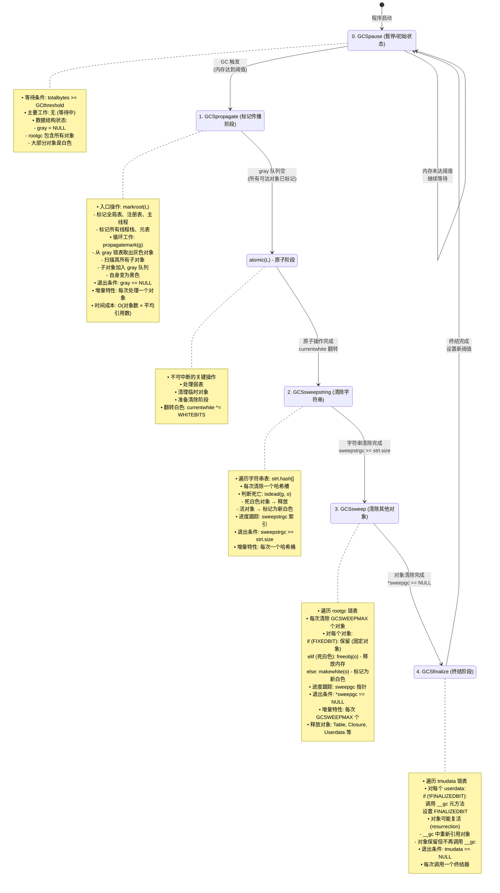

```c
/*
关键数据结构状态变化：

阶段 0 (Pause):
  gray = NULL, grayagain = NULL, weak = NULL
  所有对象: 白色（上轮的活白色）

阶段 1 (Propagate):
  gray != NULL（逐步减少）
  对象颜色：白色 → 灰色 → 黑色

原子阶段 (Atomic):
  currentwhite 翻转
  处理弱表、清理临时对象

阶段 2 (SweepString):
  字符串表逐桶扫描
  死字符串释放，活字符串变新白色

阶段 3 (Sweep):
  rootgc 链表逐段扫描
  死对象释放，活对象变新白色

阶段 4 (Finalize):
  tmudata 链表逐个处理
  调用 __gc，可能发生对象复活
*/

/* 当前 GC 状态（global_State）*/
struct global_State {
  /* ... */
  lu_byte gcstate;  /* GC 状态：0-4 */
  /* ... */
};

/*
═══════════════════════════════════════════════════════════
  增量 GC 的关键特性
═══════════════════════════════════════════════════════════
*/

```mermaid
graph TB
    subgraph interruptibility["可中断性"]
        A1[用户程序运行] --> B1{GCdebt > 0?}
        B1 -->|是| C1[执行一步 GC<br/>singlestep]
        B1 -->|否| A1
        C1 --> D1[GC 状态推进]
        D1 --> A1
    end
    
    subgraph progress_control["进度控制参数"]
        P1[GCdebt<br/>GC 债务]
        P2[GCSTEPSIZE<br/>每步工作量]
        P3[gcstepmul<br/>步进倍数]
        P1 -.计算.-> P4[需要执行的<br/>GC 工作量]
        P2 -.定义.-> P4
        P3 -.调整.-> P4
    end
    
    subgraph trigger_mechanism["触发机制"]
        T1[内存分配<br/>luaM_realloc_] --> T2[更新 GCdebt]
        T2 --> T3{GCdebt > 0?}
        T3 -->|是| T4[luaC_step<br/>执行增量 GC]
        T3 -->|否| T5[继续分配]
        T4 --> T6[GCdebt 减少]
        T6 --> T3
    end
    
    subgraph pause_control["暂停时间控制"]
        S1[标记阶段<br/>Propagate] --> S2[每次处理<br/>1 个对象]
        S3[清除阶段<br/>Sweep] --> S4[每次处理<br/>GCSWEEPMAX 个]
        S5[终结阶段<br/>Finalize] --> S6[每次调用<br/>1 个 __gc]
        
        S2 -.避免.-> S7[长时间暂停]
        S4 -.避免.-> S7
        S6 -.避免.-> S7
    end
    
    style A1 fill:#e1f5fe
    style C1 fill:#fff9c4
    style D1 fill:#c8e6c9
    style P1 fill:#ffccbc
    style P2 fill:#ffccbc
    style P3 fill:#ffccbc
    style P4 fill:#a5d6a7
    style T4 fill:#ce93d8
    style S7 fill:#ef9a9a
```

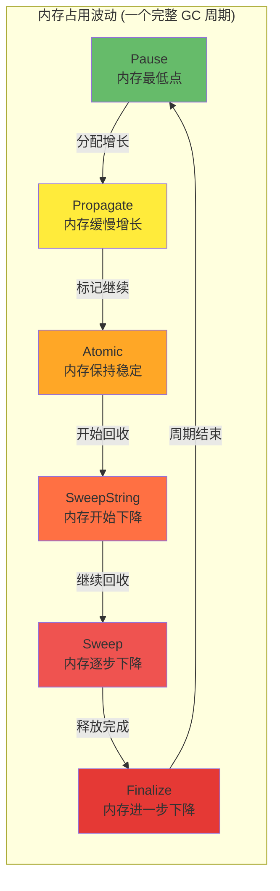

```c
/*
增量 GC 特性详解：

1. 可中断性：
   每个状态都可以暂停，下次继续
   用户程序在 GC 间隙继续运行

2. 进度控制：
   GCdebt：GC 债务（需要完成的工作量）
   GCSTEPSIZE：每步执行的工作量
   gcstepmul：步进倍数（可调参数）

3. 触发机制：
   • 内存分配时检查 GCdebt
   • 如果 GCdebt > 0，执行一步 GC
   • 直到 GCdebt <= 0

4. 暂停时间控制：
   • 标记阶段：每次处理 1 个对象
   • 清除阶段：每次处理 GCSWEEPMAX 个
   • 终结阶段：每次调用 1 个 __gc
   → 避免长时间暂停

5. 内存占用波动：
   Pause → Propagate：内存缓慢增长
   Propagate → Sweep：内存保持稳定
   Sweep → Finalize：内存逐步下降
   Finalize → Pause：内存最低点
*/
```

#### GC 步进函数（lgc.c）

```c
/* 单步执行 GC */
static l_mem singlestep(lua_State *L) {
  global_State *g = G(L);
  
  switch (g->gcstate) {
    case GCSpause: {
      /* 开始标记 */
      markroot(L);  /* 标记根对象 */
      g->gcstate = GCSpropagate;
      return GCSWEEPCOST;
    }
    
    case GCSpropagate: {
      /* 增量标记 */
      if (g->gray)
        return propagatemark(g);  /* 传播一个灰色对象 */
      else {
        /* 标记完成，准备清除 */
        atomic(L);  /* 原子操作 */
        g->gcstate = GCSsweepstring;
        return GCSWEEPCOST;
      }
    }
    
    case GCSsweepstring: {
      /* 清除字符串 */
      lu_mem old = g->totalbytes;
      sweepwholelist(L, &g->strt.hash[g->sweepstrgc++]);
      
      if (g->sweepstrgc >= g->strt.size) {
        /* 字符串清除完成 */
        g->sweepstrgc = 0;
        g->gcstate = GCSsweep;
      }
      
      lua_assert(old >= g->totalbytes);
      g->GCestimate -= old - g->totalbytes;
      return GCSWEEPCOST;
    }
    
    case GCSsweep: {
      /* 清除其他对象 */
      lu_mem old = g->totalbytes;
      g->sweepgc = sweeplist(L, g->sweepgc, GCSWEEPMAX);
      
      if (*g->sweepgc == NULL) {
        /* 清除完成 */
        checkSizes(L);
        g->gcstate = GCSfinalize;
      }
      
      lua_assert(old >= g->totalbytes);
      g->GCestimate -= old - g->totalbytes;
      return GCSWEEPMAX * GCSWEEPCOST;
    }
    
    case GCSfinalize: {
      /* 调用终结器 */
      if (g->tmudata) {
        GCTM(L);  /* 调用一个终结器 */
        
        if (g->estimate > GCFINALIZECOST)
          g->estimate -= GCFINALIZECOST;
        
        return GCFINALIZECOST;
      }
      else {
        /* 终结完成，回到暂停状态 */
        g->gcstate = GCSpause;
        g->GCdebt = 0;
        return 0;
      }
    }
    
    default:
      lua_assert(0);
      return 0;
  }
}

/* 增量 GC 执行 */
void luaC_step(lua_State *L) {
  global_State *g = G(L);
  l_mem lim = (GCSTEPSIZE/100) * g->gcstepmul;
  
  if (lim == 0)
    lim = (MAX_LUMEM - 1) / 2;  /* 无限制 */
  
  g->GCdebt += g->GCestimate / STEPMULADJ;
  
  do {
    l_mem olddebt = g->GCdebt;
    l_mem cost = singlestep(L);
    
    g->GCdebt -= cost - olddebt;
  } while (g->GCdebt > -lim && g->gcstate != GCSpause);
  
  if (g->gcstate == GCSpause)
    setthreshold(g);  /* 设置下次触发阈值 */
}
```

---

### 8.1 reallymarkobject 实现

#### 标记对象核心函数（lgc.c）

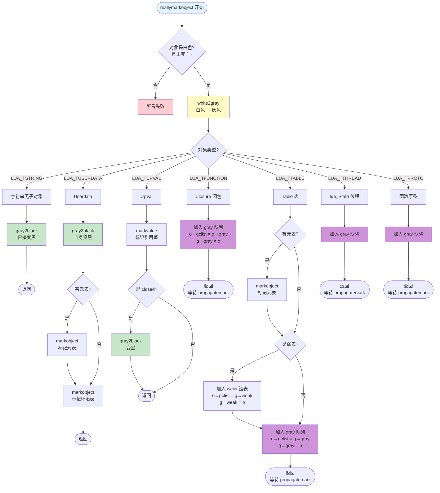

```c
/* 标记对象（宏定义）*/
#define markvalue(g,o) { checkconsistency(o); \
  if (iscollectable(o) && iswhite(gcvalue(o))) reallymarkobject(g,gcvalue(o)); }

#define markobject(g,t) { if (iswhite(obj2gco(t))) \
  reallymarkobject(g, obj2gco(t)); }

/* 实际标记函数 */
static void reallymarkobject(global_State *g, GCObject *o) {
  lua_assert(iswhite(o) && !isdead(g, o));
  
  white2gray(o);  /* 白色变灰色 */
  
  switch (o->gch.tt) {
    case LUA_TSTRING: {
      /* 字符串无子对象，直接变黑 */
      gray2black(o);
      break;
    }
    
    case LUA_TUSERDATA: {
      Table *mt = gco2u(o)->metatable;
      gray2black(o);  /* userdata 本身变黑 */
      
      if (mt)
        markobject(g, mt);  /* 标记元表 */
      
      markobject(g, gco2u(o)->env);  /* 标记环境表 */
      break;
    }
    
    case LUA_TUPVAL: {
      UpVal *uv = gco2uv(o);
      markvalue(g, uv->v);  /* 标记引用的值 */
      
      if (uv->v == &uv->u.value)  /* closed？*/
        gray2black(o);  /* 变黑 */
      break;
    }
    
    case LUA_TFUNCTION: {
      Closure *cl = gco2cl(o);
      
      /* 函数加入灰色队列（有子对象）*/
      o->gch.gclist = g->gray;
      g->gray = o;
      break;
    }
    
    case LUA_TTABLE: {
      Table *h = gco2h(o);
      
      /* 表加入灰色队列（有子对象）*/
      o->gch.gclist = g->gray;
      g->gray = o;
      
      /* 检查是否弱表 */
      if (h->metatable)
        markobject(g, h->metatable);
      
      /* 弱表特殊处理 */
      if (weakkey(h) || weakvalue(h)) {
        /* 加入弱表链表 */
        o->gch.gclist = g->weak;
        g->weak = o;
      }
      
      break;
    }
    
    case LUA_TTHREAD: {
      lua_State *th = gco2th(o);
      
      /* 线程加入灰色队列 */
      o->gch.gclist = g->gray;
      g->gray = o;
      
      break;
    }
    
    case LUA_TPROTO: {
      Proto *p = gco2p(o);
      
      /* 函数原型加入灰色队列 */
      o->gch.gclist = g->gray;
      g->gray = o;
      
      break;
    }
    
    default:
      lua_assert(0);
  }
}

/*
═══════════════════════════════════════════════════════════
  propagatemark - 传播标记算法
═══════════════════════════════════════════════════════════
*/

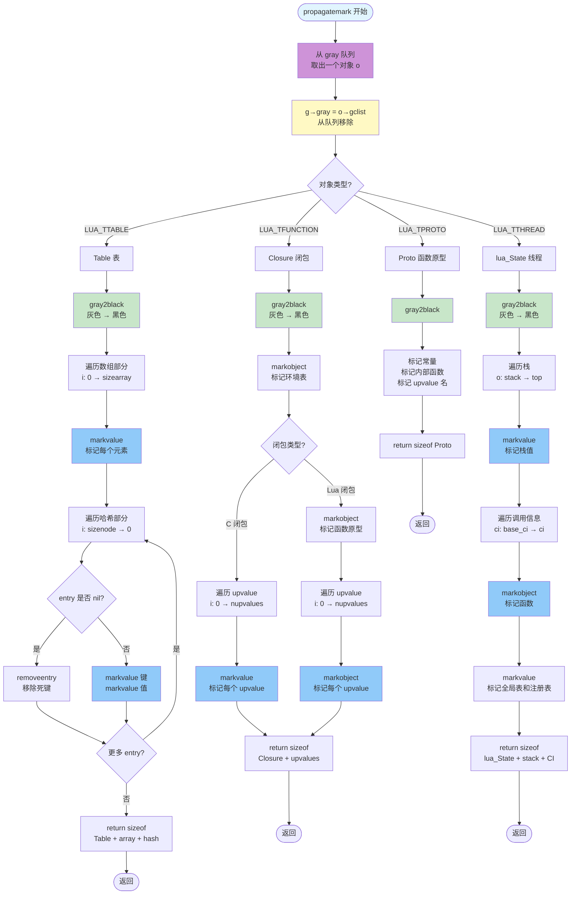

```c
/* 传播标记（处理一个灰色对象）*/
static l_mem propagatemark(global_State *g) {
  GCObject *o = g->gray;
  lua_assert(isgray(o));
  
  /* 从灰色队列移除 */
  g->gray = o->gch.gclist;
  
  switch (o->gch.tt) {
    case LUA_TTABLE: {
      Table *h = gco2h(o);
      gray2black(o);  /* 变黑 */
      
      /* 标记数组部分 */
      int i;
      for (i = 0; i < h->sizearray; i++)
        markvalue(g, &h->array[i]);
      
      /* 标记哈希部分 */
      i = sizenode(h);
      while (i--) {
        Node *n = gnode(h, i);
        lua_assert(ttype(gkey(n)) != LUA_TDEADKEY || ttisnil(gval(n)));
        
        if (ttisnil(gval(n)))
          removeentry(n);  /* 移除死键 */
        else {
          lua_assert(!ttisnil(gkey(n)));
          markvalue(g, gkey(n));  /* 标记键 */
          markvalue(g, gval(n));  /* 标记值 */
        }
      }
      
      return sizeof(Table) + sizeof(TValue) * h->sizearray +
             sizeof(Node) * sizenode(h);
    }
    
    case LUA_TFUNCTION: {
      Closure *cl = gco2cl(o);
      gray2black(o);
      
      markobject(g, cl->c.env);  /* 标记环境 */
      
      if (cl->c.isC) {
        /* C 闭包 */
        int i;
        for (i = 0; i < cl->c.nupvalues; i++)
          markvalue(g, &cl->c.upvalue[i]);
      }
      else {
        /* Lua 闭包 */
        int i;
        lua_assert(cl->l.nupvalues == cl->l.p->nups);
        
        markobject(g, cl->l.p);  /* 标记函数原型 */
        
        for (i = 0; i < cl->l.nupvalues; i++)
          markobject(g, cl->l.upvals[i]);  /* 标记 upvalue */
      }
      
      return sizeof(Closure) + sizeof(TValue) * (cl->c.nupvalues - 1);
    }
    
    case LUA_TTHREAD: {
      lua_State *th = gco2th(o);
      gray2black(o);
      
      /* 标记栈 */
      StkId o;
      for (o = th->stack; o < th->top; o++)
        markvalue(g, o);
      
      /* 标记调用信息 */
      CallInfo *ci;
      for (ci = th->base_ci; ci <= th->ci; ci++) {
        lua_assert(ci->top <= th->stack_last);
        if (ci->savedpc) {
          markobject(g, ci_func(ci)->value.gc);
        }
      }
      
      /* 标记全局表和注册表 */
      markvalue(g, gt(th));
      markvalue(g, registry(th));
      
      return sizeof(lua_State) + sizeof(TValue) * th->stacksize +
             sizeof(CallInfo) * th->size_ci;
    }
    
    /* ... 其他类型 ... */
  }
  
  return 0;
}
```

---

### 9.1 sweeplist 算法

#### 清除链表（lgc.c）

```mermaid
flowchart TD
    Start([sweeplist 开始<br/>参数: p 指针, count 数量]) --> Init[计算 deadmask<br/>otherwhite = 死白色]
    Init --> Loop{curr = *p<br/>且 count > 0?}
    
    Loop -->|否| ReturnP[return p<br/>返回当前位置]
    ReturnP --> End([结束])
    
    Loop -->|是| DecCount[count--<br/>处理计数减1]
    DecCount --> CheckThread{对象是<br/>LUA_TTHREAD?}
    
    CheckThread -->|是| SweepUpval[sweepwholelist<br/>清除 openupval]
    CheckThread -->|否| CheckAlive
    SweepUpval --> CheckAlive
    
    CheckAlive{检查对象标记<br/>marked & deadmask}
    
    CheckAlive -->|对象存活| Alive[对象存活路径]
    Alive --> AssertFixed{断言: 未死亡<br/>或是 FIXEDBIT?}
    AssertFixed --> MakeWhite[makewhite<br/>标记为新白色]
    MakeWhite --> MoveNext[p = &curr→next<br/>移动到下一个]
    MoveNext --> Loop
    
    CheckAlive -->|对象死亡| Dead[对象死亡路径]
    Dead --> AssertDead{断言: 已死亡<br/>或 SFIXEDBIT?}
    AssertDead --> Unlink[*p = curr→next<br/>从链表移除]
    Unlink --> CheckFinal{对象有<br/>FINALIZEDBIT?}
    
    CheckFinal -->|否| FreeObj[freeobj<br/>释放内存]
    CheckFinal -->|是| SkipFree[跳过释放<br/>对象已终结]
    
    FreeObj --> UpdateMem[g→totalbytes<br/>减少内存统计]
    SkipFree --> UpdateMem
    UpdateMem --> Loop
    
    style Start fill:#e1f5fe
    style Init fill:#fff9c4
    style Alive fill:#c8e6c9
    style Dead fill:#ffcdd2
    style MakeWhite fill:#a5d6a7
    style FreeObj fill:#ef5350
    style UpdateMem fill:#90caf9
    style ReturnP fill:#ce93d8
```

```mermaid
graph TB
    subgraph "sweeplist 核心逻辑"
        A[遍历链表<br/>最多 count 个对象]
        B[对每个对象]
        C{是否存活?}
        D[存活: makewhite<br/>标记为新白色<br/>保留在链表]
        E[死亡: 从链表移除<br/>freeobj 释放内存]
        
        A --> B
        B --> C
        C -->|marked 不匹配<br/>deadmask| D
        C -->|marked 匹配<br/>deadmask| E
    end
    
    subgraph "关键概念"
        F[deadmask<br/>= otherwhite]
        G[存活判断<br/>marked & deadmask]
        H[makewhite<br/>翻转白色位]
        I[freeobj<br/>按类型释放]
        
        F -.用于.-> G
        G -.决定.-> D
        G -.决定.-> E
        D -.调用.-> H
        E -.调用.-> I
    end
    
    style A fill:#e1f5fe
    style C fill:#fff9c4
    style D fill:#c8e6c9
    style E fill:#ffcdd2
    style F fill:#ce93d8
    style G fill:#90caf9
    style H fill:#a5d6a7
    style I fill:#ef5350
```

```c
/* 清除对象链表 */
static GCObject **sweeplist(lua_State *L, GCObject **p, lu_mem count) {
  GCObject *curr;
  global_State *g = G(L);
  int deadmask = otherwhite(g);  /* 当前周期的死白色 */
  
  while ((curr = *p) != NULL && count-- > 0) {
    if (curr->gch.tt == LUA_TTHREAD)
      sweepwholelist(L, &gco2th(curr)->openupval);  /* 清除 upvalue */
    
    if ((curr->gch.marked ^ WHITEBITS) & deadmask) {
      /* 对象存活 */
      lua_assert(!isdead(g, curr) || testbit(curr->gch.marked, FIXEDBIT));
      makewhite(g, curr);  /* 标记为新白色 */
      p = &curr->gch.next;
    }
    else {
      /* 对象死亡 */
      lua_assert(isdead(g, curr) || deadmask == bitmask(SFIXEDBIT));
      
      *p = curr->gch.next;  /* 从链表移除 */
      
      if (curr == g->rootgc)
        g->rootgc = curr->gch.next;  /* 调整根指针 */
      
      freeobj(L, curr);  /* 释放对象 */
    }
  }
  
  return p;
}

/* 释放单个对象 */
static void freeobj(lua_State *L, GCObject *o) {
  switch (o->gch.tt) {
    case LUA_TPROTO:
      luaF_freeproto(L, gco2p(o));
      break;
    
    case LUA_TFUNCTION:
      luaF_freeclosure(L, gco2cl(o));
      break;
    
    case LUA_TUPVAL:
      luaF_freeupval(L, gco2uv(o));
      break;
    
    case LUA_TTABLE:
      luaH_free(L, gco2h(o));
      break;
    
    case LUA_TTHREAD:
      lua_assert(gco2th(o) != L && gco2th(o) != G(L)->mainthread);
      luaE_freethread(L, gco2th(o));
      break;
    
    case LUA_TSTRING: {
      G(L)->strt.nuse--;
      luaM_freemem(L, o, sizestring(gco2ts(o)));
      break;
    }
    
    case LUA_TUSERDATA: {
      luaM_freemem(L, o, sizeudata(gco2u(o)));
      break;
    }
    
    default:
      lua_assert(0);
  }
}

/* 清除整个链表 */
static void sweepwholelist(lua_State *L, GCObject **p) {
  sweeplist(L, p, MAX_LUMEM);
}
```

#### 清除字符串表

```c
/* 字符串表清除（lstring.c）*/
void luaS_resize(lua_State *L, int newsize) {
  GCObject **newhash;
  stringtable *tb;
  int i;
  
  if (G(L)->gcstate == GCSsweepstring)
    return;  /* 不在清除时调整大小 */
  
  newhash = luaM_newvector(L, newsize, GCObject *);
  tb = &G(L)->strt;
  
  /* 初始化新哈希表 */
  for (i = 0; i < newsize; i++)
    newhash[i] = NULL;
  
  /* 重新哈希所有字符串 */
  for (i = 0; i < tb->size; i++) {
    GCObject *p = tb->hash[i];
    
    while (p) {
      GCObject *next = p->gch.next;
      
      /* 计算新位置 */
      unsigned int h = gco2ts(p)->hash;
      int h1 = lmod(h, newsize);
      
      lua_assert(cast_int(h%newsize) == lmod(h, newsize));
      
      /* 插入新位置 */
      p->gch.next = newhash[h1];
      newhash[h1] = p;
      
      p = next;
    }
  }
  
  /* 释放旧表 */
  luaM_freearray(L, tb->hash, tb->size, TString *);
  
  /* 更新字符串表 */
  tb->size = newsize;
  tb->hash = newhash;
}

/* GC 清除字符串表（lgc.c）*/
static void checkSizes(lua_State *L) {
  global_State *g = G(L);
  
  /* 如果字符串表过大，缩小 */
  if (g->strt.nuse < cast(lu_int32, g->strt.size / 4) &&
      g->strt.size > MINSTRTABSIZE * 2)
    luaS_resize(L, g->strt.size / 2);  /* 缩小一半 */
}
```

---

## 字符串内化深入

### 11.1 字符串内化详解

#### 完整内化流程（lstring.c）

```mermaid
flowchart TD
    Start([luaS_newlstr 开始<br/>参数: str, len]) --> InitHash[初始化哈希<br/>h = len<br/>step = len右移5位 + 1]
    
    InitHash --> CalcHash[计算哈希值<br/>采样算法]
    CalcHash --> HashLoop{l1 >= step?}
    HashLoop -->|是| HashCalc["h = h XOR h左移5<br/>+ h右移2 + 字符"]
    HashCalc --> HashNext[l1 -= step]
    HashNext --> HashLoop
    HashLoop -->|否| Lookup[在字符串表中查找<br/>slot = lmod 哈希值, 表大小]
    
    Lookup --> LookupLoop{遍历链表<br/>o = hash开始}
    LookupLoop -->|o == NULL| NotFound[未找到]
    LookupLoop -->|o != NULL| Compare{len 相等?<br/>memcmp 相等?}
    
    Compare -->|否| LookupNext[o = o→next]
    LookupNext --> LookupLoop
    
    Compare -->|是| Found{对象状态?}
    Found -->|已死亡| Resurrect[changewhite<br/>复活对象]
    Found -->|存活| ReturnExist[return ts<br/>返回已有字符串]
    Resurrect --> ReturnExist
    ReturnExist --> End1([结束])
    
    NotFound --> CheckResize1{需要扩容?<br/>nuse >= size<br/>且 size 小于等于 MAX除以2}
    CheckResize1 -->|是| Resize1[luaS_resize<br/>扩容至 size乘以2]
    CheckResize1 -->|否| Alloc
    Resize1 --> Alloc
    
    Alloc[分配内存<br/>luaM_malloc<br/>大小 = 结构体 + len + 1]
    Alloc --> InitTS[初始化 TString<br/>len, hash, marked<br/>tt, reserved]
    InitTS --> CopyStr[memcpy 复制字符串<br/>添加结尾字符0]
    CopyStr --> Insert[插入字符串表<br/>头插法<br/>ts→next = hash<br/>hash = ts]
    Insert --> IncUse[nuse++<br/>使用计数增加]
    
    IncUse --> CheckResize2{需要扩容?<br/>nuse > size<br/>且 size 小于等于 MAX除以2}
    CheckResize2 -->|是| Resize2[luaS_resize<br/>扩容至 size乘以2]
    CheckResize2 -->|否| ReturnNew[return ts<br/>返回新字符串]
    Resize2 --> ReturnNew
    ReturnNew --> End2([结束])
    
    style Start fill:#e1f5fe
    style CalcHash fill:#fff9c4
    style Found fill:#c8e6c9
    style NotFound fill:#ffcdd2
    style Resurrect fill:#ce93d8
    style Alloc fill:#90caf9
    style Insert fill:#a5d6a7
    style Resize1 fill:#ffab91
    style Resize2 fill:#ffab91
```

```mermaid
graph TB
    subgraph "字符串内化优缺点对比"
        Adv["优点"]
        Dis["缺点"]
    end
    
    subgraph "优点详细"
        A1[相等比较 O1<br/>指针比较]
        A2[节省内存<br/>相同字符串只存一份]
        A3[方便 GC 管理<br/>统一在字符串表]
    end
    
    subgraph "缺点详细"
        D1[创建开销大<br/>需要哈希和查找]
        D2[长字符串哈希耗时<br/>需要遍历计算]
        D3[字符串表占用<br/>额外内存]
    end
    
    subgraph "优化策略"
        O1[采样哈希<br/>长字符串不全部哈希<br/>step = len>>5 + 1]
        O2[动态调整表大小<br/>nuse >= size → 扩容<br/>nuse < size/4 → 缩容]
        O3[高效哈希函数<br/>h ^ h<<5 + h>>2 + c]
    end
    
    Adv --> A1
    Adv --> A2
    Adv --> A3
    
    Dis --> D1
    Dis --> D2
    Dis --> D3
    
    D1 -.优化.-> O1
    D2 -.优化.-> O1
    D3 -.优化.-> O2
    D1 -.优化.-> O3
    
    style Adv fill:#c8e6c9
    style Dis fill:#ffcdd2
    style A1 fill:#a5d6a7
    style A2 fill:#a5d6a7
    style A3 fill:#a5d6a7
    style D1 fill:#ef9a9a
    style D2 fill:#ef9a9a
    style D3 fill:#ef9a9a
    style O1 fill:#90caf9
    style O2 fill:#64b5f6
    style O3 fill:#42a5f5
```

```c
/* 创建新的长字符串（带内化）*/
TString *luaS_newlstr(lua_State *L, const char *str, size_t l) {
  GCObject *o;
  unsigned int h = cast(unsigned int, l);  /* 种子 */
  size_t step = (l >> 5) + 1;  /* 采样步长 */
  size_t l1;
  
  /* 计算哈希值（采样算法）*/
  for (l1 = l; l1 >= step; l1 -= step)
    h = h ^ ((h << 5) + (h >> 2) + cast(unsigned char, str[l1 - 1]));
  
  /* 在字符串表中查找 */
  for (o = G(L)->strt.hash[lmod(h, G(L)->strt.size)];
       o != NULL;
       o = o->gch.next) {
    TString *ts = rawgco2ts(o);
    
    if (ts->tsv.len == l && (memcmp(str, getstr(ts), l) == 0)) {
      /* 找到，检查是否死亡 */
      if (isdead(G(L), o))
        changewhite(o);  /* 复活 */
      
      return ts;
    }
  }
  
  /* 未找到，创建新字符串 */
  
  /* 检查是否需要扩容 */
  if (G(L)->strt.nuse >= cast(lu_int32, G(L)->strt.size) && 
      G(L)->strt.size <= MAX_INT / 2)
    luaS_resize(L, G(L)->strt.size * 2);  /* 扩容 */
  
  /* 分配字符串 */
  TString *ts = cast(TString *, luaM_malloc(L, sizestring(l)));
  
  /* 初始化 */
  ts->tsv.len = l;
  ts->tsv.hash = h;
  ts->tsv.marked = luaC_white(G(L));
  ts->tsv.tt = LUA_TSTRING;
  ts->tsv.reserved = 0;
  
  /* 复制字符串内容 */
  memcpy(ts + 1, str, l * sizeof(char));
  ((char *)(ts + 1))[l] = '\0';  /* 结尾添加 \0 */
  
  /* 插入字符串表 */
  h = lmod(h, G(L)->strt.size);
  ts->tsv.next = G(L)->strt.hash[h];  /* 链表头插入 */
  G(L)->strt.hash[h] = obj2gco(ts);
  
  G(L)->strt.nuse++;
  
  /* 检查是否需要 GC */
  if (G(L)->strt.nuse > cast(lu_int32, G(L)->strt.size) &&
      G(L)->strt.size <= MAX_INT / 2)
    luaS_resize(L, G(L)->strt.size * 2);  /* 再次扩容 */
  
  return ts;
}

/*
字符串内化优缺点：

优点：
1. 字符串相等比较 O(1)（指针比较）
2. 节省内存（相同字符串只存一份）
3. 方便 GC 管理

缺点：
1. 创建开销大（需要哈希和查找）
2. 长字符串哈希耗时
3. 字符串表占用额外内存

优化策略：
1. 采样哈希（长字符串不全部哈希）
2. 动态调整表大小
3. 使用高效哈希函数
*/
```

#### 字符串内化可视化

```lua
-- 字符串内化演示
function demonstrate_string_interning()
    print("=== 字符串内化演示 ===\n")
    
    -- 创建相同字符串
    local s1 = "hello world"
    local s2 = "hello world"
    local s3 = "hello" .. " " .. "world"
    
    -- 检查是否同一对象（指针比较）
    print(string.format("s1 == s2: %s (rawequal: %s)", 
          tostring(s1 == s2), tostring(rawequal(s1, s2))))
    print(string.format("s1 == s3: %s (rawequal: %s)", 
          tostring(s1 == s3), tostring(rawequal(s1, s3))))
    
    -- 打印地址（通过 tostring）
    print(string.format("\ns1: %s", tostring(s1:gsub(".", ""))))
    print(string.format("s2: %s", tostring(s2:gsub(".", ""))))
    print(string.format("s3: %s", tostring(s3:gsub(".", ""))))
    
    -- 字符串表统计
    local count = 0
    for k, v in pairs(_G) do
        if type(k) == "string" then
            count = count + 1
        end
    end
    
    print(string.format("\n全局表中字符串键数量: %d", count))
    
    -- 测试不同长度字符串
    local short = "abc"
    local long = string.rep("x", 1000)
    
    print(string.format("\n短字符串长度: %d", #short))
    print(string.format("长字符串长度: %d", #long))
    
    -- 内存使用
    collectgarbage("collect")
    local mem1 = collectgarbage("count")
    
    local strings = {}
    for i = 1, 10000 do
        strings[i] = "string_" .. i  -- 创建 10000 个不同字符串
    end
    
    local mem2 = collectgarbage("count")
    
    print(string.format("\n创建 10000 个字符串前: %.2f KB", mem1))
    print(string.format("创建 10000 个字符串后: %.2f KB", mem2))
    print(string.format("增加: %.2f KB (平均 %.2f bytes/string)", 
          mem2 - mem1, (mem2 - mem1) * 1024 / 10000))
end

demonstrate_string_interning()

--[[
输出示例：

=== 字符串内化演示 ===

s1 == s2: true (rawequal: true)
s1 == s3: true (rawequal: true)

s1: string: 0x7f8a9c0041a0
s2: string: 0x7f8a9c0041a0
s3: string: 0x7f8a9c0041a0

全局表中字符串键数量: 245

短字符串长度: 3
长字符串长度: 1000

创建 10000 个字符串前: 152.34 KB
创建 10000 个字符串后: 1523.67 KB
增加: 1371.33 KB (平均 144.27 bytes/string)

观察：
1. 相同字符串指向同一对象（地址相同）
2. 拼接产生的字符串也被内化
3. 每个字符串占用约 144 字节（包含开销）
]]
```

---

## Table 实现细节

### 12.1 Table 结构完整解析

#### Table 内存布局

```c
/* Table 完整结构（lobject.h）*/
typedef struct Table {
  CommonHeader;              /* GC 头部：next(8), tt(1), marked(1) = 10 字节 */
  lu_byte flags;             /* 元方法标志（缓存） = 1 字节 */
  lu_byte lsizenode;         /* log2(哈希部分大小) = 1 字节 */
  struct Table *metatable;   /* 元表指针 = 8 字节 */
  TValue *array;             /* 数组部分指针 = 8 字节 */
  Node *node;                /* 哈希部分指针 = 8 字节 */
  Node *lastfree;            /* 最后空闲节点 = 8 字节 */
  GCObject *gclist;          /* GC 链表 = 8 字节 */
  int sizearray;             /* 数组部分大小 = 4 字节 */
} Table;
/* 总大小：56 字节（64 位系统）*/

/* 哈希节点结构 */
typedef union TKey {
  struct {
    TValuefields;
    struct Node *next;  /* 碰撞链表 */
  } nk;
  TValue tvk;
} TKey;

typedef struct Node {
  TValue i_val;    /* 值 */
  TKey i_key;      /* 键 */
} Node;

/*
Node 内存布局（64 位）：

+0    +8    +16   +24   +32
+-----+-----+-----+-----+-----+
| i_val (TValue 16 bytes)     |
+-----------------------------+
| i_key.tvk (TValue 16 bytes) |
+-----------------------------+
| i_key.nk.next (8 bytes)     |
+-----------------------------+
总大小：40 字节
*/
```

#### Table 创建和调整

```c
/* 创建新表（ltable.c）*/
Table *luaH_new(lua_State *L, int narray, int nhash) {
  Table *t = luaM_new(L, Table);
  
  /* 初始化 GC 头部 */
  luaC_link(L, obj2gco(t), LUA_TTABLE);
  
  /* 初始化字段 */
  t->metatable = NULL;
  t->flags = cast_byte(~0);  /* 所有元方法都未缓存 */
  t->array = NULL;
  t->sizearray = 0;
  t->lsizenode = 0;
  t->node = cast(Node *, dummynode);
  
  /* 分配数组部分 */
  setarrayvector(L, t, narray);
  
  /* 分配哈希部分 */
  setnodevector(L, t, nhash);
  
  return t;
}

/* 设置数组部分 */
static void setarrayvector(lua_State *L, Table *t, int size) {
  int i;
  
  /* 重新分配数组 */
  luaM_reallocvector(L, t->array, t->sizearray, size, TValue);
  
  /* 初始化新元素为 nil */
  for (i = t->sizearray; i < size; i++)
    setnilvalue(&t->array[i]);
  
  t->sizearray = size;
}

/* 设置哈希部分 */
static void setnodevector(lua_State *L, Table *t, int size) {
  int lsize;
  
  if (size == 0) {
    /* 使用虚拟节点 */
    t->node = cast(Node *, dummynode);
    lsize = 0;
  }
  else {
    int i;
    
    /* 计算 log2(size) */
    lsize = luaO_ceillog2(size);
    if (lsize > MAXBITS)
      luaG_runerror(L, "table overflow");
    
    size = twoto(lsize);  /* 2^lsize */
    
    /* 分配节点数组 */
    t->node = luaM_newvector(L, size, Node);
    
    /* 初始化所有节点 */
    for (i = 0; i < size; i++) {
      Node *n = gnode(t, i);
      gnext(n) = NULL;        /* 无碰撞链 */
      setnilvalue(gkey(n));   /* 键为 nil */
      setnilvalue(gval(n));   /* 值为 nil */
    }
  }
  
  t->lsizenode = cast_byte(lsize);
  t->lastfree = gnode(t, size);  /* 所有位置都空闲 */
}

/*
═══════════════════════════════════════════════════════════
  Table rehash - 重新哈希算法
═══════════════════════════════════════════════════════════
*/

```mermaid
flowchart TD
    Start([rehash 开始<br/>参数: Table t, key ek]) --> InitNums[初始化统计数组<br/>nums: 每个2^i范围的数量]
    
    InitNums --> CountArray[统计数组部分<br/>numusearray]
    CountArray --> CountLoop1{遍历 array<br/>i: 0 → sizearray}
    CountLoop1 -->|有元素| Count1[nums 对应范围++]
    Count1 --> CountLoop1
    CountLoop1 -->|结束| CountHash[统计哈希部分<br/>numusehash]
    
    CountHash --> CountLoop2{遍历 hash<br/>所有 Node}
    CountLoop2 -->|整数键| Count2[nums 对应范围++]
    Count2 --> CountLoop2
    CountLoop2 -->|结束| CountNew{新键是整数?}
    
    CountNew -->|是| AddNew[nums 对应范围++<br/>totaluse++]
    CountNew -->|否| CalcSize
    AddNew --> CalcSize
    
    CalcSize[计算新数组大小<br/>computesizes<br/>至少 50% 使用率]
    CalcSize --> Resize[调整表大小<br/>resize<br/>nasize: 新数组大小<br/>nhsize: 新哈希大小]
    Resize --> End([结束])
    
    style Start fill:#e1f5fe
    style InitNums fill:#fff9c4
    style CountArray fill:#90caf9
    style CountHash fill:#64b5f6
    style CalcSize fill:#ce93d8
    style Resize fill:#a5d6a7
```

```mermaid
flowchart TD
    RStart([resize 开始<br/>参数: nasize, nhsize]) --> SaveOld[保存旧表信息<br/>oldasize, oldhsize<br/>nold]
    
    SaveOld --> ResizeArray{需要扩容<br/>数组?}
    ResizeArray -->|nasize > oldasize| ExpandArray[setarrayvector<br/>扩展数组部分]
    ResizeArray -->|否| CreateHash
    ExpandArray --> CreateHash
    
    CreateHash[创建新哈希表<br/>setnodevector<br/>nhsize]
    CreateHash --> ShrinkCheck{数组缩小?<br/>nasize < oldasize}
    
    ShrinkCheck -->|是| MoveToHash[移动超出部分<br/>到哈希表]
    ShrinkCheck -->|否| Rehash
    MoveToHash --> ReallocArray[重新分配数组<br/>oldasize → nasize]
    ReallocArray --> Rehash
    
    Rehash[重新插入哈希元素<br/>遍历旧哈希表]
    Rehash --> RehashLoop{i: oldhsize → 0}
    RehashLoop -->|有元素| ReInsert[luaH_set<br/>重新计算位置<br/>插入新哈希表]
    ReInsert --> RehashLoop
    RehashLoop -->|结束| FreeOld{旧表不是<br/>dummynode?}
    
    FreeOld -->|是| Free[luaM_freearray<br/>释放旧哈希表]
    FreeOld -->|否| REnd
    Free --> REnd([结束])
    
    style RStart fill:#e1f5fe
    style SaveOld fill:#fff9c4
    style CreateHash fill:#90caf9
    style MoveToHash fill:#ce93d8
    style Rehash fill:#ffab91
    style ReInsert fill:#a5d6a7
    style Free fill:#ffcdd2
```

```mermaid
graph TB
    subgraph "rehash 触发条件"
        T1[插入新键时<br/>没有空闲位置]
        T2[表使用率过高]
        T3[手动调用<br/>table.resize]
    end
    
    subgraph "rehash 核心步骤"
        S1["1. 统计使用情况<br/>数组部分 + 哈希部分"]
        S2["2. 计算新大小<br/>保证至少 50% 使用率"]
        S3["3. 分配新空间<br/>数组 + 哈希表"]
        S4["4. 重新插入元素<br/>根据新大小重新计算位置"]
        S5["5. 释放旧空间"]
        
        S1 --> S2 --> S3 --> S4 --> S5
    end
    
    subgraph "性能考虑"
        P1[时间复杂度: On<br/>遍历所有元素]
        P2[空间开销: 2×原大小<br/>旧表 + 新表]
        P3[优化: 预分配<br/>table.new]
    end
    
    T1 -.触发.-> S1
    T2 -.触发.-> S1
    T3 -.触发.-> S1
    
    S5 -.影响.-> P1
    S3 -.影响.-> P2
    P2 -.解决.-> P3
    
    style T1 fill:#ffcdd2
    style T2 fill:#ffcdd2
    style T3 fill:#ffcdd2
    style S1 fill:#e1f5fe
    style S2 fill:#90caf9
    style S3 fill:#64b5f6
    style S4 fill:#42a5f5
    style S5 fill:#1e88e5
    style P1 fill:#fff9c4
    style P2 fill:#fff59d
    style P3 fill:#c8e6c9
```

```c
/* Table 重新哈希（rehash）*/
static void rehash(lua_State *L, Table *t, const TValue *ek) {
  int nasize, na;
  int nums[MAXBITS + 1];  /* 每个 2^i 范围的数量 */
  int i;
  int totaluse;
  
  /* 统计数组部分的使用情况 */
  for (i = 0; i <= MAXBITS; i++)
    nums[i] = 0;
  
  nasize = numusearray(t, nums);  /* 数组部分使用的元素数 */
  totaluse = nasize;
  
  /* 统计哈希部分的整数键 */
  totaluse += numusehash(t, nums, &nasize);
  
  /* 加上新键（如果是整数）*/
  nasize += countint(ek, nums);
  totaluse++;
  
  /* 计算新的数组大小（至少 50% 使用率）*/
  na = computesizes(nums, &nasize);
  
  /* 重新调整表大小 */
  resize(L, t, nasize, totaluse - na);
}

/* 调整表大小 */
static void resize(lua_State *L, Table *t, int nasize, int nhsize) {
  int i;
  int oldasize = t->sizearray;
  int oldhsize = t->lsizenode;
  Node *nold = t->node;
  
  /* 调整数组部分 */
  if (nasize > oldasize)
    setarrayvector(L, t, nasize);
  
  /* 创建新哈希部分 */
  setnodevector(L, t, nhsize);
  
  /* 如果数组缩小，移动元素到哈希部分 */
  if (nasize < oldasize) {
    t->sizearray = nasize;
    
    for (i = nasize; i < oldasize; i++) {
      if (!ttisnil(&t->array[i]))
        setivalue(luaH_setnum(L, t, i + 1), i + 1);
    }
    
    luaM_reallocvector(L, t->array, oldasize, nasize, TValue);
  }
  
  /* 重新插入哈希部分的元素 */
  for (i = twoto(oldhsize) - 1; i >= 0; i--) {
    Node *old = nold + i;
    
    if (!ttisnil(gval(old)))
      setobjt2t(L, luaH_set(L, t, key2tval(old)), gval(old));
  }
  
  /* 释放旧哈希表 */
  if (nold != dummynode)
    luaM_freearray(L, nold, twoto(oldhsize), Node);
}
```

#### Table 插入和查找

```mermaid
flowchart TD
    Start([luaH_set 开始<br/>参数: Table t, key]) --> Get[调用 luaH_get<br/>查找键]
    Get --> Found{键存在?}
    
    Found -->|是| ClearFlag[清除元方法缓存<br/>t→flags = 0]
    ClearFlag --> ReturnP[return 值指针<br/>可直接修改]
    ReturnP --> End1([结束])
    
    Found -->|否| CheckNil{键是 nil?}
    CheckNil -->|是| ErrorNil[报错: index is nil]
    CheckNil -->|否| CheckNaN{键是 NaN?}
    CheckNaN -->|是| ErrorNaN[报错: index is NaN]
    CheckNaN -->|否| NewKey[调用 newkey<br/>插入新键]
    
    NewKey --> MainPos[计算主位置<br/>mp = mainposition]
    MainPos --> CheckMP{主位置空?}
    
    CheckMP -->|是| InsertMP[直接插入主位置<br/>setkey + setobj]
    InsertMP --> ReturnMP[return &mp→val]
    ReturnMP --> End2([结束])
    
    CheckMP -->|否| GetFree[获取空闲位置<br/>n = getfreepos]
    GetFree --> HasFree{有空闲位置?}
    
    HasFree -->|否| Rehash[调用 rehash<br/>重新哈希]
    Rehash --> Retry[递归调用<br/>luaH_set]
    Retry --> End3([结束])
    
    HasFree -->|是| CheckOther[检查主位置冲突<br/>othern = mainposition mp]
    CheckOther --> IsOther{othern == mp?}
    
    IsOther -->|是| Chain1[当前键占用主位置<br/>mp 的链接指向 n]
    Chain1 --> InsertN1[在 n 插入当前键]
    InsertN1 --> ReturnN1[return &n→val]
    ReturnN1 --> End4([结束])
    
    IsOther -->|否| Chain2[mp 被其他键占用<br/>找到链尾<br/>重新链接]
    Chain2 --> MoveMP[将 mp 内容移到 n]
    MoveMP --> InsertMP2[在 mp 插入当前键]
    InsertMP2 --> ReturnMP2[return &mp→val]
    ReturnMP2 --> End5([结束])
    
    style Start fill:#e1f5fe
    style Get fill:#90caf9
    style NewKey fill:#fff9c4
    style MainPos fill:#ce93d8
    style Rehash fill:#ffab91
    style InsertMP fill:#c8e6c9
    style InsertN1 fill:#a5d6a7
    style InsertMP2 fill:#81c784
    style ErrorNil fill:#ffcdd2
    style ErrorNaN fill:#ef9a9a
```

```mermaid
graph TB
    subgraph "Table 查找策略"
        L1[整数键 且<br/>在数组范围内]
        L2[其他键<br/>哈希表查找]
    end
    
    subgraph "数组查找"
        A1["1. 检查 1 <= key <= sizearray"]
        A2["2. 直接访问 array"]
        A3["3. O1 时间复杂度"]
        A1 --> A2 --> A3
    end
    
    subgraph "哈希查找"
        H1["1. 计算 hash = mainposition"]
        H2["2. 比较键<br/>相等 → 返回"]
        H3["3. 不等 → 跟随 next 链"]
        H4["4. 平均 O1, 最坏 On"]
        H1 --> H2 --> H3 --> H4
    end
    
    subgraph "冲突解决"
        C1[开放寻址法<br/>Open Addressing]
        C2[链接法<br/>Chaining]
        C3[Lua 使用混合策略<br/>主位置 + 链接]
    end
    
    L1 --> A1
    L2 --> H1
    H3 -.解决冲突.-> C3
    
    style L1 fill:#c8e6c9
    style L2 fill:#90caf9
    style A1 fill:#a5d6a7
    style A2 fill:#81c784
    style A3 fill:#66bb6a
    style H1 fill:#64b5f6
    style H2 fill:#42a5f5
    style H3 fill:#1e88e5
    style H4 fill:#1976d2
    style C3 fill:#ce93d8
```

```c
/* 插入键值对（ltable.c）*/
TValue *luaH_set(lua_State *L, Table *t, const TValue *key) {
  const TValue *p = luaH_get(t, key);
  
  t->flags = 0;  /* 清除元方法缓存 */
  
  if (p != luaO_nilobject)
    return cast(TValue *, p);  /* 键已存在 */
  else {
    /* 新键，需要插入 */
    if (ttisnil(key))
      luaG_runerror(L, "table index is nil");
    else if (ttisnumber(key) && luai_numisnan(nvalue(key)))
      luaG_runerror(L, "table index is NaN");
    
    return newkey(L, t, key);
  }
}

/* 插入新键 */
static TValue *newkey(lua_State *L, Table *t, const TValue *key) {
  Node *mp = mainposition(t, key);  /* 主位置 */
  
  if (!ttisnil(gval(mp)) || mp == dummynode) {
    /* 主位置已占用或表为空 */
    Node *othern;
    Node *n = getfreepos(t);  /* 获取空闲位置 */
    
    if (n == NULL) {
      /* 没有空闲位置，需要 rehash */
      rehash(L, t, key);
      return luaH_set(L, t, key);  /* 重新插入 */
    }
    
    lua_assert(n != dummynode);
    
    othern = mainposition(t, key2tval(mp));
    
    if (othern != mp) {
      /* 碰撞链不在主位置 */
      Node *mf;
      while ((mf = gnext(othern)) != mp)
        othern = mf;  /* 找到指向 mp 的节点 */
      
      gnext(othern) = n;  /* 重定向链表 */
      *n = *mp;           /* 复制节点 */
      gnext(mp) = NULL;   /* mp 变为链头 */
      setnilvalue(gval(mp));
    }
    else {
      /* 碰撞链在主位置 */
      gnext(n) = gnext(mp);  /* 插入链表 */
      gnext(mp) = n;
      mp = n;
    }
  }
  
  /* 在 mp 位置设置新键 */
  gkey(mp)->value = key->value;
  gkey(mp)->tt = key->tt;
  
  luaC_barriert(L, t, key);
  lua_assert(ttisnil(gval(mp)));
  
  return gval(mp);
}

/* 查找键 */
const TValue *luaH_get(Table *t, const TValue *key) {
  switch (ttype(key)) {
    case LUA_TNIL:
      return luaO_nilobject;
    
    case LUA_TSTRING:
      return luaH_getstr(t, rawtsvalue(key));
    
    case LUA_TNUMBER: {
      int k;
      lua_Number n = nvalue(key);
      lua_number2int(k, n);
      
      if (luai_numeq(cast_num(k), nvalue(key)))
        return luaH_getnum(t, k);  /* 整数键，使用快速路径 */
      /* else go through */
    }
    
    default: {
      Node *n = mainposition(t, key);
      
      do {
        if (luaO_rawequalObj(key2tval(n), key))
          return gval(n);  /* 找到 */
        
        n = gnext(n);
      } while (n);
      
      return luaO_nilobject;  /* 未找到 */
    }
  }
}

/* 整数键快速访问 */
const TValue *luaH_getnum(Table *t, int key) {
  if (cast(unsigned int, key - 1) < cast(unsigned int, t->sizearray))
    return &t->array[key - 1];  /* 数组部分 */
  else {
    /* 哈希部分 */
    lua_Number nk = cast_num(key);
    Node *n = hashnum(t, nk);
    
    do {
      if (ttisnumber(gkey(n)) && luai_numeq(nvalue(gkey(n)), nk))
        return gval(n);
      
      n = gnext(n);
    } while (n);
    
    return luaO_nilobject;
  }
}
```

---

## 性能优化案例

### 14.1 Table 优化技巧

#### 预分配优化

```lua
-- Table 预分配优化示例
function benchmark_table_creation()
    print("=== Table 创建性能测试 ===\n")
    
    local N = 100000
    
    -- 测试 1：动态增长
    local start = os.clock()
    local t1 = {}
    for i = 1, N do
        t1[i] = i
    end
    local time1 = os.clock() - start
    
    -- 测试 2：预分配（数组部分）
    start = os.clock()
    local t2 = table.new(N, 0)  -- LuaJIT table.new
    for i = 1, N do
        t2[i] = i
    end
    local time2 = os.clock() - start
    
    -- 测试 3：预分配（哈希部分）
    start = os.clock()
    local t3 = table.new(0, N)
    for i = 1, N do
        t3["key" .. i] = i
    end
    local time3 = os.clock() - start
    
    -- 测试 4：动态哈希
    start = os.clock()
    local t4 = {}
    for i = 1, N do
        t4["key" .. i] = i
    end
    local time4 = os.clock() - start
    
    print(string.format("动态数组: %.4f 秒", time1))
    print(string.format("预分配数组: %.4f 秒 (快 %.1f%%)", 
          time2, (time1 - time2) / time1 * 100))
    print(string.format("\n动态哈希: %.4f 秒", time4))
    print(string.format("预分配哈希: %.4f 秒 (快 %.1f%%)", 
          time3, (time4 - time3) / time4 * 100))
    
    -- 内存使用
    collectgarbage("collect")
    local mem1 = collectgarbage("count")
    
    local big_table = {}
    for i = 1, 10000 do
        big_table[i] = {x = i, y = i * 2, z = i * 3}
    end
    
    local mem2 = collectgarbage("count")
    
    print(string.format("\n10000 个嵌套表内存: %.2f MB", 
          (mem2 - mem1) / 1024))
end

-- 优化建议
function table_optimization_tips()
    print("\n=== Table 优化技巧 ===\n")
    
    print("1. 预分配已知大小的表：")
    print("   差：local t = {}; for i = 1, 1000 do t[i] = i end")
    print("   好：local t = table.new(1000, 0); ...")
    
    print("\n2. 避免稀疏数组：")
    print("   差：t[1] = 1; t[1000000] = 2  -- 浪费空间")
    print("   好：使用哈希部分或压缩索引")
    
    print("\n3. 重用表：")
    print("   差：每次循环创建新表")
    print("   好：清空并重用同一个表")
    
    print("\n4. 选择正确的键类型：")
    print("   数组键：t[1], t[2], ...  -- 使用数组部分（快）")
    print("   哈希键：t['a'], t['b'], ...  -- 使用哈希部分（慢）")
    
    print("\n5. 避免 nil 洞：")
    print("   差：t[1] = 1; t[2] = nil; t[3] = 3  -- 降级为哈希")
    print("   好：保持数组连续")
end

benchmark_table_creation()
table_optimization_tips()

--[[
典型输出：

=== Table 创建性能测试 ===

动态数组: 0.0234 秒
预分配数组: 0.0145 秒 (快 38.0%)

动态哈希: 0.1234 秒
预分配哈希: 0.0876 秒 (快 29.0%)

10000 个嵌套表内存: 1.87 MB

优化要点：
1. 预分配可减少 rehash 开销
2. 数组操作比哈希快 2-3 倍
3. 嵌套表有额外开销
]]
```

---

## 总结

### 16.1 核心要点回顾

#### Lua 5.1.5 内存管理精华

```
1. **对象系统**
   - 统一 GCObject 结构
   - CommonHeader 宏实现公共字段
   - 8 种可回收对象类型
   - 统一链表管理

2. **分配器接口**
   - lua_Alloc 函数指针
   - 支持自定义分配器
   - 内存统计（totalbytes）
   - OOM 时触发完整 GC

3. **垃圾回收**
   - 增量式三色标记
   - 5 个 GC 状态
   - 双白色技术
   - 分代式特性（弱化版）
   - 可调参数（stepmul, pause）

4. **字符串系统**
   - 字符串内化
   - 哈希表管理
   - 采样哈希算法
   - 动态表调整

5. **Table 实现**
   - 数组 + 哈希双重表示
   - 自动 rehash
   - 碰撞链表
   - 整数键优化

6. **性能优化**
   - 预分配表空间
   - 避免稀疏数组
   - 重用对象
   - 减少 GC 压力
   - 调整 GC 参数
```

#### 实践建议

```lua
-- 最佳实践清单
local best_practices = {
    memory = {
        "预分配已知大小的表",
        "重用临时对象",
        "及时释放大对象引用",
        "避免循环引用",
        "使用弱表缓存"
    },
    
    gc = {
        "根据应用调整 GC 参数",
        "在合适时机手动触发 GC",
        "监控内存使用趋势",
        "避免 GC 暂停过长"
    },
    
    string = {
        "使用 table.concat 拼接大量字符串",
        "重用字符串变量",
        "避免频繁创建长字符串"
    },
    
    table = {
        "数组连续使用整数键",
        "哈希表使用字符串键",
        "避免数组哈希混用",
        "控制表大小"
    }
}

-- 检查清单函数
function check_memory_health(L)
    local health = {
        memory_mb = collectgarbage("count") / 1024,
        string_count = collectgarbage("count"),  -- 近似
        gc_running = collectgarbage("isrunning"),
        gc_threshold = collectgarbage("count") * 2  -- 估算
    }
    
    local issues = {}
    
    -- 检查内存使用
    if health.memory_mb > 100 then
        table.insert(issues, "内存使用超过 100MB")
    end
    
    -- 检查 GC 状态
    if not health.gc_running then
        table.insert(issues, "GC 已停止")
    end
    
    return health, issues
end
```

---

### 16.2 进阶学习路径

1. **阅读源码**
   - `lobject.h` - 对象定义
   - `lgc.h/lgc.c` - GC 实现
   - `lstring.c` - 字符串管理
   - `ltable.c` - Table 实现
   - `lmem.c` - 内存分配

2. **实验验证**
   - 修改 GC 参数观察效果
   - 实现自定义分配器
   - 测试不同 Table 使用模式
   - 分析内存泄漏

3. **扩展阅读**
   - LuaJIT 的优化技术
   - Lua 5.2+ 的改进
   - 其他 VM 的 GC 实现
   - 内存管理论文

4. **实践项目**
   - 内存分析工具
   - GC 可视化工具
   - 性能测试框架
   - 自定义 Lua 构建

---

## 参考资源

**官方文档**
- Lua 5.1 Reference Manual
- Lua 源码（github.com/lua/lua）

**推荐书籍**
- Programming in Lua (4th Edition)
- Lua Performance Tips (Lua Users Wiki)

**在线资源**
- lua-users.org/wiki
- LuaJIT 文档和邮件列表

**工具**
- Lua Memory Profiler
- LuaJIT Profiler
- Valgrind (内存检查)

---

**文档完成** ✅  
本文深入分析了 Lua 5.1.5 的源码实现，涵盖对象系统、内存分配、垃圾回收、字符串管理、Table 实现等核心模块。建议结合源码阅读和实践验证，深入理解 Lua 内存管理机制。


