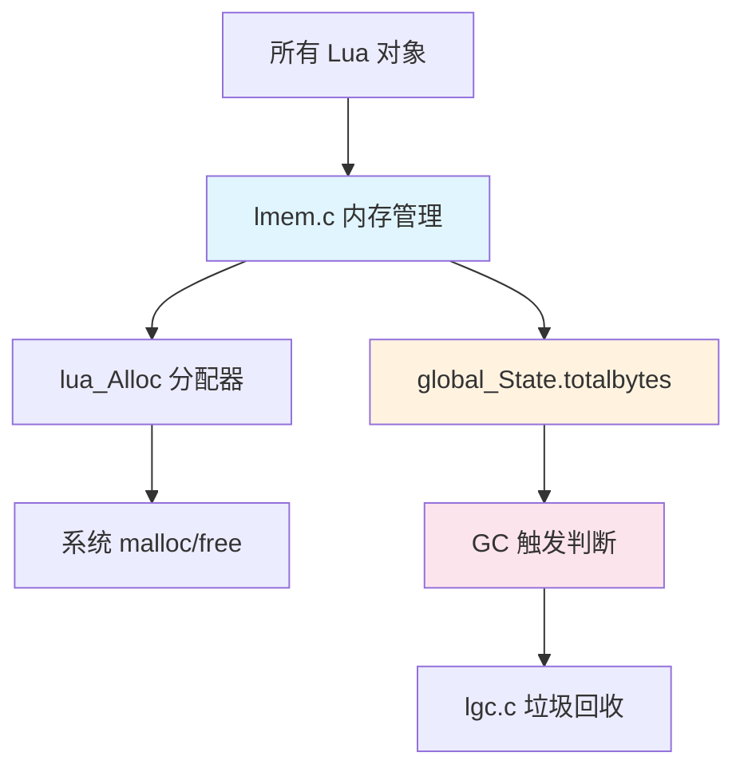
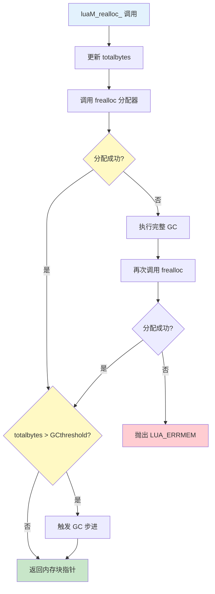
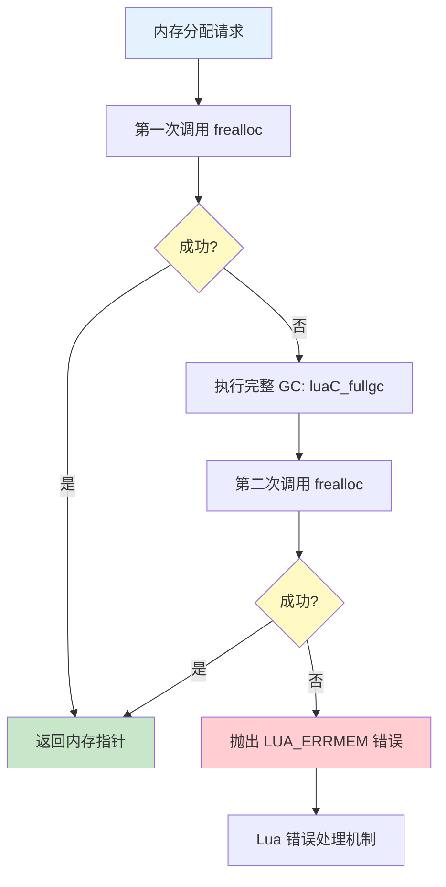

# 内存管理模块详解（Memory Management）

## 目录

1. [模块概述](#模块概述)
2. [核心数据结构](#核心数据结构)
3. [统一分配接口](#统一分配接口)
4. [自定义分配器](#自定义分配器)
5. [内存统计机制](#内存统计机制)
6. [错误处理策略](#错误处理策略)
7. [性能优化](#性能优化)
8. [实战应用](#实战应用)
9. [附录](#附录)

---

## 模块概述

### 1.1 设计目标

Lua 内存管理模块是整个虚拟机的基础设施，提供统一的内存分配接口。

**核心特性：**
- 统一的内存分配接口（分配、释放、重分配）
- 支持自定义内存分配器
- 精确的内存使用统计
- 与 GC 深度集成
- 完善的错误处理机制

**设计理念：**
```
┌─────────────────────────────────────┐
│      Lua 对象创建请求                │
│   (Table, String, Closure...)       │
└─────────────┬───────────────────────┘
              │
              ↓
┌─────────────────────────────────────┐
│       luaM_realloc_()               │
│   统一内存分配接口                   │
└─────────────┬───────────────────────┘
              │
              ↓
┌─────────────────────────────────────┐
│     lua_Alloc (可自定义)             │
│   实际的内存分配器                   │
└─────────────┬───────────────────────┘
              │
              ↓
┌─────────────────────────────────────┐
│    系统内存（malloc/free）           │
└─────────────────────────────────────┘
```

### 1.2 核心文件

| 文件 | 代码行数 | 功能描述 |
|------|---------|----------|
| `lmem.h` | ~70 行 | 内存管理接口定义、宏定义 |
| `lmem.c` | ~90 行 | 内存分配实现、错误处理 |

**代码量分析：**
- 总计约 160 行 C 代码
- 极简设计，但功能完备
- 是 Lua 代码量最少的核心模块之一

### 1.3 模块依赖关系



---

## 核心数据结构

### 2.1 lua_Alloc 函数指针

内存分配器的核心类型定义：

```c
/* lua.h */
typedef void * (*lua_Alloc) (void *ud, void *ptr, 
                              size_t osize, size_t nsize);
```

**参数说明：**
- `ud`：用户数据指针（user data），传递给分配器的上下文
- `ptr`：要操作的内存块指针
- `osize`：原内存块大小（old size）
- `nsize`：新内存块大小（new size）

**返回值：**
- 成功：返回新内存块指针
- 失败：返回 `NULL`

### 2.2 global_State 中的内存字段

```c
/* lstate.h */
typedef struct global_State {
    /* ... 其他字段 ... */
    
    lua_Alloc frealloc;      /* 内存分配器函数指针 */
    void *ud;                /* 分配器的用户数据 */
    size_t totalbytes;       /* 当前已分配总字节数 */
    size_t GCthreshold;      /* GC 触发阈值 */
    
    /* ... 其他字段 ... */
} global_State;
```

**字段详解：**

| 字段 | 类型 | 用途 |
|------|------|------|
| `frealloc` | `lua_Alloc` | 实际的内存分配器函数 |
| `ud` | `void*` | 传递给分配器的上下文数据 |
| `totalbytes` | `size_t` | 总分配字节数（用于 GC 判断）|
| `GCthreshold` | `size_t` | GC 触发阈值 |

### 2.3 内存统计结构

```c
/* 内存使用情况（隐式记录在 global_State 中）*/
totalbytes = Σ(所有活跃对象的大小)

/* GC 触发条件 */
if (totalbytes > GCthreshold) {
    触发增量 GC 步进
}
```

---

## 统一分配接口

### 3.1 luaM_realloc_ 核心函数

**函数签名：**
```c
/* lmem.c */
void *luaM_realloc_ (lua_State *L, void *block, 
                     size_t osize, size_t nsize) {
    global_State *g = G(L);
    
    /* 更新内存统计 */
    g->totalbytes = (g->totalbytes - osize) + nsize;
    
    /* 调用实际分配器 */
    void *newblock = (*g->frealloc)(g->ud, block, osize, nsize);
    
    /* 错误处理 */
    if (newblock == NULL && nsize > 0) {
        /* 内存分配失败，尝试 GC 后重试 */
        luaC_fullgc(L);
        newblock = (*g->frealloc)(g->ud, block, osize, nsize);
        if (newblock == NULL)
            luaD_throw(L, LUA_ERRMEM);  /* 抛出内存错误 */
    }
    
    /* GC 触发判断 */
    if (g->totalbytes > g->GCthreshold)
        luaC_step(L);
    
    return newblock;
}
```

### 3.2 四种操作模式

`luaM_realloc_` 根据参数组合实现四种操作：

| block | osize | nsize | 操作 | 说明 |
|-------|-------|-------|------|------|
| `NULL` | 0 | > 0 | **分配** | 分配新内存块 |
| 非 `NULL` | > 0 | 0 | **释放** | 释放现有内存块 |
| 非 `NULL` | > 0 | > 0 | **重分配** | 调整内存块大小 |
| 非 `NULL` | > 0 | < osize | **缩小** | 缩小内存块（重分配的特例）|

**示例：**

```c
/* 1. 分配 100 字节新内存 */
void *ptr = luaM_realloc_(L, NULL, 0, 100);

/* 2. 将内存扩大到 200 字节 */
ptr = luaM_realloc_(L, ptr, 100, 200);

/* 3. 缩小到 150 字节 */
ptr = luaM_realloc_(L, ptr, 200, 150);

/* 4. 释放内存 */
luaM_realloc_(L, ptr, 150, 0);
```

### 3.3 执行流程图



### 3.4 内存统计更新

**计算公式：**
```c
new_totalbytes = old_totalbytes - osize + nsize

/* 示例：
 * 初始：totalbytes = 1000
 * 操作：realloc(ptr, 100, 200)  // 扩大内存
 * 结果：totalbytes = 1000 - 100 + 200 = 1100
 */
```

**关键点：**
- 统计在分配器调用**之前**更新
- 即使分配失败，也已经更新（需要回滚）
- `totalbytes` 反映的是**应该分配**的内存量

### 3.5 便捷宏定义

```c
/* lmem.h */

/* 分配新对象 */
#define luaM_new(L,t)  \
    cast(t *, luaM_realloc_(L, NULL, 0, sizeof(t)))

/* 分配对象数组 */
#define luaM_newvector(L,n,t) \
    cast(t *, luaM_realloc_(L, NULL, 0, (n)*sizeof(t)))

/* 释放对象 */
#define luaM_free(L, b) \
    luaM_realloc_(L, (b), sizeof(*(b)), 0)

/* 释放数组 */
#define luaM_freearray(L, b, n, t) \
    luaM_realloc_(L, (b), (n)*sizeof(t), 0)

/* 调整数组大小 */
#define luaM_reallocvector(L, v,oldn,n,t) \
    ((v)=cast(t *, luaM_realloc_(L, v, (oldn)*sizeof(t), (n)*sizeof(t))))

/* 增长数组 */
#define luaM_growvector(L,v,nelems,size,t,limit,e) \
    if ((nelems)+1 > (size)) \
        ((v)=cast(t *, luaM_growaux_(L,v,&(size),sizeof(t),limit,e)))
```

**使用示例：**
```c
/* 创建新的 Table 对象 */
Table *t = luaM_new(L, Table);

/* 分配 10 个整数的数组 */
int *arr = luaM_newvector(L, 10, int);

/* 释放 Table */
luaM_free(L, t);

/* 释放数组 */
luaM_freearray(L, arr, 10, int);
```

---

## 自定义分配器

### 4.1 默认分配器实现

Lua 提供的默认分配器（`lauxlib.c`）：

```c
/* lauxlib.c */
static void *l_alloc (void *ud, void *ptr, size_t osize, size_t nsize) {
    (void)ud;     /* 未使用 */
    (void)osize;  /* 未使用 */
    
    if (nsize == 0) {
        free(ptr);      /* 释放内存 */
        return NULL;
    } else {
        return realloc(ptr, nsize);  /* 分配/重分配 */
    }
}
```

**特点：**
- 直接封装 `realloc` 和 `free`
- 不跟踪内存使用
- 简单高效

### 4.2 设置自定义分配器

**API 函数：**
```c
/* lua.h */
void lua_setallocf (lua_State *L, lua_Alloc f, void *ud);
```

**示例：带内存限制的分配器**
```c
typedef struct {
    size_t max_memory;    /* 最大内存限制 */
    size_t used_memory;   /* 当前使用内存 */
} MemoryLimit;

static void *limited_alloc (void *ud, void *ptr, 
                            size_t osize, size_t nsize) {
    MemoryLimit *limit = (MemoryLimit *)ud;
    
    /* 更新使用量 */
    limit->used_memory = limit->used_memory - osize + nsize;
    
    /* 检查是否超过限制 */
    if (limit->used_memory > limit->max_memory) {
        limit->used_memory = limit->used_memory - nsize + osize;  /* 回滚 */
        return NULL;  /* 拒绝分配 */
    }
    
    /* 执行实际分配 */
    if (nsize == 0) {
        free(ptr);
        return NULL;
    } else {
        return realloc(ptr, nsize);
    }
}

/* 使用示例 */
lua_State *L = luaL_newstate();
MemoryLimit limit = { 10 * 1024 * 1024, 0 };  /* 限制 10MB */
lua_setallocf(L, limited_alloc, &limit);
```

### 4.3 内存池分配器

**设计思路：**
- 预分配大块内存
- 快速分配小对象
- 减少系统调用

**简化实现：**
```c
typedef struct MemoryPool {
    char *pool;          /* 内存池基地址 */
    size_t pool_size;    /* 总大小 */
    size_t used;         /* 已使用 */
} MemoryPool;

static void *pool_alloc (void *ud, void *ptr, 
                         size_t osize, size_t nsize) {
    MemoryPool *pool = (MemoryPool *)ud;
    
    if (nsize == 0) {
        /* 简化版：不回收，依赖池销毁 */
        return NULL;
    }
    
    /* 对齐到 8 字节 */
    nsize = (nsize + 7) & ~7;
    
    /* 检查空间 */
    if (pool->used + nsize > pool->pool_size) {
        return NULL;  /* 池满 */
    }
    
    /* 分配 */
    void *result = pool->pool + pool->used;
    pool->used += nsize;
    
    /* 简化版：忽略 realloc */
    if (ptr != NULL) {
        memcpy(result, ptr, osize < nsize ? osize : nsize);
    }
    
    return result;
}
```

### 4.4 调试分配器

**功能：** 跟踪所有分配操作，检测内存泄漏。

```c
typedef struct AllocRecord {
    void *ptr;
    size_t size;
    const char *file;
    int line;
    struct AllocRecord *next;
} AllocRecord;

typedef struct DebugAllocator {
    AllocRecord *records;
    size_t total_allocs;
    size_t total_frees;
    size_t current_bytes;
    size_t peak_bytes;
} DebugAllocator;

static void *debug_alloc (void *ud, void *ptr, 
                          size_t osize, size_t nsize) {
    DebugAllocator *debug = (DebugAllocator *)ud;
    
    /* 记录操作 */
    if (ptr == NULL && nsize > 0) {
        debug->total_allocs++;
        debug->current_bytes += nsize;
        if (debug->current_bytes > debug->peak_bytes)
            debug->peak_bytes = debug->current_bytes;
    } else if (nsize == 0) {
        debug->total_frees++;
        debug->current_bytes -= osize;
    }
    
    /* 执行实际分配 */
    void *result = (nsize == 0) ? (free(ptr), NULL) : realloc(ptr, nsize);
    
    /* 打印日志 */
    printf("[MEM] %s %p: %zu -> %zu bytes (total: %zu)\n",
           nsize == 0 ? "FREE" : (ptr == NULL ? "ALLOC" : "REALLOC"),
           result ? result : ptr, osize, nsize, debug->current_bytes);
    
    return result;
}

/* 使用 */
DebugAllocator debug = {0};
lua_setallocf(L, debug_alloc, &debug);

/* ... 运行 Lua 代码 ... */

printf("=== Memory Report ===\n");
printf("Total Allocs: %zu\n", debug.total_allocs);
printf("Total Frees:  %zu\n", debug.total_frees);
printf("Current:      %zu bytes\n", debug.current_bytes);
printf("Peak:         %zu bytes\n", debug.peak_bytes);
```

### 4.5 分配器对比

| 分配器类型 | 优点 | 缺点 | 适用场景 |
|-----------|------|------|----------|
| **默认分配器** | 简单、标准 | 无限制、无统计 | 一般应用 |
| **内存限制** | 防止溢出 | 需要预估大小 | 嵌入式、沙箱 |
| **内存池** | 快速分配 | 内存碎片、难回收 | 短生命周期对象多 |
| **调试分配器** | 详细日志 | 性能开销大 | 开发调试阶段 |

---

## 内存统计机制

### 5.1 totalbytes 字段

**更新时机：**
```c
/* luaM_realloc_ 中 */
g->totalbytes = (g->totalbytes - osize) + nsize;
```

**计算逻辑：**
- 减去旧大小（释放的内存）
- 加上新大小（新分配的内存）
- 结果是当前活跃对象的总大小

**示例跟踪：**
```c
/* 初始状态 */
totalbytes = 0

/* 分配 Table (48 字节) */
luaM_realloc_(L, NULL, 0, 48)
totalbytes = 0 - 0 + 48 = 48

/* 分配 String (32 字节) */
luaM_realloc_(L, NULL, 0, 32)
totalbytes = 48 - 0 + 32 = 80

/* 释放 Table */
luaM_realloc_(L, table_ptr, 48, 0)
totalbytes = 80 - 48 + 0 = 32

/* String 扩展到 64 字节 */
luaM_realloc_(L, str_ptr, 32, 64)
totalbytes = 32 - 32 + 64 = 64
```

### 5.2 GC 触发机制

**判断逻辑：**
```c
/* luaM_realloc_ 末尾 */
if (g->totalbytes > g->GCthreshold) {
    luaC_step(L);  /* 触发增量 GC 步进 */
}
```

**阈值调整：**
```c
/* lgc.c - GC 完成后 */
void luaC_fullgc (lua_State *L) {
    /* ... 执行完整 GC ... */
    
    /* 调整阈值为当前使用量的 2 倍 */
    g->GCthreshold = 2 * g->totalbytes;
}
```

**动态平衡：**
```
初始：totalbytes = 100KB, GCthreshold = 200KB
分配：totalbytes = 250KB → 触发 GC
GC后：totalbytes = 150KB → GCthreshold = 300KB
分配：totalbytes = 350KB → 触发 GC
GC后：totalbytes = 200KB → GCthreshold = 400KB
```

### 5.3 内存使用查询

**C API：**
```c
/* lua.h */
int lua_gc (lua_State *L, int what, int data);

/* 查询内存使用（KB） */
int kb = lua_gc(L, LUA_GCCOUNT, 0);

/* 查询内存使用（字节） */
int bytes = lua_gc(L, LUA_GCCOUNTB, 0);

/* 总字节数 = kb * 1024 + bytes */
size_t total = kb * 1024 + bytes;
```

**Lua API：**
```lua
-- 查询内存使用（KB）
local memory_kb = collectgarbage("count")

-- 格式化输出
print(string.format("内存使用: %.2f MB", memory_kb / 1024))
```

---

## 错误处理策略

### 6.1 两阶段重试机制

**第一阶段：正常分配**
```c
void *newblock = (*g->frealloc)(g->ud, block, osize, nsize);
if (newblock != NULL || nsize == 0)
    return newblock;  /* 成功 */
```

**第二阶段：GC 后重试**
```c
/* 分配失败，尝试完整 GC */
luaC_fullgc(L);

/* 再次尝试分配 */
newblock = (*g->frealloc)(g->ud, block, osize, nsize);
if (newblock != NULL)
    return newblock;  /* 成功 */

/* 仍然失败，抛出错误 */
luaD_throw(L, LUA_ERRMEM);
```

### 6.2 错误处理流程



### 6.3 内存错误的影响

**C 层面：**
```c
/* luaD_throw 会执行 longjmp */
luaD_throw(L, LUA_ERRMEM);
/* 永不返回，跳转到最近的 pcall/xpcall */
```

**Lua 层面：**
```lua
local success, err = pcall(function()
    -- 某些操作导致内存不足
    local huge_table = {}
    for i = 1, 10000000 do
        huge_table[i] = string.rep("x", 1000)
    end
end)

if not success then
    print("错误:", err)  
    -- 输出: "错误: not enough memory"
end
```

### 6.4 防御性编程

**检查分配结果：**
```c
/* 不推荐：假设分配总是成功 */
Table *t = luaM_new(L, Table);
t->metatable = NULL;  /* 如果分配失败，这里会崩溃 */

/* 推荐：使用 Lua 的错误处理机制 */
Table *t = luaM_new(L, Table);
/* luaM_new 内部会调用 luaM_realloc_，
 * 失败时会抛出异常，不会返回 NULL */
t->metatable = NULL;  /* 安全 */
```

**内存敏感操作：**
```c
/* 大块分配前触发 GC */
luaC_checkGC(L);
void *big_mem = luaM_malloc(L, 1024 * 1024);  /* 1MB */
```

---

## 性能优化

### 7.1 内存对齐

**为什么对齐：**
- CPU 访问对齐地址更快
- 某些平台要求必须对齐
- 减少缓存未命中

**Lua 的对齐策略：**
```c
/* llimits.h */
union LUAI_MAXALIGN {
    lua_Number n;
    double u;
    void *s;
    long l;
};

/* 对齐大小（通常是 8 字节）*/
#define LUAI_MEM_ALIGN sizeof(union LUAI_MAXALIGN)
```

**对齐宏：**
```c
/* 向上对齐到 LUAI_MEM_ALIGN */
#define luaM_reallocv(L,b,on,n,e) \
    ((cast(size_t, (n)+1) <= MAX_SIZET/(e)) ? \
        luaM_realloc_(L, (b), (on)*(e), (n)*(e)) : \
        luaM_toobig(L))
```

### 7.2 避免频繁重分配

**增长策略：**
```c
/* lmem.c */
void *luaM_growaux_ (lua_State *L, void *block, int *size,
                     size_t size_elems, int limit,
                     const char *errormsg) {
    void *newblock;
    int newsize;
    
    /* 计算新大小（至少翻倍）*/
    if (*size >= limit/2) {
        if (*size >= limit)
            luaG_runerror(L, errormsg);
        newsize = limit;
    } else {
        newsize = (*size) * 2;  /* 翻倍策略 */
        if (newsize < MINSIZEARRAY)
            newsize = MINSIZEARRAY;  /* 最小 4 */
    }
    
    newblock = luaM_reallocv(L, block, *size, newsize, size_elems);
    *size = newsize;
    return newblock;
}
```

**增长示例：**
```
初始大小: 0
第1次增长: 4   (MINSIZEARRAY)
第2次增长: 8   (4 * 2)
第3次增长: 16  (8 * 2)
第4次增长: 32  (16 * 2)
第5次增长: 64  (32 * 2)
...
```

**性能对比：**
```c
/* 低效：每次增加 1 */
for (int i = 0; i < 1000; i++) {
    array = luaM_reallocvector(L, array, i, i+1, int);
}
/* 重分配次数：1000 次 */

/* 高效：翻倍增长 */
int size = 4;
for (int i = 0; i < 1000; i++) {
    if (i >= size) {
        array = luaM_reallocvector(L, array, size, size*2, int);
        size *= 2;
    }
}
/* 重分配次数：log2(1000) ≈ 10 次 */
```

### 7.3 内存池优化

**字符串内部化：**
- 相同字符串只存储一份
- 通过哈希表查找
- 节省内存，加速比较

**小对象池：**
```c
/* Lua 没有显式实现，但可以自定义 */
#define SMALL_OBJECT_SIZE 64

typedef struct SmallObjectPool {
    void *free_list[SMALL_OBJECT_SIZE / 8];
    /* ... */
} SmallObjectPool;

static void *pool_alloc_small(SmallObjectPool *pool, size_t size) {
    if (size > SMALL_OBJECT_SIZE || size == 0)
        return NULL;
    
    int index = (size + 7) / 8 - 1;  /* 对齐到 8 字节 */
    
    if (pool->free_list[index] != NULL) {
        void *obj = pool->free_list[index];
        pool->free_list[index] = *(void **)obj;  /* 取出链表头 */
        return obj;
    }
    
    return NULL;  /* 需要从系统分配 */
}
```

### 7.4 性能测试

**基准测试代码：**
```lua
-- 测试内存分配性能
local function benchmark_allocation()
    local start = os.clock()
    local tables = {}
    
    for i = 1, 100000 do
        tables[i] = {a = i, b = i * 2, c = i * 3}
    end
    
    local elapsed = os.clock() - start
    local memory = collectgarbage("count")
    
    print(string.format("分配 10万个表: %.3f 秒", elapsed))
    print(string.format("内存使用: %.2f MB", memory / 1024))
    
    -- 清理
    tables = nil
    collectgarbage("collect")
end

benchmark_allocation()

-- 输出示例：
-- 分配 10万个表: 0.125 秒
-- 内存使用: 15.23 MB
```

---

## 实践应用

### 8.1 内存泄漏检测器

**设计目标：**
- 跟踪所有未释放的内存
- 定位分配位置

**完整实现：**
```c
#include <lua.h>
#include <lauxlib.h>
#include <stdlib.h>
#include <stdio.h>

typedef struct AllocNode {
    void *ptr;
    size_t size;
    struct AllocNode *next;
} AllocNode;

typedef struct {
    AllocNode *head;
    size_t total_allocated;
    size_t total_freed;
    size_t current_usage;
} LeakDetector;

static void *leak_detector_alloc(void *ud, void *ptr, 
                                  size_t osize, size_t nsize) {
    LeakDetector *detector = (LeakDetector *)ud;
    
    /* 释放 */
    if (nsize == 0) {
        if (ptr != NULL) {
            /* 从链表移除 */
            AllocNode **p = &detector->head;
            while (*p) {
                if ((*p)->ptr == ptr) {
                    AllocNode *node = *p;
                    *p = node->next;
                    detector->total_freed += node->size;
                    detector->current_usage -= node->size;
                    free(node);
                    break;
                }
                p = &(*p)->next;
            }
        }
        free(ptr);
        return NULL;
    }
    
    /* 分配/重分配 */
    void *newptr = realloc(ptr, nsize);
    if (newptr == NULL) return NULL;
    
    /* 记录分配 */
    if (ptr == NULL) {
        /* 新分配 */
        AllocNode *node = malloc(sizeof(AllocNode));
        node->ptr = newptr;
        node->size = nsize;
        node->next = detector->head;
        detector->head = node;
        detector->total_allocated += nsize;
        detector->current_usage += nsize;
    } else {
        /* 重分配：更新记录 */
        AllocNode *p = detector->head;
        while (p) {
            if (p->ptr == ptr) {
                detector->current_usage = detector->current_usage - p->size + nsize;
                p->ptr = newptr;
                p->size = nsize;
                break;
            }
            p = p->next;
        }
    }
    
    return newptr;
}

static int leak_report(lua_State *L) {
    LeakDetector *detector;
    lua_getallocf(L, (void **)&detector);
    
    printf("\n=== Memory Leak Report ===\n");
    printf("Total Allocated: %zu bytes\n", detector->total_allocated);
    printf("Total Freed:     %zu bytes\n", detector->total_freed);
    printf("Current Usage:   %zu bytes\n", detector->current_usage);
    printf("\nUnfreed Blocks:\n");
    
    int count = 0;
    AllocNode *p = detector->head;
    while (p) {
        printf("  [%d] %p: %zu bytes\n", ++count, p->ptr, p->size);
        p = p->next;
    }
    
    return 0;
}

/* 使用 */
int main() {
    LeakDetector detector = {NULL, 0, 0, 0};
    lua_State *L = lua_newstate(leak_detector_alloc, &detector);
    
    luaL_openlibs(L);
    lua_pushcfunction(L, leak_report);
    lua_setglobal(L, "leak_report");
    
    /* 运行测试脚本 */
    luaL_dostring(L, 
        "local t = {}\n"
        "for i = 1, 100 do t[i] = {data = i} end\n"
        "leak_report()\n"
    );
    
    lua_close(L);
    return 0;
}
```

### 8.2 内存限制沙箱

**应用场景：** 不信任的脚本、资源受限环境。

```c
typedef struct {
    size_t limit;
    size_t used;
    int strict;  /* 严格模式：超限直接拒绝 */
} MemorySandbox;

static void *sandbox_alloc(void *ud, void *ptr, 
                           size_t osize, size_t nsize) {
    MemorySandbox *sandbox = (MemorySandbox *)ud;
    
    /* 计算新的使用量 */
    size_t new_used = sandbox->used - osize + nsize;
    
    /* 检查限制 */
    if (new_used > sandbox->limit) {
        if (sandbox->strict) {
            return NULL;  /* 严格模式：直接拒绝 */
        }
        /* 宽松模式：允许小幅超限 */
        if (new_used > sandbox->limit * 1.1) {
            return NULL;
        }
    }
    
    /* 执行分配 */
    void *result = (nsize == 0) ? (free(ptr), NULL) : realloc(ptr, nsize);
    if (result != NULL || nsize == 0) {
        sandbox->used = new_used;
    }
    
    return result;
}

/* Lua 接口 */
static int lua_set_memory_limit(lua_State *L) {
    size_t limit = luaL_checkinteger(L, 1);
    int strict = lua_toboolean(L, 2);
    
    MemorySandbox *sandbox = lua_newuserdata(L, sizeof(MemorySandbox));
    sandbox->limit = limit;
    sandbox->used = 0;
    sandbox->strict = strict;
    
    lua_setallocf(L, sandbox_alloc, sandbox);
    return 0;
}
```

**使用示例：**
```lua
-- 限制内存为 1MB
set_memory_limit(1024 * 1024, true)

-- 尝试分配大表
local success = pcall(function()
    local huge = {}
    for i = 1, 1000000 do
        huge[i] = string.rep("x", 1000)
    end
end)

print("分配成功:", success)  -- false（超出限制）
```

### 8.3 内存性能分析器

**功能：** 统计各类型对象的内存使用。

```c
typedef struct {
    size_t string_bytes;
    size_t table_bytes;
    size_t function_bytes;
    size_t userdata_bytes;
    size_t other_bytes;
} MemoryProfiler;

/* 简化版：根据大小估算类型 */
static void *profiler_alloc(void *ud, void *ptr, 
                            size_t osize, size_t nsize) {
    MemoryProfiler *profiler = (MemoryProfiler *)ud;
    
    /* 估算类型（实际需要更复杂的逻辑）*/
    if (nsize >= 32 && nsize <= 128) {
        profiler->table_bytes += nsize;
    } else if (nsize > 128) {
        profiler->string_bytes += nsize;
    } else {
        profiler->other_bytes += nsize;
    }
    
    return (nsize == 0) ? (free(ptr), NULL) : realloc(ptr, nsize);
}

static int memory_profile_report(lua_State *L) {
    MemoryProfiler *profiler;
    lua_getallocf(L, (void **)&profiler);
    
    size_t total = profiler->string_bytes + profiler->table_bytes +
                   profiler->function_bytes + profiler->userdata_bytes +
                   profiler->other_bytes;
    
    printf("\n=== Memory Profile ===\n");
    printf("Strings:   %6zu KB (%.1f%%)\n", 
           profiler->string_bytes / 1024,
           100.0 * profiler->string_bytes / total);
    printf("Tables:    %6zu KB (%.1f%%)\n",
           profiler->table_bytes / 1024,
           100.0 * profiler->table_bytes / total);
    printf("Functions: %6zu KB (%.1f%%)\n",
           profiler->function_bytes / 1024,
           100.0 * profiler->function_bytes / total);
    printf("Userdata:  %6zu KB (%.1f%%)\n",
           profiler->userdata_bytes / 1024,
           100.0 * profiler->userdata_bytes / total);
    printf("Other:     %6zu KB (%.1f%%)\n",
           profiler->other_bytes / 1024,
           100.0 * profiler->other_bytes / total);
    printf("Total:     %6zu KB\n", total / 1024);
    
    return 0;
}
```

### 8.4 对比测试

**测试场景：** 比较不同分配器的性能。

```lua
-- 测试脚本
local function stress_test()
    local start = os.clock()
    
    -- 创建大量临时对象
    for i = 1, 10000 do
        local t = {}
        for j = 1, 100 do
            t[j] = string.format("item_%d_%d", i, j)
        end
    end
    
    return os.clock() - start
end

-- 默认分配器
local time1 = stress_test()
local mem1 = collectgarbage("count")

collectgarbage("collect")

-- 内存池分配器（假设已实现）
use_pool_allocator()
local time2 = stress_test()
local mem2 = collectgarbage("count")

print(string.format("默认分配器: %.3fs, %.2f MB", time1, mem1 / 1024))
print(string.format("内存池:     %.3fs, %.2f MB", time2, mem2 / 1024))
print(string.format("性能提升:   %.1f%%", (time1 - time2) / time1 * 100))
```

---

## 附录

### 9.1 完整源码

**lmem.h (简化版):**
```c
#ifndef lmem_h
#define lmem_h

#include "llimits.h"
#include "lua.h"

#define MEMERRMSG       "not enough memory"

#define luaM_reallocv(L,b,on,n,e) \
    ((cast(size_t, (n)+1) <= MAX_SIZET/(e)) ? \
        luaM_realloc_(L, (b), (on)*(e), (n)*(e)) : \
        luaM_toobig(L))

#define luaM_freemem(L, b, s)   luaM_realloc_(L, (b), (s), 0)
#define luaM_free(L, b)         luaM_realloc_(L, (b), sizeof(*(b)), 0)
#define luaM_freearray(L, b, n, t) luaM_reallocv(L, (b), n, 0, sizeof(t))

#define luaM_malloc(L,t)        luaM_realloc_(L, NULL, 0, (t))
#define luaM_new(L,t)           cast(t *, luaM_malloc(L, sizeof(t)))
#define luaM_newvector(L,n,t)   cast(t *, luaM_reallocv(L, NULL, 0, n, sizeof(t)))

#define luaM_growvector(L,v,nelems,size,t,limit,e) \
    if ((nelems)+1 > (size)) \
        ((v)=cast(t *, luaM_growaux_(L,v,&(size),sizeof(t),limit,e)))

#define luaM_reallocvector(L, v,oldn,n,t) \
    ((v)=cast(t *, luaM_reallocv(L, v, oldn, n, sizeof(t))))

void *luaM_realloc_ (lua_State *L, void *block, size_t oldsize, size_t size);
void *luaM_toobig (lua_State *L);
void *luaM_growaux_ (lua_State *L, void *block, int *size, size_t size_elem,
                     int limit, const char *errormsg);

#endif
```

**lmem.c (简化版):**
```c
#include "lmem.h"
#include "ldebug.h"
#include "ldo.h"
#include "lgc.h"
#include "lstate.h"

void *luaM_realloc_ (lua_State *L, void *block, size_t osize, size_t nsize) {
    global_State *g = G(L);
    lua_assert((osize == 0) == (block == NULL));
    
    /* 更新内存统计 */
    g->totalbytes = (g->totalbytes - osize) + nsize;
    
    /* 调用自定义分配器 */
    block = (*g->frealloc)(g->ud, block, osize, nsize);
    
    /* 分配失败处理 */
    if (block == NULL && nsize > 0) {
        luaC_fullgc(L);  /* 尝试完整 GC */
        block = (*g->frealloc)(g->ud, block, osize, nsize);
        if (block == NULL)
            luaD_throw(L, LUA_ERRMEM);
    }
    
    /* 触发增量 GC */
    if (g->totalbytes > g->GCthreshold)
        luaC_step(L);
    
    return block;
}

void *luaM_toobig (lua_State *L) {
    luaG_runerror(L, "memory allocation error: block too big");
    return NULL;
}

void *luaM_growaux_ (lua_State *L, void *block, int *size, size_t size_elems,
                     int limit, const char *errormsg) {
    void *newblock;
    int newsize;
    
    if (*size >= limit/2) {
        if (*size >= limit)
            luaG_runerror(L, errormsg);
        newsize = limit;
    } else {
        newsize = (*size) * 2;
        if (newsize < MINSIZEARRAY)
            newsize = MINSIZEARRAY;
    }
    
    newblock = luaM_reallocv(L, block, *size, newsize, size_elems);
    *size = newsize;
    return newblock;
}
```

### 9.2 编译与测试

**编译命令：**
```bash
# Linux/Mac
gcc -o lua_mem_test main.c lmem.c -I./include -llua -lm

# Windows (MinGW)
gcc -o lua_mem_test.exe main.c lmem.c -I./include -llua51 -lm
```

**测试用例：**
```c
/* test_memory.c */
#include <lua.h>
#include <lauxlib.h>
#include <lualib.h>
#include <stdio.h>

int main(void) {
    lua_State *L = luaL_newstate();
    luaL_openlibs(L);
    
    /* 测试1：内存分配 */
    luaL_dostring(L, 
        "local t = {}\n"
        "for i = 1, 1000 do t[i] = {data = i} end\n"
        "print('Memory:', collectgarbage('count'), 'KB')\n"
    );
    
    /* 测试2：触发 GC */
    luaL_dostring(L,
        "collectgarbage('collect')\n"
        "print('After GC:', collectgarbage('count'), 'KB')\n"
    );
    
    /* 测试3：内存泄漏测试 */
    lua_gc(L, LUA_GCSTOP, 0);
    int before = lua_gc(L, LUA_GCCOUNT, 0);
    
    luaL_dostring(L, "local x = {1,2,3}");
    
    int after = lua_gc(L, LUA_GCCOUNT, 0);
    printf("Memory增长: %d KB\n", after - before);
    
    lua_close(L);
    return 0;
}
```

### 9.3 常见问题 FAQ

**Q1: 如何监控 Lua 的内存使用？**

A: 使用 `collectgarbage("count")` 获取当前内存使用（KB）：
```lua
local mem_kb = collectgarbage("count")
print(string.format("%.2f MB", mem_kb / 1024))
```

**Q2: 如何限制 Lua 的内存使用？**

A: 实现自定义分配器，在分配前检查限制：
```c
lua_setallocf(L, limited_alloc, &limit);
```

**Q3: 内存不足错误如何处理？**

A: 使用 `pcall` 捕获：
```lua
local ok, err = pcall(function()
    -- 可能导致 OOM 的代码
end)
if not ok then
    print("错误:", err)
end
```

**Q4: GC 会自动释放所有内存吗？**

A: GC 只回收不可达对象。循环引用、全局变量、注册表中的对象不会被回收。

**Q5: 如何检测内存泄漏？**

A: 使用调试分配器跟踪分配/释放，或使用 Valgrind 等工具。

### 9.4 参考资料

**官方文档：**
- [Lua 5.1 Reference Manual - Memory Management](https://www.lua.org/manual/5.1/manual.html#2.10)
- [Lua Memory Allocator API](https://www.lua.org/manual/5.1/manual.html#lua_Alloc)

**推荐阅读：**
- 《Programming in Lua》第 4 版，Chapter 27: Memory Management
- 《Lua设计与实现》，第 6 章：内存管理
- Roberto Ierusalimschy 的论文：*The Implementation of Lua 5.0*

**开源项目：**
- [LuaJIT](https://luajit.org/) - 高性能 JIT 编译器，优化的内存管理
- [MemProf for Lua](https://github.com/Neopallium/lua-memprof) - 内存性能分析工具
- [Lua Memory Pool](https://github.com/cloudwu/lua-memory) - 云风的内存池实现

---

## 🔗 相关模块

- [垃圾回收模块](../gc/wiki_gc.md) - 基于内存管理实现自动回收
- [对象系统模块](../object/wiki_object.md) - 所有对象通过内存管理分配
- [字符串模块](../object/wiki_string.md) - 字符串内部化与内存优化
- [表模块](../object/wiki_table.md) - 表的动态扩展与内存分配

---

**文档版本：** v2.0  
**最后更新：** 2024-01  
**作者：** Lua C 实现分析项目组
