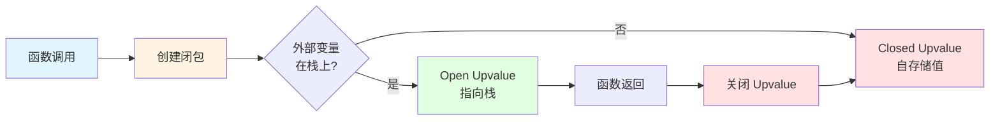
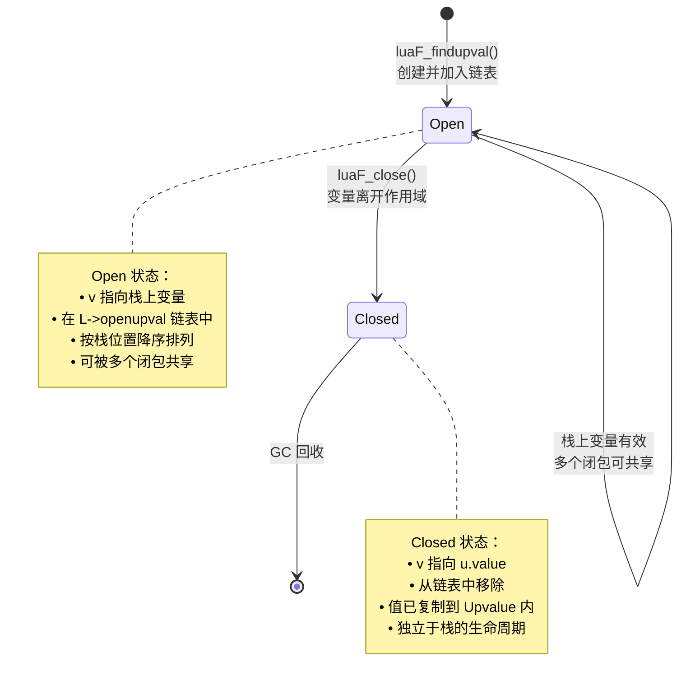
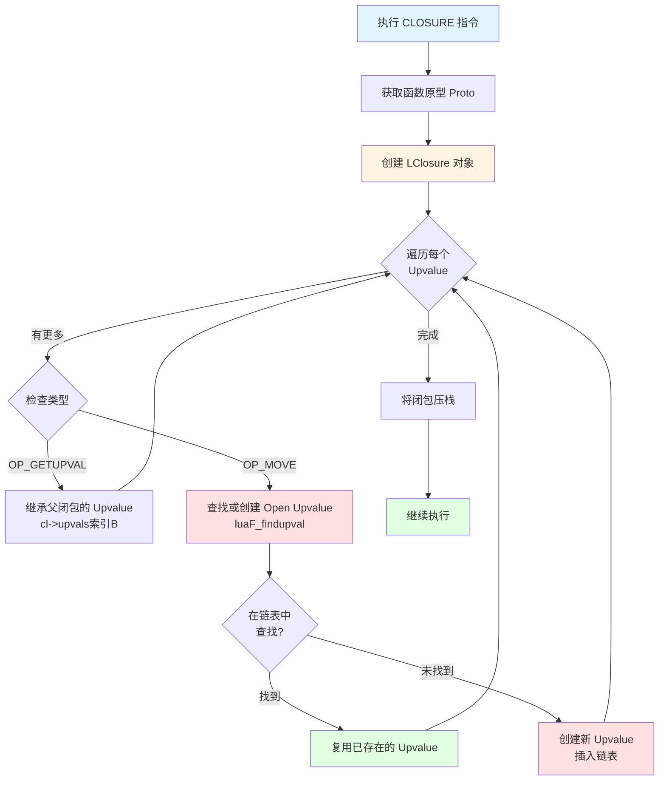
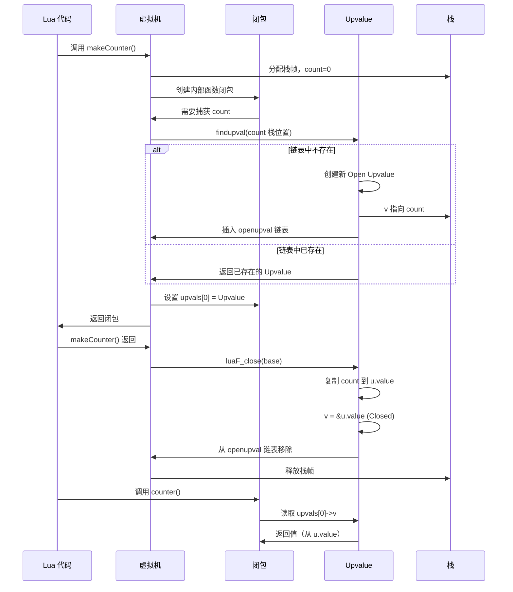
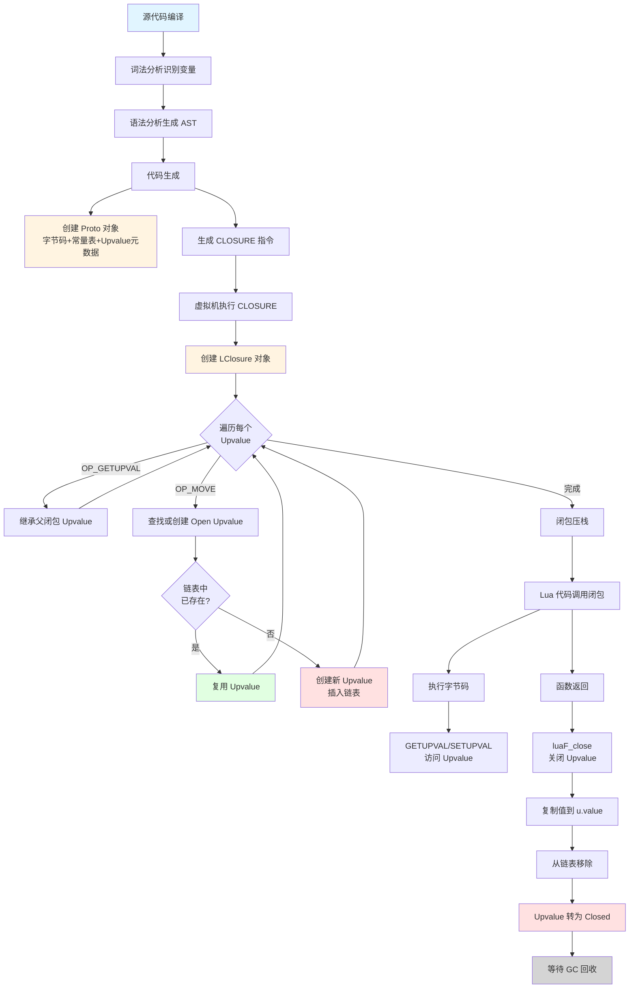

# 🔐 闭包和 Upvalue 的深入解析

> **核心机制**：Lua 闭包实现 - 词法作用域、变量捕获与函数式编程的基石

<details>
<summary><b>📋 快速导航</b></summary>

- [概述](#-概述)
- [设计哲学](#-设计哲学)
- [核心概念](#-核心概念)
- [闭包数据结构](#-闭包数据结构)
- [Upvalue 机制](#-upvalue-机制)
- [闭包创建流程](#-闭包创建流程)
- [Upvalue 生命周期](#-upvalue-生命周期)
- [性能分析](#-性能分析)
- [实战示例](#-实战示例)
- [调试技巧](#-调试技巧)
- [最佳实践](#-最佳实践)
- [相关模块](#-相关模块)

</details>

---

## 📋 概述

### 什么是闭包？

**闭包（Closure）** 是一种函数对象，它不仅包含函数代码本身，还"记住"了创建时的环境（即外部变量）。在 Lua 中，闭包是实现**词法作用域**和**函数式编程**的核心机制。

```lua
-- 经典闭包示例
function makeCounter()
    local count = 0        -- 外部变量
    return function()      -- 返回闭包
        count = count + 1  -- 捕获并修改外部变量
        return count
    end
end

local counter1 = makeCounter()
local counter2 = makeCounter()

print(counter1())  -- 1
print(counter1())  -- 2
print(counter2())  -- 1  -- 独立的闭包实例
```

### 闭包的本质

从实现角度看，Lua 闭包包含两个关键组成部分：

<table>
<tr>
<th width="30%">组成部分</th>
<th width="70%">说明</th>
</tr>

<tr>
<td><b>函数原型（Proto）</b></td>
<td>
• 存储字节码指令<br/>
• 常量表、调试信息<br/>
• 多个闭包可共享同一原型<br/>
• 只读数据，节省内存
</td>
</tr>

<tr>
<td><b>Upvalue 数组</b></td>
<td>
• 捕获的外部变量引用<br/>
• 每个闭包实例独立<br/>
• 支持变量共享和修改<br/>
• 动态生命周期管理
</td>
</tr>
</table>

### 核心文件

| 文件 | 职责 | 关键函数 |
|------|------|----------|
| `lfunc.c/h` | 闭包和 Upvalue 管理 | `luaF_newLclosure()` - 创建 Lua 闭包<br/>`luaF_newCclosure()` - 创建 C 闭包<br/>`luaF_newupval()` - 创建 Upvalue<br/>`luaF_close()` - 关闭 Upvalue<br/>`luaF_findupval()` - 查找/创建 Open Upvalue |
| `ldo.c` | Upvalue 关闭时机 | `luaD_call()` - 函数调用<br/>`luaD_poscall()` - 函数返回时关闭 Upvalue |
| `lvm.c` | 闭包操作指令 | `luaV_execute()` - CLOSURE 指令<br/>GETUPVAL/SETUPVAL 指令 |
| `lgc.c` | 闭包和 Upvalue GC | `traverseclosure()` - 遍历闭包<br/>`traverseproto()` - 遍历原型 |

---

## 🎯 设计哲学

### 1. 词法作用域（Lexical Scoping）

Lua 采用**词法作用域**（也称静态作用域），变量的可见性在编译时确定，而非运行时。

```lua
local x = 10

function outer()
    local x = 20
    
    function inner()
        print(x)  -- 编译时绑定到 outer 的 x
    end
    
    return inner
end

local f = outer()
f()  -- 输出 20，不是全局的 10
```

**设计优势**：
- ✅ **可预测性**：变量绑定在代码中明确可见
- ✅ **编译优化**：编译器可提前分析变量引用
- ✅ **工具友好**：IDE 可准确进行变量跟踪
- ✅ **性能高效**：无需运行时作用域链查找

### 2. Upvalue 延迟绑定

Upvalue 采用**延迟绑定**策略：
- **Open 状态**：函数仍在活动栈帧中，Upvalue 指向栈上变量
- **Closed 状态**：函数返回后，Upvalue 复制变量值到自身



**优势**：
- **性能优化**：活动变量直接访问栈，无额外开销
- **内存高效**：仅在必要时复制变量值
- **共享支持**：多个闭包可共享同一 Open Upvalue

### 3. Upvalue 共享机制

多个闭包捕获同一外部变量时，共享同一 Upvalue 实例。

```lua
function makePair()
    local x = 0
    
    local function get()
        return x  -- 捕获 x
    end
    
    local function set(v)
        x = v     -- 捕获同一个 x
    end
    
    return get, set
end

local getter, setter = makePair()
setter(42)
print(getter())  -- 42，两个闭包共享 x 的 Upvalue
```

**实现机制**：
1. 维护 Open Upvalue 链表（按栈位置排序）
2. 创建新闭包时，先查找链表中是否已存在
3. 存在则复用，不存在则创建新 Upvalue

---

## 💡 核心概念

### 闭包类型对比

<table>
<tr>
<th width="20%">特性</th>
<th width="40%">Lua 闭包（LClosure）</th>
<th width="40%">C 闭包（CClosure）</th>
</tr>

<tr>
<td><b>函数来源</b></td>
<td>Lua 脚本编译</td>
<td>C 代码注册</td>
</tr>

<tr>
<td><b>代码存储</b></td>
<td>字节码（Proto.code）</td>
<td>C 函数指针</td>
</tr>

<tr>
<td><b>变量捕获</b></td>
<td>Upvalue 指针数组</td>
<td>TValue 数组（直接存储值）</td>
</tr>

<tr>
<td><b>共享机制</b></td>
<td>可共享 Proto 和 Upvalue</td>
<td>无共享（每个实例独立）</td>
</tr>

<tr>
<td><b>性能</b></td>
<td>解释执行，较慢</td>
<td>本地代码，快速</td>
</tr>

<tr>
<td><b>内存占用</b></td>
<td>
基础：<code>sizeof(LClosure)</code> + Upvalue数 × 指针大小<br/>
可共享 Proto，多实例内存高效
</td>
<td>
基础：<code>sizeof(CClosure)</code> + Upvalue数 × 16字节<br/>
每个 Upvalue 存完整 TValue
</td>
</tr>

<tr>
<td><b>典型用途</b></td>
<td>Lua 脚本函数、闭包、回调</td>
<td>C API 函数、库函数</td>
</tr>
</table>

### Upvalue 状态机



### 关键术语

| 术语 | 英文 | 说明 |
|------|------|------|
| **闭包** | Closure | 函数 + 环境（Upvalue）的组合 |
| **Upvalue** | Upvalue | 捕获的外部变量引用 |
| **函数原型** | Proto | 函数的只读元数据（字节码、常量等） |
| **Open Upvalue** | Open Upvalue | 指向栈上活动变量的 Upvalue |
| **Closed Upvalue** | Closed Upvalue | 自存储值的 Upvalue |
| **词法作用域** | Lexical Scoping | 变量绑定在编译时确定 |
| **变量捕获** | Variable Capture | 闭包记住外部变量的过程 |

---

## 🏗️ 闭包数据结构

### Lua 闭包结构（LClosure）

```c
// lobject.h
#define ClosureHeader \
    CommonHeader; lu_byte isC; lu_byte nupvalues; GCObject *gclist; \
    struct Table *env

typedef struct LClosure {
    ClosureHeader;          // 通用闭包头
    struct Proto *p;        // 函数原型（共享）
    UpVal *upvals[1];       // Upvalue 指针数组（可变长度）
} LClosure;
```

#### 内存布局

```
LClosure 对象布局（假设 2 个 Upvalue）：
┌─────────────────────────────────────────────────────┐
│  CommonHeader (GC 相关)                              │
│  • next: 指向下一个 GC 对象                           │
│  • tt: 类型标签 (LUA_TFUNCTION)                      │
│  • marked: GC 标记                                   │
├─────────────────────────────────────────────────────┤
│  lu_byte isC = 0 (标识 Lua 闭包)                     │
├─────────────────────────────────────────────────────┤
│  lu_byte nupvalues = 2 (Upvalue 数量)                │
├─────────────────────────────────────────────────────┤
│  GCObject *gclist (GC 遍历链表)                      │
├─────────────────────────────────────────────────────┤
│  Table *env (环境表，通常是 _G)                       │
├─────────────────────────────────────────────────────┤
│  Proto *p (函数原型指针)                              │
│    ↓                                                 │
│    指向共享的 Proto 对象                              │
├─────────────────────────────────────────────────────┤
│  UpVal *upvals[0] (第1个 Upvalue 指针)               │
│    ↓                                                 │
│    指向 UpVal 对象                                    │
├─────────────────────────────────────────────────────┤
│  UpVal *upvals[1] (第2个 Upvalue 指针)               │
│    ↓                                                 │
│    指向 UpVal 对象                                    │
└─────────────────────────────────────────────────────┘

实际内存大小：
sizeof(LClosure) + (nupvalues - 1) * sizeof(UpVal*)
```

### C 闭包结构（CClosure）

```c
// lobject.h
typedef struct CClosure {
    ClosureHeader;          // 通用闭包头
    lua_CFunction f;        // C 函数指针
    TValue upvalue[1];      // Upvalue 值数组（可变长度）
} CClosure;

// C 函数签名
typedef int (*lua_CFunction) (lua_State *L);
```

#### 内存布局

```
CClosure 对象布局（假设 2 个 Upvalue）：
┌─────────────────────────────────────────────────────┐
│  CommonHeader (GC 相关)                              │
├─────────────────────────────────────────────────────┤
│  lu_byte isC = 1 (标识 C 闭包)                       │
├─────────────────────────────────────────────────────┤
│  lu_byte nupvalues = 2 (Upvalue 数量)                │
├─────────────────────────────────────────────────────┤
│  GCObject *gclist (GC 遍历链表)                      │
├─────────────────────────────────────────────────────┤
│  Table *env (环境表)                                 │
├─────────────────────────────────────────────────────┤
│  lua_CFunction f (C 函数指针)                        │
│    void (*f)(lua_State *L)                          │
├─────────────────────────────────────────────────────┤
│  TValue upvalue[0] (第1个 Upvalue 值)                │
│  • Value value (8字节)                               │
│  • int tt (4字节)                                    │
├─────────────────────────────────────────────────────┤
│  TValue upvalue[1] (第2个 Upvalue 值)                │
│  • Value value (8字节)                               │
│  • int tt (4字节)                                    │
└─────────────────────────────────────────────────────┘

实际内存大小：
sizeof(CClosure) + (nupvalues - 1) * sizeof(TValue)
```

### 函数原型（Proto）

```c
// lobject.h
typedef struct Proto {
    CommonHeader;
    TValue *k;              // 常量表
    Instruction *code;      // 字节码数组
    struct Proto **p;       // 嵌套函数原型
    int *lineinfo;          // 行号信息（调试用）
    struct LocVar *locvars; // 局部变量信息（调试用）
    TString **upvalues;     // Upvalue 名称数组（调试用）
    TString *source;        // 源文件名
    
    int sizeupvalues;       // Upvalue 数量
    int sizek;              // 常量数量
    int sizecode;           // 指令数量
    int sizelineinfo;       // 行号信息大小
    int sizep;              // 子函数数量
    int sizelocvars;        // 局部变量数量
    
    int linedefined;        // 函数定义起始行
    int lastlinedefined;    // 函数定义结束行
    
    GCObject *gclist;       // GC 链表
    
    lu_byte nups;           // Upvalue 数量
    lu_byte numparams;      // 固定参数数量
    lu_byte is_vararg;      // 是否可变参数
    lu_byte maxstacksize;   // 最大栈大小
} Proto;
```

#### Proto 共享示例

```lua
-- 相同函数定义创建多个闭包实例
function makeAdder(x)
    return function(y)  -- 内部函数原型
        return x + y
    end
end

local add5 = makeAdder(5)
local add10 = makeAdder(10)

-- add5 和 add10 是两个不同的 LClosure 对象
-- 但它们共享同一个 Proto 对象（内部函数的字节码）
-- 区别在于 upvals[0] 分别指向 x=5 和 x=10 的 Upvalue
```

---

## 🔗 Upvalue 机制

### Upvalue 数据结构

```c
// lfunc.h
typedef struct UpVal {
    CommonHeader;           // GC 相关
    TValue *v;              // 指向实际值的指针
    union {
        TValue value;       // Closed 状态：存储值
        struct {            // Open 状态：链表节点
            struct UpVal *prev;
            struct UpVal *next;
        } l;
    } u;
} UpVal;
```

#### Upvalue 状态详解

<table>
<tr>
<th width="20%">状态</th>
<th width="40%">Open</th>
<th width="40%">Closed</th>
</tr>

<tr>
<td><b>v 指向</b></td>
<td>栈上的 TValue</td>
<td>u.value（Upvalue 内部）</td>
</tr>

<tr>
<td><b>u.l 用途</b></td>
<td>链表节点（prev/next）</td>
<td>未使用</td>
</tr>

<tr>
<td><b>u.value 用途</b></td>
<td>未使用</td>
<td>存储变量值</td>
</tr>

<tr>
<td><b>生命周期</b></td>
<td>依赖于栈帧</td>
<td>独立，由 GC 管理</td>
</tr>

<tr>
<td><b>共享性</b></td>
<td>可被多个闭包共享</td>
<td>不再共享（各闭包独立）</td>
</tr>

<tr>
<td><b>链表位置</b></td>
<td>在 L->openupval 链表中</td>
<td>已从链表移除</td>
</tr>
</table>

### Open Upvalue 链表

Lua State 维护一个 Open Upvalue 链表，按**栈位置降序**排列。

```c
// lstate.h
struct lua_State {
    // ...
    UpVal *openupval;  // Open Upvalue 链表头
    // ...
};
```

#### 链表结构示意

```
lua_State
    |
    +--> openupval (链表头)
             |
             v
         [UpVal A]  v 指向栈位置 100
             |
             v
         [UpVal B]  v 指向栈位置 80
             |
             v
         [UpVal C]  v 指向栈位置 50
             |
             v
           NULL

规则：
• 按 v 指向的栈位置降序排列
• 新插入时二分查找或线性查找插入位置
• 关闭时从链表中移除
```

### Upvalue 访问机制

#### 读取 Upvalue

```c
// 字节码指令：GETUPVAL A B
// 将 upvalue[B] 的值加载到寄存器 A

case OP_GETUPVAL: {
    int b = GETARG_B(i);
    setobj2s(L, ra, cl->upvals[b]->v);  // 直接通过 v 指针访问
    continue;
}
```

**性能特点**：
- **Open 状态**：`v` 指向栈，一次指针解引用
- **Closed 状态**：`v` 指向 `u.value`，同样一次解引用
- **统一接口**：无需判断状态，访问方式相同

#### 写入 Upvalue

```c
// 字节码指令：SETUPVAL A B
// 将寄存器 A 的值写入 upvalue[B]

case OP_SETUPVAL: {
    UpVal *uv = cl->upvals[GETARG_B(i)];
    setobj(L, uv->v, ra);  // 通过 v 指针写入
    luaC_barrier(L, uv, ra);  // GC 写屏障
    continue;
}
```

**注意事项**：
- 写入时需要 GC 写屏障（Write Barrier）
- 确保 GC 正确追踪对象引用关系

---

## 🔄 闭包创建流程

### 创建 Lua 闭包

```c
// lfunc.c
Closure *luaF_newLclosure(lua_State *L, int nelems, Table *e) {
    // 1. 分配内存（包含 Upvalue 指针数组）
    LClosure *c = cast(LClosure *, luaM_malloc(L, sizeLclosure(nelems)));
    
    // 2. 初始化 GC 头部
    luaC_link(L, obj2gco(c), LUA_TFUNCTION);
    c->isC = 0;
    c->env = e;
    c->nupvalues = cast_byte(nelems);
    c->gclist = NULL;
    c->p = NULL;  // 稍后设置
    
    // 3. 初始化 Upvalue 指针为 NULL
    while (nelems--) c->upvals[nelems] = NULL;
    
    return c;
}
```

### 查找或创建 Open Upvalue

```c
// lfunc.c
static UpVal *findupval(lua_State *L, StkId level) {
    global_State *g = G(L);
    GCObject **pp = &L->openupval;
    UpVal *p;
    UpVal *uv;
    
    // 1. 在链表中查找（按栈位置降序）
    while (*pp != NULL && (p = ngcotouv(*pp))->v >= level) {
        lua_assert(p->v != &p->u.value);  // 确保是 Open 状态
        
        if (p->v == level) {  // 找到匹配的 Upvalue
            if (isdead(g, obj2gco(p)))  // 复活死对象
                changewhite(obj2gco(p));
            return p;
        }
        pp = &p->next;
    }
    
    // 2. 未找到，创建新 Upvalue
    uv = luaM_new(L, UpVal);
    uv->tt = LUA_TUPVAL;
    uv->marked = luaC_white(g);
    uv->v = level;  // 指向栈上变量
    
    // 3. 插入链表（保持降序）
    uv->next = *pp;
    *pp = obj2gco(uv);
    uv->u.l.prev = &g->uvhead;  // 全局 Upvalue 链表
    uv->u.l.next = g->uvhead.u.l.next;
    uv->u.l.next->u.l.prev = uv;
    g->uvhead.u.l.next = uv;
    
    lua_assert(uv->u.l.next->u.l.prev == uv && uv->u.l.prev->u.l.next == uv);
    return uv;
}
```

### CLOSURE 指令执行

```c
// lvm.c: luaV_execute()
case OP_CLOSURE: {
    Proto *p;
    Closure *ncl;
    int nup, j;
    
    // 1. 获取函数原型
    p = cl->p->p[GETARG_Bx(i)];
    nup = p->nups;
    
    // 2. 创建新闭包
    ncl = luaF_newLclosure(L, nup, cl->env);
    ncl->l.p = p;
    
    // 3. 设置 Upvalue
    for (j = 0; j < nup; j++, pc++) {
        if (GET_OPCODE(*pc) == OP_GETUPVAL)
            ncl->l.upvals[j] = cl->upvals[GETARG_B(*pc)];  // 继承父闭包的 Upvalue
        else {
            lua_assert(GET_OPCODE(*pc) == OP_MOVE);
            ncl->l.upvals[j] = luaF_findupval(L, base + GETARG_B(*pc));  // 创建新 Upvalue
        }
    }
    
    // 4. 将闭包放入栈
    setclvalue(L, ra, ncl);
    
    Protect(luaC_checkGC(L));
    continue;
}
```

### 创建流程图



---

## ♻️ Upvalue 生命周期

### 关闭 Upvalue

当栈上的变量即将失效时（函数返回、作用域结束），需要关闭所有相关的 Open Upvalue。

```c
// lfunc.c
void luaF_close(lua_State *L, StkId level) {
    UpVal *uv;
    global_State *g = G(L);
    
    // 遍历 Open Upvalue 链表
    while (L->openupval != NULL && (uv = ngcotouv(L->openupval))->v >= level) {
        GCObject *o = obj2gco(uv);
        
        lua_assert(!isblack(o) && uv->v != &uv->u.value);
        
        // 1. 从 lua_State 链表中移除
        L->openupval = uv->next;
        
        // 2. 从全局 Upvalue 链表中移除
        luaF_unlinkupval(uv);
        
        // 3. 将值复制到 u.value
        setobj(L, &uv->u.value, uv->v);
        
        // 4. v 指向 u.value（转为 Closed）
        uv->v = &uv->u.value;
        
        // 5. GC 相关处理
        luaC_linkupval(L, uv);
    }
}
```

### 关闭时机

<table>
<tr>
<th width="30%">场景</th>
<th width="70%">说明</th>
</tr>

<tr>
<td><b>函数返回</b></td>
<td>
<code>luaD_poscall()</code> 中调用 <code>luaF_close(L, base)</code><br/>
• 关闭当前函数栈帧的所有 Upvalue<br/>
• 确保闭包的 Upvalue 转为 Closed 状态
</td>
</tr>

<tr>
<td><b>块结束</b></td>
<td>
Lua 5.2+ 的 <code>OP_CLOSE</code> 指令<br/>
• 在块结束时显式关闭 Upvalue<br/>
• 优化 Upvalue 生命周期管理
</td>
</tr>

<tr>
<td><b>协程切换</b></td>
<td>
<code>lua_resume()</code> 和 <code>lua_yield()</code><br/>
• 协程挂起时不关闭 Upvalue<br/>
• 恢复时 Upvalue 仍然有效
</td>
</tr>

<tr>
<td><b>错误处理</b></td>
<td>
<code>luaD_throw()</code> 异常处理<br/>
• 栈展开时自动关闭 Upvalue<br/>
• 确保资源正确释放
</td>
</tr>
</table>

### Upvalue 生命周期图



---

## 📊 性能分析

### 内存开销

<table>
<tr>
<th width="25%">对象</th>
<th width="35%">内存占用（64位系统）</th>
<th width="40%">说明</th>
</tr>

<tr>
<td><b>LClosure</b></td>
<td>
基础：40字节<br/>
+ Upvalue数 × 8字节
</td>
<td>
• 共享 Proto，多实例高效<br/>
• Upvalue 仅存指针，节省内存
</td>
</tr>

<tr>
<td><b>CClosure</b></td>
<td>
基础：40字节<br/>
+ Upvalue数 × 16字节
</td>
<td>
• 每个 Upvalue 存完整 TValue<br/>
• 无 Proto 开销
</td>
</tr>

<tr>
<td><b>UpVal</b></td>
<td>
Open：40字节（含链表节点）<br/>
Closed：32字节
</td>
<td>
• Open 时有额外链表指针<br/>
• Closed 后略小
</td>
</tr>

<tr>
<td><b>Proto</b></td>
<td>
基础：~200字节<br/>
+ 字节码数组<br/>
+ 常量表<br/>
+ 调试信息
</td>
<td>
• 可被多个闭包共享<br/>
• 只读数据，GC 负担小
</td>
</tr>
</table>

### 访问性能

| 操作 | 时间复杂度 | 说明 |
|------|-----------|------|
| **读取 Upvalue** | O(1) | `upvals[i]->v` 直接指针访问 |
| **写入 Upvalue** | O(1) | 同上，加 GC 写屏障开销 |
| **创建闭包** | O(n) | n 为 Upvalue 数量，需遍历设置 |
| **查找 Open Upvalue** | O(m) | m 为链表长度，通常很小（<10） |
| **关闭 Upvalue** | O(m) | 同上，需遍历链表 |

### 性能优化技巧

```lua
-- ❌ 避免：闭包内频繁访问全局变量
function process(data)
    for i = 1, #data do
        result = result + math.sin(data[i])  -- 每次访问全局 math
    end
end

-- ✅ 推荐：提前局部化
function process(data)
    local sin = math.sin
    local result_local = 0
    for i = 1, #data do
        result_local = result_local + sin(data[i])  -- 局部变量，更快
    end
    return result_local
end

-- ❌ 避免：过多 Upvalue
function makeComplex()
    local a, b, c, d, e, f, g, h = 1, 2, 3, 4, 5, 6, 7, 8
    return function()
        return a + b + c + d + e + f + g + h  -- 8个 Upvalue
    end
end

-- ✅ 推荐：使用 table 聚合
function makeComplex()
    local vars = {a=1, b=2, c=3, d=4, e=5, f=6, g=7, h=8}
    return function()
        local v = vars
        return v.a + v.b + v.c + v.d + v.e + v.f + v.g + v.h  -- 1个 Upvalue
    end
end
```

---

## 💼 实战示例

### 示例1：计数器（基础闭包）

```lua
-- 创建独立的计数器实例
function makeCounter(initial)
    local count = initial or 0
    
    return function()
        count = count + 1
        return count
    end
end

-- 使用
local counter1 = makeCounter(0)
local counter2 = makeCounter(100)

print(counter1())  -- 1
print(counter1())  -- 2
print(counter2())  -- 101
print(counter1())  -- 3
```

**内部机制分析**：
1. `makeCounter` 调用时，`count` 在栈上
2. 创建内部函数闭包，`upvals[0]` 指向 `count` 的 Open Upvalue
3. `makeCounter` 返回前，调用 `luaF_close`，Upvalue 转为 Closed
4. 后续 `counter1()` 调用时，从 Upvalue 的 `u.value` 读取和修改 `count`

### 示例2：Getter/Setter 对（共享 Upvalue）

```lua
-- 创建私有变量的访问器
function makeProperty(initial)
    local value = initial
    
    local function get()
        return value
    end
    
    local function set(newValue)
        if type(newValue) == type(value) then
            value = newValue
        else
            error("Type mismatch")
        end
    end
    
    return get, set
end

-- 使用
local getAge, setAge = makeProperty(25)
print(getAge())  -- 25

setAge(30)
print(getAge())  -- 30

setAge("invalid")  -- Error: Type mismatch
```

**共享机制**：
- `get` 和 `set` 两个闭包的 `upvals[0]` 指向**同一个** Upvalue 对象
- 修改 `value` 时，两个闭包都能看到变化
- 实现了真正的私有变量（无法从外部直接访问 `value`）

### 示例3：函数工厂（高阶函数）

```lua
-- 创建特定运算的函数
function makeOperator(op)
    if op == "add" then
        return function(a, b) return a + b end
    elseif op == "mul" then
        return function(a, b) return a * b end
    elseif op == "pow" then
        return function(a, b) return a ^ b end
    else
        return function(a, b) return a end
    end
end

-- 使用
local add = makeOperator("add")
local mul = makeOperator("mul")

print(add(5, 3))  -- 8
print(mul(5, 3))  -- 15
```

**优势**：
- 动态创建函数，实现策略模式
- 避免重复的 `if-else` 判断
- 闭包缓存运算类型

### 示例4：惰性求值（Lazy Evaluation）

```lua
-- 延迟计算，缓存结果
function lazy(computation)
    local cached = nil
    local computed = false
    
    return function()
        if not computed then
            cached = computation()
            computed = true
        end
        return cached
    end
end

-- 使用
local expensive = lazy(function()
    print("Computing...")
    local sum = 0
    for i = 1, 1000000 do
        sum = sum + i
    end
    return sum
end)

print("Before first call")
print(expensive())  -- 输出 "Computing..." 然后结果
print(expensive())  -- 直接返回缓存结果，不再计算
```

**应用场景**：
- 数据库查询结果缓存
- 昂贵的配置文件解析
- 大数据集的预处理

### 示例5：迭代器（Iterator）

```lua
-- 自定义迭代器
function range(from, to, step)
    local current = from - (step or 1)
    local limit = to
    local increment = step or 1
    
    return function()
        current = current + increment
        if current <= limit then
            return current
        end
    end
end

-- 使用
for i in range(1, 10, 2) do
    print(i)  -- 1, 3, 5, 7, 9
end

-- 状态迭代器（有状态）
function statefulIterator(list)
    local index = 0
    
    return function()
        index = index + 1
        return list[index]
    end
end

local numbers = {10, 20, 30, 40}
local next = statefulIterator(numbers)

print(next())  -- 10
print(next())  -- 20
```

### 示例6：柯里化（Currying）

```lua
-- 部分应用函数参数
function curry(f)
    return function(a)
        return function(b)
            return function(c)
                return f(a, b, c)
            end
        end
    end
end

-- 使用
local function volume(length, width, height)
    return length * width * height
end

local curriedVolume = curry(volume)
local fixedLength = curriedVolume(10)
local fixedWidth = fixedLength(5)

print(fixedWidth(2))  -- 100 (10 * 5 * 2)
print(fixedWidth(3))  -- 150 (10 * 5 * 3)

-- 实用版本：通用柯里化
function autoCurry(func, numArgs)
    numArgs = numArgs or debug.getinfo(func).nparams
    
    local function curried(args)
        return function(...)
            local newArgs = {table.unpack(args)}
            for _, v in ipairs({...}) do
                table.insert(newArgs, v)
            end
            
            if #newArgs >= numArgs then
                return func(table.unpack(newArgs))
            else
                return curried(newArgs)
            end
        end
    end
    
    return curried({})
end
```

### 示例7：回调和事件处理

```lua
-- 事件系统实现
EventEmitter = {}
EventEmitter.__index = EventEmitter

function EventEmitter:new()
    local obj = {
        listeners = {}
    }
    setmetatable(obj, self)
    return obj
end

function EventEmitter:on(event, callback)
    if not self.listeners[event] then
        self.listeners[event] = {}
    end
    table.insert(self.listeners[event], callback)
end

function EventEmitter:emit(event, ...)
    local callbacks = self.listeners[event]
    if callbacks then
        for _, callback in ipairs(callbacks) do
            callback(...)  -- 闭包回调
        end
    end
end

-- 使用
local emitter = EventEmitter:new()

-- 闭包捕获局部状态
local count = 0
emitter:on("click", function(x, y)
    count = count + 1
    print(string.format("Click #%d at (%d, %d)", count, x, y))
end)

emitter:emit("click", 10, 20)  -- Click #1 at (10, 20)
emitter:emit("click", 30, 40)  -- Click #2 at (30, 40)
```

### 示例8：模块私有状态

```lua
-- 模块模式（Module Pattern）
local MyModule = (function()
    -- 私有变量（闭包捕获）
    local privateData = {}
    local initialized = false
    
    -- 私有函数
    local function validate(data)
        return type(data) == "table"
    end
    
    -- 公共 API
    return {
        init = function()
            if not initialized then
                privateData = {count = 0}
                initialized = true
                print("Module initialized")
            end
        end,
        
        increment = function()
            if not initialized then
                error("Module not initialized")
            end
            privateData.count = privateData.count + 1
            return privateData.count
        end,
        
        getCount = function()
            return initialized and privateData.count or 0
        end
    }
end)()

-- 使用
MyModule.init()
print(MyModule.increment())  -- 1
print(MyModule.increment())  -- 2
print(MyModule.getCount())   -- 2

-- 无法访问 privateData
print(MyModule.privateData)  -- nil
```

---

## 🐛 调试技巧

### 1. 打印闭包信息

```lua
-- 获取闭包的 Upvalue 信息
function inspectClosure(func)
    local i = 1
    print("Upvalues of function:")
    
    while true do
        local name, value = debug.getupvalue(func, i)
        if not name then break end
        
        print(string.format("  [%d] %s = %s", i, name, tostring(value)))
        i = i + 1
    end
end

-- 示例
function outer()
    local x = 10
    local y = 20
    
    return function()
        return x + y
    end
end

local f = outer()
inspectClosure(f)
-- 输出：
-- Upvalues of function:
--   [1] x = 10
--   [2] y = 20
```

### 2. 修改 Upvalue 值（调试用）

```lua
-- 动态修改闭包的 Upvalue
function modifyUpvalue(func, index, newValue)
    local name, _ = debug.getupvalue(func, index)
    if name then
        debug.setupvalue(func, index, newValue)
        print(string.format("Modified upvalue #%d (%s) to %s", index, name, tostring(newValue)))
    else
        print("Upvalue not found")
    end
end

-- 示例
local counter = makeCounter(0)
print(counter())  -- 1
print(counter())  -- 2

modifyUpvalue(counter, 1, 100)  -- 修改 count
print(counter())  -- 101
```

### 3. 检测 Upvalue 共享

```lua
-- 检查两个闭包是否共享 Upvalue
function shareUpvalue(func1, func2, index)
    local name1, val1 = debug.getupvalue(func1, index)
    local name2, val2 = debug.getupvalue(func2, index)
    
    if name1 and name2 then
        -- 通过修改检测共享
        local original = val1
        debug.setupvalue(func1, index, "TEST_MARKER")
        local _, check = debug.getupvalue(func2, index)
        debug.setupvalue(func1, index, original)
        
        return check == "TEST_MARKER"
    end
    
    return false
end

-- 示例
function makePair()
    local shared = 0
    return function() return shared end, 
           function(v) shared = v end
end

local get, set = makePair()
print(shareUpvalue(get, set, 1))  -- true
```

### 4. 可视化闭包链

```lua
-- 递归打印闭包的 Upvalue 闭包链
function printClosureChain(func, indent)
    indent = indent or 0
    local prefix = string.rep("  ", indent)
    
    local i = 1
    while true do
        local name, value = debug.getupvalue(func, i)
        if not name then break end
        
        print(string.format("%s[%d] %s = %s", prefix, i, name, tostring(value)))
        
        if type(value) == "function" then
            printClosureChain(value, indent + 1)
        end
        
        i = i + 1
    end
end
```

### 5. 使用 LuaJIT 的 `jit.v` 模块

```lua
-- LuaJIT 特有：查看 JIT 编译信息
jit = require("jit")
jit.on()
jit.opt.start("hotloop=1", "hotexit=1")

local v = require("jit.v")
v.start("closure_trace.txt")

-- 运行闭包密集代码
local counter = makeCounter(0)
for i = 1, 10000 do
    counter()
end

v.stop()
-- 查看 closure_trace.txt 了解 JIT 编译情况
```

### 6. 内存泄漏检测

```lua
-- 检测闭包导致的循环引用
WeakRegistry = setmetatable({}, {__mode = "v"})

function trackClosure(func)
    table.insert(WeakRegistry, func)
    return func
end

function checkLeaks()
    collectgarbage("collect")
    local count = 0
    for _, v in ipairs(WeakRegistry) do
        if v then count = count + 1 end
    end
    print(string.format("%d closures still alive", count))
end

-- 使用
local f1 = trackClosure(makeCounter(0))
local f2 = trackClosure(makeCounter(0))

f1 = nil
checkLeaks()  -- 1 closures still alive

f2 = nil
checkLeaks()  -- 0 closures still alive
```

---

## ✅ 最佳实践

### 1. 避免过度闭包

```lua
-- ❌ 不推荐：每次循环创建新闭包
for i = 1, 1000 do
    table.insert(callbacks, function()
        print(i)  -- 创建 1000 个闭包
    end)
end

-- ✅ 推荐：复用闭包或避免闭包
local function printer(value)
    return function() print(value) end
end

for i = 1, 1000 do
    table.insert(callbacks, printer(i))  -- 仍创建闭包，但更清晰
end

-- ✅ 更好：避免闭包
for i = 1, 1000 do
    table.insert(callbacks, {value = i})  -- 存数据，不存闭包
end

for _, item in ipairs(callbacks) do
    print(item.value)
end
```

### 2. 显式释放闭包引用

```lua
-- ❌ 不推荐：循环引用
function createCycle()
    local obj = {}
    obj.callback = function()
        print(obj.data)  -- 闭包引用 obj，obj 引用闭包
    end
    obj.data = "test"
    return obj
end

-- ✅ 推荐：使用弱引用或显式清理
function createSafe()
    local obj = {}
    local data = "test"  -- 独立变量
    
    obj.callback = function()
        print(data)  -- 不直接引用 obj
    end
    
    return obj
end

-- 或使用弱引用表
function createWeak()
    local weakObj = setmetatable({}, {__mode = "v"})
    local obj = {}
    weakObj.ref = obj
    
    obj.callback = function()
        local o = weakObj.ref
        if o then print(o.data) end
    end
    
    return obj
end
```

### 3. 合理使用局部变量缓存

```lua
-- ❌ 不推荐：闭包内频繁访问全局或 Upvalue 的 table
function processor(config)
    return function(data)
        for i = 1, #data do
            result = result + config.multiplier * data[i]  -- 每次查表
        end
    end
end

-- ✅ 推荐：缓存到局部变量
function processor(config)
    local mult = config.multiplier  -- 提前缓存
    return function(data)
        local sum = 0
        for i = 1, #data do
            sum = sum + mult * data[i]  -- 局部变量访问更快
        end
        return sum
    end
end
```

### 4. 注意 Upvalue 的生命周期

```lua
-- ❌ 危险：返回多个闭包但不共享状态
function makeBroken()
    return function() local x = 0; x = x + 1; return x end,  -- 独立的 x
           function() local x = 0; x = x + 1; return x end   -- 另一个独立的 x
end

local f1, f2 = makeBroken()
print(f1())  -- 1
print(f2())  -- 1  -- 不共享！

-- ✅ 正确：显式共享外部变量
function makeShared()
    local x = 0  -- 外部变量
    return function() x = x + 1; return x end,
           function() x = x + 1; return x end
end

local g1, g2 = makeShared()
print(g1())  -- 1
print(g2())  -- 2  -- 共享 x
```

### 5. 谨慎使用闭包捕获大对象

```lua
-- ❌ 不推荐：闭包捕获大 table，导致无法 GC
function loadData()
    local bigData = loadHugeFile()  -- 10MB 数据
    
    return function(key)
        return bigData[key]  -- 整个 bigData 无法释放
    end
end

-- ✅ 推荐：只捕获必要数据
function loadData()
    local bigData = loadHugeFile()
    local cache = {}
    
    -- 预处理，提取需要的数据
    for k, v in pairs(bigData) do
        if isImportant(k) then
            cache[k] = v
        end
    end
    
    bigData = nil  -- 显式释放
    collectgarbage("collect")
    
    return function(key)
        return cache[key]  -- 只保留 cache
    end
end
```

### 6. 使用尾调用优化

```lua
-- ❌ 不推荐：递归闭包可能栈溢出
function makeFibonacci()
    local function fib(n)
        if n <= 1 then return n end
        return fib(n - 1) + fib(n - 2)  -- 非尾调用
    end
    return fib
end

-- ✅ 推荐：尾递归优化
function makeFibonacciTail()
    local function fibTail(n, a, b)
        if n == 0 then return a end
        return fibTail(n - 1, b, a + b)  -- 尾调用
    end
    
    return function(n)
        return fibTail(n, 0, 1)
    end
end
```

### 7. 文档化闭包捕获的变量

```lua
-- ✅ 推荐：清晰注释闭包捕获的变量
--- 创建具有状态的计数器
-- @param initial number 初始计数值
-- @return function 返回闭包，每次调用递增计数
-- @upvalue count 捕获的计数状态
function makeCounter(initial)
    local count = initial or 0  -- @upvalue
    
    --- 递增并返回计数值
    -- @return number 当前计数
    return function()
        count = count + 1
        return count
    end
end
```

---

## 🔗 相关模块

闭包和 Upvalue 机制与其他模块的关系：

<table>
<tr>
<th width="25%">模块</th>
<th width="75%">关系说明</th>
</tr>

<tr>
<td><b><a href="../vm/wiki_vm.md">虚拟机模块</a></b></td>
<td>
• CLOSURE 指令：创建闭包对象<br/>
• GETUPVAL/SETUPVAL 指令：访问 Upvalue<br/>
• 函数调用和返回时的 Upvalue 管理
</td>
</tr>

<tr>
<td><b><a href="../compiler/wiki_compiler.md">编译器模块</a></b></td>
<td>
• 词法分析：识别外部变量引用<br/>
• 生成 CLOSURE 指令和 Upvalue 描述<br/>
• 生成 Proto 对象，包含 Upvalue 元数据
</td>
</tr>

<tr>
<td><b><a href="../gc/wiki_gc.md">垃圾回收模块</a></b></td>
<td>
• 闭包和 Upvalue 的 GC 标记<br/>
• traverseclosure() 遍历闭包对象<br/>
• Open Upvalue 的特殊处理（不在堆中）
</td>
</tr>

<tr>
<td><b><a href="../memory/wiki_memory.md">内存管理模块</a></b></td>
<td>
• 闭包和 Upvalue 的内存分配<br/>
• 可变长度对象的内存管理<br/>
• 内存统计和分析
</td>
</tr>

<tr>
<td><b><a href="../runtime/wiki_runtime.md">运行时模块</a></b></td>
<td>
• 函数调用栈管理<br/>
• luaD_poscall() 中关闭 Upvalue<br/>
• 协程切换时的 Upvalue 处理
</td>
</tr>

<tr>
<td><b><a href="wiki_object.md">对象系统模块</a></b></td>
<td>
• TValue 统一值表示<br/>
• 函数对象的类型定义<br/>
• 闭包作为一等公民的支持
</td>
</tr>
</table>

---

## 📊 核心数据流程总结

### 闭包创建到执行的完整流程



---

## 🎯 学习检查点

### 基础理解 ✅

- [ ] 理解闭包的定义和作用
- [ ] 知道 Lua 闭包和 C 闭包的区别
- [ ] 理解 Upvalue 的概念
- [ ] 了解 Open 和 Closed 状态

### 进阶掌握 ✅✅

- [ ] 掌握 Upvalue 共享机制
- [ ] 理解闭包创建流程
- [ ] 了解 Open Upvalue 链表的作用
- [ ] 能分析闭包的内存布局
- [ ] 掌握常见闭包模式（计数器、迭代器等）

### 深入精通 ✅✅✅

- [ ] 理解 luaF_findupval 的查找算法
- [ ] 掌握 luaF_close 的关闭时机
- [ ] 能优化闭包的性能和内存占用
- [ ] 理解 Proto 共享机制
- [ ] 能使用 debug API 调试闭包
- [ ] 了解 JIT 对闭包的优化策略
- [ ] 能识别并避免闭包导致的内存泄漏

---

## 📚 扩展阅读

### 推荐资源

1. **官方文档**
   - [Lua 5.1 Reference Manual - Closures](https://www.lua.org/manual/5.1/manual.html#2.6)
   - [Programming in Lua - Chapter 6: Closures](https://www.lua.org/pil/6.html)

2. **深入源码**
   - `lfunc.c` - 闭包和 Upvalue 实现
   - `lvm.c` - CLOSURE, GETUPVAL, SETUPVAL 指令
   - `ldo.c` - Upvalue 关闭时机

3. **相关技术**
   - [词法作用域与动态作用域对比](https://en.wikipedia.org/wiki/Scope_(computer_science))
   - [闭包在其他语言中的实现](https://en.wikipedia.org/wiki/Closure_(computer_programming))
   - [函数式编程中的闭包应用](https://en.wikipedia.org/wiki/Functional_programming)

4. **性能优化**
   - [LuaJIT Wiki - Closures Performance](http://wiki.luajit.org/Closures)
   - [Lua Performance Tips - Closures](http://www.lua.org/gems/sample.pdf)

### 相关论文

- **"Closures as First-Class Objects"** - Joel F. Bartlett (1988)
- **"Implementing Lexical Closures in a Single-Assignment Language"** - Andrew W. Appel (1988)
- **"The Implementation of Lua 5.0"** - Roberto Ierusalimschy et al. (2005)

---

## 🔧 附录：C API 使用

### 创建 C 闭包

```c
// 示例：创建带 Upvalue 的 C 函数
static int my_add(lua_State *L) {
    double a = lua_tonumber(L, 1);
    double b = lua_tonumber(L, lua_upvalueindex(1));  // 从 Upvalue 获取
    lua_pushnumber(L, a + b);
    return 1;
}

// 注册函数
void register_add10(lua_State *L) {
    lua_pushnumber(L, 10.0);           // Upvalue 值
    lua_pushcclosure(L, my_add, 1);    // 创建 C 闭包，1 个 Upvalue
    lua_setglobal(L, "add10");         // 注册为全局函数
}

// Lua 中使用
-- print(add10(5))  --> 15
```

### 访问多个 Upvalue

```c
static int multi_upvalue(lua_State *L) {
    double a = lua_tonumber(L, lua_upvalueindex(1));
    double b = lua_tonumber(L, lua_upvalueindex(2));
    double c = lua_tonumber(L, lua_upvalueindex(3));
    
    lua_pushnumber(L, a + b + c);
    return 1;
}

// 注册
lua_pushnumber(L, 1.0);
lua_pushnumber(L, 2.0);
lua_pushnumber(L, 3.0);
lua_pushcclosure(L, multi_upvalue, 3);  // 3 个 Upvalue
lua_setglobal(L, "sum_upvalues");
```

### 动态修改 C 闭包的 Upvalue

```c
static int increment_upvalue(lua_State *L) {
    double current = lua_tonumber(L, lua_upvalueindex(1));
    current += 1.0;
    
    // 修改 Upvalue
    lua_pushnumber(L, current);
    lua_replace(L, lua_upvalueindex(1));
    
    lua_pushnumber(L, current);
    return 1;
}

// 使用
lua_pushnumber(L, 0.0);
lua_pushcclosure(L, increment_upvalue, 1);
lua_setglobal(L, "counter");

// Lua 中
-- print(counter())  --> 1
-- print(counter())  --> 2
```

---

<div align="center">

## 🎓 总结

闭包和 Upvalue 是 Lua 实现**词法作用域**和**函数式编程**的核心机制。通过精心设计的 Open/Closed 状态转换、Upvalue 共享、以及高效的内存管理，Lua 在保持灵活性的同时实现了卓越的性能。

**关键要点**：
- 🔐 闭包 = 函数 + 环境（Upvalue）
- 🔄 Open → Closed 状态转换优化性能
- 🔗 Upvalue 共享机制支持变量共享
- 📦 Proto 共享减少内存占用
- ⚡ 统一的 `v` 指针访问简化实现

掌握闭包机制，是深入理解 Lua 语言特性和优化 Lua 程序性能的关键。

---

**📅 最后更新**：2025-01-27  
**📌 文档版本**：v1.0 (DeepWiki 标准)  
**🔖 基于 Lua 版本**：5.1.5

*返回：[对象系统模块完全指南](wiki_object.md)*

</div>
