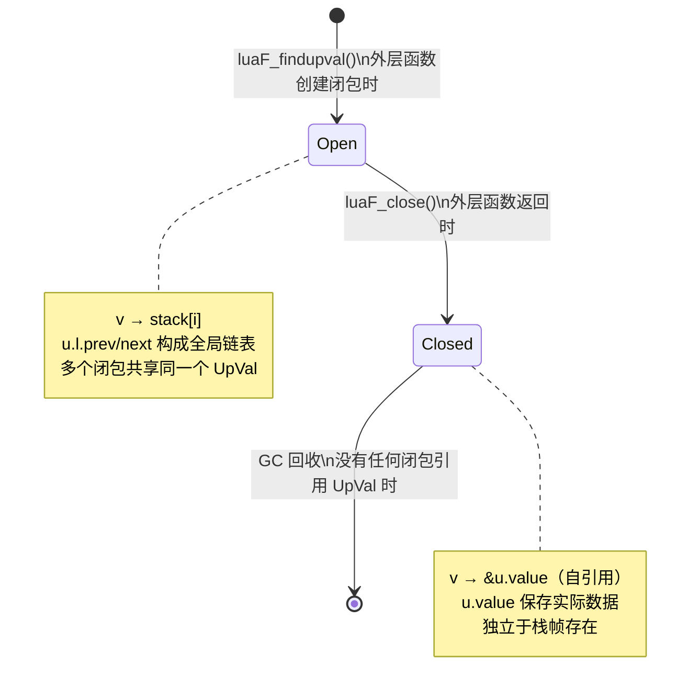
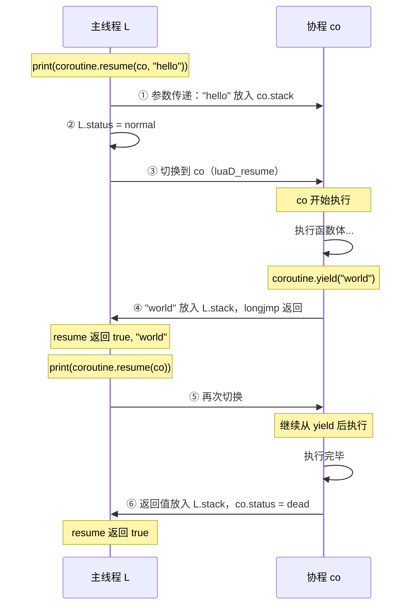

# 🔍 Lua 对象系统底层揭秘：给 Lua 开发者的内部视角

> **目标读者**：熟悉 Lua 语法（table、function、coroutine），但对 C 层实现了解有限的开发者  
> **学习目标**：从"会用 Lua"跃迁到"理解 Lua 为什么这样工作"  
> **阅读时间**：约 60~90 分钟（可按章节分次阅读）  
> **基于版本**：Lua 5.1.5  
> **参考文档**：[对象系统深度剖析](object_system_deep_dive.md)

<details>
<summary><b>📋 目录导航</b></summary>

- [阅读指南](#-阅读指南)
- [第一章：Function & Closure — 函数不只是代码](#-第一章function--closure--函数不只是代码)
  - [1.1 你以为的函数 vs 真实的函数](#11-你以为的函数-vs-真实的函数)
  - [1.2 CClosure vs LClosure：两种闭包的内部差异](#12-cclosure-vs-lclosure两种闭包的内部差异)
  - [1.3 UpVal：闭包如何"记住"外部变量](#13-upval闭包如何记住外部变量)
  - [1.4 UpVal 状态转换：从栈到堆的搬迁](#14-upval-状态转换从栈到堆的搬迁)
  - [1.5 多闭包共享变量的底层机制](#15-多闭包共享变量的底层机制)
  - [1.6 常见陷阱与最佳实践](#16-常见陷阱与最佳实践)
  - [1.7 自测问题](#17-自测问题)
- [第二章：Userdata — 把 C 对象带进 Lua 世界](#-第二章userdata--把-c-对象带进-lua-世界)
  - [2.1 为什么需要 Userdata？](#21-为什么需要-userdata)
  - [2.2 Light Userdata vs Full Userdata：本质区别](#22-light-userdata-vs-full-userdata本质区别)
  - [2.3 Full Userdata 的内存布局](#23-full-userdata-的内存布局)
  - [2.4 如何封装一个 C 对象](#24-如何封装一个-c-对象)
  - [2.5 `__gc` 终结器：析构函数的 Lua 实现](#25-__gc-终结器析构函数的-lua-实现)
  - [2.6 常见陷阱与最佳实践](#26-常见陷阱与最佳实践)
  - [2.7 自测问题](#27-自测问题)
- [第三章：Thread — 协程不是线程](#-第三章thread--协程不是线程)
  - [3.1 协程的本质：一个 GC 对象](#31-协程的本质一个-gc-对象)
  - [3.2 lua_State：协程的完整内部结构](#32-lua_state协程的完整内部结构)
  - [3.3 独立的「栈世界」：每个协程有自己的执行环境](#33-独立的栈世界每个协程有自己的执行环境)
  - [3.4 yield/resume 的控制流切换机制](#34-yieldresume-的控制流切换机制)
  - [3.5 协程与闭包的交互：UpVal 的跨协程行为](#35-协程与闭包的交互upval-的跨协程行为)
  - [3.6 协程的 GC 生命周期](#36-协程的-gc-生命周期)
  - [3.7 常见陷阱与最佳实践](#37-常见陷阱与最佳实践)
  - [3.8 自测问题](#38-自测问题)
- [知识图谱：三者的关联](#-知识图谱三者的关联)

</details>

---

## 📌 阅读指南

本文档遵循**渐进式揭示**原则，每个主题按以下层次展开：

```
Lua 层现象（你已知道的）
       ↓
C 层数据结构（为什么这样设计）
       ↓
内存布局（实际占用什么空间）
       ↓
GC 交互（生命周期如何管理）
       ↓
常见陷阱（实战中遇到的问题）
```

不需要 C 语言专家级别的知识——文中的 C 代码片段只用于说明概念，你只要能"读懂意思"即可。

---

## 🔩 第一章：Function & Closure — 函数不只是代码

### 1.1 你以为的函数 vs 真实的函数

先看一段你最熟悉的 Lua 代码：

```lua
local x = 10

local function add(y)
    return x + y   -- 引用了外部的 x
end

print(add(5))  --> 15
```

**你的认知**：`add` 是一个函数，`x` 是一个变量，函数"捕获"了变量……

**实际发生的事**：当 Lua 执行 `function add(y)` 这行时，它不只是编译了函数体，而是在**堆上分配了一个 `LClosure` 对象**。这个对象包含：

1. 指向**函数原型（`Proto`）** 的指针 — 存储字节码和常量（可以被多个函数实例共享）
2. 一组指向 **`UpVal` 对象** 的指针数组 — 每个 `UpVal` 代表一个被捕获的外部变量

```
你写的:          Lua 创建的:
─────────        ──────────────────────────────
function add     LClosure 对象 (堆上)
  return x+y  ─→  ├── p → Proto (字节码: GETUPVAL 0, ADD, RETURN)
end             └── upvals[0] → UpVal (指向 x 的当前值)
```

> 💡 **关键认知**：Lua 中每个 `function` 表达式都会在运行时创建一个新的 **Closure 对象**，而不是"编译出一段代码"。**函数值 = 代码 + 环境**。

---

### 1.2 CClosure vs LClosure：两种闭包的内部差异

Lua 有两种函数：用 Lua 写的函数，和用 C 写的函数（比如 `print`、`table.insert`）。它们在内部是不同的数据结构：

```c
// lobject.h — 简化展示

// C 闭包：封装一个 C 函数指针
typedef struct CClosure {
    CommonHeader;          // GC 对象头 (next, tt, marked)
    lu_byte isC;           // = 1，标识这是 C 闭包
    lu_byte nupvalues;     // 上值数量
    GCObject *gclist;      // GC 灰色链
    struct Table *env;     // 环境表
    lua_CFunction f;       // ← C 函数指针（如 &luaB_print）
    TValue upvalue[1];     // ← 上值数组，直接存储 TValue 值
} CClosure;

// Lua 闭包：封装一个 Lua 函数原型
typedef struct LClosure {
    CommonHeader;          // GC 对象头
    lu_byte isC;           // = 0，标识这是 Lua 闭包
    lu_byte nupvalues;     // 上值数量
    GCObject *gclist;
    struct Table *env;
    struct Proto *p;       // ← 函数原型（字节码 + 常量表）
    UpVal *upvals[1];      // ← 上值指针数组（指向 UpVal 对象）
} LClosure;
```

**二者的核心区别**对比：

| 对比维度 | `CClosure`（C 闭包） | `LClosure`（Lua 闭包） |
|---------|---------------------|----------------------|
| **函数体** | C 函数指针 `f` | `Proto *p`（字节码） |
| **上值存储方式** | `TValue upvalue[]`（**直接存值**） | `UpVal *upvals[]`（**存指针**） |
| **上值共享** | ❌ 每个闭包独立拥有上值 | ✅ 多个闭包可共享同一个 `UpVal` |
| **上值修改** | 只影响当前 CClosure | 所有共享该 `UpVal` 的闭包都能看到 |
| **创建时机** | `lua_pushcfunction` / `lua_pushcclosure` | 执行 `function` 关键字时 |
| **典型例子** | `print`、`io.open`、自定义 C 扩展 | 你写的所有 Lua 函数 |

**为什么 CClosure 直接存值而 LClosure 存指针？**

这不是偶然的设计。C 函数的"上值"通过 `lua_upvalueindex` 访问，语义上是**该闭包私有的状态**；而 Lua 函数的上值语义是**词法作用域内共享的变量**——多个内部函数可以共同修改同一个外部变量，所以需要通过 `UpVal` 对象间接引用来实现共享。

```lua
-- 这种共享修改在 Lua 中很常见:
function make_pair()
    local v = 0
    local function set(x) v = x end  -- 捕获 v
    local function get() return v end -- 也捕获 v
    return set, get
    -- set 和 get 的 upvals[0] 都指向同一个 UpVal 对象!
end
```

---

### 1.3 UpVal：闭包如何"记住"外部变量

`UpVal` 是 Lua 闭包机制中最精妙的设计。它的数据结构如下：

```c
// lobject.h
typedef struct UpVal {
    CommonHeader;         // GC 对象头
    TValue *v;            // ← 当前有效的值指针（关键字段！）
    union {
        TValue value;     // 关闭状态下：变量实际存储在这里
        struct {
            struct UpVal *prev;   // 开放状态下：双向链表 prev
            struct UpVal *next;   // 开放状态下：双向链表 next
        } l;
    } u;
} UpVal;
```

`UpVal` 有两种状态，**理解这两种状态是理解闭包的关键**：

| 状态 | 触发条件 | `v` 指向哪里 | `u` 字段用途 |
|------|---------|-------------|-------------|
| **开放（Open）** | 被捕获变量仍在栈上（外层函数还活着） | 栈上的 `TValue` 格子 | `u.l.{prev, next}` 组成双向链表 |
| **关闭（Closed）** | 外层函数返回，栈帧销毁 | `&u.value`（自身内部） | `u.value` 存储变量的完整副本 |

用图来说明：

```
【外层函数执行中 — 开放状态】

  Lua 值栈:                   UpVal 对象 (堆):
  ┌──────────────┐            ┌──────────────┐
  │ stack[n]=42  │ ←──────── │ v            │  (v 指向栈格子)
  │              │            │ u.l.prev ─→ ...  (链表)
  │ ...其他局部变量│            │ u.l.next ─→ ...
  └──────────────┘            └──────────────┘

【外层函数返回后 — 关闭状态】

  栈帧已销毁!                 UpVal 对象 (堆):
                              ┌──────────────┐
                              │ v ─────────┐ │  (v 指向自身内部!)
                              │ u.value=42 ←─┘  (值已搬到堆上)
                              └──────────────┘
```

> 💡 **这就是闭包"活得比外层函数更长"的秘密**：当外层函数返回时，`UpVal` 将栈上的值复制到自身的 `u.value` 字段，然后把 `v` 改为指向自身 —— 从此独立于栈而存在。

---

### 1.4 UpVal 状态转换：从栈到堆的搬迁

状态转换发生在 `luaF_close()` 函数中，在函数返回时被调用：

```c
// lfunc.c
void luaF_close(lua_State *L, StkId level) {
    UpVal *uv;
    while (L->openupval != NULL &&
           (uv = ngcotouv(L->openupval))->v >= level) {
        
        L->openupval = uv->next;             // 从开放链表中摘除

        setobj(L, &uv->u.value, uv->v);     // ① 把栈上的值复制到 u.value
        uv->v = &uv->u.value;               // ② v 改为指向自身（关键!）
        luaC_linkupval(L, uv);               // ③ 通知 GC：这是一个独立对象
    }
}
```

步骤 ② `uv->v = &uv->u.value` 是整个机制的核心：**UpVal 变成了自引用**。之后无论哪个闭包通过 `v` 读写这个变量，实际上都在读写同一个堆内存地址，共享语义天然成立。



---

### 1.5 多闭包共享变量的底层机制

```lua
function make_counter()
    local count = 0

    local function increment()
        count = count + 1
        return count
    end

    local function reset()
        count = 0
    end

    return increment, reset
end

local inc, rst = make_counter()
print(inc())  --> 1
print(inc())  --> 2
rst()
print(inc())  --> 1  ← reset 的修改对 inc 可见！
```

底层结构如下：

```
make_counter 执行时（开放状态）:

  Lua 栈:
  ┌──────────────────┐
  │ count = 0        │ ← stack[n]
  └──────────────────┘
        ↑
        │ (两个闭包都指向同一个 UpVal)
        │
  ┌─────────┐     ┌──────────────────────┐
  │ UpVal   │     │ increment (LClosure) │
  │ v ──────┼──→  │   upvals[0] ─────────┼──↗
  │         │     └──────────────────────┘
  └─────────┘     ┌──────────────────────┐
                  │ reset (LClosure)     │
                  │   upvals[0] ─────────┼──↗
                  └──────────────────────┘

make_counter 返回后（关闭状态）:

  栈帧已销毁
  ┌─────────────┐
  │ UpVal       │  ← 两个闭包都指向这里
  │ v ────────┐ │
  │ u.value=0 ←─┘  ← inc 和 rst 操作的是同一个内存!
  └─────────────┘
```

---

### 1.6 常见陷阱与最佳实践

#### 陷阱一：循环中的闭包捕获

这是 Lua 开发者最常遇到的闭包陷阱：

```lua
-- ❌ 经典错误：期望每个函数记住不同的 i
local funcs = {}
for i = 1, 3 do
    funcs[i] = function() print(i) end
end
funcs[1]()  --> 4（而不是期望的 1）
funcs[2]()  --> 4
funcs[3]()  --> 4
```

**解释**：Lua 5.1 的 `for` 循环中，`i` 是一个单一的局部变量，三个闭包捕获的是**同一个 `UpVal`**。当循环结束后，该 `UpVal` 被关闭，其中存储的是 `i` 的最终值（循环结束后 `i = 4`）。

```lua
-- ✅ 修复方法 1：创建新的局部变量（为每次迭代创建独立 UpVal）
local funcs = {}
for i = 1, 3 do
    local j = i          -- j 是每次迭代的新变量 → 新 UpVal
    funcs[i] = function() print(j) end
end
funcs[1]()  --> 1 ✓

-- ✅ 修复方法 2：用立即执行函数
local funcs = {}
for i = 1, 3 do
    funcs[i] = (function(j)
        return function() print(j) end
    end)(i)  -- i 作为参数传入，成为内层函数的 upvalue
end
```

> 💡 **根本原因**：`UpVal` 是按**变量**（而非按**值**）捕获的。每次迭代创建一个新的局部变量 `j`，就意味着创建了一个新的 `UpVal` 对象，闭包自然"记住"了不同的值。

#### 陷阱二：在循环中大量创建闭包

```lua
-- ❌ 每次循环都分配一个新的 LClosure + UpVal（GC 压力大）
for i = 1, 100000 do
    table.sort(data, function(a, b) return a > b end)
end

-- ✅ 把闭包提到循环外，复用同一个对象
local desc_cmp = function(a, b) return a > b end
for i = 1, 100000 do
    table.sort(data, desc_cmp)
end
```

#### 最佳实践：缓存常用的上值为局部变量

```lua
-- 在热路径代码中，将常用全局变量缓存为局部变量
-- 原因：局部变量通过寄存器访问（OP_MOVE），全局变量需要表查找（OP_GETGLOBAL）

-- ❌ 每次都查全局表
for i = 1, 1000000 do
    math.sin(i)      -- 每次都触发 OP_GETGLOBAL "math" + OP_GETTABLE "sin"
end

-- ✅ 本地缓存，直接走 UpVal
local sin = math.sin
for i = 1, 1000000 do
    sin(i)           -- OP_GETUPVAL，比全局查找快约 30%
end
```

---

### 1.7 自测问题

| # | 问题 | 提示 |
|---|------|------|
| 1 | `CClosure` 和 `LClosure` 存储上值的方式有何本质不同？为什么要这样设计？ | 直接存值 vs 存指针；共享语义 |
| 2 | 一个 `UpVal` 从 Open 变为 Closed 的触发条件是什么？关键语句 `uv->v = &uv->u.value` 的含义是？ | 外层函数返回；自引用 |
| 3 | 为什么循环中创建的闭包可能都"看到同一个值"？如何修复？ | 同一 UpVal；创建新局部变量 |
| 4 | 假设两个闭包 A 和 B 共享同一个 `UpVal`，当 A 修改该变量时，B 能立即看到变化吗？为什么？ | v 指向同一内存地址 |
| 5 | `lua_pushcclosure(L, f, n)` 和 `lua_pushcfunction(L, f)` 有什么区别？ | 带不带上值；CClosure vs 裸函数 |

---

## 📦 第二章：Userdata — 把 C 对象带进 Lua 世界

### 2.1 为什么需要 Userdata？

你在 Lua 中使用文件时这样写：

```lua
local f = io.open("data.txt", "r")
print(type(f))                -- "userdata"
local content = f:read("*a")  -- 调用方法
f:close()
```

`f` 是什么类型？它不是 table，不是 string，也不是 number。它是一个 **`userdata`**——一个 Lua 不知道如何解析其内容、但受 GC 管理的 C 数据块。

**Userdata 解决的核心问题**：如何让 Lua 管理一个 C 语言中的资源（文件句柄、socket、数据库连接等），使其：
- 能被 GC 自动追踪生命周期
- 能绑定方法（通过 metatable）
- 能在销毁时执行清理逻辑（通过 `__gc`）

---

### 2.2 Light Userdata vs Full Userdata：本质区别

Lua 有两种 Userdata，很多开发者对它们的区别感到困惑：

| 对比维度 | `light userdata` | `full userdata` |
|---------|-----------------|----------------|
| **类型标签** | `LUA_TLIGHTUSERDATA` | `LUA_TUSERDATA` |
| **本质** | 裸 `void *` 指针 | 带 GC 头的内存块 |
| **GC 管理** | ❌ Lua **不**管理内存 | ✅ Lua 负责分配和回收 |
| **元表** | ❌ 只能设置全局共享元表 | ✅ 每个实例可有独立元表 |
| **`__gc` 终结器** | ❌ 不支持 | ✅ 支持 |
| **内存分配者** | C 代码（Lua 不知道大小） | Lua（通过 `lua_newuserdata`） |
| **C API 创建** | `lua_pushlightuserdata(L, ptr)` | `lua_newuserdata(L, size)` |
| **适用场景** | 不需要 GC 管理的 C 指针 | 需要 GC 管理的 C 资源 |
| **内存开销** | 仅一个指针大小 | 一个结构体头 + 数据 |

**记忆口诀**：
- `light userdata` = **轻量**，只是一个地址，Lua 完全不管内存，只是让这个指针能放进 Lua 值
- `full userdata` = **完整**，Lua 分配了内存，追踪了引用，会在没人用时调用 `__gc` 清理

```lua
-- Light userdata 的典型用途：C 指针传递（无 GC 需求）
local ptr = ffi_get_static_buffer()  -- 返回 light userdata
-- Lua 只是"持有"这个指针，不负责释放

-- Full userdata 的典型用途：资源对象
local conn = db.connect(host, port)  -- 返回 full userdata
-- conn 离开作用域后，GC 会调用 __gc 关闭数据库连接
```

---

### 2.3 Full Userdata 的内存布局

`Full Userdata` 在内存中的布局和 `TString`（Lua 字符串）如出一辙——都是"一个头部结构体 + 紧跟其后的原始数据"：

```c
// lobject.h
typedef union Udata {
    L_Umaxalign dummy;   // 确保最大对齐
    struct {
        CommonHeader;              // GC 对象头（next, tt, marked）
        struct Table *metatable;   // 元表
        struct Table *env;         // 环境表
        size_t len;                // 用户数据的字节数
    } uv;
} Udata;
```

```
Full Userdata 的完整内存布局：

  低地址                                               高地址
  ┌──────────────┬─────────────┬──────────┬──────┬─────────────────────┐
  │ CommonHeader │  metatable  │   env    │ len  │   用户数据区域        │
  │ (GC对象头)   │  (Table*)   │ (Table*) │(大小)│  (len 字节，你的数据) │
  │   ~6 字节    │   8 字节    │  8 字节  │ 8字节│   可以放任意 C 结构体 │
  └──────────────┴─────────────┴──────────┴──────┴─────────────────────┘
  ↑                                                    ↑
  Udata 结构体开始                          lua_touserdata() 返回这里
  （Lua 内部持有这个指针）                  （C 代码持有这个指针）
```

`lua_newuserdata(L, size)` 分配的是 `sizeof(Udata) + size` 字节，返回给 C 代码的指针是**用户数据区域的起始地址**（紧跟在 `Udata` 结构体之后）。

---

### 2.4 如何封装一个 C 对象

以封装一个简单的"TCP 连接"结构体为例，演示完整流程：

**C 层实现**：

```c
// tcp_module.c

// 1. 定义 C 结构体
typedef struct {
    int fd;           // socket 文件描述符
    char host[64];    // 连接的主机名
    int port;         // 端口
    int connected;    // 是否已连接
} TcpConn;

#define TCPCONN_MT "TcpConn"  // 元表名（注册表中的键）

// 2. 创建连接（构造函数）
static int tcp_connect(lua_State *L) {
    const char *host = luaL_checkstring(L, 1);
    int port = (int)luaL_checkinteger(L, 2);

    // ① 分配 Full Userdata（Lua 管理这块内存）
    TcpConn *conn = (TcpConn *)lua_newuserdata(L, sizeof(TcpConn));

    // ② 初始化 C 结构体
    conn->fd = do_connect(host, port);  // 实际建立连接的函数
    strncpy(conn->host, host, 63);
    conn->port = port;
    conn->connected = (conn->fd >= 0);

    // ③ 设置元表（让这个 userdata 有方法）
    luaL_getmetatable(L, TCPCONN_MT);
    lua_setmetatable(L, -2);

    return 1;  // 返回 userdata
}

// 3. 方法：发送数据
static int tcp_send(lua_State *L) {
    // luaL_checkudata 验证类型并返回用户数据指针
    TcpConn *conn = (TcpConn *)luaL_checkudata(L, 1, TCPCONN_MT);

    if (!conn->connected)
        return luaL_error(L, "connection is closed");

    size_t len;
    const char *data = luaL_checklstring(L, 2, &len);
    int sent = do_send(conn->fd, data, len);

    lua_pushinteger(L, sent);
    return 1;
}

// 4. 终结器：GC 时自动关闭连接
static int tcp_gc(lua_State *L) {
    TcpConn *conn = (TcpConn *)lua_touserdata(L, 1);
    if (conn->connected) {
        close(conn->fd);       // 清理系统资源
        conn->connected = 0;
        // 不需要 free(conn)!  Lua 会处理 Udata 的内存
    }
    return 0;
}

// 5. 注册模块
static const luaL_Reg tcp_methods[] = {
    {"send",  tcp_send},
    {"close", tcp_close},
    {NULL, NULL}
};

int luaopen_tcp(lua_State *L) {
    // 创建元表并注册到注册表（用 TCPCONN_MT 作为键）
    luaL_newmetatable(L, TCPCONN_MT);

    // mt.__index = mt（让 conn:send() 等方法调用可以找到方法）
    lua_pushvalue(L, -1);
    lua_setfield(L, -2, "__index");

    // 注册方法
    luaL_register(L, NULL, tcp_methods);

    // 注册 __gc 终结器
    lua_pushcfunction(L, tcp_gc);
    lua_setfield(L, -2, "__gc");

    // 注册构造函数到全局空间
    lua_pushcfunction(L, tcp_connect);
    lua_setglobal(L, "tcp_connect");

    return 0;
}
```

**Lua 层使用**：

```lua
local conn = tcp_connect("127.0.0.1", 8080)
print(type(conn))   -- "userdata"

conn:send("Hello")  -- 调用 C 函数 tcp_send
conn:close()        -- 显式关闭

-- conn 超出作用域后被 GC 发现，自动调用 tcp_gc
-- 即使忘记调用 conn:close()，资源也不会泄漏
```

**整个对象的内存和引用关系**：

```
注册表（Registry）:
  "TcpConn" → 元表 (Table)
                ├── __index → 元表自身
                ├── send    → CClosure(tcp_send)
                ├── close   → CClosure(tcp_close)
                └── __gc    → CClosure(tcp_gc)

Full Userdata (堆):
  ┌─────────────────────────────────────┐
  │ Udata 头部                           │
  │   metatable ─────────────────────→  元表（上方）
  │   len = sizeof(TcpConn)             │
  ├─────────────────────────────────────┤
  │ TcpConn 数据区域 (用户数据)           │
  │   fd = 5                            │
  │   host = "127.0.0.1"               │
  │   port = 8080                       │
  │   connected = 1                     │
  └─────────────────────────────────────┘
  ↑
  lua_touserdata() 返回这里
```

---

### 2.5 `__gc` 终结器：析构函数的 Lua 实现

`__gc` 是 Lua 中最接近 C++ 析构函数的机制，但有几个重要的差异：

**GC 回收 Full Userdata 的完整过程**（`lgc.c`）：

```
阶段 1: 标记阶段
  GC 发现 Userdata 不可达
  → 不立即删除，而是放入"待终结链表"(tmudata)
  
阶段 2: 终结阶段（原子操作）
  → 将 Userdata 暂时变回"可达"（resurrection）
  → 调用 __gc(userdata) 元方法
  → __gc 执行期间，Userdata 的 C 数据仍然有效

阶段 3: 清扫阶段（下一个 GC 周期）
  → 确认 Userdata 确实不可达（没有在 __gc 中被"救活"）
  → 释放内存
```

**关键注意事项**：

```lua
-- ✅ __gc 中可以安全做的事
local function my_gc(self)
    close_handle(self.handle)    -- 关闭系统资源
    log("object collected")       -- 记录日志（注意：io 可能已关闭）
end

-- ⚠️ __gc 调用顺序不确定
-- 如果多个 userdata 同时变得不可达，__gc 的调用顺序无法保证
-- 不要在 __gc 中依赖其他 userdata 的存在

-- ⚠️ __gc 中产生的错误会被静默忽略（Lua 5.1 行为）
-- 建议在 __gc 中捕获所有错误
local function safe_gc(self)
    local ok, err = pcall(function()
        do_cleanup(self)
    end)
    if not ok then
        -- 记录到某处，但无法向外抛出
    end
end

-- ❌ 不要在 __gc 中访问可能已被回收的其他 Lua 对象
local function bad_gc(self)
    some_table[self] = nil  -- 危险！some_table 可能也在同一批被回收
end
```

**`__gc` 与显式 `close` 方法的关系**：

```lua
-- 推荐模式：同时支持显式关闭和 GC 自动关闭
-- （类似 Python 的 with 语句 + __del__ 的组合）

-- C 端
static int conn_close(lua_State *L) {
    TcpConn *conn = luaL_checkudata(L, 1, TCPCONN_MT);
    if (conn->connected) {           // 检查是否已关闭（幂等）
        close(conn->fd);
        conn->connected = 0;
    }
    return 0;
}

// __gc 复用同一个 close 函数（幂等调用是关键）
// tcp_gc 实现与 conn_close 相同或直接调用 conn_close
```

---

### 2.6 常见陷阱与最佳实践

#### 陷阱一：类型验证不严格

```c
// ❌ 危险：没有验证 userdata 类型
static int bad_method(lua_State *L) {
    void *p = lua_touserdata(L, 1);  // 任何 userdata 都能通过!
    TcpConn *conn = (TcpConn *)p;    // 可能是完全不同类型的 userdata
    // 如果误传了 io.open() 的 File userdata，这里会读取错误内存
    return 0;
}

// ✅ 正确：使用 luaL_checkudata 验证元表
static int safe_method(lua_State *L) {
    // 如果类型不匹配，luaL_checkudata 会抛出 Lua 错误
    TcpConn *conn = (TcpConn *)luaL_checkudata(L, 1, TCPCONN_MT);
    return 0;
}
```

#### 陷阱二：在 C 层保存 Userdata 指针但不持有引用

```c
// ❌ 危险：在 C 全局变量中保存 userdata 指针，但没有告诉 GC
static TcpConn *g_conn = NULL;  // C 全局变量（GC 不知道这里有引用）

static int set_global_conn(lua_State *L) {
    g_conn = luaL_checkudata(L, 1, TCPCONN_MT);
    return 0;
    // 问题：如果 Lua 侧没有保持对 conn 的引用，
    // GC 认为它不可达，会调用 __gc 并释放内存
    // g_conn 变成悬空指针!
}

// ✅ 正确：通过注册表告诉 Lua"我在用这个对象"
static int set_global_conn(lua_State *L) {
    luaL_checkudata(L, 1, TCPCONN_MT);
    
    // 将 userdata 存入注册表（使用整数 key）
    lua_pushvalue(L, 1);                 // 复制 userdata 到栈顶
    int ref = luaL_ref(L, LUA_REGISTRYINDEX);  // 存入注册表，返回 ref
    
    // 之后通过 ref 获取：
    // lua_rawgeti(L, LUA_REGISTRYINDEX, ref);
    // 不再需要时释放：luaL_unref(L, LUA_REGISTRYINDEX, ref);
    
    return 0;
}
```

#### 最佳实践总结

```lua
-- ✅ 封装资源对象用 Full Userdata（有 GC 保护）
-- ✅ 传递 C 静态数据（如常量指针）用 Light Userdata
-- ✅ 为每种 C 类型创建独立的具名元表（TCPCONN_MT、FILE_MT等）
-- ✅ __gc 中的清理逻辑要设计成幂等的（可以被调用多次）
-- ✅ 在 C 端保存 Lua 对象引用时，通过注册表告知 GC
```

---

### 2.7 自测问题

| # | 问题 | 提示 |
|---|------|------|
| 1 | `lua_touserdata` 和 `luaL_checkudata` 有什么区别？在方法实现中应该用哪个？ | 类型验证；安全性 |
| 2 | Full Userdata 的用户数据区域和 `Udata` 结构体在内存中是如何排列的？ | 紧跟结构体之后；内存布局 |
| 3 | 为什么在 `__gc` 中不需要（也不应该）`free` 用户数据的内存？ | Lua 负责 Udata 内存 |
| 4 | 如果一个 C 全局变量持有 userdata 的指针，Lua 的 GC 会怎么处理该 userdata？ | GC 不知道 C 全局变量；悬空指针风险 |
| 5 | `userdata` 的 `__gc` 终结器调用发生在几个 GC 周期内？为什么需要两个周期？ | 终结 + 确认；resurrection 问题 |

---

## 🧵 第三章：Thread — 协程不是线程

### 3.1 协程的本质：一个 GC 对象

Lua 的协程有一个经常被忽视的特性：

```lua
local co = coroutine.create(function() coroutine.yield() end)
print(type(co))  -- "thread"
```

`type()` 返回 `"thread"`，但这和操作系统的线程没有任何关系。在 Lua 内部，**一个协程就是一个 `lua_State` 类型的 GC 对象**——它和 `Table`、`Closure`、`Userdata` 一样，都有 `CommonHeader`，都在 GC 的追踪之下：

```c
// lstate.h（简化）
struct lua_State {
    CommonHeader;   // ← 是的！lua_State 本身就是一个 GC 对象！
    lu_byte status;
    // ... 其余字段
};
```

这意味着：**协程不被引用时会被 GC 回收，就像 Table 一样**。

```lua
-- ⚠️ 容易被忽视的陷阱
local function create_and_lose()
    local co = coroutine.create(function()
        while true do coroutine.yield() end
    end)
    coroutine.resume(co)   -- 首次 resume，协程进入 suspended 状态
    -- co 的局部引用在函数返回时消失
    -- 如果没有其他地方持有 co 的引用...
end

create_and_lose()
collectgarbage()   -- co 被 GC 回收！
-- 协程被回收意味着它永远不会再被 resume
```

---

### 3.2 lua_State：协程的完整内部结构

每个 `lua_State` 对象（每个协程）都拥有自己**独立的执行环境**：

```c
// lstate.h — lua_State 所有字段的分类概览
struct lua_State {
    // ──────────── GC 对象头 ────────────
    CommonHeader;                    // next, tt, marked

    // ──────────── 协程状态 ────────────
    lu_byte status;                  // LUA_OK / LUA_YIELD / LUA_ERR*

    // ──────────── 值栈（独立） ────────
    StkId stack;                     // 栈底指针（动态分配的数组）
    StkId stack_last;                // 栈末尾（stack + stacksize - EXTRA_STACK）
    StkId top;                       // 当前栈顶（下一个可写入位置）
    StkId base;                      // 当前函数的栈基址
    int stacksize;                   // 当前栈容量

    // ──────────── 调用栈（独立） ────────
    CallInfo *base_ci;               // CallInfo 数组基址
    CallInfo *ci;                    // 当前 CallInfo（当前函数）
    CallInfo *end_ci;                // 数组末尾
    int size_ci;                     // CallInfo 数组大小

    // ──────────── 执行状态（独立） ────────
    const Instruction *savedpc;      // 当前 PC（字节码指针）

    // ──────────── 共享资源 ────────
    global_State *l_G;               // ← 指向共享的全局状态

    // ──────────── 错误处理（独立） ────────
    struct lua_longjmp *errorJmp;    // setjmp/longjmp 跳转点

    // ──────────── 上值（独立） ────────
    GCObject *openupval;             // 该协程的开放 UpVal 链表

    // ──────────── 调试 ────────
    lua_Hook hook;
    lu_byte hookmask;
    int hookcount;
};
```

**独立 vs 共享的资源分类**：

```
每个协程独立拥有:             所有协程共同共享:
┌─────────────────────┐      ┌─────────────────────────┐
│ • 值栈 (stack)       │      │ • 全局状态 (global_State)│
│   ↑ 局部变量和临时值 │      │   ↑ 字符串表             │
│                     │      │   ↑ 内存分配器            │
│ • 调用栈 (CallInfo)  │      │   ↑ GC 状态             │
│   ↑ 函数调用历史    │      │                         │
│                     │      │ • 字符串驻留池            │
│ • 程序计数器 (PC)    │      │   ↑ 所有字符串值         │
│   ↑ 当前执行位置    │      │                         │
│                     │      │ • 注册表                  │
│ • 开放 UpVal 链表   │      │   ↑ C 代码共享数据        │
│   ↑ 本协程闭包的upval│      │                         │
│                     │      │ • 元表数组 (mt[])         │
│ • 错误跳转点        │      │   ↑ number/string 等类型  │
└─────────────────────┘      └─────────────────────────┘
```

---

### 3.3 独立的「栈世界」：每个协程有自己的执行环境

这是协程区别于线程调度的核心实现细节。创建一个协程时，Lua 会为其分配一块独立的值栈内存（初始约 2KB）：

```
程序启动时（只有主协程）：

global_State
  ├── mainthread → lua_State(主)
  │                 ├── stack: [TValue TValue TValue... ]  (约 2KB)
  │                 ├── ci:    [CallInfo CallInfo...]       (约 256B)
  │                 └── l_G → global_State (指回共享状态)

coroutine.create(f) 之后：

global_State （通过 GC 对象链表追踪所有协程）
  ├── mainthread → lua_State(主)     lua_State(协程1)
  │                 ├── stack: [...]   ├── stack: [...] (独立分配)
  │                 ├── ci:    [...]   ├── ci:    [...]
  │                 └── l_G ──────────┘──└── l_G ──┘（指向同一 global_State）
```

**栈的动态扩容**：当函数调用深度超过当前栈容量时，Lua 会 `realloc` 扩容（翻倍扩容策略）。注意：扩容后所有 `StkId` 指针（包括 `UpVal.v`！）都需要重新计算偏移，这是 `luaD_reallocstack` 中最复杂的部分。

---

### 3.4 yield/resume 的控制流切换机制

理解 yield/resume 的关键是：**它们不切换 OS 线程，只切换 lua_State 结构体**。

```
coroutine.resume(co) 的内部流程：

调用者（主线程 L）:          被恢复协程（co）:
  lua_State L                  lua_State co
  ├── stack: [...]              ├── stack: [...]
  ├── ci → CallInfo(resume)     ├── savedpc → 上次 yield 的位置
  └── status: running           └── status: LUA_YIELD → LUA_OK

① L.status = "normal"（L 暂停，等待 co 完成）
② 将 resume 的参数从 L.stack 移动到 co.stack
③ luaD_resume(co) ← 切换到 co 的执行上下文
④ 在 co 的栈上调用 co.stack[base] 里的函数
⑤ co 开始执行...
```

```
coroutine.yield() 的内部流程：

co 执行到 yield:
① lua_yield 将 yield 的参数留在 co.stack
② co.status = LUA_YIELD
③ 通过 longjmp 跳回到 luaD_resume 的调用点（在 L 的调用栈中）
④ luaD_resume 将结果从 co.stack 移回 L.stack
⑤ L.status = "running"（L 恢复运行）
⑥ resume 函数正常返回，L 继续执行
```

用时序图表示：



---

### 3.5 协程与闭包的交互：UpVal 的跨协程行为

协程和闭包的交互是一个容易出错的地方。关键规则：

**规则 1：`UpVal` 属于创建它的那个协程的开放链表**

```lua
-- 主线程中创建的闭包
local shared_val = 0
local function write(v) shared_val = v end
local function read()   return shared_val  end

-- 在协程中调用
local co = coroutine.create(function()
    write(42)           -- 修改 shared_val
    coroutine.yield()
    print(read())       -- 读取 shared_val
end)

coroutine.resume(co)   -- write(42) 执行
write(100)             -- 主线程修改（会影响 co 看到的值）
coroutine.resume(co)   -- 打印 100（而不是 42！）
```

**互相修改可见**，因为 `write` 和 `read` 捕获的 `UpVal` 是同一个对象，不区分哪个协程在使用它。

**规则 2：协程返回时，该协程栈上变量的 UpVal 被关闭**

```lua
-- 场景：在协程内创建闭包并传出
local co = coroutine.create(function()
    local x = 10
    local getter = function() return x end

    coroutine.yield(getter)  -- 把 getter 传出协程
    -- ⚠️ yield 不会触发 luaF_close！
    -- x 仍然在 co.stack 上，UpVal 仍然是开放状态

    x = 20
    coroutine.yield()        -- 再次 yield
end)

local ok, getter = coroutine.resume(co)
print(getter())              -- 打印 10 ✓（此时 x 仍在 co.stack 上）

coroutine.resume(co)         -- co 执行 x = 20 后 yield
print(getter())              -- 打印 20! ← UpVal 仍然开放，修改通过 v 指针可见
```

> 💡 **核心洞察**：**`yield` 不触发 `luaF_close`**。只有当协程执行完毕（函数返回）时，协程栈上的变量对应的 UpVal 才会被关闭。挂起的协程保留其完整的栈状态。

---

### 3.6 协程的 GC 生命周期

协程被 GC 追踪，其生命周期遵循以下规则：

```
协程的 GC 生命周期：

1. 创建
   coroutine.create(f)
   → 分配 lua_State + 独立 stack + 独立 CallInfo
   → 通过 CommonHeader 链入 GC 根链表

2. 存活条件（以下任一成立）
   ✓ 有 Lua 变量持有这个协程（local co = ...）
   ✓ 协程正在运行中（status = running）
   ✓ 协程在某个 table 中，而该 table 是可达的

3. 死亡条件（全部满足）
   ✗ 没有任何 Lua 变量或表引用这个协程
   ✗ 协程不在运行
   （协程可以是 suspended 状态被 GC！）

4. 被回收时
   → GC 释放 co.stack（独立分配的那块内存）
   → GC 释放 co.base_ci（CallInfo 数组）
   → 关闭该协程的所有开放 UpVal（调用 luaF_close）
   → 释放 lua_State 结构体
```

**常见的协程内存泄漏模式**：

```lua
-- ❌ 泄漏：协程创建后一直保持 suspended，且有全局引用
local active_jobs = {}  -- 全局 table（永远可达）

function create_job(f)
    local co = coroutine.create(f)
    table.insert(active_jobs, co)  -- 放入全局 table
    return co
end

-- 如果忘记从 active_jobs 中移除已完成（dead）的协程：
-- → 这些协程的栈内存永远不会被回收
-- → 随着时间增长，active_jobs 中积累大量 dead 协程
```

```lua
-- ✅ 正确：完成后从 table 中移除
function run_job(co, ...)
    local ok, result = coroutine.resume(co, ...)
    if coroutine.status(co) == "dead" then
        -- 从 active_jobs 中找到并移除 co
        -- 此后 co 引用消失，GC 可以回收它
    end
    return ok, result
end
```

---

### 3.7 常见陷阱与最佳实践

#### 陷阱一：在协程中使用 `pcall` 捕获 yield

```lua
-- ❌ 在 Lua 5.1 中不能跨越 pcall 边界 yield
local co = coroutine.create(function()
    pcall(function()
        coroutine.yield()  -- Lua 5.1: 错误! "attempt to yield across metamethod/C-call boundary"
    end)
end)

coroutine.resume(co)  -- 错误!

-- ✅ Lua 5.1 的解决方案：不在 pcall 边界内 yield
-- 或者使用 coroutine.wrap 并在 C 层使用 lua_pcall 配合 setjmp
```

> 这个限制在 Lua 5.2+ 已被解除（引入了 continuation 机制）。

#### 陷阱二：忘记检查协程状态

```lua
-- ❌ 对 dead 协程 resume 会返回错误但不抛异常
local co = coroutine.create(function() return 1 end)
coroutine.resume(co)  -- ok=true, val=1
coroutine.resume(co)  -- ok=false, val="cannot resume dead coroutine"（没有报错！）

-- ✅ 始终检查 resume 的返回值
local function safe_resume(co, ...)
    local ok, result = coroutine.resume(co, ...)
    if not ok then
        error("coroutine failed: " .. tostring(result), 2)
    end
    return result
end
```

#### 陷阱三：协程栈溢出

```lua
-- 每个协程的初始栈大小为 BASIC_STACK_SIZE = 40 个 TValue = 约 480 字节
-- 深度递归会触发栈扩容（最大 LUAI_MAXCSTACK = 200 层 C 调用）

-- ⚠️ 协程栈溢出不会像系统栈溢出那样崩溃，而是抛出 Lua 错误
-- 这是协程相对于系统线程的安全优势之一
local co = coroutine.create(function()
    local function inf() return inf() end  -- 无限递归
    inf()
end)
local ok, err = coroutine.resume(co)
print(ok)   -- false
print(err)  -- "stack overflow"（可以捕获！）
```

#### 最佳实践

```lua
-- ✅ 用 coroutine.wrap 简化"生成器"模式
local function range(n)
    return coroutine.wrap(function()
        for i = 1, n do
            coroutine.yield(i)
        end
    end)
end

for i in range(5) do
    print(i)  -- 1, 2, 3, 4, 5
end
-- wrap 会自动管理协程的引用，不会泄漏

-- ✅ 协程池模式（避免频繁创建销毁）
local pool = {}
local function get_coroutine(f)
    -- 复用空闲协程（实际上 Lua 没有原生重置机制，
    -- 但可以通过让协程运行一个"dispatcher"函数来实现复用）
    return coroutine.create(f)
end
```

---

### 3.8 自测问题

| # | 问题 | 提示 |
|---|------|------|
| 1 | `coroutine.create` 创建的协程，哪些资源是独立分配的，哪些是和主线程共享的？ | 见 3.2 节的分类表 |
| 2 | 如果 Lua 代码中没有任何变量持有一个 `suspended` 状态的协程，GC 会怎么处理它？ | GC 对象回收机制 |
| 3 | `coroutine.yield()` 调用时，协程栈上的变量对应的 UpVal 会被关闭吗？为什么？ | yield 不触发 luaF_close |
| 4 | 两个协程 A 和 B 都使用了同一个闭包 `f`，`f` 中修改的 upvalue 对两个协程都可见吗？ | UpVal 不隔离 |
| 5 | Lua 5.1 中为什么不能在 `pcall` 内部 `yield`？（从 C 调用栈和 longjmp 的角度解释） | setjmp 点的层级冲突 |

---

## 🕸️ 知识图谱：三者的关联

学完三章后，你已经理解了 Lua 对象系统中这三类对象的底层机制。让我们看看它们是如何相互关联的：

```
全局状态 (global_State)
  │
  ├─ GC 根链表（追踪所有对象）
  │    ├── lua_State (协程) ──────────── 第三章
  │    │    ├── stack: [TValue...]       ← 存放所有 Lua 值
  │    │    ├── openupval: UpVal链表     ← 第一章中的 UpVal
  │    │    └── ci: CallInfo链           ← 调用历史
  │    │
  │    ├── LClosure ─────────────────── 第一章
  │    │    ├── Proto (字节码)
  │    │    └── upvals[] → UpVal → 值   ← 连接闭包与变量
  │    │
  │    ├── CClosure ─────────────────── 第一章
  │    │    ├── f (C函数指针)
  │    │    └── upvalue[] (直接存值)
  │    │
  │    └── Udata (Full Userdata) ─────── 第二章
  │         ├── metatable → Table
  │         └── [用户数据区域]           ← C 结构体就在这里
  │
  └─ tmudata: 待 __gc 终结链表          ← 第二章的 __gc 机制在这里
```

**三者交互的典型场景**：协程 + 闭包 + Userdata 同时出现

```lua
-- 一个数据库查询的异步化示例
local db_conn = db.open("mydb")  -- Full Userdata（第二章）

local function fetch_async(query)  -- LClosure（第一章），捕获 db_conn
    return coroutine.wrap(function()  -- 协程（第三章）
        local result = db_conn:execute(query)  -- 使用 Userdata 的方法
        for row in result:each() do
            coroutine.yield(row)  -- 产生每一行
        end
    end)
end

for row in fetch_async("SELECT * FROM users") do
    process(row)
end

-- 当 db_conn 超出作用域：
-- 1. LClosure 的 UpVal(db_conn) 关闭 → db_conn Udata 引用消失
-- 2. GC 检测到 Udata 不可达
-- 3. 调用 __gc 关闭数据库连接
-- 4. 释放 Udata 内存
```

---

## 📚 延伸阅读

| 想深入了解 | 推荐文档 |
|-----------|---------|
| 闭包与 UpVal 完整实现 | [closure_implementation.md](closure_implementation.md) |
| 对象系统全貌（Table、TValue 等）| [object_system_deep_dive.md](object_system_deep_dive.md) |
| 元表与元方法的所有 17 种事件 | [metatable_mechanism.md](metatable_mechanism.md) |
| GC 三色标记算法 | [../gc/tri_color_marking.md](../gc/tri_color_marking.md) |
| `__gc` 终结器的 GC 内部机制 | [../gc/finalizer.md](../gc/finalizer.md) |
| 协程的完整实现细节 | [../runtime/coroutine.md](../runtime/coroutine.md) |
| 垃圾回收完全指南 | [../gc/wiki_gc.md](../gc/wiki_gc.md) |
| C API 设计与使用 | [../../questions/q_07_c_api.md](../../questions/q_07_c_api.md) |

---

<div align="center">

**📅 最后更新**：2026-04-05  
**📌 文档版本**：v1.0  
**🔖 基于 Lua 版本**：5.1.5  
**🎯 目标读者**：熟悉 Lua 语法，希望理解底层实现的开发者

</div>
