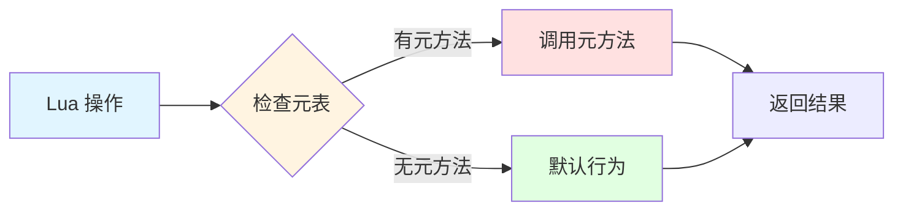
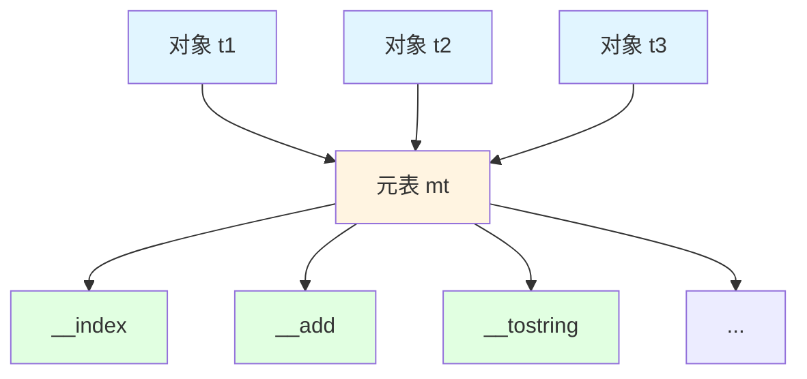
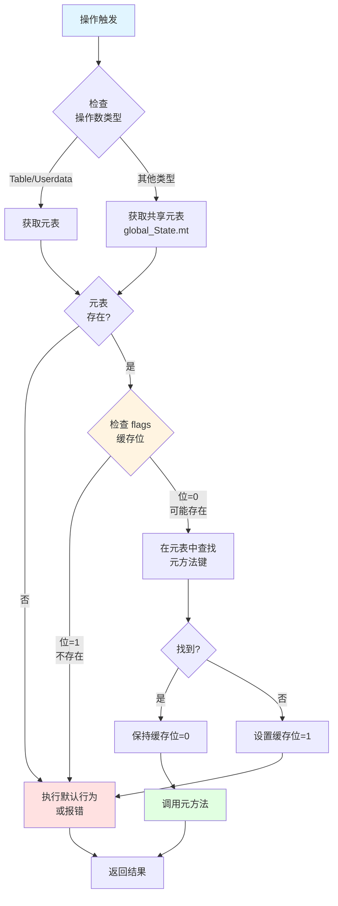
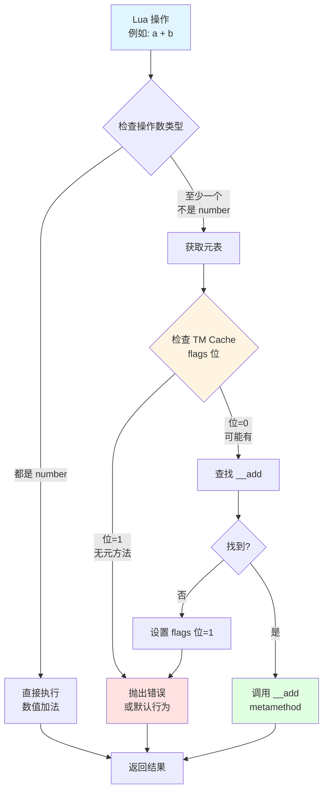

# 🎭 元表和元方法的实现

> **核心机制**：Lua 元编程基础 - 运算符重载、面向对象与动态行为定制

<details>
<summary><b>📋 快速导航</b></summary>

- [概述](#-概述)
- [设计哲学](#-设计哲学)
- [核心概念](#-核心概念)
- [元表数据结构](#-元表数据结构)
- [元方法类型](#-元方法类型)
- [元方法查找机制](#-元方法查找机制)
- [运算符重载](#-运算符重载)
- [面向对象编程](#-面向对象编程)
- [高级技巧](#-高级技巧)
- [性能分析](#-性能分析)
- [实战示例](#-实战示例)
- [调试技巧](#-调试技巧)
- [最佳实践](#-最佳实践)
- [相关模块](#-相关模块)

</details>

---

## 📋 概述

### 什么是元表？

**元表（Metatable）** 是 Lua 中一种特殊的表，用于定义和改变另一个表或 userdata 的行为。通过元表，可以实现：

- **运算符重载**：自定义 `+`、`-`、`*`、`==` 等运算符的行为
- **属性访问控制**：拦截表的读写操作
- **面向对象编程**：实现类、继承、多态
- **代理模式**：创建只读表、懒加载对象
- **类型转换**：自定义 `tostring()`、`#` 运算符

```lua
-- 元表基础示例
local t = {value = 10}
local mt = {
    __add = function(a, b)
        return {value = a.value + b.value}
    end,
    __tostring = function(t)
        return "MyObject(" .. t.value .. ")"
    end
}

setmetatable(t, mt)

local t2 = {value = 20}
setmetatable(t2, mt)

local t3 = t + t2           -- 调用 __add
print(t3.value)             -- 30
print(tostring(t))          -- MyObject(10)
```

### 元表的本质

从实现角度看，元表机制包含三个核心组成：

<table>
<tr>
<th width="30%">组成部分</th>
<th width="70%">说明</th>
</tr>

<tr>
<td><b>元表对象（Metatable）</b></td>
<td>
• 本质是普通的 Lua table<br/>
• 存储元方法（特殊键的函数）<br/>
• 通过 <code>setmetatable()</code> 关联到目标对象<br/>
• 一个元表可被多个对象共享
</td>
</tr>

<tr>
<td><b>元方法（Metamethod）</b></td>
<td>
• 特殊命名的函数（以 <code>__</code> 开头）<br/>
• 定义特定操作的行为<br/>
• 由虚拟机在特定时机自动调用<br/>
• 共 17 种标准元方法（Lua 5.1）
</td>
</tr>

<tr>
<td><b>元方法缓存（TM Cache）</b></td>
<td>
• 优化元方法查找性能<br/>
• 使用位标志快速检测元方法存在性<br/>
• 避免重复的表查找操作<br/>
• 自动失效和更新机制
</td>
</tr>
</table>

### 核心文件

| 文件 | 职责 | 关键函数 |
|------|------|----------|
| `ltm.c/h` | 元方法管理和查找 | `luaT_init()` - 初始化元方法名称<br/>`luaT_gettm()` - 获取元方法<br/>`luaT_gettmbyobj()` - 按对象获取<br/>`luaT_callTM()` - 调用元方法 |
| `lvm.c` | 元方法执行逻辑 | `luaV_gettable()` - 索引访问<br/>`luaV_settable()` - 索引赋值<br/>`call_binTM()` - 二元运算<br/>`call_orderTM()` - 比较运算 |
| `lapi.c` | C API 元表接口 | `lua_getmetatable()` - 获取元表<br/>`lua_setmetatable()` - 设置元表 |
| `ltable.c` | Table 元表存储 | `Table.metatable` 字段 |

---

## 🎯 设计哲学

### 1. 最小语法，最大灵活性

Lua 的元表机制体现了"机制而非策略"的设计理念：

```lua
-- Lua 不提供类的语法，但可以用元表实现
-- 方案1：原型继承
local Animal = {name = "Unknown"}
Animal.__index = Animal

function Animal:speak()
    print(self.name .. " makes a sound")
end

local dog = setmetatable({name = "Dog"}, Animal)
dog:speak()  -- Dog makes a sound

-- 方案2：类工厂
function class(base)
    local c = {}
    c.__index = c
    if base then
        setmetatable(c, {__index = base})
    end
    return c
end

-- 用户可以自由选择 OOP 风格
```

**优势**：
- ✅ **语法简洁**：只有 `setmetatable/getmetatable` 两个函数
- ✅ **零侵入性**：不改变表的内存布局
- ✅ **灵活扩展**：用户可实现各种编程范式
- ✅ **性能可控**：不需要元表时无额外开销

### 2. 统一的拦截点

所有可被元表拦截的操作都通过虚拟机的统一入口：



**统一处理的操作**：
- **算术运算**：`__add`、`__sub`、`__mul`、`__div`、`__mod`、`__pow`、`__unm`
- **比较运算**：`__eq`、`__lt`、`__le`
- **索引访问**：`__index`、`__newindex`
- **其他操作**：`__concat`、`__call`、`__tostring`、`__gc`、`__len`、`__metatable`

### 3. 性能优先的缓存策略

Lua 使用**位标志缓存**优化元方法查找：

```c
// ltm.h
typedef enum {
    TM_INDEX,
    TM_NEWINDEX,
    TM_GC,
    TM_MODE,
    TM_EQ,
    TM_ADD,
    TM_SUB,
    TM_MUL,
    TM_DIV,
    TM_MOD,
    TM_POW,
    TM_UNM,
    TM_LEN,
    TM_LT,
    TM_LE,
    TM_CONCAT,
    TM_CALL,
    TM_N  // 元方法数量
} TMS;

// Table 结构中的标志位
typedef struct Table {
    // ...
    lu_byte flags;  // 每位表示一个元方法是否存在
    // ...
} Table;
```

**缓存机制**：
1. 首次查找元方法时，设置对应的标志位
2. 后续检查直接读取标志位，避免表查找
3. 元表改变时自动失效缓存

---

## 💡 核心概念

### 元表与对象的关系



**关键点**：
- **一对多关系**：一个元表可被多个对象共享
- **非侵入性**：对象本身不存储元方法，只存储元表指针
- **动态绑定**：运行时可更改元表或元方法

### 元方法分类

<table>
<tr>
<th width="25%">类别</th>
<th width="35%">元方法</th>
<th width="40%">用途</th>
</tr>

<tr>
<td><b>算术运算</b></td>
<td>
<code>__add</code> 加法<br/>
<code>__sub</code> 减法<br/>
<code>__mul</code> 乘法<br/>
<code>__div</code> 除法<br/>
<code>__mod</code> 取模<br/>
<code>__pow</code> 幂运算<br/>
<code>__unm</code> 负号
</td>
<td>
运算符重载，实现自定义数值类型：<br/>
• 复数、分数<br/>
• 向量、矩阵<br/>
• 大整数
</td>
</tr>

<tr>
<td><b>比较运算</b></td>
<td>
<code>__eq</code> 相等<br/>
<code>__lt</code> 小于<br/>
<code>__le</code> 小于等于
</td>
<td>
自定义比较逻辑：<br/>
• 对象比较<br/>
• 排序规则<br/>
• 集合运算
</td>
</tr>

<tr>
<td><b>索引访问</b></td>
<td>
<code>__index</code> 读取<br/>
<code>__newindex</code> 写入
</td>
<td>
属性访问控制：<br/>
• 继承实现<br/>
• 只读表<br/>
• 懒加载<br/>
• 属性验证
</td>
</tr>

<tr>
<td><b>其他运算</b></td>
<td>
<code>__concat</code> 连接<br/>
<code>__len</code> 长度<br/>
<code>__call</code> 调用
</td>
<td>
特殊操作：<br/>
• 字符串拼接<br/>
• 自定义长度<br/>
• 函数对象
</td>
</tr>

<tr>
<td><b>生命周期</b></td>
<td>
<code>__gc</code> 垃圾回收<br/>
<code>__mode</code> 弱引用
</td>
<td>
资源管理：<br/>
• 终结器<br/>
• 弱引用表<br/>
• 资源清理
</td>
</tr>

<tr>
<td><b>元表保护</b></td>
<td>
<code>__metatable</code><br/>
<code>__tostring</code>
</td>
<td>
元表保护和调试：<br/>
• 隐藏元表<br/>
• 字符串表示
</td>
</tr>
</table>

### 元方法调用时机

```lua
-- 示例：各种元方法的触发时机
local mt = {
    __add = function(a, b) print("__add") return a.v + b.v end,
    __index = function(t, k) print("__index:", k) return nil end,
    __newindex = function(t, k, v) print("__newindex:", k, v) end,
    __call = function(t, ...) print("__call") end,
    __tostring = function(t) return "MyObject" end,
}

local obj = setmetatable({v = 10}, mt)

local x = obj + obj         -- 触发 __add
local y = obj.nonexist      -- 触发 __index（键不存在）
obj.newkey = 100            -- 触发 __newindex（键不存在）
obj()                       -- 触发 __call
print(obj)                  -- 触发 __tostring
```

### 关键术语

| 术语 | 英文 | 说明 |
|------|------|------|
| **元表** | Metatable | 定义对象行为的特殊表 |
| **元方法** | Metamethod | 元表中的特殊函数（`__` 开头） |
| **运算符重载** | Operator Overloading | 自定义运算符行为 |
| **元方法缓存** | TM Cache | 优化元方法查找的位标志 |
| **快速元方法** | Fast TM | 缓存在 Table.flags 中的元方法 |
| **回退** | Fallback | 无元方法时的默认行为 |

---

## 🏗️ 元表数据结构

### Table 中的元表字段

```c
// lobject.h
typedef struct Table {
    CommonHeader;           // GC 头部
    lu_byte flags;          // 元方法标志位（TM Cache）
    lu_byte lsizenode;      // 哈希部分大小的 log2
    struct Table *metatable; // 元表指针 ← 关键字段
    TValue *array;          // 数组部分
    Node *node;             // 哈希部分
    Node *lastfree;         // 最后一个空闲位置
    GCObject *gclist;       // GC 链表
    int sizearray;          // 数组部分大小
} Table;
```

**元表存储位置**：
- **Table**：`Table.metatable` 字段直接存储
- **Userdata**：`Udata.metatable` 字段
- **其他类型**：在 `global_State.mt[]` 数组中（共享元表）

### global_State 中的共享元表

```c
// lstate.h
typedef struct global_State {
    stringtable strt;       // 字符串表
    lua_Alloc frealloc;     // 内存分配器
    void *ud;               // 分配器的 userdata
    lu_byte currentwhite;   // GC 当前白色
    lu_byte gcstate;        // GC 状态
    int sweepstrgc;         // 字符串 GC 进度
    GCObject *rootgc;       // GC 根对象
    GCObject **sweepgc;     // GC 扫描指针
    GCObject *gray;         // 灰色对象链表
    GCObject *grayagain;    // 需要重新遍历的灰色对象
    GCObject *weak;         // 弱引用表链表
    GCObject *tmudata;      // 有终结器的 userdata
    Mbuffer buff;           // 临时缓冲区
    lu_mem GCthreshold;     // GC 阈值
    lu_mem totalbytes;      // 总内存使用量
    lu_mem estimate;        // 估计的内存使用量
    lu_mem gcdept;          // GC 债务
    int gcpause;            // GC 暂停参数
    int gcstepmul;          // GC 步进倍数
    lua_CFunction panic;    // panic 函数
    TValue l_registry;      // 注册表
    struct lua_State *mainthread; // 主线程
    UpVal uvhead;           // Upvalue 链表头
    struct Table *mt[NUM_TAGS];   // 基本类型的元表数组 ← 关键字段
    TString *tmname[TM_N];  // 元方法名称数组 ← 关键字段
} global_State;
```

**基本类型元表**：
```c
// NUM_TAGS = 9（8种类型 + 1）
// mt[LUA_TNIL]          → nil 的元表（通常为 NULL）
// mt[LUA_TBOOLEAN]      → boolean 的元表
// mt[LUA_TNUMBER]       → number 的元表
// mt[LUA_TSTRING]       → string 的元表（字符串方法）
// mt[LUA_TTABLE]        → table 的默认元表
// mt[LUA_TFUNCTION]     → function 的元表
// mt[LUA_TUSERDATA]     → userdata 的默认元表
// mt[LUA_TTHREAD]       → thread 的元表
```

### 元方法名称表

```c
// ltm.c
const char *const luaT_typenames[] = {
    "nil", "boolean", "userdata", "number",
    "string", "table", "function", "userdata", "thread",
    "proto", "upval"
};

// ltm.c: 元方法名称初始化
void luaT_init(lua_State *L) {
    static const char *const luaT_eventname[] = {  // 按 TMS 枚举顺序
        "__index", "__newindex",
        "__gc", "__mode", "__eq",
        "__add", "__sub", "__mul", "__div", "__mod",
        "__pow", "__unm", "__len",
        "__lt", "__le",
        "__concat", "__call"
    };
    
    int i;
    for (i = 0; i < TM_N; i++) {
        G(L)->tmname[i] = luaS_new(L, luaT_eventname[i]);
        luaS_fix(G(L)->tmname[i]);  // 固定字符串，防止 GC
    }
}
```

### 元方法标志位（TM Cache）

```c
// ltm.h
#define gfasttm(g,et,e) ((et) == NULL ? NULL : \
  ((et)->flags & (1u<<(e))) ? NULL : luaT_gettm(et, e, (g)->tmname[e]))

// 检查流程：
// 1. 如果 et == NULL（无元表），返回 NULL
// 2. 如果 et->flags 对应位被设置（元方法不存在），返回 NULL
// 3. 否则调用 luaT_gettm() 查找元方法
```

**标志位含义**：
- **位被设置（1）**：表示该元方法**不存在**
- **位未设置（0）**：可能存在，需要查找
- **优势**：避免对不存在的元方法进行表查找

### 内存布局示意

```
┌─────────────────────────────────────────────────────┐
│  Table 对象（有元表）                                │
├─────────────────────────────────────────────────────┤
│  CommonHeader (GC 头)                                │
├─────────────────────────────────────────────────────┤
│  flags = 0b10101000 (TM Cache)                      │
│    位0 (TM_INDEX):     0 → 可能有 __index           │
│    位1 (TM_NEWINDEX):  0 → 可能有 __newindex        │
│    位2 (TM_GC):        0 → 可能有 __gc              │
│    位3 (TM_MODE):      1 → 无 __mode                │
│    位4 (TM_EQ):        0 → 可能有 __eq              │
│    位5 (TM_ADD):       1 → 无 __add                 │
│    位6 (TM_SUB):       0 → 可能有 __sub             │
│    位7 (TM_MUL):       1 → 无 __mul                 │
├─────────────────────────────────────────────────────┤
│  lsizenode = 3 (哈希大小 = 2^3 = 8)                 │
├─────────────────────────────────────────────────────┤
│  metatable → 指向元表 Table 对象                     │
│    ↓                                                 │
│    ┌─────────────────────────────────────┐         │
│    │ 元表 Table                           │         │
│    │  ["__index"]   → function           │         │
│    │  ["__newindex"] → function          │         │
│    │  ["__add"]     → function           │         │
│    │  ["__tostring"] → function          │         │
│    └─────────────────────────────────────┘         │
├─────────────────────────────────────────────────────┤
│  array → 数组部分                                    │
│  node → 哈希部分                                     │
│  ...                                                 │
└─────────────────────────────────────────────────────┘
```

---

## 🔍 元方法类型详解

### 1. 算术运算元方法

```lua
-- 向量类型实现
Vector = {}
Vector.__index = Vector

function Vector.new(x, y)
    return setmetatable({x = x, y = y}, Vector)
end

-- 加法
function Vector.__add(a, b)
    return Vector.new(a.x + b.x, a.y + b.y)
end

-- 减法
function Vector.__sub(a, b)
    return Vector.new(a.x - b.x, a.y - b.y)
end

-- 乘法（标量乘法）
function Vector.__mul(a, b)
    if type(a) == "number" then
        return Vector.new(a * b.x, a * b.y)
    elseif type(b) == "number" then
        return Vector.new(a.x * b, a.y * b)
    else
        error("Vector multiplication requires a scalar")
    end
end

-- 负号
function Vector.__unm(v)
    return Vector.new(-v.x, -v.y)
end

-- 使用
local v1 = Vector.new(3, 4)
local v2 = Vector.new(1, 2)

local v3 = v1 + v2      -- (4, 6)
local v4 = v1 - v2      -- (2, 2)
local v5 = v1 * 2       -- (6, 8)
local v6 = -v1          -- (-3, -4)
```

**实现要点**：
- 参数顺序：`__add(a, b)` 对应 `a + b`
- 类型检查：处理不同类型的操作数
- 返回新对象：不修改原对象（不可变性）

### 2. 比较运算元方法

```lua
-- 自定义比较逻辑
function Vector.__eq(a, b)
    return a.x == b.x and a.y == b.y
end

function Vector.__lt(a, b)
    -- 按向量长度比较
    return a.x^2 + a.y^2 < b.x^2 + b.y^2
end

function Vector.__le(a, b)
    return a.x^2 + a.y^2 <= b.x^2 + b.y^2
end

-- 使用
local v1 = Vector.new(3, 4)  -- 长度 5
local v2 = Vector.new(5, 12) -- 长度 13

print(v1 == Vector.new(3, 4))  -- true
print(v1 < v2)                 -- true
print(v1 <= v2)                -- true
```

**注意事项**：
- `__eq` 只在两个操作数**都有元表**且元表相同时才调用
- `__lt` 和 `__le` 必须返回布尔值
- Lua 5.1 不支持 `__ne`（不等）、`__gt`（大于）、`__ge`（大于等于）

### 3. 索引访问元方法

#### `__index` - 读取不存在的键

```lua
-- 方式1：__index 是函数
local mt = {
    __index = function(t, key)
        print("Accessing:", key)
        return "default value"
    end
}

local t = setmetatable({}, mt)
print(t.foo)  -- 输出 "Accessing: foo"，返回 "default value"

-- 方式2：__index 是表（原型继承）
local prototype = {
    x = 10,
    y = 20,
    method = function(self) print(self.x, self.y) end
}

local obj = setmetatable({}, {__index = prototype})
print(obj.x)        -- 10（从 prototype 继承）
obj:method()        -- 10  20
```

#### `__newindex` - 写入不存在的键

```lua
-- 只读表实现
function readonly(t)
    local proxy = {}
    local mt = {
        __index = t,
        __newindex = function(table, key, value)
            error("attempt to modify read-only table")
        end
    }
    return setmetatable(proxy, mt)
end

local config = readonly({host = "localhost", port = 8080})
print(config.host)  -- "localhost"
config.port = 9090  -- Error: attempt to modify read-only table
```

**关键点**：
- `__index` 和 `__newindex` **只在键不存在时**触发
- 如果 `t[key]` 有值（包括 `nil` 以外的值），不触发元方法
- 可用于实现属性验证、懒加载、代理模式

### 4. 调用和转换元方法

#### `__call` - 对象调用

```lua
-- 函数对象
local Accumulator = {}
Accumulator.__index = Accumulator

function Accumulator.new(initial)
    local obj = {value = initial or 0}
    return setmetatable(obj, Accumulator)
end

function Accumulator:__call(n)
    self.value = self.value + n
    return self.value
end

-- 使用
local acc = Accumulator.new(10)
print(acc(5))   -- 15（调用对象）
print(acc(3))   -- 18
```

#### `__tostring` - 字符串转换

```lua
function Vector:__tostring()
    return string.format("Vector(%g, %g)", self.x, self.y)
end

local v = Vector.new(3, 4)
print(v)                    -- Vector(3, 4)
print("Result: " .. tostring(v))  -- Result: Vector(3, 4)
```

#### `__concat` - 字符串连接

```lua
function Vector:__concat(other)
    if type(other) == "string" then
        return tostring(self) .. other
    elseif type(self) == "string" then
        return self .. tostring(other)
    end
end

local v = Vector.new(1, 2)
print("Vector: " .. v)  -- Vector: Vector(1, 2)
```

### 5. 长度和 GC 元方法

#### `__len` - 长度运算符（Lua 5.2+）

```lua
-- Lua 5.1 不支持 __len，需使用 rawlen 或自定义函数
-- Lua 5.2+ 示例
local List = {}
List.__index = List

function List.new()
    return setmetatable({items = {}}, List)
end

function List:__len()
    return #self.items
end

function List:add(item)
    table.insert(self.items, item)
end

-- 使用
local list = List.new()
list:add("a")
list:add("b")
print(#list)  -- 2（Lua 5.2+）
```

#### `__gc` - 垃圾回收终结器

```lua
-- 资源管理
local File = {}
File.__index = File

function File.open(filename)
    local handle = io.open(filename, "r")
    if not handle then return nil end
    
    local obj = {handle = handle}
    return setmetatable(obj, File)
end

function File:__gc()
    if self.handle then
        print("Closing file...")
        self.handle:close()
    end
end

function File:read()
    return self.handle:read("*a")
end

-- 使用
do
    local f = File.open("test.txt")
    if f then
        local content = f:read()
        print(content)
    end
    -- f 离开作用域，自动调用 __gc
end
```

**注意事项**：
- `__gc` 只对 userdata 和 table（Lua 5.2+）有效
- 终结器调用时机不确定
- 终结器中不应进行复杂操作或访问其他对象

### 6. 元表保护元方法

#### `__metatable` - 隐藏元表

```lua
local mt = {
    __add = function(a, b) return a.v + b.v end,
    __metatable = "Access denied"  -- 保护元表
}

local obj = setmetatable({v = 10}, mt)

print(getmetatable(obj))  -- "Access denied"
setmetatable(obj, {})     -- Error: cannot change a protected metatable
```

**用途**：
- 防止外部代码修改或查看元表
- 实现封装和信息隐藏
- 返回值可以是任意非 `nil` 值

---

## 🔎 元方法查找机制

### 查找流程



### 核心查找函数

```c
// ltm.c
const TValue *luaT_gettm(Table *events, TMS event, TString *ename) {
    const TValue *tm = luaH_getstr(events, ename);
    lua_assert(event <= TM_EQ);
    
    if (ttisnil(tm)) {  // 元方法不存在
        events->flags |= cast_byte(1u << event);  // 设置缓存位
        return NULL;
    }
    else {
        return tm;
    }
}

// ltm.c: 按对象获取元方法
const TValue *luaT_gettmbyobj(lua_State *L, const TValue *o, TMS event) {
    Table *mt;
    
    switch (ttype(o)) {
        case LUA_TTABLE:
            mt = hvalue(o)->metatable;
            break;
        case LUA_TUSERDATA:
            mt = uvalue(o)->metatable;
            break;
        default:
            mt = G(L)->mt[ttype(o)];
    }
    
    return (mt ? luaH_getstr(mt, G(L)->tmname[event]) : luaO_nilobject);
}
```

### 快速元方法宏

```c
// ltm.h
#define fasttm(l,et,e) gfasttm(G(l), et, e)

#define gfasttm(g,et,e) ((et) == NULL ? NULL : \
  ((et)->flags & (1u<<(e))) ? NULL : luaT_gettm(et, e, (g)->tmname[e]))

// 使用示例（lvm.c）
const TValue *tm = fasttm(L, mt, TM_INDEX);
if (tm != NULL) {
    // 调用 __index 元方法
    callTM(L, tm, t, key, ra);
}
```

**优化要点**：
1. **首次查找**：调用 `luaT_gettm()`，设置缓存位
2. **后续查找**：直接检查缓存位，O(1) 时间
3. **缓存失效**：修改元表时自动清空 flags

### 缓存失效机制

```c
// ltable.c: 设置元表时清空缓存
int luaH_setmetatable(lua_State *L, Table *t, Table *mt) {
    t->metatable = mt;
    t->flags = 0;  // 清空元方法缓存
    if (mt)
        luaC_objbarriert(L, t, mt);
    return 1;
}
```

---

## ⚙️ 运算符重载实战

### 复数类型实现

```lua
-- 复数类型（a + bi）
Complex = {}
Complex.__index = Complex

function Complex.new(real, imag)
    return setmetatable({
        real = real or 0,
        imag = imag or 0
    }, Complex)
end

-- 加法：(a+bi) + (c+di) = (a+c) + (b+d)i
function Complex.__add(z1, z2)
    return Complex.new(z1.real + z2.real, z1.imag + z2.imag)
end

-- 减法：(a+bi) - (c+di) = (a-c) + (b-d)i
function Complex.__sub(z1, z2)
    return Complex.new(z1.real - z2.real, z1.imag - z2.imag)
end

-- 乘法：(a+bi)(c+di) = (ac-bd) + (ad+bc)i
function Complex.__mul(z1, z2)
    if type(z1) == "number" then
        return Complex.new(z1 * z2.real, z1 * z2.imag)
    elseif type(z2) == "number" then
        return Complex.new(z1.real * z2, z1.imag * z2)
    else
        return Complex.new(
            z1.real * z2.real - z1.imag * z2.imag,
            z1.real * z2.imag + z1.imag * z2.real
        )
    end
end

-- 除法：(a+bi)/(c+di) = ((ac+bd) + (bc-ad)i) / (c²+d²)
function Complex.__div(z1, z2)
    if type(z2) == "number" then
        return Complex.new(z1.real / z2, z1.imag / z2)
    else
        local denom = z2.real^2 + z2.imag^2
        return Complex.new(
            (z1.real * z2.real + z1.imag * z2.imag) / denom,
            (z1.imag * z2.real - z1.real * z2.imag) / denom
        )
    end
end

-- 负号：-(a+bi) = -a + (-b)i
function Complex.__unm(z)
    return Complex.new(-z.real, -z.imag)
end

-- 相等比较
function Complex.__eq(z1, z2)
    return z1.real == z2.real and z1.imag == z2.imag
end

-- 字符串表示
function Complex:__tostring()
    if self.imag >= 0 then
        return string.format("%g+%gi", self.real, self.imag)
    else
        return string.format("%g%gi", self.real, self.imag)
    end
end

-- 使用
local z1 = Complex.new(3, 4)
local z2 = Complex.new(1, 2)

print(z1 + z2)      -- 4+6i
print(z1 * z2)      -- -5+10i
print(z1 / z2)      -- 2.2+0.4i
print(-z1)          -- -3-4i
```

### 矩阵类型实现

```lua
-- 矩阵类型
Matrix = {}
Matrix.__index = Matrix

function Matrix.new(rows, cols, data)
    local m = {
        rows = rows,
        cols = cols,
        data = data or {}
    }
    
    -- 初始化为零矩阵
    if not data then
        for i = 1, rows do
            m.data[i] = {}
            for j = 1, cols do
                m.data[i][j] = 0
            end
        end
    end
    
    return setmetatable(m, Matrix)
end

-- 矩阵加法
function Matrix.__add(m1, m2)
    assert(m1.rows == m2.rows and m1.cols == m2.cols, "Matrix size mismatch")
    
    local result = Matrix.new(m1.rows, m1.cols)
    for i = 1, m1.rows do
        for j = 1, m1.cols do
            result.data[i][j] = m1.data[i][j] + m2.data[i][j]
        end
    end
    return result
end

-- 矩阵乘法
function Matrix.__mul(m1, m2)
    if type(m1) == "number" then
        -- 标量乘法
        local result = Matrix.new(m2.rows, m2.cols)
        for i = 1, m2.rows do
            for j = 1, m2.cols do
                result.data[i][j] = m1 * m2.data[i][j]
            end
        end
        return result
    elseif type(m2) == "number" then
        -- 标量乘法
        local result = Matrix.new(m1.rows, m1.cols)
        for i = 1, m1.rows do
            for j = 1, m1.cols do
                result.data[i][j] = m1.data[i][j] * m2
            end
        end
        return result
    else
        -- 矩阵乘法
        assert(m1.cols == m2.rows, "Matrix dimensions incompatible for multiplication")
        
        local result = Matrix.new(m1.rows, m2.cols)
        for i = 1, m1.rows do
            for j = 1, m2.cols do
                local sum = 0
                for k = 1, m1.cols do
                    sum = sum + m1.data[i][k] * m2.data[k][j]
                end
                result.data[i][j] = sum
            end
        end
        return result
    end
end

-- 字符串表示
function Matrix:__tostring()
    local lines = {}
    for i = 1, self.rows do
        local row = {}
        for j = 1, self.cols do
            table.insert(row, string.format("%6.2f", self.data[i][j]))
        end
        table.insert(lines, "[ " .. table.concat(row, " ") .. " ]")
    end
    return table.concat(lines, "\n")
end

-- 使用
local m1 = Matrix.new(2, 2, {{1, 2}, {3, 4}})
local m2 = Matrix.new(2, 2, {{5, 6}, {7, 8}})

print("m1 + m2:")
print(m1 + m2)

print("\nm1 * m2:")
print(m1 * m2)

print("\n2 * m1:")
print(2 * m1)
```

---

## 🎨 面向对象编程模式

### 模式1：原型继承

```lua
-- 基类
Animal = {name = "Unknown", age = 0}
Animal.__index = Animal

function Animal:new(name, age)
    local obj = {
        name = name or self.name,
        age = age or self.age
    }
    setmetatable(obj, self)
    return obj
end

function Animal:speak()
    print(self.name .. " makes a sound")
end

function Animal:info()
    print(self.name .. " is " .. self.age .. " years old")
end

-- 派生类
Dog = Animal:new()  -- Dog 继承 Animal
Dog.__index = Dog

function Dog:new(name, age, breed)
    local obj = Animal.new(self, name, age)
    obj.breed = breed or "Unknown"
    setmetatable(obj, self)
    return obj
end

function Dog:speak()
    print(self.name .. " barks: Woof!")
end

function Dog:fetch()
    print(self.name .. " fetches the ball")
end

-- 使用
local animal = Animal:new("Generic", 5)
animal:speak()  -- Generic makes a sound

local dog = Dog:new("Buddy", 3, "Golden Retriever")
dog:speak()     -- Buddy barks: Woof!
dog:info()      -- Buddy is 3 years old（继承自 Animal）
dog:fetch()     -- Buddy fetches the ball
```

### 模式2：类工厂

```lua
-- 通用类工厂
function class(base)
    local c = {}
    c.__index = c
    
    if base then
        setmetatable(c, {__index = base})
    end
    
    -- 构造函数
    function c:new(...)
        local obj = {}
        setmetatable(obj, self)
        if self.init then
            self:init(...)
        end
        return obj
    end
    
    return c
end

-- 使用类工厂
local Shape = class()

function Shape:init(x, y)
    self.x = x or 0
    self.y = y or 0
end

function Shape:move(dx, dy)
    self.x = self.x + dx
    self.y = self.y + dy
end

-- 继承
local Circle = class(Shape)

function Circle:init(x, y, radius)
    Shape.init(self, x, y)
    self.radius = radius or 1
end

function Circle:area()
    return math.pi * self.radius^2
end

-- 使用
local c = Circle:new(10, 20, 5)
c:move(5, 5)
print(c:area())  -- 78.539816339745
```

### 模式3：多重继承（Mixin）

```lua
-- 多重继承实现
function inherit(...)
    local bases = {...}
    local c = {}
    
    -- 创建 __index 元方法
    c.__index = function(t, k)
        -- 按顺序在所有基类中查找
        for _, base in ipairs(bases) do
            local v = base[k]
            if v ~= nil then
                return v
            end
        end
    end
    
    return c
end

-- 定义多个 Mixin
local Serializable = {}
function Serializable:serialize()
    return "Serialized: " .. tostring(self)
end

local Comparable = {}
function Comparable:compare(other)
    return self.value < other.value
end

-- 组合多个 Mixin
local MyClass = inherit(Serializable, Comparable)
MyClass.value = 0

function MyClass:new(value)
    local obj = {value = value}
    setmetatable(obj, self)
    return obj
end

-- 使用
local obj = MyClass:new(42)
print(obj:serialize())       -- Serialized: table: 0x...
print(obj:compare({value = 50}))  -- true
```

### 模式4：私有成员

```lua
-- 使用闭包实现私有成员
function Counter(initial)
    local count = initial or 0  -- 私有变量
    
    local obj = {}
    
    -- 公共方法
    function obj:increment()
        count = count + 1
        return count
    end
    
    function obj:decrement()
        count = count - 1
        return count
    end
    
    function obj:get()
        return count
    end
    
    return obj
end

-- 使用
local counter = Counter(10)
print(counter:increment())  -- 11
print(counter:increment())  -- 12
print(counter:get())        -- 12
print(counter.count)        -- nil（无法访问私有变量）
```

---

## 🚀 高级技巧

### 1. 代理模式（Proxy Pattern）

```lua
-- 懒加载代理
function lazyProxy(loader)
    local cache = nil
    local loaded = false
    
    return setmetatable({}, {
        __index = function(t, k)
            if not loaded then
                cache = loader()
                loaded = true
            end
            return cache[k]
        end,
        
        __newindex = function(t, k, v)
            if not loaded then
                cache = loader()
                loaded = true
            end
            cache[k] = v
        end
    })
end

-- 使用
local bigData = lazyProxy(function()
    print("Loading expensive data...")
    return {a = 1, b = 2, c = 3}
end)

print("Proxy created")
print(bigData.a)  -- 输出 "Loading expensive data..." 然后 1
print(bigData.b)  -- 直接输出 2（已加载）
```

### 2. 日志装饰器

```lua
-- 为表的所有方法添加日志
function addLogging(obj, prefix)
    local mt = getmetatable(obj) or {}
    
    local originalIndex = mt.__index or obj
    
    mt.__index = function(t, k)
        local v = originalIndex[k]
        
        if type(v) == "function" then
            return function(...)
                print(string.format("[%s] Calling %s", prefix, k))
                local results = {v(...)}
                print(string.format("[%s] %s returned", prefix, k))
                return table.unpack(results)
            end
        else
            return v
        end
    end
    
    return setmetatable(obj, mt)
end

-- 使用
local obj = {
    value = 10,
    add = function(self, n) self.value = self.value + n end,
    get = function(self) return self.value end
}

obj = addLogging(obj, "MyObject")

obj:add(5)    -- [MyObject] Calling add
              -- [MyObject] add returned
print(obj:get())  -- [MyObject] Calling get
                  -- [MyObject] get returned
                  -- 15
```

### 3. 属性验证

```lua
-- 类型安全的对象
function typed(schema)
    local data = {}
    
    return setmetatable({}, {
        __index = function(t, k)
            return data[k]
        end,
        
        __newindex = function(t, k, v)
            local expectedType = schema[k]
            if not expectedType then
                error("Unknown property: " .. k)
            end
            
            if type(v) ~= expectedType then
                error(string.format(
                    "Type mismatch for %s: expected %s, got %s",
                    k, expectedType, type(v)
                ))
            end
            
            data[k] = v
        end
    })
end

-- 使用
local person = typed({
    name = "string",
    age = "number",
    email = "string"
})

person.name = "Alice"
person.age = 30
person.email = "alice@example.com"

person.age = "thirty"  -- Error: Type mismatch for age: expected number, got string
person.address = "123 Main St"  -- Error: Unknown property: address
```

### 4. 弱引用表

```lua
-- 缓存实现（自动清理）
function makeCache(mode)
    return setmetatable({}, {__mode = mode})
end

-- 弱值缓存
local cache = makeCache("v")  -- 值是弱引用

function getCached(key)
    if cache[key] then
        print("Cache hit for", key)
        return cache[key]
    else
        print("Cache miss for", key)
        local value = {data = key}  -- 创建新对象
        cache[key] = value
        return value
    end
end

-- 使用
local obj1 = getCached("key1")  -- Cache miss
local obj2 = getCached("key1")  -- Cache hit

obj1 = nil
obj2 = nil
collectgarbage()  -- cache["key1"] 自动被回收

local obj3 = getCached("key1")  -- Cache miss（已被回收）
```

### 5. 观察者模式

```lua
-- 可观察对象
function observable(obj)
    local listeners = {}
    local data = {}
    
    -- 复制原始数据
    for k, v in pairs(obj) do
        data[k] = v
    end
    
    return setmetatable({}, {
        __index = function(t, k)
            return data[k]
        end,
        
        __newindex = function(t, k, v)
            local oldValue = data[k]
            data[k] = v
            
            -- 通知所有监听器
            for _, listener in ipairs(listeners) do
                listener(k, oldValue, v)
            end
        end,
        
        __call = function(t, listener)
            table.insert(listeners, listener)
        end
    })
end

-- 使用
local state = observable({x = 0, y = 0})

-- 添加监听器
state(function(key, oldVal, newVal)
    print(string.format("Changed: %s = %s -> %s", key, oldVal, newVal))
end)

state.x = 10  -- Changed: x = 0 -> 10
state.y = 20  -- Changed: y = 0 -> 20
```

---

## 📊 性能分析

### 元方法调用开销

<table>
<tr>
<th width="30%">操作</th>
<th width="25%">无元表</th>
<th width="25%">有元表（缓存命中）</th>
<th width="20%">性能影响</th>
</tr>

<tr>
<td><b>整数键访问</b><br/><code>t[1]</code></td>
<td>O(1)<br/>~5 CPU 周期</td>
<td>O(1)<br/>~10 CPU 周期</td>
<td>~2x 慢</td>
</tr>

<tr>
<td><b>字符串键访问</b><br/><code>t["key"]</code></td>
<td>O(1)<br/>~20 CPU 周期</td>
<td>O(1)<br/>~30 CPU 周期</td>
<td>~1.5x 慢</td>
</tr>

<tr>
<td><b>算术运算</b><br/><code>a + b</code></td>
<td>O(1)<br/>~3 CPU 周期</td>
<td>O(1)<br/>~50 CPU 周期</td>
<td>~16x 慢</td>
</tr>

<tr>
<td><b>函数调用</b><br/><code>obj:method()</code></td>
<td>O(1)<br/>~30 CPU 周期</td>
<td>O(1)<br/>~40 CPU 周期</td>
<td>~1.3x 慢</td>
</tr>
</table>

**关键发现**：
- 索引访问（`__index`）开销较小
- 算术运算（`__add` 等）开销较大
- 缓存机制有效减少查找开销

### 元表共享优化

```lua
-- ❌ 不推荐：每个对象独立元表
for i = 1, 10000 do
    local obj = {value = i}
    setmetatable(obj, {
        __add = function(a, b) return {value = a.value + b.value} end
    })
end

-- ✅ 推荐：共享元表
local mt = {
    __add = function(a, b) return {value = a.value + b.value} end
}

for i = 1, 10000 do
    local obj = {value = i}
    setmetatable(obj, mt)  -- 复用同一元表
end
```

**优势**：
- 节省内存（10000 个元表 vs 1 个元表）
- 提高缓存命中率
- 减少 GC 压力

### __index 性能对比

```lua
-- 方案1：__index 是函数
local mt1 = {
    __index = function(t, k)
        return "default"
    end
}

-- 方案2：__index 是表
local prototype = {key1 = "value1", key2 = "value2"}
local mt2 = {
    __index = prototype
}

-- 性能测试
local obj1 = setmetatable({}, mt1)
local obj2 = setmetatable({}, mt2)

-- obj1.key1 → 函数调用开销：~50 CPU 周期
-- obj2.key1 → 表查找开销：~20 CPU 周期
```

**结论**：`__index` 为表时性能更好（约 2.5x 快）

---

## 💼 实战示例

### 示例1：配置管理器

```lua
-- 带默认值和验证的配置管理
function ConfigManager(defaults, schema)
    local config = {}
    
    -- 复制默认值
    for k, v in pairs(defaults) do
        config[k] = v
    end
    
    return setmetatable({}, {
        __index = function(t, k)
            return config[k]
        end,
        
        __newindex = function(t, k, v)
            -- 验证
            if schema and schema[k] then
                local validator = schema[k]
                if type(validator) == "string" then
                    if type(v) ~= validator then
                        error(string.format("Invalid type for %s: expected %s", k, validator))
                    end
                elseif type(validator) == "function" then
                    if not validator(v) then
                        error(string.format("Validation failed for %s", k))
                    end
                end
            end
            
            config[k] = v
        end,
        
        __pairs = function()
            return pairs(config)
        end,
        
        __tostring = function()
            local lines = {}
            for k, v in pairs(config) do
                table.insert(lines, string.format("%s = %s", k, tostring(v)))
            end
            return table.concat(lines, "\n")
        end
    })
end

-- 使用
local config = ConfigManager(
    {host = "localhost", port = 8080, timeout = 30},
    {
        host = "string",
        port = function(v) return type(v) == "number" and v > 0 and v < 65536 end,
        timeout = "number"
    }
)

print(config.host)  -- localhost
config.port = 9090  -- OK
config.port = "invalid"  -- Error: Invalid type for port
config.port = -1    -- Error: Validation failed for port

print(config)  -- 打印所有配置
```

### 示例2：ORM 风格的数据库接口

```lua
-- 简化的 ORM
function Model(tableName)
    local mt = {}
    mt.__index = mt
    
    function mt:new(data)
        local obj = data or {}
        return setmetatable(obj, self)
    end
    
    function mt:save()
        -- 模拟保存到数据库
        print(string.format("INSERT INTO %s VALUES (%s)", 
            tableName, table.concat(self:values(), ", ")))
        return true
    end
    
    function mt:update()
        print(string.format("UPDATE %s SET ... WHERE id = %s", tableName, self.id))
        return true
    end
    
    function mt:delete()
        print(string.format("DELETE FROM %s WHERE id = %s", tableName, self.id))
        return true
    end
    
    function mt:values()
        local vals = {}
        for k, v in pairs(self) do
            if type(v) ~= "function" then
                table.insert(vals, string.format("'%s'", tostring(v)))
            end
        end
        return vals
    end
    
    return mt
end

-- 使用
local User = Model("users")

local user = User:new({id = 1, name = "Alice", email = "alice@example.com"})
user:save()    -- INSERT INTO users VALUES (...)
user.name = "Bob"
user:update()  -- UPDATE users SET ... WHERE id = 1
user:delete()  -- DELETE FROM users WHERE id = 1
```

### 示例3：单例模式

```lua
-- 单例实现
function singleton(class)
    local instance
    
    return setmetatable({}, {
        __call = function(_, ...)
            if not instance then
                instance = class:new(...)
            end
            return instance
        end,
        
        __index = class
    })
end

-- 使用
local Database = {}
Database.__index = Database

function Database:new(host, port)
    return setmetatable({
        host = host,
        port = port,
        connected = false
    }, self)
end

function Database:connect()
    print(string.format("Connecting to %s:%d", self.host, self.port))
    self.connected = true
end

-- 创建单例
Database = singleton(Database)

local db1 = Database("localhost", 5432)
local db2 = Database("otherhost", 3306)

print(db1 == db2)  -- true（同一实例）
db1:connect()      -- Connecting to localhost:5432
```

### 示例4：领域特定语言（DSL）

```lua
-- HTML DSL
function tag(name)
    return function(attrs)
        return function(content)
            local html = {"<", name}
            
            -- 属性
            if attrs then
                for k, v in pairs(attrs) do
                    table.insert(html, string.format(' %s="%s"', k, v))
                end
            end
            
            table.insert(html, ">")
            
            -- 内容
            if type(content) == "table" then
                for _, child in ipairs(content) do
                    table.insert(html, tostring(child))
                end
            else
                table.insert(html, tostring(content))
            end
            
            table.insert(html, "</")
            table.insert(html, name)
            table.insert(html, ">")
            
            return table.concat(html)
        end
    end
end

-- 简化语法
local html = setmetatable({}, {
    __index = function(t, k)
        return tag(k)
    end
})

-- 使用 DSL
local page = html.html(nil) {
    html.head(nil) {
        html.title(nil)("My Page")
    },
    html.body({class = "main"}) {
        html.h1({id = "title"})("Welcome"),
        html.p(nil)("This is a paragraph"),
        html.div({class = "container"}) {
            html.span(nil)("Nested content")
        }
    }
}

print(page)
-- 输出：
-- <html><head><title>My Page</title></head><body class="main">...
```

---

## 🐛 调试技巧

### 1. 查看元表信息

```lua
-- 递归打印元表
function inspectMetatable(obj, indent)
    indent = indent or 0
    local prefix = string.rep("  ", indent)
    
    local mt = getmetatable(obj)
    if not mt then
        print(prefix .. "No metatable")
        return
    end
    
    print(prefix .. "Metatable:")
    for k, v in pairs(mt) do
        if type(k) == "string" and k:sub(1, 2) == "__" then
            print(prefix .. "  " .. k .. " = " .. type(v))
            if type(v) == "table" and v ~= mt then
                inspectMetatable(v, indent + 2)
            end
        end
    end
end

-- 使用
local obj = Vector.new(3, 4)
inspectMetatable(obj)
```

### 2. 追踪元方法调用

```lua
-- 元方法调用追踪
function traceMetamethods(obj, name)
    local mt = getmetatable(obj)
    if not mt then return obj end
    
    local tracedMt = {}
    for k, v in pairs(mt) do
        if type(k) == "string" and k:sub(1, 2) == "__" then
            if type(v) == "function" then
                tracedMt[k] = function(...)
                    print(string.format("[%s] Calling %s", name, k))
                    local results = {v(...)}
                    print(string.format("[%s] %s returned", name, k))
                    return table.unpack(results)
                end
            else
                tracedMt[k] = v
            end
        else
            tracedMt[k] = v
        end
    end
    
    return setmetatable(obj, tracedMt)
end

-- 使用
local v = Vector.new(3, 4)
v = traceMetamethods(v, "Vector")

local v2 = v + Vector.new(1, 2)  -- [Vector] Calling __add
                                  -- [Vector] __add returned
print(v)  -- [Vector] Calling __tostring
          -- [Vector] __tostring returned
```

### 3. 检测元方法存在性

```lua
-- 检查对象是否有特定元方法
function hasMetamethod(obj, method)
    local mt = getmetatable(obj)
    return mt and mt[method] ~= nil
end

-- 获取所有元方法
function listMetamethods(obj)
    local mt = getmetatable(obj)
    if not mt then return {} end
    
    local methods = {}
    for k in pairs(mt) do
        if type(k) == "string" and k:sub(1, 2) == "__" then
            table.insert(methods, k)
        end
    end
    
    table.sort(methods)
    return methods
end

-- 使用
local v = Vector.new(3, 4)
print("Has __add:", hasMetamethod(v, "__add"))  -- true
print("Metamethods:", table.concat(listMetamethods(v), ", "))
-- __add, __div, __eq, __index, __mul, __sub, __tostring, __unm
```

---

## ✅ 最佳实践

### 1. 元表共享

```lua
-- ❌ 避免：每个对象创建新元表
for i = 1, 1000 do
    local obj = {value = i}
    setmetatable(obj, {
        __tostring = function(t) return tostring(t.value) end
    })
end

-- ✅ 推荐：共享元表
local mt = {
    __tostring = function(t) return tostring(t.value) end
}

for i = 1, 1000 do
    local obj = {value = i}
    setmetatable(obj, mt)
end
```

### 2. 避免过度使用元方法

```lua
-- ❌ 不推荐：简单操作使用元方法
local obj = setmetatable({}, {
    __index = function(t, k)
        return rawget(t, k) or 0  -- 每次访问都有函数调用开销
    end
})

-- ✅ 推荐：直接存储默认值
local obj = {value = 0}
```

### 3. 保护元表

```lua
-- ✅ 推荐：防止元表被修改
local mt = {
    __add = function(a, b) return a.v + b.v end,
    __metatable = "Access denied"
}

local obj = setmetatable({v = 10}, mt)
-- 外部无法修改或查看元表
```

### 4. 文档化元方法

```lua
--- Vector 类型
-- @class Vector
-- @field x number X 坐标
-- @field y number Y 坐标
Vector = {}
Vector.__index = Vector

--- 创建新向量
-- @param x number X 坐标
-- @param y number Y 坐标
-- @return Vector
function Vector.new(x, y)
    return setmetatable({x = x, y = y}, Vector)
end

--- 向量加法（元方法）
-- @metamethod __add
-- @param a Vector 第一个向量
-- @param b Vector 第二个向量
-- @return Vector 结果向量
function Vector.__add(a, b)
    return Vector.new(a.x + b.x, a.y + b.y)
end
```

### 5. 性能敏感场景的优化

```lua
-- 缓存元方法结果
local Vector = {}
Vector.__index = Vector

-- 缓存常用计算
function Vector:length()
    if not self._cachedLength then
        self._cachedLength = math.sqrt(self.x^2 + self.y^2)
    end
    return self._cachedLength
end

-- 失效缓存
function Vector:setX(x)
    self.x = x
    self._cachedLength = nil  -- 失效缓存
end
```

### 6. 避免循环引用

```lua
-- ❌ 危险：循环引用
local obj = {}
obj.self = obj
setmetatable(obj, {
    __index = obj  -- 循环引用
})

-- ✅ 安全：使用独立的元表
local mt = {__index = prototype}
local obj = setmetatable({}, mt)
```

---

## 🔗 相关模块

元表机制与其他模块的关系：

<table>
<tr>
<th width="25%">模块</th>
<th width="75%">关系说明</th>
</tr>

<tr>
<td><b><a href="../vm/wiki_vm.md">虚拟机模块</a></b></td>
<td>
• 算术指令（ADD、SUB 等）检查元方法<br/>
• 比较指令（EQ、LT 等）调用元方法<br/>
• GETTABLE/SETTABLE 指令处理 __index/__newindex<br/>
• CALL 指令处理 __call
</td>
</tr>

<tr>
<td><b><a href="table_structure.md">Table 数据结构</a></b></td>
<td>
• Table.metatable 字段存储元表<br/>
• Table.flags 位标志缓存元方法<br/>
• luaH_getstr() 用于元方法查找
</td>
</tr>

<tr>
<td><b><a href="../gc/wiki_gc.md">垃圾回收模块</a></b></td>
<td>
• __gc 终结器的调用时机<br/>
• __mode 弱引用表的处理<br/>
• 元表对象的 GC 标记
</td>
</tr>

<tr>
<td><b><a href="wiki_object.md">对象系统模块</a></b></td>
<td>
• TValue 统一值表示<br/>
• 基本类型的共享元表<br/>
• userdata 的元表支持
</td>
</tr>

<tr>
<td><b><a href="../runtime/wiki_runtime.md">运行时模块</a></b></td>
<td>
• luaV_gettable() 索引访问<br/>
• luaV_settable() 索引赋值<br/>
• call_binTM() 二元运算元方法<br/>
• call_orderTM() 比较运算元方法
</td>
</tr>
</table>

---

## 📚 核心流程总结

### 元方法执行完整流程



---

<div align="center">

## 🎯 学习检查点

### 基础理解 ✅

- [ ] 理解元表和元方法的概念
- [ ] 掌握 `setmetatable/getmetatable` 用法
- [ ] 了解常用元方法（__index、__add、__tostring）
- [ ] 能实现简单的运算符重载

### 进阶掌握 ✅✅

- [ ] 理解元方法查找机制和缓存策略
- [ ] 掌握 __index/__newindex 的两种形式
- [ ] 能使用元表实现继承和多态
- [ ] 了解弱引用表和 __gc 终结器
- [ ] 掌握常见设计模式（代理、单例、观察者）

### 深入精通 ✅✅✅

- [ ] 理解 Table.flags 的位标志机制
- [ ] 能分析元方法调用的性能影响
- [ ] 掌握元表的高级技巧（DSL、ORM）
- [ ] 能调试和追踪元方法调用
- [ ] 了解元表在 LuaJIT 中的优化
- [ ] 能设计高性能的元表架构

---

## 📖 扩展阅读

### 推荐资源

1. **官方文档**
   - [Lua 5.1 Reference Manual - Metatables](https://www.lua.org/manual/5.1/manual.html#2.8)
   - [Programming in Lua - Chapter 13: Metatables](https://www.lua.org/pil/13.html)

2. **深入源码**
   - `ltm.c/h` - 元方法管理
   - `lvm.c` - 元方法执行逻辑
   - `ltable.c` - 元表存储

3. **设计模式**
   - [Lua OOP Techniques](https://lua-users.org/wiki/ObjectOrientedProgramming)
   - [Lua Design Patterns](https://github.com/kikito/middleclass)

4. **性能优化**
   - [LuaJIT Performance Guide - Metatables](http://wiki.luajit.org/NYI)
   - [Lua Performance Tips](http://www.lua.org/gems/sample.pdf)

---

## 🎓 总结

元表和元方法是 Lua 实现**元编程**的核心机制，通过统一的拦截点和灵活的设计，提供了强大的语言扩展能力。

**关键要点**：
- 🎭 元表定义对象行为，元方法是特殊命名的函数
- 🚀 位标志缓存优化元方法查找性能
- 🎨 支持运算符重载、面向对象、代理模式等多种编程范式
- ⚡ 合理使用元表可提升代码灵活性，但需注意性能影响
- 🔒 元表保护（__metatable）可实现封装和信息隐藏

掌握元表机制，是编写高级 Lua 程序和设计 DSL 的关键。

---

**📅 最后更新**：2025-01-27  
**📌 文档版本**：v1.0 (DeepWiki 标准)  
**🔖 基于 Lua 版本**：5.1.5

*返回：[对象系统模块完全指南](wiki_object.md)*

</div>
