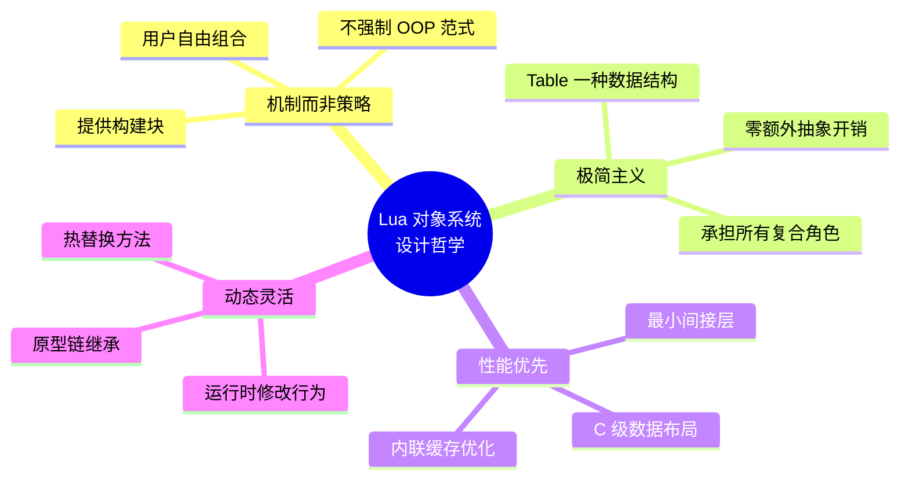
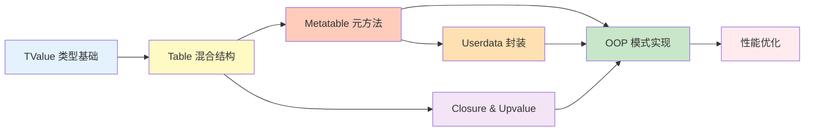
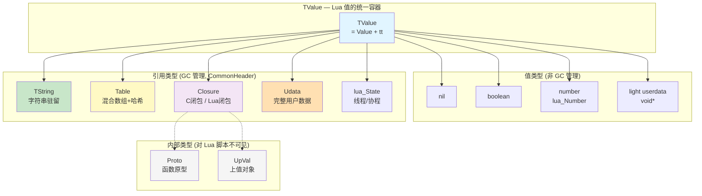
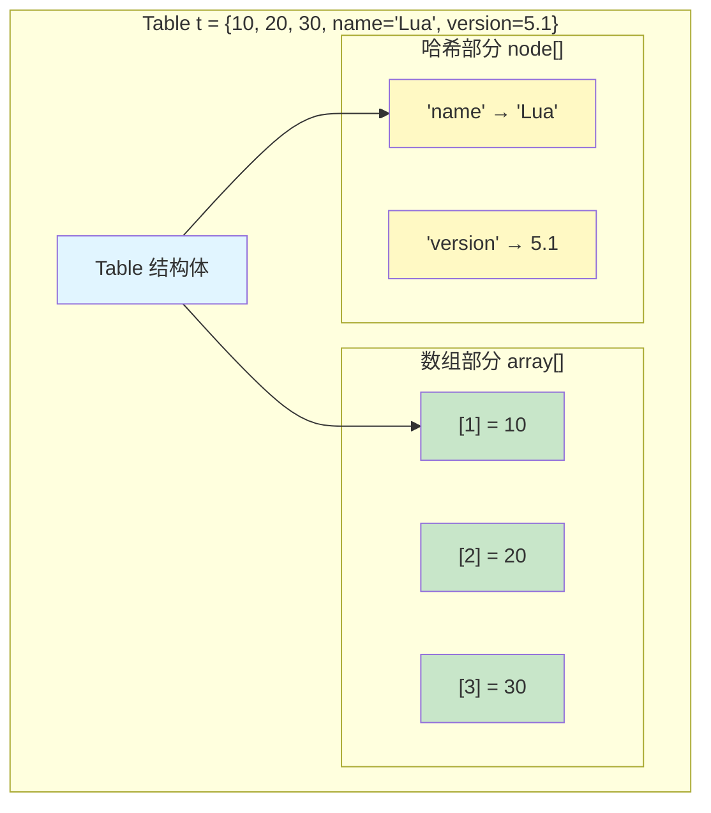
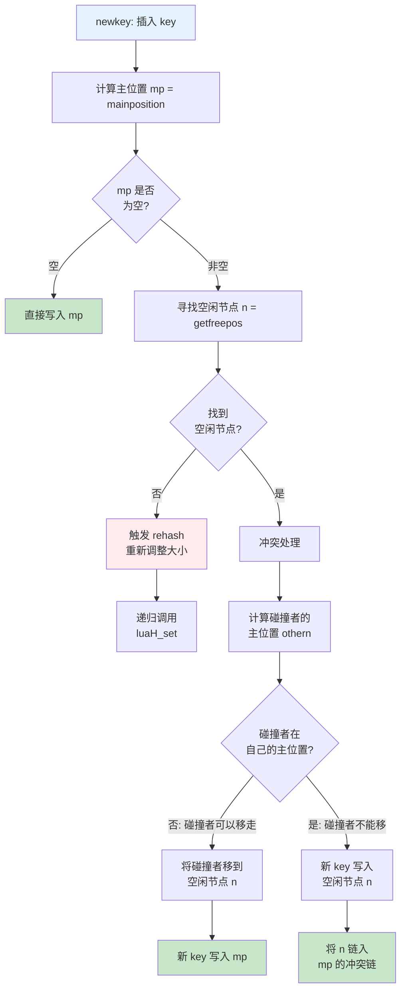
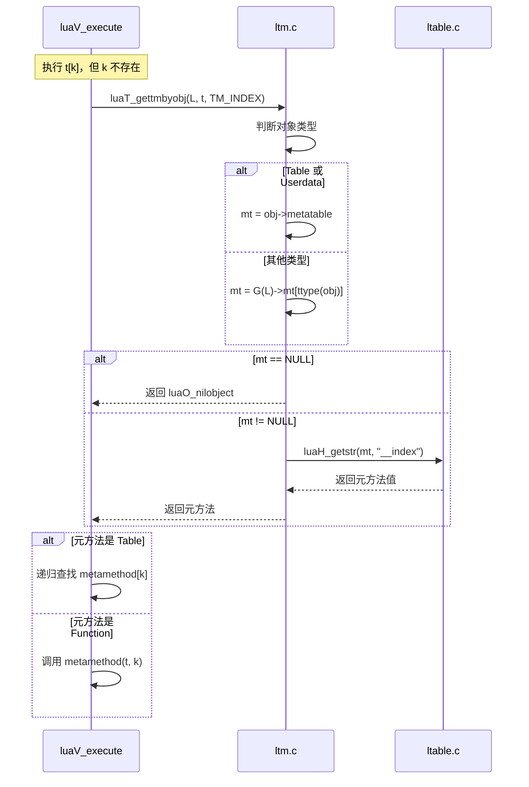
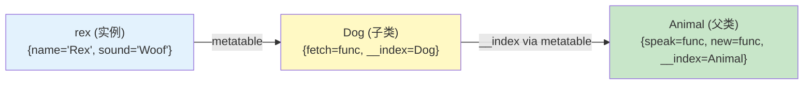

# 🏛️ Lua 5.1.5 对象系统深度剖析

> **技术主题**：基于 Table + Metatable 的对象系统完整实现 — 从内存布局到面向对象编程模式
> 
> **源文件**：`lobject.h/c`, `ltable.c/h`, `lfunc.c/h`, `ltm.c/h`, `lstring.c/h`  
> **技术深度**：⭐⭐⭐⭐（面向中高级开发者）  
> **前置知识**：TValue 类型系统基础、GC 基本概念

<details>
<summary><b>📋 快速导航</b></summary>

- [概述与学习路径](#-概述与学习路径)
- [对象系统架构总览](#-对象系统架构总览)
- [Table 混合数据结构深度解析](#-table-混合数据结构深度解析)
- [Metatable 与元方法机制](#-metatable-与元方法机制)
- [Closure 与 Upvalue 的对象特性](#-closure-与-upvalue-的对象特性)
- [Userdata 自定义对象容器](#-userdata-自定义对象容器)
- [面向对象编程模式实现](#-面向对象编程模式实现)
- [性能优化与最佳实践](#-性能优化与最佳实践)
- [实战案例与调试技巧](#-实战案例与调试技巧)
- [扩展阅读与学习检查](#-扩展阅读与学习检查)

</details>

---

## 📋 概述与学习路径

### Lua 中"对象"的概念

Lua 没有传统意义上的 `class` 关键字，但这并不意味着 Lua 缺少对象系统。恰恰相反，Lua 通过 **Table + Metatable + Closure** 三大基石，构建了一套极其灵活的对象系统 — 它比传统 OOP 更简洁，却同样强大。

在 Lua 的世界观中：

| 概念 | 传统 OOP（C++/Java） | Lua 实现方式 |
|------|----------------------|-------------|
| 类 | `class` 关键字 | Table（存储方法和默认属性） |
| 实例 | `new` 运算符 | Table（通过 `__index` 链接到"类"） |
| 继承 | `extends` / `:` | Metatable 链（`__index` 指向父类） |
| 封装 | `private` / `protected` | Closure + Upvalue（词法作用域隐藏） |
| 多态 | 虚函数表 | 元方法分发（`__index` 查找链） |
| 析构 | `~destructor` / `Finalize` | `__gc` 元方法 |

### 设计哲学



Lua 的设计者选择了 **"提供机制而非策略"** 的路线：不是提供一套固定的 OOP 语法，而是提供可以*构建任意对象系统*的底层原语。这意味着你可以实现 Python 风格的类、JavaScript 风格的原型链、甚至 CLOS 风格的多分派。

### 学习路径



### 核心文件速查

<table>
<tr>
<th width="20%">文件</th>
<th width="30%">职责</th>
<th width="50%">关键定义/函数</th>
</tr>

<tr>
<td><code>lobject.h</code></td>
<td>所有对象类型定义</td>
<td>
<code>TValue</code>, <code>Table</code>, <code>Closure</code>, <code>Udata</code>, <code>TString</code>, <code>Proto</code><br/>
<code>CommonHeader</code> 宏, <code>Node</code>, <code>TKey</code> 结构
</td>
</tr>

<tr>
<td><code>ltable.c/h</code></td>
<td>Table 数据结构实现</td>
<td>
<code>luaH_new()</code> — 创建<br/>
<code>luaH_get()</code> / <code>luaH_getstr()</code> / <code>luaH_getnum()</code> — 查找<br/>
<code>luaH_set()</code> / <code>newkey()</code> — 插入<br/>
<code>luaH_resize()</code> / <code>computesizes()</code> — 扩容
</td>
</tr>

<tr>
<td><code>lfunc.c/h</code></td>
<td>函数对象与闭包管理</td>
<td>
<code>luaF_newLclosure()</code> / <code>luaF_newCclosure()</code> — 创建闭包<br/>
<code>luaF_newupval()</code> — 创建上值<br/>
<code>luaF_close()</code> — 关闭上值
</td>
</tr>

<tr>
<td><code>ltm.c/h</code></td>
<td>元方法系统</td>
<td>
<code>TMS</code> 枚举 — 17 种元方法事件<br/>
<code>luaT_gettmbyobj()</code> — 按对象获取元方法<br/>
<code>luaT_gettm()</code> — 按元表获取（带缓存）
</td>
</tr>

<tr>
<td><code>lstring.c/h</code></td>
<td>字符串驻留系统</td>
<td>
<code>luaS_newlstr()</code> — 创建/查找字符串<br/>
<code>luaS_resize()</code> — 字符串表扩容
</td>
</tr>
</table>

---

## 🏗️ 对象系统架构总览

### GC 对象统一模型

Lua 中所有需要垃圾回收的对象 — Table、String、Closure、Userdata、Thread — 都共享统一的对象头 `CommonHeader`。这是 Lua 在 C 语言中实现"面向对象"的核心技巧：

```c
// lobject.h — 所有 GC 对象的公共头部
#define CommonHeader  GCObject *next; lu_byte tt; lu_byte marked
```

```
┌─────────────────────────────────────────────────────────────────────┐
│                    GCObject 统一内存布局                             │
├─────────────────────────────────────────────────────────────────────┤
│                                                                     │
│   CommonHeader (所有 GC 对象共享)                                    │
│   ┌──────────┬──────────┬──────────┐                                │
│   │ next     │ tt       │ marked   │                                │
│   │ (GCObj*) │ (类型tag)│ (GC标记) │                                │
│   │ 4/8字节  │ 1字节    │ 1字节    │                                │
│   └──────────┴──────────┴──────────┘                                │
│        │                                                            │
│        ├── Table:    + metatable, flags, array, node, ...           │
│        ├── TString:  + hash, len, [字符数据...]                     │
│        ├── Closure:  + isC, nupvalues, env, [upvals/f...]           │
│        ├── Udata:    + metatable, env, len, [用户数据...]           │
│        ├── Proto:    + k, code, p, lineinfo, ...                    │
│        └── UpVal:    + v, u.value / u.l{prev,next}                  │
│                                                                     │
└─────────────────────────────────────────────────────────────────────┘
```

### 对象类型层次



### 对象与 GC 的关系

每个 GC 对象在创建时通过 `luaC_link()` 链入全局 GC 链表：

```c
// lgc.h
#define luaC_link(L,o,tt) { \
  o->gch.next = G(L)->rootgc;  /* 链入全局链表头部 */ \
  G(L)->rootgc = o;            /* 成为新的头节点 */ \
  o->gch.tt = tt;              /* 设置类型标签 */ \
  o->gch.marked = luaC_white(G(L)); /* 标记为当前白色 */ \
}
```

这意味着所有 Table、Closure、Userdata 等对象从诞生之刻起就被 GC 追踪，开发者无需手动管理内存。

---

## 🔬 Table 混合数据结构深度解析

Table 是 Lua 对象系统的 **绝对核心** — 它不仅是唯一的复合数据结构，更承担着数组、字典、命名空间、模块、类、实例等所有角色。

### 数据结构定义

```c
// lobject.h
typedef struct Table {
    CommonHeader;                /* GC 对象公共头: next, tt, marked */
    lu_byte flags;              /* 元方法缓存位图: 1<<p 表示元方法 p 不存在 */
    lu_byte lsizenode;          /* 哈希部分大小的对数: log2(node数组大小) */
    struct Table *metatable;    /* 元表指针: 定义运算符重载和 OOP 行为 */
    TValue *array;              /* 数组部分: TValue 连续数组 */
    Node *node;                 /* 哈希部分: Node 节点数组 */
    Node *lastfree;             /* 空闲位置游标: 从后向前寻找空槽 */
    GCObject *gclist;           /* GC 灰色链表: 用于增量 GC 遍历 */
    int sizearray;              /* 数组部分实际大小 */
} Table;
```

### 内存布局

```
Table 对象内存布局
══════════════════════════════════════════════════════════════

Table 结构体 (约 40-56 字节, 取决于平台)
┌──────────────┬─────┬─────┬──────────────┬───────────────┐
│ CommonHeader │flags│lsize│  metatable   │    array      │
│  (next,tt,   │ 1B  │node │   (Table*)   │   (TValue*)   │
│   marked)    │     │ 1B  │   4/8 B      │   4/8 B       │
├──────────────┴─────┴─────┴──────────────┴───────────────┤
│    node (Node*)  │  lastfree (Node*) │  gclist  │sizearray│
│     4/8 B        │     4/8 B         │  4/8 B   │  4 B    │
└──────────────────┴───────────────────┴──────────┴─────────┘
        │                    │
        │                    │
        ▼                    ▼
   数组部分 (连续 TValue)         哈希部分 (Node 数组)
   ┌─────┬─────┬─────┐         ┌──────────┬──────────┐
   │ [0] │ [1] │ [2] │ ...     │  Node 0  │  Node 1  │ ...
   │TVal │TVal │TVal │         │(key+val) │(key+val) │
   └─────┴─────┴─────┘         └──────────┴──────────┘

每个 Node 的结构:
┌─────────────────────────────────────┐
│  i_val (TValue)  │  i_key (TKey)   │
│  value + tt      │  value+tt+next  │
│   12/16 B        │   16/20 B       │
└─────────────────────────────────────┘
```

### 双重存储策略

Table 的核心设计智慧在于 **一体两面** — 同一个 Table 同时拥有数组部分和哈希部分：



**路由规则** — 决定 key 走数组还是哈希：

```c
// ltable.c — luaH_getnum() 的判定逻辑
const TValue *luaH_getnum (Table *t, int key) {
    if (cast(unsigned int, key-1) < cast(unsigned int, t->sizearray))
        return &t->array[key-1];   // ✅ 1 ≤ key ≤ sizearray → 数组 O(1)
    else
        /* 哈希查找 */;            // ❌ 超出范围或非正整数 → 哈希部分
}
```

| 条件 | 走数组部分 | 走哈希部分 |
|------|-----------|-----------|
| 正整数 key，且 `1 ≤ key ≤ sizearray` | ✅ | |
| 正整数 key，但 `key > sizearray` | | ✅ |
| 字符串 key | | ✅ |
| 浮点数 key（如 `1.5`） | | ✅ |
| 布尔/Table/函数等作为 key | | ✅ |

### 哈希算法 — Brent 变体

Lua 使用 **开放寻址 + 链式溢出** 的 Brent 变体哈希算法。核心不变式是：

> **如果一个元素不在其主位置（main position），那么占据其主位置的元素一定在自己的主位置上。**

```c
// ltable.c — 主位置计算
static Node *mainposition (const Table *t, const TValue *key) {
    switch (ttype(key)) {
        case LUA_TNUMBER:        return hashnum(t, nvalue(key));
        case LUA_TSTRING:        return hashstr(t, rawtsvalue(key));  // 指针哈希
        case LUA_TBOOLEAN:       return hashboolean(t, bvalue(key));
        case LUA_TLIGHTUSERDATA: return hashpointer(t, pvalue(key));
        default:                 return hashpointer(t, gcvalue(key));
    }
}
```

**插入新键的完整流程**（`newkey()` 函数）：



### 动态扩容 — 50% 利用率规则

当哈希部分没有空闲节点时，触发 `rehash()` → `computesizes()` :

```c
// ltable.c — 核心的 50% 规则
static int computesizes (int nums[], int *narray) {
    int a = 0;     // 累计 ≤ 2^i 的整数键数量
    int na = 0;    // 最终进入数组部分的元素数
    int n = 0;     // 最优数组大小
    for (i = 0, twotoi = 1; twotoi/2 < *narray; i++, twotoi *= 2) {
        if (nums[i] > 0) {
            a += nums[i];
            if (a > twotoi/2) {  // 利用率 > 50% → 值得分配数组
                n = twotoi;       // 更新最优数组大小
                na = a;
            }
        }
    }
    *narray = n;
    return na;
}
```

**原理图解**：

```
假设 Table 有以下整数键: 1, 2, 3, 5, 100

统计每个 2^i 区间内的键数量:
  区间 [1,1]:   nums[0] = 1    → a=1, 1/1=100%  > 50%  ✓ → n=1
  区间 [1,2]:   nums[1] = 1    → a=2, 2/2=100%  > 50%  ✓ → n=2
  区间 [1,4]:   nums[2] = 1    → a=3, 3/4=75%   > 50%  ✓ → n=4
  区间 [1,8]:   nums[3] = 1    → a=4, 4/8=50%   ≤ 50%  ✗
  区间 [1,128]: nums[6] = 1    → a=5, 5/128=4%  ≤ 50%  ✗

结果: 数组大小 = 4 (存储 key 1,2,3,5 中的 1,2,3)
      key 5 和 100 进入哈希部分
```

### 三种查找路径的性能对比

| 查找函数 | 适用场景 | 时间复杂度 | 关键优化 |
|---------|---------|-----------|---------|
| `luaH_getnum(t, key)` | 整数键 `t[1]` | 数组: O(1), 哈希: O(1)期望 | 先检查数组范围，命中则直接索引 |
| `luaH_getstr(t, key)` | 字符串键 `t["name"]` | O(1) 期望 | 驻留字符串 → 指针比较代替 memcmp |
| `luaH_get(t, key)` | 通用键 | O(1) 期望 | 分发到 getnum/getstr 特化路径 |

```c
// ltable.c — 字符串查找的极致优化
const TValue *luaH_getstr (Table *t, TString *key) {
    Node *n = hashstr(t, key);
    do {
        if (ttisstring(gkey(n)) && rawtsvalue(gkey(n)) == key)  // 指针比较！
            return gval(n);
        else n = gnext(n);
    } while (n);
    return luaO_nilobject;  // 未找到返回全局 nil
}
```

> 💡 **关键洞察**：由于字符串驻留机制，`rawtsvalue(gkey(n)) == key` 是**指针**比较而非字符串内容比较。这使得字符串键的查找与数值键一样高效。

---

## 🎭 Metatable 与元方法机制

Metatable 是 Lua 对象系统实现 OOP 的 **关键桥梁** — 它让普通的 Table 具备了自定义行为的能力。

### 17 种元方法事件

```c
// ltm.h
typedef enum {
    TM_INDEX,       // __index    — t[k] 访问不存在的键
    TM_NEWINDEX,    // __newindex — t[k]=v 赋值给不存在的键
    TM_GC,          // __gc       — 对象被 GC 回收时
    TM_MODE,        // __mode     — 弱引用模式 ("k"/"v"/"kv")
    TM_EQ,          // __eq       — == 比较
    // ↑ 前 5 个支持 flags 快速缓存
    TM_ADD,         // __add      — + 运算
    TM_SUB,         // __sub      — - 运算
    TM_MUL,         // __mul      — * 运算
    TM_DIV,         // __div      — / 运算
    TM_MOD,         // __mod      — % 运算
    TM_POW,         // __pow      — ^ 运算
    TM_UNM,         // __unm      — 一元 - 运算
    TM_LEN,         // __len      — # 长度运算
    TM_LT,          // __lt       — < 比较
    TM_LE,          // __le       — <= 比较
    TM_CONCAT,      // __concat   — .. 连接
    TM_CALL,        // __call     — 将表作为函数调用
    TM_N            // 哨兵值: 元方法总数 = 17
} TMS;
```

### 元方法查找流程



### 核心实现 — `luaT_gettmbyobj`

```c
// ltm.c — 按对象类型获取元方法
const TValue *luaT_gettmbyobj (lua_State *L, const TValue *o, TMS event) {
    Table *mt;
    switch (ttype(o)) {
        case LUA_TTABLE:
            mt = hvalue(o)->metatable;     // Table 自带元表
            break;
        case LUA_TUSERDATA:
            mt = uvalue(o)->metatable;     // Userdata 自带元表
            break;
        default:
            mt = G(L)->mt[ttype(o)];       // 其他类型: 全局共享元表
    }
    return (mt ? luaH_getstr(mt, G(L)->tmname[event]) : luaO_nilobject);
}
```

**三个关键设计点**：

1. **只有 Table 和 Userdata 拥有独立的 metatable**。`number`、`string` 等类型使用 `G(L)->mt[ttype]` 全局共享元表。
2. **元方法名字是驻留字符串**。`G(L)->tmname[event]` 在初始化时预创建，查找时直接用指针比较。
3. **`flags` 快速否定缓存**。避免无元方法时的重复查找：

```c
// ltm.h — 快速判断"元方法不存在"
#define gfasttm(g,et,e) \
    ((et) == NULL ? NULL : \
     ((et)->flags & (1u<<(e))) ? NULL : \    /* flags 位为 1 → 确定不存在 */
     luaT_gettm(et, e, (g)->tmname[e]))      /* 否则实际查找 */
```

```c
// ltm.c — 查找 + 缓存
const TValue *luaT_gettm (Table *events, TMS event, TString *ename) {
    const TValue *tm = luaH_getstr(events, ename);
    lua_assert(event <= TM_EQ);  // 只有前 5 种使用 flags 缓存
    if (ttisnil(tm)) {
        events->flags |= cast_byte(1u<<event);  // 缓存"不存在"
        return NULL;
    }
    else return tm;
}
```

> ⚡ **性能影响**：`flags` 缓存是 Lua 性能的关键优化。大多数 Table 没有设置元方法，`flags` 使得 `__index`、`__newindex` 等高频操作可以在 O(1) 时间内确定"无需处理元方法"。

### VM 中的元方法调用路径

以 `OP_ADD` 为例，展示元方法如何被触发：

```c
// lvm.c — luaV_execute 中的 OP_ADD 处理
case OP_ADD: {
    TValue *rb = RKB(i);
    TValue *rc = RKC(i);
    if (ttisnumber(rb) && ttisnumber(rc)) {
        // 快速路径: 两个都是数字，直接算
        lua_Number nb = nvalue(rb), nc = nvalue(rc);
        setnvalue(ra, luai_numadd(nb, nc));
    }
    else
        // 慢速路径: 调用元方法
        Arith(L, ra, rb, rc, TM_ADD);
    continue;
}
```

```c
// lvm.c — Arith 辅助函数
static void Arith (lua_State *L, StkId ra, const TValue *rb,
                   const TValue *rc, TMS op) {
    TValue tempb, tempc;
    const TValue *b, *c;
    // 尝试字符串→数字转换
    if ((b = luaV_tonumber(rb, &tempb)) != NULL &&
        (c = luaV_tonumber(rc, &tempc)) != NULL) {
        // 转换成功，执行算术
        ...
    }
    else if (!call_binTM(L, rb, rc, ra, op))
        // 元方法也没有 → 报错
        luaG_aritherror(L, rb, rc);
}
```

---

## 🔐 Closure 与 Upvalue 的对象特性

Closure（闭包）是 Lua 中实现封装和私有状态的核心机制。每个 Lua 函数值实际上都是一个闭包。

### 两种闭包类型

```c
// lobject.h

// 闭包公共头 — C 闭包和 Lua 闭包共享
#define ClosureHeader \
    CommonHeader; lu_byte isC; lu_byte nupvalues; GCObject *gclist; \
    struct Table *env

// C 闭包: 封装一个 C 函数
typedef struct CClosure {
    ClosureHeader;
    lua_CFunction f;        // C 函数指针
    TValue upvalue[1];      // 上值数组 (TValue, 直接存储值)
} CClosure;

// Lua 闭包: 封装一个 Lua 函数原型
typedef struct LClosure {
    ClosureHeader;
    struct Proto *p;        // 函数原型 (字节码 + 常量)
    UpVal *upvals[1];       // 上值指针数组 (UpVal*, 间接引用)
} LClosure;

// 统一联合体
typedef union Closure {
    CClosure c;
    LClosure l;
} Closure;
```

**C 闭包 vs Lua 闭包的上值差异**：

| 对比维度 | CClosure | LClosure |
|---------|----------|----------|
| 上值存储 | `TValue upvalue[1]` — 直接存储 TValue | `UpVal *upvals[1]` — 指向 UpVal 对象 |
| 共享性 | 每个 CClosure 独立拥有上值 | 多个 LClosure 可共享同一 UpVal |
| 生命周期 | 随闭包创建/销毁 | UpVal 有独立的开放/关闭状态 |
| 大小宏 | `sizeCclosure(n)` | `sizeLclosure(n)` |

### UpVal — 闭包的灵魂

UpVal 是 Lua 闭包机制中最精妙的设计之一，它解决了一个经典问题：**内部函数如何在外部函数返回后仍然访问外部变量？**

```c
// lobject.h
typedef struct UpVal {
    CommonHeader;
    TValue *v;                    // 值指针: 开放时→栈，关闭时→自身
    union {
        TValue value;             // 关闭状态: 保存变量的实际值
        struct {
            struct UpVal *prev;   // 开放状态: 双向链表
            struct UpVal *next;
        } l;
    } u;
} UpVal;
```

### UpVal 状态转换

```mermaid
stateDiagram-v2
    [*] --> Open: luaF_findupval()
    Open --> Closed: luaF_close()
    Closed --> [*]: GC 回收
    
    state Open {
        note right of Open
            uv->v → 栈上的变量位置
            通过 uv->u.l.{prev,next}
            组成全局有序双向链表
        end note
    }
    
    state Closed {
        note right of Closed
            uv->v → &uv->u.value
            栈值已复制到 u.value
            自引用，独立于栈帧
        end note
    }
```

### 关闭过程详解 — `luaF_close()`

当一个函数返回时，它栈帧上被捕获的变量需要"转移"到堆上：

```c
// lfunc.c
void luaF_close (lua_State *L, StkId level) {
    UpVal *uv;
    global_State *g = G(L);
    while (L->openupval != NULL && 
           (uv = ngcotouv(L->openupval))->v >= level) {
        GCObject *o = obj2gco(uv);
        L->openupval = uv->next;          // 1. 从开放链表中摘除
        if (isdead(g, o))
            luaF_freeupval(L, uv);         // 2a. 已死 → 直接释放
        else {
            unlinkupval(uv);               // 2b. 从双向链表中摘除
            setobj(L, &uv->u.value, uv->v);// 3. 复制栈值到内部存储
            uv->v = &uv->u.value;          // 4. 指针切换: 自引用！
            luaC_linkupval(L, uv);          // 5. 重新链入 GC 根集
        }
    }
}
```

**图解关闭过程**：

```
关闭前 (Open):                      关闭后 (Closed):
                                    
  UpVal                               UpVal
  ┌──────────┐                        ┌──────────┐
  │ v ────────┼──→ stack[i] = 42      │ v ────────┼──┐
  │          │                        │           │  │
  │ u.value  │    (未使用)             │ u.value=42│←─┘  (自引用!)
  │ u.l.prev │──→ prev UpVal          │           │
  │ u.l.next │──→ next UpVal          │           │
  └──────────┘                        └──────────┘
  
  stack[i] 仍然存活                    stack[i] 已不存在
  多个闭包共享同一 UpVal               值保存在 UpVal 内部
```

### 上值共享机制

多个闭包引用同一个外部变量时，它们共享同一个 UpVal 对象，确保修改的一致性：

```lua
function make_counter()
    local count = 0
    local function increment() count = count + 1; return count end
    local function get() return count end
    return increment, get
end

local inc, get = make_counter()
print(inc())  --> 1
print(inc())  --> 2
print(get())  --> 2   -- 共享同一个 count！
```

```
内部实现:

increment (LClosure)          get (LClosure)
  ├── p → Proto_inc             ├── p → Proto_get
  └── upvals[0] ─────┐         └── upvals[0] ─────┐
                      │                             │
                      ▼                             │
                   UpVal (共享)  ◄──────────────────┘
                   ┌──────────┐
                   │ v → count │
                   │ value: 2  │
                   └──────────┘
```

---

## 📦 Userdata 自定义对象容器

Userdata 是 Lua 为 C 扩展提供的 **对象封装机制** — 它允许将任意 C 数据结构包装成 GC 管理的 Lua 对象。

### 两种 Userdata

| 特性 | Full Userdata (`Udata`) | Light Userdata (`void*`) |
|------|------------------------|--------------------------|
| 类型标签 | `LUA_TUSERDATA` | `LUA_TLIGHTUSERDATA` |
| GC管理 | ✅ 有 CommonHeader，自动回收 | ❌ 只是一个裸 C 指针 |
| 元表 | ✅ 可设置独立元表 | ❌ 共享全局 userdata 元表 |
| 环境 | ✅ 有 env 字段 | ❌ 没有 |
| `__gc` | ✅ 支持终结器 | ❌ 不支持 |
| 内存分配 | Lua 分配并管理 | 用户自行管理 |
| 适用场景 | 资源对象（文件、Socket等） | 不需要 GC 的 C 指针 |

### Full Userdata 数据结构

```c
// lobject.h
typedef union Udata {
    L_Umaxalign dummy;          // 最大对齐保证
    struct {
        CommonHeader;            // GC 对象头
        struct Table *metatable; // 元表: 定义操作行为
        struct Table *env;       // 环境表
        size_t len;             // 用户数据长度（字节）
    } uv;
} Udata;
```

**内存布局**：

```
Full Userdata 内存布局:
┌─────────────────────────────────────────────────┐
│  Udata 头部                                      │
│  ┌────────────┬────────┬───────┬──────┬────────┐ │
│  │CommonHeader│metatable│ env  │ len  │(对齐)   │ │
│  │  ~6 bytes  │  ptr    │ ptr  │size_t│ padding │ │
│  └────────────┴────────┴───────┴──────┴────────┘ │
├─────────────────────────────────────────────────┤
│  用户数据 (len 字节)                              │
│  ┌─────────────────────────────────────────────┐ │
│  │  由 C 代码自由使用的内存区域                   │ │
│  │  通过 lua_touserdata(L, idx) 获取指针        │ │
│  └─────────────────────────────────────────────┘ │
└─────────────────────────────────────────────────┘
```

用户数据紧跟在 `Udata` 结构之后，通过 `(char*)(udata + 1)` 获取指针，与 `TString` 的字符数据布局如出一辙。

### Userdata 创建流程

```c
// lstring.c — 创建 Userdata（注意：由 lstring.c 管理，因为布局相似）
Udata *luaS_newudata (lua_State *L, size_t s, Table *e) {
    Udata *u;
    if (s > MAX_SIZET - sizeof(Udata))
        luaM_toobig(L);
    u = cast(Udata *, luaM_malloc(L, s + sizeof(Udata)));
    u->uv.marked = luaC_white(G(L));  // GC 初始标记
    u->uv.tt = LUA_TUSERDATA;
    u->uv.len = s;
    u->uv.metatable = NULL;           // 默认无元表
    u->uv.env = e;                    // 设置环境
    /* 链入 GC mainthread 链表（而非普通 rootgc） */
    u->uv.next = G(L)->mainthread->next;
    G(L)->mainthread->next = obj2gco(u);
    return u;
}
```

---

## 💡 面向对象编程模式实现

### 基本类模式

```lua
-- ═══════════════════════════════════════════
-- 模式 1: 基础类 — Table + Metatable
-- ═══════════════════════════════════════════

local Animal = {}        -- "类" 就是一个普通 Table
Animal.__index = Animal  -- 关键: __index 指向自身

function Animal.new(name, sound)
    local self = setmetatable({}, Animal)  -- 创建实例并设置元表
    self.name = name
    self.sound = sound
    return self
end

function Animal:speak()  -- 语法糖: Animal.speak(self)
    print(self.name .. " says " .. self.sound)
end

local cat = Animal.new("Cat", "Meow")
cat:speak()  --> Cat says Meow
```

**底层原理追踪**：

```
1. cat:speak() → Lua 编译为 cat.speak(cat)

2. cat.speak → VM 执行 OP_GETTABLE(cat, "speak")
   → luaH_getstr(cat, "speak") → 返回 nil（cat 自身没有 "speak"）
   → 触发 __index 元方法

3. __index 查找:
   → luaT_gettmbyobj(L, cat, TM_INDEX)
   → cat.metatable = Animal
   → luaH_getstr(Animal, "__index") → 返回 Animal 本身
   → Animal 是 Table → 递归查找 luaH_getstr(Animal, "speak")
   → 找到函数！返回

4. 调用 Animal.speak(cat) → 执行方法体
```

### 继承模式

```lua
-- ═══════════════════════════════════════════
-- 模式 2: 继承 — Metatable 链
-- ═══════════════════════════════════════════

local Dog = setmetatable({}, { __index = Animal })
Dog.__index = Dog

function Dog.new(name)
    local self = Animal.new(name, "Woof")  -- 调用父类构造器
    return setmetatable(self, Dog)          -- 重设元表为 Dog
end

function Dog:fetch(item)
    print(self.name .. " fetches " .. item)
end

local rex = Dog.new("Rex")
rex:speak()        --> Rex says Woof       (继承自 Animal)
rex:fetch("ball")  --> Rex fetches ball    (Dog 自己的方法)
```



**`__index` 查找链**：`rex.speak` → `rex` 没有 → `Dog` 没有 → `Animal` 有！

### 封装模式 — 基于闭包的私有变量

```lua
-- ═══════════════════════════════════════════
-- 模式 3: 真正的私有变量 — Closure + Upvalue
-- ═══════════════════════════════════════════

function createAccount(initialBalance)
    -- 私有变量: 外部完全不可访问
    local balance = initialBalance
    local log = {}
    
    -- 返回的方法通过闭包捕获 balance 和 log
    local account = {}
    
    function account:deposit(amount)
        balance = balance + amount
        table.insert(log, "deposit: " .. amount)
    end
    
    function account:withdraw(amount)
        if amount <= balance then
            balance = balance - amount
            table.insert(log, "withdraw: " .. amount)
            return true
        end
        return false
    end
    
    function account:getBalance()
        return balance  -- 只读访问
    end
    
    function account:getHistory()
        return {unpack(log)}  -- 返回副本
    end
    
    return account
end

local acc = createAccount(100)
acc:deposit(50)
print(acc:getBalance())  --> 150
-- acc.balance → nil — 真正的私有，无法从外部访问！
```

**底层实现**：

```
createAccount 返回后:

account:deposit (LClosure)     account:getBalance (LClosure)
  └── upvals[0] → UpVal ──┐    └── upvals[0] → UpVal ──┐
  └── upvals[1] → UpVal ─┐│                              │
                          ││                              │
              UpVal(log) ←┘│   UpVal(balance) ◄──────────┘
              ┌────────┐   │   ┌────────────┐
              │v: {..}  │   └──→│v: 150      │  ← 所有方法共享同一个 UpVal!
              └────────┘       └────────────┘
              (Closed)         (Closed)
```

### Userdata 封装 C 对象

```lua
-- Lua 端使用
local f = io.open("test.txt", "r")  -- f 是一个 Full Userdata
print(type(f))                       --> userdata
local content = f:read("*a")         -- 通过元方法调用 C 函数
f:close()                            -- 关闭文件
-- f 被 GC 回收时自动调用 __gc 关闭未关闭的文件
```

```c
// C 端实现示例: 创建一个 2D 向量 Userdata
typedef struct { double x, y; } Vec2;

static int vec2_new(lua_State *L) {
    double x = luaL_checknumber(L, 1);
    double y = luaL_checknumber(L, 2);
    
    // 1. 分配 Userdata（Lua 管理内存）
    Vec2 *v = (Vec2*)lua_newuserdata(L, sizeof(Vec2));
    v->x = x;
    v->y = y;
    
    // 2. 设置元表（实现方法调用和运算符重载）
    luaL_getmetatable(L, "Vec2");
    lua_setmetatable(L, -2);
    
    return 1;  // 返回 userdata
}

static int vec2_add(lua_State *L) {
    Vec2 *a = (Vec2*)luaL_checkudata(L, 1, "Vec2");
    Vec2 *b = (Vec2*)luaL_checkudata(L, 2, "Vec2");
    
    Vec2 *result = (Vec2*)lua_newuserdata(L, sizeof(Vec2));
    result->x = a->x + b->x;
    result->y = a->y + b->y;
    
    luaL_getmetatable(L, "Vec2");
    lua_setmetatable(L, -2);
    return 1;
}

static int vec2_gc(lua_State *L) {
    // __gc 终结器: 清理资源（此例中 Vec2 无需特殊清理）
    Vec2 *v = (Vec2*)lua_touserdata(L, 1);
    printf("Vec2(%g, %g) collected\n", v->x, v->y);
    return 0;
}

// 注册元表
int luaopen_vec2(lua_State *L) {
    luaL_newmetatable(L, "Vec2");       // 创建并注册元表
    
    lua_pushstring(L, "__add");
    lua_pushcfunction(L, vec2_add);
    lua_settable(L, -3);                // mt.__add = vec2_add
    
    lua_pushstring(L, "__gc");
    lua_pushcfunction(L, vec2_gc);
    lua_settable(L, -3);                // mt.__gc = vec2_gc
    
    lua_pushstring(L, "__index");
    lua_pushvalue(L, -2);               // mt.__index = mt
    lua_settable(L, -3);
    
    // 注册构造函数
    lua_pushcfunction(L, vec2_new);
    lua_setglobal(L, "Vec2");
    
    return 0;
}
```

---

## ⚡ 性能优化与最佳实践

### Table 性能优化

#### 1. 预分配策略

```lua
-- ❌ 不推荐: 逐步扩容，触发多次 rehash
local t = {}
for i = 1, 1000 do
    t[i] = i  -- 在 i=1,2,4,8,16,32,...时触发 resize
end

-- ✅ 推荐: 使用 C API 预分配
-- lua_createtable(L, 1000, 0)  -- 预分配 1000 个数组槽位
```

每次 `rehash` 涉及：重新计算所有键的分配、重新分配内存、复制所有键值对。一个 1000 元素的表可能经历 ~10 次 rehash。

#### 2. 避免混合使用数组和哈希

```lua
-- ❌ 低效: 混合模式，数组部分利用率低
local t = {1, 2, 3}
t["name"] = "test"
t[1000] = true     -- 只有 3 个连续整数键，但 key=1000 进入哈希

-- ✅ 高效: 分离数组和字典
local arr = {1, 2, 3}              -- 纯数组，紧凑存储
local dict = {name = "test"}       -- 纯哈希
```

#### 3. 利用字符串驻留

```lua
-- ✅ 重复使用同一字符串键是 O(1) 的指针比较
for i = 1, 100000 do
    process(t["status"])  -- "status" 已驻留，查找极快
end

-- ⚠️ 注意: 拼接生成的字符串每次都要计算哈希
for i = 1, 100000 do
    process(t["field_" .. i])  -- 每次创建新字符串，触发哈希+驻留
end
```

### 对象系统性能考量

#### `__index` 链长度的影响

```lua
-- 3 层继承: obj → Class → Parent → GrandParent
-- 最坏情况下查找一个不存在的方法需要遍历 3 层 __index

-- 性能对比:
-- 直接访问 (无元方法):     ~1 次哈希查找
-- 1 层 __index:            ~2 次哈希查找 + 1 次元方法查找
-- 3 层 __index:            ~4 次哈希查找 + 3 次元方法查找
```

**优化技巧**：

```lua
-- ✅ 方法缓存: 将常用方法直接复制到实例
function Dog.new(name)
    local self = Animal.new(name, "Woof")
    setmetatable(self, Dog)
    -- 将高频方法缓存到实例，避免 __index 链查找
    self.speak = Dog.speak  -- 或者 Animal.speak（如果是继承的方法）
    return self
end
```

#### 闭包 vs 元表的开销

```lua
-- 方案 A: 基于闭包（每个实例都创建新的函数对象）
function newObj_closure()
    local data = {}
    return {
        get = function() return data end,  -- 每个实例一个新闭包
        set = function(v) data = v end,    -- 每个实例一个新闭包
    }
end
-- 内存: 每个实例 ≈ 2 个 Closure + 2 个 UpVal + 1 个 Table

-- 方案 B: 基于元表（所有实例共享方法表）
local Obj = {}; Obj.__index = Obj
function Obj.new()
    return setmetatable({_data = {}}, Obj)
end
function Obj:get() return self._data end   -- 所有实例共享
function Obj:set(v) self._data = v end     -- 所有实例共享
-- 内存: 每个实例 ≈ 1 个 Table（元表共享）
```

| 方案 | 实例内存 | 创建速度 | 方法调用速度 | 封装性 |
|------|---------|---------|------------|-------|
| 闭包方案 | 高（~3-4个GC对象/实例） | 慢（创建多个闭包） | 快（直接调用） | 强（真正私有） |
| 元表方案 | 低（~1个GC对象/实例） | 快（仅创建1个Table） | 稍慢（__index查找） | 弱（_前缀约定） |

> 💡 **经验法则**：少量实例需要强封装 → 闭包方案；大量同类实例 → 元表方案。

### 常见性能陷阱

```lua
-- ❌ 陷阱 1: 在循环中创建闭包
for i = 1, 10000 do
    table.sort(data, function(a, b) return a > b end)  
    -- 每次循环创建一个新闭包对象！
end

-- ✅ 修复: 提取到循环外
local desc = function(a, b) return a > b end
for i = 1, 10000 do
    table.sort(data, desc)  -- 复用同一个闭包
end

-- ❌ 陷阱 2: 深层元表链 + 频繁访问不存在的字段
local obj = deepInherit()  -- 5 层继承
for i = 1, 10000 do
    if obj.nonExistentField then ... end  -- 每次遍历 5 层 __index
end

-- ✅ 修复: 局部缓存
local val = obj.nonExistentField  -- 只查找一次
for i = 1, 10000 do
    if val then ... end
end

-- ❌ 陷阱 3: 忘记元表的 flags 缓存失效
local mt = { __index = function(t, k) return default end }
local t = setmetatable({}, mt)
-- 此时 mt.flags 中 __index 位未设置 (因为存在)
mt.__index = nil           -- 移除 __index
-- ⚠️ flags 已缓存 "__index 不存在"
-- 下次设置新的 __index 时，需要关注 flags 是否重置
```

---

## 🛠️ 实战案例与调试技巧

### 调试对象系统

#### 查看 Table 的内部结构

```lua
-- 自定义函数: 显示 Table 的数组/哈希分布
function inspect_table(t)
    local array_count = 0
    local hash_count = 0
    
    for k, v in pairs(t) do
        if type(k) == "number" and k == math.floor(k) and k >= 1 then
            array_count = array_count + 1
        else
            hash_count = hash_count + 1
        end
    end
    
    print(string.format("Table: %d likely-array, %d hash entries", 
                         array_count, hash_count))
end
```

#### 用 C 调试器观察对象

在 GDB/LLDB/MSVC 调试器中，可以这样检查 Lua 对象：

```c
// 在 lvm.c 的 luaV_execute 中设置断点

// 查看栈顶 TValue 的类型和值:
// (lldb) p ra->tt              → 类型标签 (5 = LUA_TTABLE)
// (lldb) p ra->value.gc->h     → Table 结构体

// 查看 Table 的数组部分:
// (lldb) p t->sizearray        → 数组大小
// (lldb) p t->array[0]         → 第一个数组元素

// 查看哈希部分:
// (lldb) p sizenode(t)         → 哈希节点数
// (lldb) p t->node[0].i_key    → 第一个节点的键
// (lldb) p t->node[0].i_val    → 第一个节点的值

// 查看元表:
// (lldb) p t->metatable        → Table* 或 NULL
// (lldb) p t->flags            → 元方法缓存位图
```

### 完整示例：实现一个只读代理

```lua
-- 实战: 利用 __index + __newindex 实现只读 Table
function readonly(t)
    local proxy = {}
    local mt = {
        __index = t,  -- 读操作委托给原表
        __newindex = function(_, k, v)
            error("attempt to modify read-only table (key: " .. tostring(k) .. ")")
        end,
        __len = function() return #t end,
        __pairs = function() return pairs(t) end,
    }
    setmetatable(proxy, mt)
    return proxy
end

local config = readonly({
    host = "localhost",
    port = 8080,
    debug = false,
})

print(config.host)     --> localhost     (通过 __index 读取)
config.host = "other"  --> error!        (被 __newindex 拦截)
```

**底层追踪**：

```
config.host 读取:
  1. VM: OP_GETTABLE(config, "host")
  2. luaH_getstr(config, "host") → nil (proxy 是空表)
  3. gfasttm → 检查 flags → __index 存在
  4. luaT_gettmbyobj → 返回 t (原始表)
  5. __index 是 Table → luaH_getstr(t, "host") → "localhost"

config.host = "other" 写入:
  1. VM: OP_SETTABLE(config, "host", "other")
  2. luaH_getstr(config, "host") → nil (key 不存在)
  3. gfasttm → __newindex 存在
  4. 调用 __newindex(config, "host", "other") → error!
```

---

## 📚 扩展阅读与学习检查

### 相关模块文档

| 文档 | 关联主题 |
|------|---------|
| [TValue 实现详解](tvalue_implementation.md) | 对象系统的类型基础，深入 Tagged Union 设计 |
| [Table 数据结构](table_structure.md) | Table 混合结构的更多实现细节 |
| [闭包实现深度解析](closure_implementation.md) | Closure/UpVal 的完整生命周期 |
| [元表机制详解](metatable_mechanism.md) | 全部 17 种元方法的完整分析 |
| [字符串驻留机制](string_interning.md) | 字符串哈希、interning 池化详解 |
| [类型转换机制](type_conversion.md) | 动态类型转换规则 |
| [垃圾回收完全指南](../gc/wiki_gc.md) | GC 如何遍历和回收对象 |
| [三色标记算法](../gc/tri_color_marking.md) | 标记阶段如何遍历 Table/Closure 的子引用 |
| [写屏障技术](../gc/write_barrier.md) | 对象修改时的 GC 屏障机制 |
| [弱引用表](../gc/weak_table.md) | `__mode` 元方法与弱引用 GC |
| [终结器机制](../gc/finalizer.md) | `__gc` 元方法的调用时机和安全保证 |
| [内存管理模块](../memory/wiki_memory.md) | 对象内存分配和统计 |
| [虚拟机完全指南](../vm/wiki_vm.md) | VM 如何解释执行涉及对象操作的指令 |

### 核心问题自测

| # | 问题 | 涉及知识点 |
|---|------|-----------|
| 1 | 为什么 Lua 只用 Table 一种复合数据结构就能承担所有角色？ | 混合结构设计哲学 |
| 2 | `luaH_getstr` 为什么可以用指针比较代替 `memcmp`？ | 字符串驻留 |
| 3 | Table 的 `flags` 字段如何加速元方法查找？ | 否定缓存位图 |
| 4 | 开放 UpVal 关闭时，`uv->v = &uv->u.value` 这一行的含义是什么？ | 自引用技巧 |
| 5 | 为什么 CClosure 直接存 TValue 而 LClosure 存 UpVal 指针？ | 共享 vs 独立语义 |
| 6 | `computesizes()` 中 50% 利用率规则的目的是什么？ | 空间/时间权衡 |
| 7 | Light Userdata 和 Full Userdata 在 GC 层面有什么本质区别？ | GC 对象模型 |
| 8 | 3 层 `__index` 继承链查找一个不存在的方法，内部经历几次哈希查找？ | 元方法分发开销 |

<div align="center">

## 🎯 学习检查点

- [ ] 理解 `CommonHeader` 如何统一所有 GC 对象
- [ ] 掌握 Table 的数组/哈希双重结构和路由规则
- [ ] 能解释 `newkey()` 中 Brent 变体的冲突处理策略
- [ ] 理解 `computesizes()` 的 50% 利用率规则
- [ ] 掌握元方法查找链: `gfasttm` → `luaT_gettm` → `luaH_getstr`
- [ ] 理解 `flags` 否定缓存的工作原理
- [ ] 能画出 UpVal 从 Open 到 Closed 的完整状态图
- [ ] 理解多个闭包如何共享同一个 UpVal
- [ ] 掌握 Full Userdata 的内存布局和 `__gc` 终结器
- [ ] 能用 Table + Metatable 实现类、继承、只读代理等 OOP 模式
- [ ] 了解闭包方案 vs 元表方案的内存/性能权衡

---

**📅 最后更新**：2026-02-26  
**📌 文档版本**：v1.0 (DeepWiki 标准版)  
**🔖 基于 Lua 版本**：5.1.5

*继续阅读：[TValue 实现详解](tvalue_implementation.md) · [Table 数据结构](table_structure.md) · [闭包实现深度解析](closure_implementation.md)*

</div>
