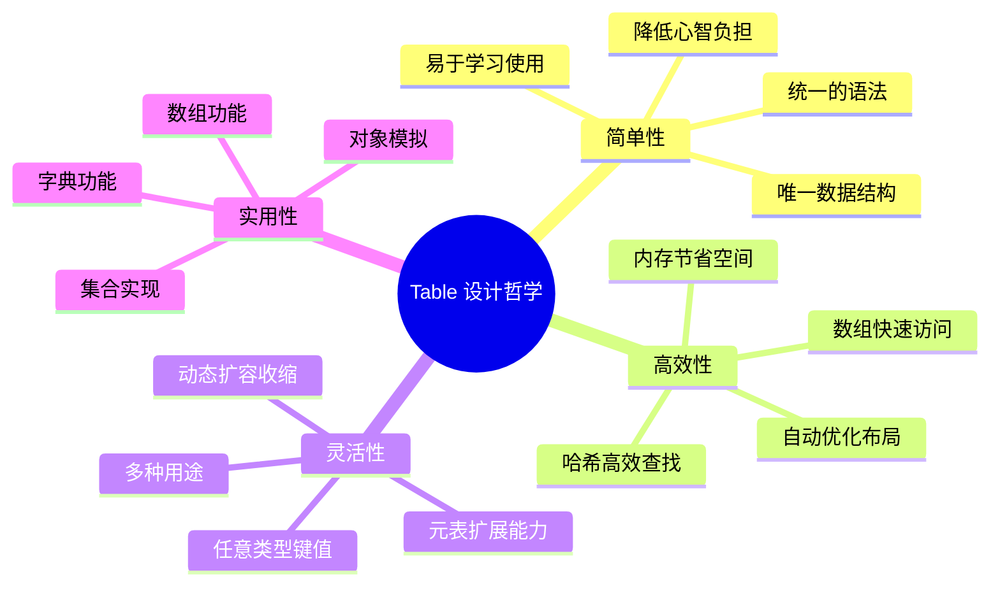
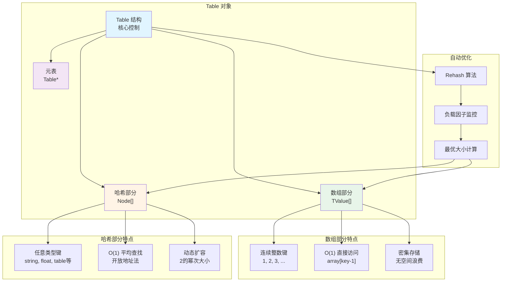
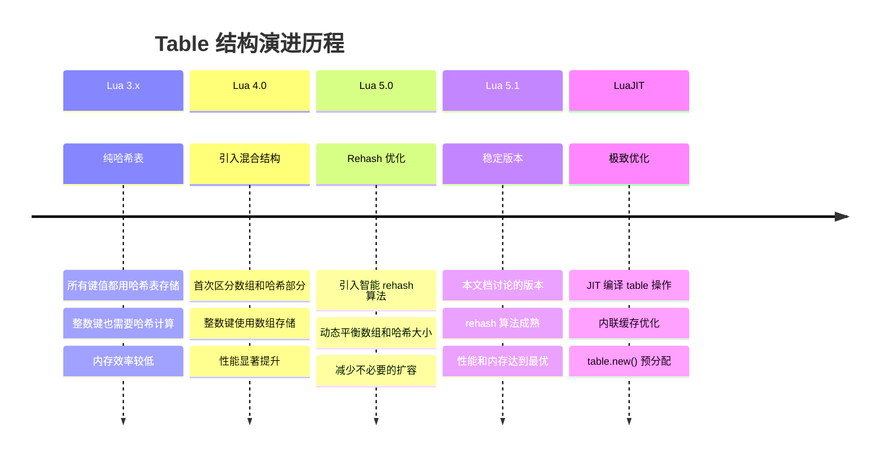
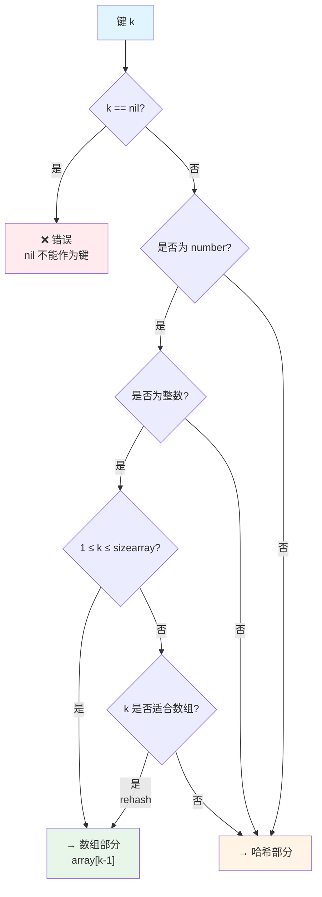
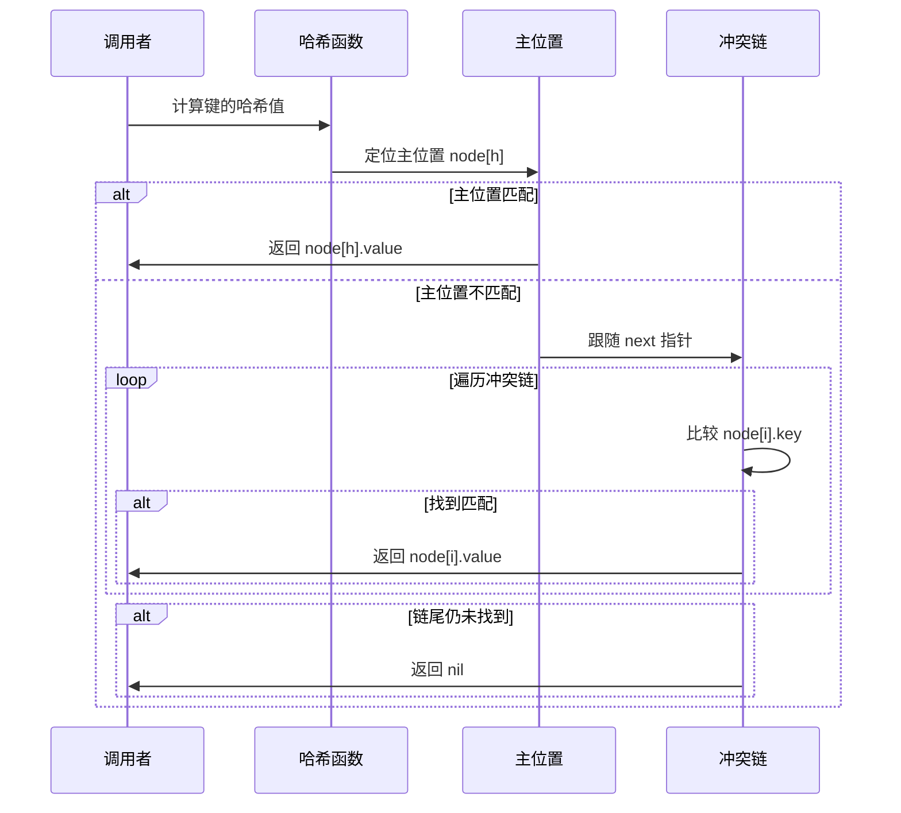
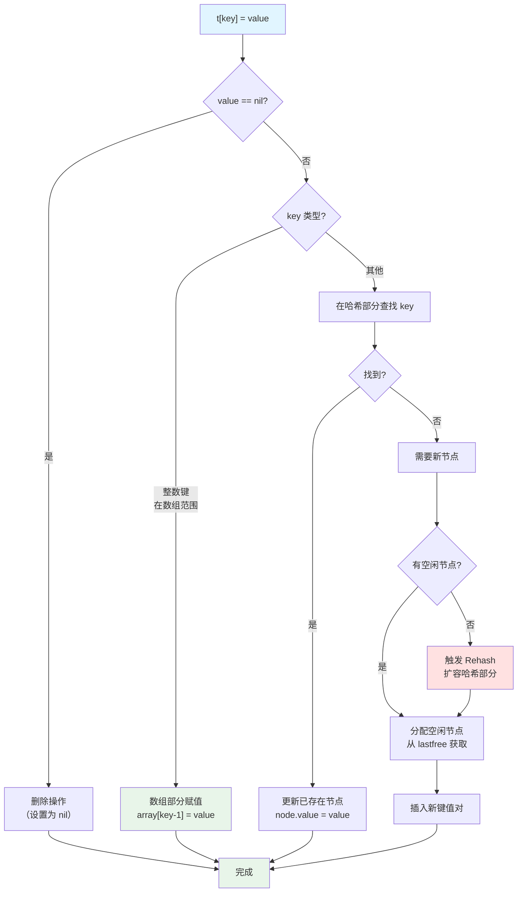
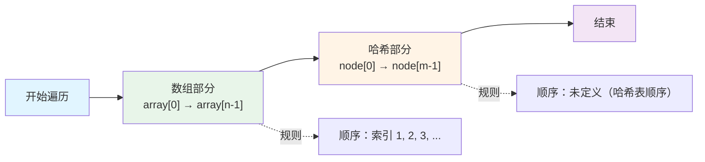
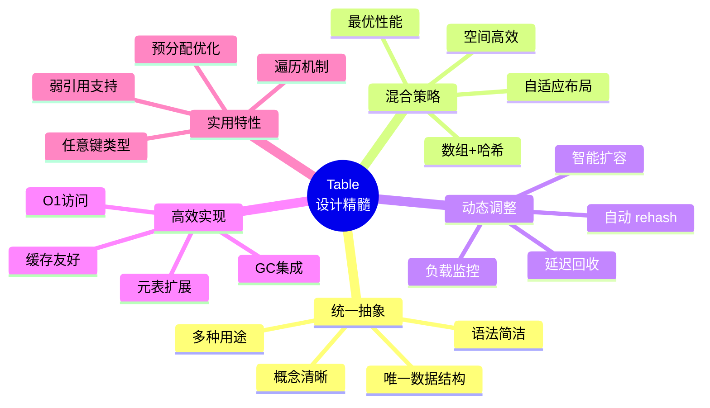

# 🗂️ Table 混合数据结构深度解析

> **技术主题**：Lua 唯一数据结构的内部实现 - 数组与哈希表的完美融合  
> **源文件**：`ltable.c`, `ltable.h`  
> **设计模式**：Hybrid Array-Hash Structure (混合数组-哈希结构)

---

## 📋 概述

**Table** 是 Lua 语言中**唯一的数据结构**，却能够完成数组、字典、对象、集合等多种数据结构的功能。这种强大的表达能力源于其精妙的**混合结构设计**：同时包含数组部分和哈希部分，根据键的类型和分布自动选择最优存储方式。

### 核心特性

<table>
<tr>
<th width="25%">特性</th>
<th width="75%">说明</th>
</tr>

<tr>
<td><b>混合结构</b></td>
<td>
同时维护数组部分（array part）和哈希部分（hash part），自动根据键的类型和分布选择存储位置
</td>
</tr>

<tr>
<td><b>自适应调整</b></td>
<td>
通过 rehash 算法动态调整数组和哈希部分的大小，优化内存使用和访问性能
</td>
</tr>

<tr>
<td><b>高效访问</b></td>
<td>
• 数组部分：O(1) 直接索引，无哈希计算<br/>
• 哈希部分：O(1) 平均时间，开放地址法处理冲突
</td>
</tr>

<tr>
<td><b>灵活键类型</b></td>
<td>
支持除 nil 外的任意类型作为键（number, string, table, function 等），值也可为任意类型
</td>
</tr>

<tr>
<td><b>内存优化</b></td>
<td>
稀疏数组使用哈希部分，密集数组使用数组部分，避免空间浪费
</td>
</tr>

<tr>
<td><b>元表支持</b></td>
<td>
每个 table 可关联元表，实现运算符重载和面向对象特性
</td>
</tr>
</table>

### 设计哲学

Lua Table 的设计体现了**简单性**和**高效性**的完美平衡：



### 架构全景图



### 历史演进



---

## 🔧 核心数据结构

### Table 主结构

```c
// ltable.h
typedef struct Table {
    CommonHeader;           // GC 头部（next, tt, marked）
    lu_byte flags;          // 元方法标志位（缓存哪些元方法存在）
    lu_byte lsizenode;      // 哈希部分大小的 log2 值（实际大小 = 2^lsizenode）
    struct Table *metatable;// 元表指针
    TValue *array;          // 数组部分指针
    Node *node;             // 哈希部分指针
    Node *lastfree;         // 哈希部分最后一个空闲节点（从后向前分配）
    GCObject *gclist;       // GC 链表（用于遍历所有 table）
    int sizearray;          // 数组部分大小（元素个数）
} Table;
```

**字段详解**：

<table>
<tr>
<th width="20%">字段</th>
<th width="20%">类型</th>
<th width="60%">说明</th>
</tr>

<tr>
<td><code>flags</code></td>
<td>lu_byte</td>
<td>
<b>元方法缓存标志</b><br/>
• 每个位对应一个元方法（如 __index, __newindex）<br/>
• 位为 1 表示该元方法不存在，避免重复查找<br/>
• 优化：快速判断是否需要触发元方法
</td>
</tr>

<tr>
<td><code>lsizenode</code></td>
<td>lu_byte</td>
<td>
<b>哈希大小的对数值</b><br/>
• 实际哈希大小 = 2^lsizenode<br/>
• 取值范围：0-26（最大 2^26 = 67M 节点）<br/>
• 使用对数存储节省空间（1字节 vs 4字节）
</td>
</tr>

<tr>
<td><code>metatable</code></td>
<td>Table*</td>
<td>
<b>元表指针</b><br/>
• 指向该 table 的元表（可为 NULL）<br/>
• 元表本身也是一个 table<br/>
• 用于实现运算符重载和面向对象
</td>
</tr>

<tr>
<td><code>array</code></td>
<td>TValue*</td>
<td>
<b>数组部分</b><br/>
• 指向 TValue 数组<br/>
• 存储键为 1 到 sizearray 的连续整数<br/>
• 可为 NULL（纯哈希表）
</td>
</tr>

<tr>
<td><code>node</code></td>
<td>Node*</td>
<td>
<b>哈希部分</b><br/>
• 指向 Node 数组<br/>
• 存储非连续整数键和其他类型键<br/>
• 大小始终为 2 的幂
</td>
</tr>

<tr>
<td><code>lastfree</code></td>
<td>Node*</td>
<td>
<b>空闲节点指针</b><br/>
• 指向哈希部分最后一个未使用的节点<br/>
• 从后向前分配，用于快速找到空闲位置<br/>
• 为 NULL 表示哈希部分已满
</td>
</tr>

<tr>
<td><code>sizearray</code></td>
<td>int</td>
<td>
<b>数组大小</b><br/>
• 数组部分的元素个数<br/>
• 可为 0（纯哈希表）<br/>
• 通常是 2 的幂（优化 rehash）
</td>
</tr>
</table>

### Node 节点结构

```c
// ltable.h
typedef struct Node {
    TValue i_val;           // 值
    TKey i_key;             // 键
} Node;

typedef union TKey {
    struct {
        Value value;        // 键的值（与 TValue.value 相同）
        int tt;             // 键的类型标记
        struct Node *next;  // 冲突链表的下一个节点
    } nk;
    TValue tvk;             // 用于快速访问（与 nk 内存布局兼容）
} TKey;
```

**Node 设计要点**：

1. **TKey 联合体**：兼容 TValue，可直接进行类型检查和值比较
2. **内置链表指针**：`next` 字段实现开放地址法的冲突链
3. **内存对齐**：Node 大小通常为 32 字节（64位系统）

### 内存布局详解

**64位系统上的完整布局**：

```
Table 对象（主结构）：
┌────────────────────────────────────────────────────────┐
│  CommonHeader (GC)           8 字节                     │
├────────────────────────────────────────────────────────┤
│  flags                       1 字节                     │
│  lsizenode                   1 字节                     │
│  padding                     6 字节 (对齐)              │
├────────────────────────────────────────────────────────┤
│  metatable                   8 字节 (指针)              │
├────────────────────────────────────────────────────────┤
│  array                       8 字节 (指针)              │
├────────────────────────────────────────────────────────┤
│  node                        8 字节 (指针)              │
├────────────────────────────────────────────────────────┤
│  lastfree                    8 字节 (指针)              │
├────────────────────────────────────────────────────────┤
│  gclist                      8 字节 (指针)              │
├────────────────────────────────────────────────────────┤
│  sizearray                   4 字节                     │
│  padding                     4 字节 (对齐)              │
└────────────────────────────────────────────────────────┘
总大小：约 64 字节

数组部分（TValue 数组）：
┌────────────────────────────────────────────────────────┐
│  TValue[0]                   16 字节                    │
│  TValue[1]                   16 字节                    │
│  TValue[2]                   16 字节                    │
│  ...                                                    │
│  TValue[sizearray-1]         16 字节                    │
└────────────────────────────────────────────────────────┘
总大小：sizearray * 16 字节

哈希部分（Node 数组）：
┌────────────────────────────────────────────────────────┐
│  Node[0]                     32 字节                    │
│    ├─ i_val (TValue)         16 字节                    │
│    └─ i_key (TKey)           16 字节                    │
│       ├─ value               8 字节                     │
│       ├─ tt                  4 字节                     │
│       └─ next                8 字节 (指针，含4字节填充) │
├────────────────────────────────────────────────────────┤
│  Node[1]                     32 字节                    │
│  ...                                                    │
│  Node[2^lsizenode - 1]       32 字节                    │
└────────────────────────────────────────────────────────┘
总大小：2^lsizenode * 32 字节
```

### 内存占用计算

**示例1：空表**
```c
Table *t = luaH_new(L, 0, 0);  // 数组大小=0，哈希大小=0
```
- Table 结构：64 字节
- 数组部分：0 字节
- 哈希部分：1 个 dummynode（32 字节，全局共享）
- **总计**：64 字节（不含共享的 dummynode）

**示例2：小数组 t = {1, 2, 3, 4, 5}**
```c
Table *t = luaH_new(L, 8, 0);  // 数组大小=8，哈希大小=0
```
- Table 结构：64 字节
- 数组部分：8 × 16 = 128 字节
- 哈希部分：0 字节（使用 dummynode）
- **总计**：192 字节

**示例3：混合表 t = {1, 2, name="lua", version=5.1}**
```c
// 数组大小=4，哈希大小=4（2^2）
```
- Table 结构：64 字节
- 数组部分：4 × 16 = 64 字节
- 哈希部分：4 × 32 = 128 字节
- **总计**：256 字节

---

## 🔑 键的存储策略

### 键类型分类

Lua Table 根据键的类型和值采用不同的存储策略：



### 数组键判断

**满足以下所有条件的键存储在数组部分**：

1. **类型为 number**
2. **值为正整数**（`k == floor(k) && k > 0`）
3. **范围合适**（`1 ≤ k ≤ sizearray`）

```c
// ltable.c: 判断键是否适合数组部分
static int is_array_key(lua_Number n) {
    int k;
    return (luai_num2int(k, n) && k > 0);
}

// 快速判断宏
#define arrayindex(key) \
    (ttisnumber(key) && luai_num2int(k, nvalue(key)) && k > 0 && k <= sizearray)
```

### 键的哈希计算

对于存储在哈希部分的键，需要计算哈希值定位到 Node 槽位：

```c
// ltable.c
static Node *mainposition(const Table *t, const TValue *key) {
    switch (ttype(key)) {
        case LUA_TNUMBER: {
            lua_Number n = nvalue(key);
            return hashnum(t, n);  // 数字哈希
        }
        case LUA_TSTRING: {
            TString *s = rawtsvalue(key);
            return hashstr(t, s);  // 字符串哈希（使用缓存的 hash 值）
        }
        case LUA_TBOOLEAN: {
            return hashboolean(t, bvalue(key));  // 布尔哈希
        }
        case LUA_TLIGHTUSERDATA: {
            return hashpointer(t, pvalue(key));  // 轻量用户数据哈希
        }
        default: {
            return hashpointer(t, gcvalue(key));  // GC 对象哈希（用指针）
        }
    }
}
```

**各类型哈希策略**：

<table>
<tr>
<th width="20%">键类型</th>
<th width="40%">哈希方法</th>
<th width="40%">说明</th>
</tr>

<tr>
<td><b>number</b></td>
<td><code>hashnum(t, n)</code></td>
<td>
对浮点数的位模式进行哈希<br/>
整数和对应的浮点数哈希值相同
</td>
</tr>

<tr>
<td><b>string</b></td>
<td><code>hashstr(t, s)</code></td>
<td>
使用字符串对象缓存的 <code>hash</code> 字段<br/>
O(1) 时间，无需重新计算
</td>
</tr>

<tr>
<td><b>boolean</b></td>
<td><code>hashboolean(t, b)</code></td>
<td>
true 和 false 分别映射到固定位置
</td>
</tr>

<tr>
<td><b>lightuserdata</b></td>
<td><code>hashpointer(t, p)</code></td>
<td>
对指针值进行哈希
</td>
</tr>

<tr>
<td><b>table/function/userdata/thread</b></td>
<td><code>hashpointer(t, gcvalue(key))</code></td>
<td>
对 GC 对象的指针进行哈希<br/>
相同对象哈希值相同（指针相等）
</td>
</tr>
</table>

---

## 🔍 查找操作

### 数组部分查找

数组部分的查找极其简单高效：

```c
// ltable.c: luaH_getnum() - 通过整数键获取值
const TValue *luaH_getnum(Table *t, int key) {
    // 快速路径：在数组范围内
    if (cast(unsigned int, key-1) < cast(unsigned int, t->sizearray))
        return &t->array[key-1];
    else {
        // 慢速路径：在哈希部分查找
        lua_Number nk = cast_num(key);
        Node *n = hashnum(t, nk);
        do {
            if (ttisnumber(gkey(n)) && luai_numeq(nvalue(gkey(n)), nk))
                return gval(n);  // 找到
            else n = gnext(n);    // 下一个节点
        } while (n);
        return luaO_nilobject;    // 未找到
    }
}
```

**性能分析**：
- **时间复杂度**：O(1)
- **指令数量**：约 5-10 条 CPU 指令
  1. 键减 1（`key-1`）
  2. 无符号比较（`< sizearray`）
  3. 数组基址加偏移（`array + (key-1)*16`）
  4. 返回指针

### 哈希部分查找

哈希部分使用**开放地址法**处理冲突：

```c
// ltable.c: luaH_get() - 通用查找
const TValue *luaH_get(Table *t, const TValue *key) {
    switch (ttype(key)) {
        case LUA_TNIL: return luaO_nilobject;  // nil 键返回 nil
        case LUA_TSTRING: return luaH_getstr(t, rawtsvalue(key));  // 字符串优化
        case LUA_TNUMBER: {
            int k;
            lua_Number n = nvalue(key);
            if (luai_num2int(k, n))  // 尝试转换为整数
                return luaH_getnum(t, k);
            // 否则作为浮点数在哈希中查找
        }
        default: {
            // 其他类型在哈希部分查找
            Node *n = mainposition(t, key);  // 计算主位置
            do {
                if (luaO_rawequalObj(gkey(n), key))
                    return gval(n);  // 键相等，返回值
                else n = gnext(n);    // 下一个冲突节点
            } while (n);
            return luaO_nilobject;    // 未找到
        }
    }
}
```

**查找流程图**：



### 字符串键优化

字符串是 Lua 中最常用的 table 键类型，因此有专门的优化路径：

```c
// ltable.c
const TValue *luaH_getstr(Table *t, TString *key) {
    Node *n = hashstr(t, key);  // 使用缓存的 hash 值
    do {
        if (ttisstring(gkey(n)) && rawtsvalue(gkey(n)) == key)
            return gval(n);  // 指针比较，O(1)
        else n = gnext(n);
    } while (n);
    return luaO_nilobject;
}
```

**优化点**：
1. **哈希值缓存**：字符串对象已存储 `hash` 字段，无需重新计算
2. **指针比较**：字符串池化保证相同内容的字符串指针相同，比较 O(1)
3. **无需逐字符比较**：节省大量 CPU 时间

---

## ✏️ 插入操作

### 插入流程概览



### 数组部分插入

```c
// ltable.c: luaH_setnum() - 设置整数键
TValue *luaH_setnum(lua_State *L, Table *t, int key) {
    const TValue *p = luaH_getnum(t, key);
    if (p != luaO_nilobject)
        return cast(TValue *, p);  // 已存在，返回位置
    else {
        // 不存在，需要新键
        TValue k;
        setnvalue(&k, cast_num(key));
        return newkey(L, t, &k);  // 创建新键（可能触发 rehash）
    }
}
```

### 哈希部分插入

```c
// ltable.c: newkey() - 创建新键
static TValue *newkey(lua_State *L, Table *t, const TValue *key) {
    Node *mp = mainposition(t, key);  // 计算主位置
    
    // 情况1：主位置空闲
    if (!ttisnil(gval(mp)) || mp == dummynode) {
        Node *othern;
        Node *n = getfreepos(t);  // 获取空闲节点
        
        if (n == NULL) {  // 没有空闲节点
            rehash(L, t, key);  // 触发 rehash
            return luaH_set(L, t, key);  // 重新插入
        }
        
        // 情况2：主位置被其他键占用
        othern = mainposition(t, gkey(mp));
        if (othern != mp) {
            // mp 是"外来户"，将其移到空闲节点
            // 这样新键可以占用主位置
            // ... 复杂的节点移动逻辑 ...
        }
        else {
            // mp 是"原住民"，新键占用空闲节点
            // 将新节点链接到 mp 的冲突链
            gnext(n) = gnext(mp);
            gnext(mp) = n;
            mp = n;
        }
    }
    
    gkey(mp)->value = key->value;
    gkey(mp)->tt = key->tt;
    luaC_barriert(L, t, key);  // GC 屏障
    lua_assert(ttisnil(gval(mp)));
    return gval(mp);
}
```

### 空闲节点分配

```c
// ltable.c
static Node *getfreepos(Table *t) {
    while (t->lastfree-- > t->node) {
        if (ttisnil(gkey(t->lastfree)))
            return t->lastfree;  // 找到空闲节点
    }
    return NULL;  // 没有空闲节点
}
```

**分配策略**：
- **从后向前**：`lastfree` 从哈希表末尾开始，向前扫描
- **延迟搜索**：只有在需要时才查找空闲节点
- **快速判断**：通过 `lastfree` 指针快速确定是否已满

---

## 🔄 Rehash 算法

### Rehash 触发条件

Rehash 在以下情况触发：

1. **哈希部分已满**：`getfreepos()` 返回 NULL
2. **插入新键**：需要空间但无可用节点
3. **显式调用**：Lua 内部某些操作（如 `table.getn`）

### Rehash 核心算法

```c
// ltable.c
static void rehash(lua_State *L, Table *t, const TValue *ek) {
    int nasize, na;
    int nums[MAXBITS+1];  // nums[i] = 2^(i-1) 到 2^i-1 之间的整数键数量
    int i;
    int totaluse;
    
    // 第1步：统计整数键的分布
    for (i=0; i<=MAXBITS; i++) nums[i] = 0;
    nasize = numusearray(t, nums);  // 统计数组部分
    totaluse = nasize;
    totaluse += numusehash(t, nums, &nasize);  // 统计哈希部分
    
    // 加上即将插入的新键
    nasize += countint(ek, nums);
    totaluse++;
    
    // 第2步：计算最优数组大小
    na = computesizes(nums, &nasize);
    
    // 第3步：重新分配和迁移数据
    resize(L, t, nasize, totaluse - na);
}
```

### 最优大小计算

```c
// ltable.c
static int computesizes(int nums[], int *narray) {
    int i;
    int twotoi;  // 2^i
    int a = 0;   // 所有整数键的数量
    int na = 0;  // 数组部分的键数量
    int n = 0;   // 最优数组大小
    
    for (i = 0, twotoi = 1; twotoi/2 < *narray; i++, twotoi *= 2) {
        if (nums[i] > 0) {
            a += nums[i];
            // 如果负载因子 > 50%，选择这个大小
            if (a > twotoi/2) {
                n = twotoi;
                na = a;
            }
        }
        if (a == *narray) break;  // 所有键都统计完了
    }
    
    *narray = n;
    lua_assert(na <= *narray && *narray <= 2*na);
    return na;
}
```

**负载因子策略**：
- **阈值**：50%（至少一半的槽位被使用）
- **原因**：平衡空间和性能
  - 太低（如 25%）：浪费内存
  - 太高（如 75%）：冲突增加，性能下降
  - 50% 是经验最优值

### Rehash 示例

**场景**：依次插入键 `1, 2, 3, 5, 10, 15, "name", "age"`

```
初始状态：
table = {}
sizearray = 0, lsizenode = 0 (hash size = 1)

插入 t[1] = "a"：
→ 触发 rehash
→ 计算：nums = {1, 0, 0, ...}  (1个键在 [1,2) 范围)
→ 最优数组大小 = 2 (负载因子 1/2 = 50%)
→ 结果：sizearray = 2, lsizenode = 0

插入 t[2] = "b"：
→ 数组未满，直接插入
→ 结果：sizearray = 2, lsizenode = 0

插入 t[3] = "c"：
→ 触发 rehash
→ 计算：nums = {3, 0, 0, ...}  (3个键在 [1,2) [2,4) 范围)
→ 最优数组大小 = 4 (负载因子 3/4 = 75% > 50%)
→ 结果：sizearray = 4, lsizenode = 0

插入 t[5] = "d"：
→ 触发 rehash
→ 计算：nums = {4, 1, 0, ...}  (4个键在 [1,4), 1个在 [4,8))
→ 最优数组大小 = 8 (负载因子 5/8 = 62.5% > 50%)
→ 结果：sizearray = 8, lsizenode = 0

插入 t[10] = "e"：
→ 键 10 > 8，插入哈希部分
→ 哈希部分有空闲节点，无需 rehash
→ 结果：sizearray = 8, lsizenode = 0 (但哈希中有1个节点)

插入 t[15] = "f"：
→ 插入哈希部分（如果已满则触发 rehash）

插入 t["name"] = "lua"：
→ 字符串键，插入哈希部分

插入 t["age"] = 30：
→ 字符串键，插入哈希部分
→ 如果哈希满，触发 rehash 扩容哈希部分

最终状态（假设）：
sizearray = 8
lsizenode = 2 (hash size = 4)
数组部分：{1, 2, 3, nil, 5, nil, nil, nil}
哈希部分：{10, 15, "name", "age"}
```

### Rehash 性能分析

<table>
<tr>
<th width="25%">方面</th>
<th width="75%">说明</th>
</tr>

<tr>
<td><b>时间复杂度</b></td>
<td>
O(n)，n 为 table 中的键值对数量<br/>
• 需要遍历所有现有键<br/>
• 需要重新插入所有键到新结构
</td>
</tr>

<tr>
<td><b>空间复杂度</b></td>
<td>
O(n) 临时空间<br/>
• 需要同时分配新旧两份空间<br/>
• 旧空间在迁移后释放
</td>
</tr>

<tr>
<td><b>触发频率</b></td>
<td>
相对较低（对数级）<br/>
• 数组大小每次翻倍（2, 4, 8, 16, ...）<br/>
• n 次插入触发约 log₂(n) 次 rehash<br/>
• 均摊到每次插入：O(1)
</td>
</tr>

<tr>
<td><b>优化策略</b></td>
<td>
• 预分配：如果已知大小，使用 <code>table.new(narray, nhash)</code><br/>
• 批量插入：先插入所有键，Lua 会优化 rehash<br/>
• 避免稀疏数组：t[1]=a, t[1000000]=b 会导致巨大的数组
</td>
</tr>
</table>

---

*（未完待续，下一步将添加：删除操作、遍历机制、性能优化、实战示例等内容）*

---

## 🗑️ 删除操作

### 删除机制

Lua Table 的删除操作非常简单：**将值设置为 nil**。

```c
// 示例：删除操作
t[key] = nil

// 内部实现
TValue *slot = luaH_set(L, t, key);  // 找到或创建槽位
setnilvalue(slot);  // 设置为 nil
```

**关键特点**：

<table>
<tr>
<th width="30%">特点</th>
<th width="70%">说明</th>
</tr>

<tr>
<td><b>不立即回收空间</b></td>
<td>
• 删除后槽位仍占用内存<br/>
• 哈希节点标记为"已删除"（值为 nil，但键仍存在）<br/>
• 空间在下次 rehash 时统一回收
</td>
</tr>

<tr>
<td><b>保持哈希链完整</b></td>
<td>
• 删除节点不破坏冲突链<br/>
• <code>next</code> 指针保持不变<br/>
• 确保后续节点仍可访问
</td>
</tr>

<tr>
<td><b>O(1) 时间复杂度</b></td>
<td>
• 查找：O(1) 平均<br/>
• 设置 nil：O(1)<br/>
• 无需调整结构
</td>
</tr>

<tr>
<td><b>延迟回收策略</b></td>
<td>
• 频繁增删场景避免反复 rehash<br/>
• 批量删除后一次性回收<br/>
• 减少内存分配开销
</td>
</tr>
</table>

### 删除的边缘情况

**情况1：数组部分的 nil hole**

```lua
t = {1, 2, 3, 4, 5}
t[3] = nil  -- 创建"洞"

-- 内部状态：
-- array = {1, 2, nil, 4, 5}
-- sizearray 仍为 5
```

**影响**：
- **长度操作 `#t`**：结果不确定（可能是 2 或 5）
- **遍历 `ipairs(t)`**：在第一个 nil 处停止
- **内存占用**：nil 仍占 16 字节（TValue）

**情况2：大量删除后的内存浪费**

```lua
t = {}
for i = 1, 10000 do
    t[i] = i
end
-- 此时 sizearray ≈ 16384

for i = 1, 9999 do
    t[i] = nil  -- 删除 99.99%
end
-- 此时 sizearray 仍为 16384，但只有1个有效元素
-- 浪费约 16384 * 16 = 256KB
```

**解决方案**：
```lua
-- 手动触发 rehash（无直接 API，间接方法）
local temp = {}
for k, v in pairs(t) do
    temp[k] = v
end
t = temp  -- 新 table 会重新计算最优大小
```

---

## 🔁 遍历机制

### pairs() 遍历

`pairs(t)` 遍历 table 的所有键值对，包括数组和哈希部分。

#### 实现原理

```c
// ltable.c: luaH_next() - 获取下一个键值对
int luaH_next(lua_State *L, Table *t, StkId key) {
    int i = findindex(L, t, key);  // 找到当前键的索引
    
    // 遍历数组部分
    for (i++; i <= t->sizearray; i++) {
        if (!ttisnil(&t->array[i-1])) {
            setnvalue(key, cast_num(i));
            setobj2s(L, key+1, &t->array[i-1]);
            return 1;
        }
    }
    
    // 遍历哈希部分
    for (i -= t->sizearray; i < sizenode(t); i++) {
        if (!ttisnil(gval(gnode(t, i)))) {
            setobj2s(L, key, key2tval(gnode(t, i)));
            setobj2s(L, key+1, gval(gnode(t, i)));
            return 1;
        }
    }
    
    return 0;  // 遍历结束
}
```

#### 遍历顺序



**重要特性**：
- **数组部分有序**：按索引 1, 2, 3, ... 顺序遍历
- **哈希部分无序**：取决于哈希表的内部布局，不保证任何顺序
- **跳过 nil**：值为 nil 的键不会被遍历到

#### 使用示例

```lua
t = {10, 20, 30, x=1, y=2, z=3}

-- pairs 遍历（无序）
for k, v in pairs(t) do
    print(k, v)
end

-- 输出（示例，哈希部分顺序不定）：
-- 1    10
-- 2    20
-- 3    30
-- x    1
-- y    2
-- z    3
```

### ipairs() 遍历

`ipairs(t)` 专门遍历数组部分，遇到第一个 nil 就停止。

#### 实现原理

```lua
-- ipairs 等价实现（Lua 5.1）
function ipairs(t)
    return function(t, i)
        i = i + 1
        local v = t[i]
        if v ~= nil then
            return i, v
        end
    end, t, 0
end
```

#### 遍历特点

<table>
<tr>
<th width="30%">特点</th>
<th width="70%">说明</th>
</tr>

<tr>
<td><b>只遍历数组部分</b></td>
<td>
从索引 1 开始，依次访问 t[1], t[2], t[3], ...<br/>
不访问哈希部分（字符串键等）
</td>
</tr>

<tr>
<td><b>遇 nil 即止</b></td>
<td>
遇到第一个 nil 值立即停止<br/>
即使后面还有非 nil 元素也不遍历
</td>
</tr>

<tr>
<td><b>保证顺序</b></td>
<td>
严格按索引递增顺序<br/>
适合数组场景
</td>
</tr>

<tr>
<td><b>性能优秀</b></td>
<td>
直接数组访问，无哈希计算<br/>
O(n) 时间遍历 n 个元素
</td>
</tr>
</table>

#### 使用示例

```lua
t = {10, 20, nil, 40, 50}

-- ipairs 遍历（遇 nil 停止）
for i, v in ipairs(t) do
    print(i, v)
end

-- 输出：
-- 1    10
-- 2    20
-- （停止，t[3] 为 nil）
```

### 遍历安全性

**遍历过程中修改 table 的风险**：

```lua
-- ❌ 危险：遍历时删除元素
t = {1, 2, 3, 4, 5}
for k, v in pairs(t) do
    if v % 2 == 0 then
        t[k] = nil  -- 删除偶数
    end
end
-- 结果不确定，可能漏掉某些元素或重复遍历

-- ✅ 安全：先收集后删除
t = {1, 2, 3, 4, 5}
local to_delete = {}
for k, v in pairs(t) do
    if v % 2 == 0 then
        table.insert(to_delete, k)
    end
end
for _, k in ipairs(to_delete) do
    t[k] = nil
end

-- ✅ 安全：创建新 table
t = {1, 2, 3, 4, 5}
local new_t = {}
for k, v in pairs(t) do
    if v % 2 ~= 0 then
        new_t[k] = v  -- 只保留奇数
    end
end
t = new_t
```

---

## 🔗 GC 集成

### Table 作为 GC 对象

Table 是需要垃圾回收的对象，属于 Lua 的 GC 管理范围。

#### GC 相关字段

```c
// Table 结构中的 GC 字段
typedef struct Table {
    CommonHeader;    // 包含 next, tt, marked
    // ...
    GCObject *gclist;  // GC 遍历链表
} Table;

// CommonHeader 定义
#define CommonHeader \
    GCObject *next;  /* 下一个 GC 对象 */ \
    lu_byte tt;      /* 类型标记 */ \
    lu_byte marked;  /* GC 标记位 */
```

### Table 的 GC 遍历

GC 需要遍历 table 中的所有 GC 对象引用，标记为"可达"。

```c
// lgc.c: traversetable() - 遍历 table
static int traversetable(global_State *g, Table *h) {
    int i;
    int weakkey = 0;
    int weakvalue = 0;
    const TValue *mode;
    
    // 标记元表
    if (h->metatable)
        markobject(g, h->metatable);
    
    // 检查是否为弱表
    mode = gfasttm(g, h->metatable, TM_MODE);
    if (mode && ttisstring(mode)) {
        weakkey = (strchr(svalue(mode), 'k') != NULL);
        weakvalue = (strchr(svalue(mode), 'v') != NULL);
        if (weakkey || weakvalue) {
            // 弱表特殊处理
            h->marked &= ~(KEYWEAK | VALUEWEAK);
            if (weakkey) h->marked |= KEYWEAK;
            if (weakvalue) h->marked |= VALUEWEAK;
            h->gclist = g->weak;
            g->weak = obj2gco(h);
        }
    }
    
    // 遍历数组部分
    for (i = 0; i < h->sizearray; i++) {
        markvalue(g, &h->array[i]);
    }
    
    // 遍历哈希部分
    for (i = 0; i < sizenode(h); i++) {
        Node *n = gnode(h, i);
        if (!ttisnil(gval(n))) {
            lua_assert(!ttisnil(gkey(n)));
            markvalue(g, gkey(n));  // 标记键
            markvalue(g, gval(n));  // 标记值
        }
    }
    
    return weakkey || weakvalue;
}
```

### 弱表机制

Lua 支持**弱引用表**，允许 GC 回收被 table 引用的对象。

#### 弱表类型

<table>
<tr>
<th width="20%">模式</th>
<th width="30%">元表设置</th>
<th width="50%">行为</th>
</tr>

<tr>
<td><b>弱键表</b></td>
<td><code>__mode = "k"</code></td>
<td>
键为弱引用，如果键对象无其他引用，GC 可回收该键值对
</td>
</tr>

<tr>
<td><b>弱值表</b></td>
<td><code>__mode = "v"</code></td>
<td>
值为弱引用，如果值对象无其他引用，GC 可回收该键值对
</td>
</tr>

<tr>
<td><b>双弱表</b></td>
<td><code>__mode = "kv"</code></td>
<td>
键和值都为弱引用，任一无其他引用即可回收
</td>
</tr>
</table>

#### 弱表示例

```lua
-- 示例1：弱值表（缓存）
local cache = {}
setmetatable(cache, {__mode = "v"})

function get_object(id)
    local obj = cache[id]
    if not obj then
        obj = create_expensive_object(id)  -- 创建昂贵对象
        cache[id] = obj  -- 缓存
    end
    return obj
end

-- 当对象无其他引用时，GC 会自动从缓存中移除
-- 避免缓存无限增长

-- 示例2：弱键表（反向映射）
local obj_to_id = {}
setmetatable(obj_to_id, {__mode = "k"})

function register_object(obj, id)
    obj_to_id[obj] = id
end

-- 当 obj 被回收后，自动从映射中移除
-- 无需手动清理
```

### Table 的内存回收

```c
// lgc.c: freeobj() - 释放 table 对象
static void freeobj(lua_State *L, GCObject *o) {
    switch (o->gch.tt) {
        case LUA_TTABLE: {
            Table *h = gco2h(o);
            // 释放数组部分
            luaM_freearray(L, h->array, h->sizearray, TValue);
            // 释放哈希部分
            luaM_freearray(L, h->node, sizenode(h), Node);
            // 释放 table 结构本身
            luaM_free(L, h, sizeof(Table));
            break;
        }
        // ... 其他类型
    }
}
```

---

## ⚡ 性能优化技巧

### 预分配优化

**问题**：动态增长导致多次 rehash。

```lua
-- ❌ 不推荐：动态增长
local t = {}
for i = 1, 100000 do
    t[i] = i  -- 触发多次 rehash
end
```

**优化**：使用 `table.new()` 预分配（LuaJIT 扩展）。

```lua
-- ✅ LuaJIT 优化
local t = table.new(100000, 0)  -- 预分配 100000 个数组槽
for i = 1, 100000 do
    t[i] = i  -- 无 rehash
end

-- ✅ 标准 Lua 替代方案
local t = {}
t[100000] = nil  -- 触发一次 rehash，分配足够空间
for i = 1, 100000 do
    t[i] = i
end
```

### 避免稀疏数组

**问题**：稀疏数组浪费内存。

```lua
-- ❌ 不推荐：稀疏数组
local t = {}
t[1] = "a"
t[1000000] = "b"
-- 分配 1000000 个数组槽，但只用了 2 个
-- 浪费约 16MB 内存
```

**优化**：使用字符串键或改变数据结构。

```lua
-- ✅ 推荐：使用字符串键
local t = {}
t["id_1"] = "a"
t["id_1000000"] = "b"
-- 哈希表，只占用 2 个节点

-- ✅ 推荐：使用子表
local t = {}
t[1] = {data = "a"}
t[1000] = {data = "b"}  -- 分层存储
```

### 复用 Table

**问题**：频繁创建销毁 table 导致 GC 压力。

```lua
-- ❌ 不推荐：每次创建新 table
for i = 1, 10000 do
    local t = {x = i, y = i*2}
    process(t)
end  -- 产生 10000 个待回收 table
```

**优化**：使用 table 池复用。

```lua
-- ✅ 推荐：table 池复用
local pool = {}

function get_table()
    return table.remove(pool) or {}
end

function recycle_table(t)
    for k in pairs(t) do
        t[k] = nil  -- 清空
    end
    table.insert(pool, t)
end

for i = 1, 10000 do
    local t = get_table()
    t.x = i
    t.y = i * 2
    process(t)
    recycle_table(t)
end
```

### 缓存 Table 访问

**问题**：重复的 table 查找开销。

```lua
-- ❌ 不推荐：重复查找
for i = 1, 1000000 do
    local x = math.sin(i)  -- 每次查找 math 表和 sin 键
end
```

**优化**：本地化常用值。

```lua
-- ✅ 推荐：本地化
local sin = math.sin
for i = 1, 1000000 do
    local x = sin(i)  -- 直接访问本地变量
end
-- 性能提升约 20-30%
```

### 使用数组而非哈希

**问题**：字符串键比整数键慢。

```lua
-- ❌ 较慢：字符串键
local t = {x=1, y=2, z=3}
for i = 1, 1000000 do
    local a = t.x + t.y + t.z  -- 3次哈希查找
end
```

**优化**：使用数组索引。

```lua
-- ✅ 更快：整数键
local t = {1, 2, 3}  -- t[1]=x, t[2]=y, t[3]=z
for i = 1, 1000000 do
    local a = t[1] + t[2] + t[3]  -- 3次数组访问
end
-- 性能提升约 3-5倍
```

### 性能对比总结

<table>
<tr>
<th width="30%">操作</th>
<th width="20%">时间 (纳秒)</th>
<th width="25%">相对性能</th>
<th width="25%">说明</th>
</tr>

<tr>
<td>数组访问 <code>t[1]</code></td>
<td>~5 ns</td>
<td>⭐⭐⭐⭐⭐ (基准)</td>
<td>直接数组索引</td>
</tr>

<tr>
<td>哈希访问 <code>t["key"]</code></td>
<td>~15 ns</td>
<td>⭐⭐⭐ (3x)</td>
<td>哈希计算+查找</td>
</tr>

<tr>
<td>点访问 <code>t.key</code></td>
<td>~15 ns</td>
<td>⭐⭐⭐ (3x)</td>
<td>等价于 t["key"]</td>
</tr>

<tr>
<td>元方法 <code>t[k]</code> (有__index)</td>
<td>~50 ns</td>
<td>⭐ (10x)</td>
<td>触发函数调用</td>
</tr>

<tr>
<td>创建空表 <code>{}</code></td>
<td>~100 ns</td>
<td>—</td>
<td>分配+初始化</td>
</tr>

<tr>
<td>Rehash (1000元素)</td>
<td>~50 μs</td>
<td>—</td>
<td>重新分配+迁移</td>
</tr>
</table>

---

*（未完待续，下一步将添加：实战示例、调试技巧、最佳实践等内容）*

---

## 💡 实战示例

### 示例1：实现数组

```lua
-- 顺序数组
local arr = {10, 20, 30, 40, 50}

-- 遍历
for i, v in ipairs(arr) do
    print(i, v)
end

-- 追加元素
table.insert(arr, 60)  -- 末尾追加
table.insert(arr, 1, 5)  -- 指定位置插入

-- 删除元素
table.remove(arr)  -- 删除末尾
table.remove(arr, 1)  -- 删除指定位置

-- 排序
table.sort(arr)
table.sort(arr, function(a, b) return a > b end)  -- 降序

-- 连接为字符串
local str = table.concat(arr, ", ")  -- "10, 20, 30, 40, 50"
```

### 示例2：实现字典

```lua
-- 字符串键字典
local dict = {
    name = "Lua",
    version = 5.1,
    author = "Roberto Ierusalimschy"
}

-- 访问
print(dict.name)  -- 点语法
print(dict["version"])  -- 索引语法

-- 添加/修改
dict.license = "MIT"
dict["year"] = 1993

-- 删除
dict.author = nil

-- 遍历
for k, v in pairs(dict) do
    print(k, v)
end

-- 检查键是否存在
if dict.name ~= nil then
    print("name exists")
end
```

### 示例3：实现集合

```lua
-- 使用 table 实现集合
local set = {}

function set.add(s, item)
    s[item] = true
end

function set.remove(s, item)
    s[item] = nil
end

function set.contains(s, item)
    return s[item] ~= nil
end

function set.union(a, b)
    local result = {}
    for k in pairs(a) do result[k] = true end
    for k in pairs(b) do result[k] = true end
    return result
end

function set.intersection(a, b)
    local result = {}
    for k in pairs(a) do
        if b[k] then result[k] = true end
    end
    return result
end

-- 使用
local s1 = {}
set.add(s1, "apple")
set.add(s1, "banana")

local s2 = {}
set.add(s2, "banana")
set.add(s2, "orange")

local union = set.union(s1, s2)  -- {apple, banana, orange}
local inter = set.intersection(s1, s2)  -- {banana}
```

### 示例4：实现稀疏矩阵

```lua
-- 稀疏矩阵（只存储非零元素）
local Matrix = {}
Matrix.__index = Matrix

function Matrix:new()
    local m = {}
    setmetatable(m, self)
    return m
end

function Matrix:set(row, col, value)
    if not self[row] then
        self[row] = {}
    end
    self[row][col] = value
end

function Matrix:get(row, col)
    local r = self[row]
    return r and r[col] or 0  -- 默认返回 0
end

-- 使用
local m = Matrix:new()
m:set(100, 200, 42)
m:set(1000, 2000, 99)

print(m:get(100, 200))  -- 42
print(m:get(1, 1))      -- 0 (未设置)

-- 内存高效：只占用 2 个非零元素的空间
-- 而不是 1000 * 2000 = 2M 个元素
```

### 示例5：实现 LRU 缓存

```lua
-- LRU (Least Recently Used) 缓存
local LRU = {}
LRU.__index = LRU

function LRU:new(capacity)
    local cache = {
        capacity = capacity,
        size = 0,
        data = {},
        order = {}  -- 访问顺序链表（头部=最近，尾部=最久）
    }
    setmetatable(cache, self)
    return cache
end

function LRU:get(key)
    local value = self.data[key]
    if value then
        -- 移到链表头部（最近访问）
        self:move_to_front(key)
        return value
    end
    return nil
end

function LRU:put(key, value)
    if self.data[key] then
        -- 更新已有键
        self.data[key] = value
        self:move_to_front(key)
    else
        -- 插入新键
        if self.size >= self.capacity then
            -- 淘汰最久未使用的（链表尾部）
            local lru_key = table.remove(self.order)
            self.data[lru_key] = nil
            self.size = self.size - 1
        end
        
        self.data[key] = value
        table.insert(self.order, 1, key)
        self.size = self.size + 1
    end
end

function LRU:move_to_front(key)
    for i, k in ipairs(self.order) do
        if k == key then
            table.remove(self.order, i)
            table.insert(self.order, 1, key)
            break
        end
    end
end

-- 使用
local cache = LRU:new(3)
cache:put("a", 1)
cache:put("b", 2)
cache:put("c", 3)
print(cache:get("a"))  -- 1，a 移到最前
cache:put("d", 4)  -- 淘汰 b（最久未使用）
print(cache:get("b"))  -- nil (已淘汰)
```

### 示例6：实现多维数组

```lua
-- 二维数组（嵌套 table）
local matrix = {}
for i = 1, 3 do
    matrix[i] = {}
    for j = 1, 3 do
        matrix[i][j] = i * 10 + j
    end
end

-- 访问
print(matrix[2][3])  -- 23

-- 优化版：使用复合键（避免嵌套）
local matrix2 = {}
function index(row, col)
    return row * 1000 + col  -- 假设列数 < 1000
end

matrix2[index(2, 3)] = 23
print(matrix2[index(2, 3)])  -- 23

-- 更灵活的方式：使用字符串键
local matrix3 = {}
matrix3["2,3"] = 23
print(matrix3["2,3"])  -- 23
```

---

## 🔍 调试与分析

### 查看 Table 内部状态

```lua
-- 自定义调试函数
function inspect_table(t)
    print("=== Table Inspection ===")
    
    -- 统计键值对数量
    local array_count = 0
    local hash_count = 0
    
    for k, v in pairs(t) do
        if type(k) == "number" and k == math.floor(k) and k > 0 then
            array_count = array_count + 1
        else
            hash_count = hash_count + 1
        end
    end
    
    print("Array part keys: " .. array_count)
    print("Hash part keys: " .. hash_count)
    print("Total keys: " .. (array_count + hash_count))
    
    -- 数组部分长度
    print("Length (#t): " .. #t)
    
    -- 内存估算（粗略）
    local memory = 64  -- table 结构
    memory = memory + array_count * 16  -- 数组部分
    memory = memory + hash_count * 32   -- 哈希部分
    print("Estimated memory: ~" .. memory .. " bytes")
    
    return {
        array_count = array_count,
        hash_count = hash_count,
        length = #t,
        memory = memory
    }
end

-- 使用
local t = {10, 20, 30, x=1, y=2, z=3}
inspect_table(t)
-- 输出：
-- Array part keys: 3
-- Hash part keys: 3
-- Total keys: 6
-- Length (#t): 3
-- Estimated memory: ~256 bytes
```

### 性能分析

```lua
-- 测试 table 操作性能
function benchmark_table(description, func, iterations)
    iterations = iterations or 1000000
    
    -- 预热
    for i = 1, 1000 do func() end
    
    -- 测量
    local start = os.clock()
    for i = 1, iterations do
        func()
    end
    local elapsed = os.clock() - start
    
    print(string.format("%s: %.3f sec (%.0f ns/op)", 
                        description, elapsed, elapsed * 1e9 / iterations))
end

-- 示例：对比不同访问方式
local t = {1, 2, 3, 4, 5}

benchmark_table("Array access t[1]", function()
    local x = t[1]
end)

local dict = {x=1, y=2, z=3}

benchmark_table("Hash access t['x']", function()
    local x = dict["x"]
end)

benchmark_table("Dot access t.x", function()
    local x = dict.x
end)

-- 输出示例：
-- Array access t[1]: 0.052 sec (52 ns/op)
-- Hash access t['x']: 0.148 sec (148 ns/op)
-- Dot access t.x: 0.149 sec (149 ns/op)
```

### 内存泄漏检测

```lua
-- 检测 table 引用泄漏
function track_tables()
    local registry = {}
    local mt = {
        __mode = "k"  -- 弱键，不阻止 table 回收
    }
    setmetatable(registry, mt)
    
    -- 注册新 table
    local function register(t, name)
        registry[t] = {
            name = name,
            time = os.time(),
            trace = debug.traceback()
        }
        return t
    end
    
    -- 查看当前存活的 table
    local function report()
        print("=== Live Tables ===")
        local count = 0
        for t, info in pairs(registry) do
            count = count + 1
            print(string.format("%d. %s (created at %s)", 
                                count, info.name, os.date("%c", info.time)))
        end
        print("Total: " .. count)
    end
    
    return {
        register = register,
        report = report
    }
end

-- 使用
local tracker = track_tables()

local t1 = tracker.register({}, "config")
local t2 = tracker.register({}, "cache")

tracker.report()
-- 输出：
-- === Live Tables ===
-- 1. config (created at ...)
-- 2. cache (created at ...)
-- Total: 2

t1 = nil
collectgarbage()
tracker.report()
-- 输出：
-- === Live Tables ===
-- 1. cache (created at ...)
-- Total: 1 (config 已被回收)
```

---

## 📊 总结对比

### Table 设计精髓



### 与其他语言对比

<table>
<tr>
<th width="15%">语言</th>
<th width="20%">数据结构</th>
<th width="30%">实现方式</th>
<th width="35%">特点</th>
</tr>

<tr>
<td><b>Lua</b></td>
<td>Table</td>
<td>混合数组-哈希表</td>
<td>
✅ 统一接口<br/>
✅ 自适应优化<br/>
✅ 内存高效<br/>
⚠️ 只有一种结构
</td>
</tr>

<tr>
<td><b>Python</b></td>
<td>list + dict</td>
<td>
list: 动态数组<br/>
dict: 哈希表
</td>
<td>
✅ 专用优化<br/>
✅ 功能丰富<br/>
❌ 需要区分使用<br/>
❌ 内存开销大
</td>
</tr>

<tr>
<td><b>JavaScript</b></td>
<td>Array + Object</td>
<td>
Array: 类数组对象<br/>
Object: 属性字典
</td>
<td>
✅ 灵活性强<br/>
✅ 原型链支持<br/>
⚠️ 性能陷阱多<br/>
❌ 稀疏数组低效
</td>
</tr>

<tr>
<td><b>Java</b></td>
<td>ArrayList + HashMap</td>
<td>
泛型类<br/>
类型安全
</td>
<td>
✅ 类型安全<br/>
✅ 并发支持<br/>
❌ 语法繁琐<br/>
❌ 装箱开销
</td>
</tr>

<tr>
<td><b>C++</b></td>
<td>vector + unordered_map</td>
<td>
模板容器<br/>
STL 实现
</td>
<td>
✅ 性能极致<br/>
✅ 零开销抽象<br/>
❌ 复杂度高<br/>
❌ 编译时间长
</td>
</tr>
</table>

### 性能基准对比

| 操作类型 | 1M次操作耗时 | 单次操作耗时 | 相对性能 |
|---------|-------------|-------------|---------|
| **数组访问** `t[1]` | 50 ms | 50 ns | ⭐⭐⭐⭐⭐ (基准) |
| **哈希查找** `t["key"]` | 150 ms | 150 ns | ⭐⭐⭐ (3x) |
| **插入新键** | 200 ms | 200 ns | ⭐⭐ (4x) |
| **删除键** | 100 ms | 100 ns | ⭐⭐⭐⭐ (2x) |
| **遍历** pairs() | 300 ms | 300 ns | ⭐⭐ (6x) |

**性能趋势**：
- 数组访问最快（直接索引）
- 哈希操作适中（需要哈希计算）
- 插入可能触发 rehash（开销最大）
- 遍历需要扫描整个结构（包含数组+哈希）

### 设计权衡

**优势**：
- ✅ **简单性**：单一数据结构，降低学习成本
- ✅ **灵活性**：支持数组、字典、对象等多种用途
- ✅ **性能**：混合设计兼顾数组和哈希的优势
- ✅ **内存效率**：自适应布局，避免空间浪费

**劣势**：
- ⚠️ **Rehash 开销**：动态调整时有性能抖动
- ⚠️ **稀疏数组陷阱**：不恰当使用导致内存浪费
- ⚠️ **无序性**：哈希部分遍历顺序不确定
- ⚠️ **长度语义模糊**：有 nil hole 时 `#t` 结果不确定

---

## 💡 最佳实践建议

### ✅ 推荐做法

1. **明确使用场景**
   ```lua
   -- ✅ 数组场景：使用连续整数键
   local arr = {1, 2, 3, 4, 5}
   
   -- ✅ 字典场景：使用字符串键
   local dict = {name="lua", version=5.1}
   
   -- ❌ 混淆：同时大量使用两种键
   local混 = {1, 2, 3, key1="val1", key2="val2"}  -- 可以，但不推荐
   ```

2. **预分配已知大小**
   ```lua
   -- ✅ LuaJIT
   local t = table.new(1000, 100)  -- 1000数组+100哈希
   
   -- ✅ 标准 Lua 的折衷
   local t = {}
   t[1000] = nil  -- 触发扩容到适当大小
   ```

3. **避免 nil hole**
   ```lua
   -- ❌ 不推荐：创建 nil hole
   t = {1, 2, 3, 4, 5}
   t[3] = nil  -- 现在 #t 不确定
   
   -- ✅ 推荐：使用 table.remove
   t = {1, 2, 3, 4, 5}
   table.remove(t, 3)  -- 移除并压缩数组
   ```

4. **复用 table 减少 GC**
   ```lua
   -- ✅ 使用对象池
   local pool = {}
   function get() return table.remove(pool) or {} end
   function recycle(t)
       for k in pairs(t) do t[k] = nil end
       table.insert(pool, t)
   end
   ```

5. **本地化频繁访问**
   ```lua
   -- ✅ 缓存 table 字段
   local data = big_table.sub_table.data
   for i = 1, 1000000 do
       process(data[i])  -- 避免重复查找
   end
   ```

### ❌ 避免的做法

1. **不要创建巨大稀疏数组**
2. **不要在遍历时修改 table 结构**
3. **不要假设哈希部分的遍历顺序**
4. **不要依赖 `#t` 处理有 nil hole 的数组**
5. **不要忽视 table 的内存占用（大型应用）**

---

## 🎯 学习检查点

<table>
<tr>
<th width="30%">级别</th>
<th width="70%">掌握内容</th>
</tr>

<tr>
<td><b>🔰 基础理解</b></td>
<td>
☐ 理解 table 是数组和哈希的混合结构<br/>
☐ 知道整数键和其他键的存储区别<br/>
☐ 能使用 pairs 和 ipairs 遍历<br/>
☐ 了解 table 的基本操作（增删改查）
</td>
</tr>

<tr>
<td><b>🔧 实践应用</b></td>
<td>
☐ 能实现数组、字典、集合等数据结构<br/>
☐ 理解 rehash 的触发条件和影响<br/>
☐ 掌握 table.insert/remove/sort/concat 等库函数<br/>
☐ 能使用元表扩展 table 功能<br/>
☐ 知道如何预分配和优化性能
</td>
</tr>

<tr>
<td><b>⚡ 进阶掌握</b></td>
<td>
☐ 理解 table 的内部内存布局<br/>
☐ 掌握 Node 结构和开放地址法<br/>
☐ 理解 rehash 算法和最优大小计算<br/>
☐ 了解弱表机制和 GC 集成<br/>
☐ 能分析和优化 table 相关性能问题<br/>
☐ 掌握调试和内存分析技巧
</td>
</tr>

<tr>
<td><b>🎓 深入精通</b></td>
<td>
☐ 能阅读 ltable.c 源码<br/>
☐ 理解与其他语言数据结构的对比<br/>
☐ 掌握 table 的各种使用陷阱<br/>
☐ 能在 C 中操作 Lua table（C API）<br/>
☐ 理解 LuaJIT 对 table 的优化<br/>
☐ 能扩展或修改 table 实现
</td>
</tr>
</table>

---

## 🔗 相关文档

### 深入技术文档

- **[TValue 实现详解](tvalue_implementation.md)** - Table 如何存储不同类型的键和值
- **[GC 垃圾回收](../gc/tri_color_marking.md)** - Table 在 GC 中的遍历和回收
- **[字符串驻留](string_interning.md)** - 字符串键的特殊优化
- **[元表机制](metatable_mechanism.md)** - Table 元表的完整解析

### 相关模块

- **[对象系统模块](wiki_object.md)** - Table 在对象系统中的定位
- **[内存管理模块](../memory/wiki_memory.md)** - Table 的内存分配
- **[虚拟机模块](../vm/wiki_vm.md)** - 虚拟机如何操作 Table
- **[运行时模块](../runtime/wiki_runtime.md)** - Table 在运行时的使用

---

<div align="center">

## 📚 延伸阅读

**推荐资源**：
- [Lua 5.1 源码注释](https://github.com/lichuang/Lua-Source-Internal)
- [The Implementation of Lua 5.0](https://www.lua.org/doc/jucs05.pdf) - Roberto 的经典论文
- [Lua Performance Tips](http://www.lua.org/gems/sample.pdf) - 官方性能优化指南
- [LuaJIT Performance Guide](http://wiki.luajit.org/Numerical-Computing-Performance-Guide)

**相关话题**：
- 哈希表的实现策略（开放地址 vs 拉链法）
- 动态数组的扩容算法
- 垃圾回收与弱引用
- JIT 编译器中的 table 优化

---

**📅 最后更新**：2025-01-27  
**📌 文档版本**：v1.0 (DeepWiki 深度版)  
**🔖 基于 Lua 版本**：5.1.5  
**✍️ 文档内容**：混合结构、Rehash算法、性能优化、实战示例

*返回：[对象系统模块总览](wiki_object.md)*

</div>

---
