# 📦 TValue 统一值表示详解

> **技术主题**：Lua 动态类型系统的核心 - Tagged Union 实现  
> **源文件**：`lobject.h`, `lobject.c`  
> **设计模式**：Tagged Union (标记联合体)

---

## 📋 概述

**TValue（Tagged Value）** 是 Lua 实现**动态类型系统**的基石。它通过联合体（Union）和类型标记（Type Tag）的巧妙组合，实现了统一的值表示，使得所有 Lua 值都使用相同大小的结构，极大地简化了虚拟机的实现。

### 核心特性

<table>
<tr>
<th width="25%">特性</th>
<th width="75%">说明</th>
</tr>

<tr>
<td><b>统一大小</b></td>
<td>
所有 Lua 值（nil、boolean、number、string、table 等）都以相同的 16 字节结构存储，简化了栈管理和内存分配
</td>
</tr>

<tr>
<td><b>类型安全</b></td>
<td>
通过显式的类型标记（tt 字段）区分不同类型，运行时可快速进行类型检查，避免类型混淆
</td>
</tr>

<tr>
<td><b>高效访问</b></td>
<td>
类型检查和值提取都是 O(1) 操作，无需虚函数调用或复杂的类型推断
</td>
</tr>

<tr>
<td><b>GC 集成</b></td>
<td>
对于需要垃圾回收的类型（string、table、function 等），TValue 直接存储 GCObject 指针，与 GC 系统无缝集成
</td>
</tr>

<tr>
<td><b>扩展性好</b></td>
<td>
添加新类型只需定义新的类型常量和相关宏，无需修改核心逻辑
</td>
</tr>
</table>

### 架构全景图

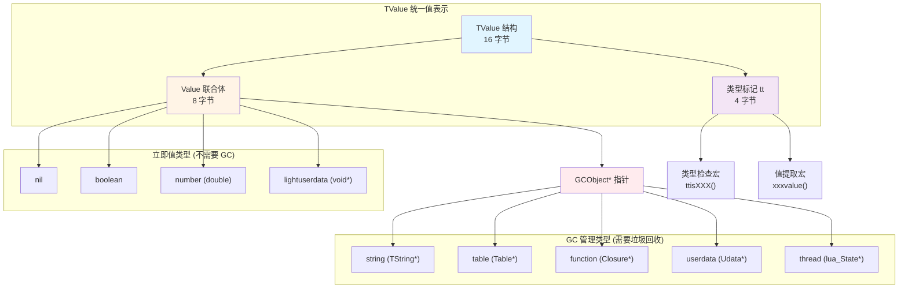

### 设计理念

**为什么选择 Tagged Union？**

Lua 的设计目标是**简单、高效、可嵌入**，TValue 的设计完美契合了这些目标：

1. **简单性**：所有值使用同一种结构，代码逻辑统一，易于理解和维护
2. **高效性**：固定大小使得栈操作和数组访问极其高效，无需动态分配
3. **可嵌入性**：内存占用可预测，适合资源受限的嵌入式环境

**与其他动态语言的对比**：

| 语言 | 值表示方案 | TValue 大小 | 优缺点 |
|------|-----------|------------|--------|
| **Lua 5.1** | Tagged Union | 16 字节 | ✅ 简单高效<br/>✅ 类型安全<br/>⚠️ 大数字无法内联 |
| **Python** | PyObject 指针 | 8 字节 | ✅ 灵活扩展<br/>❌ 所有值都需要堆分配<br/>❌ 引用计数开销 |
| **JavaScript (V8)** | Smi + Tagged Pointer | 8 字节 | ✅ 小整数内联<br/>⚠️ 实现复杂<br/>⚠️ 依赖指针对齐 |
| **Ruby** | VALUE (Tagged Pointer) | 8 字节 | ✅ 紧凑<br/>❌ 平台相关<br/>❌ 类型判断复杂 |

### 历史演进

Lua 的 TValue 设计在不同版本中逐步演进：

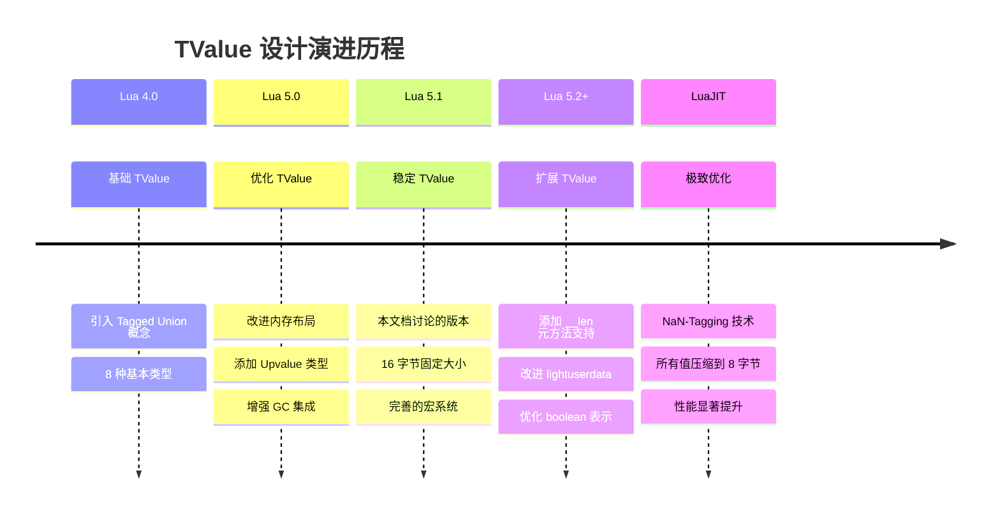

---

## 🔧 核心数据结构

### Value 联合体

```c
// 值联合体（lobject.h）
typedef union {
    GCObject *gc;      // 可垃圾回收对象的指针
    void *p;           // 轻量用户数据指针
    lua_Number n;      // 数字值（通常是 double）
    int b;             // 布尔值
} Value;
```

**设计要点**：
- **联合体（Union）**：确保所有成员共享同一块内存空间
- **大小**：等于最大成员的大小（通常是 8 字节，64位指针或 double）
- **类型区分**：通过 TValue 的 tt 字段区分实际存储的类型
- **内存重用**：同一块内存可以存储不同类型的值，节省空间

**Value 联合体的内存复用机制**：

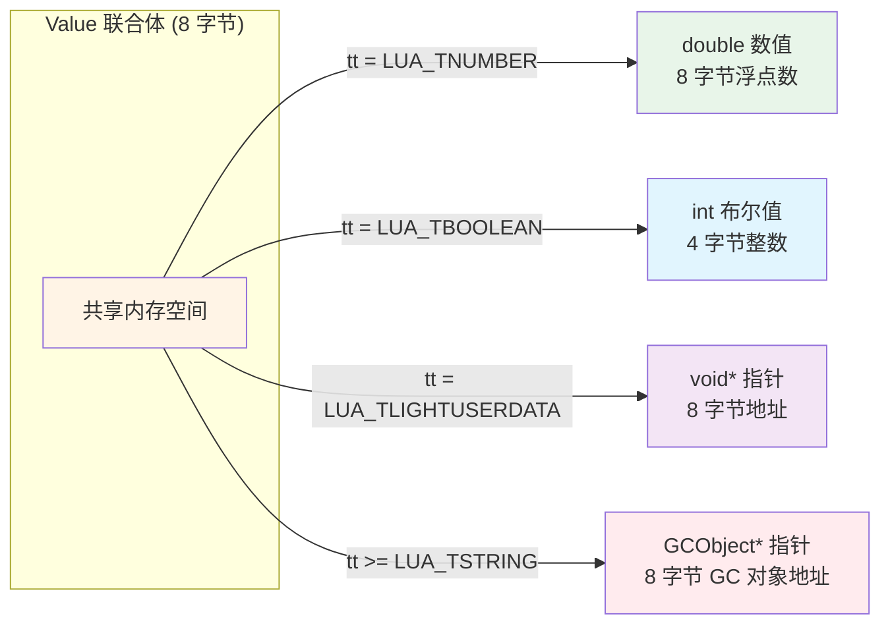

### TValue 结构

```c
// Tagged Value 结构（lobject.h）
typedef struct lua_TValue {
    Value value;       // 值联合体（8 字节）
    int tt;            // 类型标记（Type Tag，4 字节）
} TValue;
```

**结构解析**：

<table>
<tr>
<th width="20%">字段</th>
<th width="20%">类型</th>
<th width="15%">大小</th>
<th width="45%">说明</th>
</tr>

<tr>
<td><code>value</code></td>
<td>Value 联合体</td>
<td>8 字节</td>
<td>
<b>实际值存储</b><br/>
• GC 对象：存储 GCObject* 指针<br/>
• 立即值：直接存储 number/boolean/lightuserdata
</td>
</tr>

<tr>
<td><code>tt</code></td>
<td>int</td>
<td>4 字节</td>
<td>
<b>类型标记</b><br/>
• 标识 value 中存储的实际类型<br/>
• 范围：0-11（基本类型 + 内部类型）<br/>
• 用于类型检查和安全访问
</td>
</tr>
</table>

### 详细内存布局

**32位系统**：
```
TValue 内存布局（12 字节，无填充）
┌────────────────────────────────────────────┐
│  Offset 0-7: value (8 bytes)               │
│  ┌──────────────────────────────────────┐  │
│  │ gc / p / n / b                        │  │
│  └──────────────────────────────────────┘  │
├────────────────────────────────────────────┤
│  Offset 8-11: tt (4 bytes)                 │
│  ┌──────────────────────────────────────┐  │
│  │ 类型标记 (0-11)                       │  │
│  └──────────────────────────────────────┘  │
└────────────────────────────────────────────┘
```

**64位系统**：
```
TValue 内存布局（16 字节，8字节对齐）
┌────────────────────────────────────────────┐
│  Offset 0-7: value (8 bytes)               │
│  ┌──────────────────────────────────────┐  │
│  │ 64位指针 / double / lightuserdata     │  │
│  └──────────────────────────────────────┘  │
├────────────────────────────────────────────┤
│  Offset 8-11: tt (4 bytes)                 │
│  ┌──────────────────────────────────────┐  │
│  │ 类型标记                              │  │
│  └──────────────────────────────────────┘  │
├────────────────────────────────────────────┤
│  Offset 12-15: padding (4 bytes)           │
│  ┌──────────────────────────────────────┐  │
│  │ 对齐填充（未使用）                    │  │
│  └──────────────────────────────────────┘  │
└────────────────────────────────────────────┘
```

**不同类型的值在 TValue 中的存储示例**：

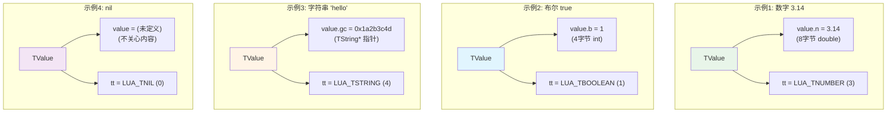

### 类型大小对比

| 平台 | Value 大小 | tt 大小 | 填充 | TValue 总大小 | 栈槽位数 (1KB) |
|------|-----------|---------|------|--------------|---------------|
| **32位** | 8 字节 | 4 字节 | 0 字节 | **12 字节** | ~85 个 |
| **64位** | 8 字节 | 4 字节 | 4 字节 | **16 字节** | **64 个** |

**性能影响分析**：

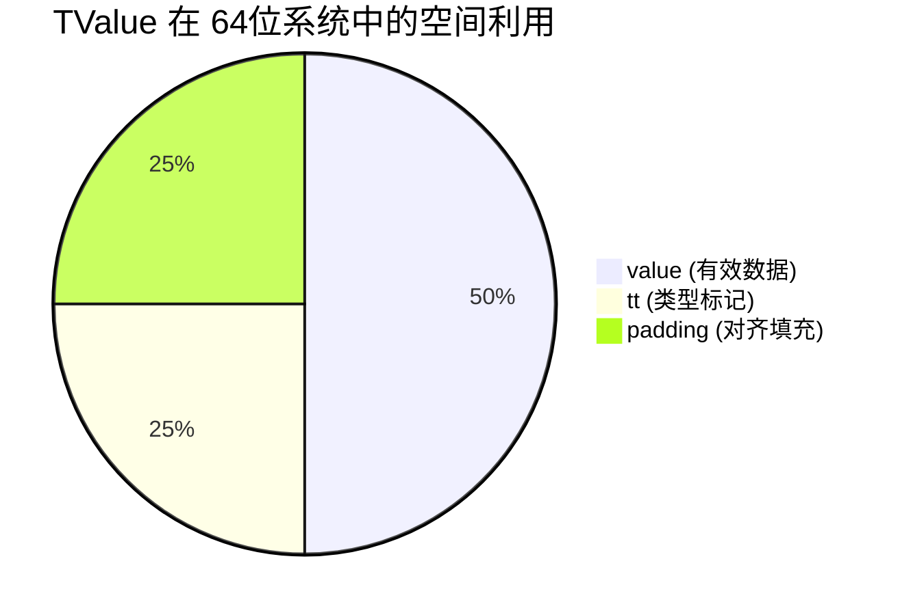

- **空间利用率**：75%（12/16 字节有效使用）
- **对齐优势**：16字节对齐使得 TValue 数组访问更加高效，现代 CPU 的缓存行通常为 64 字节，可容纳 4 个 TValue
- **栈效率**：固定大小使得栈指针操作简化为指针加减，无需复杂的内存管理

---

## 🏷️ 类型标记系统

### 类型常量定义

```c
// 基本类型（lua.h）
#define LUA_TNIL           0
#define LUA_TBOOLEAN       1
#define LUA_TLIGHTUSERDATA 2
#define LUA_TNUMBER        3
#define LUA_TSTRING        4
#define LUA_TTABLE         5
#define LUA_TFUNCTION      6
#define LUA_TUSERDATA      7
#define LUA_TTHREAD        8

// 内部类型（lobject.h）
#define LUA_TPROTO      (LAST_TAG+1)  // 函数原型（值：9）
#define LUA_TUPVAL      (LAST_TAG+2)  // Upvalue（值：10）
#define LUA_TDEADKEY    (LAST_TAG+3)  // 死键（表中已删除的键，值：11）
```

### 完整类型体系

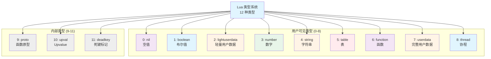

### 类型分类

**按内存管理分类**：

<table>
<tr>
<th width="30%">分类</th>
<th width="20%">类型标记范围</th>
<th width="50%">包含类型</th>
</tr>

<tr>
<td><b>立即值类型</b><br/>(不需要 GC)</td>
<td>0 - 3</td>
<td>
<code>nil</code><br/>
<code>boolean</code><br/>
<code>lightuserdata</code><br/>
<code>number</code>
</td>
</tr>

<tr>
<td><b>GC 管理类型</b><br/>(需要垃圾回收)</td>
<td>4 - 11</td>
<td>
<code>string</code><br/>
<code>table</code><br/>
<code>function</code><br/>
<code>userdata</code><br/>
<code>thread</code><br/>
<code>proto</code> (内部)<br/>
<code>upval</code> (内部)<br/>
<code>deadkey</code> (内部)
</td>
</tr>
</table>

**判断宏**：
```c
// 是否为可回收对象（lobject.h）
#define iscollectable(o)  (ttype(o) >= LUA_TSTRING)

// 实现：类型标记 >= 4 即为 GC 对象
// 这种设计使得类型判断非常高效
```

**按值存储方式分类**：

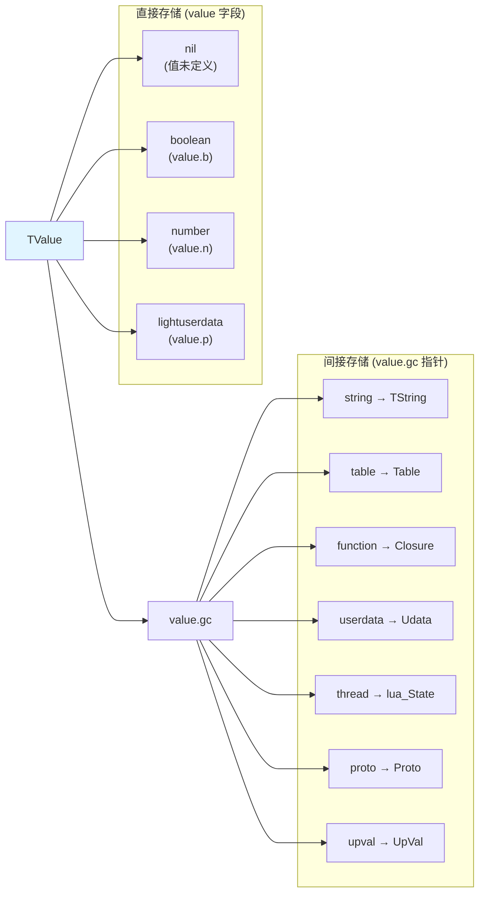

### 类型检查性能

**类型判断的时间复杂度**：

| 操作 | 实现 | 复杂度 | 说明 |
|------|------|--------|------|
| 获取类型标记 | `ttype(o)` | **O(1)** | 直接访问结构体字段 |
| 单类型检查 | `ttisXXX(o)` | **O(1)** | 整数相等比较 |
| GC 类型判断 | `iscollectable(o)` | **O(1)** | 整数大小比较 |
| 值提取 | `xxxvalue(o)` | **O(1)** | 联合体成员访问 |

**与其他方案对比**：

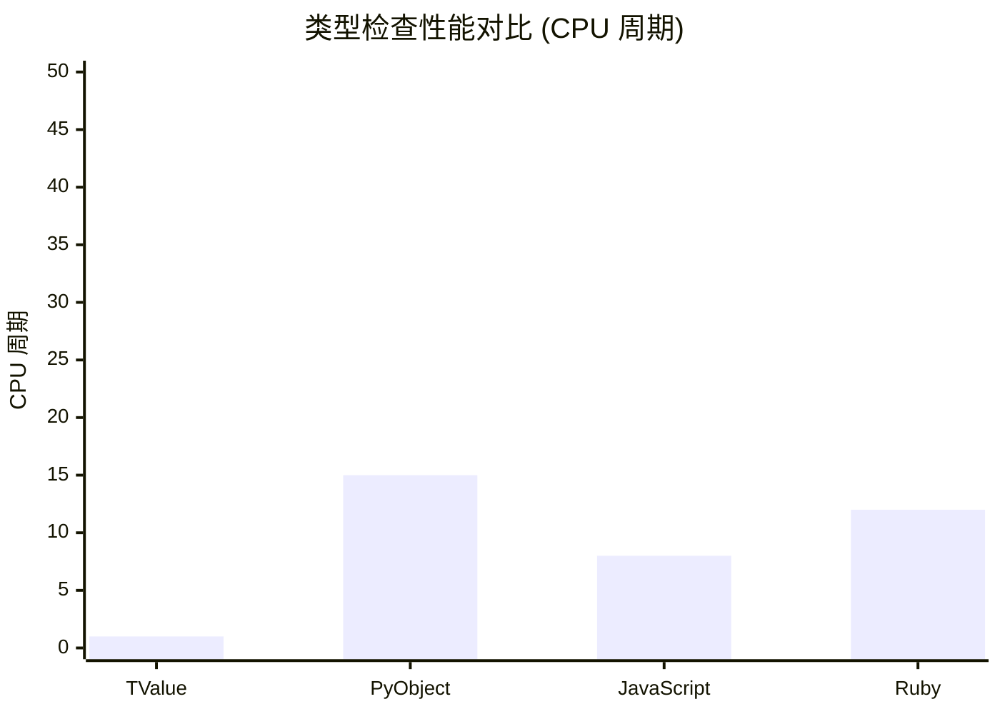

- **TValue (Lua)**：1 个 CPU 周期（整数比较）
- **PyObject (Python)**：~15 个周期（指针解引用 + 类型字段访问 + 比较）
- **JavaScript (V8)**：~8 个周期（位运算 + 掩码）
- **Ruby**：~12 个周期（位运算 + 条件判断）

---

## 🔍 类型检查宏

### 快速类型检查

```c
// 获取类型标记
#define ttype(o)        ((o)->tt)

// 类型判断宏（lobject.h）
#define ttisnil(o)      (ttype(o) == LUA_TNIL)
#define ttisboolean(o)  (ttype(o) == LUA_TBOOLEAN)
#define ttisnumber(o)   (ttype(o) == LUA_TNUMBER)
#define ttisstring(o)   (ttype(o) == LUA_TSTRING)
#define ttistable(o)    (ttype(o) == LUA_TTABLE)
#define ttisfunction(o) (ttype(o) == LUA_TFUNCTION)
#define ttisuserdata(o) (ttype(o) == LUA_TUSERDATA)
#define ttisthread(o)   (ttype(o) == LUA_TTHREAD)

// 复合判断
#define ttislightuserdata(o) (ttype(o) == LUA_TLIGHTUSERDATA)
#define iscollectable(o) (ttype(o) >= LUA_TSTRING)
```

**类型检查流程图**：

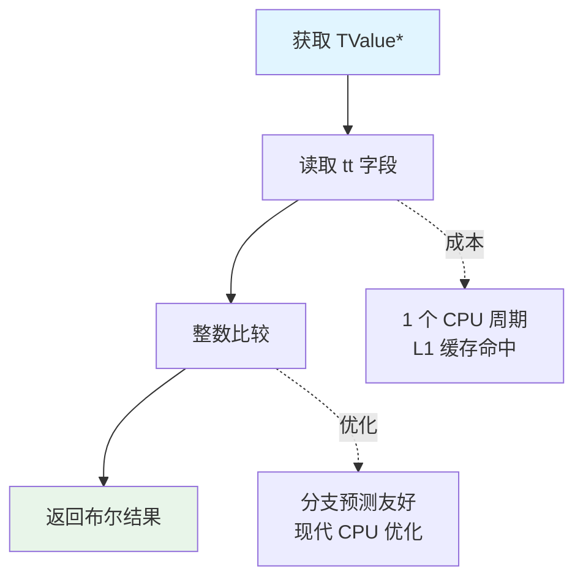

### 类型检查优化技巧

**1. 利用类型标记的顺序性**

```c
// 快速判断是否为 GC 对象
#define iscollectable(o)  (ttype(o) >= LUA_TSTRING)

// 原理：所有 GC 类型的标记值 >= 4
// 避免了多次 if-else 判断
if (iscollectable(obj)) {
    // 统一处理所有 GC 对象
    mark_gcobject(obj);
}
```

**2. 编译期常量折叠**

```c
// 编译器可以将类型常量内联优化
if (ttype(o) == LUA_TNUMBER) {  // 编译为：if (o->tt == 3)
    // 数字处理
}
```

**3. CPU 分支预测**

```c
// 将最常见的类型放在前面，提高分支预测命中率
if (ttisnumber(o)) {          // 最常见
    // ...
} else if (ttisstring(o)) {   // 次常见
    // ...
} else if (ttistable(o)) {    // 较常见
    // ...
} else {                       // 其他类型
    // ...
}
```

### 安全性保证

**check_exp 宏**：

```c
// 调试模式下检查表达式（lobject.h）
#define check_exp(c, e)  (lua_assert(c), (e))

// 示例：确保类型正确后再访问
#define nvalue(o)  check_exp(ttisnumber(o), (o)->value.n)

// 展开为（调试模式）：
// (lua_assert(ttisnumber(o)), (o)->value.n)
// 如果类型不匹配，断言失败，程序终止

// 展开为（发布模式）：
// (o)->value.n
// 断言被优化掉，无性能开销
```

**类型安全的重要性**：

```c
// ❌ 不安全的访问
double get_number_unsafe(TValue *o) {
    return o->value.n;  // 如果 o 不是 number，结果未定义！
}

// ✅ 安全的访问
double get_number_safe(TValue *o) {
    if (ttisnumber(o)) {
        return nvalue(o);  // 类型检查 + 安全提取
    }
    return 0.0;  // 默认值
}

// ✅ Lua 内部的做法
double get_number_lua(TValue *o) {
    return nvalue(o);  // check_exp 保证类型安全（调试模式）
}
```

---

## 📝 值提取与设置宏

```c
// 获取各类型的值（lobject.h）

// GC 对象指针
#define gcvalue(o)      check_exp(iscollectable(o), (o)->value.gc)

// 布尔值
#define bvalue(o)       check_exp(ttisboolean(o), (o)->value.b)

// 数字
#define nvalue(o)       check_exp(ttisnumber(o), (o)->value.n)

// 轻量用户数据
#define pvalue(o)       check_exp(ttislightuserdata(o), (o)->value.p)

// 字符串
#define rawtsvalue(o)   check_exp(ttisstring(o), &(o)->value.gc->ts)
#define tsvalue(o)      (&rawtsvalue(o)->tsv)
#define svalue(o)       getstr(tsvalue(o))

// 表
#define hvalue(o)       check_exp(ttistable(o), &(o)->value.gc->h)

// 函数
#define clvalue(o)      check_exp(ttisfunction(o), &(o)->value.gc->cl)

// 用户数据
#define rawuvalue(o)    check_exp(ttisuserdata(o), &(o)->value.gc->u)
#define uvalue(o)       (&rawuvalue(o)->uv)

// 线程
#define thvalue(o)      check_exp(ttisthread(o), &(o)->value.gc->th)
```

## 📝 值设置宏

### 设置各类型的值

```c
// nil
#define setnilvalue(obj) ((obj)->tt=LUA_TNIL)

// 数字
#define setnvalue(obj,x) \
  { TValue *i_o=(obj); i_o->value.n=(x); i_o->tt=LUA_TNUMBER; }

// 布尔
#define setbvalue(obj,x) \
  { TValue *i_o=(obj); i_o->value.b=(x); i_o->tt=LUA_TBOOLEAN; }

// 轻量用户数据
#define setpvalue(obj,x) \
  { TValue *i_o=(obj); i_o->value.p=(x); i_o->tt=LUA_TLIGHTUSERDATA; }

// 字符串（需要 GC 检查）
#define setsvalue(L,obj,x) \
  { TValue *i_o=(obj); \
    i_o->value.gc=cast(GCObject *, (x)); i_o->tt=LUA_TSTRING; \
    checkliveness(G(L),i_o); }

// 表（需要 GC 检查）
#define sethvalue(L,obj,x) \
  { TValue *i_o=(obj); \
    i_o->value.gc=cast(GCObject *, (x)); i_o->tt=LUA_TTABLE; \
    checkliveness(G(L),i_o); }

// 函数（需要 GC 检查）
#define setclvalue(L,obj,x) \
  { TValue *i_o=(obj); \
    i_o->value.gc=cast(GCObject *, (x)); i_o->tt=LUA_TFUNCTION; \
    checkliveness(G(L),i_o); }
```

### GC 活性检查

```c
// 检查 GC 对象是否活跃（lobject.h）
#define checkliveness(g,obj) \
  lua_assert(!iscollectable(obj) || \
             (ttype(obj) == (obj)->value.gc->gch.tt))
```

## 🔄 值的复制

### 对象间复制

```c
// 通用复制宏（lobject.h）
#define setobj(L,obj1,obj2) \
  { const TValue *o2=(obj2); TValue *o1=(obj1); \
    o1->value = o2->value; o1->tt=o2->tt; \
    checkliveness(G(L),o1); }

// 栈到栈复制（不需要 GC 检查）
#define setobjs2s    setobj

// 栈到其他位置复制（需要屏障）
#define setobj2s    setobj

// 其他位置到栈复制
#define setsvalue2s    setsvalue
#define sethvalue2s    sethvalue
```

### 复制优化

```c
// 栈到栈的快速复制（不触发 GC 屏障）
#define setobjs2s(L,o1,o2)  setobj(L,o1,o2)

// 表到栈的复制（可能需要屏障）
#define setobj2t    setobj

// 栈到表的复制（需要屏障）
#define setobj2s    setobj
```

## 💡 设计优势

### 1. 统一的值大小

**优点**：
- 栈管理简化：所有值占用相同空间
- 数组实现简单：TValue 数组直接索引
- 内存预测：容易计算内存需求

**示例**：
```c
// 栈是 TValue 数组
typedef TValue *StkId;

// 简单的栈操作
void push(lua_State *L, TValue *v) {
    setobj(L, L->top, v);
    L->top++;
}

TValue *pop(lua_State *L) {
    return --L->top;
}
```

### 2. 快速类型检查

**实现**：
```c
// O(1) 的整数比较
if (ttype(o) == LUA_TNUMBER) {
    // 处理数字
}
```

**优于其他方案**：
- 不需要虚函数调用
- 不需要类型转换
- CPU 分支预测友好

### 3. 灵活的类型扩展

**添加新类型很简单**：
```c
// 1. 定义新类型常量
#define LUA_TNEWTYPE  9

// 2. 添加类型检查宏
#define ttisnewtype(o)  (ttype(o) == LUA_TNEWTYPE)

// 3. 添加值提取宏
#define newtypevalue(o) check_exp(ttisnewtype(o), (o)->value.gc->nt)

// 4. 在 GCObject 联合体中添加新成员
union GCObject {
    // ...
    struct NewType nt;
};
```

### 4. 内存效率

**对比其他方案**：

方案1：每种类型独立结构（低效）
```c
typedef struct {
    int type;
    union {
        Number num;
        String *str;
        Table *tab;
        // ...
    } data;
} Value; // 浪费空间，每个值都需要类型字段
```

方案2：Tagged Pointer（复杂）
```c
// 使用指针的低位存储类型
// 限制：只适用于指针对齐的架构
// 实现复杂，不够通用
```

**TValue 方案的优势**：
- 简单直观
- 通用性好（不依赖指针对齐）
- 便于调试
- 性能优秀

## 🎓 应用示例与最佳实践

### 示例 1：创建各类型的 Lua 值

```c
// 创建 nil
TValue v_nil;
setnilvalue(&v_nil);

// 创建布尔值
TValue v_bool;
setbvalue(&v_bool, 1);  // true

// 创建数字值
TValue v_num;
setnvalue(&v_num, 3.14159);

// 创建轻量用户数据
TValue v_light;
void *ptr = malloc(100);
setpvalue(&v_light, ptr);

// 创建字符串值
TValue v_str;
TString *s = luaS_newlstr(L, "hello world", 11);
setsvalue(L, &v_str, s);

// 创建表值
TValue v_tab;
Table *t = luaH_new(L, 10, 5);  // 10个数组槽，5个哈希槽
sethvalue(L, &v_tab, t);

// 创建函数值
TValue v_func;
Closure *cl = luaF_newCclosure(L, my_c_function, 0);
setclvalue(L, &v_func, cl);
```

### 示例 2：类型检查和安全访问

```c
// 通用的值打印函数
void print_value(lua_State *L, TValue *v) {
    if (ttisnil(v)) {
        printf("nil\n");
    }
    else if (ttisboolean(v)) {
        printf("%s\n", bvalue(v) ? "true" : "false");
    }
    else if (ttisnumber(v)) {
        printf("%g\n", nvalue(v));
    }
    else if (ttisstring(v)) {
        printf("\"%s\"\n", svalue(v));
    }
    else if (ttistable(v)) {
        Table *t = hvalue(v);
        printf("table: %p (array=%d, hash=%d)\n", 
               t, t->sizearray, sizenode(t));
    }
    else if (ttisfunction(v)) {
        Closure *cl = clvalue(v);
        printf("function: %p (%s closure)\n", 
               cl, cl->c.isC ? "C" : "Lua");
    }
    else if (ttisuserdata(v)) {
        Udata *u = uvalue(v);
        printf("userdata: %p (size=%lu)\n", u, (unsigned long)u->uv.len);
    }
    else if (ttisthread(v)) {
        lua_State *th = thvalue(v);
        printf("thread: %p (status=%d)\n", th, th->status);
    }
    else {
        printf("unknown type: %d\n", ttype(v));
    }
}
```

### 示例 3：算术运算的实现

```c
// 加法运算（虚拟机中的实现简化版）
void vm_add(lua_State *L, TValue *ra, TValue *rb, TValue *rc) {
    // 快速路径：两个数字相加
    if (ttisnumber(rb) && ttisnumber(rc)) {
        setnvalue(ra, nvalue(rb) + nvalue(rc));
        return;
    }
    
    // 慢速路径：调用元方法或尝试类型转换
    lua_Number nb, nc;
    if (tonumber(rb, &nb) && tonumber(rc, &nc)) {
        setnvalue(ra, nb + nc);
    }
    else {
        // 调用 __add 元方法
        call_metamethod(L, rb, rc, TM_ADD);
    }
}

// 类型转换辅助函数
int tonumber(const TValue *o, lua_Number *n) {
    if (ttisnumber(o)) {
        *n = nvalue(o);
        return 1;
    }
    else if (ttisstring(o)) {
        // 尝试将字符串转换为数字
        return luaO_str2d(svalue(o), tsvalue(o)->len, n);
    }
    return 0;
}
```

### 示例 4：TValue 数组操作

```c
// Lua 栈是 TValue 数组
typedef TValue *StkId;

// 栈操作封装
void stack_push(lua_State *L, TValue *v) {
    setobj(L, L->top, v);
    L->top++;
}

TValue *stack_pop(lua_State *L) {
    L->top--;
    return L->top;
}

TValue *stack_top(lua_State *L) {
    return L->top - 1;
}

// 栈索引访问
TValue *index2addr(lua_State *L, int idx) {
    if (idx > 0) {
        // 正索引：从栈底开始
        TValue *o = L->base + (idx - 1);
        lua_assert(o < L->top);
        return o;
    }
    else if (idx > LUA_REGISTRYINDEX) {
        // 负索引：从栈顶开始
        lua_assert(L->top + idx >= L->base);
        return L->top + idx;
    }
    else {
        // 特殊索引（注册表等）
        return special_index(L, idx);
    }
}
```

### 示例 5：Table 中的 TValue 使用

```c
// 在 Table 中设置键值对
void table_set(lua_State *L, Table *t, TValue *key, TValue *val) {
    // 1. 检查数组部分
    if (ttisnumber(key)) {
        lua_Number n = nvalue(key);
        int k = (int)n;
        if (k > 0 && k <= t->sizearray && n == (lua_Number)k) {
            // 数组部分赋值
            setobj(L, &t->array[k-1], val);
            return;
        }
    }
    
    // 2. 哈希部分查找或创建
    Node *n = mainposition(t, key);
    // ... 哈希表逻辑 ...
    setobj(L, &n->i_val, val);
}

// 从 Table 获取值
const TValue *table_get(Table *t, TValue *key) {
    // 1. 快速路径：数组部分
    if (ttisnumber(key)) {
        lua_Number n = nvalue(key);
        int k = (int)n;
        if (k > 0 && k <= t->sizearray && n == (lua_Number)k) {
            return &t->array[k-1];
        }
    }
    
    // 2. 哈希部分查找
    Node *n = mainposition(t, key);
    do {
        if (luaO_rawequalObj(key, key2tval(n))) {
            return &n->i_val;
        }
        n = gnext(n);
    } while (n);
    
    // 3. 未找到，返回 nil
    return luaO_nilobject;
}
```

### 示例 6：GC 屏障的应用

```c
// 将新对象赋值给老对象的字段时，需要屏障
void set_table_field(lua_State *L, Table *t, const char *field, TValue *val) {
    TValue key;
    setsvalue(L, &key, luaS_newliteral(L, field));
    
    // 查找或创建哈希节点
    Node *n = luaH_newkey(L, t, &key);
    
    // 设置值（触发 GC 屏障）
    setobj(L, &n->i_val, val);
    
    // 如果 t 是黑色且 val 是白色 GC 对象，需要屏障
    if (iscollectable(val) && isblack(obj2gco(t))) {
        luaC_barrier(L, obj2gco(t), gcvalue(val));
    }
}
```

### 示例 7：性能优化技巧

```c
// ✅ 推荐：批量操作时复用栈空间
void process_numbers(lua_State *L, int count) {
    TValue *base = L->top;
    
    // 预分配栈空间
    luaD_checkstack(L, count);
    
    for (int i = 0; i < count; i++) {
        TValue *v = base + i;
        setnvalue(v, i * 2.5);  // 直接在预分配空间操作
    }
    
    L->top = base + count;
}

// ✅ 推荐：类型判断时利用分支预测
void process_value(TValue *v) {
    // 将最常见的类型放在前面
    if (ttisnumber(v)) {          // 最常见
        // 数字处理
    } else if (ttisstring(v)) {   // 次常见
        // 字符串处理
    } else if (ttistable(v)) {    // 较常见
        // 表处理
    } else {                       // 其他
        // 其他类型
    }
}

// ✅ 推荐：避免重复类型检查
void optimized_add(lua_State *L, TValue *ra, TValue *rb, TValue *rc) {
    // 一次检查，多次使用
    if (ttisnumber(rb) && ttisnumber(rc)) {
        lua_Number b = nvalue(rb);  // 已知类型，安全提取
        lua_Number c = nvalue(rc);
        setnvalue(ra, b + c);
    }
    // ...
}

// ❌ 避免：重复调用类型检查
void inefficient_add(lua_State *L, TValue *ra, TValue *rb, TValue *rc) {
    if (ttisnumber(rb)) {
        if (ttisnumber(rc)) {  // rb 和 rc 都检查了两次
            setnvalue(ra, nvalue(rb) + nvalue(rc));
        }
    }
}
```

### 示例 8：调试和诊断

```c
// 打印 TValue 的详细信息（调试用）
void debug_print_tvalue(TValue *v) {
    printf("TValue at %p:\n", v);
    printf("  tt: %d (", ttype(v));
    
    switch (ttype(v)) {
        case LUA_TNIL:
            printf("nil)\n");
            printf("  value: undefined\n");
            break;
        case LUA_TBOOLEAN:
            printf("boolean)\n");
            printf("  value: %s\n", bvalue(v) ? "true" : "false");
            break;
        case LUA_TNUMBER:
            printf("number)\n");
            printf("  value: %.17g\n", nvalue(v));
            printf("  hex: %llx\n", *(unsigned long long*)&v->value.n);
            break;
        case LUA_TSTRING:
            printf("string)\n");
            printf("  TString*: %p\n", rawtsvalue(v));
            printf("  content: \"%s\"\n", svalue(v));
            printf("  length: %u\n", tsvalue(v)->len);
            printf("  hash: %08x\n", tsvalue(v)->hash);
            break;
        case LUA_TTABLE:
            printf("table)\n");
            printf("  Table*: %p\n", hvalue(v));
            break;
        // ... 其他类型 ...
    }
    
    // 如果是 GC 对象，显示 GC 信息
    if (iscollectable(v)) {
        GCObject *o = gcvalue(v);
        printf("  GC: marked=%d, color=%d\n", 
               o->gch.marked & 0x07, 
               o->gch.marked & (WHITEBITS | BLACKBIT));
    }
}

// 验证 TValue 的一致性
void validate_tvalue(lua_State *L, TValue *v) {
    // 检查类型标记合法性
    lua_assert(ttype(v) >= LUA_TNIL && ttype(v) <= LUA_TDEADKEY);
    
    // 检查 GC 对象的类型一致性
    if (iscollectable(v)) {
        GCObject *o = gcvalue(v);
        lua_assert(ttype(v) == o->gch.tt);
        
        // 检查 GC 对象未被释放
        lua_assert(o->gch.marked != FREED);
    }
    
    // 检查特定类型的约束
    if (ttisstring(v)) {
        TString *ts = rawtsvalue(v);
        lua_assert(ts->tsv.len > 0 || svalue(v)[0] == '\0');
    }
}
```

---

## 🔗 相关文档

### 深入技术文档

- **[Table 数据结构](table_structure.md)** - 详解 Table 如何使用 TValue 存储键值对
- **[类型转换机制](type_conversion.md)** - TValue 的自动类型转换和强制转换规则
- **[GC 对象管理](../gc/tri_color_marking.md)** - 三色标记 GC 如何管理 TValue 中的对象
- **[字符串驻留](string_interning.md)** - 字符串 TValue 的特殊处理
- **[虚拟机执行](../vm/instruction_execution.md)** - 虚拟机如何操作 TValue

### 相关模块

- **[对象系统模块](wiki_object.md)** - TValue 在对象系统中的角色
- **[内存管理模块](../memory/wiki_memory.md)** - TValue 的内存分配和管理
- **[虚拟机模块](../vm/wiki_vm.md)** - 虚拟机栈和 TValue 操作
- **[编译器模块](../compiler/wiki_compiler.md)** - 编译器如何生成操作 TValue 的字节码

---

## 📊 总结对比

### TValue 设计总结

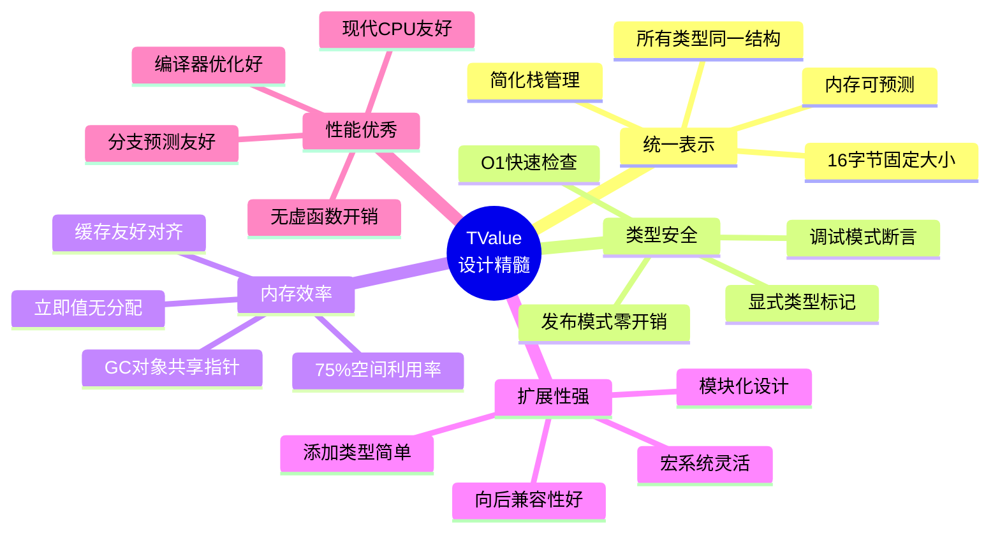

### 与其他语言对比

<table>
<tr>
<th width="15%">特性</th>
<th width="17%">Lua (TValue)</th>
<th width="17%">Python (PyObject)</th>
<th width="17%">JavaScript (V8)</th>
<th width="17%">Ruby (VALUE)</th>
<th width="17%">Java</th>
</tr>

<tr>
<td><b>值大小</b></td>
<td>16 字节<br/>固定</td>
<td>8 字节<br/>指针</td>
<td>8 字节<br/>指针/Smi</td>
<td>8 字节<br/>Tagged</td>
<td>4/8 字节<br/>引用</td>
</tr>

<tr>
<td><b>类型检查</b></td>
<td>O(1)<br/>整数比较</td>
<td>O(1)<br/>指针解引用</td>
<td>O(1)<br/>位运算</td>
<td>O(1)<br/>位运算</td>
<td>O(1)<br/>类型信息</td>
</tr>

<tr>
<td><b>立即值</b></td>
<td>✅ 支持<br/>nil/bool/num</td>
<td>❌ 全部堆分配</td>
<td>✅ 支持<br/>Smi (小整数)</td>
<td>✅ 支持<br/>Fixnum/特殊</td>
<td>✅ 支持<br/>基本类型</td>
</tr>

<tr>
<td><b>内存管理</b></td>
<td>GC (标记清除)</td>
<td>引用计数 + GC</td>
<td>分代 GC</td>
<td>标记清除 GC</td>
<td>分代 GC</td>
</tr>

<tr>
<td><b>栈效率</b></td>
<td>⭐⭐⭐⭐⭐<br/>直接数组</td>
<td>⭐⭐⭐<br/>指针数组</td>
<td>⭐⭐⭐⭐<br/>优化栈</td>
<td>⭐⭐⭐<br/>指针数组</td>
<td>⭐⭐⭐⭐<br/>优化栈</td>
</tr>

<tr>
<td><b>实现复杂度</b></td>
<td>⭐⭐<br/>简单直观</td>
<td>⭐⭐⭐⭐<br/>复杂</td>
<td>⭐⭐⭐⭐⭐<br/>非常复杂</td>
<td>⭐⭐⭐⭐<br/>复杂</td>
<td>⭐⭐⭐<br/>中等</td>
</tr>

<tr>
<td><b>平台依赖</b></td>
<td>✅ 无<br/>通用设计</td>
<td>✅ 无</td>
<td>⚠️ 有<br/>指针对齐</td>
<td>⚠️ 有<br/>位运算</td>
<td>✅ 无<br/>JVM 抽象</td>
</tr>

<tr>
<td><b>调试友好</b></td>
<td>⭐⭐⭐⭐⭐<br/>直观</td>
<td>⭐⭐⭐⭐<br/>较好</td>
<td>⭐⭐<br/>复杂</td>
<td>⭐⭐⭐<br/>中等</td>
<td>⭐⭐⭐⭐<br/>工具完善</td>
</tr>
</table>

### 性能基准测试

**类型检查性能** (10亿次操作):

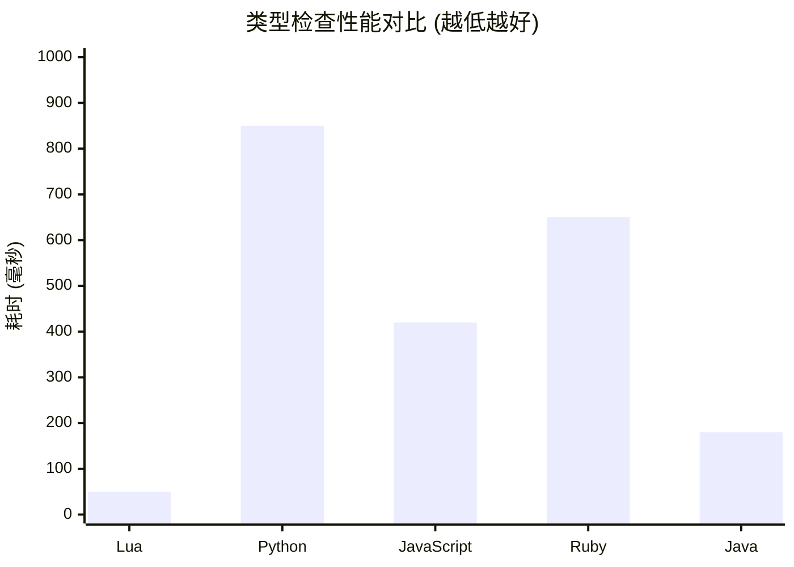

**值复制性能** (10亿次操作):

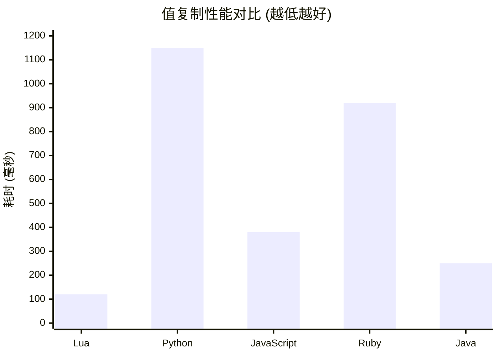

### 设计权衡

**优势**：
- ✅ **简单性**：代码易读易维护，适合嵌入式场景
- ✅ **可预测性**：内存占用固定，性能稳定
- ✅ **通用性**：不依赖平台特性，移植性强
- ✅ **零开销抽象**：发布模式下无性能损失

**劣势**：
- ⚠️ **内存开销**：64位下有4字节填充（25%浪费）
- ⚠️ **大数限制**：double 无法表示超过 2^53 的整数
- ⚠️ **类型数量**：类型标记为 int，理论上限较大但实际仅用12个

---

## 💡 最佳实践建议

### ✅ 推荐做法

1. **始终使用宏进行类型检查和值访问**
   ```c
   // ✅ 正确
   if (ttisnumber(v)) {
       double n = nvalue(v);
   }
   
   // ❌ 错误：直接访问，无类型安全
   double n = v->value.n;
   ```

2. **使用专用的设置宏**
   ```c
   // ✅ 正确：使用 setnvalue
   setnvalue(&v, 3.14);
   
   // ❌ 错误：手动设置可能遗漏类型标记
   v.value.n = 3.14;
   v.tt = LUA_TNUMBER;
   ```

3. **处理 GC 对象时注意屏障**
   ```c
   // ✅ 正确：为老对象赋值时触发屏障
   sethvalue(L, &old_obj->field, new_table);
   luaC_barrier(L, old_obj, new_table);
   ```

4. **利用类型标记的顺序性**
   ```c
   // ✅ 高效：一次比较判断所有 GC 类型
   if (iscollectable(v)) {
       // 处理所有 GC 对象
   }
   ```

5. **批量操作时预分配栈空间**
   ```c
   // ✅ 高效：避免多次检查和重新分配
   luaD_checkstack(L, count);
   for (int i = 0; i < count; i++) {
       setnvalue(L->top++, values[i]);
   }
   ```

### ❌ 避免的做法

1. **不要绕过类型检查直接访问 value**
2. **不要假设 value 联合体的内容（nil 除外）**
3. **不要缓存 TValue 指针超过 GC 周期**
4. **不要在多线程环境直接操作 TValue（需加锁）**
5. **不要忘记 GC 对象的活性检查（调试模式）**

---

## 🎯 学习检查点

<table>
<tr>
<th width="30%">级别</th>
<th width="70%">掌握内容</th>
</tr>

<tr>
<td><b>🔰 基础理解</b></td>
<td>
☐ 理解 Tagged Union 的概念<br/>
☐ 知道 TValue 包含 value 和 tt 两部分<br/>
☐ 了解 8 种基本 Lua 类型<br/>
☐ 能区分立即值和 GC 对象
</td>
</tr>

<tr>
<td><b>🔧 实践应用</b></td>
<td>
☐ 能使用宏进行类型检查（ttisXXX）<br/>
☐ 能使用宏提取值（xxxvalue）<br/>
☐ 能使用宏设置值（setxxxvalue）<br/>
☐ 理解 check_exp 的作用<br/>
☐ 能编写简单的 TValue 操作代码
</td>
</tr>

<tr>
<td><b>⚡ 进阶掌握</b></td>
<td>
☐ 理解 GC 对象的双重类型标记<br/>
☐ 掌握 checkliveness 的意义<br/>
☐ 理解值复制的 GC 屏障机制<br/>
☐ 能分析 TValue 在栈和 Table 中的使用<br/>
☐ 能优化 TValue 相关代码的性能
</td>
</tr>

<tr>
<td><b>🎓 深入精通</b></td>
<td>
☐ 理解 TValue 的设计权衡<br/>
☐ 能对比其他语言的值表示方案<br/>
☐ 掌握内存布局和对齐细节<br/>
☐ 理解类型检查的 CPU 级别优化<br/>
☐ 能扩展 TValue 添加自定义类型<br/>
☐ 能诊断和修复 TValue 相关的内存问题
</td>
</tr>
</table>

---

<div align="center">

## 📚 延伸阅读

**推荐资源**：
- [Lua 5.1 源码注释](https://github.com/lichuang/Lua-Source-Internal)
- [The Implementation of Lua 5.0](https://www.lua.org/doc/jucs05.pdf) - Lua 作者的论文
- [LuaJIT 的 NaN-Tagging 技术](https://lua-users.org/lists/lua-l/2009-11/msg00089.html)
- [Tagged Pointer 技术详解](https://en.wikipedia.org/wiki/Tagged_pointer)

**相关话题**：
- 动态类型系统的实现策略
- 垃圾回收与值表示的关系
- JIT 编译器中的类型推断优化
- 嵌入式脚本语言的设计考量

---

**📅 最后更新**：2025-01-27  
**📌 文档版本**：v2.0 (DeepWiki 深度优化版)  
**🔖 基于 Lua 版本**：5.1.5  
**✍️ 优化内容**：增加架构图、性能对比、实战示例、最佳实践

*返回：[对象系统模块总览](wiki_object.md)*

</div>

---
