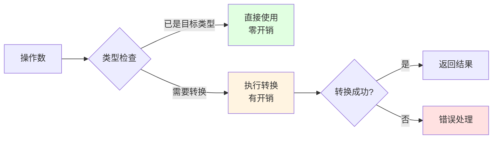
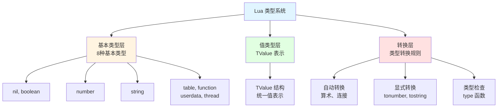
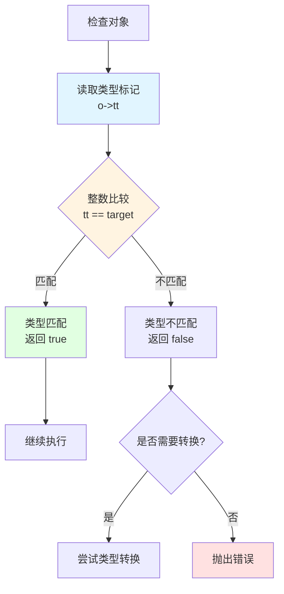
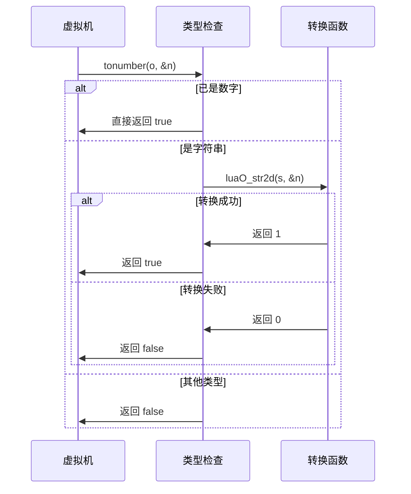
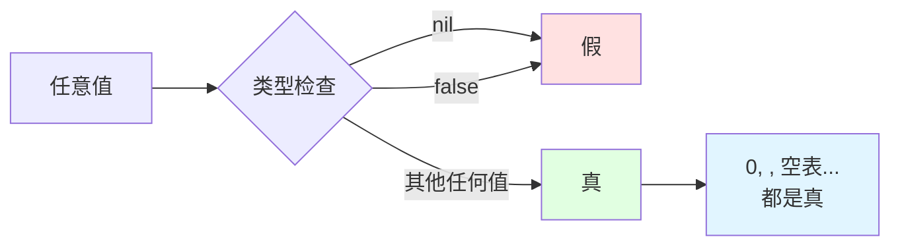
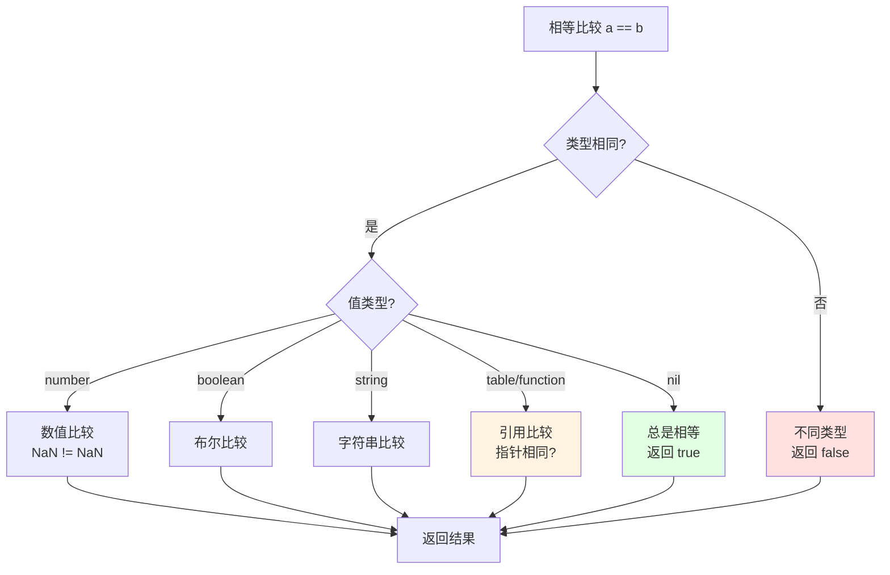
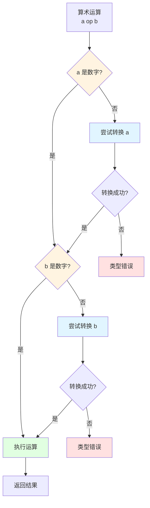

# 🔄 类型转换机制详解

> **核心机制**：Lua 类型转换 - 自动强制转换与显式转换的实现原理

<details>
<summary><b>📋 快速导航</b></summary>

- [概述](#-概述)
- [设计哲学](#-设计哲学)
- [核心概念](#-核心概念)
- [自动类型转换](#-自动类型转换)
- [显式转换函数](#-显式转换函数)
- [类型检查机制](#-类型检查机制)
- [比较运算转换](#-比较运算转换)
- [算术运算转换](#-算术运算转换)
- [字符串操作转换](#-字符串操作转换)
- [性能分析](#-性能分析)
- [实战示例](#-实战示例)
- [常见陷阱](#-常见陷阱)
- [最佳实践](#-最佳实践)
- [相关模块](#-相关模块)

</details>

---

## 📋 概述

### 什么是类型转换？

**类型转换（Type Conversion）** 是将一种数据类型的值转换为另一种类型的过程。Lua 作为动态类型语言，支持两种类型转换方式：

- **自动类型转换（Automatic Coercion）**：在特定上下文中自动进行
- **显式类型转换（Explicit Conversion）**：通过函数显式调用

```lua
-- 自动类型转换
local x = "10" + 5        -- 字符串自动转为数字：15
local s = "Result: " .. 42 -- 数字自动转为字符串："Result: 42"

-- 显式类型转换
local n = tonumber("123")  -- 显式转为数字：123
local s = tostring(456)    -- 显式转为字符串："456"
local t = type("hello")    -- 获取类型："string"
```

### 类型转换的范围

Lua 的类型转换主要涉及以下类型之间的转换：

<table>
<tr>
<th width="25%">转换方向</th>
<th width="35%">支持情况</th>
<th width="40%">说明</th>
</tr>

<tr>
<td><b>Number ↔ String</b></td>
<td>✅ 双向自动转换</td>
<td>
• 算术运算：字符串 → 数字<br/>
• 字符串连接：数字 → 字符串<br/>
• 最常用的转换场景
</td>
</tr>

<tr>
<td><b>String → Number</b></td>
<td>✅ 自动/显式</td>
<td>
• 支持整数、浮点数、科学计数法<br/>
• 支持十六进制（0x 前缀）<br/>
• 前后空格自动忽略
</td>
</tr>

<tr>
<td><b>Number → String</b></td>
<td>✅ 自动/显式</td>
<td>
• 使用标准格式化<br/>
• 整数无小数点<br/>
• 浮点数保留精度
</td>
</tr>

<tr>
<td><b>Boolean → String</b></td>
<td>✅ 仅显式（tostring）</td>
<td>
• true → "true"<br/>
• false → "false"<br/>
• 不参与自动转换
</td>
</tr>

<tr>
<td><b>其他类型 → String</b></td>
<td>✅ 仅显式（tostring）</td>
<td>
• nil → "nil"<br/>
• table → "table: 0x..."<br/>
• function → "function: 0x..."<br/>
• 可通过 __tostring 元方法自定义
</td>
</tr>

<tr>
<td><b>String → Boolean</b></td>
<td>❌ 不支持</td>
<td>
• 无自动转换<br/>
• 所有非 nil/false 值在布尔上下文为真<br/>
• 包括 "false" 字符串
</td>
</tr>
</table>

### 核心文件

| 文件 | 职责 | 关键函数 |
|------|------|----------|
| `lobject.c/h` | 类型转换核心实现 | `luaO_str2d()` - 字符串转数字<br/>`luaO_rawequalObj()` - 原始相等比较<br/>`luaO_fb2int()` - 浮点字节转整数 |
| `lvm.c` | 运算时自动转换 | `tonumber()` - 转为数字<br/>`tostring()` - 转为字符串<br/>`luaV_tonumber()` - 虚拟机转换 |
| `lapi.c` | C API 转换接口 | `lua_tonumber()` - API 转数字<br/>`lua_tostring()` - API 转字符串<br/>`lua_type()` - 获取类型 |
| `lbaselib.c` | 基础库转换函数 | `luaB_tonumber()` - tonumber 实现<br/>`luaB_tostring()` - tostring 实现<br/>`luaB_type()` - type 实现 |

---

## 🎯 设计哲学

### 1. 便利性优先

Lua 的类型转换设计优先考虑使用便利性，减少显式转换的需求。

```lua
-- ✅ 便利：自动转换
local result = "10" * 2  -- 20

-- ❌ 繁琐（其他语言可能需要）
local result = tonumber("10") * 2
```

**设计原则**：
- 常见场景自动转换（算术、字符串连接）
- 避免显式转换的样板代码
- 提高代码可读性

### 2. 明确的转换规则

转换规则清晰、一致，避免歧义：

```lua
-- 算术运算：始终尝试转为数字
print("5" + "3")      -- 8
print("5.5" + "2.5")  -- 8.0

-- 字符串连接：始终转为字符串
print(5 .. 3)         -- "53"
print(5.5 .. 2.5)     -- "5.52.5"

-- 比较运算：不进行自动转换
print("10" == 10)     -- false（类型不同）
print("10" < 20)      -- Error: 不能比较字符串和数字
```

### 3. 安全的转换失败

转换失败时有明确的行为：

```lua
-- tonumber() 失败返回 nil
print(tonumber("abc"))        -- nil
print(tonumber(""))           -- nil
print(tonumber("  "))         -- nil

-- 算术运算失败抛出错误
print("abc" + 5)              -- Error: attempt to perform arithmetic on a string value

-- tostring() 总是成功
print(tostring(nil))          -- "nil"
print(tostring(true))         -- "true"
print(tostring({}))           -- "table: 0x..."
```

### 4. 性能考虑

类型转换实现注重性能：



**优化策略**：
- 快速类型检查（整数比较）
- 避免不必要的转换
- 缓存转换结果（字符串池化）

---

## 💡 核心概念

### 类型系统层次

Lua 的类型系统分为三个层次：



### 转换上下文

类型转换的行为取决于**上下文**：

<table>
<tr>
<th width="25%">上下文</th>
<th width="35%">转换规则</th>
<th width="40%">示例</th>
</tr>

<tr>
<td><b>算术运算</b></td>
<td>操作数转为 number</td>
<td>
<code>"10" + 5 → 15</code><br/>
<code>"3.14" * 2 → 6.28</code>
</td>
</tr>

<tr>
<td><b>字符串连接</b></td>
<td>操作数转为 string</td>
<td>
<code>10 .. 20 → "1020"</code><br/>
<code>"x" .. 5 → "x5"</code>
</td>
</tr>

<tr>
<td><b>关系比较</b></td>
<td>仅 number 和 string 内部比较</td>
<td>
<code>10 < 20 → true</code><br/>
<code>"10" < "20" → true（字典序）</code><br/>
<code>"10" < 20 → Error</code>
</td>
</tr>

<tr>
<td><b>相等比较</b></td>
<td>不同类型直接不等</td>
<td>
<code>"10" == 10 → false</code><br/>
<code>nil == false → false</code>
</td>
</tr>

<tr>
<td><b>布尔上下文</b></td>
<td>仅 nil 和 false 为假</td>
<td>
<code>if 0 → true</code><br/>
<code>if "" → true</code><br/>
<code>if nil → false</code>
</td>
</tr>

<tr>
<td><b>表键</b></td>
<td>不转换，保持原类型</td>
<td>
<code>t[1] ≠ t["1"]</code><br/>
<code>t[true] ≠ t[1]</code>
</td>
</tr>
</table>

### 转换优先级

当操作数类型不匹配时，Lua 按以下优先级处理：

1. **类型检查**：检查操作数类型是否兼容
2. **元方法查找**：检查是否有元方法处理
3. **自动转换**：尝试自动类型转换
4. **错误报告**：转换失败抛出错误

```lua
-- 示例：算术运算的处理流程
local result = "10" + 5

-- 1. 类型检查："10" 是 string，5 是 number
-- 2. 元方法查找：string 没有 __add 元方法
-- 3. 自动转换："10" → 10 (number)
-- 4. 执行运算：10 + 5 = 15
```

### 关键术语

| 术语 | 英文 | 说明 |
|------|------|------|
| **类型转换** | Type Conversion | 将值从一种类型转为另一种类型 |
| **自动强制转换** | Automatic Coercion | 编译器/虚拟机自动进行的转换 |
| **显式转换** | Explicit Conversion | 通过函数显式调用的转换 |
| **类型检查** | Type Checking | 检查值的类型 |
| **转换上下文** | Conversion Context | 决定转换行为的操作环境 |
| **转换失败** | Conversion Failure | 无法完成转换的情况 |

---

## 🔄 自动类型转换

### 算术运算中的转换

算术运算会自动尝试将操作数转为数字。

#### 转换规则

```c
// lvm.c: 算术运算的类型转换
#define tonumber(o,n) \
  (ttisnumber(o) || (ttisstring(o) && luaO_str2d(svalue(o), &(n))))

// 检查并转换为数字
static int tonum(const TValue *obj, lua_Number *n) {
    if (ttisnumber(obj)) {
        *n = nvalue(obj);
        return 1;
    }
    else if (ttisstring(obj)) {
        return luaO_str2d(svalue(obj), n);
    }
    else {
        return 0;
    }
}
```

#### 支持的算术运算

```lua
-- 加法
print("10" + 5)       -- 15
print("3.14" + "2.86") -- 6.0

-- 减法
print("20" - 5)       -- 15
print("10.5" - "2.5") -- 8.0

-- 乘法
print("5" * 3)        -- 15
print("2.5" * "4")    -- 10.0

-- 除法
print("10" / 2)       -- 5
print("7" / "2")      -- 3.5

-- 取模
print("10" % 3)       -- 1
print("5.5" % "2")    -- 1.5

-- 幂运算
print("2" ^ 3)        -- 8
print("2.5" ^ "2")    -- 6.25

-- 负号
print(-"5")           -- -5
print(-"3.14")        -- -3.14
```

#### 转换失败的情况

```lua
-- 非数字字符串
print("abc" + 5)      -- Error: attempt to perform arithmetic on a string value

-- 空字符串
print("" + 5)         -- Error: attempt to perform arithmetic on a string value

-- 只有空格
print("   " + 5)      -- Error: attempt to perform arithmetic on a string value

-- 其他类型
print(true + 5)       -- Error: attempt to perform arithmetic on a boolean value
print({} + 5)         -- Error: attempt to perform arithmetic on a table value
```

### 字符串连接中的转换

字符串连接运算符 `..` 会自动将操作数转为字符串。

#### 转换规则

```c
// lvm.c: 字符串连接的类型转换
static void luaV_concat(lua_State *L, int total, int last) {
    // ...
    do {
        StkId top = L->base + last + 1;
        int n = 2;  // 连接两个值
        
        // 检查是否需要转换为字符串
        if (!(ttisstring(top-2) || ttisnumber(top-2)) || 
            !tostring(L, top-1)) {
            // 检查元方法
            if (!call_binTM(L, top-2, top-1, top-2, TM_CONCAT))
                luaG_concaterror(L, top-2, top-1);
        }
        // ...
    } while (--total > 1);
}
```

#### 转换示例

```lua
-- 数字转字符串
print(10 .. 20)       -- "1020"
print(3.14 .. 2.86)   -- "3.142.86"

-- 混合类型
print("x" .. 5)       -- "x5"
print(5 .. "y")       -- "5y"
print("a" .. 10 .. "b") -- "a10b"

-- 多个连接
print(1 .. 2 .. 3)    -- "123"
print("sum: " .. 5 + 3) -- "sum: 8"（注意：+ 优先级高于 ..）
```

#### 不支持的转换

```lua
-- nil 不能自动转换
print("x" .. nil)     -- Error: attempt to concatenate a nil value

-- boolean 不能自动转换
print("x" .. true)    -- Error: attempt to concatenate a boolean value

-- table 不能自动转换
print("x" .. {})      -- Error: attempt to concatenate a table value

-- 需要使用 tostring()
print("x" .. tostring(true))  -- "xtrue"
print("x" .. tostring({}))    -- "xtable: 0x..."
```

### 字符串转数字的算法

#### luaO_str2d() 实现

```c
// lobject.c
int luaO_str2d(const char *s, lua_Number *result) {
    char *endptr;
    
    // 尝试解析为浮点数
    *result = lua_str2number(s, &endptr);
    
    if (endptr == s) return 0;  // 转换失败
    
    // 跳过尾部空格
    while (isspace(cast(unsigned char, *endptr))) endptr++;
    
    // 检查是否完全转换
    if (*endptr != '\0') {
        // 尝试解析十六进制
        if (*s == '0' && (*(s+1) == 'x' || *(s+1) == 'X')) {
            *result = cast_num(strtoul(s, &endptr, 16));
            if (endptr == s) return 0;
            while (isspace(cast(unsigned char, *endptr))) endptr++;
            if (*endptr != '\0') return 0;
        }
        else {
            return 0;
        }
    }
    
    return 1;  // 转换成功
}
```

#### 支持的数字格式

```lua
-- 整数
print("123" + 0)      -- 123
print("-456" + 0)     -- -456
print("+789" + 0)     -- 789

-- 浮点数
print("3.14" + 0)     -- 3.14
print(".5" + 0)       -- 0.5
print("5." + 0)       -- 5.0

-- 科学计数法
print("1e3" + 0)      -- 1000
print("1.5e2" + 0)    -- 150
print("2e-3" + 0)     -- 0.002

-- 十六进制
print("0x10" + 0)     -- 16
print("0xFF" + 0)     -- 255
print("0x1A" + 0)     -- 26

-- 前后空格
print("  123  " + 0)  -- 123
print("\t456\n" + 0)  -- 456
```

#### 无法转换的格式

```lua
-- 非数字字符
print("abc" + 0)      -- Error
print("12abc" + 0)    -- Error

-- 多个小数点
print("3.14.15" + 0)  -- Error

-- 格式错误
print("e10" + 0)      -- Error
print("1e" + 0)       -- Error

-- 空字符串
print("" + 0)         -- Error
print("   " + 0)      -- Error
```

### 数字转字符串的算法

#### 格式化规则

```c
// lvm.c
static void luaV_tostring(lua_State *L, StkId obj) {
    lua_Number n = nvalue(obj);
    char s[LUAI_MAXNUMBER2STR];
    
    // 使用 sprintf 格式化
    int l = sprintf(s, LUA_NUMBER_FMT, n);
    
    // 创建字符串对象
    setsvalue2s(L, obj, luaS_newlstr(L, s, l));
}

// luaconf.h
#define LUA_NUMBER_FMT  "%.14g"  // 默认格式
```

#### 格式化示例

```lua
-- 整数
print(123 .. "")      -- "123"
print(-456 .. "")     -- "-456"
print(0 .. "")        -- "0"

-- 浮点数（保留精度）
print(3.14 .. "")     -- "3.14"
print(0.5 .. "")      -- "0.5"
print(1.0 .. "")      -- "1"（整数形式）

-- 科学计数法（大数/小数）
print(1e20 .. "")     -- "1e+20"
print(1e-10 .. "")    -- "1e-10"

-- 特殊值
print((0/0) .. "")    -- "nan"
print((1/0) .. "")    -- "inf"
print((-1/0) .. "")   -- "-inf"
```

---

## 🔧 显式转换函数

### tonumber() 函数

将值转换为数字，失败返回 `nil`。

#### 函数签名

```lua
tonumber(e [, base])
```

**参数**：
- `e`：要转换的值（通常是字符串）
- `base`：可选，进制（2-36），默认为 10

**返回值**：
- 成功：返回数字
- 失败：返回 `nil`

#### 基本用法

```lua
-- 基本转换
print(tonumber("123"))        -- 123
print(tonumber("3.14"))       -- 3.14
print(tonumber("-45.6"))      -- -45.6

-- 科学计数法
print(tonumber("1e3"))        -- 1000
print(tonumber("2.5e-2"))     -- 0.025

-- 十六进制
print(tonumber("0x1F"))       -- 31
print(tonumber("0xFF"))       -- 255

-- 前后空格
print(tonumber("  123  "))    -- 123
print(tonumber("\t456\n"))    -- 456

-- 转换失败
print(tonumber("abc"))        -- nil
print(tonumber(""))           -- nil
print(tonumber(nil))          -- nil
print(tonumber(true))         -- nil
print(tonumber({}))           -- nil
```

#### 指定进制

```lua
-- 二进制
print(tonumber("1010", 2))    -- 10
print(tonumber("1111", 2))    -- 15

-- 八进制
print(tonumber("17", 8))      -- 15
print(tonumber("755", 8))     -- 493

-- 十六进制
print(tonumber("FF", 16))     -- 255
print(tonumber("1A", 16))     -- 26

-- 36进制（最大）
print(tonumber("Z", 36))      -- 35
print(tonumber("10", 36))     -- 36

-- 非法进制
print(tonumber("10", 1))      -- nil（进制太小）
print(tonumber("10", 37))     -- nil（进制太大）
```

#### 实现细节

```c
// lbaselib.c
static int luaB_tonumber(lua_State *L) {
    int base = luaL_optint(L, 2, 10);
    
    if (base == 10) {
        // 默认十进制
        if (luaL_callmeta(L, 1, "__tonumber")) {
            return 1;
        }
        
        if (lua_isnumber(L, 1)) {
            lua_pushnumber(L, lua_tonumber(L, 1));
            return 1;
        }
        
        if (lua_isstring(L, 1)) {
            size_t l;
            const char *s = lua_tolstring(L, 1, &l);
            lua_Number n;
            if (luaO_str2d(s, &n)) {
                lua_pushnumber(L, n);
                return 1;
            }
        }
    }
    else {
        // 指定进制
        const char *s1 = luaL_checkstring(L, 1);
        char *s2;
        unsigned long n;
        
        luaL_argcheck(L, 2 <= base && base <= 36, 2, "base out of range");
        
        n = strtoul(s1, &s2, base);
        if (s1 != s2) {
            // 跳过空格
            while (isspace((unsigned char)(*s2))) s2++;
            if (*s2 == '\0') {
                lua_pushnumber(L, (lua_Number)n);
                return 1;
            }
        }
    }
    
    lua_pushnil(L);
    return 1;
}
```

### tostring() 函数

将值转换为字符串，总是成功。

#### 函数签名

```lua
tostring(e)
```

**参数**：
- `e`：要转换的值（任意类型）

**返回值**：
- 始终返回字符串

#### 基本用法

```lua
-- 数字转字符串
print(tostring(123))          -- "123"
print(tostring(3.14))         -- "3.14"
print(tostring(-45))          -- "-45"

-- 布尔转字符串
print(tostring(true))         -- "true"
print(tostring(false))        -- "false"

-- nil 转字符串
print(tostring(nil))          -- "nil"

-- table 转字符串
print(tostring({}))           -- "table: 0x..."
local t = {a=1}
print(tostring(t))            -- "table: 0x..."

-- function 转字符串
print(tostring(print))        -- "function: 0x..."
print(tostring(function() end)) -- "function: 0x..."

-- thread 转字符串
local co = coroutine.create(function() end)
print(tostring(co))           -- "thread: 0x..."

-- userdata 转字符串
local ud = newproxy()
print(tostring(ud))           -- "userdata: 0x..."
```

#### 元方法支持

```lua
-- 自定义 __tostring
local Vector = {}
Vector.__index = Vector

function Vector.new(x, y)
    return setmetatable({x = x, y = y}, Vector)
end

function Vector:__tostring()
    return string.format("Vector(%g, %g)", self.x, self.y)
end

local v = Vector.new(3, 4)
print(tostring(v))            -- "Vector(3, 4)"
print("Result: " .. tostring(v)) -- "Result: Vector(3, 4)"
```

#### 实现细节

```c
// lbaselib.c
static int luaB_tostring(lua_State *L) {
    luaL_checkany(L, 1);
    
    // 尝试调用 __tostring 元方法
    if (luaL_callmeta(L, 1, "__tostring"))
        return 1;
    
    // 根据类型转换
    switch (lua_type(L, 1)) {
        case LUA_TNUMBER:
            lua_pushstring(L, lua_tostring(L, 1));
            break;
        case LUA_TSTRING:
            lua_pushvalue(L, 1);
            break;
        case LUA_TBOOLEAN:
            lua_pushstring(L, (lua_toboolean(L, 1) ? "true" : "false"));
            break;
        case LUA_TNIL:
            lua_pushliteral(L, "nil");
            break;
        default:
            lua_pushfstring(L, "%s: %p", luaL_typename(L, 1), lua_topointer(L, 1));
            break;
    }
    
    return 1;
}
```

### type() 函数

获取值的类型名称。

#### 函数签名

```lua
type(v)
```

**参数**：
- `v`：要检查的值

**返回值**：
- 类型名称字符串

#### 基本用法

```lua
-- 基本类型
print(type(nil))              -- "nil"
print(type(true))             -- "boolean"
print(type(123))              -- "number"
print(type("hello"))          -- "string"
print(type({}))               -- "table"
print(type(print))            -- "function"
print(type(coroutine.create(function() end))) -- "thread"

-- userdata
local ud = newproxy()
print(type(ud))               -- "userdata"

-- 类型判断
local x = 10
if type(x) == "number" then
    print("x is a number")
end

-- 类型分支
local value = "hello"
if type(value) == "string" then
    print("String length:", #value)
elseif type(value) == "number" then
    print("Number value:", value)
elseif type(value) == "table" then
    print("Table keys:", #value)
end
```

#### 实现细节

```c
// lbaselib.c
static int luaB_type(lua_State *L) {
    luaL_checkany(L, 1);
    lua_pushstring(L, luaL_typename(L, 1));
    return 1;
}

// lauxlib.c
LUALIB_API const char *luaL_typename(lua_State *L, int idx) {
    return lua_typename(L, lua_type(L, idx));
}

// lapi.c
LUA_API const char *lua_typename(lua_State *L, int t) {
    UNUSED(L);
    return (t == LUA_TNONE) ? "no value" : luaT_typenames[t];
}

// ltm.c
const char *const luaT_typenames[] = {
    "nil", "boolean", "userdata", "number",
    "string", "table", "function", "userdata", "thread",
    "proto", "upval"
};
```

---

## 🔍 类型检查机制

### 运行时类型检查

Lua 使用标记值（Tagged Value）实现运行时类型检查。

#### TValue 结构

```c
// lobject.h
typedef struct lua_TValue {
    Value value;      // 值的联合体
    int tt;          // 类型标记
} TValue;

typedef union {
    GCObject *gc;    // 可垃圾回收对象
    void *p;         // 轻量级 userdata
    lua_Number n;    // 数字
    int b;          // 布尔值
} Value;
```

#### 类型标记

```c
// lua.h
#define LUA_TNONE           (-1)
#define LUA_TNIL            0
#define LUA_TBOOLEAN        1
#define LUA_TLIGHTUSERDATA  2
#define LUA_TNUMBER         3
#define LUA_TSTRING         4
#define LUA_TTABLE          5
#define LUA_TFUNCTION       6
#define LUA_TUSERDATA       7
#define LUA_TTHREAD         8
```

#### 类型检查宏

```c
// lobject.h

// 基本类型检查
#define ttisnil(o)      (ttype(o) == LUA_TNIL)
#define ttisnumber(o)   (ttype(o) == LUA_TNUMBER)
#define ttisstring(o)   (ttype(o) == LUA_TSTRING)
#define ttistable(o)    (ttype(o) == LUA_TTABLE)
#define ttisfunction(o) (ttype(o) == LUA_TFUNCTION)
#define ttisboolean(o)  (ttype(o) == LUA_TBOOLEAN)
#define ttisuserdata(o) (ttype(o) == LUA_TUSERDATA)
#define ttisthread(o)   (ttype(o) == LUA_TTHREAD)
#define ttislightuserdata(o) (ttype(o) == LUA_TLIGHTUSERDATA)

// 获取类型标记
#define ttype(o)        ((o)->tt)

// 类型断言（用于调试）
#define checktag(o,t)   (ttype(o) == (t))
```

### 快速类型判断

#### 整数比较优化

```c
// lobject.h

// 类型比较使用整数比较（快速）
#define ttype(o)  ((o)->tt)

// 示例：检查是否为数字
static int isnumber(const TValue *o) {
    return ttype(o) == LUA_TNUMBER;  // 单次整数比较
}

// 传统方式（较慢）
static int isnumber_slow(const TValue *o) {
    // 需要多次内存访问和比较
    if (o->tt >= LUA_TNUMBER_MIN && o->tt <= LUA_TNUMBER_MAX)
        return 1;
    return 0;
}
```

#### 类型检查流程



### 类型转换检查

#### tonumber 宏

```c
// lvm.c
#define tonumber(o,n) \
  (ttisnumber(o) || (ttisstring(o) && luaO_str2d(svalue(o), &(n))))
```

**工作流程**：
1. 检查是否已经是数字 → 直接使用
2. 检查是否为字符串 → 尝试转换
3. 转换失败 → 返回 false



#### tostring 检查

```c
// lvm.c
static int tostring(lua_State *L, StkId obj) {
    // 已经是字符串
    if (ttisstring(obj))
        return 1;
    
    // 数字转字符串
    if (ttisnumber(obj)) {
        lua_Number n = nvalue(obj);
        char s[LUAI_MAXNUMBER2STR];
        int l = sprintf(s, LUA_NUMBER_FMT, n);
        setsvalue2s(L, obj, luaS_newlstr(L, s, l));
        return 1;
    }
    
    // 其他类型不能自动转换
    return 0;
}
```

### 布尔上下文

Lua 中只有 `nil` 和 `false` 为假，其他所有值都为真。

#### 真值判断

```lua
-- 假值
if nil then print("X") end        -- 不执行
if false then print("X") end      -- 不执行

-- 真值（所有其他值）
if 0 then print("0 is true") end        -- 执行！
if "" then print("\"\" is true") end    -- 执行！
if {} then print("{} is true") end      -- 执行！

-- 常见陷阱
local count = 0
if count then
    print("count is non-zero")    -- 错误！0 也是 true
end

-- 正确做法
if count ~= 0 then
    print("count is non-zero")    -- 正确
end
```

#### 布尔转换实现

```c
// lapi.c
LUA_API int lua_toboolean(lua_State *L, int idx) {
    const TValue *o = index2adr(L, idx);
    return !l_isfalse(o);
}

// lobject.h
#define l_isfalse(o)  (ttisnil(o) || (ttisboolean(o) && bvalue(o) == 0))
```



---

## ⚖️ 比较运算转换

### 相等比较（==, ~=）

相等比较**不进行类型转换**，不同类型的值总是不相等。

#### 相等规则

```lua
-- 不同类型直接不等
print(10 == "10")         -- false
print(nil == false)       -- false
print(0 == false)         -- false
print("" == false)        -- false

-- 相同类型才比较值
print(10 == 10)           -- true
print("10" == "10")       -- true
print(true == true)       -- true

-- table 比较引用
local t1 = {1, 2, 3}
local t2 = {1, 2, 3}
local t3 = t1

print(t1 == t2)           -- false（不同对象）
print(t1 == t3)           -- true（同一对象）

-- function 比较引用
local f1 = function() end
local f2 = function() end
local f3 = f1

print(f1 == f2)           -- false（不同闭包）
print(f1 == f3)           -- true（同一闭包）
```

#### 实现细节

```c
// lvm.c
static int equalobj(lua_State *L, const TValue *t1, const TValue *t2) {
    // 类型不同直接返回 false
    if (ttype(t1) != ttype(t2))
        return 0;
    
    // 相同类型比较值
    switch (ttype(t1)) {
        case LUA_TNIL:
            return 1;  // nil 总是等于 nil
        case LUA_TNUMBER:
            return luai_numeq(nvalue(t1), nvalue(t2));
        case LUA_TBOOLEAN:
            return bvalue(t1) == bvalue(t2);
        case LUA_TLIGHTUSERDATA:
            return pvalue(t1) == pvalue(t2);
        default:
            // GC 对象比较指针
            lua_assert(iscollectable(t1));
            return gcvalue(t1) == gcvalue(t2);
    }
}
```



### 关系比较（<, >, <=, >=）

关系比较**仅支持 number 和 string 之间的比较**，不同类型会报错。

#### 比较规则

```lua
-- 数字比较（数值大小）
print(10 < 20)            -- true
print(5.5 < 5.6)          -- true
print(-1 < 0)             -- true

-- 字符串比较（字典序）
print("a" < "b")          -- true
print("abc" < "abd")      -- true
print("10" < "2")         -- true（字典序！）
print("apple" < "banana") -- true

-- 不同类型报错
print(10 < "20")          -- Error: attempt to compare number with string
print("10" < 20)          -- Error: attempt to compare string with number
print(nil < 0)            -- Error: attempt to compare nil with number
print(true < false)       -- Error: attempt to compare boolean with boolean
```

#### 字符串字典序

```lua
-- ASCII 顺序
print("A" < "a")          -- true（65 < 97）
print("Z" < "a")          -- true（90 < 97）

-- 逐字符比较
print("abc" < "abcd")     -- true（前缀较短）
print("abc" < "abd")      -- true（'c' < 'd'）
print("abc" < "ac")       -- true（'b' < 'c'）

-- 数字字符串
print("1" < "2")          -- true
print("10" < "2")         -- true（字典序！）
print("10" < "9")         -- true（字典序！）

-- 正确的数字比较
print(tonumber("10") < tonumber("2"))  -- false
```

#### 实现细节

```c
// lvm.c
static int luaV_lessthan(lua_State *L, const TValue *l, const TValue *r) {
    // 数字比较
    if (ttisnumber(l) && ttisnumber(r))
        return luai_numlt(nvalue(l), nvalue(r));
    
    // 字符串比较
    else if (ttisstring(l) && ttisstring(r))
        return l_strcmp(rawtsvalue(l), rawtsvalue(r)) < 0;
    
    // 尝试元方法
    else if (!call_orderTM(L, l, r, TM_LT))
        luaG_ordererror(L, l, r);
    
    return !l_isfalse(L->top - 1);
}

// lstring.c
int luaS_strcmp(const TString *ls, const TString *rs) {
    const char *l = getstr(ls);
    size_t ll = ls->tsv.len;
    const char *r = getstr(rs);
    size_t lr = rs->tsv.len;
    
    // 逐字节比较
    for (;;) {
        int temp = strcoll(l, r);
        if (temp != 0) return temp;
        else {
            size_t len = strlen(l);
            if (len == lr)
                return (len == ll) ? 0 : 1;
            else if (len == ll)
                return -1;
            len++;
            l += len; ll -= len;
            r += len; lr -= len;
        }
    }
}
```

### 元方法支持

#### __eq 元方法

```lua
-- 自定义相等比较
local Point = {}
Point.__index = Point

function Point.new(x, y)
    return setmetatable({x = x, y = y}, Point)
end

function Point:__eq(other)
    return self.x == other.x and self.y == other.y
end

local p1 = Point.new(3, 4)
local p2 = Point.new(3, 4)
local p3 = Point.new(5, 6)

print(p1 == p2)           -- true（值相等）
print(p1 == p3)           -- false（值不等）
print(rawequal(p1, p2))   -- false（引用不同）
```

#### __lt 和 __le 元方法

```lua
-- 自定义关系比较
local Version = {}
Version.__index = Version

function Version.new(major, minor, patch)
    return setmetatable({
        major = major,
        minor = minor,
        patch = patch
    }, Version)
end

function Version:__lt(other)
    if self.major ~= other.major then
        return self.major < other.major
    elseif self.minor ~= other.minor then
        return self.minor < other.minor
    else
        return self.patch < other.patch
    end
end

function Version:__le(other)
    return self < other or self == other
end

local v1 = Version.new(1, 2, 3)
local v2 = Version.new(1, 3, 0)
local v3 = Version.new(2, 0, 0)

print(v1 < v2)            -- true
print(v2 < v3)            -- true
print(v1 < v3)            -- true
print(v1 <= v2)           -- true
```

---

## 🧮 算术运算转换

### 转换触发时机

算术运算符会自动尝试将操作数转为数字。

```lua
-- 加法
local a = "10" + 5        -- 15
local b = "3.14" + "2.86" -- 6.0

-- 减法
local c = "20" - 5        -- 15

-- 乘法
local d = "5" * 3         -- 15

-- 除法
local e = "10" / 2        -- 5

-- 取模
local f = "10" % 3        -- 1

-- 幂运算
local g = "2" ^ 3         -- 8

-- 负号
local h = -"5"            -- -5
```

### 转换流程



### 实现代码

```c
// lvm.c
static void Arith(lua_State *L, StkId ra, const TValue *rb,
                  const TValue *rc, TMS op) {
    TValue tempb, tempc;
    const TValue *b, *c;
    
    // 尝试转换 rb
    if ((b = luaV_tonumber(rb, &tempb)) != NULL &&
        (c = luaV_tonumber(rc, &tempc)) != NULL) {
        lua_Number nb = nvalue(b), nc = nvalue(c);
        
        // 执行运算
        switch (op) {
            case TM_ADD: setnvalue(ra, luai_numadd(nb, nc)); break;
            case TM_SUB: setnvalue(ra, luai_numsub(nb, nc)); break;
            case TM_MUL: setnvalue(ra, luai_nummul(nb, nc)); break;
            case TM_DIV: setnvalue(ra, luai_numdiv(nb, nc)); break;
            case TM_MOD: setnvalue(ra, luai_nummod(nb, nc)); break;
            case TM_POW: setnvalue(ra, luai_numpow(nb, nc)); break;
            case TM_UNM: setnvalue(ra, luai_numunm(nb)); break;
            default: lua_assert(0); break;
        }
    }
    else if (!call_binTM(L, rb, rc, ra, op)) {
        // 转换失败，报告错误
        luaG_aritherror(L, rb, rc);
    }
}

// 转为数字
const TValue *luaV_tonumber(const TValue *obj, TValue *n) {
    lua_Number num;
    if (ttisnumber(obj)) return obj;
    if (ttisstring(obj) && luaO_str2d(svalue(obj), &num)) {
        setnvalue(n, num);
        return n;
    }
    else return NULL;
}
```

### 转换示例

#### 成功的转换

```lua
-- 整数字符串
print("123" + 0)          -- 123
print("-456" + 0)         -- -456

-- 浮点字符串
print("3.14" + 0)         -- 3.14
print(".5" + 0)           -- 0.5

-- 科学计数法
print("1e3" + 0)          -- 1000
print("2.5e-2" + 0)       -- 0.025

-- 十六进制
print("0x10" + 0)         -- 16
print("0xFF" + 0)         -- 255

-- 前后空格
print("  123  " + 0)      -- 123

-- 混合运算
print("10" + "20")        -- 30
print("5" * "3")          -- 15
print("10" / "2")         -- 5
```

#### 失败的转换

```lua
-- 非数字字符串
print("abc" + 0)          -- Error: attempt to perform arithmetic on a string value

-- 部分数字
print("12abc" + 0)        -- Error

-- 空字符串
print("" + 0)             -- Error

-- 其他类型
print(true + 5)           -- Error: attempt to perform arithmetic on a boolean value
print({} + 5)             -- Error: attempt to perform arithmetic on a table value
print(nil + 5)            -- Error: attempt to perform arithmetic on a nil value
```

### 元方法回退

如果类型转换失败，Lua 会尝试调用元方法。

```lua
-- 自定义算术运算
local Complex = {}
Complex.__index = Complex

function Complex.new(real, imag)
    return setmetatable({real = real, imag = imag or 0}, Complex)
end

function Complex:__add(other)
    if type(other) == "number" then
        return Complex.new(self.real + other, self.imag)
    else
        return Complex.new(self.real + other.real, self.imag + other.imag)
    end
end

function Complex:__mul(other)
    if type(other) == "number" then
        return Complex.new(self.real * other, self.imag * other)
    else
        -- (a + bi)(c + di) = (ac - bd) + (ad + bc)i
        return Complex.new(
            self.real * other.real - self.imag * other.imag,
            self.real * other.imag + self.imag * other.real
        )
    end
end

function Complex:__tostring()
    if self.imag >= 0 then
        return string.format("%g+%gi", self.real, self.imag)
    else
        return string.format("%g%gi", self.real, self.imag)
    end
end

local c1 = Complex.new(3, 4)
local c2 = Complex.new(1, 2)

print(c1 + c2)            -- "4+6i"
print(c1 * 2)             -- "6+8i"
print(c1 * c2)            -- "-5+10i"
```

---

## 📝 字符串操作转换

### 字符串连接（..）

字符串连接运算符 `..` 自动将数字转为字符串。

#### 转换规则

```lua
-- 数字转字符串
print(10 .. 20)           -- "1020"
print(3.14 .. 2.86)       -- "3.142.86"
print(-5 .. 10)           -- "-510"

-- 混合类型
print("x" .. 5)           -- "x5"
print(5 .. "y")           -- "5y"
print("a" .. 10 .. "b")   -- "a10b"

-- 多个连接
print(1 .. 2 .. 3)        -- "123"

-- 复杂表达式
print("result: " .. 5 + 3) -- "result: 8"（+ 优先级高于 ..）
print("result: " .. (5 + 3)) -- "result: 8"
```

#### 不支持的类型

```lua
-- nil 不能转换
print("x" .. nil)         -- Error: attempt to concatenate a nil value

-- boolean 不能转换
print("x" .. true)        -- Error: attempt to concatenate a boolean value

-- table 不能转换
print("x" .. {})          -- Error: attempt to concatenate a table value

-- 需要显式转换
print("x" .. tostring(true))  -- "xtrue"
print("x" .. tostring({}))    -- "xtable: 0x..."
```

#### 实现细节

```c
// lvm.c
void luaV_concat(lua_State *L, int total, int last) {
    do {
        StkId top = L->base + last + 1;
        int n = 2;
        
        // 检查是否可以转为字符串
        if (!(ttisstring(top-2) || ttisnumber(top-2)) || !tostring(L, top-1)) {
            // 尝试元方法
            if (!call_binTM(L, top-2, top-1, top-2, TM_CONCAT))
                luaG_concaterror(L, top-2, top-1);
        }
        else if (tsvalue(top-1)->len == 0) {
            // 空字符串优化
            (void)tostring(L, top - 2);
        }
        else {
            // 连接字符串
            size_t tl = tsvalue(top-1)->len;
            char *buffer;
            int i;
            
            // 收集所有可连接的值
            for (n = 1; n < total && tostring(L, top-n-1); n++) {
                size_t l = tsvalue(top-n-1)->len;
                if (l >= MAX_SIZET - tl) luaG_runerror(L, "string length overflow");
                tl += l;
            }
            
            // 分配缓冲区并连接
            buffer = luaZ_openspace(L, &G(L)->buff, tl);
            tl = 0;
            for (i = n; i > 0; i--) {
                size_t l = tsvalue(top-i)->len;
                memcpy(buffer+tl, svalue(top-i), l);
                tl += l;
            }
            setsvalue2s(L, top-n, luaS_newlstr(L, buffer, tl));
        }
        total -= n-1;
        last -= n-1;
    } while (total > 1);
}
```

### 字符串格式化

#### string.format

```lua
-- 数字格式化
print(string.format("%d", 123))           -- "123"
print(string.format("%f", 3.14))          -- "3.140000"
print(string.format("%.2f", 3.14159))     -- "3.14"
print(string.format("%e", 1000))          -- "1.000000e+03"
print(string.format("%x", 255))           -- "ff"

-- 自动转换
print(string.format("%d", "123"))         -- "123"（字符串转数字）
print(string.format("%s", 123))           -- "123"（数字转字符串）

-- 混合格式
print(string.format("x=%d, y=%d", 10, 20)) -- "x=10, y=20"
print(string.format("%s: %.2f", "PI", 3.14159)) -- "PI: 3.14"
```

---

## ⚡ 性能分析

### 类型转换的开销

```lua
-- 性能测试框架
local function benchmark(name, func, iterations)
    local start = os.clock()
    for i = 1, iterations do
        func()
    end
    local elapsed = os.clock() - start
    print(string.format("%s: %.3f seconds", name, elapsed))
end

local iterations = 1000000

-- 测试1：直接数字运算（无转换）
benchmark("Direct number", function()
    local x = 10 + 5
end, iterations)

-- 测试2：字符串转数字（自动转换）
benchmark("String to number", function()
    local x = "10" + 5
end, iterations)

-- 测试3：显式转换
benchmark("Explicit tonumber", function()
    local x = tonumber("10") + 5
end, iterations)

-- 测试4：字符串连接（数字转字符串）
benchmark("Number to string", function()
    local x = 10 .. 20
end, iterations)

-- 测试5：显式 tostring
benchmark("Explicit tostring", function()
    local x = tostring(10) .. tostring(20)
end, iterations)
```

**预期结果**（相对性能）：

| 操作 | 相对速度 | 说明 |
|------|----------|------|
| 直接数字运算 | 1.0x（最快） | 无转换开销 |
| 字符串转数字（自动） | 2-3x | 需要解析字符串 |
| 显式 tonumber | 2-3x | 与自动转换类似 |
| 数字转字符串（自动） | 3-5x | 需要格式化和分配内存 |
| 显式 tostring | 3-5x | 与自动转换类似 |

### 优化建议

#### 1. 避免不必要的转换

```lua
-- ❌ 差：重复转换
for i = 1, 1000 do
    local x = "10" + i  -- 每次都转换 "10"
end

-- ✅ 好：预先转换
local base = tonumber("10")
for i = 1, 1000 do
    local x = base + i  -- 无转换
end
```

#### 2. 使用正确的类型

```lua
-- ❌ 差：类型不匹配
local function sum(a, b)
    return tonumber(a) + tonumber(b)  -- 每次都转换
end

-- ✅ 好：使用正确类型
local function sum(a, b)
    return a + b  -- 假设参数已是数字
end
```

#### 3. 缓存转换结果

```lua
-- ❌ 差：重复转换
local config = {
    timeout = "30",
    retries = "3",
    delay = "1000"
}

for i = 1, 100 do
    -- 每次都转换
    local timeout = tonumber(config.timeout)
    local retries = tonumber(config.retries)
    -- ...
end

-- ✅ 好：缓存转换
local timeout = tonumber(config.timeout)
local retries = tonumber(config.retries)
local delay = tonumber(config.delay)

for i = 1, 100 do
    -- 直接使用
    -- ...
end
```

#### 4. 避免字符串连接循环

```lua
-- ❌ 差：重复连接和转换
local result = ""
for i = 1, 1000 do
    result = result .. i .. ","  -- 每次都创建新字符串
end

-- ✅ 好：使用表收集
local parts = {}
for i = 1, 1000 do
    parts[i] = tostring(i)
end
local result = table.concat(parts, ",")  -- 一次性连接
```

---

## 💼 实战示例

### 示例1：安全的字符串转数字

处理用户输入时需要安全地转换数字。

```lua
-- 安全转换函数
local function safeToNumber(value, default)
    local num = tonumber(value)
    if num then
        return num
    else
        return default or 0
    end
end

-- 使用示例
local input1 = "123"
local input2 = "abc"
local input3 = ""
local input4 = nil

print(safeToNumber(input1))           -- 123
print(safeToNumber(input2))           -- 0（使用默认值）
print(safeToNumber(input3))           -- 0
print(safeToNumber(input4))           -- 0
print(safeToNumber(input2, -1))       -- -1（自定义默认值）

-- 带范围检查
local function toNumberInRange(value, min, max, default)
    local num = tonumber(value)
    if num and num >= min and num <= max then
        return num
    else
        return default
    end
end

print(toNumberInRange("50", 0, 100))      -- 50
print(toNumberInRange("150", 0, 100, 100)) -- 100（超出范围）
print(toNumberInRange("abc", 0, 100, 0))  -- 0（无法转换）
```

### 示例2：配置文件解析

解析配置文件中的数字和布尔值。

```lua
-- 配置解析器
local Config = {}

function Config.parse(text)
    local config = {}
    
    for line in text:gmatch("[^\r\n]+") do
        -- 跳过注释和空行
        if not line:match("^%s*#") and not line:match("^%s*$") then
            local key, value = line:match("^%s*([%w_]+)%s*=%s*(.+)%s*$")
            if key and value then
                config[key] = Config.parseValue(value)
            end
        end
    end
    
    return config
end

function Config.parseValue(value)
    -- 尝试解析为数字
    local num = tonumber(value)
    if num then
        return num
    end
    
    -- 尝试解析为布尔
    if value:lower() == "true" then
        return true
    elseif value:lower() == "false" then
        return false
    end
    
    -- 移除引号
    if value:match('^".*"$') or value:match("^'.*'$") then
        return value:sub(2, -2)
    end
    
    -- 默认为字符串
    return value
end

-- 使用示例
local configText = [[
# Server configuration
host = localhost
port = 8080
timeout = 30
debug = true
name = "My Server"
max_connections = 100
]]

local config = Config.parse(configText)
print(type(config.port))        -- "number"
print(config.port)              -- 8080
print(type(config.debug))       -- "boolean"
print(config.debug)             -- true
print(type(config.name))        -- "string"
print(config.name)              -- "My Server"
```

### 示例3：数据验证

验证和转换 HTTP 参数。

```lua
-- HTTP 参数验证器
local Validator = {}

function Validator.new(rules)
    local self = {
        rules = rules,
        errors = {}
    }
    return setmetatable(self, {__index = Validator})
end

function Validator:validate(params)
    self.errors = {}
    local result = {}
    
    for field, rule in pairs(self.rules) do
        local value = params[field]
        local converted, err = self:applyRule(value, rule)
        
        if err then
            self.errors[field] = err
        else
            result[field] = converted
        end
    end
    
    return next(self.errors) == nil, result, self.errors
end

function Validator:applyRule(value, rule)
    -- 必填检查
    if rule.required and (value == nil or value == "") then
        return nil, "field is required"
    end
    
    -- 类型转换
    if rule.type == "number" then
        local num = tonumber(value)
        if not num then
            return nil, "must be a number"
        end
        
        -- 范围检查
        if rule.min and num < rule.min then
            return nil, "must be >= " .. rule.min
        end
        if rule.max and num > rule.max then
            return nil, "must be <= " .. rule.max
        end
        
        return num
    elseif rule.type == "integer" then
        local num = tonumber(value)
        if not num or num ~= math.floor(num) then
            return nil, "must be an integer"
        end
        return num
    elseif rule.type == "boolean" then
        if value == "true" or value == "1" or value == true then
            return true
        elseif value == "false" or value == "0" or value == false then
            return false
        else
            return nil, "must be true or false"
        end
    else
        return value  -- 字符串，无需转换
    end
end

-- 使用示例
local validator = Validator.new({
    age = {type = "integer", required = true, min = 0, max = 150},
    score = {type = "number", required = true, min = 0, max = 100},
    active = {type = "boolean", required = false},
    name = {type = "string", required = true}
})

-- 测试数据1
local params1 = {
    age = "25",
    score = "85.5",
    active = "true",
    name = "Alice"
}

local ok, result, errors = validator:validate(params1)
print("Valid:", ok)                 -- true
print("Age:", result.age, type(result.age))         -- 25, number
print("Score:", result.score, type(result.score))   -- 85.5, number
print("Active:", result.active, type(result.active)) -- true, boolean

-- 测试数据2（无效）
local params2 = {
    age = "abc",
    score = "200",
    name = ""
}

local ok, result, errors = validator:validate(params2)
print("Valid:", ok)                 -- false
for field, err in pairs(errors) do
    print(string.format("  %s: %s", field, err))
end
-- 输出:
--   age: must be a number
--   score: must be <= 100
--   name: field is required
```

### 示例4：JSON 数字处理

处理 JSON 数字精度问题。

```lua
-- JSON 数字处理
local JSON = {}

function JSON.decode(text)
    -- 简化的 JSON 解析器（仅处理数字）
    local result = {}
    
    for key, value in text:gmatch('"([^"]+)"%s*:%s*([^,}]+)') do
        -- 尝试解析为数字
        local num = tonumber(value)
        if num then
            result[key] = num
        else
            -- 移除引号
            result[key] = value:match('^"(.*)"$') or value
        end
    end
    
    return result
end

-- 大整数支持
function JSON.decodeSafe(text, largeIntFields)
    local result = JSON.decode(text)
    
    -- 对于大整数字段，保留为字符串
    for _, field in ipairs(largeIntFields or {}) do
        local value = result[field]
        if value and type(value) == "number" then
            -- 检查精度损失
            if value > 2^53 or value < -2^53 then
                -- 重新解析为字符串
                local str = text:match('"' .. field .. '"%s*:%s*(%d+)')
                if str then
                    result[field] = str
                end
            end
        end
    end
    
    return result
end

-- 使用示例
local jsonText = [[{
    "id": 1234567890123456789,
    "amount": 99.99,
    "name": "Product"
}]]

-- 普通解析（可能丢失精度）
local data1 = JSON.decode(jsonText)
print("ID:", data1.id)              -- 可能不精确

-- 安全解析（保留大整数为字符串）
local data2 = JSON.decodeSafe(jsonText, {"id"})
print("ID:", data2.id, type(data2.id))  -- 字符串，保留精度
print("Amount:", data2.amount, type(data2.amount))  -- 数字
```

---

## ⚠️ 常见陷阱

### 陷阱1：字符串数字比较

```lua
-- ❌ 错误：字典序比较
print("10" < "2")             -- true（字典序！）
print("100" < "20")           -- true（字典序！）

-- ✅ 正确：转为数字后比较
print(tonumber("10") < tonumber("2"))   -- false
print(tonumber("100") < tonumber("20")) -- false

-- 或使用自动转换
print("10" + 0 < "2" + 0)     -- false
```

### 陷阱2：0 和空字符串的真值

```lua
-- ❌ 错误：0 和空字符串都是 true
if 0 then
    print("0 is true!")       -- 会执行！
end

if "" then
    print("empty string is true!")  -- 会执行！
end

-- ✅ 正确：显式比较
if x ~= 0 then
    print("x is non-zero")
end

if s ~= "" then
    print("s is non-empty")
end
```

### 陷阱3：不同类型的相等比较

```lua
-- ❌ 错误：不同类型总是不等
print(10 == "10")             -- false
print(nil == false)           -- false
print(0 == false)             -- false

-- ✅ 正确：转为相同类型后比较
print(tonumber("10") == 10)   -- true
print(tostring(10) == "10")   -- true
```

### 陷阱4：tonumber 失败返回 nil

```lua
-- ❌ 错误：未检查转换失败
local function calculate(input)
    local num = tonumber(input)
    return num * 2  -- 如果 input 无效，num 是 nil，报错！
end

-- ✅ 正确：检查转换结果
local function calculate(input)
    local num = tonumber(input)
    if not num then
        return nil, "invalid number"
    end
    return num * 2
end
```

### 陷阱5：表键的类型敏感

```lua
-- ❌ 错误：不同类型的键是不同的
local t = {}
t[1] = "one"
t["1"] = "one string"

print(t[1])                   -- "one"
print(t["1"])                 -- "one string"（不同的键！）

-- ✅ 正确：保持键类型一致
local t = {}
t["1"] = "one"
t["2"] = "two"
```

### 陷阱6：字符串连接的优先级

```lua
-- ❌ 错误：优先级陷阱
print("result: " .. 5 + 3)    -- Error!（.. 优先级低于 +）

-- ✅ 正确：使用括号
print("result: " .. (5 + 3))  -- "result: 8"

-- 或者分步骤
local sum = 5 + 3
print("result: " .. sum)      -- "result: 8"
```

### 陷阱7：NaN 的比较

```lua
-- NaN 不等于任何值，包括自己
local nan = 0/0
print(nan == nan)             -- false!
print(nan ~= nan)             -- true!

-- 检查 NaN
local function isNaN(x)
    return x ~= x
end

print(isNaN(nan))             -- true
print(isNaN(5))               -- false
```

---

## ✅ 最佳实践

### 1. 明确类型期望

```lua
-- ✅ 好：使用类型注释（注释）
--- 计算总价
--- @param price number 单价
--- @param quantity number 数量
--- @return number 总价
local function calculateTotal(price, quantity)
    assert(type(price) == "number", "price must be a number")
    assert(type(quantity) == "number", "quantity must be a number")
    return price * quantity
end
```

### 2. 尽早验证和转换

```lua
-- ✅ 好：在函数入口验证
local function processUser(userData)
    -- 尽早转换和验证
    local age = tonumber(userData.age)
    if not age or age < 0 or age > 150 then
        return nil, "invalid age"
    end
    
    local score = tonumber(userData.score)
    if not score or score < 0 or score > 100 then
        return nil, "invalid score"
    end
    
    -- 后续代码可以安全使用
    return {
        age = age,
        score = score,
        grade = score >= 60 and "Pass" or "Fail"
    }
end
```

### 3. 提供默认值

```lua
-- ✅ 好：提供合理的默认值
local function getConfig(key, default)
    local value = config[key]
    if value == nil then
        return default
    end
    return value
end

local timeout = tonumber(getConfig("timeout", 30))
local retries = tonumber(getConfig("retries", 3))
```

### 4. 使用专门的转换函数

```lua
-- ✅ 好：封装转换逻辑
local Convert = {}

function Convert.toInteger(value, default)
    local num = tonumber(value)
    if num and num == math.floor(num) then
        return num
    end
    return default
end

function Convert.toBoolean(value)
    if value == true or value == "true" or value == "1" or value == 1 then
        return true
    elseif value == false or value == "false" or value == "0" or value == 0 then
        return false
    end
    return nil
end

function Convert.toArray(value, separator)
    if type(value) == "table" then
        return value
    elseif type(value) == "string" then
        local result = {}
        for item in value:gmatch("[^" .. (separator or ",") .. "]+") do
            table.insert(result, item)
        end
        return result
    end
    return {}
end

-- 使用
local age = Convert.toInteger(userInput, 0)
local active = Convert.toBoolean(config.active)
local tags = Convert.toArray(data.tags, ",")
```

### 5. 记录转换失败

```lua
-- ✅ 好：记录转换问题
local Logger = require("logger")

local function safeConvert(value, targetType, fieldName)
    if targetType == "number" then
        local num = tonumber(value)
        if not num then
            Logger.warn(string.format(
                "Failed to convert '%s' to number for field '%s'",
                tostring(value), fieldName
            ))
        end
        return num
    end
    -- ...
end
```

### 6. 性能优化

```lua
-- ✅ 好：避免重复转换
local function processData(items)
    -- 预先转换常量
    local threshold = tonumber(config.threshold) or 0
    local multiplier = tonumber(config.multiplier) or 1
    
    local results = {}
    for i, item in ipairs(items) do
        local value = tonumber(item.value) or 0
        if value > threshold then
            results[i] = value * multiplier
        end
    end
    
    return results
end
```

### 7. 单元测试

```lua
-- ✅ 好：测试边界情况
local function testConversion()
    -- 正常情况
    assert(tonumber("123") == 123)
    assert(tonumber("3.14") == 3.14)
    
    -- 边界情况
    assert(tonumber("0") == 0)
    assert(tonumber("-1") == -1)
    assert(tonumber("0x10") == 16)
    
    -- 失败情况
    assert(tonumber("abc") == nil)
    assert(tonumber("") == nil)
    assert(tonumber(nil) == nil)
    
    -- 空格处理
    assert(tonumber("  123  ") == 123)
    
    print("All conversion tests passed!")
end

testConversion()
```

---

## 🔗 相关模块

### 核心文件

| 文件 | 相关功能 |
|------|----------|
| `lobject.c/h` | `luaO_str2d()` - 字符串转数字核心算法 |
| `lvm.c` | 算术运算和字符串连接的类型转换 |
| `lapi.c` | C API 的类型转换接口 |
| `lbaselib.c` | tonumber、tostring、type 函数实现 |
| `lstring.c` | 字符串比较和格式化 |

### 相关文档

- [《Lua 类型系统详解》](../object/type_system.md) - 了解 Lua 的类型系统
- [《元表和元方法》](metatable_mechanism.md) - 自定义类型转换行为
- [《字符串实现》](string_implementation.md) - 字符串内部表示
- [《数字和数学运算》](../runtime/number_math.md) - 数字运算实现

---

## 🎓 学习路径

### 初级：理解基础转换

1. 掌握自动类型转换的场景（算术、连接）
2. 学习使用 tonumber、tostring、type
3. 理解类型比较的规则

### 中级：处理边界情况

1. 处理转换失败的情况
2. 理解不同进制的转换
3. 掌握元方法的使用

### 高级：性能优化

1. 分析转换的性能开销
2. 优化重复转换
3. 实现自定义转换系统

---

## 📚 参考资料

- **Lua 5.1 Reference Manual**:
  - §2.5.1 - Coercion
  - §2.5.2 - Relational Operators
  - §2.5.3 - Logical Operators
  - §5.4 - String Manipulation

- **Lua 源代码**:
  - `lobject.c` - luaO_str2d() 实现
  - `lvm.c` - 运算中的类型转换
  - `lbaselib.c` - 标准库转换函数

---

<div align="center">

**[⬆ 返回顶部](#-类型转换机制详解)**

---

*本文档是 Lua 5.1.5 源码分析系列的一部分*

**相关文档**：[闭包实现](closure_implementation.md) | [元表机制](metatable_mechanism.md) | [字符串实现](string_implementation.md)

</div>

