# 🧩 对象系统模块完全指南

> **模块定位**：Lua 数据类型与值表示的核心基础 - 实现动态类型系统与统一值管理

<details>
<summary><b>📋 快速导航</b></summary>

- [模块概述](#-模块概述)
- [TValue 统一值表示](#-tvalue-统一值表示)
- [八种基本类型详解](#-八种基本类型详解)
- [Table 混合数据结构](#-table-混合数据结构)
- [字符串系统](#-字符串系统)
- [函数对象与闭包](#-函数对象与闭包)
- [元表与元方法](#-元表与元方法)
- [类型操作](#-类型操作与转换)
- [核心数据结构](#-核心数据结构)
- [性能特点](#-性能特点与优化)
- [实战示例](#-实战示例)
- [详细技术文档](#-详细技术文档)

</details>

---

## 📋 模块概述

### 核心职责

对象系统模块是 Lua 实现的**基础设施层**，负责定义和管理 Lua 的所有数据类型。它通过精心设计的 TValue 结构实现了统一的值表示，使得 Lua 能够支持动态类型系统，同时保持高性能和内存效率。

**核心职责包括**：
- **统一值表示**：所有 Lua 值通过 TValue 结构统一管理
- **类型系统实现**：定义 8 种基本数据类型及其操作
- **Table 数据结构**：实现高效的混合数组-哈希表结构
- **字符串管理**：字符串池化和哈希优化
- **函数对象**：Lua 闭包和 C 闭包的统一表示
- **元表机制**：提供元编程和运算符重载能力
- **类型转换**：自动类型转换和强制转换规则

### 实现文件

<table>
<tr>
<th width="25%">文件</th>
<th width="35%">职责</th>
<th width="40%">关键函数</th>
</tr>

<tr>
<td><code>lobject.c/h</code></td>
<td>对象类型定义和核心操作</td>
<td>
<code>luaO_nilobject</code> - nil 对象<br/>
<code>luaO_rawequalObj()</code> - 原始相等比较<br/>
<code>luaO_str2d()</code> - 字符串转数字<br/>
<code>luaO_fb2int()</code> - 浮点字节转整数
</td>
</tr>

<tr>
<td><code>ltable.c/h</code></td>
<td>Table 数据结构实现</td>
<td>
<code>luaH_new()</code> - 创建新表<br/>
<code>luaH_get()</code> - 查找键值<br/>
<code>luaH_set()</code> - 设置键值<br/>
<code>luaH_resize()</code> - 调整表大小<br/>
<code>luaH_next()</code> - 遍历表
</td>
</tr>

<tr>
<td><code>lstring.c/h</code></td>
<td>字符串对象管理</td>
<td>
<code>luaS_newlstr()</code> - 创建字符串<br/>
<code>luaS_new()</code> - 创建 C 字符串<br/>
<code>luaS_resize()</code> - 调整字符串表<br/>
<code>luaS_newudata()</code> - 创建 userdata
</td>
</tr>

<tr>
<td><code>lfunc.c/h</code></td>
<td>函数对象和闭包管理</td>
<td>
<code>luaF_newCclosure()</code> - C 闭包<br/>
<code>luaF_newLclosure()</code> - Lua 闭包<br/>
<code>luaF_newupval()</code> - 创建 upvalue<br/>
<code>luaF_close()</code> - 关闭 upvalue
</td>
</tr>

<tr>
<td><code>ltm.c/h</code></td>
<td>元方法和元表管理</td>
<td>
<code>luaT_gettm()</code> - 获取元方法<br/>
<code>luaT_gettmbyobj()</code> - 按对象获取<br/>
<code>luaT_init()</code> - 初始化元方法
</td>
</tr>
</table>

### 设计特点

| 特点 | 说明 | 优势 |
|------|------|------|
| 🏷️ **Tagged Union** | TValue 使用标签联合体 | 类型安全，内存高效 |
| 🔢 **固定大小值** | 所有值占用相同空间（16字节） | 简化栈管理，缓存友好 |
| 🎯 **类型标签快速检查** | 整数比较判断类型 | O(1) 类型检查 |
| 🗂️ **混合 Table 结构** | 数组+哈希双结构 | 兼顾顺序访问和键值查找 |
| 🔤 **字符串池化** | 全局唯一字符串实例 | 节省内存，O(1) 比较 |
| 🎭 **元表扩展** | 可定制类型行为 | 灵活的元编程能力 |
| 🔄 **自动类型转换** | 数字和字符串自动转换 | 提升易用性 |

---

## 🏷️ TValue 统一值表示

### TValue 结构设计

Lua 使用 **Tagged Union（标签联合体）** 模式实现统一值表示，这是动态类型语言的经典设计。

#### 核心数据结构

```c
// lobject.h
typedef struct lua_TValue {
    Value value;    // 8 字节：实际值
    int tt;         // 4 字节：类型标签
} TValue;

typedef union Value {
    GCObject *gc;       // 可回收对象指针（string, table, function等）
    void *p;            // 轻量用户数据指针
    lua_Number n;       // 数字（double，8字节）
    int b;              // 布尔值（0或1）
} Value;
```

#### 内存布局

```
64位系统上 TValue 占用 16 字节：
┌─────────────────────────────────────────┐
│  TValue (16 bytes)                      │
├─────────────────────────────────────────┤
│  Value (8 bytes)                        │
│  ┌───────────────────────────────────┐  │
│  │ union {                           │  │
│  │   GCObject *gc  (可回收对象)      │  │
│  │   void *p       (light userdata) │  │
│  │   lua_Number n  (double)         │  │
│  │   int b         (boolean)        │  │
│  │ }                                 │  │
│  └───────────────────────────────────┘  │
├─────────────────────────────────────────┤
│  int tt (4 bytes) - 类型标签            │
├─────────────────────────────────────────┤
│  padding (4 bytes) - 内存对齐填充        │
└─────────────────────────────────────────┘
```

### 类型标签系统

#### 类型标签定义

```c
// lua.h
#define LUA_TNIL           0
#define LUA_TBOOLEAN       1
#define LUA_TLIGHTUSERDATA 2
#define LUA_TNUMBER        3
#define LUA_TSTRING        4
#define LUA_TTABLE         5
#define LUA_TFUNCTION      6
#define LUA_TUSERDATA      7
#define LUA_TTHREAD        8
```

#### 类型检查宏

```c
// lobject.h
#define ttype(o)        ((o)->tt)
#define ttisnumber(o)   (ttype(o) == LUA_TNUMBER)
#define ttisstring(o)   (ttype(o) == LUA_TSTRING)
#define ttistable(o)    (ttype(o) == LUA_TTABLE)
#define ttisfunction(o) (ttype(o) == LUA_TFUNCTION)
```

### TValue 优势分析

<table>
<tr>
<th width="30%">优势</th>
<th width="70%">说明</th>
</tr>

<tr>
<td><b>🔢 固定大小</b></td>
<td>
所有 Lua 值大小相同（16字节），简化栈管理：<br/>
• 栈增长只需移动指针，无需复杂内存管理<br/>
• 函数参数和返回值传递统一<br/>
• 缓存行友好（4个TValue正好填满64字节缓存行）
</td>
</tr>

<tr>
<td><b>⚡ 快速类型检查</b></td>
<td>
类型判断简化为整数比较：<br/>
• <code>if (ttype(o) == LUA_TNUMBER)</code> 编译为单条CMP指令<br/>
• 无需虚函数调用或复杂的RTTI机制<br/>
• 分支预测友好
</td>
</tr>

<tr>
<td><b>💾 内存效率</b></td>
<td>
对于小对象（nil, boolean, number）：<br/>
• 直接存储在 Value 联合体中，无需额外分配<br/>
• 避免指针间接访问的开销<br/>
• 减少 GC 压力
</td>
</tr>

<tr>
<td><b>🔄 类型灵活性</b></td>
<td>
支持动态类型转换：<br/>
• 运行时可自由改变变量类型<br/>
• 无需类型声明，降低学习曲线<br/>
• 兼顾灵活性和性能
</td>
</tr>
</table>

### 值的存取操作

#### 设置值

```c
// lobject.h
#define setnvalue(obj,x) \
  { TValue *i_o=(obj); i_o->value.n=(x); i_o->tt=LUA_TNUMBER; }

#define setbvalue(obj,x) \
  { TValue *i_o=(obj); i_o->value.b=(x); i_o->tt=LUA_TBOOLEAN; }

#define setsvalue(L,obj,x) \
  { TValue *i_o=(obj); \
    i_o->value.gc=cast(GCObject *, (x)); i_o->tt=LUA_TSTRING; \
    checkliveness(G(L),i_o); }
```

#### 获取值

```c
// lobject.h
#define nvalue(o)       check_exp(ttisnumber(o), (o)->value.n)
#define bvalue(o)       check_exp(ttisboolean(o), (o)->value.b)
#define gcvalue(o)      check_exp(iscollectable(o), (o)->value.gc)
#define rawtsvalue(o)   check_exp(ttisstring(o), &(o)->value.gc->ts)
```

**注**：`check_exp` 宏在调试模式下进行类型断言检查，发布模式下被优化掉。

---

## 🎨 八种基本类型详解

### 类型分类

Lua 的 8 种基本类型可以按是否需要 GC 管理分为两类：


### 类型详细说明

<table>
<tr>
<th width="15%">类型</th>
<th width="20%">C 表示</th>
<th width="15%">GC管理</th>
<th width="50%">特点</th>
</tr>

<tr>
<td><b>nil</b></td>
<td><code>—</code></td>
<td>❌</td>
<td>
• 唯一的 nil 值，表示"无值"<br/>
• <code>tt = LUA_TNIL</code><br/>
• value 字段未使用<br/>
• 用于表示变量未初始化或表中键不存在
</td>
</tr>

<tr>
<td><b>boolean</b></td>
<td><code>int b</code></td>
<td>❌</td>
<td>
• 只有 true 和 false 两个值<br/>
• <code>tt = LUA_TBOOLEAN</code><br/>
• <code>value.b = 0 或 1</code><br/>
• 条件判断：nil 和 false 为假，其他都为真
</td>
</tr>

<tr>
<td><b>number</b></td>
<td><code>lua_Number n</code></td>
<td>❌</td>
<td>
• 默认为 double（8字节双精度浮点）<br/>
• <code>tt = LUA_TNUMBER</code><br/>
• 支持所有标准算术运算<br/>
• 整数在浮点范围内精确表示
</td>
</tr>

<tr>
<td><b>lightuserdata</b></td>
<td><code>void *p</code></td>
<td>❌</td>
<td>
• 存储 C 指针<br/>
• <code>tt = LUA_TLIGHTUSERDATA</code><br/>
• 不受 GC 管理，生命周期由 C 代码控制<br/>
• 用于传递 C 对象指针
</td>
</tr>

<tr>
<td><b>string</b></td>
<td><code>TString</code></td>
<td>✅</td>
<td>
• 不可变字符串<br/>
• 全局字符串表池化，自动去重<br/>
• 字符串比较 O(1)（指针比较）<br/>
• 缓存哈希值，加速查找
</td>
</tr>

<tr>
<td><b>table</b></td>
<td><code>Table</code></td>
<td>✅</td>
<td>
• Lua 唯一的数据结构<br/>
• 数组+哈希混合结构<br/>
• 支持任意类型作为键和值（nil除外作为键）<br/>
• 自动扩容和收缩
</td>
</tr>

<tr>
<td><b>function</b></td>
<td><code>Closure</code></td>
<td>✅</td>
<td>
• Lua 闭包（LClosure）和 C 闭包（CClosure）<br/>
• 支持 upvalue 捕获外部变量<br/>
• 一等公民，可作为值传递<br/>
• 支持闭包和高阶函数
</td>
</tr>

<tr>
<td><b>userdata</b></td>
<td><code>Udata</code></td>
<td>✅</td>
<td>
• 完全用户数据，由 Lua GC 管理<br/>
• 可关联元表<br/>
• 支持 <code>__gc</code> 终结器<br/>
• 用于封装 C 对象
</td>
</tr>

<tr>
<td><b>thread</b></td>
<td><code>lua_State</code></td>
<td>✅</td>
<td>
• 协程（coroutine）<br/>
• 每个线程有独立的栈和调用链<br/>
• 协作式多任务<br/>
• 轻量级，可创建大量协程
</td>
</tr>
</table>

### 类型判断示例

```c
// 示例：类型检查和操作
void process_value(TValue *obj) {
    if (ttisnil(obj)) {
        printf("This is nil\n");
    }
    else if (ttisboolean(obj)) {
        printf("Boolean: %s\n", bvalue(obj) ? "true" : "false");
    }
    else if (ttisnumber(obj)) {
        printf("Number: %g\n", nvalue(obj));
    }
    else if (ttisstring(obj)) {
        printf("String: %s\n", svalue(obj));
    }
    else if (ttistable(obj)) {
        printf("Table at %p\n", (void*)hvalue(obj));
    }
    else if (ttisfunction(obj)) {
        printf("Function at %p\n", (void*)clvalue(obj));
    }
    // ... 其他类型
}
```

---

## 🗂️ Table 混合数据结构

### Table 结构设计

Lua Table 是语言中**唯一的数据结构**，但它通过巧妙的混合设计同时兼顾了数组和哈希表的优势。

#### 核心数据结构

```c
// lobject.h
typedef struct Table {
    CommonHeader;           // GC 头部
    lu_byte flags;          // 元方法标志位
    lu_byte lsizenode;      // 哈希部分大小的 log2
    struct Table *metatable; // 元表指针
    TValue *array;          // 数组部分
    Node *node;             // 哈希部分
    Node *lastfree;         // 哈希部分最后一个空闲位置
    GCObject *gclist;       // GC 链表
    int sizearray;          // 数组部分大小
} Table;

typedef struct Node {
    TValue i_val;           // 值
    TKey i_key;             // 键
} Node;
```

### 混合结构图解

```
┌─────────────────────────────────────────────────────────────┐
│                     Table 对象                               │
├─────────────────────────────────────────────────────────────┤
│  数组部分 (Array Part)                                       │
│  ┌─────┬─────┬─────┬─────┬─────┐                           │
│  │ [1] │ [2] │ [3] │ [4] │ [5] │  连续整数键               │
│  └─────┴─────┴─────┴─────┴─────┘  O(1) 直接索引            │
│    ↓     ↓     ↓     ↓     ↓                               │
│  TValue TValue TValue TValue TValue                         │
├─────────────────────────────────────────────────────────────┤
│  哈希部分 (Hash Part)                                        │
│  ┌──────────────────────────────────────┐                  │
│  │  Node[0]:  ["name"]  → "Lua"         │                  │
│  │  Node[1]:  [10.5]    → "float key"   │  开放地址法       │
│  │  Node[2]:  [table_x] → value         │  处理冲突         │
│  │  Node[3]:  empty                     │                  │
│  │  ...                                 │                  │
│  └──────────────────────────────────────┘                  │
└─────────────────────────────────────────────────────────────┘

键的分配策略：
• 整数键 k，如果 1 ≤ k ≤ sizearray → 数组部分
• 其他所有键 → 哈希部分
```

### 自动调整策略

#### Rehash 触发条件

当以下情况发生时，Table 会触发 rehash：

1. **数组部分满载**：插入新的整数键超出数组容量
2. **哈希部分满载**：所有 Node 槽位都被占用
3. **负载因子过低**：空间利用率低于 50%

#### Rehash 算法

```c
// ltable.c: luaH_resize()
static void resize(lua_State *L, Table *t, int nasize, int nhsize) {
    // 1. 统计整数键的分布
    int nums[MAXBITS+1];  // nums[i] = 2^(i-1) 到 2^i 之间的键数量
    
    // 2. 计算最优数组大小
    int optimal_array_size = computesizes(nums, &na);
    
    // 3. 分配新空间
    TValue *newarray = luaM_newvector(L, nasize, TValue);
    Node *newnodes = luaM_newvector(L, nhsize, Node);
    
    // 4. 迁移数据
    // 4.1 从旧数组迁移到新数组或新哈希
    for (i = 0; i < oldasize; i++) {
        if (!ttisnil(&oldarray[i]))
            setobjt2t(L, luaH_setnum(L, t, i+1), &oldarray[i]);
    }
    
    // 4.2 从旧哈希迁移到新数组或新哈希
    for (i = sizenode(t) - 1; i >= 0; i--) {
        Node *old = gnode(t, i);
        if (!ttisnil(gval(old))) {
            setobjt2t(L, luaH_set(L, t, key2tval(old)), gval(old));
        }
    }
    
    // 5. 释放旧空间
    luaM_freearray(L, oldarray, oldasize, TValue);
    luaM_freearray(L, oldnodes, oldsize, Node);
}
```

### Table 操作性能

<table>
<tr>
<th width="30%">操作</th>
<th width="20%">时间复杂度</th>
<th width="50%">说明</th>
</tr>

<tr>
<td><b>整数键访问</b><br/><code>t[1]</code></td>
<td>O(1)</td>
<td>
直接数组索引，无哈希计算：<br/>
<code>array[key-1]</code>
</td>
</tr>

<tr>
<td><b>字符串键访问</b><br/><code>t["key"]</code></td>
<td>O(1) 平均</td>
<td>
哈希查找，最坏 O(n)：<br/>
• 字符串哈希值已缓存<br/>
• 开放地址法处理冲突
</td>
</tr>

<tr>
<td><b>插入新键</b><br/><code>t[k] = v</code></td>
<td>O(1) 均摊</td>
<td>
通常 O(1)，rehash 时 O(n)：<br/>
• 触发 rehash 的概率低<br/>
• rehash 代价均摊到多次操作
</td>
</tr>

<tr>
<td><b>删除键</b><br/><code>t[k] = nil</code></td>
<td>O(1)</td>
<td>
将值设为 nil，不触发 rehash：<br/>
• 不会立即回收空间<br/>
• 下次 rehash 时统一处理
</td>
</tr>

<tr>
<td><b>遍历</b><br/><code>pairs(t)</code></td>
<td>O(n+m)</td>
<td>
n 为数组大小，m 为哈希大小：<br/>
• 先遍历数组部分<br/>
• 再遍历哈希部分<br/>
• 顺序不保证
</td>
</tr>

<tr>
<td><b>长度操作</b><br/><code>#t</code></td>
<td>O(log n)</td>
<td>
二分查找数组部分的"边界"：<br/>
• 定义：最大整数 k，满足 t[k] ≠ nil<br/>
• 注意：有 nil hole 时结果不确定
</td>
</tr>
</table>

### Table 优化技巧

```lua
-- ❌ 不推荐：动态增长，多次 rehash
local t = {}
for i = 1, 10000 do
    t[i] = i * 2
end

-- ✅ 推荐：预分配，避免 rehash
local t = table.new(10000, 0)  -- LuaJIT 扩展，或使用 C API
for i = 1, 10000 do
    t[i] = i * 2
end

-- ❌ 不推荐：稀疏数组，浪费空间
local t = {}
t[1] = "a"
t[1000000] = "b"  -- 导致巨大的数组分配

-- ✅ 推荐：使用哈希部分
local t = {}
t["key1"] = "a"
t["key1000000"] = "b"  -- 哈希表，内存高效
```

---

## 🔤 字符串系统

### 字符串池化机制

Lua 使用**字符串驻留（String Interning）**技术，确保内存中只有一份相同内容的字符串实例。

#### 全局字符串表

```c
// lstate.h
typedef struct stringtable {
    GCObject **hash;    // 哈希表数组
    lu_int32 nuse;      // 已使用槽位数
    int size;           // 哈希表大小（2的幂）
} stringtable;

// global_State 中的字符串表
typedef struct global_State {
    stringtable strt;   // 全局字符串表
    // ...
} global_State;
```

#### 字符串对象结构

```c
// lobject.h
typedef union TString {
    L_Umaxalign dummy;  // 确保对齐
    struct {
        CommonHeader;    // GC 头部
        lu_byte reserved;// 保留位（用于保留字）
        unsigned int hash;// 哈希值（缓存）
        size_t len;      // 字符串长度
    } tsv;
} TString;

// 字符串内容紧跟在 TString 结构之后
#define getstr(ts)  cast(const char *, (ts) + 1)
```

### 字符串创建流程


### 字符串哈希算法

```c
// lstring.c
unsigned int luaS_hash(const char *str, size_t l, unsigned int seed) {
    unsigned int h = seed ^ l;
    size_t step = (l >> 5) + 1;  // 步长：长字符串跳跃采样
    
    for (; l >= step; l -= step) {
        h = h ^ ((h << 5) + (h >> 2) + cast(unsigned char, str[l - 1]));
    }
    
    return h;
}
```

**设计要点**：
- **快速哈希**：对长字符串采样，避免遍历全部字符
- **哈希缓存**：计算一次后存储在 `TString.hash` 中
- **混合种子**：使用随机种子，防止哈希碰撞攻击

### 字符串比较优化

```c
// lobject.h
#define rawtsvalue(o)   check_exp(ttisstring(o), &(o)->value.gc->ts)

// 字符串相等比较：直接比较指针！
int luaS_eqstr(TString *a, TString *b) {
    return a == b;  // O(1) 指针比较
}
```

**优势**：
- **O(1) 比较**：相同内容的字符串指针必然相同
- **无需逐字符比较**：节省 CPU 时间
- **适合频繁比较场景**：如 Table 键查找

### 字符串内存布局

```
TString 对象内存布局：
┌─────────────────────────────────────────┐
│  CommonHeader (GC 相关)                  │
│  • next: 指向下一个 GC 对象               │
│  • tt: 类型标签 (LUA_TSTRING)            │
│  • marked: GC 标记                       │
├─────────────────────────────────────────┤
│  lu_byte reserved (保留字标志)            │
├─────────────────────────────────────────┤
│  unsigned int hash (哈希值缓存)           │
├─────────────────────────────────────────┤
│  size_t len (字符串长度)                  │
├─────────────────────────────────────────┤
│  字符串内容 (len + 1 字节，包含 \0)        │
│  "Hello, Lua!\0"                        │
└─────────────────────────────────────────┘
```

### 字符串操作示例

```c
// 示例：字符串创建和比较
TString *s1 = luaS_newlstr(L, "hello", 5);  // 创建字符串
TString *s2 = luaS_newlstr(L, "hello", 5);  // 查找到已存在的实例

assert(s1 == s2);  // 指针相等！
assert(s1->tsv.hash == s2->tsv.hash);  // 哈希值相同

// 字符串内容访问
const char *str = getstr(s1);  // "hello"
size_t len = s1->tsv.len;      // 5
```

---

## 🎭 函数对象与闭包

### 闭包类型

Lua 支持两种类型的闭包：**Lua 闭包**（脚本函数）和 **C 闭包**（C 函数）。

#### Lua 闭包结构

```c
// lobject.h
typedef struct LClosure {
    ClosureHeader;          // 通用闭包头部
    struct Proto *p;        // 函数原型（字节码、常量等）
    UpVal *upvals[1];       // Upvalue 数组（可变长度）
} LClosure;

typedef struct Proto {
    CommonHeader;
    TValue *k;              // 常量表
    Instruction *code;      // 字节码数组
    struct Proto **p;       // 嵌套函数原型
    int *lineinfo;          // 行号信息（调试）
    struct LocVar *locvars; // 局部变量信息
    TString **upvalues;     // Upvalue 名称
    TString  *source;       // 源文件名
    int sizeupvalues;       // Upvalue 数量
    int sizek;              // 常量数量
    int sizecode;           // 指令数量
    int sizelineinfo;
    int sizep;              // 子函数数量
    int sizelocvars;
    int linedefined;        // 定义起始行
    int lastlinedefined;    // 定义结束行
    GCObject *gclist;
    lu_byte nups;           // Upvalue 数量
    lu_byte numparams;      // 参数数量
    lu_byte is_vararg;      // 是否可变参数
    lu_byte maxstacksize;   // 最大栈大小
} Proto;
```

#### C 闭包结构

```c
// lobject.h
typedef struct CClosure {
    ClosureHeader;          // 通用闭包头部
    lua_CFunction f;        // C 函数指针
    TValue upvalue[1];      // Upvalue 数组（可变长度）
} CClosure;

// C 函数签名
typedef int (*lua_CFunction) (lua_State *L);
```

#### 通用闭包头部

```c
#define ClosureHeader \
    CommonHeader; lu_byte isC; lu_byte nupvalues; GCObject *gclist; \
    struct Table *env
```

### Upvalue 机制

**Upvalue** 是闭包捕获外部变量的关键机制。

#### Upvalue 结构

```c
// lfunc.h
typedef struct UpVal {
    CommonHeader;
    TValue *v;              // 指向实际值的指针
    union {
        TValue value;       // 关闭时的值（closed）
        struct {            // 开放时的链表节点（open）
            struct UpVal *prev;
            struct UpVal *next;
        } l;
    } u;
} UpVal;
```

#### Upvalue 状态转换


### 闭包创建示例

```lua
-- Lua 代码
function makeCounter()
    local count = 0  -- 外部变量
    return function()
        count = count + 1  -- 捕获 count
        return count
    end
end

local counter = makeCounter()
print(counter())  -- 1
print(counter())  -- 2
```

**内部机制**：
1. `makeCounter` 调用时，`count` 在栈上
2. 创建内部函数（LClosure），upvalue 指向栈上的 `count`（Open）
3. `makeCounter` 返回前，调用 `luaF_close`，关闭 upvalue（Closed）
4. upvalue.v 从指向栈变为指向 upvalue.u.value
5. `count` 的值被复制到 upvalue 中，后续访问从 upvalue 读取

### C 闭包示例

```c
// 示例：C 闭包捕获 upvalue
static int my_add(lua_State *L) {
    double a = lua_tonumber(L, 1);
    double b = lua_tonumber(L, lua_upvalueindex(1));  // 从 upvalue 获取
    lua_pushnumber(L, a + b);
    return 1;
}

// 注册函数，将常量 10 作为 upvalue
lua_pushnumber(L, 10.0);  // upvalue
lua_pushcclosure(L, my_add, 1);  // 创建 C 闭包
lua_setglobal(L, "add10");  // 注册为全局函数

// Lua 中调用
-- print(add10(5))  --> 15
```

---

## 🎭 元表与元方法

### 元表机制

元表（Metatable）是 Lua 实现**运算符重载**和**面向对象**的核心机制。

#### 元表关联

```c
// ltable.h
// 为 Table 或 Userdata 设置元表
#define hvalue(o)       check_exp(ttistable(o), &(o)->value.gc->h)

// 设置元表
int luaV_settable(lua_State *L, const TValue *t, TValue *key, StkId val) {
    // ...
    if (ttistable(t)) {
        Table *h = hvalue(t);
        // 检查元表的 __newindex 元方法
        const TValue *tm = fasttm(L, h->metatable, TM_NEWINDEX);
        if (tm != NULL) {
            callTM(L, tm, t, key, val);  // 调用元方法
            return;
        }
    }
    // ...
}
```

### 元方法列表

<table>
<tr>
<th width="20%">元方法</th>
<th width="30%">触发时机</th>
<th width="50%">用途</th>
</tr>

<tr>
<td><code>__index</code></td>
<td><code>t[key]</code> 且 key 不存在</td>
<td>
<b>索引访问</b><br/>
• 可为 table 或 function<br/>
• 实现继承和属性查找<br/>
• 常用于面向对象
</td>
</tr>

<tr>
<td><code>__newindex</code></td>
<td><code>t[key] = value</code> 且 key 不存在</td>
<td>
<b>索引赋值</b><br/>
• 控制表的写入行为<br/>
• 实现只读表<br/>
• 属性验证
</td>
</tr>

<tr>
<td><code>__call</code></td>
<td><code>t(args)</code></td>
<td>
<b>函数调用</b><br/>
• 使表可调用<br/>
• 实现函数对象<br/>
• 单例模式
</td>
</tr>

<tr>
<td><code>__add</code><br/><code>__sub</code><br/><code>__mul</code><br/><code>__div</code><br/><code>__mod</code><br/><code>__pow</code><br/><code>__unm</code></td>
<td>算术运算</td>
<td>
<b>运算符重载</b><br/>
• 自定义数值类型<br/>
• 向量、矩阵运算<br/>
• 复数、大数运算
</td>
</tr>

<tr>
<td><code>__concat</code></td>
<td><code>a .. b</code></td>
<td>
<b>字符串连接</b><br/>
• 自定义连接行为
</td>
</tr>

<tr>
<td><code>__eq</code><br/><code>__lt</code><br/><code>__le</code></td>
<td>比较运算</td>
<td>
<b>比较运算符</b><br/>
• 自定义相等比较<br/>
• 实现排序逻辑
</td>
</tr>

<tr>
<td><code>__len</code></td>
<td><code>#t</code></td>
<td>
<b>长度运算符</b><br/>
• 自定义长度计算<br/>
• （Lua 5.2+）
</td>
</tr>

<tr>
<td><code>__gc</code></td>
<td>对象被回收前</td>
<td>
<b>终结器</b><br/>
• 资源清理<br/>
• 关闭文件、连接<br/>
• 释放外部资源
</td>
</tr>

<tr>
<td><code>__tostring</code></td>
<td><code>tostring(t)</code></td>
<td>
<b>字符串转换</b><br/>
• 自定义字符串表示<br/>
• 调试输出
</td>
</tr>

<tr>
<td><code>__metatable</code></td>
<td><code>getmetatable(t)</code></td>
<td>
<b>保护元表</b><br/>
• 隐藏真实元表<br/>
• 防止修改元表
</td>
</tr>
</table>

### 元表示例

```lua
-- 示例：向量类型实现
Vector = {}
Vector.__index = Vector

function Vector.new(x, y)
    local v = {x = x, y = y}
    setmetatable(v, Vector)
    return v
end

-- 运算符重载
function Vector.__add(a, b)
    return Vector.new(a.x + b.x, a.y + b.y)
end

function Vector.__tostring(v)
    return string.format("Vector(%g, %g)", v.x, v.y)
end

-- 使用
local v1 = Vector.new(1, 2)
local v2 = Vector.new(3, 4)
local v3 = v1 + v2  -- 调用 __add
print(v3)           -- 调用 __tostring -> Vector(4, 6)
```

### 元方法查找流程


---

## ⚡ 性能特点与优化

### 内存效率

<table>
<tr>
<th width="30%">优化技术</th>
<th width="70%">说明</th>
</tr>

<tr>
<td><b>TValue 固定大小</b></td>
<td>
• 所有值 16 字节，简化栈管理<br/>
• CPU 缓存友好（4个TValue = 64字节缓存行）<br/>
• 避免频繁内存分配
</td>
</tr>

<tr>
<td><b>字符串池化</b></td>
<td>
• 相同内容字符串共享，节省内存<br/>
• 典型场景：程序中大量重复的标识符、配置项<br/>
• 内存节省：30-50%（字符串密集型应用）
</td>
</tr>

<tr>
<td><b>Table 自适应</b></td>
<td>
• 数组部分：连续整数键，无额外开销<br/>
• 混合结构：避免全哈希表的空间浪费<br/>
• 自动调整：根据使用模式优化布局
</td>
</tr>

<tr>
<td><b>Upvalue 共享</b></td>
<td>
• 多个闭包共享同一 upvalue 对象<br/>
• 避免重复复制外部变量<br/>
• 内存高效的闭包实现
</td>
</tr>
</table>

### 访问性能

| 操作 | 性能 | 说明 |
|------|------|------|
| **类型检查** | O(1) | 整数比较 `ttype(o) == LUA_TTABLE` |
| **数组索引** | O(1) | `array[key-1]`，无哈希计算 |
| **字符串比较** | O(1) | 指针比较，无逐字符对比 |
| **Table 哈希查找** | O(1)平均 | 哈希+开放地址，最坏O(n) |
| **元方法调用** | O(1) | 直接函数调用，有缓存优化 |

### 优化建议

```lua
-- ✅ 推荐：利用数组部分
local t = {}
for i = 1, 1000 do
    t[i] = i  -- 使用数组部分，O(1) 访问
end

-- ❌ 避免：创建稀疏数组
local t = {}
t[1] = "a"
t[1000000] = "b"  -- 浪费大量内存

-- ✅ 推荐：预分配 table（LuaJIT）
local t = table.new(1000, 100)  -- 1000个数组槽，100个哈希槽

-- ✅ 推荐：复用 table
local pool = {}
function getTable()
    return table.remove(pool) or {}
end
function recycleTable(t)
    table.clear(t)  -- LuaJIT
    table.insert(pool, t)
end

-- ✅ 推荐：缓存元方法
local add_mt = {__add = function(a,b) return a.v + b.v end}
for i = 1, 10000 do
    local obj = {v = i}
    setmetatable(obj, add_mt)  -- 复用同一元表
end
```

---

## 💡 实战示例

### 示例1：实现面向对象

```lua
-- 类定义
Shape = {}
Shape.__index = Shape

function Shape:new(x, y)
    local obj = {x = x or 0, y = y or 0}
    setmetatable(obj, self)
    return obj
end

function Shape:move(dx, dy)
    self.x = self.x + dx
    self.y = self.y + dy
end

-- 继承
Circle = setmetatable({}, {__index = Shape})
Circle.__index = Circle

function Circle:new(x, y, radius)
    local obj = Shape.new(self, x, y)
    obj.radius = radius or 1
    setmetatable(obj, Circle)
    return obj
end

function Circle:area()
    return math.pi * self.radius^2
end

-- 使用
local c = Circle:new(10, 20, 5)
c:move(5, 5)
print(c:area())  -- 78.539816339745
```

### 示例2：实现只读表

```lua
function readonly(t)
    local proxy = {}
    local mt = {
        __index = t,
        __newindex = function(t, k, v)
            error("attempt to modify read-only table", 2)
        end,
        __pairs = function() return pairs(t) end,
        __ipairs = function() return ipairs(t) end,
        __len = function() return #t end
    }
    setmetatable(proxy, mt)
    return proxy
end

-- 使用
local config = readonly({host = "localhost", port = 8080})
print(config.host)     -- "localhost"
config.port = 9090     -- Error: attempt to modify read-only table
```

### 示例3：实现惰性求值

```lua
function lazy(f)
    local cache = nil
    local computed = false
    return setmetatable({}, {
        __index = function(t, k)
            if not computed then
                cache = f()
                computed = true
            end
            return cache[k]
        end
    })
end

-- 使用
local expensive = lazy(function()
    print("Computing...")
    return {result = 42}
end)

print("Before access")
print(expensive.result)  -- 输出 "Computing..." 然后 42
print(expensive.result)  -- 直接输出 42，不再计算
```

---

## 📚 详细技术文档

进一步深入学习，请参阅以下技术文档：

- [TValue 实现详解](tvalue_implementation.md) - TValue 的内存布局和操作细节
- [Table 数据结构](table_structure.md) - Table 混合结构的完整实现
- [字符串驻留机制](string_interning.md) - 字符串池的实现原理
- [闭包实现原理](closure_implementation.md) - 闭包和 Upvalue 的深入解析
- [元表机制](metatable_mechanism.md) - 元表和元方法的实现
- [类型转换](type_conversion.md) - 自动类型转换规则和强制转换

---

## 🔗 相关模块

对象系统与其他模块的关系：

- [内存管理模块](../memory/wiki_memory.md) - 所有对象的内存分配
- [垃圾回收模块](../gc/wiki_gc.md) - GC 对象的生命周期管理
- [虚拟机模块](../vm/wiki_vm.md) - 对象的操作和运算执行
- [编译器模块](../compiler/wiki_compiler.md) - 生成操作对象的字节码
- [运行时模块](../runtime/wiki_runtime.md) - 函数调用和栈管理

---

## 📊 核心数据结构总结

```mermaid
classDiagram
    class TValue {
        +Value value
        +int tt
    }
    
    class Table {
        +TValue *array
        +Node *node
        +int sizearray
        +Table *metatable
    }
    
    class TString {
        +unsigned int hash
        +size_t len
        +char data[]
    }
    
    class LClosure {
        +Proto *p
        +UpVal *upvals[]
    }
    
    class CClosure {
        +lua_CFunction f
        +TValue upvalue[]
    }
    
    class UpVal {
        +TValue *v
        +TValue value
    }
    
    TValue --> Table : value.gc
    TValue --> TString : value.gc
    TValue --> LClosure : value.gc
    TValue --> CClosure : value.gc
    
    LClosure --> UpVal : 引用
    CClosure --> TValue : upvalue
    Table --> Table : metatable
```



---

<div align="center">

## 🎯 学习检查点

**基础理解**：
- [ ] 理解 TValue 的 Tagged Union 设计
- [ ] 掌握 8 种基本类型的区别
- [ ] 了解 Table 的混合结构

**进阶掌握**：
- [ ] 理解字符串池化的优势
- [ ] 掌握闭包和 upvalue 机制
- [ ] 能使用元表实现面向对象

**深入精通**：
- [ ] 能分析 Table rehash 的性能影响
- [ ] 理解 upvalue 的 open/closed 状态转换
- [ ] 能优化 Lua 代码的内存和性能

---

**📅 最后更新**：2025-01-27  
**📌 文档版本**：v2.0 (DeepWiki 优化版)  
**🔖 基于 Lua 版本**：5.1.5

*继续阅读：[TValue 实现详解](tvalue_implementation.md)*

</div>
