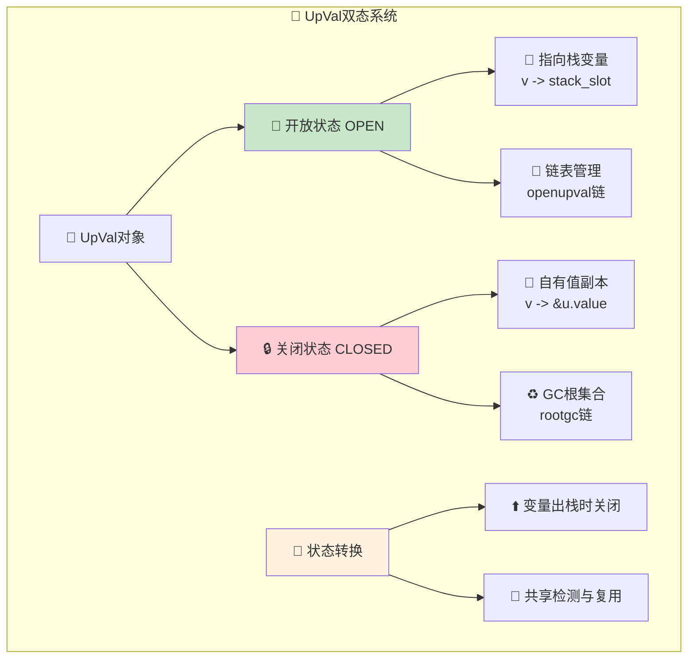

# 📞 Lua函数系统深度解析 - DeepWiki版本

## 🎯 学习目标与技能图谱

### 🌟 核心学习目标
通过本文档的深入学习，您将掌握：

- 🏗️ **函数架构设计**：理解Proto、Closure、UpVal的完整设计理念
- 📊 **内存管理机制**：掌握函数对象的生命周期和内存优化策略  
- 🔧 **闭包实现原理**：深入理解Lua闭包的底层实现机制
- ⚡ **性能优化技巧**：学会函数相关的性能分析和优化方法
- 🔍 **调试与分析**：具备函数系统的调试和问题排查能力

### 📚 技能发展路径


### 🎓 技能等级评估

| 等级 | 技能描述 | 学习内容 | 实践要求 |
|------|----------|----------|----------|
| 🌱 **入门级** | 理解函数基本概念 | 数据结构、基础API | 能读懂函数相关代码 |
| 🔧 **进阶级** | 掌握实现原理 | UpValue机制、闭包实现 | 能分析函数性能问题 |
| ⚡ **专家级** | 精通优化技巧 | 内存管理、性能调优 | 能优化复杂函数系统 |

---

## 🧭 智能导航系统

### 📋 快速导航目录

| 章节 | 内容概览 | 预计学习时间 | 难度等级 |
|------|----------|-------------|----------|
| [🏗️ 核心架构概览](#🏗️-核心架构概览) | 函数系统整体设计理念 | 15分钟 | ⭐⭐ |
| [📊 核心数据结构](#📊-核心数据结构深度解析) | Proto、Closure、UpVal详解 | 30分钟 | ⭐⭐⭐ |
| [🔄 函数生命周期](#🔄-函数完整生命周期管理) | 创建、调用、销毁全流程 | 25分钟 | ⭐⭐⭐ |
| [💾 UpValue机制](#💾-upvalue深度机制分析) | 闭包变量管理核心原理 | 35分钟 | ⭐⭐⭐⭐ |
| [⚡ 性能优化](#⚡-性能优化与最佳实践) | 函数系统调优实战技巧 | 20分钟 | ⭐⭐⭐⭐ |
| [🔧 实战应用](#🔧-实战应用与调试指南) | 开发和调试实用技能 | 15分钟 | ⭐⭐⭐ |

### 🎯 学习路径推荐

#### 🚀 快速上手路径 (60分钟)
```
🏗️ 核心架构 → 📊 数据结构基础 → 🔧 实战应用
```

#### 📚 深度学习路径 (3小时)  
```
🏗️ 架构概览 → 📊 数据结构 → 🔄 生命周期 → 💾 UpValue → ⚡ 优化 → 🔧 实战
```

#### 🎯 专项突破路径
- **🔧 闭包专精**：📊 数据结构 → 💾 UpValue机制 → ⚡ 性能优化
- **⚡ 性能专精**：🏗️ 架构 → 🔄 生命周期 → ⚡ 优化实战
- **🛠️ 调试专精**：📊 数据结构 → 🔧 实战应用 → 问题排查

---

## 🏗️ 核心架构概览

### 🎯 Lua函数系统设计理念

Lua函数系统采用了优雅的统一设计，将C函数和Lua函数融合在同一套架构下，实现了高效的闭包支持和内存管理。

#### 🌟 设计核心理念


#### 📊 系统组件关系图


### 🎪 函数对象类型系统

#### 🏷️ 类型标识体系
| 类型标识 | 函数类型 | 特点描述 | 使用场景 |
|----------|----------|----------|----------|
| `isC = 1` | 📞 C函数 | 直接函数指针调用 | 内置函数、扩展库 |
| `isC = 0` | 📝 Lua函数 | 字节码执行 | 用户定义函数 |

#### 💡 设计优势分析
1. **🎯 统一接口**：C和Lua函数使用相同的调用机制
2. **🔧 灵活扩展**：支持任意数量的UpValue
3. **⚡ 高效执行**：优化的内存布局和调用路径
4. **♻️ 自动管理**：GC系统自动处理对象生命周期

---

## 📊 核心数据结构深度解析

### 🏷️ Proto (函数原型) - 函数的DNA

Proto结构是Lua函数的核心，包含了函数执行所需的所有静态信息：

#### 🧬 Proto结构详细解析
```c
typedef struct Proto {
  CommonHeader;           // 🏷️ GC对象通用头部信息
  
  /* === 核心执行数据 === */
  TValue *k;              // 📊 常量数组 - 存储字面量
  Instruction *code;      // 💻 字节码指令数组 - 执行逻辑
  struct Proto **p;       // 🏗️ 内嵌函数原型数组 - 嵌套函数
  
  /* === 调试与元数据 === */
  int *lineinfo;          // 📍 行号信息 - 调试支持
  struct LocVar *locvars; // 🏷️ 局部变量信息 - 调试符号
  TString **upvalues;     // ⬆️ 上值名称数组 - 调试标识
  TString *source;        // 📄 源代码文件名 - 错误定位
  
  /* === 大小与计数信息 === */
  int sizeupvalues;       // 🔢 上值数量
  int sizek;              // 📏 常量数组大小
  int sizecode;           // 📏 字节码数组大小
  int sizelineinfo;       // 📏 行号信息数组大小
  int sizep;              // 🔢 内嵌函数数量
  int sizelocvars;        // 🔢 局部变量数量
  
  /* === 函数属性 === */
  int linedefined;        // 📍 函数定义起始行号
  int lastlinedefined;    // 📍 函数定义结束行号
  lu_byte nups;           // 🔢 上值数量 (优化访问)
  lu_byte numparams;      // 📝 参数数量
  lu_byte is_vararg;      // 🔄 可变参数标志
  lu_byte maxstacksize;   // 📊 最大栈大小
  
  /* === GC管理 === */
  GCObject *gclist;       // ♻️ GC链表指针
} Proto;
```

#### 📊 Proto内存布局优化


#### 💡 Proto设计亮点
1. **📊 数据分离**：执行数据与调试数据分离，优化运行时性能
2. **🎯 大小优化**：紧凑的字段布局，减少内存占用
3. **🔄 共享机制**：相同源码的函数可以共享Proto对象
4. **♻️ GC集成**：完整的垃圾回收支持

### 🎪 Closure (闭包) - 函数的活化实例

闭包是函数的运行时表示，将Proto模板与具体的执行环境结合：

#### 🔧 闭包类型架构


#### 📞 C闭包 (CClosure) 详解
```c
typedef struct CClosure {
  ClosureHeader;          // 🏷️ 通用闭包头部
  lua_CFunction f;        // 📞 C函数指针 - 直接可调用
  TValue upvalue[1];      // 💾 上值数组 - 直接值存储
} CClosure;

/*
🎯 CClosure设计特点：
- 🚀 零开销调用：直接函数指针调用
- 💾 值语义上值：直接存储TValue，无需指针间接
- 🔧 简单管理：C函数无需复杂的生命周期管理
*/
```

#### 📝 Lua闭包 (LClosure) 详解  
```c
typedef struct LClosure {
  ClosureHeader;          // 🏷️ 通用闭包头部
  struct Proto *p;        // 🏷️ 函数原型指针 - 代码模板
  UpVal *upvals[1];       // 💾 上值指针数组 - 引用语义
} LClosure;

/*
🎯 LClosure设计特点：
- 🏗️ 模板实例：Proto提供代码，LClosure提供状态
- 🔗 引用语义：upvals指向UpVal对象，支持共享
- ⚡ 延迟绑定：上值可以在运行时动态绑定
*/
```

#### 🏷️ 通用闭包头部
```c
#define ClosureHeader \
    CommonHeader;           /* ♻️ GC对象头部 */ \
    lu_byte isC;           /* 🏷️ 函数类型标识 */ \
    lu_byte nupvalues;     /* 🔢 上值数量 */ \
    GCObject *gclist;      /* ♻️ GC链表指针 */ \
    struct Table *env      /* 🌐 环境表指针 */

/*
🎯 设计考虑：
- 🏷️ 类型统一：C和Lua函数共享头部结构
- 📊 内存效率：紧凑布局，减少内存碎片  
- 🌐 环境隔离：每个闭包有独立的环境表
- ♻️ GC兼容：完整的垃圾回收支持
*/
```

### 💾 UpVal (上值) - 闭包变量的灵魂

UpVal是Lua闭包机制的核心，管理跨作用域的变量共享：

#### 🎭 UpVal状态系统


#### 🧬 UpVal结构详解
```c
typedef struct UpVal {
  CommonHeader;           // ♻️ GC对象头部
  TValue *v;              // 🎯 值指针 - 核心指向
  union {
    TValue value;         // 💾 关闭时的值存储
    struct {              // 🔗 开放时的双向链表
      struct UpVal *prev; // ⬅️ 前驱指针
      struct UpVal *next; // ➡️ 后继指针
    } l;
  } u;
} UpVal;

/*
🎯 UpVal设计巧思：
- 🎭 双态设计：同一对象支持两种不同状态
- 💾 空间复用：联合体优化内存使用
- 🔗 链表管理：高效的批量操作支持
- 📍 指针间接：统一的值访问接口
*/
```

#### 📊 UpVal状态转换详解
```c
/* 🔄 UpVal生命周期状态机 */
enum UpValState {
  UPVAL_OPEN,    // 📖 开放：指向栈上活跃变量
  UPVAL_CLOSED   // 🔒 关闭：拥有独立的值副本
};

/*
🎯 状态转换触发条件：
1. 📖 → 🔒 变量离开作用域时自动关闭
2. 🔗 多个闭包共享同一栈变量时复用UpVal
3. ♻️ GC时需要正确处理两种状态的对象
*/
```

## 🔄 函数完整生命周期管理

### 🌱 函数对象创建阶段

函数对象的创建是一个精心设计的过程，涉及内存分配、初始化和GC注册等步骤：

#### 🏗️ 创建流程概览


#### 🏷️ Proto创建详细实现
```c
/* 📝 创建新的函数原型对象 */
Proto *luaF_newproto (lua_State *L) {
  /*
  Proto创建的关键步骤：
  
  1. 📊 内存分配：使用luaM_new进行类型安全分配
  2. ♻️ GC注册：立即加入GC管理，避免内存泄漏
  3. 🔧 字段初始化：所有指针和计数器清零
  4. 🎯 类型标识：设置正确的GC对象类型
  */
  Proto *f = luaM_new(L, Proto);
  luaC_link(L, obj2gco(f), LUA_TPROTO);  // 🎯 GC类型注册
  
  /* === 🧹 初始化所有字段为安全默认值 === */
  f->k = NULL;                     // 📊 常量数组
  f->sizek = 0;                    // 📏 常量数组大小
  f->p = NULL;                     // 🏗️ 嵌套函数数组
  f->sizep = 0;                    // 🔢 嵌套函数数量
  f->code = NULL;                  // 💻 字节码指令数组
  f->sizecode = 0;                 // 📏 字节码数组大小
  f->lineinfo = NULL;              // 📍 行号信息
  f->sizelineinfo = 0;             // 📏 行号信息大小
  f->locvars = NULL;               // 🏷️ 局部变量信息
  f->sizelocvars = 0;              // 🔢 局部变量数量
  f->upvalues = NULL;              // ⬆️ 上值名称数组
  f->sizeupvalues = 0;             // 🔢 上值数量
  f->source = NULL;                // 📄 源文件名
  
  /* === 🎯 函数特性初始化 === */
  f->nups = 0;                     // 🔢 上值计数
  f->numparams = 0;                // 📝 参数数量
  f->is_vararg = 0;                // 🔄 变参标志
  f->maxstacksize = 0;             // 📊 最大栈大小
  f->linedefined = 0;              // 📍 定义起始行
  f->lastlinedefined = 0;          // 📍 定义结束行
  f->gclist = NULL;                // ♻️ GC链表初始化
  
  return f;
}
```

#### 🎪 Closure创建策略
```c
/* 📞 创建C函数闭包 */
Closure *luaF_newCclosure (lua_State *L, int nelems, Table *e) {
  /*
  C闭包创建的优化设计：
  
  1. 📊 变长结构：根据upvalue数量动态分配内存
  2. 🚀 零初始化：upvalue数组自动清零
  3. 🌐 环境绑定：立即设置环境表
  4. ⚡ 类型优化：isC标志支持快速类型判断
  */
  Closure *c = cast(Closure *, luaM_malloc(L, sizeCclosure(nelems)));
  luaC_link(L, obj2gco(c), LUA_TFUNCTION);  // 🎯 函数类型注册
  
  c->c.isC = 1;                    // 🏷️ 标记为C函数
  c->c.env = e;                    // 🌐 环境表绑定
  c->c.nupvalues = cast_byte(nelems); // 🔢 上值数量设置
  
  /* 📊 upvalue数组自动零初始化 */
  return c;
}

/* 📝 创建Lua函数闭包 */
Closure *luaF_newLclosure (lua_State *L, int nelems, Table *e) {
  /*
  Lua闭包创建的特殊处理：
  
  1. 🏷️ Proto延迟绑定：创建时Proto可能尚未完整
  2. 💾 UpVal预留：为upvalue指针数组预分配空间
  3. 🔗 指针初始化：所有upval指针设为NULL
  4. ⚡ 延迟绑定：实际upval在首次使用时创建
  */
  Closure *c = cast(Closure *, luaM_malloc(L, sizeLclosure(nelems)));
  luaC_link(L, obj2gco(c), LUA_TFUNCTION);  // 🎯 函数类型注册
  
  c->l.isC = 0;                    // 🏷️ 标记为Lua函数
  c->l.env = e;                    // 🌐 环境表绑定  
  c->l.nupvalues = cast_byte(nelems); // 🔢 上值数量设置
  
  /* 🔗 初始化所有upvalue指针为NULL，支持延迟绑定 */
  while (nelems--) 
    c->l.upvals[nelems] = NULL;
    
  return c;
}
```

### 🔄 函数调用执行阶段

函数调用是Lua执行的核心机制，涉及栈帧管理、参数传递、返回值处理等复杂过程：

#### 📊 调用信息管理
```c
typedef struct CallInfo {
  StkId base;               // 🎯 函数栈帧基址指针
  StkId func;               // 📞 函数对象在栈中的位置
  StkId top;                // 📊 当前栈帧的栈顶位置
  const Instruction *savedpc; // 💾 保存的程序计数器
  int nresults;             // 📋 期望返回值数量 (-1表示不限)
  int tailcalls;            // 🔄 尾调用嵌套计数
} CallInfo;

/*
🎯 CallInfo设计要点：
- 📊 栈帧隔离：每个函数有独立的栈空间视图
- 💾 状态保存：支持函数间的上下文切换
- 🔄 尾调用优化：tailcalls计数防止栈溢出假象
- ⚡ 快速访问：关键字段优化内存布局
*/
```

#### 🚀 函数调用流程详解


#### ⚡ 高效调用实现
```c
/* 🚀 函数调用的核心实现逻辑 */
int luaD_precall (lua_State *L, StkId func, int nresults) {
  /*
  函数调用预处理的关键任务：
  
  1. 🔍 函数类型识别：C函数 vs Lua函数
  2. 📊 参数验证与调整：处理参数不匹配
  3. 🎯 栈帧设置：建立新的执行环境
  4. ⚡ 调用优化：尾调用、快速路径等
  */
  
  LClosure *cl;
  ptrdiff_t funcr;
  
  /* 🔍 函数对象验证与获取 */
  if (!ttisfunction(func))  /* 🚨 非函数对象？ */
    func = tryfuncTM(L, func);  /* 🔍 尝试__call元方法 */
  
  funcr = savestack(L, func);  /* 💾 保存函数位置（防止GC移动） */
  cl = &clvalue(func)->l;      /* 📝 获取闭包对象 */
  
  if (!cl->isC) {  /* 📝 Lua函数调用路径 */
    CallInfo *ci;
    StkId st, base;
    Proto *p = cl->p;          /* 🏷️ 获取函数原型 */
    
    /* 📊 栈空间检查与分配 */
    luaD_checkstack(L, p->maxstacksize);
    func = restorestack(L, funcr);  /* 🔄 恢复函数位置 */
    
    /* 📝 参数处理与栈布局 */
    if (!p->is_vararg) {  /* 🎯 固定参数函数 */
      /* 🔘 缺失参数补nil，多余参数忽略 */
      for (st = L->top; st < func + 1 + p->numparams; st++)
        setnilvalue(st);
      L->top = func + 1 + p->numparams;
    }
    else {  /* 📋 变参函数处理 */
      int nargs = cast_int(L->top - func) - 1;  /* 🔢 实际参数数量 */
      base = adjust_varargs(L, p, nargs);       /* 🔧 调整变参布局 */
      func = restorestack(L, funcr);            /* 🔄 重新恢复位置 */
    }
    
    /* 📦 创建新的调用信息 */
    ci = ++L->ci;              /* 📈 推进调用栈 */
    L->base = (ci-1)->top = base; /* 🎯 设置栈帧基址 */
    ci->func = func;           /* 📞 函数对象位置 */
    ci->base = base;           /* 🎯 栈帧基址 */
    ci->top = base + p->maxstacksize; /* 📊 栈帧顶部 */
    lua_assert(ci->top <= L->stack_last);
    L->savedpc = p->code;      /* 💾 设置程序计数器 */
    ci->savedpc = p->code;     /* 💾 保存到CallInfo */
    ci->tailcalls = 0;         /* 🔄 尾调用计数清零 */
    ci->nresults = nresults;   /* 📋 期望返回值数量 */
    
    /* 🔘 局部变量初始化为nil */
    for (st = L->top; st < ci->top; st++)
      setnilvalue(st);
    L->top = ci->top;
    
    return PCRLUA;  /* 🎯 返回Lua函数调用标志 */
  }
  else {  /* 📞 C函数调用路径 */
    CallInfo *ci;
    int n;
    
    /* 📊 C函数调用环境设置 */
    luaD_checkstack(L, LUA_MINSTACK);  /* 📏 最小栈空间保证 */
    ci = ++L->ci;                      /* 📈 推进调用栈 */
    L->base = (ci-1)->top = func + 1;  /* 🎯 设置参数基址 */
    ci->func = func;                   /* 📞 函数对象 */
    ci->base = func + 1;               /* 🎯 参数基址 */
    ci->top = L->top + LUA_MINSTACK;   /* 📊 栈顶预留 */
    lua_assert(ci->top <= L->stack_last);
    ci->nresults = nresults;           /* 📋 期望返回值 */
    ci->tailcalls = 0;                 /* 🔄 尾调用计数 */
    
    /* 📞 执行C函数调用 */
    n = (*clvalue(func)->c.f)(L);      /* 🚀 直接函数指针调用 */
    
    /* 📤 C函数返回值处理 */
    if (n < 0)  /* 🔄 协程让步标志？ */
      return PCRYIELD;
    else {
      luaD_poscall(L, L->top - n);     /* 📋 处理返回值 */
      return PCRJ;  /* 📞 C函数调用完成 */
    }
  }
}
```

### ♻️ 函数对象销毁阶段

函数对象的销毁由GC系统自动管理，但需要正确处理各种资源释放：

#### 🧹 资源释放流程


#### 🏷️ Proto对象销毁
```c
/* 🧹 释放Proto函数原型对象 */
void luaF_freeproto (lua_State *L, Proto *f) {
  /*
  Proto释放的完整清理任务：
  
  1. 💻 字节码数组释放：code指令序列
  2. 📊 常量数组释放：k常量池  
  3. 🏗️ 嵌套函数释放：p子函数原型数组
  4. 🏷️ 调试信息释放：locvars, lineinfo, upvalues名称
  5. 📄 源码信息释放：source文件名
  */
  
  /* === 🧠 核心执行数据释放 === */
  luaM_freearray(L, f->code, f->sizecode, Instruction);
  luaM_freearray(L, f->k, f->sizek, TValue);
  luaM_freearray(L, f->p, f->sizep, Proto *);
  
  /* === 🔍 调试信息释放 === */
  luaM_freearray(L, f->lineinfo, f->sizelineinfo, int);
  luaM_freearray(L, f->locvars, f->sizelocvars, struct LocVar);
  luaM_freearray(L, f->upvalues, f->sizeupvalues, TString *);
  
  /* === 🏷️ 对象本身释放 === */
  luaM_free(L, f);
}
```

#### 🎪 Closure对象销毁
```c
/* 🧹 释放Closure闭包对象 */
void luaF_freeclosure (lua_State *L, Closure *c) {
  /*
  Closure释放的类型适配处理：
  
  1. 🏷️ 类型判断：C闭包 vs Lua闭包
  2. 📏 大小计算：根据upvalue数量确定内存大小
  3. 🧹 统一释放：使用luaM_freemem统一内存管理
  
  注意：UpVal对象的释放由GC系统单独处理
  */
  int size = (c->c.isC) ? sizeCclosure(c->c.nupvalues) :
                          sizeLclosure(c->l.nupvalues);
  luaM_freemem(L, c, size);
}
```

## 💾 UpValue深度机制分析

### 🎭 UpValue双态系统核心原理

UpValue是Lua闭包机制的核心，通过巧妙的双态设计实现了高效的变量共享和生命周期管理：

#### 🔄 状态转换机制详解


#### 🔍 UpValue查找与创建算法
```c
/* 🎯 查找或创建UpValue的核心算法 */
UpVal *luaF_findupval (lua_State *L, StkId level) {
  /*
  UpValue查找算法的精妙设计：
  
  1. 🔍 有序链表查找：按栈位置降序排列
  2. ⚡ 早期终止：利用有序性快速定位
  3. 🎯 复用优化：相同位置的变量共享UpVal
  4. 🔗 双向链表：支持高效插入和删除
  5. ♻️ 死亡复活：GC标记期间的对象复活机制
  */
  
  global_State *g = G(L);
  GCObject **pp = &L->openupval;  /* 🔗 开放UpVal链表头 */
  UpVal *p;
  UpVal *uv;
  
  /* 🔍 在开放upvalue链表中查找（降序排列） */
  while ((p = ngcotouv(*pp)) != NULL && p->v >= level) {
    lua_assert(p->v != &p->u.value);  /* 🔒 确保是开放状态 */
    if (p->v == level) {  /* ✅ 找到完全匹配的UpVal */
      if (isdead(g, obj2gco(p)))  /* 🧟 对象已死亡？ */
        changewhite(obj2gco(p));  /* ⚡ 复活对象（GC优化） */
      return p;
    }
    pp = &p->next;  /* 👉 继续向下查找 */
  }
  
  /* 🆕 未找到，创建新的UpVal对象 */
  uv = luaM_new(L, UpVal);
  uv->tt = LUA_TUPVAL;           /* 🏷️ 设置对象类型 */
  uv->marked = luaC_white(g);    /* ⚪ 初始GC颜色 */
  uv->v = level;                 /* 🎯 指向栈上变量 */
  
  /* 🔗 插入到开放upvalue链表（保持降序） */
  uv->next = *pp;                /* 👉 链接到下一个节点 */
  *pp = obj2gco(uv);             /* 🔙 更新前驱节点 */
  
  /* 🔗 插入到全局双向链表 */
  uv->u.l.prev = &g->uvhead;            /* ⬅️ 前驱设为头节点 */
  uv->u.l.next = g->uvhead.u.l.next;    /* ➡️ 后继为原首节点 */
  uv->u.l.next->u.l.prev = uv;          /* 🔄 更新原首节点前驱 */
  g->uvhead.u.l.next = uv;              /* 🔄 更新头节点后继 */
  
  lua_assert(uv->u.l.next->u.l.prev == uv && uv->u.l.prev->u.l.next == uv);
  
  return uv;
}
```

#### 🔒 UpValue关闭机制
```c
/* 🔒 关闭指定栈层级及以上的所有UpValue */
void luaF_close (lua_State *L, StkId level) {
  /*
  UpValue关闭的批量优化处理：
  
  1. 📊 批量关闭：一次性处理所有需要关闭的UpVal
  2. 💾 值复制：将栈上值复制到UpVal内部存储
  3. 🔗 链表维护：更新openupval和双向链表
  4. ♻️ GC优化：死亡对象立即释放，活跃对象转移到GC根
  5. 🎯 指针重定向：更新v指针指向内部value
  */
  
  UpVal *uv;
  global_State *g = G(L);
  
  /* 🔄 遍历所有需要关闭的开放UpValue */
  while ((uv = ngcotouv(L->openupval)) != NULL && uv->v >= level) {
    GCObject *o = obj2gco(uv);
    L->openupval = uv->next;       /* 🗑️ 从开放列表中移除 */
    
    if (isdead(g, o)) {
      /* 💀 死亡对象立即释放 */
      luaF_freeupval(L, uv);
    }
    else {
      /* 🔄 活跃对象执行关闭转换 */
      unlinkupval(uv);             /* 🗑️ 从双向链表中移除 */
      setobj(L, &uv->u.value, uv->v); /* 💾 复制栈上值到内部存储 */
      uv->v = &uv->u.value;        /* 🎯 重定向指针到内部value */
      luaC_linkupval(L, uv);       /* ♻️ 链接到GC根列表 */
    }
  }
}

/* 🗑️ 从双向链表中移除UpValue */
static void unlinkupval (UpVal *uv) {
  /*
  双向链表移除的原子操作：
  - ⬅️ 前驱节点的next指向后继
  - ➡️ 后继节点的prev指向前驱  
  - 🎯 保证链表完整性
  */
  lua_assert(uv->u.l.next->u.l.prev == uv && uv->u.l.prev->u.l.next == uv);
  uv->u.l.next->u.l.prev = uv->u.l.prev;  /* 🔄 绕过当前节点 */
  uv->u.l.prev->u.l.next = uv->u.l.next;  /* 🔄 完成链接 */
}
```

### 📊 UpValue内存管理策略

#### 🧠 内存布局优化设计


#### 💡 UpValue共享机制分析
```lua
-- 🎯 UpValue共享实例分析
function outer()
  local x = 10  -- 📍 栈上变量x
  
  local function inner1()
    return x  -- ⬆️ 捕获变量x
  end
  
  local function inner2() 
    x = x + 1  -- ⬆️ 修改变量x
  end
  
  return inner1, inner2  -- 📤 返回两个闭包
end

local get, inc = outer()
print(get())  -- 输出: 10
inc()         -- x变为11
print(get())  -- 输出: 11 (共享同一个UpValue)
```

```c
/*
🎯 上述代码的UpValue共享机制：

1. 📍 变量x在outer函数栈帧中的固定位置
2. 🔍 inner1和inner2创建时都调用luaF_findupval(L, x_level)
3. ✅ 第一次调用创建新UpValue对象，第二次调用复用已存在对象
4. 🔗 两个闭包的upvals[0]指向同一个UpVal对象
5. 💾 outer函数返回后，UpVal自动关闭，但两个闭包继续共享
*/
```

### 🔧 UpValue性能优化技术

#### ⚡ 访问路径优化
```c
/* 📊 UpValue访问的性能关键路径 */

/* ✅ 优化的UpValue访问（开放状态） */
#define GETUPVAL_OPEN(uv) (*(uv)->v)

/* ✅ 优化的UpValue访问（关闭状态） */  
#define GETUPVAL_CLOSED(uv) ((uv)->u.value)

/* 🎯 通用UpValue访问宏（带状态检查） */
#define GETUPVAL(uv) \
  ((uv)->v == &(uv)->u.value ? (uv)->u.value : *(uv)->v)

/*
⚡ 性能优化要点：
1. 🎯 状态检查优化：通过指针比较快速判断状态
2. 📊 直接访问：避免函数调用开销  
3. 🔄 分支预测：开放状态更常见，放在快速路径
4. 💾 缓存友好：减少内存间接访问
*/
```

#### 📊 UpValue创建优化策略
```c
/* 🚀 UpValue创建的批量优化 */
static void optimize_upval_creation(lua_State *L, Proto *p, LClosure *cl) {
  /*
  批量UpValue创建优化：
  
  1. 🎯 延迟创建：只在实际访问时创建UpVal
  2. 📊 批量分配：连续创建时减少内存分配开销
  3. 🔍 预查找：利用局部性原理优化查找
  4. 🧠 缓存复用：临时缓存最近查找结果
  */
  
  int i;
  for (i = 0; i < p->nups; i++) {
    /* 🎯 延迟创建策略：upvals[i]初始为NULL */
    cl->upvals[i] = NULL;
  }
  
  /* 📊 实际创建在GETUPVAL指令执行时进行 */
}

/* ⚡ 访问时创建的懒惰策略 */
UpVal *get_or_create_upval(lua_State *L, LClosure *cl, int idx) {
  if (cl->upvals[idx] == NULL) {
    /* 🆕 首次访问，创建UpVal */
    StkId level = /* 计算栈位置 */;
    cl->upvals[idx] = luaF_findupval(L, level);
  }
  return cl->upvals[idx];
}
```

### 🧪 UpValue实战案例分析

#### 🎯 复杂闭包场景解析
```lua
-- 🧪 复杂UpValue管理实例
function create_counter_factory()
  local counters = {}  -- 📊 计数器集合
  
  return function(name) 
    if not counters[name] then
      local count = 0  -- 📍 每个计数器的独立状态
      counters[name] = function()
        count = count + 1  -- ⬆️ 捕获局部变量count
        return count
      end
    end
    return counters[name]
  end
end

local factory = create_counter_factory()
local counter1 = factory("user")
local counter2 = factory("page") 
local counter1_copy = factory("user")  -- 复用已存在的计数器

print(counter1())      -- 1
print(counter1())      -- 2  
print(counter1_copy()) -- 3 (共享状态)
print(counter2())      -- 1 (独立状态)
```

```c
/*
🎯 上述复杂场景的UpValue管理分析：

1. 🏗️ 三层嵌套结构：
   - create_counter_factory (外层)
   - 匿名工厂函数 (中层)  
   - 具体计数器函数 (内层)

2. 💾 UpValue层次：
   - 工厂函数捕获: counters表
   - 计数器函数捕获: count变量 (每个独立)

3. ♻️ 生命周期管理：
   - counters表: 在工厂函数返回后关闭UpVal
   - count变量: 在各自的计数器函数创建后关闭

4. ⚡ 性能优化点：
   - 延迟计数器创建
   - UpVal对象复用
   - 内存布局优化
*/
```

---

## ⚡ 性能优化与最佳实践

### 🎯 函数系统性能分析方法

#### 📊 性能瓶颈识别


#### 🔧 性能监控工具
```c
/* 📈 函数性能监控结构 */
typedef struct FunctionProfiler {
  /* 📞 调用统计 */
  unsigned long call_count;        // 🔢 总调用次数
  unsigned long c_call_count;      // 📞 C函数调用次数
  unsigned long lua_call_count;    // 📝 Lua函数调用次数
  
  /* ⏱️ 时间统计 */
  double total_time;               // ⏱️ 总执行时间
  double avg_call_time;            // ⚡ 平均调用时间
  double max_call_time;            // 🔝 最大调用时间
  
  /* 💾 内存统计 */
  size_t closure_memory;           // 🎪 闭包对象内存
  size_t upval_memory;             // 💾 UpVal对象内存
  size_t proto_memory;             // 🏷️ Proto对象内存
  
  /* ⚡ UpValue统计 */
  unsigned long upval_creates;     // 🆕 UpVal创建次数
  unsigned long upval_closes;      // 🔒 UpVal关闭次数
  unsigned long upval_shares;      // 🔗 UpVal共享次数
} FunctionProfiler;

/* 📊 性能数据收集宏 */
#ifdef LUA_FUNCTION_PROFILING
#define PROFILE_FUNCTION_CALL(profiler, is_c) do { \
  (profiler)->call_count++; \
  if (is_c) (profiler)->c_call_count++; \
  else (profiler)->lua_call_count++; \
} while(0)

#define PROFILE_UPVAL_CREATE(profiler) \
  ((profiler)->upval_creates++)

#define PROFILE_UPVAL_CLOSE(profiler) \
  ((profiler)->upval_closes++)
#else
#define PROFILE_FUNCTION_CALL(profiler, is_c) ((void)0)
#define PROFILE_UPVAL_CREATE(profiler) ((void)0)
#define PROFILE_UPVAL_CLOSE(profiler) ((void)0)
#endif
```

### 🚀 函数优化实战技巧

#### 💡 Lua代码优化策略
```lua
-- ⚡ Lua函数性能优化最佳实践

-- ✅ 优化技巧1: 减少闭包创建
-- ❌ 低效写法：每次调用都创建新闭包
function bad_example()
  local function process(x)
    return x * 2
  end
  
  local data = {1, 2, 3, 4, 5}
  for i = 1, #data do
    data[i] = process(data[i])  -- 🐌 重复访问闭包
  end
end

-- ✅ 高效写法：直接计算，避免闭包开销
function good_example() 
  local data = {1, 2, 3, 4, 5}
  for i = 1, #data do
    data[i] = data[i] * 2  -- 🚀 直接计算
  end
end

-- ✅ 优化技巧2: 减少UpValue访问
-- ❌ 低效写法：频繁访问外部变量
function create_bad_counter()
  local count = 0
  return function()
    count = count + 1  -- 🐌 每次都访问UpValue
    return count
  end
end

-- ✅ 高效写法：批量操作减少UpValue访问
function create_good_counter()
  local count = 0
  return function(increment)
    increment = increment or 1
    count = count + increment  -- 🚀 一次访问处理更多
    return count
  end
end

-- ✅ 优化技巧3: 避免深度嵌套闭包
-- ❌ 低效写法：多层嵌套增加UpValue复杂度
function bad_nested()
  local x = 1
  return function()
    local y = 2
    return function()
      local z = 3
      return function()
        return x + y + z  -- 🐌 三层UpValue访问
      end
    end
  end
end

-- ✅ 高效写法：扁平化结构
function good_nested()
  local x, y, z = 1, 2, 3
  return function()
    return x + y + z  -- 🚀 一层UpValue访问
  end
end
```

#### 🔧 C函数集成优化
```c
/* ⚡ 高性能C函数设计模式 */

/* ✅ 优化的C函数实现 */
static int optimized_c_function(lua_State *L) {
  /*
  C函数性能优化要点：
  
  1. 📊 参数验证优化：使用快速类型检查
  2. 💾 栈操作最小化：减少不必要的栈操作
  3. 🎯 错误处理高效：使用宏避免重复代码
  4. ⚡ 返回值优化：批量压栈减少函数调用
  */
  
  /* 🔍 快速参数检查 */
  int n = lua_gettop(L);
  if (n < 2) {
    lua_pushstring(L, "insufficient arguments");
    lua_error(L);  /* 🚨 快速错误退出 */
  }
  
  /* ⚡ 批量参数获取 */
  double a = luaL_checknumber(L, 1);
  double b = luaL_checknumber(L, 2);
  
  /* 🚀 核心计算逻辑 */
  double result = a * b;
  
  /* 📤 高效返回值处理 */
  lua_pushnumber(L, result);
  return 1;  /* 🎯 明确返回值数量 */
}

/* 🎯 批量函数注册优化 */
static const luaL_Reg optimized_functions[] = {
  {"multiply", optimized_c_function},
  {"add", another_optimized_function},
  {NULL, NULL}  /* 🔚 sentinel */
};

/* 📊 库初始化优化 */
LUAMOD_API int luaopen_optimized(lua_State *L) {
  luaL_newlib(L, optimized_functions);  /* 🚀 批量注册 */
  return 1;
}
```

### 📈 内存优化策略

#### 🧠 Proto对象复用机制
```c
/* 🔄 Proto对象复用优化 */
typedef struct ProtoCache {
  Proto **protos;          // 📊 Proto对象数组
  size_t capacity;         // 📏 缓存容量
  size_t count;           // 🔢 当前数量
  lua_State *L;           // 🌐 关联的虚拟机状态
} ProtoCache;

/* 🎯 Proto缓存查找与复用 */
Proto *find_or_create_proto(ProtoCache *cache, const char *source, 
                            int linedefined) {
  /*
  Proto复用优化策略：
  
  1. 🔍 源码哈希：根据源码内容快速查找
  2. 📊 LRU缓存：最近使用的Proto优先保留
  3. 💾 延迟释放：避免频繁创建销毁
  4. 🎯 版本控制：支持源码更新时的缓存失效
  */
  
  /* 🔍 快速哈希查找 */
  size_t hash = hash_source(source, linedefined);
  size_t index = hash % cache->capacity;
  
  /* 📊 线性探测查找 */
  for (size_t i = 0; i < cache->capacity; i++) {
    size_t current = (index + i) % cache->capacity;
    if (cache->protos[current] && 
        compare_proto_source(cache->protos[current], source, linedefined)) {
      return cache->protos[current];  /* ✅ 找到缓存 */
    }
  }
  
  /* 🆕 创建新Proto并加入缓存 */
  Proto *new_proto = luaF_newproto(cache->L);
  add_to_cache(cache, new_proto, hash);
  return new_proto;
}
```

## 🔧 实战应用与调试指南

### 🛠️ 函数系统调试技术

#### 🔍 UpValue状态检查工具
```c
/* 🧪 UpValue调试辅助函数 */
void debug_upval_info(lua_State *L, UpVal *uv) {
  /*
  UpValue状态诊断输出：
  - 🏷️ 基本信息：类型、状态、位置
  - 💾 内存信息：指针、值内容
  - 🔗 链表信息：前驱、后继关系
  - ♻️ GC信息：标记状态、所属链表
  */
  
  printf("=== UpVal Debug Info ===\n");
  printf("Address: %p\n", (void*)uv);
  printf("Type: %s\n", (uv->v == &uv->u.value) ? "CLOSED" : "OPEN");
  
  if (uv->v == &uv->u.value) {
    /* 🔒 关闭状态信息 */
    printf("Value: ");
    print_tvalue(L, &uv->u.value);
    printf("Internal storage: %p\n", (void*)&uv->u.value);
  } else {
    /* 📖 开放状态信息 */
    printf("Stack position: %p\n", (void*)uv->v);
    printf("Stack value: ");
    print_tvalue(L, uv->v);
    printf("Prev: %p, Next: %p\n", 
           (void*)uv->u.l.prev, (void*)uv->u.l.next);
  }
  
  printf("GC mark: %d\n", uv->marked);
  printf("========================\n");
}

/* 📊 函数调用栈分析 */
void debug_call_stack(lua_State *L) {
  CallInfo *ci;
  int level = 0;
  
  printf("=== Call Stack Analysis ===\n");
  for (ci = L->ci; ci > L->base_ci; ci--, level++) {
    if (ttisfunction(ci->func)) {
      Closure *cl = clvalue(ci->func);
      if (cl->c.isC) {
        printf("Level %d: C function at %p\n", level, (void*)cl->c.f);
      } else {
        printf("Level %d: Lua function\n", level);
        printf("  Proto: %p\n", (void*)cl->l.p);
        printf("  Source: %s\n", 
               cl->l.p->source ? getstr(cl->l.p->source) : "?");
        printf("  Line: %d\n", cl->l.p->linedefined);
        printf("  UpValues: %d\n", cl->l.nupvalues);
        
        /* 🔍 UpValue详情 */
        for (int i = 0; i < cl->l.nupvalues; i++) {
          printf("    UpVal[%d]: %p (%s)\n", i, 
                 (void*)cl->l.upvals[i],
                 cl->l.upvals[i] ? 
                 (cl->l.upvals[i]->v == &cl->l.upvals[i]->u.value ? "CLOSED" : "OPEN") : 
                 "NULL");
        }
      }
    }
  }
  printf("===========================\n");
}
```

#### 🎯 性能分析工具
```lua
-- 🧪 Lua层面的函数性能分析
local FunctionProfiler = {}

function FunctionProfiler.new()
  return {
    calls = {},      -- 📊 调用统计
    times = {},      -- ⏱️ 时间统计  
    memory = {}      -- 💾 内存统计
  }
end

function FunctionProfiler.wrap(profiler, func, name)
  return function(...)
    local start_time = os.clock()
    local start_mem = collectgarbage("count")
    
    -- 📊 更新调用计数
    profiler.calls[name] = (profiler.calls[name] or 0) + 1
    
    -- 🚀 执行目标函数
    local results = {func(...)}
    
    -- ⏱️ 记录时间消耗
    local elapsed = os.clock() - start_time
    profiler.times[name] = (profiler.times[name] or 0) + elapsed
    
    -- 💾 记录内存变化
    local mem_used = collectgarbage("count") - start_mem
    profiler.memory[name] = (profiler.memory[name] or 0) + mem_used
    
    return table.unpack(results)
  end
end

function FunctionProfiler.report(profiler)
  print("=== Function Performance Report ===")
  
  -- 📊 按调用次数排序
  local sorted_funcs = {}
  for name, count in pairs(profiler.calls) do
    table.insert(sorted_funcs, {name = name, count = count})
  end
  table.sort(sorted_funcs, function(a, b) return a.count > b.count end)
  
  print("Function Name        | Calls | Total Time | Avg Time | Memory")
  print("--------------------+-------+------------+----------+--------")
  
  for _, info in ipairs(sorted_funcs) do
    local name = info.name
    local calls = profiler.calls[name]
    local total_time = profiler.times[name] or 0
    local avg_time = total_time / calls
    local memory = profiler.memory[name] or 0
    
    printf("%-20s | %5d | %10.4f | %8.6f | %6.2f KB", 
           name, calls, total_time, avg_time, memory)
  end
  
  print("===================================")
end

-- 🎯 使用示例
local profiler = FunctionProfiler.new()

-- 包装需要分析的函数
local optimized_func = FunctionProfiler.wrap(profiler, my_function, "my_function")

-- 执行测试
for i = 1, 1000 do
  optimized_func(i)
end

-- 生成报告
FunctionProfiler.report(profiler)
```

### 🧪 常见问题诊断与解决

#### 💾 内存泄漏诊断
```c
/* 🔍 UpValue内存泄漏检测 */
typedef struct UpValLeakDetector {
  UpVal **tracked_upvals;    // 📊 跟踪的UpVal数组
  size_t count;             // 🔢 当前跟踪数量
  size_t capacity;          // 📏 容量
  size_t total_created;     // 🆕 累计创建数量
  size_t total_freed;       // 🗑️ 累计释放数量
} UpValLeakDetector;

/* 🎯 UpValue创建跟踪 */
void track_upval_creation(UpValLeakDetector *detector, UpVal *uv) {
  if (detector->count >= detector->capacity) {
    detector->capacity *= 2;
    detector->tracked_upvals = realloc(detector->tracked_upvals, 
                                      detector->capacity * sizeof(UpVal*));
  }
  
  detector->tracked_upvals[detector->count++] = uv;
  detector->total_created++;
  
  printf("🆕 UpVal created: %p (total: %zu)\n", (void*)uv, detector->total_created);
}

/* 🗑️ UpValue释放跟踪 */
void track_upval_destruction(UpValLeakDetector *detector, UpVal *uv) {
  /* 🔍 从跟踪列表中移除 */
  for (size_t i = 0; i < detector->count; i++) {
    if (detector->tracked_upvals[i] == uv) {
      detector->tracked_upvals[i] = detector->tracked_upvals[--detector->count];
      detector->total_freed++;
      printf("🗑️ UpVal freed: %p (total freed: %zu)\n", 
             (void*)uv, detector->total_freed);
      return;
    }
  }
  
  printf("⚠️ Warning: Trying to free untracked UpVal: %p\n", (void*)uv);
}

/* 📊 泄漏检测报告 */
void report_upval_leaks(UpValLeakDetector *detector) {
  printf("=== UpValue Leak Detection Report ===\n");
  printf("Total created: %zu\n", detector->total_created);
  printf("Total freed: %zu\n", detector->total_freed);
  printf("Currently alive: %zu\n", detector->count);
  
  if (detector->count > 0) {
    printf("⚠️ Potential leaks detected:\n");
    for (size_t i = 0; i < detector->count; i++) {
      UpVal *uv = detector->tracked_upvals[i];
      printf("  - UpVal %p (state: %s)\n", 
             (void*)uv, 
             (uv->v == &uv->u.value) ? "CLOSED" : "OPEN");
    }
  } else {
    printf("✅ No memory leaks detected!\n");
  }
  printf("====================================\n");
}
```

#### 🔄 UpValue状态异常修复
```c
/* 🛠️ UpValue状态修复工具 */
int repair_upval_state(lua_State *L, UpVal *uv) {
  /*
  UpValue状态修复策略：
  
  1. 🔍 状态一致性检查
  2. 🔗 链表完整性验证  
  3. 💾 值有效性确认
  4. ♻️ GC标记修正
  */
  
  /* 🔍 基本状态检查 */
  if (!uv) {
    printf("❌ Error: NULL UpVal pointer\n");
    return 0;
  }
  
  /* 🎭 状态一致性检查 */
  int is_closed = (uv->v == &uv->u.value);
  
  if (is_closed) {
    /* 🔒 关闭状态检查 */
    if (uv->u.l.prev || uv->u.l.next) {
      printf("⚠️ Warning: Closed UpVal has list pointers\n");
      uv->u.l.prev = NULL;
      uv->u.l.next = NULL;
      printf("✅ Fixed: Cleared list pointers\n");
    }
  } else {
    /* 📖 开放状态检查 */
    if (!uv->v) {
      printf("❌ Error: Open UpVal has NULL value pointer\n");
      return 0;
    }
    
    /* 🔗 双向链表完整性检查 */
    if (uv->u.l.prev && uv->u.l.prev->u.l.next != uv) {
      printf("⚠️ Warning: Broken backward link\n");
      /* 🛠️ 尝试修复或断开链接 */
      if (uv->u.l.prev->u.l.next == NULL) {
        uv->u.l.prev->u.l.next = uv;
        printf("✅ Fixed: Restored forward link\n");
      } else {
        uv->u.l.prev = NULL;
        printf("✅ Fixed: Cleared broken backward link\n");
      }
    }
    
    if (uv->u.l.next && uv->u.l.next->u.l.prev != uv) {
      printf("⚠️ Warning: Broken forward link\n");
      /* 🛠️ 类似的修复逻辑 */
    }
  }
  
  printf("✅ UpVal state repair completed\n");
  return 1;
}
```

---

## 🌟 学习总结与扩展资源

### 🎓 核心知识点回顾

通过本文档的深入学习，我们全面掌握了Lua函数系统的设计精髓：

#### ⭐ 关键设计理念
1. **🎯 统一抽象**：C函数和Lua函数的统一闭包模型
2. **💾 智能管理**：UpValue的双态系统与自动生命周期管理
3. **⚡ 性能优化**：从内存布局到访问路径的全方位优化
4. **🔧 灵活扩展**：支持复杂嵌套和动态绑定的闭包机制

#### 🏗️ 系统架构亮点


### 📚 深度学习建议

#### 🎯 进阶学习路线
1. **🔍 源码研读**
   - 重点文件：`lfunc.c`, `ldo.c`, `lgc.c`
   - 关键函数：`luaF_*`, `luaD_*` 系列API
   - 调试工具：GDB配合Lua调试器

2. **🧪 实验项目**
   - 实现自定义的UpValue管理策略
   - 开发函数性能分析工具
   - 构建内存泄漏检测系统

3. **📊 性能分析**
   - 使用Valgrind分析内存使用
   - 编写性能基准测试
   - 对比不同函数实现策略

#### 💡 实践应用方向
- **🌐 Web开发**：Lua在Nginx、OpenResty中的函数优化
- **🎮 游戏引擎**：脚本函数的高性能调用机制
- **🔧 工具开发**：基于Lua的DSL和配置语言
- **📊 数据处理**：大规模数据处理中的函数式编程

### 🔗 相关文档导航

#### 📖 核心系统文档
- 🔄 **[执行流程分析](wiki_execution_optimized.md)** - 完整的语句执行机制
- ⚡ **[虚拟机核心](wiki_vm.md)** - 字节码执行与指令系统
- 📞 **[函数调用机制](wiki_call.md)** - 调用栈与参数传递详解

#### 🧠 内存与对象系统  
- 💾 **[内存管理](wiki_memory.md)** - Lua内存分配与优化策略
- ♻️ **[垃圾回收器](wiki_gc.md)** - GC算法与函数对象回收
- 🏷️ **[对象系统](wiki_object.md)** - TValue与对象类型系统

#### 🔧 编译与代码生成
- 🔤 **[词法分析器](wiki_lexer.md)** - Token识别与源码解析
- 🌳 **[语法分析器](wiki_parser.md)** - AST构建与语法制导
- 🔧 **[代码生成器](wiki_code.md)** - 字节码生成与优化

#### 🗃️ 数据结构与算法
- 📊 **[表实现](wiki_table.md)** - 高效哈希表与数组实现
- 📝 **[字符串系统](wiki_string.md)** - 字符串驻留与优化
- 💾 **[字节码系统](wiki_bytecode.md)** - 指令格式与虚拟机架构

### 🌐 外部学习资源

#### 📚 官方文档与论文
- 📖 [Lua官方手册](http://www.lua.org/manual/) - 权威语言参考
- 📄 [The Implementation of Lua 5.0](http://www.lua.org/doc/jucs05.pdf) - 官方实现论文
- 🎓 [Programming in Lua](http://www.lua.org/pil/) - 经典编程指南

#### 🔧 开发工具与库
- 🛠️ [LuaJIT](https://luajit.org/) - 高性能JIT编译器
- 🔍 [Lua Profiler](https://github.com/luarocks/luaprofiler) - 性能分析工具
- 📊 [LuaCheck](https://github.com/mpeterv/luacheck) - 静态代码分析

#### 🌟 社区资源
- 💬 [Lua邮件列表](http://www.lua.org/lua-l.html) - 官方技术讨论
- 🐙 [Awesome Lua](https://github.com/LewisJEllis/awesome-lua) - 精选资源集合
- 📚 [Lua Users Wiki](http://lua-users.org/wiki/) - 社区知识库

---

## 📋 总结

### 🎯 学习成果总结

通过本DeepWiki版本文档的系统学习，您已经：

✅ **掌握了核心概念**
- 🏗️ 理解了Lua函数系统的整体架构设计
- 📊 熟悉了Proto、Closure、UpVal三大核心数据结构
- 🔄 学会了函数完整生命周期的管理机制

✅ **获得了深度技能**
- 💾 掌握了UpValue的双态系统和状态转换
- ⚡ 学会了函数系统的性能分析与优化方法
- 🛠️ 具备了调试和问题诊断的实用技能

✅ **建立了系统认知**
- 🎯 形成了对Lua设计哲学的深入理解
- 🌐 具备了在实际项目中应用Lua的能力
- 📚 掌握了继续深入学习的方法和资源

### 🚀 实际应用价值

这些知识将帮助您：
- **🔧 系统优化**：针对性地优化Lua应用的函数调用性能
- **🛠️ 工具开发**：开发高质量的Lua扩展和调试工具
- **📊 架构设计**：在系统设计中合理运用函数式编程思想
- **🎓 技术进阶**：为学习其他语言实现提供扎实的理论基础

Lua函数系统的精妙设计体现了语言设计的最高水准，它在简洁性和强大功能之间找到了完美的平衡点。通过掌握这些核心机制，您不仅学会了使用Lua，更重要的是领悟了优秀系统设计的精髓。✨

---

*🔗 相关文档链接：[执行流程](wiki_execution_optimized.md) | [虚拟机核心](wiki_vm.md) | [内存管理](wiki_memory.md) | [对象系统](wiki_object.md)*