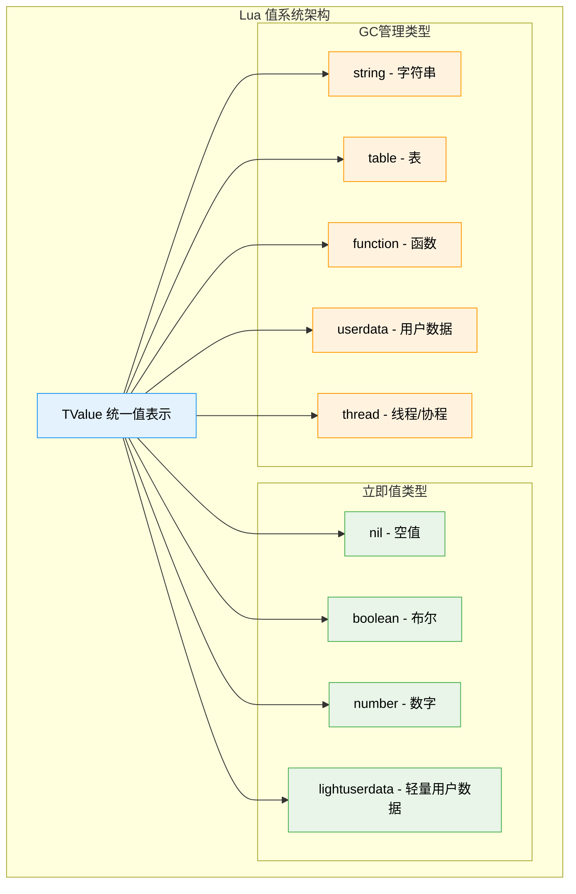
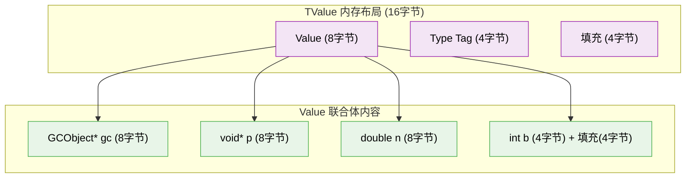
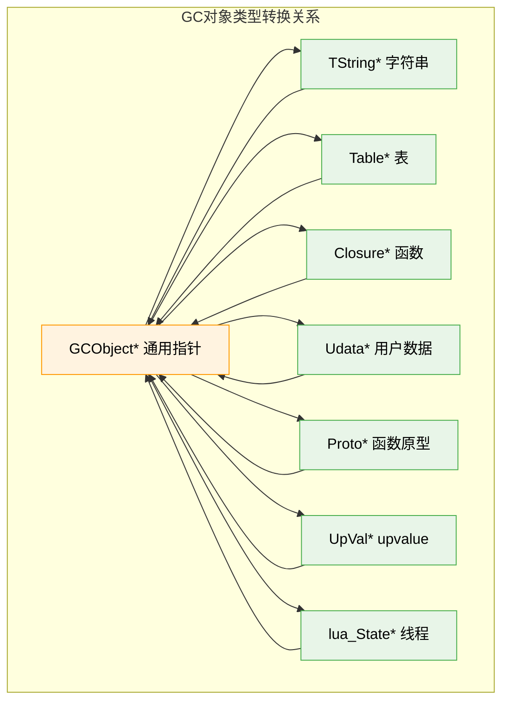
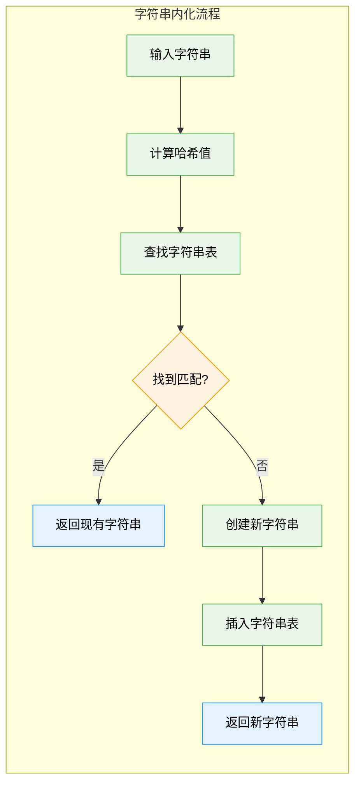

# 📊 Lua 5.1.5 对象系统深度解析 (lobject.h/lobject.c)

> **学习目标**：深入理解 Lua 统一值表示系统 (TValue)、八种基本数据类型的实现机制、类型检查与转换算法，以及垃圾回收对象的生命周期管理，掌握 Lua 高效的对象系统设计思想。

## 🎯 模块概述

### 🏗️ 核心设计理念

Lua 5.1.5 的对象系统体现了以下核心设计理念：

#### **统一值表示 (Tagged Value)**
- **设计思想**：所有 Lua 值都使用相同的 `TValue` 结构表示
- **优势**：简化虚拟机实现，统一操作接口，减少类型分支
- **实现策略**：值 + 类型标记的联合体设计

#### **高效的类型系统**
- **8种基本类型**：nil、boolean、number、string、table、function、userdata、thread
- **快速类型检查**：基于整数比较的类型判断
- **智能内存管理**：区分需要GC和不需要GC的类型



### 📋 核心数据结构概览

Lua 对象系统的核心围绕以下关键结构：

| 结构名称 | 功能描述 | 文件位置 | 设计要点 |
|----------|----------|----------|----------|
| **TValue** | 统一值表示 | `lobject.h:71` | 值+类型的联合体设计 |
| **Value** | 值的联合体 | `lobject.h:64` | 针对不同类型优化存储 |
| **GCObject** | GC对象头 | `lobject.h:35` | 垃圾回收的统一管理 |
| **CommonHeader** | 通用GC头 | `lobject.h:32` | 标记、类型、链接信息 |

## ⚙️ 统一值表示系统 (TValue) 详解

### 🔍 TValue 核心结构分析

```c
/**
 * 功能：Lua 统一值表示的核心结构
 * 
 * 设计思想：
 *   - 所有 Lua 值都通过此结构表示，实现类型系统的统一
 *   - 使用联合体优化内存使用，不同类型共享存储空间
 *   - 类型标记与值分离，支持高效的类型检查
 * 
 * 内存布局：64位系统下通常为16字节（8字节值+4字节类型+4字节填充）
 */
typedef struct lua_TValue {
    Value value;    // 8字节：实际数据值的联合体
    int tt;         // 4字节：类型标记 (Type Tag)
} TValue;

/**
 * 功能：存储不同类型值的联合体
 * 
 * 内存优化：
 *   - 所有类型共享相同的8字节存储空间
 *   - 针对64位系统优化：指针、double都是8字节
 *   - int和bool类型虽然只需要4字节，但保持结构对齐
 */
typedef union Value {
    GCObject *gc;     // 指向可垃圾回收对象的指针
    void *p;          // 轻量级用户数据指针  
    lua_Number n;     // 数字类型 (通常是double)
    int b;            // 布尔值 (0=false, 1=true)
} Value;
```

### 🎨 类型标记系统

```c
/**
 * 基本类型常量定义
 * 
 * 设计考虑：
 *   - 使用连续整数便于数组索引和switch分支
 *   - 0-8为用户可见类型，便于API类型检查
 *   - 内部类型使用更大的值，避免冲突
 */
#define LUA_TNIL           0  // nil类型
#define LUA_TBOOLEAN       1  // 布尔类型  
#define LUA_TLIGHTUSERDATA 2  // 轻量用户数据
#define LUA_TNUMBER        3  // 数字类型
#define LUA_TSTRING        4  // 字符串类型
#define LUA_TTABLE         5  // 表类型
#define LUA_TFUNCTION      6  // 函数类型
#define LUA_TUSERDATA      7  // 用户数据类型
#define LUA_TTHREAD        8  // 线程/协程类型

// 内部类型（虚拟机内部使用，Lua代码中不可见）
#define LAST_TAG           LUA_TTHREAD
#define LUA_TPROTO        (LAST_TAG+1)  // 函数原型
#define LUA_TUPVAL        (LAST_TAG+2)  // upvalue
#define LUA_TDEADKEY      (LAST_TAG+3)  // 表中的死亡键
```

### 🔧 高效的类型检查宏

```c
/**
 * 类型检查宏系统
 * 
 * 性能优化：
 *   - 内联展开避免函数调用开销
 *   - 单次内存访问 + 整数比较
 *   - 编译期优化，生成高效的机器代码
 */

// 基础类型访问
#define ttype(o)            ((o)->tt)                    // 获取类型标记
#define gcvalue(o)          ((o)->value.gc)              // 获取GC对象指针

// 类型判断宏（编译期内联，运行时高效）
#define ttisnil(o)          (ttype(o) == LUA_TNIL)
#define ttisnumber(o)       (ttype(o) == LUA_TNUMBER)  
#define ttisstring(o)       (ttype(o) == LUA_TSTRING)
#define ttistable(o)        (ttype(o) == LUA_TTABLE)
#define ttisfunction(o)     (ttype(o) == LUA_TFUNCTION)
#define ttisboolean(o)      (ttype(o) == LUA_TBOOLEAN)
#define ttisuserdata(o)     (ttype(o) == LUA_TUSERDATA)
#define ttisthread(o)       (ttype(o) == LUA_TTHREAD)
#define ttislightuserdata(o) (ttype(o) == LUA_TLIGHTUSERDATA)

// 可回收类型判断
#define iscollectable(o)    (ttype(o) >= LUA_TSTRING)
```

### 📊 值访问与类型安全

```c
/**
 * 类型安全的值访问宏
 * 
 * 安全机制：
 *   - check_exp 宏在Debug模式下进行类型验证
 *   - 防止类型错误导致的内存访问问题
 *   - Release模式下优化为直接访问
 */

// 数值类型访问
#define nvalue(o)      check_exp(ttisnumber(o), (o)->value.n)
#define bvalue(o)      check_exp(ttisboolean(o), (o)->value.b)  
#define pvalue(o)      check_exp(ttislightuserdata(o), (o)->value.p)

// GC对象访问（需要额外的结构转换）
#define rawtsvalue(o)  check_exp(ttisstring(o), &(o)->value.gc->ts)
#define tsvalue(o)     (&rawtsvalue(o)->tsv)               // 字符串值
#define rawuvalue(o)   check_exp(ttisuserdata(o), &(o)->value.gc->u)  
#define uvalue(o)      (&rawuvalue(o)->uv)                 // 用户数据值
#define clvalue(o)     check_exp(ttisfunction(o), &(o)->value.gc->cl)  // 函数值
#define hvalue(o)      check_exp(ttistable(o), &(o)->value.gc->h)      // 表值
#define thvalue(o)     check_exp(ttisthread(o), &(o)->value.gc->th)    // 线程值

// 调试模式的类型检查（Release模式下为空）
#ifdef luai_apicheck
    #define check_exp(c,e)  (lua_assert(c), (e))
#else
    #define check_exp(c,e)  (e)
#endif
```

## 💡 设计巧思与优化技术

### 🚀 内存布局优化



**优化要点**：
1. **对齐优化**：结构体按照最大成员（8字节）对齐
2. **缓存友好**：相关数据紧密排列，提高缓存命中率
3. **空间效率**：联合体设计节省内存，所有类型共享存储

### ⚡ 性能关键路径分析

| 操作类型 | 时间复杂度 | 优化技术 | 使用场景 |
|----------|------------|----------|----------|
| **类型检查** | O(1) | 内联宏 + 整数比较 | 虚拟机指令执行 |
| **值访问** | O(1) | 直接指针解引用 | 算术运算、函数调用 |
| **对象复制** | O(1) | 内存块复制 | 栈操作、赋值 |
| **GC标记** | O(1) | 位运算操作 | 垃圾回收过程 |

## 🗂️ 垃圾回收对象系统 (GCObject)

### 🔍 GC对象统一管理

```c
/**
 * 功能：所有可垃圾回收对象的统一头部
 * 
 * 设计目标：
 *   - 为所有GC对象提供统一的管理接口
 *   - 支持三色标记垃圾回收算法
 *   - 通过链表组织所有GC对象
 * 
 * 内存布局：CommonHeader 占用3个字节（紧凑设计）
 */
#define CommonHeader \
    GCObject *next;     /* 指向下一个GC对象的链表指针 */ \
    lu_byte tt;         /* 对象类型标记 */ \
    lu_byte marked      /* GC标记位：白色、灰色、黑色 */

/**
 * 功能：GC对象的联合体表示
 * 
 * 统一接口设计：
 *   - 所有GC对象都可以通过GCObject*访问
 *   - 支持类型安全的向上和向下转换
 *   - 便于垃圾回收器的统一处理
 */
typedef union GCObject {
    GCheader gch;          // 通用GC头部
    union TString ts;      // 字符串对象
    union Udata u;         // 用户数据对象  
    union Closure cl;      // 函数闭包对象
    struct Table h;        // 表对象
    struct Proto p;        // 函数原型对象
    struct UpVal uv;       // upvalue对象
    struct lua_State th;   // 线程/协程对象
} GCObject;

/**
 * 通用GC头部结构
 */
typedef struct GCheader {
    CommonHeader;
} GCheader;
```

### 🎨 GC标记位系统

```c
/**
 * 三色标记算法的颜色定义
 * 
 * 算法原理：
 *   - 白色：未被标记的对象，可能是垃圾
 *   - 灰色：已被标记但子对象未处理完
 *   - 黑色：已完成标记且所有子对象都已处理
 */

// 颜色位定义（使用位运算优化）
#define WHITE0BIT       0  // 白色0标记位
#define WHITE1BIT       1  // 白色1标记位  
#define BLACKBIT        2  // 黑色标记位
#define FINALIZEDBIT    3  // 已终结化标记位
#define KEYWEAKBIT      4  // 弱键标记位
#define VALUEWEAKBIT    5  // 弱值标记位
#define FIXEDBIT        6  // 固定对象标记位
#define SFIXEDBIT       7  // 单独固定标记位

// 颜色值计算
#define WHITEBITS       bit2mask(WHITE0BIT, WHITE1BIT)
#define iswhite(x)      test2bits((x)->gch.marked, WHITE0BIT, WHITE1BIT)
#define isblack(x)      testbit((x)->gch.marked, BLACKBIT)
#define isgray(x)       (!isblack(x) && !iswhite(x))

// GC状态切换宏
#define otherwhite(g)   (g->currentwhite ^ WHITEBITS)
#define isdead(g,v)     ((v)->gch.marked & otherwhite(g) & WHITEBITS)

// 标记操作
#define changewhite(x)  ((x)->gch.marked ^= WHITEBITS)
#define gray2black(x)   l_setbit((x)->gch.marked, BLACKBIT)
#define valiswhite(x)   (iscollectable(x) && iswhite(gcvalue(x)))
```

### 📊 对象类型与转换



### 🔧 类型安全的对象转换

```c
/**
 * 对象类型转换宏系统
 * 
 * 安全保证：
 *   - 编译期类型检查避免错误转换
 *   - 运行时验证确保对象类型正确
 *   - 提供双向转换支持
 */

// GCObject 转换为具体类型
#define gco2ts(o)   check_exp((o)->gch.tt == LUA_TSTRING, &((o)->ts))
#define gco2u(o)    check_exp((o)->gch.tt == LUA_TUSERDATA, &((o)->u))  
#define gco2cl(o)   check_exp((o)->gch.tt == LUA_TFUNCTION, &((o)->cl))
#define gco2h(o)    check_exp((o)->gch.tt == LUA_TTABLE, &((o)->h))
#define gco2p(o)    check_exp((o)->gch.tt == LUA_TPROTO, &((o)->p))
#define gco2uv(o)   check_exp((o)->gch.tt == LUA_TUPVAL, &((o)->uv))
#define gco2th(o)   check_exp((o)->gch.tt == LUA_TTHREAD, &((o)->th))

// 具体类型转换为 GCObject
#define obj2gco(v)  (cast(GCObject *, (v)))

// 常用转换快捷宏
#define rawgco2ts(o)    (&(o)->ts)
#define rawgco2u(o)     (&(o)->u)
#define rawgco2cl(o)    (&(o)->cl)
#define rawgco2h(o)     (&(o)->h)
```

## 🎼 八种基本类型深度实现

### 1️⃣ Nil 类型 - 空值的艺术

```c
/**
 * Nil 类型设计哲学：
 * 
 * 简洁性：
 *   - 不占用Value联合体的任何空间
 *   - 仅通过类型标记 LUA_TNIL 识别
 *   - 全局共享单一的nil对象实例
 * 
 * 性能优化：
 *   - 避免重复创建nil值，节省内存
 *   - 快速的指针比较判断nil值
 */

// 全局唯一的nil对象
LUAI_DATA const TValue luaO_nilobject_;
#define luaO_nilobject (&luaO_nilobject_)

// nil值设置（仅设置类型标记）
#define setnilvalue(obj) ((obj)->tt = LUA_TNIL)

// Lua中的假值判断（nil和false都是假值）
#define l_isfalse(o) (ttisnil(o) || (ttisboolean(o) && bvalue(o) == 0))

// nil值的特殊性质
static const TValue luaO_nilobject_d = {{NULL}, LUA_TNIL};
```

**设计亮点**：
- **内存效率**：全局共享，零存储开销
- **语义清晰**：明确表示"无值"状态  
- **性能优化**：避免动态分配和比较

### 2️⃣ Boolean 类型 - 真假值系统

```c
/**
 * Boolean 类型实现要点：
 * 
 * 二值逻辑：
 *   - true: bvalue = 1, false: bvalue = 0
 *   - 支持与C语言boolean系统的直接映射
 *   - 快速的整数比较判断真假
 */

// 布尔值设置宏
#define setbvalue(obj,x) \
  { TValue *i_o=(obj); i_o->value.b=(x); i_o->tt=LUA_TBOOLEAN; }

// 布尔值访问
#define bvalue(o) check_exp(ttisboolean(o), (o)->value.b)

// 真值测试（Lua中只有nil和false是假值）
int lua_toboolean (lua_State *L, int idx) {
  const TValue *o = index2adr(L, idx);
  return !l_isfalse(o);
}
```

### 3️⃣ Number 类型 - 数值计算基础

```c
/**
 * Number 类型设计考虑：
 * 
 * 精度选择：
 *   - 默认使用double（64位浮点）提供足够精度
 *   - 可配置为float（32位）或其他数值类型
 *   - 支持整数的精确表示（在精度范围内）
 * 
 * 性能优化：
 *   - 直接存储在Value联合体中，无需额外分配
 *   - 支持硬件浮点运算指令
 */

// 数字类型定义（可配置）
typedef double lua_Number;

// 数字值设置和访问
#define setnvalue(obj,x) \
  { TValue *i_o=(obj); i_o->value.n=(x); i_o->tt=LUA_TNUMBER; }

#define nvalue(o) check_exp(ttisnumber(o), (o)->value.n)

/**
 * 字符串到数字的转换
 * 
 * 算法特点：
 *   - 支持十进制、十六进制格式
 *   - 兼容C标准库的strtod行为
 *   - 错误处理：转换失败返回NULL
 */
const TValue *luaV_tonumber (const TValue *obj, TValue *n) {
  lua_Number num;
  if (ttisnumber(obj)) 
    return obj;  // 已经是数字，直接返回
  
  // 尝试将字符串转换为数字
  if (ttisstring(obj) && luaO_str2d(svalue(obj), &num)) {
    setnvalue(n, num);
    return n;
  }
  
  return NULL;  // 转换失败
}

/**
 * 数字到字符串的转换
 * 
 * 格式化策略：
 *   - 整数：无小数点格式 (如 "42")
 *   - 浮点数：自动选择最佳表示形式
 *   - 科学计数法：用于极大或极小的数
 */
int luaV_tostring (lua_State *L, StkId obj) {
  if (!ttisnumber(obj))
    return 0;
  else {
    char s[LUAI_MAXNUMBER2STR];
    lua_Number n = nvalue(obj);
    lua_number2str(s, n);  // 平台相关的数字格式化
    setsvalue2s(L, obj, luaS_new(L, s));
    return 1;
  }
}
```

### 4️⃣ String 类型 - 高效的不可变字符串

```c
/**
 * String 类型的核心设计：
 * 
 * 不可变性：
 *   - 字符串创建后不可修改，保证了线程安全
 *   - 支持安全的字符串共享和引用传递
 *   - 简化了垃圾回收的处理逻辑
 * 
 * 内化机制 (String Interning)：
 *   - 相同内容的字符串只存储一份
 *   - 字符串比较退化为指针比较 O(1)
 *   - 显著减少内存使用和提高性能
 */
typedef union TString {
  L_Umaxalign dummy;     // 确保最大内存对齐
  struct {
    CommonHeader;        // GC管理头部
    lu_byte reserved;    // 保留字标记位（用于关键字识别）
    unsigned int hash;   // 预计算的哈希值
    size_t len;         // 字符串长度（字节数）
  } tsv;
} TString;

// 字符串内容访问（字符串数据紧跟在结构体后面）
#define getstr(ts)   cast(const char *, (ts) + 1)
#define svalue(o)    getstr(tsvalue(o))

/**
 * 字符串内化算法实现
 * 
 * 哈希策略：
 *   - 长字符串采用采样哈希避免性能损失
 *   - 短字符串全部参与哈希计算
 *   - 使用链式哈希表解决冲突
 * 
 * 算法复杂度：平均 O(1)，最坏 O(n)
 */
TString *luaS_newlstr (lua_State *L, const char *str, size_t l) {
  GCObject *o;
  unsigned int h = cast(unsigned int, l);  // 以长度为哈希种子
  size_t step = (l>>5)+1;  // 采样步长：长字符串每32字符采样一次
  size_t l1;
  
  // 计算哈希值（采样策略优化）
  for (l1=l; l1>=step; l1-=step)
    h = h ^ ((h<<5)+(h>>2)+cast(unsigned char, str[l1-1]));
  
  // 在全局字符串表中查找已存在的字符串
  for (o = G(L)->strt.hash[lmod(h, G(L)->strt.size)];
       o != NULL;
       o = o->gch.next) {
    TString *ts = rawgco2ts(o);
    
    // 比较长度和内容
    if (ts->tsv.len == l && (memcmp(str, getstr(ts), l) == 0)) {
      // 找到现存字符串，检查是否为"死亡"状态
      if (isdead(G(L), o))  
        changewhite(o);  // 复活死亡的字符串
      return ts;
    }
  }
  
  // 未找到，创建新字符串
  return newlstr(L, str, l, h);
}

/**
 * 新字符串创建过程
 */
static TString *newlstr (lua_State *L, const char *str, size_t l, 
                        unsigned int h) {
  TString *ts;
  stringtable *tb;
  
  // 检查字符串表是否需要扩容
  if (l+1 > (MAX_SIZET-sizeof(TString))/sizeof(char))
    luaM_toobig(L);
    
  // 分配内存：结构体 + 字符串内容 + '\0'
  ts = cast(TString *, luaM_malloc(L, (l+1)*sizeof(char)+sizeof(TString)));
  ts->tsv.len = l;
  ts->tsv.hash = h;
  ts->tsv.marked = luaC_white(G(L));  // 设置为当前白色
  ts->tsv.tt = LUA_TSTRING;
  ts->tsv.reserved = 0;
  
  // 复制字符串内容
  memcpy(ts+1, str, l*sizeof(char));
  ((char *)(ts+1))[l] = '\0';  // 添加字符串结尾标记
  
  // 插入到字符串哈希表
  tb = &G(L)->strt;
  h = lmod(h, tb->size);
  ts->tsv.next = tb->hash[h];  // 链式哈希
  tb->hash[h] = obj2gco(ts);
  tb->nuse++;
  
  // 检查是否需要重新哈希
  if (tb->nuse > cast(lu_int32, tb->size) && tb->size <= MAX_INT/2)
    luaS_resize(L, tb->size*2);  // 扩大哈希表
    
  return ts;
}
```

**字符串系统的性能优化**：



### 5️⃣ Table 类型 - Lua的核心数据结构

```c
/**
 * Table 类型说明：
 * 
 * Lua 中唯一的数据结构化类型，同时支持：
 *   - 数组功能：整数索引的高效访问
 *   - 哈希表功能：任意键值对的存储
 *   - 元表机制：支持操作符重载和面向对象编程
 * 
 * 详细实现请参考：wiki_table.md
 */

// Table结构的简化表示（完整定义见ltable.h）
typedef struct Table {
  CommonHeader;
  lu_byte flags;           // 元方法缓存标志位
  lu_byte lsizenode;       // 哈希部分大小的log2值
  struct Table *metatable; // 元表指针
  TValue *array;           // 数组部分
  Node *node;              // 哈希部分
  Node *lastfree;          // 最后一个空闲节点指针
  GCObject *gclist;        // GC遍历链表
  int sizearray;           // 数组部分大小
} Table;
```

### 6️⃣ Function 类型 - 函数与闭包

```c
/**
 * Function 类型设计：
 * 
 * 双重表示：
 *   - Lua函数：由字节码定义，支持upvalue
 *   - C函数：直接的C函数指针，高性能调用
 * 
 * 闭包支持：
 *   - upvalue机制实现词法作用域
 *   - 自动捕获外部变量
 * 
 * 详细实现请参考：wiki_function.md
 */

// 函数类型的联合表示
typedef union Closure {
  CClosure c;    // C函数闭包
  LClosure l;    // Lua函数闭包
} Closure;
```

### 7️⃣ Userdata 类型 - C数据的Lua包装

```c
/**
 * Userdata 类型功能：
 * 
 * C数据集成：
 *   - 允许在Lua中表示任意C数据结构
 *   - 提供类型安全的数据封装
 *   - 支持垃圾回收自动管理
 * 
 * 元表支持：
 *   - 可定义自定义操作行为
 *   - 实现面向对象的接口
 */
typedef union Udata {
  L_Umaxalign dummy;       // 确保内存对齐
  struct {
    CommonHeader;
    struct Table *metatable;  // 元表
    struct Table *env;        // 环境表
    size_t len;              // 用户数据长度
  } uv;
} Udata;

// 用户数据大小计算（包含头部和数据部分）
#define sizeudata(u) (sizeof(union Udata)+(u)->len)

/**
 * 创建新的用户数据
 * 
 * 内存布局：Udata结构 + 用户数据内容
 * 返回值：指向用户数据部分的指针（跳过Udata头部）
 */
void *lua_newuserdata (lua_State *L, size_t size) {
  Udata *u;
  lua_lock(L);
  luaC_checkGC(L);  // 检查是否需要触发GC
  
  // 分配内存：头部 + 用户数据
  u = cast(Udata *, luaM_malloc(L, sizeludata(size)));
  u->uv.marked = luaC_white(G(L));  // 设置GC标记
  u->uv.tt = LUA_TUSERDATA;
  u->uv.len = size;
  u->uv.metatable = NULL;
  u->uv.env = G(L)->l_gt;  // 设置全局环境
  
  // 链接到GC链表
  u->uv.next = G(L)->rootgc;
  G(L)->rootgc = obj2gco(u);
  
  // 将用户数据推入栈
  setuvalue(L, L->top, u);
  api_incr_top(L);
  lua_unlock(L);
  
  return u + 1;  // 返回用户数据部分的指针
}
```

### 8️⃣ Thread 类型 - 协程与并发

```c
/**
 * Thread 类型 (协程)：
 * 
 * 协作式并发：
 *   - 用户控制的执行切换
 *   - 独立的执行栈和程序计数器
 *   - 轻量级的并发实现
 * 
 * 详细实现请参考：wiki_call.md
 */

// Thread就是一个完整的Lua执行状态
typedef struct lua_State lua_State;
// 完整定义见lstate.h
```

### 9️⃣ Light Userdata 类型 - 轻量级C指针

```c
/**
 * Light Userdata 设计特点：
 * 
 * 轻量级设计：
 *   - 直接存储C指针值，不涉及GC管理
 *   - 零开销的C指针传递
 *   - 适用于临时的、由C代码管理的数据
 * 
 * 使用场景：
 *   - C库的句柄传递
 *   - 临时指针存储
 *   - 避免GC开销的场合
 */

// 轻量用户数据设置
#define setpvalue(obj,x) \
  { TValue *i_o=(obj); i_o->value.p=(x); i_o->tt=LUA_TLIGHTUSERDATA; }

// 轻量用户数据访问  
#define pvalue(o) check_exp(ttislightuserdata(o), (o)->value.p)

/**
 * 轻量用户数据API
 */
void lua_pushlightuserdata (lua_State *L, void *p) {
  lua_lock(L);
  setpvalue(L->top, p);  // 直接存储指针值
  api_incr_top(L);
  lua_unlock(L);
}
```

## 🔄 值操作与生命周期管理

### 🎨 TValue 设置操作系统

```c
/**
 * TValue设置宏的设计原则：
 * 
 * 类型安全：
 *   - 每种类型都有专门的设置宏
 *   - 编译期检查防止类型错误
 *   - 统一的接口风格
 * 
 * 性能优化：
 *   - 内联展开避免函数调用
 *   - 最小化内存访问次数
 *   - 针对不同场景的优化版本
 */

// 立即值类型设置（不涉及GC）
#define setnilvalue(obj)     ((obj)->tt=LUA_TNIL)
#define setnvalue(obj,x)     {TValue *i_o=(obj); i_o->value.n=(x); i_o->tt=LUA_TNUMBER;}
#define setpvalue(obj,x)     {TValue *i_o=(obj); i_o->value.p=(x); i_o->tt=LUA_TLIGHTUSERDATA;}
#define setbvalue(obj,x)     {TValue *i_o=(obj); i_o->value.b=(x); i_o->tt=LUA_TBOOLEAN;}

// GC对象设置（需要生命周期检查）
#define setsvalue(L,obj,x) \
  { TValue *i_o=(obj); \
    i_o->value.gc=cast(GCObject *, (x)); i_o->tt=LUA_TSTRING; \
    checkliveness(G(L),i_o); }

#define setuvalue(L,obj,x) \
  { TValue *i_o=(obj); \
    i_o->value.gc=cast(GCObject *, (x)); i_o->tt=LUA_TUSERDATA; \
    checkliveness(G(L),i_o); }

#define sethvalue(L,obj,x) \
  { TValue *i_o=(obj); \
    i_o->value.gc=cast(GCObject *, (x)); i_o->tt=LUA_TTABLE; \
    checkliveness(G(L),i_o); }

#define setclvalue(L,obj,x) \
  { TValue *i_o=(obj); \
    i_o->value.gc=cast(GCObject *, (x)); i_o->tt=LUA_TFUNCTION; \
    checkliveness(G(L),i_o); }

#define setthvalue(L,obj,x) \
  { TValue *i_o=(obj); \
    i_o->value.gc=cast(GCObject *, (x)); i_o->tt=LUA_TTHREAD; \
    checkliveness(G(L),i_o); }

/**
 * 生命周期检查宏
 * 
 * 调试模式下验证：
 *   - GC对象是否处于活跃状态
 *   - 防止引用已死亡的对象
 *   - 检测内存管理错误
 */
#define checkliveness(g,obj) \
    lua_assert(!iscollectable(obj) || \
               (ttype(obj) == (obj)->value.gc->gch.tt && \
                !isdead(g, (obj)->value.gc)))
```

### 🔧 对象复制与移动

```c
/**
 * 对象复制操作的性能优化
 * 
 * 针对不同复制场景的优化：
 *   - 栈到栈：最常见，高度优化
 *   - 到表：需要写屏障检查
 *   - 到新对象：简化的复制
 */

// 通用对象复制
#define setobj(L,obj1,obj2) \
  { const TValue *o2=(obj2); TValue *o1=(obj1); \
    o1->value = o2->value; o1->tt=o2->tt; \
    checkliveness(G(L),o1); }

// 针对不同目标的优化版本
#define setobjs2s   setobj    // 栈到栈
#define setobj2s    setobj    // 任意到栈  
#define setobj2t    setobj    // 到表（可能需要写屏障）
#define setobj2n    setobj    // 到新对象（无需检查）

/**
 * 高性能的栈间复制
 */
static void copy_stack_values(StkId from, StkId to, int n) {
  while (n--) {
    setobjs2s(to++, from++);  // 内联展开的快速复制
  }
}

## 🎼 类型转换与比较算法

### 🔄 智能类型转换系统

```c
/**
 * Lua的自动类型转换哲学：
 * 
 * 最小惊讶原则：
 *   - 只在安全且明确的情况下进行自动转换
 *   - 数字⇄字符串：算术和字符串操作中自动转换
 *   - 布尔转换：只有nil和false为假值
 * 
 * 性能考虑：
 *   - 转换结果缓存避免重复计算
 *   - 快速路径优化常见转换场景
 */

/**
 * 通用的转换为字符串
 * 
 * 转换规则：
 *   - 数字：格式化为十进制字符串
 *   - 字符串：直接返回
 *   - 其他：通过元方法__tostring或默认格式
 */
const char *luaO_pushvfstring (lua_State *L, const char *fmt, va_list argp) {
  int n = 1;
  const char *p = fmt;
  luaL_Buffer b;
  luaL_buffinit(L, &b);
  
  while ((p = strchr(p, '%')) != NULL) {
    luaL_addlstring(&b, fmt, p-fmt);  // 添加格式字符串的字面部分
    
    switch (*(++p)) {
      case 's': {  // 字符串参数
        const char *s = va_arg(argp, char *);
        if (s == NULL) s = "(null)";
        luaL_addstring(&b, s);
        break;
      }
      case 'c': {  // 字符参数
        char buff = cast(char, va_arg(argp, int));
        luaL_addlstring(&b, &buff, 1);
        break;
      }
      case 'd': {  // 整数参数
        luaL_addstring(&b, luaO_pushfstring(L, "%d", va_arg(argp, int)));
        break;
      }
      case 'f': {  // 浮点数参数
        luaL_addstring(&b, luaO_pushfstring(L, "%f", 
                      va_arg(argp, l_uacNumber)));
        break;
      }
      case 'p': {  // 指针参数
        char buff[4*sizeof(void *) + 8];
        sprintf(buff, "%p", va_arg(argp, void *));
        luaL_addstring(&b, buff);
        break;
      }
      case '%': {  // 字面%符号
        luaL_addchar(&b, '%');
        break;
      }
      default: {   // 未知格式符
        char buff[3] = {'%', *p, '\0'};
        luaL_addstring(&b, buff);
        break;
      }
    }
    p++;
    fmt = p;
  }
  
  luaL_addstring(&b, fmt);  // 添加剩余部分
  luaL_pushresult(&b);      // 完成字符串构建
  return lua_tostring(L, -1);
}
```

### ⚖️ 高效的值比较算法

```c
/**
 * 相等性比较的实现
 * 
 * 比较策略：
 *   - 类型不同：直接返回false（除了数字类型的特殊处理）
 *   - 相同类型：根据类型采用不同的比较算法
 *   - 元方法：支持用户自定义的相等性语义
 */
int luaV_equalval (lua_State *L, const TValue *t1, const TValue *t2) {
  const TValue *tm;
  
  lua_assert(ttype(t1) == ttype(t2));  // 调用前已确保类型相同
  
  switch (ttype(t1)) {
    case LUA_TNIL: 
      return 1;  // 所有nil都相等
      
    case LUA_TNUMBER: 
      return luai_numeq(nvalue(t1), nvalue(t2));  // 数值相等比较
      
    case LUA_TBOOLEAN: 
      return bvalue(t1) == bvalue(t2);  // 布尔值必须完全相同
      
    case LUA_TLIGHTUSERDATA: 
      return pvalue(t1) == pvalue(t2);  // 指针比较
      
    case LUA_TUSERDATA: {
      if (uvalue(t1) == uvalue(t2)) return 1;  // 相同对象
      // 尝试元方法__eq
      tm = get_compTM(L, uvalue(t1)->metatable, uvalue(t2)->metatable, TM_EQ);
      break;
    }
    
    case LUA_TTABLE: {
      if (hvalue(t1) == hvalue(t2)) return 1;  // 相同表对象
      // 尝试元方法__eq  
      tm = get_compTM(L, hvalue(t1)->metatable, hvalue(t2)->metatable, TM_EQ);
      break;
    }
    
    default: 
      return gcvalue(t1) == gcvalue(t2);  // 其他GC对象：指针比较
  }
  
  if (tm == NULL) return 0;  // 没有元方法，不相等
  
  // 调用元方法进行比较
  callTMres(L, tm, t1, t2, L->top);
  return !l_isfalse(L->top);
}

/**
 * 小于比较的实现
 * 
 * 支持的比较：
 *   - 数字：直接数值比较
 *   - 字符串：字典序比较
 *   - 其他类型：通过元方法__lt
 */
int luaV_lessthan (lua_State *L, const TValue *l, const TValue *r) {
  int res;
  
  if (ttype(l) != ttype(r))
    return luaG_ordererror(L, l, r);  // 类型不同，无法比较
    
  else if (ttisnumber(l))
    return luai_numlt(nvalue(l), nvalue(r));  // 数值比较
    
  else if (ttisstring(l))
    return l_strcmp(rawtsvalue(l), rawtsvalue(r)) < 0;  // 字符串比较
    
  else if ((res = call_orderTM(L, l, r, TM_LT)) != -1)
    return res;  // 元方法比较
    
  return luaG_ordererror(L, l, r);  // 无法比较，报错
}
```

## 📍 栈索引与API设计

### 🎯 灵活的栈索引系统

```c
/**
 * Lua栈索引的设计哲学：
 * 
 * 多样化索引：
 *   - 正数索引：从栈底开始 (1, 2, 3, ...)
 *   - 负数索引：从栈顶开始 (-1, -2, -3, ...)
 *   - 伪索引：访问特殊位置 (注册表、环境、upvalue)
 * 
 * 用户友好：
 *   - 直观的栈操作接口
 *   - 错误检查和边界保护
 *   - 统一的访问模式
 */

typedef TValue *StkId;  // 栈元素的指针类型

// 特殊伪索引定义
#define LUA_REGISTRYINDEX   (-10000)  // 注册表
#define LUA_ENVIRONINDEX    (-10001)  // 环境表
#define LUA_GLOBALSINDEX    (-10002)  // 全局表
#define lua_upvalueindex(i) (LUA_GLOBALSINDEX-(i))  // upvalue索引

/**
 * 索引到地址的转换函数
 * 
 * 安全检查：
 *   - 边界检查防止越界访问
 *   - 伪索引的特殊处理
 *   - 无效索引返回nil对象
 */
static TValue *index2adr (lua_State *L, int idx) {
  if (idx > 0) {
    // 正数索引：从栈底计算
    TValue *o = L->base + (idx - 1);
    api_check(L, idx <= L->ci->top - L->base);
    if (o >= L->top) 
      return cast(TValue *, luaO_nilobject);  // 超出栈顶，返回nil
    else 
      return o;
  }
  else if (idx > LUA_REGISTRYINDEX) {
    // 负数索引：从栈顶计算
    api_check(L, idx != 0 && -idx <= L->top - L->base);
    return L->top + idx;
  }
  else switch (idx) {  // 伪索引处理
    case LUA_REGISTRYINDEX: 
      return registry(L);
      
    case LUA_ENVIRONINDEX: {
      Closure *func = curr_func(L);
      sethvalue(L, &L->env, func->c.env);
      return &L->env;
    }
    
    case LUA_GLOBALSINDEX: 
      return gt(L);
      
    default: {
      // upvalue索引
      Closure *func = curr_func(L);
      idx = LUA_GLOBALSINDEX - idx;
      return (idx <= func->c.nupvalues)
                ? &func->c.upvalue[idx-1]
                : cast(TValue *, luaO_nilobject);
    }
  }
}
```

## 🎓 学习路径与实践建议

### 🌱 初级阶段 (1-2周)

**目标**：理解Lua对象系统的基本概念和设计思想

1. **阅读内容**：
   - 📖 `src/lobject.h:64-85` - TValue和Value的定义
   - 🔍 `src/lobject.h:32-45` - CommonHeader和GCObject  
   - ⚙️ 本文档的"统一值表示系统"部分

2. **重点掌握**：
   - TValue结构的内存布局和设计原理
   - 8种基本数据类型的分类和特点
   - 类型检查宏的实现和使用
   - GC对象与立即值的区别

3. **实践练习**：
   ```c
   // 练习1：观察TValue的内存布局
   TValue val1, val2;
   setnvalue(&val1, 3.14);
   setsvalue(L, &val2, luaS_new(L, "hello"));
   
   printf("TValue size: %zu\n", sizeof(TValue));
   printf("Number type: %d, value: %f\n", val1.tt, val1.value.n);
   printf("String type: %d, content: %s\n", val2.tt, svalue(&val2));
   ```

4. **检验标准**：
   - 能够解释TValue统一值表示的优势
   - 理解类型检查宏的工作原理  
   - 掌握立即值和GC对象的区别

### 🌿 中级阶段 (2-4周)  

**目标**：深入理解各种数据类型的实现细节和优化技术

1. **深入分析**：
   - 🔍 字符串内化算法的实现和性能分析
   - ⚙️ GC对象的三色标记机制
   - 📊 类型转换和比较算法的设计

2. **对比学习**：
   ```c
   // 对比不同语言的值表示方式
   // Python: PyObject* + 引用计数
   // Java: 原始类型 + 对象引用
   // JavaScript: 标记联合 + 垃圾回收
   // Lua: TValue统一表示 + 类型标记
   ```

3. **性能测试**：
   ```c
   // 测试字符串内化的性能优势
   clock_t start = clock();
   for (int i = 0; i < 1000000; i++) {
     TString *s1 = luaS_new(L, "test");
     TString *s2 = luaS_new(L, "test");
     // 观察s1 == s2 (指针比较)
   }
   clock_t end = clock();
   printf("String interning time: %f\n", 
          (double)(end-start)/CLOCKS_PER_SEC);
   ```

4. **问题解决**：
   - 分析字符串内化可能导致的内存泄漏问题
   - 理解GC写屏障的必要性和实现
   - 优化TValue复制操作的性能

### 🌳 高级阶段 (4-8周)

**目标**：掌握对象系统的设计原理，能够进行扩展和优化

1. **源码修改**：
   ```c
   // 实验1：添加新的基本数据类型
   #define LUA_TCOMPLEX    9  // 复数类型
   
   typedef struct Complex {
     lua_Number real;
     lua_Number imag;
   } Complex;
   
   // 修改Value联合体，添加Complex支持
   // 实现相关的类型检查和操作宏
   ```

2. **性能优化**：
   - 实现NaN-tagging优化TValue存储
   - 优化字符串哈希算法  
   - 改进GC标记算法的局部性

3. **扩展开发**：
   ```c
   // 实验2：实现自定义的Userdata类型
   typedef struct Point {
     double x, y;
   } Point;
   
   static int point_new(lua_State *L) {
     Point *p = (Point *)lua_newuserdata(L, sizeof(Point));
     p->x = luaL_checknumber(L, 1);
     p->y = luaL_checknumber(L, 2);
     
     luaL_getmetatable(L, "Point");
     lua_setmetatable(L, -2);
     return 1;
   }
   ```

4. **知识分享**：
   - 撰写Lua对象系统的技术博客
   - 实现一个简化版的值表示系统
   - 参与Lua社区的技术讨论

## 🔗 相关技术链接

### 📚 深度学习资源

| 主题 | 相关文档 | 重点内容 |
|------|----------|----------|
| **表实现** | [wiki_table.md](wiki_table.md) | 数组+哈希的混合设计 |
| **垃圾回收** | [wiki_gc.md](wiki_gc.md) | 三色标记增量回收 |
| **函数系统** | [wiki_function.md](wiki_function.md) | 闭包与upvalue机制 |
| **虚拟机** | [wiki_vm.md](wiki_vm.md) | 指令执行与栈管理 |
| **字符串库** | [wiki_lib_string.md](wiki_lib_string.md) | 字符串操作的实现 |

### 💻 实践项目建议

1. **类型系统分析器**：
   ```c
   // 分析Lua程序中各种类型的使用情况
   void analyze_lua_types(lua_State *L) {
     // 遍历栈和全局变量
     // 统计各种类型的出现频率
     // 分析内存使用模式
   }
   ```

2. **性能基准测试**：
   - 对比不同TValue实现的性能
   - 测试字符串内化的内存效率
   - 分析GC标记的时间消耗

3. **调试工具开发**：
   ```c
   // 开发TValue内容查看器
   void dump_tvalue(const TValue *o) {
     printf("Type: %s, ", lua_typename(NULL, ttype(o)));
     switch (ttype(o)) {
       case LUA_TNUMBER: 
         printf("Value: %g\n", nvalue(o)); 
         break;
       case LUA_TSTRING: 
         printf("Value: \"%s\"\n", svalue(o)); 
         break;
       // ... 其他类型
     }
   }
   ```

## 💡 总结与设计思考

Lua 5.1.5的对象系统体现了以下优秀的设计原则：

### 🎯 **统一性与简洁性**
- **TValue统一表示**：所有值使用相同结构，简化了虚拟机实现
- **类型系统精简**：仅8种基本类型，覆盖了脚本语言的核心需求
- **一致的API设计**：统一的命名规范和操作模式

### ⚡ **性能与效率**
- **内存布局优化**：联合体设计节省空间，缓存友好
- **快速类型检查**：基于整数比较，编译器高度优化
- **智能内化机制**：字符串共享显著减少内存使用

### 🔄 **灵活性与扩展性**
- **元表机制**：支持自定义类型行为和操作符重载
- **GC集成设计**：统一的垃圾回收管理简化内存处理
- **C API友好**：清晰的类型转换和安全检查

### 🛡️ **安全性与健壮性**
- **类型安全宏**：编译期和运行时的双重保护
- **边界检查**：栈索引和内存访问的安全保障  
- **错误处理**：完善的异常传播和恢复机制

这种设计不仅成就了Lua的高性能和易用性，也为其他语言的实现提供了宝贵的参考。通过深入学习Lua的对象系统，我们能够更好地理解编程语言设计的核心思想和实现技巧。

---

*下一步学习建议：深入研究 [表实现机制](wiki_table.md)，了解Lua唯一数据结构的精妙设计* 🚀
```
```
