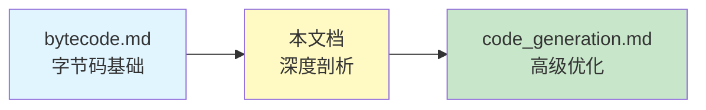
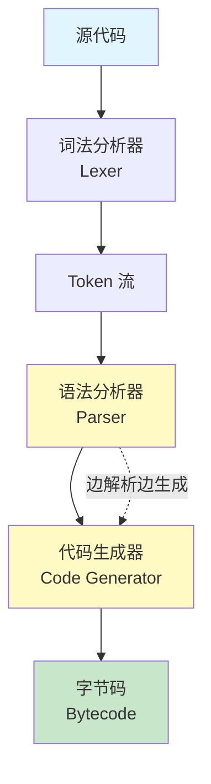
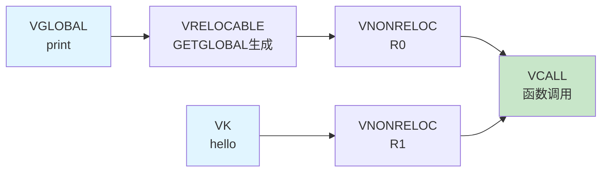

# Lua 字节码生成过程深度剖析

## 📋 文档导航

- [引言](#引言)
- [第一章：准备知识](#第一章准备知识)
- [第二章：核心示例 - print("hello") 完整剖析](#第二章核心示例---printhello-完整剖析)
- [第三章：扩展示例 - 其他函数调用模式](#第三章扩展示例---其他函数调用模式)
- [第四章：其他语句类型概览](#第四章其他语句类型概览)
- [总结与下一步](#总结与下一步)

---

## 🎯 引言

### 文档定位



**前置知识（必须先完成）：** `bytecode.md`
- ✅ 38 条字节码指令的格式和作用
- ✅ Proto、expdesc、FuncState 等核心数据结构
- ✅ iABC、iABx、iAsBx 三种指令格式
- ✅ expdesc 的 14 种类型

**本文档的独特之处：**

与其他文档不同，本文档采用**深度优先**的方式，选择一个简单的函数调用 `print("hello")` 作为主线，从词法分析到最终字节码，逐步剖析每个细节：

- 🔬 **词法分析**：展示 Token 流的生成
- 🌳 **语法分析**：理解 Lua 的单遍编译
- ⚙️ **代码生成**：深入每个 C 函数调用
- 📊 **状态追踪**：记录每一步的数据结构变化

**学习目标：**

完成本文档后，你将能够：

- [ ] 说出 `print("hello")` 生成的 Token 流
- [ ] 理解 Lua 如何在单遍中完成编译
- [ ] 追踪 `singlevar()` → `luaK_codeABx()` → `luaK_code()` 的完整调用链
- [ ] 手动计算每一步的 FuncState 状态（pc, freereg, nactvar）
- [ ] 解释 expdesc 在每个阶段的类型和值
- [ ] 预测任意简单函数调用的字节码输出

### 阅读建议

**⏱️ 预计阅读时间：** 50-70 分钟（深度学习）

**📖 阅读方式：**
- **必须顺序阅读**，第二章是核心，不可跳过
- 准备纸笔，记录每一步的状态变化
- 每个步骤都要问自己"为什么这样设计"
- 使用 `luac -l` 和 `luac -l -l` 验证

**🛠️ 准备工具：**

```bash
# 1. 确认环境
lua -v
luac -v

# 2. 创建测试文件
echo 'print("hello")' > test.lua

# 3. 查看字节码
luac -l test.lua

# 4. 查看详细信息（包括常量表）
luac -l -l test.lua
```

**预期输出：**

```
main <test.lua:0,0> (4 instructions at 0x...)
0+ params, 2 slots, 1 upvalue, 0 locals, 2 constants, 0 functions
	1	[1]	GETGLOBAL	0 -1	; print
	2	[1]	LOADK    	1 -2	; "hello"
	3	[1]	CALL     	0 2 1
	4	[1]	RETURN   	0 1

constants (2) for 0x...:
	1	"print"
	2	"hello"
```

---

## 第一章：准备知识

### 1.1 Lua 的编译流程概览

Lua 采用**单遍编译（Single-Pass Compilation）**，不同于传统的多遍编译器：



**关键特点：**

1. **不构建完整 AST**：Lua 不会先构建完整的抽象语法树，而是边解析边生成字节码
2. **单遍完成**：只需要扫描源代码一次
3. **即时生成**：识别到语法结构后立即生成对应的字节码

**为什么这样设计？**

- ✅ **内存效率**：不需要存储完整的 AST
- ✅ **编译速度**：单遍扫描，速度快
- ✅ **简洁性**：编译器实现更简单
- ❌ **优化受限**：无法进行需要全局信息的优化（留给 JIT）

### 1.2 核心数据结构回顾

在深入分析之前，让我们回顾三个最重要的数据结构：

#### FuncState - 函数编译状态

```c
typedef struct FuncState {
    Proto *f;              // 正在构建的函数原型
    struct FuncState *prev; // 外层函数的状态（用于嵌套函数）
    
    // 代码生成相关
    int pc;                // 下一条指令的位置（Program Counter）
    int lasttarget;        // 最后一个跳转目标
    int jpc;               // 待回填的跳转链表头
    
    // 寄存器管理
    int freereg;           // 第一个空闲寄存器
    int nactvar;           // 活跃局部变量数量
    int nk;                // 常量表中的常量数量
    int np;                // 子函数数量
    
    // 局部变量
    int nlocvars;          // 局部变量总数
    int nups;              // upvalue 数量
    
    // 其他
    BlockCnt *bl;          // 当前代码块
    struct LexState *ls;   // 词法分析器状态
} FuncState;
```

**关键字段说明：**

- `pc`：下一条要生成的指令的索引，每生成一条指令 +1
- `freereg`：第一个可用的寄存器编号，用于分配临时寄存器
- `nactvar`：当前作用域中活跃的局部变量数量

#### expdesc - 表达式描述符

```c
typedef struct expdesc {
    expkind k;             // 表达式类型（14 种）
    union {
        lua_Number nval;   // VKNUM: 数字常量的值
        int info;          // 通用信息字段
        struct {           // VINDEXED: 表索引
            int t;         // 表所在寄存器
            int idx;       // 索引（寄存器或常量）
            int vt;        // 表的类型
        } ind;
    } u;
    int t;                 // true 列表（跳转链表）
    int f;                 // false 列表（跳转链表）
} expdesc;
```

**14 种表达式类型：**

| 类型 | 含义 | 示例 |
|------|------|------|
| VVOID | 无值 | 空表达式 |
| VNIL | nil 常量 | `nil` |
| VTRUE | true 常量 | `true` |
| VFALSE | false 常量 | `false` |
| VKNUM | 数字常量 | `10`, `3.14` |
| VK | 常量表中的常量 | `"hello"` |
| VLOCAL | 局部变量 | `local x` |
| VUPVAL | upvalue | 闭包变量 |
| VGLOBAL | 全局变量 | `print` |
| VINDEXED | 表索引 | `t[k]` |
| VJMP | 跳转表达式 | `a and b` |
| VRELOCABLE | 可重定位 | 刚生成的指令结果 |
| VNONRELOC | 非重定位 | 固定寄存器中的值 |
| VCALL | 函数调用 | `f()` |
| VVARARG | 可变参数 | `...` |

#### Proto - 函数原型

```c
typedef struct Proto {
    // 字节码
    Instruction *code;     // 指令数组
    int sizecode;          // 指令数量

    // 常量表
    TValue *k;             // 常量数组
    int sizek;             // 常量数量

    // 子函数
    struct Proto **p;      // 子函数数组
    int sizep;             // 子函数数量

    // 调试信息
    int *lineinfo;         // 行号信息
    struct LocVar *locvars; // 局部变量信息
    TString **upvalues;    // upvalue 名称

    // 其他
    int numparams;         // 参数数量
    int is_vararg;         // 是否有可变参数
    int maxstacksize;      // 最大栈大小
} Proto;
```

### 1.3 关键函数概览

在分析 `print("hello")` 之前，先了解会用到的关键函数：

#### 指令生成函数

```c
// 生成指令的核心函数
int luaK_code(FuncState *fs, Instruction i, int line);

// 生成 iABC 格式指令
int luaK_codeABC(FuncState *fs, OpCode o, int a, int b, int c);

// 生成 iABx 格式指令
int luaK_codeABx(FuncState *fs, OpCode o, int a, unsigned int bx);

// 生成 iAsBx 格式指令（带符号）
int luaK_codeAsBx(FuncState *fs, OpCode o, int a, int sbx);
```

#### 寄存器管理函数

```c
// 预留 n 个寄存器
void luaK_reserveregs(FuncState *fs, int n);

// 将表达式结果放入下一个寄存器
void luaK_exp2nextreg(FuncState *fs, expdesc *e);

// 将表达式结果放入任意寄存器
int luaK_exp2anyreg(FuncState *fs, expdesc *e);

// 转换为 RK 格式（寄存器或常量）
int luaK_exp2RK(FuncState *fs, expdesc *e);
```

#### 常量管理函数

```c
// 添加字符串常量
int luaK_stringK(FuncState *fs, TString *s);

// 添加数字常量
int luaK_numberK(FuncState *fs, lua_Number r);
```

---

## 第二章：核心示例 - print("hello") 完整剖析

### 2.1 源代码和预期输出

**源代码：**

```lua
print("hello")
```

**预期字节码：**

```
main <test.lua:0,0> (4 instructions)
0+ params, 2 slots, 1 upvalue, 0 locals, 2 constants, 0 functions
	1	[1]	GETGLOBAL	0 -1	; print
	2	[1]	LOADK    	1 -2	; "hello"
	3	[1]	CALL     	0 2 1
	4	[1]	RETURN   	0 1

constants (2):
	1	"print"
	2	"hello"
```

**分析目标：**

我们将深入理解这 3 条指令（GETGLOBAL、LOADK、CALL）是如何一步步生成的。

### 2.2 阶段 1：词法分析（Lexical Analysis）

#### 2.2.1 Token 流生成

词法分析器（Lexer）将源代码分解为 Token 流：

```
源代码: print("hello")
         ↓
Token 流:
┌─────────────┬──────────┬─────────────┐
│ Token 类型  │ 值       │ 位置        │
├─────────────┼──────────┼─────────────┤
│ TK_NAME     │ "print"  │ line 1, col 1 │
│ '('         │ '('      │ line 1, col 6 │
│ TK_STRING   │ "hello"  │ line 1, col 7 │
│ ')'         │ ')'      │ line 1, col 15│
│ TK_EOS      │ (end)    │ line 1, col 16│
└─────────────┴──────────┴─────────────┘
```

**Token 类型说明：**

- `TK_NAME`：标识符（变量名、函数名等）
- `TK_STRING`：字符串字面量
- `'('`, `')'`：单字符 Token
- `TK_EOS`：End Of Stream（文件结束）

#### 2.2.2 词法分析器的工作流程

```c
// llex.c 中的核心函数
static int llex(LexState *ls, SemInfo *seminfo) {
    // 跳过空白字符
    while (currIsSpace(ls)) next(ls);

    // 根据当前字符判断 Token 类型
    switch (ls->current) {
        case '(': case ')': case '{': case '}': // 单字符
            next(ls);
            return ls->current;

        case '"': case '\'':  // 字符串
            read_string(ls, ls->current, seminfo);
            return TK_STRING;

        default:
            if (lislalpha(ls->current)) {  // 标识符
                // 读取标识符
                do {
                    save_and_next(ls);
                } while (lislalnum(ls->current));

                // 检查是否是关键字
                TString *ts = luaX_newstring(ls, ...);
                if (ts->tsv.reserved > 0)  // 是关键字
                    return ts->tsv.reserved - 1 + FIRST_RESERVED;
                else
                    return TK_NAME;
            }
    }
}
```

**对于 `print("hello")`：**

1. 读取 `print` → 识别为 TK_NAME
2. 读取 `(` → 识别为 '('
3. 读取 `"hello"` → 识别为 TK_STRING
4. 读取 `)` → 识别为 ')'

### 2.3 阶段 2：语法分析（Syntax Analysis）

#### 2.3.1 Lua 的单遍编译机制

与传统编译器不同，Lua 不会先构建完整的 AST，而是**边解析边生成字节码**：

**关键点：**

- 不等待整个表达式解析完成
- 识别到语法结构后立即生成字节码
- 使用 expdesc 跟踪表达式的当前状态

#### 2.3.2 语法分析器的调用链

对于 `print("hello")`，语法分析器的函数调用链如下：

```c
chunk()                    // 解析代码块
  └─> statement()          // 解析语句
        └─> exprstat()     // 表达式语句
              └─> expr()   // 解析表达式
                    └─> subexpr()        // 子表达式
                          └─> simpleexp() // 简单表达式
                                └─> primaryexp()  // 主表达式
                                      ├─> singlevar()  // 单个变量
                                      └─> funcargs()   // 函数参数
```

**每个函数的作用：**

| 函数 | 作用 | 对应语法 |
|------|------|----------|
| `chunk()` | 解析代码块 | 整个文件 |
| `statement()` | 解析语句 | 一条语句 |
| `exprstat()` | 解析表达式语句 | `print("hello")` |
| `expr()` | 解析表达式 | `print("hello")` |
| `primaryexp()` | 解析主表达式 | `print` |
| `singlevar()` | 解析单个变量 | `print` |
| `funcargs()` | 解析函数参数 | `("hello")` |

### 2.4 阶段 3：代码生成（Code Generation）

现在进入最核心的部分：逐步生成字节码指令。

#### 2.4.1 初始状态

在开始生成 `print("hello")` 的字节码之前，FuncState 的初始状态：

```c
FuncState fs = {
    .f = Proto {
        .code = [],           // 空指令数组
        .k = [],              // 空常量表
        .sizecode = 0,
        .sizek = 0,
    },
    .pc = 0,                  // 下一条指令位置
    .freereg = 0,             // 第一个空闲寄存器
    .nactvar = 0,             // 活跃局部变量数
    .nk = 0,                  // 常量数
};
```

**寄存器状态：**

```
R(0) = 空闲
R(1) = 空闲
R(2) = 空闲
...
```

#### 2.4.2 步骤 1：解析函数名 `print`

**调用链：**

```c
primaryexp()
  └─> singlevar(ls, &v)  // v 是 expdesc
```

**singlevar() 的实现：**

```c
static void singlevar(LexState *ls, expdesc *var) {
    TString *varname = str_checkname(ls);  // 获取变量名 "print"
    FuncState *fs = ls->fs;

    // 1. 在局部变量中查找
    if (searchvar(fs, varname) >= 0) {
        // 找到局部变量
        init_exp(var, VLOCAL, reg);
    }
    // 2. 在 upvalue 中查找
    else {
        int idx = searchupvalue(fs, varname);
        if (idx >= 0) {
            // 找到 upvalue
            init_exp(var, VUPVAL, idx);
        }
        // 3. 都没找到，认为是全局变量
        else {
            // 创建 VGLOBAL expdesc
            init_exp(var, VGLOBAL, 0);
            var->u.s.info = luaK_stringK(fs, varname);  // 添加到常量表
        }
    }
}
```

**执行过程：**

**步骤 1.1：查找变量**

```c
// 在局部变量中查找 "print"
searchvar(fs, "print")  // 返回 -1（未找到）

// 在 upvalue 中查找 "print"
searchupvalue(fs, "print")  // 返回 -1（未找到）

// 结论：print 是全局变量
```

**步骤 1.2：添加字符串常量到常量表**

```c
// 调用 luaK_stringK() 添加 "print" 到常量表
int luaK_stringK(FuncState *fs, TString *s) {
    TValue o;
    setsvalue(L, &o, s);  // 设置为字符串类型
    return addk(fs, &o, &o);  // 添加到常量表
}

// addk() 的实现
static int addk(FuncState *fs, TValue *k, TValue *v) {
    // 检查常量表中是否已存在
    int idx = luaH_get(fs->h, k);
    if (idx != -1) {
        return idx;  // 已存在，返回索引
    }

    // 不存在，添加新常量
    Proto *f = fs->f;
    int idx = fs->nk;
    f->k[idx] = *v;  // 添加到常量数组
    fs->nk++;        // 常量数 +1
    return idx;
}
```

**状态变化：**

```c
// 执行前
fs.nk = 0
fs.f.k = []

// 执行后
fs.nk = 1
fs.f.k = ["print"]  // K(0) = "print"
```

**步骤 1.3：创建 expdesc**

```c
// 初始化 expdesc
expdesc var;
var.k = VGLOBAL;           // 类型：全局变量
var.u.s.info = 0;          // 常量表索引 K(0)
var.t = NO_JUMP;           // 无跳转
var.f = NO_JUMP;
```

**当前状态总结：**

| 数据结构 | 字段 | 值 | 说明 |
|----------|------|-----|------|
| expdesc | k | VGLOBAL | 全局变量 |
| expdesc | u.s.info | 0 | 常量表索引 K(0) |
| FuncState | nk | 1 | 常量表有 1 个元素 |
| FuncState | pc | 0 | 还未生成指令 |
| FuncState | freereg | 0 | 第一个空闲寄存器 |
| Proto | k[0] | "print" | 常量表 |

**为什么这样设计？**

- ✅ **延迟生成指令**：此时还不知道 `print` 会被如何使用（赋值？调用？），所以先用 expdesc 记录状态
- ✅ **常量去重**：通过 `addk()` 确保相同的字符串只存储一次
- ✅ **灵活性**：expdesc 可以在后续步骤中转换为不同的指令

#### 2.4.3 步骤 2：识别函数调用并生成 GETGLOBAL 指令

**调用链：**

```c
primaryexp()
  └─> singlevar(ls, &v)      // 已完成，v.k = VGLOBAL
  └─> (识别到 '(' token)
  └─> funcargs(ls, &v, line) // 处理函数调用
```

**funcargs() 的开始部分：**

```c
static void funcargs(LexState *ls, expdesc *f, int line) {
    FuncState *fs = ls->fs;
    expdesc args;
    int base, nparams;

    // 1. 将函数表达式转换为寄存器
    //    此时 f->k = VGLOBAL，需要生成 GETGLOBAL 指令
    switch (ls->t.token) {
        case '(': {  // 普通函数调用
            // 关键步骤：将 VGLOBAL 转换为 VNONRELOC
            luaK_exp2nextreg(fs, f);

            // ... 后续处理参数
        }
    }
}
```

**luaK_exp2nextreg() 的实现：**

```c
void luaK_exp2nextreg(FuncState *fs, expdesc *e) {
    luaK_dischargevars(fs, e);  // 处理变量类型的表达式
    freeexp(fs, e);             // 释放表达式占用的资源
    luaK_reserveregs(fs, 1);    // 预留一个寄存器
    exp2reg(fs, e, fs->freereg - 1);  // 将表达式结果放入寄存器
}
```

**详细执行过程：**

**步骤 2.1：luaK_dischargevars()**

```c
static void luaK_dischargevars(FuncState *fs, expdesc *e) {
    switch (e->k) {
        case VLOCAL: {
            // 局部变量已经在寄存器中，转换为 VNONRELOC
            e->k = VNONRELOC;
            break;
        }
        case VUPVAL: {
            // 生成 GETUPVAL 指令
            e->u.s.info = luaK_codeABC(fs, OP_GETUPVAL, 0, e->u.s.info, 0);
            e->k = VRELOCABLE;
            break;
        }
        case VGLOBAL: {
            // 生成 GETGLOBAL 指令 ← 我们的情况
            e->u.s.info = luaK_codeABx(fs, OP_GETGLOBAL, 0, e->u.s.info);
            e->k = VRELOCABLE;
            break;
        }
        // ... 其他情况
    }
}
```

**步骤 2.2：生成 GETGLOBAL 指令**

```c
// 调用 luaK_codeABx() 生成指令
int luaK_codeABx(FuncState *fs, OpCode o, int a, unsigned int bx) {
    // 检查参数范围
    lua_assert(getOpMode(o) == iABx || getOpMode(o) == iAsBx);
    lua_assert(getCMode(o) == OpArgN);
    lua_assert(a <= MAXARG_A && bx <= MAXARG_Bx);

    // 构造指令
    Instruction i = CREATE_ABx(o, a, bx);

    // 调用 luaK_code() 写入指令
    return luaK_code(fs, i, fs->ls->lastline);
}
```

**CREATE_ABx 宏的实现：**

```c
// lopcodes.h
#define CREATE_ABx(o,a,bx)  ((Instruction)(((bx)<<POS_Bx) | \
                                           ((a)<<POS_A) | \
                                           (o)))

// 对于 GETGLOBAL 0 0：
// o = OP_GETGLOBAL (5)
// a = 0 (目标寄存器)
// bx = 0 (常量表索引 K(0))

// 指令编码：
// 31          15    7     0
// +-----------+-----+-----+
// |     0     |  0  |  5  |
// +-----------+-----+-----+
//     Bx        A    OP
```

**步骤 2.3：luaK_code() 写入指令**

```c
int luaK_code(FuncState *fs, Instruction i, int line) {
    Proto *f = fs->f;

    // 1. 处理跳转链表（此处不涉及）
    dischargejpc(fs);

    // 2. 扩展指令数组（如果需要）
    luaM_growvector(fs->L, f->code, fs->pc, f->sizecode, Instruction,
                    MAX_INT, "code size overflow");

    // 3. 写入指令
    f->code[fs->pc] = i;

    // 4. 记录行号信息（用于调试）
    luaM_growvector(fs->L, f->lineinfo, fs->pc, f->sizelineinfo, int,
                    MAX_INT, "code size overflow");
    f->lineinfo[fs->pc] = line;

    // 5. 返回指令位置，并递增 pc
    return fs->pc++;
}
```

**状态变化：**

```c
// 执行前
fs.pc = 0
fs.f.code = []
fs.f.sizecode = 0

// 执行后
fs.pc = 1                    // pc 递增
fs.f.code = [GETGLOBAL 0 0]  // 指令数组
fs.f.sizecode = 1
fs.f.lineinfo = [1]          // 行号信息
```

**步骤 2.4：exp2reg() 将结果固定到寄存器**

```c
static void exp2reg(FuncState *fs, expdesc *e, int reg) {
    discharge2reg(fs, e, reg);  // 确保表达式结果在指定寄存器

    if (e->k == VJMP) {
        // 处理跳转表达式（此处不涉及）
        luaK_concat(fs, &e->t, e->u.s.info);
    }

    if (hasjumps(e)) {
        // 处理跳转链表（此处不涉及）
        // ...
    }

    // 最终将 expdesc 标记为 VNONRELOC
    e->u.s.info = reg;
    e->k = VNONRELOC;
}
```

**discharge2reg() 的实现：**

```c
static void discharge2reg(FuncState *fs, expdesc *e, int reg) {
    luaK_dischargevars(fs, e);  // 已经执行过，e->k = VRELOCABLE

    switch (e->k) {
        case VRELOCABLE: {
            // 修改刚生成的指令的 A 字段
            Instruction *pc = &getcode(fs, e);
            SETARG_A(*pc, reg);  // 设置目标寄存器
            break;
        }
        // ... 其他情况
    }

    e->u.s.info = reg;
    e->k = VNONRELOC;
}
```

**SETARG_A 宏的实现：**

```c
// lopcodes.h
#define SETARG_A(i,u)  ((i) = (((i) & MASK_NOT_A) | \
                                ((Instruction)(u) << POS_A)))

// 修改指令的 A 字段：
// 原指令：GETGLOBAL 0 0
// 修改后：GETGLOBAL 0 0  (目标寄存器 R(0))
```

**步骤 2.5：luaK_reserveregs() 预留寄存器**

```c
void luaK_reserveregs(FuncState *fs, int n) {
    luaK_checkstack(fs, n);  // 检查栈空间
    fs->freereg += n;        // 递增空闲寄存器指针
}

// 执行后
fs.freereg = 1  // R(0) 已被占用，下一个空闲寄存器是 R(1)
```

**当前状态总结：**

| 数据结构 | 字段 | 值 | 说明 |
|----------|------|-----|------|
| expdesc | k | VNONRELOC | 已固定在寄存器中 |
| expdesc | u.s.info | 0 | 寄存器编号 R(0) |
| FuncState | pc | 1 | 已生成 1 条指令 |
| FuncState | freereg | 1 | 下一个空闲寄存器 R(1) |
| FuncState | nk | 1 | 常量表有 1 个元素 |
| Proto | code[0] | GETGLOBAL 0 0 | 第一条指令 |
| Proto | k[0] | "print" | 常量表 |

**生成的字节码：**

```
1  [1]  GETGLOBAL  0 -1  ; R(0) = _G["print"]
```

**为什么这样设计？**

- ✅ **两步生成**：先生成指令，再修改 A 字段，避免重复代码
- ✅ **VRELOCABLE → VNONRELOC**：表示指令结果从"可重定位"变为"固定在寄存器"
- ✅ **寄存器分配**：通过 freereg 跟踪下一个可用寄存器

#### 2.4.4 步骤 3：解析参数 `"hello"`

**继续 funcargs() 的执行：**

```c
static void funcargs(LexState *ls, expdesc *f, int line) {
    FuncState *fs = ls->fs;
    expdesc args;
    int base, nparams;

    // f 现在是 VNONRELOC，在 R(0)

    switch (ls->t.token) {
        case '(': {
            // 1. 跳过 '('
            luaX_next(ls);

            // 2. 记录函数所在的寄存器
            base = f->u.s.info;  // base = 0

            // 3. 解析参数列表
            if (ls->t.token == ')') {
                // 无参数
                args.k = VVOID;
            } else {
                // 有参数，解析表达式列表
                explist1(ls, &args);
            }

            // 4. 跳过 ')'
            check_match(ls, ')', '(', line);

            // 5. 生成 CALL 指令
            // ...
        }
    }
}
```

**explist1() 解析参数列表：**

```c
static int explist1(LexState *ls, expdesc *v) {
    int n = 1;  // 参数计数

    // 解析第一个表达式
    expr(ls, v);

    // 如果有逗号，继续解析
    while (testnext(ls, ',')) {
        luaK_exp2nextreg(ls->fs, v);  // 将前一个参数放入寄存器
        expr(ls, v);                   // 解析下一个参数
        n++;
    }

    return n;
}
```

**对于 `"hello"`，调用 expr()：**

```c
static void expr(LexState *ls, expdesc *v) {
    subexpr(ls, v, 0);
}

static void subexpr(LexState *ls, expdesc *v, int limit) {
    // 解析简单表达式
    switch (ls->t.token) {
        case TK_STRING: {
            // 字符串字面量
            codestring(ls, v, ls->t.seminfo.ts);
            luaX_next(ls);
            break;
        }
        // ... 其他情况
    }
}
```

**codestring() 处理字符串常量：**

```c
static void codestring(LexState *ls, expdesc *e, TString *s) {
    // 1. 将字符串添加到常量表
    init_exp(e, VK, luaK_stringK(ls->fs, s));
}

// luaK_stringK() 的执行
int luaK_stringK(FuncState *fs, TString *s) {
    TValue o;
    setsvalue(L, &o, s);  // 设置为字符串 "hello"
    return addk(fs, &o, &o);
}
```

**状态变化：**

```c
// 执行前
fs.nk = 1
fs.f.k = ["print"]

// 执行后
fs.nk = 2
fs.f.k = ["print", "hello"]  // K(1) = "hello"
```

**创建 expdesc：**

```c
expdesc args;
args.k = VK;           // 类型：常量表中的常量
args.u.s.info = 1;     // 常量表索引 K(1)
```

**将参数放入寄存器：**

在 funcargs() 中，参数需要放入连续的寄存器：

```c
// 在 funcargs() 中
if (args.k != VVOID) {
    luaK_exp2nextreg(fs, &args);  // 将参数放入 R(1)
}
```

**luaK_exp2nextreg() 对 VK 类型的处理：**

```c
void luaK_exp2nextreg(FuncState *fs, expdesc *e) {
    luaK_dischargevars(fs, e);  // VK 类型不需要处理
    freeexp(fs, e);
    luaK_reserveregs(fs, 1);    // 预留 R(1)
    exp2reg(fs, e, fs->freereg - 1);  // 将 VK 转换为 LOADK 指令
}
```

**exp2reg() 对 VK 类型的处理：**

```c
static void exp2reg(FuncState *fs, expdesc *e, int reg) {
    discharge2reg(fs, e, reg);
    // ...
}

static void discharge2reg(FuncState *fs, expdesc *e, int reg) {
    switch (e->k) {
        case VK: {
            // 生成 LOADK 指令
            luaK_codeABx(fs, OP_LOADK, reg, e->u.s.info);
            break;
        }
        // ... 其他情况
    }
    e->u.s.info = reg;
    e->k = VNONRELOC;
}
```

**生成 LOADK 指令：**

```c
// luaK_codeABx(fs, OP_LOADK, 1, 1)
// 生成指令：LOADK 1 1
// 含义：R(1) = K(1) = "hello"

// 调用 luaK_code() 写入指令
fs.f.code[1] = CREATE_ABx(OP_LOADK, 1, 1);
fs.pc = 2;  // pc 递增
```

**状态变化：**

```c
// 执行前
fs.pc = 1
fs.freereg = 1
fs.f.code = [GETGLOBAL 0 0]

// 执行后
fs.pc = 2
fs.freereg = 2
fs.f.code = [GETGLOBAL 0 0, LOADK 1 1]
```

**当前状态总结：**

| 数据结构 | 字段 | 值 | 说明 |
|----------|------|-----|------|
| expdesc (args) | k | VNONRELOC | 参数已在寄存器中 |
| expdesc (args) | u.s.info | 1 | 寄存器编号 R(1) |
| FuncState | pc | 2 | 已生成 2 条指令 |
| FuncState | freereg | 2 | 下一个空闲寄存器 R(2) |
| FuncState | nk | 2 | 常量表有 2 个元素 |
| Proto | code[0] | GETGLOBAL 0 0 | 第一条指令 |
| Proto | code[1] | LOADK 1 1 | 第二条指令 |
| Proto | k[0] | "print" | 常量表 |
| Proto | k[1] | "hello" | 常量表 |

**生成的字节码：**

```
1  [1]  GETGLOBAL  0 -1  ; R(0) = _G["print"]
2  [1]  LOADK      1 -2  ; R(1) = "hello"
```

#### 2.4.5 步骤 4：生成 CALL 指令

**继续 funcargs() 的执行：**

```c
static void funcargs(LexState *ls, expdesc *f, int line) {
    // ... 前面已完成参数解析

    // 现在生成 CALL 指令
    int base = f->u.s.info;  // base = 0（函数所在寄存器）
    int nparams;

    if (args.k == VVOID) {
        nparams = 0;  // 无参数
    } else {
        // 有参数
        if (hasmultret(args.k)) {
            // 多返回值（如 f(g())）
            nparams = LUA_MULTRET;
        } else {
            // 固定数量参数
            luaK_exp2nextreg(fs, &args);  // 已执行
            nparams = fs->freereg - (base + 1);  // 计算参数数量
        }
    }

    // 初始化函数调用表达式
    init_exp(f, VCALL, luaK_codeABC(fs, OP_CALL, base, nparams+1, 2));

    // 调整栈顶
    luaK_fixline(fs, line);
    fs->freereg = base + 1;  // 释放参数占用的寄存器
}
```

**计算 CALL 指令的参数：**

```c
// base = 0（函数在 R(0)）
// nparams = fs->freereg - (base + 1)
//         = 2 - (0 + 1)
//         = 1（1 个参数）

// CALL 指令格式：CALL A B C
// A = base = 0（函数所在寄存器）
// B = nparams + 1 = 1 + 1 = 2（参数数量 +1）
// C = 2（返回值数量 +1，这里是 0 个返回值 +1）
```

**为什么 B 和 C 要 +1？**

这是 Lua 的设计约定：

- **B = 0** 表示参数数量不确定（可变参数）
- **B > 0** 表示固定参数数量，实际数量 = B - 1
- **C = 0** 表示返回值数量不确定
- **C > 0** 表示固定返回值数量，实际数量 = C - 1

对于 `print("hello")`：
- 1 个参数 → B = 2
- 0 个返回值（表达式语句） → C = 1

**生成 CALL 指令：**

```c
// luaK_codeABC(fs, OP_CALL, 0, 2, 1)
int luaK_codeABC(FuncState *fs, OpCode o, int a, int b, int c) {
    lua_assert(getOpMode(o) == iABC);
    lua_assert(getBMode(o) != OpArgN || b == 0);
    lua_assert(getCMode(o) != OpArgN || c == 0);
    lua_assert(a <= MAXARG_A && b <= MAXARG_B && c <= MAXARG_C);

    // 构造指令
    Instruction i = CREATE_ABC(o, a, b, c);

    // 写入指令
    return luaK_code(fs, i, fs->ls->lastline);
}
```

**CREATE_ABC 宏的实现：**

```c
// lopcodes.h
#define CREATE_ABC(o,a,b,c)  ((Instruction)(((c)<<POS_C) | \
                                            ((b)<<POS_B) | \
                                            ((a)<<POS_A) | \
                                            (o)))

// 对于 CALL 0 2 1：
// o = OP_CALL (28)
// a = 0
// b = 2
// c = 1

// 指令编码：
// 31    23    15    7     0
// +-----+-----+-----+-----+
// |  1  |  2  |  0  | 28  |
// +-----+-----+-----+-----+
//   C     B     A    OP
```

**写入指令：**

```c
fs.f.code[2] = CREATE_ABC(OP_CALL, 0, 2, 1);
fs.pc = 3;  // pc 递增
```

**调整寄存器状态：**

```c
// CALL 指令执行后，R(0) 会被覆盖为返回值
// 但这是表达式语句，不需要返回值
// 所以释放所有临时寄存器

fs->freereg = base + 1;  // = 0 + 1 = 1
```

**最终状态：**

| 数据结构 | 字段 | 值 | 说明 |
|----------|------|-----|------|
| FuncState | pc | 3 | 已生成 3 条指令 |
| FuncState | freereg | 1 | R(0) 被释放 |
| Proto | code[0] | GETGLOBAL 0 0 | 获取 print |
| Proto | code[1] | LOADK 1 1 | 加载 "hello" |
| Proto | code[2] | CALL 0 2 1 | 调用 print("hello") |

**生成的字节码：**

```
1  [1]  GETGLOBAL  0 -1  ; R(0) = _G["print"]
2  [1]  LOADK      1 -2  ; R(1) = "hello"
3  [1]  CALL       0 2 1  ; R(0)(R(1)); 1 param, 0 returns
```

### 2.5 完整流程总结

#### 2.5.1 状态变化时间线

让我们回顾整个过程中 FuncState 的状态变化：

| 时间点 | 操作 | pc | freereg | nk | code | k |
|--------|------|----|---------|----|------|---|
| 初始 | - | 0 | 0 | 0 | [] | [] |
| 步骤 1 | 添加 "print" 到常量表 | 0 | 0 | 1 | [] | ["print"] |
| 步骤 2 | 生成 GETGLOBAL | 1 | 1 | 1 | [GETGLOBAL 0 0] | ["print"] |
| 步骤 3 | 添加 "hello" 到常量表 | 1 | 1 | 2 | [GETGLOBAL 0 0] | ["print", "hello"] |
| 步骤 3 | 生成 LOADK | 2 | 2 | 2 | [GETGLOBAL 0 0, LOADK 1 1] | ["print", "hello"] |
| 步骤 4 | 生成 CALL | 3 | 1 | 2 | [GETGLOBAL 0 0, LOADK 1 1, CALL 0 2 1] | ["print", "hello"] |

#### 2.5.2 expdesc 类型转换流程



#### 2.5.3 C 函数调用链完整图

```
chunk()
  └─> statement()
        └─> exprstat()
              └─> primaryexp()
                    ├─> singlevar()
                    │     ├─> searchvar()          // 查找局部变量
                    │     ├─> searchupvalue()      // 查找 upvalue
                    │     └─> luaK_stringK()       // 添加 "print" 到常量表
                    │           └─> addk()
                    │
                    └─> funcargs()
                          ├─> luaK_exp2nextreg()   // 处理函数名
                          │     ├─> luaK_dischargevars()
                          │     │     └─> luaK_codeABx()  // 生成 GETGLOBAL
                          │     │           └─> luaK_code()
                          │     ├─> luaK_reserveregs()
                          │     └─> exp2reg()
                          │           └─> discharge2reg()
                          │
                          ├─> explist1()           // 解析参数
                          │     └─> expr()
                          │           └─> codestring()
                          │                 └─> luaK_stringK()  // 添加 "hello"
                          │
                          ├─> luaK_exp2nextreg()   // 处理参数
                          │     └─> discharge2reg()
                          │           └─> luaK_codeABx()  // 生成 LOADK
                          │                 └─> luaK_code()
                          │
                          └─> luaK_codeABC()       // 生成 CALL
                                └─> luaK_code()
```

#### 2.5.4 关键设计决策解释

**Q1: 为什么不直接生成指令，而要用 expdesc？**

A: expdesc 提供了**延迟求值**的能力：

```lua
-- 示例 1：赋值
local x = print  -- print 是 VGLOBAL，生成 GETGLOBAL

-- 示例 2：调用
print("hello")   -- print 是 VGLOBAL，也生成 GETGLOBAL

-- 示例 3：表索引
t.print = 1      -- print 是字符串，不生成 GETGLOBAL
```

同样是 `print`，根据上下文生成不同的代码。expdesc 允许编译器延迟决定。

**Q2: 为什么 CALL 的 B 和 C 参数要 +1？**

A: 这样可以用 0 表示"不确定数量"：

```lua
-- B = 0：参数数量不确定
f(g())  -- g() 可能返回多个值

-- C = 0：返回值数量不确定
local a, b, c = f()  -- f() 可能返回多个值
```

**Q3: 为什么要分 VRELOCABLE 和 VNONRELOC？**

A: VRELOCABLE 表示刚生成的指令，还可以修改：

```c
// 生成 GETGLOBAL 0 0
e->k = VRELOCABLE;
e->u.s.info = pc;  // 指令位置

// 后续可以修改 A 字段
SETARG_A(code[e->u.s.info], new_reg);
```

VNONRELOC 表示已固定，不能再修改。

**Q4: 为什么要用 freereg 而不是每次计算？**

A: 性能优化，避免重复扫描：

```c
// 如果每次都扫描
int find_free_reg() {
    for (int i = 0; i < MAXREGS; i++) {
        if (!is_used(i)) return i;
    }
}

// 使用 freereg
int alloc_reg() {
    return fs->freereg++;  // O(1)
}
```

---

## 第三章：扩展示例 - 其他函数调用模式

### 3.1 带返回值的调用：local x = math.abs(-10)

**源代码：**

```lua
local x = math.abs(-10)
```

**预期字节码：**

```
1  [1]  GETGLOBAL  0 -1   ; math
2  [1]  GETTABLE   0 0 -2 ; math["abs"]
3  [1]  LOADK      1 -3   ; -10
4  [1]  CALL       0 2 2  ; 1 param, 1 return
5  [1]  RETURN     0 1
```

**与 print("hello") 的差异：**

| 方面 | print("hello") | math.abs(-10) |
|------|----------------|---------------|
| 函数获取 | GETGLOBAL（全局变量） | GETGLOBAL + GETTABLE（表字段） |
| 返回值 | C = 1（0 个返回值） | C = 2（1 个返回值） |
| 结果使用 | 丢弃 | 赋值给局部变量 |

**详细分析：**

**步骤 1：解析 `math`**

```c
// singlevar() 查找 "math"
// 未找到局部变量和 upvalue，认为是全局变量
expdesc v;
v.k = VGLOBAL;
v.u.s.info = 0;  // K(0) = "math"

// 生成 GETGLOBAL 0 0
luaK_codeABx(fs, OP_GETGLOBAL, 0, 0);
v.k = VNONRELOC;
v.u.s.info = 0;  // R(0) = math
```

**步骤 2：解析 `.abs`**

```c
// 识别到 '.' token
// 调用 fieldsel()
static void fieldsel(LexState *ls, expdesc *v) {
    // v 现在是 VNONRELOC，在 R(0)
    luaK_exp2anyreg(fs, v);  // 确保在寄存器中

    // 读取字段名 "abs"
    luaX_next(ls);  // 跳过 '.'
    checkname(ls);  // 读取 "abs"

    // 创建 VINDEXED expdesc
    v->k = VINDEXED;
    v->u.ind.t = v->u.s.info;  // 表在 R(0)
    v->u.ind.idx = luaK_stringK(fs, str);  // K(1) = "abs"
    v->u.ind.vt = VLOCAL;  // 表在寄存器中
}
```

**步骤 3：生成 GETTABLE**

```c
// 在 funcargs() 中，需要将 VINDEXED 转换为寄存器
luaK_exp2nextreg(fs, v);
  └─> discharge2reg(fs, v, reg)
        └─> luaK_codeABC(fs, OP_GETTABLE, reg, v->u.ind.t, v->u.ind.idx)

// 生成：GETTABLE 0 0 -2
// 含义：R(0) = R(0)[K(1)] = math["abs"]
```

**步骤 4：解析参数和生成 CALL**

```c
// 参数 -10
expdesc arg;
arg.k = VKNUM;
arg.u.nval = -10;

// 生成 LOADK 1 -3
luaK_codeABx(fs, OP_LOADK, 1, 2);  // K(2) = -10

// 生成 CALL 0 2 2
// B = 2（1 个参数）
// C = 2（1 个返回值） ← 关键差异
luaK_codeABC(fs, OP_CALL, 0, 2, 2);
```

**为什么 C = 2？**

因为这是赋值语句，需要 1 个返回值：

```c
// 在 assignment() 中
int nvars = 1;  // 1 个变量 x
int nexps = 1;  // 1 个表达式 math.abs(-10)

// 调整 CALL 指令的 C 字段
SETARG_C(code[call_pc], nvars + 1);  // C = 1 + 1 = 2
```

### 3.2 多返回值调用：local a, b = string.find("hello", "ll")

**源代码：**

```lua
local a, b = string.find("hello", "ll")
```

**预期字节码：**

```
1  [1]  GETGLOBAL  0 -1   ; string
2  [1]  GETTABLE   0 0 -2 ; string["find"]
3  [1]  LOADK      1 -3   ; "hello"
4  [1]  LOADK      2 -4   ; "ll"
5  [1]  CALL       0 3 3  ; 2 params, 2 returns
6  [1]  RETURN     0 1
```

**关键差异：**

- **B = 3**：2 个参数（"hello", "ll"）
- **C = 3**：2 个返回值（a, b）

**寄存器分配：**

```
R(0) = string.find
R(1) = "hello"
R(2) = "ll"

执行 CALL 后：
R(0) = 返回值 1 (a)
R(1) = 返回值 2 (b)
```

### 3.3 方法调用：s:upper()

**源代码：**

```lua
local s = "hello"
s:upper()
```

**预期字节码：**

```
1  [1]  LOADK      0 -1   ; s = "hello"
2  [2]  SELF       0 0 -2 ; R(1) = R(0); R(0) = R(0)["upper"]
3  [2]  CALL       0 2 1  ; R(0)(R(1))
```

**SELF 指令的作用：**

```c
// SELF A B C
// R(A+1) = R(B)           // 保存 self
// R(A) = R(B)[RK(C)]      // 获取方法

// 对于 s:upper()：
// R(1) = R(0)             // R(1) = s
// R(0) = R(0)["upper"]    // R(0) = s.upper
```

**为什么需要 SELF 指令？**

方法调用 `s:upper()` 等价于 `s.upper(s)`，需要：
1. 获取方法函数
2. 将对象作为第一个参数

SELF 指令一次完成这两个操作，比分开的 GETTABLE + MOVE 更高效。

---

## 第四章：其他语句类型概览

由于篇幅限制，这里简要介绍其他语句类型的生成过程。

### 4.1 赋值语句

```lua
local x = 10
x = 20
```

**字节码：**

```
1  LOADK  0 -1  ; x = 10
2  LOADK  0 -2  ; x = 20
```

**关键点：**
- 局部变量直接使用寄存器
- 重新赋值只需要新的 LOADK

### 4.2 条件语句

```lua
if x > 5 then
    print("big")
end
```

**字节码：**

```
1  LT       1 -1 0   ; if not (5 < x) then skip
2  JMP      0 3      ; 跳过 then 分支
3  GETGLOBAL 1 -2    ; print
4  LOADK    2 -3     ; "big"
5  CALL     1 2 1
```

**关键点：**
- 使用跳转指令实现控制流
- 跳转目标需要回填

### 4.3 循环语句

```lua
for i = 1, 10 do
    print(i)
end
```

**字节码：**

```
1  LOADK     0 -1    ; 初始值 1
2  LOADK     1 -2    ; 限制值 10
3  LOADK     2 -3    ; 步长 1
4  FORPREP   0 3     ; 准备循环
5  GETGLOBAL 4 -4    ; print
6  MOVE      5 3     ; i
7  CALL      4 2 1
8  FORLOOP   0 -4    ; 循环控制
```

**关键点：**
- FORPREP 和 FORLOOP 配对使用
- 循环变量在专用寄存器中

---

## 总结与下一步

### 🎓 本文档学到了什么？

通过深度剖析 `print("hello")`，你应该已经掌握：

**✅ 词法分析：**
- Token 流的生成过程
- 词法分析器如何识别标识符、字符串、符号

**✅ 语法分析：**
- Lua 的单遍编译机制
- 语法分析器的函数调用链
- 边解析边生成的工作方式

**✅ 代码生成：**
- expdesc 的类型转换流程（VGLOBAL → VRELOCABLE → VNONRELOC）
- 每个 C 函数的作用和调用时机
- FuncState 状态的详细变化
- 寄存器分配和释放机制
- 常量表的构建和去重

**✅ 指令生成：**
- GETGLOBAL、LOADK、CALL 指令的生成过程
- 指令参数的计算方法
- 为什么 CALL 的 B 和 C 要 +1

### 📝 学习检查清单

在进入下一篇文档之前，确认你能够：

- [ ] 画出 `print("hello")` 的 Token 流
- [ ] 说出 singlevar() → luaK_codeABx() → luaK_code() 的调用链
- [ ] 手动计算每一步的 FuncState 状态（pc, freereg, nk）
- [ ] 解释 expdesc 从 VGLOBAL 到 VNONRELOC 的转换
- [ ] 说出 CALL 0 2 1 中每个参数的含义
- [ ] 对比 print("hello") 和 math.abs(-10) 的差异
- [ ] 理解 SELF 指令的作用

### 🚀 下一步学习：code_generation.md

准备好了吗？在下一篇文档中，你将深入学习：

**🔧 高级代码生成技术：**
- 常量折叠优化
- 短路求值的实现
- 复杂表达式的优化策略

**📊 寄存器分配算法：**
- 寄存器生命周期分析
- 寄存器复用策略
- 栈槽优化技术

**🔗 跳转链表的高级处理：**
- 多重跳转链表的管理
- 复杂控制流的处理
- break/continue 的实现

**⚡ 性能优化：**
- 指令合并优化
- 死代码消除
- 窥孔优化技术

### 💡 实践建议

1. **修改示例**：尝试修改 `print("hello")` 为其他函数调用，观察字节码变化
2. **对比分析**：使用 `luac -l` 对比不同写法的字节码
3. **阅读源码**：查看 lparser.c 和 lcode.c 的实际实现
4. **调试跟踪**：使用 GDB 跟踪编译过程

### 📚 参考资源

- [Lua 5.1 Reference Manual](https://www.lua.org/manual/5.1/)
- [The Implementation of Lua 5.0](https://www.lua.org/doc/jucs05.pdf)
- `lparser.c` - 语法分析器实现
- `lcode.c` - 代码生成器实现
- `llex.c` - 词法分析器实现

---

**文档版本：** v2.0（深度剖析版）
**最后更新：** 2026-02-12
**作者：** Lua 字节码系列文档
**许可：** MIT License

**继续加油！** 🚀


