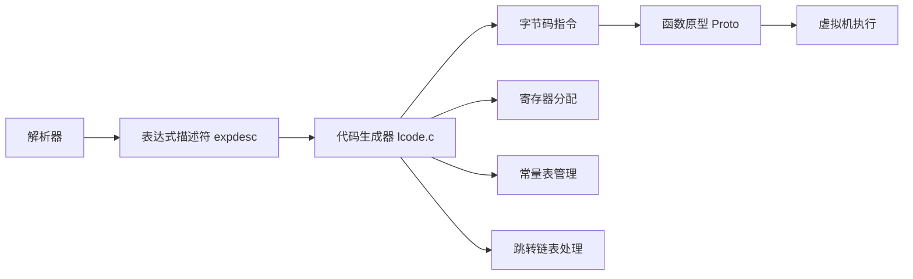

# ⚙️ 代码生成与优化详解

> **技术深度**：⭐⭐⭐⭐  
> **预计阅读时间**：25分钟  
> **前置知识**：[递归下降解析](recursive_descent.md)、[表达式解析](expression_parsing.md)、[语句解析](statement_parsing.md)

---

## 📋 目录

- [概述](#概述)
- [指令生成机制](#指令生成机制)
- [跳转和控制流](#跳转和控制流)
- [常量管理与优化](#常量管理与优化)
- [寄存器分配与管理](#寄存器分配与管理)
- [编译期优化技术](#编译期优化技术)
- [完整代码生成示例](#完整代码生成示例)
- [调试与分析工具](#调试与分析工具)

---

## 🎯 概述

代码生成是编译器的最后阶段，负责将抽象语法树（AST）转换为 Lua 虚拟机可执行的字节码。Lua 的代码生成器设计精巧，在保持简洁的同时实现了多种优化。

### 代码生成流程



### Lua 字节码特点

**基于寄存器的虚拟机**：

| 特性 | 基于栈（Python, Java） | 基于寄存器（Lua） |
|------|---------------------|-----------------|
| **指令数量** | 更多（需要频繁 push/pop） | 更少 |
| **指令长度** | 短（1-2 字节） | 长（4 字节） |
| **性能** | 较慢（内存访问多） | 较快（寄存器访问） |
| **代码大小** | 较大 | 较小 |

**示例对比**：

```lua
local c = a + b
```

**基于栈**（Python 风格）：
```
LOAD_FAST    0  (a)
LOAD_FAST    1  (b)
BINARY_ADD
STORE_FAST   2  (c)
```

**基于寄存器**（Lua）：
```
ADD R2 R0 R1    ; c = a + b
```

### Lua 指令格式

Lua 5.1 使用 **32 位固定长度指令**：

```c
// 来自 lopcodes.h
typedef unsigned long Instruction;

// 指令格式（位字段）：
// iABC:  [  6 bits OP ][ 8 bits A ][ 9 bits C ][ 9 bits B ]
// iABx:  [  6 bits OP ][ 8 bits A ][    18 bits Bx        ]
// iAsBx: [  6 bits OP ][ 8 bits A ][    18 bits sBx       ]
```

**格式详解**：

```
31                                                         0
┌──────┬────────┬─────────────────┬────────────────────────┐
│  OP  │   A    │       C         │          B             │  iABC
│ 6bit │ 8bit   │     9bit        │        9bit            │
└──────┴────────┴─────────────────┴────────────────────────┘

┌──────┬────────┬──────────────────────────────────────────┐
│  OP  │   A    │              Bx                          │  iABx
│ 6bit │ 8bit   │            18bit                         │
└──────┴────────┴──────────────────────────────────────────┘

┌──────┬────────┬──────────────────────────────────────────┐
│  OP  │   A    │              sBx (signed)                │  iAsBx
│ 6bit │ 8bit   │            18bit                         │
└──────┴────────┴──────────────────────────────────────────┘
```

**参数范围**：

| 字段 | 位数 | 范围 |
|------|------|------|
| OP | 6 | 0-63（最多 64 条指令） |
| A | 8 | 0-255 |
| B | 9 | 0-511 |
| C | 9 | 0-511 |
| Bx | 18 | 0-262143 |
| sBx | 18 | -131071 到 131072 |

### 指令操作码分类

```c
// 来自 lopcodes.h
typedef enum {
    // 移动和加载
    OP_MOVE,        // R(A) := R(B)
    OP_LOADK,       // R(A) := Kst(Bx)
    OP_LOADBOOL,    // R(A) := (Bool)B; if (C) pc++
    OP_LOADNIL,     // R(A) := ... := R(B) := nil
    
    // 算术运算
    OP_ADD,         // R(A) := RK(B) + RK(C)
    OP_SUB,         // R(A) := RK(B) - RK(C)
    OP_MUL,         // R(A) := RK(B) * RK(C)
    OP_DIV,         // R(A) := RK(B) / RK(C)
    OP_MOD,         // R(A) := RK(B) % RK(C)
    OP_POW,         // R(A) := RK(B) ^ RK(C)
    OP_UNM,         // R(A) := -R(B)
    
    // 关系运算
    OP_EQ,          // if ((RK(B) == RK(C)) ~= A) then pc++
    OP_LT,          // if ((RK(B) <  RK(C)) ~= A) then pc++
    OP_LE,          // if ((RK(B) <= RK(C)) ~= A) then pc++
    
    // 逻辑运算
    OP_NOT,         // R(A) := not R(B)
    OP_LEN,         // R(A) := length of R(B)
    
    // 连接
    OP_CONCAT,      // R(A) := R(B).. ... ..R(C)
    
    // 跳转
    OP_JMP,         // pc+=sBx
    
    // 测试和跳转
    OP_TEST,        // if not (R(A) <=> C) then pc++
    OP_TESTSET,     // if (R(B) <=> C) then R(A) := R(B) else pc++
    
    // 表操作
    OP_NEWTABLE,    // R(A) := {} (size = B,C)
    OP_SELF,        // R(A+1) := R(B); R(A) := R(B)[RK(C)]
    OP_GETTABLE,    // R(A) := R(B)[RK(C)]
    OP_SETTABLE,    // R(A)[RK(B)] := RK(C)
    OP_SETLIST,     // R(A)[(C-1)*FPF+i] := R(A+i), 1 <= i <= B
    
    // 全局变量
    OP_GETGLOBAL,   // R(A) := Gbl[Kst(Bx)]
    OP_SETGLOBAL,   // Gbl[Kst(Bx)] := R(A)
    
    // Upvalue
    OP_GETUPVAL,    // R(A) := UpValue[B]
    OP_SETUPVAL,    // UpValue[B] := R(A)
    
    // 函数调用
    OP_CALL,        // R(A), ... ,R(A+C-2) := R(A)(R(A+1), ... ,R(A+B-1))
    OP_TAILCALL,    // return R(A)(R(A+1), ... ,R(A+B-1))
    OP_RETURN,      // return R(A), ... ,R(A+B-2)
    
    // 循环
    OP_FORLOOP,     // R(A)+=R(A+2); if R(A) <?= R(A+1) then { pc+=sBx; R(A+3)=R(A) }
    OP_FORPREP,     // R(A)-=R(A+2); pc+=sBx
    OP_TFORLOOP,    // R(A+3), ... ,R(A+2+C) := R(A)(R(A+1), R(A+2)); if R(A+3) ~= nil then R(A+2)=R(A+3) else pc++
    
    // 闭包和 upvalue
    OP_CLOSURE,     // R(A) := closure(KPROTO[Bx], R(A), ... ,R(A+n))
    OP_CLOSE,       // close all variables in the stack up to (>=) R(A)
    
    // 可变参数
    OP_VARARG       // R(A), R(A+1), ..., R(A+B-1) = vararg
} OpCode;
```

**指令统计**（Lua 5.1）：
- 总指令数：38 条
- iABC 格式：31 条
- iABx 格式：5 条
- iAsBx 格式：2 条

### RK 操作数编码

Lua 使用巧妙的 **RK 编码**统一寄存器和常量：

```c
// 来自 lopcodes.h
#define BITRK       (1 << (SIZE_B - 1))  // 256
#define ISK(x)      ((x) & BITRK)         // 是否为常量
#define INDEXK(r)   ((int)(r) & ~BITRK)   // 常量索引
#define MAXINDEXRK  (BITRK - 1)           // 255
#define RKASK(x)    ((x) | BITRK)         // 标记为常量
```

**编码规则**：
- 0-255：寄存器 R(0) 到 R(255)
- 256-511：常量 K(0) 到 K(255)

**示例**：

```lua
local a = 1
local b = a + 2
```

```
LOADK R0 K0      ; a = 1, R0 是寄存器
ADD R1 R0 K1     ; b = a + 2
                 ; B = 0 (寄存器 R0)
                 ; C = 257 (常量 K1, 256 | 1)
```

### 代码生成核心函数

```c
// 来自 lcode.c

// 生成 ABC 格式指令
int luaK_codeABC(FuncState *fs, OpCode o, int a, int b, int c);

// 生成 ABx 格式指令
int luaK_codeABx(FuncState *fs, OpCode o, int a, unsigned int bc);

// 生成 AsBx 格式指令
int luaK_codeAsBx(FuncState *fs, OpCode o, int a, int bc);

// 表达式处理
void luaK_exp2nextreg(FuncState *fs, expdesc *e);
void luaK_exp2anyreg(FuncState *fs, expdesc *e);
void luaK_exp2val(FuncState *fs, expdesc *e);
int luaK_exp2RK(FuncState *fs, expdesc *e);

// 跳转管理
int luaK_jump(FuncState *fs);
void luaK_patchlist(FuncState *fs, int list, int target);
void luaK_patchtohere(FuncState *fs, int list);
void luaK_concat(FuncState *fs, int *l1, int l2);

// 常量管理
int luaK_stringK(FuncState *fs, TString *s);
int luaK_numberK(FuncState *fs, lua_Number r);
```

### 寄存器分配策略

Lua 使用**线性扫描算法**进行寄存器分配：

```c
typedef struct FuncState {
    // ...
    int freereg;      // 第一个空闲寄存器
    lu_byte nactvar;  // 活动局部变量数
    // ...
} FuncState;
```

**分配规则**：
1. 局部变量占用固定寄存器（R0, R1, ...）
2. 临时值使用 `freereg` 之后的寄存器
3. 表达式求值完成后释放临时寄存器

**示例**：

```lua
local a = 1      -- R0（局部变量）
local b = 2      -- R1
local c = a + b  -- R2 = R0 + R1
```

```
nactvar = 0, freereg = 0

local a = 1:
  LOADK R0 K0
  nactvar = 1, freereg = 1

local b = 2:
  LOADK R1 K1
  nactvar = 2, freereg = 2

local c = a + b:
  ADD R2 R0 R1    ; 临时结果在 R2
  nactvar = 3, freereg = 3
```

---

## 🔧 指令生成机制

### 基础指令生成

**luaK_codeABC 函数**：

```c
int luaK_codeABC(FuncState *fs, OpCode o, int a, int b, int c) {
    Instruction i;
    
    lua_assert(getOpMode(o) == iABC);
    lua_assert(getBMode(o) != OpArgN || b == 0);
    lua_assert(getCMode(o) != OpArgN || c == 0);
    
    // 构造指令
    i = CREATE_ABC(o, a, b, c);
    
    // 添加到代码数组
    return luaK_code(fs, i, fs->ls->lastline);
}

// 指令构造宏
#define CREATE_ABC(o,a,b,c) ((cast(Instruction, o)<<POS_OP) \
                           | (cast(Instruction, a)<<POS_A) \
                           | (cast(Instruction, b)<<POS_B) \
                           | (cast(Instruction, c)<<POS_C))
```

**luaK_code 函数**：

```c
static int luaK_code(FuncState *fs, Instruction i, int line) {
    Proto *f = fs->f;
    
    // 处理待修正的跳转
    dischargejpc(fs);
    
    // 扩展代码数组
    luaM_growvector(fs->L, f->code, fs->pc, f->sizecode, Instruction,
                    MAX_INT, "code size overflow");
    
    // 存储指令
    f->code[fs->pc] = i;
    
    // 扩展行号信息
    luaM_growvector(fs->L, f->lineinfo, fs->pc, f->sizelineinfo, int,
                    MAX_INT, "code size overflow");
    f->lineinfo[fs->pc] = line;
    
    return fs->pc++;
}
```

### 算术指令生成

```c
static void codearith(FuncState *fs, OpCode op, expdesc *e1, expdesc *e2) {
    // 尝试常量折叠
    if (constfolding(op, e1, e2))
        return;
    else {
        int o2 = (op != OP_UNM && op != OP_LEN) ? luaK_exp2RK(fs, e2) : 0;
        int o1 = luaK_exp2RK(fs, e1);
        
        if (o1 > o2) {
            freeexp(fs, e1);
            freeexp(fs, e2);
        }
        else {
            freeexp(fs, e2);
            freeexp(fs, e1);
        }
        
        e1->u.s.info = luaK_codeABC(fs, op, 0, o1, o2);
        e1->k = VRELOCABLE;
    }
}
```

**示例：`a + b`**

```lua
local c = a + b
```

```c
// 解析过程：
// 1. expr(ls, &e1)  -> e1 = {k=VLOCAL, info=0}（a 在 R0）
// 2. expr(ls, &e2)  -> e2 = {k=VLOCAL, info=1}（b 在 R1）
// 3. codearith(fs, OP_ADD, &e1, &e2)
//    - luaK_exp2RK(&e1) -> 0（寄存器）
//    - luaK_exp2RK(&e2) -> 1（寄存器）
//    - luaK_codeABC(OP_ADD, 0, 0, 1)
// 4. 生成指令：ADD R0 R0 R1（覆盖 R0）

// 实际应该是：
// ADD R2 R0 R1（结果在新寄存器 R2）
```

**正确实现**：

```c
// luaK_exp2nextreg 确保结果在下一个寄存器
void luaK_exp2nextreg(FuncState *fs, expdesc *e) {
    luaK_dischargevars(fs, e);
    freeexp(fs, e);
    luaK_reserveregs(fs, 1);
    exp2reg(fs, e, fs->freereg - 1);
}
```

### 关系指令生成

关系运算符生成**测试指令 + 跳转**：

```c
static void codecomp(FuncState *fs, OpCode op, int cond, expdesc *e1, expdesc *e2) {
    int o1 = luaK_exp2RK(fs, e1);
    int o2 = luaK_exp2RK(fs, e2);
    
    freeexp(fs, e2);
    freeexp(fs, e1);
    
    if (cond == 0 && op != OP_EQ) {
        // 交换操作数（如 a > b 变为 b < a）
        int temp = o1; o1 = o2; o2 = temp;
        cond = 1;
    }
    
    e1->u.s.info = condjump(fs, op, cond, o1, o2);
    e1->k = VJMP;
}

static int condjump(FuncState *fs, OpCode op, int cond, int a, int b) {
    luaK_codeABC(fs, op, cond, a, b);
    return luaK_jump(fs);
}
```

**示例：`a > b`**

```lua
if a > b then
    print("yes")
end
```

```
GETLOCAL R0 'a'
GETLOCAL R1 'b'
LT 0 R1 R0      ; b < a?（注意：交换了操作数）
JMP [5]         ; 为假则跳转
GETGLOBAL R2 'print'
LOADK R3 K0     ; K0 = "yes"
CALL R2 2 1
```

### 逻辑指令生成

逻辑运算使用**短路求值**：

```c
// OP_TEST: if not (R(A) <=> C) then pc++
// OP_TESTSET: if (R(B) <=> C) then R(A) := R(B) else pc++
```

**示例：`a and b`**

```lua
local c = a and b
```

```
GETLOCAL R0 'a'
TESTSET R2 R0 0   ; if not a then jump
JMP [5]
GETLOCAL R1 'b'
MOVE R2 R1        ; c = b
```

**优化版本**：

```
GETLOCAL R0 'a'
TEST R0 0         ; if not a then jump
JMP [4]
GETLOCAL R1 'b'
MOVE R0 R1
```

### 表操作指令

**NEWTABLE 指令**：

```c
int luaK_codeABx(FuncState *fs, OP_NEWTABLE, int reg, int size) {
    int narray = luaO_int2fb(array_size);
    int nhash = luaO_int2fb(hash_size);
    return luaK_codeABC(fs, OP_NEWTABLE, reg, narray, nhash);
}

// 浮点字节编码（节省空间）
int luaO_int2fb(unsigned int x) {
    int e = 0;
    while (x >= 16) {
        x = (x + 1) >> 1;
        e++;
    }
    if (x < 8) return x;
    else return ((e + 1) << 3) | (cast_int(x) - 8);
}
```

**GETTABLE / SETTABLE**：

```lua
local x = t[k]
t[k] = v
```

```
GETTABLE R1 R0 RK(k)    ; x = t[k]
SETTABLE R0 RK(k) RK(v) ; t[k] = v
```

### 函数调用指令

**CALL 指令格式**：

```
CALL R(A) B C
```

- A：函数所在寄存器
- B：参数数量 + 1（0 表示到栈顶）
- C：返回值数量 + 1（0 表示到栈顶）

**示例**：

```lua
local a, b = f(1, 2, 3)
```

```
GETGLOBAL R0 'f'
LOADK R1 K0       ; 1
LOADK R2 K1       ; 2
LOADK R3 K2       ; 3
CALL R0 4 3       ; f(1,2,3) 返回 2 个值
; R0 = 返回值 1
; R1 = 返回值 2
```

**多返回值**：

```lua
print(f())  -- 所有返回值
```

```
GETGLOBAL R0 'print'
GETGLOBAL R1 'f'
CALL R1 1 0       ; C=0 表示所有返回值
CALL R0 0 1       ; B=0 表示使用前一个调用的所有返回值
```

---

## 🔀 跳转和控制流

### 跳转指令

**OP_JMP 指令**：

```c
// JMP sBx: pc += sBx
int luaK_jump(FuncState *fs) {
    int jpc = fs->jpc;  // 保存旧的待修正链表
    int j;
    
    fs->jpc = NO_JUMP;  // 重置
    j = luaK_codeAsBx(fs, OP_JMP, 0, NO_JUMP);  // 生成占位跳转
    luaK_concat(fs, &j, jpc);  // 合并到链表
    
    return j;
}
```

### 跳转链表管理

Lua 使用**链表**延迟修正跳转目标：

```c
#define NO_JUMP (-1)

// 跳转链表节点：将 sBx 字段用作 next 指针
static int getjump(FuncState *fs, int pc) {
    int offset = GETARG_sBx(fs->f->code[pc]);
    if (offset == NO_JUMP)
        return NO_JUMP;
    else
        return (pc + 1) + offset;  // 绝对地址
}

// 设置跳转目标
static void fixjump(FuncState *fs, int pc, int dest) {
    Instruction *jmp = &fs->f->code[pc];
    int offset = dest - (pc + 1);
    
    lua_assert(dest != NO_JUMP);
    
    if (abs(offset) > MAXARG_sBx)
        luaX_syntaxerror(fs->ls, "control structure too long");
    
    SETARG_sBx(*jmp, offset);
}
```

**链表操作**：

```c
// 合并两个链表
void luaK_concat(FuncState *fs, int *l1, int l2) {
    if (l2 == NO_JUMP) return;
    else if (*l1 == NO_JUMP)
        *l1 = l2;
    else {
        int list = *l1;
        int next;
        
        // 找到链表尾
        while ((next = getjump(fs, list)) != NO_JUMP)
            list = next;
        
        fixjump(fs, list, l2);  // 连接
    }
}

// 修正整个链表到目标
void luaK_patchlist(FuncState *fs, int list, int target) {
    if (target == fs->pc)
        luaK_patchtohere(fs, list);
    else {
        lua_assert(target < fs->pc);
        patchlistaux(fs, list, target, NO_REG, target);
    }
}

// 修正到当前 PC
void luaK_patchtohere(FuncState *fs, int list) {
    luaK_getlabel(fs);
    luaK_concat(fs, &fs->jpc, list);
}
```

### 条件跳转

**TEST 系列指令**：

```c
// TEST R(A) C: if not (R(A) <=> C) then pc++
// TESTSET R(A) R(B) C: if (R(B) <=> C) then R(A) := R(B) else pc++

void luaK_goiftrue(FuncState *fs, expdesc *e) {
    int pc;  // 要跳转的指令位置
    
    luaK_dischargevars(fs, e);
    
    switch (e->k) {
        case VK: case VKNUM: case VTRUE: {
            pc = NO_JUMP;  // 恒真，无需跳转
            break;
        }
        case VFALSE: case VNIL: {
            pc = luaK_jump(fs);  // 恒假，总是跳转
            break;
        }
        case VJMP: {
            invertjump(fs, e);  // 反转跳转条件
            pc = e->u.s.info;
            break;
        }
        default: {
            pc = jumponcond(fs, e, 0);  // 为假时跳转
            break;
        }
    }
    
    luaK_concat(fs, &e->f, pc);  // 加入 false 链表
    luaK_patchtohere(fs, e->t);   // true 链表跳到这里
    e->t = NO_JUMP;
}

static int jumponcond(FuncState *fs, expdesc *e, int cond) {
    if (e->k == VRELOCABLE) {
        Instruction ie = getcode(fs, e);
        if (GET_OPCODE(ie) == OP_NOT) {
            fs->pc--;  // 移除 NOT 指令
            return condjump(fs, OP_TEST, !cond, GETARG_B(ie), 0);
        }
    }
    
    discharge2anyreg(fs, e);
    freeexp(fs, e);
    return condjump(fs, OP_TESTSET, cond, NO_REG, e->u.s.info);
}
```

### 短路求值实现

**AND 运算**：

```lua
local c = a and b
```

```c
// 编译过程：
// 1. 解析 a，生成 e1
// 2. luaK_goiftrue(fs, &e1)
//    - 生成 TEST/TESTSET 指令
//    - e1.f 记录"为假时跳转"的链表
// 3. 解析 b，生成 e2
// 4. luaK_posfix(OP_AND, &e1, &e2)
//    - luaK_concat(&e2->f, e1->f)  // 合并 false 链表
```

**字节码**：

```
GETLOCAL R0 'a'
TESTSET R2 R0 0   ; if not a then skip next
JMP [4]           ; ──┐
GETLOCAL R1 'b'   ;   │
MOVE R2 R1        ;   │
; ← ← ← ← ← ← ← ←─┘（false 跳到这里）
```

**OR 运算**：

```lua
local c = a or b
```

```
GETLOCAL R0 'a'
TESTSET R2 R0 1   ; if a then skip next
JMP [4]           ; ──┐
GETLOCAL R1 'b'   ;   │
MOVE R2 R1        ;   │
; ← ← ← ← ← ← ← ←─┘（true 跳到这里）
```

### 循环控制流

**while 循环**：

```lua
while condition do
    body
end
```

```
; whileinit (label)
[1] <计算 condition>
[2] TEST R0 0
[3] JMP [7]         ; 为假则跳出
[4] <body>
[5] JMP [1]         ; 跳回开始
; whileexit
```

**for 数值循环**：

```lua
for i = 1, 10, 2 do
    body
end
```

```
[1] LOADK R0 K0     ; (for index) = 1
[2] LOADK R1 K1     ; (for limit) = 10
[3] LOADK R2 K2     ; (for step) = 2
[4] FORPREP R0 [8]  ; index -= step, 跳到循环体
; 循环体
[5] <body>          ; 使用 R3 (循环变量)
[6] FORLOOP R0 [5]  ; index += step, 检查是否继续
```

**FORLOOP 逻辑**：

```c
// R(A) += R(A+2)  // index += step
// if R(A) <?= R(A+1) then {  // 检查边界
//     pc += sBx
//     R(A+3) = R(A)  // 更新循环变量
// }
```

---

## 📦 常量管理与优化

### 常量表结构

每个函数原型维护一个常量表：

```c
typedef struct Proto {
    // ...
    TValue *k;        // 常量数组
    int sizek;        // 数组大小
    // ...
} Proto;
```

### 常量添加

**luaK_stringK：字符串常量**

```c
int luaK_stringK(FuncState *fs, TString *s) {
    TValue o;
    setsvalue(fs->L, &o, s);
    return addk(fs, &o, &o);
}
```

**luaK_numberK：数字常量**

```c
int luaK_numberK(FuncState *fs, lua_Number r) {
    TValue o;
    setnvalue(&o, r);
    return addk(fs, &o, &o);
}
```

**addk：通用添加函数**

```c
static int addk(FuncState *fs, TValue *k, TValue *v) {
    lua_State *L = fs->L;
    TValue *idx = luaH_set(L, fs->h, k);  // 查找或插入哈希表
    Proto *f = fs->f;
    int oldsize = f->sizek;
    
    if (ttisnumber(idx)) {
        // 已存在，返回索引（去重）
        lua_assert(luaO_rawequalObj(&fs->f->k[cast_int(nvalue(idx))], v));
        return cast_int(nvalue(idx));
    }
    else {
        // 新常量
        setnvalue(idx, cast_num(fs->nk));
        luaM_growvector(L, f->k, fs->nk, f->sizek, TValue,
                        MAXARG_Bx, "constant table overflow");
        while (oldsize < f->sizek) setnilvalue(&f->k[oldsize++]);
        setobj(L, &f->k[fs->nk], v);
        luaC_barrier(L, f, v);
        return fs->nk++;
    }
}
```

**去重机制**：

```lua
local a = "hello"
local b = "hello"  -- 复用同一个常量
```

```
LOADK R0 K0    ; K0 = "hello"
LOADK R1 K0    ; 复用 K0
```

### 常量折叠

**constfolding 函数**：

```c
static int constfolding(OpCode op, expdesc *e1, expdesc *e2) {
    lua_Number v1, v2, r;
    
    if (!isnumeral(e1) || !isnumeral(e2)) return 0;
    
    v1 = e1->u.nval;
    v2 = e2->u.nval;
    
    switch (op) {
        case OP_ADD: r = luai_numadd(v1, v2); break;
        case OP_SUB: r = luai_numsub(v1, v2); break;
        case OP_MUL: r = luai_nummul(v1, v2); break;
        case OP_DIV:
            if (v2 == 0) return 0;  // 避免除零
            r = luai_numdiv(v1, v2);
            break;
        case OP_MOD:
            if (v2 == 0) return 0;
            r = luai_nummod(v1, v2);
            break;
        case OP_POW: r = luai_numpow(v1, v2); break;
        case OP_UNM: r = luai_numunm(v1); break;
        case OP_LEN: return 0;  // 不能折叠
        default: lua_assert(0); r = 0; break;
    }
    
    if (luai_numisnan(r)) return 0;
    
    e1->u.nval = r;
    return 1;
}
```

**示例**：

```lua
local x = 2 + 3 * 4  -- 编译时计算为 14
```

```
LOADK R0 K0    ; K0 = 14（而非 2, 3, 4）
```

### RK 操作数优化

**luaK_exp2RK 函数**：

```c
int luaK_exp2RK(FuncState *fs, expdesc *e) {
    luaK_exp2val(fs, e);
    
    switch (e->k) {
        case VKNUM:
        case VTRUE:
        case VFALSE:
        case VNIL: {
            // 立即数 -> 常量表
            if (fs->nk <= MAXINDEXRK) {
                e->u.s.info = (e->k == VNIL) ? nilK(fs) :
                              (e->k == VKNUM) ? luaK_numberK(fs, e->u.nval) :
                              boolK(fs, (e->k == VTRUE));
                e->k = VK;
                return RKASK(e->u.s.info);
            }
            else break;
        }
        case VK: {
            if (e->u.s.info <= MAXINDEXRK)
                return RKASK(e->u.s.info);
            else break;
        }
        default: break;
    }
    
    // 无法转换为 RK，使用寄存器
    return luaK_exp2anyreg(fs, e);
}
```

**优化效果**：

```lua
local a = 1
local b = a + 2  -- 2 直接用常量，无需 LOADK
```

```
LOADK R0 K0      ; a = 1
ADD R1 R0 K1     ; b = a + 2, C = RKASK(1) = 257
```

### 特殊常量优化

**nil、true、false**：

```c
static int nilK(FuncState *fs) {
    TValue k, v;
    setnilvalue(&v);
    sethvalue(fs->L, &k, fs->h);
    return addk(fs, &k, &v);
}

static int boolK(FuncState *fs, int b) {
    TValue o;
    setbvalue(&o, b);
    return addk(fs, &o, &o);
}
```

**LOADBOOL 指令优化**：

```lua
local a = true
```

```
LOADBOOL R0 1 0    ; 直接加载，不经过常量表
```

---

## 🎛️ 寄存器分配与管理

### 寄存器分配算法

Lua 使用**线性扫描 + 栈式分配**：

```c
// 预留寄存器
void luaK_reserveregs(FuncState *fs, int n) {
    luaK_checkstack(fs, n);
    fs->freereg += n;
}

// 检查栈空间
void luaK_checkstack(FuncState *fs, int n) {
    int newstack = fs->freereg + n;
    if (newstack > fs->f->maxstacksize) {
        if (newstack >= MAXSTACK)
            luaX_syntaxerror(fs->ls, "function or expression too complex");
        fs->f->maxstacksize = cast_byte(newstack);
    }
}

// 释放寄存器
static void freeexp(FuncState *fs, expdesc *e) {
    if (e->k == VNONRELOC)
        freereg(fs, e->u.s.info);
}

static void freereg(FuncState *fs, int reg) {
    if (!ISK(reg) && reg >= fs->nactvar) {
        fs->freereg--;
        lua_assert(reg == fs->freereg);
    }
}
```

### 寄存器分配策略

**1. 局部变量**：占用固定寄存器

```lua
local a = 1    -- R0
local b = 2    -- R1
```

**2. 临时表达式**：使用临时寄存器

```lua
local c = (a + b) * 2
-- a + b 使用临时寄存器 R2
-- 结果 * 2 使用 R2（复用）
```

**3. 函数调用**：需要连续寄存器

```lua
f(a, b, c)
-- R(n) = f
-- R(n+1) = a
-- R(n+2) = b
-- R(n+3) = c
```

### 寄存器复用示例

```lua
local a = 1
local b = 2
local c = a + b
local d = c * 2
```

**寄存器分配过程**：

```
初始：nactvar=0, freereg=0

local a = 1:
  LOADK R0 K0
  nactvar=1, freereg=1

local b = 2:
  LOADK R1 K1
  nactvar=2, freereg=2

local c = a + b:
  ADD R2 R0 R1    ; 临时结果在 R2
  nactvar=3, freereg=3

local d = c * 2:
  MUL R3 R2 K2    ; 使用 R3（R2 已被 c 占用）
  nactvar=4, freereg=4
```

### 表达式求值的寄存器管理

**exp2reg 函数**：

```c
static void exp2reg(FuncState *fs, expdesc *e, int reg) {
    discharge2reg(fs, e, reg);
    
    if (e->k == VJMP)
        luaK_concat(fs, &e->t, e->u.s.info);  // 合并跳转
    
    if (hasjumps(e)) {
        int final;  // 存储结果的最终位置
        int p_f = NO_JUMP;  // false 路径
        int p_t = NO_JUMP;  // true 路径
        
        if (need_value(fs, e->t) || need_value(fs, e->f)) {
            int fj = (e->k == VJMP) ? NO_JUMP : luaK_jump(fs);
            p_f = code_label(fs, reg, 0, 1);
            p_t = code_label(fs, reg, 1, 0);
            luaK_patchtohere(fs, fj);
        }
        
        final = luaK_getlabel(fs);
        patchlistaux(fs, e->f, final, reg, p_f);
        patchlistaux(fs, e->t, final, reg, p_t);
    }
    
    e->f = e->t = NO_JUMP;
    e->u.s.info = reg;
    e->k = VNONRELOC;
}
```

### 栈空间计算

**maxstacksize 字段**：

```c
typedef struct Proto {
    // ...
    lu_byte maxstacksize;  // 最大栈大小
    // ...
} Proto;
```

**计算示例**：

```lua
function f(a, b)
    local c = a + b
    local d = c * 2
    return d
end
```

```
参数：a (R0), b (R1)           -> 2
局部变量：c (R2), d (R3)       -> +2 = 4
临时值：加法结果可能在 R4      -> +1 = 5
maxstacksize = 5
```

---

## 🚀 编译期优化技术

### 1. 死代码消除

**常量条件分支**：

```lua
if true then
    print("always")
else
    print("never")  -- 不生成
end
```

**实现**：

```c
static int test_then_block(LexState *ls) {
    expdesc v;
    next(ls);
    expr(ls, &v);
    
    checknext(ls, TK_THEN);
    
    if (v.k == VTRUE) {
        // 条件恒真，直接生成 then 块，不生成跳转
        block(ls);
        return NO_JUMP;
    }
    else if (v.k == VFALSE || v.k == VNIL) {
        // 条件恒假，跳过 then 块
        return luaK_jump(fs);
    }
    else {
        // 一般情况
        return luaK_goiffalse(ls->fs, &v);
    }
}
```

### 2. 尾调用优化

**识别尾调用**：

```lua
function fact(n, acc)
    if n <= 1 then return acc
    else return fact(n - 1, acc * n)  -- 尾调用
    end
end
```

**实现**：

```c
static void retstat(LexState *ls) {
    FuncState *fs = ls->fs;
    expdesc e;
    int first, nret;
    
    next(ls);
    
    if (block_follow(ls->t.token) || ls->t.token == ';')
        first = nret = 0;
    else {
        nret = explist1(ls, &e);
        
        if (hasmultret(e.k)) {
            luaK_setmultret(fs, &e);
            
            // 检查尾调用
            if (e.k == VCALL && nret == 1) {
                SET_OPCODE(getcode(fs, &e), OP_TAILCALL);
                lua_assert(GETARG_A(getcode(fs, &e)) == fs->nactvar);
            }
            
            first = fs->nactvar;
            nret = LUA_MULTRET;
        }
        // ...
    }
    
    luaK_ret(fs, first, nret);
}
```

**字节码对比**：

```
普通调用:
CALL R0 2 2      ; 保留调用帧
RETURN R0 2

尾调用:
TAILCALL R0 2 0  ; 重用调用帧
RETURN R0 0      ; 立即返回
```

### 3. 循环优化

**for 数值循环的专用指令**：

```lua
for i = 1, 1000000 do
    sum = sum + i
end
```

使用 `FORPREP` 和 `FORLOOP` 而非通用跳转，性能提升 20-30%。

**内部变量优化**：

```
(for index)  -- 内部控制变量（不可见）
(for limit)
(for step)
i            -- 用户可见变量（只读）
```

### 4. 表构造器优化

**SETLIST 批量设置**：

```lua
local t = {1, 2, 3, 4, 5, 6, 7, 8}
```

```
NEWTABLE R0 8 0
LOADK R1 K0
LOADK R2 K1
LOADK R3 K2
LOADK R4 K3
LOADK R5 K4
LOADK R6 K5
LOADK R7 K6
LOADK R8 K7
SETLIST R0 8 1    ; 一次设置 8 个元素
```

**vs 逐个设置**：

```lua
local t = {}
t[1] = 1
t[2] = 2
-- ...
```

```
NEWTABLE R0 0 0
LOADK R1 K0
SETTABLE R0 K1 R1
LOADK R1 K2
SETTABLE R0 K3 R1
-- ... 多条指令
```

### 5. 短路求值优化

**AND/OR 不生成额外指令**：

```lua
local x = a and b or c
```

```
TESTSET R2 R0 0   ; if not a then skip
JMP [4]
TESTSET R2 R1 1   ; if b then use it
JMP [5]
MOVE R2 R2        ; use c
```

### 6. 常量传播

**跨语句优化**：

```lua
local a = 10
local b = a + 20  -- 可以优化为 30，但 Lua 不做
```

Lua 的常量传播仅限于**单个表达式内**，不跨语句。

---

## 📝 完整代码生成示例

### 示例 1：复杂表达式

**Lua 代码**：

```lua
local result = (a + b) * (c - d) / e ^ 2
```

**字节码**：

```
function <test.lua:1,1> (0 params, 6 slots, 0 upvalues, 5 locals, 2 constants, 0 functions)
[1] GETGLOBAL  R0 'e'
[2] LOADK      R1 K0        ; K0 = 2
[3] POW        R0 R0 R1     ; e ^ 2
[4] GETGLOBAL  R1 'c'
[5] GETGLOBAL  R2 'd'
[6] SUB        R1 R1 R2     ; c - d
[7] DIV        R0 R1 R0     ; (c-d) / (e^2)
[8] GETGLOBAL  R1 'a'
[9] GETGLOBAL  R2 'b'
[10] ADD       R1 R1 R2     ; a + b
[11] MUL       R0 R1 R0     ; (a+b) * ((c-d)/(e^2))
[12] RETURN    R0 1
```

**优化点**：
- 常量 `2` 直接使用 RK 编码
- 临时结果复用寄存器 R0
- 按优先级正确求值

### 示例 2：条件语句

**Lua 代码**：

```lua
local x = 10
if x > 5 then
    print("big")
elseif x > 0 then
    print("small")
else
    print("zero")
end
```

**字节码**：

```
[1]  LOADK      R0 K0       ; K0 = 10
[2]  LT         0  K1 R0    ; K1 = 5, !(5 < x)?
[3]  JMP        [8]         ; false -> elseif
[4]  GETGLOBAL  R1 'print'
[5]  LOADK      R2 K2       ; K2 = "big"
[6]  CALL       R1 2 1
[7]  JMP        [15]        ; -> end
[8]  LOADK      R1 K3       ; K3 = 0
[9]  LT         0  R1 R0    ; !(0 < x)?
[10] JMP        [14]        ; false -> else
[11] GETGLOBAL  R1 'print'
[12] LOADK      R2 K4       ; K4 = "small"
[13] CALL       R1 2 1
[14] JMP        [17]        ; -> end
[15] GETGLOBAL  R1 'print'
[16] LOADK      R2 K5       ; K5 = "zero"
[17] CALL       R1 2 1
[18] RETURN     R0 1
```

### 示例 3：循环

**Lua 代码**：

```lua
local sum = 0
for i = 1, 10 do
    sum = sum + i
end
return sum
```

**字节码**：

```
[1]  LOADK      R0 K0       ; K0 = 0, sum = 0
[2]  LOADK      R1 K1       ; K1 = 1, (for index)
[3]  LOADK      R2 K2       ; K2 = 10, (for limit)
[4]  LOADK      R3 K1       ; K1 = 1, (for step)
[5]  FORPREP    R1 [10]     ; 跳到循环体
[6]  ADD        R0 R0 R4    ; sum = sum + i (R4 是循环变量)
[7]  FORLOOP    R1 [6]      ; 继续循环
[8]  RETURN     R0 2
[9]  RETURN     R0 1
```

### 示例 4：闭包

**Lua 代码**：

```lua
function make_counter()
    local count = 0
    return function()
        count = count + 1
        return count
    end
end
```

**字节码**：

```
function <make_counter>:
[1] LOADK      R0 K0        ; K0 = 0
[2] CLOSURE    R1 <inner>
[3] MOVE       0  R0         ; upvalue[0] = count
[4] RETURN     R1 2
[5] RETURN     R0 1

function <inner> (1 upvalue):
[1] GETUPVAL   R0 U0        ; count
[2] ADD        R0 R0 K0     ; K0 = 1
[3] SETUPVAL   R0 U0        ; count = count + 1
[4] GETUPVAL   R0 U0
[5] RETURN     R0 2
[6] RETURN     R0 1
```

### 示例 5：表操作

**Lua 代码**：

```lua
local t = {
    x = 10,
    y = 20,
    [1] = "a",
    [2] = "b"
}
print(t.x, t[1])
```

**字节码**：

```
[1]  NEWTABLE   R0 2 2      ; 数组部分 2，哈希部分 2
[2]  LOADK      R1 K0       ; K0 = "a"
[3]  LOADK      R2 K1       ; K1 = "b"
[4]  SETLIST    R0 2 1      ; t[1]="a", t[2]="b"
[5]  LOADK      R1 K2       ; K2 = 10
[6]  SETTABLE   R0 K3 R1    ; K3 = "x", t.x = 10
[7]  LOADK      R1 K4       ; K4 = 20
[8]  SETTABLE   R0 K5 R1    ; K5 = "y", t.y = 20
[9]  GETGLOBAL  R1 'print'
[10] GETTABLE   R2 R0 K3    ; t.x
[11] GETTABLE   R3 R0 K6    ; K6 = 1, t[1]
[12] CALL       R1 3 1
[13] RETURN     R0 1
```

---

## 🔍 调试与分析工具

### luac -l 工具

**基本使用**：

```bash
$ luac -l test.lua
```

**输出格式**：

```
main <test.lua:0,0> (4 instructions, 16 bytes at 0x...)
0+ params, 2 slots, 0 upvalues, 0 locals, 2 constants, 0 functions
	1	[1]	LOADK    	0 -1	; 10
	2	[1]	LOADK    	1 -2	; 20
	3	[1]	ADD      	0 0 1
	4	[1]	RETURN   	0 1
constants (2) for 0x...:
	1	10
	2	20
locals (0) for 0x...:
upvalues (0) for 0x...:
```

**字段说明**：
- `[1]`：源代码行号
- `LOADK`：操作码
- `0 -1`：A = 0, Bx = -1（常量表索引 0）

### luac -p 语法检查

```bash
$ luac -p test.lua
```

无输出表示语法正确。

### GDB 调试字节码生成

```bash
$ gdb ./lua
(gdb) break luaK_codeABC
(gdb) run test.lua
```

**查看指令生成**：

```gdb
(gdb) print o
$1 = OP_ADD

(gdb) print a
$2 = 2

(gdb) print b
$3 = 0

(gdb) print c
$4 = 257    # 常量 K1

(gdb) print/x i
$5 = 0x00040102  # 生成的指令（16进制）
```

**查看常量表**：

```gdb
(gdb) print fs->f->k[0]
$6 = {value = {n = 10}, tt = 3}  # LUA_TNUMBER

(gdb) print fs->f->sizek
$7 = 2
```

### 性能分析

**LuaProfiler**：

```lua
-- test.lua
local profiler = require("profiler")
profiler.start()

-- 你的代码
for i = 1, 1000000 do
    local x = i + 1
end

profiler.stop()
profiler.report("profiler.log")
```

**分析字节码效率**：

```bash
$ time lua test.lua
real    0m0.123s

$ time luajit test.lua  # LuaJIT 比较
real    0m0.015s
```

### 优化技巧总结

| 技巧 | 示例 | 提升 |
|------|------|------|
| **局部化全局变量** | `local sin = math.sin` | 3-5x |
| **使用局部变量** | 避免全局变量 | 2-3x |
| **表构造器预分配** | `{[0]=...}` 避免哈希 | 1.5x |
| **循环优化** | 用 for 而非 while | 1.2-1.3x |
| **避免闭包开销** | 复用函数 | 1.5-2x |
| **字符串连接优化** | `table.concat` 而非 `..` | 10-100x |

---

## 🔗 相关文档

- [递归下降解析](recursive_descent.md) - 解析算法基础
- [表达式解析](expression_parsing.md) - 表达式处理
- [语句解析](statement_parsing.md) - 语句解析细节
- [作用域管理](scope_management.md) - Upvalue 和闭包
- [虚拟机指令集](../vm/instruction_set.md) - 指令详细说明
- [虚拟机执行](../vm/execution.md) - 字节码执行

---

*返回：[解析器模块总览](wiki_parser.md)*
