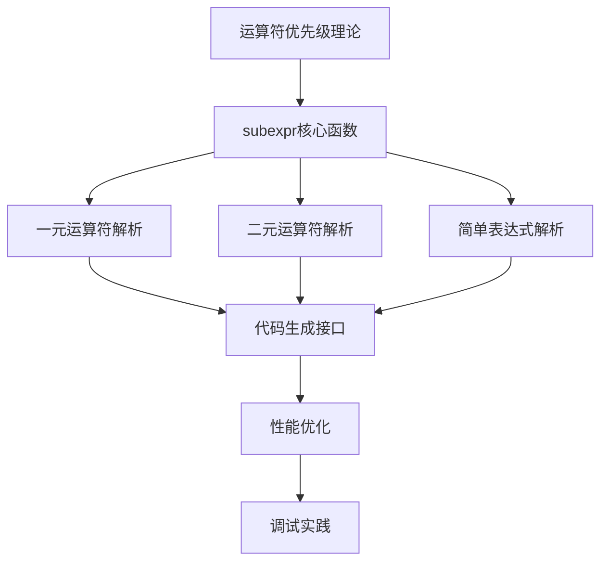
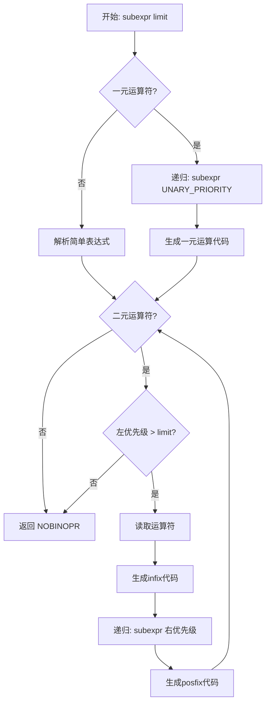
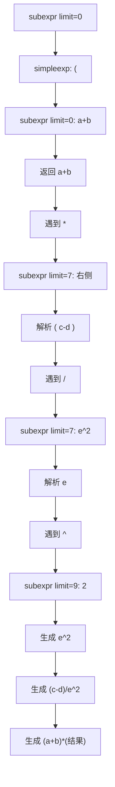

# 🧮 表达式解析与优先级详解

> **技术深度**：⭐⭐⭐⭐⭐  
> **预计阅读时间**：25分钟  
> **前置知识**：[递归下降解析](recursive_descent.md)、Lua语法基础

---

## 📋 目录

- [概述](#概述)
- [运算符优先级理论](#运算符优先级理论)
- [subexpr核心函数](#subexpr核心函数)
- [一元运算符解析](#一元运算符解析)
- [二元运算符解析](#二元运算符解析)
- [简单表达式解析](#简单表达式解析)
- [复杂表达式示例](#复杂表达式示例)
- [代码生成接口](#代码生成接口)
- [性能优化技巧](#性能优化技巧)
- [调试与实践指南](#调试与实践指南)

---

## 🎯 概述

表达式解析是编译器中最复杂的部分之一。Lua使用**优先级爬升法**（Operator Precedence Parsing）实现表达式解析，这是一种高效且易于维护的算法。

### 为什么表达式解析复杂？

**挑战**：
1. **优先级**：`a + b * c`应解析为`a + (b * c)`而非`(a + b) * c`
2. **结合性**：`a - b - c`应解析为`(a - b) - c`（左结合），`a ^ b ^ c`应解析为`a ^ (b ^ c)`（右结合）
3. **短路求值**：`a and b`中，如果`a`为假，不应计算`b`
4. **嵌套深度**：`((a + b) * (c - d)) / ((e + f) * (g - h))`
5. **类型多样**：算术、关系、逻辑、字符串连接等

### Lua表达式的特点

```lua
-- 算术运算
x = a + b * c - d / e % f ^ g

-- 关系运算
result = (x > 10) and (y < 20) or (z == 30)

-- 字符串连接
s = "Hello" .. " " .. "World"

-- 表构造
t = {x = 1, y = 2, [a+b] = 3}

-- 函数调用
result = math.max(a, b) + f(x)(y)

-- 混合表达式
complex = (a and b or c) .. tostring(x + y)
```

### 传统递归下降 vs 优先级爬升

**传统递归下降**（需要多层函数）：

```c
// 每个优先级层次一个函数
void expr() {
    term();
    while (token == '+' || token == '-') {
        op = token;
        next();
        term();
        emit(op);
    }
}

void term() {
    factor();
    while (token == '*' || token == '/') {
        op = token;
        next();
        factor();
        emit(op);
    }
}

void factor() {
    if (token == '(') {
        next();
        expr();
        expect(')');
    } else {
        emit_number();
        next();
    }
}
```

**Lua的优先级爬升**（单个函数处理所有优先级）：

```c
// 使用优先级表和limit参数
static BinOpr subexpr(LexState *ls, expdesc *v, unsigned int limit) {
    // 处理一元运算符
    UnOpr uop = getunopr(ls->t.token);
    if (uop != OPR_NOUNOPR) {
        next(ls);
        subexpr(ls, v, UNARY_PRIORITY);
        luaK_prefix(ls->fs, uop, v);
    } else {
        simpleexp(ls, v);
    }
    
    // 处理二元运算符
    BinOpr op = getbinopr(ls->t.token);
    while (op != OPR_NOBINOPR && priority[op].left > limit) {
        expdesc v2;
        BinOpr nextop;
        next(ls);
        luaK_infix(ls->fs, op, v);
        nextop = subexpr(ls, &v2, priority[op].right);
        luaK_posfix(ls->fs, op, v, &v2);
        op = nextop;
    }
    return op;
}
```

**优势对比**：

| 特性 | 传统递归下降 | 优先级爬升 |
|------|-------------|-----------|
| **函数数量** | 每个优先级1个（5-10个） | 1个核心函数 |
| **可维护性** | ⭐⭐ 修改优先级需改函数 | ⭐⭐⭐⭐⭐ 修改优先级表即可 |
| **性能** | ⭐⭐⭐ 多次函数调用 | ⭐⭐⭐⭐⭐ 循环+少量递归 |
| **代码行数** | 100-200行 | 50-80行 |
| **理解难度** | ⭐⭐ 直观 | ⭐⭐⭐⭐ 需理解算法 |

### 本文档结构



---

## 📊 运算符优先级理论

### Lua运算符优先级表

Lua 5.1.5定义了以下运算符优先级（数字越大优先级越高）：

```c
// 来自lparser.c
static const struct {
    lu_byte left;   // 左结合优先级
    lu_byte right;  // 右结合优先级
} priority[] = {
    {6, 6}, {6, 6},           // + -  （算术加减）
    {7, 7}, {7, 7},           // * /  （算术乘除）
    {10, 9},                  // ^    （幂运算，右结合！）
    {5, 4},                   // ..   （字符串连接，右结合！）
    {3, 3}, {3, 3},           // == ~= （相等性）
    {3, 3}, {3, 3},           // < <= （关系比较）
    {3, 3}, {3, 3},           // > >= （关系比较）
    {2, 2},                   // and  （逻辑与）
    {1, 1}                    // or   （逻辑或）
};

#define UNARY_PRIORITY  8     // 一元运算符优先级
```

**运算符枚举**：

```c
typedef enum BinOpr {
    OPR_ADD,        // +
    OPR_SUB,        // -
    OPR_MUL,        // *
    OPR_DIV,        // /
    OPR_POW,        // ^
    OPR_CONCAT,     // ..
    OPR_NE,         // ~=
    OPR_EQ,         // ==
    OPR_LT,         // <
    OPR_LE,         // <=
    OPR_GT,         // >
    OPR_GE,         // >=
    OPR_AND,        // and
    OPR_OR,         // or
    OPR_NOBINOPR    // 非二元运算符
} BinOpr;

typedef enum UnOpr {
    OPR_MINUS,      // - (一元负号)
    OPR_NOT,        // not
    OPR_LEN,        // #
    OPR_NOUNOPR     // 非一元运算符
} UnOpr;
```

### 优先级表详解

**完整优先级（从高到低）**：

| 优先级 | 运算符 | 结合性 | 示例 | 说明 |
|-------|--------|--------|------|------|
| **10** | `^` | 右结合 | `2^3^2 = 2^(3^2) = 512` | 幂运算 |
| **8** | `not`, `-`, `#` | 右结合 | `not not x = not (not x)` | 一元运算符 |
| **7** | `*`, `/`, `%` | 左结合 | `a*b/c = (a*b)/c` | 乘除模 |
| **6** | `+`, `-` | 左结合 | `a+b-c = (a+b)-c` | 加减 |
| **5** | `..` | 右结合 | `a..b..c = a..(b..c)` | 字符串连接 |
| **3** | `<`, `>`, `<=`, `>=`, `~=`, `==` | 左结合 | `a<b<c` 非法 | 关系运算 |
| **2** | `and` | 左结合 | `a and b and c = (a and b) and c` | 逻辑与 |
| **1** | `or` | 左结合 | `a or b or c = (a or b) or c` | 逻辑或 |

**注意事项**：

1. **右结合运算符**：`^`、`..`、一元运算符
   - 右优先级 < 左优先级：`priority[OPR_POW] = {10, 9}`
   - 递归时使用右优先级，允许右侧有同级运算符

2. **关系运算符不可链式**：
   ```lua
   -- 错误：Lua不支持 a < b < c
   -- 必须写成
   (a < b) and (b < c)
   ```

3. **一元运算符优先级**：
   ```lua
   -a^2    -- 解析为 -(a^2)，因为^优先级10 > 一元8
   not a and b  -- 解析为 (not a) and b
   #t[1]   -- 解析为 #(t[1])
   ```

### 左结合 vs 右结合

**左结合示例**：

```lua
a - b - c  -- 应该解析为 (a - b) - c
```

**算法处理**：
```
1. 解析 a
2. 遇到 - (左优先级6)
3. 递归 subexpr(limit=6) 解析右侧
4. 在递归中遇到 - (左优先级6)
5. 因为 6 不大于 6，停止递归，返回 b
6. 生成 a - b
7. 继续循环，遇到 - (左优先级6)
8. 递归 subexpr(limit=6) 解析 c
9. 生成 (a - b) - c
```

**右结合示例**：

```lua
a ^ b ^ c  -- 应该解析为 a ^ (b ^ c)
```

**算法处理**：
```
1. 解析 a
2. 遇到 ^ (左优先级10)
3. 递归 subexpr(limit=9) 解析右侧（使用右优先级！）
4. 在递归中遇到 ^ (左优先级10)
5. 因为 10 > 9，继续递归
6. 递归 subexpr(limit=9) 解析 c
7. 生成 b ^ c
8. 返回 b ^ c 的结果
9. 生成 a ^ (b ^ c)
```

### 优先级爬升算法原理

**伪代码**：

```
function subexpr(limit):
    // 1. 处理前缀（一元运算符或简单表达式）
    if 当前token是一元运算符:
        op = 当前一元运算符
        next()
        subexpr(UNARY_PRIORITY)  // 递归解析操作数
        生成一元运算代码
    else:
        解析简单表达式（数字、变量、表等）
    
    // 2. 处理中缀（二元运算符）
    while 当前token是二元运算符 AND 左优先级 > limit:
        op = 当前二元运算符
        next()
        生成infix代码（如短路求值的跳转）
        
        // 递归解析右操作数（使用右优先级）
        nextop = subexpr(op的右优先级)
        
        生成posfix代码（完成运算）
        op = nextop
    
    return op
```

**工作流程图**：



**关键点**：

1. **limit参数**：控制递归停止条件
   - 初始调用：`subexpr(ls, v, 0)`（接受所有优先级）
   - 遇到低优先级运算符时停止，返回给外层处理

2. **左右优先级差异**：
   - 左结合：左右优先级相同 `{6, 6}`
   - 右结合：右优先级低1 `{10, 9}`

3. **循环+递归**：
   - 循环处理同级或更高优先级的运算符（左结合）
   - 递归处理右侧表达式

---

## 🔧 subexpr核心函数

### 完整实现

```c
// 来自lparser.c
static BinOpr subexpr(LexState *ls, expdesc *v, unsigned int limit) {
    BinOpr op;
    UnOpr uop;
    
    // 检查递归深度（防止栈溢出）
    enterlevel(ls);
    
    // 1️⃣ 处理一元运算符
    uop = getunopr(ls->t.token);
    if (uop != OPR_NOUNOPR) {
        next(ls);
        subexpr(ls, v, UNARY_PRIORITY);
        luaK_prefix(ls->fs, uop, v);
    }
    else {
        simpleexp(ls, v);
    }
    
    // 2️⃣ 处理二元运算符
    op = getbinopr(ls->t.token);
    while (op != OPR_NOBINOPR && priority[op].left > limit) {
        expdesc v2;
        BinOpr nextop;
        
        next(ls);
        luaK_infix(ls->fs, op, v);
        
        // 递归解析右操作数
        nextop = subexpr(ls, &v2, priority[op].right);
        
        luaK_posfix(ls->fs, op, v, &v2);
        op = nextop;
    }
    
    leavelevel(ls);
    return op;  // 返回未处理的运算符
}
```

### 参数说明

| 参数 | 类型 | 说明 |
|------|------|------|
| `ls` | `LexState*` | 词法状态，包含Token流 |
| `v` | `expdesc*` | 表达式描述符，存储解析结果 |
| `limit` | `unsigned int` | 优先级下限，低于此值的运算符不处理 |
| **返回值** | `BinOpr` | 第一个优先级低于limit的运算符 |

**expdesc结构**：

```c
typedef struct expdesc {
    expkind k;              // 表达式类型
    union {
        struct { int info; int aux; } s;
        lua_Number nval;    // 数字字面量
    } u;
    int t;                  // true跳转链表（用于短路求值）
    int f;                  // false跳转链表
} expdesc;
```

**expkind枚举**：

```c
typedef enum {
    VVOID,        // 无值
    VNIL,         // nil
    VTRUE,        // true
    VFALSE,       // false
    VK,           // 常量表中的常量
    VKNUM,        // 数字字面量（未放入常量表）
    VLOCAL,       // 局部变量
    VUPVAL,       // upvalue
    VGLOBAL,      // 全局变量
    VINDEXED,     // 表索引 t[k]
    VJMP,         // 跳转表达式
    VRELOCABLE,   // 可重定位表达式（指令结果）
    VNONRELOC,    // 固定寄存器表达式
    VCALL,        // 函数调用
    VVARARG       // 可变参数 ...
} expkind;
```

### 工作流程

**示例：解析 `a + b * c`**

```
初始调用：subexpr(ls, v, 0)

第1步：处理一元运算符
  - getunopr('a') = OPR_NOUNOPR
  - 调用 simpleexp(ls, v)
  - v.k = VGLOBAL, v.u.s.info = "a"的常量索引

第2步：处理二元运算符
  - getbinopr('+') = OPR_ADD
  - priority[OPR_ADD].left = 6 > limit(0)，进入循环
  - next()  // 跳过 '+'
  - luaK_infix(OPR_ADD, v)  // 确保v在寄存器中
  
第3步：递归解析 b * c
  - nextop = subexpr(ls, &v2, priority[OPR_ADD].right)  // limit=6
  
  内层递归：
    第1步：simpleexp解析b
      - v2.k = VGLOBAL, v2.u.s.info = "b"的索引
    
    第2步：getbinopr('*') = OPR_MUL
      - priority[OPR_MUL].left = 7 > limit(6)，进入循环
      - next()  // 跳过 '*'
      - luaK_infix(OPR_MUL, v2)
      
    第3步：递归解析c
      - subexpr(ls, &v3, priority[OPR_MUL].right)  // limit=7
      - 解析c，返回OPR_NOBINOPR
    
    第4步：生成 b * c
      - luaK_posfix(OPR_MUL, v2, v3)
      - 指令：MUL R1 R_b R_c
      - v2.k = VRELOCABLE, v2.u.s.info = R1
    
    返回：nextop = OPR_NOBINOPR
  
第4步：生成 a + (b * c)
  - luaK_posfix(OPR_ADD, v, v2)
  - 指令：ADD R0 R_a R1
  - v.k = VRELOCABLE, v.u.s.info = R0

第5步：检查下一个运算符
  - op = getbinopr(当前token)
  - 如果是低优先级或结束，退出循环

返回：op（未处理的运算符）
```

### 递归深度控制

```c
#define LUAI_MAXCCALLS  200  // 最大C调用深度

static void enterlevel(LexState *ls) {
    if (++ls->L->nCcalls > LUAI_MAXCCALLS)
        luaX_lexerror(ls, "chunk has too many syntax levels", 0);
}

static void leavelevel(LexState *ls) {
    ls->L->nCcalls--;
}
```

**保护措施**：
- 防止深度嵌套表达式导致栈溢出
- 示例：`(((((((...)))))))`（200层括号）
- 错误信息：`"chunk has too many syntax levels"`

---


## ➖ 一元运算符解析

### getunopr函数

```c
static UnOpr getunopr(int op) {
    switch (op) {
        case TK_NOT: return OPR_NOT;
        case '-': return OPR_MINUS;
        case '#': return OPR_LEN;
        default: return OPR_NOUNOPR;
    }
}
```

### NOT运算符

**语法**：`not exp`

**语义**：逻辑非，`nil`和`false`为假，其他为真

**luaK_prefix实现**：

```c
void luaK_prefix(FuncState *fs, UnOpr op, expdesc *e) {
    expdesc e2;
    e2.t = e2.f = NO_JUMP;
    e2.k = VKNUM;
    e2.u.nval = 0;
    
    switch (op) {
        case OPR_NOT: {
            codenot(fs, e);  // 反转t和f链表
            break;
        }
        case OPR_MINUS: {
            if (e->k == VKNUM)  // 常量折叠
                e->u.nval = -e->u.nval;
            else {
                luaK_exp2anyreg(fs, e);
                codearith(fs, OP_UNM, e, &e2);
            }
            break;
        }
        case OPR_LEN: {
            luaK_exp2anyreg(fs, e);
            codearith(fs, OP_LEN, e, &e2);
            break;
        }
        default: lua_assert(0);
    }
}
```

## ➕ 二元运算符解析

### getbinopr函数

```c
static BinOpr getbinopr(int op) {
    switch (op) {
        case '+': return OPR_ADD;
        case '-': return OPR_SUB;
        case '*': return OPR_MUL;
        case '/': return OPR_DIV;
        case '%': return OPR_MOD;
        case '^': return OPR_POW;
        case TK_CONCAT: return OPR_CONCAT;  // ..
        case TK_NE: return OPR_NE;          // ~=
        case TK_EQ: return OPR_EQ;          // ==
        case '<': return OPR_LT;
        case TK_LE: return OPR_LE;          // <=
        case '>': return OPR_GT;
        case TK_GE: return OPR_GE;          // >=
        case TK_AND: return OPR_AND;        // and
        case TK_OR: return OPR_OR;          // or
        default: return OPR_NOBINOPR;
    }
}
```

### 逻辑运算符短路求值

**关键特性**：`and`和`or`使用短路求值

```lua
-- and: 如果a为假，返回a；否则返回b
local x = nil and print("不会执行")  -- x = nil

-- or: 如果a为真，返回a；否则返回b  
local y = "hello" or print("不会执行")  -- y = "hello"
```

**实现机制**：

```c
void luaK_infix(FuncState *fs, BinOpr op, expdesc *v) {
    switch (op) {
        case OPR_AND: {
            luaK_goiftrue(fs, v);  // v为真时继续
            break;
        }
        case OPR_OR: {
            luaK_goiffalse(fs, v);  // v为假时继续
            break;
        }
        case OPR_CONCAT: {
            luaK_exp2nextreg(fs, v);  // 确保在寄存器中
            break;
        }
        default: {
            if (!tonumeral(v, NULL)) luaK_exp2RK(fs, v);
            break;
        }
    }
}

void luaK_posfix(FuncState *fs, BinOpr op, expdesc *e1, expdesc *e2) {
    switch (op) {
        case OPR_AND: {
            lua_assert(e1->t == NO_JUMP);
            luaK_dischargevars(fs, e2);
            luaK_concat(fs, &e2->f, e1->f);  // 合并false链
            *e1 = *e2;
            break;
        }
        case OPR_OR: {
            lua_assert(e1->f == NO_JUMP);
            luaK_dischargevars(fs, e2);
            luaK_concat(fs, &e2->t, e1->t);  // 合并true链
            *e1 = *e2;
            break;
        }
        // 其他运算符...
    }
}
```

---

## 🔤 简单表达式解析

### simpleexp函数

```c
static void simpleexp(LexState *ls, expdesc *v) {
    switch (ls->t.token) {
        case TK_NUMBER: {
            init_exp(v, VKNUM, 0);
            v->u.nval = ls->t.seminfo.r;
            break;
        }
        case TK_STRING: {
            codestring(ls, v, ls->t.seminfo.ts);
            break;
        }
        case TK_NIL: {
            init_exp(v, VNIL, 0);
            break;
        }
        case TK_TRUE: {
            init_exp(v, VTRUE, 0);
            break;
        }
        case TK_FALSE: {
            init_exp(v, VFALSE, 0);
            break;
        }
        case TK_DOTS: {  // ...
            check_condition(ls, ls->fs->f->is_vararg,
                          "cannot use '...' outside a vararg function");
            init_exp(v, VVARARG, luaK_codeABC(ls->fs, OP_VARARG, 0, 1, 0));
            break;
        }
        case '{': {  // 表构造器
            constructor(ls, v);
            return;
        }
        case TK_FUNCTION: {  // 函数定义
            next(ls);
            body(ls, v, 0, ls->linenumber);
            return;
        }
        default: {  // 变量或函数调用
            primaryexp(ls, v);
            return;
        }
    }
    next(ls);
}
```

### 字面量解析

**数字字面量**：

```lua
local x = 123
local y = 3.14
local z = 0x1F
local w = 1e10
```

```c
case TK_NUMBER: {
    init_exp(v, VKNUM, 0);
    v->u.nval = ls->t.seminfo.r;  // 直接存储数值
    break;
}
```

**字符串字面量**：

```lua
local s = "hello"
local t = 'world'
local u = [[多行
字符串]]
```

```c
case TK_STRING: {
    codestring(ls, v, ls->t.seminfo.ts);
    break;
}

static void codestring(LexState *ls, expdesc *e, TString *s) {
    init_exp(e, VK, luaK_stringK(ls->fs, s));  // 添加到常量表
}
```

### 表构造器

**语法**：

```lua
t = {10, 20, 30}              -- 数组部分
t = {x=1, y=2}                -- 哈希部分
t = {[exp]=value}             -- 动态键
t = {10, 20, x=1, [f()]=2}    -- 混合
```

**constructor函数**（简化）：

```c
static void constructor(LexState *ls, expdesc *t) {
    int line = ls->linenumber;
    int pc = luaK_codeABC(ls->fs, OP_NEWTABLE, 0, 0, 0);
    struct ConsControl cc;
    cc.na = cc.nh = cc.tostore = 0;
    cc.t = t;
    
    init_exp(t, VRELOCABLE, pc);
    luaK_exp2nextreg(ls->fs, t);
    
    checknext(ls, '{');
    do {
        if (ls->t.token == '}') break;
        closelistfield(ls->fs, &cc);
        
        switch (ls->t.token) {
            case TK_NAME: {
                luaX_lookahead(ls);
                if (ls->lookahead.token != '=')
                    listfield(ls, &cc);
                else
                    recfield(ls, &cc);
                break;
            }
            case '[': {
                recfield(ls, &cc);
                break;
            }
            default: {
                listfield(ls, &cc);
                break;
            }
        }
    } while (testnext(ls, ',') || testnext(ls, ';'));
    
    check_match(ls, '}', '{', line);
    lastlistfield(ls->fs, &cc);
    SETARG_B(ls->fs->f->code[pc], luaO_int2fb(cc.na));
    SETARG_C(ls->fs->f->code[pc], luaO_int2fb(cc.nh));
}
```

---

## 📋 复杂表达式示例

### 示例1：算术表达式

**Lua代码**：

```lua
local result = (a + b) * (c - d) / e ^ 2
```

**解析过程**：



**生成字节码**：

```
[1] GETGLOBAL  R0 'e'
[2] LOADK      R1 K0        ; K0 = 2
[3] POW        R0 R0 R1     ; e ^ 2
[4] GETGLOBAL  R1 'c'
[5] GETGLOBAL  R2 'd'
[6] SUB        R1 R1 R2     ; c - d
[7] DIV        R0 R1 R0     ; (c-d) / (e^2)
[8] GETGLOBAL  R1 'a'
[9] GETGLOBAL  R2 'b'
[10] ADD       R1 R1 R2     ; a + b
[11] MUL       R0 R1 R0     ; (a+b) * 结果
```

### 示例2：布尔表达式

**Lua代码**：

```lua
if (x > 10 and y < 20) or z == 30 then
    -- ...
end
```

**短路求值过程**：

```
1. 解析 x > 10
   - 生成 LT 10 x 指令（注意：x>10 转换为 10<x）
   - v.t = true链, v.f = false链

2. 遇到 and
   - luaK_goiftrue(&v)
   - 如果x>10为真，继续求值y<20
   - 如果为假，整个表达式为假

3. 解析 y < 20
   - 生成 LT y 20 指令
   
4. luaK_posfix(AND)
   - 合并false链表

5. 遇到 or
   - luaK_goiffalse(&result)
   - 如果前面为假，求值z==30
   
6. 解析 z == 30

7. luaK_posfix(OR)
   - 合并true链表
```

**字节码**：

```
[1] LOADK      R0 K0        ; K0 = 10
[2] GETGLOBAL  R1 'x'
[3] LT         1  R0 R1     ; 10 < x?
[4] JMP        [9]          ; false -> 检查z
[5] GETGLOBAL  R0 'y'
[6] LT         1  R0 K1     ; y < 20?
[7] JMP        [9]          ; false -> 检查z
[8] JMP        [12]         ; true -> then块
[9] GETGLOBAL  R0 'z'
[10] EQ        1  R0 K2     ; z == 30?
[11] JMP        [13]        ; false -> else
[12] <then块>
[13] <else块>
```

---

## 🔧 代码生成接口

### luaK_prefix - 一元运算符

```c
void luaK_prefix(FuncState *fs, UnOpr op, expdesc *e) {
    expdesc e2;
    e2.t = e2.f = NO_JUMP;
    e2.k = VKNUM;
    e2.u.nval = 0;
    
    switch (op) {
        case OPR_MINUS: {
            if (!tonumeral(e, &e2.u.nval))  // 尝试常量折叠
                codearith(fs, OP_UNM, e, &e2);
            else
                *e = e2;  // 使用折叠后的常量
            break;
        }
        case OPR_NOT: codenot(fs, e); break;
        case OPR_LEN: codearith(fs, OP_LEN, e, &e2); break;
        default: lua_assert(0);
    }
}
```

### luaK_infix - 中缀处理

**作用**：在解析右操作数之前的处理

```c
void luaK_infix(FuncState *fs, BinOpr op, expdesc *v) {
    switch (op) {
        case OPR_AND: {
            luaK_goiftrue(fs, v);  // 设置短路跳转
            break;
        }
        case OPR_OR: {
            luaK_goiffalse(fs, v);
            break;
        }
        case OPR_CONCAT: {
            luaK_exp2nextreg(fs, v);  // CONCAT需要连续寄存器
            break;
        }
        case OPR_ADD: case OPR_SUB: case OPR_MUL:
        case OPR_DIV: case OPR_MOD: case OPR_POW: {
            if (!tonumeral(v, NULL)) luaK_exp2RK(fs, v);
            break;
        }
        case OPR_EQ: case OPR_NE:
        case OPR_LT: case OPR_LE: case OPR_GT: case OPR_GE: {
            luaK_exp2RK(fs, v);
            break;
        }
        default: {
            luaK_exp2RK(fs, v);
            break;
        }
    }
}
```

### luaK_posfix - 后缀处理

**作用**：解析完两个操作数后生成代码

```c
void luaK_posfix(FuncState *fs, BinOpr op, expdesc *e1, expdesc *e2) {
    switch (op) {
        case OPR_AND: {
            lua_assert(e1->t == NO_JUMP);
            luaK_dischargevars(fs, e2);
            luaK_concat(fs, &e2->f, e1->f);
            *e1 = *e2;
            break;
        }
        case OPR_OR: {
            lua_assert(e1->f == NO_JUMP);
            luaK_dischargevars(fs, e2);
            luaK_concat(fs, &e2->t, e1->t);
            *e1 = *e2;
            break;
        }
        case OPR_CONCAT: {
            luaK_exp2val(fs, e2);
            if (e2->k == VRELOCABLE && GET_OPCODE(getcode(fs, e2)) == OP_CONCAT) {
                // 优化：连接多个字符串
                freeexp(fs, e1);
                SETARG_B(getcode(fs, e2), e1->u.s.info);
                e1->k = VRELOCABLE;
                e1->u.s.info = e2->u.s.info;
            }
            else {
                luaK_exp2nextreg(fs, e2);
                codearith(fs, OP_CONCAT, e1, e2);
            }
            break;
        }
        case OPR_ADD: case OPR_SUB: case OPR_MUL: case OPR_DIV:
        case OPR_MOD: case OPR_POW: {
            codearith(fs, cast(OpCode, op - OPR_ADD + OP_ADD), e1, e2);
            break;
        }
        case OPR_EQ: case OPR_LT: case OPR_LE: {
            codecomp(fs, cast(OpCode, op - OPR_EQ + OP_EQ), 1, e1, e2);
            break;
        }
        case OPR_NE: case OPR_GT: case OPR_GE: {
            codecomp(fs, cast(OpCode, op - OPR_NE + OP_EQ), 0, e1, e2);
            break;
        }
        default: lua_assert(0);
    }
}
```

---

## ⚡ 性能优化技巧

### 1. 常量折叠

**编译时计算常量表达式**：

```lua
local x = 2 + 3 * 4      -- 编译为 14
local y = "hello" .. " " .. "world"  -- 编译为 "hello world"
local z = not false      -- 编译为 true
```

**实现**：

```c
// 在luaK_prefix中
case OPR_MINUS: {
    if (!tonumeral(e, &e2.u.nval))  // 尝试折叠
        codearith(fs, OP_UNM, e, &e2);
    else
        *e = e2;  // 使用常量
    break;
}

// tonumeral函数
static int tonumeral(expdesc *e, lua_Number *nval) {
    if (e->k == VKNUM) {
        if (nval) *nval = e->u.nval;
        return 1;
    }
    return 0;
}
```

### 2. 寄存器复用

**最小化寄存器使用**：

```c
static void freeexp(FuncState *fs, expdesc *e) {
    if (e->k == VNONRELOC)
        freereg(fs, e->u.s.info);
}

static void freereg(FuncState *fs, int reg) {
    if (!ISK(reg) && reg >= fs->nactvar) {
        fs->freereg--;
        lua_assert(reg == fs->freereg);
    }
}
```

### 3. RK操作数优化

**常量和寄存器统一编码**：

```c
// RK值：如果最高位为1，表示常量索引；否则是寄存器
#define RKASK(x)  ((x) | BITRK)
#define ISK(x)    ((x) & BITRK)

int luaK_exp2RK(FuncState *fs, expdesc *e) {
    luaK_exp2val(fs, e);
    switch (e->k) {
        case VKNUM:
        case VTRUE:
        case VFALSE:
        case VNIL: {
            if (fs->nk <= MAXINDEXRK) {  // 常量表未满
                e->u.s.info = (e->k == VNIL) ? nilK(fs) :
                              (e->k == VKNUM) ? luaK_numberK(fs, e->u.nval) :
                              boolK(fs, (e->k == VTRUE));
                e->k = VK;
                return RKASK(e->u.s.info);
            }
            break;
        }
        case VK: {
            if (e->u.s.info <= MAXINDEXRK)
                return RKASK(e->u.s.info);
            break;
        }
        default: break;
    }
    return luaK_exp2anyreg(fs, e);
}
```

### 4. 跳转链表优化

**延迟跳转地址修正**：

```c
void luaK_concat(FuncState *fs, int *l1, int l2) {
    if (l2 == NO_JUMP) return;
    else if (*l1 == NO_JUMP)
        *l1 = l2;
    else {
        int list = *l1;
        int next;
        while ((next = getjump(fs, list)) != NO_JUMP)  // 找到链表尾
            list = next;
        fixjump(fs, list, l2);
    }
}
```

---

## 🛠️ 调试与实践指南

### GDB调试表达式解析

```bash
$ gdb ./lua
(gdb) break subexpr
(gdb) run test.lua
```

**查看解析状态**：

```gdb
# 查看当前表达式描述符
(gdb) print *v
$1 = {k = VKNUM, u = {s = {info = 0, aux = 0}, nval = 3.14}, t = -1, f = -1}

# 查看优先级限制
(gdb) print limit
$2 = 6

# 查看当前运算符
(gdb) print op
$3 = OPR_ADD

# 查看优先级表
(gdb) print priority[op]
$4 = {left = 6 '\006', right = 6 '\006'}
```

### 添加调试输出

```c
#define DEBUG_EXPR 1

#ifdef DEBUG_EXPR
static void print_expdesc(expdesc *e) {
    printf("expdesc: k=%d", e->k);
    if (e->k == VKNUM)
        printf(" nval=%g", e->u.nval);
    else if (e->k == VLOCAL || e->k == VNONRELOC)
        printf(" reg=%d", e->u.s.info);
    printf(" t=%d f=%d\n", e->t, e->f);
}

#define PRINT_EXPR(e) print_expdesc(e)
#else
#define PRINT_EXPR(e)
#endif

static BinOpr subexpr(LexState *ls, expdesc *v, unsigned int limit) {
    printf("[subexpr] limit=%d token=%d\n", limit, ls->t.token);
    // ... 原代码 ...
    PRINT_EXPR(v);
    return op;
}
```

### 扩展运算符实践

**添加新的二元运算符：整除（//）**

```c
// 1. 在llex.h添加Token
#define TK_IDIV  290

// 2. 在llex.c识别Token
case '/': {
    next(ls);
    if (ls->current == '/') {
        next(ls);
        return TK_IDIV;
    }
    return '/';
}

// 3. 在lparser.c添加运算符
typedef enum BinOpr {
    // ... 现有运算符 ...
    OPR_IDIV,  // 新增
    OPR_NOBINOPR
} BinOpr;

static const struct {
    lu_byte left; lu_byte right;
} priority[] = {
    // ... 现有优先级 ...
    {7, 7},  // //（与*、/相同优先级）
};

static BinOpr getbinopr(int op) {
    switch (op) {
        // ... 现有case ...
        case TK_IDIV: return OPR_IDIV;
        default: return OPR_NOBINOPR;
    }
}

// 4. 在lcode.c生成代码
void luaK_posfix(FuncState *fs, BinOpr op, expdesc *e1, expdesc *e2) {
    switch (op) {
        // ... 现有case ...
        case OPR_IDIV: {
            codearith(fs, OP_IDIV, e1, e2);
            break;
        }
    }
}

// 5. 在lopcodes.h添加VM指令
typedef enum {
    // ... 现有指令 ...
    OP_IDIV,
    // ...
} OpCode;

// 6. 在lvm.c实现指令
case OP_IDIV: {
    TValue *rb = RKB(i);
    TValue *rc = RKC(i);
    if (ttisnumber(rb) && ttisnumber(rc)) {
        lua_Number nb = nvalue(rb), nc = nvalue(rc);
        setnvalue(ra, luai_numidiv(nb, nc));  // 整除实现
    }
    else
        Protect(Arith(L, ra, rb, rc, TM_IDIV));
    continue;
}
```

### 性能分析

**测试复杂表达式性能**：

```lua
-- test_expr.lua
local N = 1000000

-- 测试1：简单算术
local function test1()
    local sum = 0
    for i = 1, N do
        sum = sum + i * 2 - i / 3
    end
    return sum
end

-- 测试2：布尔表达式
local function test2()
    local count = 0
    for i = 1, N do
        if (i > 10 and i < 100) or i == 500 then
            count = count + 1
        end
    end
    return count
end

-- 测试3：字符串连接
local function test3()
    local s = ""
    for i = 1, 1000 do
        s = s .. tostring(i) .. " "
    end
    return s
end
```

```bash
$ time lua test_expr.lua
```

## 🔗 相关文档

- [递归下降解析](recursive_descent.md) - 解析算法基础
- [代码生成与优化](code_generation.md) - 字节码生成细节
- [虚拟机指令集](../vm/instruction_set.md) - VM指令说明

---

*返回：[解析器模块总览](wiki_parser.md)*
