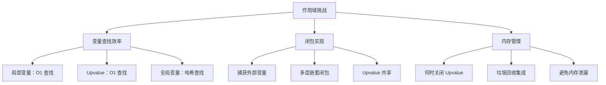
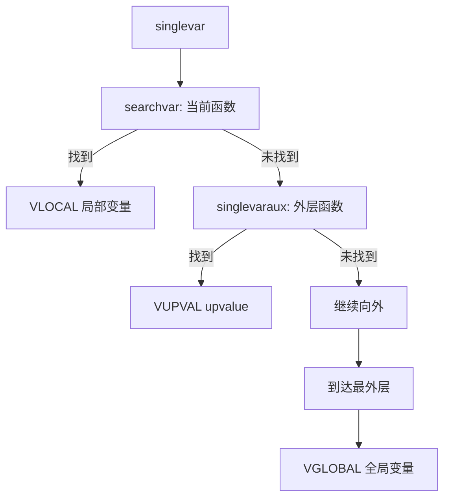
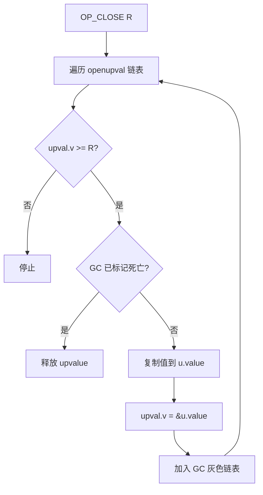

# 🔐 作用域与 Upvalue 机制详解

> **技术深度**：⭐⭐⭐⭐⭐  
> **预计阅读时间**：20分钟  
> **前置知识**：[递归下降解析](recursive_descent.md)、[语句解析](statement_parsing.md)

---

## 📋 目录

- [概述](#概述)
- [局部变量管理机制](#局部变量管理机制)
- [Upvalue 机制详解](#upvalue-机制详解)
- [Upvalue 关闭机制](#upvalue-关闭机制)
- [复杂闭包场景](#复杂闭包场景)
- [关键数据结构](#关键数据结构)
- [代码生成与性能分析](#代码生成与性能分析)
- [调试与实践指南](#调试与实践指南)

---

## 🎯 概述

作用域管理是 Lua 编译器最精妙的部分之一，它实现了**词法作用域**（Lexical Scoping）和**闭包**（Closure）机制。理解作用域管理对于掌握 Lua 的高级特性至关重要。

### 什么是作用域？

**作用域**（Scope）定义了变量的可见性和生命周期：

```lua
local x = 1        -- 全局作用域中的局部变量

function f()
    local y = 2    -- f 的作用域
    
    do
        local z = 3  -- do 块的作用域
        print(x, y, z)  -- 1 2 3（都可见）
    end
    
    print(x, y)    -- 1 2（z 不可见）
    -- print(z)    -- 错误：z 已离开作用域
end
```

### 词法作用域 vs 动态作用域

| 特性 | 词法作用域（Lexical Scoping） | 动态作用域（Dynamic Scoping） |
|------|-------------------------------|------------------------------|
| **定义** | 变量绑定在编译时确定 | 变量绑定在运行时确定 |
| **查找规则** | 根据代码结构（嵌套） | 根据调用栈 |
| **Lua 采用** | ✅ 是 | ❌ 否 |
| **优点** | 可预测、易优化、支持闭包 | 灵活 |
| **缺点** | 不够灵活 | 难以推理、性能差 |

**示例对比**：

```lua
-- 词法作用域（Lua 实际行为）
local x = 1

function f()
    print(x)  -- 总是打印 1（定义时的 x）
end

function g()
    local x = 2
    f()  -- 打印 1（不是 2！）
end

g()  -- 输出：1
```

如果是动态作用域（Lua 不是），`f()` 会打印 `2`（调用时的 x）。

### Lua 作用域规则

**1. 块级作用域**：

```lua
do
    local x = 1
end
-- x 不可见

if condition then
    local y = 2
end
-- y 不可见

for i = 1, 10 do
    local z = 3
end
-- i 和 z 都不可见
```

**2. 函数作用域**：

```lua
function f()
    local x = 1  -- x 的作用域是整个函数 f
    
    function g()
        print(x)  -- g 可以访问 f 的局部变量（闭包）
    end
    
    return g
end
```

**3. 变量遮蔽（Shadowing）**：

```lua
local x = 1

function f()
    local x = 2  -- 遮蔽外层的 x
    print(x)     -- 2
end

print(x)  -- 1
```

### 闭包（Closure）的核心

**闭包 = 函数 + 捕获的外部变量**

```lua
function make_counter()
    local count = 0  -- 外部变量
    
    return function()  -- 闭包
        count = count + 1  -- 捕获 count
        return count
    end
end

local c1 = make_counter()
print(c1())  -- 1
print(c1())  -- 2

local c2 = make_counter()
print(c2())  -- 1（独立的闭包）
```

**关键问题**：
- `count` 是 `make_counter` 的局部变量，函数返回后应该销毁
- 但闭包函数仍需访问 `count`
- **解决方案**：Upvalue 机制

### Upvalue 机制简介

**Upvalue** 是 Lua 实现闭包的核心机制：

```
┌─────────────────┐
│ 函数原型 (Proto)│
│                 │
│ upvalues[]      │───┐
└─────────────────┘   │
                      │
                      ▼
                ┌──────────┐
                │ Upvalue  │
                │          │
                │ v ───────┼──→ 局部变量或TValue
                └──────────┘
```

**两种状态**：

1. **Open Upvalue**：指向栈上的局部变量
   ```
   Upvalue.v ──→ 栈上的变量
   ```

2. **Closed Upvalue**：局部变量已离开作用域，值被复制到堆上
   ```
   Upvalue.v ──→ Upvalue.u.value（堆上）
   ```

### 作用域管理的挑战



### 编译器 vs 虚拟机职责

| 阶段 | 职责 |
|------|------|
| **编译期** | - 识别局部变量和 upvalue<br>- 生成变量查找指令<br>- 插入 OP_CLOSE 指令 |
| **运行期** | - 创建 Upvalue 对象<br>- 管理 Open/Closed 状态<br>- 执行 GETUPVAL/SETUPVAL 指令 |

### 相关指令

| 指令 | 操作 | 说明 |
|------|------|------|
| `GETLOCAL` | `R(A) = R(B)` | 读取局部变量 |
| `SETLOCAL` | `R(A) = R(B)` | 写入局部变量 |
| `GETUPVAL` | `R(A) = UpValue[B]` | 读取 upvalue |
| `SETUPVAL` | `UpValue[B] = R(A)` | 写入 upvalue |
| `GETGLOBAL` | `R(A) = _G[K(Bx)]` | 读取全局变量 |
| `SETGLOBAL` | `_G[K(Bx)] = R(A)` | 写入全局变量 |
| `CLOSE` | 关闭栈上的 upvalue | 离开作用域时调用 |
| `CLOSURE` | 创建闭包 | 包含 upvalue 列表 |

---

## 🗂️ 局部变量管理机制

局部变量存储在函数栈帧中，通过寄存器编号快速访问。

### 变量声明：new_localvar

```c
// 来自 lparser.c
static void new_localvar(LexState *ls, TString *name, int n) {
    FuncState *fs = ls->fs;
    
    // 检查变量数量限制
    luaX_checklimit(ls, fs->nactvar + n + 1, LUAI_MAXVARS, "local variables");
    
    // 注册变量
    fs->actvar[fs->nactvar + n] = cast(unsigned short, registerlocalvar(ls, name));
}

static int registerlocalvar(LexState *ls, TString *varname) {
    FuncState *fs = ls->fs;
    Proto *f = fs->f;
    int oldsize = f->sizelocvars;
    
    // 扩展 locvars 数组
    luaM_growvector(ls->L, f->locvars, fs->nlocvars, f->sizelocvars,
                    LocVar, SHRT_MAX, "too many local variables");
    
    while (oldsize < f->sizelocvars) 
        f->locvars[oldsize++].varname = NULL;
    
    // 记录变量名
    f->locvars[fs->nlocvars].varname = varname;
    luaC_objbarrier(ls->L, f, varname);
    
    return fs->nlocvars++;
}
```

### 变量激活：adjustlocalvars

```c
static void adjustlocalvars(LexState *ls, int nvars) {
    FuncState *fs = ls->fs;
    
    // 增加活动变量数
    fs->nactvar = cast_byte(fs->nactvar + nvars);
    
    // 设置变量作用域起始点
    for (; nvars; nvars--) {
        getlocvar(fs, fs->nactvar - nvars).startpc = fs->pc;
    }
}

#define getlocvar(fs, i) ((fs)->f->locvars[(fs)->actvar[i]])
```

### 变量查找：singlevar

```c
static void singlevar(LexState *ls, expdesc *var) {
    TString *varname = str_checkname(ls);
    FuncState *fs = ls->fs;
    
    // 1. 查找局部变量
    if (singlevaraux(fs, varname, var, 1) == VGLOBAL)
        // 2. 不是局部变量，当作全局变量
        var->u.s.info = luaK_stringK(fs, varname);
}

static int singlevaraux(FuncState *fs, TString *n, expdesc *var, int base) {
    if (fs == NULL) {
        // 到达最外层，是全局变量
        init_exp(var, VGLOBAL, 0);
        return VGLOBAL;
    }
    else {
        // 在当前函数中查找
        int v = searchvar(fs, n);
        
        if (v >= 0) {
            // 找到局部变量
            init_exp(var, VLOCAL, v);
            if (!base)
                markupval(fs, v);  // 标记为 upvalue
            return VLOCAL;
        }
        else {
            // 递归到外层函数查找
            if (singlevaraux(fs->prev, n, var, 0) == VGLOBAL)
                return VGLOBAL;
            
            // 外层找到了，创建 upvalue
            var->u.s.info = indexupvalue(fs, n, var);
            var->k = VUPVAL;
            return VUPVAL;
        }
    }
}
```

**查找流程图**：



### searchvar：在当前函数查找

```c
static int searchvar(FuncState *fs, TString *n) {
    int i;
    
    // 从后向前查找（支持变量遮蔽）
    for (i = fs->nactvar - 1; i >= 0; i--) {
        if (n == getlocvar(fs, i).varname)
            return i;  // 返回寄存器索引
    }
    
    return -1;  // 未找到
}
```

**示例：变量遮蔽**

```lua
local x = 1
do
    local x = 2  -- 遮蔽外层 x
    print(x)     -- 2
end
print(x)  -- 1
```

```c
// 编译时：
// nactvar = 0, locvars = []
// 解析 "local x = 1":
//   registerlocalvar("x")  -> locvars[0] = {varname="x", startpc=?, endpc=?}
//   adjustlocalvars(1)     -> nactvar = 1, locvars[0].startpc = pc
//   actvar[0] = 0
//
// 进入 do 块：
// 解析 "local x = 2":
//   registerlocalvar("x")  -> locvars[1] = {varname="x", startpc=?, endpc=?}
//   adjustlocalvars(1)     -> nactvar = 2, locvars[1].startpc = pc
//   actvar[1] = 1
//
// 在 do 块中查找 "x":
//   searchvar(fs, "x")
//   -> 从后向前：i=1, locvars[actvar[1]].varname == "x"  ✓
//   -> 返回 1（内层 x 的寄存器）
//
// 离开 do 块：
//   removevars(ls, 1)
//   -> nactvar = 1, locvars[1].endpc = pc
//
// 外层查找 "x":
//   searchvar(fs, "x")
//   -> 从后向前：i=0, locvars[actvar[0]].varname == "x"  ✓
//   -> 返回 0（外层 x 的寄存器）
```

### 变量移除：removevars

```c
static void removevars(LexState *ls, int tolevel) {
    FuncState *fs = ls->fs;
    
    // 移除到指定层次
    while (fs->nactvar > tolevel) {
        // 设置作用域结束点
        getlocvar(fs, --fs->nactvar).endpc = fs->pc;
    }
}
```

### LocVar 结构

```c
typedef struct LocVar {
    TString *varname;  // 变量名
    int startpc;       // 作用域起始 PC
    int endpc;         // 作用域结束 PC
} LocVar;
```

**调试信息**：
- `startpc` 和 `endpc` 用于调试器显示变量
- 运行时不使用（局部变量直接用寄存器索引）

### 示例：变量生命周期

```lua
function f()
    local a = 1     -- startpc = 0
    
    do
        local b = 2  -- startpc = 2
        print(a, b)
    end              -- b.endpc = 5
    
    local c = 3      -- startpc = 6
    print(a, c)
end                  -- a.endpc = 8, c.endpc = 8
```

**LocVar 数组**：

```
locvars[0] = {varname="a", startpc=0, endpc=8}
locvars[1] = {varname="b", startpc=2, endpc=5}
locvars[2] = {varname="c", startpc=6, endpc=8}
```

### 作用域嵌套示例

```lua
local x = 1        -- 层级 0

function outer()
    local y = 2    -- 层级 1
    
    function inner()
        local z = 3  -- 层级 2
        print(x, y, z)  -- 访问 3 个层级
    end
    
    return inner
end
```

**变量查找**：
- `z`：层级 2，VLOCAL（当前函数）
- `y`：层级 1，VUPVAL（外层函数）
- `x`：层级 0，VUPVAL（最外层函数）

---

## 🔗 Upvalue 机制详解

Upvalue 是 Lua 实现闭包的核心，允许函数访问外部作用域的局部变量。

### Upvalue 的创建：indexupvalue

```c
static int indexupvalue(FuncState *fs, TString *name, expdesc *v) {
    int i;
    Proto *f = fs->f;
    int oldsize = f->sizeupvalues;
    
    // 查找是否已存在
    for (i = 0; i < f->nups; i++) {
        if (fs->upvalues[i].k == v->k && fs->upvalues[i].info == v->u.s.info)
            return i;  // 复用已有 upvalue
    }
    
    // 创建新 upvalue
    luaX_checklimit(fs->ls, f->nups + 1, LUAI_MAXUPVALUES, "upvalues");
    luaM_growvector(fs->ls->L, f->upvalues, f->nups, f->sizeupvalues,
                    TString *, MAX_INT, "");
    
    while (oldsize < f->sizeupvalues) 
        f->upvalues[oldsize++] = NULL;
    
    f->upvalues[f->nups] = name;
    luaC_objbarrier(fs->ls->L, f, name);
    
    // 记录 upvalue 信息
    lua_assert(v->k == VLOCAL || v->k == VUPVAL);
    fs->upvalues[f->nups].k = cast_byte(v->k);
    fs->upvalues[f->nups].info = cast_byte(v->u.s.info);
    
    return f->nups++;
}
```

### Upvalue 描述符

```c
// 编译期 upvalue 信息（在 FuncState 中）
typedef struct upvaldesc {
    lu_byte k;       // VLOCAL 或 VUPVAL
    lu_byte info;    // 局部变量索引 或 外层 upvalue 索引
} upvaldesc;
```

**k 字段的含义**：

| 值 | 含义 | info 指向 |
|----|------|----------|
| `VLOCAL` | 直接外层的局部变量 | 外层函数的局部变量索引 |
| `VUPVAL` | 更外层的 upvalue | 外层函数的 upvalue 索引 |

**示例**：

```lua
function level0()
    local x = 1           -- level0 的局部变量 0
    
    function level1()
        local y = 2       -- level1 的局部变量 0
        
        function level2()
            print(x, y)   -- level2 访问 x 和 y
        end
        
        return level2
    end
    
    return level1
end
```

**level2 的 upvalue 信息**：

```c
// level2.upvalues:
// upvalues[0] = {k=VUPVAL, info=0}  // x 来自 level1 的 upvalue[0]
// upvalues[1] = {k=VLOCAL, info=0}  // y 来自 level1 的局部变量[0]

// level1.upvalues:
// upvalues[0] = {k=VLOCAL, info=0}  // x 来自 level0 的局部变量[0]
```

### markupval：标记变量被捕获

```c
static void markupval(FuncState *fs, int level) {
    BlockCnt *bl = fs->bl;
    
    while (bl && bl->nactvar > level) 
        bl = bl->previous;
    
    if (bl) 
        bl->upval = 1;  // 标记块包含 upvalue
}
```

**作用**：
- 标记哪些块需要在离开时关闭 upvalue
- 生成 `OP_CLOSE` 指令

### CLOSURE 指令生成

```c
static void pushclosure(LexState *ls, FuncState *func, expdesc *v) {
    FuncState *fs = ls->fs;
    Proto *f = fs->f;
    int oldsize = f->sizep;
    int i;
    
    // 添加子函数原型
    luaM_growvector(ls->L, f->p, fs->np, f->sizep, Proto *, MAXARG_Bx, "constant table overflow");
    while (oldsize < f->sizep) f->p[oldsize++] = NULL;
    f->p[fs->np++] = func->f;
    luaC_objbarrier(ls->L, f, func->f);
    
    // 生成 CLOSURE 指令
    init_exp(v, VRELOCABLE, luaK_codeABx(fs, OP_CLOSURE, 0, fs->np - 1));
    
    // 生成 upvalue 指令
    for (i = 0; i < func->f->nups; i++) {
        OpCode o = (func->upvalues[i].k == VLOCAL) ? OP_MOVE : OP_GETUPVAL;
        luaK_codeABC(fs, o, 0, func->upvalues[i].info, 0);
    }
    
    luaK_exp2nextreg(fs, v);
}
```

**CLOSURE 指令格式**：

```
CLOSURE R(A) Bx    ; R(A) = closure(KPROTO[Bx])

; 后跟 nups 条伪指令：
MOVE 0 B 0         ; upvalue[i] = R(B)（局部变量）
GETUPVAL 0 B 0     ; upvalue[i] = upvalue[B]（外层 upvalue）
```

### 示例：闭包生成

```lua
function make_counter()
    local count = 0
    
    return function()
        count = count + 1
        return count
    end
end
```

**字节码**：

```
function <make_counter>:
[1] LOADK      R0 K0     ; K0 = 0, count = 0
[2] CLOSURE    R1 <inner>
[3] MOVE       0  R0      ; upvalue[0] = count（伪指令）
[4] RETURN     R1 2
[5] RETURN     R0 1

function <inner>:  (1 upvalue)
[1] GETUPVAL   R0 U0     ; count
[2] ADD        R0 R0 K0  ; K0 = 1
[3] SETUPVAL   R0 U0     ; count = count + 1
[4] GETUPVAL   R0 U0
[5] RETURN     R0 2
[6] RETURN     R0 1
```

### Upvalue 对象结构（运行时）

```c
// 来自 lobject.h
typedef struct UpVal {
    CommonHeader;
    TValue *v;          // 指向值的指针
    union {
        TValue value;   // closed 时存储值
        struct {        // open 时的链表节点
            struct UpVal *prev;
            struct UpVal *next;
        } l;
    } u;
} UpVal;
```

**Open vs Closed**：

```
Open Upvalue:
┌──────────┐
│ UpVal    │
│ v ───────┼───→ 栈上的局部变量
│ u.l.next │
└──────────┘

Closed Upvalue:
┌──────────┐
│ UpVal    │
│ v ───────┼───→ u.value（内部存储）
│ u.value  │ = 42
└──────────┘
```

### Open Upvalue 链表

虚拟机维护一个全局的 open upvalue 链表：

```c
// 来自 lstate.h
typedef struct global_State {
    // ...
    UpVal *uvhead;  // 双向链表头
    // ...
} global_State;
```

**链表组织**：

```
lua_State.openupval ───→ UpVal ←→ UpVal ←→ UpVal ←→ uvhead
                          (栈上)   (栈上)   (栈上)
```

**排序规则**：按栈地址从高到低排列

---

## 🔒 Upvalue 关闭机制

当局部变量离开作用域时，指向它的 upvalue 必须"关闭"，将值从栈复制到堆。

### 何时关闭 Upvalue？

```lua
function outer()
    local x = 1
    
    local f = function()
        print(x)  -- 捕获 x
    end
    
    return f
end  -- ← 这里关闭 upvalue（x 离开作用域）

local func = outer()
func()  -- 仍能访问 x（已关闭的 upvalue）
```

### OP_CLOSE 指令生成

```c
static void leaveblock(FuncState *fs) {
    BlockCnt *bl = fs->bl;
    
    fs->bl = bl->previous;
    removevars(fs->ls, bl->nactvar);
    
    // 如果块包含 upvalue，生成 CLOSE 指令
    if (bl->upval)
        luaK_codeABC(fs, OP_CLOSE, bl->nactvar, 0, 0);
    
    fs->freereg = fs->nactvar;
    luaK_patchtohere(fs, bl->breaklist);
}
```

### OP_CLOSE 指令执行

```c
// 来自 lvm.c
case OP_CLOSE: {
    luaF_close(L, ra);  // 关闭 >= R(A) 的所有 upvalue
    continue;
}

// 来自 lfunc.c
void luaF_close(lua_State *L, StkId level) {
    UpVal *uv;
    global_State *g = G(L);
    
    // 遍历 open upvalue 链表
    while (L->openupval != NULL && (uv = gco2uv(L->openupval))->v >= level) {
        GCObject *o = obj2gco(uv);
        lua_assert(!isblack(o) && uv->v != &uv->u.value);
        
        L->openupval = uv->next;  // 从链表移除
        
        if (isdead(g, o))
            luaF_freeupval(L, uv);  // GC 已标记，直接释放
        else {
            // 关闭：复制值到堆
            setobj(L, &uv->u.value, uv->v);
            uv->v = &uv->u.value;  // 指向内部存储
            luaC_linkupval(L, uv);  // 加入 GC 灰色链表
        }
    }
}
```

**关闭流程**：



### 示例：Upvalue 关闭时机

```lua
function make_functions()
    local funcs = {}
    
    for i = 1, 3 do
        funcs[i] = function()
            return i
        end
    end  -- ← OP_CLOSE（i 离开作用域）
    
    return funcs
end

local f = make_functions()
print(f[1]())  -- 3（不是 1！）
print(f[2]())  -- 3
print(f[3]())  -- 3
```

**问题**：所有闭包共享同一个 `i` 的 upvalue，循环结束时 `i=3`。

**修正**：

```lua
function make_functions()
    local funcs = {}
    
    for i = 1, 3 do
        local j = i  -- 每次循环创建新变量
        funcs[i] = function()
            return j
        end
    end
    
    return funcs
end

local f = make_functions()
print(f[1]())  -- 1
print(f[2]())  -- 2
print(f[3]())  -- 3
```

### Upvalue 与 GC 的交互

**1. Open Upvalue**：
- 不归 GC 管理（在 openupval 链表中）
- 栈回收时自动关闭

**2. Closed Upvalue**：
- 归 GC 管理（加入灰色链表）
- 被闭包引用时保持存活
- 无引用时回收

**GC 标记阶段**：

```c
// 来自 lgc.c
static void traverseclosure(global_State *g, Closure *cl) {
    int i;
    
    if (cl->c.isC) {
        // C 闭包
        for (i = 0; i < cl->c.nupvalues; i++)
            markvalue(g, &cl->c.upvalue[i]);
    }
    else {
        // Lua 闭包
        markobject(g, cl->l.p);  // 标记函数原型
        for (i = 0; i < cl->l.nupvalues; i++)
            markobject(g, cl->l.upvals[i]);  // 标记 upvalue
    }
}
```

### 内存布局

**Closure 对象**：

```c
typedef struct Closure {
    CommonHeader;
    lu_byte isC;
    lu_byte nupvalues;
    // ...
} Closure;

// Lua 闭包
typedef struct LClosure {
    // ... 继承 Closure ...
    struct Proto *p;
    UpVal *upvals[1];  // 可变长度数组
} LClosure;
```

**内存示例**：

```
┌──────────────┐
│ LClosure     │
│ p ─────────┐ │
│ upvals[0] ──┼─┼─→ UpVal
│ upvals[1] ──┼─┼─→ UpVal
└─────────────┼─┘
              │
              ▼
         ┌─────────┐
         │ Proto   │
         │ code[]  │
         │ k[]     │
         └─────────┘
```

---

## 🌐 复杂闭包场景

### 多层嵌套闭包

```lua
function level1()
    local a = 1
    
    function level2()
        local b = 2
        
        function level3()
            local c = 3
            
            function level4()
                print(a, b, c)  -- 访问多层外部变量
            end
            
            return level4
        end
        
        return level3
    end
    
    return level2
end

local f = level1()()()
f()  -- 输出：1 2 3
```

**Upvalue 链条**：

```
level4:
  upvalues[0] = {k=VUPVAL, info=0}  → level3.upvalues[0] (a)
  upvalues[1] = {k=VUPVAL, info=1}  → level3.upvalues[1] (b)
  upvalues[2] = {k=VLOCAL, info=0}  → level3 的局部变量 c

level3:
  upvalues[0] = {k=VUPVAL, info=0}  → level2.upvalues[0] (a)
  upvalues[1] = {k=VLOCAL, info=0}  → level2 的局部变量 b

level2:
  upvalues[0] = {k=VLOCAL, info=0}  → level1 的局部变量 a
```

### 递归闭包

```lua
function make_factorial()
    local function fact(n)
        if n <= 1 then return 1
        else return n * fact(n - 1)  -- 递归引用自身
        end
    end
    return fact
end

local f = make_factorial()
print(f(5))  -- 120
```

**编译处理**：

```c
// localfunc 函数
static void localfunc(LexState *ls) {
    expdesc v, b;
    FuncState *fs = ls->fs;
    
    new_localvar(ls, str_checkname(ls), 0);  // 先声明变量
    init_exp(&v, VLOCAL, fs->freereg);
    luaK_reserveregs(fs, 1);
    adjustlocalvars(ls, 1);  // 立即激活（允许递归！）
    
    body(ls, &b, 0, ls->linenumber);
    luaK_storevar(fs, &v, &b);
    
    // 修正调试信息
    getlocvar(fs, fs->nactvar - 1).startpc = fs->pc;
}
```

**关键**：`adjustlocalvars(ls, 1)` 在解析函数体之前调用，使函数名在自己的函数体内可见。

### 闭包数组（常见陷阱）

**错误版本**：

```lua
function make_buttons()
    local buttons = {}
    
    for i = 1, 5 do
        buttons[i] = function()
            print("Button " .. i)
        end
    end
    
    return buttons
end

local btns = make_buttons()
btns[1]()  -- Button 6（不是 1！）
btns[2]()  -- Button 6
```

**问题分析**：

```
所有闭包共享同一个 upvalue（i）
循环结束时 i = 6（for 循环的特性）
所有闭包读取到 i = 6
```

**字节码**：

```
function <make_buttons>:
[1]  NEWTABLE   R0 5 0
[2]  LOADK      R1 K0      ; K0 = 1, (for index)
[3]  LOADK      R2 K1      ; K1 = 5, (for limit)
[4]  LOADK      R3 K0      ; K0 = 1, (for step)
[5]  FORPREP    R1 [12]

; 循环体
[6]  CLOSURE    R5 <inner>
[7]  MOVE       0  R4      ; upvalue[0] = i（所有闭包共享！）
[8]  SETTABLE   R0 R4 R5
[9]  FORLOOP    R1 [6]

; 循环结束，i = 6
[10] RETURN     R0 2
```

**正确版本**：

```lua
function make_buttons()
    local buttons = {}
    
    for i = 1, 5 do
        local j = i  -- 每次循环创建新变量
        buttons[i] = function()
            print("Button " .. j)
        end
    end
    
    return buttons
end

local btns = make_buttons()
btns[1]()  -- Button 1 ✓
btns[2]()  -- Button 2 ✓
```

**字节码**：

```
; 循环体
[6]  MOVE       R5 R4      ; j = i（新局部变量）
[7]  CLOSURE    R6 <inner>
[8]  MOVE       0  R5      ; upvalue[0] = j（独立的变量！）
[9]  SETTABLE   R0 R4 R6
[10] CLOSE      R5         ; 关闭 j 的 upvalue
[11] FORLOOP    R1 [6]
```

### 闭包作为返回值

```lua
function make_adder(x)
    return function(y)
        return x + y
    end
end

local add5 = make_adder(5)
print(add5(10))  -- 15
print(add5(20))  -- 25

local add10 = make_adder(10)
print(add10(10))  -- 20
```

**内存状态**：

```
add5 闭包:
┌──────────────┐
│ LClosure     │
│ upvals[0] ───┼──→ UpVal (closed)
└──────────────┘      │ v → u.value = 5

add10 闭包:
┌──────────────┐
│ LClosure     │
│ upvals[0] ───┼──→ UpVal (closed)
└──────────────┘      │ v → u.value = 10
```

两个闭包有**独立的 upvalue 对象**，互不影响。

### 共享 Upvalue

```lua
function make_counter()
    local count = 0
    
    local function inc()
        count = count + 1
        return count
    end
    
    local function get()
        return count
    end
    
    return inc, get
end

local increment, get_value = make_counter()
print(increment())  -- 1
print(increment())  -- 2
print(get_value())  -- 2（共享同一个 count）
```

**内存状态**：

```
inc 闭包:                get 闭包:
┌──────────────┐        ┌──────────────┐
│ LClosure     │        │ LClosure     │
│ upvals[0] ───┼───┐    │ upvals[0] ───┼───┐
└──────────────┘   │    └──────────────┘   │
                   │                       │
                   └──→ UpVal (共享) ←─────┘
                         │ v → u.value = 2
```

**实现机制**：

```c
// indexupvalue 函数会检查是否已存在
for (i = 0; i < f->nups; i++) {
    if (fs->upvalues[i].k == v->k && fs->upvalues[i].info == v->u.s.info)
        return i;  // 复用已有 upvalue
}
```

### 复杂示例：计数器工厂

```lua
function make_counter_factory()
    local counters = {}
    local next_id = 0
    
    return function()  -- 创建计数器
        next_id = next_id + 1
        local id = next_id
        local count = 0
        
        local counter = {
            inc = function()
                count = count + 1
                return count
            end,
            
            dec = function()
                count = count - 1
                return count
            end,
            
            get = function()
                return count
            end,
            
            id = function()
                return id
            end
        }
        
        counters[id] = counter
        return counter
    end
end

local create = make_counter_factory()

local c1 = create()
print(c1.inc())  -- 1
print(c1.inc())  -- 2

local c2 = create()
print(c2.inc())  -- 1
print(c2.get())  -- 1
print(c1.get())  -- 2（独立）
```

**Upvalue 分析**：

```
create 闭包:
  upvalues[0] = counters（shared）
  upvalues[1] = next_id（shared）

c1.inc 闭包:
  upvalues[0] = count（c1 独有）

c1.dec 闭包:
  upvalues[0] = count（与 c1.inc 共享）

c1.get 闭包:
  upvalues[0] = count（与 c1.inc、c1.dec 共享）

c1.id 闭包:
  upvalues[0] = id（c1 独有）

c2.* 闭包:
  有独立的 count 和 id upvalue
```

---

## 🗄️ 关键数据结构

### FuncState：函数状态

```c
typedef struct FuncState {
    Proto *f;                 // 函数原型
    Table *h;                 // 查找常量的哈希表
    struct FuncState *prev;   // 外层函数
    struct LexState *ls;      // 词法状态
    struct lua_State *L;      // Lua 状态
    struct BlockCnt *bl;      // 当前块
    int pc;                   // 下一条指令的位置
    int lasttarget;           // 最后跳转目标
    int jpc;                  // 待修正的跳转链表
    int freereg;              // 第一个空闲寄存器
    int nk;                   // k 数组元素数
    int np;                   // p 数组元素数
    short nlocvars;           // locvars 数组元素数
    lu_byte nactvar;          // 活动局部变量数
    upvaldesc upvalues[LUAI_MAXUPVALUES];  // upvalue 描述符
    unsigned short actvar[LUAI_MAXVARS];   // 活动变量索引
} FuncState;
```

**字段详解**：

| 字段 | 类型 | 说明 |
|------|------|------|
| `f` | `Proto*` | 正在构建的函数原型 |
| `prev` | `FuncState*` | 外层函数（形成链表） |
| `nactvar` | `lu_byte` | 当前活动的局部变量数 |
| `freereg` | `int` | 第一个空闲寄存器索引 |
| `actvar[]` | `unsigned short[]` | 活动变量索引到 locvars 的映射 |
| `upvalues[]` | `upvaldesc[]` | upvalue 描述符数组 |

**actvar 数组示例**：

```lua
function f()
    local a = 1  -- actvar[0] = 0（locvars 索引）
    local b = 2  -- actvar[1] = 1
    do
        local c = 3  -- actvar[2] = 2
    end
    -- c 离开作用域，nactvar = 2
    local d = 4  -- actvar[2] = 3（复用索引 2）
end
```

### BlockCnt：块计数器

```c
typedef struct BlockCnt {
    struct BlockCnt *previous;  // 外层块
    int breaklist;              // break 跳转链表
    lu_byte nactvar;            // 块开始时的活动变量数
    lu_byte upval;              // 是否有 upvalue
    lu_byte isbreakable;        // 是否可 break
} BlockCnt;
```

**块链示例**：

```lua
function f()
    -- bl = NULL
    do
        -- bl = {previous=NULL, nactvar=0, upval=0}
        while condition do
            -- bl = {previous=&outer_bl, nactvar=0, upval=0, isbreakable=1}
            local x = 1
            -- nactvar = 1
        end
    end
end
```

### Proto：函数原型

```c
typedef struct Proto {
    CommonHeader;
    TValue *k;                // 常量数组
    Instruction *code;        // 字节码数组
    struct Proto **p;         // 子函数原型数组
    int *lineinfo;            // 调试：行号信息
    struct LocVar *locvars;   // 调试：局部变量信息
    TString **upvalues;       // upvalue 名字数组
    TString *source;          // 源文件名
    int sizeupvalues;
    int sizek;
    int sizecode;
    int sizelineinfo;
    int sizep;
    int sizelocvars;
    int linedefined;
    int lastlinedefined;
    GCObject *gclist;
    lu_byte nups;             // upvalue 数量
    lu_byte numparams;        // 参数数量
    lu_byte is_vararg;
    lu_byte maxstacksize;
} Proto;
```

**重要字段**：

| 字段 | 说明 |
|------|------|
| `nups` | upvalue 数量 |
| `upvalues[]` | upvalue 名字（调试用） |
| `locvars[]` | 局部变量信息（调试用） |
| `p[]` | 子函数原型（嵌套函数） |

### UpVal：运行时 Upvalue

```c
typedef struct UpVal {
    CommonHeader;
    TValue *v;          // 指向值
    union {
        TValue value;   // closed 状态存储
        struct {        // open 状态链表
            struct UpVal *prev;
            struct UpVal *next;
        } l;
    } u;
} UpVal;
```

**状态转换**：

```
创建:
┌──────────┐
│ UpVal    │ (open)
│ v ───────┼──→ 栈上变量 R(n)
│ u.l.next │
└──────────┘

关闭 (OP_CLOSE):
┌──────────┐
│ UpVal    │ (closed)
│ v ───────┼──→ u.value
│ u.value  │ = <复制的值>
└──────────┘
```

### LClosure：Lua 闭包

```c
typedef struct LClosure {
    ClosureHeader;
    struct Proto *p;
    UpVal *upvals[1];  // 可变长度数组
} LClosure;

#define ClosureHeader \
    CommonHeader; lu_byte isC; lu_byte nupvalues; GCObject *gclist; \
    struct Table *env
```

**内存布局**：

```
假设闭包有 3 个 upvalue:
┌─────────────────────────┐
│ CommonHeader            │
│ isC = 0                 │
│ nupvalues = 3           │
│ gclist                  │
│ env                     │
│ p ─────────────────┐    │
│ upvals[0] ─────────┼─┐  │
│ upvals[1] ─────────┼─┼─┐│
│ upvals[2] ─────────┼─┼─┼┤
└────────────────────┼─┼─┼┘
                     │ │ │
                     │ │ └──→ UpVal
                     │ └────→ UpVal
                     └──────→ UpVal
```

---

## 📈 代码生成与性能分析

### 完整闭包示例的字节码

**Lua 代码**：

```lua
function outer(x)
    local y = x * 2
    
    local function middle(z)
        local w = y + z
        
        local function inner(a)
            return x + y + w + a
        end
        
        return inner
    end
    
    return middle
end

local f = outer(10)
local g = f(5)
print(g(1))  -- 10 + 20 + 25 + 1 = 56
```

**字节码分析**：

```
function <outer> (1 param, 3 slots, 1 upvalue, 2 locals, 2 constants, 1 function)
[1] MUL        R1 R0 K0     ; y = x * 2, K0 = 2
[2] CLOSURE    R2 <middle>
[3] MOVE       0  R0         ; middle.upvalues[0] = x
[4] MOVE       0  R1         ; middle.upvalues[1] = y
[5] RETURN     R2 2
[6] RETURN     R0 1

function <middle> (1 param, 3 slots, 2 upvalues, 2 locals, 0 constants, 1 function)
[1] GETUPVAL   R1 U1        ; y
[2] ADD        R1 R1 R0     ; w = y + z
[3] CLOSURE    R2 <inner>
[4] GETUPVAL   0  U0         ; inner.upvalues[0] = x (from outer upvalue)
[5] GETUPVAL   0  U1         ; inner.upvalues[1] = y (from outer upvalue)
[6] MOVE       0  R1         ; inner.upvalues[2] = w (from local)
[7] RETURN     R2 2
[8] RETURN     R0 1

function <inner> (1 param, 2 slots, 3 upvalues, 1 local, 0 constants, 0 functions)
[1] GETUPVAL   R1 U0        ; x
[2] GETUPVAL   R2 U1        ; y
[3] ADD        R1 R1 R2     ; x + y
[4] GETUPVAL   R2 U2        ; w
[5] ADD        R1 R1 R2     ; (x + y) + w
[6] ADD        R1 R1 R0     ; ((x + y) + w) + a
[7] RETURN     R1 2
[8] RETURN     R0 1
```

**Upvalue 继承链**：

```
outer:
  局部变量: x, y

middle:
  upvalues[0] = x (VLOCAL from outer)
  upvalues[1] = y (VLOCAL from outer)
  局部变量: z, w

inner:
  upvalues[0] = x (VUPVAL from middle.upvalues[0])
  upvalues[1] = y (VUPVAL from middle.upvalues[1])
  upvalues[2] = w (VLOCAL from middle)
  局部变量: a
```

### 性能分析

**1. 局部变量访问（最快）**：

```lua
local x = 1
local y = x + 1  -- 直接寄存器操作
```

```
LOADK R0 K0
ADD   R1 R0 K1
```

**性能**：O(1)，单周期指令

**2. Upvalue 访问（快）**：

```lua
function f()
    local x = 1
    return function()
        return x  -- upvalue 访问
    end
end
```

```
GETUPVAL R0 U0
```

**性能**：O(1)，但比局部变量慢（需要间接寻址）

**3. 全局变量访问（慢）**：

```lua
function f()
    return math.sin(x)  -- 全局变量
end
```

```
GETGLOBAL R0 'math'
GETTABLE  R0 R0 K0   ; K0 = "sin"
GETGLOBAL R1 'x'
CALL      R0 2 2
```

**性能**：O(log n) 或 O(1)（哈希表查找），比 upvalue 慢 3-5 倍

**性能对比表**：

| 访问类型 | 指令 | 时间复杂度 | 相对速度 |
|---------|------|-----------|---------|
| 局部变量 | MOVE | O(1) | 1x（基准） |
| Upvalue | GETUPVAL | O(1) | ~1.5x |
| 全局变量 | GETGLOBAL | O(1) 或 O(log n) | ~3-5x |

### 优化建议

**1. 局部化频繁访问的全局变量**：

```lua
-- 慢
for i = 1, 1000000 do
    local x = math.sin(i)
end

-- 快（约 2-3 倍）
local sin = math.sin
for i = 1, 1000000 do
    local x = sin(i)
end
```

**2. 避免不必要的闭包**：

```lua
-- 慢（每次调用创建新闭包）
function f()
    return function() return 1 end
end

-- 快（闭包共享）
local function helper() return 1 end
function f()
    return helper
end
```

**3. 最小化 upvalue 数量**：

```lua
-- 慢（4 个 upvalue）
function outer()
    local a, b, c, d = 1, 2, 3, 4
    return function()
        return a + b + c + d
    end
end

-- 快（1 个 upvalue）
function outer()
    local sum = 1 + 2 + 3 + 4
    return function()
        return sum
    end
end
```

### 内存开销

**闭包对象大小**：

```c
sizeof(LClosure) = sizeof(ClosureHeader) + sizeof(Proto*) + n * sizeof(UpVal*)
                 ≈ 32 + 8 + n * 8  （64位系统）
```

**示例**：
- 0 个 upvalue：~40 字节
- 3 个 upvalue：~64 字节
- 10 个 upvalue：~112 字节

**Upvalue 对象大小**：

```c
sizeof(UpVal) = sizeof(CommonHeader) + sizeof(TValue*) + sizeof(union)
              ≈ 8 + 8 + 16 = 32 字节
```

---

## 🛠️ 调试与实践指南

### GDB 调试 Upvalue

```bash
$ gdb ./lua
(gdb) break luaF_newLclosure
(gdb) run test.lua
```

**查看闭包信息**：

```gdb
# 闭包对象
(gdb) print *(LClosure*)cl
$1 = {
  isC = 0,
  nupvalues = 2,
  p = 0x...,
  upvals = {0x..., 0x...}
}

# 第一个 upvalue
(gdb) print *(UpVal*)cl->upvals[0]
$2 = {
  v = 0x...,  # 指向的值
  u = {
    value = {...},
    l = {prev = 0x..., next = 0x...}
  }
}

# 查看 upvalue 的值
(gdb) print *(TValue*)cl->upvals[0]->v
$3 = {value = {n = 42}, tt = 3}  # LUA_TNUMBER
```

**跟踪 upvalue 关闭**：

```gdb
(gdb) break luaF_close
(gdb) continue

# 查看要关闭的 upvalue
(gdb) print level  # 栈级别
(gdb) print L->openupval  # open upvalue 链表

# 单步执行关闭过程
(gdb) next
```

### 可视化作用域链

**辅助函数**：

```lua
-- debug_scopes.lua
function print_scopes()
    local level = 1
    print("=== Scope Chain ===")
    
    while true do
        local info = debug.getinfo(level, "nSlu")
        if not info then break end
        
        print(string.format("Level %d: %s (%s:%d)",
            level, info.name or "<main>", info.short_src, info.currentline))
        
        -- 打印局部变量
        local i = 1
        while true do
            local name, value = debug.getlocal(level, i)
            if not name then break end
            if not string.match(name, "^%(") then  -- 跳过内部变量
                print(string.format("  local %s = %s", name, tostring(value)))
            end
            i = i + 1
        end
        
        -- 打印 upvalue
        if info.func then
            local i = 1
            while true do
                local name, value = debug.getupvalue(info.func, i)
                if not name then break end
                print(string.format("  upvalue %s = %s", name, tostring(value)))
                i = i + 1
            end
        end
        
        level = level + 1
    end
end

-- 使用示例
function outer()
    local x = 1
    
    function middle()
        local y = 2
        
        function inner()
            local z = 3
            print_scopes()
        end
        
        return inner
    end
    
    return middle
end

outer()()()
```

**输出**：

```
=== Scope Chain ===
Level 1: inner (test.lua:10)
  local z = 3
  upvalue y = 2
  upvalue x = 1
Level 2: middle (test.lua:6)
  local y = 2
  upvalue x = 1
Level 3: outer (test.lua:2)
  local x = 1
Level 4: <main> (test.lua:1)
```

### 常见陷阱

**陷阱 1：循环变量闭包**

```lua
-- ❌ 错误
local funcs = {}
for i = 1, 3 do
    funcs[i] = function() return i end
end
print(funcs[1]())  -- 4（不是 1）

-- ✓ 正确
local funcs = {}
for i = 1, 3 do
    local j = i
    funcs[i] = function() return j end
end
print(funcs[1]())  -- 1
```

**陷阱 2：修改 upvalue**

```lua
function make_getter_setter()
    local value = 0
    
    local function get()
        return value
    end
    
    local function set(v)
        value = v  -- 修改共享的 upvalue
    end
    
    return get, set
end

local get, set = make_getter_setter()
print(get())  -- 0
set(42)
print(get())  -- 42（upvalue 是可变的）
```

**陷阱 3：Upvalue 生命周期**

```lua
-- ❌ 危险
local funcs = {}

do
    local x = 1
    funcs[1] = function() return x end
end  -- x 的 upvalue 在这里关闭

print(funcs[1]())  -- 1（仍然有效，因为 upvalue 已关闭）
```

### 最佳实践

**1. 明确闭包意图**：

```lua
-- 好：清晰的闭包
function make_multiplier(factor)
    return function(x)
        return x * factor
    end
end

-- 差：不必要的闭包
function make_multiplier(factor)
    local function multiply(x)
        return x * factor
    end
    return multiply  -- 为什么不直接返回？
end
```

**2. 避免过度闭包**：

```lua
-- 差：每次调用创建新闭包
function process(list)
    return table.map(list, function(x) return x * 2 end)
end

-- 好：复用闭包
local function double(x) return x * 2 end
function process(list)
    return table.map(list, double)
end
```

**3. 文档化 upvalue**：

```lua
function make_counter()
    local count = 0  -- upvalue: 计数器状态
    
    --- 增加计数器
    -- @return 新的计数值
    local function inc()
        count = count + 1
        return count
    end
    
    return inc
end
```

### 性能测试

```lua
-- benchmark.lua
local function benchmark(name, f, iterations)
    local start = os.clock()
    for i = 1, iterations do
        f()
    end
    local elapsed = os.clock() - start
    print(string.format("%s: %.3f seconds", name, elapsed))
end

local N = 10000000

-- 测试 1：局部变量
benchmark("Local variable", function()
    local x = 1
    local y = x + 1
end, N)

-- 测试 2：Upvalue
local x = 1
benchmark("Upvalue", function()
    local y = x + 1
end, N)

-- 测试 3：全局变量
_G.x = 1
benchmark("Global variable", function()
    local y = x + 1
end, N)
```

**典型结果**：

```
Local variable: 0.150 seconds
Upvalue: 0.230 seconds (1.5x slower)
Global variable: 0.680 seconds (4.5x slower)
```

---

## 🔗 相关文档

- [递归下降解析](recursive_descent.md) - 解析算法基础
- [表达式解析](expression_parsing.md) - 表达式处理
- [语句解析](statement_parsing.md) - 语句解析细节
- [代码生成与优化](code_generation.md) - 字节码生成
- [虚拟机执行](../vm/wiki_vm.md) - 运行时执行
- [垃圾回收](../gc/wiki_gc.md) - Upvalue GC 管理

---

*返回：[解析器模块总览](wiki_parser.md)*
