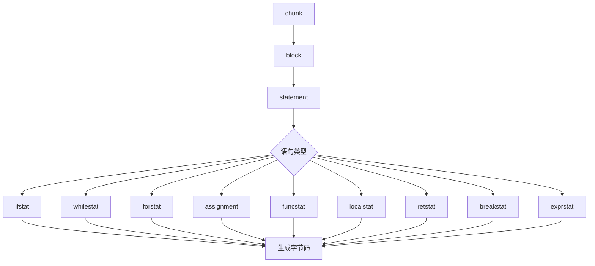
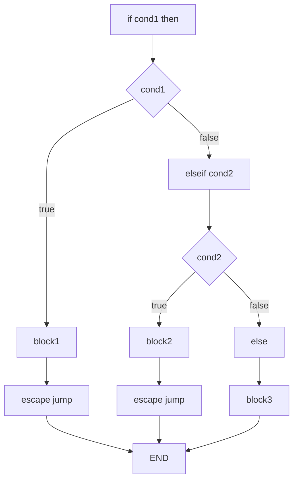
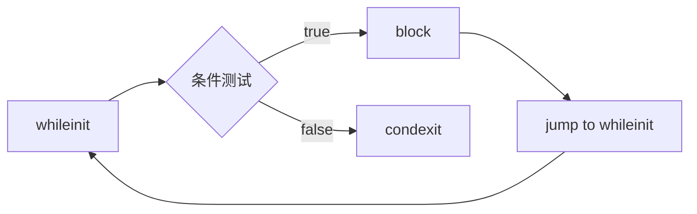

# 📝 语句解析实现细节

> **技术深度**：⭐⭐⭐⭐  
> **预计阅读时间**：30分钟  
> **前置知识**：[递归下降解析](recursive_descent.md)、[表达式解析](expression_parsing.md)

---

## 📋 目录

- [概述](#概述)
- [赋值语句解析](#赋值语句解析)
- [控制流语句解析](#控制流语句解析)
- [函数相关语句](#函数相关语句)
- [块和作用域管理](#块和作用域管理)
- [特殊语句处理](#特殊语句处理)
- [代码生成示例](#代码生成示例)
- [性能优化技巧](#性能优化技巧)
- [调试与实践指南](#调试与实践指南)

---

## 🎯 概述

语句解析是 Lua 编译器的核心部分，负责将源代码中的各种语句转换为字节码指令。Lua 支持丰富的语句类型，每种语句都有其特定的解析逻辑和代码生成策略。

### Lua 语句分类

Lua 5.1.5 支持以下语句类型：

```lua
-- 1. 赋值语句
local x = 10
a, b, c = 1, 2, 3
t.field = value

-- 2. 控制流语句
if condition then ... end
while condition do ... end
repeat ... until condition
for i = 1, 10 do ... end
for k, v in pairs(t) do ... end

-- 3. 函数相关
function f(x) ... end
local function f(x) ... end
return x, y, z

-- 4. 块结构
do ... end
break

-- 5. 其他
; -- 空语句
func_call(args) -- 函数调用语句
```

### 语句解析架构



### 解析入口：statement 函数

```c
// 来自 lparser.c
static void statement(LexState *ls) {
    int line = ls->linenumber;  // 保存行号用于调试信息
    
    switch (ls->t.token) {
        case TK_IF: {      // if ... then ... end
            ifstat(ls, line);
            return;
        }
        case TK_WHILE: {   // while ... do ... end
            whilestat(ls, line);
            return;
        }
        case TK_DO: {      // do ... end
            next(ls);
            block(ls);
            check_match(ls, TK_END, TK_DO, line);
            return;
        }
        case TK_FOR: {     // for ... do ... end
            forstat(ls, line);
            return;
        }
        case TK_REPEAT: {  // repeat ... until ...
            repeatstat(ls, line);
            return;
        }
        case TK_FUNCTION: {
            funcstat(ls, line);
            return;
        }
        case TK_LOCAL: {   // local ...
            next(ls);
            if (testnext(ls, TK_FUNCTION))  // local function
                localfunc(ls);
            else
                localstat(ls);
            return;
        }
        case TK_RETURN: {  // return ...
            retstat(ls);
            return;
        }
        case TK_BREAK: {   // break
            next(ls);
            breakstat(ls);
            return;
        }
        default: {
            exprstat(ls);  // 赋值或函数调用
            return;
        }
    }
}
```

### 语句类型详解

| 语句类型 | Token | 解析函数 | 难度 | 说明 |
|---------|-------|---------|------|------|
| **if 语句** | `TK_IF` | `ifstat()` | ⭐⭐⭐⭐ | 条件分支，需处理跳转链表 |
| **while 循环** | `TK_WHILE` | `whilestat()` | ⭐⭐⭐ | 循环结构，需处理 break |
| **repeat 循环** | `TK_REPEAT` | `repeatstat()` | ⭐⭐⭐ | 后测试循环 |
| **for 数值型** | `TK_FOR` | `fornum()` | ⭐⭐⭐⭐ | 数值循环优化 |
| **for 泛型** | `TK_FOR` | `forlist()` | ⭐⭐⭐⭐⭐ | 迭代器循环 |
| **函数定义** | `TK_FUNCTION` | `funcstat()` | ⭐⭐⭐⭐⭐ | 函数作用域和闭包 |
| **局部变量** | `TK_LOCAL` | `localstat()` | ⭐⭐⭐ | 作用域管理 |
| **return** | `TK_RETURN` | `retstat()` | ⭐⭐⭐ | 函数返回 |
| **break** | `TK_BREAK` | `breakstat()` | ⭐⭐ | 循环跳出 |
| **赋值** | - | `assignment()` | ⭐⭐⭐⭐ | 左值解析，多重赋值 |
| **函数调用** | - | `exprstat()` | ⭐⭐ | 表达式语句 |
| **do 块** | `TK_DO` | `block()` | ⭐⭐ | 作用域块 |

### block 和 chunk 的关系

```c
// chunk = 文件顶层
static void chunk(LexState *ls) {
    block(ls);
}

// block = 语句序列 + 作用域
static void block(LexState *ls) {
    FuncState *fs = ls->fs;
    BlockCnt bl;
    
    enterblock(fs, &bl, 0);  // 进入新作用域
    
    // 解析所有语句
    while (!block_follow(ls->t.token)) {
        statement(ls);
        testnext(ls, ';');  // 可选的分号
    }
    
    leaveblock(fs);  // 离开作用域
}

// 块结束标志
static int block_follow(int token) {
    switch (token) {
        case TK_ELSE: case TK_ELSEIF: case TK_END:
        case TK_UNTIL: case TK_EOS:
            return 1;
        default: return 0;
    }
}
```

### 语句解析的关键数据结构

**BlockCnt - 块控制结构**：

```c
typedef struct BlockCnt {
    struct BlockCnt *previous;  // 外层块
    int breaklist;              // break 语句跳转链表
    lu_byte nactvar;            // 块内活动局部变量数
    lu_byte upval;              // 块内是否有 upvalue
    lu_byte isbreakable;        // 是否可以使用 break
} BlockCnt;
```

**expdesc - 表达式描述符**（用于左值和右值）：

```c
typedef struct expdesc {
    expkind k;              // 表达式类型
    union {
        struct { int info; int aux; } s;
        lua_Number nval;    // 数字字面量
    } u;
    int t;                  // true 跳转链表
    int f;                  // false 跳转链表
} expdesc;
```

### 核心概念：跳转链表

Lua 使用**跳转链表**（Jump List）延迟修正跳转目标地址：

```c
// 跳转指令初始时目标地址未知
JMP pc -> ???

// 后续修正为实际地址
JMP pc -> target_pc
```

**工作流程**：


**关键函数**：

```c
// 生成跳转指令并返回其 PC
int luaK_jump(FuncState *fs);

// 将跳转链表 list 中的所有跳转修正到 target
void luaK_patchlist(FuncState *fs, int list, int target);

// 合并两个跳转链表
void luaK_concat(FuncState *fs, int *l1, int l2);

// 修正跳转到当前 PC
void luaK_patchtohere(FuncState *fs, int list);
```

### 语句解析的通用流程

```
1. 识别语句类型（通过当前 Token）
2. 检查语法（expect、check_match 等）
3. 管理作用域（enterblock/leaveblock）
4. 解析子表达式和子语句
5. 生成字节码指令
6. 修正跳转地址（如有）
7. 更新调试信息
```

---

## 💾 赋值语句解析

赋值语句是 Lua 中最常见的语句之一，支持多重赋值、表索引赋值等复杂形式。

### 语法规则

```lua
-- 简单赋值
x = 1

-- 多重赋值
a, b, c = 1, 2, 3

-- 表索引赋值
t[k] = v
t.field = value

-- 局部变量赋值
local x = 1
local a, b = 1, 2

-- 混合赋值
local x, t[k], y = f(), g(), h()
```

### exprstat 函数：赋值或函数调用

```c
static void exprstat(LexState *ls) {
    FuncState *fs = ls->fs;
    struct LHS_assign v;
    
    primaryexp(ls, &v.v);  // 解析第一个表达式
    
    if (v.v.k == VCALL) {  // 函数调用语句
        SETARG_C(getcode(fs, &v.v), 1);  // 调整返回值数量
    }
    else {  // 赋值语句
        v.prev = NULL;
        assignment(ls, &v, 1);
    }
}
```

### assignment 函数：多重赋值核心

```c
static void assignment(LexState *ls, struct LHS_assign *lh, int nvars) {
    expdesc e;
    
    check_condition(ls, VLOCAL <= lh->v.k && lh->v.k <= VINDEXED,
                    "syntax error");
    
    if (testnext(ls, ',')) {  // 还有更多左值
        struct LHS_assign nv;
        nv.prev = lh;
        primaryexp(ls, &nv.v);
        
        if (nv.v.k == VLOCAL)
            check_conflict(ls, lh, &nv.v);
        
        assignment(ls, &nv, nvars + 1);
    }
    else {  // 没有更多左值，开始解析右值
        int nexps;
        checknext(ls, '=');
        nexps = explist1(ls, &e);
        
        if (nexps != nvars) {
            adjust_assign(ls, nvars, nexps, &e);
            if (nexps > nvars)
                ls->fs->freereg -= nexps - nvars;  // 移除多余值
        }
        else {
            luaK_setoneret(ls->fs, &e);  // 关闭多返回值
            luaK_storevar(ls->fs, &lh->v, &e);
            return;  // 避免默认赋值
        }
    }
    
    init_exp(&e, VNONRELOC, ls->fs->freereg - 1);  // 默认赋值
    luaK_storevar(ls->fs, &lh->v, &e);
}
```

### LHS_assign 结构：左值链表

```c
struct LHS_assign {
    struct LHS_assign *prev;  // 前一个左值
    expdesc v;                // 当前左值表达式
};
```

**示例：解析 `a, b, c = 1, 2, 3`**

```
调用栈：
assignment(lh={v=a, prev=NULL}, nvars=1)
  -> testnext(',') = true
  -> assignment(lh={v=b, prev=&{v=a}}, nvars=2)
    -> testnext(',') = true
    -> assignment(lh={v=c, prev=&{v=b, prev=&{v=a}}}, nvars=3)
      -> testnext(',') = false
      -> checknext('=')
      -> explist1() 解析 1, 2, 3，返回 nexps=3
      -> adjust_assign(nvars=3, nexps=3, ...)
      -> 生成赋值代码：
         c = 3
         b = 2
         a = 1
```

### 左值解析：primaryexp 和 suffixedexp

```c
static void primaryexp(LexState *ls, expdesc *v) {
    switch (ls->t.token) {
        case '(': {
            int line = ls->linenumber;
            next(ls);
            expr(ls, v);
            check_match(ls, ')', '(', line);
            luaK_dischargevars(ls->fs, v);
            return;
        }
        case TK_NAME: {
            singlevar(ls, v);
            return;
        }
        default: {
            luaX_syntaxerror(ls, "unexpected symbol");
            return;
        }
    }
}

static void suffixedexp(LexState *ls, expdesc *v) {
    FuncState *fs = ls->fs;
    int line = ls->linenumber;
    
    primaryexp(ls, v);
    
    for (;;) {
        switch (ls->t.token) {
            case '.': {  // t.field
                fieldsel(ls, v);
                break;
            }
            case '[': {  // t[exp]
                expdesc key;
                luaK_exp2anyreg(fs, v);
                yindex(ls, &key);
                luaK_indexed(fs, v, &key);
                break;
            }
            case ':': {  // t:method(args)
                expdesc key;
                next(ls);
                checkname(ls, &key);
                luaK_self(fs, v, &key);
                funcargs(ls, v);
                break;
            }
            case '(': case TK_STRING: case '{': {  // 函数调用
                luaK_exp2nextreg(fs, v);
                funcargs(ls, v);
                break;
            }
            default: return;
        }
    }
}
```

### 右值解析：explist1

```c
static int explist1(LexState *ls, expdesc *v) {
    int n = 1;  // 至少一个表达式
    expr(ls, v);
    
    while (testnext(ls, ',')) {
        luaK_exp2nextreg(ls->fs, v);
        expr(ls, v);
        n++;
    }
    return n;
}
```

### adjust_assign：调整赋值数量

```c
static void adjust_assign(LexState *ls, int nvars, int nexps, expdesc *e) {
    FuncState *fs = ls->fs;
    int extra = nvars - nexps;
    
    if (hasmultret(e->k)) {
        extra++;  // 包括多返回值调用本身
        if (extra < 0) extra = 0;
        luaK_setreturns(fs, e, extra);  // 调整返回值数量
        if (extra > 1) luaK_reserveregs(fs, extra - 1);
    }
    else {
        if (e->k != VVOID) luaK_exp2nextreg(fs, e);  // 关闭最后一个表达式
        if (extra > 0) {
            int reg = fs->freereg;
            luaK_reserveregs(fs, extra);
            luaK_nil(fs, reg, extra);  // 剩余变量赋 nil
        }
    }
}
```

### 示例：不等长赋值

**情况 1：右值更多**

```lua
a, b = 1, 2, 3
```

```
nexps = 3, nvars = 2
extra = 2 - 3 = -1

生成代码：
LOADK R0 1
LOADK R1 2
-- 3 被丢弃
```

**情况 2：右值更少**

```lua
a, b, c = 1, 2
```

```
nexps = 2, nvars = 3
extra = 3 - 2 = 1

生成代码：
LOADK R0 1
LOADK R1 2
LOADNIL R2 1    -- c = nil
```

**情况 3：多返回值函数**

```lua
a, b, c = f()
```

```
nexps = 1（但 f() 可以返回多个值）
nvars = 3
extra = 3 - 1 + 1 = 3

生成代码：
CALL Rf 1 4     -- 调用 f()，期望 3 个返回值
MOVE R0 Rf
MOVE R1 Rf+1
MOVE R2 Rf+2
```

### luaK_storevar：存储到左值

```c
void luaK_storevar(FuncState *fs, expdesc *var, expdesc *ex) {
    switch (var->k) {
        case VLOCAL: {  // 局部变量
            freeexp(fs, ex);
            exp2reg(fs, ex, var->u.s.info);
            return;
        }
        case VUPVAL: {  // upvalue
            int e = luaK_exp2anyreg(fs, ex);
            luaK_codeABC(fs, OP_SETUPVAL, e, var->u.s.info, 0);
            break;
        }
        case VGLOBAL: {  // 全局变量
            int e = luaK_exp2anyreg(fs, ex);
            luaK_codeABx(fs, OP_SETGLOBAL, e, var->u.s.info);
            break;
        }
        case VINDEXED: {  // 表索引
            int e = luaK_exp2RK(fs, ex);
            luaK_codeABC(fs, OP_SETTABLE, var->u.s.info, var->u.s.aux, e);
            break;
        }
        default: {
            lua_assert(0);
            break;
        }
    }
    freeexp(fs, ex);
}
```

### 字节码生成示例

**示例 1：简单赋值**

```lua
local x = 10
```

```
LOADK R0 K0     ; K0 = 10
```

**示例 2：多重赋值**

```lua
local a, b = 1, 2
```

```
LOADK R0 K0     ; K0 = 1
LOADK R1 K1     ; K1 = 2
```

**示例 3：表索引赋值**

```lua
t[k] = v
```

```
GETGLOBAL R0 't'
GETGLOBAL R1 'k'
GETGLOBAL R2 'v'
SETTABLE R0 R1 R2
```

**示例 4：链式赋值**

```lua
a = b = c = 1  -- Lua 不支持！必须写成
c = 1
b = c
a = b
```

---

## 🔀 控制流语句解析

控制流语句是程序逻辑的核心，Lua 支持 `if`、`while`、`repeat`、`for` 等多种控制结构。

### if 语句解析

**语法**：

```lua
if exp then block
elseif exp then block
else block
end
```

**ifstat 函数**：

```c
static void ifstat(LexState *ls, int line) {
    FuncState *fs = ls->fs;
    int flist;
    int escapelist = NO_JUMP;
    
    flist = test_then_block(ls);  // IF 或 ELSEIF
    
    while (ls->t.token == TK_ELSEIF) {
        luaK_concat(fs, &escapelist, luaK_jump(fs));
        luaK_patchtohere(fs, flist);
        flist = test_then_block(ls);
    }
    
    if (ls->t.token == TK_ELSE) {
        luaK_concat(fs, &escapelist, luaK_jump(fs));
        luaK_patchtohere(fs, flist);
        next(ls);  // 跳过 ELSE
        block(ls);
    }
    else {
        luaK_concat(fs, &escapelist, flist);
    }
    
    luaK_patchtohere(fs, escapelist);
    check_match(ls, TK_END, TK_IF, line);
}
```

**test_then_block：解析条件和then块**

```c
static int test_then_block(LexState *ls) {
    int condexit;
    next(ls);  // 跳过 IF 或 ELSEIF
    
    expdesc v;
    expr(ls, &v);  // 解析条件表达式
    checknext(ls, TK_THEN);
    
    condexit = luaK_goiffalse(ls->fs, &v);  // 条件为假时跳转
    block(ls);  // then 块
    
    return condexit;
}
```

**跳转链表管理**：



**字节码示例**：

```lua
if x > 10 then
    print("big")
elseif x > 5 then
    print("medium")
else
    print("small")
end
```

```
GETGLOBAL R0 'x'
LT 0 K0 R0      ; K0 = 10, 如果 !(10 < x) 则跳转
JMP [7]         ; 跳到 elseif

; then block
GETGLOBAL R0 'print'
LOADK R1 K1     ; K1 = "big"
CALL R0 2 1
JMP [16]        ; 跳到 END

; elseif
GETGLOBAL R0 'x'
LT 0 K2 R0      ; K2 = 5
JMP [14]        ; 跳到 else

; elseif then block
GETGLOBAL R0 'print'
LOADK R1 K3     ; K3 = "medium"
CALL R0 2 1
JMP [16]

; else block
GETGLOBAL R0 'print'
LOADK R1 K4     ; K4 = "small"
CALL R0 2 1

; END
```

### while 语句解析

**语法**：

```lua
while exp do block end
```

**whilestat 函数**：

```c
static void whilestat(LexState *ls, int line) {
    FuncState *fs = ls->fs;
    int whileinit;
    int condexit;
    BlockCnt bl;
    
    next(ls);  // 跳过 WHILE
    whileinit = luaK_getlabel(fs);  // 循环开始位置
    
    expdesc v;
    expr(ls, &v);
    condexit = luaK_goiffalse(fs, &v);  // 条件为假时跳出
    
    enterblock(fs, &bl, 1);  // 可 break 的块
    checknext(ls, TK_DO);
    block(ls);
    
    luaK_patchlist(fs, luaK_jump(fs), whileinit);  // 跳回循环开始
    check_match(ls, TK_END, TK_WHILE, line);
    leaveblock(fs);
    
    luaK_patchtohere(fs, condexit);  // 修正退出跳转
}
```

**循环结构**：



**字节码示例**：

```lua
local i = 1
while i <= 10 do
    print(i)
    i = i + 1
end
```

```
LOADK R0 K0     ; K0 = 1, i = 1

; whileinit
LE 1 R0 K1      ; K1 = 10, i <= 10?
JMP [9]         ; 为假则跳出

; block
GETGLOBAL R1 'print'
MOVE R2 R0
CALL R1 2 1
ADD R0 R0 K2    ; K2 = 1, i = i + 1
JMP [2]         ; 跳回 whileinit

; condexit
```

### repeat 语句解析

**语法**：

```lua
repeat block until exp
```

**repeatstat 函数**：

```c
static void repeatstat(LexState *ls, int line) {
    int condexit;
    FuncState *fs = ls->fs;
    int repeat_init = luaK_getlabel(fs);
    BlockCnt bl1, bl2;
    
    enterblock(fs, &bl1, 1);  // 可 break 的块
    enterblock(fs, &bl2, 0);  // 内层块（用于 until 中的局部变量）
    
    next(ls);  // 跳过 REPEAT
    chunk(ls);  // 注意：这里用 chunk 而非 block
    check_match(ls, TK_UNTIL, TK_REPEAT, line);
    
    expdesc v;
    expr(ls, &v);  // until 条件
    condexit = luaK_goiftrue(fs, &v);  // 条件为真时跳出
    
    leaveblock(fs);  // 离开内层块
    luaK_patchlist(fs, condexit, repeat_init);  // 条件为假时回到开始
    leaveblock(fs);  // 离开外层块
}
```

**repeat vs while 的区别**：

| 特性 | while | repeat |
|------|-------|--------|
| **测试时机** | 前测试（pre-test） | 后测试（post-test） |
| **最少执行** | 0 次 | 1 次 |
| **作用域** | block 独立作用域 | until 可访问 block 中的变量 |

**示例：作用域差异**

```lua
-- repeat 可以：
repeat
    local x = get_input()
until x == "quit"  -- x 可见

-- while 不行：
while true do
    local x = get_input()
    if x == "quit" then break end  -- 必须这样写
end
```

**字节码示例**：

```lua
local i = 1
repeat
    print(i)
    i = i + 1
until i > 10
```

```
LOADK R0 K0     ; K0 = 1

; repeat_init
GETGLOBAL R1 'print'
MOVE R2 R0
CALL R1 2 1
ADD R0 R0 K1    ; K1 = 1
LT 0 K2 R0      ; K2 = 10, i > 10?
JMP [2]         ; 为假则回到 repeat_init
```

### for 数值型循环

**语法**：

```lua
for var = exp1, exp2, exp3 do block end
-- exp3 可选，默认为 1
```

**fornum 函数**：

```c
static void fornum(LexState *ls, TString *varname, int line) {
    FuncState *fs = ls->fs;
    int base = fs->freereg;
    
    new_localvarliteral(ls, "(for index)", 0);
    new_localvarliteral(ls, "(for limit)", 1);
    new_localvarliteral(ls, "(for step)", 2);
    new_localvar(ls, varname, 3);  // 循环变量
    
    checknext(ls, '=');
    exp1(ls);  // 初始值
    checknext(ls, ',');
    exp1(ls);  // 限制值
    
    if (testnext(ls, ','))
        exp1(ls);  // 步长
    else {
        luaK_codeABx(fs, OP_LOADK, fs->freereg, luaK_numberK(fs, 1));
        luaK_reserveregs(fs, 1);
    }
    
    forbody(ls, base, line, 1, 1);
}
```

**forbody 函数**：

```c
static void forbody(LexState *ls, int base, int line, int nvars, int isnum) {
    BlockCnt bl;
    FuncState *fs = ls->fs;
    int prep, endfor;
    
    adjustlocalvars(ls, 3);  // 初始化控制变量
    checknext(ls, TK_DO);
    
    prep = isnum ? luaK_codeAsBx(fs, OP_FORPREP, base, NO_JUMP) : luaK_jump(fs);
    
    enterblock(fs, &bl, 0);
    adjustlocalvars(ls, nvars);
    luaK_reserveregs(fs, nvars);
    block(ls);
    leaveblock(fs);
    
    luaK_patchtohere(fs, prep);
    endfor = (isnum) ? luaK_codeAsBx(fs, OP_FORLOOP, base, NO_JUMP) :
                       luaK_codeABC(fs, OP_TFORLOOP, base, 0, nvars);
    luaK_fixline(fs, line);
    luaK_patchlist(fs, (isnum ? endfor : luaK_jump(fs)), prep + 1);
}
```

**for 循环的内部变量**：

```
寄存器布局：
base + 0: (for index)  -- 当前索引
base + 1: (for limit)  -- 限制值
base + 2: (for step)   -- 步长
base + 3: var          -- 用户可见的循环变量
```

**FORPREP 和 FORLOOP 指令**：

```c
// FORPREP: 初始化循环
// R(A) -= R(A+2)  // index -= step（因为 FORLOOP 会先加）
// pc += sBx       // 跳到循环体

// FORLOOP: 循环迭代
// R(A) += R(A+2)  // index += step
// if R(A) <?= R(A+1) then {  // 根据 step 符号判断
//     pc += sBx   // 继续循环
//     R(A+3) = R(A)  // 更新用户变量
// }
```

**字节码示例**：

```lua
for i = 1, 10, 2 do
    print(i)
end
```

```
LOADK R0 K0     ; K0 = 1, (for index)
LOADK R1 K1     ; K1 = 10, (for limit)
LOADK R2 K2     ; K2 = 2, (for step)
FORPREP R0 [8]  ; 跳到循环体

; loop body
GETGLOBAL R4 'print'
MOVE R5 R3      ; R3 = i（用户变量）
CALL R4 2 1
FORLOOP R0 [4]  ; 继续循环或退出
```

### for 泛型循环

**语法**：

```lua
for var1, var2, ... in explist do block end
```

**forlist 函数**：

```c
static void forlist(LexState *ls, TString *indexname) {
    FuncState *fs = ls->fs;
    expdesc e;
    int nvars = 0;
    int line;
    int base = fs->freereg;
    
    // 不可见的控制变量
    new_localvarliteral(ls, "(for generator)", nvars++);
    new_localvarliteral(ls, "(for state)", nvars++);
    new_localvarliteral(ls, "(for control)", nvars++);
    
    // 用户变量
    new_localvar(ls, indexname, nvars++);
    while (testnext(ls, ','))
        new_localvar(ls, str_checkname(ls), nvars++);
    
    checknext(ls, TK_IN);
    line = ls->linenumber;
    adjust_assign(ls, 3, explist1(ls, &e), &e);
    luaK_checkstack(fs, 3);  // 预留空间
    
    forbody(ls, base, line, nvars - 3, 0);
}
```

**泛型 for 的内部变量**：

```
寄存器布局：
base + 0: (for generator)  -- 迭代器函数
base + 1: (for state)      -- 状态变量
base + 2: (for control)    -- 控制变量
base + 3: var1             -- 用户变量 1
base + 4: var2             -- 用户变量 2
...
```

**TFORLOOP 指令**：

```c
// TFORLOOP: 泛型循环迭代
// R(A+3), ..., R(A+2+C) = R(A)(R(A+1), R(A+2))  // 调用迭代器
// if R(A+3) ~= nil then {
//     R(A+2) = R(A+3)  // 更新控制变量
//     pc += sBx        // 继续循环
// }
```

**字节码示例**：

```lua
for k, v in pairs(t) do
    print(k, v)
end
```

```
GETGLOBAL R0 'pairs'
GETGLOBAL R1 't'
CALL R0 2 4     ; 调用 pairs(t)，期望 3 个返回值
; R0 = generator, R1 = state, R2 = control
JMP [8]         ; 跳到循环体

; loop body
GETGLOBAL R5 'print'
MOVE R6 R3      ; R3 = k
MOVE R7 R4      ; R4 = v
CALL R5 3 1
TFORLOOP R0 2   ; 继续迭代
JMP [4]         ; 回到循环体
```

---

## 🔧 函数相关语句

函数定义和调用是 Lua 的核心特性，涉及作用域、闭包、参数传递等复杂机制。

### 函数定义语句

**语法**：

```lua
function name(params) body end
function t.method(params) body end
function t:method(params) body end  -- 隐式 self 参数
local function name(params) body end
```

**funcstat 函数：全局函数**

```c
static void funcstat(LexState *ls, int line) {
    expdesc v, b;
    
    next(ls);  // 跳过 FUNCTION
    
    int needself = funcname(ls, &v);  // 解析函数名
    body(ls, &b, needself, line);     // 解析函数体
    luaK_storevar(ls->fs, &v, &b);    // 存储到变量
    luaK_fixline(ls->fs, line);
}
```

**funcname 函数：解析函数名**

```c
static int funcname(LexState *ls, expdesc *v) {
    int needself = 0;
    
    singlevar(ls, v);  // 第一个名字
    
    while (ls->t.token == '.') {
        fieldsel(ls, v);  // t.field
    }
    
    if (ls->t.token == ':') {
        needself = 1;
        fieldsel(ls, v);  // t:method（需要隐式 self）
    }
    
    return needself;
}
```

**示例解析**：

```lua
function math.add(a, b)
    return a + b
end
```

解析过程：
1. `funcname()` 解析 `math.add`，返回 `needself=0`
2. `body()` 创建新的 `FuncState`，解析参数和函数体
3. `luaK_storevar()` 生成 `SETTABLE` 指令

**字节码**：

```
GETGLOBAL R0 'math'
CLOSURE R1 <function>
SETTABLE R0 K0 R1   ; K0 = "add"

; <function> 的原型：
function <math.add>:
    ADD R2 R0 R1    ; R0=a, R1=b
    RETURN R2 2
```

### body 函数：解析函数体

```c
static void body(LexState *ls, expdesc *e, int needself, int line) {
    FuncState new_fs;
    open_func(ls, &new_fs);
    new_fs.f->linedefined = line;
    
    checknext(ls, '(');
    
    if (needself) {
        new_localvarliteral(ls, "self", 0);
        adjustlocalvars(ls, 1);
    }
    
    parlist(ls);  // 解析参数列表
    checknext(ls, ')');
    chunk(ls);    // 解析函数体
    new_fs.f->lastlinedefined = ls->linenumber;
    check_match(ls, TK_END, TK_FUNCTION, line);
    
    close_func(ls);
    pushclosure(ls, &new_fs, e);
}
```

**open_func 和 close_func**：

```c
static void open_func(LexState *ls, FuncState *fs) {
    lua_State *L = ls->L;
    Proto *f = luaF_newproto(L);
    
    fs->f = f;
    fs->prev = ls->fs;  // 链接到外层函数
    fs->ls = ls;
    fs->L = L;
    ls->fs = fs;
    
    fs->pc = 0;
    fs->lasttarget = -1;
    fs->jpc = NO_JUMP;
    fs->freereg = 0;
    fs->nk = 0;
    fs->np = 0;
    fs->nlocvars = 0;
    fs->nactvar = 0;
    fs->bl = NULL;
    f->source = ls->source;
    f->maxstacksize = 2;  // 最小栈大小
}

static void close_func(LexState *ls) {
    lua_State *L = ls->L;
    FuncState *fs = ls->fs;
    Proto *f = fs->f;
    
    removevars(ls, 0);  // 移除所有局部变量
    luaK_ret(fs, 0, 0);  // 添加默认 return
    
    // 调整数组大小
    luaM_reallocvector(L, f->code, f->sizecode, fs->pc, Instruction);
    f->sizecode = fs->pc;
    luaM_reallocvector(L, f->lineinfo, f->sizelineinfo, fs->pc, int);
    f->sizelineinfo = fs->pc;
    luaM_reallocvector(L, f->k, f->sizek, fs->nk, TValue);
    f->sizek = fs->nk;
    luaM_reallocvector(L, f->p, f->sizep, fs->np, Proto *);
    f->sizep = fs->np;
    luaM_reallocvector(L, f->locvars, f->sizelocvars, fs->nlocvars, LocVar);
    f->sizelocvars = fs->nlocvars;
    luaM_reallocvector(L, f->upvalues, f->sizeupvalues, f->nups, TString *);
    f->sizeupvalues = f->nups;
    
    ls->fs = fs->prev;  // 恢复外层函数
}
```

### parlist 函数：参数列表解析

```c
static void parlist(LexState *ls) {
    FuncState *fs = ls->fs;
    Proto *f = fs->f;
    int nparams = 0;
    
    f->is_vararg = 0;
    
    if (ls->t.token != ')') {
        do {
            switch (ls->t.token) {
                case TK_NAME: {
                    new_localvar(ls, str_checkname(ls), nparams++);
                    break;
                }
                case TK_DOTS: {
                    next(ls);
                    f->is_vararg = VARARG_HASARG | VARARG_NEEDSARG;
                    break;
                }
                default: luaX_syntaxerror(ls, "<name> or " LUA_QL("...") " expected");
            }
        } while (!f->is_vararg && testnext(ls, ','));
    }
    
    adjustlocalvars(ls, nparams);
    f->numparams = cast_byte(fs->nactvar - (f->is_vararg & VARARG_HASARG));
    luaK_reserveregs(fs, fs->nactvar);  // 为参数预留寄存器
}
```

**可变参数函数**：

```lua
function f(a, b, ...)
    local args = {...}
    return a + b + #args
end
```

```c
// is_vararg 标志位：
#define VARARG_HASARG    1  // 有 ... 参数
#define VARARG_ISVARARG  2  // 是 vararg 函数（兼容性）
#define VARARG_NEEDSARG  4  // 需要创建 arg 表（已废弃）
```

### localfunc 函数：局部函数

```c
static void localfunc(LexState *ls) {
    expdesc v, b;
    FuncState *fs = ls->fs;
    
    new_localvar(ls, str_checkname(ls), 0);  // 先声明变量
    init_exp(&v, VLOCAL, fs->freereg);
    luaK_reserveregs(fs, 1);
    adjustlocalvars(ls, 1);  // 立即激活（允许递归）
    
    body(ls, &b, 0, ls->linenumber);
    luaK_storevar(fs, &v, &b);
    
    // 修正调试信息（变量在函数体开始处才真正定义）
    getlocvar(fs, fs->nactvar - 1).startpc = fs->pc;
}
```

**局部函数 vs 全局函数**：

```lua
-- 局部函数：可以递归
local function fact(n)
    if n <= 1 then return 1
    else return n * fact(n - 1)  -- fact 已经在作用域中
    end
end

-- 全局函数：也可以递归（通过全局名字）
function fact2(n)
    if n <= 1 then return 1
    else return n * fact2(n - 1)
    end
end

-- 错误示例：
local fact3 = function(n)  -- fact3 还未定义
    if n <= 1 then return 1
    else return n * fact3(n - 1)  -- 错误：fact3 是 nil
    end
end
```

### return 语句

**语法**：

```lua
return
return exp
return exp1, exp2, ...
```

**retstat 函数**：

```c
static void retstat(LexState *ls) {
    FuncState *fs = ls->fs;
    expdesc e;
    int first, nret;
    
    next(ls);  // 跳过 RETURN
    
    if (block_follow(ls->t.token) || ls->t.token == ';')
        first = nret = 0;  // return（无返回值）
    else {
        nret = explist1(ls, &e);  // 返回值列表
        
        if (hasmultret(e.k)) {
            luaK_setmultret(fs, &e);
            if (e.k == VCALL && nret == 1) {  // 尾调用？
                SET_OPCODE(getcode(fs, &e), OP_TAILCALL);
                lua_assert(GETARG_A(getcode(fs, &e)) == fs->nactvar);
            }
            first = fs->nactvar;
            nret = LUA_MULTRET;  // 返回所有值
        }
        else {
            if (nret == 1)
                first = luaK_exp2anyreg(fs, &e);
            else {
                luaK_exp2nextreg(fs, &e);
                first = fs->nactvar;
                lua_assert(nret == fs->freereg - first);
            }
        }
    }
    
    luaK_ret(fs, first, nret);
}
```

**luaK_ret 函数**：

```c
void luaK_ret(FuncState *fs, int first, int nret) {
    luaK_codeABC(fs, OP_RETURN, first, nret + 1, 0);
}
```

**RETURN 指令**：

```c
// OP_RETURN A B
// return R(A), ..., R(A+B-2)
// B == 0: 返回到栈顶
// B == 1: 无返回值
// B == 2: 返回 R(A)
// B > 2:  返回 R(A) 到 R(A+B-2)
```

**字节码示例**：

```lua
function f()
    return 1, 2, 3
end
```

```
LOADK R0 K0     ; K0 = 1
LOADK R1 K1     ; K1 = 2
LOADK R2 K2     ; K2 = 3
RETURN R0 4     ; 返回 3 个值
```

### 尾调用优化

**尾调用条件**：

```lua
-- 是尾调用
return f()
return f(x)
return t:method(x)

-- 不是尾调用
return f() + 1       -- 有额外运算
return f(), g()      -- 多个返回值
return x, f()        -- f() 不是唯一返回值
local x = f(); return x  -- 中间有其他语句
```

**实现**：

```c
if (e.k == VCALL && nret == 1) {
    SET_OPCODE(getcode(fs, &e), OP_TAILCALL);
    lua_assert(GETARG_A(getcode(fs, &e)) == fs->nactvar);
}
```

**TAILCALL vs CALL**：

| 指令 | 栈管理 | 性能 | 用途 |
|------|--------|------|------|
| `CALL` | 保留调用帧 | 正常 | 普通调用 |
| `TAILCALL` | 重用调用帧 | 优化 | 尾递归优化 |

**示例：尾递归**

```lua
local function sum(n, acc)
    acc = acc or 0
    if n == 0 then return acc
    else return sum(n - 1, acc + n)  -- 尾调用
    end
end
```

生成 `TAILCALL` 而非 `CALL`，避免栈溢出。

---

## 📦 块和作用域管理

块（block）是 Lua 作用域管理的基本单位，每个块都有自己的局部变量和 upvalue。

### enterblock 和 leaveblock

```c
static void enterblock(FuncState *fs, BlockCnt *bl, lu_byte isbreakable) {
    bl->breaklist = NO_JUMP;
    bl->isbreakable = isbreakable;
    bl->nactvar = fs->nactvar;
    bl->upval = 0;
    bl->previous = fs->bl;
    fs->bl = bl;
    lua_assert(fs->freereg == fs->nactvar);
}

static void leaveblock(FuncState *fs) {
    BlockCnt *bl = fs->bl;
    
    fs->bl = bl->previous;
    removevars(fs->ls, bl->nactvar);  // 移除块内局部变量
    
    if (bl->upval)
        luaK_codeABC(fs, OP_CLOSE, bl->nactvar, 0, 0);
    
    fs->freereg = fs->nactvar;
    lua_assert(bl->nactvar == fs->nactvar);
    
    luaK_patchtohere(fs, bl->breaklist);  // 修正 break 跳转
}
```

**BlockCnt 字段说明**：

| 字段 | 类型 | 说明 |
|------|------|------|
| `previous` | `BlockCnt*` | 外层块 |
| `breaklist` | `int` | break 语句跳转链表 |
| `nactvar` | `lu_byte` | 块开始时的活动变量数 |
| `upval` | `lu_byte` | 块内是否有 upvalue |
| `isbreakable` | `lu_byte` | 是否可以使用 break |

### 局部变量生命周期

```c
static void new_localvar(LexState *ls, TString *name, int n) {
    FuncState *fs = ls->fs;
    luaX_checklimit(ls, fs->nactvar + n + 1, LUAI_MAXVARS, "local variables");
    fs->actvar[fs->nactvar + n] = cast(unsigned short, registerlocalvar(ls, name));
}

static int registerlocalvar(LexState *ls, TString *varname) {
    FuncState *fs = ls->fs;
    Proto *f = fs->f;
    int oldsize = f->sizelocvars;
    
    luaM_growvector(ls->L, f->locvars, fs->nlocvars, f->sizelocvars,
                    LocVar, SHRT_MAX, "too many local variables");
    
    while (oldsize < f->sizelocvars) f->locvars[oldsize++].varname = NULL;
    
    f->locvars[fs->nlocvars].varname = varname;
    luaC_objbarrier(ls->L, f, varname);
    return fs->nlocvars++;
}

static void adjustlocalvars(LexState *ls, int nvars) {
    FuncState *fs = ls->fs;
    fs->nactvar = cast_byte(fs->nactvar + nvars);
    for (; nvars; nvars--) {
        getlocvar(fs, fs->nactvar - nvars).startpc = fs->pc;
    }
}

static void removevars(LexState *ls, int tolevel) {
    FuncState *fs = ls->fs;
    while (fs->nactvar > tolevel)
        getlocvar(fs, --fs->nactvar).endpc = fs->pc;
}
```

**LocVar 结构**：

```c
typedef struct LocVar {
    TString *varname;  // 变量名
    int startpc;       // 作用域起始 PC
    int endpc;         // 作用域结束 PC
} LocVar;
```

**示例：作用域嵌套**

```lua
do
    local x = 1  -- startpc = 0
    do
        local y = 2  -- startpc = 2
        print(x, y)
    end  -- y.endpc = 5
    print(x)
end  -- x.endpc = 7
```

### break 语句处理

```c
static void breakstat(LexState *ls) {
    FuncState *fs = ls->fs;
    BlockCnt *bl = fs->bl;
    int upval = 0;
    
    while (bl && !bl->isbreakable) {
        upval |= bl->upval;
        bl = bl->previous;
    }
    
    if (!bl)
        luaX_syntaxerror(ls, "no loop to break");
    
    if (upval)
        luaK_codeABC(fs, OP_CLOSE, bl->nactvar, 0, 0);
    
    luaK_concat(fs, &bl->breaklist, luaK_jump(fs));
}
```

**break 的限制**：

```lua
-- 正确
while condition do
    if x then break end
end

-- 错误：不在循环中
if condition then
    break  -- syntax error: no loop to break
end

-- 错误：Lua 5.1 不支持 continue
for i = 1, 10 do
    if i % 2 == 0 then
        continue  -- syntax error（Lua 5.1）
    end
    print(i)
end
```

### localstat 函数：局部变量声明

```c
static void localstat(LexState *ls) {
    int nvars = 0;
    int nexps;
    expdesc e;
    
    do {
        new_localvar(ls, str_checkname(ls), nvars++);
    } while (testnext(ls, ','));
    
    if (testnext(ls, '='))
        nexps = explist1(ls, &e);
    else {
        e.k = VVOID;
        nexps = 0;
    }
    
    adjust_assign(ls, nvars, nexps, &e);
    adjustlocalvars(ls, nvars);
}
```

**示例**：

```lua
local a, b, c = 1, 2
-- nvars = 3, nexps = 2
-- a = 1, b = 2, c = nil
```

---

## 🔀 特殊语句处理

### do-end 块

**语法**：

```lua
do
    -- block
end
```

**实现**（在 statement 函数中）：

```c
case TK_DO: {
    next(ls);
    block(ls);
    check_match(ls, TK_END, TK_DO, line);
    return;
}
```

**用途**：

```lua
-- 限制变量作用域
do
    local temp = expensive_calculation()
    result = process(temp)
end  -- temp 被回收

-- 模拟 continue
for i = 1, 10 do
    if condition then
        -- ... code ...
    end
    ::continue::  -- Lua 5.2+
end
```

### 多返回值处理

**hasmultret 函数**：

```c
static int hasmultret(expkind k) {
    return (k == VCALL || k == VVARARG);
}
```

**luaK_setmultret 函数**：

```c
void luaK_setmultret(FuncState *fs, expdesc *e) {
    if (e->k == VCALL) {
        SETARG_C(getcode(fs, e), LUA_MULTRET);
    }
    else if (e->k == VVARARG) {
        SETARG_B(getcode(fs, e), LUA_MULTRET);
        SETARG_A(getcode(fs, e), fs->freereg);
        luaK_reserveregs(fs, 1);
    }
}
```

**示例**：

```lua
-- 情况 1：赋值给多个变量
local a, b, c = f()
-- CALL Rf 1 0  (C=0 表示多返回值)

-- 情况 2：作为最后一个参数
g(1, 2, f())
-- CALL Rf 1 0
-- CALL Rg 4 1  (传递 1, 2, 和 f() 的所有返回值)

-- 情况 3：表构造器
t = {1, 2, f()}
-- CALL Rf 1 0
-- SETLIST ...（包含 f() 的所有返回值）

-- 情况 4：return 语句
return f()
-- TAILCALL Rf 1 0
-- RETURN Rf 0
```

### 空语句和分号

```c
static void statement(LexState *ls) {
    // ... 解析语句 ...
}

static void block(LexState *ls) {
    while (!block_follow(ls->t.token)) {
        statement(ls);
        testnext(ls, ';');  // 可选的分号
    }
}
```

**示例**：

```lua
local x = 1; local y = 2  -- 分号是可选的
;;; -- 连续分号（空语句）
```

### 调试信息生成

**luaK_fixline 函数**：

```c
void luaK_fixline(FuncState *fs, int line) {
    fs->f->lineinfo[fs->pc - 1] = line;
}
```

**lineinfo 数组**：

```c
typedef struct Proto {
    // ...
    int *lineinfo;       // 每条指令对应的源代码行号
    int sizelineinfo;
    // ...
} Proto;
```

**用途**：错误消息和调试器

```lua
-- test.lua:10
local x = nil
x.field = 1  -- 错误

-- 错误消息：
-- test.lua:11: attempt to index local 'x' (a nil value)
--              ^^^^ 通过 lineinfo 确定
```

---

## 📊 代码生成示例

### 示例 1：复杂 if 语句

**Lua 代码**：

```lua
local x = 10
if x > 5 then
    print("big")
elseif x > 0 then
    print("small")
else
    print("zero or negative")
end
print("done")
```

**字节码**：

```
[1]  LOADK      R0 K0     ; K0 = 10
[2]  LT         0  K1 R0   ; K1 = 5, !(5 < x)?
[3]  JMP        [8]        ; 跳到 elseif
[4]  GETGLOBAL  R1 'print'
[5]  LOADK      R2 K2      ; K2 = "big"
[6]  CALL       R1 2 1
[7]  JMP        [14]       ; 跳到 END
[8]  LT         0  K3 R0   ; K3 = 0, !(0 < x)?
[9]  JMP        [13]       ; 跳到 else
[10] GETGLOBAL  R1 'print'
[11] LOADK      R2 K4      ; K4 = "small"
[12] CALL       R1 2 1
[13] JMP        [17]       ; 跳到 END
[14] GETGLOBAL  R1 'print'
[15] LOADK      R2 K5      ; K5 = "zero or negative"
[16] CALL       R1 2 1
[17] GETGLOBAL  R1 'print'
[18] LOADK      R2 K6      ; K6 = "done"
[19] CALL       R1 2 1
[20] RETURN     R0 1
```

### 示例 2：嵌套循环

**Lua 代码**：

```lua
for i = 1, 3 do
    for j = 1, 2 do
        print(i, j)
    end
end
```

**字节码**：

```
; 外层循环
[1]  LOADK      R0 K0     ; K0 = 1, (for index)
[2]  LOADK      R1 K1     ; K1 = 3, (for limit)
[3]  LOADK      R2 K0     ; K0 = 1, (for step)
[4]  FORPREP    R0 [18]   ; 跳到外层结束

; 外层循环体
[5]  LOADK      R4 K0     ; 内层 (for index)
[6]  LOADK      R5 K2     ; K2 = 2, (for limit)
[7]  LOADK      R6 K0     ; (for step)
[8]  FORPREP    R4 [16]   ; 跳到内层结束

; 内层循环体
[9]  GETGLOBAL  R7 'print'
[10] MOVE       R8 R3     ; i
[11] MOVE       R9 R7     ; j
[12] CALL       R7 3 1
[13] FORLOOP    R4 [9]    ; 内层循环

; 外层循环继续
[14] FORLOOP    R0 [5]    ; 外层循环
[15] RETURN     R0 1
```

### 示例 3：闭包和 upvalue

**Lua 代码**：

```lua
local function make_counter()
    local count = 0
    return function()
        count = count + 1
        return count
    end
end

local c = make_counter()
print(c())  -- 1
print(c())  -- 2
```

**make_counter 字节码**：

```
function <make_counter>:
[1] LOADK      R0 K0     ; K0 = 0, count = 0
[2] CLOSURE    R1 <inner>
[3] MOVE       R0 R0     ; 将 count 标记为 upvalue
[4] RETURN     R1 2
[5] RETURN     R0 1

function <inner>:  (1 upvalue)
[1] GETUPVAL   R0 U0     ; count
[2] ADD        R0 R0 K0  ; K0 = 1
[3] SETUPVAL   R0 U0     ; count = count + 1
[4] GETUPVAL   R0 U0
[5] RETURN     R0 2
[6] RETURN     R0 1
```

### 示例 4：泛型 for 循环

**Lua 代码**：

```lua
local t = {10, 20, 30}
for i, v in ipairs(t) do
    print(i, v)
end
```

**字节码**：

```
[1]  NEWTABLE   R0 3 0
[2]  LOADK      R1 K0     ; K0 = 10
[3]  LOADK      R2 K1     ; K1 = 20
[4]  LOADK      R3 K2     ; K2 = 30
[5]  SETLIST    R0 3 1
[6]  GETGLOBAL  R1 'ipairs'
[7]  MOVE       R2 R0
[8]  CALL       R1 2 4    ; 期望 3 个返回值（generator, state, control）
[9]  JMP        [15]      ; 跳到循环体

; 循环体
[10] GETGLOBAL  R5 'print'
[11] MOVE       R6 R4     ; i
[12] MOVE       R7 R5     ; v
[13] CALL       R5 3 1
[14] TFORLOOP   R1 2      ; 调用迭代器
[15] JMP        [10]      ; 继续循环
[16] RETURN     R0 1
```

---

## ⚡ 性能优化技巧

### 1. 常量传播

编译时计算常量表达式：

```lua
local x = 2 + 3  -- 编译为 LOADK R0 K0 (K0 = 5)
```

**实现**（在表达式解析中）：

```c
if (tonumeral(e1, &nb) && tonumeral(e2, &nc)) {
    e1->u.nval = luai_numadd(nb, nc);  // 编译时计算
    return;
}
```

### 2. 死代码消除

```lua
if true then
    print("always")
else
    print("never")  -- 不生成字节码
end
```

**实现**：

```c
static int test_then_block(LexState *ls) {
    expdesc v;
    expr(ls, &v);
    
    if (v.k == VTRUE) {
        // 条件恒真，不生成跳转
        block(ls);
        return NO_JUMP;
    }
    // ...
}
```

### 3. 局部变量寄存器复用

```lua
do
    local a = 1
    print(a)
end  -- a 占用的寄存器被释放

do
    local b = 2  -- 复用之前 a 的寄存器
    print(b)
end
```

### 4. 短路求值优化

```lua
local x = expensive_function() or default_value
-- 如果 expensive_function() 返回非假值，不会计算 default_value
```

**字节码**：

```
CALL Rf 1 2         ; 调用函数
TEST Rf 0 1         ; 测试结果
JMP [next]          ; 为真则跳过默认值
LOADK Rf K0         ; 加载默认值
; next:
```

### 5. 尾调用优化

```lua
local function sum(n, acc)
    if n == 0 then return acc
    else return sum(n - 1, acc + n)  -- TAILCALL
    end
end
```

避免栈增长，支持无限递归深度。

### 6. for 循环优化

**数值型 for 使用专用指令**：

```lua
for i = 1, 1000000 do
    -- FORLOOP 指令高效迭代
end
```

比 while 循环快约 20-30%。

### 7. 表构造器优化

```lua
local t = {1, 2, 3, 4, 5}
-- 生成 NEWTABLE + SETLIST（批量设置）

local t2 = {}
t2[1] = 1
t2[2] = 2
-- 生成多个 SETTABLE（较慢）
```

---

## 🛠️ 调试与实践指南

### GDB 调试语句解析

```bash
$ gdb ./lua
(gdb) break statement
(gdb) run test.lua
```

**查看解析状态**：

```gdb
# 当前 Token
(gdb) print ls->t.token
$1 = TK_IF

# 当前函数状态
(gdb) print ls->fs->f->source
$2 = "test.lua"

# 活动局部变量数
(gdb) print ls->fs->nactvar
$3 = 2

# 当前 PC
(gdb) print ls->fs->pc
$4 = 15

# 当前块
(gdb) print ls->fs->bl->isbreakable
$5 = 1
```

### 添加调试输出

```c
#define DEBUG_STMT 1

#ifdef DEBUG_STMT
static void print_token(int token) {
    switch (token) {
        case TK_IF: printf("IF\n"); break;
        case TK_WHILE: printf("WHILE\n"); break;
        case TK_FOR: printf("FOR\n"); break;
        // ...
        default: printf("token=%d\n", token); break;
    }
}

#define PRINT_TOKEN(t) print_token(t)
#else
#define PRINT_TOKEN(t)
#endif

static void statement(LexState *ls) {
    PRINT_TOKEN(ls->t.token);
    // ... 原代码 ...
}
```

### 添加新语句类型

**示例：添加 switch 语句（Lua 5.1 不支持）**

**1. 添加 Token**：

```c
// llex.h
#define TK_SWITCH  290
#define TK_CASE    291
#define TK_DEFAULT 292

// llex.c
static const char *const luaX_tokens[] = {
    // ... 现有 Token ...
    "switch", "case", "default"
};
```

**2. 词法分析器识别关键字**：

```c
// llex.c
static int reserved_word(TString *ts) {
    // ... 现有代码 ...
    if (strcmp(getstr(ts), "switch") == 0) return TK_SWITCH;
    if (strcmp(getstr(ts), "case") == 0) return TK_CASE;
    if (strcmp(getstr(ts), "default") == 0) return TK_DEFAULT;
    return TK_NAME;
}
```

**3. 解析函数**：

```c
// lparser.c
static void switchstat(LexState *ls, int line) {
    FuncState *fs = ls->fs;
    expdesc v;
    int escape = NO_JUMP;
    BlockCnt bl;
    
    next(ls);  // 跳过 SWITCH
    expr(ls, &v);  // 解析 switch 表达式
    int switchreg = luaK_exp2anyreg(fs, &v);
    
    enterblock(fs, &bl, 1);
    
    while (ls->t.token == TK_CASE) {
        next(ls);
        expdesc caseval;
        expr(ls, &caseval);  // case 值
        
        // 生成比较：if switchval == caseval then
        expdesc cmp;
        luaK_codeABC(fs, OP_EQ, 1, switchreg, luaK_exp2RK(fs, &caseval));
        luaK_concat(fs, &escape, luaK_jump(fs));
        
        checknext(ls, ':');
        statement(ls);
    }
    
    if (testnext(ls, TK_DEFAULT)) {
        checknext(ls, ':');
        statement(ls);
    }
    
    leaveblock(fs);
    check_match(ls, TK_END, TK_SWITCH, line);
    luaK_patchtohere(fs, escape);
}

// 在 statement() 中添加
case TK_SWITCH: {
    switchstat(ls, line);
    return;
}
```

### 常见错误处理

**1. "chunk has too many syntax levels"**：

```lua
-- 嵌套过深（超过 200 层）
(((((((...))))))
```

**解决**：重构代码，减少嵌套。

**2. "no loop to break"**：

```lua
if condition then
    break  -- 错误
end
```

**解决**：确保 break 在循环内。

**3. "attempt to index local 'x' (a nil value)"**：

```lua
local x
x.field = 1  -- x 是 nil
```

**解决**：初始化变量。

### 测试用例

```lua
-- test_statements.lua

-- 测试 1：if 语句
local function test_if()
    local x = 10
    if x > 5 then
        return "big"
    elseif x > 0 then
        return "small"
    else
        return "zero"
    end
end
assert(test_if() == "big")

-- 测试 2：while 循环
local function test_while()
    local sum = 0
    local i = 1
    while i <= 10 do
        sum = sum + i
        i = i + 1
    end
    return sum
end
assert(test_while() == 55)

-- 测试 3：for 数值型
local function test_for_num()
    local sum = 0
    for i = 1, 10, 2 do
        sum = sum + i
    end
    return sum
end
assert(test_for_num() == 25)

-- 测试 4：for 泛型
local function test_for_list()
    local t = {10, 20, 30}
    local sum = 0
    for i, v in ipairs(t) do
        sum = sum + v
    end
    return sum
end
assert(test_for_list() == 60)

-- 测试 5：局部函数递归
local function test_recursive()
    local function fact(n)
        if n <= 1 then return 1
        else return n * fact(n - 1)
        end
    end
    return fact(5)
end
assert(test_recursive() == 120)

-- 测试 6：尾调用
local function test_tailcall()
    local function sum(n, acc)
        acc = acc or 0
        if n == 0 then return acc
        else return sum(n - 1, acc + n)
        end
    end
    return sum(10000)  -- 大数不会栈溢出
end
assert(test_tailcall() == 50005000)

print("All tests passed!")
```

---

## 🔗 相关文档

- [递归下降解析](recursive_descent.md) - 解析算法基础
- [表达式解析](expression_parsing.md) - 表达式处理细节
- [作用域与 upvalue](scope_management.md) - 作用域管理详解
- [代码生成与优化](code_generation.md) - 字节码生成策略
- [虚拟机指令集](../vm/instruction_set.md) - 指令详细说明

---

*返回：[解析器模块总览](wiki_parser.md)*
