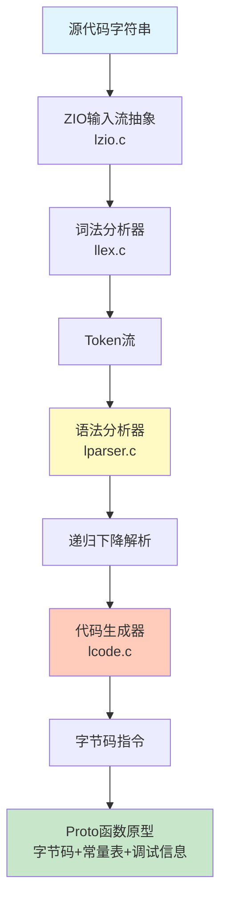
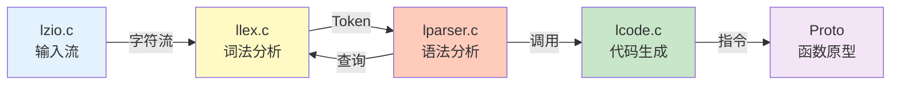
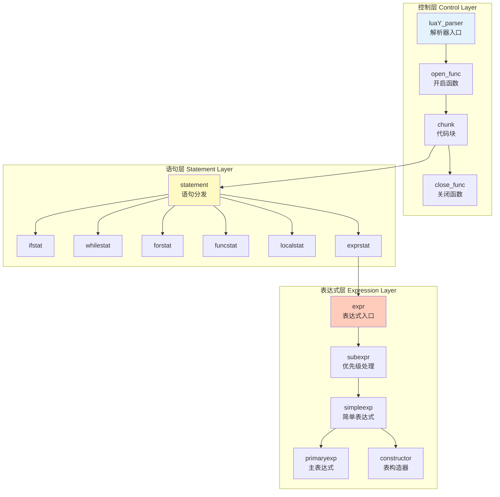
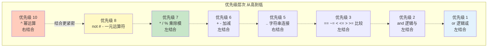
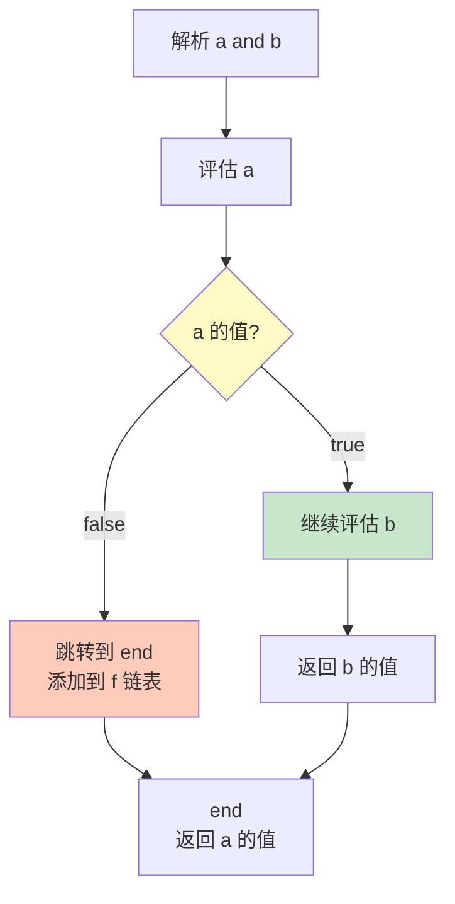
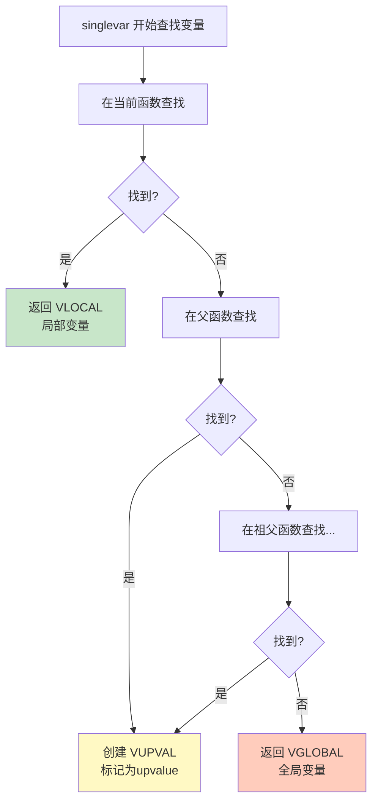
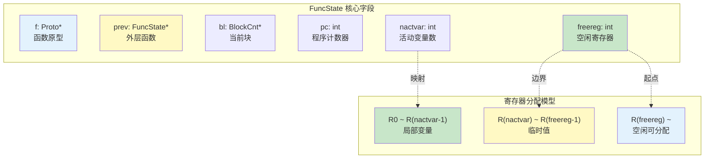
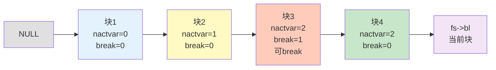
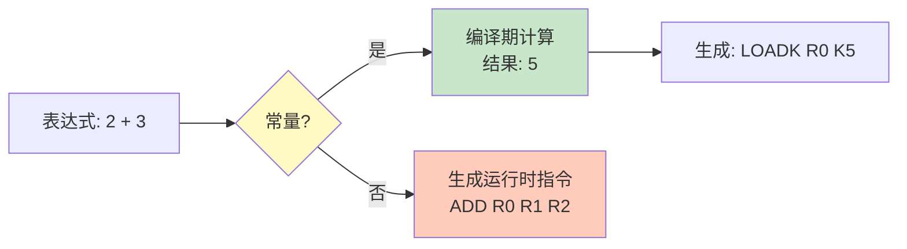

# 📖 解析器模块完全指南

> **模块定位**：Lua 源码的语法分析核心 - 将 Token 流转换为字节码指令序列

---

## 📝 文档更新说明

**v2.1 主要改进**：
- ✅ 增强了 `chunk()` 函数的逐行深度分析
- ✅ 补充了 `statement()` 函数的设计细节和特殊处理
- ✅ 扩展了运算符优先级算法的实例演示
- ✅ 添加了完整编译流程的调用链追踪
- ✅ 增加了实践调试指南和常见问题诊断
- ✅ 保持模块概览定位，避免过度深入实现细节


<details>
<summary><b>📋 快速导航</b></summary>

- [模块概述](#-模块概述)
- [解析器架构](#-解析器架构设计)
- [递归下降算法](#-递归下降解析)
- [表达式解析系统](#-表达式解析系统)
- [语句解析系统](#-语句解析系统)
- [作用域与变量管理](#-作用域与变量管理)
- [核心数据结构](#-核心数据结构)
- [性能优化技术](#-性能优化技术)
- [实战示例](#-实战示例)
- [深入阅读](#-深入阅读)

</details>

---

## 📋 模块概述

### 核心职责

Lua 解析器（Parser）是编译器前端的**语法分析核心**，负责将词法分析器产生的 Token 流转换为可执行的字节码指令。它采用**递归下降算法**与**单遍编译**策略，在解析的同时直接生成字节码，无需构建完整的抽象语法树（AST）。

解析器的核心职责包括：

- **语法分析**：根据 Lua 语法规则验证 Token 序列的合法性
- **递归下降解析**：为每个语法规则实现对应的解析函数
- **表达式解析**：处理运算符优先级和结合性（支持10个优先级）
- **语句解析**：解析控制流、函数定义、赋值等12种语句类型
- **作用域管理**：管理局部变量、全局变量和Upvalue的查找与绑定
- **代码生成集成**：在解析过程中直接调用代码生成器生成字节码
- **错误处理**：检测语法错误并提供清晰的错误信息和行号

### 实现文件

<table>
<tr>
<th width="25%">文件</th>
<th width="35%">职责</th>
<th width="40%">关键函数</th>
</tr>

<tr>
<td><code>lparser.c/h</code></td>
<td>语法分析器主实现</td>
<td>
<code>luaY_parser()</code> - 主解析入口<br/>
<code>chunk()</code> - 解析代码块<br/>
<code>statement()</code> - 解析语句<br/>
<code>expr()</code> - 解析表达式<br/>
<code>subexpr()</code> - 子表达式解析<br/>
<code>singlevar()</code> - 变量查找
</td>
</tr>

<tr>
<td><code>llex.c/h</code></td>
<td>词法分析器（Token扫描）</td>
<td>
<code>luaX_next()</code> - 获取下一个Token<br/>
<code>luaX_lookahead()</code> - 向前看<br/>
<code>luaX_setinput()</code> - 设置输入流<br/>
<code>luaX_token2str()</code> - Token转字符串<br/>
<code>luaX_syntaxerror()</code> - 语法错误
</td>
</tr>

<tr>
<td><code>lcode.c/h</code></td>
<td>代码生成器（解析器调用）</td>
<td>
<code>luaK_code()</code> - 生成指令<br/>
<code>luaK_exp2nextreg()</code> - 表达式求值<br/>
<code>luaK_prefix()</code> - 前缀运算<br/>
<code>luaK_infix()</code> - 中缀运算<br/>
<code>luaK_posfix()</code> - 后缀处理<br/>
<code>luaK_goiftrue()</code> - 短路求值
</td>
</tr>

<tr>
<td><code>lzio.c/h</code></td>
<td>输入流抽象</td>
<td>
<code>luaZ_init()</code> - 初始化流<br/>
<code>luaZ_fill()</code> - 填充缓冲区<br/>
<code>luaZ_read()</code> - 读取字符<br/>
<code>luaZ_lookahead()</code> - 向前看字符
</td>
</tr>
</table>

### 设计特点

| 特点 | 说明 | 优势 |
|------|------|------|
| 🔄 **递归下降** | 每个语法规则对应一个解析函数 | 结构清晰、易于理解和维护 |
| ⚡ **单遍编译** | 词法、语法、代码生成一次完成 | 减少内存使用、提高编译速度 |
| 📊 **优先级驱动** | 使用优先级表处理表达式 | 支持复杂运算符、易于扩展 |
| 🎯 **延迟生成** | 通过 expdesc 推迟代码生成 | 支持常量折叠等优化 |
| 🌳 **无 AST** | 直接生成字节码，不保留 AST | 内存效率高、编译快速 |
| 🔍 **作用域栈** | 块结构的作用域管理 | 自动处理变量生命周期 |

---

## 🏗️ 解析器架构设计

### 整体架构图

Lua 解析器采用**一体化设计**，将词法分析、语法分析和代码生成无缝集成。整个编译流程如下：



**模块交互关系**：



**模块职责说明**：

- **lzio.c** 提供统一的字符流接口，支持字符串、文件、内存块等多种输入源
- **llex.c** 从字符流识别Token，维护当前Token和lookahead Token
- **lparser.c** 核心解析器，调用llex获取Token，调用lcode生成指令
- **lcode.c** 指令生成器，负责字节码生成、跳转回填、寄存器分配

### 语法规则与函数映射

Lua 的语法可以用**上下文无关文法（CFG）**描述，解析器为每个语法规则实现对应的 C 函数：

**核心语法规则**（简化的 BNF）：
```ebnf
chunk      → { stat [';'] }
stat       → varlist '=' explist
           | functioncall
           | 'do' block 'end'
           | 'while' exp 'do' block 'end'
           | 'repeat' block 'until' exp
           | 'if' exp 'then' block {'elseif' exp 'then' block} ['else' block] 'end'
           | 'for' Name '=' exp ',' exp [',' exp] 'do' block 'end'
           | 'function' funcname funcbody
           | 'local' 'function' Name funcbody
           | 'local' namelist ['=' explist]
           | 'return' [explist]
           | 'break'

block      → chunk

exp        → subexpr
subexpr    → (simpleexp | unop subexpr) { binop subexpr }

simpleexp  → NUMBER | STRING | 'nil' | 'true' | 'false'
           | '...' | constructor | 'function' body | primaryexp

primaryexp → NAME | '(' expr ')' | primaryexp '[' exp ']'
           | primaryexp '.' NAME | primaryexp args
```

**递归下降的映射关系**：

| 语法规则（非终结符） | 对应的 C 函数 | 文件位置 | 核心职责 |
|---------------------|--------------|---------|---------|
| `chunk` | `chunk()` | lparser.c | 解析语句序列 |
| `stat` | `statement()` | lparser.c | 语句类型分发 |
| `block` | `block()` | lparser.c | 块结构（带作用域） |
| `exp` | `expr()` | lparser.c | 表达式入口 |
| `subexpr` | `subexpr()` | lparser.c | 优先级处理 |
| `simpleexp` | `simpleexp()` | lparser.c | 简单表达式 |
| `primaryexp` | `primaryexp()` | lparser.c | 主表达式 |

**关键洞察**：
```
chunk() 调用 statement()
statement() 可能调用 expr()
expr() 调用 subexpr()
subexpr() 递归调用自身（处理二元运算符）
subexpr() 调用 simpleexp()
simpleexp() 调用 primaryexp()
primaryexp() 可能递归调用 expr()（括号表达式）
```

这形成了一个**相互递归的函数调用图**，完美映射语法规则的嵌套结构。

### 解析器三层结构

解析器采用**三层递归调用结构**，从上到下依次处理不同粒度的语法单元：



**1. 控制层（Control Layer）**

负责解析器的初始化、函数管理和整体控制流：

- `luaY_parser()` - 解析器主入口，创建主函数原型
- `open_func()` - 开启新函数作用域，初始化FuncState
- `chunk()` - 解析代码块（statement的序列）
- `close_func()` - 关闭函数，生成完整的Proto

**调用示例**：
```c
Proto *luaY_parser(lua_State *L, ZIO *z, Mbuffer *buff, const char *name) {
  LexState lexstate;
  FuncState funcstate;
  
  lexstate.buff = buff;
  luaX_setinput(L, &lexstate, z, luaS_new(L, name));
  
  open_func(&lexstate, &funcstate);
  funcstate.f->is_vararg = VARARG_ISVARARG;  // 主函数是vararg
  
  luaX_next(&lexstate);  // 读取第一个token
  chunk(&lexstate);       // 解析整个文件
  check(&lexstate, TK_EOS);  // 检查文件结束
  
  close_func(&lexstate);
  return funcstate.f;
}
```

**2. 语句层（Statement Layer）**

负责解析各种 Lua 语句，这是解析器的主体部分：

- `statement()` - 语句分发器，根据Token类型分发到具体函数
- `ifstat()` - 解析if/elseif/else语句
- `whilestat()` - 解析while循环
- `repeatstat()` - 解析repeat...until循环
- `forstat()` - 解析for循环（分发到fornum或forlist）
- `fornum()` - 数值for循环（for i=1,10 do）
- `forlist()` - 通用for循环（for k,v in pairs(t) do）
- `funcstat()` - 函数定义语句
- `localstat()` - local变量声明
- `exprstat()` - 表达式语句（赋值或函数调用）
- `retstat()` - return语句
- `breakstat()` - break语句

**statement()分发逻辑**：
```c
static int statement(LexState *ls) {
  int line = ls->linenumber;  // 保存行号用于错误报告
  switch (ls->t.token) {
    case TK_IF: ifstat(ls, line); return 0;
    case TK_WHILE: whilestat(ls, line); return 0;
    case TK_DO: {
      luaX_next(ls);  // 消费 'do'
      block(ls);
      check_match(ls, TK_END, TK_DO, line);  // 检查匹配的 'end'
      return 0;
    }
    case TK_FOR: forstat(ls, line); return 0;
    case TK_REPEAT: repeatstat(ls, line); return 0;
    case TK_FUNCTION: funcstat(ls, line); return 0;
    case TK_LOCAL: {
      luaX_next(ls);
      if (testnext(ls, TK_FUNCTION))
        localfunc(ls);   // local function
      else
        localstat(ls);   // local variable
      return 0;
    }
    case TK_RETURN: retstat(ls); return 1;  // 终结语句
    case TK_BREAK: {
      luaX_next(ls);
      breakstat(ls);
      return 1;  // 终结语句
    }
    default: exprstat(ls); return 0;  // 赋值或函数调用
  }
}
```

**关键设计点**：
- **行号保存**：`line = ls->linenumber` 保存语句起始行号，用于错误报告
- **返回值语义**：返回 0 表示普通语句，返回 1 表示终结语句（return/break）
- **DO 语句内联**：`do...end` 结构简单，直接在 `statement()` 中处理
- **LOCAL 二义性**：通过前瞻区分 `local function` 和 `local variable`

**3. 表达式层（Expression Layer）**

负责解析表达式，这是解析器最复杂的部分：

- `expr()` - 表达式入口，调用subexpr(0)解析最低优先级
- `subexpr(limit)` - 子表达式解析，处理运算符优先级（核心算法）
- `simpleexp()` - 简单表达式（字面量、变量、表构造器、函数定义）
- `primaryexp()` - 主表达式（函数调用、表索引、点号访问）
- `constructor()` - 表构造器 {...}
- `listfield()` - 数组风格字段 [1] = value
- `recfield()` - 记录风格字段 key = value

**subexpr核心算法**（优先级爬升）：
```c
static BinOpr subexpr(LexState *ls, expdesc *v, unsigned int limit) {
  BinOpr op;
  UnOpr uop;

  enterlevel(ls);  // 防止递归溢出

  // 1. 处理一元运算符
  uop = getunopr(ls->t.token);
  if (uop != OPR_NOUNOPR) {
    luaX_next(ls);  // 消费运算符
    subexpr(ls, v, UNARY_PRIORITY);  // 递归，优先级8
    luaK_prefix(ls->fs, uop, v);     // 生成一元运算代码
  }
  else simpleexp(ls, v);  // 解析基础表达式

  // 2. 循环处理二元运算符链
  op = getbinopr(ls->t.token);
  while (op != OPR_NOBINOPR && priority[op].left > limit) {
    expdesc v2;
    BinOpr nextop;

    luaX_next(ls);  // 消费运算符
    luaK_infix(ls->fs, op, v);  // 处理左操作数

    // 关键：递归解析右操作数，传递右优先级
    nextop = subexpr(ls, &v2, priority[op].right);

    luaK_posfix(ls->fs, op, v, &v2);  // 生成二元运算代码
    op = nextop;  // 继续处理更低优先级的运算符
  }

  leavelevel(ls);
  return op;  // 返回未处理的运算符
}
```

**优先级算法核心**：
- `limit` 参数：当前允许的**最低优先级**
- 只处理 `priority[op].left > limit` 的运算符
- 低优先级运算符留给上层调用处理

**左结合 vs 右结合**：
- **左结合**（`left == right`）：`a + b + c = (a + b) + c`
  - 右优先级等于左优先级，递归时同级运算符无法继续嵌套
  - 通过 `while` 循环实现左结合
- **右结合**（`left > right`）：`a ^ b ^ c = a ^ (b ^ c)`
  - 右优先级低于左优先级，递归时同级运算符可以继续嵌套
  - 形成右结合结构

---

## 🔄 递归下降解析

### 核心思想

递归下降解析（Recursive Descent Parsing）是一种**自顶向下**的语法分析技术。其核心思想非常直观：

1. **语法规则 ↔ 函数映射**：为每个BNF语法规则编写一个对应的C函数
2. **递归调用**：通过函数间的递归调用来解析嵌套的语法结构
3. **向前看**：使用lookahead机制（查看当前token）决定选择哪条产生式

**递归下降的映射关系**：
```
每个非终结符 = 一个 C 函数
语法嵌套 = 函数递归调用
语法选择 = switch 分支
语法重复 = while 循环
```

### chunk() 函数深度解析

`chunk()` 是代码块解析的核心函数，负责解析语句序列。

**函数签名与语法规则**：
```c
/**
 * 语法规则：chunk -> { stat [';'] }
 * - stat: 各种类型的语句
 * - [';']: 可选的语句分隔符
 * - 支持任意数量的语句
 */
static void chunk (LexState *ls) {
    int islast = 0;
    enterlevel(ls);
    while (!islast && !block_follow(ls->t.token)) {
        islast = statement(ls);
        testnext(ls, ';');
        lua_assert(ls->fs->f->maxstacksize >= ls->fs->freereg &&
                   ls->fs->freereg >= ls->fs->nactvar);
        ls->fs->freereg = ls->fs->nactvar;
    }
    leavelevel(ls);
}
```

**关键设计点**：

1. **终结语句标记（islast）**：
   - 跟踪是否遇到终结语句（return 或 break）
   - 终结语句后停止解析当前块（后续代码不可达）

2. **递归深度控制（enterlevel/leavelevel）**：
   - 防止深度递归导致 C 栈溢出
   - Lua 限制最大嵌套深度为 200 层（`LUAI_MAXCCALLS`）

3. **循环控制条件**：
   - `!islast`：未遇到终结语句
   - `!block_follow(ls->t.token)`：未遇到代码块结束标记（else/elseif/end/until/EOS）

4. **可选分号处理（testnext）**：
   - 支持 Lua 的灵活语法风格（分号可选）
   - `testnext(ls, ';')` 检查并消费可选的分号

5. **寄存器管理**：
   - `freereg = nactvar`：每条语句执行后释放临时寄存器
   - 保留局部变量占用的寄存器
   - 为下一条语句提供干净的寄存器环境

**寄存器栈结构**：
```
|---------------------|  ← maxstacksize（最大栈大小）
|   临时寄存器区域     |
|---------------------|  ← freereg（第一个空闲寄存器）
|   临时值             |
|---------------------|  ← nactvar（活跃局部变量数量）
|   局部变量          |
|---------------------|  ← 寄存器 0
```

### 解析函数映射表

| Lua 语法规则 | 解析函数 | 功能说明 | 代码行数 |
|-------------|---------|---------|---------|
| `chunk` | `chunk()` | 解析代码块（多条语句） | ~20行 |
| `statement` | `statement()` | 解析单条语句，根据token分发 | ~30行 |
| `block` | `block()` | 解析块结构（带作用域） | ~15行 |
| `expr` | `expr()` | 解析表达式（优先级0） | ~5行 |
| `subexpr` | `subexpr(limit)` | 子表达式（处理优先级） | ~40行 |
| `simpleexp` | `simpleexp()` | 简单表达式 | ~60行 |
| `primaryexp` | `primaryexp()` | 主表达式（调用、索引） | ~80行 |
| `funcbody` | `body()` | 函数体 | ~50行 |
| `parlist` | `parlist()` | 参数列表 | ~40行 |
| `tableconstructor` | `constructor()` | 表构造器 | ~100行 |

### 详细解析示例

以解析 **if语句** 为例，展示完整的递归下降过程：

**Lua代码**：
```lua
if a > 10 then
    print("large")
elseif a > 5 then
    print("medium")
else
    print("small")
end
```

**完整解析调用链**：
```
luaY_parser()
  └── chunk()
        └── statement()
              └── ifstat(ls, line)
                    ├── test_then_block()
                    │     ├── expr()  // 解析 a > 10
                    │     │     └── subexpr(0)
                    │     │           ├── simpleexp()  // a
                    │     │           │     └── singlevar()
                    │     │           │           └── init_exp(VLOCAL/VGLOBAL)
                    │     │           ├── getbinopr() 检测到 >
                    │     │           ├── luaK_infix(OPR_GT)
                    │     │           ├── subexpr(3)  // 10
                    │     │           │     └── simpleexp()
                    │     │           │           └── init_exp(VKNUM, 10)
                    │     │           └── luaK_posfix(OPR_GT) 生成LT指令
                    │     ├── luaK_goiftrue()  // 生成条件跳转
                    │     ├── check(TK_THEN)
                    │     └── block()
                    │           └── statement()
                    │                 └── exprstat()
                    │                       └── primaryexp() // print("large")
                    │
                    ├── 检测到 TK_ELSEIF
                    ├── luaK_concat(escapelist)  // 添加跳过elseif的跳转
                    ├── luaK_patchtohere(v.f)    // 回填false跳转
                    │
                    ├── test_then_block()  // 第二个条件
                    │     ├── expr()  // 解析 a > 5
                    │     └── block() // print("medium")
                    │
                    ├── 检测到 TK_ELSE
                    ├── luaK_concat(escapelist)
                    ├── luaK_patchtohere(v.f)
                    │
                    ├── block() // else块
                    │     └── statement()
                    │           └── exprstat() // print("small")
                    │
                    ├── check_match(TK_END)
                    └── luaK_patchtohere(escapelist)  // 回填所有跳出跳转
```

**生成的字节码**（假设a是局部变量0）：
```
1  [1]  LT        0 -1 0    ; if 10 < R(0) then goto 3 else goto 8
2  [1]  JMP       7          ; skip to line 8
3  [2]  GETGLOBAL 1 -2       ; R(1) = _ENV["print"]
4  [2]  LOADK     2 -3       ; R(2) = "large"
5  [2]  CALL      1 2 1      ; R(1)(R(2))
6  [2]  JMP       13         ; skip to end
7  [3]  LT        0 -4 0     ; if 5 < R(0) then goto 9 else goto 13
8  [3]  JMP       13         ; skip to line 13
9  [4]  GETGLOBAL 1 -2       ; R(1) = _ENV["print"]
10 [4]  LOADK     2 -5       ; R(2) = "medium"
11 [4]  CALL      1 2 1      ; R(1)(R(2))
12 [4]  JMP       16         ; skip to end
13 [6]  GETGLOBAL 1 -2       ; R(1) = _ENV["print"]
14 [6]  LOADK     2 -6       ; R(2) = "small"
15 [6]  CALL      1 2 1      ; R(1)(R(2))
16 [7]  RETURN    0 1 0      ; return
```

### 递归下降的优势

递归下降解析器相比其他解析技术（如LR、LALR）有独特优势：

✅ **代码结构清晰**：语法规则和代码结构完全对应，一目了然  
✅ **易于手工编写**：无需生成器工具（如yacc/bison），直接用C编写  
✅ **易于调试**：调用栈直接反映语法结构，设断点即可跟踪  
✅ **错误恢复灵活**：可以精确控制错误处理和恢复策略  
✅ **易于扩展**：添加新语法只需添加对应的解析函数  
✅ **性能优秀**：函数调用开销小，且编译器可内联优化

> 📖 **深入学习**：参见 [recursive_descent.md](recursive_descent.md) 了解算法的数学原理和变体实现

---

## 📊 表达式解析系统

### 运算符优先级表

Lua解析器使用**优先级驱动**的表达式解析算法。这是`lparser.c`中定义的完整优先级表：



```c
// 二元运算符优先级 (left, right)
static const struct {
  lu_byte left;   // 左结合优先级
  lu_byte right;  // 右结合优先级
} priority[] = {
  {6, 6}, {6, 6}, {7, 7}, {7, 7}, {7, 7},  // + - * / %
  {10, 9}, {5, 4},                          // ^ ..
  {3, 3}, {3, 3}, {3, 3},                   // == ~= <
  {3, 3}, {3, 3}, {3, 3},                   // <= > >=
  {2, 2}, {1, 1}                            // and or
};

#define UNARY_PRIORITY  8  // 一元运算符优先级
```

**优先级详细表格**：

| 优先级 | 运算符 | 结合性 | 类型 | 示例 |
|--------|--------|--------|------|------|
| 10 | `^` | 右结合 | 幂运算 | `2^3^4 = 2^(3^4)` |
| 8 | `not`, `#`, `-` (一元) | - | 一元运算符 | `not true`, `#t`, `-x` |
| 7 | `*`, `/`, `%` | 左结合 | 乘除模 | `a*b/c = (a*b)/c` |
| 6 | `+`, `-` | 左结合 | 加减 | `a+b-c = (a+b)-c` |
| 5 | `..` | 右结合 | 字符串连接 | `a..b..c = a..(b..c)` |
| 3 | `==`, `~=`, `<`, `<=`, `>`, `>=` | 左结合 | 比较运算 | `a<b<c` 语法错误！ |
| 2 | `and` | 左结合 | 逻辑与 | `a and b and c = (a and b) and c` |
| 1 | `or` | 左结合 | 逻辑或 | `a or b or c = (a or b) or c` |

**关键规则**：
- 优先级数字越大，结合越紧密
- `^` 和 `..` 是右结合（left > right），其他都是左结合（left == right）
- 一元运算符优先级为8，高于所有二元运算符（除了^）
- 比较运算符不能链式使用（`a<b<c`会报错）

### 优先级算法实例演示

**示例1：解析 `1 + 2 * 3`**

```
初始调用：subexpr(ls, &v, 0)  // limit=0（无限制）
├─ simpleexp() → v = 1
├─ 遇到 '+'，priority[OPR_ADD].left = 6 > 0 → 进入循环
├─ 递归：subexpr(ls, &v2, priority[OPR_ADD].right = 6)
│   ├─ simpleexp() → v2 = 2
│   ├─ 遇到 '*'，priority[OPR_MUL].left = 7 > 6 → 进入循环
│   ├─ 递归：subexpr(ls, &v3, priority[OPR_MUL].right = 7)
│   │   ├─ simpleexp() → v3 = 3
│   │   ├─ 遇到 EOF，退出
│   │   └─ 返回 v3 = 3
│   ├─ 生成代码：v2 = v2 * v3  → v2 = 2 * 3 = 6
│   └─ 返回 v2 = 6
├─ 生成代码：v = v + v2  → v = 1 + 6 = 7
└─ 返回 v = 7
```

**AST 结构**（隐式）：
```
     +
    / \
   1   *
      / \
     2   3
```

**示例2：右结合 `a ^ b ^ c`**

优先级表：`{10, 9}` - 左优先级10，右优先级9

```
subexpr(ls, &v, 0)
├─ v = a
├─ 遇到 '^'，10 > 0 → 进入循环
├─ 递归：subexpr(ls, &v2, 9)  // 注意：右优先级是 9
│   ├─ v2 = b
│   ├─ 遇到 '^'，10 > 9 → 进入循环（关键！）
│   ├─ 递归：subexpr(ls, &v3, 9)
│   │   └─ v3 = c
│   ├─ 生成：v2 = b ^ c
│   └─ 返回 v2
├─ 生成：v = a ^ v2
└─ 返回 v
```

**结果**：`a ^ (b ^ c)`（右结合）

**示例3：左结合 `a + b + c`**

优先级表：`{6, 6}` - 左右优先级相同

```
subexpr(ls, &v, 0)
├─ v = a
├─ 遇到 '+'，6 > 0 → 进入循环
├─ 递归：subexpr(ls, &v2, 6)  // 右优先级也是 6
│   ├─ v2 = b
│   ├─ 遇到 '+'，6 > 6？ → 否，退出
│   └─ 返回 v2 = b
├─ 生成：v = a + b
├─ 继续循环，遇到 '+'，6 > 0 → 进入
├─ 递归：subexpr(ls, &v2, 6)
│   └─ v2 = c
├─ 生成：v = v + c  → v = (a + b) + c
└─ 返回 v
```

**结果**：`(a + b) + c`（左结合）

### 表达式类型系统（expkind）

解析器使用`expdesc`结构表示表达式的中间状态。`expkind`枚举定义了14种表达式类型：

```c
typedef enum {
  VVOID,        // 无值（空表达式）
  VNIL,         // nil常量
  VTRUE,        // true常量
  VFALSE,       // false常量
  VK,           // 常量表中的常量（字符串、大数字等）
  VKNUM,        // 数字常量（直接存储在nval中）
  VLOCAL,       // 局部变量
  VUPVAL,       // Upvalue（闭包捕获的外层变量）
  VGLOBAL,      // 全局变量
  VINDEXED,     // 表索引 t[k]
  VJMP,         // 测试/跳转表达式
  VRELOCABLE,   // 可重定位指令（刚生成，位置可调整）
  VNONRELOC,    // 非重定位指令（固定在某个寄存器）
  VCALL,        // 函数调用表达式
  VVARARG       // 可变参数 ...
} expkind;
```

**各类型的用途和示例**：

| expkind | 含义 | Lua示例 | 存储位置 |
|---------|------|---------|---------|
| `VVOID` | 无值 | `()` | - |
| `VNIL` | nil常量 | `nil` | - |
| `VTRUE`/`VFALSE` | 布尔常量 | `true`, `false` | - |
| `VK` | 常量表常量 | `"hello"`, `3.14159` | K表索引 |
| `VKNUM` | 数字常量 | `123` | nval字段 |
| `VLOCAL` | 局部变量 | `local x; x` | 寄存器号 |
| `VUPVAL` | Upvalue | 闭包中的外层变量 | upvalue索引 |
| `VGLOBAL` | 全局变量 | `print` | 全局名索引 |
| `VINDEXED` | 表索引 | `t[k]`, `t.field` | 表+键 |
| `VJMP` | 跳转表达式 | `a and b` | 跳转指令位置 |
| `VRELOCABLE` | 可重定位 | 刚生成的指令 | 指令位置 |
| `VNONRELOC` | 非重定位 | 已固定的结果 | 寄存器号 |
| `VCALL` | 函数调用 | `f(x)` | 调用指令位置 |
| `VVARARG` | 可变参数 | `...` | vararg指令 |

### 短路求值优化

Lua支持逻辑运算符的**短路求值**（Short-Circuit Evaluation），这是一个重要的优化：

```lua
-- and短路：如果a为false，则不评估b
result = a and b

-- or短路：如果a为true，则不评估b
result = a or b

-- 实际应用
x = x or 10  -- 如果x为nil/false，设置默认值10
if t and t.field then  -- 安全访问，避免t为nil时出错
    use(t.field)
end
```

**实现机制**：

解析器通过`expdesc`的`t`和`f`字段维护**跳转链表**：

```c
typedef struct expdesc {
  expkind k;
  union {
    struct { int info, aux; } s;
    lua_Number nval;
  } u;
  int t;  /* "true时退出"跳转链表 */
  int f;  /* "false时退出"跳转链表 */
} expdesc;
```

**跳转链表工作原理**：

对于表达式 `a and b`：
1. 解析`a`，生成测试指令
2. 如果`a`为false，跳过`b`，直接返回`a`
3. 如果`a`为true，继续评估`b`，返回`b`
4. 使用链表维护多个需要回填的跳转地址



**示例：`a and b and c`的解析**：

```c
// 伪代码展示跳转链表的构建
expdesc e;
expr(ls, &e);  // 解析 a
luaK_goiffalse(fs, &e);  // 如果false则跳转，添加到e.f链

expr(ls, &e2); // 解析 b
luaK_goiffalse(fs, &e2);
luaK_concat(fs, &e.f, e2.f);  // 合并false链

expr(ls, &e3); // 解析 c
// 最后统一回填所有false跳转
```

**生成的字节码**：
```
TEST      R(a) 0     ; if not R(a) then goto @end
JMP       @end
TEST      R(b) 0     ; if not R(b) then goto @end
JMP       @end
MOVE      R(result) R(c)
@end:
```

> 📖 **深入学习**：[expression_parsing.md](expression_parsing.md) 详细讲解优先级爬升算法的数学证明

---

## 📝 语句解析系统

### 语句类型总览

Lua支持12种语句类型，`statement()`函数根据当前Token分发到对应的解析函数：

| 语句类型 | 关键字 | 解析函数 | 语法示例 | 复杂度 |
|---------|--------|---------|---------|--------|
| **块语句** | `do` | `block()` | `do ... end` | ⭐ |
| **if语句** | `if` | `ifstat()` | `if cond then ... elseif ... else ... end` | ⭐⭐⭐ |
| **while循环** | `while` | `whilestat()` | `while cond do ... end` | ⭐⭐ |
| **repeat循环** | `repeat` | `repeatstat()` | `repeat ... until cond` | ⭐⭐ |
| **数值for** | `for` | `fornum()` | `for i=1,10,2 do ... end` | ⭐⭐⭐⭐ |
| **通用for** | `for...in` | `forlist()` | `for k,v in pairs(t) do ... end` | ⭐⭐⭐⭐ |
| **函数定义** | `function` | `funcstat()` | `function f() ... end` | ⭐⭐⭐⭐⭐ |
| **局部声明** | `local` | `localstat()` | `local x, y = 1, 2` | ⭐⭐⭐ |
| **赋值语句** | - | `assignment()` | `x, y = 1, 2` | ⭐⭐⭐ |
| **函数调用** | - | `exprstat()` | `print("hello")` | ⭐⭐ |
| **return语句** | `return` | `retstat()` | `return x, y` | ⭐⭐ |
| **break语句** | `break` | `breakstat()` | `break` | ⭐ |

### statement()分发器实现

```c
static void statement(LexState *ls) {
  int line = ls->linenumber;  // 记录行号用于调试
  
  switch (ls->t.token) {
    case TK_IF: {
      ifstat(ls, line);
      return;
    }
    case TK_WHILE: {
      whilestat(ls, line);
      return;
    }
    case TK_DO: {  // do块
      luaX_next(ls);  // 跳过 do
      block(ls);
      check_match(ls, TK_END, TK_DO, line);
      return;
    }
    case TK_FOR: {
      forstat(ls, line);
      return;
    }
    case TK_REPEAT: {
      repeatstat(ls, line);
      return;
    }
    case TK_FUNCTION: {
      funcstat(ls, line);
      return;
    }
    case TK_LOCAL: {
      luaX_next(ls);  // 跳过 local
      if (testnext(ls, TK_FUNCTION))  // local function?
        localfunc(ls);
      else
        localstat(ls);
      return;
    }
    case TK_RETURN: {
      retstat(ls);
      return;
    }
    case TK_BREAK: {
      luaX_next(ls);  // 跳过 break
      breakstat(ls);
      return;
    }
    default: {
      exprstat(ls);  // 赋值或函数调用
      return;
    }
  }
}
```

### 控制流管理（BlockCnt）

解析器使用`BlockCnt`结构管理**块作用域**和控制流：

```c
typedef struct BlockCnt {
  struct BlockCnt *previous;  /* 父块（形成块链表） */
  int breaklist;             /* break跳转链表 */
  lu_byte nactvar;           /* 块开始时的活动变量数 */
  lu_byte upval;             /* 块中是否有upvalue */
  lu_byte isbreakable;       /* 是否可break（循环块标记） */
} BlockCnt;
```

**BlockCnt的5大作用**：

1. **作用域嵌套管理**：通过`previous`指针形成块链表
2. **break处理**：维护`breaklist`跳转链，在块结束时统一回填
3. **变量生命周期**：记录`nactvar`，块结束时释放局部变量
4. **upvalue检测**：标记是否有变量被内层函数捕获（影响变量存储）
5. **语法检查**：检查break是否在可break块中

**使用示例**：
```c
static void whilestat(LexState *ls, int line) {
  FuncState *fs = ls->fs;
  int whileinit;
  int condexit;
  BlockCnt bl;
  
  luaX_next(ls);  // 跳过 while
  
  whileinit = luaK_getlabel(fs);  // 循环开始位置
  condexit = cond(ls);             // 解析条件，返回false退出位置
  
  enterblock(fs, &bl, 1);  // 进入可break块
  
  checknext(ls, TK_DO);
  block(ls);  // 解析循环体
  
  luaK_patchlist(fs, luaK_jump(fs), whileinit);  // 跳回循环开始
  check_match(ls, TK_END, TK_WHILE, line);
  
  leaveblock(fs);  // 退出块
  luaK_patchtohere(fs, condexit);  // 回填退出跳转
}
```

### 循环语句深度解析

**while循环**：

```lua
while condition do
    body
end
```

**生成的字节码结构**：
```
@loop_start:
  <evaluate condition>
  TEST/JMP @loop_end     ; 如果false则跳出
  <loop body>
  JMP @loop_start        ; 跳回循环开始
@loop_end:
```

**for循环（数值）**：

```lua
for i = start, limit, step do
    body
end
```

Lua的for循环使用**3个内部变量**：`(for index)`, `(for limit)`, `(for step)`，用户变量`i`是第4个：

```
// 内部实现等价于：
local _forindex = start - step
local _forlimit = limit
local _forstep = step
while true do
    _forindex = _forindex + _forstep
    if (_forstep > 0 and _forindex > _forlimit) or
       (_forstep <= 0 and _forindex < _forlimit) then
        break
    end
    local i = _forindex
    <body>
end
```

**生成的字节码**：
```
LOADK     R(start)  K(1)
LOADK     R(limit)  K(10)
LOADK     R(step)   K(1)
FORPREP   R(start) @end    ; start = start - step, jump
@loop:
  <loop body using R(i) which is R(start)+3>
  FORLOOP   R(start) @loop  ; start += step, check, loop
@end:
```

**for循环（通用）**：

```lua
for k, v in pairs(t) do
    body
end
```

使用迭代器协议，等价于：

```lua
do
    local _f, _s, _var = pairs(t)
    while true do
        local k, v = _f(_s, _var)
        _var = k
        if k == nil then break end
        <body>
    end
end
```

**生成的字节码**：
```
GETGLOBAL R(f) K("pairs")
MOVE      R(s) R(t)
CALL      R(f) 2 4         ; f, s, var = pairs(t)
JMP       @loop_test
@loop:
  <loop body>
@loop_test:
  TFORLOOP  R(f) @loop      ; k, v = f(s, var); if k then loop
```

> 📖 **深入学习**：[statement_parsing.md](statement_parsing.md) 详细讲解每种语句的实现细节和特殊情况

---

## 🌳 作用域与变量管理

### 变量类型

Lua解析器管理三种类型的变量，每种有不同的存储位置和访问方式：

**1. 局部变量（Local Variables）**

- **存储位置**：虚拟机栈上的寄存器（函数的活动记录中）
- **生命周期**：限于声明的块作用域，块结束时自动释放
- **访问速度**：最快（直接寄存器访问，0次表查找）
- **表示类型**：`VLOCAL` expkind
- **最大数量**：200个（`LUAI_MAXVARS`）

```lua
local x = 10      -- 局部变量
do
    local y = 20  -- 内层局部变量
end
-- y在此处不可见
```

**2. 全局变量（Global Variables）**

- **存储位置**：`_ENV`表中（实际上是upvalue）
- **生命周期**：全局可见，直到程序结束或手动删除
- **访问速度**：慢（需要表查找，至少2次哈希查找）
- **表示类型**：`VGLOBAL` expkind
- **访问方式**：`_ENV["varname"]`

```lua
x = 10  -- 全局变量（实际是 _ENV.x = 10）
```

**生成的字节码**：
```
SETTABUP  0 -1 -2  ; _ENV["x"] = 10
```

**3. Upvalue（闭包捕获的变量）**

- **存储位置**：函数原型的upvalue数组 + upvalue对象
- **生命周期**：与闭包相同，被GC管理
- **访问速度**：中等（间接访问，通过upvalue指针）
- **表示类型**：`VUPVAL` expkind
- **最大数量**：60个（`LUAI_MAXUPVALUES`）

```lua
function makeCounter()
    local count = 0          -- 局部变量
    return function()
        count = count + 1    -- count成为upvalue
        return count
    end
end
```

### 变量查找算法

`singlevar()`函数实现变量查找，采用**递归向上查找**策略：

```c
static void singlevar(LexState *ls, expdesc *var) {
  TString *varname = str_checkname(ls);
  FuncState *fs = ls->fs;
  
  if (singlevaraux(fs, varname, var, 1) == VGLOBAL)
    var->u.s.info = luaK_stringK(fs, varname);  // 添加到常量表
}

static int singlevaraux(FuncState *fs, TString *n, expdesc *var, int base) {
  if (fs == NULL)  // 已经到达最外层
    return VGLOBAL;  // 标记为全局变量
  else {
    int v = searchvar(fs, n);  // 在当前函数查找
    
    if (v >= 0) {  // 找到局部变量
      init_exp(var, VLOCAL, v);
      if (!base)
        markupval(fs, v);  // 标记为被捕获（如果从内层调用）
      return VLOCAL;
    }
    else {  // 当前函数没找到，递归到外层
      if (singlevaraux(fs->prev, n, var, 0) == VGLOBAL)
        return VGLOBAL;  // 外层也没找到，是全局变量
      
      // 外层找到了，创建upvalue
      var->u.s.info = indexupvalue(fs, n, var);
      var->k = VUPVAL;
      return VUPVAL;
    }
  }
}
```

**查找流程图**：


```
singlevar(varname)
    ↓
searchvar in current function
    ├─ found → return VLOCAL
    └─ not found
        ↓
    searchvar in parent function
        ├─ found → create VUPVAL → return VUPVAL
        └─ not found
            ↓
        searchvar in grandparent...
            ├─ found → create VUPVAL
            └─ not found → return VGLOBAL
```

**示例：三层嵌套函数**：

```lua
local a = 1
function f1()
    local b = 2
    function f2()
        local c = 3
        function f3()
            print(a, b, c)  -- a,b是upvalue，c是局部变量
        end
    end
end
```

**变量查找结果**：
- `c`：在f3中查找 → 找到 → `VLOCAL`
- `b`：在f3中查找 → 未找到 → 在f2中查找 → 找到 → 在f3中创建`VUPVAL`
- `a`：在f3中查找 → 未找到 → 在f2中查找 → 未找到 → 在f1中查找 → 找到 → 在f3中创建`VUPVAL`

### 作用域管理（FuncState）

`FuncState`是解析器的核心上下文，维护**函数编译过程中的所有状态**：

```c
typedef struct FuncState {
  Proto *f;                  /* 当前编译的函数原型 */
  Table *h;                  /* 常量去重用的哈希表 */
  struct FuncState *prev;    /* 外层函数状态（形成函数嵌套链） */
  struct LexState *ls;       /* 词法状态 */
  struct lua_State *L;       /* Lua状态机 */
  struct BlockCnt *bl;       /* 当前块链表 */
  
  int pc;                    /* 下一条指令位置（程序计数器） */
  int lasttarget;            /* 上一个跳转目标 */
  int jpc;                   /* 待处理的跳转链表 */
  int freereg;               /* 第一个空闲寄存器 */
  int nk;                    /* 常量表中的常量数 */
  int np;                    /* 子函数原型数 */
  int nlocvars;              /* 局部变量数（包括不活动的） */
  int nactvar;               /* 活动局部变量数 */
  upvaldesc upvalues[LUAI_MAXUPVALUES];  /* upvalue描述符数组 */
  unsigned short actvar[LUAI_MAXVARS];   /* 活动变量栈 */
} FuncState;
```

**关键字段说明**：



| 字段 | 作用 | 示例 |
|------|------|------|
| `f` | 指向正在构建的Proto对象 | 最终包含字节码和元数据 |
| `prev` | 外层函数的FuncState | 用于upvalue查找 |
| `bl` | 当前块链表头 | 块作用域管理 |
| `pc` | 程序计数器 | 下一条指令将生成在f->code[pc] |
| `freereg` | 第一个空闲寄存器 | 用于分配临时寄存器 |
| `nactvar` | 活动局部变量数 | 等于freereg（寄存器0-nactvar存储局部变量） |
| `upvalues` | upvalue描述符 | 记录每个upvalue的名字和位置 |
| `actvar` | 活动变量栈 | 存储局部变量在f->locvars中的索引 |

**关键操作函数**：

| 函数 | 功能 | 使用场景 |
|------|------|---------|
| `new_localvar()` | 声明新局部变量 | local语句、for循环变量 |
| `adjustlocalvars()` | 激活局部变量（使其可见） | 在初始化表达式求值后 |
| `removevars()` | 移除块结束的局部变量 | 块结束、函数返回 |
| `indexupvalue()` | 创建或查找upvalue | 访问外层函数的局部变量 |
| `markupval()` | 标记被闭包捕获的变量 | 变量被内层函数引用时 |
| `searchvar()` | 在当前函数查找局部变量 | 变量名解析 |

**示例：局部变量的生命周期**：

```lua
do
    local x = 10
    local y = 20
    print(x + y)
end
-- x, y在此处不可见
```

**解析过程**：
```c
// 进入块
enterblock(fs, &bl, 0);

// local x = 10
new_localvar(ls, "x");              // 声明x，nlocvars++
expr(ls, &e);                       // 解析10
luaK_exp2nextreg(fs, &e);          // 存到freereg
adjustlocalvars(ls, 1);            // 激活x，nactvar++, freereg++

// local y = 20
new_localvar(ls, "y");              // 声明y
expr(ls, &e);                       // 解析20
luaK_exp2nextreg(fs, &e);
adjustlocalvars(ls, 1);            // 激活y

// print(x + y)
exprstat(ls);

// end - 退出块
leaveblock(fs);                     // 调用removevars(ls, bl->nactvar)
                                    // nactvar -= 2, freereg -= 2
                                    // x, y不可见
```

> 📖 **深入学习**：[scope_management.md](scope_management.md) 详细讲解upvalue的实现机制

---

（由于内容很长，文档将在下一条消息中继续...）## 🔧 核心数据结构

### expdesc（表达式描述符）

`expdesc`是解析器中**最核心的数据结构**，用于表示表达式的解析状态和延迟代码生成：

```c
typedef struct expdesc {
  expkind k;      /* 表达式类型（14种） */
  union {
    struct {
      int info;   /* 主信息（寄存器号、指令位置、常量索引等） */
      int aux;    /* 辅助信息（表索引的键） */
    } s;
    lua_Number nval;  /* 数值常量的直接值 */
  } u;
  int t;  /* "true时跳出"的跳转链表（用于and/or短路） */
  int f;  /* "false时跳出"的跳转链表 */
} expdesc;
```

**字段详解**：

| 字段 | 类型 | 用途 | 示例 |
|------|------|------|------|
| `k` | expkind | 表达式类型标识 | `VLOCAL`, `VGLOBAL`, `VK`等 |
| `u.s.info` | int | 主要信息 | 局部变量的寄存器号、全局变量名索引 |
| `u.s.aux` | int | 辅助信息 | 表索引中的键索引 |
| `u.nval` | lua_Number | 数值常量 | `VKNUM`类型时存储实际数值 |
| `t` | int | true跳转链 | `a or b`中a为true时跳过b的跳转 |
| `f` | int | false跳转链 | `a and b`中a为false时跳过b的跳转 |

**不同expkind的info/aux使用**：

```c
// VLOCAL：局部变量
e.k = VLOCAL;
e.u.s.info = 3;  // 寄存器号（R3）

// VGLOBAL：全局变量
e.k = VGLOBAL;
e.u.s.info = 5;  // 变量名在常量表中的索引（K5）

// VK：常量表常量
e.k = VK;
e.u.s.info = 10;  // 常量在K表中的索引

// VKNUM：数值常量
e.k = VKNUM;
e.u.nval = 3.14;  // 直接存储数值

// VINDEXED：表索引 t[k]
e.k = VINDEXED;
e.u.s.info = 2;   // 表的寄存器号（R2）
e.u.s.aux = 4;    // 键的索引（R4或K4）

// VRELOCABLE：可重定位指令
e.k = VRELOCABLE;
e.u.s.info = 15;  // 生成的指令在code数组中的位置

// VJMP：跳转指令
e.k = VJMP;
e.u.s.info = 20;  // 跳转指令的位置
```

**延迟代码生成原理**：

解析器并不立即为每个表达式生成代码，而是先用`expdesc`**记录表达式的信息**，等到真正需要结果时再生成代码。这允许进行多种优化：

1. **常量折叠**：`2 + 3`直接计算为`5`，不生成ADD指令
2. **短路求值**：`a or b`中如果a为true则不评估b
3. **寄存器优化**：避免不必要的MOVE指令
4. **跳转优化**：合并多个跳转链表，减少跳转指令

**示例：表达式 `x + 10` 的解析**：

```c
expdesc e1, e2;

// 1. 解析 x
singlevar(ls, &e1);
// 结果：e1.k = VLOCAL, e1.u.s.info = 5 (假设x在R5)

// 2. 解析 10
simpleexp(ls, &e2);
// 结果：e2.k = VKNUM, e2.u.nval = 10

// 3. 生成加法指令
luaK_infix(fs, OPR_ADD, &e1);      // 准备e1作为左操作数
luaK_posfix(fs, OPR_ADD, &e1, &e2); // 生成ADD指令

// 最终生成：
// ADD R(n) R(5) K(10)
// 结果：e1.k = VRELOCABLE, e1.u.s.info = pc位置
```

### FuncState（函数编译状态）

前面已介绍其定义，这里补充**状态转换和管理**：

**函数状态生命周期**：

```c
// 1. 创建函数状态
FuncState fs;
open_func(ls, &fs);
fs.f->is_vararg = VARARG_ISVARARG;  // 设置vararg标志

// 2. 解析参数列表
parlist(ls);

// 3. 解析函数体
chunk(ls);

// 4. 生成RETURN指令
luaK_ret(fs, 0, 0);

// 5. 关闭函数，完成Proto
close_func(ls);
```

**寄存器分配机制**：

FuncState维护`freereg`字段，表示第一个空闲寄存器。寄存器分配遵循以下规则：

- `R0 ~ R(nactvar-1)`：存储活动局部变量
- `R(nactvar) ~ R(freereg-1)`：已分配给临时值
- `R(freereg) ~`：空闲可分配

```c
// 分配新寄存器
int reg = luaK_exp2nextreg(fs, &e);
// freereg++

// 释放寄存器（块结束时）
fs->freereg = nactvar;  // 重置到局部变量数
```

### LexState（词法分析状态）

`LexState`维护词法分析器的状态，包括当前Token、lookahead Token和输入流：

```c
typedef struct LexState {
  int current;           /* 当前字符 */
  int linenumber;        /* 当前行号（用于错误报告） */
  int lastline;          /* 上一个token的行号 */
  Token t;               /* 当前token */
  Token lookahead;       /* lookahead token */
  struct FuncState *fs;  /* 当前函数状态 */
  struct lua_State *L;   /* Lua状态机 */
  ZIO *z;                /* 输入流 */
  Mbuffer *buff;         /* token缓冲区（用于构建字符串） */
  TString *source;       /* 源文件名 */
  char decpoint;         /* 小数点字符（locale相关） */
} LexState;
```

**Token结构**：

```c
typedef struct Token {
  int token;           /* token类型（TK_* 常量） */
  SemInfo seminfo;     /* 语义信息（数值、字符串等） */
} Token;

typedef union {
  lua_Number r;        /* 数值token的值 */
  TString *ts;         /* 字符串token的值 */
} SemInfo;
```

**Token类型**（部分）：

| Token常量 | 含义 | 示例 |
|-----------|------|------|
| `TK_AND` | and关键字 | `and` |
| `TK_BREAK` | break关键字 | `break` |
| `TK_DO` | do关键字 | `do` |
| `TK_ELSE` | else关键字 | `else` |
| `TK_ELSEIF` | elseif关键字 | `elseif` |
| `TK_END` | end关键字 | `end` |
| `TK_IF` | if关键字 | `if` |
| `TK_FUNCTION` | function关键字 | `function` |
| `TK_LOCAL` | local关键字 | `local` |
| `TK_WHILE` | while关键字 | `while` |
| `TK_NAME` | 标识符 | `variable` |
| `TK_NUMBER` | 数字 | `123`, `3.14` |
| `TK_STRING` | 字符串 | `"hello"` |
| `TK_EQ` | == | `==` |
| `TK_LE` | <= | `<=` |
| `TK_GE` | >= | `>=` |
| `TK_NE` | ~= | `~=` |
| `TK_CONCAT` | .. | `..` |
| `TK_DOTS` | ... | `...` |
| `TK_EOS` | 文件结束 | - |

**Lookahead机制**：

解析器使用**单Token向前看**机制来决策：

```c
// luaX_lookahead() - 查看下一个token但不消费
int luaX_lookahead(LexState *ls) {
  lua_assert(ls->lookahead.token == TK_EOS);
  ls->lookahead.token = llex(ls, &ls->lookahead.seminfo);
  return ls->lookahead.token;
}

// luaX_next() - 消费当前token，前进到下一个
void luaX_next(LexState *ls) {
  ls->lastline = ls->linenumber;
  if (ls->lookahead.token != TK_EOS) {  // 有lookahead？
    ls->t = ls->lookahead;               // 使用lookahead
    ls->lookahead.token = TK_EOS;        // 清空lookahead
  }
  else {
    ls->t.token = llex(ls, &ls->t.seminfo);  // 读取新token
  }
}
```

**使用示例**：

```c
// 区分函数调用和赋值语句：f() 或 f = 1
static void exprstat(LexState *ls) {
  FuncState *fs = ls->fs;
  LHS_assign v;
  primaryexp(ls, &v.v);  // 解析主表达式
  
  if (v.v.k == VCALL)    // 是函数调用
    SETARG_C(getcode(fs, &v.v), 1);  // 调整返回值数量
  else {                 // 是赋值语句
    v.prev = NULL;
    assignment(ls, &v, 1);  // 处理赋值
  }
}
```

### BlockCnt（块控制）

前面已介绍，这里补充**嵌套块管理**：

**块嵌套示例**：

```lua
do                          -- 块1
    local x = 1
    do                      -- 块2
        local y = 2
        while y < 10 do     -- 块3（可break）
            y = y + 1
            do              -- 块4
                print(y)
            end
        end
    end
end
```

**BlockCnt链表结构**：



```
NULL ← [块1] ← [块2] ← [块3] ← [块4] ← fs->bl (当前块)
       nactvar=0  nactvar=1  nactvar=2  nactvar=2
       break=0    break=0    break=1    break=0
```

**块进入/退出操作**：

```c
static void enterblock(FuncState *fs, BlockCnt *bl, lu_byte isbreakable) {
  bl->breaklist = NO_JUMP;        // 初始化break链
  bl->isbreakable = isbreakable;  // 设置是否可break
  bl->nactvar = fs->nactvar;      // 记录当前活动变量数
  bl->upval = 0;                  // 初始化upvalue标志
  bl->previous = fs->bl;          // 链接到外层块
  fs->bl = bl;                    // 设置为当前块
  lua_assert(fs->freereg == fs->nactvar);
}

static void leaveblock(FuncState *fs) {
  BlockCnt *bl = fs->bl;
  fs->bl = bl->previous;          // 恢复外层块
  removevars(fs->ls, bl->nactvar); // 移除块中的局部变量
  
  if (bl->upval)                  // 如果有upvalue
    luaK_codeABC(fs, OP_CLOSE, bl->nactvar, 0, 0);  // 关闭upvalue
  
  fs->freereg = fs->nactvar;      // 释放寄存器
  luaK_patchtohere(fs, bl->breaklist);  // 回填break跳转
}
```

---

## ⚡ 性能优化技术

### 1. 常量折叠（Constant Folding）

解析器在编译期计算**常量表达式**，避免运行时计算：

```lua
local x = 2 + 3 * 4  -- 编译期计算为 14
local y = "hello" .. " world"  -- 编译期连接为 "hello world"
```



**实现位置**：`lcode.c`的`constfolding()`函数

```c
static int constfolding(OpCode op, expdesc *e1, expdesc *e2) {
  lua_Number v1, v2, r;
  
  if (!isnumeral(e1) || !isnumeral(e2)) return 0;  // 必须是数值常量
  
  v1 = e1->u.nval;
  v2 = e2->u.nval;
  
  switch (op) {
    case OP_ADD: r = luai_numadd(v1, v2); break;
    case OP_SUB: r = luai_numsub(v1, v2); break;
    case OP_MUL: r = luai_nummul(v1, v2); break;
    case OP_DIV:
      if (v2 == 0) return 0;  // 除零不折叠
      r = luai_numdiv(v1, v2);
      break;
    case OP_MOD:
      if (v2 == 0) return 0;
      r = luai_nummod(v1, v2);
      break;
    case OP_POW: r = luai_numpow(v1, v2); break;
    case OP_UNM: r = luai_numunm(v1); break;
    case OP_LEN: return 0;  // 长度不能折叠
    default: lua_assert(0); r = 0; break;
  }
  
  if (luai_numisnan(r)) return 0;  // NaN不折叠
  
  e1->u.nval = r;
  return 1;
}
```

**效果对比**：

| Lua代码 | 未优化字节码 | 优化后字节码 |
|---------|------------|------------|
| `x = 2 + 3` | `LOADK R0 K0 (2)` <br/> `LOADK R1 K1 (3)` <br/> `ADD R0 R0 R1` | `LOADK R0 K0 (5)` |
| `y = 10 * 2` | `LOADK R0 K0 (10)` <br/> `LOADK R1 K1 (2)` <br/> `MUL R0 R0 R1` | `LOADK R0 K0 (20)` |

**优化效果**：
- 减少3条指令为1条指令
- 避免运行时计算开销
- 减少常量表大小

### 2. 跳转优化（Jump Optimization）

解析器合并和优化跳转链，减少不必要的跳转：

**技术1：跳转链合并**

```lua
if a and b and c then
    print("yes")
end
```

**未优化**：
```
TEST R(a) 0
JMP @1
TEST R(b) 0
JMP @1
TEST R(c) 0
JMP @1
...
@1: JMP @end  -- 3个跳转都跳到这里，再跳到end
@end:
```

**优化后**（使用`luaK_concat`合并跳转链）：
```
TEST R(a) 0
JMP @end      -- 直接跳到end
TEST R(b) 0
JMP @end
TEST R(c) 0
JMP @end
...
@end:
```

**技术2：跳转目标优化**

```c
// luaK_patchtohere() - 回填跳转到当前位置
void luaK_patchtohere(FuncState *fs, int list) {
  luaK_getlabel(fs);  // 确保有标签
  luaK_patchlist(fs, list, fs->pc);
}

// luaK_patchlist() - 回填跳转链表
void luaK_patchlist(FuncState *fs, int list, int target) {
  if (target == fs->pc)
    luaK_patchtohere(fs, list);
  else {
    lua_assert(target < fs->pc);
    patchlistaux(fs, list, target, NO_REG, target);
  }
}
```

### 3. 寄存器复用

解析器积极复用寄存器，减少寄存器压力：

```lua
local a = f1()
local b = f2()
local c = f3()
```

**寄存器分配**：
- `a`：R0
- `b`：R1
- `c`：R2

```lua
do
    local a = f1()
    print(a)
end
do
    local b = f2()  -- 复用R0
    print(b)
end
```

**块结束时自动释放**：
```c
leaveblock(fs);
// fs->freereg = bl->nactvar;  // 重置到块开始时的状态
```

### 4. 尾调用优化（Tail Call Optimization）

解析器识别尾调用模式，生成`TAILCALL`指令：

```lua
function f(x)
    if x > 0 then
        return g(x - 1)  -- 尾调用
    end
    return 0
end
```

**识别条件**：
1. `return`语句
2. 后面紧跟单个函数调用
3. 调用结果直接返回

**生成指令**：
```
TAILCALL R(g) nargs+1 0  -- 尾调用，不增加调用栈
```

**实现**（`retstat()`函数）：
```c
static void retstat(LexState *ls) {
  FuncState *fs = ls->fs;
  expdesc e;
  int first, nret;
  
  luaX_next(ls);  // 跳过 return
  
  if (block_follow(ls->t.token) || ls->t.token == ';')
    first = nret = 0;  // return无值
  else {
    nret = explist1(ls, &e);  // 解析返回值列表
    
    if (hasmultret(e.k)) {  // 返回多个值或函数调用结果
      luaK_setmultret(fs, &e);
      
      if (e.k == VCALL && nret == 1) {  // 单个尾调用
        SET_OPCODE(getcode(fs, &e), OP_TAILCALL);  // 转换为尾调用
        lua_assert(GETARG_A(getcode(fs, &e)) == fs->nactvar);
      }
      
      first = fs->nactvar;
      nret = LUA_MULTRET;  // 返回所有值
    }
    else {
      if (nret == 1)
        first = luaK_exp2anyreg(fs, &e);
      else {
        luaK_exp2nextreg(fs, &e);
        first = fs->nactvar;
        lua_assert(nret == fs->freereg - first);
      }
    }
  }
  
  luaK_ret(fs, first, nret);
}
```

### 5. 表构造器优化

表构造器使用批量设置指令，提高效率：

```lua
local t = {1, 2, 3, 4, 5, 6, 7, 8, 9, 10}
```

**生成指令**（使用`SETLIST`批量设置）：
```
NEWTABLE  R0 10 0       ; 创建表，预分配10个数组元素
LOADK     R1 K0 (1)
LOADK     R2 K1 (2)
...
LOADK     R10 K9 (10)
SETLIST   R0 10 1       ; 批量设置R1-R10到表R0的1-10位置
```

**对比逐个设置**：
```
NEWTABLE  R0 0 0
LOADK     R1 K0 (1)
SETTABLE  R0 K0 R1      ; t[1] = 1
LOADK     R1 K1 (2)
SETTABLE  R0 K1 R1      ; t[2] = 2
...
```

**优化效果**：
- 10个元素：从20条指令减少到12条指令
- 减少40%的指令数量
- 提高表初始化速度

---

## 🔍 完整编译流程追踪

### 示例程序

```lua
local a = 1 + 2
return a
```

### 完整调用链追踪

```
1. lua_load()                    // Lua API 入口
    ↓
2. luaD_protectedparser()        // 保护模式解析
    ↓
3. luaY_parser()                 // Parser 入口
    ↓
4. luaX_setinput()              // 初始化 Lexer
    ↓
5. open_func()                   // 创建主函数 Proto
    ↓
6. chunk()                       // 语句序列解析入口
    ├─ enterlevel()
    ├─ while 循环
    │   ├─ statement()           // 第一条语句
    │   │   ├─ case TK_LOCAL
    │   │   ├─ localstat()       // 局部变量声明
    │   │   │   ├─ str_checkname()  // 解析变量名 "a"
    │   │   │   ├─ checknext('=')   // 检查 '='
    │   │   │   └─ explist1()       // 解析右值表达式
    │   │   │       └─ expr()
    │   │   │           └─ subexpr(ls, &v, 0)
    │   │   │               ├─ simpleexp() → 1
    │   │   │               ├─ getbinopr() → OPR_ADD
    │   │   │               ├─ subexpr(ls, &v2, 6)
    │   │   │               │   └─ simpleexp() → 2
    │   │   │               └─ luaK_posfix() → 生成 ADD 指令
    │   │   └─ return 0
    │   ├─ testnext(';')
    │   ├─ freereg = nactvar
    │   │
    │   ├─ statement()           // 第二条语句
    │   │   ├─ case TK_RETURN
    │   │   ├─ retstat()
    │   │   │   ├─ expr() → 解析 'a'
    │   │   │   └─ luaK_ret() → 生成 RETURN 指令
    │   │   └─ return 1          // 终结语句
    │   │
    │   └─ islast = 1，退出循环
    ├─ leavelevel()
    └─ return
    ↓
7. close_func()                  // 完成函数编译
    ↓
8. 返回 Proto 对象
```

### 生成的字节码

```
main <test.lua:0,0> (4 instructions, 16 bytes at 0x...)
0+ params, 2 slots, 0 upvalues, 1 local, 2 constants, 0 functions
    1   [1]   ADD      0 -1 -2  ; 1 2
    2   [2]   RETURN   0 2
    3   [2]   RETURN   0 1

constants (2) for 0x...:
    1   1
    2   2

locals (1) for 0x...:
    0   a   2   3

upvalues (0) for 0x...:
```

**解释**：
- `ADD 0 -1 -2`：R[0] = K[1] + K[2]（1 + 2）
- `RETURN 0 2`：返回 R[0]（即变量 a 的值）
- 常量表：K[1]=1, K[2]=2
- 局部变量：a 占用寄存器 0

---

## 💡 实战示例

### 示例1：解析简单函数定义

**Lua代码**：
```lua
function add(a, b)
    return a + b
end
```

**完整解析流程**：

<details>
<summary><b>点击展开详细步骤</b></summary>

1. **主函数初始化**：
```c
luaY_parser()
  open_func(&mainfs)  // 创建主函数FuncState
  chunk()             // 解析主代码块
```

2. **识别function关键字**：
```c
statement()
  case TK_FUNCTION:
    funcstat(ls, line)
```

3. **解析函数名**：
```c
funcstat()
  str_checkname(ls)  // 读取 "add"
  singlevar(ls, &v)  // 查找变量（全局）
  // v.k = VGLOBAL, v.u.s.info = K("add")
```

4. **解析函数体**：
```c
funcstat()
  body(ls, &b, 0, line)
    open_func(ls, &newfs)  // 创建新FuncState
    parlist(ls)
      new_localvar(ls, "a")  // 参数a
      new_localvar(ls, "b")  // 参数b
      adjustlocalvars(ls, 2) // 激活参数
      // newfs.nactvar = 2, newfs.freereg = 2
    
    chunk(ls)
      statement()
        case TK_RETURN:
          retstat(ls)
            explist1(ls, &e)
              expr(ls, &e1)  // 解析 a
                singlevar()  // e1.k=VLOCAL, info=0 (R0)
              
              getbinopr() == OPR_ADD
              
              expr(ls, &e2)  // 解析 b
                singlevar()  // e2.k=VLOCAL, info=1 (R1)
              
              luaK_posfix(OPR_ADD, &e1, &e2)
                // 生成：ADD R2 R0 R1
                // e1.k = VRELOCABLE, e1.u.s.info = pc
            
            luaK_ret(fs, first, 1)
              // 生成：RETURN R2 2 0
    
    close_func(ls)  // 完成函数Proto
```

5. **赋值函数到全局变量**：
```c
funcstat()
  luaK_exp2nextreg(fs, &b)  // b包含新创建的函数
  // 生成：CLOSURE R0 0 (函数原型0)
  
  luaK_storevar(fs, &v, &b)
  // 生成：SETTABUP 0 K("add") R0
```

</details>

**最终生成的字节码**：

**主函数**：
```
1  CLOSURE   0 0      ; R0 = function add
2  SETTABUP  0 -1 0   ; _ENV["add"] = R0
3  RETURN    0 1 0    ; return
```

**函数`add`**：
```
1  ADD       2 0 1    ; R2 = R0 + R1 (a + b)
2  RETURN    2 2 0    ; return R2
```

### 示例2：复杂表达式解析

**Lua代码**：
```lua
local result = a + b * c - d / e ^ f
```

**运算符优先级分析**：
- `^` (优先级10) 最高
- `*`, `/` (优先级7)
- `+`, `-` (优先级6)

**解析顺序**（根据优先级）：
```
a + b * c - d / e ^ f
= a + (b * c) - (d / (e ^ f))
```

**subexpr递归调用树**：

```
subexpr(0) "处理整个表达式，优先级0（最低）"
  └─ simpleexp() → a (VLOCAL)
  └─ 检测到 +（优先级6 > 0）
      ├─ subexpr(6) "处理+的右侧，优先级6"
      │   └─ simpleexp() → b (VLOCAL)
      │   └─ 检测到 *（优先级7 > 6）
      │       ├─ subexpr(7) "处理*的右侧"
      │       │   └─ simpleexp() → c (VLOCAL)
      │       │   └─ 检测到 -（优先级6 ≤ 7）返回
      │       └─ 生成：MUL R(t1) R(b) R(c)
      │   └─ 返回 - 运算符
      ├─ 生成：ADD R(t2) R(a) R(t1)
      └─ 继续处理 - （优先级6 ≤ 6）
          ├─ subexpr(6)
          │   └─ simpleexp() → d
          │   └─ 检测到 /（优先级7 > 6）
          │       ├─ subexpr(7)
          │       │   └─ simpleexp() → e
          │       │   └─ 检测到 ^（优先级10 > 7）
          │       │       ├─ subexpr(9) "右结合"
          │       │       │   └─ simpleexp() → f
          │       │       └─ 生成：POW R(t3) R(e) R(f)
          │       └─ 生成：DIV R(t4) R(d) R(t3)
          └─ 生成：SUB R(t5) R(t2) R(t4)
```

**生成的字节码**（假设a,b,c,d,e,f在R0-R5）：
```
1  MUL  6 1 2       ; R6 = b * c
2  ADD  7 0 6       ; R7 = a + R6
3  POW  8 4 5       ; R8 = e ^ f
4  DIV  9 3 8       ; R9 = d / R8
5  SUB  10 7 9      ; R10 = R7 - R9
6  MOVE 6 10        ; result = R10
```

### 示例3：闭包和Upvalue

**Lua代码**：
```lua
function makeCounter()
    local count = 0
    return function()
        count = count + 1
        return count
    end
end
```

**解析过程关键步骤**：

<details>
<summary><b>点击展开Upvalue创建过程</b></summary>

**1. 解析外层函数`makeCounter`**：
```c
open_func(&fs_outer)
  fs_outer.prev = mainfs
  
  // local count = 0
  new_localvar(ls, "count")  // count在fs_outer.actvar[0]
  expr(ls, &e)               // 解析0
  adjustlocalvars(ls, 1)     // count激活，count在R0
```

**2. 解析内层函数（匿名函数）**：
```c
simpleexp()
  case TK_FUNCTION:
    body(ls, &e, 0, line)
      open_func(ls, &fs_inner)
        fs_inner.prev = fs_outer  // 链接到外层
      
      chunk()
        statement()
          // count = count + 1
          exprstat()
            primaryexp(&v)
              singlevar(ls, &v)
                // 查找 "count"
                singlevaraux(fs_inner, "count", &v, 1)
                  searchvar(fs_inner, "count")  // 未找到
                  singlevaraux(fs_outer, "count", &v, 0)
                    searchvar(fs_outer, "count")  // 找到！位置0
                    init_exp(&v, VLOCAL, 0)
                    markupval(fs_outer, 0)  // 标记R0被捕获
                    return VLOCAL
                  
                  // 在fs_inner中创建upvalue
                  indexupvalue(fs_inner, "count", &v)
                    // fs_inner.upvalues[0] = {name="count", k=VLOCAL, info=0}
                    return 0  // upvalue索引
                  
                  v.k = VUPVAL
                  v.u.s.info = 0  // upvalue 0
```

**3. 生成upvalue访问指令**：
```c
// count = count + 1
assignment()
  // LHS: count (VUPVAL 0)
  // RHS: count + 1
  expr(&e)
    subexpr()
      singlevar() → count (VUPVAL 0)
      // 生成：GETUPVAL R0 U0
      
      getbinopr() == OPR_ADD
      
      simpleexp() → 1 (VKNUM)
      
      luaK_posfix(OPR_ADD)
        // 生成：ADD R0 R0 K1
  
  luaK_storevar(&v, &e)
    // 生成：SETUPVAL R0 U0
```

**4. 关闭外层函数时生成CLOSE指令**：
```c
leaveblock(fs_outer)
  if (bl->upval)  // count被内层函数捕获
    luaK_codeABC(fs, OP_CLOSE, 0, 0, 0)
    // 生成：CLOSE 0  ; 关闭upvalue，将R0提升到堆
```

</details>

**最终生成的字节码**：

**主函数**：
```
1  CLOSURE   0 0      ; R0 = makeCounter
2  SETTABUP  0 -1 0   ; _ENV["makeCounter"] = R0
3  RETURN    0 1 0
```

**函数`makeCounter`**：
```
1  LOADK     0 -1     ; R0 = 0 (count)
2  CLOSURE   1 1      ; R1 = 内层函数（捕获count）
3  RETURN    1 2 0    ; return R1
4  RETURN    0 1 0
```

**内层匿名函数**：
```
1  GETUPVAL  0 0      ; R0 = upvalue[0] (count)
2  ADD       0 0 -1   ; R0 = R0 + 1
3  SETUPVAL  0 0      ; upvalue[0] = R0
4  GETUPVAL  0 0      ; R0 = upvalue[0]
5  RETURN    0 2 0    ; return R0
```

**关键点**：
- 内层函数的`upvalue[0]`指向外层函数的`R0`（count）
- `CLOSE`指令确保count被提升到堆上，延长生命周期
- 每次调用内层函数都访问同一个count upvalue对象

---

## 🛠️ 实践调试指南

### 调试技巧

#### 1. 添加解析日志

在 `chunk()` 函数中添加打印，跟踪解析过程：

```c
static void chunk (LexState *ls) {
    int islast = 0;
    enterlevel(ls);

    printf("[CHUNK] Start parsing, depth=%d\n", L->nCcalls);

    while (!islast && !block_follow(ls->t.token)) {
        printf("[CHUNK] Statement at line %d, token=%d\n",
               ls->linenumber, ls->t.token);

        islast = statement(ls);

        printf("[CHUNK] Statement end, islast=%d, freereg=%d, nactvar=%d\n",
               islast, ls->fs->freereg, ls->fs->nactvar);

        testnext(ls, ';');
        ls->fs->freereg = ls->fs->nactvar;
    }

    leavelevel(ls);
    printf("[CHUNK] End parsing, depth=%d\n", L->nCcalls);
}
```

#### 2. 断点设置建议

**GDB 调试**：
```bash
# 编译 Lua（带调试符号）
gcc -g -o lua lparser.c llex.c lcode.c ... lua.c -lm

# 启动 GDB
gdb ./lua

# 设置断点
(gdb) break chunk
(gdb) break statement
(gdb) break subexpr

# 运行
(gdb) run test.lua

# 查看调用栈
(gdb) bt

# 查看变量
(gdb) p ls->t.token
(gdb) p ls->fs->freereg
(gdb) p ls->fs->nactvar
```

#### 3. 字节码反汇编

使用 `luac -l` 查看生成的字节码：

```bash
luac -o test.out test.lua
luac -l test.out
```

### 常见问题诊断

#### 问题1：递归深度溢出

**症状**：
```
lua: chunk has too many syntax levels
```

**原因**：
- 嵌套层数超过 200（`LUAI_MAXCCALLS`）
- 通常是代码生成问题或恶意构造的深度嵌套

**解决**：
- 减少嵌套深度
- 检查递归生成的代码

#### 问题2：寄存器泄漏

**症状**：
```
lua: assertion failed: ls->fs->f->maxstacksize >= ls->fs->freereg
```

**原因**：
- 临时寄存器未正确释放
- `freereg` 未在语句结束后重置

**调试**：
```c
// 在 chunk() 中添加
printf("Before statement: freereg=%d, nactvar=%d\n",
       ls->fs->freereg, ls->fs->nactvar);
islast = statement(ls);
printf("After statement: freereg=%d, nactvar=%d\n",
       ls->fs->freereg, ls->fs->nactvar);
```

#### 问题3：优先级错误

**症状**：
```lua
-- 输入：1 + 2 * 3
-- 期望：7
-- 实际：9（错误地解析为 (1 + 2) * 3）
```

**原因**：
- 优先级表配置错误
- `subexpr()` 的 limit 参数传递错误

**检查**：
```c
// 确认优先级表
printf("OPR_ADD: left=%d, right=%d\n",
       priority[OPR_ADD].left, priority[OPR_ADD].right);
printf("OPR_MUL: left=%d, right=%d\n",
       priority[OPR_MUL].left, priority[OPR_MUL].right);
```

---

## 📚 深入阅读

### Layer 3 技术文档

解析器模块的详细技术文档（位于`docs/parser/`目录）：

| 文档 | 主题 | 阅读时间 | 技术深度 |
|------|------|---------|---------|
| [recursive_descent.md](recursive_descent.md) | 递归下降算法详解 | 20分钟 | ⭐⭐⭐⭐⭐ |
| [parser.md](parser.md) | 解析器深度解析（理论到实践） | 40分钟 | ⭐⭐⭐⭐⭐ |
| expression_parsing.md | 表达式解析与优先级 | 25分钟 | ⭐⭐⭐⭐⭐ |
| statement_parsing.md | 语句解析实现细节 | 30分钟 | ⭐⭐⭐⭐ |
| scope_management.md | 作用域与upvalue机制 | 20分钟 | ⭐⭐⭐⭐⭐ |
| code_generation.md | 代码生成与优化 | 25分钟 | ⭐⭐⭐⭐ |
| error_handling.md | 错误检测与恢复 | 15分钟 | ⭐⭐⭐ |

### 相关模块文档

| 模块 | 文档 | 关系 |
|------|------|------|
| **虚拟机** | [wiki_vm.md](../vm/wiki_vm.md) | 执行解析器生成的字节码 |
| **编译器** | [wiki_compiler.md](../compiler/wiki_compiler.md) | 完整编译流程概览 |
| **对象系统** | [wiki_object.md](../object/wiki_object.md) | 解析器操作的数据结构 |
| **垃圾回收** | [wiki_gc.md](../gc/wiki_gc.md) | 管理解析器创建的对象 |

### 推荐学习路径

**初学者路径**（理解基本原理）：
1. 阅读本文档（wiki_parser.md）- 掌握整体架构
2. 阅读 [recursive_descent.md](recursive_descent.md) - 理解解析算法
3. 阅读 [parser.md](parser.md) - 深入核心函数实现
4. 动手实践：使用`luac -l`查看字节码

**进阶路径**（深入实现细节）：
1. 阅读所有Layer 3技术文档
2. 调试Lua源码：在`luaY_parser()`、`chunk()`、`subexpr()`设置断点
3. 修改解析器：添加自定义语法（如 `+=` 运算符）
4. 性能分析：profiling编译过程

**专家路径**（贡献和优化）：
1. 研究编译器理论：龙书、虎书
2. 对比其他语言的解析器（Python、Ruby、JS）
3. 优化Lua解析器性能
4. 设计新的编译优化算法

### 关键函数总结

| 函数 | 语法规则 | 核心职责 | 关键特性 |
|------|---------|---------|---------|
| `chunk()` | `chunk → { stat [';'] }` | 语句序列解析 | 终结语句处理、寄存器管理 |
| `statement()` | `stat → ...` | 语句类型分发 | switch 分支、返回值语义 |
| `subexpr()` | `exp → ...` | 表达式解析 | 优先级驱动、递归下降 |
| `simpleexp()` | `simple → ...` | 基础表达式 | 字面量、变量、构造器 |
| `primaryexp()` | `primary → ...` | 主表达式 | 变量访问、函数调用、字段访问 |

### 学习资源

**书籍推荐**：
- 《Compilers: Principles, Techniques, and Tools》（龙书）- 编译原理经典
- 《Engineering a Compiler》- 现代编译器设计
- 《Crafting Interpreters》- 手把手实现解释器

**在线资源**：
- [Lua 5.1 Reference Manual](https://www.lua.org/manual/5.1/) - 官方语法规范
- [The Implementation of Lua 5.0](https://www.lua.org/doc/jucs05.pdf) - 官方实现论文
- [Lua源码注释版](https://github.com/lichuang/Lua-Source-Internal) - 带注释的Lua源码

**工具推荐**：
- `luac -l -l` - 查看字节码和常量表
- `lua -d` - 调试模式运行
- GDB/LLDB - C代码调试器

### 延伸学习建议

**源码阅读路径**：
```
lparser.c → chunk()
↓
statement()
↓
各种语句解析函数 (ifstat, whilestat, ...)
↓
expr() → subexpr()
↓
lcode.c (代码生成)
```

**实践项目**：
- 实现一个极简的表达式解析器
- 支持 `+, -, *, /, ^` 运算符
- 正确处理优先级和结合性
- 生成简单的字节码或求值

**进阶主题**：
- 语法制导翻译（Syntax-Directed Translation）
- LL(1) 文法分析
- 错误恢复机制
- 代码优化技术

---

## 📝 总结

### 核心要点回顾

Lua解析器（Parser）是编译器前端的核心，采用**递归下降算法**实现语法分析：

✅ **三层架构**：控制层（函数管理）→ 语句层（12种语句）→ 表达式层（优先级驱动）
✅ **单遍编译**：词法、语法、代码生成一体化，无AST
✅ **延迟生成**：使用`expdesc`推迟代码生成，支持优化
✅ **优先级表**：10级运算符优先级，支持左结合和右结合
✅ **作用域管理**：局部变量、全局变量、upvalue三种类型
✅ **性能优化**：常量折叠、跳转优化、寄存器复用、尾调用优化

### 设计哲学

Lua解析器的设计体现了**简洁高效**的哲学：

🎯 **简洁性**：手工编写，无需生成器工具，代码结构清晰
⚡ **高效性**：单遍编译，内存占用小，编译速度快
🔧 **可维护性**：语法规则和代码一一对应，易于理解和扩展
🚀 **性能优先**：编译期优化，减少运行时开销

### Lua Parser 的核心设计原则

#### 1. 无显式 AST 的单遍编译

**传统编译器流程**：
```
源码 → Lexer → Token流 → Parser → AST → CodeGen → 字节码
```

**Lua 的流程**：
```
源码 → Lexer → Token流 → Parser (边解析边生成) → 字节码
```

**优势**：
- ✅ 内存占用极低（无需存储 AST）
- ✅ 编译速度极快（单遍处理）
- ✅ 代码紧凑（解析与生成融合）

**代价**：
- ❌ 难以实现复杂优化（需要多遍处理）
- ❌ 错误恢复困难（无法回溯）
- ❌ 语法扩展受限（必须保持单遍可解析）

#### 2. 递归下降的函数映射

**语法规则 ↔ C 函数**：
```
每个非终结符 = 一个 C 函数
语法嵌套 = 函数递归调用
语法选择 = switch 分支
语法重复 = while 循环
```

**好处**：
- 代码结构清晰，易于理解
- 容易扩展新的语法规则
- 错误处理直观

#### 3. 优先级驱动的表达式解析

**创新点**：
- 不使用传统的 BNF 层次结构
- 通过优先级表统一处理所有二元运算符
- 一个函数完成所有优先级的解析

**实现精髓**：
```c
// 关键算法
while (op != OPR_NOBINOPR && priority[op].left > limit) {
    nextop = subexpr(ls, &v2, priority[op].right);
    // ...
}
```

- `left > limit`：决定是否处理当前运算符
- `priority[op].right`：控制递归深度
- `left == right`：左结合
- `left > right`：右结合

### 学习建议

**掌握解析器需要**：
1. 理解编译原理基础（词法分析、语法分析）
2. 熟悉递归下降算法和优先级爬升算法
3. 理解Lua的语法规范和语义
4. 动手实践：阅读源码、调试、修改

**实践练习**：
- 使用`luac -l`分析各种Lua代码的字节码
- 在`lparser.c`中添加打印语句，跟踪解析过程
- 尝试添加新的语法特性（如C风格的`+=`运算符）
- 对比Lua不同版本的解析器差异

---

**参考资料**：
- Lua 5.1.5 源码：`lparser.c`, `llex.c`, `lcode.c`
- 《编译原理》（龙书）：第 4 章 语法分析
- [recursive_descent.md](recursive_descent.md)：递归下降解析理论
- [parser.md](parser.md)：解析器深度解析

---

**最后更新**：2025-01-27
**文档版本**：v2.1（整合 parser.md）
**维护者**：lua_c_analysis项目组