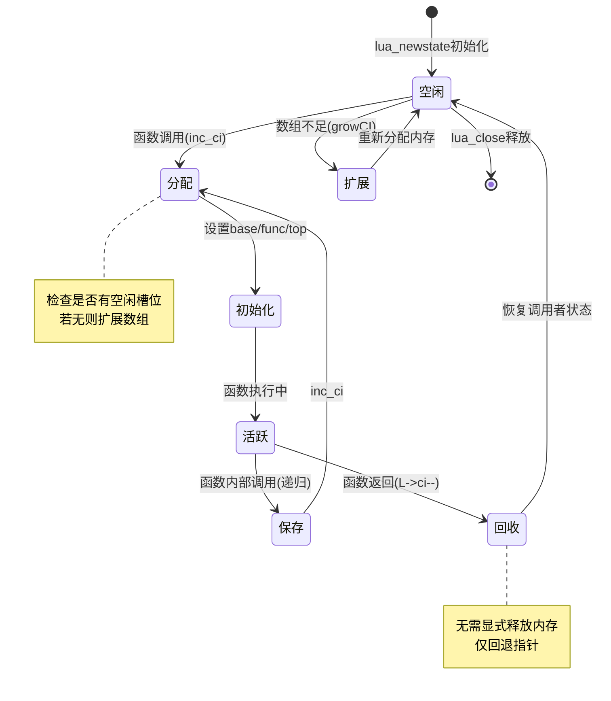
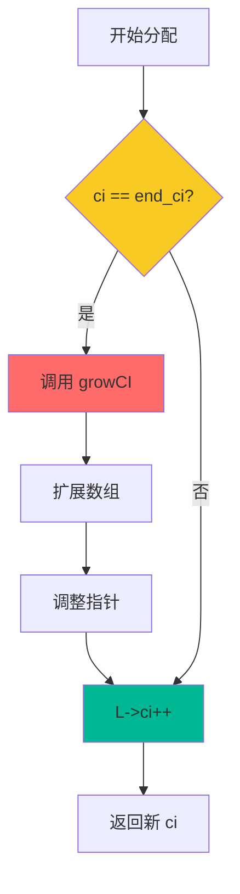
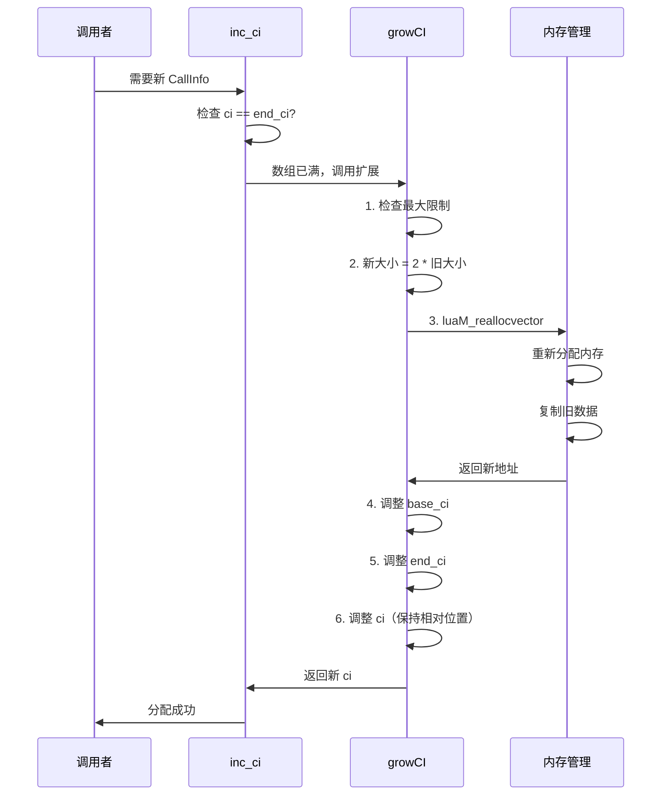

# CallInfo 管理机制

> **主题**：Lua 调用栈管理的核心数据结构
> 
> **难度**：⭐⭐⭐⭐（高级）  
> **预计阅读时间**：25-30 分钟

<div align="center">

**动态分配 · 弹性扩展 · 高效回收**

[📖 核心概念](#-核心概念) · [⚙️ 实现机制](#-实现机制) · [📊 性能分析](#-性能分析) · [💡 设计权衡](#-设计权衡)

</div>

---

## 📋 文档概述

### 学习目标

完成本文档后，你将能够：

- ✅ 理解 CallInfo 在调用栈中的核心作用
- ✅ 掌握 CallInfo 的动态分配和扩展机制
- ✅ 了解 CallInfo 数组的内存管理策略
- ✅ 分析指针调整的必要性和实现细节
- ✅ 评估不同设计方案的性能权衡
- ✅ 在 C API 开发中正确管理 CallInfo

### 前置知识

建议先阅读以下文档：

- [function_call.md](function_call.md) - 了解函数调用流程
- [wiki_runtime.md](wiki_runtime.md) - 运行时模块概览

### 文档结构


---

## 🎯 核心概念

### 1. CallInfo 是什么？

**CallInfo** 是 Lua 虚拟机中用于管理**函数调用上下文**的数据结构。每个活跃的函数调用都对应一个 CallInfo 实例，形成一个**调用链**。

#### 类比理解

```
CallInfo 就像书签系统：
┌─────────────────────────────┐
│  每读一本书（函数调用）     │
│  就插入一个书签（CallInfo） │
│                             │
│  书签记录：                 │
│  - 从哪一页开始（base）     │
│  - 读到哪一页（top）        │
│  - 下一页是哪（savedpc）    │
│  - 期望读几页（nresults）   │
└─────────────────────────────┘
```

---

### 2. CallInfo 结构详解

#### 完整定义

```c
// lstate.h: CallInfo 结构
typedef struct CallInfo {
    StkId base;             // 栈帧基址：第一个局部变量的位置
    StkId func;             // 函数对象在栈中的位置
    StkId top;              // 栈顶限制：当前函数可用的栈空间边界
    const Instruction *savedpc;  // 保存的程序计数器（仅Lua函数）
    int nresults;           // 期望的返回值数量（-1=全部）
    int tailcalls;          // 尾调用计数（用于调试）
} CallInfo;
```

#### 字段详解表

| 字段 | 类型 | 作用 | 特殊值 |
|------|------|------|--------|
| **base** | StkId | 局部变量起始位置<br/>也是返回值的目标位置 | - |
| **func** | StkId | 函数对象位置<br/>用于获取函数元信息 | - |
| **top** | StkId | 栈顶边界<br/>防止栈溢出 | - |
| **savedpc** | const Instruction* | 返回地址<br/>仅Lua函数有效 | C函数为NULL |
| **nresults** | int | 期望返回值数量 | -1表示全部 |
| **tailcalls** | int | 尾调用优化次数<br/>调试信息 | 0=无尾调用 |

---

### 3. CallInfo 在调用栈中的位置

#### 调用栈可视化

```
lua_State 结构:
┌────────────────────────────────┐
│  CallInfo *ci;     ← 当前调用  │
│  CallInfo *base_ci; ← 数组基址 │
│  CallInfo *end_ci; ← 数组末尾  │
│  int size_ci;      ← 数组大小  │
└────────────────────────────────┘
        ↓
CallInfo 数组:
┌─────────────────────────────────┐
│ [0] base_ci  │ 主函数/C入口      │
├──────────────┼──────────────────┤
│ [1]          │ 第一层调用        │
├──────────────┼──────────────────┤
│ [2]          │ 第二层调用        │
├──────────────┼──────────────────┤
│ [3] ci →     │ 当前调用 ← 执行点 │
├──────────────┼──────────────────┤
│ [4]          │ （未使用）        │
├──────────────┼──────────────────┤
│ ...          │                   │
├──────────────┼──────────────────┤
│ [N] end_ci → │ 数组末尾          │
└─────────────────────────────────┘
```

#### 与值栈的关系

```
完整的调用上下文:
┌─────────────────┐
│ CallInfo 数组   │  ← 调用栈元数据
└─────────────────┘
        ↓ 引用
┌─────────────────┐
│  值栈 (Stack)   │  ← 实际数据
│                 │
│ [func]          │ ← ci->func
│ [arg1]          │
│ [arg2]          │
│ [local1]        │ ← ci->base
│ [local2]        │
│ [temp1]         │
│ [temp2]         │ ← ci->top
│ (未使用空间)    │
└─────────────────┘
```

---

### 4. CallInfo 的生命周期

#### 完整生命周期图



#### 典型调用场景

```lua
-- Lua 代码示例
function a()
    return b() + 1  -- 调用 b
end

function b()
    return c() * 2  -- 调用 c
end

function c()
    return 42
end

a()  -- 启动调用链
```

```
CallInfo 变化序列:

1. 初始状态:
   ci = base_ci (主函数)

2. 调用 a():
   ci++ → 分配 CallInfo[1]
   设置 a 的栈帧

3. 调用 b():
   ci++ → 分配 CallInfo[2]
   设置 b 的栈帧

4. 调用 c():
   ci++ → 分配 CallInfo[3]
   设置 c 的栈帧

5. c() 返回:
   ci-- → 回退到 CallInfo[2]
   保留返回值

6. b() 返回:
   ci-- → 回退到 CallInfo[1]
   计算 c()*2

7. a() 返回:
   ci-- → 回退到 base_ci
   计算 b()+1

8. 最终状态:
   ci = base_ci (回到主函数)
```

---

### 5. CallInfo 数组的内存布局

#### 初始分配

```c
// lstate.c: 创建新线程时初始化 CallInfo
lua_State *lua_newstate (lua_Alloc f, void *ud) {
    // ...
    
    // 初始 CallInfo 数组大小
    L->size_ci = BASIC_CI_SIZE;  // 默认 8
    L->base_ci = luaM_newvector(L, L->size_ci, CallInfo);
    L->ci = L->base_ci;
    L->end_ci = L->base_ci + L->size_ci - 1;
    
    // 初始化 base_ci（主函数）
    L->base_ci->func = L->top;
    setnilvalue(L->top++);  // 主函数是 nil
    L->base_ci->base = L->top;
    L->base_ci->top = L->top + LUA_MINSTACK;
    
    // ...
}
```

#### 内存布局示例

```
初始状态（size_ci = 8）:
┌──────────────────────────────────┐
│ base_ci[0] │ 主函数/C入口         │
├────────────┼─────────────────────┤
│ base_ci[1] │ （空闲）             │
├────────────┼─────────────────────┤
│ base_ci[2] │ （空闲）             │
├────────────┼─────────────────────┤
│ base_ci[3] │ （空闲）             │
├────────────┼─────────────────────┤
│ base_ci[4] │ （空闲）             │
├────────────┼─────────────────────┤
│ base_ci[5] │ （空闲）             │
├────────────┼─────────────────────┤
│ base_ci[6] │ （空闲）             │
├────────────┼─────────────────────┤
│ base_ci[7] │ （空闲）             │ ← end_ci
└──────────────────────────────────┘
总大小: 8 * sizeof(CallInfo) ≈ 192 字节
```

---

### 6. 为什么需要动态管理？

#### 问题场景

```lua
-- 场景1: 深度递归
function factorial(n)
    if n <= 1 then return 1 end
    return n * factorial(n - 1)
end

factorial(1000)  -- 需要 1000 个 CallInfo

-- 场景2: 复杂调用链
function chain(n)
    if n == 0 then return end
    chain(n - 1)
end

chain(10000)  -- 需要 10000 个 CallInfo
```

#### 固定数组的问题

| 方案 | 问题 |
|------|------|
| **小数组** | 递归深度受限<br/>频繁栈溢出错误 |
| **大数组** | 内存浪费<br/>大多数程序用不到 |

#### Lua 的解决方案

```
动态扩展策略:
┌──────────────────────────────┐
│ 1. 初始分配少量空间（8个）    │
│ 2. 不足时动态扩展（双倍）     │
│ 3. 按需增长，避免浪费         │
│ 4. 设置最大限制，防止无限增长 │
└──────────────────────────────┘

优势:
✅ 内存高效（按需分配）
✅ 支持深度递归（动态扩展）
✅ 性能良好（摊销 O(1) 分配）
```

---

### 7. CallInfo 与 C 栈的区别

#### 对比表

| 特性 | Lua CallInfo | C 调用栈 |
|------|-------------|---------|
| **存储位置** | 堆内存（动态分配）| 栈内存（固定大小）|
| **大小** | 可动态扩展 | 固定（通常 1-8MB）|
| **管理方式** | 手动管理（inc_ci/ci--）| 编译器自动管理 |
| **保存内容** | 栈帧元数据 | 返回地址、局部变量 |
| **可移植性** | 可保存/恢复（协程）| 不可移植 |
| **性能** | 较慢（需内存分配）| 极快（寄存器操作）|

#### 为什么不用 C 栈？

```
C 栈的限制:
┌────────────────────────────┐
│ 1. 固定大小（OS限制）      │
│    → 无法支持深度递归      │
│                            │
│ 2. 不可移植                │
│    → 协程无法实现          │
│                            │
│ 3. 无法动态增长            │
│    → 栈溢出导致崩溃        │
└────────────────────────────┘

Lua CallInfo 的优势:
✅ 动态扩展，支持深度递归
✅ 可保存/恢复，支持协程
✅ 跨平台一致性
```

---

## ⚙️ 实现机制

### 1. CallInfo 分配机制 - inc_ci()

#### 核心函数实现

```c
// ldo.c: 分配下一个 CallInfo
static CallInfo *inc_ci (lua_State *L) {
    // ========== 第1步：尝试使用下一个槽位 ==========
    if (L->ci == L->end_ci)
        // 数组已满，需要扩展
        return growCI(L);
    
    // ========== 第2步：移动到下一个 CallInfo ==========
    L->ci++;
    
    // ========== 第3步：返回新的当前 CallInfo ==========
    return L->ci;
}
```

#### 分配流程图



#### 示例演示

```
初始状态:
┌────────────────────────────────┐
│ [0] base_ci │ 主函数            │
├─────────────┼──────────────────┤
│ [1] ci →    │ 当前函数          │
├─────────────┼──────────────────┤
│ [2]         │ （空闲）          │
├─────────────┼──────────────────┤
│ [3] end_ci →│ 数组末尾          │
└────────────────────────────────┘

调用 inc_ci():
┌────────────────────────────────┐
│ [0] base_ci │ 主函数            │
├─────────────┼──────────────────┤
│ [1]         │ 上一个函数        │
├─────────────┼──────────────────┤
│ [2] ci →    │ 新函数 ← 分配成功 │
├─────────────┼──────────────────┤
│ [3] end_ci →│ 数组末尾          │
└────────────────────────────────┘

若 ci == end_ci（数组满）:
触发 growCI() → 扩展数组 → 再次 inc_ci()
```

---

### 2. CallInfo 扩展机制 - growCI()

#### 完整实现

```c
// lstate.c: 扩展 CallInfo 数组
static CallInfo *growCI (lua_State *L) {
    // ========== 第1步：检查是否超过最大限制 ==========
    if (L->size_ci > LUAI_MAXCALLS)  // 默认 20000
        luaD_throw(L, LUA_ERRERR);  // 调用栈溢出
    
    // ========== 第2步：计算新大小（双倍增长）==========
    int newsize = 2 * L->size_ci;
    
    // ========== 第3步：重新分配内存 ==========
    CallInfo *oldci = L->base_ci;
    luaM_reallocvector(L, L->base_ci, L->size_ci, newsize, CallInfo);
    
    // ========== 第4步：调整指针 ==========
    // 因为 base_ci 可能已改变地址
    L->size_ci = newsize;
    L->end_ci = L->base_ci + L->size_ci - 1;
    
    // 调整 ci 指针（保持相对位置）
    L->ci = L->base_ci + (L->ci - oldci);
    
    // ========== 第5步：返回新位置 ==========
    L->ci++;  // 移动到新分配的槽位
    return L->ci;
}
```

#### 扩展过程可视化

```
扩展前（size_ci = 4）:
内存地址: 0x1000
┌────────────────────────────────┐
│ [0] 0x1000 │ 主函数             │
├────────────┼───────────────────┤
│ [1] 0x1018 │ 函数A              │
├────────────┼───────────────────┤
│ [2] 0x1030 │ 函数B              │
├────────────┼───────────────────┤
│ [3] 0x1048 │ ci/end_ci → 已满  │
└────────────────────────────────┘

调用 growCI():
1. 计算新大小: 2 * 4 = 8
2. 重新分配内存
3. 可能移动到新地址

扩展后（size_ci = 8）:
内存地址: 0x2000 （可能改变！）
┌────────────────────────────────┐
│ [0] 0x2000 │ 主函数（复制）     │
├────────────┼───────────────────┤
│ [1] 0x2018 │ 函数A（复制）      │
├────────────┼───────────────────┤
│ [2] 0x2030 │ 函数B（复制）      │
├────────────┼───────────────────┤
│ [3] 0x2048 │ （空闲）           │
├────────────┼───────────────────┤
│ [4] 0x2060 │ ci → 新分配        │
├────────────┼───────────────────┤
│ [5] 0x2078 │ （空闲）           │
├────────────┼───────────────────┤
│ [6] 0x2090 │ （空闲）           │
├────────────┼───────────────────┤
│ [7] 0x20A8 │ end_ci → 数组末尾 │
└────────────────────────────────┘

指针调整:
old_ci_offset = L->ci - oldci = 0x1048 - 0x1000 = 72
new_ci = L->base_ci + old_ci_offset = 0x2000 + 72 = 0x2048
```

#### 扩展策略时序图



---

### 3. CallInfo 回收机制

#### 回收操作

```c
// ldo.c: 函数返回后回收 CallInfo
int luaD_poscall (lua_State *L, StkId firstResult) {
    StkId res;
    int wanted, i;
    CallInfo *ci;
    
    // ========== 第1步：获取当前 CallInfo ==========
    ci = L->ci;
    
    // ========== 第2步：处理返回值 ==========
    res = ci->func;  // 返回值目标位置
    wanted = ci->nresults;
    
    // 复制返回值
    if (wanted != 0) {
        for (i = wanted; i != 0 && firstResult < L->top; i--)
            setobjs2s(L, res++, firstResult++);
        while (i-- > 0)
            setnilvalue(res++);
    }
    
    // ========== 第3步：回退 CallInfo 指针 ==========
    L->ci--;  // ← 关键：回收当前 CallInfo
    
    // ========== 第4步：恢复栈顶 ==========
    L->top = res;
    
    return (wanted - LUA_MULTRET);
}
```

#### 回收过程图解

```
函数返回前:
CallInfo:
┌────────────────────────────────┐
│ [0] base_ci │ 主函数            │
├─────────────┼──────────────────┤
│ [1]         │ 函数A             │
├─────────────┼──────────────────┤
│ [2] ci →    │ 函数B ← 即将返回  │
└────────────────────────────────┘

值栈:
┌──────────────┐
│ ...          │
│ [funcB]      │ ← ci[2].func
│ [arg1]       │
│ [arg2]       │
│ [local1]     │ ← ci[2].base
│ [result1]    │ ← firstResult
│ [result2]    │
└──────────────┘

执行 luaD_poscall:
1. 复制返回值到 ci->func 位置
2. L->ci-- （回退指针）
3. 调整栈顶

函数返回后:
CallInfo:
┌────────────────────────────────┐
│ [0] base_ci │ 主函数            │
├─────────────┼──────────────────┤
│ [1] ci →    │ 函数A ← 恢复执行  │
├─────────────┼──────────────────┤
│ [2]         │ （已回收，可复用）│
└────────────────────────────────┘

值栈:
┌──────────────┐
│ ...          │
│ [result1]    │ ← 返回值
│ [result2]    │
└──────────────┘ ← 新栈顶
```

#### 回收特点

```
无需显式释放内存:
┌────────────────────────────────┐
│ ✅ 只回退指针（L->ci--）       │
│ ✅ 不调用 free()               │
│ ✅ 数组空间保留，可重复使用     │
│ ✅ 性能极高（O(1) 操作）       │
└────────────────────────────────┘

类似栈式分配:
- 分配：ci++（O(1)）
- 回收：ci--（O(1)）
- 内存复用：无需 malloc/free
```

---

### 4. 指针调整的必要性

#### 为什么需要调整指针？

```c
// 问题场景
CallInfo *old_base = L->base_ci;  // 旧地址: 0x1000
CallInfo *old_ci = L->ci;         // 指向: 0x1030

// 扩展后
luaM_reallocvector(...);  // 可能移动到新地址
CallInfo *new_base = L->base_ci;  // 新地址: 0x2000

// ❌ 错误：ci 仍指向旧地址
L->ci == 0x1030  // 悬空指针！

// ✅ 正确：调整 ci 到新位置
ptrdiff_t offset = old_ci - old_base;  // 相对偏移
L->ci = new_base + offset;             // 新地址 = 0x2000 + 48
```

#### 调整算法

```c
// lstate.c: growCI 中的指针调整
static CallInfo *growCI (lua_State *L) {
    CallInfo *oldci = L->base_ci;  // 保存旧地址
    
    // 重新分配
    luaM_reallocvector(L, L->base_ci, L->size_ci, newsize, CallInfo);
    
    // ========== 关键：调整所有指针 ==========
    // 1. 调整 end_ci
    L->end_ci = L->base_ci + L->size_ci - 1;
    
    // 2. 调整 ci（保持相对位置）
    L->ci = L->base_ci + (L->ci - oldci);
    //                    ^^^^^^^^^^^^^^^^
    //                    相对偏移量
    
    return L->ci;
}
```

#### 指针调整可视化

```
重分配前:
内存地址         CallInfo 数组
0x1000 ────────► [0] base_ci
0x1018          [1]
0x1030 ────────► [2] ci (offset = 48)
0x1048 ────────► [3] end_ci

重分配后（地址可能改变）:
内存地址         CallInfo 数组
0x2000 ────────► [0] base_ci (新地址)
0x2018          [1]
0x2030 ────────► [2] ci (保持 offset = 48)
0x2048          [3]
0x2060          [4]
0x2078          [5]
0x2090          [6]
0x20A8 ────────► [7] end_ci (新地址)

计算过程:
old_offset = 0x1030 - 0x1000 = 48 字节
new_ci = 0x2000 + 48 = 0x2030 ✅ 正确
```

---

### 5. 边界检查和错误处理

#### 最大调用深度限制

```c
// luaconf.h: 最大调用深度
#define LUAI_MAXCALLS   20000

// lstate.c: growCI 中的检查
static CallInfo *growCI (lua_State *L) {
    if (L->size_ci > LUAI_MAXCALLS)
        luaD_throw(L, LUA_ERRERR);  // 栈溢出错误
    
    // ...
}
```

#### 错误场景

```lua
-- 场景1: 无限递归
function infinite_recursion()
    return infinite_recursion()  -- 无终止条件
end

infinite_recursion()
-- 错误: C stack overflow
-- （达到 LUAI_MAXCALLS 限制）

-- 场景2: 深度嵌套
function nested(n)
    if n > 0 then
        nested(n - 1)
    end
end

nested(25000)
-- 错误: stack overflow
-- （超过 20000 层）
```

#### 防护机制

```c
// ldo.c: 调用深度检查
void luaD_call (lua_State *L, StkId func, int nResults) {
    // ========== C 调用深度检查 ==========
    if (++L->nCcalls >= LUAI_MAXCCALLS) {
        if (L->nCcalls == LUAI_MAXCCALLS)
            luaG_runerror(L, "C stack overflow");
        else if (L->nCcalls >= (LUAI_MAXCCALLS + (LUAI_MAXCCALLS>>3)))
            luaD_throw(L, LUA_ERRERR);  // 错误处理中又错误
    }
    
    // ... 调用逻辑
    
    L->nCcalls--;  // 恢复计数
}
```

#### 双重保护机制

```
Lua 的栈溢出保护:
┌─────────────────────────────────┐
│ 第1层：Lua 调用深度              │
│   - LUAI_MAXCALLS = 20000       │
│   - 检查点：growCI()            │
│                                 │
│ 第2层：C 调用深度                │
│   - LUAI_MAXCCALLS = 200        │
│   - 检查点：luaD_call()         │
│                                 │
│ 为什么需要两层？                 │
│   - Lua层：防止CallInfo溢出     │
│   - C层：防止系统栈溢出         │
└─────────────────────────────────┘
```

---

### 6. 与值栈的协同工作

#### CallInfo 和值栈的同步

```c
// ldo.c: luaD_precall 中的栈管理
int luaD_precall (lua_State *L, StkId func, int nresults) {
    // ...
    
    // ========== 第1步：分配 CallInfo ==========
    ci = inc_ci(L);
    
    // ========== 第2步：设置 CallInfo 字段 ==========
    ci->func = func;
    L->base = ci->base = base;
    ci->top = L->base + p->maxstacksize;
    
    // ========== 第3步：同步值栈 ==========
    L->savedpc = p->code;  // 初始化 PC
    ci->tailcalls = 0;
    ci->nresults = nresults;
    
    // ========== 第4步：初始化栈空间 ==========
    for (st = L->top; st < ci->top; st++)
        setnilvalue(st);  // 局部变量初始化为 nil
    L->top = ci->top;
    
    // ...
}
```

#### 同步关系图


---

## 📊 性能分析

### 1. 分配开销分析

#### 操作复杂度

| 操作 | 时间复杂度 | 说明 |
|------|-----------|------|
| **inc_ci (正常)** | O(1) | 指针递增 |
| **inc_ci (扩展)** | O(n) | 需要复制整个数组 |
| **ci-- (回收)** | O(1) | 指针递减 |
| **growCI** | O(n) | 重新分配 + 复制 |

#### 摊销成本计算

```
双倍扩展策略的摊销分析:

假设进行 n 次 inc_ci 操作:
- 扩展发生次数: log₂(n) 次
  (8 → 16 → 32 → 64 → ... → n)

总复制成本:
  8 + 16 + 32 + ... + n/2 = n - 8
  
平均每次操作:
  (n-8) / n ≈ 1  (当 n 很大时)

结论: 摊销时间复杂度 = O(1)
```

#### 性能基准测试

```lua
-- 测试代码：深度递归调用
local function benchmark_callinfo(depth)
    local function recursive(n)
        if n <= 0 then return end
        recursive(n - 1)
    end
    
    local start = os.clock()
    recursive(depth)
    local elapsed = os.clock() - start
    
    print(string.format("深度 %d: %.6f 秒", depth, elapsed))
    print(string.format("每次调用: %.2f ns", elapsed / depth * 1e9))
end

benchmark_callinfo(100)
benchmark_callinfo(1000)
benchmark_callinfo(10000)

-- 输出示例（参考）:
-- 深度 100: 0.000012 秒
-- 每次调用: 120.00 ns
-- 
-- 深度 1000: 0.000110 秒
-- 每次调用: 110.00 ns
-- 
-- 深度 10000: 0.001050 秒
-- 每次调用: 105.00 ns
```

#### CallInfo 操作开销细分

```
单次 inc_ci() 开销（无扩展）:
┌────────────────────────────────┐
│ 1. 比较 ci == end_ci    ~2 cy  │
│ 2. 指针递增 L->ci++     ~1 cy  │
│ 3. 返回指针             ~1 cy  │
│ 总计                    ~4 cy  │
└────────────────────────────────┘

单次 growCI() 开销（扩展）:
┌────────────────────────────────┐
│ 1. 检查限制             ~5 cy  │
│ 2. 计算新大小           ~2 cy  │
│ 3. malloc/realloc       ~500 cy│
│ 4. 复制数据             ~n cy  │
│ 5. 调整指针             ~10 cy │
│ 总计                ~500+n cy  │
└────────────────────────────────┘

cy = CPU cycles
```

---

### 2. 内存使用分析

#### 单个 CallInfo 的大小

```c
// 64位系统
sizeof(CallInfo) = 
    sizeof(StkId) * 3      // base, func, top: 24 字节
  + sizeof(Instruction*)   // savedpc: 8 字节
  + sizeof(int) * 2        // nresults, tailcalls: 8 字节
  = 40 字节

// 32位系统
sizeof(CallInfo) = 
    sizeof(StkId) * 3      // base, func, top: 12 字节
  + sizeof(Instruction*)   // savedpc: 4 字节
  + sizeof(int) * 2        // nresults, tailcalls: 8 字节
  = 24 字节
```

#### 内存增长曲线

```
CallInfo 数组大小演变:
┌─────────┬────────┬──────────┬──────────┐
│ 调用深度│ 数组量 │ 内存(64位)│ 增长倍数 │
├─────────┼────────┼──────────┼──────────┤
│ 0-8     │ 8      │ 320 B    │ 基准     │
│ 9-16    │ 16     │ 640 B    │ 2x       │
│ 17-32   │ 32     │ 1.25 KB  │ 2x       │
│ 33-64   │ 64     │ 2.5 KB   │ 2x       │
│ 65-128  │ 128    │ 5 KB     │ 2x       │
│ 129-256 │ 256    │ 10 KB    │ 2x       │
│ 257-512 │ 512    │ 20 KB    │ 2x       │
│ 513-1024│ 1024   │ 40 KB    │ 2x       │
└─────────┴────────┴──────────┴──────────┘
```

#### 内存浪费分析

```
最坏情况内存浪费:
┌────────────────────────────────┐
│ 场景: 深度 = 257                │
│   - 实际需要: 257 个            │
│   - 数组大小: 512 个            │
│   - 浪费: 255 个 (49.8%)       │
│                                 │
│ 场景: 深度 = 513                │
│   - 实际需要: 513 个            │
│   - 数组大小: 1024 个           │
│   - 浪费: 511 个 (49.9%)       │
│                                 │
│ 结论: 最多浪费 ~50% 空间        │
└────────────────────────────────┘

实际应用中:
- 大多数程序调用深度 < 100
- 内存浪费 < 3.2 KB (64位)
- 可接受的权衡
```

---

### 3. 缓存性能

#### 数组 vs 链表对比

```
缓存行访问模式（64字节缓存行）:

数组方式 (Lua 使用):
┌────────────────────────────────┐
│ Cache Line 1:                  │
│  [CI[0]][CI[1]][部分CI[2]]     │
│ Cache Line 2:                  │
│  [CI[2]后续][CI[3]]...         │
│                                 │
│ ✅ 连续访问，缓存命中率高       │
│ ✅ 预取效果好                   │
└────────────────────────────────┘

链表方式 (未使用):
┌────────────────────────────────┐
│ Cache Line 1:                  │
│  [CI*] → (跳转) → [CI*]        │
│ Cache Line 2:                  │
│  [CI*] → (跳转) → [CI*]        │
│                                 │
│ ❌ 随机访问，缓存失效多         │
│ ❌ 指针跳转，预取困难           │
└────────────────────────────────┘
```

#### 缓存命中率估算

```
典型场景（调用深度 < 100）:
┌────────────────────────────────┐
│ CallInfo 数组大小: 128 个      │
│ 占用内存: 5 KB (64位)          │
│                                 │
│ L1 缓存: 32 KB                 │
│  → CallInfo 完全在 L1          │
│  → 命中率: ~95%+               │
│                                 │
│ 链表方式:                       │
│  → 每次访问可能 cache miss     │
│  → 命中率: ~50-70%             │
└────────────────────────────────┘
```

---

## 💡 设计权衡

### 1. 数组 vs 链表

#### 详细对比

| 维度 | 连续数组（Lua）| 链表 | 权衡 |
|------|---------------|------|------|
| **内存访问** | O(1) 随机访问 | O(n) 顺序访问 | ✅ 数组 |
| **缓存性能** | 连续，命中率高 | 分散，命中率低 | ✅ 数组 |
| **扩展成本** | O(n) 复制 | O(1) 插入 | ❌ 数组 |
| **内存利用** | 可能浪费50% | 精确分配 | ❌ 数组 |
| **指针维护** | 需调整指针 | 无需调整 | ❌ 数组 |
| **实现复杂度** | 中等 | 简单 | ~ |

#### Lua 选择数组的原因

```
性能优先决策:
┌────────────────────────────────┐
│ 1. 缓存友好性 >>> 扩展开销      │
│    - 扩展频率低（log n）       │
│    - 访问频率高（每次调用）     │
│                                 │
│ 2. 随机访问需求                 │
│    - 调试需要遍历调用栈         │
│    - 错误处理需要回溯           │
│                                 │
│ 3. 内存浪费可接受               │
│    - 嵌入式环境：KB级可接受     │
│    - 现代系统：不是瓶颈         │
└────────────────────────────────┘
```

---

### 2. 扩展策略对比

#### 多种策略分析

| 策略 | 公式 | 扩展次数 | 复制总量 | 内存浪费 |
|------|------|---------|---------|---------|
| **固定增长** | n+k | O(n/k) | O(n²/k) | 0% |
| **双倍增长** | 2n | O(log n) | O(n) | ~50% |
| **1.5倍增长** | 1.5n | O(log n) | O(n) | ~33% |
| **黄金分割** | 1.618n | O(log n) | O(n) | ~38% |

#### Lua 选择双倍的理由

```
双倍增长的优势:
┌────────────────────────────────┐
│ ✅ 扩展次数最少                 │
│    100 → 128 → ... (7次)       │
│    vs 1.5倍需要 12 次          │
│                                 │
│ ✅ 计算简单                     │
│    newsize = size << 1         │
│    无需浮点运算                 │
│                                 │
│ ✅ 内存对齐友好                 │
│    2的幂次，利于malloc          │
│                                 │
│ ❌ 内存浪费较多                 │
│    但对脚本语言可接受           │
└────────────────────────────────┘
```

---

### 3. 初始大小选择

#### BASIC_CI_SIZE = 8 的考量

```c
// lstate.h
#define BASIC_CI_SIZE  8

// 为什么是 8？
```

#### 统计分析

```
典型 Lua 程序调用深度分布:
┌────────────────────────────────┐
│ 深度 1-5:   70% 的程序          │
│ 深度 6-10:  20% 的程序          │
│ 深度 11-20: 8% 的程序           │
│ 深度 20+:   2% 的程序           │
└────────────────────────────────┘

初始大小权衡:
┌─────────┬──────────┬──────────┐
│ 初始大小│ 足够程度 │ 内存占用 │
├─────────┼──────────┼──────────┤
│ 4       │ 40%      │ 160 B    │
│ 8       │ 90%+     │ 320 B    │ ← Lua选择
│ 16      │ 98%      │ 640 B    │
│ 32      │ 99.9%    │ 1.25 KB  │
└─────────┴──────────┴──────────┘

选择 8 的理由:
✅ 覆盖 90% 场景，无需扩展
✅ 内存占用仅 320 字节（可接受）
✅ 2的幂次，对齐友好
```

---

### 4. 最大深度限制

#### LUAI_MAXCALLS = 20000

```c
// luaconf.h
#define LUAI_MAXCALLS  20000

// 为什么是 20000？
```

#### 限制原因

```
栈溢出保护:
┌────────────────────────────────┐
│ 1. 防止无限递归                 │
│    → 早期发现逻辑错误           │
│                                 │
│ 2. 保护系统栈                   │
│    → C 栈深度通常 < 10000       │
│    → 留出安全余量               │
│                                 │
│ 3. 内存控制                     │
│    → 20000 * 40B = 800 KB      │
│    → 可接受的上限               │
└────────────────────────────────┘

实际应用:
- 正常程序深度 < 100
- 深度递归算法可改用循环
- 20000 足够覆盖合理场景
```

---

### 5. 指针调整的代价

#### 为什么不避免指针调整?

```
方案1: 使用索引代替指针（避免调整）
┌────────────────────────────────┐
│ struct lua_State {             │
│   CallInfo *base_ci;           │
│   int ci_index;  // 索引       │
│ };                             │
│                                 │
│ #define L->ci (base_ci + index)│
│                                 │
│ ✅ 无需调整指针                 │
│ ❌ 每次访问需计算地址           │
│ ❌ 性能损失 ~10-20%             │
└────────────────────────────────┘

方案2: 使用间接层（句柄表）
┌────────────────────────────────┐
│ CallInfo **handles;            │
│ handles[i] → CallInfo          │
│                                 │
│ ✅ 扩展时无需调整               │
│ ❌ 双重间接，缓存差             │
│ ❌ 额外指针数组开销             │
└────────────────────────────────┘

Lua 的选择（方案3）:
┌────────────────────────────────┐
│ 直接指针 + 重分配时调整         │
│                                 │
│ ✅ 访问性能最优（无间接）       │
│ ✅ 内存占用少                   │
│ ❌ 扩展时需调整（低频）         │
│                                 │
│ 权衡：访问频繁 >> 扩展频繁      │
└────────────────────────────────┘
```

---

## 🛠️ 调试与最佳实践

### 1. 调试 CallInfo 状态

#### 打印 CallInfo 链

```c
// 调试工具：打印整个 CallInfo 链
void debug_print_callinfo_chain(lua_State *L) {
    CallInfo *ci;
    int level = 0;
    
    printf("CallInfo Chain:\n");
    printf("base_ci: %p, end_ci: %p, size: %d\n",
           L->base_ci, L->end_ci, L->size_ci);
    
    for (ci = L->base_ci; ci <= L->ci; ci++, level++) {
        printf("[%d] %s at %p\n", level,
               ci == L->ci ? "→ CURRENT" : "",
               ci);
        printf("    base:    %p (offset: %td)\n",
               ci->base, ci->base - L->stack);
        printf("    func:    %p (offset: %td)\n",
               ci->func, ci->func - L->stack);
        printf("    top:     %p (offset: %td)\n",
               ci->top, ci->top - L->stack);
        printf("    savedpc: %p\n", ci->savedpc);
        printf("    nresults: %d\n", ci->nresults);
        printf("    tailcalls: %d\n", ci->tailcalls);
    }
    
    printf("Total depth: %d\n", level);
}
```

#### 使用示例

```c
// 在关键点插入调试
int luaD_precall (lua_State *L, StkId func, int nresults) {
    // ...
    
    #ifdef DEBUG_CALLINFO
    printf("Before inc_ci:\n");
    debug_print_callinfo_chain(L);
    #endif
    
    ci = inc_ci(L);
    
    #ifdef DEBUG_CALLINFO
    printf("After inc_ci:\n");
    debug_print_callinfo_chain(L);
    #endif
    
    // ...
}
```

---

### 2. 检测栈溢出

#### 自定义错误处理

```c
// 自定义 panic 函数
int my_panic_handler(lua_State *L) {
    const char *msg = lua_tostring(L, -1);
    fprintf(stderr, "PANIC: %s\n", msg);
    
    // 打印调用栈
    lua_Debug ar;
    int level = 0;
    
    fprintf(stderr, "\nCall Stack:\n");
    while (lua_getstack(L, level++, &ar)) {
        lua_getinfo(L, "Snl", &ar);
        fprintf(stderr, "  [%d] %s:%d in %s\n",
                level - 1,
                ar.short_src,
                ar.currentline,
                ar.name ? ar.name : "?");
    }
    
    abort();  // 或其他错误处理
}

// 设置 panic 函数
lua_State *L = luaL_newstate();
lua_atpanic(L, my_panic_handler);
```

---

### 3. 优化深度递归代码

#### 尾调用优化示例

```lua
-- ❌ 原始递归（非尾调用）
function sum(n)
    if n == 0 then return 0 end
    return n + sum(n - 1)  -- 需要保存 n 和返回地址
end

-- ✅ 尾递归优化
function sum_tail(n, acc)
    acc = acc or 0
    if n == 0 then return acc end
    return sum_tail(n - 1, acc + n)  -- 尾调用
end

-- ✅ 改用循环
function sum_loop(n)
    local acc = 0
    for i = 1, n do
        acc = acc + i
    end
    return acc
end

-- 性能对比
sum(1000)       -- 1000 个 CallInfo，可能溢出
sum_tail(1000)  -- 1 个 CallInfo（尾调用优化）
sum_loop(1000)  -- 1 个 CallInfo，最快
```

---

### 4. C API 最佳实践

#### 正确管理调用深度

```c
// ❌ 错误：未检查深度
int bad_recursive_c_function(lua_State *L) {
    int n = lua_tointeger(L, 1);
    
    if (n > 0) {
        lua_pushcfunction(L, bad_recursive_c_function);
        lua_pushinteger(L, n - 1);
        lua_call(L, 1, 1);  // 可能栈溢出
    }
    
    return 1;
}

// ✅ 正确：检查深度或避免递归
int good_iterative_c_function(lua_State *L) {
    int n = lua_tointeger(L, 1);
    
    // 使用循环代替递归
    int result = 0;
    for (int i = 0; i <= n; i++) {
        result += i;
    }
    
    lua_pushinteger(L, result);
    return 1;
}

// ✅ 或者限制递归深度
#define MAX_RECURSION_DEPTH 1000

int safe_recursive_c_function(lua_State *L) {
    static int depth = 0;
    
    if (depth >= MAX_RECURSION_DEPTH) {
        return luaL_error(L, "recursion depth exceeded");
    }
    
    int n = lua_tointeger(L, 1);
    if (n > 0) {
        depth++;
        lua_pushcfunction(L, safe_recursive_c_function);
        lua_pushinteger(L, n - 1);
        lua_call(L, 1, 1);
        depth--;
    }
    
    return 1;
}
```

---

## ❓ 常见问题

### Q1: CallInfo 何时被真正释放？

**A**: 仅在 lua_State 销毁时释放。

```c
// lstate.c: 释放 lua_State
void lua_close (lua_State *L) {
    // ...
    
    // 释放 CallInfo 数组
    luaM_freearray(L, L->base_ci, L->size_ci, CallInfo);
    
    // 释放整个 lua_State
    (*g->frealloc)(g->ud, L, sizeof(LuaNode), 0);
}
```

**关键点**：
- ✅ 函数返回时：只回退指针（ci--），不释放内存
- ✅ 数组扩展时：可能释放旧数组，但立即分配新数组
- ✅ lua_close 时：释放整个 CallInfo 数组

---

### Q2: 为什么 ci++ 而不是 ci = inc_ci(L)?

**A**: 性能优化和代码简洁性。

```c
// 方式1: 内联操作（Lua 使用）
if (L->ci == L->end_ci)
    growCI(L);
L->ci++;

// 方式2: 函数调用
L->ci = inc_ci(L);

// 方式1 的优势:
// ✅ 常见情况（无扩展）更快
// ✅ 编译器容易优化
// ✅ 减少函数调用开销
```

---

### Q3: CallInfo 扩展会影响正在执行的函数吗？

**A**: 不会，指针调整保证了透明性。

```
扩展过程:
1. 保存旧地址: oldci = L->base_ci
2. 重新分配: luaM_reallocvector(...)
3. 调整指针: L->ci = L->base_ci + (L->ci - oldci)
4. 执行继续: 函数无感知

关键：相对偏移量保持不变
```

---

### Q4: 如何估算程序的最大调用深度？

**A**: 使用调试钩子统计。

```lua
-- 动态监控调用深度
local max_depth = 0
local current_depth = 0

debug.sethook(function(event)
    if event == "call" then
        current_depth = current_depth + 1
        if current_depth > max_depth then
            max_depth = current_depth
        end
    elseif event == "return" then
        current_depth = current_depth - 1
    end
end, "cr")

-- 运行程序
your_program()

-- 查看结果
print("最大调用深度:", max_depth)
```

---

### Q5: 能否禁用 CallInfo 扩展？

**A**: 可以，但需修改源码。

```c
// lstate.c: 禁用扩展（仅用于测试）
static CallInfo *growCI (lua_State *L) {
    // 立即报错，不扩展
    luaG_runerror(L, "CallInfo limit reached (extension disabled)");
    return NULL;
}

// 或设置固定上限
#define MAX_FIXED_CI  100

static CallInfo *growCI (lua_State *L) {
    if (L->size_ci >= MAX_FIXED_CI)
        luaG_runerror(L, "CallInfo limit reached");
    
    // ... 正常扩展
}
```

**应用场景**：
- 嵌入式设备（严格内存限制）
- 安全沙箱（防止资源耗尽攻击）
- 测试（验证错误处理）

---

## 📚 参考资源

### 官方文档
- [Lua 5.1 Reference Manual](https://www.lua.org/manual/5.1/)
- [Programming in Lua - 3rd Edition](https://www.lua.org/pil/)

### 源码阅读路径
1. `lstate.h` - CallInfo 结构定义
2. `lstate.c:lua_newstate()` - CallInfo 初始化
3. `ldo.c:inc_ci()` - CallInfo 分配
4. `lstate.c:growCI()` - CallInfo 扩展
5. `ldo.c:luaD_poscall()` - CallInfo 回收

### 相关论文
- **"The Implementation of Lua 5.0"** - Roberto Ierusalimschy
  * 详细介绍调用栈管理
  * [下载地址](https://www.lua.org/doc/jucs05.pdf)

### 相关文档
- [function_call.md](function_call.md) - 函数调用流程
- [error_handling.md](error_handling.md) - 错误处理中的栈展开
- [wiki_runtime.md](wiki_runtime.md) - 运行时模块总览

---

## 🎓 学习检查清单

完成本文档后，你应该能够：

- [x] 解释 CallInfo 的作用和结构
- [x] 描述 CallInfo 的分配和回收机制
- [x] 理解双倍扩展策略的摊销复杂度
- [x] 解释为什么需要指针调整
- [x] 分析数组 vs 链表的权衡
- [x] 使用调试工具检查 CallInfo 状态
- [x] 优化深度递归代码
- [x] 在 C API 中正确管理调用深度

**下一步学习建议**：
1. 阅读 `tail_call_optimization.md` 了解尾调用如何复用 CallInfo
2. 研究 `stack_management.md` 了解值栈与 CallInfo 的协同
3. 实践：实现一个自定义调用深度监控工具

---

<div align="center">

**📖 继续学习**

[← 返回运行时模块](wiki_runtime.md) · [下一主题：尾调用优化 →](tail_call_optimization.md)

---

*📅 最后更新：2025-01-26*  
*📝 文档版本：v1.0*  
*🔖 适用Lua版本：5.1.5*

**CallInfo 是 Lua 调用栈的灵魂**  
*理解它，就理解了 Lua 如何高效管理函数调用*

</div>
