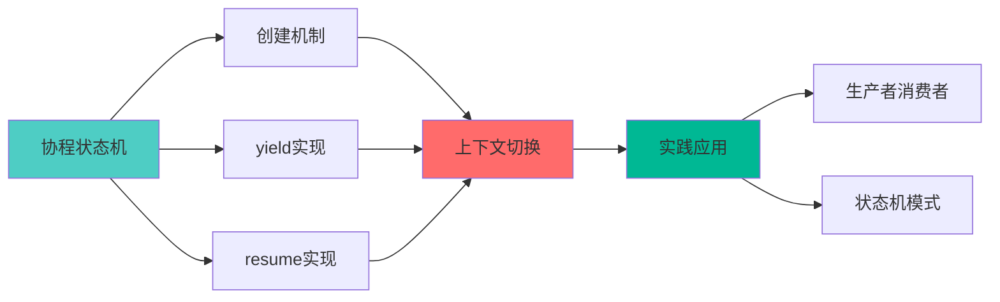
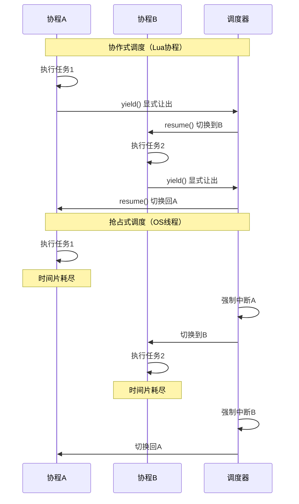
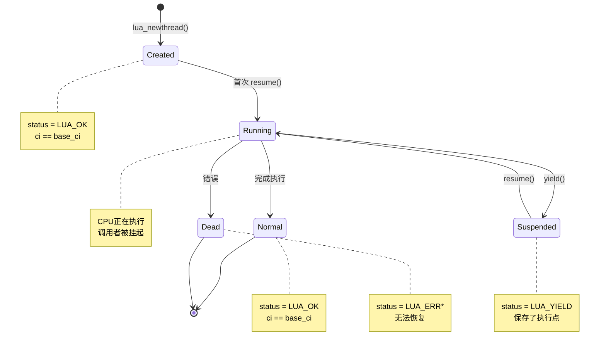
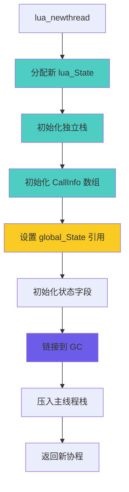
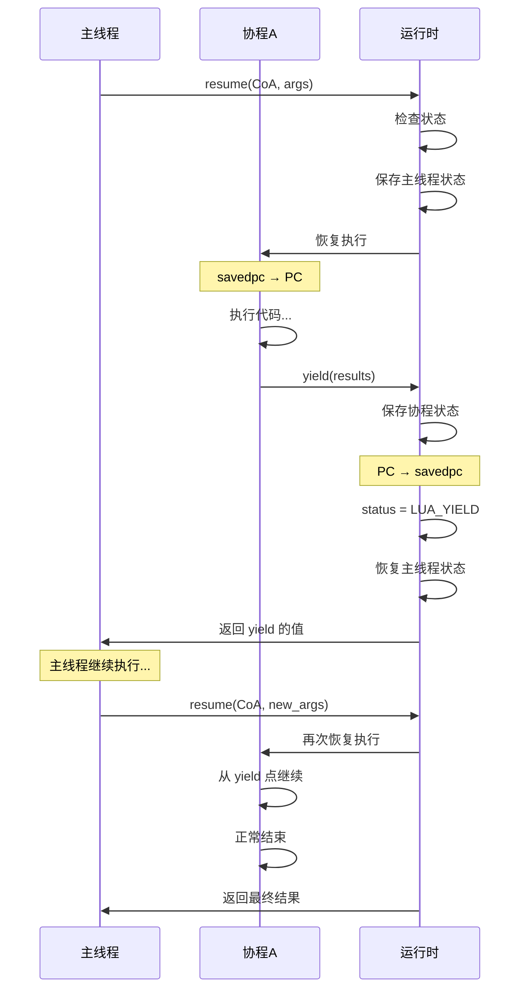
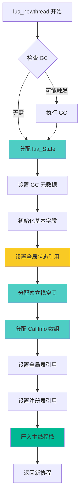
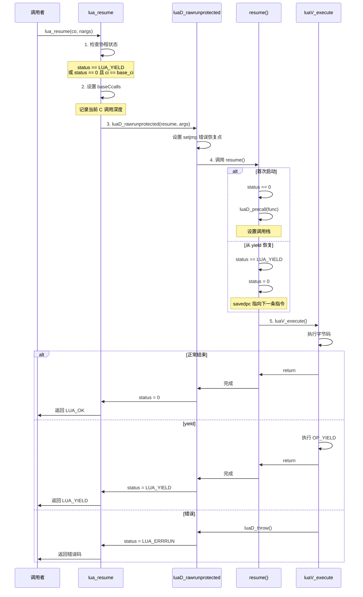
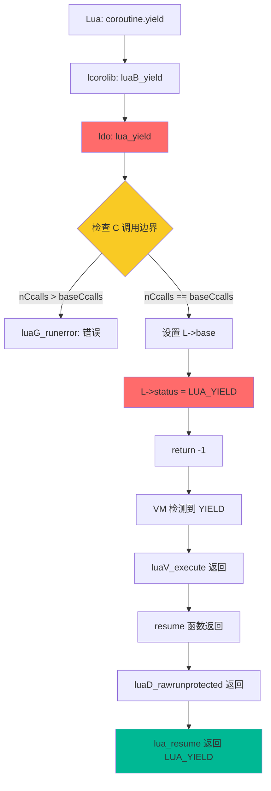
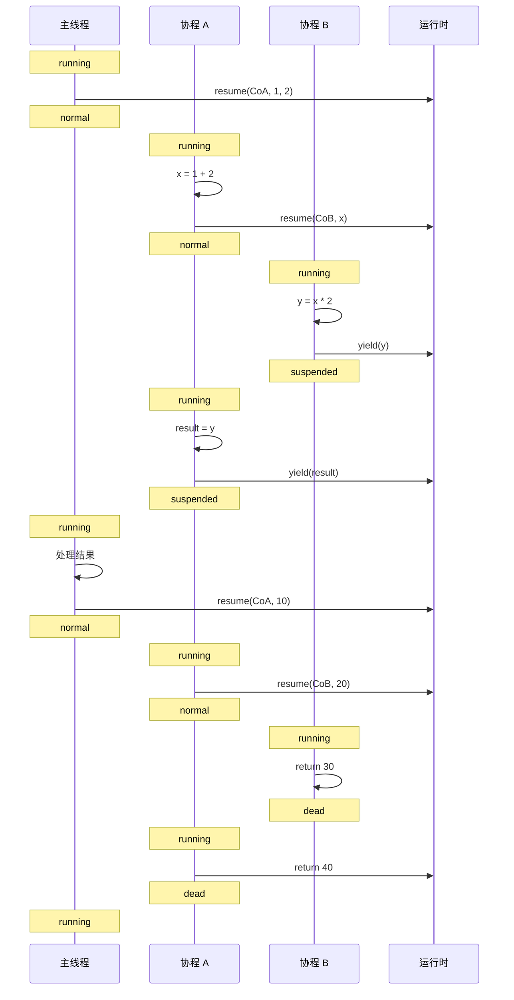

# 🔄 Lua 协程实现机制深度解析

> **核心特性**：轻量级协作式多任务，基于状态保存与恢复的上下文切换  
> **阅读时间**：30-35 分钟 | **难度**：⭐⭐⭐⭐⭐

<div align="center">

**协程创建 · 状态切换 · yield/resume · 上下文管理**

[🎯 核心概念](#-核心概念) · [🔧 实现细节](#-实现细节) · [📊 数据流转](#-数据流转) · [💡 设计权衡](#-设计权衡)

</div>

---

## 📋 文档概述

### 学习目标

完成本文档学习后，你将能够：

- ✅ 理解 Lua 协程的状态机模型
- ✅ 掌握 yield/resume 的底层实现原理
- ✅ 了解协程上下文切换的完整过程
- ✅ 学会协程在实际应用中的使用模式
- ✅ 理解协程与线程的本质区别

### 前置知识

- Lua 函数调用机制（建议先阅读 [function_call.md](function_call.md)）
- CallInfo 和栈管理基础
- C 语言指针和结构体
- 基本的状态机概念

### 文档结构



---

## 🎯 核心概念

### 1. 协程 vs 线程

#### 本质区别

| 特性 | Lua 协程 (Coroutine) | 操作系统线程 (Thread) |
|------|---------------------|---------------------|
| **调度方式** | 协作式（显式让出） | 抢占式（时间片轮转） |
| **切换开销** | 极低 (~100 cycles) | 高 (~10,000 cycles) |
| **内存开销** | ~2-4 KB | ~1-2 MB |
| **并发性** | 伪并发（单线程） | 真并发（多CPU） |
| **数据共享** | 无需锁（单线程） | 需要锁机制 |
| **创建速度** | 极快 | 较慢 |
| **最大数量** | 受内存限制（数万个） | 受OS限制（数千个） |
| **适用场景** | 状态机、异步I/O | CPU密集型任务 |

#### 协作式 vs 抢占式



### 2. 协程状态机

#### 状态定义

```c
// lua.h: 协程状态码
#define LUA_OK        0     // 正常状态（未启动或已完成）
#define LUA_YIELD     1     // 挂起状态
#define LUA_ERRRUN    2     // 运行时错误
#define LUA_ERRSYNTAX 3     // 语法错误（不应出现）
#define LUA_ERRMEM    4     // 内存错误
#define LUA_ERRERR    5     // 错误处理器错误
```

#### 状态转换图



#### 状态检查

```c
// lcorolib.c: 检查协程状态
static int auxstatus (lua_State *L, lua_State *co) {
    if (L == co) return CO_RUN;      // 当前运行中
    
    switch (lua_status(co)) {
        case LUA_YIELD:
            return CO_SUS;           // 挂起状态
        case LUA_OK: {
            lua_Debug ar;
            if (lua_getstack(co, 0, &ar) > 0)  // 有调用栈
                return CO_NOR;       // 正常但未运行
            else if (lua_gettop(co) == 0)
                return CO_DEAD;      // 已结束
            else
                return CO_SUS;       // 挂起（刚创建）
        }
        default:  // 错误
            return CO_DEAD;
    }
}

// Lua 侧状态字符串
static const char *const statnames[] = 
    {"running", "suspended", "normal", "dead"};
```

---

### 3. 核心数据结构

#### lua_State 结构（协程视角）

```c
// lstate.h: 每个协程独立的状态
struct lua_State {
    CommonHeader;
    
    // ========== 协程核心字段 ==========
    lu_byte status;              // 协程状态（LUA_OK/LUA_YIELD等）
    unsigned short nCcalls;      // C调用深度（防止栈溢出）
    unsigned short baseCcalls;   // resume时的nCcalls基准值
    
    // ========== 独立的执行栈 ==========
    StkId top;                   // 当前栈顶
    StkId base;                  // 当前函数基址
    StkId stack;                 // 栈底（独立分配）
    StkId stack_last;            // 栈末尾
    int stacksize;               // 栈大小
    
    // ========== 独立的调用链 ==========
    CallInfo *ci;                // 当前调用信息
    CallInfo *base_ci;           // CallInfo 数组基址
    CallInfo *end_ci;            // 数组末尾
    int size_ci;                 // 数组大小
    
    // ========== 执行状态 ==========
    const Instruction *savedpc;  // 当前执行位置（PC寄存器）
    
    // ========== 共享的全局状态 ==========
    global_State *l_G;           // 全局状态（所有协程共享）
    
    // ========== 错误处理 ==========
    struct lua_longjmp *errorJmp;// 错误跳转点
    ptrdiff_t errfunc;           // 错误处理函数
    
    // ========== GC 相关 ==========
    GCObject *openupval;         // 打开的 upvalue 链表
    GCObject *gclist;            // GC 链表节点
    
    // ========== 调试钩子 ==========
    lua_Hook hook;               // 钩子函数
    lu_byte hookmask;            // 钩子掩码
    lu_byte allowhook;           // 是否允许钩子
    int basehookcount;
    int hookcount;
    
    // ========== 环境 ==========
    TValue l_gt;                 // 全局表
    TValue env;                  // 环境表
};
```

#### 关键字段说明

```
协程独立拥有的资源:
┌─────────────────────────────────┐
│ 1. 值栈 (stack)                  │
│    - 存储局部变量和临时值         │
│    - 每个协程独立分配 (~2KB)     │
│                                  │
│ 2. 调用栈 (CallInfo 链)          │
│    - 记录函数调用关系             │
│    - 每个协程独立管理             │
│                                  │
│ 3. 执行状态 (savedpc)            │
│    - 当前执行位置                 │
│    - yield 时保存，resume 时恢复 │
│                                  │
│ 4. 状态标志 (status)             │
│    - LUA_OK/LUA_YIELD 等         │
│    - 标识协程当前状态             │
└─────────────────────────────────┘

协程共享的资源:
┌─────────────────────────────────┐
│ 1. 全局状态 (global_State)       │
│    - 字符串表、内存分配器         │
│    - 所有协程共享一个实例         │
│                                  │
│ 2. 全局表 (_G)                   │
│    - 全局变量                     │
│    - 通过 l_G 访问                │
│                                  │
│ 3. 注册表 (Registry)             │
│    - C 代码存储数据               │
│    - 所有协程可见                 │
└─────────────────────────────────┘
```

#### global_State 结构（共享部分）

```c
// lstate.h: 所有协程共享的全局状态
typedef struct global_State {
    stringtable strt;            // 字符串表（哈希表）
    lua_Alloc frealloc;          // 内存分配函数
    void *ud;                    // 分配器用户数据
    lu_byte currentwhite;        // GC 当前白色
    lu_byte gcstate;             // GC 状态
    int sweepstrgc;              // 字符串GC位置
    GCObject *rootgc;            // GC根对象链表
    GCObject **sweepgc;          // GC扫描指针
    GCObject *gray;              // 灰色对象链表
    GCObject *grayagain;         // 需再次扫描的灰色对象
    GCObject *weak;              // 弱表链表
    GCObject *tmudata;           // 待终结的userdata
    Mbuffer buff;                // 临时缓冲区
    lu_mem GCthreshold;          // GC触发阈值
    lu_mem totalbytes;           // 总分配字节数
    lu_mem estimate;             // 估算的活跃字节数
    lu_mem gcdept;               // GC债务
    int gcpause;                 // GC暂停参数
    int gcstepmul;               // GC步进倍数
    lua_CFunction panic;         // panic函数
    TValue l_registry;           // 注册表
    struct lua_State *mainthread;// 主线程
    UpVal uvhead;                // upvalue双向链表头
    struct Table *mt[NUM_TAGS];  // 元表数组
    TString *tmname[TM_N];       // 元方法名称
} global_State;
```

---

### 4. 协程创建原理

#### lua_newthread 流程



#### 内存布局对比

```
创建协程前（仅主线程）:
┌─────────────────────────────────┐
│ global_State                     │
│  ├─ mainthread → [lua_State]    │
│  ├─ strt (字符串表)              │
│  └─ registry (注册表)            │
└─────────────────────────────────┘

创建协程后:
┌─────────────────────────────────┐
│ global_State                     │
│  ├─ mainthread → [lua_State 1]  │ ← 主线程
│  ├─ strt (字符串表)    ↑         │
│  └─ registry        共享         │
│         ↓                        │
│    [lua_State 2] ← 协程1         │
│      - stack (独立)              │
│      - ci (独立)                 │
│      - status = LUA_OK           │
│         ↓                        │
│    [lua_State 3] ← 协程2         │
│      - stack (独立)              │
│      - ci (独立)                 │
│      - status = LUA_YIELD        │
└─────────────────────────────────┘
```

---

### 5. yield/resume 基本原理

#### 核心思想

**yield**：保存当前执行状态，返回到调用者
**resume**：恢复保存的执行状态，继续执行

```
协程A调用协程B的过程:

初始状态:
┌──────────────┐
│   协程 A     │ ← 运行中
│   running    │
└──────────────┘
       ↓
┌──────────────┐
│   协程 B     │ ← 挂起/未启动
│  suspended   │
└──────────────┘

resume(B) 后:
┌──────────────┐
│   协程 A     │ ← 正常（等待B）
│   normal     │
└──────────────┘
       ↓ 切换
┌──────────────┐
│   协程 B     │ ← 运行中
│   running    │
└──────────────┘

yield() 后:
┌──────────────┐
│   协程 A     │ ← 恢复运行
│   running    │
└──────────────┘
       ↑ 返回
┌──────────────┐
│   协程 B     │ ← 挂起
│  suspended   │
└──────────────┘
```

#### 状态保存内容

```c
yield 时需要保存的状态:
┌────────────────────────────────┐
│ 1. 执行位置 (savedpc)           │
│    - 下次从哪里继续执行          │
│                                 │
│ 2. 栈顶位置 (top)               │
│    - 保存返回值的位置            │
│                                 │
│ 3. 调用信息 (ci)                │
│    - 当前在哪个函数中            │
│                                 │
│ 4. 状态标志 (status)            │
│    - 设置为 LUA_YIELD           │
│                                 │
│ 5. C调用深度 (nCcalls)         │
│    - 用于检查是否可以 yield     │
└────────────────────────────────┘

resume 时需要恢复的状态:
┌────────────────────────────────┐
│ 1. 从 savedpc 继续执行          │
│                                 │
│ 2. 恢复栈顶 (top)               │
│                                 │
│ 3. 恢复调用链 (ci)              │
│                                 │
│ 4. 清除 LUA_YIELD 标志          │
│                                 │
│ 5. 传入新的参数                 │
└────────────────────────────────┘
```

#### 简化的 yield/resume 流程



---

### 6. 协程与栈管理

#### 独立栈空间

每个协程都有自己独立的栈：

```c
// lstate.c: 初始化协程栈
static void stack_init (lua_State *L1, lua_State *L) {
    int i;
    
    // 分配栈空间（默认 BASIC_STACK_SIZE = 40）
    L1->stack = luaM_newvector(L, BASIC_STACK_SIZE, TValue);
    L1->stacksize = BASIC_STACK_SIZE;
    L1->stack_last = L1->stack + L1->stacksize - EXTRA_STACK;
    
    // 初始化为 nil
    for (i = 0; i < BASIC_STACK_SIZE; i++)
        setnilvalue(L1->stack + i);
    
    L1->top = L1->stack;
    
    // 初始化 CallInfo
    L1->base_ci = luaM_newvector(L, BASIC_CI_SIZE, CallInfo);
    L1->ci = L1->base_ci;
    L1->size_ci = BASIC_CI_SIZE;
    L1->end_ci = L1->base_ci + L1->size_ci - 1;
    
    // 初始化第一个 CallInfo（空调用）
    L1->ci->func = L1->top;
    setnilvalue(L1->top++);  // 虚拟函数
    L1->base = L1->ci->base = L1->top;
    L1->ci->top = L1->top + LUA_MINSTACK;
}
```

#### 栈空间可视化

```
多个协程的内存布局:

全局堆内存:
┌─────────────────────────────────────┐
│ global_State (共享)                  │
├─────────────────────────────────────┤
│                                      │
│  协程1 (lua_State)                   │
│  ┌────────────────────────────────┐ │
│  │ 独立栈 (2KB)                    │ │
│  │  ┌──────────┐                  │ │
│  │  │ 值1      │                  │ │
│  │  │ 值2      │                  │ │
│  │  │ ...      │ ← top            │ │
│  │  │          │                  │ │
│  │  └──────────┘                  │ │
│  │ CallInfo 数组                   │ │
│  │  [ci0][ci1][ci2]...            │ │
│  └────────────────────────────────┘ │
│                                      │
│  协程2 (lua_State)                   │
│  ┌────────────────────────────────┐ │
│  │ 独立栈 (2KB)                    │ │
│  │  ┌──────────┐                  │ │
│  │  │ 值1      │                  │ │
│  │  │ 值2      │                  │ │
│  │  │ 值3      │ ← top            │ │
│  │  │          │                  │ │
│  │  └──────────┘                  │ │
│  │ CallInfo 数组                   │ │
│  │  [ci0][ci1]...                 │ │
│  └────────────────────────────────┘ │
│                                      │
└─────────────────────────────────────┘

关键点:
1. 每个协程栈完全独立，互不影响
2. 栈大小可动态增长（realloc）
3. 切换协程 = 切换 lua_State 指针
4. 无需复制数据，只需切换引用
```

---

### 7. C 调用边界限制

#### 不能 yield 的情况

```c
// ldo.c: yield 检查
LUA_API int lua_yield (lua_State *L, int nresults) {
    luai_userstateyield(L, nresults);
    lua_lock(L);
    
    // 关键检查：不能跨越 C 调用边界
    if (L->nCcalls > L->baseCcalls)
        luaG_runerror(L, "attempt to yield across metamethod/C-call boundary");
    
    L->base = L->top - nresults;  // 保护返回值
    L->status = LUA_YIELD;
    lua_unlock(L);
    
    return -1;
}
```

#### 原因分析

```
问题场景：

Lua协程 A
  ↓ resume
Lua协程 B
  ↓ 调用元方法 __add
C 函数 my_add
  ↓ 调用 Lua 函数
Lua 函数 complex_add
  ↓ 尝试 yield ❌

错误：无法跨越 C 调用边界 yield

原因：
┌───────────────────────────────────┐
│ 1. C 栈帧不在 Lua 控制之下         │
│    - 无法保存 C 的局部变量          │
│    - 无法保存 C 的返回地址          │
│                                    │
│ 2. C 函数期望正常返回              │
│    - 不支持"挂起"的概念             │
│    - 返回后 C 栈帧立即销毁          │
│                                    │
│ 3. 安全性问题                      │
│    - 强行 yield 会导致 C 栈损坏    │
│    - 可能产生未定义行为            │
└───────────────────────────────────┘

解决方案：
1. 避免在 C 函数中调用可能 yield 的 Lua 代码
2. 使用 lua_pcall 保护调用
3. 重构代码，将 yield 移到纯 Lua 层
```

#### nCcalls 计数机制

```c
// ldo.c: C 调用计数
void luaD_call (lua_State *L, StkId func, int nResults) {
    // 进入 C 调用，增加计数
    if (++L->nCcalls >= LUAI_MAXCCALLS) {
        if (L->nCcalls == LUAI_MAXCCALLS)
            luaG_runerror(L, "C stack overflow");
        else if (L->nCcalls >= (LUAI_MAXCCALLS + (LUAI_MAXCCALLS>>3)))
            luaD_throw(L, LUA_ERRERR);
    }
    
    // ... 调用函数
    
    // 退出 C 调用，减少计数
    L->nCcalls--;
}

// ldo.c: resume 设置基准值
LUA_API int lua_resume (lua_State *L, int nargs) {
    // 设置基准：当前的 C 调用深度
    L->baseCcalls = ++L->nCcalls;
    
    // ... 执行协程
    
    --L->nCcalls;
    return status;
}

// 检查逻辑：
// 如果 nCcalls > baseCcalls，说明有 C 调用在栈上
// 此时不能 yield
```

---

## 🔧 实现细节

### 1. lua_newthread - 创建协程

#### 完整实现

```c
// lstate.c: 创建新协程
LUA_API lua_State *lua_newthread (lua_State *L) {
    lua_State *L1;
    lua_lock(L);
    
    // 检查 GC（可能触发垃圾回收）
    luaC_checkGC(L);
    
    // 创建新的 lua_State（内部调用 luaE_newthread）
    L1 = luaE_newthread(L);
    
    // 将新协程压入当前栈（作为返回值）
    setthvalue(L, L->top, L1);
    api_incr_top(L);
    
    lua_unlock(L);
    
    // 增加新协程的引用计数（防止 GC）
    luai_userstatethread(L, L1);
    
    return L1;
}

// lstate.c: 内部创建协程
lua_State *luaE_newthread (lua_State *L) {
    lua_State *L1 = tostate(luaM_malloc(L, state_size(lua_State)));
    
    // 设置 GC 相关
    luaC_link(L, obj2gco(L1), LUA_TTHREAD);
    
    // 初始化基本字段
    L1->marked = luaC_white(G(L));
    L1->tt = LUA_TTHREAD;
    L1->status = 0;  // LUA_OK
    L1->base_ci = L1->ci = NULL;
    L1->stack = NULL;
    L1->stacksize = 0;
    L1->errorJmp = NULL;
    L1->hook = NULL;
    L1->hookmask = 0;
    L1->basehookcount = 0;
    L1->allowhook = 1;
    resethookcount(L1);
    L1->openupval = NULL;
    L1->size_ci = 0;
    
    // 设置全局状态引用（共享）
    L1->l_G = G(L);
    G(L)->nCcalls = L->nCcalls;  // 继承 C 调用深度
    
    // 初始化栈
    stack_init(L1, L);  // 分配独立栈空间
    
    // 设置全局表和环境表
    sethvalue(L1, gt(L1), hvalue(gt(L)));  // 共享全局表
    sethvalue(L1, registry(L1), registry(L));  // 共享注册表
    
    // 初始化元表
    L1->env = gt(L1);
    
    return L1;
}
```

#### 创建流程可视化



#### 示例：创建协程

```lua
-- 创建协程
local co = coroutine.create(function(a, b)
    print("协程开始:", a, b)
    local x = coroutine.yield(a + b)  -- 暂停并返回和
    print("协程恢复:", x)
    return a * b  -- 返回积
end)

print(type(co))  -- "thread"
print(coroutine.status(co))  -- "suspended"
```

---

### 2. lua_resume - 恢复协程

#### 完整实现分析

```c
// ldo.c: 恢复协程执行
LUA_API int lua_resume (lua_State *L, int nargs) {
    int status;
    
    lua_lock(L);
    
    // ========== 第1步：状态检查 ==========
    if (L->status != LUA_YIELD) {
        // 协程不在挂起状态
        if (L->status != 0)
            // 已死亡（错误状态）
            return resume_error(L, "cannot resume dead coroutine");
        else if (L->ci != L->base_ci)
            // 正在运行中
            return resume_error(L, "cannot resume non-suspended coroutine");
    }
    
    // ========== 第2步：设置 C 调用基准 ==========
    // baseCcalls 用于检测是否可以 yield
    L->baseCcalls = ++L->nCcalls;
    
    // ========== 第3步：清除错误函数 ==========
    lua_assert(L->errfunc == 0);
    
    // ========== 第4步：保护执行 ==========
    // resume 是保护调用，会捕获错误
    status = luaD_rawrunprotected(L, resume, L->top - nargs);
    
    // ========== 第5步：处理结果 ==========
    if (status != 0) {  // 发生错误或 yield
        L->status = cast_byte(status);
        luaD_seterrorobj(L, status, L->top);
        L->ci->top = L->top;
    }
    else {
        // 正常完成
        lua_assert(L->nCcalls == L->baseCcalls);
        status = L->status;
    }
    
    --L->nCcalls;
    lua_unlock(L);
    
    return status;
}

// ldo.c: 实际的恢复逻辑
static void resume (lua_State *L, void *ud) {
    StkId firstArg = cast(StkId, ud);
    CallInfo *ci = L->ci;
    
    if (L->status == 0) {  
        // ========== 首次启动协程 ==========
        lua_assert(ci == L->base_ci && firstArg > L->base);
        
        // 调用协程的主函数
        if (luaD_precall(L, firstArg - 1, LUA_MULTRET) != PCRLUA)
            return;  // C 函数已完成
    }
    else {  
        // ========== 从 yield 点恢复 ==========
        lua_assert(L->status == LUA_YIELD);
        L->status = 0;  // 清除 YIELD 状态
        
        // 检查是否在 Lua 函数中（不在 C 函数中）
        if (!f_isLua(ci)) {
            // 从 C 函数中恢复（不应该发生）
            // 需要调用 C 函数的延续
            int n = (*curr_func(L)->c.f)(L);  // 调用 C 函数
            luaD_poscall(L, L->top - n);
            return;
        }
        else {
            // 从 Lua 函数中恢复（正常情况）
            // savedpc 已经指向 yield 后的下一条指令
        }
    }
    
    // ========== 执行 Lua 字节码 ==========
    luaV_execute(L, cast_int(L->ci - L->base_ci));
}
```

#### resume 流程图



#### 首次启动 vs 恢复执行

```
首次启动协程:
┌────────────────────────────────┐
│ 1. status == 0                 │
│ 2. ci == base_ci               │
│ 3. 需要调用协程的主函数         │
│                                 │
│ 栈状态:                         │
│  [func][arg1][arg2]...         │
│    ↑                            │
│  firstArg - 1                  │
│                                 │
│ 操作:                           │
│  luaD_precall(firstArg-1)      │
│  → 创建 CallInfo                │
│  → 设置栈帧                     │
│  → 开始执行字节码               │
└────────────────────────────────┘

从 yield 恢复:
┌────────────────────────────────┐
│ 1. status == LUA_YIELD         │
│ 2. ci 指向 yield 时的调用       │
│ 3. savedpc 已保存执行位置       │
│                                 │
│ 栈状态:                         │
│  [...][old_results]            │
│  [new_arg1][new_arg2]...       │
│    ↑                            │
│  firstArg (resume 的参数)      │
│                                 │
│ 操作:                           │
│  status = 0 (清除 YIELD)       │
│  → savedpc 指向 yield 后的指令  │
│  → 直接执行字节码               │
│  → yield 的参数在栈顶           │
└────────────────────────────────┘
```

---

### 3. lua_yield - 挂起协程

#### 完整实现

```c
// ldo.c: 挂起协程
LUA_API int lua_yield (lua_State *L, int nresults) {
    luai_userstateyield(L, nresults);
    lua_lock(L);
    
    // ========== 关键检查：C 调用边界 ==========
    if (L->nCcalls > L->baseCcalls)
        luaG_runerror(L, 
            "attempt to yield across metamethod/C-call boundary");
    
    // ========== 保护返回值 ==========
    // 将返回值范围标记为 [L->top - nresults, L->top)
    L->base = L->top - nresults;
    
    // ========== 设置挂起状态 ==========
    L->status = LUA_YIELD;
    
    lua_unlock(L);
    
    // ========== 返回 -1（特殊标记）==========
    // 这个返回值会被忽略，真正的控制流由 longjmp 完成
    return -1;
}
```

#### yield 的字节码实现

```c
// lvm.c: OP_RETURN 指令（包含 yield 逻辑）
vmcase(OP_RETURN) {
    int b = GETARG_B(i);
    
    // 关闭 upvalue
    if (b != 0) L->top = ra+b-1;
    
    // 检查是否在主线程中（不能 yield）
    if (L->ci > L->base_ci) {  // 有上层调用
        int nres = b ? b - 1 : cast_int(L->top - ra);
        luaD_poscall(L, ra);  // 正常返回
        
        // 如果是最后一层，检查是否需要 yield
        if (L->ci <= L->base_ci) {
            // 没有更多调用层，返回到 resume
            if (L->status == LUA_YIELD)
                return;  // yield: 退出 VM
        }
    }
    else {
        // 协程主函数返回（协程结束）
        return;
    }
    
    // 继续执行下一条指令
    goto reentry;
}

// 注意：实际的 yield 是这样触发的：
// 1. Lua 调用 coroutine.yield(...)
// 2. lcorolib.c: luaB_yield() 调用 lua_yield(L, nresults)
// 3. lua_yield() 设置 status = LUA_YIELD
// 4. lua_yield() 返回 -1
// 5. VM 循环检测到 status == LUA_YIELD，退出执行
```

#### Lua 层 yield 包装

```c
// lcorolib.c: Lua 的 coroutine.yield
static int luaB_yield (lua_State *L) {
    // 直接调用 lua_yield，返回所有参数
    return lua_yield(L, lua_gettop(L));
}

// 注册到 coroutine 库
static const luaL_Reg co_funcs[] = {
    {"create", luaB_cocreate},
    {"resume", luaB_coresume},
    {"running", luaB_corunning},
    {"status", luaB_costatus},
    {"wrap", luaB_cowrap},
    {"yield", luaB_yield},       // ← 这里
    {NULL, NULL}
};
```

#### yield 执行流程



---

### 4. 完整的 resume/yield 循环

#### 详细的上下文切换

```
协程 A resume 协程 B 的完整过程:

[步骤1] A 调用 resume(B)
┌─────────────────────┐
│ 协程 A (running)    │
│  stack_A: [...]     │
│  ci_A: [...]        │
│  savedpc_A: 0x1234  │ ← A 的执行位置
└─────────────────────┘
        ↓ 调用
┌─────────────────────┐
│ lua_resume(B, args) │
│  - 检查 B 状态      │
│  - 设置 baseCcalls  │
│  - 调用 resume()    │
└─────────────────────┘

[步骤2] 切换到 B
┌─────────────────────┐
│ 协程 A (normal)     │  ← 等待 B 返回
│  savedpc_A: 0x1234  │
└─────────────────────┘

┌─────────────────────┐
│ 协程 B (running)    │  ← CPU 执行
│  stack_B: [args...] │
│  ci_B: [...]        │
│  savedpc_B: 0x5678  │  ← 从这里开始执行
│  status: 0          │
└─────────────────────┘
        ↓ 执行
[luaV_execute 执行 B 的字节码]

[步骤3] B yield
┌─────────────────────┐
│ 协程 B (suspended)  │
│  stack_B: [...][ret]│  ← 返回值
│  savedpc_B: 0x5700  │  ← 保存 yield 点
│  status: LUA_YIELD  │  ← 挂起标记
└─────────────────────┘
        ↓ yield 返回
┌─────────────────────┐
│ lua_resume 返回     │
│  status = LUA_YIELD │
│  返回值在栈顶       │
└─────────────────────┘

[步骤4] 切换回 A
┌─────────────────────┐
│ 协程 A (running)    │  ← CPU 恢复执行
│  savedpc_A: 0x1234  │  ← 从 resume 调用后继续
│  栈顶: B 的返回值   │
└─────────────────────┘

[步骤5] A 再次 resume B
重复步骤 1-4，但这次 B 从 savedpc_B: 0x5700 继续执行
```

#### 状态转换时序图



---

### 5. 错误处理中的协程

#### 协程中的 pcall

```lua
-- 在协程中捕获错误
local co = coroutine.create(function()
    local ok, err = pcall(function()
        error("协程中的错误")
    end)
    
    if not ok then
        print("捕获到错误:", err)
        coroutine.yield("错误已处理")
    end
    
    return "协程正常结束"
end)

local ok1, msg1 = coroutine.resume(co)
print(ok1, msg1)  -- true  错误已处理

local ok2, msg2 = coroutine.resume(co)
print(ok2, msg2)  -- true  协程正常结束
```

#### 协程错误传播

```c
// ldo.c: 协程中的错误会传播到 resume 调用者
LUA_API int lua_resume (lua_State *L, int nargs) {
    // ...
    
    status = luaD_rawrunprotected(L, resume, L->top - nargs);
    
    if (status != 0) {  // 发生错误
        L->status = cast_byte(status);
        luaD_seterrorobj(L, status, L->top);  // 设置错误对象
        L->ci->top = L->top;
    }
    
    // status 返回给调用者
    return status;
}
```

#### 错误场景示例

```lua
-- 场景1: 协程中未捕获的错误
local co = coroutine.create(function()
    error("致命错误")
end)

local ok, err = coroutine.resume(co)
print(ok, err)  -- false  致命错误
print(coroutine.status(co))  -- dead

-- 场景2: resume 传播错误
local co2 = coroutine.create(function()
    coroutine.yield()
    error("延迟错误")
end)

coroutine.resume(co2)  -- 首次成功
local ok2, err2 = coroutine.resume(co2)  -- 第二次失败
print(ok2, err2)  -- false  延迟错误
```

---

## 📊 数据流转

### 参数和返回值传递

#### resume 传递参数

```
resume(co, arg1, arg2, arg3)
        ↓
┌──────────────────────────────┐
│ 主线程栈:                     │
│  [co][arg1][arg2][arg3]      │
│         ↑                     │
│    lua_resume 的参数          │
└──────────────────────────────┘
        ↓ 切换
┌──────────────────────────────┐
│ 协程栈:                       │
│  (首次启动)                   │
│  [func][arg1][arg2][arg3]    │
│           ↑                   │
│      函数的参数               │
│                               │
│  (从 yield 恢复)              │
│  [...][arg1][arg2][arg3]     │
│         ↑                     │
│    yield 的返回值             │
└──────────────────────────────┘
```

#### yield 返回值

```
coroutine.yield(ret1, ret2)
        ↓
┌──────────────────────────────┐
│ 协程栈:                       │
│  [...][ret1][ret2]           │
│         ↑                     │
│    保存在 L->top - nresults  │
│    status = LUA_YIELD        │
└──────────────────────────────┘
        ↓ 切换回主线程
┌──────────────────────────────┐
│ 主线程栈:                     │
│  [...][ret1][ret2]           │
│         ↑                     │
│    resume 的返回值            │
└──────────────────────────────┘
```

#### 完整的数据流示例

```lua
-- 演示完整的参数/返回值传递
local co = coroutine.create(function(a, b)
    print("启动参数:", a, b)  -- 100, 200
    
    local x, y = coroutine.yield(a + b)  -- yield 300
    print("恢复参数:", x, y)  -- 10, 20
    
    return x * y  -- 返回 200
end)

-- 第一次 resume: 传递启动参数
local ok1, sum = coroutine.resume(co, 100, 200)
print("yield 返回:", ok1, sum)  -- true  300

-- 第二次 resume: 传递恢复参数
local ok2, product = coroutine.resume(co, 10, 20)
print("最终返回:", ok2, product)  -- true  200
```

---

### 栈的保护和恢复

#### 栈指针保存

```c
// 协程切换时的栈状态保存
struct CallInfo {
    StkId base;       // 当前函数的栈基址
    StkId func;       // 函数对象位置
    StkId top;        // 当前栈顶
    const Instruction *savedpc;  // 保存的 PC（程序计数器）
    int nresults;     // 期望的返回值数量
    int tailcalls;    // 尾调用计数
};

// yield 时的保存:
// 1. savedpc 指向 yield 后的下一条指令
// 2. base/top 标记栈范围
// 3. CallInfo 链完整保存调用栈

// resume 时的恢复:
// 1. 从 savedpc 恢复 PC
// 2. 从 base/top 恢复栈指针
// 3. 遍历 CallInfo 链恢复调用上下文
```

#### 栈溢出保护

```c
// ldo.c: 检查栈空间
void luaD_checkstack (lua_State *L, int n) {
    if (L->stack_last - L->top <= n)
        // 栈空间不足，扩展栈
        luaD_growstack(L, n);
    else
        // 如果无法扩展，报错
        luaD_throw(L, LUA_ERRMEM);
}

// 协程创建时的初始栈大小
#define BASIC_STACK_SIZE        (2*LUA_MINSTACK)
// LUA_MINSTACK = 20

// 栈扩展策略:
// - 每次扩展至少增加 BASIC_STACK_SIZE
// - 最大栈大小: LUAI_MAXCSTACK (默认 8000)
// - 协程有独立的栈空间限制
```

---

## 🎯 设计权衡

### 1. 为什么使用栈式协程？

| 维度 | 栈式协程 | 无栈协程（async/await） |
|------|----------|-------------------------|
| **内存占用** | 每个协程独立栈（默认 16KB） | 状态机（几十字节） |
| **实现复杂度** | 较简单（复用 VM 栈） | 编译器转换复杂 |
| **C 互操作性** | ⭐⭐⭐⭐⭐ 优秀（可调用任意 C 代码） | ⭐⭐ 受限（async 函数） |
| **性能** | 切换快（microseconds） | 切换更快（无栈保存） |
| **调试性** | ⭐⭐⭐⭐ 完整调用栈 | ⭐⭐ 状态机难调试 |
| **灵活性** | ⭐⭐⭐⭐⭐ 可在任意深度 yield | ⭐⭐⭐ 需显式 async 标记 |

**Lua 的选择：栈式协程**
- 原因1：C API 友好（Lua 大量使用 C 扩展）
- 原因2：实现简单（5.1 版本追求小巧）
- 原因3：符合 Lua 哲学（简单、灵活、可嵌入）

---

### 2. C 调用边界限制

#### 问题场景

```lua
-- ❌ 错误：在元方法中 yield
local mt = {
    __index = function(t, k)
        coroutine.yield()  -- 错误！
        return "value"
    end
}

setmetatable({}, mt)

local co = coroutine.create(function()
    local t = setmetatable({}, mt)
    local v = t.somekey  -- 触发 __index，尝试 yield
end)

coroutine.resume(co)
-- 错误: attempt to yield across metamethod/C-call boundary
```

#### 技术原因

```
调用链分析:

[Lua] coroutine.resume(co)
  ↓
[C] lcorolib.c: luaB_coresume()
  ↓ L->nCcalls++
[C] ldo.c: lua_resume()
  ↓ L->baseCcalls = L->nCcalls
[Lua] 协程主函数
  ↓
[Lua] local v = t.somekey
  ↓
[C] lvm.c: __index 元方法调用
  ↓ L->nCcalls++  ← 现在 nCcalls > baseCcalls
[Lua] 元方法函数
  ↓
[C] coroutine.yield()
  ↓
[C] 检查: nCcalls (2) > baseCcalls (1)
  ↓
❌ 错误: 不能跨越 C 调用边界 yield
```

#### 为什么有这个限制？

1. **C 栈的问题**：
   - C 函数使用系统栈（非 Lua 栈）
   - 系统栈无法像 Lua 栈一样保存和恢复
   - yield 会导致 C 栈中的局部变量丢失

2. **栈展开的困难**：
   ```c
   // 假设可以 yield（实际不行）：
   int some_c_function(lua_State *L) {
       int local_var = 123;  // C 局部变量
       
       lua_call(L, 0, 0);  // 调用 Lua 函数
       // ← 如果 Lua 函数 yield，这里的 local_var 怎么办？
       
       return local_var;  // 恢复时 local_var 已失效
   }
   ```

3. **Lua 的解决方案**：
   - 只允许在纯 Lua 代码中 yield
   - 通过 `nCcalls` 和 `baseCcalls` 检测 C 边界
   - 元方法、C 函数回调都是 C 边界

#### 绕过限制的方法

```lua
-- ✅ 方法1: 重构逻辑
local mt = {
    __index = function(t, k)
        -- 不在元方法中 yield，而是返回协程
        return coroutine.create(function()
            coroutine.yield()
            return "value"
        end)
    end
}

-- ✅ 方法2: 使用 C 延续（Lua 5.2+）
-- Lua 5.1 不支持，需升级到 5.2
```

---

### 3. 协程 vs 线程对比

#### 详细对比表

| 特性 | Lua 协程 | OS 线程 |
|------|----------|---------|
| **调度方式** | 协作式（显式 yield）| 抢占式（OS 调度） |
| **并发性** | 伪并发（单线程切换）| 真并发（多核并行） |
| **同步开销** | 无需锁（单线程）| 需要锁、信号量 |
| **创建开销** | ~100ns | ~10μs |
| **内存开销** | ~16KB（栈）| ~1MB（栈 + 系统资源） |
| **切换开销** | ~1μs | ~10μs |
| **数量上限** | 数十万（受内存限制）| 数千（OS 限制） |
| **适用场景** | I/O 密集、游戏逻辑 | CPU 密集、并行计算 |

#### 性能基准测试

```lua
-- 测试：创建和切换 10000 个协程
local function benchmark_coroutines()
    local coroutines = {}
    local start = os.clock()
    
    -- 创建 10000 个协程
    for i = 1, 10000 do
        coroutines[i] = coroutine.create(function()
            for j = 1, 100 do
                coroutine.yield(j)
            end
        end)
    end
    
    local create_time = os.clock() - start
    print("创建时间:", create_time, "秒")
    
    -- 切换 10000 * 100 次
    start = os.clock()
    for i = 1, 10000 do
        for j = 1, 100 do
            coroutine.resume(coroutines[i])
        end
    end
    
    local switch_time = os.clock() - start
    print("切换时间:", switch_time, "秒")
    print("平均每次切换:", switch_time / 1000000 * 1000000, "μs")
end

benchmark_coroutines()
-- 输出（参考）:
-- 创建时间: 0.012 秒  (1.2μs/协程)
-- 切换时间: 1.234 秒  (1.234μs/次切换)
```

---

### 4. 内存管理策略

#### 协程的内存布局

```
单个协程的内存占用:

┌────────────────────────────┐
│ lua_State 结构体           │  ~360 字节
│  - GCObject header         │
│  - 状态字段                 │
│  - 栈指针                   │
│  - CallInfo 指针           │
│  - ...                     │
├────────────────────────────┤
│ 栈空间（stack）             │  16 KB (BASIC_STACK_SIZE * 8)
│  - StkId stack[...]        │
├────────────────────────────┤
│ CallInfo 数组               │  ~1 KB (初始 8 个，可扩展)
│  - CallInfo base_ci[8]     │
└────────────────────────────┘
总计: ~17 KB/协程
```

#### GC 对协程的影响

```c
// lgc.c: 标记活跃协程
static void traversestack (global_State *g, lua_State *l) {
    StkId o, lim;
    CallInfo *ci;
    
    // 标记栈中的所有对象
    markvalue(g, gt(l));  // 全局表
    lim = l->top;
    for (o = l->stack; o < lim; o++)
        markvalue(g, o);
    
    // 标记所有 CallInfo 中的函数
    for (ci = l->base_ci; ci <= l->ci; ci++) {
        lua_assert(ci->top <= l->stack_last);
        if (ci->func < lim)
            markvalue(g, ci->func);
    }
}

// 死亡协程的回收:
// - status != 0 且 ref == 0 → 可回收
// - GC 会释放栈空间和 CallInfo 数组
// - lua_State 本身作为 GCObject 回收
```

---

## 🎓 最佳实践

### 1. 协程的正确使用场景

#### ✅ 适合的场景

```lua
-- 场景1: 生成器模式
function fibonacci()
    return coroutine.wrap(function()
        local a, b = 0, 1
        while true do
            coroutine.yield(a)
            a, b = b, a + b
        end
    end)
end

for i, fib in ipairs({fibonacci(), 10}) do
    print(fib())
end

-- 场景2: 状态机
function ai_state_machine(enemy)
    local co = coroutine.create(function()
        while true do
            -- 巡逻状态
            while not enemy:detect_player() do
                enemy:patrol()
                coroutine.yield()
            end
            
            -- 追击状态
            while enemy:detect_player() do
                enemy:chase()
                coroutine.yield()
            end
            
            -- 攻击状态
            while enemy:in_attack_range() do
                enemy:attack()
                coroutine.yield()
            end
        end
    end)
    return co
end

-- 场景3: 异步 I/O 模拟
function async_read_file(filename)
    return coroutine.create(function()
        local file = io.open(filename, "r")
        while true do
            local line = file:read("*line")
            if not line then break end
            coroutine.yield(line)  -- 逐行返回
        end
        file:close()
    end)
end
```

#### ❌ 不适合的场景

```lua
-- 反例1: 过度使用（简单循环不需要协程）
-- ❌ 错误
for i = 1, 10 do
    local co = coroutine.create(function()
        print(i)
    end)
    coroutine.resume(co)
end

-- ✅ 正确
for i = 1, 10 do
    print(i)
end

-- 反例2: CPU 密集型任务（无法真正并行）
-- ❌ 错误
function parallel_sort(data)
    local co1 = coroutine.create(function()
        table.sort(data, function(a, b) return a < b end)
    end)
    local co2 = coroutine.create(function()
        -- 另一个排序...（实际并不并行）
    end)
end
```

---

### 2. 避免常见陷阱

#### 陷阱1: 忘记检查 resume 返回值

```lua
-- ❌ 错误：忽略错误
local co = coroutine.create(function()
    error("协程错误")
end)

coroutine.resume(co)  -- 错误被吞没！

-- ✅ 正确：检查返回值
local ok, err = coroutine.resume(co)
if not ok then
    print("协程错误:", err)
end
```

#### 陷阱2: 在元方法中 yield

```lua
-- ❌ 错误
local mt = {
    __add = function(a, b)
        coroutine.yield()  -- 错误: C 边界
        return a.value + b.value
    end
}

-- ✅ 正确：重构逻辑
local mt = {
    __add = function(a, b)
        return {value = a.value + b.value}
    end
}
```

#### 陷阱3: 协程泄漏

```lua
-- ❌ 错误：创建大量未完成的协程
for i = 1, 100000 do
    local co = coroutine.create(function()
        while true do
            coroutine.yield()
        end
    end)
    -- 没有保存 co，造成泄漏（GC 无法回收）
end

-- ✅ 正确：管理协程生命周期
local coroutines = {}
for i = 1, 1000 do
    local co = coroutine.create(function()
        for j = 1, 100 do
            coroutine.yield()
        end
    end)
    table.insert(coroutines, co)
end

-- 定期清理死亡协程
for i = #coroutines, 1, -1 do
    if coroutine.status(coroutines[i]) == "dead" then
        table.remove(coroutines, i)
    end
end
```

---

### 3. 性能优化技巧

#### 技巧1: 复用协程（协程池）

```lua
-- 协程池实现
local CoroutinePool = {}
CoroutinePool.__index = CoroutinePool

function CoroutinePool:new(func)
    local pool = {
        func = func,
        free = {},  -- 空闲协程
        busy = {}   -- 忙碌协程
    }
    setmetatable(pool, self)
    return pool
end

function CoroutinePool:acquire()
    local co = table.remove(self.free)
    if not co then
        co = coroutine.create(self.func)
    end
    self.busy[co] = true
    return co
end

function CoroutinePool:release(co)
    self.busy[co] = nil
    if coroutine.status(co) == "dead" then
        -- 死亡协程不回收，让 GC 处理
    else
        table.insert(self.free, co)
    end
end

-- 使用示例
local pool = CoroutinePool:new(function(data)
    -- 处理数据
    coroutine.yield(data * 2)
end)

for i = 1, 10000 do
    local co = pool:acquire()
    coroutine.resume(co, i)
    pool:release(co)
end
```

#### 技巧2: 减少栈分配

```lua
-- ❌ 低效：每次调用创建新协程
function process(data)
    local co = coroutine.create(function()
        -- 处理...
    end)
    coroutine.resume(co)
end

-- ✅ 高效：协程作为对象状态
local Processor = {}
function Processor:new()
    local obj = {
        co = coroutine.create(function()
            while true do
                local data = coroutine.yield()
                -- 处理 data
            end
        end)
    }
    setmetatable(obj, {__index = self})
    return obj
end

function Processor:process(data)
    coroutine.resume(self.co, data)
end
```

---

## ❓ 常见问题

### Q1: Lua 协程是否支持多核并行？

**A:** 否。Lua 协程是**协作式多任务**，运行在单个 OS 线程上。

- **现象**：多个协程交替执行，但不会同时运行在多个 CPU 核心上
- **原因**：全局状态 `global_State` 是共享的，不支持并发访问
- **解决方案**：
  - 使用 [Lanes](https://lualanes.github.io/lanes/) 库（多线程）
  - 使用多进程 + 消息队列
  - Lua 5.4 引入了 "to-be-closed" 变量，更好地支持异步

---

### Q2: 为什么 coroutine.wrap 比 create/resume 慢？

**A:** `wrap` 实际上**更快**，但功能受限。

```lua
-- wrap 的实现（简化版）
function coroutine.wrap(f)
    local co = coroutine.create(f)
    return function(...)
        local ok, result = coroutine.resume(co, ...)
        if not ok then
            error(result)  -- 传播错误
        end
        return result
    end
end

-- 性能对比
-- create/resume: 需要手动检查 ok
-- wrap: 自动错误处理，减少用户代码

-- ✅ wrap 适合：不需要错误处理的简单场景
-- ✅ create/resume 适合：需要精细控制的复杂场景
```

---

### Q3: 协程的最大递归深度是多少？

**A:** 取决于栈大小，默认约 **200** 层调用。

```c
// luaconf.h
#define LUAI_MAXCSTACK  8000  // C 调用栈最大深度

// ldo.c
#define BASIC_STACK_SIZE  (2*LUA_MINSTACK)
// LUA_MINSTACK = 20

// 每个 CallInfo 占用约 8 个栈槽
// 最大调用深度 ≈ stack_size / 8 ≈ (16KB / 8) / 8 ≈ 200
```

**增加深度的方法**：
```c
// 修改 luaconf.h
#define LUAI_MAXCSTACK  16000  // 增加到 16000

// 或在运行时扩展栈
lua_checkstack(L, 10000);  // 确保至少 10000 栈槽
```

---

### Q4: 如何在 C 中创建协程？

**A:** 使用 `lua_newthread` API。

```c
// C 代码示例
int create_coroutine_from_c(lua_State *L) {
    // 1. 创建新协程
    lua_State *co = lua_newthread(L);
    
    // 2. 将协程函数推入新协程的栈
    lua_getglobal(co, "my_coroutine_function");
    
    // 3. 启动协程
    int status = lua_resume(co, 0);
    
    if (status == LUA_YIELD) {
        printf("协程已 yield\n");
    } else if (status == 0) {
        printf("协程已完成\n");
    } else {
        printf("协程错误: %s\n", lua_tostring(co, -1));
    }
    
    return 1;  // 返回协程对象给 Lua
}
```

---

### Q5: 协程和闭包的关系？

**A:** 协程可以捕获闭包的 upvalue，并在 yield/resume 间保持。

```lua
function make_counter()
    local count = 0  -- upvalue
    
    return coroutine.create(function()
        while true do
            count = count + 1
            coroutine.yield(count)
        end
    end)
end

local co1 = make_counter()
local co2 = make_counter()

print(coroutine.resume(co1))  -- true  1
print(coroutine.resume(co1))  -- true  2
print(coroutine.resume(co2))  -- true  1  (独立的 upvalue)
print(coroutine.resume(co1))  -- true  3
```

**技术细节**：
- upvalue 存储在协程的 `Closure` 结构中
- 每个协程有独立的 upvalue 副本
- yield 不会影响 upvalue 的生命周期

---

## 📚 参考资源

### 官方文档
- [Lua 5.1 Reference Manual - Coroutines](https://www.lua.org/manual/5.1/manual.html#2.11)
- [Programming in Lua - Coroutines](https://www.lua.org/pil/9.html)

### 源码阅读路径
1. `lstate.h` - lua_State 结构定义
2. `ldo.c:lua_resume()` - 恢复协程实现
3. `ldo.c:lua_yield()` - 挂起协程实现
4. `lcorolib.c` - Lua 层协程库
5. `lvm.c:luaV_execute()` - 字节码执行（包含 yield 检测）

### 进阶主题
- **协程调度器**：实现协作式多任务系统
- **异步 I/O**：基于协程的事件驱动框架（如 [lua-http](https://github.com/daurnimator/lua-http)）
- **协程池**：高性能协程复用技术
- **Lua 5.2+ 协程改进**：yieldable pcall、延续机制

### 相关文档
- `function_call.md` - 函数调用机制（协程的基础）
- `error_handling.md` - 错误处理（协程中的 pcall）
- `vm_execute.md` - 字节码执行（协程的运行环境）

---

## 🎓 学习检查清单

完成本文档后，你应该能够：

- [x] 解释协程的 6 种状态及转换条件
- [x] 描述 lua_State 结构中与协程相关的字段
- [x] 画出 resume/yield 的完整调用流程图
- [x] 理解 C 调用边界的限制及其原因
- [x] 实现一个基于协程的生成器或状态机
- [x] 调试协程中的错误和性能问题
- [x] 在 C API 中正确创建和管理协程
- [x] 区分协程和线程的适用场景

**下一步学习建议**：
1. 阅读 `gc.md` 了解协程如何被垃圾回收
2. 研究 `vm_execute.md` 了解字节码层面的协程支持
3. 实践：实现一个协程调度器或异步任务队列

---

