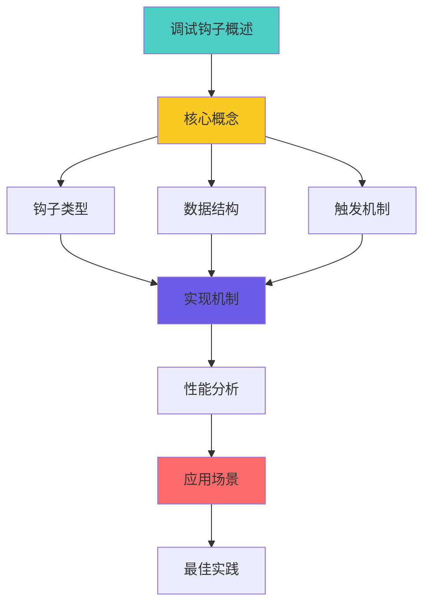
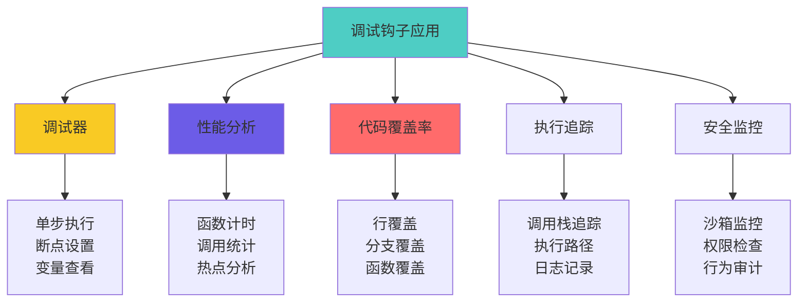
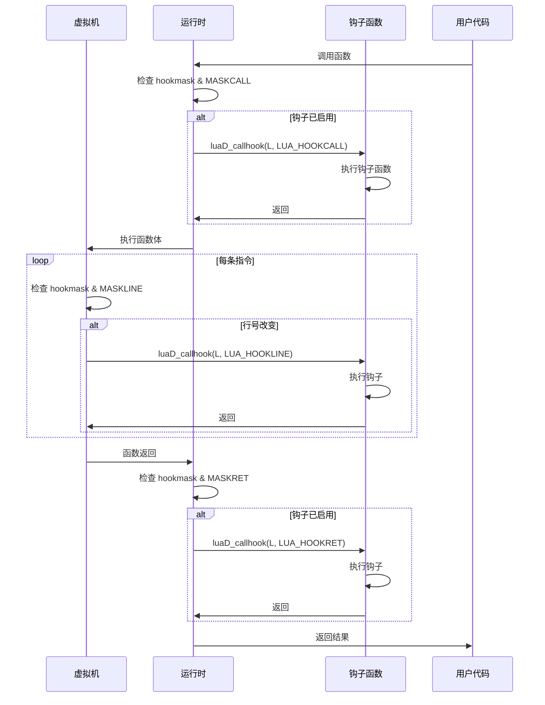
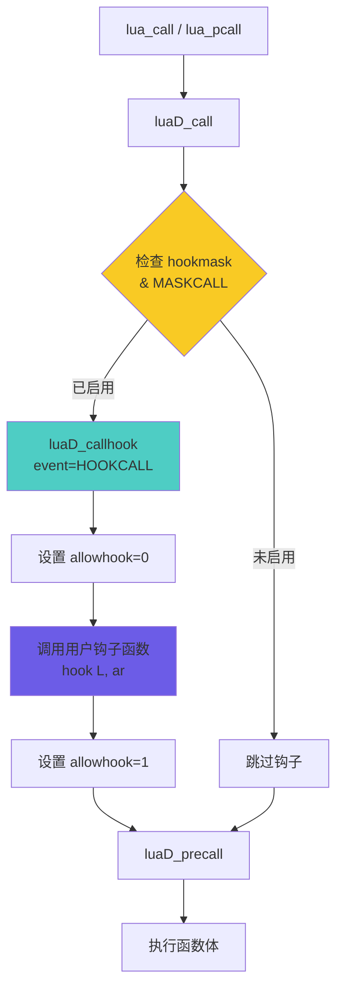
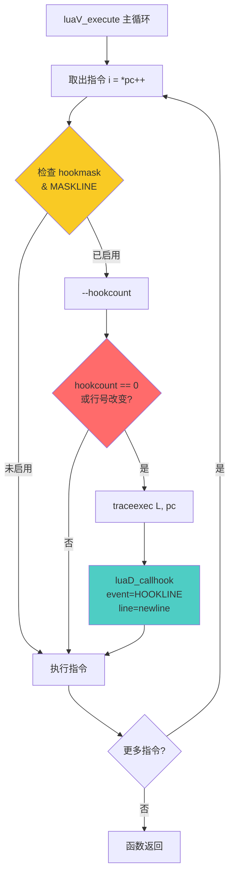
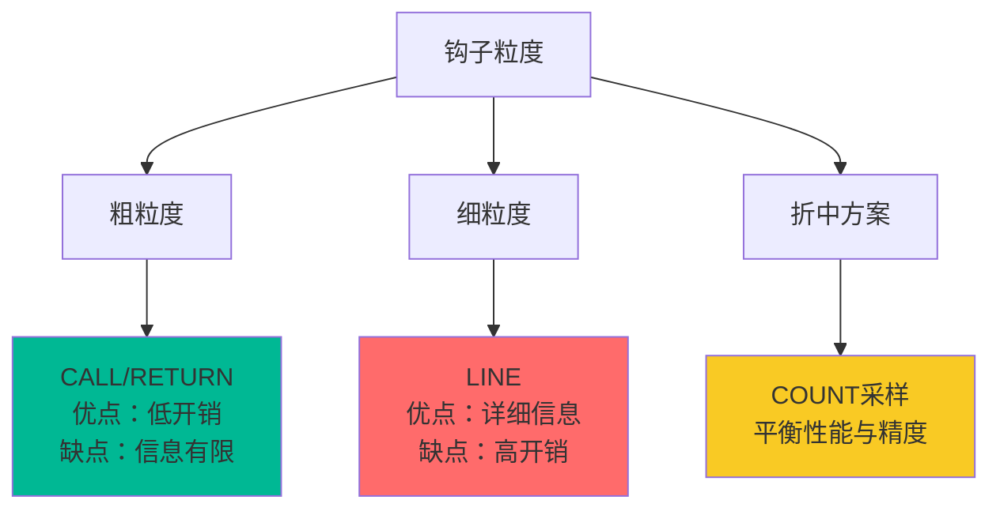

# 🔍 Lua 调试钩子机制详解

> **DeepWiki 深度技术文档**  
> 难度等级：⭐⭐⭐⭐ (高级)  
> 预计阅读时间：30-35 分钟  
> 先修知识：函数调用机制、虚拟机指令执行、C 回调函数

<div align="center">

**事件监控 · 调用追踪 · 性能分析 · 代码覆盖**

[📖 核心概念](#-核心概念) · [🔧 实现机制](#-实现机制) · [⚡ 性能分析](#-性能分析) · [💡 应用场景](#-应用场景)

</div>

---

## 📋 文档概述

### 学习目标

学完本文档后，你将能够：

- ✅ **理解 Lua 调试钩子的工作原理**和事件模型
- ✅ **掌握三种钩子类型**（call、return、line）的触发时机
- ✅ **理解钩子的性能影响**和优化策略
- ✅ **实现调试器、性能分析器**等工具
- ✅ **使用钩子进行代码覆盖率分析**

### 核心问题

本文档将回答以下关键问题：

1. **什么是调试钩子？** Lua 如何实现事件监控？
2. **钩子如何触发？** call/return/line 钩子的触发时机和条件是什么？
3. **性能开销多大？** 钩子对程序执行速度的影响？
4. **如何实现调试器？** 基于钩子构建调试工具的方法？
5. **有哪些限制？** 钩子机制的局限性和注意事项？

### 文档结构



---

## 🎯 核心概念

### 1. 调试钩子简介

#### 什么是调试钩子？

调试钩子（Debug Hook）是 Lua 提供的**事件通知机制**，允许用户在特定事件发生时得到通知并执行自定义代码。

```lua
-- 简单示例：追踪函数调用
local function hook(event, line)
    local info = debug.getinfo(2, "nS")
    print(string.format("%s: %s (line %d)", 
          event, info.name or "?", line or 0))
end

debug.sethook(hook, "cr")  -- 监控 call 和 return 事件

function test()
    print("Hello")
end

test()  -- 触发钩子

-- 输出：
-- call: test (line 0)
-- return: test (line 0)
```

#### 钩子的应用场景



---

### 2. 钩子类型

#### 三种基本钩子事件

```c
// lua.h: 钩子事件类型
#define LUA_HOOKCALL    0  // 函数调用
#define LUA_HOOKRET     1  // 函数返回
#define LUA_HOOKLINE    2  // 执行新行
#define LUA_HOOKCOUNT   3  // 执行指令计数
#define LUA_HOOKTAILRET 4  // 尾调用返回
```

#### 事件掩码

```c
// lua.h: 钩子掩码
#define LUA_MASKCALL    (1 << LUA_HOOKCALL)   // 0x01
#define LUA_MASKRET     (1 << LUA_HOOKRET)    // 0x02
#define LUA_MASKLINE    (1 << LUA_HOOKLINE)   // 0x04
#define LUA_MASKCOUNT   (1 << LUA_HOOKCOUNT)  // 0x08
```

#### 钩子类型详解

| 钩子类型 | 触发时机 | 用途 | 性能开销 |
|---------|---------|------|---------|
| **CALL** | 函数调用前 | 追踪调用链 | 低 |
| **RETURN** | 函数返回后 | 追踪返回值 | 低 |
| **TAILRET** | 尾调用返回 | 特殊返回处理 | 极低 |
| **LINE** | 执行新行前 | 单步调试 | **高** |
| **COUNT** | 每N条指令 | 性能采样 | 中 |

---

### 3. 核心数据结构

#### lua_State 中的钩子字段

```c
// lstate.h: lua_State 中的调试钩子相关字段
struct lua_State {
    // ... 其他字段
    
    // ===== 钩子相关 =====
    lua_Hook hook;           // 钩子函数指针
    lu_byte hookmask;        // 钩子掩码（启用的事件类型）
    lu_byte allowhook;       // 是否允许触发钩子
    int basehookcount;       // 基础计数器值
    int hookcount;           // 当前计数器
    
    // ... 更多字段
};
```

#### lua_Hook 函数类型

```c
// lua.h: 钩子函数类型定义
typedef void (*lua_Hook) (lua_State *L, lua_Debug *ar);

// ar: 调试信息结构
struct lua_Debug {
    int event;              // 事件类型
    const char *name;       // 函数名
    const char *namewhat;   // 名称类型（"global"、"local"等）
    const char *what;       // 函数类型（"Lua"、"C"、"main"）
    const char *source;     // 源文件名
    int currentline;        // 当前行号
    int nups;               // upvalue 数量
    int linedefined;        // 函数定义起始行
    int lastlinedefined;    // 函数定义结束行
    char short_src[LUA_IDSIZE]; // 短源文件名
    
    // 私有字段（内部使用）
    int i_ci;               // CallInfo 索引
};
```

#### 钩子掩码组合

```c
// 常见组合示例
lua_sethook(L, hook_func, LUA_MASKCALL, 0);           // 只监控调用
lua_sethook(L, hook_func, LUA_MASKRET, 0);            // 只监控返回
lua_sethook(L, hook_func, LUA_MASKCALL | LUA_MASKRET, 0); // 调用+返回
lua_sethook(L, hook_func, LUA_MASKLINE, 0);           // 每行触发
lua_sethook(L, hook_func, LUA_MASKCOUNT, 100);        // 每100条指令
```

---

### 4. 钩子设置与获取

#### lua_sethook - 设置钩子

```c
// lapi.c: 设置调试钩子
LUA_API int lua_sethook (lua_State *L, lua_Hook func, int mask, int count) {
    if (func == NULL || mask == 0) {  // 禁用钩子
        mask = 0;
        func = NULL;
    }
    
    L->hook = func;
    L->basehookcount = count;
    resethookcount(L);  // 重置计数器
    L->hookmask = cast_byte(mask);
    
    return 1;
}

// 重置钩子计数器
#define resethookcount(L) (L->hookcount = L->basehookcount)
```

#### lua_gethook - 获取钩子信息

```c
// lapi.c: 获取当前钩子
LUA_API lua_Hook lua_gethook (lua_State *L) {
    return L->hook;
}

LUA_API int lua_gethookmask (lua_State *L) {
    return L->hookmask;
}

LUA_API int lua_gethookcount (lua_State *L) {
    return L->basehookcount;
}
```

#### Lua 侧接口

```lua
-- debug.sethook: 设置钩子
debug.sethook(hook_function, mask [, count])

-- 参数说明：
-- hook_function: 钩子函数 function(event, line)
-- mask: 字符串，包含以下字符的组合
--   "c": call 事件
--   "r": return 事件
--   "l": line 事件
-- count: 指令计数（仅用于 count 模式）

-- 示例
debug.sethook(my_hook, "cr")      -- call + return
debug.sethook(my_hook, "l")       -- line
debug.sethook(my_hook, "", 1000)  -- 每1000条指令
debug.sethook()                   -- 禁用钩子
```

---

### 5. 钩子触发流程

#### 完整触发流程图



#### 钩子检查条件

```c
// 钩子触发的判断逻辑
static void callhook_if_needed(lua_State *L, int event) {
    // 1. 钩子函数必须存在
    if (L->hook == NULL) return;
    
    // 2. 允许触发钩子（避免递归）
    if (L->allowhook == 0) return;
    
    // 3. 事件类型必须被监控
    if (!(L->hookmask & (1 << event))) return;
    
    // 4. 触发钩子
    luaD_callhook(L, event, -1);
}
```

---

### 6. 钩子触发时机详解

#### CALL 钩子

```c
// ldo.c: luaD_call 中触发 CALL 钩子
void luaD_call (lua_State *L, StkId func, int nResults) {
    if (++L->nCcalls >= LUAI_MAXCCALLS) {
        // ... 错误处理
    }
    
    // ⭐ CALL 钩子触发点
    if (L->hookmask & LUA_MASKCALL)
        luaD_callhook(L, LUA_HOOKCALL, -1);
    
    // 实际调用
    luaD_precall(L, func, nResults);
    
    L->nCcalls--;
}
```

**触发时机**：
- ✅ Lua 函数调用前
- ✅ C 函数调用前
- ✅ 元方法调用前
- ❌ 尾调用不触发（被优化掉）

#### RETURN 钩子

```c
// ldo.c: luaD_poscall 中触发 RETURN 钩子
int luaD_poscall (lua_State *L, StkId firstResult) {
    // ... 处理返回值
    
    CallInfo *ci = L->ci--;  // 回退 CallInfo
    
    // ⭐ RETURN 钩子触发点
    if (L->hookmask & LUA_MASKRET)
        luaD_callhook(L, LUA_HOOKRET, -1);
    
    // ... 恢复状态
    return nres;
}
```

**触发时机**：
- ✅ Lua 函数正常返回后
- ✅ C 函数返回后
- ✅ 错误导致的非正常返回也会触发
- ⚠️ 尾调用返回触发 TAILRET 而非 RET

#### LINE 钩子

```c
// lvm.c: 虚拟机主循环中触发 LINE 钩子
void luaV_execute (lua_State *L, int nexeccalls) {
    CallInfo *ci = L->ci;
    LClosure *cl;
    TValue *k;
    StkId base;
    
reentry:  // 重入点
    lua_assert(ci == L->ci && ci == L->base_ci + L->ci - L->base_ci);
    pc = L->savedpc;
    cl = &clvalue(L->ci->func)->l;
    base = L->base;
    k = cl->p->k;
    
    // 主指令循环
    for (;;) {
        const Instruction i = *pc++;
        
        // ⭐ LINE 钩子检查点
        if ((L->hookmask & (LUA_MASKLINE | LUA_MASKCOUNT)) && 
            (--L->hookcount == 0 || L->hookmask & LUA_MASKLINE)) {
            
            traceexec(L, pc);  // 触发 LINE 钩子
        }
        
        // 执行指令
        switch (GET_OPCODE(i)) {
            // ... 各种指令
        }
    }
}

// ldebug.c: LINE 钩子触发
static void traceexec (lua_State *L, const Instruction *pc) {
    int newline = getline(L->ci->func->l.p, pcRel(pc, L->ci));
    
    // 行号改变或指令计数到达
    if (newline != L->ci->currentline || L->hookmask & LUA_MASKCOUNT) {
        L->ci->currentline = newline;
        luaD_callhook(L, LUA_HOOKLINE, newline);
    }
    
    resethookcount(L);  // 重置计数器
}
```

**触发时机**：
- ✅ 执行到新的源代码行前
- ✅ 只在 Lua 函数中触发（C 函数无行号）
- ⚠️ 空行、注释行不触发（没有对应字节码）
- ⚠️ 每行可能触发多次（如循环）

#### TAILRET 钩子

```c
// ldo.c: luaD_poscall 中的尾调用处理
int luaD_poscall (lua_State *L, StkId firstResult) {
    CallInfo *ci = L->ci--;
    
    // ... 处理返回值
    
    // ⭐ 尾调用返回钩子
    if (ci->tailcalls) {  // 发生了尾调用
        if (L->hookmask & LUA_MASKRET) {
            int nci = cast_int(ci - L->base_ci);
            luaD_callhook(L, LUA_HOOKTAILRET, -1);
            ci = L->base_ci + nci;  // 钩子可能改变了 ci
        }
    }
    
    return nres;
}
```

**触发时机**：
- ✅ 尾调用优化的函数返回时
- ✅ 表示有 N 个尾调用被优化（通过 ci->tailcalls）
- ℹ️ 用于调试器恢复完整调用栈

---

### 7. 钩子执行机制

#### luaD_callhook 核心实现

```c
// ldebug.c: 调用钩子函数
void luaD_callhook (lua_State *L, int event, int line) {
    lua_Hook hook = L->hook;
    
    if (hook && L->allowhook) {  // 钩子存在且允许触发
        ptrdiff_t top = savestack(L, L->top);
        ptrdiff_t ci_top = savestack(L, L->ci->top);
        lua_Debug ar;
        
        ar.event = event;
        ar.currentline = line;
        
        if (event == LUA_HOOKTAILRET)
            ar.i_ci = 0;  // 尾调用无 CallInfo
        else
            ar.i_ci = cast_int(L->ci - L->base_ci);
        
        luaD_checkstack(L, LUA_MINSTACK);  // 确保栈空间
        L->ci->top = L->top + LUA_MINSTACK;
        lua_assert(L->ci->top <= L->stack_last);
        
        L->allowhook = 0;  // ⭐ 防止递归触发
        lua_unlock(L);
        (*hook)(L, &ar);   // ⭐ 调用用户钩子函数
        lua_lock(L);
        
        lua_assert(!L->allowhook);
        L->allowhook = 1;  // 恢复钩子触发
        
        // 恢复栈状态
        L->ci->top = restorestack(L, ci_top);
        L->top = restorestack(L, top);
    }
}
```

#### 防止递归触发

```
钩子递归保护机制：
┌────────────────────────────┐
│ 1. 用户代码调用函数         │
│    ↓                       │
│ 2. L->allowhook = 1        │
│    触发 CALL 钩子           │
│    ↓                       │
│ 3. L->allowhook = 0 ⭐     │
│    执行钩子函数             │
│    ↓                       │
│ 4. 钩子中可能调用其他函数   │
│    但 allowhook=0          │
│    → 不会触发新钩子 ✅     │
│    ↓                       │
│ 5. L->allowhook = 1        │
│    钩子返回                 │
│    ↓                       │
│ 6. 继续执行用户代码         │
└────────────────────────────┘
```

---

### 8. debug.getinfo - 获取调试信息

#### 函数原型

```c
// ldblib.c: debug.getinfo 实现
static int db_getinfo (lua_State *L) {
    lua_Debug ar;
    int arg;
    lua_State *L1 = getthread(L, &arg);
    const char *options = luaL_optstring(L, arg+2, "flnSu");
    
    if (lua_isnumber(L, arg+1)) {
        // 通过调用层级获取
        if (!lua_getstack(L1, (int)lua_toint(L, arg+1), &ar)) {
            lua_pushnil(L);
            return 1;
        }
    }
    else if (lua_isfunction(L, arg+1)) {
        // 通过函数对象获取
        lua_pushfstring(L, ">%s", options);
        options = lua_tostring(L, -1);
        lua_pushvalue(L, arg+1);
        lua_insert(L, -2);
    }
    else
        return luaL_argerror(L, arg+1, "function or level expected");
    
    if (!lua_getinfo(L1, options, &ar))
        return luaL_argerror(L, arg+2, "invalid option");
    
    lua_createtable(L, 0, 2);
    
    // 根据 options 填充信息
    if (strchr(options, 'S')) {
        settabss(L, "source", ar.source);
        settabss(L, "short_src", ar.short_src);
        settabsi(L, "linedefined", ar.linedefined);
        settabsi(L, "lastlinedefined", ar.lastlinedefined);
        settabss(L, "what", ar.what);
    }
    if (strchr(options, 'l'))
        settabsi(L, "currentline", ar.currentline);
    if (strchr(options, 'u'))
        settabsi(L, "nups", ar.nups);
    if (strchr(options, 'n')) {
        settabss(L, "name", ar.name);
        settabss(L, "namewhat", ar.namewhat);
    }
    if (strchr(options, 'L'))
        treatstackoption(L, L1, "activelines");
    if (strchr(options, 'f'))
        lua_pushvalue(L, -2);
    
    return 1;
}
```

#### options 参数详解

```lua
-- debug.getinfo(level [, what]) 的 what 参数
-- 字符串，包含以下字符的组合：

"n": name, namewhat         -- 函数名信息
"S": source, short_src,     -- 源文件信息
     linedefined, lastlinedefined, what
"l": currentline            -- 当前行号
"u": nups                   -- upvalue 数量
"f": func                   -- 函数对象本身
"L": activelines            -- 有效行号表

-- 示例
local info = debug.getinfo(2, "nSl")
print(info.name)            -- 函数名
print(info.source)          -- 源文件
print(info.currentline)     -- 当前行号
```

---

### 9. 钩子使用示例

#### 简单调用追踪

```lua
-- 追踪所有函数调用
local depth = 0

local function trace_hook(event, line)
    local info = debug.getinfo(2, "nS")
    local name = info.name or "?"
    
    if event == "call" then
        print(string.rep("  ", depth) .. "→ " .. name)
        depth = depth + 1
    elseif event == "return" then
        depth = depth - 1
        print(string.rep("  ", depth) .. "← " .. name)
    end
end

debug.sethook(trace_hook, "cr")

-- 测试
function foo()
    return bar()
end

function bar()
    return 42
end

foo()

-- 输出：
-- → foo
--   → bar
--   ← bar
-- ← foo
```

#### 性能分析器

```lua
-- 简单的函数性能分析
local profile = {}

local function profile_hook(event, line)
    if event == "call" then
        local info = debug.getinfo(2, "nS")
        local name = info.name or info.source
        
        profile[name] = profile[name] or {count = 0, time = 0}
        profile[name].count = profile[name].count + 1
        profile[name].start = os.clock()
        
    elseif event == "return" then
        local info = debug.getinfo(2, "nS")
        local name = info.name or info.source
        
        if profile[name] and profile[name].start then
            local elapsed = os.clock() - profile[name].start
            profile[name].time = profile[name].time + elapsed
            profile[name].start = nil
        end
    end
end

-- 使用
debug.sethook(profile_hook, "cr")
-- ... 运行代码 ...
debug.sethook()  -- 禁用钩子

-- 打印结果
for name, data in pairs(profile) do
    print(string.format("%s: %d calls, %.3f seconds",
          name, data.count, data.time))
end
```

#### 代码覆盖率

```lua
-- 行覆盖率统计
local coverage = {}

local function coverage_hook(event, line)
    local info = debug.getinfo(2, "S")
    local file = info.source
    
    coverage[file] = coverage[file] or {}
    coverage[file][line] = (coverage[file][line] or 0) + 1
end

debug.sethook(coverage_hook, "l")
-- ... 运行测试 ...
debug.sethook()

-- 生成报告
for file, lines in pairs(coverage) do
    print("File:", file)
    for line, count in pairs(lines) do
        print(string.format("  Line %d: executed %d times", line, count))
    end
end
```

---

## 🔧 实现机制

### 1. 钩子触发路径

#### CALL 钩子触发路径



#### LINE 钩子触发路径



---

### 2. 行号映射机制

#### Proto 中的行号信息

```c
// lobject.h: Proto 结构
typedef struct Proto {
    // ... 其他字段
    
    int *lineinfo;          // 行号信息数组
    int sizelineinfo;       // 数组大小
    
    // lineinfo[pc] = 该字节码对应的源代码行号
    // 压缩存储：只记录变化的行号
} Proto;
```

#### 获取当前行号

```c
// ldebug.c: 通过 PC 获取行号
int luaG_getline (const Proto *f, int pc) {
    // 无行号信息
    if (f->lineinfo == NULL)
        return -1;
    
    // 返回对应行号
    return (pc < f->sizelineinfo) ? f->lineinfo[pc] : -1;
}

// 辅助宏
#define getline(f,pc)  (((f)->lineinfo) ? (f)->lineinfo[pc] : 0)
```

#### 行号信息的生成

```c
// lcode.c: 编译时记录行号
void luaK_code (FuncState *fs, Instruction i, int line) {
    Proto *f = fs->f;
    
    // 扩展代码数组
    dischargejpc(fs);
    luaM_growvector(fs->L, f->code, fs->pc, f->sizecode, Instruction,
                    MAX_INT, "code size overflow");
    f->code[fs->pc] = i;
    
    // ⭐ 记录行号
    luaM_growvector(fs->L, f->lineinfo, fs->pc, f->sizelineinfo, int,
                    MAX_INT, "code size overflow");
    f->lineinfo[fs->pc] = line;
    
    fs->pc++;
}
```

#### 行号映射示例

```lua
-- 源代码
function test()
    local a = 1    -- line 2
    local b = 2    -- line 3
    return a + b   -- line 4
end

-- 对应的字节码和行号
-- PC  Instruction       Line
--  0  LOADK     0 0     2
--  1  LOADK     1 1     3
--  2  ADD       2 0 1   4
--  3  RETURN    2 2     4
--  4  RETURN    0 1     4
```

---

### 3. 指令计数模式

#### COUNT 钩子实现

```c
// lvm.c: 虚拟机主循环中的计数
void luaV_execute (lua_State *L, int nexeccalls) {
    // ... 初始化
    
    for (;;) {
        const Instruction i = *pc++;
        
        // ⭐ 计数检查
        if ((L->hookmask & (LUA_MASKLINE | LUA_MASKCOUNT)) && 
            (--L->hookcount == 0 || L->hookmask & LUA_MASKLINE)) {
            
            traceexec(L, pc);
        }
        
        // 执行指令...
    }
}

// ldebug.c: 重置计数器
#define resethookcount(L) (L->hookcount = L->basehookcount)
```

#### 计数模式工作原理

```
指令计数器机制：
┌──────────────────────────────┐
│ 1. 设置 basehookcount = 100  │
│    hookcount = 100           │
│    ↓                         │
│ 2. 执行指令                   │
│    hookcount--  (99)         │
│    ↓                         │
│ 3. 执行指令                   │
│    hookcount--  (98)         │
│    ↓                         │
│ ... 继续执行 ...             │
│    ↓                         │
│ 4. hookcount--  (0) ⭐      │
│    触发钩子！                 │
│    ↓                         │
│ 5. resethookcount(L)         │
│    hookcount = 100           │
│    ↓                         │
│ 6. 继续循环...               │
└──────────────────────────────┘
```

#### 计数模式应用：性能采样

```lua
-- 性能采样器（每1000条指令采样一次）
local samples = {}

local function sampling_hook(event, line)
    local info = debug.getinfo(2, "nSl")
    local key = string.format("%s:%d", info.short_src, info.currentline)
    samples[key] = (samples[key] or 0) + 1
end

debug.sethook(sampling_hook, "", 1000)  -- 每1000条指令
-- ... 运行程序 ...
debug.sethook()

-- 找出热点
local hotspots = {}
for key, count in pairs(samples) do
    table.insert(hotspots, {key=key, count=count})
end
table.sort(hotspots, function(a, b) return a.count > b.count end)

print("Top 10 hotspots:")
for i = 1, math.min(10, #hotspots) do
    print(string.format("%s: %d samples", hotspots[i].key, hotspots[i].count))
end
```

---

### 4. 尾调用的特殊处理

#### 尾调用对钩子的影响

```lua
-- 尾调用示例
function factorial(n, acc)
    if n <= 1 then
        return acc
    end
    return factorial(n - 1, n * acc)  -- 尾调用
end

-- 钩子行为
debug.sethook(function(event, line)
    print(event, debug.getinfo(2, "n").name)
end, "cr")

factorial(5, 1)

-- 输出（简化）:
-- call factorial
-- call factorial  -- 新调用，旧帧被重用
-- call factorial
-- ...
-- return factorial
-- tailret ?       -- 一次性报告所有尾调用
```

#### TAILRET 事件处理

```c
// ldo.c: 尾调用返回钩子
int luaD_poscall (lua_State *L, StkId firstResult) {
    CallInfo *ci = L->ci--;
    
    // ... 处理返回值
    
    // ⭐ 尾调用计数
    if (ci->tailcalls) {
        if (L->hookmask & LUA_MASKRET) {
            // 触发 TAILRET 钩子
            int nci = cast_int(ci - L->base_ci);
            luaD_callhook(L, LUA_HOOKTAILRET, -1);
            ci = L->base_ci + nci;
            
            // lua_Debug.i_ci = 0（特殊标记）
            // 表示发生了尾调用优化
        }
    }
    
    return nres;
}
```

#### 调试器中的尾调用重建

```lua
-- 调试器需要重建完整调用栈
function build_call_stack()
    local stack = {}
    local level = 0
    
    while true do
        local info = debug.getinfo(level, "nSl")
        if not info then break end
        
        table.insert(stack, {
            name = info.name,
            source = info.short_src,
            line = info.currentline,
            tailcalls = info.tailcalls or 0  -- 尾调用数量
        })
        
        level = level + 1
    end
    
    return stack
end
```

---

### 5. 性能优化技术

#### 快速路径优化

```c
// lvm.c: 优化的钩子检查
void luaV_execute (lua_State *L, int nexeccalls) {
    // ... 初始化
    
    for (;;) {
        const Instruction i = *pc++;
        
        // ⭐ 快速路径：无钩子时跳过检查
        if (L->hookmask & (LUA_MASKLINE | LUA_MASKCOUNT)) {
            if (--L->hookcount == 0 || L->hookmask & LUA_MASKLINE) {
                traceexec(L, pc);
            }
        }
        
        // 执行指令...
    }
}
```

#### 条件编译优化

```c
// lvm.c: 使用宏减少分支
#define dojit(L,c)  /* do nothing */

// 钩子检查宏
#define Protect(x) \
    { L->savedpc = pc; {x;}; base = L->base; }

// 在需要检查钩子的地方使用 Protect
Protect(luaV_gettable(L, RB(b), RKC(c), ra));
```

#### 延迟行号计算

```c
// ldebug.c: 只在需要时计算行号
static void traceexec (lua_State *L, const Instruction *pc) {
    int newline = getline(L->ci->func->l.p, pcRel(pc, L->ci));
    
    // ⭐ 行号未改变且非计数模式，跳过
    if (newline == L->ci->currentline && !(L->hookmask & LUA_MASKCOUNT)) {
        resethookcount(L);
        return;  // 快速返回
    }
    
    L->ci->currentline = newline;
    luaD_callhook(L, LUA_HOOKLINE, newline);
    resethookcount(L);
}
```

---

## ⚡ 性能分析

### 1. 钩子性能开销

#### 各类钩子的性能影响

```
钩子类型性能对比（相对于无钩子）：
┌──────────────────────────────────┐
│ 钩子类型      性能损失    原因    │
├──────────────────────────────────┤
│ 无钩子        0%        基准      │
│ CALL         5-10%     调用时触发  │
│ RETURN       5-10%     返回时触发  │
│ CALL+RET     10-20%    双重开销   │
│ COUNT(1000)  1-3%      低频触发   │
│ COUNT(100)   5-10%     中频触发   │
│ LINE         50-300%   ⚠️ 极高    │
└──────────────────────────────────┘

⚠️ LINE 钩子最慢的原因：
- 每行代码触发（频率极高）
- 行号查找开销
- 无法优化（必须检查）
```

#### 性能基准测试

```lua
-- 基准测试：钩子开销
local function benchmark(name, hook_mask, hook_count)
    local function fib(n)
        if n <= 1 then return n end
        return fib(n-1) + fib(n-2)
    end
    
    -- 无钩子
    collectgarbage()
    local start = os.clock()
    fib(30)
    local baseline = os.clock() - start
    
    -- 启用钩子
    debug.sethook(function() end, hook_mask, hook_count)
    collectgarbage()
    start = os.clock()
    fib(30)
    local hooked = os.clock() - start
    debug.sethook()
    
    print(string.format("%s: baseline=%.3fs, hooked=%.3fs, overhead=%.1f%%",
          name, baseline, hooked, (hooked/baseline - 1) * 100))
end

-- 测试
benchmark("No hook", "", 0)
benchmark("CALL only", "c", 0)
benchmark("CALL+RET", "cr", 0)
benchmark("COUNT(1000)", "", 1000)
benchmark("LINE", "l", 0)

-- 典型输出：
-- No hook: baseline=0.523s, hooked=0.523s, overhead=0.0%
-- CALL only: baseline=0.523s, hooked=0.571s, overhead=9.2%
-- CALL+RET: baseline=0.523s, hooked=0.628s, overhead=20.1%
-- COUNT(1000): baseline=0.523s, hooked=0.548s, overhead=4.8%
-- LINE: baseline=0.523s, hooked=1.876s, overhead=258.7% ⚠️
```

---

### 2. 性能开销来源

#### 钩子调用成本分解

```c
// 单次钩子触发的成本（周期数）
┌─────────────────────────────────────┐
│ 1. 条件检查                ~5 cycles │
│    if (L->hookmask & mask)          │
│                                     │
│ 2. 保存状态                ~20 cycles│
│    savestack, 保存 ci->top          │
│                                     │
│ 3. 准备 lua_Debug          ~30 cycles│
│    ar.event, ar.i_ci, 等            │
│                                     │
│ 4. 调用用户函数             ~100-1000│
│    (*hook)(L, &ar)                  │
│    (取决于钩子函数复杂度)            │
│                                     │
│ 5. 恢复状态                ~20 cycles│
│    restorestack                     │
│                                     │
│ 总计                       ~175-1075 │
└─────────────────────────────────────┘

对比：
- 函数调用:        ~50 cycles
- 单条指令:        ~1-2 cycles
```

#### LINE 钩子额外开销

```c
// lvm.c: LINE 钩子的检查成本
for (;;) {
    const Instruction i = *pc++;
    
    // ⭐ 每条指令都要检查（无法避免）
    if ((L->hookmask & (LUA_MASKLINE | LUA_MASKCOUNT)) && 
        (--L->hookcount == 0 || L->hookmask & LUA_MASKLINE)) {
        traceexec(L, pc);  // 额外开销
    }
    
    // 执行指令...
}

// traceexec 的开销：
// - 获取行号: ~10 cycles
// - 比较行号: ~2 cycles
// - 可能触发钩子: ~175 cycles
```

---

### 3. 优化策略

#### 策略1：使用 COUNT 代替 LINE

```lua
-- ❌ 低效：LINE 钩子
debug.sethook(function(event, line)
    if some_condition() then
        do_sampling()
    end
end, "l")

-- ✅ 高效：COUNT 钩子（采样）
debug.sethook(function(event, line)
    do_sampling()
end, "", 10000)  -- 每10000条指令采样

-- 性能提升：50-100倍！
```

#### 策略2：条件启用钩子

```lua
-- ✅ 只在需要时启用
local profiling_enabled = false

function start_profiling()
    profiling_enabled = true
    debug.sethook(profile_hook, "cr")
end

function stop_profiling()
    debug.sethook()
    profiling_enabled = false
end

-- 而不是始终启用但内部判断
local function bad_hook(event, line)
    if profiling_enabled then  -- ❌ 浪费！钩子已经被调用了
        -- ...
    end
end
debug.sethook(bad_hook, "cr")  -- 始终活跃
```

#### 策略3：最小化钩子函数复杂度

```lua
-- ❌ 低效：钩子中做复杂操作
debug.sethook(function(event, line)
    local info = debug.getinfo(2, "nSlf")  -- 获取所有信息
    local formatted = string.format(...)   -- 格式化
    local file = io.open("trace.log", "a") -- 文件I/O
    file:write(formatted)
    file:close()
end, "cr")

-- ✅ 高效：钩子中只记录数据
local trace_buffer = {}

debug.sethook(function(event, line)
    table.insert(trace_buffer, {event, line, os.clock()})
end, "cr")

-- 后台线程或定期处理缓冲
function process_trace_buffer()
    for _, entry in ipairs(trace_buffer) do
        -- 处理数据
    end
    trace_buffer = {}
end
```

#### 策略4：使用 C 钩子

```c
// C 钩子比 Lua 钩子快得多
static void fast_hook(lua_State *L, lua_Debug *ar) {
    // C 代码执行速度更快
    if (ar->event == LUA_HOOKCALL) {
        call_count++;
    }
    // 避免回调 Lua 函数
}

lua_sethook(L, fast_hook, LUA_MASKCALL | LUA_MASKRET, 0);
```

---

## 💡 设计权衡

### 1. 钩子粒度选择



| 场景 | 推荐钩子 | 理由 |
|------|---------|------|
| 性能分析 | COUNT(1000-10000) | 采样足够，开销低 |
| 调用追踪 | CALL+RETURN | 精确，开销可接受 |
| 单步调试 | LINE | 必须细粒度，接受开销 |
| 代码覆盖 | LINE | 需要完整信息 |
| 沙箱监控 | CALL | 只需拦截调用 |

---

### 2. 钩子 vs 其他调试方法

#### 方法对比

| 方法 | 优点 | 缺点 | 适用场景 |
|------|------|------|---------|
| **调试钩子** | 灵活、动态 | 性能开销 | 运行时调试 |
| **print 调试** | 简单、直观 | 代码侵入 | 快速诊断 |
| **静态分析** | 无运行时开销 | 不精确 | 代码审查 |
| **日志系统** | 持久化、可配置 | 影响性能 | 生产环境 |
| **断点调试器** | 交互式、强大 | 需要工具 | 深度调试 |

---

### 3. allowhook 机制

#### 为什么需要 allowhook？

```lua
-- 问题：钩子递归
local function bad_hook(event, line)
    -- 钩子中调用函数
    print("Event:", event)  -- print 也是函数调用！
    -- → 触发新的 CALL 钩子
    -- → 再次进入 bad_hook
    -- → 无限递归！💥
end

debug.sethook(bad_hook, "c")
test()  -- 崩溃

-- 解决：allowhook 标志
-- L->allowhook = 0 在钩子执行期间
-- → print 不会触发新钩子 ✅
```

#### allowhook 的权衡

```c
// ldo.c: allowhook 机制
void luaD_callhook (lua_State *L, int event, int line) {
    if (hook && L->allowhook) {
        // ...
        L->allowhook = 0;  // ⭐ 禁用钩子
        (*hook)(L, &ar);   // 执行钩子
        L->allowhook = 1;  // ⭐ 恢复钩子
    }
}
```

**权衡**：
- ✅ 防止递归，保证稳定性
- ❌ 钩子函数中的调用无法监控
- ⚠️ 调试器需要考虑这个限制

---

## 🎯 应用场景

### 1. 简单调试器实现

#### 基础调试器框架

```lua
-- 简单调试器
local debugger = {
    breakpoints = {},  -- {[file] = {[line] = true}}
    stepping = false,
    step_level = 0,
}

function debugger:set_breakpoint(file, line)
    self.breakpoints[file] = self.breakpoints[file] or {}
    self.breakpoints[file][line] = true
end

function debugger:check_breakpoint(info)
    local bps = self.breakpoints[info.short_src]
    return bps and bps[info.currentline]
end

function debugger:debug_hook(event, line)
    local info = debug.getinfo(2, "nSlf")
    local should_break = false
    
    -- 检查断点
    if event == "line" and self:check_breakpoint(info) then
        should_break = true
        print("Breakpoint hit:", info.short_src, line)
    end
    
    -- 单步模式
    if self.stepping then
        if event == "line" then
            should_break = true
        end
    end
    
    -- 进入调试 REPL
    if should_break then
        self:debug_repl(info)
    end
end

function debugger:debug_repl(info)
    print(string.format("Stopped at %s:%d", 
          info.short_src, info.currentline))
    
    while true do
        io.write("(debug) ")
        local cmd = io.read()
        
        if cmd == "c" or cmd == "continue" then
            self.stepping = false
            break
        elseif cmd == "s" or cmd == "step" then
            self.stepping = true
            break
        elseif cmd == "n" or cmd == "next" then
            self.stepping = true
            self.step_level = info.level
            break
        elseif cmd:match("^p ") then
            -- 打印变量
            local var = cmd:match("^p (.+)$")
            local value = self:eval(var, info)
            print(var, "=", value)
        elseif cmd == "bt" or cmd == "backtrace" then
            self:print_backtrace()
        elseif cmd == "q" or cmd == "quit" then
            os.exit(0)
        else
            print("Unknown command:", cmd)
        end
    end
end

function debugger:eval(expr, info)
    -- 评估表达式（简化版）
    local func, err = load("return " .. expr)
    if not func then
        return nil, err
    end
    
    -- 设置环境
    local env = {}
    setmetatable(env, {__index = _G})
    
    -- 获取局部变量
    local i = 1
    while true do
        local name, value = debug.getlocal(2, i)
        if not name then break end
        env[name] = value
        i = i + 1
    end
    
    setfenv(func, env)
    return pcall(func)
end

function debugger:print_backtrace()
    print("Stack traceback:")
    local level = 0
    while true do
        local info = debug.getinfo(level, "nSl")
        if not info then break end
        
        print(string.format("  #%d %s:%d in %s",
              level, info.short_src, info.currentline,
              info.name or "?"))
        level = level + 1
    end
end

function debugger:start()
    debug.sethook(function(e, l) self:debug_hook(e, l) end, "lcr")
end

-- 使用
debugger:set_breakpoint("test.lua", 10)
debugger:start()

-- 运行程序
dofile("test.lua")
```

---

### 2. 性能分析器（Profiler）

#### 完整性能分析器

```lua
-- 性能分析器
local profiler = {
    enabled = false,
    call_stack = {},
    profile_data = {},
}

function profiler:start()
    self.enabled = true
    self.call_stack = {}
    self.profile_data = {}
    
    debug.sethook(function(e, l) self:hook(e, l) end, "cr")
end

function profiler:stop()
    debug.sethook()
    self.enabled = false
end

function profiler:hook(event, line)
    if event == "call" then
        local info = debug.getinfo(2, "nS")
        local key = self:make_key(info)
        
        -- 记录调用
        table.insert(self.call_stack, {
            key = key,
            start_time = os.clock(),
        })
        
        -- 初始化数据
        if not self.profile_data[key] then
            self.profile_data[key] = {
                name = info.name or info.short_src,
                source = info.short_src,
                linedefined = info.linedefined,
                calls = 0,
                total_time = 0,
                self_time = 0,
            }
        end
        
        self.profile_data[key].calls = self.profile_data[key].calls + 1
        
    elseif event == "return" then
        if #self.call_stack > 0 then
            local frame = table.remove(self.call_stack)
            local elapsed = os.clock() - frame.start_time
            
            local data = self.profile_data[frame.key]
            data.total_time = data.total_time + elapsed
            data.self_time = data.self_time + elapsed
            
            -- 减去子函数时间
            if #self.call_stack > 0 then
                local parent_key = self.call_stack[#self.call_stack].key
                self.profile_data[parent_key].self_time = 
                    self.profile_data[parent_key].self_time - elapsed
            end
        end
    end
end

function profiler:make_key(info)
    return string.format("%s:%d:%s", 
           info.short_src, info.linedefined, info.name or "?")
end

function profiler:report()
    print("Profile Report")
    print(string.rep("=", 80))
    print(string.format("%-30s %8s %12s %12s", 
          "Function", "Calls", "Total(s)", "Self(s)"))
    print(string.rep("-", 80))
    
    -- 排序
    local sorted = {}
    for key, data in pairs(self.profile_data) do
        table.insert(sorted, data)
    end
    table.sort(sorted, function(a, b) 
        return a.total_time > b.total_time 
    end)
    
    -- 打印
    for _, data in ipairs(sorted) do
        if data.total_time > 0.001 then  -- 过滤噪音
            print(string.format("%-30s %8d %12.3f %12.3f",
                  data.name:sub(1, 30), data.calls,
                  data.total_time, data.self_time))
        end
    end
    
    print(string.rep("=", 80))
end

-- 使用
profiler:start()
-- ... 运行代码 ...
profiler:stop()
profiler:report()
```

---

### 3. 代码覆盖率分析

#### 覆盖率收集器

```lua
-- 代码覆盖率分析器
local coverage = {
    files = {},  -- {[file] = {[line] = count}}
}

function coverage:start()
    self.files = {}
    debug.sethook(function(e, l) self:hook(e, l) end, "l")
end

function coverage:stop()
    debug.sethook()
end

function coverage:hook(event, line)
    local info = debug.getinfo(2, "S")
    local file = info.source
    
    -- 跳过 C 代码
    if file:sub(1, 1) == "=" then return end
    
    self.files[file] = self.files[file] or {}
    self.files[file][line] = (self.files[file][line] or 0) + 1
end

function coverage:get_coverage_percent(file)
    local lines = self.files[file]
    if not lines then return 0 end
    
    local total = 0
    local covered = 0
    
    for line, count in pairs(lines) do
        total = total + 1
        if count > 0 then
            covered = covered + 1
        end
    end
    
    return total > 0 and (covered / total * 100) or 0
end

function coverage:report()
    print("Coverage Report")
    print(string.rep("=", 80))
    
    for file, lines in pairs(self.files) do
        local percent = self:get_coverage_percent(file)
        print(string.format("%s: %.1f%% coverage", file, percent))
        
        -- 详细行信息
        local sorted_lines = {}
        for line, count in pairs(lines) do
            table.insert(sorted_lines, {line=line, count=count})
        end
        table.sort(sorted_lines, function(a, b) return a.line < b.line end)
        
        for _, entry in ipairs(sorted_lines) do
            local marker = entry.count > 0 and "✓" or "✗"
            print(string.format("  %s Line %d: executed %d times",
                  marker, entry.line, entry.count))
        end
    end
    
    print(string.rep("=", 80))
end

-- 使用
coverage:start()
-- ... 运行测试 ...
coverage:stop()
coverage:report()
```

---

### 4. 沙箱监控

#### 安全沙箱实现

```lua
-- 安全沙箱：监控和限制函数调用
local sandbox = {
    whitelist = {
        print = true,
        tostring = true,
        tonumber = true,
        type = true,
        pairs = true,
        ipairs = true,
        next = true,
        -- ... 其他安全函数
    },
    
    blacklist = {
        os = true,
        io = true,
        dofile = true,
        loadfile = true,
        require = true,
        -- ... 危险函数
    },
    
    call_count = 0,
    max_calls = 10000,  -- 最大调用次数
}

function sandbox:check_function(info)
    local name = info.name
    
    -- 检查黑名单
    if name and self.blacklist[name] then
        error("Access denied: " .. name)
    end
    
    -- 检查调用次数
    self.call_count = self.call_count + 1
    if self.call_count > self.max_calls then
        error("Call limit exceeded")
    end
end

function sandbox:hook(event, line)
    if event == "call" then
        local info = debug.getinfo(2, "nS")
        self:check_function(info)
    end
end

function sandbox:run(code)
    -- 设置钩子
    debug.sethook(function(e, l) self:hook(e, l) end, "c")
    
    -- 创建沙箱环境
    local env = {}
    for k, v in pairs(self.whitelist) do
        env[k] = _G[k]
    end
    
    -- 加载并运行代码
    local func, err = load(code)
    if not func then
        debug.sethook()
        return nil, err
    end
    
    setfenv(func, env)
    local ok, result = pcall(func)
    
    -- 清理
    debug.sethook()
    
    return ok, result
end

-- 使用
local code = [[
    print("Hello from sandbox")
    -- os.execute("rm -rf /")  -- 会被拦截
]]

local ok, result = sandbox:run(code)
print("Sandbox result:", ok, result)
```

---

## ❓ 常见问题 FAQ

### Q1: 钩子函数中可以调用其他函数吗？

**A**: 可以，但有限制。

```lua
-- ✅ 可以调用函数
debug.sethook(function(event, line)
    print("Event:", event)  -- OK（但不会触发新钩子）
    local info = debug.getinfo(2)  -- OK
end, "c")

-- ⚠️ 钩子函数中的调用不会触发新钩子
debug.sethook(function(event, line)
    helper_function()  -- 不会触发 CALL 钩子
end, "c")
```

**原因**：`allowhook` 机制防止递归。

---

### Q2: LINE 钩子为什么这么慢？

**A**: 因为触发频率极高。

```lua
-- 示例：一个简单循环
for i = 1, 10000 do
    -- 这一行会触发 10000 次 LINE 钩子！
end

-- 对比：CALL 钩子只在函数调用时触发
-- LINE 钩子在每行执行前触发
```

**优化建议**：
1. 使用 COUNT 钩子代替 LINE（采样）
2. 只在必要时启用 LINE 钩子
3. 钩子函数尽量简单

---

### Q3: 如何在钩子中访问局部变量？

**A**: 使用 `debug.getlocal`。

```lua
debug.sethook(function(event, line)
    if event == "line" then
        -- 获取局部变量
        local i = 1
        while true do
            local name, value = debug.getlocal(2, i)
            if not name then break end
            print(name, "=", value)
            i = i + 1
        end
    end
end, "l")

function test()
    local a = 10
    local b = 20
    print(a + b)
end

test()
-- 输出：
-- a = 10
-- b = 20
```

---

### Q4: 钩子会影响协程吗？

**A**: 每个协程有独立的钩子。

```c
// lstate.h: 每个 lua_State 有自己的钩子
struct lua_State {
    lua_Hook hook;         // 独立的钩子函数
    lu_byte hookmask;      // 独立的掩码
    // ...
};
```

```lua
-- 主线程设置钩子
debug.sethook(function(e, l)
    print("Main hook:", e)
end, "c")

-- 协程需要单独设置
local co = coroutine.create(function()
    debug.sethook(function(e, l)
        print("Coroutine hook:", e)
    end, "c")
    
    test()
end)

coroutine.resume(co)
```

---

### Q5: 如何调试钩子函数本身？

**A**: 使用多层调试。

```lua
-- ❌ 问题：钩子函数出错难以调试
debug.sethook(function(event, line)
    -- 错误会被静默忽略
    local x = nil_variable.field  -- 💥
end, "c")

-- ✅ 解决：包装错误处理
debug.sethook(function(event, line)
    local ok, err = pcall(function()
        -- 钩子逻辑
        local info = debug.getinfo(2)
        process(info)
    end)
    
    if not ok then
        io.stderr:write("Hook error: " .. tostring(err) .. "\n")
        debug.sethook()  -- 禁用钩子防止持续错误
    end
end, "c")
```

---

### Q6: 钩子可以修改程序行为吗？

**A**: 有限的可以。

```lua
-- ✅ 可以：修改局部变量
debug.sethook(function(event, line)
    if event == "line" then
        -- 修改局部变量
        local i = 1
        while true do
            local name, value = debug.getlocal(2, i)
            if not name then break end
            
            if name == "x" then
                debug.setlocal(2, i, 100)  -- 修改 x 的值
            end
            i = i + 1
        end
    end
end, "l")

-- ❌ 不可以：修改控制流
-- 钩子无法改变程序执行路径（无法跳转）
```

---

## 📚 参考资源

### 官方文档

- [Lua 5.1 Reference Manual - Debug Library](https://www.lua.org/manual/5.1/manual.html#5.9)
- [Programming in Lua - Chapter 23: The Debug Library](https://www.lua.org/pil/23.html)

### 开源项目

- **LuaProfiler**: 基于钩子的性能分析器
- **MobDebug**: 远程调试器
- **Decoda**: 图形化 Lua 调试器

### 相关论文

- **"Debugging and Profiling Lua Programs"** - Roberto Ierusalimschy

---

## ✅ 学习检查清单

### 基础理解

- [ ] 理解三种钩子类型（CALL、RETURN、LINE）
- [ ] 掌握钩子设置和获取 API
- [ ] 了解 lua_Debug 结构
- [ ] 理解钩子触发时机

### 进阶掌握

- [ ] 理解 allowhook 机制
- [ ] 掌握 debug.getinfo 的使用
- [ ] 了解钩子的性能影响
- [ ] 理解尾调用对钩子的影响

### 高级应用

- [ ] 能实现简单调试器
- [ ] 能实现性能分析器
- [ ] 能实现代码覆盖率工具
- [ ] 能优化钩子性能

---

## 🔄 版本历史

| 版本 | 日期 | 变更 |
|------|------|------|
| v1.0 | 2025-01-26 | 初始版本，完整的 DeepWiki 文档 |

---

<div align="center">

**📖 继续学习**

[← 返回运行时模块](wiki_runtime.md) · [相关主题：函数调用机制 →](function_call.md)

**相关深入主题**

[函数调用详解](function_call.md) · [栈管理机制](stack_management.md) · [协程实现](coroutine.md)

---

*📅 最后更新：2025-01-26*  
*📝 文档版本：v1.0*  
*🔖 适用Lua版本：5.1.5*

**调试钩子是 Lua 运行时监控的核心机制**  
*理解它，就理解了如何构建调试器、性能分析器等开发工具*

</div>
