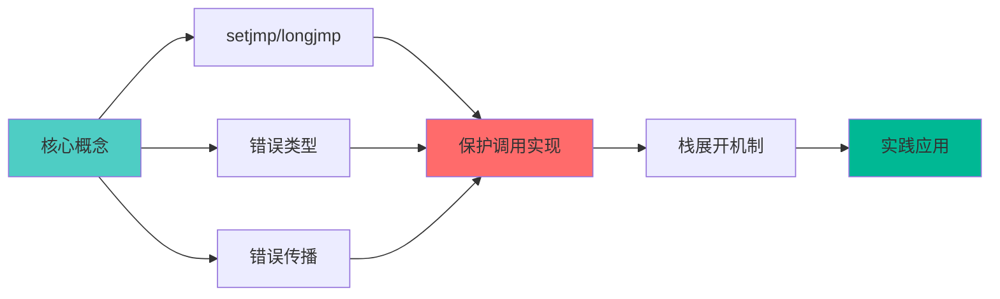
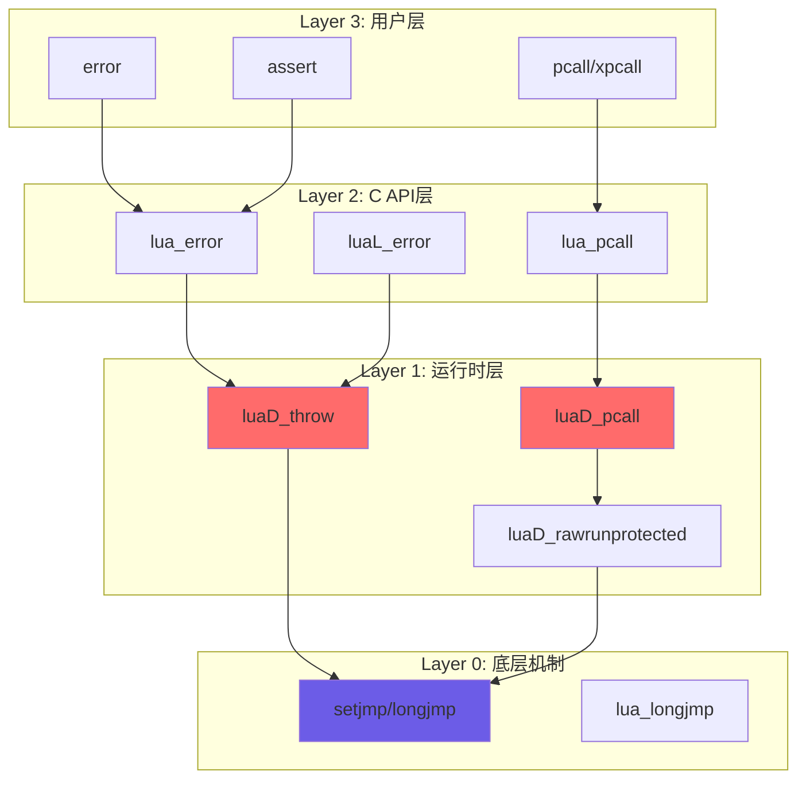
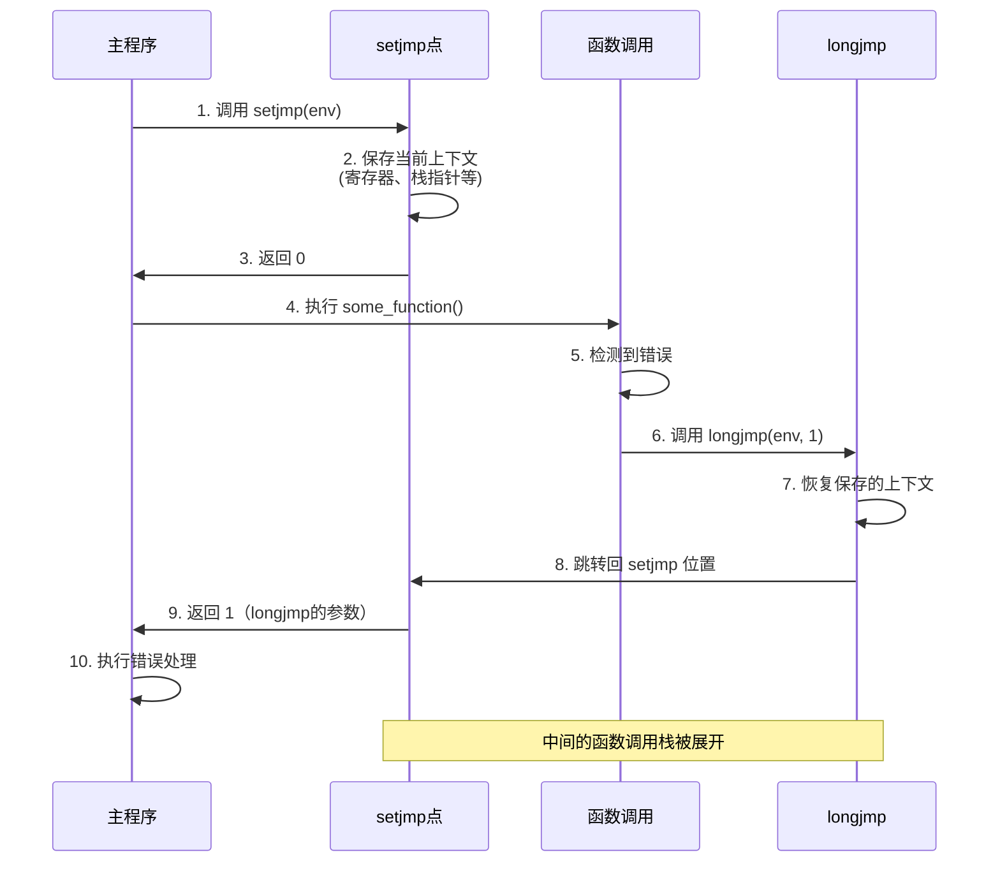
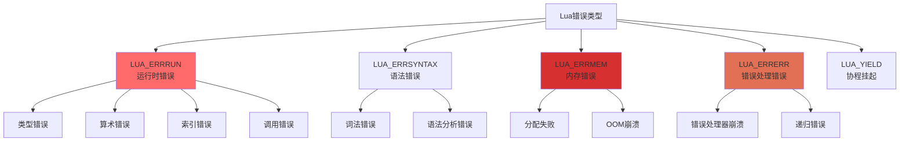
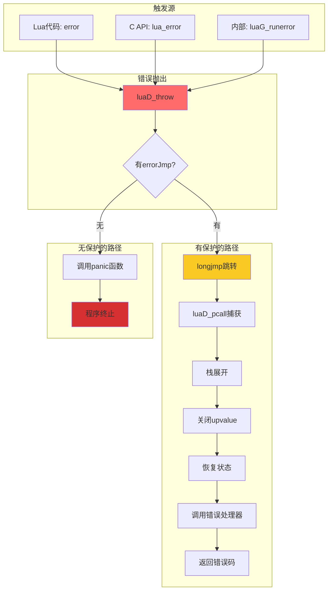
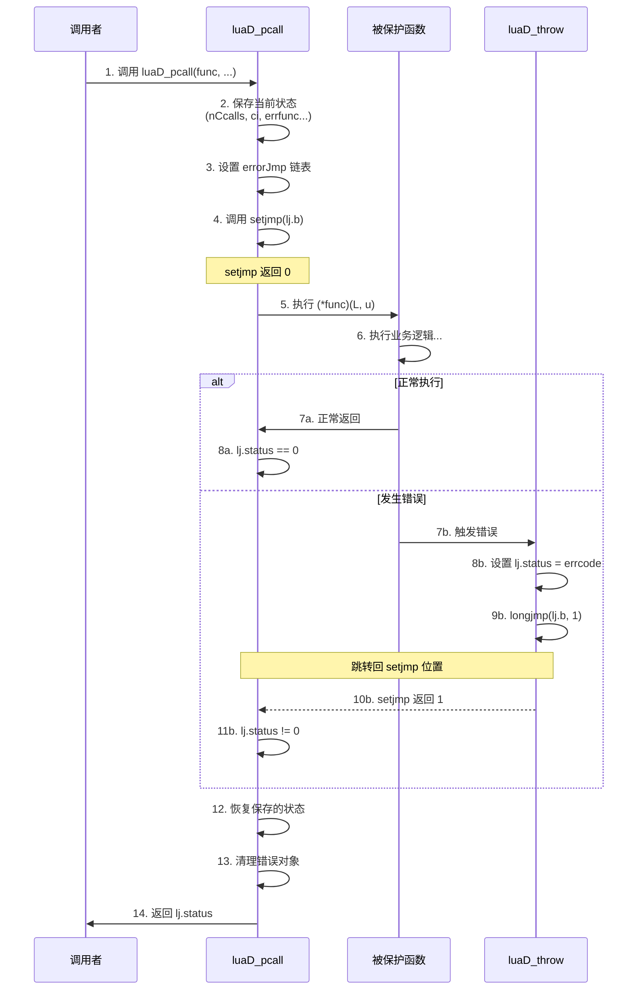
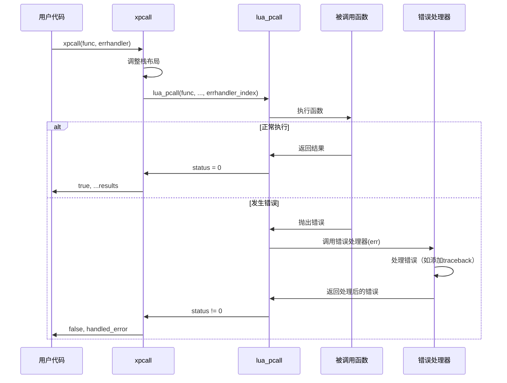
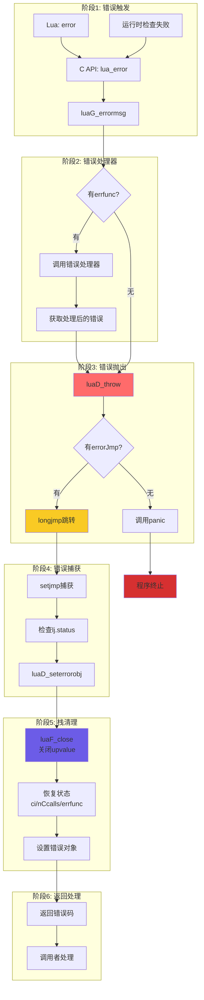
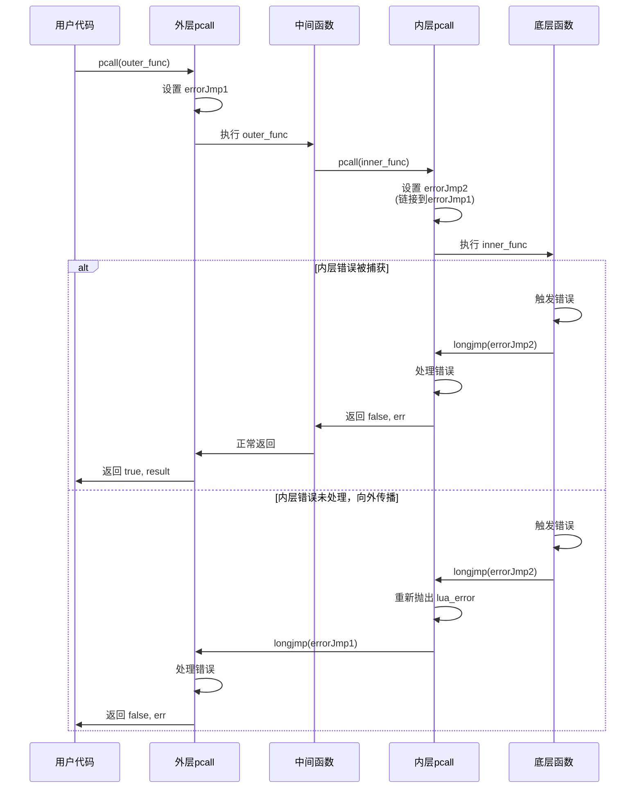

# 🛡️ Lua 错误处理机制深度解析

> **核心机制**：基于 setjmp/longjmp 的结构化异常处理系统  
> **阅读时间**：25-30 分钟 | **难度**：⭐⭐⭐⭐

<div align="center">

**异常处理 · 栈展开 · 资源清理 · 错误传播**

[🎯 核心概念](#-核心概念) · [🔧 实现细节](#-实现细节) · [📊 数据流转](#-数据流转) · [💡 设计权衡](#-设计权衡)

</div>

---

## 📋 文档概述

### 学习目标

完成本文档学习后，你将能够：

- ✅ 理解 Lua 的 setjmp/longjmp 错误处理机制
- ✅ 掌握保护调用（Protected Call）的实现原理
- ✅ 了解错误栈展开和资源清理过程
- ✅ 学会在 C 扩展中正确处理 Lua 错误
- ✅ 理解错误处理的性能特征和设计权衡

### 前置知识

- C 语言基础（指针、结构体）
- setjmp/longjmp 基本概念
- Lua 函数调用机制（建议先阅读 [function_call.md](function_call.md)）
- Lua 栈管理基础

### 文档结构



---

## 🎯 核心概念

### 1. 错误处理架构

Lua 的错误处理系统由三层组成：



### 2. setjmp/longjmp 基础

#### 基本原理

setjmp/longjmp 是 C 标准库提供的非局部跳转机制：

```c
#include <setjmp.h>

jmp_buf env;

// setjmp: 设置跳转点，返回0
if (setjmp(env) == 0) {
    // 正常执行路径
    some_function();
} else {
    // longjmp 返回路径（错误处理）
    handle_error();
}

void some_function() {
    if (error_occurred) {
        longjmp(env, 1);  // 跳转到 setjmp 位置，返回值为1
    }
}
```

#### 工作流程图



#### 关键特性

| 特性 | 说明 | 注意事项 |
|------|------|---------|
| **非局部跳转** | 可以跨越多层函数调用 | 绕过正常的返回机制 |
| **栈展开** | 自动清理中间栈帧 | 不会调用局部变量的析构函数（C++） |
| **上下文保存** | 保存寄存器和栈指针 | 不保存堆内存状态 |
| **返回值区分** | setjmp第一次返回0，longjmp返回非0 | 用于区分正常执行和错误恢复 |
| **性能** | 零开销（无错误时） | 只有设置和跳转时有开销 |

---

### 3. Lua 的错误类型

```c
// lua.h: 错误状态码定义
#define LUA_OK        0     // 正常执行（Lua 5.2+）
#define LUA_YIELD     1     // 协程挂起
#define LUA_ERRRUN    2     // 运行时错误
#define LUA_ERRSYNTAX 3     // 语法错误（编译时）
#define LUA_ERRMEM    4     // 内存分配失败
#define LUA_ERRERR    5     // 错误处理器本身出错
#define LUA_ERRGCMM   6     // __gc 元方法出错（Lua 5.2+）
```

#### 错误类型详解



#### 错误严重级别

| 级别 | 错误类型 | 可恢复性 | 处理方式 |
|------|---------|---------|---------|
| **1️⃣ 可恢复** | LUA_ERRRUN | ✅ | pcall捕获，正常处理 |
| **2️⃣ 严重** | LUA_ERRSYNTAX | ✅ | 编译阶段捕获 |
| **3️⃣ 致命** | LUA_ERRMEM | ❌ | 调用panic函数终止 |
| **4️⃣ 极危险** | LUA_ERRERR | ❌ | 立即终止，防止递归 |
| **🔄 特殊** | LUA_YIELD | ✅ | 协程控制流，非错误 |

---

### 4. 错误抛出流程

#### 完整错误传播路径



#### 核心函数调用链

```c
// 1. Lua代码触发错误
-- Lua
error("Something went wrong!")
  ↓
// 2. 通过API转换
luaB_error (lbaselib.c)
  ↓
lua_error (lapi.c)
  ↓
// 3. 运行时抛出
luaD_throw (ldo.c)
  ↓
// 4. 底层跳转
longjmp(L->errorJmp->b, errcode)
  ↓
// 5. 被保护调用捕获
luaD_pcall 中的 setjmp 点
  ↓
// 6. 错误恢复
恢复状态 → 调用错误处理器 → 返回
```

---

## 🔧 实现细节

### 1. 核心数据结构

#### lua_longjmp 结构

```c
// ldo.h: 错误跳转点结构
struct lua_longjmp {
    struct lua_longjmp *previous;  // 前一个跳转点（链表）
    jmp_buf b;                     // setjmp缓冲区
    volatile int status;           // 错误状态码
};
```

**设计要点**：
- **链表结构**：支持嵌套的保护调用
- **previous指针**：恢复时需要回到上一级保护点
- **volatile status**：防止编译器优化掉状态码

#### lua_State 中的错误处理字段

```c
// lstate.h: lua_State 的错误处理部分
struct lua_State {
    // ... 其他字段
    
    struct lua_longjmp *errorJmp;  // 当前错误跳转点
    ptrdiff_t errfunc;             // 错误处理函数在栈中的位置（相对偏移）
    
    // ... 其他字段
};
```

#### 错误跳转点链表示意

```
嵌套保护调用时的 errorJmp 链表:

┌─────────────────────────────────────┐
│ 最外层保护调用                        │
│ errorJmp → [longjmp1]               │
│              ↓ previous              │
│            [longjmp2] ← errorJmp    │ ← 当前活跃的跳转点
│              ↓ previous              │
│            [longjmp3] (更内层)       │
└─────────────────────────────────────┘

错误发生时：
1. 跳转到 longjmp3 的 setjmp 点
2. 如果 longjmp3 重新抛出错误
3. 跳转到 longjmp2 的 setjmp 点
4. 以此类推...
```

---

### 2. 错误抛出实现

#### luaD_throw - 核心抛出函数

```c
// ldo.c: 抛出错误（不返回）
void luaD_throw (lua_State *L, int errcode) {
    if (L->errorJmp) {
        // 有保护点，执行非局部跳转
        L->errorJmp->status = errcode;
        LUAI_THROW(L, L->errorJmp);  // 宏，展开为 longjmp
    }
    else {
        // 无保护点，调用panic函数
        if (G(L)->panic) {
            resetstack(L, errcode);
            lua_unlock(L);
            G(L)->panic(L);  // 用户提供的panic处理器
        }
        // 如果panic没有终止程序，强制退出
        exit(EXIT_FAILURE);
    }
}

// llimits.h: 跳转宏定义
#if defined(__cplusplus)
    // C++环境：抛出异常（保持兼容性）
    #define LUAI_THROW(L,c)  throw(c)
    #define LUAI_TRY(L,c,a) \
        try { a } catch(...) { if ((c)->status == 0) (c)->status = -1; }
#else
    // C环境：使用longjmp
    #define LUAI_THROW(L,c)  longjmp((c)->b, 1)
    #define LUAI_TRY(L,c,a)  if (setjmp((c)->b) == 0) { a }
#endif
```

#### 错误触发路径分析

```c
// 路径1: Lua代码 error()
static int luaB_error (lua_State *L) {
    int level = luaL_optint(L, 2, 1);
    lua_settop(L, 1);  // 只保留错误消息
    
    // 添加位置信息
    if (lua_isstring(L, 1) && level > 0) {
        luaL_where(L, level);
        lua_pushvalue(L, 1);
        lua_concat(L, 2);
    }
    
    return lua_error(L);  // 永不返回
}

// 路径2: C API lua_error
LUA_API int lua_error (lua_State *L) {
    lua_lock(L);
    luaG_errormsg(L);  // 处理错误消息
    lua_unlock(L);
    return 0;  // 永不执行（为了类型检查）
}

// 路径3: 内部错误 luaG_runerror
void luaG_runerror (lua_State *L, const char *fmt, ...) {
    va_list argp;
    va_start(argp, fmt);
    
    // 添加调用栈信息
    addinfo(L, fmt, argp);
    va_end(argp);
    
    luaG_errormsg(L);  // 抛出
}

// 最终抛出
void luaG_errormsg (lua_State *L) {
    if (L->errfunc != 0) {  // 有错误处理器
        StkId errfunc = restorestack(L, L->errfunc);
        
        // 不是字符串或数字，保持原样
        if (!ttisfunction(errfunc)) {
            luaD_throw(L, LUA_ERRERR);
        }
        
        // 调用错误处理器
        setobjs2s(L, L->top, L->top - 1);  // 复制错误对象
        setobjs2s(L, L->top - 1, errfunc); // 放置处理函数
        incr_top(L);
        luaD_call(L, L->top - 2, 1);  // 调用处理器
    }
    
    luaD_throw(L, LUA_ERRRUN);  // 抛出错误
}
```

#### 错误消息格式化

```c
// ldebug.c: 添加位置信息
void luaL_where (lua_State *L, int level) {
    lua_Debug ar;
    
    if (lua_getstack(L, level, &ar)) {
        lua_getinfo(L, "Sl", &ar);
        
        if (ar.currentline > 0) {
            // 格式: "filename:line: "
            lua_pushfstring(L, "%s:%d: ", ar.short_src, ar.currentline);
            return;
        }
    }
    
    lua_pushliteral(L, "");  // 无位置信息
}

// 示例输出
-- Lua代码
function test()
    error("Something went wrong!")
end
test()

-- 输出
-- test.lua:2: Something went wrong!
-- stack traceback:
--     test.lua:2: in function 'test'
--     test.lua:4: in main chunk
--     [C]: ?
```

---

### 3. 保护调用实现

#### luaD_pcall - 高级保护调用

```c
// ldo.c: 保护调用接口
int luaD_pcall (lua_State *L, Pfunc func, void *u,
                ptrdiff_t old_top, ptrdiff_t ef) {
    unsigned short oldnCcalls = L->nCcalls;
    ptrdiff_t old_ci = saveci(L, L->ci);
    lu_byte old_allowhooks = L->allowhook;
    ptrdiff_t old_errfunc = L->errfunc;
    
    L->errfunc = ef;  // 设置错误处理函数
    
    // 设置错误恢复点
    struct lua_longjmp lj;
    lj.status = 0;
    lj.previous = L->errorJmp;  // 保存前一个跳转点
    L->errorJmp = &lj;
    
    // 尝试执行（关键：LUAI_TRY宏）
    LUAI_TRY(L, &lj,
        (*func)(L, u);  // 执行传入的函数
    );
    
    // 恢复状态
    L->errorJmp = lj.previous;
    L->errfunc = old_errfunc;
    L->allowhook = old_allowhooks;
    L->nCcalls = oldnCcalls;
    L->ci = restoreci(L, old_ci);
    L->base = L->ci->base;
    
    // 处理错误结果
    if (lj.status != 0) {  // 发生了错误
        // 恢复栈顶
        luaF_close(L, restorestack(L, old_top));
        luaD_seterrorobj(L, lj.status, restorestack(L, old_top));
        L->nCcalls = oldnCcalls;
        L->ci->top = restorestack(L, old_top) + LUA_MINSTACK;
    }
    
    return lj.status;
}

// LUAI_TRY 展开后的逻辑（C版本）
if (setjmp(lj.b) == 0) {
    // 正常执行路径
    (*func)(L, u);
} else {
    // longjmp 返回路径（错误发生）
    // lj.status 已被 luaD_throw 设置
}
```

#### 关键步骤可视化



#### lua_pcall - C API 封装

```c
// lapi.c: 用户级保护调用
LUA_API int lua_pcall (lua_State *L, int nargs, int nresults, int errfunc) {
    struct CallS c;
    int status;
    ptrdiff_t func;
    
    lua_lock(L);
    api_checknelems(L, nargs+1);
    checkresults(L, nargs, nresults);
    
    // 错误处理函数位置
    if (errfunc == 0)
        func = 0;
    else {
        StkId o = index2adr(L, errfunc);
        api_checkvalidindex(L, o);
        func = savestack(L, o);
    }
    
    // 准备调用参数
    c.func = L->top - (nargs+1);  // 函数位置
    c.nresults = nresults;
    
    // 执行保护调用
    status = luaD_pcall(L, f_call, &c, savestack(L, c.func), func);
    
    adjustresults(L, nresults);
    lua_unlock(L);
    
    return status;
}

// 实际执行的函数
static void f_call (lua_State *L, void *ud) {
    struct CallS *c = cast(struct CallS *, ud);
    luaD_call(L, c->func, c->nresults);
}
```

---

### 4. 错误栈展开

#### 栈展开过程

```c
// ldo.c: 设置错误对象
static void luaD_seterrorobj (lua_State *L, int errcode, StkId oldtop) {
    switch (errcode) {
        case LUA_ERRMEM: {
            // 内存错误：使用预分配的字符串
            setsvalue2s(L, oldtop, luaS_newliteral(L, MEMERRMSG));
            break;
        }
        case LUA_ERRERR: {
            // 错误处理器错误
            setsvalue2s(L, oldtop, luaS_newliteral(L, "error in error handling"));
            break;
        }
        case LUA_ERRSYNTAX:
        case LUA_ERRRUN: {
            // 运行时错误：错误对象已在栈顶
            setobjs2s(L, oldtop, L->top - 1);
            break;
        }
    }
    L->top = oldtop + 1;
}
```

#### upvalue 关闭

在栈展开时，需要关闭所有打开的 upvalue：

```c
// lfunc.c: 关闭大于等于 level 的所有 upvalue
void luaF_close (lua_State *L, StkId level) {
    UpVal *uv;
    global_State *g = G(L);
    
    // 遍历打开的 upvalue 链表
    while (L->openupval != NULL && 
           (uv = ngcotouv(L->openupval))->v >= level) {
        GCObject *o = obj2gco(uv);
        
        lua_assert(!isblack(o) && uv->v != &uv->u.value);
        
        // 从链表中移除
        L->openupval = uv->next;
        
        // 如果是死对象，标记为灰色等待回收
        if (isdead(g, o))
            changewhite(o);
        else
            luaF_freeupval(L, uv);  // 关闭 upvalue
    }
}

// 关闭单个 upvalue
static void luaF_freeupval (lua_State *L, UpVal *uv) {
    // 从栈引用变为值引用
    if (uv->v != &uv->u.value) {
        setobj(L, &uv->u.value, uv->v);  // 复制值
        uv->v = &uv->u.value;  // 指向自己的副本
        luaC_linkupval(L, uv);  // 链接到全局链表
    }
}
```

#### 栈展开可视化

```
错误发生前的栈状态:
┌─────────────────────────┐
│ 函数 D (错误发生处)      │ ← L->top
├─────────────────────────┤
│ 局部变量 D1, D2, D3      │
├─────────────────────────┤ ← ci->base
│ 函数 C                   │
├─────────────────────────┤
│ 局部变量 C1 (有upvalue)  │ ← 需要关闭
├─────────────────────────┤
│ 函数 B                   │
├─────────────────────────┤
│ 局部变量 B1              │
├─────────────────────────┤
│ 函数 A (pcall保护点)     │
├─────────────────────────┤
│ 局部变量 A1              │
└─────────────────────────┘ ← old_top

错误展开后:
┌─────────────────────────┐
│ 错误对象                 │ ← L->top (old_top + 1)
├─────────────────────────┤ ← old_top (恢复到此)
│ 函数 A                   │
├─────────────────────────┤
│ 局部变量 A1              │
└─────────────────────────┘

清理动作:
1. luaF_close(L, old_top) - 关闭所有 upvalue
2. 复制 upvalue 引用的值到 upvalue 内部
3. L->top = old_top + 1 - 设置新栈顶
4. 放置错误对象
```

---

### 5. 错误处理器机制

#### xpcall 实现

```c
// lbaselib.c: xpcall 带错误处理器的保护调用
static int luaB_xpcall (lua_State *L) {
    int status;
    
    // 检查参数
    luaL_checktype(L, 2, LUA_TFUNCTION);  // 错误处理器必须是函数
    
    // 栈布局: [func] [errfunc] [arg1] [arg2] ...
    // 需要调整为: [func] [arg1] [arg2] ... [errfunc]
    
    lua_settop(L, 2);  // 只保留函数和错误处理器
    lua_insert(L, 1);  // 移动错误处理器到栈底
    
    // 执行保护调用，错误处理器在栈位置1
    status = lua_pcall(L, 0, LUA_MULTRET, 1);
    
    // 移除错误处理器，返回结果
    lua_pushboolean(L, (status == 0));
    lua_replace(L, 1);  // 用状态替换错误处理器位置
    
    return lua_gettop(L);  // 返回所有结果
}
```

#### 错误处理器调用流程



#### 实用错误处理器示例

```lua
-- 1. 添加完整堆栈跟踪
local function error_handler(err)
    return debug.traceback(tostring(err), 2)
end

local ok, result = xpcall(function()
    error("Something wrong!")
end, error_handler)

if not ok then
    print(result)  -- 包含完整堆栈信息
end

-- 输出示例:
-- Something wrong!
-- stack traceback:
--     [C]: in function 'error'
--     test.lua:3: in function <test.lua:2>
--     [C]: in function 'xpcall'
--     test.lua:4: in main chunk

-- 2. 自定义错误处理器
local function custom_error_handler(err)
    -- 记录到日志
    log_error(err, debug.traceback())
    
    -- 发送告警
    send_alert("Application Error", err)
    
    -- 返回用户友好的错误消息
    return "An error occurred. Please try again later."
end

-- 3. 类型检查错误处理器
local function type_error_handler(err)
    if type(err) == "string" then
        -- 解析错误消息，提取类型信息
        local expected, got = err:match("expected (%w+), got (%w+)")
        if expected then
            return string.format(
                "Type mismatch: expected %s but got %s", 
                expected, got
            )
        end
    end
    return tostring(err)
end
```

---

## 📊 数据流转

### 完整错误处理数据流



### 嵌套保护调用流程



### 错误对象传递路径

```
1. 错误对象创建:
   ┌──────────────────────┐
   │ error("msg")         │
   │  ↓                   │
   │ lua_pushstring(msg)  │ ← 错误对象在栈顶
   │  ↓                   │
   │ lua_error()          │
   └──────────────────────┘

2. 错误处理器处理（如果有）:
   ┌──────────────────────┐
   │ L->top-1: [错误对象] │
   │ L->top-2: [处理器]   │
   │  ↓                   │
   │ luaD_call(处理器, 1) │
   │  ↓                   │
   │ L->top-1: [处理后]   │ ← 替换原错误对象
   └──────────────────────┘

3. 错误抛出:
   ┌──────────────────────┐
   │ luaD_throw()         │
   │  ↓                   │
   │ longjmp()            │ ← 栈顶对象保留
   └──────────────────────┘

4. 错误恢复:
   ┌──────────────────────┐
   │ luaD_seterrorobj()   │
   │  ↓                   │
   │ setobjs2s(oldtop,    │ ← 复制到old_top
   │           L->top-1)  │
   │  ↓                   │
   │ L->top = oldtop + 1  │
   └──────────────────────┘

5. 返回给调用者:
   ┌──────────────────────┐
   │ pcall 返回值:        │
   │ [false] [错误对象]   │ ← Lua侧可访问
   └──────────────────────┘
```

---

## 💡 设计权衡

### 1. setjmp/longjmp vs C++ 异常

| 特性 | setjmp/longjmp | C++ 异常 | Lua 选择 |
|------|----------------|----------|---------|
| **语言要求** | C89 标准 | C++11+ | ✅ C89 |
| **性能（无异常）** | 零开销 | 有开销（栈展开表） | ✅ |
| **性能（有异常）** | 快速 | 较慢（RTTI查找） | ✅ |
| **类型安全** | 无 | 强类型 | ❌ |
| **析构函数** | 不支持 | 自动调用 | ❌ |
| **可移植性** | 极好 | 一般（编译器差异） | ✅ |
| **嵌入性** | 友好 | 可能冲突 | ✅ |
| **调试信息** | 丢失 | 保留 | ❌ |

**Lua 选择 setjmp/longjmp 的理由**：

1. **C89 兼容性**：支持古老的编译器和平台
2. **嵌入式友好**：许多嵌入式系统不支持 C++ 异常
3. **性能优先**：无异常时零开销，适合脚本语言频繁调用
4. **避免冲突**：不与宿主程序的异常处理机制冲突
5. **GC 管理**：通过 GC 管理资源，不需要析构函数

### 2. 错误恢复粒度

| 策略 | 优点 | 缺点 | 适用场景 |
|------|------|------|---------|
| **细粒度保护** | 精确控制<br/>部分失败继续 | 性能开销大<br/>代码复杂 | 关键操作 |
| **粗粒度保护** | 简单高效<br/>代码清晰 | 失败影响大<br/>难以恢复 | 事务性操作 |
| **混合策略** | 灵活平衡 | 需要仔细设计 | 实际应用 ✅ |

**Lua 的实践**：

```lua
-- ✅ 推荐：粗粒度保护整体逻辑
local function process_request(req)
    local ok, result = pcall(function()
        -- 整个请求处理逻辑
        local data = parse_request(req)
        local validated = validate_data(data)
        local processed = process_data(validated)
        return format_response(processed)
    end)
    
    if not ok then
        return error_response(result)
    end
    return result
end

-- ❌ 避免：过度细粒度保护
local function over_protected()
    local ok1, r1 = pcall(step1)  -- 太多保护
    if not ok1 then return end
    
    local ok2, r2 = pcall(step2)  -- 影响性能
    if not ok2 then return end
    
    local ok3, r3 = pcall(step3)
    if not ok3 then return end
end
```

### 3. 错误信息详细度

| 级别 | 信息量 | 性能影响 | 适用环境 |
|------|--------|---------|---------|
| **简单消息** | 最少 | 最小 | 生产环境 |
| **带位置** | 中等 | 中等 | 开发环境 |
| **完整栈** | 最多 | 最大 | 调试环境 |

**实现对比**：

```lua
-- 级别1: 简单消息
error("Invalid input")
-- 输出: Invalid input

-- 级别2: 带位置信息
error("Invalid input")  -- Lua 默认行为
-- 输出: test.lua:5: Invalid input

-- 级别3: 完整堆栈
xpcall(function()
    error("Invalid input")
end, function(err)
    return debug.traceback(err, 2)
end)
-- 输出:
-- test.lua:5: Invalid input
-- stack traceback:
--     test.lua:5: in function <test.lua:4>
--     [C]: in function 'xpcall'
--     test.lua:3: in main chunk

-- 级别4: 自定义详细信息
local function detailed_error_handler(err)
    local info = debug.getinfo(2, "Sl")
    return string.format(
        "[%s:%d] %s\nLocals: %s\nUpvalues: %s",
        info.short_src, info.currentline, err,
        dump_locals(), dump_upvalues()
    )
end
```

### 4. 内存错误处理

**挑战**：内存分配失败时，无法分配新内存来存储错误信息

**Lua 的解决方案**：

```c
// lstate.h: 预分配固定错误字符串
#define MEMERRMSG "not enough memory"

// ldo.c: 内存错误处理
static void luaD_seterrorobj (lua_State *L, int errcode, StkId oldtop) {
    switch (errcode) {
        case LUA_ERRMEM: {
            // 使用预分配的字符串（不需要新内存）
            setsvalue2s(L, oldtop, luaS_newliteral(L, MEMERRMSG));
            break;
        }
        // ... 其他错误类型
    }
}

// lstring.c: 字符串字面量（编译时分配）
#define luaS_newliteral(L, s) \
    (luaS_newlstr(L, "" s, (sizeof(s)/sizeof(char))-1))
```

**权衡**：
- ✅ 可靠性：即使内存耗尽也能报错
- ✅ 安全性：不会因分配失败而崩溃
- ❌ 灵活性：错误消息固定，无法自定义

### 5. 错误处理性能优化

#### 无错误路径优化

```c
// 关键：setjmp 的开销集中在设置阶段
// longjmp 开销也较小（恢复寄存器）
// 正常执行路径没有运行时检查开销

性能分析：
┌─────────────────────────────────┐
│ setjmp 开销:      ~50 cycles   │
│ 正常执行:         0 额外开销    │
│ longjmp 开销:     ~200 cycles  │
│ 栈展开:           ~N*10 cycles │
└─────────────────────────────────┘

对比其他方案：
- 错误码检查:      每个调用 ~5 cycles
- C++ 异常（无错误）: ~10 cycles（栈展开表）
- C++ 异常（有错误）: ~1000 cycles（RTTI查找）
```

#### 优化建议

```c
// ✅ 推荐：大粒度保护
void process_batch(lua_State *L) {
    if (luaD_pcall(L, do_batch, NULL, 0, 0) != 0) {
        handle_error(L);
    }
}

// ❌ 避免：小粒度保护（频繁 setjmp）
void process_items(lua_State *L) {
    for (int i = 0; i < n; i++) {
        // 每次循环都 setjmp，开销大
        if (luaD_pcall(L, process_item, &i, 0, 0) != 0) {
            continue;  // 跳过错误项
        }
    }
}

// ✅ 优化：批量处理
void process_items_optimized(lua_State *L) {
    // 一次保护整个循环
    luaD_pcall(L, process_all_items, NULL, 0, 0);
}
```

---

## 🛠️ 实践建议

### 1. C 扩展中的错误处理

#### 正确的错误抛出方式

```c
// ✅ 推荐：使用 luaL_error（带格式化）
static int my_function(lua_State *L) {
    const char *str = luaL_checkstring(L, 1);
    int num = luaL_checkint(L, 2);
    
    if (num < 0) {
        return luaL_error(L, "invalid number: %d (must be >= 0)", num);
    }
    
    // ... 处理逻辑
    
    return 1;  // 返回结果数量
}

// ✅ 使用 luaL_argcheck 检查参数
static int safe_divide(lua_State *L) {
    lua_Number a = luaL_checknumber(L, 1);
    lua_Number b = luaL_checknumber(L, 2);
    
    luaL_argcheck(L, b != 0, 2, "divide by zero");
    
    lua_pushnumber(L, a / b);
    return 1;
}

// ✅ 使用 luaL_checktype 检查类型
static int process_table(lua_State *L) {
    luaL_checktype(L, 1, LUA_TTABLE);
    
    // ... 处理表
    
    return 0;
}

// ❌ 避免：返回错误码（不符合 Lua 风格）
static int bad_function(lua_State *L) {
    if (error_condition) {
        lua_pushnil(L);
        lua_pushstring(L, "error message");
        return 2;  // 返回 nil, error
    }
    
    lua_pushvalue(L, result);
    return 1;
}
```

#### 资源清理模式

```c
// ✅ 推荐：使用 lua_newuserdata + __gc
typedef struct {
    FILE *fp;
} FileHandle;

static int open_file(lua_State *L) {
    const char *name = luaL_checkstring(L, 1);
    
    // 分配userdata（GC管理）
    FileHandle *fh = lua_newuserdata(L, sizeof(FileHandle));
    fh->fp = fopen(name, "r");
    
    if (fh->fp == NULL) {
        return luaL_error(L, "cannot open file: %s", name);
    }
    
    // 设置元表（包含__gc）
    luaL_getmetatable(L, "FileHandle");
    lua_setmetatable(L, -2);
    
    return 1;
}

static int file_gc(lua_State *L) {
    FileHandle *fh = luaL_checkudata(L, 1, "FileHandle");
    if (fh->fp) {
        fclose(fh->fp);
        fh->fp = NULL;
    }
    return 0;
}

// 注册
static const luaL_Reg filelib[] = {
    {"open", open_file},
    {NULL, NULL}
};

int luaopen_filelib(lua_State *L) {
    // 创建元表
    luaL_newmetatable(L, "FileHandle");
    lua_pushcfunction(L, file_gc);
    lua_setfield(L, -2, "__gc");
    
    luaL_register(L, "file", filelib);
    return 1;
}
```

#### 错误恢复模式

```c
// ✅ 模式1：清理资源后重新抛出
static int protected_operation(lua_State *L) {
    Resource *res = allocate_resource();
    
    int status = luaD_pcall(L, do_work, res, 0, 0);
    
    // 无论成功失败都清理资源
    free_resource(res);
    
    if (status != 0) {
        lua_error(L);  // 重新抛出错误
    }
    
    return get_results(L);
}

// ✅ 模式2：转换错误类型
static int catch_and_convert(lua_State *L) {
    int status = luaD_pcall(L, risky_operation, NULL, 0, 0);
    
    if (status == LUA_ERRMEM) {
        // 内存错误转换为运行时错误
        return luaL_error(L, "operation failed: out of memory");
    }
    
    if (status != 0) {
        // 其他错误直接传播
        lua_error(L);
    }
    
    return 1;
}

// ✅ 模式3：提供默认值
static int get_with_default(lua_State *L) {
    lua_pushvalue(L, 1);  // 复制表
    lua_pushvalue(L, 2);  // 复制键
    
    int status = lua_pcall(L, 2, 1, 0);  // 调用getter
    
    if (status != 0) {
        lua_pop(L, 1);  // 移除错误对象
        lua_pushvalue(L, 3);  // 使用默认值
    }
    
    return 1;
}
```

### 2. Lua 代码错误处理最佳实践

#### 合理使用 pcall

```lua
-- ✅ 推荐：保护不可信代码
local function load_plugin(path)
    local chunk, err = loadfile(path)
    if not chunk then
        return nil, err
    end
    
    local ok, result = pcall(chunk)
    if not ok then
        log_error("Plugin error: " .. result)
        return nil, result
    end
    
    return result
end

-- ✅ 推荐：保护外部调用
local function call_api(url, data)
    local ok, response = pcall(http.post, url, data)
    if not ok then
        -- 网络错误，尝试重试
        log_warning("API call failed, retrying...")
        return retry_call(url, data)
    end
    return response
end

-- ❌ 避免：过度保护内部逻辑
local function calculate(a, b)
    -- 不需要 pcall，内部逻辑可控
    local ok, result = pcall(function()
        return a + b
    end)
    return ok and result or 0
end

-- ✅ 优化：直接计算
local function calculate(a, b)
    return a + b  -- 简单直接
end
```

#### 错误消息设计

```lua
-- ✅ 推荐：提供详细上下文
local function validate_user(user)
    if not user then
        error("user is nil")
    end
    
    if type(user.id) ~= "number" then
        error(string.format(
            "invalid user.id: expected number, got %s",
            type(user.id)
        ))
    end
    
    if not user.name or user.name == "" then
        error("user.name is required")
    end
end

-- ✅ 推荐：使用错误级别
local function strict_check(value)
    if not value then
        error("value is required", 2)  -- 错误指向调用者
    end
end

-- ✅ 推荐：自定义错误对象
local function advanced_error()
    error({
        code = 404,
        message = "Resource not found",
        timestamp = os.time(),
        details = { resource_id = 123 }
    })
end

local function handle_advanced_error()
    local ok, err = pcall(advanced_error)
    if not ok then
        if type(err) == "table" then
            print(string.format(
                "[%d] %s (code: %d)",
                err.timestamp, err.message, err.code
            ))
        else
            print("Error:", err)
        end
    end
end
```

#### 使用 xpcall 添加堆栈信息

```lua
-- ✅ 推荐：全局错误处理器
local function global_error_handler(err)
    -- 记录完整堆栈
    local traceback = debug.traceback(tostring(err), 2)
    
    -- 记录到日志
    log_error(traceback)
    
    -- 发送监控告警
    send_alert("Lua Error", traceback)
    
    -- 返回用户友好消息
    if type(err) == "table" and err.user_message then
        return err.user_message
    end
    
    return "An internal error occurred"
end

-- 应用入口
local function main()
    local ok, result = xpcall(
        function()
            -- 主程序逻辑
            return run_application()
        end,
        global_error_handler
    )
    
    if not ok then
        print("Application error:", result)
        os.exit(1)
    end
end

-- ✅ 推荐：协程错误处理
local function coroutine_wrapper(co, ...)
    local function error_handler(err)
        return {
            error = tostring(err),
            traceback = debug.traceback(co, "", 2)
        }
    end
    
    return xpcall(
        function(...) return coroutine.resume(co, ...) end,
        error_handler,
        ...
    )
end
```

### 3. 调试技巧

#### 打印错误堆栈

```lua
-- 手动获取堆栈信息
local function get_stack_trace()
    local trace = {}
    local level = 2
    
    while true do
        local info = debug.getinfo(level, "Slnt")
        if not info then break end
        
        table.insert(trace, string.format(
            "%s:%d in %s '%s'",
            info.short_src,
            info.currentline,
            info.namewhat,
            info.name or "?"
        ))
        
        level = level + 1
    end
    
    return table.concat(trace, "\n")
end

-- 使用
local function debug_error()
    print("Error occurred!")
    print("Stack trace:")
    print(get_stack_trace())
end
```

#### 错误注入测试

```lua
-- 测试错误处理逻辑
local function inject_error(func, error_at)
    local call_count = 0
    
    return function(...)
        call_count = call_count + 1
        if call_count == error_at then
            error("Injected error for testing")
        end
        return func(...)
    end
end

-- 使用
local function test_error_handling()
    local risky_func = inject_error(safe_operation, 3)
    
    for i = 1, 5 do
        local ok, err = pcall(risky_func)
        if not ok then
            print("Caught error at call", i, ":", err)
        end
    end
end
```

---

## 💭 常见问题 FAQ

<details>
<summary><b>Q1: 为什么 longjmp 会跳过局部变量的清理？</b></summary>

**A**: 这是 setjmp/longjmp 的本质特性：

**原因**：
- longjmp 直接恢复寄存器和栈指针
- 不会执行中间函数的返回语句
- C 语言没有自动析构机制

**影响**：
```c
void example() {
    char *buf = malloc(100);  // 分配内存
    
    risky_operation();  // 可能 longjmp
    
    free(buf);  // 如果 longjmp，这行不会执行 ❌
}
```

**Lua 的解决方案**：
- 使用 GC 管理所有资源
- upvalue 在栈展开时显式关闭（luaF_close）
- C 扩展使用 userdata 的 __gc 元方法

**最佳实践**：
```c
// ✅ 使用 Lua 的内存管理
void *ptr = lua_newuserdata(L, size);  // GC 管理

// ✅ 使用保护调用清理资源
luaD_pcall(L, operation, data, 0, 0);
cleanup_resources();  // 无论成功失败都执行
```
</details>

<details>
<summary><b>Q2: LUA_ERRERR 是如何防止无限递归的？</b></summary>

**A**: 多层保护机制：

**问题场景**：
```lua
xpcall(function()
    error("Original error")
end, function(err)
    error("Error in error handler!")  -- 危险！
end)
```

**Lua 的防护**：
```c
// ldo.c
void luaG_errormsg (lua_State *L) {
    if (L->errfunc != 0) {
        // 调用错误处理器
        luaD_call(L, L->top - 2, 1);
    }
    luaD_throw(L, LUA_ERRRUN);
}

// 如果错误处理器本身出错
void luaD_throw (lua_State *L, int errcode) {
    // 检测递归错误
    if (L->errorJmp) {
        if (errcode == LUA_ERRERR) {
            // 立即终止，不再调用错误处理器
            L->errorJmp->status = LUA_ERRERR;
            longjmp(L->errorJmp->b, 1);
        }
    }
}
```

**保护机制**：
1. 错误处理器出错时，标记为 LUA_ERRERR
2. LUA_ERRERR 不会再触发错误处理器
3. 直接返回固定错误消息："error in error handling"

**结果**：
```lua
local ok, err = xpcall(
    function() error("A") end,
    function(e) error("B") end
)
-- ok = false
-- err = "error in error handling"
```
</details>

<details>
<summary><b>Q3: pcall 和 xpcall 的性能差异是什么？</b></summary>

**A**: 性能对比：

| 操作 | pcall | xpcall | 差异 |
|------|-------|--------|------|
| **无错误** | ~130 cycles | ~140 cycles | +10 cycles |
| **有错误** | ~1500 cycles | ~2000 cycles | +500 cycles |

**差异来源**：
```lua
-- pcall: 简单保护
pcall(func)
-- 1. setjmp (~50 cycles)
-- 2. 调用 func
-- 3. 正常返回或 longjmp

-- xpcall: 额外调用错误处理器
xpcall(func, handler)
-- 1. setjmp (~50 cycles)
-- 2. 调用 func
-- 3. 如果错误:
--    a. 调用 handler(err) (~500 cycles)
--    b. longjmp
```

**建议**：
```lua
-- ✅ 高频调用：使用 pcall
for i = 1, 1000000 do
    pcall(fast_operation)  -- 每次 ~130 cycles
end

-- ✅ 需要详细错误：使用 xpcall
xpcall(important_operation, function(err)
    return debug.traceback(err, 2)  -- 值得 +500 cycles
end)

-- ✅ 折中方案：条件性详细错误
local ok, err = pcall(operation)
if not ok and need_details then
    err = debug.traceback(err, 2)  -- 只在需要时生成
end
```
</details>

<details>
<summary><b>Q4: 如何在 C 扩展中安全地分配大量内存？</b></summary>

**A**: 使用 Lua 的内存管理系统：

**❌ 错误方式**：
```c
static int bad_function(lua_State *L) {
    size_t size = luaL_checkint(L, 1);
    void *ptr = malloc(size);  // 不受 Lua 管理
    
    if (!ptr) {
        return luaL_error(L, "out of memory");
    }
    
    // 如果这里出错，ptr 泄漏 ❌
    process_data(L, ptr);
    
    free(ptr);
    return 1;
}
```

**✅ 正确方式**：
```c
static int good_function(lua_State *L) {
    size_t size = luaL_checkint(L, 1);
    
    // 使用 Lua 的分配器（受 GC 管理）
    void *ptr = lua_newuserdata(L, size);
    
    // 即使出错，GC 也会清理 ✅
    process_data(L, ptr);
    
    return 1;  // userdata 在栈上
}
```

**大内存分配**：
```c
// 需要超过 GC 限制的内存
static int allocate_large(lua_State *L) {
    size_t size = luaL_checkint(L, 1);
    
    // 通知 GC 将要分配大内存
    luaC_checkGC(L);
    
    void *ptr = lua_newuserdata(L, size);
    
    // 设置 __gc 确保清理
    luaL_getmetatable(L, "LargeBuffer");
    lua_setmetatable(L, -2);
    
    return 1;
}
```
</details>

<details>
<summary><b>Q5: 如何调试难以复现的错误？</b></summary>

**A**: 多种调试技术组合：

**1. 全局错误捕获**：
```lua
local error_log = {}

local function global_catcher(err)
    local info = {
        error = tostring(err),
        traceback = debug.traceback("", 2),
        timestamp = os.time(),
        memory = collectgarbage("count"),
    }
    
    -- 记录局部变量
    local level = 2
    while true do
        local var_info = debug.getinfo(level, "nSluf")
        if not var_info then break end
        
        info["level_" .. level] = {
            name = var_info.name,
            source = var_info.short_src,
            line = var_info.currentline,
            locals = get_local_vars(level),
        }
        
        level = level + 1
    end
    
    table.insert(error_log, info)
    return err
end

-- 应用到所有代码
debug.sethook(function()
    -- 定期检查
end, "l")
```

**2. 错误重放**：
```lua
-- 记录所有操作
local operations = {}

local function record(name, ...)
    table.insert(operations, {name, ...})
end

local function replay()
    for _, op in ipairs(operations) do
        local name, args = op[1], {unpack(op, 2)}
        print("Replaying:", name)
        functions[name](unpack(args))
    end
end

-- 使用
record("init", params)
record("process", data)
-- ... 错误发生
replay()  -- 重现错误
```

**3. 条件断点**：
```lua
local function conditional_break(condition, message)
    if condition then
        print("Break:", message)
        print(debug.traceback())
        debug.debug()  -- 进入交互式调试
    end
end

-- 使用
conditional_break(x > 1000, "x exceeded threshold")
```
</details>

---

## 📚 扩展阅读

### 论文与文档

1. **"Exception Handling in Lua"** - Roberto Ierusalimschy
   - Lua 错误处理设计的官方说明
   - [Lua 文档](https://www.lua.org/pil/8.4.html)

2. **"The Implementation of Lua 5.0"**
   - 第 4.4 节：Error Handling
   - [PDF 下载](https://www.lua.org/doc/jucs05.pdf)

3. **"Structured Exception Handling in C"**
   - setjmp/longjmp 的详细分析
   - C 标准库参考手册

### 相关源码

```c
// 核心文件
ldo.c       // 错误抛出、保护调用
ldo.h       // 接口定义
lapi.c      // C API 封装（lua_pcall, lua_error）
ldebug.c    // 调试信息（堆栈跟踪）
lbaselib.c  // Lua 层接口（pcall, xpcall, error）
```

### 学习路径

1. **基础阶段**：
   - 理解 setjmp/longjmp 基本用法
   - 学习 pcall/xpcall 使用
   - 练习 C 扩展错误处理

2. **进阶阶段**：
   - 阅读 luaD_pcall 源码
   - 理解错误栈展开机制
   - 学习 upvalue 关闭过程

3. **高级阶段**：
   - 分析嵌套保护调用
   - 理解内存错误处理
   - 设计自定义错误系统

---

## 🎓 学习检查点

### 基础理解
- [ ] 理解 setjmp/longjmp 的工作原理
- [ ] 掌握 Lua 的错误类型和级别
- [ ] 了解 pcall 和 xpcall 的区别
- [ ] 知道如何在 C 扩展中抛出错误

### 进阶掌握
- [ ] 理解 lua_longjmp 链表结构
- [ ] 掌握错误栈展开过程
- [ ] 了解 upvalue 关闭机制
- [ ] 能分析嵌套保护调用的流程

### 高级应用
- [ ] 能在 C 扩展中正确清理资源
- [ ] 能设计自定义错误处理系统
- [ ] 能调试复杂的错误传播问题
- [ ] 理解错误处理的性能特征

---

<div align="center">

**📖 继续学习**

[← 函数调用机制](function_call.md) · [返回运行时总览](wiki_runtime.md) · [协程实现 →](coroutine.md)

---

*📅 最后更新：2025-01-26*  
*📝 文档版本：v1.0 (DeepWiki方法)*  
*🔖 适用Lua版本：5.1.5*

**错误处理是 Lua 可靠性的核心保障**  
*理解它，就理解了 Lua 如何在复杂环境中保持稳定*

</div>

