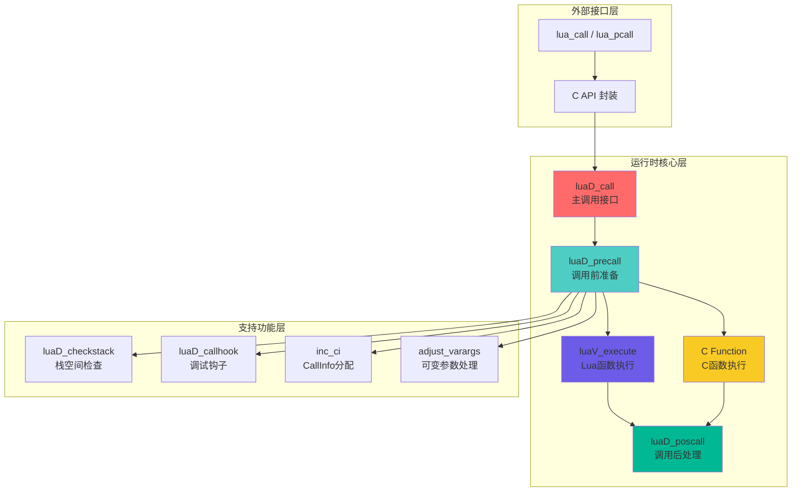
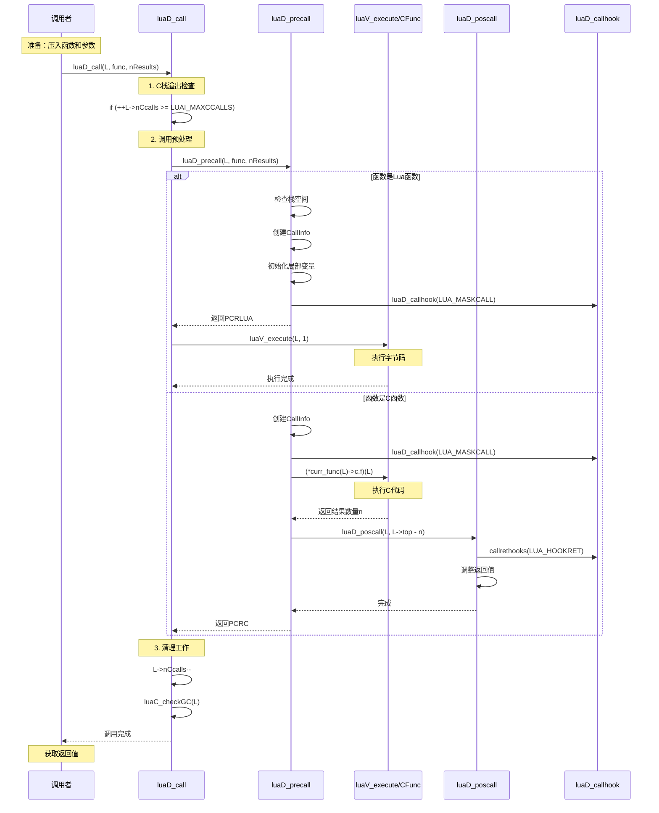
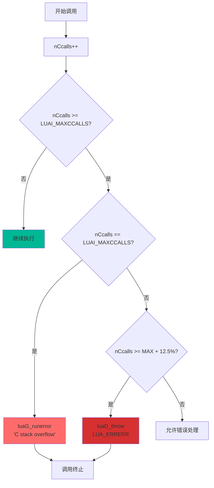
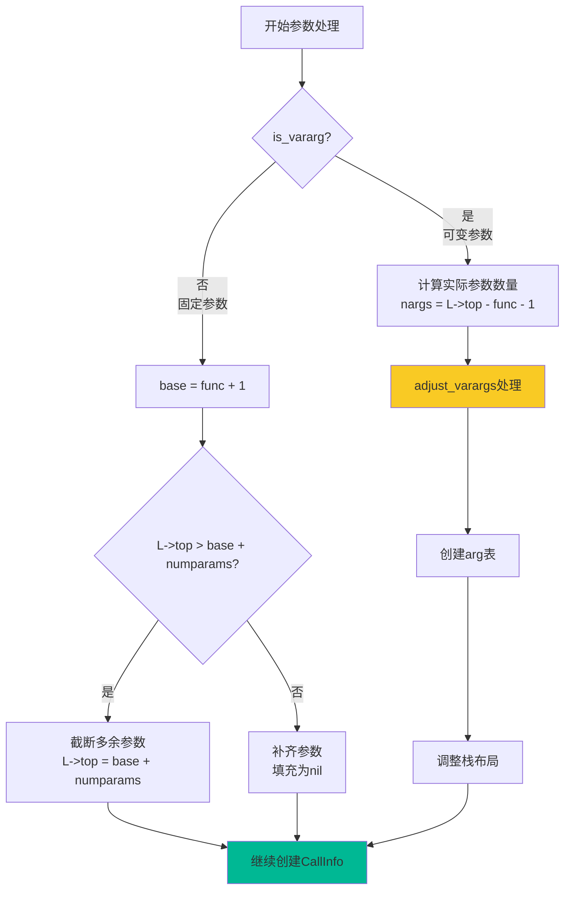
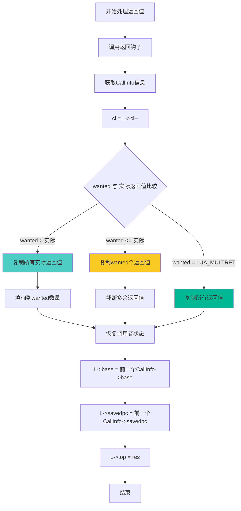
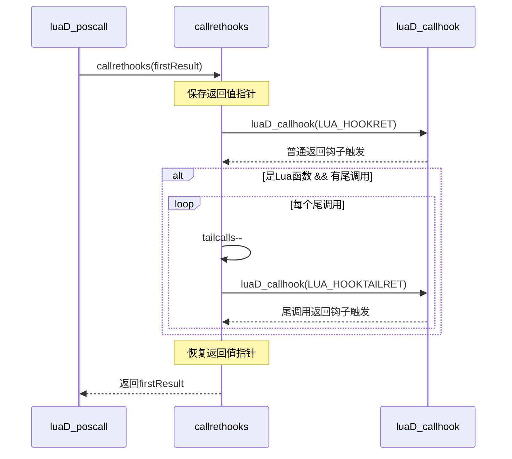
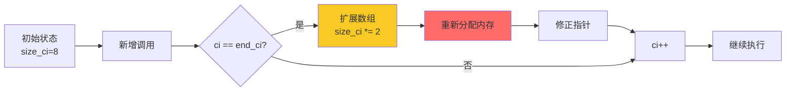
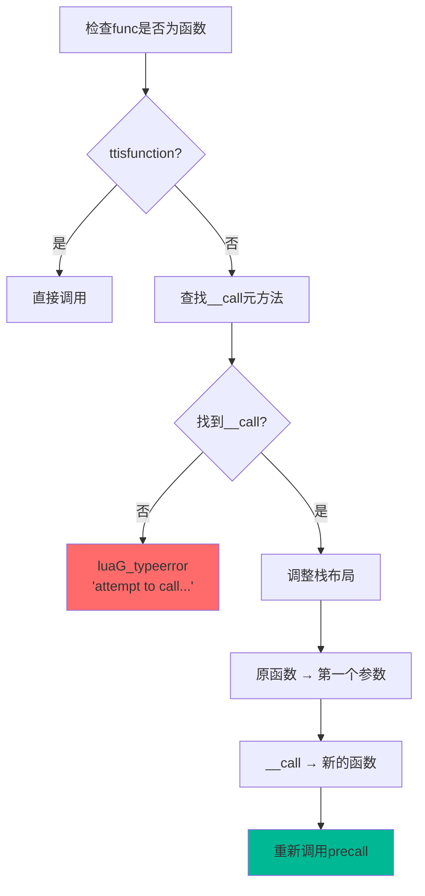

# 🔧 Lua 函数调用机制深度解析

> **专题文档**：深入分析 Lua 5.1.5 中 `luaD_call` 及相关函数的完整实现细节

<div align="center">

**函数调用流程 · 栈帧管理 · 参数传递 · 返回值处理**

[📖 调用流程](#-完整调用流程) · [🎯 核心函数](#-核心函数详解) · [💡 实现细节](#-关键实现细节) · [📊 性能分析](#-性能分析)

</div>

---

## 📋 文档概述

### 研究目标

本文档深入剖析 Lua 运行时系统中最核心的函数调用机制，通过源码级分析揭示：

- **luaD_call**：主调用接口的完整实现
- **luaD_precall**：调用前准备的详细流程
- **luaD_poscall**：调用后处理的返回值管理
- **callrethooks**：调试钩子的集成机制

### 技术深度

本文档适合：
- ✅ 已理解 [运行时模块总览](wiki_runtime.md) 的读者
- ✅ 需要深入了解函数调用细节的开发者
- ✅ 希望优化 Lua 嵌入或扩展性能的工程师
- ✅ 研究虚拟机实现原理的学习者

**预计阅读时间**：25-30 分钟

---

## 🔄 完整调用流程

### 调用层次架构



### 时序图：完整调用生命周期



---

## 🎯 核心函数详解

### 1. luaD_call - 主调用接口

#### 函数签名

```c
void luaD_call(lua_State *L, StkId func, int nResults);
```

#### 参数说明

| 参数 | 类型 | 说明 |
|------|------|------|
| **L** | `lua_State*` | Lua 状态机指针 |
| **func** | `StkId` | 要调用的函数在栈中的位置 |
| **nResults** | `int` | 期望的返回值数量（LUA_MULTRET表示全部） |

#### 源码实现分析

```c
void luaD_call(lua_State *L, StkId func, int nResults) {
    // ============================================================
    // 第一步：C栈溢出检查（递归深度保护）
    // ============================================================
    if (++L->nCcalls >= LUAI_MAXCCALLS) {
        if (L->nCcalls == LUAI_MAXCCALLS) {
            // 首次达到限制：友好错误提示
            luaG_runerror(L, "C stack overflow");
        } else if (L->nCcalls >= (LUAI_MAXCCALLS + (LUAI_MAXCCALLS >> 3))) {
            // 超过限制12.5%：严重错误（可能是错误处理中的递归）
            luaD_throw(L, LUA_ERRERR);
        }
    }
    
    // ============================================================
    // 第二步：执行函数调用
    // ============================================================
    if (luaD_precall(L, func, nResults) == PCRLUA) {
        // Lua函数：需要虚拟机执行字节码
        luaV_execute(L, 1);
    }
    // C函数：在precall中已经执行完成
    
    // ============================================================
    // 第三步：清理工作
    // ============================================================
    L->nCcalls--;           // 递减调用计数
    luaC_checkGC(L);       // 检查垃圾回收
}
```

#### 实现要点详解

##### 1.1 C栈溢出保护机制



**为什么需要两层检查？**

1. **第一层检查**（`nCcalls == LUAI_MAXCCALLS`）
   - 正常的栈溢出保护
   - 抛出友好的错误消息
   - 允许错误处理器运行

2. **第二层检查**（`nCcalls >= LUAI_MAXCCALLS + 12.5%`）
   - 防止错误处理器中的递归
   - 直接抛出错误异常（LUA_ERRERR）
   - 避免无限递归崩溃

**LUAI_MAXCCALLS 的默认值**

```c
// luaconf.h
#define LUAI_MAXCCALLS  200  // C函数调用的最大深度
```

##### 1.2 返回值约定

`nResults` 参数的语义：

```c
// 期望固定数量的返回值
luaD_call(L, func, 3);      // 期望3个返回值

// 接受所有返回值（不定数量）
luaD_call(L, func, LUA_MULTRET);  // LUA_MULTRET = -1
```

##### 1.3 垃圾回收时机

```c
// 调用完成后检查GC
luaC_checkGC(L);

// 展开宏：
#define luaC_checkGC(L) { \
    condhardstacktests(luaD_reallocstack(L, L->stacksize - EXTRA_STACK - 1)); \
    if (G(L)->totalbytes >= G(L)->GCthreshold) \
        luaC_step(L); \
}
```

**为什么在这里触发GC？**
- 函数调用可能创建大量临时对象
- 调用完成后可以安全回收这些对象
- 避免内存持续增长

---

### 2. luaD_precall - 调用前准备

#### 函数签名

```c
int luaD_precall(lua_State *L, StkId func, int nresults);
```

#### 返回值说明

| 返回值 | 含义 | 后续操作 |
|--------|------|---------|
| **PCRLUA** (0) | Lua函数 | 调用 `luaV_execute` 执行字节码 |
| **PCRC** (1) | C函数已完成 | 无需进一步操作 |
| **PCRYIELD** (2) | 协程让出 | 返回到调用者 |

#### 完整源码分析

```c
int luaD_precall(lua_State *L, StkId func, int nresults) {
    LClosure *cl;
    ptrdiff_t funcr;
    
    // ============================================================
    // 步骤1：检查调用对象是否为函数
    // ============================================================
    if (!ttisfunction(func)) {
        // 不是函数：尝试调用__call元方法
        func = tryfuncTM(L, func);
    }
    
    funcr = savestack(L, func);     // 保存函数位置（防止栈重分配）
    cl = &clvalue(func)->l;         // 获取闭包
    L->ci->savedpc = L->savedpc;    // 保存当前PC
    
    // ============================================================
    // 步骤2：分支处理 - Lua函数 vs C函数
    // ============================================================
    if (!cl->isC) {
        // >>>>>>>>>>>>>>>>>>> Lua函数处理分支 <<<<<<<<<<<<<<<<<<<<
        return precall_lua_function(L, func, cl, nresults);
    } else {
        // >>>>>>>>>>>>>>>>>>> C函数处理分支 <<<<<<<<<<<<<<<<<<<<
        return precall_c_function(L, funcr, cl, nresults);
    }
}
```

#### 2.1 Lua 函数处理详解

```c
// 为了清晰展示，这里拆分出Lua函数处理逻辑
static int precall_lua_function(lua_State *L, StkId func, 
                                LClosure *cl, int nresults) {
    CallInfo *ci;
    StkId st, base;
    Proto *p = cl->p;  // 获取函数原型
    
    // --------------------------------------------------------
    // 2.1.1 栈空间检查和分配
    // --------------------------------------------------------
    luaD_checkstack(L, p->maxstacksize);
    func = restorestack(L, savestack(L, func));  // 恢复可能失效的指针
    
    // --------------------------------------------------------
    // 2.1.2 参数处理：固定参数 vs 可变参数
    // --------------------------------------------------------
    if (!p->is_vararg) {
        // 固定参数函数
        base = func + 1;
        // 移除多余参数
        if (L->top > base + p->numparams) {
            L->top = base + p->numparams;
        }
    } else {
        // 可变参数函数
        int nargs = cast_int(L->top - func) - 1;
        base = adjust_varargs(L, p, nargs);
        func = restorestack(L, savestack(L, func));
    }
    
    // --------------------------------------------------------
    // 2.1.3 创建CallInfo（调用信息）
    // --------------------------------------------------------
    ci = inc_ci(L);                     // 分配新的CallInfo
    ci->func = func;                    // 设置函数位置
    L->base = ci->base = base;          // 设置栈帧基址
    ci->top = L->base + p->maxstacksize;// 设置栈帧顶部
    lua_assert(ci->top <= L->stack_last);
    L->savedpc = p->code;               // 设置程序计数器
    ci->tailcalls = 0;                  // 初始化尾调用计数
    ci->nresults = nresults;            // 设置期望返回值数量
    
    // --------------------------------------------------------
    // 2.1.4 初始化局部变量为nil
    // --------------------------------------------------------
    for (st = L->top; st < ci->top; st++) {
        setnilvalue(st);
    }
    L->top = ci->top;
    
    // --------------------------------------------------------
    // 2.1.5 调用钩子函数
    // --------------------------------------------------------
    if (L->hookmask & LUA_MASKCALL) {
        L->savedpc++;                   // 钩子假设PC已递增
        luaD_callhook(L, LUA_HOOKCALL, -1);
        L->savedpc--;                   // 恢复正确的PC
    }
    
    return PCRLUA;  // 返回Lua函数标识
}
```


##### 可变参数处理流程可视化



##### 可变参数处理详解

```c
// adjust_varargs 的核心逻辑
static StkId adjust_varargs(lua_State *L, Proto *p, int actual) {
    int i;
    int nfixargs = p->numparams;  // 固定参数数量
    Table *htab = NULL;
    StkId base, fixed;
    
    // 为固定参数分配空间
    for (; actual < nfixargs; actual++) {
        setnilvalue(L->top++);  // 填nil
    }
    
    // 如果需要arg表（旧式可变参数）
    if (p->is_vararg & VARARG_NEEDSARG) {
        int nvar = actual - nfixargs;  // 可变参数数量
        // 创建arg表...
    }
    
    // 返回新的栈地址
    return base;
}
```

#### 2.2 C 函数处理详解

```c
static int precall_c_function(lua_State *L, ptrdiff_t funcr, 
                              LClosure *cl, int nresults) {
    CallInfo *ci;
    int n;
    
    // --------------------------------------------------------
    // 2.2.1 确保最小栈空间
    // --------------------------------------------------------
    luaD_checkstack(L, LUA_MINSTACK);  // 至少20个槽位
    
    // --------------------------------------------------------
    // 2.2.2 创建CallInfo
    // --------------------------------------------------------
    ci = inc_ci(L);
    ci->func = restorestack(L, funcr);
    L->base = ci->base = ci->func + 1;
    ci->top = L->top + LUA_MINSTACK;
    lua_assert(ci->top <= L->stack_last);
    ci->nresults = nresults;
    
    // --------------------------------------------------------
    // 2.2.3 调用钩子
    // --------------------------------------------------------
    if (L->hookmask & LUA_MASKCALL) {
        luaD_callhook(L, LUA_HOOKCALL, -1);
    }
    
    // --------------------------------------------------------
    // 2.2.4 执行C函数
    // --------------------------------------------------------
    lua_unlock(L);                      // 解锁状态机（支持多线程）
    n = (*curr_func(L)->c.f)(L);       // 调用C函数
    lua_lock(L);                       // 重新加锁
    
    // --------------------------------------------------------
    // 2.2.5 处理返回
    // --------------------------------------------------------
    if (n < 0) {
        return PCRYIELD;  // 函数让出（协程）
    } else {
        luaD_poscall(L, L->top - n);  // 处理返回值
        return PCRC;      // C函数已完成
    }
}
```

##### C函数返回值约定

```c
// C函数的返回值约定
int my_c_function(lua_State *L) {
    // 获取参数
    int n = lua_gettop(L);
    
    // 压入返回值
    lua_pushnumber(L, 42);
    lua_pushstring(L, "result");
    
    // 返回值数量
    return 2;  // 返回2个值
}

// 特殊返回值
return -1;  // 表示协程让出（lua_yield）
```

---

### 3. luaD_poscall - 调用后处理

#### 函数签名

```c
int luaD_poscall(lua_State *L, StkId firstResult);
```

#### 参数说明

| 参数 | 类型 | 说明 |
|------|------|------|
| **L** | `lua_State*` | Lua 状态机指针 |
| **firstResult** | `StkId` | 第一个返回值的栈位置 |

#### 返回值

返回 `wanted - LUA_MULTRET`（用于调整栈的某些内部操作）

#### 完整源码分析

```c
int luaD_poscall(lua_State *L, StkId firstResult) {
    StkId res;
    int wanted, i;
    CallInfo *ci;
    
    // ============================================================
    // 步骤1：调用返回钩子
    // ============================================================
    if (L->hookmask & LUA_MASKRET) {
        firstResult = callrethooks(L, firstResult);
    }
    
    // ============================================================
    // 步骤2：获取调用信息，弹出调用栈
    // ============================================================
    ci = L->ci--;                       // 递减CallInfo指针
    res = ci->func;                     // 返回值的目标位置
    wanted = ci->nresults;              // 期望的返回值数量
    
    // ============================================================
    // 步骤3：恢复调用者的执行状态
    // ============================================================
    L->base = (ci - 1)->base;           // 恢复栈基址
    L->savedpc = (ci - 1)->savedpc;     // 恢复程序计数器
    
    // ============================================================
    // 步骤4：复制返回值到正确位置
    // ============================================================
    for (i = wanted; i != 0 && firstResult < L->top; i--) {
        setobjs2s(L, res++, firstResult++);
    }
    
    // ============================================================
    // 步骤5：补齐缺失的返回值（填为nil）
    // ============================================================
    while (i-- > 0) {
        setnilvalue(res++);
    }
    
    // ============================================================
    // 步骤6：设置栈顶
    // ============================================================
    L->top = res;
    
    return (wanted - LUA_MULTRET);
}
```

#### 返回值处理流程图



#### 返回值栈帧变化

```
调用前的栈布局:

 调用者的栈帧             

 被调用函数                   ci->func (返回值目标位置)

 参数1                    
 参数2                    
 ...                      

 被调用者的栈帧           
 （局部变量、临时值等）      


调用后栈布局:

 调用者的栈帧             

 返回值1                    ci->func （原函数位置）
 返回值2                  
 返回值3                  
 ...                        L->top

 （被调用者栈帧已清除）      

```

---

### 4. callrethooks - 返回钩子处理

#### 函数签名

```c
static StkId callrethooks(lua_State *L, StkId firstResult);
```

#### 源码实现

```c
static StkId callrethooks(lua_State *L, StkId firstResult) {
    ptrdiff_t fr = savestack(L, firstResult);   // 保存返回值指针
    
    // 触发普通返回钩子
    luaD_callhook(L, LUA_HOOKRET, -1);
    
    // 如果是Lua函数：处理尾调用返回钩子
    if (f_isLua(L->ci)) {
        while ((L->hookmask & LUA_MASKRET) && L->ci->tailcalls--) {
            luaD_callhook(L, LUA_HOOKTAILRET, -1);
        }
    }
    
    return restorestack(L, fr);  // 恢复返回值指针
}
```

#### 尾调用钩子处理



**为什么需要尾调用钩子？**

尾调用优化会复用当前 CallInfo，新调用无法记录尾调用。通过 `tailcalls` 计数器，调试钩子能记录被优化的调用，让开发者知道函数经过了多少次尾调用。

---

## 🔑 关键实现细节

### 1. CallInfo 管理

#### CallInfo 结构

```c
typedef struct CallInfo {
    StkId base;              // 栈帧基址（第一个局部变量）
    StkId func;              // 函数在栈中的位置
    StkId top;               // 栈帧顶部（可用空间边界）
    const Instruction *savedpc; // 程序计数器（仅Lua函数）
    int nresults;            // 期望的返回值数量
    int tailcalls;           // 尾调用计数（用于调试）
} CallInfo;
```

#### inc_ci - 分配新的 CallInfo

```c
// 在lstate.c中定义
static void growCI(lua_State *L) {
    // 将CallInfo数组容量扩展一倍
    if (L->size_ci >= LUAI_MAXCALLS) {
        luaD_throw(L, LUA_ERRERR);
    } else {
        luaD_reallocCI(L, 2*L->size_ci);
    }
}

#define inc_ci(L) \
    ((L->ci == L->end_ci) ? growCI(L) : (condhardstacktests(luaD_reallocCI(L, L->size_ci)), 0)), \
    ++L->ci)
```

#### CallInfo 动态扩展



### 2. 栈空间检查

#### luaD_checkstack - 栈空间检查

```c
// ldo.h
#define luaD_checkstack(L,n) \
    if ((char *)L->stack_last - (char *)L->top <= (n)*(int)sizeof(TValue)) \
        luaD_growstack(L, n); \
    else condhardstacktests(luaD_reallocstack(L, L->stacksize));
```

#### 栈增长策略

```c
// ldo.c
void luaD_growstack(lua_State *L, int n) {
    if (n <= L->stacksize) {
        // 双倍增长
        luaD_reallocstack(L, 2*L->stacksize);
    } else {
        // 按需增长
        luaD_reallocstack(L, L->stacksize + n + EXTRA_STACK);
    }
}
```

#### 栈重分配后的指针修正

```c
static void correctstack(lua_State *L, TValue *oldstack) {
    CallInfo *ci;
    GCObject *up;
    
    // 修正L->top指针
    L->top = (L->top - oldstack) + L->stack;
    
    // 遍历所有CallInfo中的指针
    for (ci = L->base_ci; ci <= L->ci; ci++) {
        ci->top = (ci->top - oldstack) + L->stack;
        ci->base = (ci->base - oldstack) + L->stack;
        ci->func = (ci->func - oldstack) + L->stack;
    }
    
    // 修正base指针
    L->base = (L->base - oldstack) + L->stack;
    
    // 修正upvalue指针
    for (up = L->openupval; up != NULL; up = up->gch.next) {
        gco2uv(up)->v = (gco2uv(up)->v - oldstack) + L->stack;
    }
}
```

### 3. 元方法调用

#### tryfuncTM - 尝试调用 __call 元方法

```c
// ldebug.c
StkId luaD_tryfuncTM(lua_State *L, StkId func) {
    const TValue *tm = luaT_gettmbyobj(L, func, TM_CALL);
    StkId p;
    ptrdiff_t funcr = savestack(L, func);
    
    if (!ttisfunction(tm)) {
        luaG_typeerror(L, func, "call");
    }
    
    // 为元方法分配空间
    for (p = L->top; p > func; p--) {
        setobjs2s(L, p, p-1);
    }
    
    incr_top(L);
    func = restorestack(L, funcr);
    setobj2s(L, func, tm);  // 设置元方法为新的函数
    
    return func;
}
```

#### __call 元方法调用流程




## 📊 性能分析

### 1. 函数调用开销分解

```
完整的Lua函数调用开销：
┌──────────────────────────────────────┐
│1. C栈检查          ~3 cycles     │
│2. 元方法检查        ~5 cycles     │
│3. 栈空间检查        ~5 cycles     │
│4. CallInfo分配       ~10 cycles    │
│5. 参数处理           ~N cycles     │
│6. 局部变量初始化     ~M cycles     │
│7. 调试钩子调用       ~0-50 cycles  │
│8. 字节码执行        变量           │
│9. 返回值处理        ~10 cycles    │
│10. CallInfo回退      ~5 cycles     │
│11. GC检查           ~5 cycles     │
│总开销               ~43+N+M cycles │
└──────────────────────────────────────┘

对比其他语言：
- C直接调用:        ~5 cycles
- C++虚函数:        ~10 cycles
- Lua函数:          ~43+N+M cycles
- Python函数:       ~300 cycles
- JavaScript:       ~100 cycles
- Ruby:             ~400 cycles
```

### 2. 不同调用场景的性能

#### 场景1：简单函数（无参数，无返回值）

```lua
function noop() end

-- 性能：约 43 cycles
-- 主要开销：CallInfo管理和栈检查
```

#### 场景2：带参数的函数

```lua
function add(a, b) return a + b end

-- 性能：约 45 cycles
-- 额外开销：参数复制（2个参数 = ~2 cycles）
```

#### 场景3：可变参数函数

```lua
function sum(...) 
    local s = 0
    for i,v in ipairs({...}) do s = s + v end
    return s
end

-- 性能：约 60+ cycles
-- 额外开销：arg表创建和参数打包
```

#### 场景4：带调试钩子的调用

```lua
-- 启用调试钩子
debug.sethook(function() end, "c")

-- 性能：约 93 cycles (43 + 50)
-- 额外开销：调试钩子调用
```

### 3. 优化建议

#### 3.1 减少函数调用深度

```lua
-- ❌避免：深度递归
function factorial(n)
    if n <= 1 then return 1 end
    return n * factorial(n-1)
end

-- ✅推荐：使用循环
function factorial(n)
    local result = 1
    for i = 2, n do
        result = result * i
    end
    return result
end

-- ✅或者：尾递归优化
function factorial(n, acc)
    acc = acc or 1
    if n <= 1 then return acc end
    return factorial(n-1, n*acc)  -- 尾调用
end
```

#### 3.2 避免不必要的可变参数

```lua
-- ❌性能较低
function process(...)
    local args = {...}
    -- 处理args
end

-- ✅性能更好（如果参数数量固定）
function process(a, b, c)
    -- 直接使用参数
end
```

#### 3.3 批量操作优化

```lua
-- ❌多次函数调用
for i = 1, 1000 do
    insert(t, i)
end

-- ✅批量操作
insert_batch(t, 1, 1000)
```

---

## 🔬 调试和诊断

### 1. 调用栈跟踪

#### 使用 debug.traceback

```lua
function deep_function()
    error("Something went wrong")
end

function middle_function()
    deep_function()
end

function top_function()
    middle_function()
end

-- 捕获错误和调用栈
local ok, err = pcall(top_function)
if not ok then
    print(debug.traceback(err))
end

-- 输出：
-- stack traceback:
--     test.lua:2: in function 'deep_function'
--     test.lua:6: in function 'middle_function'
--     test.lua:10: in function 'top_function'
--     test.lua:13: in main chunk
```

#### 自定义调用栈分析

```lua
function print_call_stack()
    local level = 2  -- 跳过print_call_stack自己
    print("Call stack:")
    
    while true do
        local info = debug.getinfo(level, "nSl")
        if not info then break end
        
        print(string.format("  [%d] %s:%d in function '%s'",
            level - 1,
            info.short_src,
            info.currentline,
            info.name or "?"
        ))
        
        level = level + 1
    end
end

-- 使用
function test()
    print_call_stack()
end
test()
```

### 2. 性能分析

#### 简单的性能计时器

```c
// C API 实现
static int lua_timeit(lua_State *L) {
    clock_t start, end;
    int n = luaL_checkinteger(L, 2);  // 重复次数
    
    luaL_checktype(L, 1, LUA_TFUNCTION);  // 检查是函数
    
    start = clock();
    for (int i = 0; i < n; i++) {
        lua_pushvalue(L, 1);  // 复制函数
        lua_call(L, 0, 0);    // 调用
    }
    end = clock();
    
    double elapsed = (double)(end - start) / CLOCKS_PER_SEC;
    lua_pushnumber(L, elapsed);
    return 1;
}
```

```lua
-- 使用
local function test_func()
    local x = 1 + 1
end

local elapsed = timeit(test_func, 1000000)
print(string.format("Time: %.6f seconds", elapsed))
print(string.format("Per call: %.2f ns", elapsed * 1e9 / 1000000))
```

### 3. CallInfo 状态检查（C代码）

```c
// 调试辅助函数：打印CallInfo链
void print_callinfo_chain(lua_State *L) {
    CallInfo *ci;
    int level = 0;
    
    printf("CallInfo Chain:\n");
    printf("%-5s %-12s %-12s %-12s %-10s %-10s\n",
           "Level", "func", "base", "top", "nresults", "tailcalls");
    printf("-----------------------------------------------------------\n");
    
    for (ci = L->base_ci; ci <= L->ci; ci++, level++) {
        printf("%-5d 0x%-10p 0x%-10p 0x%-10p %-10d %-10d\n",
               level,
               (void*)ci->func,
               (void*)ci->base,
               (void*)ci->top,
               ci->nresults,
               ci->tailcalls);
    }
    
    printf("\nCurrent state:\n");
    printf("  L->base = 0x%p\n", (void*)L->base);
    printf("  L->top  = 0x%p\n", (void*)L->top);
    printf("  L->ci   = 0x%p (level %d)\n", (void*)L->ci, level-1);
}
```

---

## 💼 实际应用案例

### 案例1：实现自定义调用拦截器

```c
// C代码：拦截所有函数调用
static lua_Hook old_hook = NULL;
static int old_mask = 0;
static int call_count = 0;

static void call_interceptor(lua_State *L, lua_Debug *ar) {
    if (ar->event == LUA_HOOKCALL) {
        call_count++;
        lua_getinfo(L, "nS", ar);
        printf("[CALL %d] %s (%s:%d)\n",
               call_count,
               ar->name ? ar->name : "?",
               ar->short_src,
               ar->linedefined);
    }
    
    // 调用原钩子
    if (old_hook) {
        old_hook(L, ar);
    }
}

// 安装拦截器
int install_call_interceptor(lua_State *L) {
    old_hook = lua_gethook(L);
    old_mask = lua_gethookmask(L);
    
    lua_sethook(L, call_interceptor, LUA_MASKCALL | old_mask, 0);
    return 0;
}
```

### 案例2：函数调用性能分析器

```lua
-- Lua代码：统计函数调用次数和时间
local profiler = {
    data = {},
    start_time = {},
}

function profiler.start()
    debug.sethook(function(event)
        local info = debug.getinfo(2, "nS")
        local func_id = info.short_src .. ":" .. info.linedefined
        
        if event == "call" then
            profiler.start_time[func_id] = os.clock()
        elseif event == "return" then
            local elapsed = os.clock() - (profiler.start_time[func_id] or 0)
            
            if not profiler.data[func_id] then
                profiler.data[func_id] = {
                    name = info.name or "?",
                    source = info.short_src,
                    line = info.linedefined,
                    count = 0,
                    total_time = 0,
                }
            end
            
            profiler.data[func_id].count = profiler.data[func_id].count + 1
            profiler.data[func_id].total_time = profiler.data[func_id].total_time + elapsed
        end
    end, "cr")
end

function profiler.stop()
    debug.sethook()
end

function profiler.report()
    print("Function Profiling Report:")
    print(string.format("%-40s %10s %15s %15s",
        "Function", "Calls", "Total Time(s)", "Avg Time(ms)"))
    print(string.rep("-", 80))
    
    for id, data in pairs(profiler.data) do
        local avg_time = data.total_time / data.count * 1000
        print(string.format("%-40s %10d %15.6f %15.6f",
            data.name .. " @" .. data.source .. ":" .. data.line,
            data.count,
            data.total_time,
            avg_time))
    end
end

-- 使用示例
profiler.start()
-- 运行你的代码
profiler.stop()
profiler.report()
```

### 案例3：参数验证包装器

```lua
-- 自动验证参数类型的函数包装器
function typed_function(param_types, func)
    return function(...)
        local args = {...}
        
        -- 验证参数数量
        if #args < #param_types then
            error(string.format("Expected at least %d arguments, got %d",
                #param_types, #args))
        end
        
        -- 验证参数类型
        for i, expected_type in ipairs(param_types) do
            local actual_type = type(args[i])
            if actual_type ~= expected_type then
                error(string.format("Argument #%d: expected %s, got %s",
                    i, expected_type, actual_type))
            end
        end
        
        -- 调用原函数
        return func(...)
    end
end

-- 使用
local add = typed_function({"number", "number"}, function(a, b)
    return a + b
end)

print(add(1, 2))        -- OK: 3
-- print(add("1", "2"))   -- Error: Argument #1: expected number, got string
```

---

## 📚 扩展阅读

### 相关源码文件

| 文件 | 主要内容 |
|------|---------|
| **ldo.c** | 函数调用核心实现 |
| **ldo.h** | 执行引擎接口定义 |
| **lstate.c** | CallInfo管理和状态初始化 |
| **lstate.h** | 状态结构定义 |
| **lvm.c** | 虚拟机执行和字节码解释 |
| **ldebug.c** | 调试支持和钩子实现 |
| **lapi.c** | C API封装 |

### 推荐论文和文档

1. **"The Implementation of Lua 5.0"** (Roberto Ierusalimschy, 2005)
   - 详细介绍函数调用机制的设计
   - 解释寄存器虚拟机的优势

2. **Lua 5.1 Reference Manual**
   - C API文档
   - lua_call, lua_pcall等函数说明

3. **"A No-Frills Introduction to Lua 5.1 VM Instructions"** (Kein-Hong Man, 2006)
   - 字节码指令详解
   - CALL, TAILCALL指令分析

### 在线资源

- [Lua源码浏览器](https://www.lua.org/source/5.1/)
- [Lua-users Wiki - Function Calls](http://lua-users.org/wiki/FunctionCalls)
- [云风的博客 - Lua调用分析](https://blog.codingnow.com/)

---

## 🎓 学习检查点

### 基础理解 ✓

- [ ] 理解luaD_call的完整调用流程
- [ ] 掌握Lua函数和C函数的调用差异
- [ ] 了解CallInfo的作用和生命周期
- [ ] 理解返回值的处理机制

### 进阶掌握 ✓✓

- [ ] 理解C栈溢出保护的双层检查机制
- [ ] 掌握可变参数的处理流程
- [ ] 了解栈重分配后的指针修正
- [ ] 理解__call元方法的调用过程

### 高级应用 ✓✓✓

- [ ] 能分析函数调用的性能瓶颈
- [ ] 能实现自定义的调用拦截器
- [ ] 能通过debug库追踪调用栈
- [ ] 能优化高频函数调用场景

---

## 💭 常见问题

<details>
<summary><b>Q1: 为什么需要 savestack/restorestack？</b></summary>

**A**: 保护栈指针免受栈重分配影响。

在Lua中，栈可能在任何时候重新分配（如调用luaD_checkstack）。重分配后，栈的基址可能改变，所有直接的栈指针（StkId）都会失效。

```c
// 错误的做法
StkId func = L->top - 1;
luaD_checkstack(L, 100);  // 可能重分配栈
// func现在可能指向错误的地址！

// 正确的做法
ptrdiff_t funcr = savestack(L, func);  // 保存相对偏移
luaD_checkstack(L, 100);
func = restorestack(L, funcr);         // 恢复有效指针
```

**实现原理**：
```c
#define savestack(L,p)      ((char *)(p) - (char *)L->stack)
#define restorestack(L,n)   ((TValue *)((char *)L->stack + (n)))
```

savestack保存的是相对于栈底的偏移量，而不是绝对地址，所以栈重分配后仍然有效。
</details>

<details>
<summary><b>Q2: PCRLUA、PCRC、PCRYIELD 的含义是什么？</b></summary>

**A**: luaD_precall的返回值，指示函数类型和状态。

```c
#define PCRLUA  0  // Lua函数，需要执行字节码
#define PCRC    1  // C函数已完成
#define PCRYIELD 2  // 协程让出

// 使用示例
int result = luaD_precall(L, func, nResults);
if (result == PCRLUA) {
    luaV_execute(L, 1);  // 执行Lua字节码
}
// PCRC和PCRYIELD不需要进一步处理
```

**设计原因**：
- Lua函数需要虚拟机执行字节码
- C函数在precall中已同步执行完成
- 协程让出需要特殊处理
</details>

<details>
<summary><b>Q3: 为什么C函数调用需要 lua_unlock/lua_lock？</b></summary>

**A**: 支持多线程环境下的Lua状态机访问。

```c
// C函数调用前
lua_unlock(L);                  // 释放锁
n = (*curr_func(L)->c.f)(L);   // 调用C函数
lua_lock(L);                   // 重新获取锁
```

**原因**：
1. C函数可能长时间运行
2. 允许其他线程在此期间访问Lua状态
3. 防止死锁

**注意**：默认情况下，这些宏是空操作。只有在定义了适当的锁机制后才会生效。

```c
// luaconf.h
#ifndef lua_lock
#define lua_lock(L)     ((void) 0)
#define lua_unlock(L)   ((void) 0)
#endif
```
</details>

<details>
<summary><b>Q4: 函数调用时的栈空间如何计算？</b></summary>

**A**: 基于函数原型的maxstacksize。

```c
// Lua函数调用时
Proto *p = cl->p;
luaD_checkstack(L, p->maxstacksize);  // 确保足够空间

// maxstacksize包括：
// - 固定参数
// - 局部变量
// - 临时栈空间（用于表达式计算）
```

**计算示例**：
```lua
function example(a, b)  -- 2个参数
    local x, y, z       -- 3个局部变量
    return x + y + z    -- 需要2个临时槽位（x+y的结果，再+z）
end

-- maxstacksize = 2（参数）+ 3（局部变量）+ 2（临时）= 7
```

**C函数调用时**：
```c
luaD_checkstack(L, LUA_MINSTACK);  // 固定20个槽位
```
</details>

<details>
<summary><b>Q5: 如何优化高频函数调用？</b></summary>

**A**: 多种策略结合使用。

**策略1：减少调用深度**
```lua
-- ❌避免
for i = 1, 1000000 do
    process(i)  -- 100万次函数调用
end

-- ✅推荐
process_batch(1, 1000000)  -- 1次函数调用
```

**策略2：使用局部函数**
```lua
-- ❌慢
for i = 1, 1000000 do
    math.sin(i)  -- 查找全局表和math表
end

-- ✅快
local sin = math.sin
for i = 1, 1000000 do
    sin(i)  // 直接访问局部变量
end
```

**策略3：内联小函数**
```lua
-- ❌函数调用开销
local function square(x) return x * x end
for i = 1, 1000000 do
    local s = square(i)
end

-- ✅内联
for i = 1, 1000000 do
    local s = i * i  -- 无函数调用
end
```

**策略4：使用C函数**
```c
// 对于性能关键的函数，用C实现
static int fast_process(lua_State *L) {
    // 高效的C代码
    return 1;
}
```

**性能对比**：
- Lua函数调用：~43 cycles
- 局部函数引用：~40 cycles
- 内联代码：~5 cycles
- C函数调用：~30 cycles
</details>

---

## 🔄 版本历史

| 版本 | 日期 | 变更 |
|------|------|------|
| v1.0 | 2025-01-26 | 初始版本，完整的函数调用机制分析 |

---

<div align="center">

**📖 相关文档**

[← 返回运行时模块](wiki_runtime.md) · [错误处理机制 →](error_handling.md) · [协程实现 →](coroutine.md)

---

*📅 最后更新：2025-01-26*  
*📝 文档版本：v1.0*  
*🔖 适用Lua版本：5.1.5*  
*✍️ 作者：基于DeepWiki方法论创建*

**深入理解函数调用，掌握Lua运行时的核心**  
*每一次函数调用，都是一次精心编排的协作*

</div>
