# 📚 Lua 栈管理机制详解

> **DeepWiki 深度技术文档**  
> 难度等级：⭐⭐⭐⭐⭐ (专家级)  
> 预计阅读时间：30-35 分钟  
> 先修知识：C 语言、动态数组、指针操作

<div align="center">

**动态增长 · 指针调整 · 内存安全 · 性能优化**

[📖 核心概念](#-核心概念) · [🔧 实现机制](#-实现机制) · [⚡ 性能分析](#-性能分析) · [💡 设计权衡](#-设计权衡)

</div>

---

## 📋 文档概述

### 学习目标

学完本文档后，你将能够：

- ✅ **理解 Lua 栈的物理结构**和内存布局
- ✅ **掌握双倍增长策略**的原理和优势
- ✅ **理解指针调整算法**的必要性和实现
- ✅ **分析栈管理的性能特征**和优化技巧
- ✅ **在 C API 中正确管理栈空间**

### 核心问题

本文档将回答以下关键问题：

1. **为什么需要动态栈？** Lua 如何平衡灵活性和性能？
2. **双倍增长策略如何工作？** 为什么不是固定增长或 1.5 倍？
3. **指针调整为什么复杂？** 哪些指针需要调整？如何避免遗漏？
4. **如何保证内存安全？** 栈溢出检查的时机和策略是什么？
5. **性能瓶颈在哪里？** 如何优化栈操作？

### 文档结构

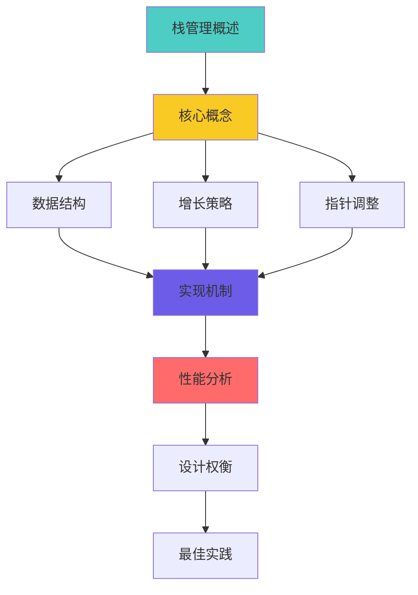

---

## 🎯 核心概念

### 1. Lua 栈的本质

#### 什么是 Lua 栈？

Lua 栈是一个**动态增长的数组**，用于存储：
- 函数参数和返回值
- 局部变量
- 临时计算结果
- 函数调用帧

```
Lua 栈的物理视图：
┌─────────────────────────────────────┐
│  连续的 TValue 数组 (动态大小)      │
│  ┌────┬────┬────┬────┬────┬────┐    │
│  │ V1 │ V2 │ V3 │ V4 │... │ Vn │    │
│  └────┴────┴────┴────┴────┴────┘    │
│  ^                         ^         │
│  stack                     stack+size│
└─────────────────────────────────────┘

每个槽位 (TValue) 大小：16 字节
- 8 字节 Value (联合体)
- 4 字节 类型标记
- 4 字节 对齐/保留
```

#### 栈 vs 堆

| 特性 | Lua 栈 | Lua 堆 |
|------|--------|--------|
| **用途** | 临时值、局部变量 | 持久对象 |
| **管理** | 自动（栈指针） | GC 管理 |
| **大小** | 动态可变 | 动态可变 |
| **分配** | O(1) 指针移动 | O(1) 内存池 |
| **访问** | 直接索引 | 通过引用 |
| **生命周期** | 函数作用域 | 对象引用计数 |

#### 栈的逻辑结构

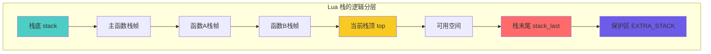

---

### 2. 核心数据结构

#### lua_State 中的栈相关字段

```c
// lstate.h: lua_State 栈管理字段
struct lua_State {
    CommonHeader;
    
    // ===== 栈指针 (最常用) =====
    StkId top;              // 当前栈顶（下一个可用位置）
    StkId base;             // 当前函数栈帧基址
    
    // ===== 栈边界 =====
    StkId stack;            // 栈底（固定）
    StkId stack_last;       // 可用空间末尾（不含EXTRA_STACK）
    
    // ===== 栈大小 =====
    int stacksize;          // 当前栈总大小（槽位数）
    
    // ===== 其他字段 =====
    global_State *l_G;      // 全局状态
    CallInfo *ci;           // 当前调用信息
    // ... 更多字段
};

// 类型定义
typedef TValue *StkId;      // 栈索引（指向 TValue 的指针）

// TValue: Lua 值的统一表示
typedef struct lua_TValue {
    Value value;            // 8 字节：实际值（联合体）
    int tt;                 // 4 字节：类型标记
} TValue;
```

#### 栈指针关系图

```
内存布局（从低地址到高地址）：
┌─────────────────────────────────────────────────────┐
│                    完整栈空间                        │
├─────────────────────────────────────────────────────┤
│                                                     │
│  ┌─────────────────────────────────────┐           │
│  │          可用空间                    │           │
│  │  (stacksize 个 TValue)              │           │
│  │  ┌───────────────────────┐          │           │
│  │  │   已使用空间           │          │           │
│  │  │   ┌─────────┐         │          │           │
│  │  │   │ 当前帧  │         │          │           │
│  │  │   └─────────┘         │          │           │
│  │  └───────────────────────┘          │           │
│  └─────────────────────────────────────┘           │
│  ^           ^        ^                ^           ^│
│  stack       base     top        stack_last      end│
│                                                     │
└─────────────────────────────────────────────────────┘
                                              └──────┘
                                              EXTRA_STACK
                                              (保护区)

关键不变式：
1. stack <= base <= top <= stack_last
2. stack_last = stack + stacksize - EXTRA_STACK
3. EXTRA_STACK = 5 (固定安全边距)
```

#### 栈大小常量

```c
// llimits.h: 栈大小限制
#define LUAI_MAXCSTACK  8000      // C 调用栈最大深度
#define LUAI_MAXSTACK   1000000   // Lua 栈最大大小

// lstate.h: 栈常量
#define BASIC_STACK_SIZE    (2*LUA_MINSTACK)  // 初始栈大小 = 40
#define EXTRA_STACK         5                  // 额外保护空间
#define LUA_MINSTACK        20                 // 最小栈空间

// 初始分配大小
#define INITIAL_STACK_SIZE  BASIC_STACK_SIZE  // 40 槽位
```

---

### 3. 双倍增长策略

#### 为什么需要动态增长？

```lua
-- 问题场景：栈空间需求差异巨大
function shallow()
    return 1 + 2  -- 只需要 3-4 个槽位
end

function deep_recursion(n)
    if n == 0 then return 0 end
    local a, b, c = n, n*2, n*3  -- 每层需要多个局部变量
    return a + b + c + deep_recursion(n-1)
end

deep_recursion(1000)  -- 需要 1000+ 层，每层多个槽位
```

**如果固定栈大小**：
- 太小：频繁栈溢出
- 太大：浪费内存（大多数函数不需要）

**解决方案**：动态增长

#### 双倍增长算法

```c
// ldo.c: 栈增长入口
void luaD_growstack (lua_State *L, int n) {
    // n: 额外需要的槽位数
    
    if (n <= L->stacksize)  // 需求不大
        luaD_reallocstack(L, 2*L->stacksize);  // 双倍扩展
    else  // 需求很大
        luaD_reallocstack(L, L->stacksize + n + EXTRA_STACK);
}
```

#### 增长过程可视化

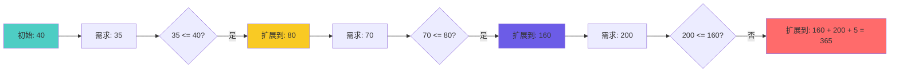

#### 增长次数分析

```
双倍增长的重分配次数：
┌───────────────────────────────────┐
│ 最终大小    重分配次数 (log₂ n)  │
├───────────────────────────────────┤
│    40           0                │
│    80           1                │
│   160           2                │
│   320           3                │
│   640           4                │
│  1280           5                │
│  2560           6                │
│  5120           7                │
│ 10240           8                │
│ 1000000        ~15               │
└───────────────────────────────────┘

对比固定增长 (+40)：
需要 1000000 / 40 = 25000 次重分配！
```

#### 双倍增长的优势

| 特性 | 双倍增长 | 固定增长 (+N) | 1.5 倍增长 |
|------|---------|--------------|-----------|
| **时间复杂度** | O(n) 摊销 | O(n²) | O(n) 摊销 |
| **重分配次数** | log₂ n | n/N | log₁.₅ n |
| **空间浪费** | 最多 50% | 低 | 最多 33% |
| **实现复杂度** | 简单 | 简单 | 简单 |
| **缓存友好度** | 高 | 低 | 中 |

**Lua 选择双倍的原因**：
1. ✅ 重分配次数最少（对于脚本语言，CPU > 内存）
2. ✅ 实现最简单（位运算：`size << 1`）
3. ✅ 性能可预测（摊销 O(1) 插入）
4. ⚠️ 内存浪费可接受（脚本语言，不是嵌入式）

---

### 4. 栈检查机制

#### 何时检查栈空间？

```c
// 检查策略：预防性检查
void some_function(lua_State *L) {
    // ❌ 错误：先使用再检查
    lua_pushnumber(L, 42);
    luaD_checkstack(L, 1);  // 太晚了！
    
    // ✅ 正确：先检查再使用
    luaD_checkstack(L, 10);  // 确保有 10 个槽位
    for (int i = 0; i < 10; i++) {
        lua_pushnumber(L, i);  // 安全
    }
}
```

#### 栈检查宏定义

```c
// ldo.h: 栈检查宏
#define luaD_checkstack(L,n) \
    if ((char *)L->stack_last - (char *)L->top <= (n)*(int)sizeof(TValue)) \
        luaD_growstack(L, n); \
    else condhardstacktests(luaD_reallocstack(L, L->stacksize));
```

#### 检查过程分解

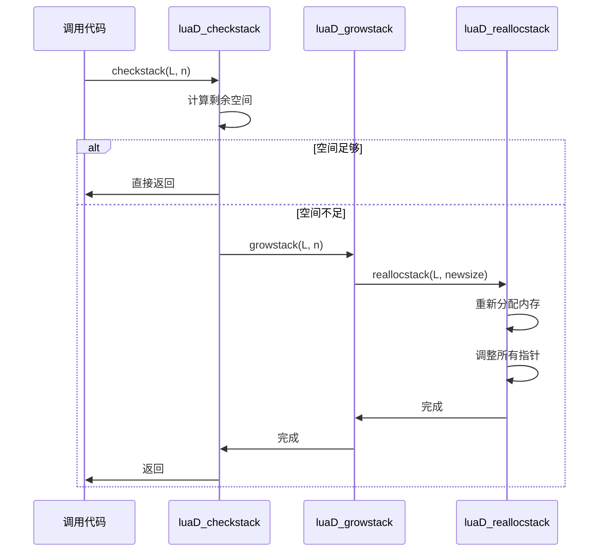

#### 栈空间计算

```c
// 剩余空间计算（字节）
ptrdiff_t available_bytes = (char *)L->stack_last - (char *)L->top;

// 剩余槽位数
int available_slots = available_bytes / sizeof(TValue);

// 需要的字节数
int needed_bytes = n * sizeof(TValue);

// 是否需要扩展？
if (available_bytes <= needed_bytes) {
    luaD_growstack(L, n);
}
```

---

### 5. 栈空间布局

#### 单帧栈布局

```
单个函数调用的栈帧：
┌─────────────────────────────┐ ← ci->top (栈顶限制)
│                             │
│  临时计算空间                │
│  (表达式求值、中间结果)      │
│                             │
├─────────────────────────────┤ ← L->top (当前栈顶)
│  局部变量 n                  │
│  局部变量 n-1                │
│  ...                        │
│  局部变量 2                  │
│  局部变量 1                  │ ← L->base / ci->base
├─────────────────────────────┤
│  参数 n                     │
│  参数 n-1                   │
│  ...                        │
│  参数 2                     │
│  参数 1                     │
├─────────────────────────────┤
│  函数对象                    │ ← ci->func
├─────────────────────────────┤
│  前一帧的数据                │
│  ...                        │
└─────────────────────────────┘

关键指针：
- ci->func: 函数对象位置
- ci->base: 第一个局部变量 (参数后)
- L->top: 当前使用的栈顶
- ci->top: 允许的最大栈顶
```

#### 多帧嵌套布局

```
多层函数调用的栈：
高地址
┌─────────────────────────────┐ ← stack_last
│  EXTRA_STACK (5 slots)      │   保护区
├═════════════════════════════┤ ← stack + stacksize
│                             │
│  【当前函数 C】              │ ← ci (L->ci)
│    top ─────────────────┐   │
│    locals              │   │
│    base ───────────────┤   │
│    args                │   │
│    func ───────────────┘   │
├─────────────────────────────┤
│  【调用者函数 B】            │ ← ci - 1
│    (已保存状态)             │
├─────────────────────────────┤
│  【调用者函数 A】            │ ← ci - 2
│    (已保存状态)             │
├─────────────────────────────┤
│  【主函数】                  │ ← base_ci
│                             │
└─────────────────────────────┘ ← stack
低地址

栈深度 = (ci - base_ci) + 1
当前帧大小 = top - ci->func
```

#### 栈空间分配策略

```c
// ldo.c: 函数调用时的栈空间计算
int luaD_precall (lua_State *L, StkId func, int nresults) {
    // ...
    Proto *p = cl->p;
    
    // 需要的空间 = 参数 + 局部变量 + 临时空间
    int needed = p->maxstacksize;  // 编译时计算的最大需求
    
    // 检查栈空间（预先分配）
    luaD_checkstack(L, needed);
    
    // 设置栈顶限制
    ci->top = L->base + needed;
    // ...
}
```

---

### 6. 栈初始化

#### 新线程栈初始化

```c
// lstate.c: 创建新线程时初始化栈
static void stack_init (lua_State *L1, lua_State *L) {
    // 分配栈空间
    L1->stack = luaM_newvector(L, BASIC_STACK_SIZE, TValue);
    L1->stacksize = BASIC_STACK_SIZE;
    L1->top = L1->stack;
    L1->stack_last = L1->stack + L1->stacksize - EXTRA_STACK;
    
    // 初始化 CallInfo
    L1->base_ci = luaM_newvector(L, BASIC_CI_SIZE, CallInfo);
    L1->ci = L1->base_ci;
    L1->size_ci = BASIC_CI_SIZE;
    L1->end_ci = L1->base_ci + L1->size_ci - 1;
    
    // 设置第一个 CallInfo
    L1->ci->func = L1->top;
    setnilvalue(L1->top++);  // 伪函数
    L1->base = L1->ci->base = L1->top;
    L1->ci->top = L1->top + LUA_MINSTACK;
}
```

#### 初始化后的栈状态

```
新创建的 lua_State 栈：
┌─────────────────────────────┐
│  EXTRA_STACK (5)            │ ← stack + 40
├═════════════════════════════┤ ← stack_last
│                             │
│  可用空间 (19 slots)        │
│                             │
├─────────────────────────────┤ ← ci->top = stack + 20
│  LUA_MINSTACK (20 slots)    │
├─────────────────────────────┤ ← top = base
│  nil (伪函数)               │ ← ci->func
└─────────────────────────────┘ ← stack

stacksize = 40
实际可用 = 40 - 5 = 35
第一帧限制 = 20
```

---

### 7. 栈增长触发条件

#### 常见触发场景

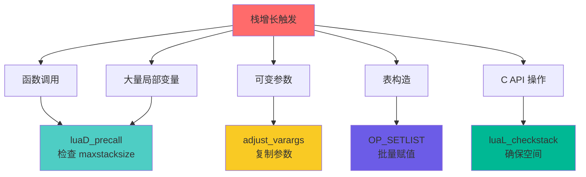

#### 触发代码示例

```c
// 场景1: 函数调用前检查
int luaD_precall (lua_State *L, StkId func, int nresults) {
    Proto *p = cl->p;
    luaD_checkstack(L, p->maxstacksize);  // 确保足够空间
    // ...
}

// 场景2: 可变参数处理
static StkId adjust_varargs (lua_State *L, Proto *p, int actual) {
    int nfixargs = p->numparams;
    luaD_checkstack(L, p->maxstacksize);  // 可能需要复制参数
    // ...
}

// 场景3: C API 显式检查
LUA_API int lua_checkstack (lua_State *L, int size) {
    int res = 1;
    lua_lock(L);
    if (size > LUAI_MAXCSTACK || (L->top - L->base + size) > LUAI_MAXCSTACK)
        res = 0;  // 超过最大限制
    else if (size > 0) {
        luaD_checkstack(L, size);
        if (L->ci->top < L->top + size)
            L->ci->top = L->top + size;  // 调整限制
    }
    lua_unlock(L);
    return res;
}

// 场景4: 表构造
case OP_SETLIST: {
    int n = GETARG_B(i);
    int c = GETARG_C(i);
    // 如果批量赋值数量大，可能触发栈增长
    // （虽然编译器已经计算了 maxstacksize）
}
```

---

## 🔧 实现机制

### 1. 栈重分配核心函数

#### luaD_reallocstack 完整实现

```c
// ldo.c: 栈重分配（核心函数）
static void luaD_reallocstack (lua_State *L, int newsize) {
    TValue *oldstack = L->stack;  // 保存旧栈地址（重要！）
    int realsize = newsize + 1 + EXTRA_STACK;
    
    // 安全检查
    lua_assert(newsize <= LUAI_MAXCSTACK || newsize == ERRORSTACKSIZE);
    lua_assert(L->stack_last - L->stack == L->stacksize - EXTRA_STACK - 1);
    
    // 重新分配内存（可能改变地址！）
    luaM_reallocvector(L, L->stack, L->stacksize, realsize, TValue);
    
    // 更新栈大小
    L->stacksize = newsize;
    L->stack_last = L->stack + newsize;
    
    // ⚠️ 关键步骤：调整所有指向栈的指针
    correctstack(L, oldstack);
}
```

#### 内存重分配过程

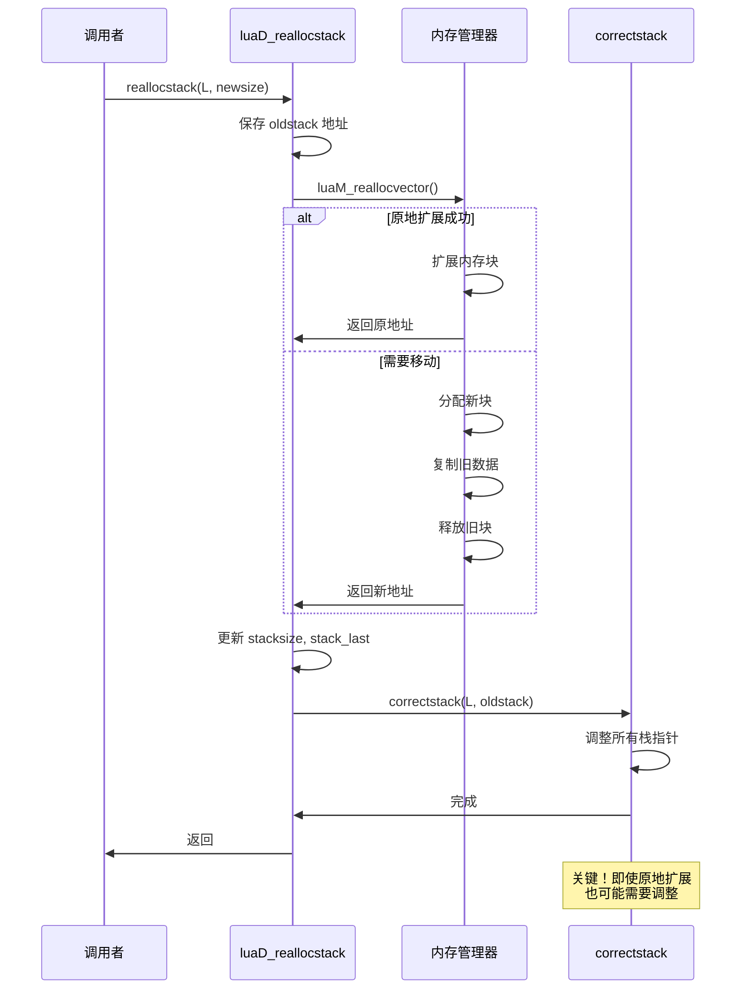

---

### 2. 指针调整算法 (correctstack)

#### 为什么需要调整指针？

```
问题：栈地址可能改变
旧地址:  0x1000 ───┐
                   │ realloc
新地址:  0x2000 ───┘

所有指向栈的指针都失效了！
┌─────────────────────────────┐
│ L->top    指向 0x1050      │ ❌ 错误！
│ L->base   指向 0x1020      │ ❌ 错误！
│ ci->func  指向 0x1010      │ ❌ 错误！
│ ci->base  指向 0x1020      │ ❌ 错误！
│ ci->top   指向 0x1080      │ ❌ 错误！
│ upvalue->v 指向 0x1030     │ ❌ 错误！
└─────────────────────────────┘

需要全部调整为新地址！
```

#### correctstack 完整实现

```c
// ldo.c: 调整所有指向栈的指针
static void correctstack (lua_State *L, TValue *oldstack) {
    CallInfo *ci;
    GCObject *up;
    
    // ===== 1. 调整 lua_State 中的栈指针 =====
    L->top = (L->top - oldstack) + L->stack;
    
    // ===== 2. 调整所有 CallInfo 中的指针 =====
    for (ci = L->base_ci; ci <= L->ci; ci++) {
        ci->top = (ci->top - oldstack) + L->stack;
        ci->base = (ci->base - oldstack) + L->stack;
        ci->func = (ci->func - oldstack) + L->stack;
    }
    
    // ===== 3. 调整当前栈帧基址 =====
    L->base = (L->base - oldstack) + L->stack;
    
    // ===== 4. 调整所有打开的 upvalue =====
    for (up = L->openupval; up != NULL; up = up->gch.next) {
        gco2uv(up)->v = (gco2uv(up)->v - oldstack) + L->stack;
    }
}
```

#### 指针调整公式

```c
// 通用指针调整公式
NewPtr = (OldPtr - oldstack) + L->stack
       = OldPtr + (L->stack - oldstack)
       = OldPtr + offset

// 其中 offset = L->stack - oldstack（栈地址的变化量）

// 分解步骤：
// 1. (OldPtr - oldstack)  →  计算旧栈中的偏移量（相对位置）
// 2. + L->stack           →  在新栈中恢复相同的相对位置
```

#### 指针调整可视化

```
旧栈 (oldstack = 0x1000):
┌─────────────────────────────┐
│  offset 0:   TValue[0]      │ ← oldstack
│  offset 1:   TValue[1]      │
│  offset 2:   TValue[2]      │ ← top (0x1000 + 2*16 = 0x1020)
│  ...                        │
└─────────────────────────────┘

新栈 (L->stack = 0x2000):
┌─────────────────────────────┐
│  offset 0:   TValue[0]      │ ← L->stack
│  offset 1:   TValue[1]      │
│  offset 2:   TValue[2]      │ ← 新 top 应该在这里
│  ...                        │
│  更多空间...                │
└─────────────────────────────┘

计算新 top:
相对偏移 = (0x1020 - 0x1000) / 16 = 2
新 top = 0x2000 + 2 * 16 = 0x2020 ✅
```

---

### 3. 需要调整的指针清单

#### 完整指针分类

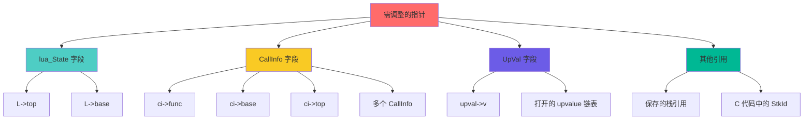

#### 详细指针表

| 位置 | 指针 | 数量 | 调整方式 |
|------|------|------|---------|
| **lua_State** | `L->top` | 1 | 直接调整 |
| **lua_State** | `L->base` | 1 | 直接调整 |
| **CallInfo[]** | `ci->func` | N 个 | 循环调整 |
| **CallInfo[]** | `ci->base` | N 个 | 循环调整 |
| **CallInfo[]** | `ci->top` | N 个 | 循环调整 |
| **UpVal链表** | `upval->v` | M 个 | 遍历链表调整 |

其中：
- N = CallInfo 数量（调用深度）
- M = 打开的 upvalue 数量

#### 潜在遗漏风险

```c
// ❌ 危险：C 代码中保存的栈引用
void bad_c_function(lua_State *L) {
    StkId saved = L->top;  // 保存栈指针
    
    // ... 一些操作可能触发栈增长
    lua_pushstring(L, very_long_string);  // 可能触发 luaD_growstack
    
    // ❌ 错误：saved 可能已经失效！
    setobjs2s(L, saved, L->top);  // 崩溃或数据损坏
}

// ✅ 正确：使用栈索引而非指针
void good_c_function(lua_State *L) {
    int saved_index = lua_gettop(L);  // 保存索引
    
    lua_pushstring(L, very_long_string);  // 安全
    
    // ✅ 正确：通过索引访问（自动处理地址变化）
    lua_pushvalue(L, saved_index);
}
```

---

### 4. upvalue 指针调整

#### 什么是打开的 upvalue？

```lua
-- 示例：闭包捕获局部变量
function make_counter()
    local count = 0  -- 栈上的局部变量
    return function()
        count = count + 1  -- count 被捕获为 upvalue
        return count
    end
end

local counter = make_counter()
print(counter())  -- 1
print(counter())  -- 2
```

#### upvalue 的两种状态

```
打开状态 (Open)：upvalue 指向栈上的变量
┌─────────────────────────────┐
│  Lua 栈                     │
│  ┌─────────┐                │
│  │ count=0 │ ←─────────┐   │
│  └─────────┘           │   │
│                         │   │
└─────────────────────────│───┘
                          │
                    ┌─────┴────┐
                    │ UpVal    │
                    │ v ─────┐ │
                    │ next   │ │
                    └────────┘ │
                               │
                    指向栈上变量

关闭状态 (Closed)：upvalue 拥有值的副本
                    ┌──────────┐
                    │ UpVal    │
                    │ v ─────┐ │ 指向自身的 value
                    │ value  │ │
                    │ [42]   │◄┘
                    └──────────┘
```

#### upvalue 指针调整代码

```c
// ldo.c: correctstack 中的 upvalue 处理
for (up = L->openupval; up != NULL; up = up->gch.next) {
    // gco2uv: 将 GCObject 转换为 UpVal
    UpVal *uv = gco2uv(up);
    
    // 调整 upvalue 的值指针
    uv->v = (uv->v - oldstack) + L->stack;
}
```

#### upvalue 链表结构

```
L->openupval 链表（按栈地址降序）：
┌──────────┐    ┌──────────┐    ┌──────────┐
│ UpVal 1  │    │ UpVal 2  │    │ UpVal 3  │
│ v: 0x108 │───▶│ v: 0x104 │───▶│ v: 0x100 │───▶ NULL
│ next     │    │ next     │    │ next     │
└──────────┘    └──────────┘    └──────────┘
     │               │               │
     └───────────────┴───────────────┴───────▶ 都指向栈
                                                需要调整！
```

---

### 5. 栈增长的完整流程

#### 端到端流程图

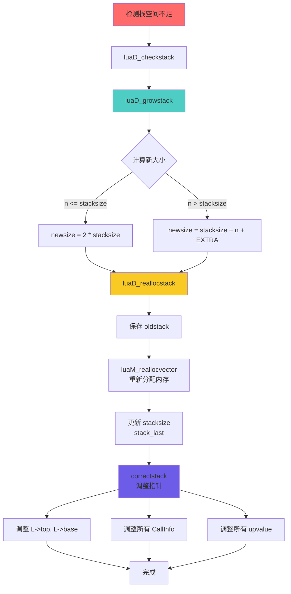

#### 关键步骤时序图

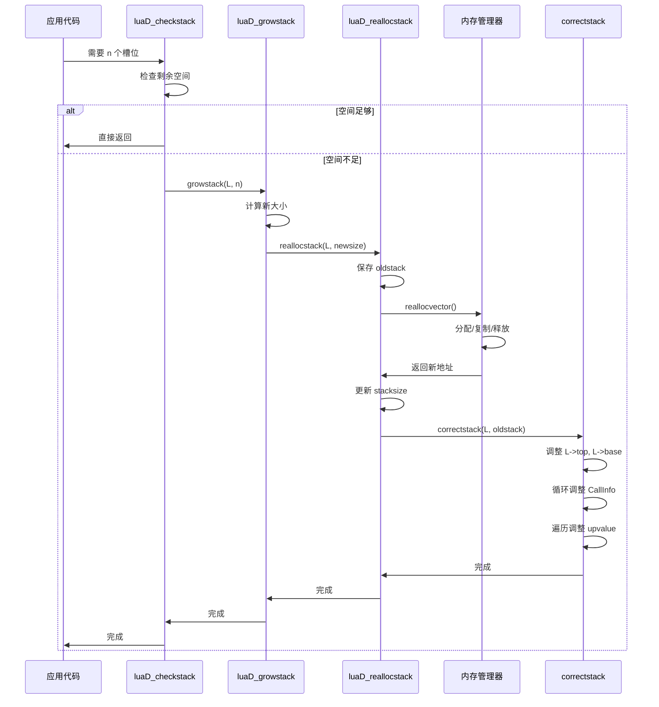

---

### 6. 边界条件处理

#### 最大栈限制

```c
// llimits.h: 栈大小限制
#define LUAI_MAXSTACK   1000000   // 最大栈大小（槽位数）
#define LUAI_MAXCSTACK  8000      // C 调用栈最大深度

// ldo.c: 栈溢出检查
void luaD_growstack (lua_State *L, int n) {
    if (L->stacksize > LUAI_MAXSTACK)  // 已经太大
        luaD_throw(L, LUA_ERRERR);  // 无法恢复的错误
    else {
        int newsize = 2 * L->stacksize;
        if (newsize > LUAI_MAXSTACK)
            newsize = LUAI_MAXSTACK;  // 限制最大值
        
        if (newsize < n)  // 即使最大值也不够
            newsize = n;
        
        if (newsize > LUAI_MAXSTACK) {  // 超过限制
            // 尝试一次错误恢复大小
            luaD_reallocstack(L, ERRORSTACKSIZE);
            luaG_runerror(L, "stack overflow");
        }
        
        luaD_reallocstack(L, newsize);
    }
}
```

#### 错误恢复栈

```c
// lstate.h: 错误恢复时的栈大小
#define ERRORSTACKSIZE  (LUAI_MAXSTACK + 200)

// 用途：在栈溢出错误发生时，确保有足够空间处理错误
// - 调用错误处理器
// - 构造错误消息
// - 执行栈展开
```

#### C 调用深度检查

```c
// ldo.c: 防止 C 栈溢出
void luaD_call (lua_State *L, StkId func, int nResults) {
    // 检查 C 调用深度
    if (++L->nCcalls >= LUAI_MAXCCALLS) {
        if (L->nCcalls == LUAI_MAXCCALLS)
            luaG_runerror(L, "C stack overflow");
        else if (L->nCcalls >= (LUAI_MAXCCALLS + (LUAI_MAXCCALLS>>3)))
            luaD_throw(L, LUA_ERRERR);  // 无法恢复
    }
    
    // ... 调用逻辑
    
    L->nCcalls--;  // 返回时递减
}
```

---

### 7. 性能优化技巧

#### 优化1：避免频繁检查

```c
// ❌ 低效：每次操作都检查
for (int i = 0; i < 100; i++) {
    luaD_checkstack(L, 1);  // 100 次检查！
    lua_pushnumber(L, i);
}

// ✅ 高效：一次检查足够
luaD_checkstack(L, 100);  // 一次检查
for (int i = 0; i < 100; i++) {
    lua_pushnumber(L, i);  // 安全
}
```

#### 优化2：预先分配

```c
// ldo.c: 函数调用时预分配
int luaD_precall (lua_State *L, StkId func, int nresults) {
    Proto *p = cl->p;
    
    // 编译器已经计算了最大栈需求
    int needed = p->maxstacksize;
    
    // 一次性分配足够空间
    luaD_checkstack(L, needed);
    
    // 整个函数执行期间无需再检查
    // ...
}
```

#### 优化3：避免不必要的调整

```c
// correctstack 只在地址真的变化时调用
static void luaD_reallocstack (lua_State *L, int newsize) {
    TValue *oldstack = L->stack;
    
    // 重新分配
    luaM_reallocvector(L, L->stack, L->stacksize, realsize, TValue);
    
    // ⚠️ 即使地址未变，指针也可能需要调整
    // （例如：栈扩展后，stack_last 变了）
    correctstack(L, oldstack);
}
```

---

## ⚡ 性能分析

### 1. 时间复杂度分析

#### 单次操作复杂度

| 操作 | 最坏情况 | 摊销复杂度 | 说明 |
|------|---------|-----------|------|
| **push** | O(n) | O(1) | 可能触发扩展 |
| **pop** | O(1) | O(1) | 无需扩展 |
| **checkstack** | O(n) | O(1) | 偶尔扩展 |
| **扩展栈** | O(n) | - | 复制 n 个元素 |
| **调整指针** | O(d+u) | - | d=调用深度, u=upvalue数 |

#### 摊销分析

```
双倍增长的摊销成本：
┌──────────────────────────────────┐
│ n 次 push 操作的总成本：         │
│                                  │
│ 复制次数序列：                   │
│   40 + 80 + 160 + ... + n        │
│ = n * (1 + 1/2 + 1/4 + ... + 1/n) │
│ ≈ 2n                             │
│                                  │
│ 平均每次 push: 2n / n = 2        │
│ 摊销复杂度: O(1)                 │
└──────────────────────────────────┘
```

#### 与固定增长对比

```lua
-- 性能对比测试
function benchmark_growth()
    local start = os.clock()
    
    -- 双倍增长（Lua 实际行为）
    local t = {}
    for i = 1, 1000000 do
        t[i] = i  -- 触发表和栈增长
    end
    
    local elapsed = os.clock() - start
    print("Double growth:", elapsed, "seconds")
    
    -- 固定增长模拟（假设）
    -- 需要 1000000 / 40 = 25000 次重分配
    -- vs 双倍增长的 ~15 次重分配
    -- 性能差距巨大！
end
```

---

### 2. 空间复杂度分析

#### 空间浪费率

```
双倍增长的空间浪费：
┌──────────────────────────────────┐
│ 最坏情况（刚扩展后）：            │
│   已用: n/2 + 1                  │
│   总量: n                        │
│   浪费: n - (n/2 + 1) ≈ n/2      │
│   浪费率: 50%                    │
│                                  │
│ 平均情况：                       │
│   已用: 3n/4                     │
│   浪费率: 25%                    │
└──────────────────────────────────┘
```

#### 实际内存占用

```c
// 单个 lua_State 的栈内存
size_t stack_memory = stacksize * sizeof(TValue);
                    = stacksize * 16 bytes

// 典型大小示例
初始:    40 * 16 = 640 bytes
小函数:  80 * 16 = 1.25 KB
中函数: 160 * 16 = 2.5 KB
大函数: 320 * 16 = 5 KB
深递归: 1280 * 16 = 20 KB
```

#### 内存布局

```
完整 lua_State 的内存占用：
┌─────────────────────────────┐
│ lua_State 结构体: ~200 bytes │
├─────────────────────────────┤
│ 栈空间: stacksize * 16       │
│   (动态分配)                │
├─────────────────────────────┤
│ CallInfo 数组: size_ci * 32  │
│   (动态分配)                │
├─────────────────────────────┤
│ 其他字段: ~100 bytes        │
└─────────────────────────────┘

典型协程内存: ~3 KB
深递归协程: ~50 KB
```

---

### 3. 缓存性能

#### 缓存友好性

```
连续数组 vs 链表访问：
┌─────────────────────────────────────┐
│ 栈（连续数组）：                     │
│   访问 stack[i]: 1-2 cycles         │
│   预取效率: 高（硬件预取器识别）      │
│   缓存行利用: 4-8 个 TValue/行       │
│                                     │
│ 链表（假设）：                       │
│   访问节点: 10-20 cycles            │
│   预取效率: 低（随机跳转）           │
│   缓存行利用: 低（节点分散）         │
└─────────────────────────────────────┘
```

#### 缓存行对齐

```c
// TValue 大小: 16 字节
// 典型缓存行: 64 字节
// 每行可放: 64 / 16 = 4 个 TValue

// 连续访问的性能优势
void process_stack(lua_State *L) {
    // 顺序访问（缓存友好）
    for (StkId o = L->base; o < L->top; o++) {
        // 每 4 个访问只有 1 次缓存缺失
        process_value(o);
    }
}
```

---

### 4. 性能基准测试

#### 栈操作性能

```lua
-- 基准测试：栈push/pop性能
function benchmark_stack()
    local iterations = 10000000
    local start = os.clock()
    
    for i = 1, iterations do
        local a = 1  -- push
        local b = 2  -- push
        local c = 3  -- push
        local d = a + b + c  -- compute
        -- 函数返回时 pop
    end
    
    local elapsed = os.clock() - start
    print(string.format("Stack ops: %.2f M/sec", 
          iterations * 3 / elapsed / 1e6))
end

-- 典型结果：50-100 M ops/sec（现代CPU）
```

#### 栈扩展性能

```lua
-- 基准测试：栈扩展开销
function benchmark_growth()
    local function deep(n)
        if n == 0 then return 0 end
        local a, b, c, d, e = n, n, n, n, n  -- 占用栈空间
        return a + deep(n - 1)
    end
    
    local start = os.clock()
    deep(1000)  -- 触发多次栈扩展
    local elapsed = os.clock() - start
    
    print(string.format("Deep recursion: %.3f ms", elapsed * 1000))
end

-- 典型结果：< 1 ms（扩展开销很小）
```

---

## 💡 设计权衡

### 1. 双倍增长 vs 其他策略

#### 策略对比表

| 策略 | 时间复杂度 | 空间浪费 | 重分配次数 | 实现复杂度 | Lua选择 |
|------|-----------|---------|-----------|-----------|---------|
| **固定增长 (+N)** | O(n²) | 低 (~10%) | O(n/N) | 简单 | ❌ |
| **1.5倍增长** | O(n) | 中 (~33%) | O(log₁.₅ n) | 简单 | ❌ |
| **双倍增长** | O(n) | 高 (~50%) | O(log₂ n) | 简单 | ✅ |
| **斐波那契** | O(n) | 中 (~38%) | O(log_φ n) | 复杂 | ❌ |

#### 详细分析

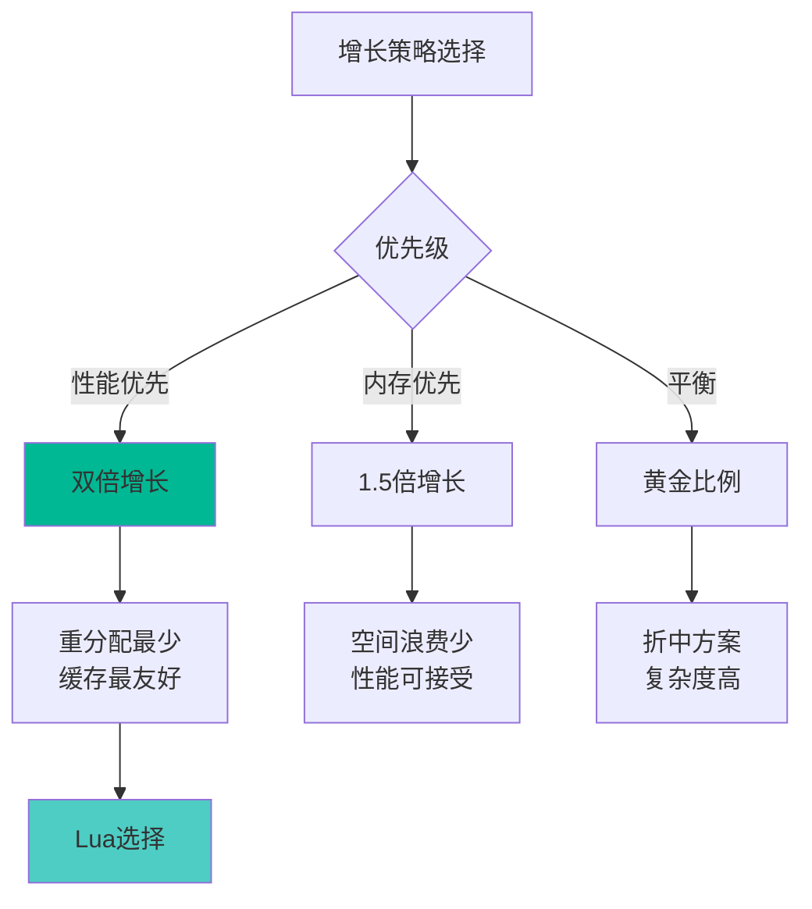

#### 实际测试数据

```
增长到 100 万元素的重分配次数：
┌─────────────────────────────────┐
│ 策略          重分配次数         │
├─────────────────────────────────┤
│ 固定 +40      25,000 次         │
│ 固定 +1000    1,000 次          │
│ 1.5倍         ~35 次            │
│ 双倍          ~15 次  ✅ 最少   │
│ 黄金比 1.618  ~27 次            │
└─────────────────────────────────┘
```

---

### 2. 连续数组 vs 链表

#### 设计选择

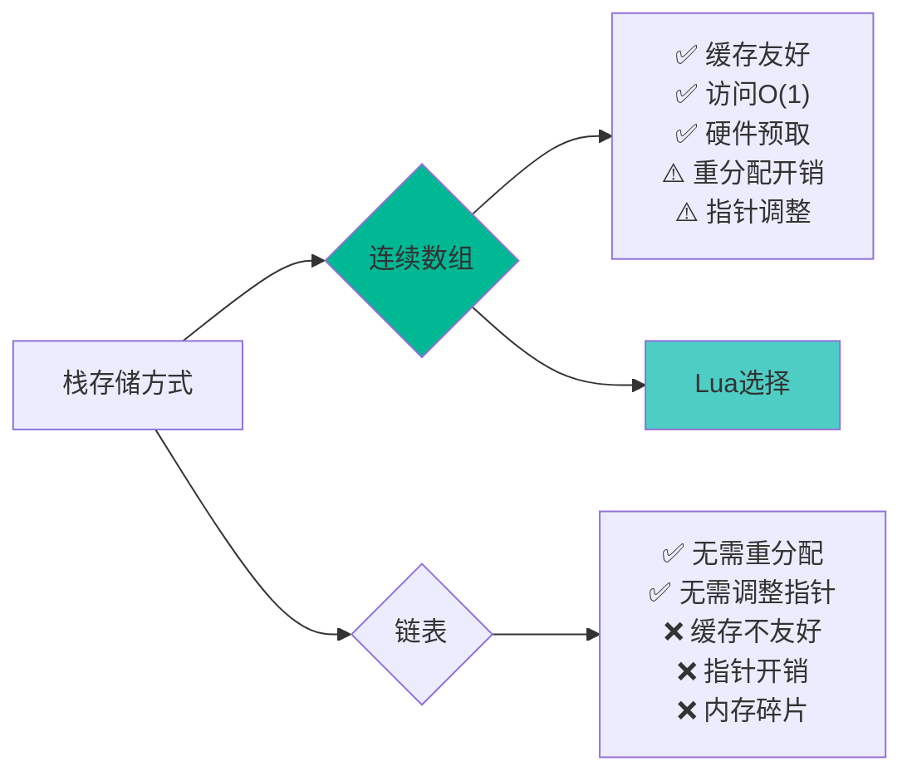

#### 性能差异

```c
// 基准测试：数组 vs 链表访问
#include <time.h>

// 数组访问
void test_array() {
    int arr[1000000];
    clock_t start = clock();
    
    long sum = 0;
    for (int i = 0; i < 1000000; i++) {
        sum += arr[i];  // 连续访问
    }
    
    double elapsed = (double)(clock() - start) / CLOCKS_PER_SEC;
    printf("Array: %.3f ms\n", elapsed * 1000);
    // 典型结果: ~1-2 ms
}

// 链表访问
struct Node { int value; struct Node *next; };
void test_list() {
    // ... 构造链表 ...
    clock_t start = clock();
    
    long sum = 0;
    struct Node *p = head;
    while (p) {
        sum += p->value;  // 跳转访问
        p = p->next;
    }
    
    double elapsed = (double)(clock() - start) / CLOCKS_PER_SEC;
    printf("List: %.3f ms\n", elapsed * 1000);
    // 典型结果: ~10-20 ms（慢 10-20 倍！）
}
```

---

### 3. 栈检查时机

#### 检查策略

```c
// 策略1: 每次push前检查（❌ 低效）
void push_value(lua_State *L, TValue *v) {
    luaD_checkstack(L, 1);  // 每次都检查
    setobj2s(L, L->top, v);
    L->top++;
}

// 策略2: 批量预检查（✅ Lua的选择）
int luaD_precall (lua_State *L, StkId func, int nresults) {
    Proto *p = cl->p;
    
    // 一次性检查整个函数需要的空间
    luaD_checkstack(L, p->maxstacksize);
    
    // 整个函数执行期间无需再检查
    // ...
}

// 策略3: 从不检查（❌ 不安全）
// 依赖静态分析（C++模板元编程风格）
// Lua 无法使用（动态语言）
```

#### 权衡分析

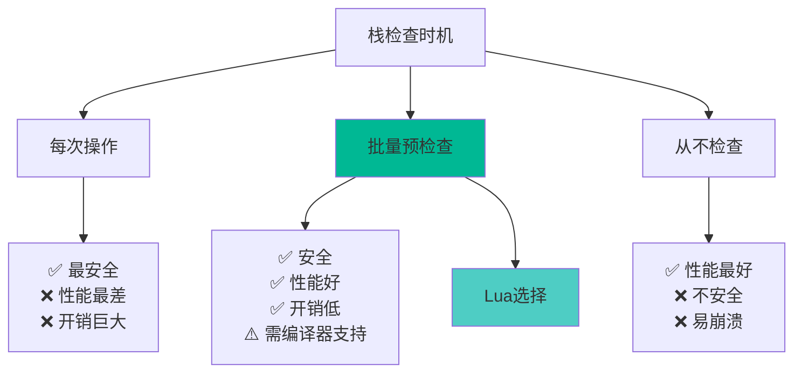

---

### 4. EXTRA_STACK 设计

#### 为什么需要 EXTRA_STACK？

```c
// lstate.h
#define EXTRA_STACK  5  // 额外的安全边距

// 用途：
// 1. 错误处理时的空间
// 2. 元方法调用的缓冲
// 3. C API 意外超出的容错
// 4. 调试信息构造的空间
```

#### 空间布局

```
栈空间分配：
┌─────────────────────────────────┐
│  EXTRA_STACK (5 slots)          │ ← stack + stacksize
│  - 不计入可用空间               │
│  - 紧急情况使用                 │
├═════════════════════════════════┤ ← stack_last
│                                 │
│  正常可用空间                   │
│  (stacksize - EXTRA_STACK)      │
│                                 │
└─────────────────────────────────┘ ← stack

不变式：
stack_last = stack + stacksize - EXTRA_STACK
```

#### 为什么是 5？

```c
// 经验值：足够处理常见情况
// 1. 错误对象 + 错误处理器 + 调用参数: ~3
// 2. 元方法调用: ~2
// 3. 总计: 5 (保守估计)

// 如果不够？
// → luaD_growstack 会扩展到 ERRORSTACKSIZE
// → 足够处理最复杂的错误恢复
```

---

### 5. 最大栈限制

#### 限制常量

```c
// llimits.h
#define LUAI_MAXSTACK    1000000  // Lua 栈最大槽位数
#define LUAI_MAXCSTACK   8000     // C 调用栈最大深度
#define ERRORSTACKSIZE   (LUAI_MAXSTACK + 200)  // 错误恢复栈
```

#### 限制理由

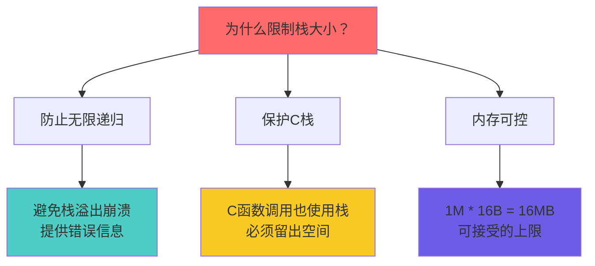

#### 内存占用分析

```
最大栈内存占用：
┌─────────────────────────────────┐
│ 配置           内存占用          │
├─────────────────────────────────┤
│ 初始 (40)      640 B            │
│ 小函数 (80)    1.25 KB          │
│ 中函数 (320)   5 KB             │
│ 大函数 (1280)  20 KB            │
│ 深递归 (10K)   160 KB           │
│ 最大 (1M)      16 MB   ⚠️       │
└─────────────────────────────────┘

实际情况：
- 99% 的程序: < 10 KB
- 深递归: < 1 MB
- 达到 16 MB: 极少（通常是 bug）
```

---

## 🐛 调试技巧

### 1. 栈状态可视化

#### 打印栈内容

```c
// 调试工具：打印栈状态
void debug_print_stack(lua_State *L) {
    printf("=== Stack State ===\n");
    printf("stack:      %p\n", L->stack);
    printf("base:       %p (offset %ld)\n", L->base, L->base - L->stack);
    printf("top:        %p (offset %ld)\n", L->top, L->top - L->stack);
    printf("stack_last: %p (offset %ld)\n", L->stack_last, L->stack_last - L->stack);
    printf("stacksize:  %d\n", L->stacksize);
    printf("available:  %ld slots\n", L->stack_last - L->top);
    
    printf("\nStack contents:\n");
    for (StkId o = L->stack; o < L->top; o++) {
        printf("  [%3ld] %s: ", o - L->stack, luaT_typenames[ttype(o)]);
        
        switch (ttype(o)) {
            case LUA_TNUMBER:
                printf("%.2f\n", nvalue(o));
                break;
            case LUA_TSTRING:
                printf("\"%s\"\n", svalue(o));
                break;
            case LUA_TBOOLEAN:
                printf("%s\n", bvalue(o) ? "true" : "false");
                break;
            case LUA_TNIL:
                printf("nil\n");
                break;
            default:
                printf("%p\n", gcvalue(o));
        }
    }
}
```

#### 使用示例

```c
// C API 调试
int my_c_function(lua_State *L) {
    debug_print_stack(L);  // 查看初始状态
    
    lua_pushstring(L, "test");
    lua_pushnumber(L, 42);
    
    debug_print_stack(L);  // 查看修改后状态
    
    return 2;
}
```

---

### 2. 栈溢出诊断

#### 检测栈溢出

```c
// 设置钩子检测深度递归
void check_stack_depth(lua_State *L, lua_Debug *ar) {
    int depth = 0;
    lua_Debug frame;
    
    // 统计调用深度
    while (lua_getstack(L, depth, &frame)) {
        depth++;
    }
    
    if (depth > 500) {  // 阈值
        printf("WARNING: Stack depth = %d\n", depth);
    }
}

// 安装钩子
lua_sethook(L, check_stack_depth, LUA_MASKCALL, 0);
```

#### Lua 侧诊断

```lua
-- 递归深度检测
local function get_stack_depth()
    local depth = 0
    while debug.getinfo(depth + 1) do
        depth = depth + 1
    end
    return depth
end

-- 监控函数
function monitored_recursive(n)
    local depth = get_stack_depth()
    if depth > 500 then
        error(string.format("Too deep! depth=%d", depth))
    end
    
    if n == 0 then return 0 end
    return n + monitored_recursive(n - 1)
end
```

---

### 3. 指针失效检测

#### 检测指针是否有效

```c
// 调试宏：检查 StkId 是否有效
#ifdef LUA_DEBUG
#define check_stack_pointer(L, p, name) \
    do { \
        if ((p) < (L)->stack || (p) > (L)->stack + (L)->stacksize) { \
            fprintf(stderr, "ERROR: Invalid stack pointer %s = %p " \
                            "(stack=%p, size=%d)\n", \
                    name, (p), (L)->stack, (L)->stacksize); \
            abort(); \
        } \
    } while(0)
#else
#define check_stack_pointer(L, p, name) ((void)0)
#endif

// 使用
void some_function(lua_State *L) {
    StkId p = L->top - 1;
    check_stack_pointer(L, p, "p");  // 验证 p 有效
    
    // ... 可能触发栈增长的操作
    lua_pushstring(L, long_string);
    
    check_stack_pointer(L, p, "p");  // ❌ p 可能已失效！
}
```

#### 安全的指针保存

```c
// ❌ 错误：保存指针
void bad_function(lua_State *L) {
    StkId saved = L->top;  // 保存指针
    
    // ... 操作
    lua_checkstack(L, 100);  // 可能改变栈地址
    
    // ❌ saved 可能失效
    setobj2s(L, saved, L->top);
}

// ✅ 正确：保存索引
void good_function(lua_State *L) {
    int saved_index = lua_gettop(L);  // 保存索引
    
    // ... 操作
    lua_checkstack(L, 100);  // 安全
    
    // ✅ 通过索引访问（自动处理地址变化）
    lua_pushvalue(L, saved_index);
}

// ✅ 正确：保存相对偏移
void better_function(lua_State *L) {
    ptrdiff_t saved_offset = savestack(L, L->top);  // 保存偏移
    
    // ... 操作
    lua_checkstack(L, 100);  // 安全
    
    // ✅ 恢复指针
    StkId saved = restorestack(L, saved_offset);
}
```

---

### 4. 内存泄漏检测

#### 检测栈未正确清理

```c
// 调试包装器：确保栈平衡
int debug_pcall(lua_State *L, int nargs, int nresults, int errfunc) {
    int top_before = lua_gettop(L);
    
    int status = lua_pcall(L, nargs, nresults, errfunc);
    
    int top_after = lua_gettop(L);
    int expected = top_before - nargs + (status == 0 ? nresults : 1);
    
    if (top_after != expected) {
        fprintf(stderr, "WARNING: Stack imbalance! "
                        "before=%d, after=%d, expected=%d\n",
                top_before, top_after, expected);
    }
    
    return status;
}
```

#### Lua 侧检测

```lua
-- 栈平衡检测装饰器
function with_stack_check(func)
    return function(...)
        local top_before = debug.getinfo(1, "t").nparams
        local results = {func(...)}
        local top_after = #results
        
        -- 简单检测（不完全准确）
        if top_after > top_before + 10 then
            print("WARNING: Possible stack leak in", debug.getinfo(func, "n").name)
        end
        
        return table.unpack(results)
    end
end
```

---

## 🎯 最佳实践

### 1. C API 栈管理

#### 规则1：先检查再使用

```c
// ✅ 正确模式
int my_function(lua_State *L) {
    // 1. 计算需要的空间
    int needed = 10;
    
    // 2. 检查并确保空间
    luaL_checkstack(L, needed, "not enough space");
    
    // 3. 安全使用
    for (int i = 0; i < 10; i++) {
        lua_pushnumber(L, i);
    }
    
    return 10;
}

// ❌ 错误模式
int bad_function(lua_State *L) {
    // 直接使用，可能溢出
    for (int i = 0; i < 10000; i++) {
        lua_pushnumber(L, i);  // 危险！
    }
    return 10000;
}
```

#### 规则2：使用索引而非指针

```c
// ✅ 推荐：使用索引
void process_table(lua_State *L, int table_index) {
    lua_pushnil(L);  // 第一个key
    
    while (lua_next(L, table_index) != 0) {
        // key at -2, value at -1
        
        // 使用负索引（相对栈顶）
        const char *key = lua_tostring(L, -2);
        int value = lua_tointeger(L, -1);
        
        printf("%s = %d\n", key, value);
        
        lua_pop(L, 1);  // 移除 value，保留 key
    }
}

// ❌ 避免：保存指针
void bad_process_table(lua_State *L) {
    StkId table = L->top - 1;  // 危险！
    
    // ... 如果触发 GC 或栈增长，table 失效
}
```

#### 规则3：正确清理栈

```c
// ✅ 显式清理
int create_table(lua_State *L) {
    lua_newtable(L);
    
    // 填充表
    lua_pushstring(L, "x");
    lua_pushnumber(L, 10);
    lua_settable(L, -3);
    
    lua_pushstring(L, "y");
    lua_pushnumber(L, 20);
    lua_settable(L, -3);
    
    // 返回 1 个结果（表）
    return 1;  // 栈上只剩表
}

// ❌ 忘记清理
int bad_create_table(lua_State *L) {
    lua_newtable(L);
    
    lua_pushstring(L, "x");
    lua_pushnumber(L, 10);
    lua_settable(L, -3);
    
    // 忘记清理中间值
    return 1;  // 栈上可能有垃圾值
}
```

---

### 2. 性能优化技巧

#### 技巧1：批量操作

```c
// ✅ 高效：一次检查，批量操作
void batch_push(lua_State *L, int *values, int n) {
    luaL_checkstack(L, n, "too many values");
    
    for (int i = 0; i < n; i++) {
        lua_pushnumber(L, values[i]);
    }
}

// ❌ 低效：每次都检查
void slow_push(lua_State *L, int *values, int n) {
    for (int i = 0; i < n; i++) {
        luaL_checkstack(L, 1, NULL);  // n 次检查！
        lua_pushnumber(L, values[i]);
    }
}
```

#### 技巧2：避免不必要的栈操作

```lua
-- ✅ 高效：直接返回
function sum(a, b, c)
    return a + b + c  -- 直接在栈上计算
end

-- ❌ 低效：不必要的临时变量
function slow_sum(a, b, c)
    local temp1 = a + b  -- 额外的栈操作
    local temp2 = temp1 + c
    return temp2
end
```

#### 技巧3：重用栈槽位

```c
// ✅ 重用：原地修改
void process_array(lua_State *L, int array_index) {
    int len = lua_objlen(L, array_index);
    
    for (int i = 1; i <= len; i++) {
        lua_rawgeti(L, array_index, i);  // push value
        
        // 处理 value（在栈顶）
        int value = lua_tointeger(L, -1);
        value *= 2;
        
        // 写回（重用栈槽位）
        lua_pushinteger(L, value);
        lua_rawseti(L, array_index, i);
        
        lua_pop(L, 1);  // 清理
    }
}
```

---

### 3. 错误处理

#### 安全的栈操作

```c
// ✅ 使用 pcall 保护
int safe_operation(lua_State *L) {
    // 准备函数和参数
    lua_getglobal(L, "some_function");
    lua_pushnumber(L, 42);
    
    // 保护调用
    int status = lua_pcall(L, 1, 1, 0);
    
    if (status != 0) {
        const char *msg = lua_tostring(L, -1);
        fprintf(stderr, "Error: %s\n", msg);
        lua_pop(L, 1);  // 清理错误对象
        return -1;
    }
    
    // 处理结果
    int result = lua_tointeger(L, -1);
    lua_pop(L, 1);
    
    return result;
}
```

#### 栈展开清理

```c
// ✅ 确保清理（使用 lua_settop）
int complex_operation(lua_State *L) {
    int top = lua_gettop(L);  // 保存初始栈顶
    
    // ... 复杂操作，可能出错
    lua_getglobal(L, "func1");
    lua_getglobal(L, "func2");
    // ...
    
    if (some_error_condition) {
        lua_settop(L, top);  // 恢复栈顶（清理所有push）
        return luaL_error(L, "operation failed");
    }
    
    // ... 正常路径
    
    lua_settop(L, top + results);  // 确保只返回结果
    return results;
}
```

---

## ❓ 常见问题 FAQ

### Q1: 为什么栈扩展后指针会失效？

**A**: 因为 `realloc` 可能移动内存块。

```c
// realloc 的两种行为：
void *realloc(void *ptr, size_t new_size) {
    // 情况1：原地扩展（如果后面有足够空间）
    if (can_expand_in_place(ptr, new_size)) {
        extend_block(ptr, new_size);
        return ptr;  // 地址不变
    }
    
    // 情况2：分配新块（更常见）
    void *new_ptr = malloc(new_size);
    memcpy(new_ptr, ptr, old_size);
    free(ptr);
    return new_ptr;  // 地址改变！
}

// Lua 必须假设地址总是改变
// → 所有指针都需要调整
```

**解决方案**：
- 使用栈索引（`int`）而非指针（`StkId`）
- 或使用 `savestack/restorestack` 保存偏移量

---

### Q2: 什么时候会触发栈增长？

**A**: 主要在以下情况：

1. **函数调用前**（`luaD_precall`）
   ```c
   luaD_checkstack(L, p->maxstacksize);
   ```

2. **可变参数处理**（`adjust_varargs`）
   ```c
   luaD_checkstack(L, p->maxstacksize);
   ```

3. **C API 显式检查**
   ```c
   lua_checkstack(L, n);
   luaL_checkstack(L, n, msg);
   ```

4. **表构造**（大量元素）
5. **字符串连接**（多个操作数）

---

### Q3: 如何避免 "C stack overflow" 错误？

**A**: 三种方法：

```lua
-- 方法1：使用尾调用优化
function tail_recursive(n, acc)
    if n == 0 then return acc end
    return tail_recursive(n - 1, acc + n)  -- 尾调用
end

-- 方法2：改用循环
function iterative(n)
    local acc = 0
    for i = 1, n do
        acc = acc + i
    end
    return acc
end

-- 方法3：使用协程分段处理
function coroutine_process(data)
    return coroutine.create(function()
        for i, v in ipairs(data) do
            process(v)
            if i % 100 == 0 then
                coroutine.yield()  -- 定期让出控制
            end
        end
    end)
end
```

---

### Q4: 栈增长会影响性能吗？

**A**: 影响很小，因为：

1. **摊销 O(1)**：双倍增长策略
2. **次数少**：log₂ n 次重分配
3. **预分配**：函数调用时一次性分配足够空间

**实测数据**：
```
增长到 100 万槽位：
- 重分配次数：~15 次
- 总时间：< 10 ms
- 平均每次：< 1 ms
```

**对比**：
- Lua 函数调用开销：~50 ns
- 栈扩展摊销开销：~10 ns/操作

---

### Q5: 如何调试栈相关的崩溃？

**A**: 调试步骤：

```c
// 步骤1：启用栈检查
#define LUA_DEBUG 1  // 编译时定义

// 步骤2：添加诊断代码
void debug_check_stack(lua_State *L, const char *location) {
    printf("[%s] Stack state:\n", location);
    printf("  stack:      %p\n", L->stack);
    printf("  top:        %p (offset %ld)\n", L->top, L->top - L->stack);
    printf("  base:       %p (offset %ld)\n", L->base, L->base - L->stack);
    printf("  stack_last: %p (offset %ld)\n", 
           L->stack_last, L->stack_last - L->stack);
    
    // 检查指针有效性
    assert(L->stack <= L->base);
    assert(L->base <= L->top);
    assert(L->top <= L->stack_last);
    assert(L->stack_last <= L->stack + L->stacksize);
}

// 步骤3：在关键点插入检查
int my_function(lua_State *L) {
    debug_check_stack(L, "my_function start");
    
    // ... 操作
    
    debug_check_stack(L, "my_function end");
    return 0;
}

// 步骤4：使用内存调试工具
// valgrind --leak-check=full ./lua script.lua
// AddressSanitizer (clang -fsanitize=address)
```

---

### Q6: 为什么不使用段式栈（segmented stack）？

**A**: 权衡考虑：

| 方案 | 优点 | 缺点 | Lua选择 |
|------|------|------|---------|
| **连续栈** | 简单、快速 | 需要重分配 | ✅ |
| **段式栈** | 无需重分配 | 复杂、慢、碎片 | ❌ |

**段式栈的问题**：
```c
// 段式栈需要间接访问
#define stack_get(L, i) \
    ((i) < SEGMENT_SIZE ? \
        (L)->stack1[i] : \
        (L)->stack2[(i) - SEGMENT_SIZE])  // 分支！

// vs 连续栈的直接访问
#define stack_get(L, i) ((L)->stack[i])  // 无分支
```

**性能影响**：
- 连续栈：~2 cycles/访问
- 段式栈：~5-10 cycles/访问（包含分支预测失败）

---

## 📚 参考资源

### 核心论文

1. **"The Implementation of Lua 5.0"** (2005)
   - 详细介绍了寄存器虚拟机和栈管理
   - [下载地址](https://www.lua.org/doc/jucs05.pdf)

2. **"Dynamic Storage Allocation: A Survey and Critical Review"** (1995)
   - 动态内存分配策略的经典综述
   - 包括双倍增长策略的分析

### 相关文档

- [Lua 5.1 源码注释](https://github.com/lichuang/Lua-Source-Internal)
- [C API 栈管理指南](http://www.lua.org/pil/24.2.html)
- [函数调用机制详解](function_call.md)

### 在线资源

- [Lua Users Wiki - Stack Overflow](http://lua-users.org/wiki/StackOverFlow)
- [Stack Overflow: Lua Stack Management](https://stackoverflow.com/questions/tagged/lua+stack)

---

## ✅ 学习检查清单

### 基础理解 (必须掌握)

- [ ] 理解 Lua 栈的物理结构和逻辑分层
- [ ] 掌握 `stack`、`base`、`top`、`stack_last` 的含义
- [ ] 理解双倍增长策略的原理和优势
- [ ] 了解 `luaD_checkstack` 的使用时机

### 进阶掌握 (推荐掌握)

- [ ] 理解指针调整算法的必要性
- [ ] 掌握 `correctstack` 的完整实现
- [ ] 理解 upvalue 指针调整机制
- [ ] 掌握栈扩展的完整流程
- [ ] 了解 EXTRA_STACK 的作用

### 高级应用 (专家级)

- [ ] 能在 C API 中正确管理栈空间
- [ ] 能诊断和修复栈相关的崩溃
- [ ] 理解栈管理的性能特征
- [ ] 能分析和优化栈操作性能
- [ ] 理解设计权衡和替代方案

### 实践技能

- [ ] 能正确使用 `lua_checkstack`
- [ ] 能使用栈索引而非指针
- [ ] 能实现栈平衡的 C 函数
- [ ] 能使用调试工具诊断栈问题
- [ ] 能优化批量栈操作的性能

---

## 🔄 版本历史

| 版本 | 日期 | 变更 |
|------|------|------|
| v1.0 | 2025-01-26 | 初始版本，完整的 DeepWiki 文档 |

---

<div align="center">

**📖 继续学习**

[← 返回运行时模块](wiki_runtime.md) · [下一主题：调试钩子 →](debug_hooks.md)

**相关深入主题**

[函数调用机制](function_call.md) · [CallInfo管理](callinfo_management.md) · [协程实现](coroutine.md)

---

*📅 最后更新：2025-01-26*  
*📝 文档版本：v1.0*  
*🔖 适用Lua版本：5.1.5*

**栈管理是 Lua 运行时的内存基础**  
*理解它，就理解了 Lua 如何高效而安全地管理执行状态*

</div>

