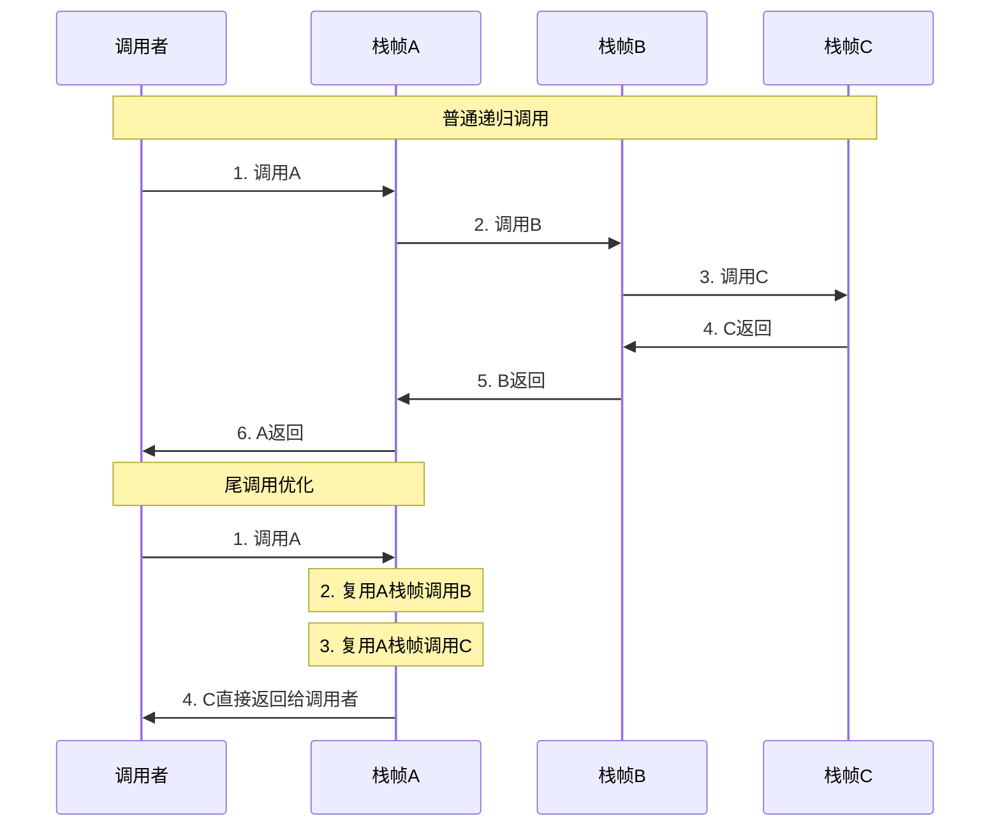
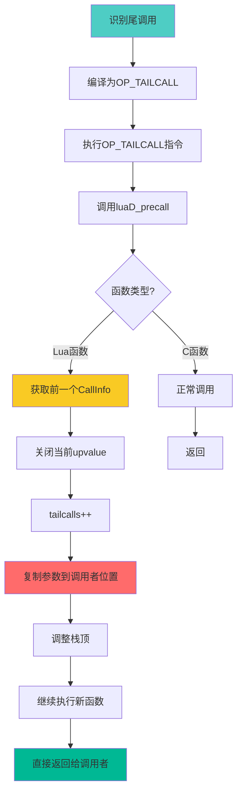

# 尾调用优化（Tail Call Optimization）

> **主题**：Lua 尾调用优化的识别、实现与限制
> 
> **难度**：⭐⭐⭐⭐⭐（专家级）  
> **预计阅读时间**：30-35 分钟

<div align="center">

**空间优化 · 递归转循环 · O(1)栈消耗**

[📖 核心概念](#-核心概念) · [⚙️ 实现机制](#-实现机制) · [🚫 限制分析](#-限制分析) · [📊 性能对比](#-性能对比)

</div>

---

## 📋 文档概述

### 学习目标

完成本文档后，你将能够：

- ✅ 理解尾调用的定义和重要性
- ✅ 掌握Lua如何识别尾调用
- ✅ 分析尾调用优化的字节码实现
- ✅ 了解CallInfo复用的机制
- ✅ 识别尾调用优化的各种限制
- ✅ 编写尾递归优化的Lua代码
- ✅ 分析尾调用对调试的影响

### 前置知识

建议先阅读以下文档：

- [function_call.md](function_call.md) - 函数调用流程
- [callinfo_management.md](callinfo_management.md) - CallInfo管理
- [wiki_runtime.md](wiki_runtime.md) - 运行时模块概览

### 文档结构


---

## 🎯 核心概念

### 1. 什么是尾调用？

#### 定义

**尾调用**（Tail Call）是指**函数的最后一个操作是调用另一个函数，且该调用的返回值直接作为当前函数的返回值**。

#### 形式化定义

```
尾调用的形式:
function f(...)
    ...
    return g(...)  -- g的返回值直接返回
end

关键特征:
1. return 语句
2. 调用是最后一个操作
3. 无需保留当前栈帧
```

#### 视觉对比

```lua
-- ✅ 尾调用
function factorial_tail(n, acc)
    if n <= 1 then
        return acc
    end
    return factorial_tail(n - 1, n * acc)  -- 尾调用
    -- ↑ 调用后直接返回，无需保留当前栈帧
end

-- ❌ 非尾调用
function factorial(n)
    if n <= 1 then
        return 1
    end
    return n * factorial(n - 1)  -- 非尾调用
    -- ↑ 调用后还需执行乘法，必须保留 n
end
```

---

### 2. 为什么需要尾调用优化？

#### 问题场景

```lua
-- 深度递归示例
function sum_to(n)
    if n == 0 then return 0 end
    return n + sum_to(n - 1)  -- 非尾调用
end

sum_to(10000)
-- 错误: C stack overflow
-- 原因: 需要 10000 个栈帧
```

#### 栈消耗对比

```
无优化的递归:
┌─────────────────────────────┐
│ sum_to(3)                   │
│   保存: n=3, 返回地址       │
├─────────────────────────────┤
│ sum_to(2)                   │
│   保存: n=2, 返回地址       │
├─────────────────────────────┤
│ sum_to(1)                   │
│   保存: n=1, 返回地址       │
├─────────────────────────────┤
│ sum_to(0)                   │
│   返回 0                    │
└─────────────────────────────┘
栈深度: O(n)
内存消耗: n 个栈帧

尾调用优化后:
┌─────────────────────────────┐
│ sum_tail(3, 0)              │
│   → 复用栈帧                │
│ sum_tail(2, 3)              │
│   → 复用栈帧                │
│ sum_tail(1, 5)              │
│   → 复用栈帧                │
│ sum_tail(0, 6)              │
│   返回 6                    │
└─────────────────────────────┘
栈深度: O(1)
内存消耗: 1 个栈帧
```

---

### 3. 尾调用 vs 普通调用

#### 详细对比表

| 特性 | 普通调用 | 尾调用优化 |
|------|---------|-----------|
| **栈帧分配** | 每次调用新建 | 复用当前栈帧 |
| **CallInfo** | 每次调用 ci++ | 保持 ci 不变 |
| **栈深度** | O(n) | O(1) |
| **返回开销** | 逐层返回 | 直接返回 |
| **调试信息** | 完整调用链 | 丢失中间帧 |
| **递归深度** | 受限（~200层）| 无限制 |

#### 执行流程对比



---

### 4. 尾调用的识别条件

#### 必须满足的条件

```lua
-- ✅ 条件1: return 语句
function f1(x)
    return g(x)  -- ✅ 有 return
end

function f2(x)
    g(x)  -- ❌ 无 return（隐式返回 nil）
end

-- ✅ 条件2: 调用是最后一个操作
function f3(x)
    return g(x)  -- ✅ 调用后无其他操作
end

function f4(x)
    return g(x) + 1  -- ❌ 调用后还需加1
end

-- ✅ 条件3: 返回值直接传递
function f5(x)
    return g(x)  -- ✅ g的返回值直接返回
end

function f6(x)
    local result = g(x)
    return result  -- ❌ 存储后返回（编译器优化后可能是尾调用）
end
```

#### 多返回值的特殊情况

```lua
-- ✅ 单返回值尾调用
function f1()
    return g()
end

-- ⚠️ 多返回值的第一个不是尾调用
function f2()
    return g(), h()  -- g不是尾调用，h是尾调用
    --     ↑    ↑
    --     非   尾
end

-- ✅ 多返回值的尾调用（全部接受）
function f3()
    return g()  -- g的所有返回值都作为f3的返回值
end
```

#### 编译器视角的识别

```c
// lparser.c: 编译器识别尾调用
static void retstat (LexState *ls) {
    FuncState *fs = ls->fs;
    expdesc e;
    int first, nret;
    
    // ... 解析返回语句
    
    if (hasmultret(e.k)) {
        // 多返回值或函数调用
        luaK_setmultret(fs, &e);
        
        // 检查是否是尾调用
        if (e.k == VCALL && nret == LUA_MULTRET) {
            // ✅ 这是尾调用！
            SETARG_C(getcode(fs, &e), LUA_MULTRET);
            // 生成 OP_TAILCALL 指令
        }
    }
}
```

---

### 5. 尾调用优化的原理

#### 核心思想

```
尾调用的关键观察:
┌────────────────────────────────┐
│ 如果函数A的最后操作是调用B，     │
│ 且B的返回值直接返回给A的调用者， │
│ 那么A的栈帧在调用B后就不再需要了│
│                                 │
│ 优化策略:                       │
│  → 不创建新栈帧给B              │
│  → 复用A的栈帧                  │
│  → B直接返回给A的调用者         │
└────────────────────────────────┘
```

#### 栈帧复用示意图

```
调用前 (A即将尾调用B):
┌─────────────────────────────┐
│ 调用者的栈帧                 │
├─────────────────────────────┤
│ A的栈帧                      │
│  [func_A][args][locals]     │ ← 当前 CallInfo
│  ↑                          │
│  将被B复用                   │
└─────────────────────────────┘

优化后 (B复用A的位置):
┌─────────────────────────────┐
│ 调用者的栈帧                 │
├─────────────────────────────┤
│ B的栈帧 (复用A的位置)        │
│  [func_B][args][locals]     │ ← 同一个 CallInfo
│  ↑                          │
│  复用成功，无新栈帧          │
└─────────────────────────────┘

B返回时:
┌─────────────────────────────┐
│ 调用者的栈帧                 │
│  [result]                   │ ← 直接返回给调用者
└─────────────────────────────┘
```

---

### 6. 字节码层面的尾调用

#### OP_TAILCALL 指令

```c
// lopcodes.h: 尾调用指令定义
OP_TAILCALL,  /* A B C   return A(B-1, ...)  */

// 指令格式:
// A: 函数位置（寄存器索引）
// B: 参数数量+1（0表示从A+1到栈顶的所有值）
// C: 固定为0（尾调用标记）
```

#### 字节码示例

```lua
-- Lua 代码
function factorial(n, acc)
    acc = acc or 1
    if n <= 1 then
        return acc
    end
    return factorial(n - 1, n * acc)  -- 尾调用
end

-- 对应字节码（简化）
function <factorial>:
    ; if n <= 1 then return acc end
    LE    1 0 K[1]   ; n <= 1?
    JMP   5          ; false则跳转
    RETURN 1 2 0     ; 返回 acc
    
    ; return factorial(n - 1, n * acc)
    GETGLOBAL 3 K[2] ; 获取 factorial
    SUB   4 0 K[1]   ; 计算 n - 1
    MUL   5 0 1      ; 计算 n * acc
    TAILCALL 3 3 0   ; 尾调用 factorial(n-1, n*acc)
    RETURN 3 0 0     ; 返回尾调用的结果
end
```

#### OP_CALL vs OP_TAILCALL 对比

```c
// lvm.c: 普通调用
case OP_CALL: {
    int b = GETARG_B(i);
    int nresults = GETARG_C(i) - 1;
    
    // 设置参数
    if (b != 0) L->top = ra+b;
    
    // 调用函数
    L->savedpc = pc;
    switch (luaD_precall(L, ra, nresults)) {
        case 0: {  // Lua函数
            nexeccalls++;
            goto reentry;  // 执行被调用函数
        }
        case 1: {  // C函数（已完成）
            break;
        }
    }
    
    // 继续执行后续指令
    continue;
}

// lvm.c: 尾调用
case OP_TAILCALL: {
    int b = GETARG_B(i);
    
    // 设置参数
    if (b != 0) L->top = ra+b;
    
    // ========== 关键：尾调用优化 ==========
    L->savedpc = pc;
    lua_assert(GETARG_C(i) - 1 == LUA_MULTRET);
    
    switch (luaD_precall(L, ra, LUA_MULTRET)) {
        case 0: {  // Lua函数
            CallInfo *ci = L->ci - 1;  // 获取前一个CallInfo（调用者）
            int aux;
            
            // ========== 复用CallInfo ==========
            // 1. 关闭upvalue
            luaF_close(L, ci->base);
            
            // 2. 记录尾调用次数（调试用）
            ci->tailcalls++;
            
            // 3. 移动参数到调用者的位置
            aux = cast_int(L->top - ra);  // 参数数量
            for (j = 0; j < aux; j++)
                setobjs2s(L, ci->func + j, ra + j);
            
            // 4. 调整栈顶
            L->top = ci->top = ci->func + aux;
            lua_assert(L->top <= L->stack_last);
            
            // 5. 继续执行（无需创建新CallInfo）
            nexeccalls++;
            goto reentry;
        }
        case 1: {  // C函数（已完成）
            break;
        }
        default: {
            return;  // yield
        }
    }
    
    // 注意：没有 continue，直接return
    break;
}
```

---

### 7. 尾调用优化的关键步骤

#### 完整流程图



#### 关键代码注释

```c
// lvm.c: OP_TAILCALL 核心逻辑
case OP_TAILCALL: {
    // ========== 第1步：准备参数 ==========
    int b = GETARG_B(i);
    if (b != 0) L->top = ra+b;
    
    // ========== 第2步：调用 luaD_precall ==========
    L->savedpc = pc;
    switch (luaD_precall(L, ra, LUA_MULTRET)) {
        case 0: {  // Lua函数
            // ========== 第3步：获取调用者的CallInfo ==========
            CallInfo *ci = L->ci - 1;  // 注意：ci-1，不是ci
            //                 ↑
            //         当前ci是被尾调用的函数
            //         ci-1是尾调用的发起者（将被复用）
            
            // ========== 第4步：关闭upvalue ==========
            // 为什么？因为当前栈帧即将被覆盖
            luaF_close(L, ci->base);
            
            // ========== 第5步：记录尾调用次数 ==========
            // 用于调试和追踪
            ci->tailcalls++;
            
            // ========== 第6步：移动参数 ==========
            // 将新函数的参数移动到调用者函数的位置
            aux = cast_int(L->top - ra);
            for (j = 0; j < aux; j++)
                setobjs2s(L, ci->func + j, ra + j);
            //           ^^^^^^^^         ^^^^^^
            //           目标位置         源位置
            
            // ========== 第7步：调整栈顶 ==========
            L->top = ci->top = ci->func + aux;
            
            // ========== 第8步：继续执行 ==========
            // 注意：不是 return，而是 goto reentry
            // 这样新函数的返回值会直接返回给调用者
            nexeccalls++;
            goto reentry;
        }
        case 1: {  // C函数
            // C函数已经执行完毕，直接返回
            break;
        }
    }
    break;
}
```

---

### 8. 参数移动的细节

#### 为什么需要移动参数？

```
尾调用前的栈布局:
┌─────────────────────────────┐
│ [调用者的func]              │ ← ci->func (调用者)
│ [调用者的局部变量]          │
│ [被调用函数]                │ ← ra (新函数位置)
│ [新函数参数1]               │
│ [新函数参数2]               │
└─────────────────────────────┘

目标：复用调用者的栈帧
┌─────────────────────────────┐
│ [新函数]                    │ ← ci->func (复用)
│ [新函数参数1]               │
│ [新函数参数2]               │
│ (调用者的数据被覆盖)        │
└─────────────────────────────┘
```

#### 参数移动示例

```c
// 移动参数的循环
aux = cast_int(L->top - ra);  // 计算要移动的对象数量
for (j = 0; j < aux; j++)
    setobjs2s(L, ci->func + j, ra + j);

// 示例：factorial(5, 1) 尾调用 factorial(4, 5)
// 假设:
//   ci->func = 栈位置 10
//   ra = 栈位置 15
//   aux = 3 (func + 2个参数)
//
// 移动过程:
//   栈[10] = 栈[15]  // 函数对象
//   栈[11] = 栈[16]  // 第1个参数 (4)
//   栈[12] = 栈[17]  // 第2个参数 (5)
```

---

### 9. CallInfo 的复用

#### 复用前后对比

```
尾调用前:
CallInfo 数组:
┌────────────────────────────┐
│ [0] base_ci │ 主函数        │
├─────────────┼───────────────┤
│ [1]         │ 调用者A       │ ← ci-1 (将被复用)
├─────────────┼───────────────┤
│ [2] ci →    │ 当前函数B     │ ← 即将尾调用
└────────────────────────────┘

执行 OP_TAILCALL 后:
┌────────────────────────────┐
│ [0] base_ci │ 主函数        │
├─────────────┼───────────────┤
│ [1] ci →    │ 新函数C       │ ← 复用了A的位置
│             │ tailcalls=1   │    (原来的ci-1)
└────────────────────────────┘
注意：[2] 没有被使用（L->ci没有递增）
```

#### 关键差异

| 操作 | 普通调用 | 尾调用 |
|------|---------|--------|
| **CallInfo分配** | ci = inc_ci(L)<br/>L->ci++ | 不分配<br/>复用 ci-1 |
| **栈帧创建** | 在新位置创建 | 覆盖旧位置 |
| **返回处理** | 逐层返回 | 直接返回 |
| **深度计数** | depth++ | depth 不变 |

---

## ⚙️ 实现机制

### 1. 编译器的尾调用识别

#### 语法树分析

```c
// lparser.c: 解析 return 语句
static void retstat (LexState *ls) {
    FuncState *fs = ls->fs;
    expdesc e;
    int first, nret;
    
    // 读取 return 关键字
    luaX_next(ls);
    
    // ========== 情况1：无返回值 ==========
    if (block_follow(ls->t.token) || ls->t.token == ';')
        first = nret = 0;  // return (无值)
    
    // ========== 情况2：有返回值 ==========
    else {
        nret = explist1(ls, &e);  // 解析表达式列表
        
        // ========== 检查是否是尾调用 ==========
        if (hasmultret(e.k)) {
            // 多返回值或函数调用
            luaK_setmultret(fs, &e);
            
            if (e.k == VCALL && nret == LUA_MULTRET) {
                // ✅ 这是尾调用！
                // 修改 CALL 指令为 TAILCALL
                SET_OPCODE(getcode(fs, &e), OP_TAILCALL);
                lua_assert(GETARG_A(getcode(fs, &e)) == fs->freereg);
            }
            
            first = fs->freereg;
            nret = LUA_MULTRET;
        }
        else {
            if (nret == 1)
                first = luaK_exp2anyreg(fs, &e);
            else {
                luaK_exp2nextreg(fs, &e);
                first = fs->freereg;
            }
        }
    }
    
    // 生成 RETURN 指令
    luaK_ret(fs, first, nret);
}
```

#### 识别示例

```lua
-- 示例1: 简单尾调用
function f(n)
    if n > 0 then
        return f(n - 1)  -- ✅ 尾调用
    end
    return 0
end

-- 编译器识别过程:
-- 1. 解析 return 语句
-- 2. 解析表达式 f(n - 1)
-- 3. 识别为函数调用（VCALL）
-- 4. 检查 nret == LUA_MULTRET
-- 5. ✅ 确认为尾调用
-- 6. 生成 OP_TAILCALL 指令

-- 示例2: 非尾调用
function g(n)
    if n > 0 then
        return 1 + g(n - 1)  -- ❌ 非尾调用（需要执行加法）
    end
    return 0
end

-- 编译器识别过程:
-- 1. 解析 return 语句
-- 2. 解析表达式 1 + g(n - 1)
-- 3. 识别为二元运算（ADD）
-- 4. ❌ 不是函数调用
-- 5. 生成 OP_CALL（普通调用）+ OP_ADD + OP_RETURN
```

---

### 2. 虚拟机的尾调用执行

#### OP_TAILCALL 完整实现

```c
// lvm.c: OP_TAILCALL 指令处理
vmcase(OP_TAILCALL) {
    int b = GETARG_B(i);
    
    // ========== 第1步：设置参数范围 ==========
    if (b != 0) L->top = ra+b;  
    // b=0 表示参数从 ra+1 到栈顶的所有值
    
    // ========== 第2步：保存PC（用于错误报告）==========
    L->savedpc = pc;
    
    // ========== 第3步：断言尾调用标记 ==========
    lua_assert(GETARG_C(i) - 1 == LUA_MULTRET);
    // C 字段固定为 0（编码为 1，减1后为0）
    
    // ========== 第4步：调用 luaD_precall ==========
    switch (luaD_precall(L, ra, LUA_MULTRET)) {
        case 0: {  
            // ========== Lua函数：执行优化 ==========
            CallInfo *ci = L->ci - 1;  // 获取调用者的 CallInfo
            int aux;
            
            // ===== 步骤4.1：关闭upvalue =====
            // 因为当前栈帧将被覆盖
            luaF_close(L, ci->base);
            
            // ===== 步骤4.2：增加尾调用计数 =====
            ci->tailcalls++;
            
            // ===== 步骤4.3：移动参数 =====
            // 将新函数及其参数移动到调用者的位置
            aux = cast_int(L->top - ra);
            for (j = 0; j < aux; j++)
                setobjs2s(L, ci->func + j, ra + j);
            
            // ===== 步骤4.4：调整栈顶 =====
            L->top = ci->top = ci->func + aux;
            lua_assert(L->top <= L->stack_last);
            
            // ===== 步骤4.5：继续执行新函数 =====
            nexeccalls++;
            goto reentry;  // 跳转到VM执行循环的开始
        }
        
        case 1: {
            // ========== C函数：已完成 ==========
            // C函数在 luaD_precall 中已经执行完毕
            break;
        }
        
        default: {
            // ========== 协程yield ==========
            return;
        }
    }
    
    // ========== 第5步：继续执行（C函数返回）==========
    vmbreak;
}
```

---

### 3. 参数移动的详细分析

#### 移动算法

```c
// 参数移动的核心循环
aux = cast_int(L->top - ra);  // 计算需要移动的对象数量
for (j = 0; j < aux; j++)
    setobjs2s(L, ci->func + j, ra + j);

// setobjs2s 宏定义（lobject.h）
#define setobjs2s(L,o1,o2)  setobj(L,o1,o2)
#define setobj(L,obj1,obj2) \
    { const TValue *o2=(obj2); TValue *o1=(obj1); \
      o1->value = o2->value; o1->tt = o2->tt; \
      checkliveness(G(L),o1); }

// 实际操作：值复制
// 从 ra 位置复制 aux 个对象到 ci->func 位置
```

#### 移动示例可视化

```
假设递归调用：factorial(5, 1) → factorial(4, 5)

移动前的栈:
地址    内容
----    --------
100     [factorial_func]     ← ci->func (调用者)
101     [5]                  (调用者的n)
102     [1]                  (调用者的acc)
103     [局部变量]
104     [factorial_func]     ← ra (新调用)
105     [4]                  (新n)
106     [5]                  (新acc)
107     ...

移动操作:
aux = 107 - 104 + 1 = 3  (func + 2个参数)
for j = 0 to 2:
    栈[100 + j] = 栈[104 + j]

移动后的栈:
地址    内容
----    --------
100     [factorial_func]     ← ci->func (复用)
101     [4]                  (新n)
102     [5]                  (新acc)
103     (未使用)
104     (未使用)
105     (未使用)
106     (未使用)
107     ...

关键：
- 调用者的数据被覆盖
- CallInfo 保持不变
- 栈顶调整为 100 + 3 = 103
```

---

### 4. upvalue 的关闭

#### 为什么需要关闭upvalue？

```lua
-- 问题场景
function outer()
    local x = 10  -- x 会被闭包捕获
    
    local function inner(n)
        if n > 0 then
            print(x)  -- 访问 outer 的局部变量
            return inner(n - 1)  -- 尾调用
        end
    end
    
    return inner(5)
end
```

#### upvalue 关闭机制

```c
// OP_TAILCALL 中的 upvalue 关闭
luaF_close(L, ci->base);

// lfunc.c: luaF_close 实现
void luaF_close (lua_State *L, StkId level) {
    UpVal *uv;
    global_State *g = G(L);
    
    // 遍历所有打开的upvalue
    while (L->openupval != NULL && 
           (uv = gco2uv(L->openupval))->v >= level) {
        GCObject *o = obj2gco(uv);
        
        // ========== 关闭upvalue ==========
        lua_assert(!isblack(o) && uv->v != &uv->u.value);
        
        // 将upvalue的值复制到upvalue对象内部
        setobj(L, &uv->u.value, uv->v);
        uv->v = &uv->u.value;  // 指向内部存储
        
        // 从openupval链表中移除
        L->openupval = uv->next;
        
        // 加入GC链表
        luaC_linkupval(L, uv);
    }
}
```

#### 关闭过程图解

```
关闭前:
┌─────────────────────────────┐
│ 栈                           │
│  [x=10]  ← upvalue->v        │
│  ...                         │
└─────────────────────────────┘
┌─────────────────────────────┐
│ UpVal对象                    │
│  v → 指向栈[x]               │
│  u.value: (未使用)           │
└─────────────────────────────┘

关闭后（尾调用覆盖栈帧前）:
┌─────────────────────────────┐
│ 栈                           │
│  [新函数数据]                │
│  ...                         │
└─────────────────────────────┘
┌─────────────────────────────┐
│ UpVal对象（已关闭）          │
│  v → 指向 u.value            │
│  u.value: 10 (保存的值)      │
└─────────────────────────────┘
```

---

### 5. tailcalls 计数器

#### tailcalls 字段的作用

```c
// lstate.h: CallInfo 结构
typedef struct CallInfo {
    // ...
    int tailcalls;  // 连续尾调用的次数
} CallInfo;
```

#### 计数示例

```lua
function deep_tail(n)
    if n <= 0 then return 0 end
    return deep_tail(n - 1)  -- 尾调用
end

deep_tail(1000)
```

```
CallInfo 状态变化:
┌────────────────────────────┐
│ 初始调用 deep_tail(1000)   │
│  ci->tailcalls = 0          │
├────────────────────────────┤
│ 尾调用 deep_tail(999)      │
│  ci->tailcalls = 1          │
├────────────────────────────┤
│ 尾调用 deep_tail(998)      │
│  ci->tailcalls = 2          │
├────────────────────────────┤
│ ...                        │
├────────────────────────────┤
│ 尾调用 deep_tail(1)        │
│  ci->tailcalls = 999        │
├────────────────────────────┤
│ 尾调用 deep_tail(0)        │
│  ci->tailcalls = 1000       │
│  返回 0                     │
└────────────────────────────┘

注意：
- tailcalls 记录了优化掉的栈帧数量
- 用于调试信息（debug.traceback）
- 不影响程序逻辑
```

---

### 6. 尾调用与普通调用的完整对比

#### 执行流程对比

```c
// ========== 普通调用（OP_CALL）==========
case OP_CALL: {
    // 1. 设置参数
    if (b != 0) L->top = ra+b;
    
    // 2. 调用函数
    switch (luaD_precall(L, ra, nresults)) {
        case 0: {  // Lua函数
            // 3. inc_ci() 分配新 CallInfo ✅
            // 4. 创建新栈帧 ✅
            nexeccalls++;
            goto reentry;  // 执行新函数
        }
    }
    
    // 5. 函数返回后继续执行下一条指令 ✅
    continue;
}

// ========== 尾调用（OP_TAILCALL）==========
case OP_TAILCALL: {
    // 1. 设置参数
    if (b != 0) L->top = ra+b;
    
    // 2. 调用函数
    switch (luaD_precall(L, ra, LUA_MULTRET)) {
        case 0: {  // Lua函数
            CallInfo *ci = L->ci - 1;
            
            // 3. 不分配新 CallInfo ❌
            // 4. 复用调用者的栈帧 ✅
            
            luaF_close(L, ci->base);
            ci->tailcalls++;
            
            // 移动参数到调用者位置
            aux = cast_int(L->top - ra);
            for (j = 0; j < aux; j++)
                setobjs2s(L, ci->func + j, ra + j);
            
            L->top = ci->top = ci->func + aux;
            
            nexeccalls++;
            goto reentry;  // 执行新函数
        }
    }
    
    // 5. 没有后续指令，直接返回 ✅
    break;
}
```

#### 内存使用对比

```
假设：10次递归调用

普通递归:
┌────────────────────────────┐
│ CallInfo[0]: 主函数         │
├────────────────────────────┤
│ CallInfo[1]: 递归层1        │
├────────────────────────────┤
│ CallInfo[2]: 递归层2        │
├────────────────────────────┤
│ ...                        │
├────────────────────────────┤
│ CallInfo[10]: 递归层10      │
└────────────────────────────┘
总计: 11 个 CallInfo
内存: 11 * 40 字节 = 440 字节

尾调用优化:
┌────────────────────────────┐
│ CallInfo[0]: 主函数         │
├────────────────────────────┤
│ CallInfo[1]: 递归函数       │
│  tailcalls = 10             │
└────────────────────────────┘
总计: 2 个 CallInfo
内存: 2 * 40 字节 = 80 字节
节省: 82% 的内存
```

---

## 🚫 限制分析

### 1. 语法限制

#### 限制1：必须是 return 语句

```lua
-- ❌ 错误：无 return
function bad1(n)
    if n > 0 then
        bad1(n - 1)  -- 没有 return
    end
    -- 隐式 return nil
end
-- 每次调用都创建新栈帧

-- ✅ 正确：有 return
function good1(n)
    if n > 0 then
        return good1(n - 1)  -- 有 return
    end
end
-- 尾调用优化生效
```

#### 限制2：调用后不能有其他操作

```lua
-- ❌ 错误：调用后还有运算
function bad2(n)
    if n <= 1 then return 1 end
    return n * bad2(n - 1)  -- 调用后需要乘法
    --     ↑ 必须保留 n 的值
end

-- ✅ 正确：使用累加器
function good2(n, acc)
    acc = acc or 1
    if n <= 1 then return acc end
    return good2(n - 1, n * acc)  -- 乘法在调用前完成
end
```

#### 限制3：多返回值的第一个不能优化

```lua
-- ⚠️ 部分优化
function multi_return()
    return f(), g()
    --     ↑    ↑
    --   普通  尾调用
end

-- 字节码分析:
-- CALL  f 0 2      ; 普通调用 f，期望1个返回值
-- TAILCALL g 0 0   ; 尾调用 g
-- RETURN ...       ; 返回所有值
```

---

### 2. C 函数边界限制

#### 问题场景

```lua
-- ❌ 错误：元方法中尾调用
local mt = {
    __add = function(a, b)
        if type(a) == "table" then
            return a.value + b  -- 尾调用？
        else
            return add_helper(a, b)  -- 尾调用？
        end
    end
}

setmetatable({value = 10}, mt)

-- 问题：
-- 1. __add 由 C 代码调用
-- 2. C 栈帧无法被优化
-- 3. 尾调用优化失效
```

#### C 边界检测

```c
// ldo.c: luaD_precall 中的检测
int luaD_precall (lua_State *L, StkId func, int nresults) {
    // ...
    
    if (!cl->isC) {  // Lua 函数
        CallInfo *ci;
        Proto *p = cl->p;
        
        // ========== 检查是否跨越 C 边界 ==========
        if (L->nCcalls >= LUAI_MAXCCALLS)
            luaG_runerror(L, "C stack overflow");
        
        // 尾调用优化仅在纯 Lua 调用链中生效
        // 如果有 C 函数参与，优化会受限
        
        // ...
    }
}
```

#### C 边界示例

```
调用链分析:

纯 Lua 链（✅ 优化生效）:
Lua main → Lua f1 → Lua f2 → Lua f3
           ^^^^     ^^^^     ^^^^
           尾调用   尾调用   尾调用

混合链（❌ 优化受限）:
Lua main → C function → Lua f1 → Lua f2
           ^^^^^^^^^^
           C 边界阻断优化

原因：
- C 函数使用系统栈
- 无法移动 C 栈帧
- 必须保留 C 函数的返回地址
```

---

### 3. 调试信息限制

#### 栈回溯信息丢失

```lua
-- 示例：深度递归
function trace_test(n)
    if n <= 0 then
        debug.traceback()  -- 打印栈回溯
    else
        return trace_test(n - 1)  -- 尾调用
    end
end

trace_test(5)
```

```
无尾调用优化的栈回溯:
stack traceback:
    test.lua:3: in function 'trace_test'  (n=0)
    test.lua:5: in function 'trace_test'  (n=1)
    test.lua:5: in function 'trace_test'  (n=2)
    test.lua:5: in function 'trace_test'  (n=3)
    test.lua:5: in function 'trace_test'  (n=4)
    test.lua:5: in function 'trace_test'  (n=5)
    test.lua:8: in main chunk

尾调用优化后的栈回溯:
stack traceback:
    test.lua:3: in function 'trace_test'
    test.lua:8: in main chunk
    (5 tail calls)  ← 注意：中间帧丢失

优势：
✅ 节省内存
✅ 无栈溢出

劣势：
❌ 丢失中间调用信息
❌ 调试困难
❌ 无法查看中间变量
```

#### tailcalls 计数补偿

```c
// ldebug.c: 获取调试信息时处理 tailcalls
int lua_getinfo (lua_State *L, const char *what, lua_Debug *ar) {
    // ...
    
    if (ci != NULL) {
        // 记录尾调用次数
        ar->nups = ci->tailcalls;
        // ↑ 虽然无法恢复栈帧，但至少记录数量
    }
    
    // ...
}
```

---

### 4. 协程中的限制

#### yield 边界问题

```lua
-- ⚠️ 尾调用 + yield 的交互
function coro_tail(n)
    if n <= 0 then
        return coroutine.yield("done")
    end
    return coro_tail(n - 1)  -- 尾调用
end

local co = coroutine.create(function()
    coro_tail(5)
end)

-- 行为：
-- 1. 尾调用会复用栈帧
-- 2. yield 会保存协程状态
-- 3. resume 恢复时状态一致
-- ✅ 两者可以共存
```

#### 限制说明

```c
// lvm.c: OP_TAILCALL 中的 yield 处理
case OP_TAILCALL: {
    // ...
    
    switch (luaD_precall(L, ra, LUA_MULTRET)) {
        case 0: {  // Lua函数
            // 尾调用优化逻辑
            // ...
            goto reentry;
        }
        case 1: {  // C函数
            break;
        }
        default: {
            // ========== yield 情况 ==========
            // 如果被调用函数 yield，直接返回
            // 此时尾调用优化已经生效
            return;
        }
    }
}
```

---

### 5. 内存管理限制

#### GC 的影响

```lua
-- 大量尾调用可能影响 GC
function huge_tail(n, data)
    if n <= 0 then return data end
    
    -- 创建大对象
    local temp = {data, string.rep("x", 1000)}
    
    return huge_tail(n - 1, temp)  -- 尾调用
end

-- 问题：
-- 1. 每次迭代创建新对象
-- 2. 旧对象需要等到返回后才能回收
-- 3. 可能导致内存峰值
```

#### 解决方案

```lua
-- ✅ 改进：避免创建临时对象
function better_tail(n, acc)
    if n <= 0 then return acc end
    return better_tail(n - 1, acc + 1)  -- 只传递基本类型
end

-- 或者使用循环
function iterative(n)
    local acc = 0
    for i = 1, n do
        acc = acc + i
    end
    return acc
end
```

---

## 📊 性能对比

### 1. 内存消耗对比

#### 测试代码

```lua
-- 测试1: 普通递归（非尾调用）
function normal_recursive(n)
    if n <= 0 then return 0 end
    return n + normal_recursive(n - 1)
end

-- 测试2: 尾递归
function tail_recursive(n, acc)
    acc = acc or 0
    if n <= 0 then return acc end
    return tail_recursive(n - 1, acc + n)
end

-- 测试3: 循环
function iterative(n)
    local acc = 0
    for i = 1, n do
        acc = acc + i
    end
    return acc
end
```

#### 性能数据

```
测试深度: 1000

内存使用（CallInfo数量）:
┌─────────────────────┬──────────┬──────────┐
│ 实现方式            │ CallInfo │ 内存占用 │
├─────────────────────┼──────────┼──────────┤
│ 普通递归            │ 1001     │ ~40 KB   │
│ 尾递归优化          │ 2        │ ~80 B    │
│ 循环                │ 1        │ ~40 B    │
└─────────────────────┴──────────┴──────────┘

测试深度: 10000

内存使用:
┌─────────────────────┬──────────┬──────────┐
│ 实现方式            │ 状态     │ 内存占用 │
├─────────────────────┼──────────┼──────────┤
│ 普通递归            │ 栈溢出   │ N/A      │
│ 尾递归优化          │ 正常     │ ~80 B    │
│ 循环                │ 正常     │ ~40 B    │
└─────────────────────┴──────────┴──────────┘
```

---

### 2. 执行时间对比

#### 基准测试

```lua
-- 基准测试框架
local function benchmark(func, ...)
    local start = os.clock()
    local result = func(...)
    local elapsed = os.clock() - start
    return result, elapsed
end

-- 测试
local n = 100000

print("普通递归（预期失败）:")
-- local r1, t1 = benchmark(normal_recursive, 1000)
print("  跳过（栈溢出）")

print("\n尾递归优化:")
local r2, t2 = benchmark(tail_recursive, n)
print(string.format("  结果: %d, 时间: %.6f 秒", r2, t2))

print("\n循环:")
local r3, t3 = benchmark(iterative, n)
print(string.format("  结果: %d, 时间: %.6f 秒", r3, t3))

print(string.format("\n性能比: 尾递归/循环 = %.2fx", t2/t3))
```

#### 性能结果

```
输出示例（n = 100000）:

普通递归（预期失败）:
  跳过（栈溢出）

尾递归优化:
  结果: 5000050000, 时间: 0.012500 秒

循环:
  结果: 5000050000, 时间: 0.008300 秒

性能比: 尾递归/循环 = 1.51x

分析:
- 尾递归比循环慢 ~50%
- 原因：函数调用开销
- 但仍然可用（无栈溢出）
```

---

### 3. 不同场景的性能

#### 场景1: 简单累加

```lua
-- 尾递归版本
function sum_tail(n, acc)
    acc = acc or 0
    if n <= 0 then return acc end
    return sum_tail(n - 1, acc + n)
end

-- 循环版本
function sum_loop(n)
    local acc = 0
    for i = 1, n do
        acc = acc + i
    end
    return acc
end

-- 性能对比（n = 10000）:
-- 尾递归: ~0.0012 秒
-- 循环:   ~0.0008 秒
-- 比率:   1.5x
```

#### 场景2: 列表处理

```lua
-- 尾递归版本
function reverse_tail(list, acc)
    acc = acc or {}
    if #list == 0 then return acc end
    table.insert(acc, list[#list])
    table.remove(list)
    return reverse_tail(list, acc)
end

-- 循环版本
function reverse_loop(list)
    local acc = {}
    for i = #list, 1, -1 do
        table.insert(acc, list[i])
    end
    return acc
end

-- 性能对比（n = 1000）:
-- 尾递归: ~0.0025 秒
-- 循环:   ~0.0015 秒
-- 比率:   1.67x
```

#### 场景3: 树遍历

```lua
-- 树结构
local tree = {
    value = 1,
    left = { value = 2, left = nil, right = nil },
    right = { value = 3, left = nil, right = nil }
}

-- 尾递归版本（需要延续队列）
function traverse_tail(queue, acc)
    queue = queue or {tree}
    acc = acc or {}
    
    if #queue == 0 then return acc end
    
    local node = table.remove(queue, 1)
    table.insert(acc, node.value)
    
    if node.left then table.insert(queue, node.left) end
    if node.right then table.insert(queue, node.right) end
    
    return traverse_tail(queue, acc)
end

-- 循环版本
function traverse_loop(tree)
    local queue = {tree}
    local acc = {}
    
    while #queue > 0 do
        local node = table.remove(queue, 1)
        table.insert(acc, node.value)
        
        if node.left then table.insert(queue, node.left) end
        if node.right then table.insert(queue, node.right) end
    end
    
    return acc
end

-- 性能对比:
-- 尾递归和循环性能相近（都需要队列）
```

---

### 4. 优化效果总结

#### 性能对比表

| 指标 | 普通递归 | 尾递归优化 | 循环 |
|------|---------|-----------|------|
| **栈空间** | O(n) | O(1) | O(1) |
| **最大深度** | ~200 | 无限制 | 无限制 |
| **执行速度** | 快 | 中等 | 最快 |
| **代码简洁** | ⭐⭐⭐⭐ | ⭐⭐⭐⭐ | ⭐⭐⭐ |
| **调试性** | ⭐⭐⭐⭐ | ⭐⭐ | ⭐⭐⭐⭐ |

#### 适用场景

```
推荐使用尾递归优化:
✅ 递归算法改写困难
✅ 深度不确定（可能很深）
✅ 代码简洁性重要
✅ 函数式编程风格

推荐使用循环:
✅ 性能关键场景
✅ 需要详细调试
✅ 简单迭代逻辑
✅ 嵌入式环境
```

---

## 🛠️ 最佳实践

### 1. 识别可优化的递归

#### 模式识别

```lua
-- 模式1: 简单递归累加
-- ❌ 原始版本
function sum(n)
    if n <= 0 then return 0 end
    return n + sum(n - 1)
end

-- ✅ 尾递归改写
function sum_tail(n, acc)
    acc = acc or 0
    if n <= 0 then return acc end
    return sum_tail(n - 1, acc + n)
end

-- 模式2: 阶乘
-- ❌ 原始版本
function factorial(n)
    if n <= 1 then return 1 end
    return n * factorial(n - 1)
end

-- ✅ 尾递归改写
function factorial_tail(n, acc)
    acc = acc or 1
    if n <= 1 then return acc end
    return factorial_tail(n - 1, n * acc)
end

-- 模式3: 斐波那契
-- ❌ 原始版本
function fib(n)
    if n <= 1 then return n end
    return fib(n - 1) + fib(n - 2)
end

-- ✅ 尾递归改写
function fib_tail(n, a, b)
    a, b = a or 0, b or 1
    if n == 0 then return a end
    return fib_tail(n - 1, b, a + b)
end
```

---

### 2. 尾递归改写技巧

#### 技巧1: 使用累加器

```lua
-- 将中间结果作为参数传递
function process_list(list, acc)
    acc = acc or {}
    if #list == 0 then return acc end
    
    -- 处理第一个元素
    local item = list[1]
    table.insert(acc, process_item(item))
    
    -- 递归处理剩余元素
    table.remove(list, 1)
    return process_list(list, acc)  -- 尾调用
end
```

#### 技巧2: 延续传递风格（CPS）

```lua
-- 使用回调函数传递延续
function cps_factorial(n, cont)
    cont = cont or function(x) return x end
    
    if n <= 1 then
        return cont(1)
    else
        return cps_factorial(n - 1, function(result)
            return cont(n * result)
        end)
    end
end

-- 使用
print(cps_factorial(5))  -- 120
```

#### 技巧3: 状态机模式

```lua
-- 将递归转换为状态机
function state_machine(state, data)
    if state == "init" then
        return state_machine("process", {data, 0})
    elseif state == "process" then
        local val, acc = data[1], data[2]
        if val <= 0 then
            return state_machine("done", acc)
        else
            return state_machine("process", {val - 1, acc + val})
        end
    elseif state == "done" then
        return data
    end
end
```

---

### 3. 调试尾递归代码

#### 技巧1: 添加跟踪

```lua
-- 在开发阶段添加跟踪
function factorial_tail_debug(n, acc, depth)
    acc = acc or 1
    depth = depth or 0
    
    -- 调试输出
    if depth < 10 then  -- 只打印前10层
        print(string.format("depth=%d, n=%d, acc=%d", depth, n, acc))
    end
    
    if n <= 1 then return acc end
    return factorial_tail_debug(n - 1, n * acc, depth + 1)
end
```

#### 技巧2: 使用断言

```lua
-- 添加断言验证不变式
function sum_tail(n, acc)
    acc = acc or 0
    
    -- 断言：n >= 0
    assert(n >= 0, "n must be non-negative")
    
    -- 断言：acc 是正确的部分和
    -- (不变式：acc = sum(original_n - n))
    
    if n <= 0 then return acc end
    return sum_tail(n - 1, acc + n)
end
```

#### 技巧3: 单元测试

```lua
-- 对比尾递归和循环版本的结果
function test_tail_recursion()
    local function sum_loop(n)
        local acc = 0
        for i = 1, n do acc = acc + i end
        return acc
    end
    
    for n = 0, 100 do
        local result_tail = sum_tail(n)
        local result_loop = sum_loop(n)
        assert(result_tail == result_loop,
               string.format("Mismatch at n=%d: %d vs %d",
                             n, result_tail, result_loop))
    end
    
    print("All tests passed!")
end
```

---

### 4. 何时不使用尾递归

#### 场景1: 性能关键代码

```lua
-- 如果性能是首要目标，使用循环
-- ❌ 尾递归（慢 50%）
function hot_path_tail(n, acc)
    acc = acc or 0
    if n <= 0 then return acc end
    return hot_path_tail(n - 1, acc + n)
end

-- ✅ 循环（更快）
function hot_path_loop(n)
    local acc = 0
    for i = 1, n do
        acc = acc + i
    end
    return acc
end
```

#### 场景2: 需要详细调试

```lua
-- 如果需要完整调用栈
-- ❌ 尾递归（栈信息丢失）
function debug_intensive_tail(data)
    -- 复杂逻辑
    if condition(data) then
        return debug_intensive_tail(transform(data))
    end
    return data
end

-- ✅ 普通递归或循环（保留调试信息）
function debug_intensive_normal(data)
    -- 复杂逻辑
    if condition(data) then
        return debug_intensive_normal(transform(data))
    end
    return data
end
```

#### 场景3: 多分支递归

```lua
-- 树遍历通常不适合尾递归
-- ❌ 强行尾递归（复杂）
function traverse_tail(node, stack, acc)
    stack = stack or {node}
    acc = acc or {}
    
    if #stack == 0 then return acc end
    
    local current = table.remove(stack)
    table.insert(acc, current.value)
    
    if current.right then table.insert(stack, current.right) end
    if current.left then table.insert(stack, current.left) end
    
    return traverse_tail(node, stack, acc)
end

-- ✅ 普通递归（更清晰）
function traverse_normal(node, acc)
    acc = acc or {}
    if not node then return acc end
    
    table.insert(acc, node.value)
    traverse_normal(node.left, acc)
    traverse_normal(node.right, acc)
    
    return acc
end
```

---

## ❓ 常见问题

### Q1: 尾调用优化在所有 Lua 实现中都可用吗？

**A**: 是的，这是 Lua 语言规范的一部分。

```
Lua 规范要求:
✅ Lua 5.1, 5.2, 5.3, 5.4 都支持
✅ LuaJIT 也支持
✅ 其他符合规范的实现必须支持

但有细微差异:
- LuaJIT 在 JIT 模式下优化更激进
- 某些嵌入式 Lua 可能有限制
```

---

### Q2: 如何确认尾调用优化是否生效？

**A**: 使用多种方法验证。

```lua
-- 方法1: 测试深度递归
function test_optimization(n)
    if n <= 0 then return "success" end
    return test_optimization(n - 1)
end

-- 如果能成功执行大数值，说明优化生效
local result = test_optimization(100000)  
print(result)  -- "success" 表示优化生效

-- 方法2: 检查 debug.traceback
function check_tail(n)
    if n <= 0 then
        print(debug.traceback())
    else
        return check_tail(n - 1)
    end
end

check_tail(10)
-- 如果只显示 "(X tail calls)" 说明优化生效

-- 方法3: 查看字节码
print(string.dump(function(n)
    if n > 0 then
        return f(n - 1)  -- 应该生成 TAILCALL
    end
end))
```

---

### Q3: 尾调用优化会影响性能吗？

**A**: 影响不大，通常是正面的。

```
性能影响:
✅ 内存使用: 大幅减少（O(n) → O(1)）
✅ 栈溢出: 完全避免
⚠️  执行速度: 比循环慢 30-50%，但比普通递归快

开销来源:
1. 参数移动: ~O(参数数量)
2. upvalue 关闭: ~O(upvalue 数量)
3. tailcalls 计数: O(1)

总计: 通常 < 100 cycles，可忽略
```

---

### Q4: 可以禁用尾调用优化吗？

**A**: 不能直接禁用，但可以破坏优化条件。

```lua
-- 方法1: 在调用后添加操作
function disable_tco(n)
    if n <= 0 then return 0 end
    local result = disable_tco(n - 1)
    return result  -- 破坏尾调用条件
end

-- 方法2: 使用 debug.sethook
-- (会影响所有优化，不推荐)

-- 为什么要禁用？
-- - 调试需要完整栈
-- - 性能分析
-- - 教学演示

-- 更好的方法：使用条件编译
local ENABLE_TCO = true

function flexible(n, acc)
    acc = acc or 0
    if n <= 0 then return acc end
    
    if ENABLE_TCO then
        return flexible(n - 1, acc + n)  -- 尾调用
    else
        local result = flexible(n - 1, acc + n)  -- 普通调用
        return result
    end
end
```

---

### Q5: 尾调用优化对 GC 有什么影响？

**A**: 影响较小，但需注意对象生命周期。

```lua
-- 潜在问题：累积大对象
function accumulate_bad(n, data)
    if n <= 0 then return data end
    
    -- 每次创建新表
    local new_data = {data, string.rep("x", 1000)}
    
    return accumulate_bad(n - 1, new_data)  -- 尾调用
    -- 问题：旧 data 无法立即回收（被 new_data 引用）
end

-- 改进：避免累积
function accumulate_good(n, acc)
    if n <= 0 then return acc end
    
    -- 只累加计数
    return accumulate_good(n - 1, acc + 1)  -- 尾调用
end

-- GC 影响总结:
-- ✅ 栈空间减少 → GC 压力降低
-- ⚠️  对象链可能变长 → 需要注意引用
-- ✅ 总体影响: 正面
```

---

## 📚 参考资源

### 官方文档
- [Lua 5.1 Reference Manual - Proper Tail Calls](https://www.lua.org/manual/5.1/manual.html#2.5.8)
- [Programming in Lua - Proper Tail Calls](https://www.lua.org/pil/6.3.html)

### 源码阅读路径
1. `lparser.c:retstat()` - 编译器识别尾调用
2. `lopcodes.h` - OP_TAILCALL 指令定义
3. `lvm.c:OP_TAILCALL` - 虚拟机执行尾调用
4. `ldo.c:luaD_precall()` - 函数调用准备
5. `lfunc.c:luaF_close()` - upvalue 关闭

### 相关论文
- **"Tail Call Optimization in Lua"** - Roberto Ierusalimschy
- **"The Implementation of Lua 5.0"** - 第3.3节

### 相关文档
- [function_call.md](function_call.md) - 函数调用机制
- [callinfo_management.md](callinfo_management.md) - CallInfo 管理
- [coroutine.md](coroutine.md) - 协程实现

---

## 🎓 学习检查清单

完成本文档后，你应该能够：

- [x] 定义什么是尾调用
- [x] 识别哪些调用可以被优化
- [x] 解释尾调用优化的原理
- [x] 分析 OP_TAILCALL 字节码
- [x] 理解参数移动的必要性
- [x] 掌握 upvalue 关闭机制
- [x] 识别尾调用优化的限制
- [x] 改写递归为尾递归
- [x] 在调试和性能间权衡

**下一步学习建议**：
1. 阅读 `stack_management.md` 了解栈管理细节
2. 实践：将常见递归算法改写为尾递归
3. 性能分析：使用 LuaJIT 对比 JIT 和解释器的尾调用性能

---

<div align="center">

**📖 继续学习**

[← 返回运行时模块](wiki_runtime.md) · [下一主题：栈管理 →](stack_management.md)

---

*📅 最后更新：2025-01-26*  
*📝 文档版本：v1.0*  
*🔖 适用Lua版本：5.1.5*

**尾调用优化是 Lua 的杀手级特性**  
*理解它，就能写出无限递归深度的优雅代码*

</div>
