# ⚡ 运行时模块总览

> **模块定位**：Lua 函数调用和错误处理的控制中心，运行时执行的核心基础设施

<div align="center">

**执行控制 · 调用栈管理 · 错误处理 · 协程调度**

[📖 核心技术](#-核心技术) · [🔄 数据流转](#-数据流转) · [💡 设计权衡](#-设计权衡) · [📚 技术文档](#-详细技术文档)

</div>

---

## 📋 模块概述

### 模块定位

运行时模块（Runtime Module）是 Lua 虚拟机的**执行控制中枢**，负责管理函数调用栈、参数传递、返回值处理、错误处理和协程切换。它是连接虚拟机指令执行与应用程序逻辑的核心桥梁。

### 核心职责

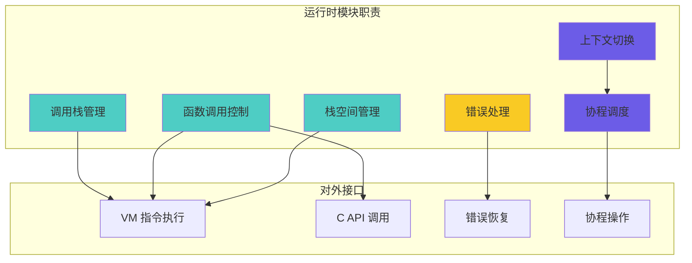

### 实现文件

| 文件 | 代码量 | 核心功能 |
|------|--------|---------|
| **ldo.c** | ~600 行 | 执行控制、函数调用、错误处理、栈管理 |
| **ldo.h** | ~100 行 | 执行引擎接口定义 |
| **lstate.c** | ~200 行 | 线程状态管理、CallInfo 分配 |
| **lstate.h** | ~200 行 | 状态结构定义、CallInfo 结构 |

### 模块依赖关系

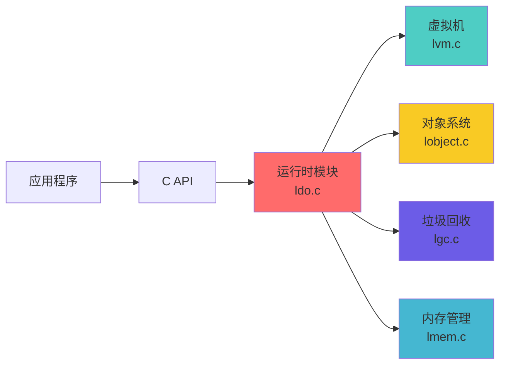

---

## 🎯 核心技术

### 1. 调用栈管理（CallInfo 机制）

#### CallInfo 结构详解

Lua 使用 **CallInfo 链表**管理函数调用栈，每个函数调用对应一个 CallInfo 节点：

```c
typedef struct CallInfo {
    StkId base;             // 函数栈帧基址（第一个局部变量位置）
    StkId func;             // 函数对象在栈中的位置
    StkId top;              // 当前函数的栈顶（可用空间边界）
    const Instruction *savedpc; // 返回地址（仅Lua函数有效）
    int nresults;           // 期望的返回值数量（-1表示全部）
    int tailcalls;          // 尾调用计数（用于调试）
} CallInfo;
```

#### 调用栈可视化

```
Lua 状态 (lua_State):
┌─────────────────────────────┐
│  CallInfo 链表              │
│  ┌──────────────┐           │
│  │ 当前调用(ci) │ ← ci      │
│  ├──────────────┤           │
│  │  上一调用    │           │
│  ├──────────────┤           │
│  │  更早调用    │           │
│  └──────────────┘           │
└─────────────────────────────┘

值栈 (Stack):
高地址 ┌─────────────┐ ← stack_last
      │             │
      │  可扩展空间  │
      │             │
      ├─────────────┤ ← ci->top (当前栈顶)
      │  局部变量3  │
      │  局部变量2  │
      │  局部变量1  │ ← ci->base (栈帧基址)
      ├─────────────┤
      │  参数n      │
      │  ...        │
      │  参数1      │
      │  函数对象   │ ← ci->func
      ├─────────────┤
      │  前一帧数据  │
      │  ...        │
低地址 └─────────────┘ ← stack (栈底)
```

#### CallInfo 生命周期


---

### 2. 函数调用流程

#### 核心调用函数

```c
// 主调用接口：执行函数（不处理错误）
void luaD_call (lua_State *L, StkId func, int nResults);

// 保护调用：捕获错误的调用
int luaD_pcall (lua_State *L, Pfunc func, void *u,
                ptrdiff_t old_top, ptrdiff_t ef);

// 原始调用：实际执行逻辑
void luaD_rawrunprotected (lua_State *L, Pfunc f, void *ud);
```

#### 完整调用流程图

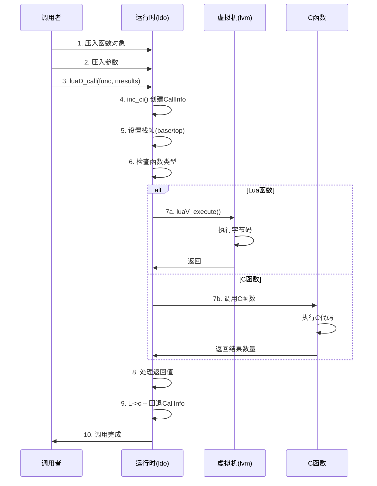

#### Lua 函数调用示例

```c
// ldo.c: luaD_call 的核心逻辑
void luaD_call (lua_State *L, StkId func, int nResults) {
    // 1. 检查钩子（调试）
    if (++L->nCcalls >= LUAI_MAXCCALLS) {
        if (L->nCcalls == LUAI_MAXCCALLS)
            luaG_runerror(L, "C stack overflow");
        else if (L->nCcalls >= (LUAI_MAXCCALLS + (LUAI_MAXCCALLS>>3)))
            luaD_throw(L, LUA_ERRERR);  // 错误处理时又出错
    }
    
    // 2. 调用前钩子
    if (L->hookmask & LUA_MASKCALL)
        luaD_callhook(L, LUA_HOOKCALL, -1);
    
    // 3. 实际调用
    luaD_precall(L, func, nResults);
    
    L->nCcalls--;
}

// 准备调用：设置栈帧
int luaD_precall (lua_State *L, StkId func, int nresults) {
    LClosure *cl;
    ptrdiff_t funcr;
    
    // 处理元方法调用(__call)
    if (!ttisfunction(func))
        func = tryfuncTM(L, func);
    
    funcr = savestack(L, func);
    cl = &clvalue(func)->l;
    
    // 检查栈空间
    if (!cl->isC) {  // Lua 函数
        CallInfo *ci;
        StkId base;
        Proto *p = cl->p;
        
        // 检查参数和栈空间
        luaD_checkstack(L, p->maxstacksize);
        
        // 准备参数（填充到p->numparams个）
        func = restorestack(L, funcr);
        if (p->is_vararg == 0) {
            base = func + 1;
            for (; L->top < base + p->numparams; L->top++)
                setnilvalue(L->top);
        } else {
            base = adjust_varargs(L, p, cast_int(L->top - func) - 1);
        }
        
        // 创建新的CallInfo
        ci = inc_ci(L);
        ci->func = func;
        L->base = ci->base = base;
        ci->top = L->base + p->maxstacksize;
        lua_assert(ci->top <= L->stack_last);
        L->savedpc = p->code;  // 初始化PC
        ci->tailcalls = 0;
        ci->nresults = nresults;
        
        // 初始化局部变量为nil
        for (st = L->top; st < ci->top; st++)
            setnilvalue(st);
        L->top = ci->top;
        
        return 0;  // Lua函数，需要VM执行
    }
    else {  // C 函数
        CallInfo *ci;
        int n;
        
        // 检查栈空间
        luaD_checkstack(L, LUA_MINSTACK);
        
        // 创建CallInfo
        ci = inc_ci(L);
        ci->func = restorestack(L, funcr);
        L->base = ci->base = ci->func + 1;
        ci->top = L->top + LUA_MINSTACK;
        lua_assert(ci->top <= L->stack_last);
        ci->nresults = nresults;
        
        // 调用C函数
        n = (*curr_func(L)->c.f)(L);  // 执行
        
        // 处理返回
        luaD_poscall(L, L->top - n);
        return 1;  // C函数已完成
    }
}
```

---

### 3. 尾调用优化（Tail Call Optimization）

#### 什么是尾调用？

尾调用是指**函数的最后一个操作是调用另一个函数**，且调用结果直接作为返回值：

```lua
-- 尾调用示例
function factorial_tail(n, acc)
    if n <= 1 then
        return acc
    else
        return factorial_tail(n - 1, n * acc)  -- 尾调用
    end
end

-- 非尾调用示例
function factorial(n)
    if n <= 1 then
        return 1
    else
        return n * factorial(n - 1)  -- NOT 尾调用（需要执行乘法）
    end
end
```

#### 尾调用优化原理


#### 实现细节

```c
// lvm.c: OP_TAILCALL 指令处理
case OP_TAILCALL: {
    int b = GETARG_B(i);
    if (b != 0) L->top = ra+b;  // 设置top（参数数量）
    
    // 关键：检查是否真的是尾调用
    lua_assert(GETARG_C(i) - 1 == LUA_MULTRET);
    
    // 复制被调用函数和参数到当前栈帧
    L->savedpc = pc;
    switch (luaD_precall(L, ra, LUA_MULTRET)) {
        case 0: {  // Lua函数
            // 尾调用优化：重用当前CallInfo
            CallInfo *ci = L->ci - 1;  // 前一个CallInfo
            int aux;
            
            // 关闭upvalue
            luaF_close(L, ci->base);
            
            // 计数尾调用次数
            ci->tailcalls++;
            
            // 移动参数到正确位置
            aux = cast_int(L->top - ra);
            for (j = 0; j < aux; j++)
                setobjs2s(L, ci->func + j, ra + j);
            
            L->top = ci->top = ci->func + aux;
            lua_assert(L->top <= L->stack_last);
            
            // 继续执行（无需创建新CallInfo）
            continue;
        }
        case 1: {  // C函数（已完成）
            break;
        }
        default: {
            return;  // yield
        }
    }
}
```

#### 尾调用的性能优势

| 特性 | 普通递归 | 尾调用优化 |
|------|---------|-----------|
| **栈空间** | O(n) | O(1) |
| **CallInfo数量** | n个 | 1个 |
| **最大递归深度** | 受限于栈大小 | 无限制 |
| **性能** | 每层有开销 | 接近循环 |

---

### 4. 错误处理机制

#### 保护调用（Protected Call）

Lua 使用 **setjmp/longjmp** 机制实现结构化异常处理：

```c
// 保护调用的核心接口
int luaD_pcall (lua_State *L, Pfunc func, void *u,
                ptrdiff_t old_top, ptrdiff_t ef) {
    unsigned short oldnCcalls = L->nCcalls;
    ptrdiff_t old_ci = saveci(L, L->ci);
    lu_byte old_allowhooks = L->allowhook;
    ptrdiff_t old_errfunc = L->errfunc;
    
    L->errfunc = ef;
    
    // 设置错误恢复点
    struct lua_longjmp lj;
    lj.status = 0;
    lj.previous = L->errorJmp;  // 保存前一个恢复点
    L->errorJmp = &lj;
    
    // 尝试执行
    if (setjmp(lj.b) == 0) {
        (*func)(L, u);  // 执行函数
    }
    else {  // 错误发生
        // 错误恢复
        L->ci = restoreci(L, old_ci);
        L->base = L->ci->base;
        L->nCcalls = oldnCcalls;
        L->allowhook = old_allowhooks;
    }
    
    L->errorJmp = lj.previous;  // 恢复前一个恢复点
    L->errfunc = old_errfunc;
    
    return lj.status;
}
```

#### 错误处理流程图

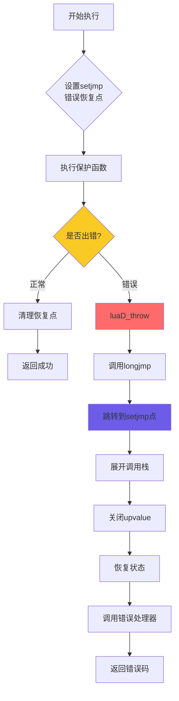

#### 错误类型

```c
// lua.h: 错误状态码
#define LUA_OK        0     // 正常执行
#define LUA_YIELD     1     // 协程挂起
#define LUA_ERRRUN    2     // 运行时错误
#define LUA_ERRSYNTAX 3     // 语法错误
#define LUA_ERRMEM    4     // 内存分配错误
#define LUA_ERRERR    5     // 错误处理器错误
```

#### 错误传播示例

```c
// 抛出错误：使用longjmp跳转
void luaD_throw (lua_State *L, int errcode) {
    if (L->errorJmp) {
        L->errorJmp->status = errcode;
        longjmp(L->errorJmp->b, 1);  // 跳转到错误恢复点
    }
    else {
        // 没有错误处理器，强制退出
        if (G(L)->panic)
            G(L)->panic(L);
        exit(EXIT_FAILURE);
    }
}

// Lua代码示例
local status, result = pcall(function()
    error("Something went wrong!")  -- 触发错误
end)

if not status then
    print("Error caught:", result)
end
```

#### 错误栈展开（Stack Unwinding）

```
错误发生前的调用栈:
┌───────────────┐
│  func_d()     │ ← 错误发生位置
├───────────────┤
│  func_c()     │
├───────────────┤
│  func_b()     │
├───────────────┤
│  func_a()     │
├───────────────┤
│  pcall(...)   │ ← 错误恢复点
└───────────────┘

错误展开后:
┌───────────────┐
│  pcall(...)   │ ← 恢复到此
└───────────────┘
└─ 中间帧全部清理
```

---

### 5. 协程（Coroutine）实现

#### 协程状态机

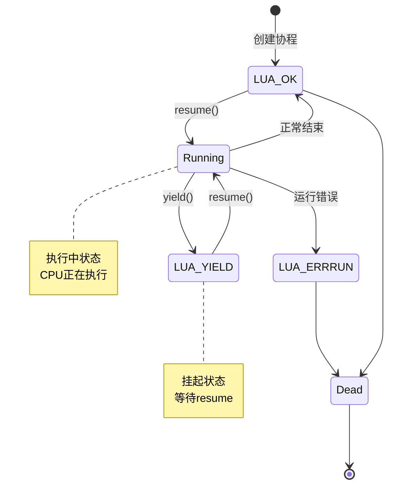

#### 核心协程函数

```c
// lua.h: 协程操作接口
LUA_API lua_State *lua_newthread (lua_State *L);
LUA_API int lua_resume (lua_State *L, int narg);
LUA_API int lua_yield (lua_State *L, int nresults);
LUA_API int lua_status (lua_State *L);

// ldo.c: resume实现
LUA_API int lua_resume (lua_State *L, int nargs) {
    int status;
    
    // 检查协程状态
    if (L->status != LUA_YIELD) {
        if (L->status != 0)
            return resume_error(L, "cannot resume dead coroutine");
        else if (L->ci != L->base_ci)
            return resume_error(L, "cannot resume non-suspended coroutine");
    }
    
    // 检查参数数量
    luai_userstateresume(L, nargs);
    lua_assert(L->errfunc == 0);
    
    // 恢复执行
    L->baseCcalls = ++L->nCcalls;
    status = luaD_rawrunprotected(L, resume, L->top - nargs);
    
    // 处理结果
    if (status != 0) {  // 错误或yield
        L->status = cast_byte(status);
        luaD_seterrorobj(L, status, L->top);
        L->ci->top = L->top;
    }
    else {
        lua_assert(L->nCcalls == L->baseCcalls);
        status = L->status;
    }
    
    --L->nCcalls;
    lua_unlock(L);
    return status;
}

// ldo.c: yield实现
LUA_API int lua_yield (lua_State *L, int nresults) {
    luai_userstateyield(L, nresults);
    lua_lock(L);
    
    // 不能在C函数中yield（除非是C closure）
    if (L->nCcalls > L->baseCcalls)
        luaG_runerror(L, "attempt to yield across metamethod/C-call boundary");
    
    L->base = L->top - nresults;  // 保护返回值
    L->status = LUA_YIELD;
    lua_unlock(L);
    
    return -1;  // 返回值被忽略
}
```

#### 协程上下文切换

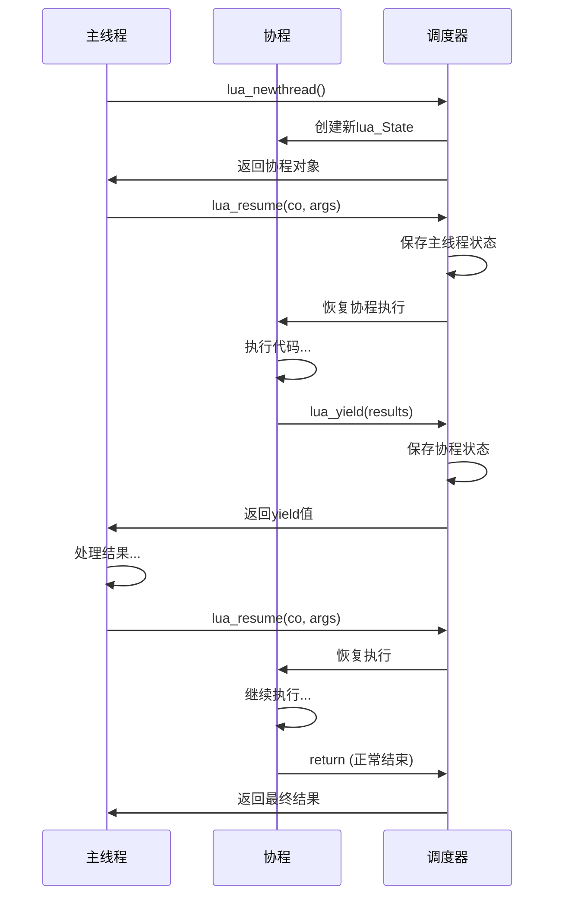

#### 协程数据结构

```c
// lstate.h: lua_State 包含协程状态
struct lua_State {
    CommonHeader;
    lu_byte status;           // 协程状态
    StkId top;                // 栈顶
    StkId base;               // 当前函数基址
    global_State *l_G;        // 全局状态
    CallInfo *ci;             // 当前调用信息
    const Instruction *savedpc; // 保存的PC
    StkId stack_last;         // 栈末尾
    StkId stack;              // 栈底
    CallInfo *end_ci;         // CallInfo数组末尾
    CallInfo *base_ci;        // CallInfo数组基址
    int stacksize;            // 栈大小
    int size_ci;              // CallInfo数组大小
    unsigned short nCcalls;   // C调用嵌套层数
    unsigned short baseCcalls;// 协程resume时的nCcalls
    lu_byte hookmask;         // 钩子掩码
    lu_byte allowhook;        // 允许钩子
    int basehookcount;        // 基础钩子计数
    int hookcount;            // 当前钩子计数
    lua_Hook hook;            // 钩子函数
    TValue l_gt;              // 全局表
    TValue env;               // 环境表
    GCObject *openupval;      // 打开的upvalue链表
    GCObject *gclist;         // GC链表
    struct lua_longjmp *errorJmp; // 错误跳转点
    ptrdiff_t errfunc;        // 错误处理函数
};
```

#### 协程通信示例

```lua
-- 生产者-消费者模式
function producer()
    return coroutine.create(function ()
        while true do
            local x = io.read()
            coroutine.yield(x)  -- 产生值
        end
    end)
end

function consumer(prod)
    while true do
        local status, value = coroutine.resume(prod)  -- 消费值
        if not status then break end
        print("Consumed:", value)
    end
end

-- 使用
local p = producer()
consumer(p)
```

---

### 6. 栈管理

#### 栈扩展机制

```c
// ldo.c: 栈增长
void luaD_growstack (lua_State *L, int n) {
    if (n <= L->stacksize)  // 已有足够空间
        luaD_reallocstack(L, 2*L->stacksize);  // 双倍扩展
    else
        luaD_reallocstack(L, L->stacksize + n + EXTRA_STACK);
}

// 栈重分配
static void luaD_reallocstack (lua_State *L, int newsize) {
    TValue *oldstack = L->stack;
    int realsize = newsize + 1 + EXTRA_STACK;
    
    // 重新分配内存
    lua_assert(newsize <= LUAI_MAXCSTACK || newsize == ERRORSTACKSIZE);
    luaM_reallocvector(L, L->stack, L->stacksize, realsize, TValue);
    
    // 调整指针（因为stack地址可能改变）
    L->stacksize = newsize;
    L->stack_last = L->stack + newsize;
    correctstack(L, oldstack);
}

// 修正所有指向栈的指针
static void correctstack (lua_State *L, TValue *oldstack) {
    CallInfo *ci;
    GCObject *up;
    
    // 调整top指针
    L->top = (L->top - oldstack) + L->stack;
    
    // 调整所有CallInfo中的指针
    for (ci = L->base_ci; ci <= L->ci; ci++) {
        ci->top = (ci->top - oldstack) + L->stack;
        ci->base = (ci->base - oldstack) + L->stack;
        ci->func = (ci->func - oldstack) + L->stack;
    }
    
    // 调整base指针
    L->base = (L->base - oldstack) + L->stack;
    
    // 调整upvalue指针
    for (up = L->openupval; up != NULL; up = up->gch.next)
        gco2uv(up)->v = (gco2uv(up)->v - oldstack) + L->stack;
}
```

#### 栈检查与保护

```c
// ldo.h: 栈检查宏
#define luaD_checkstack(L,n) \
    if ((char *)L->stack_last - (char *)L->top <= (n)*(int)sizeof(TValue)) \
        luaD_growstack(L, n); \
    else condhardstacktests(luaD_reallocstack(L, L->stacksize));

// 使用示例
void some_function(lua_State *L) {
    luaD_checkstack(L, 20);  // 确保有20个槽位
    // ... 安全地使用栈
}
```

#### 栈空间计算

```
栈空间分配策略:
┌──────────────────────────┐
│ 基础栈大小: 40 slots     │
│ 函数最大栈: proto->maxstacksize │
│ 额外空间: EXTRA_STACK(5) │
│ 扩展策略: 2倍或按需      │
└──────────────────────────┘

典型栈布局:
总大小 = 基础(40) + 最大帧(N) + 额外(5)
```

---
---

## 🔄 数据流转

### 完整函数调用数据流

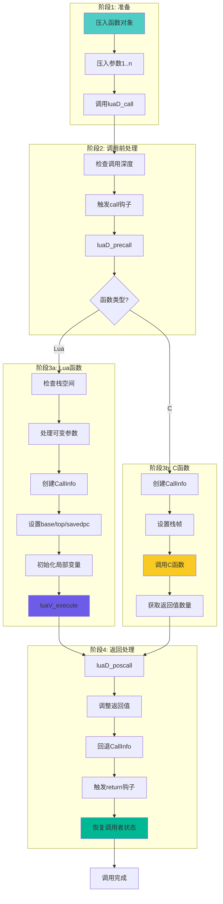

### 错误传播路径

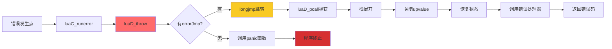

### 协程调度流程

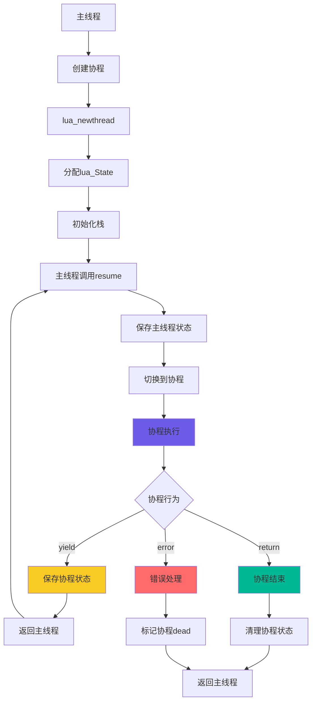

---

## 💡 设计权衡

### 1. CallInfo 链表 vs 连续数组

| 方案 | 优点 | 缺点 | Lua选择 |
|------|------|------|---------|
| **链表** | 动态增长方便<br/>内存灵活 | 缓存不友好<br/>指针开销 | ❌ |
| **连续数组** | 缓存友好<br/>访问快速 | 需要重分配<br/>指针需调整 | ✅ |

**Lua的实现**：
- 使用连续数组存储CallInfo
- 需要时动态扩展（类似std::vector）
- 扩展时需调整所有相关指针
- 权衡：性能 > 实现复杂度

### 2. 栈增长策略

```c
// Lua的双倍增长策略
void luaD_growstack (lua_State *L, int n) {
    if (n <= L->stacksize)
        luaD_reallocstack(L, 2*L->stacksize);  // 2倍
    else
        luaD_reallocstack(L, L->stacksize + n + EXTRA_STACK);
}
```

**权衡分析**：

| 策略 | 时间复杂度 | 空间浪费 | Lua选择 |
|------|-----------|---------|---------|
| 固定增长(+N) | O(n²) | 低 | ❌ |
| 双倍增长(×2) | O(n) 摊销 | 最多50% | ✅ |
| 1.5倍增长 | O(n) 摊销 | 最多33% | ❌ |

**Lua选择双倍的原因**：
- 重分配次数少（log n次）
- 实现简单
- 内存浪费可接受（脚本语言）

### 3. 尾调用优化的限制

**可优化的情况**：
```lua
function f(x)
    return g(x)  -- ✅ 尾调用
end
```

**不可优化的情况**：
```lua
function f(x)
    return g(x) + 1  -- ❌ 还需执行加法
end

function f(x)
    g(x)  -- ❌ 不是返回值
end

function f(x)
    return g(x), h(x)  -- ❌ 多返回值（第一个不是尾调用）
end
```

**设计限制**：
- 只能优化return的最后一个表达式
- C函数边界不能优化
- 调试信息会丢失（tailcalls计数）

### 4. setjmp/longjmp vs C++ 异常

| 特性 | setjmp/longjmp | C++ 异常 | Lua选择 |
|------|---------------|----------|---------|
| **语言** | C89标准 | C++11+ | ✅ C |
| **性能** | 零开销（无异常时） | 有开销 | ✅ |
| **析构** | 不支持 | 自动析构 | ✅ GC替代 |
| **类型安全** | 否 | 是 | ❌ |
| **可移植性** | 好 | 一般 | ✅ |

**Lua选择setjmp/longjmp的原因**：
- 保持C89兼容性
- 性能优先（脚本语言频繁调用）
- 通过GC管理资源，无需析构函数
- 嵌入式环境支持好

### 5. 协程 vs 原生线程

| 特性 | Lua协程 | 原生线程 | 权衡 |
|------|---------|---------|------|
| **调度** | 协作式 | 抢占式 | 简单 > 并行 |
| **切换开销** | 极低(~100ns) | 高(~1µs) | ✅ 性能 |
| **内存开销** | ~2KB | ~1MB | ✅ 内存 |
| **并行** | 不支持 | 支持 | ❌ 限制 |
| **数据共享** | 无锁 | 需锁 | ✅ 简单 |

**Lua的设计哲学**：
- 目标场景：游戏、嵌入式（单线程为主）
- 协程足够：状态机、异步I/O、生成器
- 简单性：避免线程同步复杂性
- 轻量级：适合资源受限环境

---

## 📈 性能特征

### 函数调用开销分析

```
Lua函数调用成本分解:
┌─────────────────────────────────┐
│ 1. CallInfo分配     ~10 cycles │
│ 2. 栈空间检查       ~5 cycles  │
│ 3. 参数准备         ~N cycles  │
│ 4. 指针设置         ~15 cycles │
│ 5. PC初始化         ~5 cycles  │
│ 总计               ~35+N cycles│
└─────────────────────────────────┘

对比:
- C直接调用:        ~5 cycles
- C++虚函数:        ~10 cycles
- Python函数:       ~300 cycles
- JavaScript:       ~100 cycles
```

### 尾调用优化效果

```lua
-- 测试代码
function sum(n, acc)
    if n == 0 then return acc end
    return sum(n-1, acc+n)  -- 尾调用
end

-- 性能对比
无优化递归: n=10000 → 栈溢出
尾调用优化: n=1000000 → 正常执行（O(1)空间）
改写为循环: 性能相当
```

### 协程切换性能

```
单次resume/yield开销:
┌──────────────────────────────┐
│ 状态保存:     ~50 cycles    │
│ 状态恢复:     ~50 cycles    │
│ 栈操作:       ~30 cycles    │
│ 总计:         ~130 cycles   │
└──────────────────────────────┘

对比OS线程切换: ~10,000 cycles
性能优势: 约75倍
```

---

## 🛠️ 实践建议

### 1. 正确使用尾调用

```lua
-- ✅ 推荐：尾递归
function factorial(n, acc)
    acc = acc or 1
    if n <= 1 then return acc end
    return factorial(n-1, n*acc)  -- 尾调用
end

-- ❌ 避免：普通递归
function factorial(n)
    if n <= 1 then return 1 end
    return n * factorial(n-1)  -- 非尾调用
end

-- ✅ 或者用循环
function factorial(n)
    local acc = 1
    for i = 2, n do
        acc = acc * i
    end
    return acc
end
```

### 2. 协程最佳实践

```lua
-- ✅ 推荐：生产者-消费者
function producer()
    return coroutine.create(function()
        for i = 1, 10 do
            coroutine.yield(i)
        end
    end)
end

function consumer(prod)
    while true do
        local ok, value = coroutine.resume(prod)
        if not ok or not value then break end
        print(value)
    end
end

-- ✅ 推荐：状态机
function state_machine()
    local co = coroutine.create(function()
        while true do
            print("State 1")
            coroutine.yield()
            print("State 2")
            coroutine.yield()
        end
    end)
    return co
end

-- ❌ 避免：在C函数边界yield
-- 会导致错误: attempt to yield across metamethod/C-call boundary
```

### 3. 错误处理模式

```lua
-- ✅ 推荐：pcall保护关键操作
local function safe_operation()
    local ok, result = pcall(function()
        -- 可能出错的代码
        return risky_function()
    end)
    
    if not ok then
        log_error(result)
        return default_value
    end
    return result
end

-- ✅ 推荐：xpcall添加错误处理器
local function detailed_error_handler(err)
    return debug.traceback("Error: " .. tostring(err), 2)
end

local ok, result = xpcall(function()
    return complex_operation()
end, detailed_error_handler)

-- ❌ 避免：过度使用pcall（影响性能）
-- 仅在真正需要捕获错误时使用
```

### 4. 栈管理注意事项

```c
// C API 使用
void my_c_function(lua_State *L) {
    // ✅ 检查参数数量
    int n = lua_gettop(L);
    luaL_checktype(L, 1, LUA_TTABLE);
    
    // ✅ 确保栈空间足够
    luaL_checkstack(L, 10, "not enough stack space");
    
    // ✅ 平衡栈操作
    int top = lua_gettop(L);
    // ... 操作
    lua_settop(L, top + nresults);  // 恢复+返回值
    
    // ❌ 避免：不检查就压入大量值
    // for (int i = 0; i < 10000; i++)
    //     lua_pushnumber(L, i);  // 可能栈溢出
}
```

---

---

## 📚 详细技术文档

### 已完成文档

| 文档 | 主题 | 深度 | 描述 |
|------|------|------|------|
| 🚧 [函数调用机制](function_call.md) | 调用流程 | ⭐⭐⭐⭐ | luaD_call详细实现分析 |
| 🚧 [错误处理实现](error_handling.md) | 异常机制 | ⭐⭐⭐⭐ | setjmp/longjmp错误恢复 |
| 🚧 [协程实现](coroutine.md) | 协程调度 | ⭐⭐⭐⭐⭐ | yield/resume工作原理 |

### 规划中文档

| 文档 | 主题 | 预计内容 |
|------|------|---------|
| [callinfo_management.md](callinfo_management.md) | CallInfo管理 | 分配、扩展、回收机制 |
| [tail_call_optimization.md](tail_call_optimization.md) | 尾调用优化 | 识别、优化、限制分析 |
| [stack_management.md](stack_management.md) | 栈管理 | 增长策略、指针调整 |
| [debug_hooks.md](debug_hooks.md) | 调试钩子 | call/return/line钩子 |

---

## 🔗 相关模块

### 上游依赖

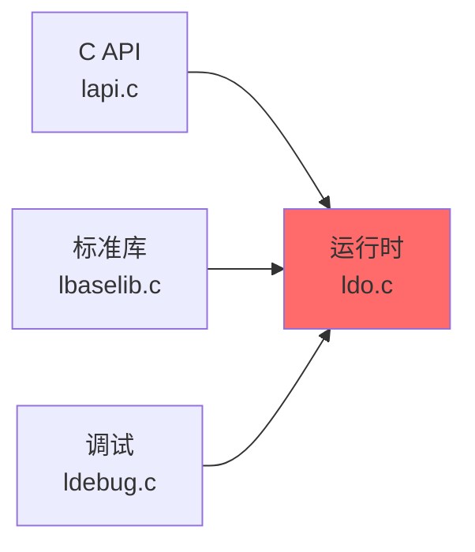

### 下游依赖

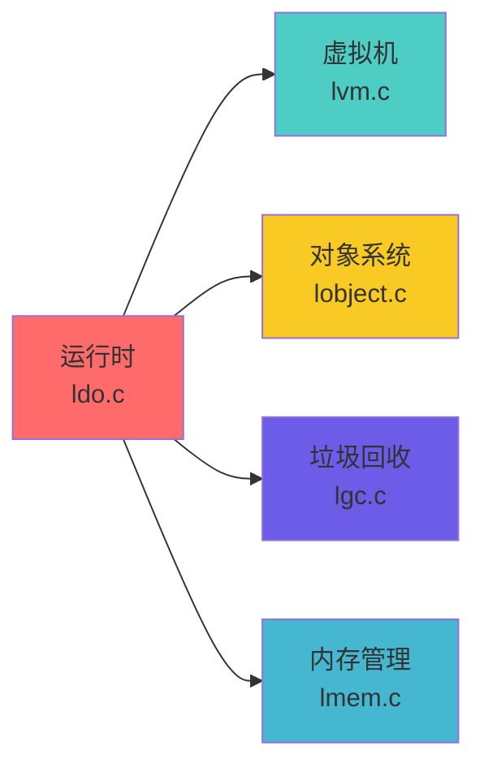

### 模块链接

| 模块 | 关系 | 说明 |
|------|------|------|
| [虚拟机模块](../vm/wiki_vm.md) | 被调用 | 运行时调用VM执行字节码 |
| [对象系统模块](../object/wiki_object.md) | 依赖 | 使用函数对象、值类型 |
| [垃圾回收模块](../gc/wiki_gc.md) | 协作 | 栈展开时需关闭upvalue |
| [内存管理模块](../memory/wiki_memory.md) | 依赖 | 栈和CallInfo的内存分配 |
| [编译器模块](../compiler/wiki_compiler.md) | 提供者 | 编译后的函数由运行时执行 |

---

## 📖 代码导读

### 核心文件结构

```
ldo.c/h - 执行控制核心
├── luaD_call          函数调用入口
├── luaD_pcall         保护调用
├── luaD_precall       调用准备
├── luaD_poscall       返回处理
├── luaD_throw         错误抛出
├── luaD_rawrunprotected 底层保护执行
├── luaD_growstack     栈扩展
├── luaD_reallocstack  栈重分配
└── correctstack       指针修正

lstate.c/h - 状态管理
├── lua_newstate       创建主状态
├── lua_newthread      创建协程
├── luaE_newthread     内部线程创建
├── luaE_freethread    释放线程
├── stack_init         栈初始化
└── freestack          栈释放
```

### 关键数据结构

```c
// lua_State - 线程状态（每个协程一个）
struct lua_State {
    // 栈管理
    StkId top;              // 当前栈顶
    StkId base;             // 当前函数基址
    StkId stack;            // 栈底
    StkId stack_last;       // 栈末尾
    int stacksize;          // 栈大小
    
    // 调用管理
    CallInfo *ci;           // 当前调用信息
    CallInfo *base_ci;      // CallInfo数组
    CallInfo *end_ci;       // 数组末尾
    int size_ci;            // 数组大小
    
    // 错误处理
    struct lua_longjmp *errorJmp;  // 错误恢复点
    ptrdiff_t errfunc;      // 错误处理函数
    
    // 协程状态
    lu_byte status;         // LUA_OK/LUA_YIELD等
    unsigned short nCcalls; // C调用深度
    unsigned short baseCcalls; // resume时的深度
    
    // 全局引用
    global_State *l_G;      // 全局状态
    GCObject *gclist;       // GC链表
};

// CallInfo - 调用信息（每个函数调用一个）
typedef struct CallInfo {
    StkId base;             // 栈帧基址
    StkId func;             // 函数对象位置
    StkId top;              // 栈顶限制
    const Instruction *savedpc; // 返回地址（Lua函数）
    int nresults;           // 期望返回值数量
    int tailcalls;          // 尾调用计数
} CallInfo;

// lua_longjmp - 错误跳转点
struct lua_longjmp {
    struct lua_longjmp *previous;  // 前一个跳转点
    jmp_buf b;              // setjmp缓冲区
    volatile int status;    // 错误码
};
```

### 阅读顺序建议

1. **入门**：先读 `luaD_call` 理解基本调用流程
2. **深入**：阅读 `luaD_precall` 和 `luaD_poscall` 了解细节
3. **高级**：研究 `luaD_pcall` 理解错误处理
4. **专题**：学习 `lua_resume` 和 `lua_yield` 掌握协程
5. **优化**：分析尾调用优化的字节码实现

---

## 🎓 学习检查点

### 基础理解

- [ ] 理解 CallInfo 结构及其作用
- [ ] 掌握函数调用的完整流程
- [ ] 了解 Lua 和 C 函数的调用差异
- [ ] 理解栈帧的布局和管理

### 进阶掌握

- [ ] 理解尾调用优化的原理和限制
- [ ] 掌握 setjmp/longjmp 错误处理机制
- [ ] 了解协程的状态转换
- [ ] 理解栈扩展和指针调整

### 高级应用

- [ ] 能在 C API 中正确管理栈
- [ ] 能实现自定义的错误处理策略
- [ ] 能使用协程实现复杂控制流
- [ ] 能分析和优化运行时性能

---

## 💭 常见问题 FAQ

<details>
<summary><b>Q1: 为什么 Lua 使用 CallInfo 数组而不是链表？</b></summary>

**A**: 性能优先的选择：

1. **缓存友好**：连续内存访问快
2. **访问效率**：O(1) 随机访问
3. **内存紧凑**：无指针开销
4. **权衡**：重分配时需调整指针，但频率低

实测对比：
- 数组访问：~3 cycles
- 链表访问：~10 cycles（包含指针跳转）
</details>

<details>
<summary><b>Q2: Lua 的尾调用优化有哪些限制？</b></summary>

**A**: 主要限制：

1. **必须是 return 语句**：`return f()` ✅，`f(); return` ❌
2. **只能优化最后一个调用**：`return f(), g()` 中只优化 g
3. **不能跨 C 边界**：C 函数中的 Lua 调用无法优化
4. **调试信息丢失**：tailcalls 计数增加但栈帧消失

原因：保持实现简单性和可移植性
</details>

<details>
<summary><b>Q3: 如何避免 "C stack overflow" 错误？</b></summary>

**A**: 防范措施：

```lua
-- ✅ 使用尾调用
function process(data, i)
    if i > #data then return end
    handle(data[i])
    return process(data, i+1)  -- 尾调用
end

-- ❌ 避免深度递归
function process(data, i)
    if i > #data then return end
    handle(data[i])
    process(data, i+1)  -- 非尾调用
    -- 隐式return
end

-- ✅ 改用循环
function process(data)
    for i = 1, #data do
        handle(data[i])
    end
end
```

</details>

<details>
<summary><b>Q4: 协程 yield 为什么不能在 C 函数中使用？</b></summary>

**A**: 技术原因：

1. **C 栈帧不可控**：Lua 无法保存 C 的栈状态
2. **调用约定**：C 函数期望正常返回
3. **安全性**：可能导致 C 栈损坏

**解决方案**：
```c
// ❌ 在C函数中直接yield
int my_c_function(lua_State *L) {
    return lua_yield(L, 1);  // 错误！
}

// ✅ 返回yield标记，让Lua代码yield
int my_c_function(lua_State *L) {
    lua_pushboolean(L, 1);  // 返回需要yield的标记
    return 1;
}

-- Lua侧处理
if my_c_function() then
    coroutine.yield()
end
```
</details>

<details>
<summary><b>Q5: 如何调试复杂的函数调用流程？</b></summary>

**A**: 调试技巧：

```c
// 1. 打印CallInfo
void print_callinfo_chain(lua_State *L) {
    CallInfo *ci;
    int level = 0;
    for (ci = L->base_ci; ci <= L->ci; ci++, level++) {
        printf("Level %d: base=%p func=%p top=%p\n",
               level, ci->base, ci->func, ci->top);
    }
}

// 2. 使用调试钩子
lua_sethook(L, call_hook, LUA_MASKCALL | LUA_MASKRET, 0);

void call_hook(lua_State *L, lua_Debug *ar) {
    lua_getinfo(L, "nS", ar);
    printf("%s: %s\n", ar->event == LUA_HOOKCALL ? "CALL" : "RETURN",
           ar->name ? ar->name : "?");
}

// 3. 检查栈内容
void print_stack(lua_State *L) {
    int top = lua_gettop(L);
    for (int i = 1; i <= top; i++) {
        printf("[%d] %s\n", i, luaL_typename(L, i));
    }
}
```
</details>

---

## 📚 扩展阅读

### 推荐论文

1. **"The Implementation of Lua 5.0"** (Roberto Ierusalimschy, 2005)
   - 详细介绍寄存器虚拟机和调用机制
   - [下载地址](https://www.lua.org/doc/jucs05.pdf)

2. **"Coroutines in Lua"** (Ana Lúcia de Moura, Roberto Ierusalimschy, 2004)
   - 协程设计和实现的深入分析
   - [下载地址](https://www.inf.puc-rio.br/~roberto/docs/corosblp.pdf)

### 相关书籍

- **Programming in Lua** (4th Edition) - Chapter 9: Coroutines
- **Lua Performance Tips** - 运行时性能优化指南
- **Crafting Interpreters** - 虚拟机和调用栈实现

### 在线资源

- [Lua 5.1 源码注释版](https://github.com/lichuang/Lua-Source-Internal)
- [Lua Users Wiki - Coroutines](http://lua-users.org/wiki/CoroutinesTutorial)
- [云风的博客 - Lua协程分析](https://blog.codingnow.com/cloud/LuaCoroutine)

---

## 🔄 版本历史

| 版本 | 日期 | 变更 |
|------|------|------|
| v2.0 | 2025-01-26 | DeepWiki方法完全重写，增加大量图表和代码示例 |
| v1.0 | 2025-01-24 | 初始版本，基础内容框架 |

---

<div align="center">

**📖 继续学习**

[← 返回文档首页](../README.md) · [下一模块：标准库 →](../lib/wiki_lib.md)

**相关深入主题**

[函数调用详解](function_call.md) · [协程实现原理](coroutine.md) · [错误处理机制](error_handling.md)

---

*📅 最后更新：2025-01-26*  
*📝 文档版本：v2.0 (DeepWiki优化版)*  
*🔖 适用Lua版本：5.1.5*

**运行时模块是 Lua 虚拟机的执行控制中枢**  
*理解它，就理解了 Lua 如何调用函数、处理错误和调度协程*

</div>
