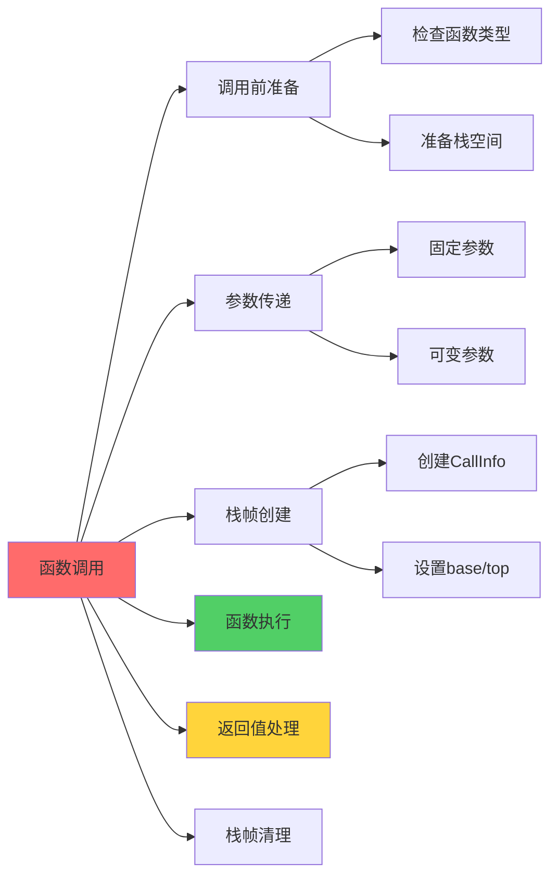
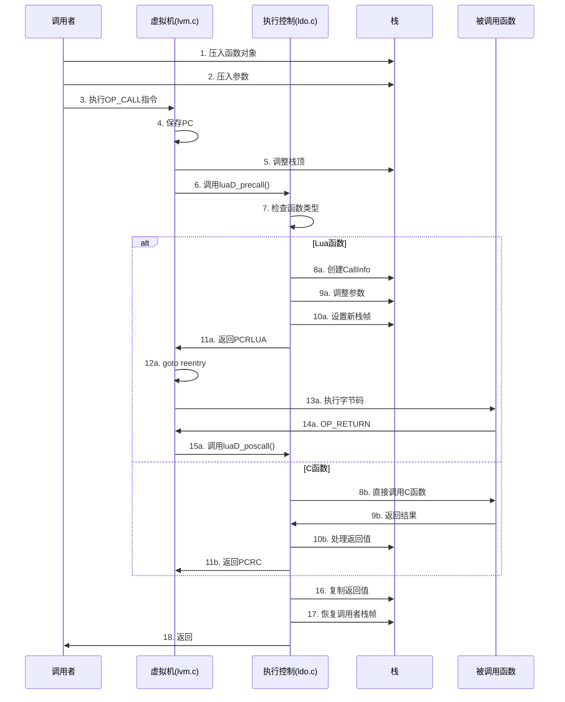
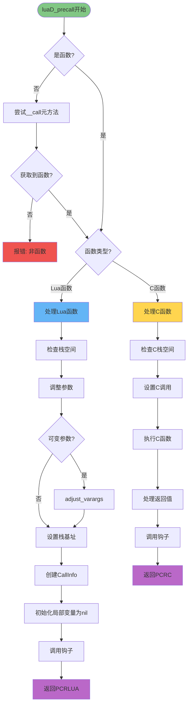
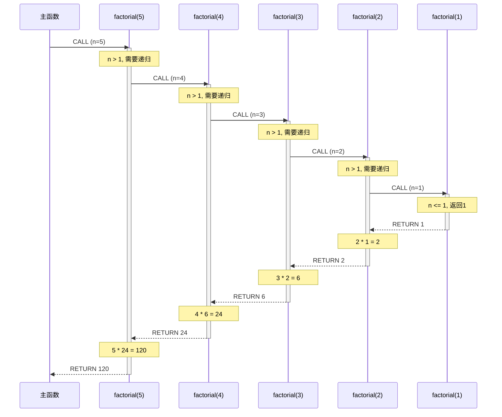
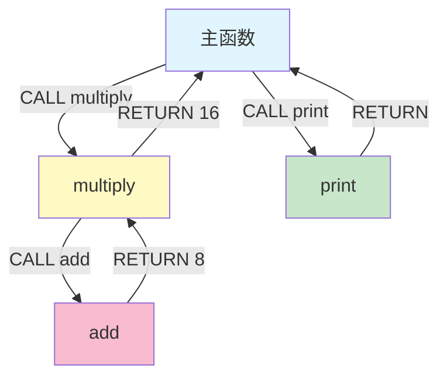
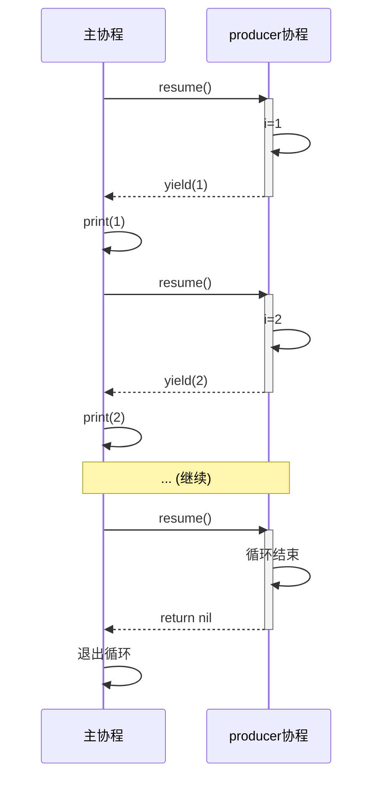

# 📞 Lua 5.1.5 函数调用机制完全解析

> **技术层级文档** - 深入剖析 Lua 函数调用的完整流程和实现细节

---

## 📑 导航目录

<details open>
<summary><b>点击展开/折叠目录</b></summary>

### 核心章节
1. [概述](#1-概述)
2. [调用流程总览](#2-调用流程总览)
3. [OP_CALL 指令详解](#3-op_call-指令详解)
4. [luaD_precall 前置处理](#4-luad_precall-前置处理)
5. [Lua函数调用](#5-lua函数调用)
6. [C函数调用](#6-c函数调用)
7. [luaD_poscall 后置处理](#7-luad_poscall-后置处理)
8. [尾调用优化](#8-尾调用优化)
9. [可变参数处理](#9-可变参数处理)
10. [实战案例分析](#10-实战案例分析)

### 附录
- [关键数据结构](#关键数据结构)
- [调用栈示意图](#调用栈示意图)
- [性能分析](#性能分析)
- [相关文档](#相关文档)

</details>

---

## 1. 概述

### 1.1 函数调用的重要性

函数调用是编程语言的核心机制之一，Lua 的函数调用系统具有以下特点：

- **统一的调用约定**：Lua 函数和 C 函数使用相同的调用机制
- **透明的互操作**：Lua 可以无缝调用 C 函数，反之亦然
- **尾调用优化**：自动优化尾递归，避免栈溢出
- **可变参数支持**：灵活的参数传递机制
- **多返回值**：支持函数返回多个值

### 1.2 涉及的核心文件

| 文件 | 职责 | 核心函数 |
|------|------|---------|
| `lvm.c` | 虚拟机执行引擎 | `OP_CALL`, `OP_TAILCALL`, `OP_RETURN` |
| `ldo.c` | 执行控制 | `luaD_precall()`, `luaD_poscall()`, `luaD_call()` |
| `lfunc.c` | 函数对象管理 | 闭包创建和管理 |
| `lapi.c` | C API | `lua_call()`, `lua_pcall()` |

### 1.3 关键概念



---

## 2. 调用流程总览

### 2.1 完整调用流程



### 2.2 调用阶段划分

| 阶段 | 函数 | 主要任务 |
|------|------|---------|
| **准备阶段** | `OP_CALL` | 保存PC、设置栈顶 |
| **前置处理** | `luaD_precall()` | 类型检查、栈帧创建、参数调整 |
| **执行阶段** | `luaV_execute()` / C函数 | 执行函数体 |
| **后置处理** | `luaD_poscall()` | 复制返回值、恢复栈帧 |

### 2.3 栈状态转换

**调用前**（调用者视角）：
```
┌──────────────────┐
│ 调用者数据       │
├──────────────────┤
│ R(n) = 函数对象  │ ← func
│ R(n+1) = 参数1   │
│ R(n+2) = 参数2   │
│ ...              │
├──────────────────┤ ← top（调用前）
│ 未使用空间       │
└──────────────────┘
```

**调用时**（被调用函数视角）：
```
┌──────────────────┐
│ 调用者数据       │
├──────────────────┤
│ 函数对象         │ ← ci->func
├──────────────────┤
│ R(0) = 参数1     │ ← base = ci->base
│ R(1) = 参数2     │
│ R(2) = 局部变量1 │
│ R(3) = 局部变量2 │
│ ...              │
├──────────────────┤ ← top（函数内）
│ 未使用空间       │
└──────────────────┘
```

**返回后**（调用者视角）：
```
┌──────────────────┐
│ 调用者数据       │
├──────────────────┤
│ R(n) = 返回值1   │ ← res（覆盖函数对象）
│ R(n+1) = 返回值2 │
│ ...              │
├──────────────────┤ ← top（返回后）
│ 未使用空间       │
└──────────────────┘
```

---

## 3. OP_CALL 指令详解

### 3.1 指令格式

```c
OP_CALL,  /*  A B C   R(A), ... ,R(A+C-2) := R(A)(R(A+1), ... ,R(A+B-1)) */
```

**参数说明**：
- **A**: 函数所在的寄存器
- **B**: 参数数量 + 1
  - `B = 0`: 参数数量到栈顶 `top - (A + 1)`
  - `B > 0`: 参数数量 = `B - 1`
- **C**: 期望返回值数量 + 1
  - `C = 0`: 保留所有返回值到栈顶
  - `C = 1`: 不需要返回值
  - `C > 1`: 期望返回值数量 = `C - 1`

### 3.2 指令实现

```c
case OP_CALL: {
    int b = GETARG_B(i);          // 参数数量 + 1
    int nresults = GETARG_C(i) - 1; // 期望返回值数量
    
    // 设置栈顶（确定参数范围）
    if (b != 0) {
        L->top = ra + b;  // ra + b = 函数 + 参数
    }
    // 如果 b == 0，栈顶已经在之前的指令中设置好
    
    // 保存程序计数器（用于返回和错误处理）
    L->savedpc = pc;
    
    // 调用前置处理函数
    switch (luaD_precall(L, ra, nresults)) {
        case PCRLUA: {
            // Lua函数：需要执行字节码
            nexeccalls++;
            goto reentry;  // 重入执行循环
        }
        
        case PCRC: {
            // C函数：已执行完毕
            if (nresults >= 0) {
                L->top = L->ci->top;  // 恢复栈顶
            }
            base = L->base;  // 重新加载base
            continue;  // 继续执行下一条指令
        }
        
        default: {
            // 协程挂起或错误
            return;
        }
    }
}
```

### 3.3 参数传递示例

**Lua 代码**：
```lua
local function test(a, b, c)
    return a + b + c
end

local result = test(10, 20, 30)
```

**字节码**：
```
; 函数定义
function <test:1,3> (4 instructions)
3 params, 4 slots, 0 upvalues, 3 locals, 0 constants
    1  [2]  ADD      3 0 1    ; R(3) = R(0) + R(1)
    2  [2]  ADD      3 3 2    ; R(3) = R(3) + R(2)
    3  [2]  RETURN   3 2      ; return R(3)
    4  [3]  RETURN   0 1      ;

; 调用代码
MOVE     1 0      ; 函数移到R(1)
LOADK    2 -1     ; R(2) = 10
LOADK    3 -2     ; R(3) = 20
LOADK    4 -3     ; R(4) = 30
CALL     1 4 2    ; R(1) = test(R(2), R(3), R(4))
                  ; A=1, B=4 (3参数+函数), C=2 (1返回值+1)
```

**执行过程**：

| 步骤 | 操作 | 栈状态 |
|------|------|--------|
| 1 | MOVE 1 0 | R(1) = test函数 |
| 2 | LOADK 2 -1 | R(2) = 10 |
| 3 | LOADK 3 -2 | R(3) = 20 |
| 4 | LOADK 4 -3 | R(4) = 30 |
| 5 | CALL 1 4 2 | top = R(1) + 4 = R(5) |
| 6 | luaD_precall | 创建新栈帧 |
| 7 | 执行test | R(0)=10, R(1)=20, R(2)=30 |
| 8 | RETURN | 返回60 |
| 9 | luaD_poscall | R(1) = 60 |

---

## 4. luaD_precall 前置处理

### 4.1 函数签名

```c
int luaD_precall (lua_State *L, StkId func, int nresults)
```

**参数**：
- `L`: Lua 状态机
- `func`: 函数对象在栈中的位置
- `nresults`: 期望的返回值数量

**返回值**：
- `PCRLUA`: Lua 函数，需要执行字节码
- `PCRC`: C 函数，已执行完毕
- `PCRYIELD`: 协程挂起

### 4.2 完整实现流程



### 4.3 源代码实现

```c
int luaD_precall (lua_State *L, StkId func, int nresults) {
    LClosure *cl;
    ptrdiff_t funcr;
    
    // 1. 检查是否是函数，否则尝试元方法
    if (!ttisfunction(func)) {
        func = tryfuncTM(L, func);  // 尝试 __call 元方法
    }
    
    funcr = savestack(L, func);  // 保存func位置（防止GC移动）
    cl = &clvalue(func)->l;
    L->ci->savedpc = L->savedpc;  // 保存调用者的PC
    
    // 2. 区分Lua函数和C函数
    if (!cl->isC) {  
        // ==================== Lua 函数处理 ====================
        CallInfo *ci;
        StkId st, base;
        Proto *p = cl->p;
        
        // 2.1 检查栈空间
        luaD_checkstack(L, p->maxstacksize);
        func = restorestack(L, funcr);  // 恢复func（可能被GC移动）
        
        // 2.2 计算实际参数数量
        int n = cast_int(L->top - func) - 1;  // 实际参数数
        
        // 2.3 调整参数数量（填充nil或截断）
        for (; n < p->numparams; n++)
            setnilvalue(L->top++);  // 填充缺失参数为nil
        
        // 2.4 设置栈基址
        if (!p->is_vararg) {
            // 固定参数：base直接在函数后
            base = func + 1;
            L->top = base + p->maxstacksize;
        } else {
            // 可变参数：需要特殊处理
            base = adjust_varargs(L, p, n);
        }
        
        // 2.5 创建新的CallInfo
        ci = inc_ci(L);
        ci->func = func;
        L->base = ci->base = base;
        ci->top = L->base + p->maxstacksize;
        lua_assert(ci->top <= L->stack_last);
        L->savedpc = p->code;  // 设置PC为函数第一条指令
        ci->tailcalls = 0;
        ci->nresults = nresults;
        
        // 2.6 初始化局部变量为nil
        for (st = L->top; st < ci->top; st++)
            setnilvalue(st);
        L->top = ci->top;
        
        // 2.7 调用钩子
        if (L->hookmask & LUA_MASKCALL)
            luaD_callhook(L, LUA_HOOKCALL, -1);
        
        return PCRLUA;  // 需要执行Lua字节码
        
    } else {  
        // ==================== C 函数处理 ====================
        CallInfo *ci;
        int n;
        
        // 2.1 检查C调用栈深度
        luaD_checkstack(L, LUA_MINSTACK);
        ci = inc_ci(L);
        ci->func = restorestack(L, funcr);
        L->base = ci->base = ci->func + 1;
        ci->top = L->top + LUA_MINSTACK;
        lua_assert(ci->top <= L->stack_last);
        ci->nresults = nresults;
        
        // 2.2 调用钩子
        if (L->hookmask & LUA_MASKCALL)
            luaD_callhook(L, LUA_HOOKCALL, -1);
        
        lua_unlock(L);
        
        // 2.3 执行C函数
        n = (*curr_func(L)->c.f)(L);  // 调用C函数
        
        lua_lock(L);
        
        // 2.4 处理返回值
        luaD_poscall(L, L->top - n);
        
        return PCRC;  // C函数已执行完毕
    }
}
```

### 4.4 关键步骤解析

#### 4.4.1 元方法尝试

```c
static StkId tryfuncTM (lua_State *L, StkId func) {
    const TValue *tm = luaT_gettmbyobj(L, func, TM_CALL);
    StkId p;
    ptrdiff_t funcr = savestack(L, func);
    
    if (!ttisfunction(tm))
        luaG_typeerror(L, func, "call");
    
    // 将原对象作为第一个参数
    for (p = L->top; p > func; p--)
        setobjs2s(L, p, p-1);
    incr_top(L);
    
    func = restorestack(L, funcr);
    setobj2s(L, func, tm);  // 替换为元方法
    return func;
}
```

**示例**：
```lua
local t = {}
setmetatable(t, {
    __call = function(self, x, y)
        return x + y
    end
})

print(t(10, 20))  -- 调用__call元方法
-- 内部会将 t(10, 20) 转换为 __call(t, 10, 20)
```

#### 4.4.2 参数调整

```c
// 填充缺失参数
for (; n < p->numparams; n++)
    setnilvalue(L->top++);
```

**示例**：
```lua
function test(a, b, c)
    print(a, b, c)
end

test(1)        -- a=1, b=nil, c=nil（自动填充）
test(1, 2)     -- a=1, b=2, c=nil
test(1, 2, 3)  -- a=1, b=2, c=3
test(1, 2, 3, 4)  -- a=1, b=2, c=3（第4个参数被忽略）
```

---

## 5. Lua函数调用

### 5.1 Lua函数执行流程

当 `luaD_precall()` 返回 `PCRLUA` 时，虚拟机通过 `goto reentry` 重新进入执行循环：

```c
case OP_CALL: {
    // ... 前面的代码 ...
    
    switch (luaD_precall(L, ra, nresults)) {
        case PCRLUA: {
            nexeccalls++;
            goto reentry;  // ← 重新进入执行循环
        }
        // ...
    }
}

reentry:  /* entry point */
    lua_assert(isLua(L->ci));
    pc = L->savedpc;
    cl = &clvalue(L->ci->func)->l;
    base = L->base;
    k = cl->p->k;
    
    /* main loop of interpreter */
    for (;;) {
        const Instruction i = *pc++;
        StkId ra;
        // ... 执行指令 ...
    }
```

### 5.2 栈帧结构详解

**CallInfo 结构**：
```c
typedef struct CallInfo {
    StkId base;        /* 函数栈基址 = func + 1 */
    StkId func;        /* 函数对象在栈中的位置 */
    StkId top;         /* 函数栈顶（base + maxstacksize） */
    const Instruction *savedpc;  /* 程序计数器 */
    int nresults;      /* 期望返回值数量 */
    int tailcalls;     /* 尾调用计数器 */
} CallInfo;
```

**栈帧布局**：
```
                        调用者栈帧
┌────────────────────────────────────┐
│ ... 调用者的局部变量 ...           │
├────────────────────────────────────┤ ← 调用者的 top
│                                    │
│        空闲空间                    │
│                                    │
└────────────────────────────────────┘

                        被调用函数栈帧
┌────────────────────────────────────┐
│ 函数对象 (闭包)                    │ ← ci->func
├────────────────────────────────────┤
│ R(0) = 参数 1 或局部变量 1         │ ← ci->base = L->base
│ R(1) = 参数 2 或局部变量 2         │
│ R(2) = 参数 3 或局部变量 3         │
│ ...                                │
│ R(n) = 局部变量 n                  │
├────────────────────────────────────┤ ← L->top
│                                    │
│        空闲空间                    │
│                                    │
├────────────────────────────────────┤ ← ci->top
│                                    │
└────────────────────────────────────┘
```

### 5.3 寄存器到栈的映射

在 `luaV_execute()` 中：
```c
#define RA(i)   (base+GETARG_A(i))
#define RB(i)   check_exp(getBMode(GET_OPCODE(i)) == OpArgR, base+GETARG_B(i))
#define RC(i)   check_exp(getCMode(GET_OPCODE(i)) == OpArgR, base+GETARG_C(i))
```

**示例**：
```lua
local function test(a, b)
    local c = a + b
    return c
end
```

**字节码和栈映射**：
```
function <test:1,4> (3 instructions, 3 slots)
    参数: a(R0), b(R1)
    局部变量: c(R2)

    1  [3]  ADD      2 0 1    ; R(2) = R(0) + R(1)
                               ; base[2] = base[0] + base[1]
                               ; c = a + b
    
    2  [3]  RETURN   2 2      ; return R(2)
                               ; 返回 base[2]
    
    3  [4]  RETURN   0 1      ; return (函数结束)
```

**栈状态变化**：

| 时间点 | 栈布局 | 说明 |
|--------|--------|------|
| 调用前 | `[func][10][20]` | func=test, 参数10, 20 |
| precall后 | `base→[10][20][nil]` | R(0)=10, R(1)=20, R(2)=nil |
| 执行ADD后 | `base→[10][20][30]` | R(2) = 10 + 20 = 30 |
| RETURN前 | `base→[10][20][30]` | 准备返回R(2) |

### 5.4 函数返回 (OP_RETURN)

```c
case OP_RETURN: {
    int b;
    
    // A: 第一个返回值的寄存器
    // B: 返回值数量 + 1 (0表示到栈顶)
    
    if (L->hookmask & LUA_MASKRET)
        luaD_callhook(L, LUA_HOOKRET, -1);
    
    b = GETARG_B(i);
    if (b != 0) {
        L->top = ra + b - 1;  // 设置栈顶到最后一个返回值
    }
    // b == 0 时，栈顶已经正确设置
    
    if (L->openupval) 
        luaF_close(L, base);  // 关闭upvalue
    
    L->savedpc = pc;
    b = luaD_poscall(L, ra);  // 后置处理
    
    if (--nexeccalls == 0)  // 最外层函数？
        return;
    else {  // 内层函数，继续执行
        if (b) L->top = L->ci->top;
        lua_assert(isLua(L->ci));
        lua_assert(GET_OPCODE(*((L->ci)->savedpc - 1)) == OP_CALL);
        goto reentry;  // 返回到调用者
    }
}
```

**返回值处理示例**：

```lua
-- 示例1：单返回值
function f1()
    return 42
end
-- 字节码: RETURN 0 2  (返回R(0), 1个返回值)

-- 示例2：多返回值
function f2()
    return 10, 20, 30
end
-- 字节码:
--   LOADK 0 -1  ; R(0) = 10
--   LOADK 1 -2  ; R(1) = 20
--   LOADK 2 -3  ; R(2) = 30
--   RETURN 0 4  ; 返回R(0)到R(2), 3个返回值

-- 示例3：返回所有栈顶值
function f3(...)
    return ...
end
-- 字节码: RETURN 0 0  (返回所有可变参数)
```

### 5.5 完整示例：递归调用

**Lua 代码**：
```lua
local function factorial(n)
    if n <= 1 then
        return 1
    else
        return n * factorial(n - 1)
    end
end

local result = factorial(5)
```

**调用栈演变**：



**栈深度变化**（CallInfo 链）：

```
时间 → → → → → → → →
     ┌───┐
     │ 5 │ factorial(5)
     ├───┤
     │ 4 │ factorial(4)
     ├───┤
     │ 3 │ factorial(3)
     ├───┤
     │ 2 │ factorial(2)
     ├───┤
     │ 1 │ factorial(1)  ← 最深点
     ├───┤
     │ 2 │ 返回2
     ├───┤
     │ 6 │ 返回6
     ├───┤
     │ 24│ 返回24
     ├───┤
     │120│ 返回120
     └───┘
```

---

## 6. C函数调用

### 6.1 C函数接口

**标准 C 函数签名**：
```c
typedef int (*lua_CFunction) (lua_State *L);
```

**调用约定**：
- 参数：从栈中读取（`lua_to*` 系列函数）
- 返回值：压入栈，返回值数量作为函数返回值

### 6.2 C函数执行流程

在 `luaD_precall()` 中直接执行：

```c
// C 函数分支
if (cl->isC) {
    CallInfo *ci;
    int n;
    
    // 1. 检查栈空间
    luaD_checkstack(L, LUA_MINSTACK);
    
    // 2. 创建CallInfo
    ci = inc_ci(L);
    ci->func = restorestack(L, funcr);
    L->base = ci->base = ci->func + 1;
    ci->top = L->top + LUA_MINSTACK;
    ci->nresults = nresults;
    
    // 3. 调用钩子
    if (L->hookmask & LUA_MASKCALL)
        luaD_callhook(L, LUA_HOOKCALL, -1);
    
    lua_unlock(L);
    
    // 4. 执行C函数
    n = (*curr_func(L)->c.f)(L);  // ← 实际调用
    
    lua_lock(L);
    
    // 5. 处理返回值
    luaD_poscall(L, L->top - n);
    
    return PCRC;  // 立即返回
}
```

### 6.3 C函数示例

**示例1：基础加法函数**

```c
// C 代码
static int l_add(lua_State *L) {
    // 1. 获取参数
    double a = luaL_checknumber(L, 1);  // 第一个参数
    double b = luaL_checknumber(L, 2);  // 第二个参数
    
    // 2. 计算结果
    double result = a + b;
    
    // 3. 压入返回值
    lua_pushnumber(L, result);
    
    // 4. 返回值数量
    return 1;
}

// 注册函数
lua_register(L, "add", l_add);
```

```lua
-- Lua 调用
local sum = add(10, 20)  -- sum = 30
```

**栈状态变化**：

| 阶段 | 栈内容 | 说明 |
|------|--------|------|
| 调用前 | `[add函数][10][20]` | func + 2参数 |
| C函数内（开始） | `base→[10][20]` | base = func + 1 |
| pushnumber后 | `base→[10][20][30]` | 压入结果 |
| 返回时 | `top = base + 1` | 指向结果 |
| poscall后 | `[30]` | 只保留返回值 |

**示例2：多返回值函数**

```c
static int l_divmod(lua_State *L) {
    int a = luaL_checkint(L, 1);
    int b = luaL_checkint(L, 2);
    
    if (b == 0) {
        return luaL_error(L, "division by zero");
    }
    
    lua_pushinteger(L, a / b);  // 商
    lua_pushinteger(L, a % b);  // 余数
    return 2;  // 返回2个值
}
```

```lua
local quot, rem = divmod(17, 5)  -- quot=3, rem=2
```

**示例3：可变参数函数**

```c
static int l_sum(lua_State *L) {
    int n = lua_gettop(L);  // 获取参数数量
    double sum = 0.0;
    
    for (int i = 1; i <= n; i++) {
        if (!lua_isnumber(L, i)) {
            return luaL_error(L, "argument %d is not a number", i);
        }
        sum += lua_tonumber(L, i);
    }
    
    lua_pushnumber(L, sum);
    return 1;
}
```

```lua
print(sum(1, 2, 3, 4, 5))  -- 15
```

### 6.4 C API 栈操作

**常用函数**：

| 函数 | 作用 |
|------|------|
| `lua_gettop(L)` | 获取栈顶索引（参数数量） |
| `lua_settop(L, n)` | 设置栈顶到索引 n |
| `lua_pushvalue(L, i)` | 复制索引 i 的值到栈顶 |
| `lua_remove(L, i)` | 移除索引 i 的值 |
| `lua_insert(L, i)` | 将栈顶值插入到索引 i |
| `lua_replace(L, i)` | 用栈顶值替换索引 i |

**类型检查**：

| 函数 | 作用 |
|------|------|
| `luaL_checktype(L, i, t)` | 检查类型，错误时抛出异常 |
| `luaL_checkany(L, i)` | 检查参数存在 |
| `luaL_checknumber(L, i)` | 检查并获取数字 |
| `luaL_checkstring(L, i)` | 检查并获取字符串 |

### 6.5 错误处理

**方法1：使用 `luaL_error`**
```c
static int l_sqrt(lua_State *L) {
    double n = luaL_checknumber(L, 1);
    if (n < 0) {
        return luaL_error(L, "negative number");
    }
    lua_pushnumber(L, sqrt(n));
    return 1;
}
```

**方法2：使用 `lua_error`**
```c
static int l_custom_error(lua_State *L) {
    lua_pushstring(L, "custom error message");
    return lua_error(L);  // 永不返回
}
```

**错误传播**：
```lua
local ok, err = pcall(function()
    sqrt(-1)  -- 触发错误
end)

if not ok then
    print("Error:", err)  -- Error: negative number
end
```

### 6.6 C闭包

**创建带 upvalue 的 C 函数**：

```c
static int counter_inc(lua_State *L) {
    // 获取upvalue
    int val = lua_tointeger(L, lua_upvalueindex(1));
    val++;
    
    // 更新upvalue
    lua_pushinteger(L, val);
    lua_replace(L, lua_upvalueindex(1));
    
    // 返回新值
    lua_pushinteger(L, val);
    return 1;
}

// 创建闭包
lua_pushinteger(L, 0);  // 初始值
lua_pushcclosure(L, counter_inc, 1);  // 1个upvalue
lua_setglobal(L, "counter");
```

```lua
print(counter())  -- 1
print(counter())  -- 2
print(counter())  -- 3
```

---

## 7. luaD_poscall 后置处理

### 7.1 函数签名

```c
int luaD_poscall (lua_State *L, StkId firstResult)
```

**参数**：
- `L`: Lua 状态机
- `firstResult`: 第一个返回值在栈中的位置

**返回值**：
- `1`: 调用者需要调整栈顶
- `0`: 栈顶已经正确

### 7.2 完整实现

```c
int luaD_poscall (lua_State *L, StkId firstResult) {
    StkId res;
    int wanted, i;
    CallInfo *ci;
    
    // 1. 调用返回钩子
    if (L->hookmask & LUA_MASKRET)
        firstResult = callrethooks(L, firstResult);
    
    // 2. 获取当前CallInfo
    ci = L->ci--;  // 弹出CallInfo
    res = ci->func;  // 保存函数位置（返回值将放在这里）
    wanted = ci->nresults;  // 期望的返回值数量
    
    // 3. 恢复调用者的状态
    L->base = (ci - 1)->base;  // 恢复base
    L->savedpc = (ci - 1)->savedpc;  // 恢复PC
    
    // 4. 复制返回值到正确位置
    // 从 firstResult 复制到 res
    for (i = wanted; i != 0 && firstResult < L->top; i--)
        setobjs2s(L, res++, firstResult++);
    
    // 5. 处理返回值数量不匹配
    while (i-- > 0)
        setnilvalue(res++);  // 填充nil
    
    // 6. 设置栈顶
    L->top = res;
    
    return (wanted - LUA_MULTRET);  // 返回是否需要调整
}
```

### 7.3 返回值复制详解

**场景1：返回值数量匹配**

```lua
function f()
    return 10, 20, 30
end

local a, b, c = f()  -- wanted=3, 实际返回3个
```

**栈变化**：
```
调用前:
┌────────────┐
│ 调用者数据 │
├────────────┤
│ [func]     │ ← res
│ ...        │
└────────────┘

返回时:
┌────────────┐
│ 调用者数据 │
├────────────┤
│ [10]       │ ← res (覆盖func)
│ [20]       │
│ [30]       │ ← L->top
└────────────┘
```

**场景2：返回值过多**

```lua
function f()
    return 10, 20, 30, 40
end

local a, b = f()  -- wanted=2, 实际返回4个
```

**处理**：
```c
// 只复制wanted个
for (i = wanted; i != 0 && firstResult < L->top; i--)
    setobjs2s(L, res++, firstResult++);
// 结果：a=10, b=20 (30和40被丢弃)
```

**场景3：返回值不足**

```lua
function f()
    return 10
end

local a, b, c = f()  -- wanted=3, 实际返回1个
```

**处理**：
```c
// 复制实际返回值
setobjs2s(L, res++, firstResult++);  // a = 10

// 填充nil
while (i-- > 0)
    setnilvalue(res++);  // b=nil, c=nil
```

**场景4：多返回值传递**

```lua
function f()
    return 10, 20, 30
end

print(f())  -- wanted=LUA_MULTRET (保留所有)
```

**处理**：
```c
// wanted = LUA_MULTRET = -1
// 循环会复制所有返回值，不填充nil
for (i = wanted; i != 0 && firstResult < L->top; i--)
    // i从-1开始，永远不会变成0
    // 直到 firstResult >= L->top
```

### 7.4 CallInfo 栈管理

**CallInfo 链结构**：
```c
struct lua_State {
    // ...
    CallInfo *ci;        /* 当前CallInfo */
    CallInfo *base_ci;   /* CallInfo数组基址 */
    CallInfo *end_ci;    /* CallInfo数组末尾 */
    // ...
};
```

**入栈 (inc_ci)**：
```c
static CallInfo *inc_ci (lua_State *L) {
    CallInfo *ci = ++L->ci;
    if (ci == L->end_ci)
        return growCI(L);  // 扩展数组
    return ci;
}
```

**出栈 (在poscall中)**：
```c
ci = L->ci--;  // 简单递减指针
```

**示例演变**：

```
初始状态:
base_ci[0] ← ci (主函数)

调用f1:
base_ci[0]
base_ci[1] ← ci (f1)

f1调用f2:
base_ci[0]
base_ci[1]
base_ci[2] ← ci (f2)

f2返回:
base_ci[0]
base_ci[1] ← ci (回到f1)

f1返回:
base_ci[0] ← ci (回到主函数)
```

### 7.5 完整调用示例

**代码**：
```lua
function add(a, b)
    return a + b
end

function test()
    local x = add(10, 20)
    return x * 2
end

local result = test()
```

**详细流程**：

| 步骤 | 函数 | 操作 | 栈状态 |
|------|------|------|--------|
| 1 | test | CALL add | `[add][10][20]` |
| 2 | add | precall | `base→[10][20]` |
| 3 | add | 执行ADD | `base→[10][20][30]` |
| 4 | add | RETURN | firstResult→`[30]` |
| 5 | add | poscall | `[30]` (覆盖add) |
| 6 | test | 继续执行 | `x=30` |
| 7 | test | 计算x*2 | `[60]` |
| 8 | test | RETURN | firstResult→`[60]` |
| 9 | test | poscall | `[60]` |
| 10 | main | 赋值 | `result=60` |

---

## 8. 尾调用优化

### 8.1 尾调用定义

**尾调用**是指函数的最后一个操作是调用另一个函数并直接返回其结果：

```lua
-- 尾调用
function f(x)
    return g(x)  -- ← 尾调用
end

-- 非尾调用
function f(x)
    return g(x) + 1  -- 需要对g的结果进行额外操作
end

function f(x)
    g(x)  -- 没有return
    return 1
end
```

### 8.2 OP_TAILCALL 指令

```c
case OP_TAILCALL: {
    int b;
    
    b = GETARG_B(i);
    if (b != 0) L->top = ra + b;
    
    lua_assert(GETARG_C(i) - 1 == LUA_MULTRET);
    L->savedpc = pc;
    
    lua_assert(GET_OPCODE(*((ci->func)+ci->funcr)) == OP_CALL);
    
    switch (luaD_precall(L, ra, LUA_MULTRET)) {
        case PCRLUA: {
            // Lua函数：直接复用当前栈帧
            CallInfo *ci = L->ci - 1;
            int aux;
            
            // 1. 关闭当前函数的upvalue
            if (L->openupval) luaF_close(L, ci->base);
            
            // 2. 复制被调用函数和参数到当前栈帧
            for (aux = 0; ra + aux < L->top; aux++)
                setobjs2s(L, ci->func + aux, ra + aux);
            
            // 3. 调整CallInfo
            L->top = ci->func + aux;
            lua_assert(L->top == L->base + clvalue(ci->func)->l.p->maxstacksize);
            ci->savedpc = L->savedpc;
            ci->tailcalls++;  // 尾调用计数器
            L->ci--;  // 弹出被调用函数的CallInfo
            
            goto reentry;
        }
        
        case PCRC: {
            // C函数：无法优化，当作普通调用
            if (--nexeccalls == 0)
                return;
            else {
                L->top = L->ci->top;
                goto reentry;
            }
        }
        
        default: {
            return;
        }
    }
}
```

### 8.3 尾调用优化原理

**关键思想**：复用当前栈帧，而不是创建新栈帧

**普通调用**：
```
调用前:              调用后:
┌─────────┐         ┌─────────┐
│  f的帧  │         │  f的帧  │
├─────────┤         ├─────────┤
│  空间   │    →    │  g的帧  │ ← 新栈帧
└─────────┘         └─────────┘
```

**尾调用优化**：
```
调用前:              调用后:
┌─────────┐         ┌─────────┐
│  f的帧  │    →    │  g的帧  │ ← 复用f的栈帧
└─────────┘         └─────────┘
```

### 8.4 尾调用示例

**示例1：尾递归优化**

```lua
-- 未优化的递归（会栈溢出）
function sum(n, acc)
    if n == 0 then
        return acc
    end
    return sum(n - 1, acc + n)  -- 尾调用
end

print(sum(100000, 0))  -- 在尾调用优化下可以成功
```

**字节码**：
```
function <sum:1,5> (10 instructions)
    1  [2]  EQ       1 0 -1   ; n == 0?
    2  [2]  JMP      2        ; 跳到5
    3  [3]  RETURN   1 2      ; return acc
    4  [3]  JMP      4        ; 跳到9
    5  [5]  GETGLOBAL 2 -2    ; sum
    6  [5]  SUB      3 0 -3   ; n - 1
    7  [5]  ADD      4 1 0    ; acc + n
    8  [5]  TAILCALL 2 3 0    ; ← 尾调用
    9  [5]  RETURN   2 0
   10  [6]  RETURN   0 1
```

**栈帧复用过程**：

```
sum(5, 0):
┌──────────┐
│ n=5      │
│ acc=0    │
└──────────┘

尾调用 sum(4, 5): (复用栈帧)
┌──────────┐
│ n=4      │ ← 直接覆盖
│ acc=5    │
└──────────┘

尾调用 sum(3, 9):
┌──────────┐
│ n=3      │
│ acc=9    │
└──────────┘

... (栈深度不变)

尾调用 sum(0, 15):
┌──────────┐
│ n=0      │
│ acc=15   │
└──────────┘
↓
return 15
```

**对比：无尾调用优化**

```lua
-- 非尾调用版本
function sum(n, acc)
    if n == 0 then
        return acc
    end
    local result = sum(n - 1, acc + n)  -- 非尾调用
    return result  -- 需要额外的return
end
```

**栈增长**：
```
sum(5, 0)
  ├─ sum(4, 5)
  │   ├─ sum(3, 9)
  │   │   ├─ sum(2, 12)
  │   │   │   ├─ sum(1, 14)
  │   │   │   │   └─ sum(0, 15) → 15
  │   │   │   └─ return 15
  │   │   └─ return 15
  │   └─ return 15
  └─ return 15
```

### 8.5 尾调用计数器

```c
typedef struct CallInfo {
    // ...
    int tailcalls;  /* 连续尾调用次数 */
} CallInfo;
```

**作用**：
1. **调试信息**：`debug.traceback()` 会显示尾调用次数
2. **钩子限制**：避免钩子被触发太多次

**示例**：
```lua
function f() return g() end
function g() return h() end
function h() return 42 end

f()
-- 调用链: f → g → h
-- tailcalls: f调用g时+1, g调用h时+1
```

### 8.6 尾调用的限制

**C函数不能被尾调用优化**：
```lua
-- 无法优化（math.sqrt是C函数）
function f(x)
    return math.sqrt(x)  -- 当作普通调用
end
```

**原因**：C函数使用C调用栈，无法复用Lua栈帧

**返回表达式不能是尾调用**：
```lua
-- 非尾调用
function f(x)
    return g(x) + 1  -- 需要对结果进行操作
end

-- 非尾调用
function f(x, y)
    return x, g(y)  -- 多返回值的第二个
end
```

---

## 9. 可变参数处理

### 9.1 可变参数函数

```lua
function test(a, b, ...)
    print(a, b)
    print(...)
end

test(1, 2, 3, 4, 5)
-- a=1, b=2
-- ... = 3, 4, 5
```

### 9.2 adjust_varargs 函数

```c
static StkId adjust_varargs (lua_State *L, Proto *p, int actual) {
    int i;
    int nfixargs = p->numparams;  // 固定参数数量
    Table *htab = NULL;
    StkId base, fixed;
    
    // 1. 创建 arg 表（如果需要）
    if (p->is_vararg & VARARG_NEEDSARG) {
        int nvar = actual - nfixargs;  // 可变参数数量
        if (nvar < 0) nvar = 0;
        
        htab = luaH_new(L, nvar, 1);  // 创建表
        // ... 填充arg表 ...
    }
    
    // 2. 移动固定参数
    fixed = L->top - actual;  // 参数起始位置
    base = L->top;  // 新栈基址（在可变参数之后）
    
    for (i = 0; i < nfixargs; i++) {
        setobjs2s(L, L->top++, fixed + i);
        setnilvalue(fixed + i);  // 清空原位置
    }
    
    // 3. 设置arg表（如果有）
    if (htab) {
        sethvalue(L, L->top++, htab);
    }
    
    return base;
}
```

### 9.3 可变参数栈布局

**调用前**：
```
┌────────────┐
│ 函数对象   │ ← func
│ 参数1 (a)  │
│ 参数2 (b)  │
│ 参数3      │ ← 可变参数开始
│ 参数4      │
│ 参数5      │
├────────────┤ ← top
```

**adjust_varargs 后**：
```
┌────────────┐
│ 函数对象   │ ← func
│ nil        │ ← 原参数位置被清空
│ nil        │
│ 参数3      │ ← 可变参数保留
│ 参数4      │
│ 参数5      │
├────────────┤
│ 参数1 (a)  │ ← base (新栈基址)
│ 参数2 (b)  │
│ 局部变量1  │
│ ...        │
├────────────┤ ← top
```

### 9.4 访问可变参数

**方法1：直接使用 ...**
```lua
function test(...)
    print(...)  -- 直接传递
    local args = {...}  -- 打包成表
end
```

**字节码**：
```
function <test:1,4> (3 instructions)
    1  [2]  GETGLOBAL 0 -1  ; print
    2  [2]  VARARG    1 0   ; 展开可变参数
    3  [2]  CALL      0 0 1
    4  [3]  NEWTABLE  0 0 0
    5  [3]  VARARG    1 0   ; 再次展开
    6  [3]  SETLIST   0 0 1
```

**方法2：通过 select**
```lua
function test(...)
    local n = select('#', ...)  -- 参数数量
    local first = select(1, ...)  -- 第1个参数
end
```

**方法3：旧式 arg 表（不推荐）**
```lua
function test(...)
    -- Lua 5.0 风格
    print(arg.n)  -- 参数数量
    print(arg[1]) -- 第1个参数
end
```

### 9.5 VARARG 指令

```c
case OP_VARARG: {
    int b;
    int j;
    CallInfo *ci = L->ci;
    int n = cast_int(ci->base - ci->func) - cl->p->numparams - 1;
    
    b = GETARG_B(i) - 1;
    
    if (b == LUA_MULTRET) {
        // 展开所有可变参数
        luaD_checkstack(L, n);
        ra = RA(i);
        for (j = 0; j < n; j++)
            setobjs2s(L, ra + j, ci->base - n + j);
        L->top = ra + n;
    } else {
        // 展开指定数量
        for (j = 0; j < b && j < n; j++)
            setobjs2s(L, ra + j, ci->base - n + j);
        for (; j < b; j++)  // 不足的填nil
            setnilvalue(ra + j);
    }
    continue;
}
```

### 9.6 完整示例

**代码**：
```lua
function printf(fmt, ...)
    local args = {...}
    io.write(string.format(fmt, unpack(args)))
end

printf("x=%d, y=%d\n", 10, 20)
```

**执行流程**：

| 步骤 | 操作 | 栈状态 |
|------|------|--------|
| 1 | CALL printf | `[printf]["x=%d, y=%d\n"][10][20]` |
| 2 | precall | 调整栈，fmt在R(0) |
| 3 | VARARG | 展开10, 20到临时表 |
| 4 | GETGLOBAL io.write | 准备调用io.write |
| 5 | CALL string.format | 生成格式化字符串 |
| 6 | CALL io.write | 输出结果 |

---

## 10. 实战案例分析

### 10.1 案例1：简单调用链

**Lua 代码**：
```lua
local function add(a, b)
    return a + b
end

local function multiply(x, y)
    local sum = add(x, y)
    return sum * 2
end

local result = multiply(5, 3)
print(result)  -- 16
```

**字节码分析**：

```
; add 函数
function <add:1,3> (2 instructions)
    1  [2]  ADD      2 0 1    ; R(2) = R(0) + R(1)
    2  [2]  RETURN   2 2      ; return R(2)
    3  [3]  RETURN   0 1

; multiply 函数
function <multiply:5,9> (7 instructions)
    1  [6]  GETGLOBAL 2 -1    ; add
    2  [6]  MOVE     3 0      ; x
    3  [6]  MOVE     4 1      ; y
    4  [6]  CALL     2 3 2    ; sum = add(x, y)
    5  [7]  MUL      2 2 -2   ; R(2) = sum * 2
    6  [7]  RETURN   2 2      ; return R(2)
    7  [8]  RETURN   0 1

; 主函数
    1  [11] GETGLOBAL 0 -1    ; multiply
    2  [11] LOADK    1 -2     ; 5
    3  [11] LOADK    2 -3     ; 3
    4  [11] CALL     0 3 2    ; result = multiply(5, 3)
    5  [12] GETGLOBAL 1 -4    ; print
    6  [12] MOVE     2 0      ; result
    7  [12] CALL     1 2 1
```

**调用栈演变**：



**详细栈状态**：

```
t=0 (主函数调用multiply):
┌────────────────┐
│ [multiply]     │ ← func
│ [5]            │
│ [3]            │
├────────────────┤ ← top

t=1 (multiply内部):
┌────────────────┐
│ R(0) = 5       │ ← base
│ R(1) = 3       │
│ R(2) = add     │ ← 准备调用add
│ R(3) = 5       │
│ R(4) = 3       │
├────────────────┤ ← top

t=2 (add执行):
┌────────────────┐
│ ... multiply栈 │
├────────────────┤
│ R(0) = 5       │ ← add的base
│ R(1) = 3       │
│ R(2) = 8       │ ← 计算结果
├────────────────┤ ← top

t=3 (add返回后):
┌────────────────┐
│ R(0) = 5       │ ← multiply的base
│ R(1) = 3       │
│ R(2) = 8       │ ← sum (覆盖add函数位置)
├────────────────┤ ← top

t=4 (multiply返回):
┌────────────────┐
│ [16]           │ ← result (覆盖multiply)
├────────────────┤ ← top
```

### 10.2 案例2：尾递归优化

**代码**：
```lua
local function factorial_tail(n, acc)
    if n <= 1 then
        return acc
    else
        return factorial_tail(n - 1, n * acc)  -- 尾调用
    end
end

local result = factorial_tail(5, 1)
print(result)  -- 120
```

**字节码**：
```
function <factorial_tail:1,7> (13 instructions)
    1  [2]  LE       1 0 -1   ; n <= 1?
    2  [2]  JMP      2
    3  [3]  RETURN   1 2      ; return acc
    4  [3]  JMP      7
    5  [5]  GETGLOBAL 2 -2    ; factorial_tail
    6  [5]  SUB      3 0 -3   ; n - 1
    7  [5]  MUL      4 0 1    ; n * acc
    8  [5]  TAILCALL 2 3 0    ; 尾调用
    9  [5]  RETURN   2 0
   10  [6]  JMP      -10
   11  [7]  RETURN   0 1
```

**栈深度保持不变**：

```
初始: factorial_tail(5, 1)
┌────────────┐
│ n=5        │
│ acc=1      │
└────────────┘

尾调用后: factorial_tail(4, 5)  ← 复用栈帧
┌────────────┐
│ n=4        │
│ acc=5      │
└────────────┘

尾调用后: factorial_tail(3, 20)
┌────────────┐
│ n=3        │
│ acc=20     │
└────────────┘

尾调用后: factorial_tail(2, 60)
┌────────────┐
│ n=2        │
│ acc=60     │
└────────────┘

尾调用后: factorial_tail(1, 120)
┌────────────┐
│ n=1        │
│ acc=120    │
└────────────┘
↓ return 120

栈深度始终为1！
```

### 10.3 案例3：C函数调用

**C 代码**：
```c
// 自定义math库函数
static int l_quadratic(lua_State *L) {
    double a = luaL_checknumber(L, 1);
    double b = luaL_checknumber(L, 2);
    double c = luaL_checknumber(L, 3);
    
    double discriminant = b*b - 4*a*c;
    
    if (discriminant < 0) {
        lua_pushnil(L);
        lua_pushstring(L, "no real roots");
        return 2;
    }
    
    double sqrt_d = sqrt(discriminant);
    double x1 = (-b + sqrt_d) / (2*a);
    double x2 = (-b - sqrt_d) / (2*a);
    
    lua_pushnumber(L, x1);
    lua_pushnumber(L, x2);
    return 2;
}

// 注册函数
lua_register(L, "quadratic", l_quadratic);
```

**Lua 调用**：
```lua
local x1, x2 = quadratic(1, -3, 2)
print(x1, x2)  -- 2, 1 (求解 x^2 - 3x + 2 = 0)
```

**栈状态变化**：

| 阶段 | 栈内容 | 说明 |
|------|--------|------|
| 调用前 | `[quadratic][1][-3][2]` | 准备调用 |
| C函数开始 | `base→[1][-3][2]` | 进入C函数 |
| 检查参数 | 获取a=1, b=-3, c=2 | luaL_checknumber |
| 计算 | discriminant = 1 | b² - 4ac |
| 压入结果 | `[1][-3][2][2][1]` | x1=2, x2=1 |
| 返回 | n=2 | 返回2个值 |
| poscall后 | `[2][1]` | 保留返回值 |

### 10.4 案例4：高阶函数

**代码**：
```lua
local function map(func, list)
    local result = {}
    for i, v in ipairs(list) do
        result[i] = func(v)
    end
    return result
end

local function square(x)
    return x * x
end

local numbers = {1, 2, 3, 4, 5}
local squares = map(square, numbers)
-- {1, 4, 9, 16, 25}
```

**调用分析**：

```
map 函数被调用:
    → func = square 闭包
    → list = {1, 2, 3, 4, 5}
    
    循环迭代 i=1:
        → CALL func(1)
            → square(1)
            → RETURN 1
        → result[1] = 1
    
    循环迭代 i=2:
        → CALL func(2)
            → square(2)
            → RETURN 4
        → result[2] = 4
    
    ... (继续)
    
    返回 result
```

### 10.5 案例5：协程调用

**代码**：
```lua
local function producer()
    for i = 1, 5 do
        coroutine.yield(i)
    end
end

local co = coroutine.create(producer)

while true do
    local ok, value = coroutine.resume(co)
    if not ok or value == nil then break end
    print(value)
end
```

**调用流程**：



---

## 关键数据结构

### CallInfo 结构

```c
typedef struct CallInfo {
    StkId base;              /* 栈基址（函数第一个参数） */
    StkId func;              /* 函数对象位置 */
    StkId top;               /* 栈顶（base + maxstacksize） */
    const Instruction *savedpc;  /* 保存的程序计数器 */
    int nresults;            /* 期望的返回值数量 */
    int tailcalls;           /* 尾调用计数器 */
} CallInfo;
```

**字段说明**：
- `base`: 指向函数的第一个寄存器（R(0)）
- `func`: 指向函数对象（在base之前）
- `top`: 函数可用的最大栈空间
- `savedpc`: 调用点的PC，用于返回
- `nresults`: 调用者期望的返回值数量（-1表示全部）
- `tailcalls`: 连续尾调用次数，用于调试

### Proto 结构（函数原型）

```c
typedef struct Proto {
    TValue *k;               /* 常量数组 */
    Instruction *code;       /* 字节码数组 */
    struct Proto **p;        /* 嵌套函数原型 */
    int *lineinfo;           /* 行号信息 */
    struct LocVar *locvars;  /* 局部变量信息 */
    TString **upvalues;      /* upvalue名称 */
    TString *source;         /* 源文件名 */
    int sizeupvalues;        /* upvalue数量 */
    int sizek;               /* 常量数量 */
    int sizecode;            /* 指令数量 */
    int sizelineinfo;
    int sizep;               /* 嵌套函数数量 */
    int sizelocvars;         /* 局部变量数量 */
    int linedefined;         /* 函数定义起始行 */
    int lastlinedefined;     /* 函数定义结束行 */
    GCObject *gclist;
    lu_byte nups;            /* upvalue数量 */
    lu_byte numparams;       /* 参数数量 */
    lu_byte is_vararg;       /* 可变参数标志 */
    lu_byte maxstacksize;    /* 最大栈大小 */
} Proto;
```

### Closure 结构（闭包）

```c
/* Lua闭包 */
typedef struct LClosure {
    ClosureHeader;
    struct Proto *p;         /* 函数原型 */
    UpVal *upvals[1];        /* upvalue数组 */
} LClosure;

/* C闭包 */
typedef struct CClosure {
    ClosureHeader;
    lua_CFunction f;         /* C函数指针 */
    TValue upvalue[1];       /* upvalue数组 */
} CClosure;

/* 通用闭包 */
typedef union Closure {
    LClosure l;
    CClosure c;
} Closure;
```

---

## 调用栈示意图

### 完整调用栈结构

```
━━━━━━━━━━━━━━━━━━━━━━━━━━━━━━━━━━━━━━
         Lua 调用栈 (lua_State)
━━━━━━━━━━━━━━━━━━━━━━━━━━━━━━━━━━━━━━

┌────────────────────────────────────┐
│          C 调用栈（操作系统）        │
├────────────────────────────────────┤
│  lua_pcall(L, ...)                 │
│    └─ luaD_call()                  │
│         └─ luaD_precall()          │
│              └─ luaV_execute()     │
└────────────────────────────────────┘
                  ↓
┌────────────────────────────────────┐
│      CallInfo 链 (L->ci)           │
├────────────────────────────────────┤
│  CallInfo[0]  ← base_ci            │
│    func: 主函数                    │
│    base: stack_init                │
│    top:  stack_init + size         │
├────────────────────────────────────┤
│  CallInfo[1]                       │
│    func: function f()              │
│    base: ...                       │
│    savedpc: ...                    │
├────────────────────────────────────┤
│  CallInfo[2]  ← L->ci (当前)       │
│    func: function g()              │
│    base: ...                       │
│    savedpc: ...                    │
└────────────────────────────────────┘
                  ↓
┌────────────────────────────────────┐
│      栈内存 (L->stack)             │
├────────────────────────────────────┤
│  [主函数数据]                      │
│  [主函数局部变量]                  │
├────────────────────────────────────┤
│  [f函数对象]   ← CallInfo[1].func  │
│  [f的参数]     ← CallInfo[1].base  │
│  [f的局部变量]                     │
├────────────────────────────────────┤
│  [g函数对象]   ← CallInfo[2].func  │
│  [g的参数]     ← CallInfo[2].base  │
│  [g的局部变量] ← L->base           │
│  [临时值]      ← L->top            │
├────────────────────────────────────┤
│  [空闲空间]                        │
├────────────────────────────────────┤ ← L->stack_last
│  [额外空间]                        │
└────────────────────────────────────┘ ← L->stack + L->stacksize
```

### 调用栈增长示例

**代码**：
```lua
function a()
    return b()
end

function b()
    return c()
end

function c()
    return 42
end

a()
```

**CallInfo链演变**：

```
初始:
base_ci[0] ← ci (主函数)

调用a():
base_ci[0]
base_ci[1] ← ci (a)

a()调用b():
base_ci[0]
base_ci[1] (a)
base_ci[2] ← ci (b)

b()调用c():
base_ci[0]
base_ci[1] (a)
base_ci[2] (b)
base_ci[3] ← ci (c)

c()返回42:
base_ci[0]
base_ci[1] (a)
base_ci[2] ← ci (b, 获得返回值42)

b()返回42:
base_ci[0]
base_ci[1] ← ci (a, 获得返回值42)

a()返回42:
base_ci[0] ← ci (主函数, 获得返回值42)
```

---

## 性能分析

### 调用开销对比

| 调用类型 | 相对开销 | 主要成本 |
|---------|---------|---------|
| **局部函数调用** | 1x | 栈帧创建 + PC跳转 |
| **全局函数调用** | 1.2x | + 全局查找 |
| **表方法调用** | 1.5x | + 表查找 + 元表查找 |
| **C函数调用** | 0.8x | 无字节码执行 |
| **尾调用（优化）** | 0.5x | 栈帧复用 |

### 优化建议

**1. 使用局部函数**
```lua
-- 慢
for i = 1, 1000000 do
    math.sin(i)  -- 每次查找全局math表
end

-- 快
local sin = math.sin
for i = 1, 1000000 do
    sin(i)  -- 直接调用
end
```

**2. 利用尾调用优化**
```lua
-- 可能栈溢出
function sum(n, acc)
    if n == 0 then return acc end
    acc = acc + n
    return sum(n - 1, acc)  -- 确保是尾调用
end
```

**3. 减少C调用开销**
```lua
-- 批量调用
local t = {}
for i = 1, 1000 do
    t[i] = i
end
table.sort(t)  -- 一次C调用

-- 避免频繁C调用
-- for i = 1, 1000 do
--     table.insert(t, i)  -- 1000次C调用
-- end
```

### 内存使用

**CallInfo 结构大小**：
- 约 48 字节（64位系统）
- 默认预分配 20 个 CallInfo

**栈空间**：
- 默认 20 KB
- 按需增长
- 每个函数栈帧大小 = `maxstacksize * sizeof(TValue)`

---

## 相关文档

### 推荐阅读顺序

1. **基础理解**
   - [`execution_loop.md`](./execution_loop.md) - 虚拟机执行循环
   - [`register_management.md`](./register_management.md) - 寄存器分配

2. **本文档**
   - `function_call.md` - 函数调用机制（当前）

3. **深入主题**
   - [`../gc/gc_principles.md`](../gc/gc_principles.md) - 垃圾回收（涉及闭包和upvalue）
   - [`../object/closure.md`](../object/closure.md) - 闭包实现
   - [`../runtime/coroutine.md`](../runtime/coroutine.md) - 协程机制

### 源码参考

| 文件 | 重点函数 |
|------|---------|
| `ldo.c` | `luaD_precall`, `luaD_poscall`, `luaD_call`, `luaD_callhook` |
| `lvm.c` | `OP_CALL`, `OP_TAILCALL`, `OP_RETURN`, `luaV_execute` |
| `lapi.c` | `lua_call`, `lua_pcall`, `lua_cpcall` |
| `lfunc.c` | `luaF_newLclosure`, `luaF_newCclosure`, `luaF_close` |
| `lobject.h` | `CallInfo`, `Closure`, `Proto` 结构定义 |

### 相关问答

- **Q1**: 为什么需要 CallInfo 结构？
  - **A**: 保存每个函数调用的上下文，支持多层嵌套调用和协程切换

- **Q2**: 尾调用优化的限制？
  - **A**: 只能优化 Lua 函数，C 函数无法优化；必须是最后一个操作

- **Q3**: 多返回值如何实现？
  - **A**: 通过栈顶指针和 `nresults` 参数控制

- **Q4**: C 函数和 Lua 函数调用的区别？
  - **A**: C 函数直接执行返回，Lua 函数需要字节码解释

---

## 总结

### 核心要点

1. **调用流程**：`OP_CALL` → `luaD_precall` → 执行 → `luaD_poscall`
2. **栈帧管理**：通过 CallInfo 链维护调用栈
3. **尾调用优化**：复用栈帧，避免栈溢出
4. **统一接口**：Lua 和 C 函数使用相同的调用机制
5. **可变参数**：通过 `adjust_varargs` 和 `VARARG` 指令处理

### 设计亮点

- **高效**：最小化栈操作和内存分配
- **灵活**：支持多返回值、可变参数、尾调用
- **统一**：Lua/C 函数透明互操作
- **安全**：栈溢出检查、错误传播

### 应用价值

理解函数调用机制对以下场景至关重要：
- 编写高性能 Lua 代码
- 开发 C 扩展模块
- 调试复杂调用链
- 优化递归算法
- 实现协程功能

---

<div align="center">

**📚 深入研究推荐**

[虚拟机原理](../vm/) | [垃圾回收](../gc/) | [闭包实现](../object/) | [协程机制](../runtime/)

---

**📝 文档信息**

- **作者**: DeepWiki 自动生成
- **版本**: v1.0
- **日期**: 2025-01-17
- **Lua版本**: 5.1.5

---

*本文档基于 Lua 5.1.5 源码分析，结合实践经验编写*

</div>
