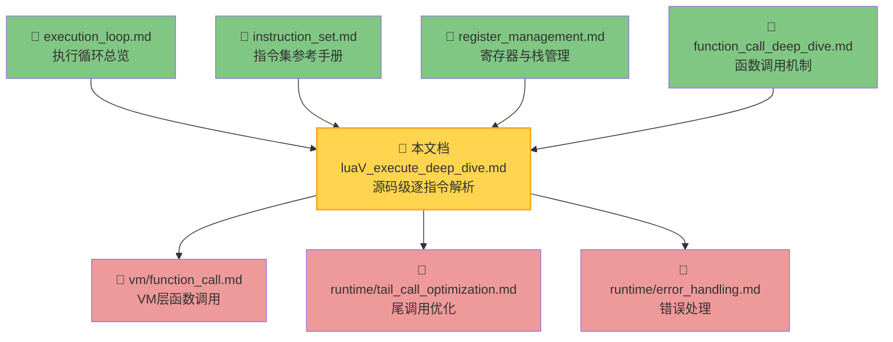
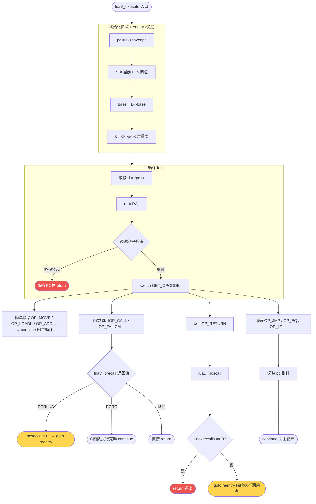
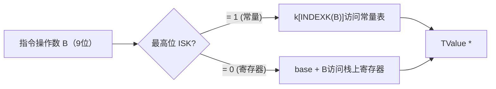
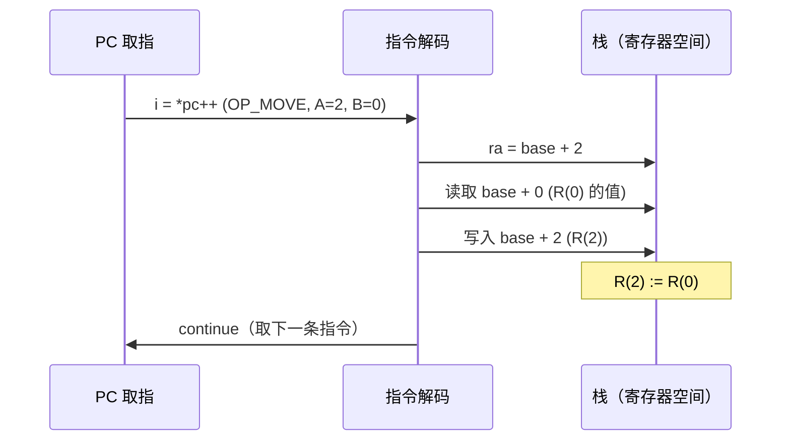
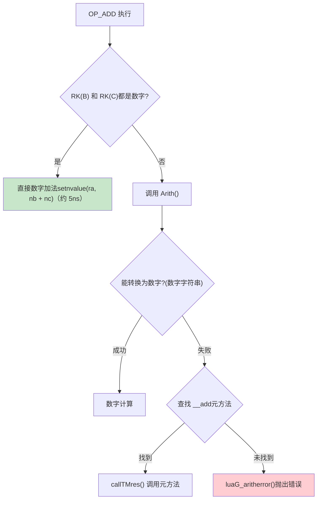
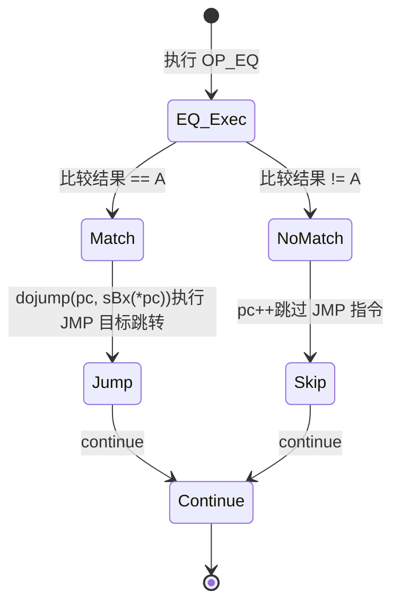
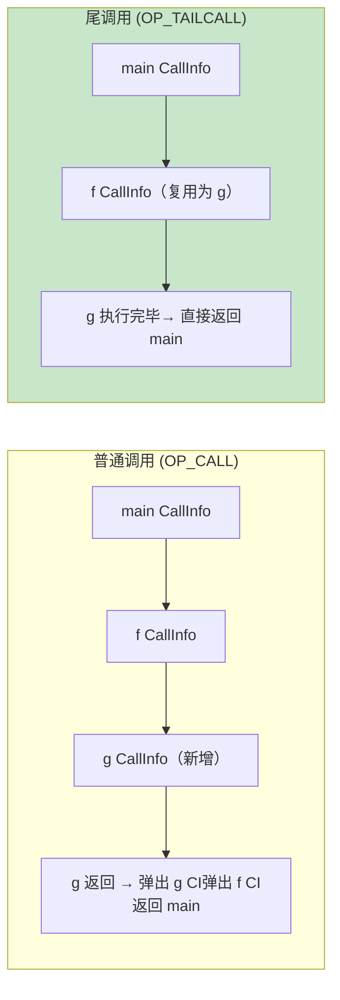

# 🔬 `luaV_execute` 深度剖析：Lua 虚拟机心脏解密

> **技术层级**：⭐⭐⭐⭐ — 面向中高级开发者，需要具备 Lua 函数调用机制和字节码基础  
> **预计阅读时间**：45-60 分钟  
> **源码文件**：`src/lvm.c`（第 1551 行起）

<div align="center">

**取指 · 译码 · 执行 · 跳转 · 重入**

[📋 概述](#-概述) · [🏗️ 整体架构](#️-整体架构) · [🔑 关键变量](#-关键变量详解) · [📐 指令解码宏](#-指令解码宏体系) · [⚙️ 指令执行详解](#️-典型指令执行详解) · [🔁 函数调用与返回](#-函数调用与返回的栈帧切换) · [🎯 尾调用优化](#-尾调用优化实现) · [🛡️ 特殊机制](#️-特殊机制) · [✅ 学习检查](#-学习检查清单)

</div>

---

## 🗺️ 阅读路径建议

本文档信息密度较高，建议根据实际目标选择阅读深度：

| 目标 | 推荐阅读章节 | 预计时间 |
|------|------------|----------|
| 🚀 **快速建立整体印象** | [2.0 压缩模型](#20-压缩执行模型先读这里) + [2.2 流程总览](#22-执行流程总览) | 10 分钟 |
| 🎯 **理解函数调用栈切换** | [2.0](#20-压缩执行模型先读这里) + [第 6 章](#-函数调用与返回的栈帧切换) + [7.1 尾调用](#71-op_tailcall--尾调用) | 20 分钟 |
| 🔐 **理解 Protect / 内存安全** | [3.4 Protect 宏](#34-protect-宏解决栈重分配问题) + [5.4 GETTABLE](#54-op_gettable--op_settable--表访问) | 15 分钟 |
| ⚡ **理解性能设计哲学** | [5.3 ADD 快速路径](#53-op_add--加法运算含类型分发) + [5.5 EQ 设计](#55-op_eq--op_lt--op_le--比较与条件跳转) + [7.1 尾调用](#71-op_tailcall--尾调用) | 20 分钟 |
| 🌐 **完整调用链追踪** | [第 10 章全流程案例](#-完整调用链追踪printadd12) | 30 分钟 |
| 🔬 **源码二次开发** | 完整通读，重点是 [3.3](#33-reentry-标签的含义) + [3.4](#34-protect-宏解决栈重分配问题) + [第 6 章](#-函数调用与返回的栈帧切换) | 60 分钟 |

> 💡 **首次阅读建议**：先读 **2.0**（建立框架锚点）→ **6.1**（搞清楚调用时发生了什么）→ **6.2**（搞清楚返回时发生了什么），再按需补充细节。

---

## 📋 概述

### 1.1 函数定位

`luaV_execute` 是 Lua 5.1 虚拟机的**核心执行引擎**，位于 `src/lvm.c` 第 1551 行。它是字节码的最终消费者——所有经过 `lparser.c` → `lcode.c` → `ldump.c` 编译链产生的字节码，最终都在这里被一条条解释执行。

```
Lua 源码
   ↓  llex.c (词法分析)
Token 流
   ↓  lparser.c (语法分析)
AST + 语义动作
   ↓  lcode.c (代码生成)
字节码 (Proto->code[])
   ↓  ldo.c → luaD_precall
   ↓  luaV_execute   ← 你现在所在的位置
执行结果
```

### 1.2 与其他文档的关系



**阅读前置条件**（至少掌握其中两项）：
- 📖 [function_call_deep_dive.md](../function/function_call_deep_dive.md) — 理解 `luaD_precall`/`luaD_poscall`
- 📖 [register_management.md](register_management.md) — 理解虚拟寄存器、`base`、`top`
- 📖 [instruction_set.md](instruction_set.md) — 理解 32 位指令格式与 RK 寻址

### 1.3 学习目标

完成本文档后，你将能够：

1. **逐行读懂** `luaV_execute` 的完整源码（约 300 行）
2. **理解** `reentry` / `goto reentry` 的设计意图和执行语义
3. **追踪** 一条简单 Lua 程序从 `OP_CALL` 到 `OP_RETURN` 的完整执行轨迹
4. **解释** `Protect` 宏解决了什么问题
5. **分析** 尾调用优化如何在不新增栈帧的情况下重用 CallInfo
6. **理解** 调试钩子（hook）如何以最小代价嵌入主循环

---

## 🏗️ 整体架构

### 2.0 压缩执行模型（先读这里）

在深入细节前，先建立一个**极简 mental model**——读完这一节，后续所有细节都会有"框架锚点"可以挂靠：

> **`luaV_execute` 本质 = 一层纵向循环（管理函数帧切换）包裹一层横向循环（逐条执行字节码）**

```
// 极简骨架伪代码
void luaV_execute(L, nexeccalls) {
reentry:
    cl/base/k/pc = 从 L 当前状态读取;   // 切换到当前活跃函数帧

    for (;;) {                          // ← 内层：横向，逐条执行指令
        i = *pc++;                      //   取指
        switch (opcode) {
            case OP_ADD:    执行; continue;              // 普通指令，继续取下一条
            case OP_CALL:   nexeccalls++; goto reentry;  // 进入被调函数（纵向深入）
            case OP_RETURN: if (--nexeccalls == 0) return;
                            else goto reentry;           // 返回调用者（纵向上升）
        }
    }
}
```

**两层循环的职责**：

```
外层（nexeccalls + goto reentry）  ←  控制「在哪个函数帧里」
内层（for(;;) + continue）         ←  控制「执行哪条指令」

纵向：OP_CALL 向下，OP_RETURN 向上
横向：每条 continue 向右推进 pc
```

**关键接力点**（内外两层的交汇）：

| 事件 | 内层动作 | 外层效果 |
|------|---------|----------|
| `OP_CALL`（Lua 函数） | `nexeccalls++; goto reentry` | 进入新帧，内层从头开始 |
| `OP_RETURN`（还有外层帧） | `nexeccalls--; goto reentry` | 回到调用者帧，内层从断点继续 |
| `OP_RETURN`（最外层帧） | `nexeccalls == 0; return` | 彻底退出 `luaV_execute` |
| `OP_TAILCALL` | 复用当前 CI，`goto reentry` | 不增加 `nexeccalls`，直接切换 |

---

### 2.1 函数签名与职责边界

```c
// src/lvm.c, line 1551
void luaV_execute(lua_State *L, int nexeccalls);
```

| 参数 | 类型 | 含义 |
|------|------|------|
| `L` | `lua_State *` | Lua 状态机，包含栈、CallInfo 链、全局状态 |
| `nexeccalls` | `int` | **本次进入 `luaV_execute` 时已经嵌套的 Lua→Lua 调用层数**。初次调用为 1；每次通过 `OP_CALL` 进入 Lua 函数时递增，`OP_RETURN` 时递减，归零时函数退出 |

**关键设计**：`nexeccalls` 让 `luaV_execute` 可以用**纵向循环**（`goto reentry`）代替**横向递归**，从而避免 C 调用栈的无限增长。这是 Lua 执行引擎的核心设计决策之一。

### 2.2 执行流程总览



### 2.3 两种"循环"的嵌套关系

`luaV_execute` 内部存在两层循环，理解它们的边界是读懂源码的关键：

```
┌─────────────────────────────────────────────────────────────┐
│  外层控制流：nexeccalls 计数器 + goto reentry               │
│                                                             │
│   每次 goto reentry 表示进入一个新的 Lua 函数帧           │
│   nexeccalls 递增；OP_RETURN 使 nexeccalls 递减           │
│   nexeccalls == 0 意味着我们执行完了最外层的 Lua 调用      │
│                                                             │
│  ┌──────────────────────────────────────────────────────┐  │
│  │  内层：for(;;) 主循环                                │  │
│  │                                                      │  │
│  │  每次迭代 = 执行一条字节码指令                       │  │
│  │  continue = 执行完当前指令，取下一条                 │  │
│  │  break（极少）= 运行时检查失败                       │  │
│  │  goto reentry = 进入新的 Lua 函数，重置所有局部变量  │  │
│  └──────────────────────────────────────────────────────┘  │
└─────────────────────────────────────────────────────────────┘
```

---

## 🔑 关键变量详解

### 3.1 执行状态变量声明

```c
// src/lvm.c, luaV_execute 函数体开头
void luaV_execute(lua_State *L, int nexeccalls) {
    LClosure *cl;          // 当前执行的 Lua 闭包（LClosure，非 CClosure）
    StkId base;            // 栈基址：R(0) 的位置，等价于 L->base
    TValue *k;             // 常量表指针：指向 cl->p->k（Proto 的常量数组）
    const Instruction *pc; // 程序计数器：指向下一条待执行指令
```

这 4 个变量是**虚拟机的"寄存器组"**，它们被 C 编译器尽量保留在 CPU 寄存器中，是执行效率的关键。

### 3.2 变量语义详解

在深入每个变量之前，先看一张**直觉类比表**——如果你有 C/汇编背景，这会节省大量理解时间：

| 变量 | CPU / OS 类比 | 特性 | 失效场景 |
|------|-------------|------|----------|
| `pc` | **程序计数器（IP/EIP/RIP）** | 指向下一条待取指令 | 不会失效（指向 `Proto->code[]`，固定内存） |
| `base` | **帧基址指针（EBP/RBP）** | 当前函数 `R(0)` 的绝对地址 | ⚠️ **栈重分配后必须刷新**，是最危险的变量 |
| `cl` | **当前函数描述符（符号表项）** | 只读静态元信息 | 不会失效，函数执行期间不变 |
| `k` | **只读常量段（.rodata）** | 函数的编译期常量数组 | 不会失效，随 `cl->p->k` 固定 |

> ⚠️ **只有 `base` 需要刷新**。凡是执行可能触发栈扩展的操作后，**必须用 `Protect` 重新读 `L->base`**。`pc`、`cl`、`k` 永远有效。

#### `cl` — 当前闭包

```c
cl = &clvalue(L->ci->func)->l;   // 从 CallInfo 的 func 位置取出 LClosure
```

`cl` 提供两类静态信息（编译期确定，运行时不变）：
- `cl->p`：函数原型（`Proto`），包含 `code[]`、`k[]`、`upvals[]`、`maxstacksize` 等
- `cl->upvals[]`：上值（upvalue）数组，OP_GETUPVAL/OP_SETUPVAL 通过它访问闭包变量
- `cl->env`：函数的环境表（全局变量表），OP_GETGLOBAL/OP_SETGLOBAL 使用它

#### `base` — 栈基址

```
      func     R(0)   R(1)   R(2)   ...   R(maxstack-1)
        ↓        ↓      ↓      ↓               ↓
┌─────┬──────┬──────┬──────┬──────┬───────────────────┐
│     │ func │ arg0 │ arg1 │ loc1 │  ...  空间预留     │
└─────┴──────┴──────┴──────┴──────┴───────────────────┘
              ↑
            base（L->base）

R(i) = base + i
```

> ⚠️ **`base` 何时会失效？**
> 当调用任何可能导致**栈重分配**的操作（如 `luaD_call`、`luaH_new` 触发 GC 等），`L->base` 可能被更新指向新的内存地址，而局部变量 `base` 仍持有旧地址。这就是 `Protect` 宏存在的原因（见 [3.4 节](#34-protect-宏——解决栈重分配问题)）。

#### `k` — 常量表

```c
k = cl->p->k;   // Proto->k: 编译时确定的常量数组
```

每个函数原型都有独立的常量表。RK 操作数中，当最高位为 1（`ISK(x)` 为真）时，操作数指向 `k[INDEXK(x)]`；否则指向 `base + x`（寄存器）。

```c
// RK 寻址的本质（RKB/RKC 宏展开后）：
#define RKB(i) (ISK(GETARG_B(i)) ? k + INDEXK(GETARG_B(i)) : base + GETARG_B(i))
//              ↑ 高位为1：访问常量表          ↑ 高位为0：访问寄存器
```

#### `pc` — 程序计数器

```c
pc = L->savedpc;   // 从 CallInfo 恢复 PC
// ...
const Instruction i = *pc++;  // 取指并自动推进 PC
```

`pc` 是纯粹的 C 局部变量，在正常执行时不写回 `L->savedpc`。只有在**可能抛出异常或触发钩子**的操作前，才需要把 `pc` 同步到 `L->savedpc`（这样 GC 和错误处理才能看到正确的位置）。

### 3.3 `reentry` 标签的含义

```c
reentry:
    lua_assert(isLua(L->ci));
    pc    = L->savedpc;     // ← 从 CallInfo 读取 PC（可能是全新函数，也可能是恢复）
    cl    = &clvalue(L->ci->func)->l;
    base  = L->base;
    k     = cl->p->k;
```

每次 `goto reentry`，4 个关键变量都从 `L` 的当前状态**重新初始化**，相当于"重新进入当前活跃栈帧"。这发生在两种场景：

| 场景 | 触发方式 | 说明 |
|------|----------|------|
| 调用 Lua 函数 | `OP_CALL` 返回 `PCRLUA` | `luaD_precall` 已经设置好新栈帧，`reentry` 切换到新函数 |
| 尾调用 | `OP_TAILCALL` 返回 `PCRLUA` | 复用当前 CallInfo，`reentry` 切换到被调用函数 |
| 函数返回 | `OP_RETURN` 后 `nexeccalls > 0` | `luaD_poscall` 恢复调用者 CallInfo，`reentry` 回到调用者 |

### 3.4 `Protect` 宏——解决栈重分配问题

```c
// src/lvm.c, 执行宏定义区
#define Protect(x) { L->savedpc = pc; {x;}; base = L->base; }
```

`Protect` 做了三件事：

1. **`L->savedpc = pc`**：将当前 PC 写回状态机，确保异常时 GC/调试器看到正确位置
2. **`{x;}`**：执行可能触发栈重分配的操作（如元方法调用、GC、`luaV_gettable` 等）
3. **`base = L->base`**：重新读取 `L->base`，因为栈可能已经被重新分配到新地址

**不使用 `Protect` 的后果——内存地址视角**：

```
场景：luaV_gettable 触发了 __index 元方法 → luaD_call → 检查栈容量 → 扩展栈

扩展前：
  Lua 栈在内存的地址：0x1000
  L->base               = 0x1010   (R(0) = 栈地址 + 偏移)
  base (C 局部变量)     = 0x1010   ← 与 L->base 一致，安全

调用 luaV_gettable(...) 期间，Lua 内部 realloc 扩展栈：
  旧地址 0x1000 被 free()
  新地址 0x2000 = realloc(...)
  L->base 被 restorestack 修正 = 0x2010   ← Lua 内部已更新

  base (C 局部变量)     = 0x1010   ← ❌ 仍然是已释放的旧地址！

❌ 后果：
  ra = base + A = 0x1010 + ...  → 访问已释放内存
  setobjs2s(L, ra, base + 3)    → 写入已释放内存 → 内存崩溃

✅ Protect 的修复（base = L->base 这一步是关键）：
  { L->savedpc = pc; luaV_gettable(...); base = L->base; }
                                             ↑ base = 0x2010，与 L 同步，安全
```

```c
// ❌ 错误示例：栈扩展后 base 变成悬空指针
luaV_gettable(L, RB(i), RKC(i), ra);  // 如果触发了 rehash，L->base 已变化
setobjs2s(L, ra, base + 3);           // base 是旧地址，导致访问野指针！

// ✅ 正确：使用 Protect 包裹
Protect(luaV_gettable(L, RB(i), RKC(i), ra));
// 展开后：{ L->savedpc = pc; luaV_gettable(L, ...); base = L->base; }
//                                                    ↑ 关键：同步新 base
```

**哪些指令需要 `Protect`？快速判断法则**：

```
需要 Protect：凡是操作可能间接调用 luaD_call 或 luaG_* 的
不需要 Protect：纯粹读写栈上已有 TValue，不调用任何外部函数

典型示例：
  OP_MOVE       → 不需要（只是 setobjs2s）
  OP_ADD（数字）→ 不需要（只是 setnvalue）
  OP_ADD（非数字）→ 需要（Arith 内部调用元方法 → luaD_call）
  OP_GETTABLE   → 需要（luaV_gettable 可能调用 __index）
  OP_NEWTABLE   → 后面的 GC 检查需要（luaC_checkGC 可能触发 GC）
```

---

## 📐 指令解码宏体系

### 4.1 指令格式回顾

```
32位指令字：
┌──────────┬──────────┬─────────────┬─────────────┐
│  OP码    │    A     │      C      │      B      │
│  6 bits  │  8 bits  │   9 bits    │   9 bits    │
└──────────┴──────────┴─────────────┴─────────────┘
```

### 4.2 操作数访问宏一览

| 宏 | 展开形式 | 含义 | 使用场景 |
|----|----------|------|---------|
| `RA(i)` | `base + GETARG_A(i)` | **寄存器 A**（目标寄存器） | 几乎所有指令 |
| `RB(i)` | `base + GETARG_B(i)` | **寄存器 B**（源寄存器） | 只有操作数 B 是纯寄存器时 |
| `RC(i)` | `base + GETARG_C(i)` | **寄存器 C**（源寄存器） | 只有操作数 C 是纯寄存器时 |
| `RKB(i)` | 见下方 | **寄存器或常量 B** | 算术/比较指令（B 可以是 K） |
| `RKC(i)` | 见下方 | **寄存器或常量 C** | 算术/比较指令（C 可以是 K） |
| `KBx(i)` | `k + GETARG_Bx(i)` | **常量表项**（大索引） | OP_LOADK、OP_GETGLOBAL |

**RK 寻址的实现逻辑**：

```c
#define ISK(x)      ((x) & BITRK)           // 检查最高位是否为 1
#define INDEXK(x)   ((int)(x) & ~BITRK)     // 去掉最高位，得到常量索引

// RKB 展开：
#define RKB(i) \
    (ISK(GETARG_B(i))                        \
     ? k + INDEXK(GETARG_B(i))              /* 最高位=1：访问常量表 */  \
     : base + GETARG_B(i))                  /* 最高位=0：访问寄存器 */
```

**决策流程**：



### 4.3 `dojump` 宏

```c
#define dojump(L, pc, i)  { (pc) += (i); luai_threadyield(L); }
```

- `(pc) += (i)`：相对跳转，`i` 是有符号偏移（sBx 字段 - MAXARG_sBx 解码而得）
- `luai_threadyield(L)`：在支持抢占式协程的平台上让出 CPU（默认为空操作）

> 📌 **注意**：`dojump` 之后没有 `continue`，需要调用处自己决定控制流（大多数比较指令在 `dojump` 后紧跟 `pc++; continue;`）。

---

## ⚙️ 典型指令执行详解

### 5.1 `OP_MOVE` — 寄存器间复制

**指令格式**：`iABC`，语义 `R(A) := R(B)`

```c
case OP_MOVE: {
    setobjs2s(L, ra, RB(i));
    continue;
}
```

**执行流程**：



`setobjs2s` 是带写屏障提示的赋值宏（`s` 表示目的是栈上位置，`s` 表示源也是栈上）。此指令**不需要 `Protect`**，因为它不可能触发 GC 或栈扩展。

---

### 5.2 `OP_LOADK` — 加载常量

**指令格式**：`iABx`，语义 `R(A) := K(Bx)`

```c
case OP_LOADK: {
    setobj2s(L, ra, KBx(i));
    continue;
}
```

`KBx(i)` 展开为 `k + GETARG_Bx(i)`，即直接从常量表取值。同样**无需 `Protect`**。

**示例**（Lua `local x = 3.14`）：

```
指令：LOADK  R(0), K(0)    ; 其中 K(0) 是常量 3.14
执行：base[0] = k[0]        ; k[0].type=LUA_TNUMBER, k[0].value=3.14
```

---

### 5.3 `OP_ADD` — 加法运算（含类型分发）

**指令格式**：`iABC`，语义 `R(A) := RK(B) + RK(C)`

```c
case OP_ADD: {
    arith_op(luai_numadd, TM_ADD);
    continue;
}
```

`arith_op` 宏展开后的完整逻辑：

```c
// arith_op(luai_numadd, TM_ADD) 展开：
{
    TValue *rb = RKB(i);   // 取操作数 B（寄存器或常量）
    TValue *rc = RKC(i);   // 取操作数 C（寄存器或常量）
    if (ttisnumber(rb) && ttisnumber(rc)) {
        // ✅ 快速路径：两个操作数都是数字，直接计算
        lua_Number nb = nvalue(rb), nc = nvalue(rc);
        setnvalue(ra, luai_numadd(nb, nc));     // ra = nb + nc
    } else {
        // 🔀 慢速路径：至少有一个非数字，尝试类型转换或调用 __add 元方法
        Protect(Arith(L, ra, rb, rc, TM_ADD));
    }
}
```

**类型分发决策树**：



---

### 5.4 `OP_GETTABLE` / `OP_SETTABLE` — 表访问

**OP_GETTABLE**：`iABC`，语义 `R(A) := R(B)[RK(C)]`

```c
case OP_GETTABLE: {
    Protect(luaV_gettable(L, RB(i), RKC(i), ra));
    continue;
}
```

> ⚠️ **必须用 `Protect`**：`luaV_gettable` 可能调用 `__index` 元方法（`luaD_call` → 可能触发 GC → 栈重分配）。

`luaV_gettable` 的简化逻辑（支持 `__index` 链）：

```c
void luaV_gettable(lua_State *L, const TValue *t, TValue *key, StkId val) {
    int loop;
    for (loop = 0; loop < MAXTAGLOOP; loop++) {  // 最多 100 次，防止无限链
        if (ttistable(t)) {
            const TValue *res = luaH_get(hvalue(t), key);  // 原始表查找
            if (!ttisnil(res)) {               // 找到值
                setobj2s(L, val, res);
                return;
            }
            // 值为 nil，检查 __index 元方法
            const TValue *tm = fasttm(L, hvalue(t)->metatable, TM_INDEX);
            if (tm == NULL) { setobj2s(L, val, res); return; }  // 没有元方法，返回 nil
            if (ttisfunction(tm)) { callTMres(L, val, tm, t, key); return; }
            t = tm;  // __index 是表，继续查找
        }
        // ...非表类型的 __index 处理
    }
    luaG_runerror(L, "loop in gettable");  // 超过 100 次迭代
}
```

---

### 5.5 `OP_EQ` / `OP_LT` / `OP_LE` — 比较与条件跳转

**特殊设计**：Lua 的比较指令不直接跳转，而是与紧随其后的 `OP_JMP` 配合使用。

**OP_EQ** 格式：`iABC`，语义 `if (RK(B) == RK(C)) ~= A then pc++`

```c
case OP_EQ: {
    TValue *rb = RKB(i);
    TValue *rc = RKC(i);
    Protect(
        if (equalobj(L, rb, rc) == GETARG_A(i))  // 比较结果与 A 匹配时跳转
            dojump(L, pc, GETARG_sBx(*pc));        // 执行下一条（JMP）的跳转
    )
    pc++;    // 跳过 JMP 指令（不执行跳转）
    continue;
}
```

**执行流程**：

```
字节码序列：
  [N]   EQ    0, R(0), K(1)    ; if R(0) == K(1) (即 A=0 时不跳转)
  [N+1] JMP   offset            ; 若上面条件成立，跳转 offset

执行 EQ 时：
  - 计算 equalobj(rb, rc)
  - 结果 == GETARG_A(i)?
      是 → dojump，PC += offset（跳过若干指令）
      否 → pc++（跳过 JMP），然后 continue（顺序执行）
```

**状态转换**：



> **设计哲学思考**：Lua 为何让比较指令"不直接跳转"？
>
> | 角度 | 说明 |
> |------|------|
> | **统一跳转逻辑** | 所有条件跳转最终都由 `OP_JMP` 负责，偏移量只需编码一处，减少指令集复杂度 |
> | **减少 opcode 数量** | 若 EQ 自带跳转，则需 6 条指令：`JEQ/JNE/JLT/JGE/JLE/JGT`；现在只需 3 条比较 + 1 条 JMP |
> | **A 字段编码 `==/~=`** | `A=0` 表示"相等时跳"，`A=1` 表示"不等时跳"，同一 opcode 同时实现了 `==` 和 `~=`，省掉一条指令 |
> | **CPU 分支预测友好** | EQ+JMP 作为固定 2 指令组合，现代 JIT 可以识别并整体优化，而不必处理复杂的内嵌跳转语义 |

---

### 5.6 `OP_FORPREP` / `OP_FORLOOP` — 数值 for 循环

```lua
-- Lua 源码
for i = 1, 10, 2 do
    print(i)
end
```

```
字节码：
  FORPREP  R(0), offset   ; 预处理：R(0)=初始值-步长, R(1)=限制, R(2)=步长, 跳转到 FORLOOP
  [循环体 ...]
  FORLOOP  R(0), -offset  ; 检查并更新：R(0)+=步长, R(3)=R(0), 若满足条件则跳回循环体
```

**OP_FORPREP** 的工作：

```c
case OP_FORPREP: {
    // ra+0 = 初始值, ra+1 = 限制, ra+2 = 步长
    // 预处理：将初始值减去步长，这样 FORLOOP 第一次执行时加回来得到正确初始值
    setnvalue(ra, luai_numsub(nvalue(ra), nvalue(pstep)));
    dojump(L, pc, GETARG_sBx(i));  // 跳转到 FORLOOP位置
    continue;
}
```

**OP_FORLOOP** 的工作：

```c
case OP_FORLOOP: {
    lua_Number step  = nvalue(ra + 2);
    lua_Number idx   = luai_numadd(nvalue(ra), step);   // 当前值 + 步长
    lua_Number limit = nvalue(ra + 1);

    // 判断循环是否继续（正步长和负步长的判断方向相反）
    if (luai_numlt(0, step) ? luai_numle(idx, limit)
                            : luai_numle(limit, idx)) {
        dojump(L, pc, GETARG_sBx(i));   // 满足条件，跳回循环体
        setnvalue(ra,     idx);           // 更新内部计数器
        setnvalue(ra + 3, idx);           // 更新循环变量（供用户代码访问）
    }
    // 不满足则 continue，退出循环
    continue;
}
```

**for 循环的寄存器布局**：

```
R(A)   = 内部计数器（for 循环控制变量，不直接暴露给用户）
R(A+1) = 限制值
R(A+2) = 步长
R(A+3) = 循环变量（用户代码中的 i，每次迭代从 R(A) 复制）
```

---

## 🔁 函数调用与返回的栈帧切换

### 6.1 `OP_CALL` — 普通函数调用

**指令格式**：`iABC`，语义 `R(A), ..., R(A+C-2) := R(A)(R(A+1), ..., R(A+B-1))`

```c
case OP_CALL: {
    int b = GETARG_B(i);          // 参数数量编码（0=可变）
    int nresults = GETARG_C(i) - 1;  // 期望返回值数量（-1=全部）

    // 设置正确的 top：B≠0 表示固定参数数量
    if (b != 0) L->top = ra + b;   // ra=函数位置，ra+1..ra+b-1=参数

    L->savedpc = pc;   // 将 PC 写回，以便 precall 可能触发 GC 时位置正确

    switch (luaD_precall(L, ra, nresults)) {
        case PCRLUA: {
            // 调用的是 Lua 函数：luaD_precall 已经创建了新的 CallInfo 和栈帧
            nexeccalls++;
            goto reentry;  // 跳转到 reentry，重新初始化 cl/base/k/pc，在新框架内执行
        }
        case PCRC: {
            // 调用的是 C 函数：luaD_precall 已经执行完毕并返回
            if (nresults >= 0) L->top = L->ci->top;  // 调整栈顶
            base = L->base;   // C 函数可能触发了栈重分配，刷新 base
            continue;         // 继续当前 Lua 函数的执行
        }
        default: {
            return;  // 协程挂起或其他特殊情况
        }
    }
}
```

**调用栈变化可视化**：

```
调用前（准备阶段）：
┌──────┬──────┬──────┬──────┬──────┐
│      │ func │ arg1 │ arg2 │      │  ← L->top
└──────┴──────┴──────┴──────┴──────┘
        ↑ ra (R(A))
        base = 调用者函数的 base

OP_CALL 执行后（PCRLUA 分支）：
luaD_precall 已调整：
  新 L->ci = 下一个 CallInfo
  新 L->base = ra + 1（func 的下一个位置）
  新 L->top = L->base + 被调函数的 maxstacksize

执行 goto reentry 后，变量被重新初始化：
  cl   → 新函数的闭包
  base → 新的 L->base（指向被调函数的 R(0)）
  k    → 新函数的常量表
  pc   → 新函数的第一条指令（L->savedpc）

┌──────┬──────┬──────┬──────┬──────┬──────┬──────┐
│      │ func │ arg1 │ arg2 │      │      │      │
└──────┴──────┴──────┴──────┴──────┴──────┴──────┘
        ↑ 旧 CallInfo.func            ↑ 新 L->top
               ↑ 新 base = L->base（新函数的 R(0)）
```

---

### 6.2 `OP_RETURN` — 函数返回

**指令格式**：`iAB`，语义 `return R(A), ..., R(A+B-2)`（B=0 表示返回 `A` 到 `top`）

```c
case OP_RETURN: {
    int b = GETARG_B(i);

    // 确定返回值范围：B-1 个返回值，从 ra 开始
    if (b != 0) L->top = ra + b - 1;   // B≠0：固定返回值数量

    // 关闭本函数内的所有开放上值（upvalue）
    if (L->openupval) luaF_close(L, base);

    L->savedpc = pc;   // 保存 PC（用于调试和 GC）

    // 执行返回：复制返回值，恢复调用者的 CallInfo
    b = luaD_poscall(L, ra);

    // nexeccalls 递减：如果变为 0，说明我们完成了最外层的 Lua 调用
    if (--nexeccalls == 0) {
        return;   // 完全退出 luaV_execute
    } else {
        // 还有外层 Lua 帧，返回到调用者继续执行
        if (b) L->top = L->ci->top;   // 调整栈顶（固定返回值数量时）
        lua_assert(isLua(L->ci));
        lua_assert(GET_OPCODE(*((L->ci)->savedpc - 1)) == OP_CALL);
        goto reentry;   // 返回到调用者的执行流程
    }
}
```

**`luaD_poscall` 完成的工作**（简化）：

```
1. 调用返回钩子（如果设置了 LUA_MASKRET）
2. res = ci->func（返回值将写到这里，即函数对象的位置）
3. 将 ra 开始的 nresults 个值复制到 res 开始的位置
4. 不足 nresults 时填充 nil
5. L->top = res + wanted（调整栈顶）
6. L->base = (L->ci - 1)->base（恢复调用者的 base）
7. L->ci--（弹出当前 CallInfo）
```

**栈变化可视化**：

```
OP_RETURN 前：
┌──────┬──────┬──────┬──────┬──────┐
│      │ func │ ret1 │ ret2 │      │
└──────┴──────┴──────┴──────┴──────┘
        ↑ ci->func         ↑ L->top（ra 设定后）
               ↑ ra（第一个返回值）

luaD_poscall 后：
┌──────┬──────┬──────┬──────┐
│      │ ret1 │ ret2 │      │
└──────┴──────┴──────┴──────┘
        ↑ 原来的 ci->func 位置    ↑ 新 L->top
  （返回值覆盖了函数对象位置）
```

---

## 🎯 尾调用优化实现

### 7.1 `OP_TAILCALL` — 尾调用

尾调用（tail call）是最后一个动作为函数调用的函数，可以优化为**不新增 C 调用栈帧**。

```c
case OP_TAILCALL: {
    int b = GETARG_B(i);
    if (b != 0) L->top = ra + b;      // 设置参数范围
    L->savedpc = pc;
    lua_assert(GETARG_C(i) - 1 == LUA_MULTRET);   // 尾调用总是返回全部值

    switch (luaD_precall(L, ra, LUA_MULTRET)) {
        case PCRLUA: {
            // 🔑 关键优化：手动复制参数，复用当前 CallInfo
            CallInfo *ci  = L->ci - 1;     // 当前函数的 CallInfo（调用者视角）
            StkId func    = ci->func;      // 当前函数自己的 func 位置（将被覆盖）
            StkId pfunc   = (ci + 1)->func;  // 被调函数的 func 位置

            // 关闭本函数的所有上值（因为本函数即将消亡）
            if (L->openupval) luaF_close(L, ci->base);

            // 调整 base：相当于把被调函数的参数"移"到当前帧的位置
            L->base = ci->base = ci->func + ((ci+1)->base - pfunc);

            // 将被调函数的参数从新帧复制到当前帧
            for (aux = 0; pfunc + aux < L->top; aux++)
                setobjs2s(L, func + aux, pfunc + aux);

            // 收缩栈顶
            ci->top = L->top = func + aux;
            ci->savedpc = L->savedpc;
            ci->tailcalls++;   // 调试信息：记录尾调用次数
            L->ci--;           // 弹出被调函数的（新的）CallInfo

            goto reentry;   // 重入，执行被调函数
        }
        case PCRC: {
            base = L->base;
            continue;
        }
        default: return;
    }
}
```

**尾调用 vs 普通调用的对比**：



**递归深度对比——具体数字**：

```lua
-- 测试函数：递归 n 次
function f(n)
    if n == 0 then return 0 end
    return f(n - 1)          -- 普通调用：return f(n-1)
    -- 若改为尾调用：return f(n-1) 且 f 是函数体最后操作
end
```

```
普通递归 f(5) 的 CallInfo 栈深度：
  CallInfo[0]: main
  CallInfo[1]: f(5)
  CallInfo[2]: f(4)
  CallInfo[3]: f(3)
  CallInfo[4]: f(2)
  CallInfo[5]: f(1)
  CallInfo[6]: f(0)   ← 最深处，共 n+1 个 CallInfo

  f(10000) → 需要 10001 个 CallInfo，容易导致栈溢出

尾调用递归（OP_TAILCALL）f(5) 的 CallInfo 栈深度：
  CallInfo[0]: main
  CallInfo[1]: f（被复用，始终只有这一个）← 深度永远是 1

  f(10000) → 仍然只有 1 个活动 CallInfo，永不溢出
  nexeccalls 不递增（goto reentry 而非 luaD_call），
  真正实现 O(1) 空间的递归！
```

> **Lua 5.1 的限制**：只有**严格尾位置**（函数体最后一个 `return f(...)` 且中间无临时值需要保留）才能触发 OP_TAILCALL。`return f(n-1) + 1` 不是尾调用，因为加法需要等 f(n-1) 返回后才能计算。

---

## 🛡️ 特殊机制

### 8.1 调试钩子的嵌入

```c
// 主循环开头，每条指令都会经过这里
if ((L->hookmask & (LUA_MASKLINE | LUA_MASKCOUNT)) &&
    (--L->hookcount == 0 || L->hookmask & LUA_MASKLINE)) {

    traceexec(L, pc);

    if (L->status == LUA_YIELD) {   // 钩子可能触发协程挂起
        L->savedpc = pc - 1;        // 回退一条指令（让协程恢复时重新执行）
        return;
    }
    base = L->base;   // 钩子可能重引发 GC，刷新 base
}
```

**性能代价**：即使没有设置钩子，这段代码也会每条指令执行一次（检查 `L->hookmask`）。这是 Lua 在调试支持和执行性能之间的取舍——`hookmask` 为零时，整个 `if` 块被短路（现代 CPU 分支预测效果极好）。

### 8.2 `OP_VARARG` — 可变参数加载

```c
case OP_VARARG: {
    int b = GETARG_B(i) - 1;         // 需要的参数数量（-1 表示全部）
    int j;
    CallInfo *ci = L->ci;
    // 实际传入的可变参数数量
    int n = cast_int(ci->base - ci->func) - cl->p->numparams - 1;

    if (b == LUA_MULTRET) {          // b == -1：返回全部可变参数
        Protect(luaD_checkstack(L, n));
        ra = RA(i);                  // 刷新 ra（栈可能已扩展）
        b = n;
        L->top = ra + n;             // 调整 top
    }

    // 将可变参数复制到当前寄存器
    for (j = 0; j < b; j++) {
        if (j < n) {
            setobjs2s(L, ra + j, ci->base - n + j);   // 从可变参数区复制
        } else {
            setnilvalue(ra + j);   // 不足时用 nil 填充
        }
    }
    continue;
}
```

> 📌 可变参数存储在 `ci->func` 和 `ci->base` 之间（即函数对象和 `R(0)` 之间），这是 `luaD_precall` 的 `adjust_varargs` 处理可变参数时设置的。

**可变参数完整帧布局**（调用 `function f(a, b, ...) end` 传入 `f(1,2,3,4,5)` 时）：

```
低地址 ───────────────────────────────────────── 高地址
                                                  L->top
  ┌───────────┬────┬────┬────┬────┬────┬────┬────┐
  │ ci->func  │ 1  │ 2  │ 3  │ 4  │ 5  │ R0 │ R1 │ ...
  │ (Closure) │ a  │ b  │ va │ ra │ rg │    │    │
  └───────────┴────┴────┴────┴────┴────┴────┴────┘
       ↑         ├────────────┤  ↑   ├──────────────
   ci->func      固定参数区      ci->base = L->base
                              可变参数区           寄存器区（局部变量）
                 (a=1, b=2)   (3, 4, 5)           R(0)=nil, R(1)=nil...

关键字段：
  ci->func          → 指向 Closure 对象在栈上的槽
  ci->base          → 指向第一个固定参数之后的位置（即 R(0)）
  ci->base - ci->func - 1           → 固定参数数量 + 可变参数数量（总传入数）
  ci->base - cl->p->numparams - 1   → 实际可变参数数量（n）

OP_VARARG 从 (ci->base - n + j) 位置复制：
  j=0 → ci->base - 3 + 0 = vararg[0] = 3
  j=1 → ci->base - 3 + 1 = vararg[1] = 4
  j=2 → ci->base - 3 + 2 = vararg[2] = 5
```

### 8.3 `OP_CLOSURE` — 闭包创建

```c
case OP_CLOSURE: {
    Proto *p = cl->p->p[GETARG_Bx(i)];    // 内嵌函数原型
    int nup = p->nups;                     // 需要的上值数量
    Closure *ncl = luaF_newLclosure(L, nup, cl->env);
    ncl->l.p = p;

    // 紧随 OP_CLOSURE 的 nup 条伪指令用于描述每个上值的来源
    for (j = 0; j < nup; j++, pc++) {
        if (GET_OPCODE(*pc) == OP_GETUPVAL) {
            // 上值来自外层函数的上值，直接共享
            ncl->l.upvals[j] = cl->upvals[GETARG_B(*pc)];
        } else {
            lua_assert(GET_OPCODE(*pc) == OP_MOVE);
            // 上值来自当前函数的局部变量，需要 findupval 创建 UpVal 对象
            ncl->l.upvals[j] = luaF_findupval(L, base + GETARG_B(*pc));
        }
    }

    setclvalue(L, ra, ncl);
    Protect(luaC_checkGC(L));   // 新对象可能触发 GC
    continue;
}
```

---

## 📊 执行追踪实战：`1 + 2` 的完整生命周期

### 9.1 Lua 源码

```lua
local a = 1
local b = 2
local c = a + b
return c
```

### 9.2 字节码（`luac -l` 输出）

```
; function <test.lua:1,4>
1  [1]  LOADK      0 -1    ; 1        → R(0) = 1
2  [2]  LOADK      1 -2    ; 2        → R(1) = 2
3  [3]  ADD        2 0 1               → R(2) = R(0) + R(1)
4  [4]  RETURN     2 2                 → return R(2)
5  [4]  RETURN     0 1                 → (防御性返回)
```

### 9.3 `luaV_execute` 执行轨迹

```
初始状态（reentry 后）：
  cl   = 主函数闭包
  pc   = &code[0]
  base = L->base（R(0) 位置）
  k    = { 1.0, 2.0 }

━━━━━━━━━━━━━━━━━━━━━━━━━━━━━━━━━━━━━━━━
指令1：LOADK  0, -1
  i = LOADK, A=0, Bx=0（常量索引0）
  ra = base + 0 = R(0)
  setobj2s(L, ra, k+0)  → R(0) = 1.0
  continue

指令2：LOADK  1, -2
  ra = base + 1 = R(1)
  setobj2s(L, ra, k+1)  → R(1) = 2.0
  continue

指令3：ADD  2, 0, 1
  ra = base + 2 = R(2)
  rb = RKB(i) = base + 0 = R(0) = 1.0  [非常量，最高位=0]
  rc = RKC(i) = base + 1 = R(1) = 2.0  [非常量，最高位=0]
  ttisnumber(rb)=true, ttisnumber(rc)=true → 快速路径
  setnvalue(ra, 1.0 + 2.0)  → R(2) = 3.0
  continue

指令4：RETURN  2, 2
  b = GETARG_B(i) = 2
  L->top = ra + 2 - 1 = base + 2 + 1 = &R(2) 的下一个位置
  luaD_poscall(L, ra=base+2)  → 复制 R(2)=3.0 到调用者期望的位置
  --nexeccalls → 变为 0
  return  (退出 luaV_execute)
━━━━━━━━━━━━━━━━━━━━━━━━━━━━━━━━━━━━━━━━
```

### 9.4 栈状态逐步演变

```
初始：        LOADK1后：    LOADK2后：    ADD后：       RETURN前：
┌──────┐     ┌──────┐     ┌──────┐     ┌──────┐     ┌──────┐
│      │base │  1.0 │base │  1.0 │base │  1.0 │base │  1.0 │base
├──────┤     ├──────┤     ├──────┤     ├──────┤     ├──────┤
│      │     │      │     │  2.0 │     │  2.0 │     │  2.0 │
├──────┤     ├──────┤     ├──────┤     ├──────┤     ├──────┤
│      │     │      │     │      │     │  3.0 │←top │  3.0 │←top
└──────┘     └──────┘     └──────┘     └──────┘     └──────┘
R(0)=?       R(0)=1.0     R(1)=2.0     R(2)=3.0
```

---

## 🔬 完整调用链追踪：`print(add(1, 2))`

> **目标**：从头到尾追踪 `print(add(1,2))` 在 `luaV_execute` 中的所有关键步骤，展示 `goto reentry`、栈帧切换和 `nexeccalls` 的真实工作方式。

### Lua 源码与生成字节码

```lua
-- test.lua
local function add(a, b)
    return a + b
end
print(add(1, 2))
```

```
-- add 函数的字节码（Proto sub-function）
0: ADD      R(2), R(0), R(1)    ; R(2) = a + b
1: RETURN   R(2), 2              ; return R(2),（1 个返回值）

-- main chunk 的字节码
0: CLOSURE  R(0), 0              ; R(0) = closure(add)
1: GETGLOBAL R(1), K("print")   ; R(1) = print
2: MOVE     R(2), R(0)           ; R(2) = add（第 1 个参数）
3: LOADK    R(3), K(1)           ; R(3) = 1（第 2 个参数）
4: LOADK    R(4), K(2)           ; R(4) = 2（第 3 个参数）
5: CALL     R(2), 3, 2           ; add(1,2) → 1个返回值放回 R(2)
6: CALL     R(1), 2, 1           ; print(R(2)) → 0个返回值
7: RETURN   R(0), 1              ; return（结束 main chunk）
```

### 逐步追踪

#### Step 0：进入 `luaV_execute`——执行 main chunk

```
luaV_execute(L, 1)   ← nexeccalls = 1（1 个 Lua 层）
  cl  = main_closure
  k   = main_closure->p->k[]
  base= L->base = 栈基址（设为 0x1000）
  pc  = main_closure->p->code[0]

外层 while 循环：nexeccalls(1) > 0 → 继续
内层 for 循环开始
```

#### Step 1：执行 `CLOSURE R(0), 0`

```
  → 创建 add 的 Closure 对象
  → setclvalue(L, base+0, new_closure)
  → R(0) = add_closure

  nexeccalls, base, pc 不变
```

#### Step 2–4：执行 `GETGLOBAL`、`MOVE`、`LOADK`×2

```
  R(1) = print（C 函数）
  R(2) = R(0) = add_closure
  R(3) = 1.0
  R(4) = 2.0

栈布局（此时）：
  [0x1000] main_func
  [0x1008] R(0) = add_closure
  [0x1010] R(1) = print
  [0x1018] R(2) = add_closure   ← 即将作为 add 的 func 槽
  [0x1020] R(3) = 1.0           ← 参数 a
  [0x1028] R(4) = 2.0           ← 参数 b
```

#### Step 5：执行 `CALL R(2), 3, 2`——调用 add(1,2)

```
OP_CALL 处理（在 lvm.c 中）：
  nresults = GETARG_C(i) - 1 = 1
  luaD_precall(L, base+2, 1)
    → 识别为 Lua 函数（LClosure）
    → L->ci 新增一个 CallInfo
    → L->base = base+2+1 = 0x1018+8 = 0x1020（跳过 func 槽）
    → 返回 PCRLUA（告知是 Lua 函数调用）

  nexeccalls++ → nexeccalls = 2  ← 深度增加
  goto reentry                   ← 不递归，直接跳到循环顶部
```

#### Step 6：`reentry`——切换到 add 函数

```
reentry:
  cl  = add_closure              ← 已由 luaD_precall 设置
  k   = add_closure->p->k[]
  base= L->base = 0x1020         ← 指向 a 的位置
  pc  = add_closure->p->code[0]

栈布局（此时）：
  [0x1018] ci->func = add_closure
  [0x1020] R(0) = a = 1.0       ← 对应 base+0
  [0x1028] R(1) = b = 2.0       ← 对应 base+1
  L->top = 0x1030
```

#### Step 7：执行 `ADD R(2), R(0), R(1)`

```
  ra = base+2 = 0x1030（超出已分配但合法）
  RB = base+0 = 1.0（a）
  RC = base+1 = 2.0（b）

  两者均为数字 → 快速路径：
  setnvalue(ra, 1.0 + 2.0)
  R(2) = 3.0
```

#### Step 8：执行 `RETURN R(2), 2`——add 返回

```
OP_RETURN 处理：
  b = GETARG_B(i) - 1 = 1（1 个返回值）
  memcpy L->base-1（ci->func 处）← 返回值 3.0 搬到调用者期望位置
  luaD_poscall(L, base+2)
    → 修正 L->top
    → L->ci--（弹出 add 的 CallInfo）
    → L->base 恢复为 main 的 base

  nexeccalls-- → nexeccalls = 1
  if (nexeccalls != 0) goto reentry  ← 还有活跃层，继续
```

#### Step 9：`reentry`——回到 main chunk

```
reentry:
  cl  = main_closure
  k   = main_closure->p->k[]
  base= L->base = 0x1000（恢复到 main 的 base）
  pc  = 指向 CALL R(2), 3, 2 之后的下一条指令
       = CALL R(1), 2, 1

  R(2) = 3.0（add 的返回值，已写入 main 的 R(2) 槽）
```

#### Step 10：执行 `CALL R(1), 2, 1`——调用 print(3.0)

```
  luaD_precall(L, base+1, 0)
    → 识别为 C 函数（CClosure）
    → 直接调用 print_CFunction(L)
    → 输出 "3.0"
    → 返回 PCRC（C 函数）

  C 函数不增加 nexeccalls，直接 continue
```

#### Step 11：执行 `RETURN R(0), 1`——main 结束

```
  luaD_poscall 处理最后一次返回
  nexeccalls-- → nexeccalls = 0

  外层 while (nexeccalls > 0) 不满足 → 退出 luaV_execute
```

### 关键时间线总结

```
时间 →
luaV_execute 入口
  │
  ├─ CLOSURE / GETGLOBAL / MOVE / LOADK×2（main chunk 初始化）
  │
  ├─ CALL add(1,2)
  │     luaD_precall → nexeccalls=2 → goto reentry
  │     ┌─ ADD R(0), R(1) → R(2)=3.0
  │     └─ RETURN → nexeccalls=1 → goto reentry
  │
  ├─ CALL print(3.0)
  │     luaD_precall（C func）→ 直接执行，输出 3.0
  │
  └─ RETURN（main）→ nexeccalls=0 → 退出 while → 函数返回
```

---

## 📚 关键数据结构与文件速查

### 10.1 源码文件参考表

| 文件 | 相关内容 | 在 `luaV_execute` 中的使用 |
|------|---------|---------------------------|
| `src/lvm.c` | `luaV_execute` 本体、宏定义、辅助函数 | 核心文件 |
| `src/lvm.h` | `luaV_execute` 等函数的声明 | 接口定义 |
| `src/lopcodes.h` | 操作码枚举、指令格式、`GET_OPCODE`、`GETARG_*`、`ISK` 等宏 | 指令解码 |
| `src/lstate.h` | `lua_State`、`CallInfo` 结构定义 | 状态访问 |
| `src/lobject.h` | `TValue`、`LClosure`、类型宏（`ttisnumber` 等）、`setobj*` 等 | 值操作 |
| `src/ldo.c` | `luaD_precall`、`luaD_poscall`、`luaD_call` | 函数调用 |
| `src/ltable.c` | `luaH_get`、`luaH_set` | 表访问 |
| `src/ltm.c` | `luaT_gettmbyobj`、`fasttm` | 元方法查找 |
| `src/lfunc.c` | `luaF_close`、`luaF_findupval`、`luaF_newLclosure` | 闭包/上值 |
| `src/lgc.c` | `luaC_checkGC`、`luaC_barrier` | GC 集成 |

### 10.2 执行宏定义速查

```c
// 寄存器访问
#define RA(i)    (base + GETARG_A(i))       // 目标寄存器
#define RB(i)    (base + GETARG_B(i))       // 源寄存器 B（纯寄存器）
#define RC(i)    (base + GETARG_C(i))       // 源寄存器 C（纯寄存器）
#define RKB(i)   (ISK(B) ? k+INDEXK(B) : base+B)   // B：寄存器或常量
#define RKC(i)   (ISK(C) ? k+INDEXK(C) : base+C)   // C：寄存器或常量
#define KBx(i)   (k + GETARG_Bx(i))        // 常量表（大索引）

// 控制流
#define dojump(L,pc,i)   { (pc) += (i); luai_threadyield(L); }

// 栈保护（防止重分配后指针失效）
#define Protect(x)       { L->savedpc = pc; {x;}; base = L->base; }

// 算术快速路径
#define arith_op(op,tm)  { ... if (两个操作数均为数字) ... else Protect(Arith(...)) }

// 运行时断言（仅 debug 模式有效）
#define runtime_check(L,c)  { if (!(c)) break; }
```

---

## ✅ 学习检查清单

完成本文档的学习后，请逐项自检：

### 基础理解

- [ ] 能说出 `cl`、`base`、`k`、`pc` 四个变量各自的含义和初始化时机
- [ ] 能解释为什么 `luaV_execute` 用 `goto reentry` 而不是递归调用自己
- [ ] 能说明 `nexeccalls` 在什么情况下递增、递减，为 0 时意味着什么
- [ ] 能解释 `Protect` 宏的三个步骤各自解决什么问题

### 指令解码

- [ ] 能手动展开 `RKB(i)` 宏，说明 `ISK` 的判断逻辑
- [ ] 能说明 `RA`、`RB`、`RC` 与 `RKB`、`RKC` 的使用场景区别
- [ ] 能说明 `dojump` 宏的参数含义，以及为何比较指令后需要 `pc++`

### 指令执行

- [ ] 能画出 `OP_ADD` 的类型分发决策树（快速路径 vs 慢速路径）
- [ ] 能追踪 `OP_GETTABLE` 到 `luaV_gettable` 的 `__index` 链调用过程
- [ ] 能说明数值 for 循环中 `R(A)~R(A+3)` 各自的用途

### 函数调用

- [ ] 能画出 `OP_CALL` 执行后，`PCRLUA` 和 `PCRC` 两个分支分别做了什么
- [ ] 能解释 `OP_RETURN` 执行时 `nexeccalls` 的变化，以及 `goto reentry` 的目的
- [ ] 能对比 `OP_TAILCALL` 与 `OP_CALL` 在 CallInfo 管理上的核心差异

### 深入理解

- [ ] 能解释为什么 `OP_VARARG` 需要在 `ci->base` 之前找可变参数
- [ ] 能说明调试钩子如何以最小性能代价嵌入主循环
- [ ] 能指出哪些指令必须用 `Protect`，哪些不需要，判断依据是什么

---

## 🔗 进阶阅读

| 主题 | 推荐文档 | 关联点 |
|------|---------|--------|
| 执行循环总览 | [execution_loop.md](execution_loop.md) | 本文档的宏观版本 |
| 完整指令集参考 | [instruction_set.md](instruction_set.md) | 所有 38 条指令的语义 |
| 寄存器与栈管理 | [register_management.md](register_management.md) | `base`/`top` 深入分析 |
| 函数调用机制 | [function_call_deep_dive.md](../function/function_call_deep_dive.md) | `luaD_precall`/`luaD_poscall` |
| 尾调用优化 | [tail_call_optimization.md](../runtime/tail_call_optimization.md) | `OP_TAILCALL` 的完整分析 |
| 错误处理 | [error_handling.md](../runtime/error_handling.md) | `luaD_throw`/`longjmp` |
| 元表机制 | [metatable_mechanism.md](../object/metatable_mechanism.md) | `callTMres`/`luaT_gettmbyobj` |
| GC 与执行引擎交互 | [memory_gc_interaction.md](../memory/memory_gc_interaction.md) | `Protect` 宏的 GC 背景 |

---

<div align="center">

**📝 文档信息**

| 属性 | 值 |
|------|-----|
| 技术层级 | ⭐⭐⭐⭐ |
| 主要源文件 | `src/lvm.c`（第 1342–2041 行） |
| Lua 版本 | 5.1.5 |
| 最后更新 | 2026-02-25 |

</div>
