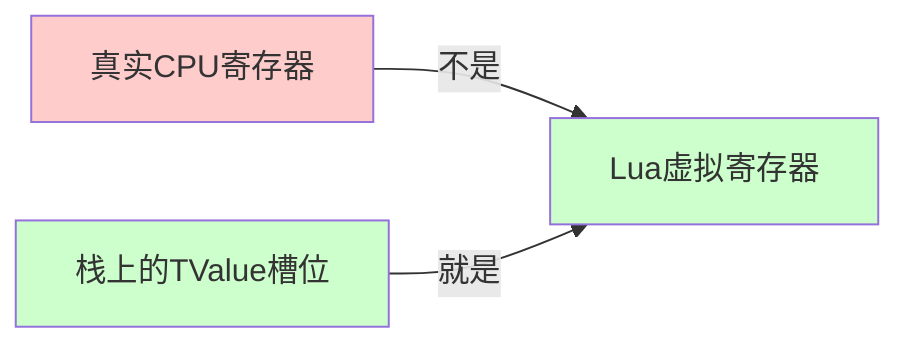
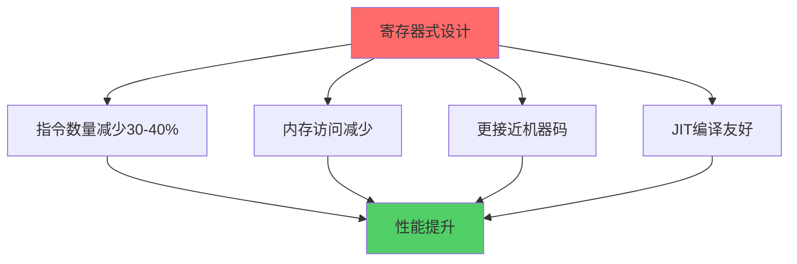
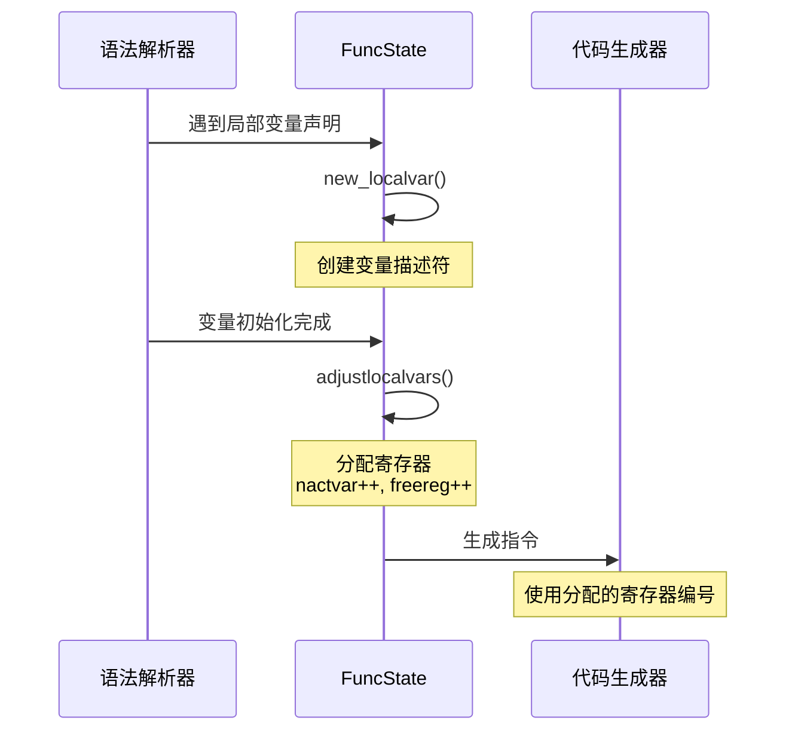
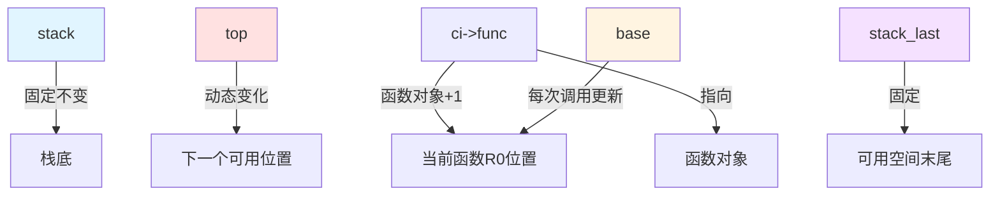
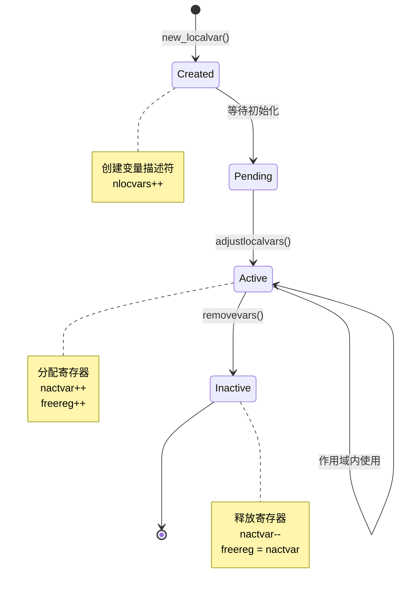
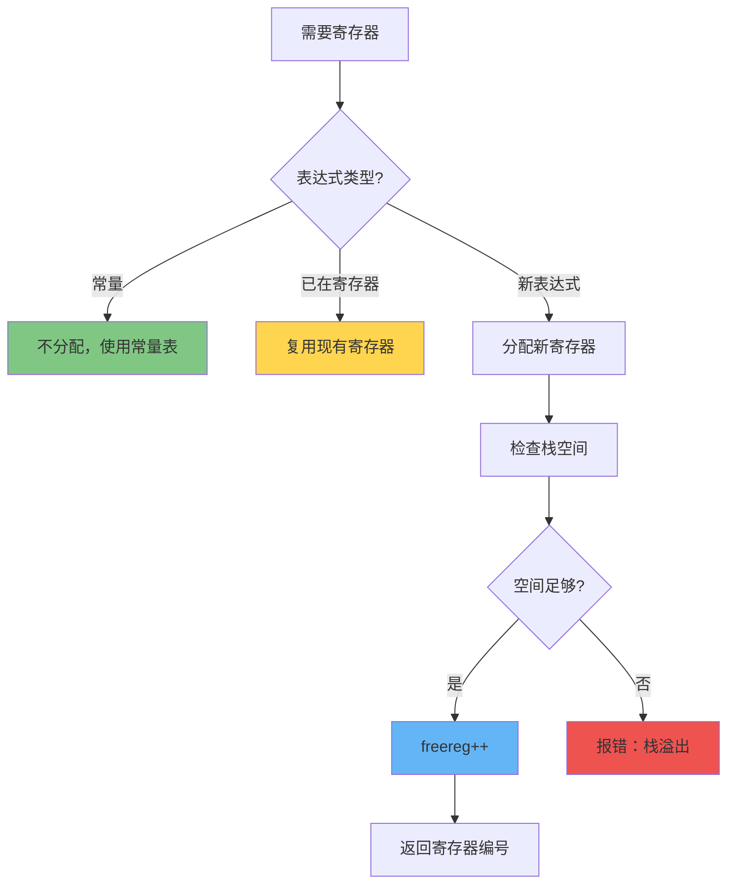
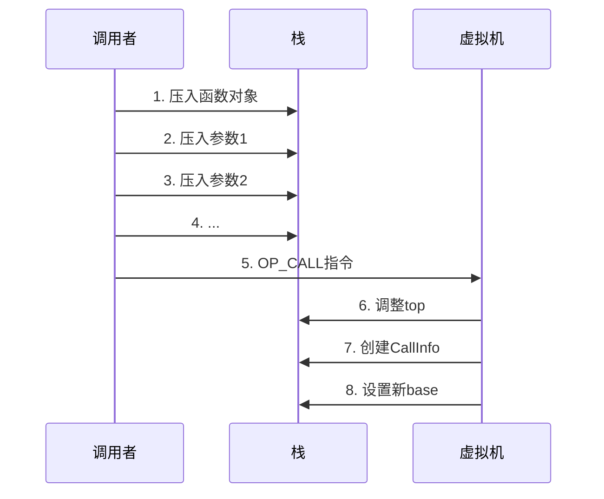
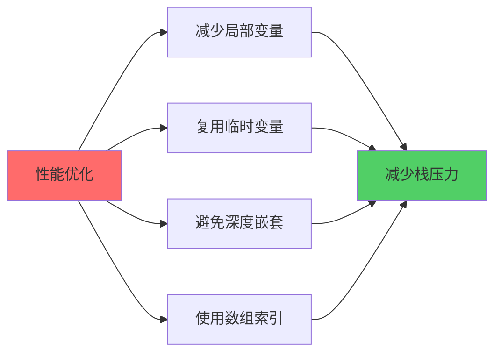

# 📝 Lua 5.1.5 寄存器分配与栈管理详解

> **技术层级文档** - 深入剖析 Lua 虚拟机的寄存器分配策略和栈管理机制

---

## 📑 导航目录

<details open>
<summary><b>点击展开/折叠目录</b></summary>

### 核心章节
1. [概述](#1-概述)
2. [寄存器分配原理](#2-寄存器分配原理)
3. [栈帧结构](#3-栈帧结构)
4. [局部变量管理](#4-局部变量管理)
5. [寄存器分配算法](#5-寄存器分配算法)
6. [栈空间管理](#6-栈空间管理)
7. [函数调用中的栈布局](#7-函数调用中的栈布局)
8. [寄存器复用优化](#8-寄存器复用优化)
9. [临时变量处理](#9-临时变量处理)
10. [实战案例分析](#10-实战案例分析)

### 附录
- [关键数据结构](#关键数据结构)
- [核心函数参考](#核心函数参考)
- [调试技巧](#调试技巧)
- [相关文档](#相关文档)

</details>

---

## 1. 概述

### 1.1 什么是"寄存器式虚拟机"？

Lua 5.1 虚拟机采用**基于寄存器的架构**，但这里的"寄存器"并非真实的 CPU 寄存器，而是：

> **虚拟寄存器** = **函数栈帧中的连续内存槽位**



### 1.2 核心概念

| 概念 | 定义 | 作用 |
|------|------|------|
| **虚拟寄存器** | 栈帧中的 TValue 槽位 | 存储局部变量、参数、临时值 |
| **base** | 当前函数栈帧基址 | R(0) 的位置，即 `L->base` |
| **top** | 栈顶指针 | 下一个可用位置，即 `L->top` |
| **freereg** | 下一个空闲寄存器索引 | 编译期跟踪，用于分配新寄存器 |
| **nactvar** | 当前活跃变量数 | 编译期跟踪，等于已分配的寄存器数 |

### 1.3 设计优势



---

## 2. 寄存器分配原理

### 2.1 寄存器的本质

**关键理解**：Lua 的寄存器是栈上的连续槽位，通过 `base` 指针 + 偏移量访问。

```c
// 定义在 lvm.c
#define RA(i)   (base + GETARG_A(i))     // 寄存器 A
#define RB(i)   (base + GETARG_B(i))     // 寄存器 B
#define RC(i)   (base + GETARG_C(i))     // 寄存器 C

// 实际访问
TValue *ra = base + 5;  // 访问 R(5)
```

### 2.2 寄存器编号规则

```
寄存器编号从 0 开始：
┌─────────────────────────────────┐
│ R(0)   R(1)   R(2)   ...  R(n)  │
│  ↑      ↑      ↑           ↑    │
│ 参数1  参数2  局部变量1   临时值 │
└─────────────────────────────────┘
  ↑
 base 指针指向这里
```

**编号规则**：
- **R(0) ~ R(参数数-1)**：函数参数
- **R(参数数) ~ R(参数数+局部变量数-1)**：局部变量
- **R(参数数+局部变量数) ~ ...**：临时值和表达式计算结果

### 2.3 寄存器分配时机



### 2.4 FuncState 结构

`FuncState` 是编译期函数状态，包含寄存器分配信息：

```c
typedef struct FuncState {
    Proto *f;              // 当前函数原型
    struct FuncState *prev; // 外层函数状态
    struct LexState *ls;   // 词法状态
    struct BlockCnt *bl;   // 当前代码块
    
    // 寄存器分配关键字段
    int pc;                // 下一条指令位置
    int lasttarget;        // 最后的跳转目标
    int jpc;               // 待修正的跳转链表
    int freereg;           // 第一个空闲寄存器索引
    int nk;                // 常量表中的元素数
    int np;                // 子函数原型数
    int nlocvars;          // 局部变量数
    int nactvar;           // 当前活跃的局部变量数
    expdesc upvalues[LUAI_MAXUPVALUES]; // upvalue 数组
    unsigned short actvar[LUAI_MAXVARS]; // 活跃变量列表
} FuncState;
```

**关键字段解析**：

| 字段 | 类型 | 含义 | 更新时机 |
|------|------|------|---------|
| `freereg` | int | 下一个空闲寄存器编号 | 每次分配/释放寄存器 |
| `nactvar` | int | 当前活跃变量数 | 变量声明/离开作用域 |
| `actvar` | short[] | 活跃变量索引数组 | 变量激活/失活 |
| `nlocvars` | int | 总局部变量数（含失活） | 每次声明局部变量 |

### 2.5 寄存器分配示例

**Lua 代码**：
```lua
function example(a, b)
    local c = a + b
    local d = c * 2
    return d
end
```

**寄存器分配过程**：

| 阶段 | freereg | nactvar | 寄存器分配 |
|------|---------|---------|-----------|
| 函数开始 | 2 | 2 | R(0)=a, R(1)=b |
| 声明 c | 3 | 3 | R(2)=c |
| 声明 d | 4 | 4 | R(3)=d |
| 返回 | - | - | - |

**生成的字节码**：
```
function <example:1,5> (5 instructions)
2 params, 4 slots, 0 upvalues, 4 locals, 1 constant
    1  [2]  ADD      2 0 1    ; R(2) = R(0) + R(1)
    2  [3]  MUL      3 2 -1   ; R(3) = R(2) * 2
    3  [4]  RETURN   3 2      ; return R(3)
    4  [5]  RETURN   0 1      ; implicit return
```

---

## 3. 栈帧结构

### 3.1 完整栈帧布局

```
内存地址（从低到高）
┌────────────────────────────────┐
│         全局状态                │ ← stack（栈底）
├────────────────────────────────┤
│      ... 其他栈帧 ...           │
├────────────────────────────────┤
│     函数对象（闭包）            │ ← ci->func
├────────────────────────────────┤
│     R(0): 参数1 / 局部变量0     │ ← base = ci->base
│     R(1): 参数2 / 局部变量1     │
│     R(2): 局部变量2             │
│     R(3): 局部变量3             │
│     R(4): 临时值1               │
│     R(5): 临时值2               │
│         ...                     │
├────────────────────────────────┤
│     栈顶（未使用）              │ ← top = L->top
├────────────────────────────────┤
│         可用空间                │
├────────────────────────────────┤
│         保留空间                │ ← stack_last
└────────────────────────────────┘
```

### 3.2 关键指针

```c
struct lua_State {
    StkId stack;        // 栈底（固定）
    StkId base;         // 当前函数栈基址
    StkId top;          // 栈顶（动态）
    StkId stack_last;   // 栈可用空间末尾
    int stacksize;      // 栈总大小
    
    CallInfo *ci;       // 当前调用信息
    // ...
};

typedef TValue *StkId;  // 栈指针类型
```

### 3.3 指针关系图



### 3.4 栈帧大小计算

**编译期确定**：
```c
// 在 lparser.c 的 close_func() 中
f->maxstacksize = fs->freereg;  // 最大寄存器数 = 最大栈帧大小
```

**示例**：
```lua
function test(a, b)      -- 2 个参数
    local c, d           -- 2 个局部变量
    local e = a + b      -- 需要临时空间
    return e
end
-- maxstacksize = 至少 5 (2参数 + 3局部变量)
```

---

## 4. 局部变量管理

### 4.1 局部变量生命周期



### 4.2 LocVar 结构

局部变量信息存储在 `Proto` 的 `locvars` 数组中：

```c
typedef struct LocVar {
    TString *varname;   // 变量名
    int startpc;        // 变量生效的第一条指令
    int endpc;          // 变量失效的第一条指令
} LocVar;
```

**用途**：
- **调试信息**：提供变量名和作用域范围
- **错误报告**：显示哪个变量出错
- **不影响执行**：运行时不使用此信息

### 4.3 变量创建与激活

#### new_localvar() - 创建变量

```c
static int new_localvar (LexState *ls, TString *name, int n) {
    FuncState *fs = ls->fs;
    Proto *f = fs->f;
    int oldsize = f->sizelocvars;
    
    // 扩展 locvars 数组
    luaM_growvector(ls->L, f->locvars, fs->nlocvars, f->sizelocvars,
                    LocVar, SHRT_MAX, "too many local variables");
    
    // 填充变量信息
    f->locvars[fs->nlocvars].varname = name;
    
    // 返回变量索引
    luaC_objbarrier(ls->L, f, name);
    return fs->nlocvars++;
}
```

#### adjustlocalvars() - 激活变量

```c
static void adjustlocalvars (LexState *ls, int nvars) {
    FuncState *fs = ls->fs;
    
    // 设置生效的PC位置
    fs->nactvar = cast_byte(fs->nactvar + nvars);
    for (; nvars; nvars--) {
        getlocvar(fs, fs->nactvar - nvars).startpc = fs->pc;
    }
}
```

**完整流程**：
```c
// 解析：local x, y = 1, 2
new_localvar(ls, "x", 0);     // 创建 x，nlocvars = 1
new_localvar(ls, "y", 0);     // 创建 y，nlocvars = 2
// ... 生成初始化代码 ...
adjustlocalvars(ls, 2);       // 激活 x 和 y，nactvar = 2
```

### 4.4 变量失效

```c
static void removevars (LexState *ls, int tolevel) {
    FuncState *fs = ls->fs;
    
    // 设置失效的PC位置
    while (fs->nactvar > tolevel)
        getlocvar(fs, --fs->nactvar).endpc = fs->pc;
}
```

**示例**：
```lua
do
    local x = 1     -- x 生效
    print(x)
end                 -- x 失效
```

---

## 5. 寄存器分配算法

### 5.1 核心分配函数

#### luaK_reserveregs() - 预留寄存器

```c
void luaK_reserveregs (FuncState *fs, int n) {
    luaK_checkstack(fs, n);
    fs->freereg += n;
}
```

**作用**：预留 n 个连续寄存器空间。

#### luaK_exp2nextreg() - 表达式结果到下一寄存器

```c
static int luaK_exp2nextreg (FuncState *fs, expdesc *e) {
    luaK_dischargevars(fs, e);
    freeexp(fs, e);
    luaK_reserveregs(fs, 1);
    exp2reg(fs, e, fs->freereg - 1);
    return e->u.s.info;
}
```

### 5.2 寄存器分配策略



### 5.3 寄存器复用条件

**可以复用的情况**：
1. 临时表达式计算完成
2. 变量离开作用域
3. 函数调用后的返回值已使用

**不能复用的情况**：
1. 活跃的局部变量
2. 尚未使用的函数参数
3. 循环变量

### 5.4 freereg 的维护

```c
// 分配寄存器
fs->freereg++;              // 分配一个

// 释放到指定级别
fs->freereg = nactvar;      // 释放到活跃变量数

// 批量预留
fs->freereg += n;           // 预留 n 个
```

**不变式**：
```c
lua_assert(fs->freereg >= fs->nactvar);
```

> freereg 总是 >= nactvar，因为活跃变量占用最开始的寄存器。

---

## 6. 栈空间管理

### 6.1 栈空间限制

```c
// 定义在 luaconf.h 和 ldo.h
#define LUAI_MAXSTACK       15000    // 最大栈深度
#define LUAI_MAXVARS        200      // 最大局部变量数
#define LUAI_MAXCCALLS      200      // 最大C调用深度
#define LUA_MINSTACK        20       // 最小栈空间
#define EXTRA_STACK         5        // 额外保留空间
```

### 6.2 栈空间检查

#### 编译期检查

```c
void luaK_checkstack (FuncState *fs, int n) {
    int newstack = fs->freereg + n;
    if (newstack > fs->f->maxstacksize) {
        if (newstack >= LUAI_MAXSTACK)
            luaX_syntaxerror(fs->ls, "function or expression too complex");
        fs->f->maxstacksize = cast_byte(newstack);
    }
}
```

**触发时机**：每次分配寄存器前检查。

#### 运行时检查

```c
void luaD_checkstack (lua_State *L, int n) {
    if (L->stack_last - L->top <= n)
        luaD_growstack(L, n);  // 扩展栈
    else
        condhardstacktests(luaD_reallocstack(L, L->stacksize - EXTRA_STACK - 1));
}
```

**触发时机**：
- 函数调用前
- 创建表时
- 字符串连接时
- 任何可能需要大量栈空间的操作

### 6.3 栈扩展机制

```c
void luaD_growstack (lua_State *L, int n) {
    if (n <= L->stacksize)
        luaD_reallocstack(L, L->stacksize + EXTRA_STACK);
    else
        luaD_reallocstack(L, n + EXTRA_STACK);
}
```

**扩展策略**：
- 小增长：stacksize + EXTRA_STACK
- 大增长：n + EXTRA_STACK（满足需求）

```c
static void luaD_reallocstack (lua_State *L, int newsize) {
    TValue *oldstack = L->stack;
    int realsize = newsize + 1 + EXTRA_STACK;
    
    // 重新分配内存
    luaM_reallocvector(L, L->stack, L->stacksize, realsize, TValue);
    L->stacksize = realsize;
    L->stack_last = L->stack + newsize;
    
    // 修正所有栈指针
    correctstack(L, oldstack);
}
```

### 6.4 指针修正

```c
static void correctstack (lua_State *L, TValue *oldstack) {
    CallInfo *ci;
    GCObject *up;
    ptrdiff_t diff = L->stack - oldstack;
    
    // 修正基本指针
    L->top = (L->top - oldstack) + L->stack;
    L->base = (L->base - oldstack) + L->stack;
    
    // 修正所有 CallInfo
    for (ci = L->ci; ci != NULL; ci = ci->previous) {
        ci->top = (ci->top - oldstack) + L->stack;
        ci->base = (ci->base - oldstack) + L->stack;
        ci->func = (ci->func - oldstack) + L->stack;
    }
    
    // 修正 upvalue
    for (up = L->openupval; up != NULL; up = up->gch.next)
        gco2uv(up)->v = (gco2uv(up)->v - oldstack) + L->stack;
}
```

**为什么需要修正？**
- `realloc` 可能返回新的内存地址
- 所有指向旧栈的指针都会失效
- 必须更新所有相关指针

---

## 7. 函数调用中的栈布局

### 7.1 调用前的栈准备



### 7.2 调用时的栈转换

**调用前**（调用者视角）：
```
┌──────────────┐
│ ... 其他数据 │
├──────────────┤
│ R(5) = 函数  │ ← 将被调用的函数
│ R(6) = 参数1 │
│ R(7) = 参数2 │
├──────────────┤ ← top
│ 未使用       │
└──────────────┘
```

**调用后**（被调用函数视角）：
```
┌──────────────┐
│ ... 其他数据 │
├──────────────┤
│ 函数对象     │ ← ci->func（调用者的R(5)）
├──────────────┤
│ R(0) = 参数1 │ ← base = ci->base（调用者的R(6)）
│ R(1) = 参数2 │
│ R(2) = 局部1 │
│ R(3) = 局部2 │
├──────────────┤ ← top
│ 未使用       │
└──────────────┘
```

### 7.3 OP_CALL 指令处理

```c
case OP_CALL: {
    int b = GETARG_B(i);          // 参数数量 + 1（0表示到栈顶）
    int nresults = GETARG_C(i) - 1; // 期望返回值数量
    
    // 设置栈顶（如果B != 0）
    if (b != 0) {
        L->top = ra + b;  // ra + b = 函数 + 参数
    }
    
    L->savedpc = pc;  // 保存PC
    
    switch (luaD_precall(L, ra, nresults)) {
        case PCRLUA: {
            // Lua函数：重入执行循环
            nexeccalls++;
            goto reentry;
        }
        case PCRC: {
            // C函数：已执行完毕
            if (nresults >= 0) {
                L->top = L->ci->top;
            }
            base = L->base;
            continue;
        }
        default: {
            // 协程挂起或错误
            return;
        }
    }
}
```

### 7.4 luaD_precall() 详解

```c
int luaD_precall (lua_State *L, StkId func, int nresults) {
    LClosure *cl;
    ptrdiff_t funcr;
    
    // 1. 检查是否是函数
    if (!ttisfunction(func))
        func = tryfuncTM(L, func);  // 尝试 __call 元方法
    
    funcr = savestack(L, func);
    cl = &clvalue(func)->l;
    L->ci->savedpc = L->savedpc;
    
    // 2. 检查栈空间
    if (!cl->isC) {  // Lua 函数
        CallInfo *ci;
        StkId st, base;
        Proto *p = cl->p;
        
        // 检查参数数量
        luaD_checkstack(L, p->maxstacksize);
        func = restorestack(L, funcr);
        
        // 调整参数（填充nil或截断）
        int n = cast_int(L->top - func) - 1;  // 实际参数数
        for (; n < p->numparams; n++)
            setnilvalue(L->top++);  // 填充缺失参数
        
        // 设置新的栈基址
        base = (!p->is_vararg) ? func + 1 : adjust_varargs(L, p, n);
        
        // 创建新的 CallInfo
        ci = inc_ci(L);
        ci->func = func;
        L->base = ci->base = base;
        ci->top = L->base + p->maxstacksize;
        lua_assert(ci->top <= L->stack_last);
        L->savedpc = p->code;  // 函数的第一条指令
        ci->tailcalls = 0;
        ci->nresults = nresults;
        
        // 初始化局部变量为nil
        for (st = L->top; st < ci->top; st++)
            setnilvalue(st);
        L->top = ci->top;
        
        return PCRLUA;  // 返回Lua函数标志
    }
    else {  // C 函数
        // ... C函数调用逻辑 ...
        return PCRC;
    }
}
```

### 7.5 参数传递机制

#### 固定参数

```lua
function fixed(a, b, c)
    -- 编译期已知参数数量
end

fixed(1, 2, 3)      -- 正常调用
fixed(1)            -- b=nil, c=nil（自动填充）
fixed(1, 2, 3, 4)   -- 第4个参数被忽略
```

**字节码**：
```
CALL  A B C
A = 函数所在寄存器
B = 参数数量 + 1（包括函数本身）
C = 期望返回值数量 + 1
```

#### 可变参数

```lua
function vararg(a, ...)
    -- ... 是可变参数
end
```

**处理**：
```c
static StkId adjust_varargs (lua_State *L, Proto *p, int actual) {
    int i;
    int nfixargs = p->numparams;
    Table *htab = NULL;
    StkId base, fixed;
    
    // 将固定参数移到正确位置
    for (i = 0; i < nfixargs; i++) {
        setobjs2s(L, L->top++, fixed++);
        setnilvalue(fixed - 1);
    }
    
    return base;
}
```

### 7.6 返回值处理

```c
case OP_RETURN: {
    int b = GETARG_B(i);
    if (b != 0) L->top = ra + b - 1;
    
    // 关闭 upvalue
    if (L->openupval) luaF_close(L, base);
    
    L->savedpc = pc;
    b = luaD_poscall(L, ra);
    
    if (--nexeccalls == 0)
        return;  // 返回到C代码
    else
        goto reentry;  // 继续执行
}
```

**luaD_poscall() 逻辑**：

```c
int luaD_poscall (lua_State *L, StkId firstResult) {
    StkId res;
    int wanted, i;
    CallInfo *ci;
    
    ci = L->ci;
    res = ci->func;  // 返回值存放位置
    wanted = ci->nresults;  // 期望的返回值数量
    
    L->ci = ci = ci->previous;  // 恢复到调用者
    L->base = ci->base;
    L->savedpc = ci->savedpc;
    
    // 复制返回值
    for (i = wanted; i != 0 && firstResult < L->top; i--)
        setobjs2s(L, res++, firstResult++);
    
    // 填充nil或调整top
    while (i-- > 0)
        setnilvalue(res++);
    
    L->top = res;
    return (wanted - LUA_MULTRET);
}
```

---

## 8. 寄存器复用优化

### 8.1 为什么需要寄存器复用？

**不复用的问题**：
```lua
local a = 1      -- R(0)
local b = 2      -- R(1)
local c = 3      -- R(2)
local d = 4      -- R(3)
-- 如果不复用，每个临时表达式都需要新寄存器
local result = (a + b) + (c + d)
-- 可能需要 R(4), R(5), R(6) 作为临时值
```

**复用后**：
```lua
-- 表达式计算完后立即释放寄存器
local result = (a + b) + (c + d)
-- 只需要 R(4) 和 R(5)，然后复用
```

### 8.2 表达式类型与复用

```c
typedef enum {
    VVOID,        // 无值
    VNIL,         // nil常量
    VTRUE,        // true常量
    VFALSE,       // false常量
    VK,           // 常量表中的值
    VKNUM,        // 数字常量
    VLOCAL,       // 局部变量（不可复用）
    VUPVAL,       // upvalue
    VGLOBAL,      // 全局变量
    VINDEXED,     // 表索引
    VJMP,         // 跳转指令
    VRELOCABLE,   // 可重定位（临时，可复用）
    VNONRELOC,    // 固定位置（临时，可复用）
    VCALL,        // 函数调用
    VVARARG       // 可变参数
} expkind;
```

**可复用的类型**：
- `VRELOCABLE`：指令结果尚未固定寄存器
- `VNONRELOC`：临时值已在寄存器中
- `VCALL`：函数调用返回值
- `VVARARG`：可变参数展开

**不可复用的类型**：
- `VLOCAL`：活跃的局部变量
- `VUPVAL`：upvalue（必须保持）
- `VK`, `VKNUM`：常量（不占寄存器）

### 8.3 freeexp() 函数

```c
static void freeexp (FuncState *fs, expdesc *e) {
    if (e->k == VNONRELOC)
        luaK_freereg(fs, e->u.s.info);
}

void luaK_freereg (FuncState *fs, int reg) {
    if (!ISK(reg) && reg >= fs->nactvar) {
        fs->freereg--;
        lua_assert(reg == fs->freereg);
    }
}
```

**释放条件**：
1. 寄存器编号 >= nactvar（不是活跃变量）
2. 寄存器编号 == freereg - 1（栈顶寄存器）

### 8.4 复用策略示例

**Lua 代码**：
```lua
local result = (a + b) * (c + d)
```

**寄存器分配过程**：

| 步骤 | 操作 | freereg | 寄存器状态 |
|------|------|---------|-----------|
| 1 | a + b | 5 | R(4) = a + b（临时） |
| 2 | c + d | 6 | R(5) = c + d（临时） |
| 3 | R(4) * R(5) | 5 | R(4) = R(4) * R(5)（复用R(4)） |
| 4 | 赋值给result | 5 | R(4) = result（成为局部变量） |

**字节码**：
```
ADD  4 0 1     ; R(4) = R(0) + R(1)  (a + b)
ADD  5 2 3     ; R(5) = R(2) + R(3)  (c + d)
MUL  4 4 5     ; R(4) = R(4) * R(5)  (复用R(4))
```

### 8.5 作用域退出时的批量释放

```c
static void leaveblock (FuncState *fs) {
    BlockCnt *bl = fs->bl;
    fs->bl = bl->previous;
    removevars(fs->ls, bl->nactvar);  // 移除局部变量
    
    // 释放寄存器到活跃变量级别
    fs->freereg = fs->nactvar;
    
    // 处理break跳转
    if (bl->upval)
        luaK_codeABC(fs, OP_CLOSE, bl->nactvar, 0, 0);
    
    // 修正跳转
    luaK_patchtohere(fs, bl->breaklist);
}
```

---

## 9. 临时变量处理

### 9.1 临时值的产生

**常见情况**：
1. 表达式计算：`a + b`
2. 函数调用：`f(x)`
3. 表构造：`{1, 2, 3}`
4. 字符串连接：`"a" .. "b"`

### 9.2 临时值的存储

```c
int luaK_exp2anyreg (FuncState *fs, expdesc *e) {
    luaK_dischargevars(fs, e);
    
    if (e->k == VNONRELOC) {
        // 已经在寄存器中
        if (!hasjumps(e)) return e->u.s.info;
        if (e->u.s.info >= fs->nactvar) {
            // 可以保持原位
            exp2reg(fs, e, e->u.s.info);
            return e->u.s.info;
        }
    }
    
    // 需要新寄存器
    luaK_exp2nextreg(fs, e);
    return e->u.s.info;
}
```

### 9.3 表达式计算的寄存器策略

#### 二元运算

```c
static void codearith (FuncState *fs, OpCode op, expdesc *e1, expdesc *e2) {
    // 尝试常量折叠
    if (constfolding(op, e1, e2))
        return;
    
    int o1 = luaK_exp2RK(fs, e1);  // 可以是寄存器或常量
    int o2 = luaK_exp2RK(fs, e2);
    
    freeexp(fs, e2);  // 释放e2
    freeexp(fs, e1);  // 释放e1
    
    e1->u.s.info = luaK_codeABC(fs, op, 0, o1, o2);
    e1->k = VRELOCABLE;  // 结果是可重定位的
}
```

**RK 编码**：
- 如果是常量：编码为 `256 + 常量索引`
- 如果是寄存器：编码为 `寄存器编号`

```c
#define RKASK(x)     ((x) | (1 << (SIZE_B - 1)))
#define ISK(x)       ((x) & BITRK)
#define INDEXK(x)    ((x) & ~BITRK)
```

#### 函数调用

```c
// 示例：print(a, b, c)
MOVE     5 0      ; 将函数移到R(5)
MOVE     6 1      ; 参数a -> R(6)
MOVE     7 2      ; 参数b -> R(7)
MOVE     8 3      ; 参数c -> R(8)
CALL     5 4 1    ; 调用，4个参数（含函数），0个返回值
```

调用后，R(6), R(7), R(8) 可以被复用。

### 9.4 表构造中的临时值

```lua
local t = {a, b, c, x = d, y = e}
```

**字节码**：
```
NEWTABLE 4 3 2    ; R(4) = {} (3个数组元素，2个哈希元素)
MOVE     5 0      ; R(5) = a
MOVE     6 1      ; R(6) = b  
MOVE     7 2      ; R(7) = c
SETLIST  4 3 1    ; t[1..3] = R(5..7)
SETTABLE 4 -1 3   ; t["x"] = d (R(3))
SETTABLE 4 -2 4   ; t["y"] = e (R(4))
```

**特点**：
- 数组部分批量赋值（SETLIST）
- 哈希部分逐个赋值（SETTABLE）
- 临时寄存器可以复用

---

## 10. 实战案例分析

### 10.1 案例1：复杂表达式

#### Lua 代码
```lua
function complex(a, b, c, d)
    local result = (a + b) * (c - d) / 2
    return result
end
```

#### 寄存器分配分析

| 变量/临时值 | 寄存器 | 生命周期 |
|------------|--------|---------|
| a（参数） | R(0) | 整个函数 |
| b（参数） | R(1) | 整个函数 |
| c（参数） | R(2) | 整个函数 |
| d（参数） | R(3) | 整个函数 |
| a + b（临时） | R(4) | 短暂 |
| c - d（临时） | R(5) | 短暂 |
| R(4) * R(5)（临时） | R(4) | 短暂（复用） |
| 除以2（临时） | R(4) | 短暂（复用） |
| result（局部变量） | R(4) | 到return |

#### 字节码
```
function <complex:1,4> (5 instructions)
4 params, 6 slots, 0 upvalues, 5 locals, 1 constant
    1  [2]  ADD      4 0 1       ; R(4) = a + b
    2  [2]  SUB      5 2 3       ; R(5) = c - d
    3  [2]  MUL      4 4 5       ; R(4) = R(4) * R(5) (复用R(4))
    4  [2]  DIV      4 4 -1      ; R(4) = R(4) / 2 (K(1)=2)
    5  [3]  RETURN   4 2         ; return R(4)
    6  [4]  RETURN   0 1         ; implicit return
```

**优化点**：
- R(5) 使用后立即可复用
- R(4) 在多步计算中持续复用
- 常量2使用常量表而非寄存器

### 10.2 案例2：嵌套作用域

#### Lua 代码
```lua
function scopes(x)
    local a = x + 1
    do
        local b = a * 2
        local c = b + 3
        print(c)
    end
    -- b和c已失效，寄存器可复用
    local d = a + 10
    return d
end
```

#### 寄存器生命周期

```mermaid
gantt
    title 寄存器生命周期
    dateFormat X
    axisFormat %s
    
    section 参数
    x (R0)        :0, 10
    
    section 外层变量
    a (R1)        :1, 10
    
    section 内层变量
    b (R2)        :3, 6
    c (R3)        :4, 7
    
    section 复用后
    d (R2)        :8, 10
```



#### 字节码
```
function <scopes:1,10> (9 instructions)
1 param, 4 slots, 0 upvalues, 4 locals, 3 constants
    1  [2]  ADD      1 0 -1      ; a = x + 1
    2  [4]  MUL      2 1 -2      ; b = a * 2  (R2)
    3  [5]  ADD      3 2 -3      ; c = b + 3  (R3)
    4  [6]  GETTABUP 4 0 -4      ; print
    5  [6]  MOVE     5 3         ; 参数c
    6  [6]  CALL     4 2 1       ; print(c)
    7  [8]  ADD      2 1 -5      ; d = a + 10 (复用R2!)
    8  [9]  RETURN   2 2         ; return d
    9  [10] RETURN   0 1         ;
```

**关键观察**：
- R(2) 先用于 b，失效后复用于 d
- R(3) 用于 c，作用域结束后被释放
- freereg 在内层块结束时回退到 2

### 10.3 案例3：循环中的寄存器管理

#### Lua 代码
```lua
function loop_sum(n)
    local sum = 0
    for i = 1, n do
        local temp = i * 2
        sum = sum + temp
    end
    return sum
end
```

#### 字节码
```
function <loop_sum:1,7> (10 instructions)
1 param, 6 slots, 0 upvalues, 4 locals, 2 constants
    1  [2]  LOADK    1 -1        ; sum = 0
    2  [3]  LOADK    2 -2        ; 初始化for循环
    3  [3]  MOVE     3 0          ; limit = n
    4  [3]  LOADK    4 -2        ; step = 1
    5  [3]  FORPREP  2 3          ; 准备循环
    6  [4]  MUL      6 5 -1      ; temp = i * 2 (R6临时)
    7  [5]  ADD      1 1 6        ; sum = sum + temp
    8  [3]  FORLOOP  2 -3        ; i++, 检查循环
    9  [7]  RETURN   1 2          ; return sum
   10  [7]  RETURN   0 1          ;
```

**寄存器分配**：
- R(0) = n（参数）
- R(1) = sum（循环外变量）
- R(2) = i（循环计数器内部）
- R(3) = limit
- R(4) = step
- R(5) = i（循环变量，由FORLOOP设置）
- R(6) = temp（每次迭代重新分配）

**优化特点**：
- temp 在每次迭代结束时自动释放
- R(6) 在下次迭代时复用
- 循环变量 i 使用专门的 R(5)

### 10.4 案例4：函数调用的栈布局

#### Lua 代码
```lua
function outer(a, b)
    local x = a + 1
    local y = inner(x, b)
    return y * 2
end

function inner(m, n)
    return m + n
end
```

#### outer 函数栈帧

**调用 inner 前**：
```
┌──────────────┐
│ R(3) = inner │ ← 将被调用的函数
│ R(4) = x     │ ← 参数1
│ R(5) = b     │ ← 参数2
├──────────────┤ ← top (调用前)
│     ...      │
└──────────────┘
```

**调用 inner 时**（inner的视角）：
```
┌──────────────┐
│ 函数对象     │ ← ci->func (outer的R3)
├──────────────┤
│ R(0) = m     │ ← base (outer的R4)
│ R(1) = n     │ ← outer的R5
│ R(2) = 结果  │ ← 计算m+n
├──────────────┤ ← top
│     ...      │
└──────────────┘
```

**返回后**（outer的视角）：
```
┌──────────────┐
│ R(3) = 返回值│ ← 覆盖了函数对象
├──────────────┤
│ R(4) = ?     │ ← 未定义（可复用）
│ R(5) = ?     │ ← 未定义（可复用）
├──────────────┤
│ R(2) = y     │ ← 赋值返回值
└──────────────┘
```

---

## 关键数据结构

### FuncState（函数编译状态）

```c
typedef struct FuncState {
    Proto *f;                    // 当前函数原型
    struct FuncState *prev;      // 外层函数
    struct LexState *ls;         // 词法状态
    struct BlockCnt *bl;         // 当前块
    
    int pc;                      // 下一条指令位置
    int lasttarget;              // 最后的标签
    int jpc;                     // 待处理的跳转链
    
    int freereg;                 // 第一个空闲寄存器
    int nk;                      // 常量数量
    int np;                      // 原型数量
    int nlocvars;                // 局部变量总数
    int nactvar;                 // 当前活跃变量数
    
    expdesc upvalues[LUAI_MAXUPVALUES];  // upvalue数组
    unsigned short actvar[LUAI_MAXVARS]; // 活跃变量索引
} FuncState;
```

### Proto（函数原型）

```c
typedef struct Proto {
    CommonHeader;
    
    TValue *k;                   // 常量数组
    Instruction *code;           // 指令数组
    struct Proto **p;            // 子函数数组
    int *lineinfo;               // 行号信息
    struct LocVar *locvars;      // 局部变量数组
    TString **upvalues;          // upvalue名称
    TString *source;             // 源文件名
    
    int sizek;                   // 常量数量
    int sizecode;                // 指令数量
    int sizelineinfo;            // 行号数量
    int sizep;                   // 子函数数量
    int sizelocvars;             // 局部变量数量
    int sizeupvalues;            // upvalue数量
    
    int linedefined;             // 函数定义行
    int lastlinedefined;         // 函数结束行
    
    GCObject *gclist;            // GC链表
    
    lu_byte nups;                // upvalue数量
    lu_byte numparams;           // 参数数量
    lu_byte is_vararg;           // 是否可变参数
    lu_byte maxstacksize;        // 最大栈大小
} Proto;
```

### CallInfo（调用信息）

```c
typedef struct CallInfo {
    StkId base;                  // 函数栈基址
    StkId func;                  // 函数对象位置
    StkId top;                   // 栈顶
    const Instruction *savedpc;  // 保存的PC
    int nresults;                // 期望返回值数
    int tailcalls;               // 尾调用次数
} CallInfo;
```

---

## 核心函数参考

### 寄存器分配

| 函数 | 作用 | 定义位置 |
|------|------|---------|
| `luaK_reserveregs()` | 预留n个寄存器 | lcode.c |
| `luaK_freereg()` | 释放寄存器 | lcode.c |
| `luaK_exp2nextreg()` | 表达式结果到下一寄存器 | lcode.c |
| `luaK_exp2anyreg()` | 表达式结果到任意寄存器 | lcode.c |
| `luaK_checkstack()` | 检查栈空间 | lcode.c |

### 局部变量管理

| 函数 | 作用 | 定义位置 |
|------|------|---------|
| `new_localvar()` | 创建局部变量 | lparser.c |
| `adjustlocalvars()` | 激活局部变量 | lparser.c |
| `removevars()` | 移除局部变量 | lparser.c |
| `getlocvar()` | 获取局部变量信息 | lparser.c (宏) |

### 栈管理

| 函数 | 作用 | 定义位置 |
|------|------|---------|
| `luaD_checkstack()` | 运行时栈检查 | ldo.c |
| `luaD_growstack()` | 扩展栈空间 | ldo.c |
| `luaD_reallocstack()` | 重新分配栈 | ldo.c |
| `correctstack()` | 修正栈指针 | ldo.c |

### 函数调用

| 函数 | 作用 | 定义位置 |
|------|------|---------|
| `luaD_precall()` | 函数调用前处理 | ldo.c |
| `luaD_poscall()` | 函数调用后处理 | ldo.c |
| `luaD_call()` | 直接调用 | ldo.c |
| `luaD_pcall()` | 保护调用 | ldo.c |

---

## 调试技巧

### 查看字节码中的寄存器使用

```bash
$ luac -l -l script.lua
```

**输出示例**：
```
function <script.lua:1,5> (8 instructions at 0x...)
2 params, 5 slots, 0 upvalues, 4 locals, 2 constants, 0 functions
    1  [2]  LOADK    2 -1  ; R(2) = 10
    2  [3]  ADD      2 0 1  ; R(2) = R(0) + R(1)
    3  [4]  RETURN   2 2    ; return R(2)
    ...
constants (2) for 0x...:
    1  10
    2  "hello"
locals (4) for 0x...:
    0  a  1  9      ; R(0), PC 1-8
    1  b  1  9      ; R(1), PC 1-8
    2  c  2  9      ; R(2), PC 2-8
    3  d  3  9      ; R(3), PC 3-8
```

**信息解读**：
- `5 slots`：函数需要5个寄存器槽位
- `locals (4)`：4个局部变量
- `R(0)`, `R(1)`：参数 a, b
- `R(2)`, `R(3)`：局部变量 c, d
- PC范围：变量的生命周期（指令编号）

### 使用Lua调试器追踪栈

```lua
function trace_stack()
    local i = 1
    while true do
        local info = debug.getinfo(i, "nSl")
        if not info then break end
        
        print(string.format("  [%d] %s:%d in function '%s'",
              i, info.short_src, info.currentline, info.name or "?"))
        
        -- 打印局部变量
        local j = 1
        while true do
            local name, value = debug.getlocal(i, j)
            if not name then break end
            print(string.format("    %s = %s", name, tostring(value)))
            j = j + 1
        end
        
        i = i + 1
    end
end
```

### 自定义调试钩子

```lua
local function register_hook()
    local function hook(event, line)
        local info = debug.getinfo(2, "nSl")
        local locals = {}
        
        local i = 1
        while true do
            local name, value = debug.getlocal(2, i)
            if not name then break end
            if not name:match("^%(") then  -- 跳过内部变量
                table.insert(locals, string.format("%s=%s", name, tostring(value)))
            end
            i = i + 1
        end
        
        print(string.format("[%s:%d] %s | Locals: {%s}",
              info.short_src, line, info.name or "?",
              table.concat(locals, ", ")))
    end
    
    debug.sethook(hook, "l")  -- 行钩子
end
```

---

## 相关文档

### 本文档系列

| 文档 | 层级 | 说明 |
|------|------|------|
| [wiki_vm.md](wiki_vm.md) | 模块层 | Lua VM 架构总览 |
| [execution_loop.md](execution_loop.md) | 技术层 | 执行循环详解 |
| [instruction_set.md](instruction_set.md) | 技术层 | 指令集完整参考 |
| **register_management.md** | **技术层** | **本文档：寄存器与栈管理** |
| [function_call.md](function_call.md) | 技术层 | 函数调用机制 |

### 源代码参考

| 文件 | 说明 | 核心内容 |
|------|------|----------|
| `lparser.c` | 语法解析器 | 寄存器分配、局部变量管理 |
| `lcode.c` | 代码生成器 | 指令生成、寄存器操作 |
| `ldo.c` | 执行控制 | 栈管理、函数调用 |
| `lvm.c` | 虚拟机 | 指令执行、寄存器访问 |
| `lstate.c` | 状态管理 | 状态创建、栈初始化 |

### 外部资源

- [Lua 5.1 Reference Manual](https://www.lua.org/manual/5.1/)
- [The Implementation of Lua 5.0](https://www.lua.org/doc/jucs05.pdf)
- [A No-Frills Introduction to Lua 5.1 VM Instructions](http://luaforge.net/docman/83/98/ANoFrillsIntroToLua51VMInstructions.pdf)
- [Lua Performance Tips Wiki](http://lua-users.org/wiki/OptimisationTips)

---

## 总结

### 核心要点回顾

1. **虚拟寄存器的本质**
   - 栈上的连续 TValue 槽位
   - 通过 base + offset 访问
   - 编译期分配，运行时使用

2. **寄存器分配策略**
   - freereg 跟踪下一个空闲寄存器
   - nactvar 跟踪活跃变量数
   - 临时值使用后立即释放

3. **栈帧结构**
   - 函数对象 + 参数 + 局部变量 + 临时值
   - base 指向 R(0)
   - top 指向下一个可用位置

4. **寄存器复用**
   - 临时表达式结果可复用
   - 作用域退出时批量释放
   - 循环中每次迭代复用

5. **栈空间管理**
   - 编译期确定 maxstacksize
   - 运行时动态扩展
   - 栈重分配后修正所有指针

### 性能优化建议



**最佳实践**：

1. ✅ **局部变量数量适中**
   - 每个函数不超过50个局部变量
   - 使用表聚合相关数据

2. ✅ **合理使用临时变量**
   - 复杂表达式拆分为多步
   - 避免过长的单行表达式

3. ✅ **注意作用域**
   - 及时离开不需要的作用域
   - 释放不再使用的变量

4. ✅ **函数调用优化**
   - 减少参数数量
   - 避免频繁创建闭包

5. ✅ **循环中的优化**
   - 提升循环不变量
   - 避免在循环内声明局部变量

---

<div align="center">

**🎯 关键收获**

通过本文档，你应该能够：
- ✅ 理解 Lua "寄存器式虚拟机"的真正含义
- ✅ 掌握寄存器分配和释放的完整机制
- ✅ 了解栈帧结构和函数调用中的栈布局
- ✅ 学会通过字节码分析寄存器使用情况
- ✅ 认识到寄存器复用对性能的重要性

</div>

---

<div align="center">

*📅 最后更新*：2025-01-26  
*✍️ 文档版本*：v1.0  
*📝 作者*：Lua C Analysis Team  
*📖 文档类型*：技术层级 - 深度分析

[🔝 返回顶部](#-lua-515-寄存器分配与栈管理详解) | [📚 返回文档首页](../../README.md)

</div>
