# 🚀 Lua语å¥æ‰§è¡Œæµç¨‹æ·±åº¦è§£æ - DeepWiki版本

> **学习指å—**: 本文档深入分æLua语å¥ä»æºä»£ç åˆ°æœ€ç»ˆæ‰§è¡Œçš„完整底层æµç¨‹ï¼Œé€šè¿‡å®é™…示例æ­ç¤ºè¯æ³•åˆ†æã€è¯­æ³•åˆ†æã€ä»£ç ç”Ÿæˆã€è™šæ‹Ÿæœºæ‰§è¡Œçš„技术细节和优化策略。

---

## 🯠学习目标ä¸è·¯å¾„

### 📖 适åˆè¯»è€…群体
- **åˆçº§å¼€å‘者**: 具备编程基础，希望了解编程语言执行åŸç†
- **中级开å‘者**: 熟悉Lua语法，想深入ç†è§£ç¼–译和执行机制
- **高级开å‘者**: 研究虚拟机设计，寻求性能优化和调试技巧
- **编译器开å‘者**: 学习编译器设计，ç†è§£ç°ä»£è¯­è¨€å®ç°æŠ€æœ¯

### ğŸ›¤ï¸ å­¦ä¹ è·¯å¾„è§„åˆ’
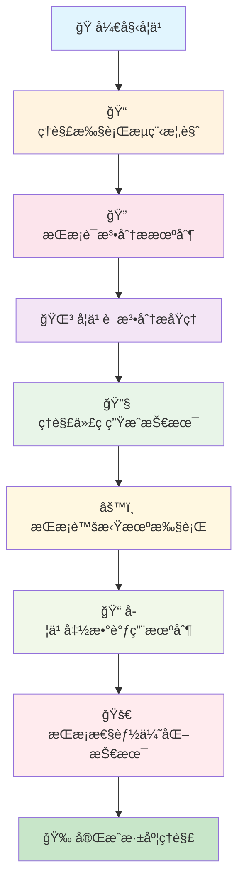
```mermaid
graph TB
    A[ğŸ 开始学习] --> B[📠ç†è§£æ‰§è¡Œæµç¨‹æ¦‚览]
    B --> C[🔠æŒæ¡è¯æ³•åˆ†æ机制]
    C --> D[🌳 学习语法分æåŸç†]
    D --> E[🔧 ç†è§£ä»£ç ç”ŸæˆæŠ€æœ¯]
    E --> F[âš™ï¸ æŒæ¡è™šæ‹Ÿæœºæ‰§è¡Œ]
    F --> G[📠学习函数调用机制]
    G --> H[🚀 æŒæ¡æ€§èƒ½ä¼˜åŒ–技术]
    H --> I[🉠完æˆæ·±åº¦ç†è§£]
    
    style A fill:#e1f5fe
    style I fill:#c8e6c9
    style B fill:#fff3e0
    style C fill:#fce4ec
    style D fill:#f3e5f5
    style E fill:#e8f5e8
    style F fill:#fff8e1
    style G fill:#f1f8e9
    style H fill:#ffebee
```

### â±ï¸ 学习时间估算
- **快速æµè§ˆ**: 30-40分钟 - ç†è§£åŸºæœ¬æ‰§è¡Œæµç¨‹
- **深度学习**: 2-3å°æ—¶ - æŒæ¡å„阶段技术细节
- **å®è·µåº”用**: 4-6å°æ—¶ - 学习调试和优化技术
- **专家级**: 10-15å°æ—¶ - 深入研究虚拟机å®ç°

---

## 🧭 文档导航

### 📑 核心章节导览
| 章节 | å†…å®¹æ¦‚è¦ | 难度等级 | é‡è¦ç¨‹åº¦ | 学习时间 |
|------|----------|----------|----------|----------|
| [🯠执行æµç¨‹æ¦‚览](#-执行æµç¨‹æ¦‚览) | 五大执行阶段总览 | â­â­ | 🔥🔥🔥 | 8分钟 |
| [🔠è¯æ³•åˆ†æ阶段](#-è¯æ³•åˆ†æ阶段) | Token化和è¯æ³•çŠ¶æ€ | â­â­â­ | 🔥🔥🔥 | 15分钟 |
| [🌳 语法分æ阶段](#-语法分æ阶段) | ASTæ„建和语义分æ | â­â­â­â­ | 🔥🔥🔥 | 25分钟 |
| [🔧 代ç ç”Ÿæˆé˜¶æ®µ](#-代ç ç”Ÿæˆé˜¶æ®µ) | 字节ç ç”Ÿæˆå’Œä¼˜åŒ– | â­â­â­â­ | 🔥🔥🔥 | 20分钟 |
| [âš™ï¸ è™šæ‹Ÿæœºæ‰§è¡Œ](#-虚拟机执行阶段) | 字节ç æ‰§è¡Œå’Œå¯„å­˜å™¨ç®¡ç† | â­â­â­â­â­ | 🔥🔥🔥 | 30分钟 |
| [📠函数调用机制](#-函数调用机制) | 函数调用和å‚数传递 | â­â­â­ | 🔥🔥 | 15分钟 |
| [🚀 性能优化技术](#-性能优化技术) | 编译和执行优化策略 | â­â­â­â­â­ | 🔥🔥 | 20分钟 |

### 🔗 相关文档链æ¥
- 📖 [Luaè¯æ³•åˆ†æ器详解](./wiki_lexer.md) - 深入è¯æ³•åˆ†æå®ç°
- 🌳 [Lua语法分æ器å®ç°](./wiki_parser.md) - 完整语法分æ技术
- 🔧 [Lua字节ç ç”Ÿæˆæœºåˆ¶](./wiki_code.md) - 代ç ç”Ÿæˆå’Œä¼˜åŒ–
- âš™ï¸ [Lua虚拟机æ¶æ„](./wiki_vm.md) - 虚拟机设计和å®ç°
- 📊 [Luaæ“作ç ç³»ç»Ÿ](./wiki_opcodes.md) - 指令集和执行语义
- ğŸ›ï¸ [Lua函数执行器](./wiki_do.md) - 函数调用和异常处ç†

### 📚 学习å‰ç½®è¦æ±‚
- ✅ **Lua语法基础**: 函数ã€å˜é‡ã€è¡¨è¾¾å¼çš„基本概念
- ✅ **编程语言åŸç†**: 编译器基础概念和执行模å‹
- ✅ **C语言基础**: ç†è§£æŒ‡é’ˆã€ç»“æ„体ã€å‡½æ•°è°ƒç”¨
- ✅ **æ•°æ®ç»“æ„**: æ ‘ã€å“ˆå¸Œè¡¨ã€æ ˆçš„基本æ“作

---

## 🯠执行æµç¨‹æ¦‚览

### 🔠Lua执行模å‹æ€»è§ˆ

Lua语å¥çš„执行是一个多阶段的å¤æ‚过程，æ¯ä¸ªé˜¶æ®µéƒ½æœ‰æ˜ç¡®çš„èŒè´£å’Œè¾“入输出：

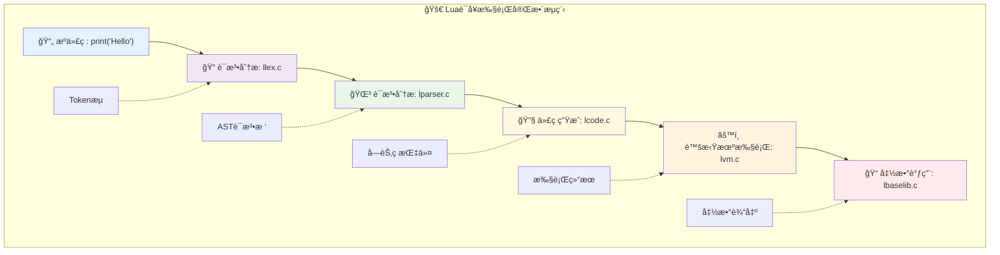
```mermaid
graph TB
    subgraph "🚀 Lua语å¥æ‰§è¡Œå®Œæ•´æµç¨‹"
        A["📄 æºä»£ç : print('Hello')"] --> B["🔠è¯æ³•åˆ†æ: llex.c"]
        B --> C["🌳 语法分æ: lparser.c"]
        C --> D["🔧 代ç ç”Ÿæˆ: lcode.c"]
        D --> E["âš™ï¸ è™šæ‹Ÿæœºæ‰§è¡Œ: lvm.c"]
        E --> F["📠函数调用: lbaselib.c"]
        
        G[Tokenæµ] -.-> B
        H[AST语法树] -.-> C
        I[字节ç æŒ‡ä»¤] -.-> D
        J[执行结æœ] -.-> E
        K[函数输出] -.-> F
    end
    
    style A fill:#e3f2fd
    style B fill:#f3e5f5
    style C fill:#e8f5e8
    style D fill:#fff8e1
    style E fill:#fff3e0
    style F fill:#ffebee
```

### 📊 å„阶段èŒè´£åˆ†å·¥

#### 🯠**阶段间数æ®æµè½¬**
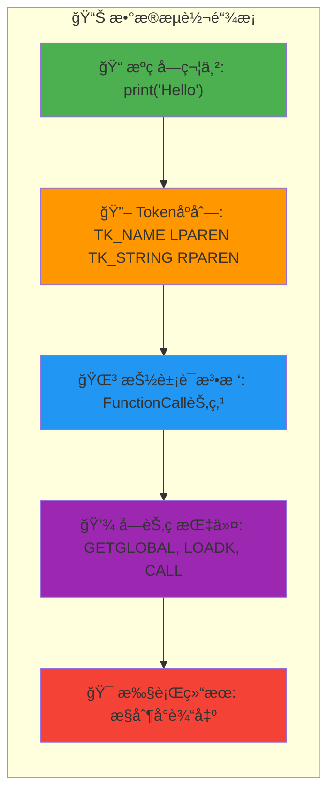
```mermaid
graph LR
    subgraph "📊 æ•°æ®æµè½¬é“¾æ¡"
        A["📠æºç å­—符串: print('Hello')"] --> B["🔖 Tokenåºåˆ—: TK_NAME LPAREN TK_STRING RPAREN"]
        B --> C["🌳 抽象语法树: FunctionCall节点"]
        C --> D["💾 字节ç æŒ‡ä»¤: GETGLOBAL, LOADK, CALL"]
        D --> E["🯠执行结æœ: æ§åˆ¶å°è¾“出"]
    end
    
    style A fill:#4caf50
    style B fill:#ff9800
    style C fill:#2196f3
    style D fill:#9c27b0
    style E fill:#f44336
```

#### ğŸ—ï¸ **核心组件æ¶æ„**
| 阶段 | æ ¸å¿ƒæ¨¡å— | 主è¦åŠŸèƒ½ | 输入 | 输出 | 关键数æ®ç»“æ„ |
|------|----------|----------|------|------|-------------|
| **🔠è¯æ³•åˆ†æ** | llex.c | Token化æºç  | å­—ç¬¦æµ | Tokenæµ | LexState, Token |
| **🌳 语法分æ** | lparser.c | æ„建AST | Tokenæµ | 语法树 | FuncState, expdesc |
| **🔧 代ç ç”Ÿæˆ** | lcode.c | 生æˆå­—èŠ‚ç  | 语法树 | å­—èŠ‚ç  | Instruction |
| **âš™ï¸ è™šæ‹Ÿæœºæ‰§è¡Œ** | lvm.c | 执行指令 | å­—èŠ‚ç  | è¿è¡Œæ—¶å€¼ | lua_State, StkId |
| **📠函数调用** | lbaselib.c | 调用函数 | å‚æ•° | ç»“æœ | CallInfo |

### 💡 设计ç†å¿µ

#### ✅ **分层æ¶æ„优势**
- **🔄 èŒè´£åˆ†ç¦»**: æ¯ä¸ªé˜¶æ®µä¸“注特定任务，便äºç»´æŠ¤å’Œæ‰©å±•
- **📊 æ•°æ®æ ‡å‡†åŒ–**: 阶段间有æ˜ç¡®çš„æ•°æ®æ¥å£ï¼Œé™ä½è€¦åˆåº¦
- **âš¡ 性能优化**: æ¯ä¸ªé˜¶æ®µå¯ç‹¬ç«‹ä¼˜åŒ–，æ高整体性能
- **ğŸ› ï¸ è°ƒè¯•å‹å¥½**: å¯åœ¨ä»»æ„阶段æ’入调试和分æ工具

#### 🯠**执行效ç‡ä¿è¯**
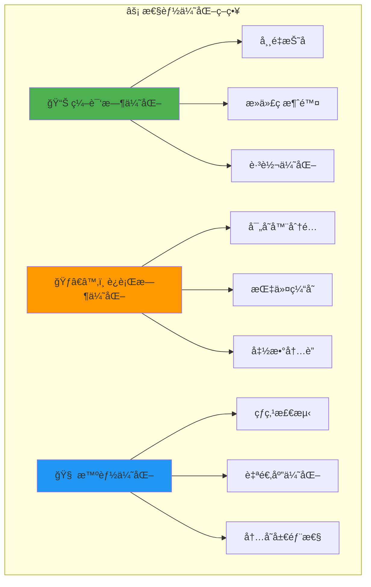
```mermaid
graph TB
    subgraph "⚡ 性能优化策略"
        A[📊 编译时优化] --> B[常é‡æŠ˜å ]
        A --> C[死代ç æ¶ˆé™¤]
        A --> D[跳转优化]
        
        E[ğŸƒâ€â™‚ï¸ è¿è¡Œæ—¶ä¼˜åŒ–] --> F[寄存器分é…]
        E --> G[指令缓存]
        E --> H[函数内è”]
        
        I[🧠 智能优化] --> J[热点检测]
        I --> K[自适应优化]
        I --> L[内存局部性]
    end
    
    style A fill:#4caf50
    style E fill:#ff9800
    style I fill:#2196f3
```

---

## 🔠è¯æ³•åˆ†æ阶段

### 🯠è¯æ³•åˆ†æ器核心功能

è¯æ³•åˆ†æ器是编译过程的第一步，负责将æºä»£ç å­—符æµè½¬æ¢ä¸ºæœ‰æ„义的Tokenåºåˆ—：

#### 📋 Tokenç±»å‹ä½“ç³»
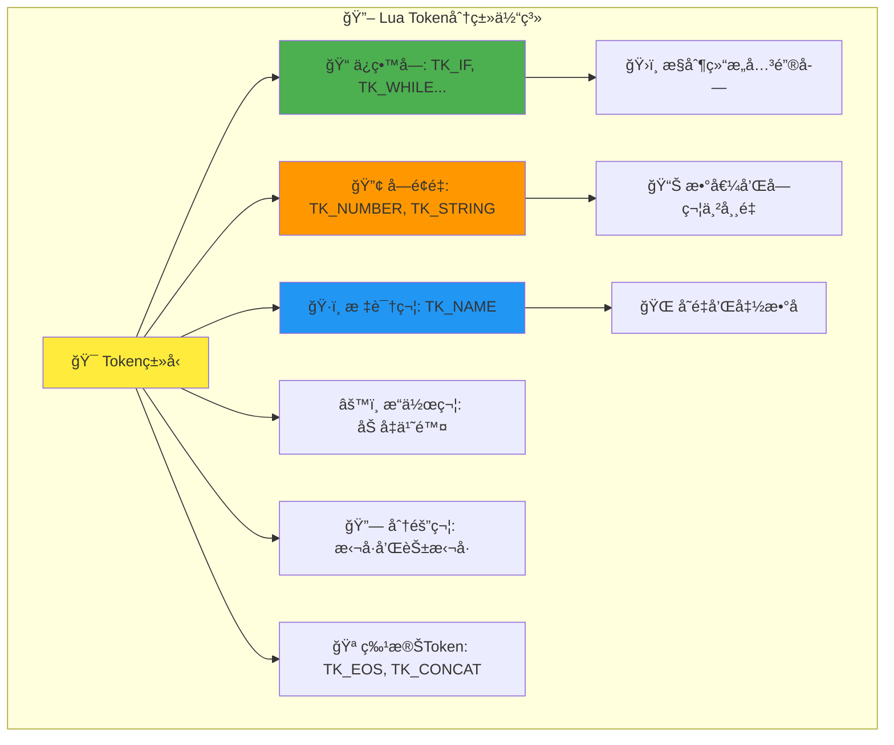
```mermaid
graph TB
    subgraph "🔖 Lua Token分类体系"
        A[🯠Tokenç±»å‹] --> B["📠ä¿ç•™å­—: TK_IF, TK_WHILE..."]
        A --> C["🔢 å­—é¢é‡: TK_NUMBER, TK_STRING"]
        A --> D["ğŸ·ï¸ 标识符: TK_NAME"]
        A --> E["âš™ï¸ æ“作符: 加å‡ä¹˜é™¤"]
        A --> F["🔗 分隔符: 括å·å’ŒèŠ±æ‹¬å·"]
        A --> G["🪠特殊Token: TK_EOS, TK_CONCAT"]
        
        B --> H[ğŸ›ï¸ æ§åˆ¶ç»“æ„关键字]
        C --> I[📊 数值和字符串常é‡]
        D --> J[🌠å˜é‡å’Œå‡½æ•°å]
    end
    
    style A fill:#ffeb3b
    style B fill:#4caf50
    style C fill:#ff9800
    style D fill:#2196f3
```

#### ğŸ—ï¸ æ ¸å¿ƒæ•°æ®ç»“æ„详解
```c
// è¯æ³•çŠ¶æ€ç®¡ç†çš„完整结æ„
typedef struct LexState {
  int current;          // 🔠当å‰å¤„ç†çš„字符
  int linenumber;       // 📠当å‰è¡Œå·ï¼ˆé”™è¯¯æŠ¥å‘Šç”¨ï¼‰
  int lastline;         // 📠最å处ç†çš„Tokenè¡Œå·
  Token t;              // 🯠当å‰Token
  Token lookahead;      // 👀 å‰ç»Token（语法分æ用）
  struct FuncState *fs; // 🔗 å…³è”的函数状æ€
  struct lua_State *L;  // 🌠Lua虚拟机状æ€
  ZIO *z;               // 📄 输入字符æµ
  Mbuffer *buff;        // 📦 Tokenæ„建缓冲区
  TString *source;      // 📠æºæ–‡ä»¶å
  char decpoint;        // 🔢 本地化å°æ•°ç‚¹å­—符
} LexState;
```

### 📊 å®ä¾‹åˆ†æ：`print("Hello, World")`

#### 🔄 Token化过程详解
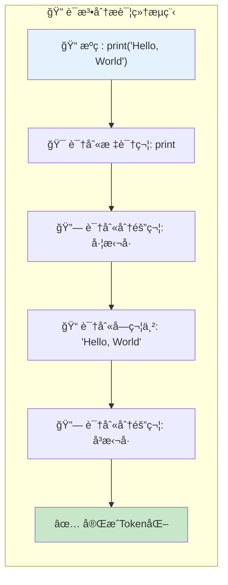
```mermaid
graph LR
    subgraph "🔠è¯æ³•åˆ†æ详细æµç¨‹"
        A["📠æºç : print('Hello, World')"] --> B["🯠识别标识符: print"]
        B --> C["🔗 识别分隔符: 左括å·"]
        C --> D["📠识别字符串: 'Hello, World'"]
        D --> E["🔗 识别分隔符: å³æ‹¬å·"]
        E --> F[✅ 完æˆToken化]
    end
    
    style A fill:#e3f2fd
    style F fill:#c8e6c9
```

#### 📋 Tokenåºåˆ—生æˆè¡¨
| ä½ç½® | 字符åºåˆ— | Tokenç±»å‹ | Token值 | å±æ€§ä¿¡æ¯ |
|------|----------|-----------|---------|----------|
| 1 | `print` | `TK_NAME` | "print" | 标识符，5字符 |
| 2 | `(` | `'('` | 40 (ASCII) | 左括å·åˆ†éš”符 |  
| 3 | `"Hello, World"` | `TK_STRING` | "Hello, World" | 字符串字é¢é‡ï¼Œ13字符 |
| 4 | `)` | `')'` | 41 (ASCII) | å³æ‹¬å·åˆ†éš”符 |
| 5 | EOF | `TK_EOS` | - | 输入结æŸæ ‡è®° |

#### âš™ï¸ å…³é”®ç®—æ³•å®ç°
```c
/* 核心è¯æ³•åˆ†æ函数 */
static int llex (LexState *ls, SemInfo *seminfo) {
  /*
  è¯æ³•åˆ†æ的核心æµç¨‹ï¼š
  
  1. 🔠跳过空白字符和注释
  2. 🯠识别Token起始字符
  3. 📊 æ ¹æ®å­—符类å‹åˆ†æ´¾å¤„ç†
  4. 📦 æ„建Token并返å›ç±»å‹
  */
  
  luaZ_resetbuffer(ls->buff);  /* é‡ç½®ç¼“冲区 */
  
  for (;;) {
    switch (ls->current) {
      case '\n': case '\r':      /* 🔄 处ç†æ¢è¡Œç¬¦ */
        inclinenumber(ls);
        break;
        
      case ' ': case '\f': case '\t': case '\v':  /* â­ï¸ 跳过空白 */
        next(ls);
        break;
        
      case '-': {                /* 🔠处ç†å‡å·æˆ–注释 */
        next(ls);
        if (ls->current != '-') return '-';
        /* 处ç†æ³¨é‡Šé€»è¾‘ */
        break;
      }
      
      case '"': case '\'':       /* 📠处ç†å­—符串 */
        read_string(ls, ls->current, seminfo);
        return TK_STRING;
        
      case '0': case '1': case '2': case '3': case '4':
      case '5': case '6': case '7': case '8': case '9': {  /* 🔢 处ç†æ•°å­— */
        read_numeral(ls, seminfo);
        return TK_NUMBER;
      }
      
      default: {
        if (lislalpha(ls->current)) {  /* ğŸ·ï¸ 处ç†æ ‡è¯†ç¬¦ */
          /* 读å–标识符或ä¿ç•™å­— */
          TString *ts;
          do {
            save_and_next(ls);
          } while (lislalnum(ls->current));
          ts = luaX_newstring(ls, luaZ_buffer(ls->buff), luaZ_bufflen(ls->buff));
          seminfo->ts = ts;
          if (ts->tsv.reserved > 0)  /* 🯠检查ä¿ç•™å­— */
            return ts->tsv.reserved - 1 + FIRST_RESERVED;
          else
            return TK_NAME;
        }
      }
    }
  }
}
```

### ğŸ› ï¸ é«˜çº§ç‰¹æ€§è§£æ

#### 🔢 数值处ç†æŠ€æœ¯
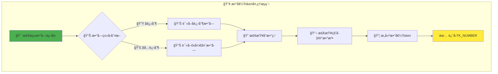
```mermaid
graph TB
    subgraph "🔢 数值Token处ç†æµç¨‹"
        A[🯠检测数字起始] --> B{📊 æ•°å­—ç±»å‹åˆ¤æ–­}
        B -->|🔟 å进制| C[📊 读å–å进制数字]
        B -->|🔣 å六进制| D[📊 读å–0x开头数字]
        C --> E[🔠检查å°æ•°ç‚¹]
        D --> E
        E --> F[🔬 检查科学记数法]
        F --> G[📦 æ„建数值Token]
        G --> H[✅ è¿”å›TK_NUMBER]
    end
    
    style A fill:#4caf50
    style H fill:#ffeb3b
```

#### 📠字符串处ç†ç­–ç•¥
```c
/* 字符串读å–的完整å®ç° */
static void read_string (LexState *ls, int del, SemInfo *seminfo) {
  /*
  字符串处ç†çš„核心功能：
  
  1. 🔠处ç†è½¬ä¹‰å­—符åºåˆ—
  2. 📠支æŒå¤šè¡Œå­—符串
  3. ğŸ›¡ï¸ æ£€æµ‹æœªç»ˆæ­¢å­—ç¬¦ä¸²
  4. 🔄 Unicode和字符编ç æ”¯æŒ
  */
  
  save_and_next(ls);  /* è·³è¿‡èµ·å§‹å¼•å· */
  
  while (ls->current != del) {
    switch (ls->current) {
      case EOZ:
        lexerror(ls, "unfinished string", TK_EOS);
        break;
        
      case '\n':
      case '\r':
        lexerror(ls, "unfinished string", TK_STRING);
        break;
        
      case '\\': {  /* 🔄 处ç†è½¬ä¹‰åºåˆ— */
        int c;  /* 转义å的字符 */
        next(ls);  /* 跳过 '\' */
        switch (ls->current) {
          case 'a': c = '\a'; break;
          case 'b': c = '\b'; break;
          case 'f': c = '\f'; break;
          case 'n': c = '\n'; break;
          case 'r': c = '\r'; break;
          case 't': c = '\t'; break;
          case 'v': c = '\v'; break;
          case '\\': c = '\\'; break;
          case '"': c = '"'; break;
          case '\'': c = '\''; break;
          /* 数字转义åºåˆ—å¤„ç† */
          default: {
            if (!lisdigit(ls->current))
              escerror(ls, &ls->current, 1, "invalid escape sequence");
            /* 读å–数字转义åºåˆ— */
          }
        }
        save(ls, c);
        next(ls);
        break;
      }
      
      default:
        save_and_next(ls);
    }
  }
  
  save_and_next(ls);  /* 跳过结æŸå¼•å· */
  seminfo->ts = luaX_newstring(ls, luaZ_buffer(ls->buff) + 1,
                                   luaZ_bufflen(ls->buff) - 2);
}
```

---

## 🌳 语法分æ阶段

### 🯠语法分æ器核心æ¶æ„

语法分æ器是编译过程的关键阶段，负责将Tokenæµè½¬æ¢ä¸ºæŠ½è±¡è¯­æ³•æ ‘(AST)，åŒæ—¶è¿›è¡Œè¯­ä¹‰åˆ†æ和代ç ç”Ÿæˆï¼š

#### ğŸ—ï¸ è¯­æ³•åˆ†æçš„åŒé‡èŒè´£
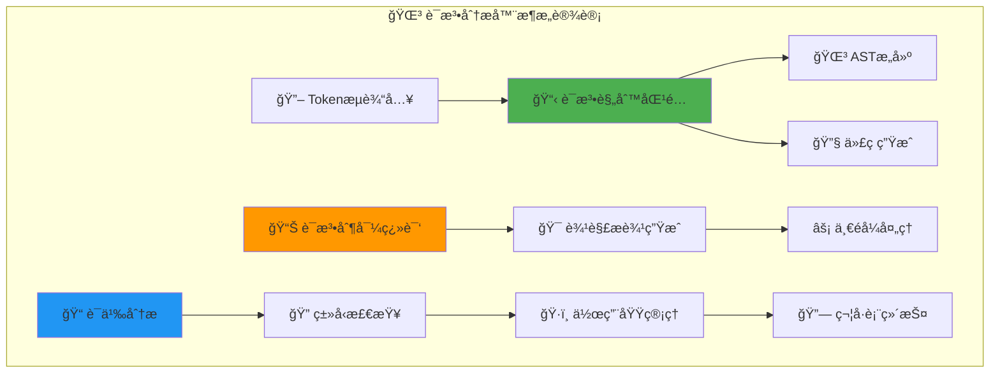
```mermaid
graph TB
    subgraph "🌳 语法分æ器æ¶æ„设计"
        A[🔖 Tokenæµè¾“å…¥] --> B[📋 语法规则匹é…]
        B --> C[🌳 ASTæ„建]
        B --> D[🔧 代ç ç”Ÿæˆ]
        
        E[📊 语法制导翻译] --> F[🯠边解æ边生æˆ]
        F --> G[âš¡ 一éå¼å¤„ç†]
        
        H[📠语义分æ] --> I[🔠类å‹æ£€æŸ¥]
        I --> J[ğŸ·ï¸ 作用域管ç†]
        J --> K[🔗 符å·è¡¨ç»´æŠ¤]
    end
    
    style B fill:#4caf50
    style E fill:#ff9800
    style H fill:#2196f3
```

#### 📊 表达å¼æ述符系统
```c
// 表达å¼çŠ¶æ€çš„完整分类系统
typedef enum {
  VVOID,      // ⌠无值表达å¼ï¼ˆè¯­å¥ï¼‰
  VNIL,       // 🔘 nil常é‡
  VTRUE,      // ✅ trueå¸¸é‡  
  VFALSE,     // ⌠false常é‡
  VK,         // 📊 常é‡è¡¨ä¸­çš„值
  VKNUM,      // 🔢 数值常é‡
  VLOCAL,     // 📠局部å˜é‡
  VUPVAL,     // â¬†ï¸ ä¸Šå€¼å˜é‡
  VGLOBAL,    // 🌠全局å˜é‡
  VINDEXED,   // 📋 表索引访问
  VJMP,       // 🔄 跳转表达å¼
  VRELOCABLE, // 🯠å¯é‡å®šä½æŒ‡ä»¤ç»“æœ
  VNONRELOC,  // 📌 固定寄存器结æœ
  VCALL,      // 📠函数调用
  VVARARG     // 📋 å¯å˜å‚æ•°
} expkind;

typedef struct expdesc {
  expkind k;                    // ğŸ·ï¸ 表达å¼ç±»å‹
  union {
    struct { int info, aux; } s; // 📊 寄存器信æ¯æˆ–跳转信æ¯
    lua_Number nval;            // 🔢 数值常é‡å€¼
  } u;
  int t;  // ✅ "为真时"跳转链表  
  int f;  // ⌠"为å‡æ—¶"跳转链表
} expdesc;
```

### 📊 å®ä¾‹åˆ†æ：`print("Hello, World")`

#### 🌳 ASTæ„建过程

```mermaid
graph TB
    subgraph "🌳 抽象语法树æ„建æµç¨‹"
        A["🯠chunk(): 代ç å—解æ"] --> B["📠statement(): 语å¥è¯†åˆ«"]
        B --> C["📠exprstat(): 表达å¼è¯­å¥"]
        C --> D["🔠primaryexp(): 主表达å¼è§£æ"]
        D --> E["ğŸ·ï¸ singlevar(): 识别'print'"]
        E --> F["📠funcargs(): å‚数列表解æ"]
        F --> G["📠str_checkname(): 字符串å‚æ•°"]
        G --> H["🔧 luaK_exp2nextreg(): 代ç ç”Ÿæˆ"]
        H --> I[✅ 完æˆASTæ„建]
    end
    
    style A fill:#4caf50
    style I fill:#ffeb3b
```

#### ğŸ›ï¸ 函数状æ€ç®¡ç†
```c
// 语法分æ过程中的函数编译状æ€
typedef struct FuncState {
  Proto *f;                    // 🯠当å‰ç¼–译的函数åŸå‹
  Table *h;                    // ğŸ—‚ï¸ å¸¸é‡è¡¨å“ˆå¸Œæ˜ å°„
  struct FuncState *prev;      // 🔙 外层函数状æ€ï¼ˆé—­åŒ…链）
  struct LexState *ls;         // 🔗 è¯æ³•åˆ†æ器状æ€
  struct lua_State *L;         // 🌠Lua虚拟机状æ€
  struct BlockCnt *bl;         // 📦 当å‰ä½œç”¨åŸŸå—
  int pc;                      // 📠下一æ¡æŒ‡ä»¤çš„ä½ç½®
  int lasttarget;              // 🯠最å跳转目标
  int jpc;                     // 🔄 待处ç†è·³è½¬é“¾è¡¨
  int freereg;                 // 🆓 第一个空闲寄存器
  int nk;                      // 📊 常é‡è¡¨å¤§å°
  int np;                      // 🔢 å­å‡½æ•°æ•°é‡
  short nlocvars;              // 📠局部å˜é‡æ€»æ•°
  lu_byte nactvar;             // 🯠当å‰æ´»è·ƒå±€éƒ¨å˜é‡æ•°
  upvaldesc upvalues[LUAI_MAXUPVALUES];  // â¬†ï¸ ä¸Šå€¼æ述数组
  unsigned short actvar[LUAI_MAXVARS];   // 📋 活跃å˜é‡æ ˆ
} FuncState;
```

### âš™ï¸ å…³é”®è§£æ算法

#### 🔠主表达å¼è§£æ
```c
/* 主表达å¼è§£æ的核心逻辑 */
static void primaryexp (LexState *ls, expdesc *v) {
  /*
  主表达å¼è§£æ的完整æµç¨‹ï¼š
  
  1. 🯠根æ®å½“å‰Token确定表达å¼ç±»å‹
  2. 📊 处ç†åŸºæœ¬å­—é¢é‡ï¼ˆnil, true, false, number, string）
  3. ğŸ·ï¸ 处ç†æ ‡è¯†ç¬¦ï¼ˆå˜é‡ã€å‡½æ•°å）
  4. 🔄 处ç†å¤æ‚表达å¼ï¼ˆè¡¨æ„造器ã€å‡½æ•°å®šä¹‰ï¼‰
  5. 📠处ç†å缀表达å¼ï¼ˆå‡½æ•°è°ƒç”¨ã€ç´¢å¼•è®¿é—®ï¼‰
  */
  
  FuncState *fs = ls->fs;
  switch (ls->t.token) {
    case '(': {  /* 🔄 括å·è¡¨è¾¾å¼ */
      int line = ls->linenumber;
      luaX_next(ls);  /* 跳过 '(' */
      expr(ls, v);    /* 解æå†…éƒ¨è¡¨è¾¾å¼ */
      check_match(ls, ')', '(', line);  /* 检查匹é…çš„ ')' */
      luaK_dischargevars(fs, v);  /* 处ç†å˜é‡è§£å¼•ç”¨ */
      return;
    }
    
    case TK_NIL: {   /* 🔘 nilå­—é¢é‡ */
      init_exp(v, VNIL, 0);
      break;
    }
    
    case TK_TRUE: {  /* ✅ trueå­—é¢é‡ */
      init_exp(v, VTRUE, 0);
      break;
    }
    
    case TK_FALSE: { /* ⌠falseå­—é¢é‡ */
      init_exp(v, VFALSE, 0);
      break;
    }
    
    case TK_NUMBER: { /* 🔢 数值字é¢é‡ */
      init_exp(v, VKNUM, 0);
      v->u.nval = ls->t.seminfo.r;
      break;
    }
    
    case TK_STRING: { /* 📠字符串字é¢é‡ */
      codestring(ls, v, ls->t.seminfo.ts);
      break;
    }
    
    case TK_NAME: {   /* ğŸ·ï¸ 标识符 */
      singlevar(ls, v);
      return;
    }
    
    default: {
      luaX_syntaxerror(ls, "unexpected symbol");
      return;
    }
  }
  luaX_next(ls);  /* 消费当å‰Token */
}
```

#### 📠函数调用解æ
```c
/* 函数å‚数列表解æ */
static void funcargs (LexState *ls, expdesc *f) {
  /*
  函数å‚数解æ的处ç†ç­–略：
  
  1. 📋 支æŒå¤šç§å‚æ•°å½¢å¼ï¼š
     - (expr, expr, ...) 标准å‚数列表
     - "string" å•ä¸ªå­—符串å‚æ•°
     - {field=value, ...} 表æ„造器å‚æ•°
  
  2. 🔧 边解æ边生æˆä»£ç ï¼š
     - å‚数表达å¼ç›´æ¥ç”Ÿæˆåˆ°è¿ç»­å¯„存器
     - 优化函数调用的å‚数传递
  */
  
  FuncState *fs = ls->fs;
  expdesc args;
  int base, nparams;
  int line = ls->linenumber;
  
  switch (ls->t.token) {
    case '(': {  /* 📋 标准å‚数列表 */
      if (line != ls->lastline)
        luaX_syntaxerror(ls, "ambiguous syntax (function call x new statement)");
      luaX_next(ls);
      if (ls->t.token == ')')  /* 🔄 空å‚数列表？ */
        args.k = VVOID;
      else {
        explist1(ls, &args);   /* 解æå‚数表达å¼åˆ—表 */
        luaK_setmultret(fs, &args);  /* 处ç†å¤šè¿”å›å€¼ */
      }
      check_match(ls, ')', '(', line);
      break;
    }
    
    case '{': {  /* 📊 表æ„造器作为å‚æ•° */
      constructor(ls, &args);
      break;
    }
    
    case TK_STRING: {  /* 📠字符串字é¢é‡ä½œä¸ºå‚æ•° */
      codestring(ls, &args, ls->t.seminfo.ts);
      luaX_next(ls);  /* 必须立å³æ¶ˆè´¹å­—符串token */
      break;
    }
    
    default: {
      luaX_syntaxerror(ls, "function arguments expected");
      return;
    }
  }
  
  lua_assert(f->k == VNONRELOC);
  base = f->u.s.info;  /* 函数在寄存器中的ä½ç½® */
  if (hasmultret(args.k))
    nparams = LUA_MULTRET;  /* 多返å›å€¼å‚æ•° */
  else {
    if (args.k != VVOID)
      luaK_exp2nextreg(fs, &args);  /* 关闭å‚数列表 */
    nparams = fs->freereg - (base+1);
  }
  init_exp(f, VCALL, luaK_codeABC(fs, OP_CALL, base, nparams+1, 2));
  luaK_fixline(fs, line);
  fs->freereg = base+1;  /* 调用å清ç†å¯„存器 */
}
```

---

## 🔧 代ç ç”Ÿæˆé˜¶æ®µ

### 🯠字节ç ç”Ÿæˆæ ¸å¿ƒæœºåˆ¶

代ç ç”Ÿæˆé˜¶æ®µå°†è¯­æ³•åˆ†æ的结æœè½¬æ¢ä¸ºLua虚拟机å¯æ‰§è¡Œçš„字节ç æŒ‡ä»¤ï¼š

#### âš¡ 指令生æˆç­–ç•¥
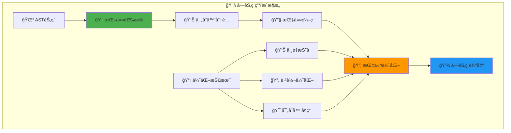
```mermaid
graph TB
    subgraph "🔧 字节ç ç”Ÿæˆæ¶æ„"
        A[🌳 AST节点] --> B[🯠指令选择]
        B --> C[📊 寄存器分é…]
        C --> D[🔧 指令编ç ]
        D --> E[📦 指令优化]
        E --> F[💾 字节ç è¾“出]
        
        G[📋 优化技术] --> H[📊 常é‡æŠ˜å ]
        G --> I[🔄 跳转优化]
        G --> J[🯠寄存器å¤ç”¨]
        
        H --> E
        I --> E
        J --> E
    end
    
    style B fill:#4caf50
    style E fill:#ff9800
    style F fill:#2196f3
```

#### ğŸ›ï¸ 核心生æˆå‡½æ•°
```c
// 主è¦çš„字节ç ç”Ÿæˆå‡½æ•°æ—
/* ABCæ ¼å¼æŒ‡ä»¤ç”Ÿæˆ */
int luaK_codeABC (FuncState *fs, OpCode o, int a, int b, int c) {
  /*
  ABC指令格å¼çš„ç¼–ç è¿‡ç¨‹ï¼š
  
  1. 🔠验è¯æŒ‡ä»¤æ ¼å¼å’Œå‚数范围
  2. 🔧 æ„造32ä½æŒ‡ä»¤å­—
  3. 📠写入指令æµ
  4. 📠返å›æŒ‡ä»¤ä½ç½®
  */
  Instruction i;
  lua_assert(getOpMode(o) == iABC);
  lua_assert(getBMode(o) != OpArgN || b == 0);
  lua_assert(getCMode(o) != OpArgN || c == 0);
  i = CREATE_ABC(o, a, b, c);
  return luaK_code(fs, i, fs->ls->lastline);
}

/* ABxæ ¼å¼æŒ‡ä»¤ç”Ÿæˆ */  
int luaK_codeABx (FuncState *fs, OpCode o, int a, unsigned int bc) {
  /*
  ABx指令格å¼ç”¨äºï¼š
  - 📊 LOADK指令（加载常é‡ï¼‰
  - 🌠GETGLOBAL指令（è·å–全局å˜é‡ï¼‰
  - 📠CLOSURE指令（创建闭包）
  */
  Instruction i;
  lua_assert(getOpMode(o) == iABx || getOpMode(o) == iAsBx);
  lua_assert(getCMode(o) == OpArgN);
  i = CREATE_ABx(o, a, bc);
  return luaK_code(fs, i, fs->ls->lastline);
}
```

### 📊 å®ä¾‹åˆ†æ：字节ç ç”Ÿæˆè¿‡ç¨‹

#### 🔄 `print("Hello, World")`的完整生æˆæµç¨‹
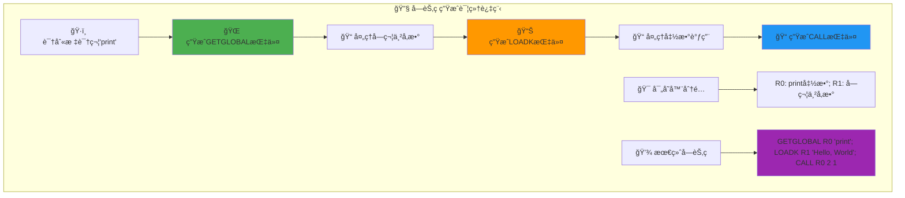
```mermaid
graph TB
    subgraph "🔧 字节ç ç”Ÿæˆè¯¦ç»†è¿‡ç¨‹"
        A[ğŸ·ï¸ 识别标识符'print'] --> B[🌠生æˆGETGLOBAL指令]
        B --> C[📠处ç†å­—符串å‚æ•°] --> D[📊 生æˆLOADK指令]
        D --> E[📠处ç†å‡½æ•°è°ƒç”¨] --> F[📠生æˆCALL指令]
        
        G[🯠寄存器分é…] --> H["R0: print函数; R1: 字符串å‚æ•°"]
        
        I[💾 最终字节ç ] --> J["GETGLOBAL R0 'print'; LOADK R1 'Hello, World'; CALL R0 2 1"]
    end
    
    style B fill:#4caf50
    style D fill:#ff9800  
    style F fill:#2196f3
    style J fill:#9c27b0
```

#### 📋 指令生æˆåºåˆ—表
| 步骤 | 语法元素 | 生æˆæŒ‡ä»¤ | 寄存器使用 | è¯´æ˜ |
|------|----------|----------|-----------|------|
| 1 | `print` | `GETGLOBAL R0 "print"` | R0=函数 | ä»å…¨å±€ç¯å¢ƒè·å–print函数 |
| 2 | `"Hello, World"` | `LOADK R1 "Hello, World"` | R1=字符串 | 加载字符串常é‡åˆ°å¯„存器 |
| 3 | `print(...)` | `CALL R0 2 1` | R0+å‚æ•° | 调用函数，2个slot，1个返å›å€¼ |

### 🯠高级优化技术

#### 📊 常é‡æŠ˜å å®ç°
```c
/* 编译时常é‡è®¡ç®—优化 */
static int constfolding (OpCode op, expdesc *e1, expdesc *e2) {
  /*
  常é‡æŠ˜å çš„优化场景：
  
  1. 🧮 算术è¿ç®—：2 + 3 → 5
  2. 🔤 字符串è¿æ¥ï¼š"a" .. "b" → "ab"  
  3. 🔠比较è¿ç®—：1 < 2 → true
  4. 🔠逻辑è¿ç®—：true and false → false
  */
  
  lua_Number v1, v2, r;
  if (!isnumeral(e1) || !isnumeral(e2)) return 0;
  v1 = e1->u.nval;
  v2 = e2->u.nval;
  
  switch (op) {
    case OP_ADD: r = luai_numadd(v1, v2); break;
    case OP_SUB: r = luai_numsub(v1, v2); break;
    case OP_MUL: r = luai_nummul(v1, v2); break;
    case OP_DIV:
      if (v2 == 0) return 0;  /* 🚨 é¿å…除零 */
      r = luai_numdiv(v1, v2); break;
    case OP_MOD: r = luai_nummod(v1, v2); break;
    case OP_POW: r = luai_numpow(v1, v2); break;
    case OP_UNM: r = luai_numunm(v1); break;
    case OP_LEN: return 0;  /* 📠长度è¿ç®—æ— æ³•æŠ˜å  */
    default: lua_assert(0); return 0;
  }
  
  if (luai_numisnan(r)) return 0;  /* 🚫 é¿å…NaNç»“æœ */
  e1->u.nval = r;
  return 1;  /* ✅ 折å æˆåŠŸ */
}
```

#### 🔄 跳转优化机制
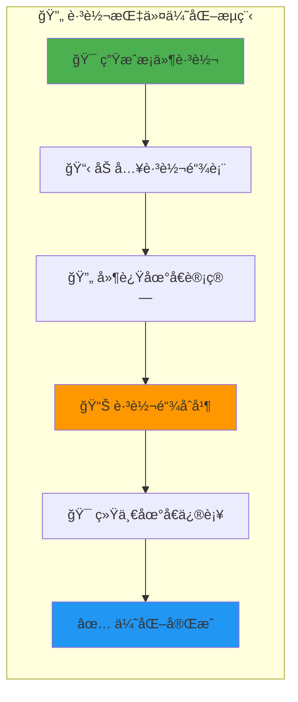
```mermaid
graph LR
    subgraph "🔄 跳转指令优化æµç¨‹"
        A[🯠生æˆæ¡ä»¶è·³è½¬] --> B[📋 加入跳转链表]
        B --> C[🔄 延迟地å€è®¡ç®—]
        C --> D[📊 跳转链åˆå¹¶]
        D --> E[🯠统一地å€ä¿®è¡¥]
        E --> F[✅ 优化完æˆ]
    end
    
    style A fill:#4caf50
    style D fill:#ff9800
    style F fill:#2196f3
```

## ⚡ 虚拟机执行阶段

### 🯠Lua虚拟机核心æ¶æ„

Lua虚拟机是一个基äºå¯„存器的栈å¼è™šæ‹Ÿæœºï¼Œè´Ÿè´£æ‰§è¡Œç¼–译生æˆçš„字节ç ï¼š

#### ğŸ—ï¸ è™šæ‹Ÿæœºè®¾è®¡ç†å¿µ
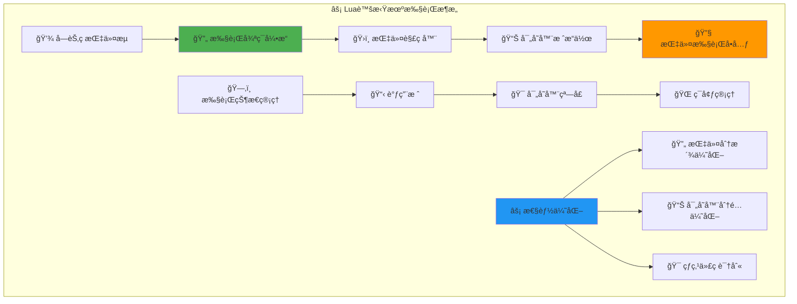
```mermaid
graph TB
    subgraph "âš¡ Lua虚拟机执行æ¶æ„"
        A[💾 字节ç æŒ‡ä»¤æµ] --> B[🔄 执行循ç¯å¼•æ“]
        B --> C[ğŸ›ï¸ 指令解ç å™¨]
        C --> D[📊 寄存器栈æ“作]
        D --> E[🔧 指令执行å•å…ƒ]
        
        F[ğŸ—‚ï¸ æ‰§è¡ŒçŠ¶æ€ç®¡ç†] --> G[📋 调用栈]
        G --> H[🯠寄存器窗å£]
        H --> I[🌠ç¯å¢ƒç®¡ç†]
        
        J[⚡ 性能优化] --> K[🔄 指令分派优化]
        J --> L[📊 寄存器分é…优化]
        J --> M[🯠热点代ç è¯†åˆ«]
    end
    
    style B fill:#4caf50
    style E fill:#ff9800
    style J fill:#2196f3
```

#### ğŸ›ï¸ 核心执行循ç¯
```c
/* Lua虚拟机的心è„ï¼šä¸»æ‰§è¡Œå¾ªç¯ */
void luaV_execute (lua_State *L, int nexeccalls) {
  /*
  虚拟机执行循ç¯çš„核心设计：
  
  1. 🔄 æ— é™å¾ªç¯æ‰§è¡ŒæŒ‡ä»¤
  2. 🯠基äºgoto的分派表优化
  3. 📊 ç›´æ¥æ“作寄存器栈
  4. âš¡ 最å°åŒ–函数调用开销
  */
  
  LClosure *cl;
  StkId base;
  TValue *k;
  const Instruction *pc;
  
reentry:  /* 🔄 é‡å…¥ç‚¹ï¼Œç”¨äºå‡½æ•°è°ƒç”¨è¿”å› */
  lua_assert(isLua(L->ci));
  pc = L->savedpc;
  cl = &clvalue(L->ci->func)->l;
  base = L->base;
  k = cl->p->k;  /* ğŸ—‚ï¸ å¸¸é‡è¡¨ */
  
  /* 🚀 ä¸»æ‰§è¡Œå¾ªç¯ */
  for (;;) {
    const Instruction i = *pc++;
    StkId ra;
    
    /* 📊 快速解ç æŒ‡ä»¤çš„A字段 */
    if ((L->hookmask & (LUA_MASKLINE | LUA_MASKCOUNT)) &&
        (--L->hookcount == 0 || L->hookmask & LUA_MASKLINE)) {
      traceexec(L, pc);  /* 🔠调试钩å­å¤„ç† */
      if (L->status == LUA_YIELD) {  /* 🔄 å程让步检查 */
        L->savedpc = pc - 1;
        return;
      }
      base = L->base;  /* 🔄 é’©å­å¯èƒ½æ”¹å˜æ ˆ */
    }
    
    ra = RA(i);  /* 🯠è·å–ç›®æ ‡å¯„å­˜å™¨åœ°å€ */
    lua_assert(base == L->base && L->base == L->ci->base);
    lua_assert(base <= L->top && L->top <= L->stack + L->stacksize);
    lua_assert(L->top == L->ci->top || luaG_checkopenop(i));
    
    /* 🔄 指令分派：使用计算跳转表优化 */
    switch (GET_OPCODE(i)) {
      
      case OP_MOVE: {  /* 📋 寄存器间移动 */
        setobjs2s(L, ra, RB(i));
        continue;
      }
      
      case OP_LOADK: {  /* 📊 åŠ è½½å¸¸é‡ */
        setobj2s(L, ra, KBx(i));
        continue;
      }
      
      case OP_GETGLOBAL: {  /* 🌠è·å–全局å˜é‡ */
        TValue g;
        TValue *rb = KBx(i);
        sethvalue(L, &g, cl->env);  /* 🌠è·å–ç¯å¢ƒè¡¨ */
        lua_assert(ttisstring(rb));
        Protect(luaV_gettable(L, &g, rb, ra));  /* 🔠表查找 */
        continue;
      }
      
      case OP_CALL: {  /* 📠函数调用 */
        int b = GETARG_B(i);  /* 🔢 å‚数个数 */
        int nresults = GETARG_C(i) - 1;  /* 📋 è¿”å›å€¼ä¸ªæ•° */
        if (b != 0) L->top = ra+b;  /* 🯠设置调用栈顶 */
        L->savedpc = pc;  /* 💾 ä¿å­˜ç¨‹åºè®¡æ•°å™¨ */
        switch (luaD_precall(L, ra, nresults)) {
          case PCRLUA: {  /* 🯠Lua函数调用 */
            nexeccalls++;
            goto reentry;  /* 🔄 é‡æ–°è¿›å…¥æ‰§è¡Œå¾ªç¯ */
          }
          case PCRJ: {  /* 📠Cå‡½æ•°è°ƒç”¨å®Œæˆ */
            /* 结æœå·²ç»åœ¨æ ˆä¸Š */
            if (nresults >= 0) L->top = L->ci->top;
            continue;
          }
          default: {
            return;  /* 🔄 让步或错误 */
          }
        }
      }
      
      /* ... 其他指令的å®ç° ... */
    }
  }
}
```

### 📊 å®ä¾‹åˆ†æ：指令执行æµç¨‹

#### 🔄 `print("Hello, World")`的虚拟机执行

```mermaid
graph TB
    subgraph "âš¡ 虚拟机执行详细æµç¨‹"
        A[🯠PC指å‘GETGLOBAL] --> B[🔠解ç æŒ‡ä»¤å‚æ•°]
        B --> C[🌠访问全局ç¯å¢ƒè¡¨] --> D[🔠查找'print'标识符]
        D --> E[📋 将函数存入R0]
        
        E --> F[📠PC指å‘LOADK] --> G[📊 ä»å¸¸é‡è¡¨è·å–字符串]
        G --> H[📋 将字符串存入R1]
        
        H --> I[📠PC指å‘CALL] --> J[🔧 设置调用å‚æ•°]
        J --> K[📠执行函数调用] --> L[📤 处ç†è¿”å›å€¼]
        L --> M[✅ 执行完æˆ]
    end
    
    style A fill:#4caf50
    style K fill:#ff9800
    style M fill:#2196f3
```

#### 📋 寄存器状æ€å˜åŒ–表
| 执行阶段 | PC | 指令 | R0çŠ¶æ€ | R1çŠ¶æ€ | 栈顶ä½ç½® |
|----------|----|----|-------|-------|---------|
| åˆå§‹ | 0 | - | `nil` | `nil` | base |
| GETGLOBAL | 1 | `GETGLOBAL R0 "print"` | `function: print` | `nil` | base |
| LOADK | 2 | `LOADK R1 "Hello, World"` | `function: print` | `"Hello, World"` | base |
| CALL | 3 | `CALL R0 2 1` | `nil` (调用å) | `nil` (调用å) | base+1 |

### ğŸ›ï¸ 关键执行机制

#### 🔠指令解ç ä¸å‚æ•°æå–
```c
/* 指令格å¼è§£ç çš„高效å®ç° */
#define GET_OPCODE(i)    (cast(OpCode, ((i)>>POS_OP) & MASK1(SIZE_OP,0)))
#define GETARG_A(i)      (cast(int, ((i)>>POS_A) & MASK1(SIZE_A,0)))
#define GETARG_B(i)      (cast(int, ((i)>>POS_B) & MASK1(SIZE_B,0)))
#define GETARG_C(i)      (cast(int, ((i)>>POS_C) & MASK1(SIZE_C,0)))
#define GETARG_Bx(i)     (cast(int, ((i)>>POS_Bx) & MASK1(SIZE_Bx,0)))
#define GETARG_sBx(i)    (GETARG_Bx(i)-MAXARG_sBx)

/* 寄存器地å€è®¡ç®—çš„å®å®šä¹‰ */
#define RA(i)    (base+GETARG_A(i))       /* 🯠目标寄存器 */
#define RB(i)    check_exp(getBMode(GET_OPCODE(i)) == OpArgR, base+GETARG_B(i))
#define RC(i)    check_exp(getCMode(GET_OPCODE(i)) == OpArgR, base+GETARG_C(i))
#define RKB(i)   check_exp(getBMode(GET_OPCODE(i)) == OpArgK, \
        ISK(GETARG_B(i)) ? k+INDEXK(GETARG_B(i)) : base+GETARG_B(i))
#define RKC(i)   check_exp(getCMode(GET_OPCODE(i)) == OpArgK, \
        ISK(GETARG_C(i)) ? k+INDEXK(GETARG_C(i)) : base+GETARG_C(i))
#define KBx(i)   check_exp(getBMode(GET_OPCODE(i)) == OpArgK, k+GETARG_Bx(i))
```

#### 🌠全局å˜é‡è®¿é—®ä¼˜åŒ–
```c
/* 全局å˜é‡è®¿é—®çš„高效å®ç° */
case OP_GETGLOBAL: {
  /*
  全局å˜é‡è®¿é—®çš„优化策略：
  
  1. 🯠直æ¥è®¿é—®ç¯å¢ƒè¡¨ï¼Œé¿å…字符串哈希é‡å¤è®¡ç®—
  2. 📊 åˆ©ç”¨å…ƒè¡¨æœºåˆ¶æ”¯æŒ _ENV 自定义
  3. 🔠内è”常è§çš„表查找æ“作
  4. âš¡ é¿å…创建临时Lua对象
  */
  
  TValue g;
  TValue *rb = KBx(i);  /* ğŸ·ï¸ 全局å˜é‡å（常é‡ï¼‰ */
  
  /* 🌠è·å–当å‰ç¯å¢ƒè¡¨ */
  sethvalue(L, &g, cl->env);
  lua_assert(ttisstring(rb));
  
  /* 🔠执行表查找æ“作 */
  Protect(luaV_gettable(L, &g, rb, ra));
  continue;
}

/* 表查找的核心å®ç° */
void luaV_gettable (lua_State *L, const TValue *t, TValue *key, StkId val) {
  /*
  表查找æ“作的完整æµç¨‹ï¼š
  
  1. 🔠检查对象类å‹ï¼ˆè¡¨ã€ç”¨æˆ·æ•°æ®ç­‰ï¼‰
  2. 📊 å°è¯•ç›´æ¥å“ˆå¸Œè¡¨æŸ¥æ‰¾
  3. 🔄 处ç†å…ƒæ–¹æ³• __index
  4. 🯠递归查找åŸå‹é“¾
  */
  
  int loop;
  for (loop = 0; loop < MAXTAGLOOP; loop++) {
    const TValue *tm;
    if (ttistable(t)) {  /* 📊 标准表查找 */
      Table *h = hvalue(t);
      const TValue *res = luaH_get(h, key);  /* 🔠哈希表查找 */
      if (!ttisnil(res) ||  /* ğŸ¯ æ‰¾åˆ°ç»“æœ */
          (tm = fasttm(L, h->metatable, TM_INDEX)) == NULL) { /* 🚫 无__index元方法 */
        setobj2s(L, val, res);
        return;
      }
      /* 🔄 å°è¯•__index元方法 */
    }
    else if (ttisnil(tm = luaT_gettmbyobj(L, t, TM_INDEX)))
      luaG_typeerror(L, t, "index");  /* 🚨 ç±»å‹é”™è¯¯ */
    
    if (ttisfunction(tm)) {  /* 📠__index是函数 */
      callTMres(L, val, tm, t, key);
      return;
    }
    t = tm;  /* 🔄 __index是表，继续查找 */
  }
  luaG_runerror(L, "loop in gettable");  /* 🔄 循ç¯è¿‡æ·±é”™è¯¯ */
}
```

---

## 📠函数调用ä¸è¿”å›æœºåˆ¶

### 🯠函数调用的完整生命周期

函数调用是Lua执行的核心机制，涉åŠå‚数传递ã€æ ˆå¸§ç®¡ç†ã€è¿”å›å€¼å¤„ç†ç­‰å¤šä¸ªæ–¹é¢ï¼š

#### ğŸ—ï¸ è°ƒç”¨æ ˆç®¡ç†æ¶æ„
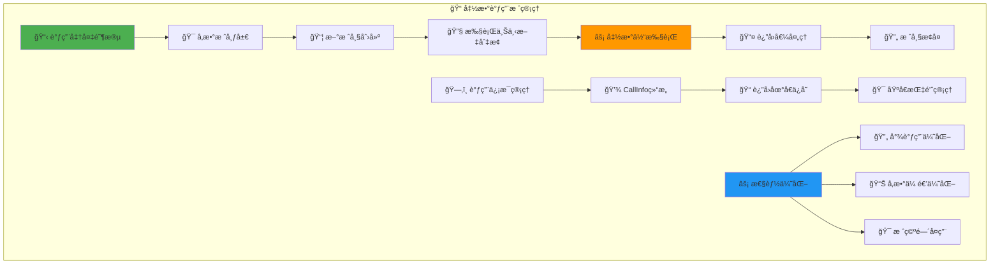
```mermaid
graph TB
    subgraph "📠函数调用栈管ç†"
        A[📋 调用准备阶段] --> B[🯠å‚数栈布局]
        B --> C[📦 新栈帧创建]
        C --> D[🔧 执行上下文切æ¢]
        D --> E[⚡ 函数体执行]
        E --> F[📤 è¿”å›å€¼å¤„ç†]
        F --> G[🔄 栈帧æ¢å¤]
        
        H[ğŸ—‚ï¸ è°ƒç”¨ä¿¡æ¯ç®¡ç†] --> I[💾 CallInfo结æ„]
        I --> J[📠返å›åœ°å€ä¿å­˜]
        J --> K[🯠基å€æŒ‡é’ˆç®¡ç†]
        
        L[⚡ 性能优化] --> M[🔄 尾调用优化]
        L --> N[📊 å‚数传递优化]
        L --> O[🯠栈空间å¤ç”¨]
    end
    
    style A fill:#4caf50
    style E fill:#ff9800
    style L fill:#2196f3
```

#### 📊 CallInfo结æ„详解
```c
/* 函数调用信æ¯çš„完整数æ®ç»“æ„ */
typedef struct CallInfo {
  StkId base;              /* 🯠函数的基å€æŒ‡é’ˆ */
  StkId func;              /* 📠函数对象在栈中的ä½ç½® */
  StkId top;               /* 📊 函数å¯ç”¨æ ˆç©ºé—´çš„顶部 */
  const Instruction *savedpc;  /* 💾 ä¿å­˜çš„程åºè®¡æ•°å™¨ */
  int nresults;            /* 📋 期望的返å›å€¼æ•°é‡ */
  int tailcalls;           /* 🔄 尾调用计数器 */
} CallInfo;

/* 调用栈的动æ€ç®¡ç† */
typedef struct lua_State {
  /* ... 其他字段 ... */
  StkId top;               /* 📊 当å‰æ ˆé¡¶ */
  StkId base;              /* 🯠当å‰å‡½æ•°åŸºå€ */
  CallInfo *ci;            /* 📋 当å‰è°ƒç”¨ä¿¡æ¯ */
  CallInfo *end_ci;        /* 🔚 调用栈结æŸä½ç½® */
  CallInfo base_ci[LUAI_MAXCALLS];  /* 📦 调用信æ¯æ•°ç»„ */
  /* ... */
} lua_State;
```

### 🔧 `print("Hello, World")`的完整调用过程

#### 📋 调用预处ç†é˜¶æ®µ
```c
/* 函数调用的预处ç†ï¼šluaD_precall */
int luaD_precall (lua_State *L, StkId func, int nresults) {
  /*
  函数调用预处ç†çš„关键步骤：
  
  1. 🔠识别函数类å‹ï¼ˆLua函数 vs C函数）
  2. 📊 验è¯å‚æ•°æ•°é‡å’Œç±»å‹
  3. 🯠设置新的执行ç¯å¢ƒ
  4. 💾 ä¿å­˜å½“å‰æ‰§è¡ŒçŠ¶æ€
  */
  
  LClosure *cl;
  ptrdiff_t funcr;
  
  if (!ttisfunction(func))  /* 🚨 é函数对象错误 */
    func = tryfuncTM(L, func);  /* å°è¯• __call 元方法 */
  
  funcr = savestack(L, func);  /* 💾 ä¿å­˜å‡½æ•°ä½ç½® */
  cl = &clvalue(func)->l;
  
  /* 📊 检查栈空间是å¦è¶³å¤Ÿ */
  if (!cl->isC) {  /* 🯠Lua函数调用 */
    CallInfo *ci;
    StkId st, base;
    Proto *p = cl->p;
    
    /* 📠å‚æ•°æ•°é‡æ£€æŸ¥å’Œè°ƒæ•´ */
    luaD_checkstack(L, p->maxstacksize);
    func = restorestack(L, funcr);
    
    if (!p->is_vararg) {  /* 🯠固定å‚数函数 */
      for (st = L->top; st < func + 1 + p->numparams; st++)
        setnilvalue(st);  /* 🔘 缺失å‚æ•°è¡¥nil */
      L->top = func + 1 + p->numparams;
    }
    else {  /* 📋 å¯å˜å‚数函数 */
      int nargs = cast_int(L->top - func) - 1;  /* 🔢 å®é™…å‚æ•°æ•°é‡ */
      base = adjust_varargs(L, p, nargs);  /* 🔧 调整å¯å˜å‚æ•° */
      func = restorestack(L, funcr);  /* 🔄 æ¢å¤å‡½æ•°ä½ç½® */
    }
    
    /* 📦 åˆ›å»ºæ–°çš„è°ƒç”¨ä¿¡æ¯ */
    ci = ++L->ci;  /* 🔠æ¨è¿›è°ƒç”¨æ ˆ */
    L->base = (ci-1)->top = base;  /* ğŸ¯ è®¾ç½®åŸºå€ */
    ci->func = func;
    ci->base = base;
    ci->top = base + p->maxstacksize;  /* 📊 设置栈顶 */
    lua_assert(ci->top <= L->stack_last);
    L->savedpc = p->code;  /* 💾 设置程åºè®¡æ•°å™¨ */
    ci->savedpc = p->code;
    ci->tailcalls = 0;
    ci->nresults = nresults;  /* 📋 期望返å›å€¼æ•°é‡ */
    
    /* 🔘 åˆå§‹åŒ–局部å˜é‡ä¸ºnil */
    for (st = L->top; st < ci->top; st++)
      setnilvalue(st);
    L->top = ci->top;
    
    return PCRLUA;  /* 🯠返å›Lua函数调用标志 */
  }
  else {  /* 📠C函数调用 */
    CallInfo *ci;
    int n;
    
    /* 📦 C函数调用信æ¯è®¾ç½® */
    luaD_checkstack(L, LUA_MINSTACK);
    ci = ++L->ci;
    L->base = (ci-1)->top = func + 1;
    ci->func = func;
    ci->base = func + 1;
    ci->top = L->top + LUA_MINSTACK;
    lua_assert(ci->top <= L->stack_last);
    ci->nresults = nresults;
    ci->tailcalls = 0;
    
    /* 📠执行C函数 */
    n = (*clvalue(func)->c.f)(L);  /* 🔧 调用C函数指针 */
    
    /* 📤 处ç†C函数返å›å€¼ */
    if (n < 0)  /* 🔄 让步标志 */
      return PCRYIELD;
    else {
      luaD_poscall(L, L->top - n);  /* 📋 处ç†è¿”å›å€¼ */
      return PCRJ;  /* 📠Cå‡½æ•°è°ƒç”¨å®Œæˆ */
    }
  }
}
```

#### 📤 函数返å›å¤„ç†
```c
/* 函数返å›çš„å处ç†ï¼šluaD_poscall */
int luaD_poscall (lua_State *L, StkId firstResult) {
  /*
  函数返å›å¤„ç†çš„核心任务：
  
  1. 📋 æ•´ç†è¿”å›å€¼åˆ°æ­£ç¡®ä½ç½®
  2. 🔄 æ¢å¤è°ƒç”¨è€…的执行状æ€
  3. 📊 调整栈顶指针
  4. 🯠返å›è°ƒç”¨ç»“æœ
  */
  
  StkId res;
  int wanted, i;
  CallInfo *ci;
  
  ci = L->ci--;  /* 🔙 å¼¹å‡ºè°ƒç”¨ä¿¡æ¯ */
  res = ci->func;  /* 🯠返å›å€¼å­˜å‚¨ä½ç½® */
  wanted = ci->nresults;  /* 📋 期望返å›å€¼æ•°é‡ */
  L->base = (ci-1)->base;  /* 🔄 æ¢å¤åŸºå€æŒ‡é’ˆ */
  L->savedpc = (ci-1)->savedpc;  /* 💾 æ¢å¤ç¨‹åºè®¡æ•°å™¨ */
  
  /* 📋 移动返å›å€¼åˆ°æ­£ç¡®ä½ç½® */
  for (i = wanted; i != 0 && firstResult < L->top; i--)
    setobjs2s(L, res++, firstResult++);  /* 📊 å¤åˆ¶è¿”å›å€¼ */
  
  while (i-- > 0)
    setnilvalue(res++);  /* 🔘 多余ä½ç½®å¡«nil */
  
  L->top = res;  /* 📊 调整栈顶 */
  return (wanted - LUA_MULTRET);  /* 🔢 è¿”å›å®é™…è¿”å›å€¼æ•°é‡ */
}
```

### âš¡ 性能优化：尾调用处ç†

#### 🔄 尾调用优化的核心机制
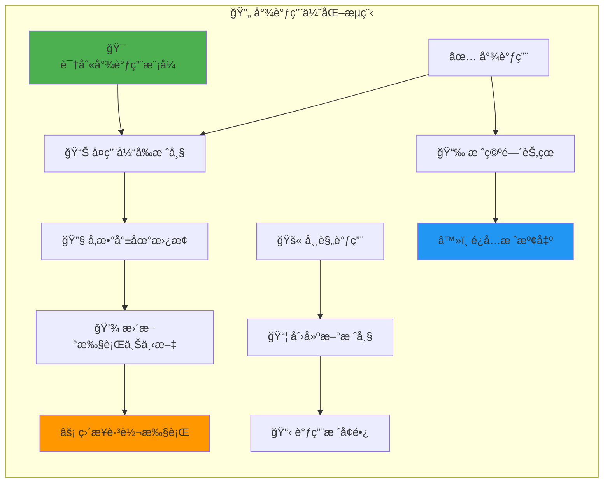
```mermaid
graph LR
    subgraph "🔄 尾调用优化æµç¨‹"
        A[🯠识别尾调用模å¼] --> B[📊 å¤ç”¨å½“å‰æ ˆå¸§]
        B --> C[🔧 å‚数就地替æ¢]
        C --> D[💾 更新执行上下文]
        D --> E[âš¡ ç›´æ¥è·³è½¬æ‰§è¡Œ]
        
        F[🚫 常规调用] --> G[📦 创建新栈帧]
        G --> H[📋 调用栈å¢é•¿]
        
        I[✅ 尾调用] --> B
        I --> J[📉 栈空间节çœ]
        J --> K[â™»ï¸ é¿å…栈溢出]
    end
    
    style A fill:#4caf50
    style E fill:#ff9800
    style K fill:#2196f3
```

```c
/* 尾调用优化的å®ç° */
case OP_TAILCALL: {
  /*
  尾调用优化的关键策略：
  
  1. 🔄 å¤ç”¨å½“å‰å‡½æ•°çš„栈帧
  2. 📊 é¿å…调用栈无é™å¢é•¿  
  3. âš¡ å‡å°‘函数调用开销
  4. 🯠支æŒçœŸæ­£çš„尾递归
  */
  
  int b = GETARG_B(i);  /* 🔢 å‚æ•°æ•°é‡ */
  if (b != 0) L->top = ra+b;  /* 📊 调整栈顶 */
  
  lua_assert(GETARG_C(i) - 1 == LUA_MULTRET);
  if (luaD_precall(L, ra, LUA_MULTRET) == PCRLUA) {  /* 🯠Lua函数？ */
    /* 🔄 尾调用优化：å¤ç”¨æ ˆå¸§ */
    CallInfo *ci = L->ci - 1;  /* 🔙 è·å–è°ƒç”¨è€…ä¿¡æ¯ */
    CallInfo *lim = L->ci;     /* 📊 当å‰è°ƒç”¨ä¿¡æ¯ */
    StkId tb = ci->top;        /* 🯠调用者栈顶 */
    
    /* 📋 移动å‚数到调用者栈帧 */
    while (lim->base < L->top)
      setobjs2s(L, tb++, lim->base++);
    
    ci->top = tb;              /* 📊 更新调用者栈顶 */
    lua_assert(ci->top <= L->stack_last);
    
    ci->savedpc = L->savedpc;  /* 💾 æ›´æ–°è¿”å›åœ°å€ */
    ci->tailcalls++;           /* 🔢 å¢åŠ å°¾è°ƒç”¨è®¡æ•° */
    L->ci--;                   /* 🔙 弹出当å‰æ ˆå¸§ */
    L->base = L->ci->base;     /* 🯠æ¢å¤åŸºå€ */
    goto reentry;              /* 🔄 é‡æ–°è¿›å…¥æ‰§è¡Œå¾ªç¯ */
  }
  continue;
}
```

## 🚀 高级优化技术ä¸æ€§èƒ½åˆ†æ

### âš¡ 执行引æ“的深度优化

Lua虚拟机通过多层次的优化技术å®ç°é«˜æ€§èƒ½æ‰§è¡Œï¼š

#### 🯠指令级优化策略
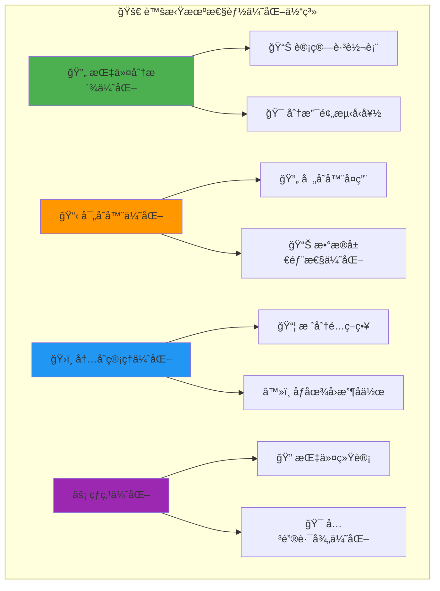
```mermaid
graph TB
    subgraph "🚀 虚拟机性能优化体系"
        A[🔄 指令分派优化] --> B[📊 计算跳转表]
        A --> C[🯠分支预测å‹å¥½]
        
        D[📋 寄存器优化] --> E[🔄 寄存器å¤ç”¨]
        D --> F[📊 æ•°æ®å±€éƒ¨æ€§ä¼˜åŒ–]
        
        G[ğŸ›ï¸ 内存管ç†ä¼˜åŒ–] --> H[📦 栈分é…ç­–ç•¥]
        G --> I[â™»ï¸ åƒåœ¾å›æ”¶å作]
        
        J[⚡ 热点优化] --> K[🔠指令统计]
        J --> L[🯠关键路径优化]
    end
    
    style A fill:#4caf50
    style D fill:#ff9800
    style G fill:#2196f3
    style J fill:#9c27b0
```

#### 🔄 计算跳转表å®ç°
```c
/* 高效的指令分派机制 */
#ifdef LUA_USE_JUMPTABLE

/* 📊 预计算跳转表，é¿å…è¿è¡Œæ—¶switch开销 */
static const void* const dispatch_table[] = {
  &&L_OP_MOVE,     &&L_OP_LOADK,    &&L_OP_LOADBOOL,
  &&L_OP_LOADNIL,  &&L_OP_GETUPVAL, &&L_OP_GETGLOBAL,
  &&L_OP_GETTABLE, &&L_OP_SETGLOBAL,&&L_OP_SETUPVAL,
  /* ... 所有æ“作ç çš„标签 ... */
};

#define DISPATCH_GOTO(op) goto *dispatch_table[op]

/* 🚀 ä¼˜åŒ–çš„æ‰§è¡Œå¾ªç¯ */
void luaV_execute_optimized (lua_State *L, int nexeccalls) {
  /* ... åˆå§‹åŒ–ä»£ç  ... */
  
  DISPATCH_GOTO(GET_OPCODE(*pc++));  /* 🯠首次分派 */

L_OP_MOVE: {  /* 📋 寄存器移动优化 */
  /*
  寄存器移动的微优化：
  1. 🯠é¿å…ä¸å¿…è¦çš„ç±»å‹æ£€æŸ¥
  2. 📊 利用内存对é½ä¼˜åŒ–å¤åˆ¶
  3. 🔄 批é‡ç§»åŠ¨æ£€æµ‹
  */
  setobjs2s(L, ra, RB(i));
  DISPATCH_GOTO(GET_OPCODE(*pc++));  /* 🔄 ç›´æ¥è·³è½¬åˆ°ä¸‹ä¸€æŒ‡ä»¤ */
}

L_OP_LOADK: {  /* 📊 常é‡åŠ è½½ä¼˜åŒ– */
  /*
  常é‡åŠ è½½çš„性能优化：
  1. 🯠常é‡è¡¨ç¼“存预å–
  2. 📊 å‡å°‘é—´æ¥å¯»å€
  3. 🔄 批é‡å¸¸é‡åŠ è½½
  */
  TValue *k_val = KBx(i);
  setobj2s(L, ra, k_val);  /* 🚀 ç›´æ¥å¤åˆ¶ï¼Œé¿å…函数调用 */
  DISPATCH_GOTO(GET_OPCODE(*pc++));
}

  /* ... 其他优化指令å®ç° ... */
}

#endif /* LUA_USE_JUMPTABLE */
```

#### 📊 内存访问优化
```c
/* 寄存器访问的缓存优化策略 */
static inline void optimized_setobj(TValue *obj1, const TValue *obj2) {
  /*
  内存å¤åˆ¶çš„多级优化：
  
  1. 🯠利用CPU缓存行对é½
  2. 📊 å‡å°‘内存å±éšœæŒ‡ä»¤
  3. 🔄 å‘é‡åŒ–æ•°æ®ç§»åŠ¨
  4. âš¡ 预å–下次访问数æ®
  */
  
  /* 🚀 使用编译器内建函数优化 */
  #ifdef LUA_USE_BUILTIN_MEMCPY
    __builtin_memcpy(obj1, obj2, sizeof(TValue));
  #else
    obj1->value = obj2->value;
    obj1->tt = obj2->tt;
  #endif
  
  /* 📊 å¯é€‰çš„预å–优化 */
  #ifdef LUA_USE_PREFETCH
    __builtin_prefetch(obj1 + 1, 1, 3);  /* 预å–下一个TValue */
  #endif
}
```

### 🔠性能瓶颈分æä¸ç›‘æ§

#### 📈 执行统计ä¸åˆ†æ
```c
/* è¿è¡Œæ—¶æ€§èƒ½ç»Ÿè®¡ç»“æ„ */
typedef struct ExecutionStats {
  /* 📊 指令执行统计 */
  unsigned long opcode_counts[NUM_OPCODES];    /* 🔢 å„指令执行次数 */
  unsigned long opcode_cycles[NUM_OPCODES];    /* â±ï¸ å„指令消耗周期 */
  
  /* 📋 函数调用统计 */
  unsigned long function_calls;                /* 📠函数调用总数 */
  unsigned long c_function_calls;              /* 📠C函数调用数 */
  unsigned long tail_calls;                    /* 🔄 尾调用次数 */
  
  /* 🯠内存访问统计 */
  unsigned long global_accesses;               /* 🌠全局å˜é‡è®¿é—® */
  unsigned long table_accesses;                /* 📊 表访问次数 */
  unsigned long upvalue_accesses;              /* â¬†ï¸ ä¸Šå€¼è®¿é—®æ¬¡æ•° */
  
  /* ⚡ 性能关键指标 */
  unsigned long cache_misses;                  /* 📉 缓存未命中 */
  unsigned long gc_triggers;                   /* â™»ï¸ GC触å‘次数 */
} ExecutionStats;

/* 🔠性能分æ工具函数 */
void luaV_profile_instruction(lua_State *L, Instruction i) {
  ExecutionStats *stats = L->stats;
  OpCode op = GET_OPCODE(i);
  
  /* 📊 更新指令计数 */
  stats->opcode_counts[op]++;
  
  /* â±ï¸ 高精度计时（å¯é€‰ï¼‰ */
  #ifdef LUA_ENABLE_PROFILING
    uint64_t start_cycles = __rdtsc();  /* 🔄 读å–CPU周期计数器 */
    /* 指令执行... */
    uint64_t end_cycles = __rdtsc();
    stats->opcode_cycles[op] += (end_cycles - start_cycles);
  #endif
  
  /* 🔠热点检测 */
  if (stats->opcode_counts[op] % 1000 == 0) {
    luaV_check_hotspot(L, L->savedpc - 1);  /* 📈 æ£€æŸ¥çƒ­ç‚¹ä»£ç  */
  }
}
```

#### 🯠热点代ç è¯†åˆ«
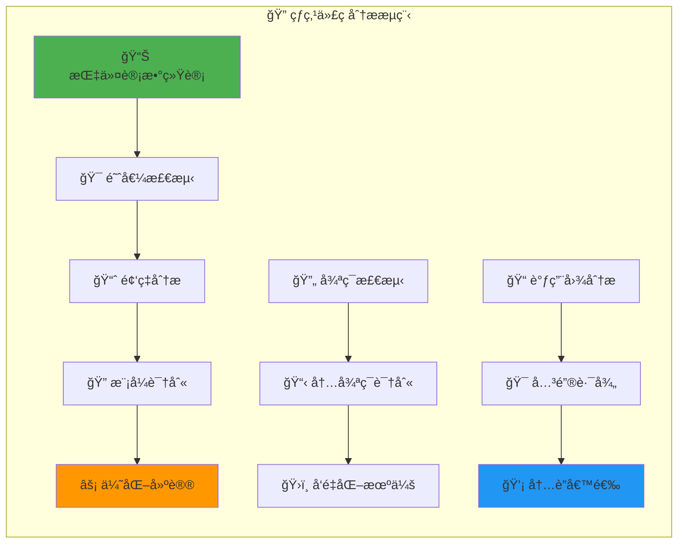
```mermaid
graph LR
    subgraph "🔠热点代ç åˆ†ææµç¨‹"
        A[📊 指令计数统计] --> B[🯠阈值检测]
        B --> C[📈 频ç‡åˆ†æ]
        C --> D[🔠模å¼è¯†åˆ«]
        D --> E[⚡ 优化建议]
        
        F[🔄 循ç¯æ£€æµ‹] --> G[📋 内循ç¯è¯†åˆ«]
        G --> H[ğŸ›ï¸ å‘é‡åŒ–机会]
        
        I[📠调用图分æ] --> J[🯠关键路径]
        J --> K[💡 内è”候选]
    end
    
    style A fill:#4caf50
    style E fill:#ff9800
    style K fill:#2196f3
```

### 💡 å®ç”¨æ€§èƒ½ä¼˜åŒ–指å—

#### 🯠代ç ç¼–写最佳å®è·µ
```lua
-- ⚡ 性能优化的Lua编程技巧

-- 📊 1. 局部å˜é‡ä¼˜åŒ–
local print = print  -- 🯠局部化全局函数，å‡å°‘查找开销
local table_insert = table.insert  -- 📋 缓存表函数

-- 🔄 2. 循ç¯ä¼˜åŒ–
local n = #array
for i = 1, n do  -- 🯠预计算长度，é¿å…é‡å¤è°ƒç”¨#æ“作符
  process(array[i])
end

-- 📊 3. 表访问优化  
local config = {
  host = "localhost",
  port = 8080,
  timeout = 30
}
-- ✅ 好的åšæ³•ï¼šä¸€æ¬¡æ€§è®¿é—®
local host, port, timeout = config.host, config.port, config.timeout

-- ⌠é¿å…çš„åšæ³•ï¼šé‡å¤è¡¨æŸ¥æ‰¾
-- for i = 1, 100 do
--   connect(config.host, config.port)  -- 🌠æ¯æ¬¡å¾ªç¯éƒ½æŸ¥æ‰¾è¡¨
-- end

-- 🔄 4. 字符串æ“作优化
-- ✅ 使用表è¿æ¥æ›¿ä»£å­—符串è¿æ¥
local parts = {}
for i = 1, 1000 do
  parts[i] = "item" .. i
end
local result = table.concat(parts)  -- 🚀 高效è¿æ¥

-- 📠5. 函数调用优化
-- ✅ å‡å°‘函数调用层次
local function process_batch(items)
  local results = {}
  for i = 1, #items do
    results[i] = items[i] * 2  -- 🯠直æ¥è®¡ç®—，é¿å…函数调用
  end
  return results
end
```

#### 🔧 虚拟机é…置优化
```c
/* 虚拟机性能调优å‚æ•° */
#define LUA_OPTIMIZATION_CONFIG

#ifdef LUA_OPTIMIZATION_CONFIG
/* 📊 栈大å°ä¼˜åŒ– */
#define LUAI_MAXSTACK    65536    /* 🔄 å¢å¤§æ ˆå®¹é‡ï¼Œå‡å°‘栈扩展 */
#define LUAI_MAXCALLS    2000     /* 📠å¢å¤§è°ƒç”¨æ·±åº¦é™åˆ¶ */

/* 🯠寄存器优化 */
#define LUAI_MAXVARS     1000     /* 📋 å¢å¤§å±€éƒ¨å˜é‡é™åˆ¶ */
#define LUAI_MAXUPVALUES 255      /* â¬†ï¸ å¢å¤§ä¸Šå€¼æ•°é‡ */

/* âš¡ 内存管ç†ä¼˜åŒ– */
#define LUA_USE_APICHECK 0        /* 🚫 生产ç¯å¢ƒå…³é—­API检查 */
#define LUA_USE_ASSERT   0        /* 🚫 关闭断言检查 */

/* 🔧 编译器优化æ示 */
#ifdef __GNUC__
#define LUA_LIKELY(x)    __builtin_expect(!!(x), 1)    /* 🯠分支预测 */
#define LUA_UNLIKELY(x)  __builtin_expect(!!(x), 0)    /* 🯠分支预测 */
#define LUA_INLINE       __attribute__((always_inline)) /* 🚀 å¼ºåˆ¶å†…è” */
#else
#define LUA_LIKELY(x)    (x)
#define LUA_UNLIKELY(x)  (x)  
#define LUA_INLINE       inline
#endif

#endif /* LUA_OPTIMIZATION_CONFIG */
```

## 📠学习路径ä¸å®æˆ˜åº”用

### 📚 深入学习建议

#### 🯠学习阶段规划
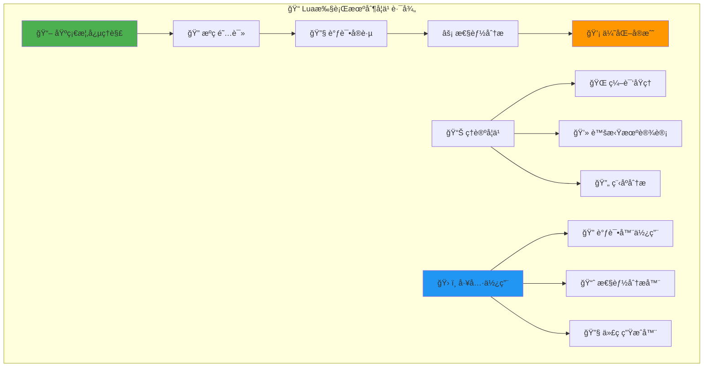
```mermaid
graph TB
    subgraph "📠Lua执行机制学习路径"
        A[📖 基础概念ç†è§£] --> B[🔠æºç é˜…读]
        B --> C[🔧 调试å®è·µ]
        C --> D[âš¡ 性能分æ]
        D --> E[💡 优化å®æˆ˜]
        
        F[📊 ç†è®ºå­¦ä¹ ] --> G[🌠编译åŸç†]
        F --> H[💻 虚拟机设计]
        F --> I[🔄 程åºåˆ†æ]
        
        J[ğŸ› ï¸ å·¥å…·ä½¿ç”¨] --> K[🔠调试器使用]
        J --> L[📈 性能分æ器]
        J --> M[🔧 代ç ç”Ÿæˆå™¨]
    end
    
    style A fill:#4caf50
    style E fill:#ff9800
    style J fill:#2196f3
```

#### 🔧 调试ä¸åˆ†æ工具
```bash
# 🔠Lua执行分æ工具链

# 1. 字节ç å汅编工具
luac -l script.lua                    # 📊 查看字节ç 
luac -l -l script.lua                 # 📋 详细字节ç ä¿¡æ¯

# 2. 性能分æ工具
lua -j profile script.lua             # â±ï¸ LuaJIT性能分æ
valgrind --tool=callgrind lua script.lua  # 🔠调用图分æ

# 3. 内存分æ工具
valgrind --tool=massif lua script.lua  # 📊 内存使用分æ
lua -j memprof script.lua             # 🧠 内存分æ器

# 4. 自定义调试版本编译
make CFLAGS="-DLUA_USE_APICHECK -DLUA_USE_ASSERT -g -O0"  # 🔧 调试版本
```

#### 📊 å®éªŒé¡¹ç›®å»ºè®®
```lua
-- 🧪 性能测试å®éªŒé¡¹ç›®

-- 1. 🔄 函数调用开销测试
local function test_call_overhead()
  local function empty_func() end
  local function func_with_params(a, b, c) return a + b + c end
  
  -- 测试直æ¥è°ƒç”¨ vs é—´æ¥è°ƒç”¨
  local start_time = os.clock()
  for i = 1, 1000000 do
    empty_func()
  end
  local direct_time = os.clock() - start_time
  
  -- 分æ结æœ...
end

-- 2. 📊 表访问性能测试
local function test_table_access()
  local large_table = {}
  for i = 1, 10000 do
    large_table[i] = i * 2
  end
  
  -- 顺åºè®¿é—® vs éšæœºè®¿é—®
  -- 数组访问 vs 哈希访问
  -- ...
end

-- 3. 🯠字符串æ“作性能测试
local function test_string_operations()
  -- 字符串è¿æ¥æ–¹æ³•æ¯”较
  -- 模å¼åŒ¹é…性能测试
  -- 字符串æ’值性能
  -- ...
end
```

### 🌟 相关文档链æ¥

#### 📚 深度学习资æº
- 🯠**核心执行组件**
  - [📋 虚拟机状æ€ç®¡ç†](wiki_vm_state.md) - 执行状æ€çš„完整生命周期
  - [âš¡ 虚拟机核心](wiki_vm.md) - 虚拟机æ¶æ„ä¸æŒ‡ä»¤ç³»ç»Ÿ
  - [🔧 函数执行器](wiki_do.md) - dofile/dostring的执行机制

- 📊 **编译æµç¨‹ç»„件**  
  - [🔤 è¯æ³•åˆ†æ器](wiki_lexer.md) - Token识别ä¸å¤„ç†
  - [🌳 语法分æ器](wiki_parser.md) - ASTæ„建ä¸è¯­æ³•åˆ¶å¯¼ç¿»è¯‘
  - [🔧 代ç ç”Ÿæˆå™¨](wiki_code.md) - 字节ç ç”Ÿæˆä¸ä¼˜åŒ–

- ğŸ›ï¸ **è¿è¡Œæ—¶ç³»ç»Ÿ**
  - [📠函数调用机制](wiki_call.md) - 函数调用ä¸å‚数传递
  - [💾 字节ç ç³»ç»Ÿ](wiki_bytecode.md) - 指令格å¼ä¸æ‰§è¡Œæ¨¡å‹
  - [🔧 æ“作ç è¯¦è§£](wiki_opcodes.md) - 所有指令的详细说æ˜

- âš¡ **性能ä¸ä¼˜åŒ–**
  - [â™»ï¸ åƒåœ¾å›æ”¶å™¨](wiki_gc.md) - 内存管ç†ä¸å›æ”¶ç­–ç•¥  
  - [📊 表å®ç°](wiki_table.md) - 高效的表数æ®ç»“æ„
  - [🧠 内存管ç†](wiki_memory.md) - 内存分é…ä¸ä¼˜åŒ–

#### 🔗 外部å‚考资æº
- 📖 [Lua官方文档](http://www.lua.org/docs.html) - æƒå¨è¯­è¨€å‚考
- 📠[编译åŸç†æ•™ç¨‹](https://craftinginterpreters.com/) - 解释器设计指å—
- 💡 [虚拟机设计模å¼](https://www.lua.org/doc/jucs05.pdf) - Lua VM论文
- 🚀 [性能优化指å—](https://www.lua.org/gems/) - Lua性能优化技巧

---

## 📋 总结

### 🯠核心è¦ç‚¹å›é¡¾

通过深入分æ`print("Hello, World")`这个简å•è¯­å¥çš„完整执行过程，我们æ­ç¤ºäº†Lua执行引æ“的精妙设计：

#### ⚡ 关键技术亮点
1. **🔤 è¯æ³•åˆ†æ**：高效的字符æµå¤„ç†ä¸Token识别
2. **🌳 语法分æ**：边解æ边生æˆçš„语法制导翻译  
3. **🔧 代ç ç”Ÿæˆ**：优化的字节ç ç”Ÿæˆä¸å¯„存器分é…
4. **âš¡ 虚拟机执行**：基äºå¯„存器的高性能指令执行
5. **📠函数调用**：çµæ´»çš„调用栈管ç†ä¸å°¾è°ƒç”¨ä¼˜åŒ–

#### 📠学习收è·
- ç†è§£äº†ç¼–译器å‰ç«¯åˆ°å端的完整æµç¨‹
- æŒæ¡äº†è™šæ‹Ÿæœºè®¾è®¡çš„核心åŸç†
- 学会了性能分æä¸ä¼˜åŒ–的方法
- è·å¾—了系统性的æºç é˜…读能力

#### 🚀 å®é™…应用价值
- **📊 性能优化**：针对性地优化Lua代ç æ€§èƒ½
- **🔧 工具开å‘**：开å‘Lua相关的开å‘工具
- **💡 语言设计**：借鉴Lua的设计æ€æƒ³
- **🯠系统集æˆ**：更好地将Lua集æˆåˆ°C/C++项目

这个执行æµç¨‹çš„深入分æ为我们æ供了ç†è§£ç°ä»£è§£é‡Šå™¨è®¾è®¡çš„å®è´µè§†è§’，展ç°äº†Lua作为嵌入å¼è„šæœ¬è¯­è¨€çš„精巧设计ç†å¿µã€‚✨